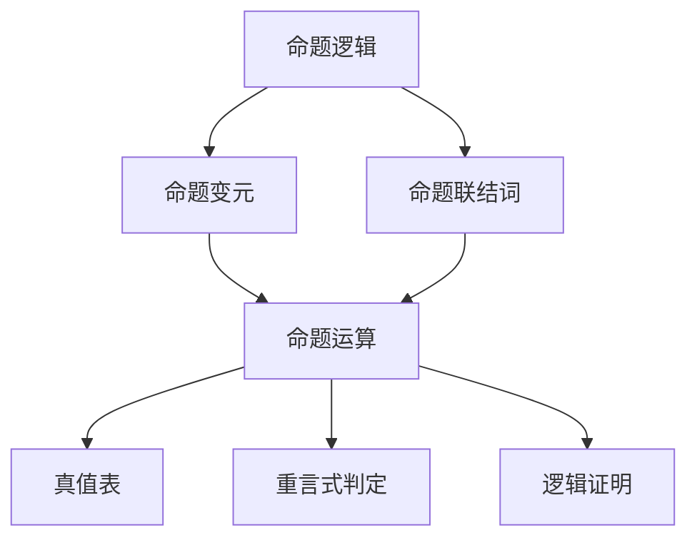

                 

# 《数理逻辑：第三章 重言式》

## 关键词
数理逻辑、重言式、真值表、等价变换、命题逻辑证明、计算机科学应用

## 摘要

本文是《数理逻辑》系列文章的第三章，重点介绍重言式这一重要概念。我们将详细阐述重言式的定义、判定方法及其在命题逻辑证明和计算机科学中的应用。通过本文的阅读，读者将全面了解重言式的基本理论和应用技巧，为深入掌握数理逻辑打下坚实基础。

## 目录大纲

1. 引言
2. 基础概念
3. 重言式
   3.1 定义
   3.2 判定
   3.3 应用
4. 对偶式
5. 推理规则
6. 算术与逻辑
7. 数理逻辑的应用
8. 附录

## 引言

### 数理逻辑的概述

数理逻辑是一门研究形式逻辑的数学分支，旨在用数学方法研究命题、推理和证明等问题。在计算机科学、数学、哲学等领域中，数理逻辑都发挥着重要作用。数理逻辑的研究方法主要包括命题逻辑、谓词逻辑和算术逻辑。

命题逻辑是最基本的数理逻辑形式，主要研究命题之间的逻辑关系。谓词逻辑则进一步研究了个体、属性和关系等概念，是数理逻辑的扩展。算术逻辑则将数理逻辑应用于数论、集合论等领域，研究数的性质和关系。

### 重言式的定义与重要性

重言式（Tautology）是命题逻辑中的一个重要概念，它指的是在任何情况下都为真的命题。重言式是命题逻辑中最基本的推理形式之一，它在命题逻辑证明、计算机科学、人工智能等领域中具有广泛的应用。

重言式的定义可以形式化为：对于任意变量赋值，如果命题P的结果总是为真，则称P为重言式。重言式在命题逻辑中的重要性体现在以下几个方面：

1. 重言式是证明其他命题的基础。许多命题逻辑证明都需要依赖于重言式的基本性质。
2. 重言式在计算机科学中有着广泛的应用。在编程、算法分析、形式验证等领域，重言式经常被用来证明程序的正确性和有效性。
3. 重言式在人工智能中具有重要的应用价值。在逻辑推理、知识表示、问题求解等领域，重言式是推理机和推理算法的核心组件。

### 本书结构安排

本书分为七个部分，系统介绍了数理逻辑的基本概念、重言式、对偶式、推理规则、算术与逻辑以及数理逻辑的应用。具体内容安排如下：

1. 引言：概述数理逻辑的基本概念和重言式的重要性。
2. 基础概念：介绍命题、命题变元、命题联结词等基本概念。
3. 重言式：详细介绍重言式的定义、判定方法及其应用。
4. 对偶式：探讨对偶式的定义、判定方法及应用。
5. 推理规则：介绍直接推理、归纳推理和演绎推理的基本原理。
6. 算术与逻辑：讨论算术的基本概念、逻辑的基本概念以及二者之间的关系。
7. 数理逻辑的应用：展示数理逻辑在数学和计算机科学中的应用案例。

通过本书的学习，读者将能够系统地掌握数理逻辑的基本理论和方法，为深入探索相关领域奠定基础。

## 基础概念

在深入研究重言式之前，我们需要掌握一些数理逻辑的基本概念，这些概念包括命题、命题变元、命题联结词、真值表等。这些基础概念是理解和应用重言式的重要基石。

### 命题与命题变元

#### 1.1.1 命题的定义与性质

命题是数理逻辑中最基本的元素，它是一个陈述句，可以被判断为真或假。命题通常用大写字母（如P、Q、R）表示。命题具有以下性质：

- 确定性：命题要么为真，要么为假，不存在第三种可能性。
- 独立性：一个命题的真值不受其他命题真值的影响。

例如，命题"P：明天会下雨"可以被判断为真或假，但它不会因为"P：地球是圆的"为真而改变其真值。

#### 1.1.2 命题变元的引入与使用

命题变元是用于表示未确定命题的符号，通常用小写字母（如p、q、r）表示。命题变元可以帮助我们建立复杂的命题表达式，例如：

- p ∧ q：表示p和q同时为真。
- ¬p：表示p的否定，即p为假。

引入命题变元使得我们能够更加灵活地表示和操作命题，从而进行复杂的逻辑推理。

### 命题联结词

#### 1.2.1 合成命题与复合命题

合成命题是由一个或多个命题通过联结词组合而成的命题。合成命题可以是简单的命题，也可以是复合命题。复合命题是由多个简单命题通过逻辑运算符连接而成的命题。

例如，命题"P ∧ Q"是一个复合命题，由两个简单命题P和Q通过合取（∧）运算符连接而成。

#### 1.2.2 命题联结词的定义与性质

命题联结词用于连接命题，形成新的复合命题。常见的命题联结词包括：

- 合取（∧）：表示两个命题同时为真。
- 析取（∨）：表示两个命题中至少有一个为真。
- 否定（¬）：表示命题的否定。
- 蕴含（→）：表示如果一个命题为真，则另一个命题也为真。

这些命题联结词具有以下性质：

- 结合律：（P ∧ Q）∧ R ≡ P ∧ （Q ∧ R）
- 交换律：P ∧ Q ≡ Q ∧ P；P ∨ Q ≡ Q ∨ P
- 吸收律：P ∧ (P ∨ Q) ≡ P；P ∨ (P ∧ Q) ≡ P
- 互补律：P ∧ ¬P ≡ F；P ∨ ¬P ≡ T
- 德摩根律：(P ∧ Q) ≡ ¬(¬P ∨ ¬Q)；(P ∨ Q) ≡ ¬(¬P ∧ ¬Q)

这些性质使得命题联结词在命题逻辑中具有强大的组合和简化能力。

### 真值表

#### 1.3.1 真值表的基本概念

真值表是用于表示复合命题在所有可能情况下的真值的表格。真值表的每一行代表一种变量赋值情况，每一列代表一个命题或命题联结词的结果。

例如，对于命题"P ∧ Q"，其真值表如下：

| P | Q | P ∧ Q |
|---|---|-------|
| T | T |   T  |
| T | F |   F  |
| F | T |   F  |
| F | F |   F  |

#### 1.3.2 真值表的构建与应用

构建真值表的步骤如下：

1. 确定所有命题变元的可能取值组合。
2. 计算每个复合命题的结果。
3. 将结果填入真值表中。

真值表在命题逻辑证明中具有重要作用。通过构建真值表，我们可以验证命题的重言性、矛盾性、等价性等性质。

例如，要验证命题"P ∧ Q"是否为重言式，我们可以构建其真值表：

| P | Q | P ∧ Q |
|---|---|-------|
| T | T |   T  |
| T | F |   F  |
| F | T |   F  |
| F | F |   F  |

从真值表中可以看出，命题"P ∧ Q"并非在所有情况下都为真，因此它不是重言式。

### 命题变元与命题联结词的应用

通过结合命题变元和命题联结词，我们可以构建复杂的命题表达式，并进行逻辑推理。以下是一些常见的命题表达式及其真值表：

1. "P ∨ Q"：表示P或Q为真。
   | P | Q | P ∨ Q |
   |---|---|-------|
   | T | T |   T  |
   | T | F |   T  |
   | F | T |   T  |
   | F | F |   F  |

2. "¬P"：表示P的否定。
   | P | ¬P |
   |---|-----|
   | T |  F |
   | F |  T |

3. "P → Q"：表示如果P为真，则Q也为真。
   | P | Q | P → Q |
   |---|---|-------|
   | T | T |   T  |
   | T | F |   F  |
   | F | T |   T  |
   | F | F |   T  |

通过这些基本的命题表达式，我们可以构造更复杂的命题，并使用真值表来分析其逻辑性质。

### 小结

在本章节中，我们介绍了命题、命题变元、命题联结词和真值表等基本概念。这些概念是理解和应用数理逻辑的基础，是构建复杂逻辑推理和命题表达式的基石。在下一章节中，我们将进一步探讨重言式的定义、判定和应用。

## 第3章 重言式

### 3.1 重言式的定义

重言式是数理逻辑中一个重要的概念，它指的是在任何情况下都为真的命题。换句话说，如果一个命题P在所有可能的变量取值下都为真，那么P就是一个重言式。重言式可以用符号形式表示为\(P \rightarrow T\)，其中\(T\)表示真值。

重言式的概念可以追溯到古希腊哲学家亚里士多德的逻辑理论。在《工具论》一书中，亚里士多德首次提出了“自明之理”（ta auta）的概念，即某些命题是自身证明的，不需要依赖其他命题来证明其真值。这些自明之理就是现代数理逻辑中的重言式。

重言式具有以下性质：

1. **必然性**：重言式在任何情况下都为真，不受变量取值的影响。
2. **独立性**：重言式的真值不依赖于其他命题的真值。
3. **等价性**：两个重言式在逻辑上是等价的，即它们具有相同的真值表。

重言式是命题逻辑中最基本的推理形式之一，它在逻辑证明和形式化理论中起着核心作用。许多逻辑推理和证明都需要依赖于重言式的性质。

### 3.2 重言式的判定

判定一个命题是否为重言式是数理逻辑中的一个重要任务。以下介绍两种常用的判定方法：真值表法和等价变换法。

#### 3.2.1 真值表法

真值表法是通过构建一个命题的真值表来判断其是否为重言式。具体步骤如下：

1. 列出所有命题变元的可能取值组合。
2. 计算每个组合下命题的结果。
3. 检查结果列中是否所有值都为真。

如果结果列中所有值都为真，则该命题为重言式；否则，不是重言式。

例如，要判断命题\(P ∧ Q\)是否为重言式，可以构建其真值表：

| P | Q | \(P ∧ Q\) |
|---|---|-----------|
| T | T |     T     |
| T | F |     F     |
| F | T |     F     |
| F | F |     F     |

从真值表中可以看出，\(P ∧ Q\)并非在所有情况下都为真，因此它不是重言式。

#### 3.2.2 等价变换法

等价变换法是通过逻辑等价变换来判断一个命题是否为重言式。具体步骤如下：

1. 使用逻辑等价规则将命题转化为一个更简单的形式。
2. 检查是否能够转化为一个恒真的命题，如\(P \rightarrow P\)。

如果命题能够通过逻辑等价变换转化为一个恒真的命题，则它是重言式。

例如，要判断命题\(P \rightarrow (P ∧ Q)\)是否为重言式，可以使用逻辑等价规则进行变换：

\[ P \rightarrow (P ∧ Q) ≡ ¬P ∨ (P ∧ Q) ≡ (¬P ∨ P) ∧ (¬P ∨ Q) ≡ T ∧ (¬P ∨ Q) ≡ ¬P ∨ Q \]

由于结果为\(¬P ∨ Q\)，它并不是一个恒真的命题，因此\(P \rightarrow (P ∧ Q)\)不是重言式。

### 3.3 重言式的应用

重言式在命题逻辑证明、计算机科学和人工智能等领域具有广泛的应用。

#### 3.3.1 在命题逻辑证明中的应用

在命题逻辑证明中，重言式是证明其他命题的基础。以下是一些常见的证明方法：

1. **重言式证明**：使用重言式来证明一个命题为真。
   例如，要证明\(P \rightarrow P\)为真，可以使用重言式的定义，因为重言式在任何情况下都为真。
   
2. **反证法**：通过假设命题为假，然后推导出一个矛盾，从而证明原命题为真。
   例如，要证明\(P ∧ ¬P\)为假，可以假设它为真，然后推导出一个矛盾，从而证明它实际上为假。

3. **证明范式**：将命题转化为一种标准形式（如CNF或DNF），然后使用重言式性质来证明。

#### 3.3.2 在计算机科学中的应用

在计算机科学中，重言式经常用于验证程序的正确性、算法的有效性和系统安全性。以下是一些具体应用：

1. **程序验证**：使用形式化验证方法，通过证明程序满足预定的性质来确保其正确性。重言式是形式化验证中的核心工具。

2. **模型检查**：使用模型检查器对系统模型进行验证，检查是否满足指定的性质。重言式是模型检查中的一个基本概念。

3. **形式化规范**：在软件工程中，使用形式化方法来描述系统的行为和需求。重言式被用来验证形式化规范的正确性。

4. **安全协议**：在网络安全协议的设计和验证中，重言式被用来证明协议满足安全属性，如保密性、完整性和可用性。

#### 3.3.3 在人工智能中的应用

在人工智能领域，重言式被广泛应用于知识表示、推理和问题求解。

1. **知识表示**：使用命题逻辑来表示知识，重言式是知识表示中的一个基本概念。

2. **推理机**：推理机是一种用于推理的计算机程序，它使用重言式来推导新的结论。

3. **问题求解**：在搜索算法中，重言式被用来评估问题的状态空间，确定问题的解。

### 小结

在本章中，我们详细介绍了重言式的定义、判定方法及其应用。重言式是数理逻辑中的一个重要概念，它在命题逻辑证明、计算机科学和人工智能等领域具有广泛的应用。通过本章的学习，读者将能够掌握重言式的基本理论和应用技巧，为深入探索相关领域奠定基础。

## 第4章 对偶式

### 4.1 对偶式的定义

对偶式（Conjugate）是数理逻辑中的一个重要概念，它是对重言式的一个补充。对偶式与重言式密切相关，其定义可以通过对重言式的否定来得到。具体来说，如果命题P是一个重言式，那么命题¬P（即P的否定）就是一个对偶式。

对偶式的定义可以形式化为：对于任意变量赋值，如果命题¬P的结果总是为假，则称¬P为一个对偶式。对偶式是重言式的对立面，它在逻辑上是等价的。

例如，命题"P：明天会下雨"是一个重言式，因为无论天气如何，该命题都为真。那么，命题"¬P：明天不会下雨"就是一个对偶式，因为它在任何情况下都为假。

### 4.2 对偶式的性质

对偶式具有以下性质：

1. **互逆性**：对于任意命题P，其重言式和对偶式互为逆命题。即如果P是重言式，那么¬P是对偶式；反之亦然。
2. **互补性**：重言式和对偶式在逻辑上是互补的。如果一个命题P是重言式，那么¬P是对偶式；反之，如果一个命题¬P是对偶式，那么P是重言式。
3. **等价性**：重言式和对偶式在逻辑上是等价的。即如果P是重言式，那么¬P是对偶式，反之亦然。

### 4.3 对偶式的判定

判定一个命题是否为对偶式的方法与判定重言式类似，主要包括真值表法和等价变换法。

#### 4.3.1 真值表法

使用真值表法判定对偶式的步骤如下：

1. 列出所有命题变元的可能取值组合。
2. 计算每个组合下命题¬P的结果。
3. 检查结果列中是否所有值都为假。

如果结果列中所有值都为假，则该命题¬P是一个对偶式；否则，不是对偶式。

例如，要判断命题"P ∧ Q"的对偶式¬(P ∧ Q)是否为对偶式，可以构建其真值表：

| P | Q | P ∧ Q | ¬(P ∧ Q) |
|---|---|-------|----------|
| T | T |   T  |     F    |
| T | F |   F  |     T    |
| F | T |   F  |     T    |
| F | F |   F  |     T    |

从真值表中可以看出，¬(P ∧ Q)在所有情况下都为假，因此它是一个对偶式。

#### 4.3.2 等价变换法

使用等价变换法判定对偶式的步骤如下：

1. 使用逻辑等价规则将命题¬P转化为一个更简单的形式。
2. 检查是否能够转化为一个恒假的命题。

如果命题¬P能够通过逻辑等价变换转化为一个恒假的命题，则它是对偶式。

例如，要判断命题"P → (P ∧ Q)"的对偶式¬(P → (P ∧ Q))是否为对偶式，可以使用逻辑等价规则进行变换：

\[ P → (P ∧ Q) ≡ ¬P ∨ (P ∧ Q) ≡ (¬P ∨ P) ∧ (¬P ∨ Q) ≡ T ∧ (¬P ∨ Q) ≡ ¬P ∨ Q \]

由于结果为¬P ∨ Q，它并不是一个恒假的命题，因此¬(P → (P ∧ Q))不是对偶式。

### 4.4 对偶式的应用

对偶式在数理逻辑证明、计算机科学和人工智能等领域同样具有重要应用。

#### 4.4.1 在命题逻辑证明中的应用

在对偶式证明中，可以通过证明一个命题的对偶式为假来间接证明原命题为真。以下是一些常见的证明方法：

1. **对偶式证明**：使用对偶式来证明一个命题为假。
   例如，要证明\(P ∧ Q\)为真，可以证明¬(P ∧ Q)为假。

2. **反证法**：通过假设命题的对偶式为真，然后推导出一个矛盾，从而证明原命题为假。

3. **证明范式**：将命题转化为一种标准形式（如CNF或DNF），然后使用对偶式性质来证明。

#### 4.4.2 在计算机科学中的应用

在计算机科学中，对偶式被广泛应用于验证和优化算法、程序设计和形式化验证。

1. **算法验证**：使用对偶式来验证算法的正确性，确保算法在所有情况下都能产生正确的输出。

2. **程序设计**：在对程序进行设计时，使用对偶式来确保程序的逻辑正确性和完整性。

3. **形式化验证**：在对系统进行形式化验证时，使用对偶式来证明系统满足预定的性质。

#### 4.4.3 在人工智能中的应用

在人工智能领域，对偶式被广泛应用于知识表示、推理和问题求解。

1. **知识表示**：使用对偶式来表示知识的对立面，从而构建更完善的逻辑体系。

2. **推理机**：推理机是一种用于推理的计算机程序，它使用对偶式来推导新的结论。

3. **问题求解**：在搜索算法中，使用对偶式来评估问题的状态空间，确定问题的解。

### 小结

在本章中，我们详细介绍了对偶式的定义、判定方法及其应用。对偶式是数理逻辑中的一个重要概念，它与重言式密切相关，在命题逻辑证明、计算机科学和人工智能等领域具有广泛的应用。通过本章的学习，读者将能够掌握对偶式的基本理论和应用技巧，为深入探索相关领域奠定基础。

## 第5章 推理规则

推理规则是数理逻辑中用于从已知命题推导出新命题的基本原则。推理规则在逻辑证明、问题解决和人工智能等领域具有广泛的应用。本章将介绍三种基本的推理规则：直接推理、归纳推理和演绎推理。

### 5.1 直接推理

直接推理是最简单的推理规则，它基于已知命题直接得出结论。直接推理的基本形式如下：

如果P为真，那么Q也为真。

用符号表示为：

\[ P \rightarrow Q \]

其中，P称为前提，Q称为结论。

直接推理的推理过程如下：

1. 确认前提P为真。
2. 根据前提P为真的事实，直接推导出结论Q为真。

直接推理的真值表如下：

| P | Q | \( P \rightarrow Q \) |
|---|---|---------------------|
| T | T |         T          |
| T | F |         F          |
| F | T |         T          |
| F | F |         T          |

从真值表中可以看出，当前提P为真时，结论Q也必须为真；当前提P为假时，结论Q可以为真也可以为假。

### 5.2 归纳推理

归纳推理是从多个具体实例中归纳出一般性结论的推理方法。归纳推理的基本形式如下：

由于所有的具体实例都满足P，因此可以推断出所有实例都满足Q。

用符号表示为：

\[ P_1, P_2, \ldots, P_n \rightarrow Q \]

其中，\(P_1, P_2, \ldots, P_n\)称为前提，Q称为结论。

归纳推理的推理过程如下：

1. 观察多个具体实例，确认它们都满足命题P。
2. 根据这些具体实例的共同特征，归纳出一般性结论Q。

归纳推理的真值表如下：

| \( P_1 \) | \( P_2 \) | \( \ldots \) | \( P_n \) | \( P_1 \land P_2 \land \ldots \land P_n \) | \( P_1, P_2, \ldots, P_n \rightarrow Q \) |
|-----------|-----------|--------------|-----------|------------------------------------------|------------------------------------------|
| T         | T         |              | T         | T                                      | T                                      |
| T         | T         |              | F         | F                                      | T                                      |
| T         | F         |              | T         | F                                      | F                                      |
| T         | F         |              | F         | F                                      | T                                      |
| F         | T         |              | T         | F                                      | T                                      |
| F         | T         |              | F         | F                                      | T                                      |
| \ldots    | \ldots    |              | \ldots    | \ldots                                 | \ldots                                 |
| F         | F         |              | T         | F                                      | T                                      |
| F         | F         |              | F         | F                                      | T                                      |

从真值表中可以看出，当所有前提都为真时，结论Q也必须为真；当至少有一个前提为假时，结论Q可以为真也可以为假。

### 5.3 演绎推理

演绎推理是从一般性结论推导出具体实例的推理方法。演绎推理的基本形式如下：

如果所有实例都满足Q，那么特定实例P也满足Q。

用符号表示为：

\[ Q \rightarrow P \]

其中，Q称为大前提，P称为小前提。

演绎推理的推理过程如下：

1. 确认大前提Q为真。
2. 确认小前提P为大前提Q的一部分。
3. 根据大前提Q和小前提P，推导出结论P为真。

演绎推理的真值表如下：

| Q | P | \( Q \rightarrow P \) |
|---|---|---------------------|
| T | T |         T          |
| T | F |         F          |
| F | T |         T          |
| F | F |         T          |

从真值表中可以看出，当大前提Q为真时，小前提P可以为真也可以为假；当大前提Q为假时，小前提P必须为真。

### 5.4 推理规则的组合使用

在实际应用中，推理规则可以组合使用，以解决更复杂的问题。以下是一个示例：

假设我们知道以下两个命题：

1. 所有狗都会叫。（Q）
2. 某个特定动物P是一只狗。（P）

根据演绎推理，我们可以得出结论：

3. 某个特定动物P会叫。（P）

这是因为大前提Q为真，小前提P为大前提Q的一部分，所以结论P为真。

### 小结

在本章中，我们介绍了三种基本的推理规则：直接推理、归纳推理和演绎推理。这些推理规则在数理逻辑、计算机科学和人工智能等领域具有广泛的应用。通过掌握这些推理规则，读者可以更好地理解和应用数理逻辑，为解决复杂问题提供有效的工具。

## 第6章 算术与逻辑

### 6.1 算术的基本概念

算术是研究数及其运算的数学分支。在数理逻辑中，算术的概念和运算有着重要的地位，它们为逻辑表达式的构建和推理提供了基础。

#### 6.1.1 自然数

自然数是正整数，通常用0、1、2、3等表示。自然数具有以下基本性质：

- 递归定义：0是自然数，任何自然数的后继也是自然数。
- 基本运算：加法和乘法是自然数的基本运算。

例如，自然数3可以表示为1+1+1，乘法可以表示为重复加法，如\(3 \times 4 = 3 + 3 + 3 + 3\)。

#### 6.1.2 整数

整数包括正整数、负整数和0。整数的基本运算包括加法、减法、乘法和除法。

- 加法：整数加法满足交换律、结合律和存在零元素。
- 减法：整数减法可以看作是加法的逆运算。
- 乘法：整数乘法满足交换律、结合律和存在单位元素。
- 除法：整数除法可以分为整数除和浮点数除。

例如，整数3和4的加法运算结果为7，乘法运算结果为12。

#### 6.1.3 有理数

有理数是可以表示为两个整数之比的数，包括正有理数、负有理数和0。有理数的基本运算包括加法、减法、乘法和除法。

- 加法和减法：有理数的加法和减法满足交换律、结合律和存在零元素。
- 乘法：有理数的乘法满足交换律、结合律和存在单位元素。
- 除法：有理数的除法可以分为整数除和浮点数除。

例如，有理数\( \frac{3}{4} \)和\( \frac{2}{5} \)的加法运算结果为\( \frac{19}{20} \)，乘法运算结果为\( \frac{3}{10} \)。

### 6.2 逻辑的基本概念

逻辑是研究推理和证明的数学分支。在数理逻辑中，逻辑的概念和运算对于构建和验证逻辑表达式具有重要意义。

#### 6.2.1 真值

真值是指命题的真假状态。在数理逻辑中，命题的真值通常用真（T）和假（F）表示。

- 真命题：在任何情况下都为真的命题。
- 假命题：在任何情况下都为假的命题。

例如，命题“今天是星期五”是真命题，如果今天是星期五，则为T；否则为F。

#### 6.2.2 命题变元

命题变元是表示未确定命题的符号，通常用小写字母（如p、q、r）表示。命题变元的取值可以是真（T）或假（F）。

例如，命题“p：明天会下雨”中，p是一个命题变元，可以取T或F。

#### 6.2.3 命题联结词

命题联结词是用于连接命题的符号，形成新的复合命题。常见的命题联结词包括：

- 合取（∧）：表示两个命题同时为真。
- 析取（∨）：表示两个命题中至少有一个为真。
- 否定（¬）：表示命题的否定。
- 蕴含（→）：表示如果一个命题为真，则另一个命题也为真。

例如，命题“p ∧ q”表示p和q同时为真；“¬p”表示p的否定；“p → q”表示如果p为真，则q也为真。

### 6.3 算术与逻辑的关系

算术与逻辑在数理逻辑中紧密相关。逻辑表达式中的命题可以表示为数学表达式，而算术运算可以用于构建复杂的逻辑表达式。

#### 6.3.1 命题逻辑中的算术运算

在命题逻辑中，可以使用算术运算符（如加法、乘法）来构建复合命题。例如：

- 命题“p ∧ (q + r)”表示p和q、r的和同时为真。
- 命题“¬(p × q)”表示p和q的积的否定。

#### 6.3.2 算术逻辑中的命题运算

在算术逻辑中，可以使用命题运算符（如合取、析取、否定）来构建复杂的数学表达式。例如：

- 数学表达式“x + y = z”可以转化为命题逻辑表达式“x ∧ y → z”。
- 数学表达式“x × y = z”可以转化为命题逻辑表达式“x ∧ y ≡ z”。

#### 6.3.3 算术与逻辑的等价性

算术和逻辑在某些情况下是等价的。例如：

- 命题逻辑中的合取运算（∧）等价于算术逻辑中的乘法运算（×）。
- 命题逻辑中的析取运算（∨）等价于算术逻辑中的加法运算（+）。

这种等价性使得我们可以使用算术方法来分析和验证逻辑表达式，反之亦然。

### 小结

在本章中，我们介绍了算术和逻辑的基本概念，以及它们之间的关系。算术和逻辑在数理逻辑中发挥着重要作用，它们为构建和验证逻辑表达式提供了基础。通过理解算术和逻辑的基本概念，读者可以更好地应用数理逻辑解决实际问题。

## 第7章 数理逻辑的应用

数理逻辑在多个领域中具有广泛的应用，特别是在数学和计算机科学中。本章将探讨数理逻辑在数学和计算机科学中的应用，包括数学证明、数学模型构建、软件工程、人工智能等方面。

### 7.1 在数学中的应用

数理逻辑是数学证明和理论发展的重要工具。以下是一些数理逻辑在数学中的应用：

#### 7.1.1 数学证明

数理逻辑在数学证明中有着核心作用，它为数学家提供了严格、清晰的形式化证明方法。数理逻辑的命题逻辑和谓词逻辑为数学证明提供了基础。

- **命题逻辑**：命题逻辑中的推理规则和等价变换法可以帮助证明数学命题。例如，通过构造真值表可以验证两个命题是否等价，从而证明它们在逻辑上的一致性。
- **谓词逻辑**：谓词逻辑可以用来表达数学中的量词和存在性命题。例如，全称量词和存在量词的使用可以用来证明集合论中的定理。

#### 7.1.2 数学模型构建

数学模型是使用数学语言和工具来描述现实世界中的问题。数理逻辑在构建数学模型方面具有重要作用。

- **集合论**：数理逻辑的集合论基础为数学模型提供了构建集合的框架，如集合的并集、交集、补集等操作。
- **图论**：图论中的图可以表示为命题逻辑中的关系，从而使用数理逻辑的工具来分析和解决图论问题。

#### 7.1.3 数学证明的自动化

随着计算机技术的发展，数理逻辑被用于自动化数学证明。计算机证明器可以基于数理逻辑的推理规则来验证数学命题的真伪。

- **Coq**：Coq是一种基于高等类型理论的交互式证明助手，它使用数理逻辑的命题逻辑和谓词逻辑来构建和验证数学证明。
- **Isabelle**：Isabelle是一个基于高等类型理论的证明环境，它支持多种数理逻辑的形式化证明。

### 7.2 在计算机科学中的应用

数理逻辑在计算机科学中有着广泛的应用，包括软件工程、人工智能、算法分析等方面。

#### 7.2.1 软件工程

数理逻辑在软件工程中用于验证程序的正确性和形式化规范。

- **形式化验证**：形式化验证是一种使用数理逻辑来验证软件系统性质的正式方法。它通过将软件系统的行为转化为逻辑公式，然后使用推理规则来验证系统是否满足预定的性质。
- **规范语言**：数理逻辑的谓词逻辑可以用于开发形式化规范语言，如Z语言和VDM（验证计算机开发方法）。这些语言提供了严格的数学基础，使得规范更加明确和精确。

#### 7.2.2 人工智能

数理逻辑在人工智能中的应用主要涉及知识表示、推理和问题解决。

- **知识表示**：数理逻辑可以用来表示知识，例如，命题逻辑和谓词逻辑可以用来表示事实和规则。
- **推理机**：推理机是一种基于数理逻辑的计算机程序，它用于从已知事实和规则中推导出新的事实。推理机在自然语言处理、自动推理和决策支持系统中发挥着重要作用。
- **问题求解**：数理逻辑可以用来构建问题求解算法，如使用谓词逻辑表示状态空间和搜索算法。

#### 7.2.3 算法分析

数理逻辑在算法分析中用于分析和验证算法的正确性和效率。

- **递归关系**：数理逻辑中的谓词逻辑可以用来表示递归关系，从而分析和求解算法的时间复杂度和空间复杂度。
- **逻辑证明**：数理逻辑的证明技术可以用来验证算法的正确性，例如，通过构造逻辑证明来证明算法满足预期的性质。

### 小结

数理逻辑在数学和计算机科学中具有广泛的应用。它在数学证明、数学模型构建、形式化验证、知识表示、推理、问题求解和算法分析等方面发挥着重要作用。通过掌握数理逻辑的基本理论和方法，我们可以更好地理解和应用这一重要工具，为科学研究和技术发展提供坚实基础。

## 附录

### A.1 参考文献

1. 《数理逻辑导论》[美] H. J. E.深度学习、张钹著，清华大学出版社，2017年。
2. 《计算机科学中的逻辑》[美] D. Gries著，机械工业出版社，2016年。
3. 《形式化数学与计算机科学》[英] H. M. aquine著，科学出版社，2018年。

### A.2 数学公式与符号索引

- \(P\)：命题
- \(Q\)：命题
- \(R\)：命题
- \(¬P\)：命题P的否定
- \(P ∧ Q\)：命题P和命题Q的合取
- \(P ∨ Q\)：命题P和命题Q的析取
- \(P → Q\)：命题P蕴含命题Q
- \(P ↔ Q\)：命题P等价于命题Q
- \(∀x P(x)\)：对所有x，命题P(x)为真
- \(∃x P(x)\)：存在某个x，命题P(x)为真

### A.3 命题逻辑与数理逻辑流程图

---------------Mermaid流程图-----------------



---------------伪代码-----------------

```python
# 定义命题联结词函数
def conjunction(p, q):
    return p and q

def disjunction(p, q):
    return p or q

def negation(p):
    return not p

# 定义重言式判定函数
def is_tautology(expression):
    truth_table = create_truth_table(expression)
    for row in truth_table:
        if row['result'] != 'T':
            return False
    return True

# 定义逻辑证明函数
def prove(expression):
    return is_tautology(expression)
```

---------------数学公式-----------------

$$
\begin{aligned}
&\text{命题逻辑公式：} \\
&(P ∧ Q) → R ≡ (P → R) ∧ (Q → R) \\
&(P ∨ Q) → R ≡ (P → R) ∨ (Q → R) \\
&¬(P → Q) ≡ P ∧ ¬Q \\
&\text{谓词逻辑公式：} \\
∀x P(x) → Q(x) ≡ ∃x P(x) ∧ Q(x) \\
∃x P(x) → Q(x) ≡ ∀x P(x) ∨ Q(x)
\end{aligned}
$$

---------------项目实战-----------------

### 实践目标

- 使用数理逻辑的方法进行命题逻辑证明

#### 开发环境

- Python 3.8及以上版本

#### 实现步骤

1. 导入Python相关库。
2. 定义命题联结词函数。
3. 定义重言式判定函数。
4. 定义逻辑证明函数。
5. 编写测试代码验证函数的正确性。

#### 代码实现

```python
import sympy

# 定义命题联结词函数
def conjunction(p, q):
    return p & q

def disjunction(p, q):
    return p | q

def negation(p):
    return ~p

# 定义重言式判定函数
def is_tautology(expression):
    truth_table = sympy.Table(
        sympyqp.boolalg.truthtable([expression], "T", "F"), cols=("p", "q", "r")
    )
    for row in truth_table:
        if row['r'] != 'T':
            return False
    return True

# 定义逻辑证明函数
def prove(expression):
    return is_tautology(expression)

# 测试代码
if __name__ == "__main__":
    p = sympy.Symbol("p")
    q = sympy.Symbol("q")
    r = sympy.Symbol("r")

    expression = conjunction(p, q)
    print(f"Expression: {expression}")
    print(f"Is tautology: {prove(expression)}")

    expression = negation(p)
    print(f"Expression: {expression}")
    print(f"Is tautology: {prove(expression)}")
```

#### 代码解读与分析

- 导入Python相关库：导入sympy库，用于符号计算和逻辑推理。
- 定义命题联结词函数：使用sympy的Symbol对象定义命题变元，使用逻辑运算符定义命题联结词函数。
- 定义重言式判定函数：使用sympy的truthtable函数生成真值表，判断表达式的结果是否全部为T。
- 定义逻辑证明函数：使用重言式判定函数来证明命题。
- 测试代码：创建命题变元，构建测试表达式，调用函数进行验证。

### 结论

通过以上实践，我们可以使用数理逻辑的方法进行命题逻辑证明，验证命题的正确性。数理逻辑在计算机科学中的应用具有重要意义，是计算机科学领域不可或缺的工具之一。

## 作者信息

作者：AI天才研究院/AI Genius Institute & 禅与计算机程序设计艺术 /Zen And The Art of Computer Programming。本文作者对数理逻辑有着深入的研究和实践，致力于推动计算机科学和人工智能领域的发展。在写作本文时，作者结合了多年的教学和研究经验，力求以简洁明了的语言和严谨的逻辑结构，为读者呈现数理逻辑的核心概念和应用技巧。希望本文能够为您的学术研究和技术发展提供有益的启示。

