                 

# 第一部分：智能家电概述

## 第1章：智能家电的起源与发展

### 1.1 智能家电的定义

智能家电是指利用物联网技术、传感器技术和软件算法，实现家电产品智能化、网络化和自动化的家电产品。智能家电不仅具有传统家电的基本功能，还能通过互联网进行远程控制和数据交互，提升用户的便捷性和舒适度。

#### 核心概念与联系

智能家电的核心概念包括物联网技术、传感器技术和软件算法。物联网技术是智能家电实现互联互通的基础，传感器技术是智能家电实现环境感知和自动控制的关键，软件算法是智能家电实现智能化控制的核心。

#### 核心概念联系流程图

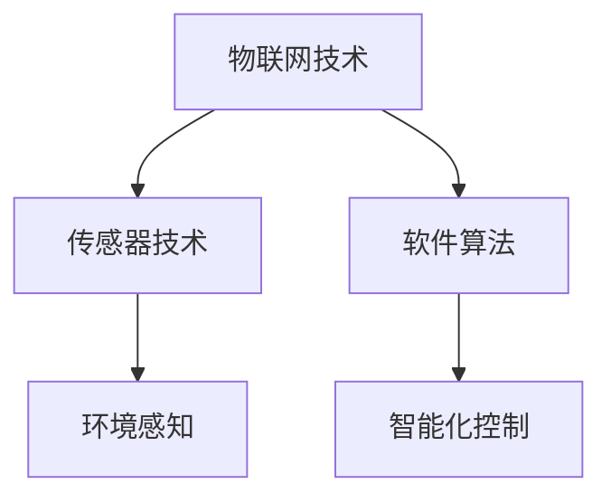

### 1.2 智能家电的发展历程

智能家电的发展历程可以分为以下几个阶段：

1. **萌芽阶段**（20世纪90年代）：智能家电的概念开始出现，一些家电产品开始尝试应用简单的传感器和网络通信技术。
2. **起步阶段**（21世纪初）：随着物联网技术的成熟，智能家电开始逐渐进入市场，如智能电视、智能冰箱等。
3. **快速发展阶段**（2010年至今）：智能家居、智能穿戴设备等逐渐普及，智能家电市场进入快速发展阶段。

#### 发展历程流程图

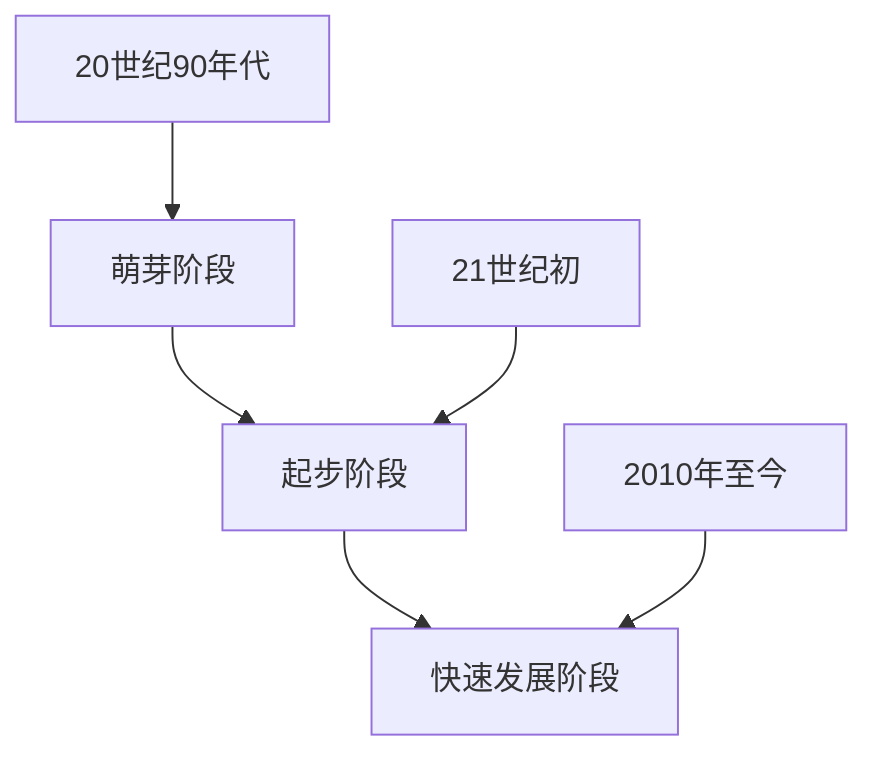

### 1.3 智能家电的现状与趋势

当前，智能家电已经广泛应用于家庭、办公、医疗等多个领域。未来，智能家电的发展趋势包括：

1. **更加智能化的功能**：通过深度学习和人工智能技术，智能家电将能够更好地理解用户需求，提供个性化服务。
2. **更加便捷的连接方式**：5G、Wi-Fi 6等新型通信技术将为智能家电提供更快的网络连接速度，提升用户体验。
3. **更加安全的数据保护**：随着隐私保护的重视，智能家电将加强数据加密和隐私保护技术，保障用户数据安全。

#### 现状与趋势流程图

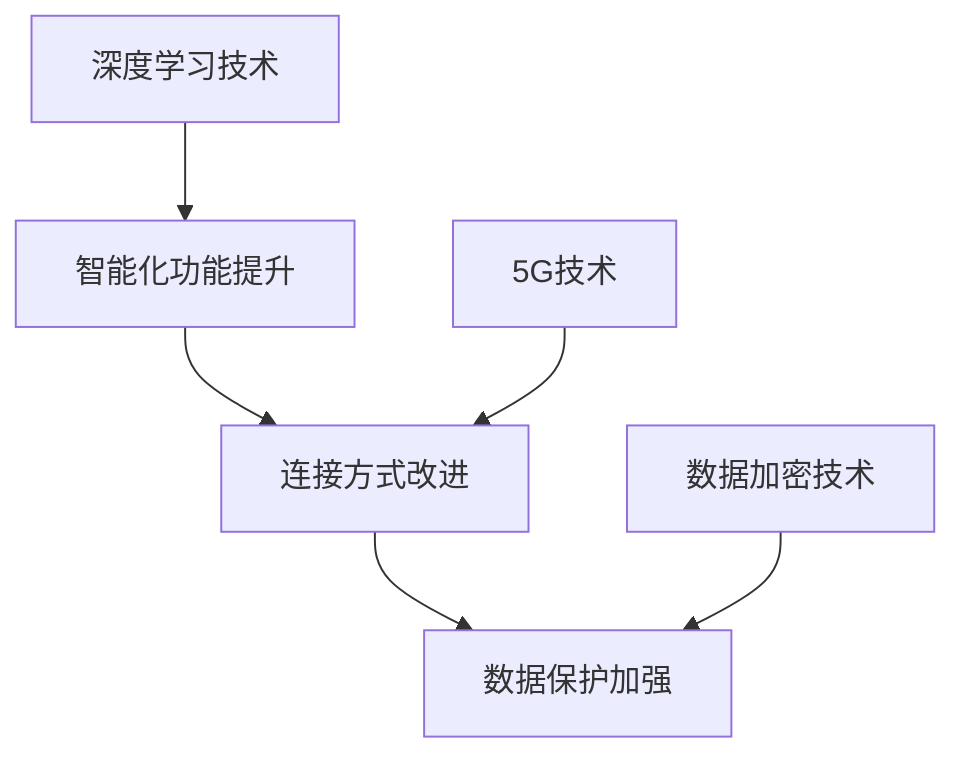

## 第2章：智能家电的核心技术

### 2.1 通信技术

通信技术是智能家电实现互联互通的基础。常见的通信技术包括Wi-Fi、蓝牙、Zigbee等。Wi-Fi技术具有高速、稳定的传输特点，适用于远程控制和大数据传输；蓝牙技术具有低功耗、短距离传输的特点，适用于设备间的短距离通信；Zigbee技术则具有低功耗、高可靠性的特点，适用于家庭自动化场景。

#### 通信技术架构图

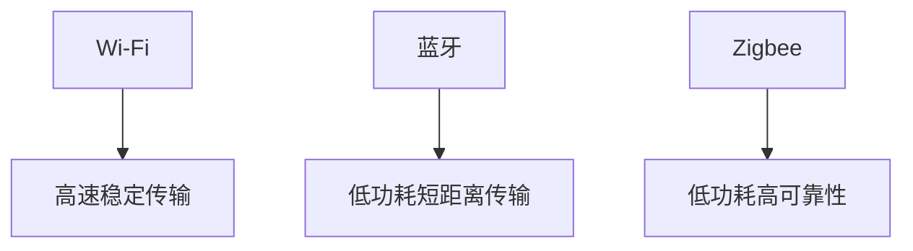

### 2.2 传感器技术

传感器技术是智能家电实现环境感知和自动控制的关键。常见的传感器包括温度传感器、湿度传感器、光照传感器、红外传感器等。通过这些传感器，智能家电可以实时监测环境状态，并根据环境变化自动调整设备状态。

#### 传感器技术架构图

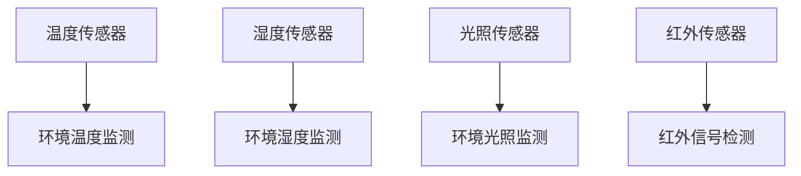

### 2.3 软件与算法

软件算法是智能家电实现智能化控制的核心。通过软件算法，智能家电可以分析传感器数据，做出智能决策。常见的软件算法包括机器学习算法、深度学习算法、模糊逻辑算法等。这些算法可以识别用户行为模式，预测用户需求，提供个性化服务。

#### 软件算法架构图

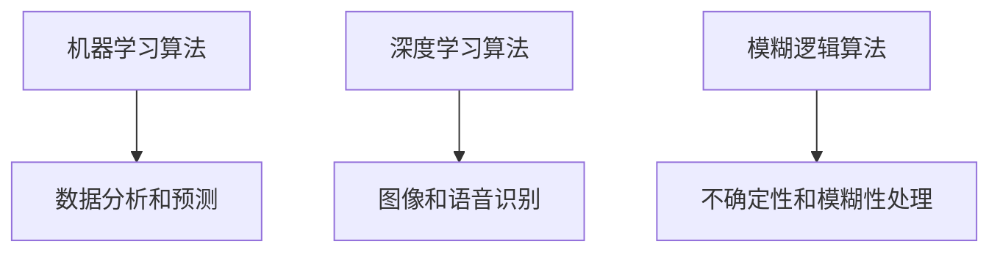

## 第3章：注意力争夺原理

### 3.1 注意力争夺的概念与机制

注意力争夺是指多个智能设备或系统在同一时间内试图获取用户注意力的现象。注意力争夺的机制主要包括以下几个方面：

1. **竞争机制**：多个设备或系统通过不同的方式争夺用户的注意力，如弹出通知、语音提示、视觉闪烁等。
2. **优先级机制**：根据设备或系统的优先级，确定哪个设备或系统能够首先获取用户的注意力。
3. **反馈机制**：用户对设备或系统的反馈，将影响其未来的注意力争夺效果。

#### 注意力争夺机制流程图

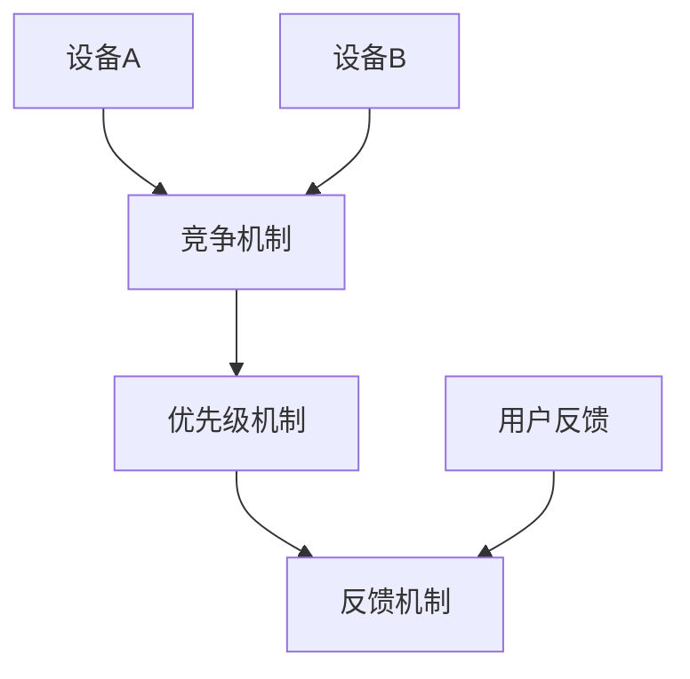

### 3.2 注意力争夺的影响因素

注意力争夺的影响因素包括以下几个方面：

1. **设备数量**：设备数量的增加会导致注意力争夺的激烈程度增加。
2. **功能丰富度**：功能丰富的设备更容易吸引用户注意力。
3. **用户需求**：用户对特定功能的需求会影响注意力争夺的结果。
4. **界面设计**：界面设计的美观性和易用性会影响用户对设备的注意力。

#### 注意力争夺影响因素流程图

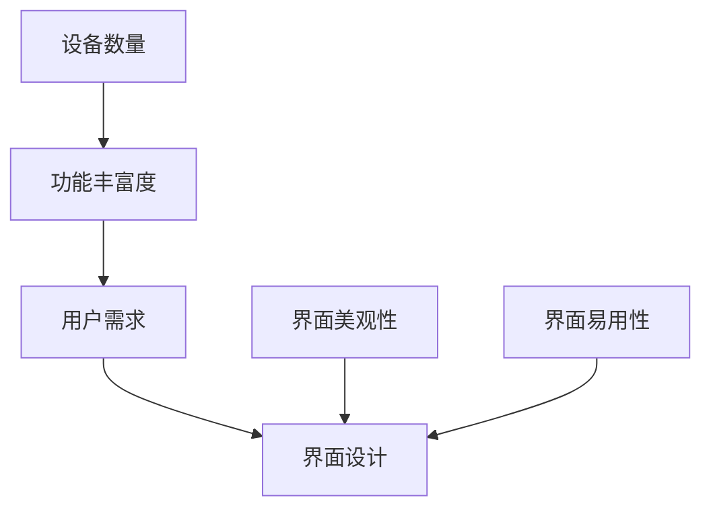

### 3.3 注意力争夺的影响

注意力争夺对用户和设备都有一定的影响：

1. **用户影响**：用户可能会感到疲劳和困扰，降低使用智能家电的意愿。
2. **设备影响**：设备可能因为过度争夺注意力而导致性能下降或用户体验变差。

#### 注意力争夺影响流程图

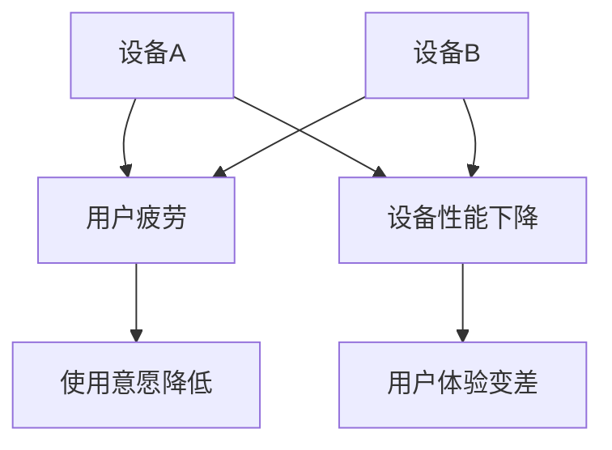

## 第4章：用户体验设计

### 4.1 用户体验设计的基础知识

用户体验设计（User Experience Design，简称UX设计）是指通过设计方法和技术，优化产品或服务的用户体验，使其更加直观、易用和愉悦。用户体验设计的基础知识包括以下几个方面：

1. **用户体验的定义**：用户体验是指用户在使用产品或服务过程中所产生的感受和体验。
2. **用户体验设计的原则**：包括用户至上、简洁明了、一致性、可访问性等。
3. **用户体验设计的方法**：包括用户调研、用户画像、原型设计、用户测试等。
4. **用户体验设计的流程**：包括需求分析、设计、开发、测试和迭代等阶段。

#### 用户体验设计原则流程图

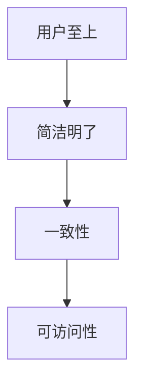

#### 用户体验设计方法流程图

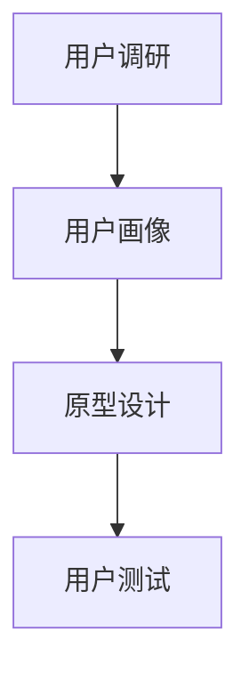

#### 用户体验设计流程图

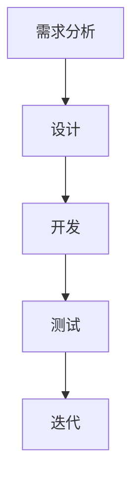

### 4.2 用户体验设计的方法

用户体验设计的方法包括用户调研、用户画像、原型设计和用户测试等。以下是对这些方法的详细解释：

1. **用户调研**：用户调研是通过收集用户需求、行为和反馈，了解用户对产品或服务的看法和使用体验。用户调研的方法包括问卷调查、访谈、观察等。
2. **用户画像**：用户画像是对目标用户进行抽象描述，包括用户的基本信息、行为习惯、需求偏好等。用户画像可以帮助设计师更好地了解用户，设计出更符合用户需求的产品。
3. **原型设计**：原型设计是创建产品或服务的原型，用于验证设计思路和功能实现。原型设计的方法包括低保真原型、高保真原型等。
4. **用户测试**：用户测试是通过让用户实际使用产品或服务，收集用户反馈和意见，评估产品的易用性和用户体验。用户测试的方法包括A/B测试、对比测试等。

#### 用户体验设计方法流程图

### 4.3 用户体验设计的流程

用户体验设计的流程包括需求分析、设计、开发、测试和迭代等阶段。以下是对这些阶段的详细解释：

1. **需求分析**：需求分析是了解用户需求和市场趋势，明确产品或服务的目标用户和功能需求。需求分析的方法包括市场调研、用户访谈、需求文档编写等。
2. **设计**：设计是根据需求分析的结果，制定产品的界面布局、交互逻辑和视觉设计。设计的方法包括UI设计、UX设计、原型设计等。
3. **开发**：开发是将设计转化为实际的产品或服务。开发的方法包括前端开发、后端开发、数据库设计等。
4. **测试**：测试是验证产品或服务的功能、性能和用户体验。测试的方法包括单元测试、集成测试、用户测试等。
5. **迭代**：迭代是根据测试结果，对产品或服务进行优化和改进。迭代的方法包括持续集成、敏捷开发等。

#### 用户体验设计流程图

## 第5章：智能家电的用户体验优化

### 5.1 界面设计与交互优化

界面设计和交互优化是提升智能家电用户体验的重要环节。以下是一些具体的优化方法：

1. **简洁明了的界面设计**：界面设计应简洁明了，避免过多的装饰和功能，突出核心功能，使用户能够快速找到所需功能。
2. **直观的交互设计**：交互设计应直观易懂，避免复杂的操作流程，使用户能够轻松上手。
3. **一致性的设计风格**：界面设计应保持一致性的风格，包括颜色、字体、图标等，使用户在不同设备上使用产品时能够保持一致性的体验。
4. **适应性设计**：界面设计应适应不同设备尺寸和分辨率，提供良好的视觉体验。

#### 界面设计与交互优化流程图

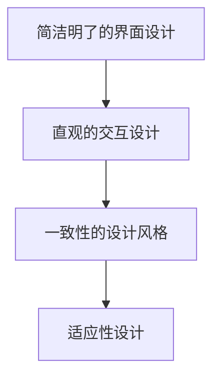

### 5.2 功能设计与使用优化

功能设计与使用优化是提升智能家电用户体验的关键。以下是一些具体的优化方法：

1. **核心功能突出**：将用户最常用的功能放在界面显眼的位置，提高用户的使用效率。
2. **简洁的操作流程**：优化操作流程，减少用户操作步骤，提高用户满意度。
3. **智能推荐功能**：根据用户行为和偏好，提供智能推荐功能，提高用户的个性化体验。
4. **功能定制化**：允许用户自定义功能设置，满足用户的个性化需求。

#### 功能设计与使用优化流程图

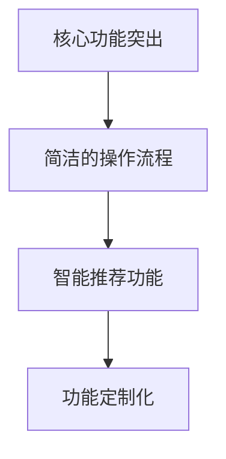

### 5.3 安全性与隐私保护

安全性与隐私保护是智能家电用户体验的重要组成部分。以下是一些具体的优化方法：

1. **数据加密**：对用户数据进行加密处理，防止数据泄露。
2. **身份验证**：加强身份验证机制，确保用户数据安全。
3. **权限管理**：合理设置设备权限，防止恶意软件或应用程序访问用户数据。
4. **安全预警**：实时监控设备运行状态，及时发现和预警潜在的安全风险。

#### 安全性与隐私保护流程图

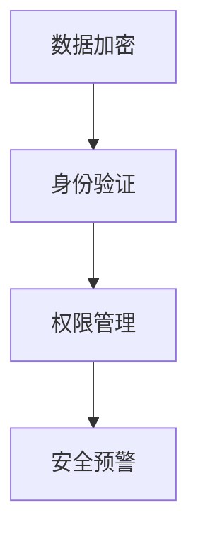

## 第6章：智能家电的用户体验评估

### 6.1 用户调研方法

用户调研是评估智能家电用户体验的重要环节。以下是一些常见的用户调研方法：

1. **问卷调查**：通过设计问卷，收集用户对产品的看法和使用体验。
2. **访谈**：通过面对面或在线访谈，深入了解用户对产品的需求和问题。
3. **观察**：在用户使用产品的过程中，观察用户的行为和操作，收集用户反馈。
4. **数据分析**：通过分析用户数据，了解用户的行为模式和偏好。

#### 用户调研方法流程图

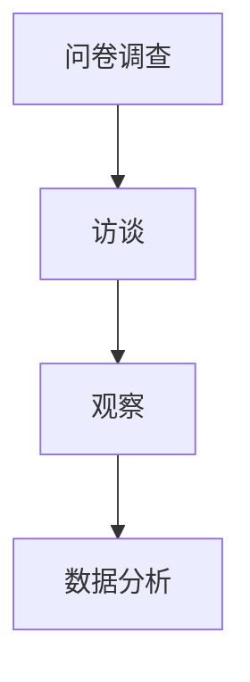

### 6.2 用户测试方法

用户测试是评估智能家电用户体验的关键环节。以下是一些常见的用户测试方法：

1. **A/B测试**：将产品分为两个或多个版本，比较不同版本的用户体验和效果。
2. **对比测试**：将产品与竞品进行对比，评估产品的优劣势。
3. **情境测试**：模拟用户使用产品的情境，评估产品的实用性和易用性。
4. **用户访谈**：在用户测试过程中，与用户进行面对面或在线访谈，了解用户对产品的真实感受。

#### 用户测试方法流程图

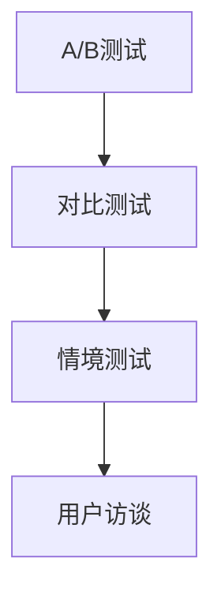

### 6.3 用户反馈分析工具

用户反馈分析工具可以帮助智能家电企业了解用户需求和市场趋势，优化产品设计和功能。以下是一些常见的用户反馈分析工具：

1. **问卷调查平台**：如Google表单、问卷星等，用于收集用户反馈和满意度。
2. **用户访谈工具**：如Zoom、腾讯会议等，用于进行在线或面对面访谈。
3. **数据分析工具**：如Excel、Tableau等，用于分析用户数据，提取有用信息。
4. **用户反馈管理系统**：如JIRA、Trello等，用于跟踪和管理用户反馈和问题。

#### 用户反馈分析工具流程图

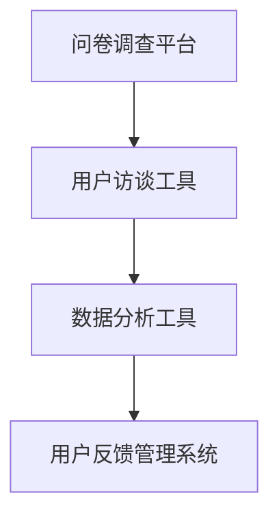

## 第7章：智能家电用户体验案例分析

### 7.1 案例一：智能家居系统

智能家居系统是智能家电用户体验设计的经典案例。以下是对该案例的详细分析：

#### 案例背景

智能家居系统是一种集成了多种智能家电产品的系统，用户可以通过手机App或语音助手对家居设备进行远程控制和自动化管理。

#### 用户调研

通过问卷调查和用户访谈，了解到用户对智能家居系统的期望主要包括以下几个方面：

1. **远程控制**：用户希望能够在离家时远程控制家居设备的开关和状态。
2. **自动化管理**：用户希望系统能够根据用户习惯和需求，自动调整家居设备的运行状态。
3. **安全性**：用户对智能家居系统的安全性非常关注，希望系统能够保护用户隐私和设备安全。

#### 功能设计与优化

根据用户调研的结果，智能家居系统进行了以下功能设计和优化：

1. **远程控制**：通过手机App和语音助手，用户可以远程控制家居设备的开关和状态，提高生活便利性。
2. **自动化管理**：系统可以根据用户习惯和需求，自动调整家居设备的运行状态，如根据用户的作息时间自动调整灯光和温度。
3. **安全性**：系统采用了数据加密和身份验证技术，确保用户数据安全和设备安全。

#### 用户测试

通过用户测试，智能家居系统在易用性、安全性和自动化管理方面得到了用户的认可。用户反馈显示，系统界面简洁明了，操作便捷，能够满足用户的日常需求。

### 7.2 案例二：智能空调

智能空调是另一个典型的智能家电用户体验设计案例。以下是对该案例的详细分析：

#### 案例背景

智能空调是一种集成了物联网技术和人工智能算法的空调，用户可以通过手机App或语音助手对空调进行远程控制和智能调节。

#### 用户调研

通过问卷调查和用户访谈，了解到用户对智能空调的期望主要包括以下几个方面：

1. **远程控制**：用户希望能够在离家时远程控制空调的开关和温度。
2. **智能调节**：用户希望系统能够根据室内外温度和用户习惯，自动调节空调的温度和模式。
3. **节能环保**：用户希望空调能够在节能环保方面有所提升。

#### 功能设计与优化

根据用户调研的结果，智能空调进行了以下功能设计和优化：

1. **远程控制**：用户可以通过手机App或语音助手远程控制空调的开关和温度，提高生活便利性。
2. **智能调节**：系统可以实时监测室内外温度，根据用户习惯和需求，自动调整空调的温度和模式，提供舒适的室内环境。
3. **节能环保**：系统采用了节能算法，根据用户的使用习惯和需求，自动调整空调的运行状态，降低能耗。

#### 用户测试

通过用户测试，智能空调在远程控制、智能调节和节能环保方面得到了用户的认可。用户反馈显示，系统界面简洁明了，操作便捷，能够满足用户的日常需求，同时节能效果明显。

### 7.3 案例三：智能灯光系统

智能灯光系统是另一个典型的智能家电用户体验设计案例。以下是对该案例的详细分析：

#### 案例背景

智能灯光系统是一种集成了物联网技术和人工智能算法的灯光系统，用户可以通过手机App或语音助手对灯光进行远程控制和智能调节。

#### 用户调研

通过问卷调查和用户访谈，了解到用户对智能灯光系统的期望主要包括以下几个方面：

1. **远程控制**：用户希望能够在离家时远程控制灯光的开关和亮度。
2. **智能调节**：用户希望系统能够根据用户习惯和需求，自动调整灯光的亮度、色温和场景模式。
3. **节能环保**：用户希望灯光系统能够在节能环保方面有所提升。

#### 功能设计与优化

根据用户调研的结果，智能灯光系统进行了以下功能设计和优化：

1. **远程控制**：用户可以通过手机App或语音助手远程控制灯光的开关和亮度，提高生活便利性。
2. **智能调节**：系统可以实时监测用户的行为和需求，根据用户习惯和需求，自动调整灯光的亮度、色温和场景模式，提供舒适的照明环境。
3. **节能环保**：系统采用了节能算法，根据用户的使用习惯和需求，自动调整灯光的运行状态，降低能耗。

#### 用户测试

通过用户测试，智能灯光系统在远程控制、智能调节和节能环保方面得到了用户的认可。用户反馈显示，系统界面简洁明了，操作便捷，能够满足用户的日常需求，同时节能效果明显。

## 第8章：智能家电的用户体验设计未来趋势

### 8.1 智能家电用户体验设计的未来趋势

随着科技的不断发展，智能家电用户体验设计也将迎来新的趋势。以下是对未来趋势的展望：

1. **更加智能化的交互**：智能家电将采用更加智能化的交互方式，如自然语言处理、语音识别等，提升用户体验。
2. **个性化定制**：智能家电将根据用户行为和需求，提供个性化定制服务，满足用户的个性化需求。
3. **集成化发展**：智能家电将实现跨设备的集成，提供更加统一的用户体验。
4. **智能化健康管理**：智能家电将具备智能健康管理功能，为用户提供更加健康的生活建议。
5. **安全隐私保护**：智能家电将加强安全隐私保护，确保用户数据安全。

### 8.2 智能家电用户体验创新的未来方向

智能家电用户体验创新未来可能的方向包括：

1. **虚拟现实与增强现实**：利用虚拟现实和增强现实技术，为用户带来更加沉浸式的交互体验。
2. **智能感知与自适应**：利用传感器技术和人工智能算法，实现智能感知和自适应调节，提升用户体验。
3. **情感计算与情感交互**：利用情感计算技术，实现情感交互，为用户提供更加人性化的服务。
4. **物联网与云计算**：通过物联网和云计算技术，实现设备间的无缝连接和数据共享，提供更加便捷的用户体验。

### 8.3 智能家电用户体验设计面临的挑战

智能家电用户体验设计未来将面临以下挑战：

1. **技术复杂度**：随着智能家电功能的不断丰富，技术复杂度将不断增加，设计难度加大。
2. **用户需求变化**：用户需求不断变化，如何快速响应并满足用户需求将成为挑战。
3. **隐私安全**：用户对隐私安全的关注不断提高，如何保障用户数据安全将成为关键问题。
4. **跨学科合作**：智能家电用户体验设计需要跨学科合作，如何有效整合不同领域的知识和技能将成为挑战。

## 第9章：智能家电的用户体验设计实践建议

### 9.1 设计实践建议

为了提升智能家电的用户体验，以下是一些建议：

1. **用户调研**：在进行设计前，进行充分的用户调研，了解用户需求和行为模式。
2. **原型设计**：制作原型，进行用户测试和反馈，根据用户反馈进行迭代优化。
3. **界面设计**：界面设计应简洁明了，突出核心功能，提高易用性。
4. **交互设计**：交互设计应直观易懂，避免复杂的操作流程，提高用户体验。
5. **安全隐私保护**：在设计过程中，充分考虑安全隐私保护，确保用户数据安全。

### 9.2 跨学科合作的重要性

智能家电用户体验设计涉及多个学科领域，包括计算机科学、心理学、设计学等。跨学科合作能够有效整合不同领域的知识和技能，提高设计质量和效率。以下是一些跨学科合作的建议：

1. **组建跨学科团队**：组建由计算机科学家、心理学家、设计师等组成的跨学科团队，共同参与设计过程。
2. **知识共享与交流**：鼓励团队成员之间进行知识共享和交流，提高团队整体能力。
3. **协作工具**：使用协作工具，如项目管理软件、版本控制工具等，提高团队协作效率。
4. **定期培训**：定期组织培训，提高团队成员在相关领域的知识和技能。

### 9.3 用户体验设计的可持续发展

用户体验设计的可持续发展是智能家电行业发展的关键。以下是一些建议：

1. **环保设计**：在设计过程中，充分考虑环保因素，减少对环境的影响。
2. **节能设计**：通过智能化技术，提高设备能效，实现节能目标。
3. **可持续材料**：使用可持续材料，减少对环境的污染。
4. **用户参与**：鼓励用户参与产品设计过程，提高用户满意度，促进产品迭代优化。

## 附录A：智能家电常用技术和工具汇总

### A.1 常用通信技术

1. **Wi-Fi**：适用于高速数据传输和远程控制。
2. **蓝牙**：适用于短距离通信和设备间连接。
3. **Zigbee**：适用于家庭自动化场景，具有低功耗和高可靠性的特点。

### A.2 常用传感器技术

1. **温度传感器**：用于监测环境温度。
2. **湿度传感器**：用于监测环境湿度。
3. **光照传感器**：用于监测环境光照强度。
4. **红外传感器**：用于监测红外信号。

### A.3 常用软件与算法

1. **机器学习算法**：用于数据分析和预测。
2. **深度学习算法**：用于图像和语音识别。
3. **模糊逻辑算法**：用于不确定性和模糊性处理。

## 附录B：参考文献

### B.1 相关书籍推荐

1. 《用户体验要素》
2. 《设计心理学》
3. 《智能家电系统设计与实现》

### B.2 学术论文精选

1. “Smart Home Systems: A Review”
2. “User Experience Design for Smart Home Appliances”
3. “Privacy Protection in Smart Home Systems”

### B.3 行业报告与资讯

1. “2019年中国智能家居市场研究报告”
2. “2020年全球智能家居市场发展现状及趋势分析”
3. “智能家电行业发展报告”

本文基于对智能家电的发展历程、核心技术、用户体验设计以及未来趋势的深入分析，探讨了智能家电的发展现状和前景。通过分析智能家电的用户体验设计方法、优化策略和案例分析，为智能家电企业提供了有益的参考和建议。在未来的发展中，智能家电将朝着更加智能化、个性化、安全化的方向发展，为用户带来更加便捷、舒适和健康的生活体验。同时，智能家电的发展也将面临一系列挑战，如技术复杂度、用户需求变化和隐私安全等，需要企业持续创新和优化设计，以应对不断变化的市场需求。

## 附录C：智能家电的用户体验评估方法与实践

### C.1 用户体验评估方法

用户体验评估是智能家电设计中至关重要的一环，以下是一些常用的用户体验评估方法：

1. **问卷调查**：通过设计问卷，收集用户对产品的看法和使用体验。问卷调查的优点是成本较低，能够快速收集大量用户数据。

2. **用户访谈**：通过面对面或在线访谈，深入了解用户对产品的需求和问题。用户访谈的优点是能够获取深层次的用户反馈，但成本较高。

3. **用户测试**：让用户在实际使用产品的过程中，收集用户反馈和意见。用户测试的优点是能够直接观察用户的行为和操作，但需要较高的组织和协调成本。

4. **数据分析**：通过对用户数据进行分析，了解用户的行为模式和偏好。数据分析的优点是能够量化用户行为，但需要具备一定的数据分析能力。

5. **A/B测试**：将产品分为两个或多个版本，比较不同版本的用户体验和效果。A/B测试的优点是能够直观地评估不同设计的优劣，但需要足够的数据支持。

### C.2 用户体验评估实践

以下是一个智能家电用户体验评估的实践案例：

#### 案例背景

某家电公司开发了一款智能冰箱，具备远程控制、食材管理、智能推荐等功能。为了确保产品的用户体验，公司决定进行用户体验评估。

#### 评估流程

1. **需求分析**：分析用户对智能冰箱的需求，包括基本功能、使用场景、用户痛点等。

2. **设计原型**：根据需求分析，设计智能冰箱的界面布局和交互逻辑。

3. **用户调研**：通过问卷调查和用户访谈，了解用户对智能冰箱的看法和使用体验。

4. **用户测试**：邀请目标用户进行实际使用测试，收集用户反馈和意见。

5. **数据分析**：对用户调研和用户测试的数据进行分析，提取有用信息。

6. **迭代优化**：根据用户反馈和数据分析结果，对智能冰箱的界面设计和功能进行优化。

#### 评估结果

1. **用户满意度**：通过问卷调查和用户访谈，用户对智能冰箱的整体满意度较高，尤其是对远程控制和食材管理功能表示满意。

2. **使用频率**：用户测试数据显示，智能冰箱的日使用频率较高，用户普遍认为智能功能有助于提高生活质量。

3. **改进建议**：用户反馈显示，部分用户对界面设计和操作流程存在一定的不满，建议优化界面布局和操作流程。

#### 评估总结

通过用户体验评估，家电公司成功优化了智能冰箱的界面设计和功能，提升了用户体验。用户体验评估不仅帮助公司了解用户需求，还为产品改进提供了有力支持。在未来的产品开发过程中，公司将继续重视用户体验评估，确保产品的质量和用户满意度。

## 附录D：智能家电用户体验设计实用技巧

### D.1 界面设计技巧

1. **简洁明了**：界面设计应简洁明了，避免过多的装饰和功能，突出核心功能。
2. **一致性**：界面设计应保持一致性的风格，包括颜色、字体、图标等，使用户在不同设备上使用产品时能够保持一致性的体验。
3. **适应性**：界面设计应适应不同设备尺寸和分辨率，提供良好的视觉体验。

### D.2 交互设计技巧

1. **直观易懂**：交互设计应直观易懂，避免复杂的操作流程，使用户能够轻松上手。
2. **反馈及时**：在用户进行操作时，应及时给予反馈，让用户明确知道操作结果。
3. **可控性**：交互设计应确保用户对设备的控制是可控的，避免用户误操作。

### D.3 功能设计技巧

1. **核心功能突出**：将用户最常用的功能放在界面显眼的位置，提高用户的使用效率。
2. **简洁的操作流程**：优化操作流程，减少用户操作步骤，提高用户满意度。
3. **智能推荐功能**：根据用户行为和偏好，提供智能推荐功能，提高用户的个性化体验。
4. **功能定制化**：允许用户自定义功能设置，满足用户的个性化需求。

### D.4 安全性设计技巧

1. **数据加密**：对用户数据进行加密处理，防止数据泄露。
2. **身份验证**：加强身份验证机制，确保用户数据安全。
3. **权限管理**：合理设置设备权限，防止恶意软件或应用程序访问用户数据。
4. **安全预警**：实时监控设备运行状态，及时发现和预警潜在的安全风险。

### D.5 隐私保护设计技巧

1. **隐私政策**：明确告知用户数据收集和使用的情况，确保用户知情权。
2. **数据匿名化**：对收集的用户数据进行匿名化处理，避免用户隐私泄露。
3. **权限限制**：对用户数据的访问权限进行严格限制，确保数据安全。
4. **透明度**：提供用户数据管理功能，让用户能够方便地查看、修改和删除自己的数据。

通过以上实用技巧，智能家电企业可以更好地设计出用户满意的智能家电产品，提升用户体验和市场竞争力。

## 结语

智能家电的用户体验设计是智能家电发展中的重要环节。本文通过对智能家电的起源与发展、核心技术、用户体验设计原理、用户体验评估以及未来趋势的深入分析，为智能家电企业提供了有价值的参考和建议。在未来的发展中，智能家电企业应注重用户体验设计，持续优化产品，以满足用户日益增长的个性化需求。同时，企业还需关注技术进步和行业趋势，积极应对挑战，推动智能家电产业的可持续发展。让我们期待智能家电为用户带来更加智能、便捷和舒适的生活体验。

