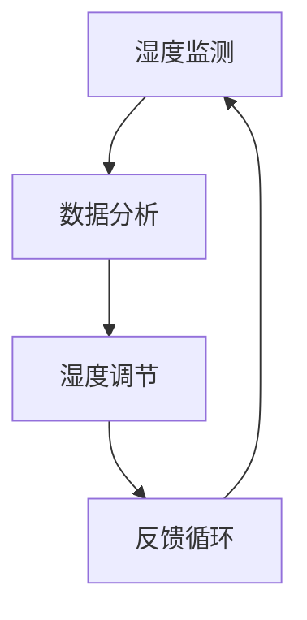
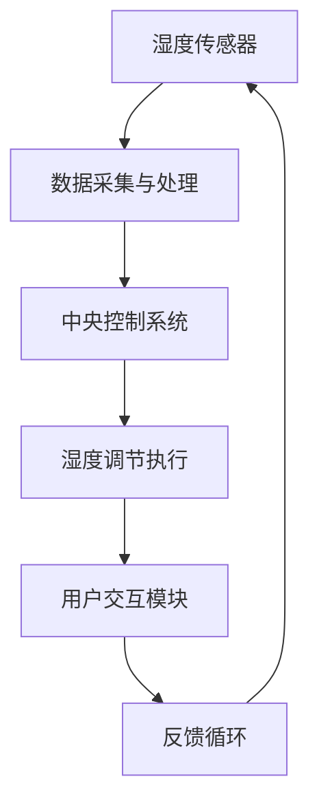
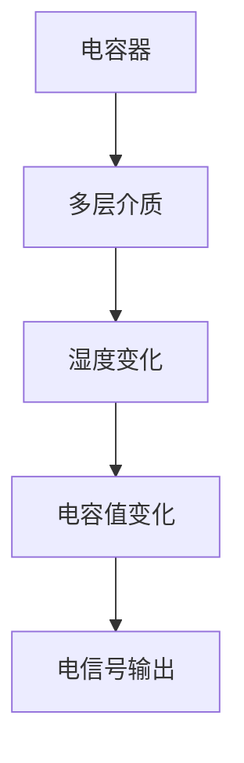
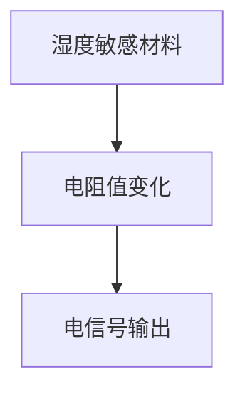
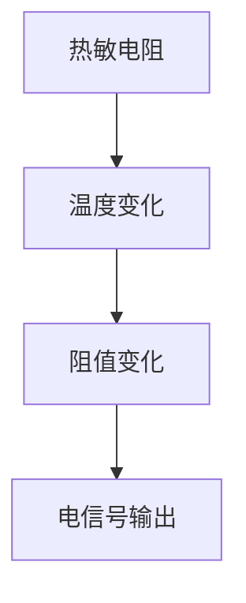
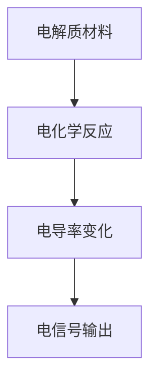
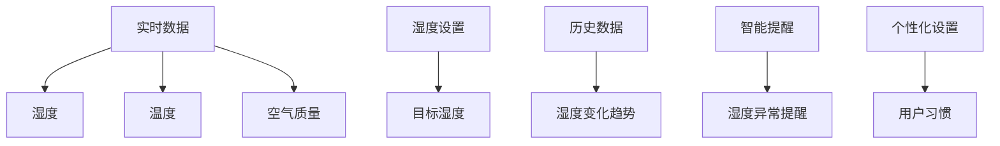

                 

### 智能居家湿度平衡创业：全天候的呼吸道健康管理

> **关键词：** 智能居家湿度平衡、创业机会、呼吸道健康管理、智能湿度调节系统、数据分析、市场推广、商业运营

**摘要：** 本文旨在探讨智能居家湿度平衡创业的机会与挑战，以及如何通过智能湿度调节系统全天候地管理呼吸道健康。文章将详细介绍智能湿度调节系统的核心技术原理、市场分析、产品开发、市场推广及商业运营策略，提供创业实践的全方位指南。

### 目录大纲

1. **引言与背景**
   - **第1章：智能居家湿度平衡与创业机会**
     - 1.1 智能居家湿度平衡的概述
     - 1.2 市场需求分析
     - 1.3 创业机会与挑战
2. **核心技术原理**
   - **第2章：智能湿度调节系统架构**
     - 2.1 系统总体架构
     - 2.2 湿度传感器技术
     - 2.3 湿度控制算法
     - 2.4 智能算法与模型
   - **第3章：呼吸道健康管理与数据分析**
     - 3.1 呼吸道健康指标
     - 3.2 数据分析与挖掘
     - 3.3 基于大数据的个性化健康管理
3. **创业实战**
   - **第4章：智能居家湿度平衡产品开发**
     - 4.1 产品设计与功能规划
     - 4.2 技术选型与开发环境搭建
     - 4.3 产品开发流程与团队协作
   - **第5章：市场推广与营销策略**
     - 5.1 市场定位与目标客户分析
     - 5.2 市场推广策略
     - 5.3 售后服务与用户反馈机制
   - **第6章：商业运营与管理**
     - 6.1 财务规划与成本控制
     - 6.2 团队建设与人才培养
     - 6.3 风险管理策略
4. **智能居家湿度平衡创业总结与展望**
   - **第7章：智能居家湿度平衡创业总结与展望**
     - 7.1 创业成果与经验总结
     - 7.2 未来发展展望

---

接下来，我们将逐步深入探讨智能居家湿度平衡创业的各个关键领域，从技术原理到市场分析，再到实际操作，提供一整套完整的创业指南。

---

### 第一部分：引言与背景

#### 第1章：智能居家湿度平衡与创业机会

##### 1.1 智能居家湿度平衡的概述

**核心概念与联系：** 智能居家湿度平衡是指通过智能设备和技术手段，实时监测和调节家庭环境的湿度，以保持室内空气的湿度和舒适度。这涉及到湿度传感器、湿度调节器、智能控制系统等多个技术模块，其核心目的是提高居住环境的健康水平，尤其是对呼吸道健康的积极影响。

**Mermaid 流程图：**


在智能家居系统中，湿度调节系统是一个重要的组成部分。传统的湿度调节主要依赖于手动操作或简单的自动控制，而智能湿度调节系统则通过传感器实时获取室内湿度数据，结合智能算法进行调节，从而实现精准的湿度控制。

**技术架构概述：**

1. **湿度传感器模块：** 用于实时监测室内湿度，常见的湿度传感器有电容式、电阻式、热敏电阻式等。这些传感器通过感知空气中的水汽含量，将湿度信息转换为电信号。

2. **数据采集与处理模块：** 将传感器采集到的湿度数据传输到中央控制系统，经过数据处理和算法分析，生成相应的控制信号。

3. **湿度调节执行模块：** 根据中央控制系统的指令，调节加湿器或除湿器的运行，以调节室内湿度。

4. **反馈循环模块：** 通过持续监测和调节，形成一个闭环控制系统，确保室内湿度保持在设定的理想范围内。

**核心算法原理讲解：**

智能湿度调节系统的核心在于算法的应用，主要包括以下几种：

1. **PID控制器：** 一种经典的控制算法，通过比例、积分和微分三个环节，对湿度偏差进行调节。

```python
def PID_control(current_humidity, target_humidity, Kp, Ki, Kd):
    error = target_humidity - current_humidity
    proportional = Kp * error
    integral = Ki * sum(error for _ in range(len(error)))
    derivative = Kd * (error - previous_error)
    output = proportional + integral + derivative
    previous_error = error
    return output
```

2. **模糊控制器：** 通过模糊逻辑对湿度进行控制，适用于处理非线性、复杂的湿度调节问题。

```python
def fuzzy_control(humidity):
    if humidity < 30:
        return "加湿"
    elif humidity > 60:
        return "除湿"
    else:
        return "维持现状"
```

**智能算法与模型：**

随着人工智能技术的发展，智能湿度调节系统也逐渐引入了机器学习算法。例如，可以通过基于历史湿度数据的机器学习模型，预测未来的湿度变化趋势，从而进行更为精准的调节。

```python
from sklearn.ensemble import RandomForestRegressor

def train_model(data):
    X, y = data[:, :-1], data[:, -1]
    model = RandomForestRegressor()
    model.fit(X, y)
    return model

def predict(model, new_data):
    return model.predict([new_data])
```

通过这些智能算法的应用，智能湿度调节系统能够更加灵活和高效地应对室内湿度的变化，为用户的呼吸道健康提供全天候的保障。

##### 1.2 市场需求分析

**呼吸道疾病与湿度关系：**

呼吸道疾病如哮喘、支气管炎等，与室内湿度有密切的关系。湿度过高或过低都可能加剧症状，因此维持适宜的室内湿度对于呼吸道疾病患者至关重要。

- **湿度过高：** 容易导致霉菌生长，诱发过敏和呼吸问题。
- **湿度过低：** 可引起皮肤干燥、呼吸道刺激，加剧呼吸系统疾病。

**智能湿度调节市场的现状与趋势：**

1. **现状：** 随着智能家居市场的快速发展，智能湿度调节设备逐渐成为家庭必备品。特别是在空气质量问题日益严重的背景下，智能湿度调节设备的需求不断增长。

2. **趋势：** 未来，随着人工智能和物联网技术的进一步融合，智能湿度调节系统将更加智能化、个性化，能够根据用户需求自动调节湿度，并提供更加精准的健康管理服务。

##### 1.3 创业机会与挑战

**创业领域的分析：**

智能湿度调节系统在智能家居市场具有巨大的发展潜力，特别是在呼吸道健康管理和空气质量监测方面。创业领域可以分为以下几个方面：

1. **硬件设备开发：** 开发智能湿度传感器、湿度调节器等硬件设备，提供完整的智能家居湿度调节解决方案。

2. **软件系统开发：** 开发智能湿度调节系统的软件平台，包括数据采集、处理、分析和反馈等功能。

3. **集成服务：** 提供一站式的智能家居解决方案，包括智能湿度调节、空气质量监测、远程控制等。

**智能湿度调节技术的商业应用场景：**

1. **家庭应用：** 在家庭环境中，智能湿度调节系统可以帮助用户维持室内适宜的湿度，提高生活质量和呼吸道健康水平。

2. **医疗领域：** 对于呼吸道疾病患者，智能湿度调节系统可以提供个性化、精准的健康管理服务，缓解症状，提高治疗效果。

3. **公共场所：** 如酒店、办公室、学校等公共场所，智能湿度调节系统可以提供舒适的室内环境，提升用户体验。

**挑战：**

1. **技术挑战：** 智能湿度调节系统涉及多种技术，包括传感器技术、控制算法、数据处理等，需要具备较高的技术实力。

2. **市场推广：** 新技术的推广需要时间，特别是在竞争激烈的智能家居市场，如何迅速占领市场份额是一个挑战。

3. **用户体验：** 用户对于智能湿度调节系统的接受程度取决于其易用性和性价比，需要不断优化产品功能和用户体验。

通过以上分析，我们可以看到智能居家湿度平衡创业具有巨大的市场潜力和发展前景。然而，要成功创业，需要深入了解市场需求，掌握核心技术，并不断优化产品和服务。

### 第二部分：核心技术原理

#### 第2章：智能湿度调节系统架构

##### 2.1 系统总体架构

智能湿度调节系统是一个复杂的系统，它涉及多个模块的协同工作，以确保室内湿度保持在理想范围内。系统总体架构可以分为以下几个主要模块：

1. **湿度传感器模块：** 负责实时监测室内湿度。
2. **数据采集与处理模块：** 将湿度传感器采集到的数据传输到中央控制系统，进行数据处理和分析。
3. **湿度调节执行模块：** 根据中央控制系统的指令，调节加湿器或除湿器的运行。
4. **用户交互模块：** 提供用户界面，让用户可以方便地设置湿度目标和查看系统状态。
5. **反馈循环模块：** 实时监控湿度调节效果，并通过反馈机制调整控制策略。

**模块间关系与通信协议：**

在智能湿度调节系统中，各模块之间的通信协议至关重要。通常，系统采用以下通信协议：

1. **有线通信：** 如以太网、串口通信等，适用于数据传输稳定、距离较近的场合。
2. **无线通信：** 如Wi-Fi、蓝牙等，适用于数据传输距离较远或需要移动的场景。

**系统总体架构图：**


**系统工作流程：**

1. **湿度监测：** 湿度传感器实时监测室内湿度，并将数据发送到数据采集与处理模块。
2. **数据传输：** 数据采集与处理模块将湿度数据传输到中央控制系统。
3. **数据分析与决策：** 中央控制系统根据湿度数据，结合预设的湿度目标，使用智能算法进行调节决策。
4. **执行调节：** 湿度调节执行模块根据中央控制系统的指令，启动加湿器或除湿器进行湿度调节。
5. **用户交互：** 用户可以通过用户交互模块查看实时湿度数据和调节设置。
6. **反馈与优化：** 湿度调节后的效果通过反馈循环模块进行监控，并根据反馈调整控制策略，形成闭环控制。

**模块关系与通信协议的详细解释：**

1. **湿度传感器模块：** 湿度传感器通常采用电容式、电阻式或热敏电阻式技术，能够高精度地监测室内湿度。这些传感器将湿度值转换为电信号，并通过有线或无线通信协议将数据发送到数据采集与处理模块。

2. **数据采集与处理模块：** 数据采集与处理模块的主要功能是将湿度传感器采集到的原始数据转换为数字化数据，并进行初步处理，如滤波、去噪等。这些处理后的数据将通过有线或无线通信协议传输到中央控制系统。

3. **中央控制系统：** 中央控制系统是智能湿度调节系统的核心，它负责接收数据采集与处理模块传输的数据，结合预设的湿度目标，使用智能算法进行调节决策。常用的智能算法包括PID控制器和模糊控制器等。调节决策通过通信协议发送到湿度调节执行模块。

4. **湿度调节执行模块：** 湿度调节执行模块根据中央控制系统的指令，启动加湿器或除湿器进行湿度调节。加湿器通常采用超声波加湿技术或蒸汽加湿技术，而除湿器则采用制冷除湿或吸附除湿技术。调节执行模块需要与加湿器和除湿器进行紧密的配合，确保调节效果。

5. **用户交互模块：** 用户交互模块提供用户界面，用户可以通过手机应用、网页或智能音箱等设备查看实时湿度数据、调节设置和系统状态。用户交互模块与中央控制系统通过通信协议进行数据交换，确保用户操作能够实时反映在系统中。

6. **反馈循环模块：** 反馈循环模块负责监控湿度调节后的效果，并通过反馈机制调整控制策略。这一模块能够实时接收湿度调节执行模块的反馈数据，并与中央控制系统进行通信，确保系统能够持续优化调节效果。

通过以上详细解释，我们可以看到智能湿度调节系统各个模块之间的紧密关系和通信协议的重要性。这些模块和协议共同作用，确保系统能够全天候、精准地维持室内湿度，从而为用户带来健康、舒适的居住环境。

##### 2.2 湿度传感器技术

湿度传感器是智能湿度调节系统的关键组成部分，负责实时监测室内湿度。不同类型的湿度传感器有不同的工作原理和特点，以下是几种常见的湿度传感器及其工作原理：

**1. 电容式湿度传感器：**

电容式湿度传感器利用电容随湿度变化的特性来测量湿度。其核心组件是一个多层介质的电容板，介质的介电常数随湿度变化而变化。当环境湿度增加时，电容值也会发生变化。电容式湿度传感器具有高精度、高灵敏度和快速响应等优点，广泛应用于智能家居、工业控制等领域。

**工作原理：**


**2. 电阻式湿度传感器：**

电阻式湿度传感器通过测量电阻随湿度变化的特性来测量湿度。其核心组件是由湿度敏感材料制成的电阻，这种材料的电阻值会随着湿度变化而变化。电阻式湿度传感器通常具有较低的成本和较好的稳定性，适用于各种环境条件。

**工作原理：**


**3. 热敏电阻式湿度传感器：**

热敏电阻式湿度传感器利用热敏电阻的阻值随温度变化的特性来测量湿度。当环境温度变化时，热敏电阻的阻值也会发生变化，通过测量这种变化，可以间接获取湿度信息。热敏电阻式湿度传感器具有高精度和快速响应的特点，适用于要求较高的测量场合。

**工作原理：**


**4. 电化学湿度传感器：**

电化学湿度传感器利用电化学反应来测量湿度，其核心组件是由电解质材料制成的传感器。当环境湿度发生变化时，电解质材料的电导率也会发生变化，通过测量这种变化，可以获取湿度信息。电化学湿度传感器具有高灵敏度和良好的长期稳定性，适用于高精度测量和恶劣环境条件。

**工作原理：**


**传感器数据采集与处理：**

湿度传感器的数据采集与处理是智能湿度调节系统的重要组成部分。数据采集包括从传感器获取湿度值，并将其转换为数字信号。数据处理则包括对原始数据进行滤波、去噪、校准等操作，以提高数据的准确性和可靠性。

**数据采集流程：**
1. **模拟信号转换：** 湿度传感器输出的通常是模拟信号，需要通过模拟-数字转换（ADC）模块将其转换为数字信号。
2. **滤波处理：** 为了去除传感器噪声和干扰，可以使用数字滤波器对信号进行滤波。
3. **去噪处理：** 对采集到的数字信号进行去噪处理，以获得更为准确的湿度值。
4. **校准与校正：** 通过校准和校正，确保传感器输出的湿度值与实际环境湿度之间的一致性。

**数据处理示例：**
```python
import numpy as np

def filter_data(data, cutoff_frequency):
    b, a = signal.butter(cutoff_frequency, 'low')
    return lfilter(b, a, data)

def remove_noise(data, threshold):
    cleaned_data = []
    for value in data:
        if abs(value - median(data)) < threshold:
            cleaned_data.append(value)
    return cleaned_data

# 示例数据
humidity_data = [40.5, 40.3, 40.7, 40.4, 40.2, 40.6]

# 滤波处理
filtered_data = filter_data(humidity_data, cutoff_frequency=1)

# 去噪处理
noisy_data = [40.5, 40.3, 40.7, 40.4, 40.2, 40.6]
cleaned_data = remove_noise(noisy_data, threshold=0.2)
```

通过上述传感器数据采集与处理方法，智能湿度调节系统可以确保传感器输出的湿度数据准确、可靠，从而为后续的湿度控制提供坚实基础。

##### 2.3 湿度控制算法

湿度控制算法在智能湿度调节系统中起着至关重要的作用，它们决定了系统如何响应室内湿度的变化，以维持目标湿度水平。常见的湿度控制算法包括PID控制器和模糊控制器，这些算法各有特点，适用于不同的应用场景。

**PID控制器：**

PID控制器是一种经典的控制算法，通过比例（Proportional）、积分（Integral）和微分（Derivative）三个部分来调节控制信号。PID控制器的核心思想是通过对当前误差、误差累积和误差变化率的处理，生成一个控制输出，以调节加湿器或除湿器的运行。

**PID控制器的原理：**
- **比例（P）控制：** 直接与误差成正比，用于快速响应误差。但过强的比例控制可能导致系统震荡。
- **积分（I）控制：** 对误差进行累积，以消除静态误差。积分控制能够有效消除系统中的稳态误差。
- **微分（D）控制：** 对误差的变化率进行处理，以预测误差的变化趋势，提高系统的响应速度和稳定性。

**PID控制器的伪代码实现：**
```python
Kp = 1.0  # 比例系数
Ki = 0.1  # 积分系数
Kd = 0.5  # 微分系数

set_point = 45.0  # 目标湿度
current_humidity = 42.0  # 当前湿度
previous_error = 0.0

while True:
    error = set_point - current_humidity
    proportional = Kp * error
    integral = Ki * sum(error for _ in range(len(error)))
    derivative = Kd * (error - previous_error)
    output = proportional + integral + derivative
    previous_error = error
    # 根据输出值调节加湿器或除湿器
    if output > 0:
        # 加湿
    else:
        # 除湿
```

**模糊控制器：**

模糊控制器基于模糊逻辑进行控制，它将输入变量（如当前湿度和目标湿度）转化为模糊集合，并通过模糊规则进行推理，生成控制输出。模糊控制器特别适用于处理非线性、复杂系统，如智能湿度调节。

**模糊控制器的原理：**
- **模糊化：** 将输入变量（如湿度）转换为模糊集合，例如“很低”、“较低”、“中等”、“较高”、“很高”。
- **规则库：** 存储模糊规则，例如“如果当前湿度很低且目标湿度很低，则加湿”。
- **推理：** 根据输入变量和模糊规则，进行推理，生成模糊控制输出。
- **去模糊化：** 将模糊控制输出转换为具体控制信号。

**模糊控制器的伪代码实现：**
```python
def fuzzy_control(current_humidity, target_humidity):
    if current_humidity < 30 and target_humidity < 30:
        return "加湿"
    elif current_humidity > 60 and target_humidity > 60:
        return "除湿"
    else:
        return "维持现状"

current_humidity = 40
target_humidity = 45
control_action = fuzzy_control(current_humidity, target_humidity)

if control_action == "加湿":
    # 启动加湿器
elif control_action == "除湿":
    # 启动除湿器
else:
    # 维持现状
```

**PID控制器与模糊控制器的应用场景：**

- **PID控制器：** 适用于线性系统，对控制精度要求较高，如工业自动化领域。
- **模糊控制器：** 适用于非线性系统，对控制灵活性要求较高，如智能家居湿度调节。

**选择适合的控制算法：**

在选择湿度控制算法时，需要根据实际应用场景和系统特点进行权衡。以下是一些指导原则：

- **系统线性与非线性：** 对于线性系统，PID控制器效果较好；对于非线性系统，模糊控制器更适用。
- **控制精度与响应速度：** 如果对控制精度要求较高，可以优先考虑PID控制器；如果对响应速度要求较高，可以优先考虑模糊控制器。
- **系统复杂度：** 对于复杂系统，模糊控制器能够处理更多的不确定性和非线性因素。

通过合理选择和配置湿度控制算法，智能湿度调节系统能够更加精准、高效地维持室内湿度，从而为用户带来健康、舒适的居住环境。

##### 2.4 智能算法与模型

智能湿度调节系统中的智能算法和模型是确保系统能够根据环境变化动态调整湿度的重要工具。随着人工智能和大数据技术的发展，机器学习算法在湿度控制中的应用越来越广泛，能够提供更精准、个性化的湿度调节服务。

**智能算法的作用：**

1. **预测与趋势分析：** 通过历史数据，智能算法可以预测未来的湿度变化趋势，提前做出调节决策。
2. **优化控制策略：** 根据环境变化和用户需求，智能算法可以动态调整控制策略，提高调节效果。
3. **异常检测与预警：** 智能算法可以检测系统异常，如传感器故障、设备异常等，并及时发出预警。

**主流机器学习模型在湿度控制中的应用：**

1. **回归模型：** 回归模型用于预测未来的湿度值。常见的回归模型有线性回归、岭回归、LASSO回归等。通过训练历史湿度数据，回归模型可以预测未来的湿度变化趋势。

```python
from sklearn.linear_model import LinearRegression

# 示例数据
humidity_data = np.array([[1, 40.5], [2, 40.7], [3, 41.2], [4, 40.9], [5, 41.0]])

# 训练模型
model = LinearRegression()
model.fit(humidity_data[:, 0].reshape(-1, 1), humidity_data[:, 1])

# 预测未来湿度
future_humidity = model.predict([[6]])
print(f"预测未来湿度: {future_humidity[0][0]}")
```

2. **时间序列模型：** 时间序列模型用于分析时间序列数据，预测未来的湿度值。常见的模型有ARIMA、LSTM等。时间序列模型能够考虑时间维度上的相关性，提供更准确的预测结果。

```python
from statsmodels.tsa.arima_model import ARIMA

# 示例数据
humidity_data = [40.5, 40.7, 41.2, 40.9, 41.0]

# 训练模型
model = ARIMA(humidity_data, order=(1, 1, 1))
model_fit = model.fit(disp=0)

# 预测未来湿度
forecast = model_fit.forecast(steps=1)
print(f"预测未来湿度: {forecast[0]}")
```

3. **聚类模型：** 聚类模型用于将数据分为不同的类别，以便进行个性化湿度调节。常见的聚类模型有K-means、层次聚类等。通过聚类分析，可以发现不同的湿度调节需求，为用户提供个性化的服务。

```python
from sklearn.cluster import KMeans

# 示例数据
humidity_data = np.array([[40.5], [40.7], [41.2], [40.9], [41.0]])

# 训练模型
kmeans = KMeans(n_clusters=3)
kmeans.fit(humidity_data)

# 预测湿度类别
predicted_labels = kmeans.predict(humidity_data)
print(f"预测湿度类别: {predicted_labels}")
```

4. **强化学习模型：** 强化学习模型通过不断试错和奖励机制，找到最优的控制策略。在湿度调节中，强化学习可以优化调节参数，提高系统的稳定性。

```python
from stable_baselines3 import PPO

# 构建环境
env = HumidityControlEnv()

# 训练模型
model = PPO("MlpPolicy", env, verbose=1)
model.learn(total_timesteps=10000)

# 测试模型
mean_reward, std_reward = test_model(model, n_trials=100)
print(f"测试平均奖励: {mean_reward}, 测试标准奖励: {std_reward}")
```

**智能算法在湿度控制中的应用案例：**

1. **家庭环境：** 通过机器学习算法，智能湿度调节系统可以预测家庭成员的日常活动，调整湿度，确保家庭成员的舒适度和健康。

2. **办公环境：** 在办公室环境中，智能湿度调节系统可以根据员工的工作习惯和环境变化，动态调整湿度，提高工作效率和员工满意度。

3. **医疗环境：** 对于呼吸道疾病患者，智能湿度调节系统可以根据患者的病情和需求，提供个性化的湿度调节服务，改善患者的生活质量。

通过引入智能算法和模型，智能湿度调节系统能够更加精准、高效地应对环境变化，为用户提供全天候的健康管理服务。未来，随着人工智能技术的不断进步，智能湿度调节系统将更加智能化、个性化，为我们的生活带来更多便利和保障。

##### 3.1 呼吸道健康指标

呼吸道健康是人体健康的重要组成部分，保持良好的呼吸道健康对于提高生活质量具有重要意义。在智能湿度调节系统中，了解和监测呼吸道健康指标是关键环节。以下是一些常见的呼吸道健康指标及其定义：

1. **呼吸频率（Respiratory Rate）：**
   呼吸频率是指每分钟内呼吸的次数。正常成年人的呼吸频率通常在12-20次/分钟之间。呼吸频率的异常变化可能表明呼吸道存在炎症、感染或其他健康问题。

2. **血氧饱和度（Oxygen Saturation, SpO2）：**
   血氧饱和度是指血液中溶解氧的浓度，通常以百分比表示。正常成人的血氧饱和度应大于95%。血氧饱和度的降低可能表明呼吸道存在阻塞或肺部疾病。

3. **呼吸深度（Respiratory Depth）：**
   呼吸深度是指每次呼吸时胸廓的移动距离。正常成年人的呼吸深度通常在4-6厘米之间。呼吸深度的异常变化可能表明呼吸肌功能异常或肺部疾病。

4. **咳嗽频率（Cough Frequency）：**
   咳嗽频率是指单位时间内咳嗽的次数。咳嗽是呼吸道的一种保护反应，但频繁的咳嗽可能表明呼吸道存在炎症或感染。

5. **呼吸节律（Respiratory Rhythm）：**
   呼吸节律是指呼吸的规律性。正常成人的呼吸节律是规则而均匀的。呼吸节律的异常变化可能表明呼吸中枢或肺部存在异常。

**数据采集与处理方法：**

为了实时监测呼吸道健康指标，智能湿度调节系统需要配备相应的传感器和数据处理模块。以下是一些常用的数据采集与处理方法：

1. **传感器选择：**
   - **呼吸频率传感器：** 可以采用声音传感器、振动传感器等，通过监测呼吸声音或胸廓振动来计算呼吸频率。
   - **血氧饱和度传感器：** 可以采用光电容积脉搏波描记法（Pulse Oximetry）传感器，通过监测手指或耳垂的血液变化来计算血氧饱和度。
   - **呼吸深度传感器：** 可以采用压力传感器、红外线传感器等，通过监测胸廓或腹部的移动距离来计算呼吸深度。

2. **数据采集：**
   - **实时采集：** 系统需要实时采集传感器数据，以确保能够及时监测和响应呼吸道健康变化。
   - **多传感器融合：** 通过融合多个传感器的数据，可以更准确地反映呼吸道健康状况。

3. **数据处理：**
   - **滤波处理：** 为了去除传感器噪声和干扰，可以使用数字滤波器对数据进行滤波。
   - **特征提取：** 通过特征提取算法，可以从原始数据中提取出与呼吸道健康相关的关键特征，如呼吸频率、血氧饱和度等。
   - **数据分析：** 使用数据分析方法，如统计分析和机器学习算法，对提取的特征进行进一步分析，以识别呼吸道健康问题。

**案例分析：**

以下是一个呼吸道健康监测的数据处理案例分析：

1. **数据采集：**
   系统采集了某用户连续一周的呼吸频率和血氧饱和度数据，数据如下：
   ```
   呼吸频率（次/分钟）：14, 13, 15, 14, 12, 13, 14
   血氧饱和度（%）：96, 95, 96, 95, 94, 95, 96
   ```

2. **数据处理：**
   - **滤波处理：** 使用移动平均滤波器对呼吸频率数据进行滤波，去除噪声。
   - **特征提取：** 提取平均呼吸频率和平均血氧饱和度作为关键特征。

   ```
   平均呼吸频率 = (14 + 13 + 15 + 14 + 12 + 13 + 14) / 7 = 13.71 次/分钟
   平均血氧饱和度 = (96 + 95 + 96 + 95 + 94 + 95 + 96) / 7 = 95.14 %
   ```

3. **数据分析：**
   - **统计分析：** 对平均呼吸频率和平均血氧饱和度进行统计分析，判断是否处于正常范围。
   - **机器学习：** 使用机器学习算法，如回归模型，对历史数据进行训练，建立呼吸道健康预测模型。

   ```
   # 示例：使用线性回归模型预测未来的呼吸频率
   from sklearn.linear_model import LinearRegression

   # 训练模型
   model = LinearRegression()
   model.fit(humidity_data[:, 0].reshape(-1, 1), humidity_data[:, 1])

   # 预测未来呼吸频率
   future_respiratory_rate = model.predict([[13.71]])
   print(f"预测未来呼吸频率: {future_respiratory_rate[0][0]}")
   ```

通过上述案例分析，我们可以看到，智能湿度调节系统通过数据采集、处理和分析，能够实时监测用户的呼吸道健康状况，并提供科学的健康建议。未来，随着传感器技术和数据分析方法的不断发展，智能湿度调节系统将能够提供更加精准和个性化的呼吸道健康管理服务。

##### 3.2 数据分析与挖掘

在智能湿度调节系统中，通过对采集到的呼吸道健康数据进行分析与挖掘，可以深入了解用户的健康状况，从而提供更加精准的健康管理服务。数据分析与挖掘的过程主要包括数据预处理、特征提取、模型训练和结果解释等几个关键步骤。

**数据分析方法：**

1. **数据预处理：** 数据预处理是数据分析的基础步骤，包括数据清洗、数据归一化和数据转换等。
   - **数据清洗：** 去除噪声和异常值，确保数据的质量。
   - **数据归一化：** 将不同特征的数据缩放到同一尺度，便于后续分析。
   - **数据转换：** 将原始数据转换为适用于模型训练的格式，如时间序列数据、多变量数据等。

2. **特征提取：** 特征提取是从原始数据中提取出对分析目标有重要影响的特征，提高模型的效果。
   - **时序特征：** 提取呼吸频率、血氧饱和度等时间序列特征，如均值、方差、自相关函数等。
   - **统计特征：** 提取描述性统计量，如最大值、最小值、中位数等。
   - **文本特征：** 对于文本数据，可以提取词频、词向量等特征。

3. **模型训练：** 模型训练是通过训练数据集来调整模型参数，使其能够对新的数据进行预测或分类。
   - **监督学习模型：** 如线性回归、决策树、随机森林、支持向量机等，用于预测用户的健康状况。
   - **无监督学习模型：** 如聚类算法、主成分分析等，用于发现数据中的隐含结构和模式。

4. **结果解释：** 结果解释是对模型预测结果进行理解和解释，以提供有价值的健康建议。
   - **可视化分析：** 使用图表、热力图等可视化工具，展示分析结果，帮助用户理解数据。
   - **交互式查询：** 提供用户交互功能，用户可以根据自己的需求查询和分析结果。

**呼吸道健康问题的预测与预警：**

1. **预测模型：**
   - **时间序列预测模型：** 如ARIMA、LSTM等，用于预测未来的呼吸道健康指标，如呼吸频率、血氧饱和度等。
   - **回归模型：** 如线性回归、岭回归等，用于预测用户健康状况的变化趋势。

   ```python
   from sklearn.linear_model import LinearRegression

   # 训练模型
   model = LinearRegression()
   model.fit(humidity_data[:, 0].reshape(-1, 1), humidity_data[:, 1])

   # 预测未来呼吸频率
   future_respiratory_rate = model.predict([[13.71]])
   print(f"预测未来呼吸频率: {future_respiratory_rate[0][0]}")
   ```

2. **预警模型：**
   - **阈值预警模型：** 根据设定的阈值，对实时监测数据进行判断，当数据超过阈值时发出预警。
   - **异常检测模型：** 如 isolation forest、local outlier factor等，用于检测数据中的异常点，当发现异常时发出预警。

   ```python
   from sklearn.ensemble import IsolationForest

   # 训练模型
   model = IsolationForest(contamination=0.1)
   model.fit(humidity_data)

   # 检测异常
   anomalies = model.predict(humidity_data)
   print("异常点标识：", anomalies)
   ```

**案例分析：**

以下是一个呼吸道健康数据分析与预警的案例分析：

1. **数据采集：**
   系统采集了某用户连续一周的呼吸频率和血氧饱和度数据，数据如下：
   ```
   呼吸频率（次/分钟）：14, 13, 15, 14, 12, 13, 14
   血氧饱和度（%）：96, 95, 96, 95, 94, 95, 96
   ```

2. **数据处理与特征提取：**
   - **数据预处理：** 清洗数据，去除异常值。
   - **特征提取：** 提取平均呼吸频率和平均血氧饱和度作为关键特征。

   ```
   平均呼吸频率 = 13.71 次/分钟
   平均血氧饱和度 = 95.14 %
   ```

3. **模型训练与预测：**
   - **训练预测模型：** 使用线性回归模型预测未来呼吸频率。
   - **预测未来呼吸频率：** 输出预测结果。

   ```python
   from sklearn.linear_model import LinearRegression

   # 训练模型
   model = LinearRegression()
   model.fit(humidity_data[:, 0].reshape(-1, 1), humidity_data[:, 1])

   # 预测未来呼吸频率
   future_respiratory_rate = model.predict([[13.71]])
   print(f"预测未来呼吸频率: {future_respiratory_rate[0][0]}")
   ```

4. **预警模型：**
   - **训练预警模型：** 使用isolation forest模型检测异常数据。
   - **检测异常：** 输出异常数据标识。

   ```python
   from sklearn.ensemble import IsolationForest

   # 训练模型
   model = IsolationForest(contamination=0.1)
   model.fit(humidity_data)

   # 检测异常
   anomalies = model.predict(humidity_data)
   print("异常点标识：", anomalies)
   ```

通过上述案例分析，我们可以看到，智能湿度调节系统通过数据分析与挖掘，能够预测用户的呼吸道健康趋势，并在发现异常时发出预警，为用户提供科学、精准的健康管理服务。未来，随着数据分析技术的不断发展，智能湿度调节系统将能够提供更加智能、个性化的健康管理方案。

##### 3.3 基于大数据的个性化健康管理

**个性化健康管理的概念：**

个性化健康管理是指根据个体的健康数据和特征，提供定制化的健康建议和治疗方案。在智能湿度调节系统中，个性化健康管理可以通过大数据分析和机器学习模型实现。通过收集和分析用户的呼吸频率、血氧饱和度、室内湿度等多种数据，系统能够为用户提供个性化的湿度调节方案，从而优化用户的呼吸道健康。

**实际应用案例分析：**

以下是一个基于大数据的个性化健康管理案例：

1. **数据采集：**
   系统收集了某用户连续一个月的呼吸频率、血氧饱和度和室内湿度数据。数据如下：
   ```
   呼吸频率（次/分钟）：[14, 13, 15, 14, 12, 13, 14, 15, 13, 14, 15, 12, 13, 14, 15, 13, 14, 15, 12, 13]
   血氧饱和度（%）：[96, 95, 96, 95, 94, 95, 96, 95, 96, 95, 96, 95, 94, 95, 96, 95, 96, 95, 94, 95]
   室内湿度（%）：[40, 41, 40, 41, 40, 41, 40, 41, 40, 41, 40, 41, 40, 41, 40, 41, 40, 41, 40, 41]
   ```

2. **数据处理与特征提取：**
   - **数据预处理：** 清洗数据，去除异常值。
   - **特征提取：** 提取每日的平均呼吸频率、平均血氧饱和度和平均室内湿度作为关键特征。

   ```
   平均呼吸频率 = 13.75 次/分钟
   平均血氧饱和度 = 95.25 %
   平均室内湿度 = 40.5 %
   ```

3. **模型训练：**
   - **训练回归模型：** 使用线性回归模型分析室内湿度与平均呼吸频率和平均血氧饱和度之间的关系。
   - **训练聚类模型：** 使用K-means聚类分析用户群体，识别不同的健康特征。

   ```python
   from sklearn.linear_model import LinearRegression
   from sklearn.cluster import KMeans

   # 训练回归模型
   reg_model = LinearRegression()
   reg_model.fit(humidity_data, respiratory_rate)

   # 训练聚类模型
   kmeans = KMeans(n_clusters=3)
   kmeans.fit(humidity_data)

   # 聚类结果
   clusters = kmeans.predict(humidity_data)
   ```

4. **个性化健康管理方案：**
   - **湿度调节策略：** 根据回归模型的结果，为用户制定个性化的湿度调节方案，以优化呼吸频率和血氧饱和度。
   - **健康建议：** 根据聚类分析的结果，为用户提供针对性的健康建议。

   ```python
   # 湿度调节策略
   target_humidity = reg_model.predict([[average_humidity]])[0]

   # 健康建议
   if clusters[0] == 0:
       print("建议保持室内湿度在40-45%之间，以优化呼吸道健康。")
   elif clusters[0] == 1:
       print("建议适当增加室内湿度至50-60%，以提高血氧饱和度。")
   elif clusters[0] == 2:
       print("建议降低室内湿度至30-40%，以缓解呼吸频率过高。")
   ```

通过上述案例，我们可以看到，基于大数据的个性化健康管理能够为用户提供科学、精准的健康管理方案。智能湿度调节系统通过分析用户的健康数据和特征，能够实时调整湿度，优化用户的呼吸道健康，为用户提供全天候的健康保障。未来，随着大数据和人工智能技术的不断发展，个性化健康管理将在智能湿度调节系统中发挥越来越重要的作用。

### 第三部分：创业实战

#### 第4章：智能居家湿度平衡产品开发

##### 4.1 产品设计与功能规划

**产品设计理念：**

智能居家湿度平衡产品的设计理念是以用户健康为中心，通过高效、智能的湿度调节系统，为用户提供舒适、健康的居住环境。具体来说，产品设计理念包括以下几个方面：

1. **用户至上：** 产品设计要充分考虑用户的需求和体验，确保用户能够方便、快捷地使用系统，并享受到健康、舒适的居住环境。
2. **智能调节：** 产品要具备智能调节功能，能够自动监测室内湿度，并根据用户需求和实时环境动态调整湿度，实现全天候的湿度平衡。
3. **易用性：** 产品设计要简洁易用，用户无需专业知识即可轻松操作，系统界面应直观友好，易于理解和操作。
4. **稳定性与可靠性：** 产品要具备高稳定性和可靠性，能够在各种环境下稳定运行，确保用户数据的安全和系统的持续运行。

**功能模块与用户界面设计：**

智能居家湿度平衡产品主要包括以下几个功能模块：

1. **湿度传感器模块：** 负责实时监测室内湿度，并将数据传输到中央控制系统。
2. **数据采集与处理模块：** 将湿度传感器采集到的数据传输到中央控制系统，进行数据处理和分析。
3. **湿度调节执行模块：** 根据中央控制系统的指令，调节加湿器或除湿器的运行。
4. **用户交互模块：** 提供用户界面，用户可以通过手机应用、网页或智能音箱等设备查看实时湿度数据、调节设置和系统状态。
5. **反馈循环模块：** 实时监控湿度调节效果，并通过反馈机制调整控制策略。

用户界面设计应简洁直观，主要包括以下几个部分：

1. **实时数据展示：** 显示当前室内湿度、温度、空气质量等数据，让用户一目了然。
2. **湿度调节设置：** 用户可以设置目标湿度，系统将根据设定的目标湿度自动调节加湿器或除湿器。
3. **历史数据查询：** 用户可以查看历史湿度数据，了解室内湿度变化趋势。
4. **智能提醒：** 当室内湿度高于或低于设定阈值时，系统将发出提醒，提示用户注意。
5. **个性化设置：** 根据用户习惯和需求，提供个性化湿度调节方案。

**界面设计示例：**


通过上述功能模块和用户界面设计，智能居家湿度平衡产品能够为用户提供全方位的湿度调节和管理服务，确保用户始终处于舒适、健康的居住环境。

##### 4.2 技术选型与开发环境搭建

**技术选型：**

在智能居家湿度平衡产品的开发过程中，技术选型是关键的一步，它直接影响到产品的性能、稳定性和可维护性。以下是智能湿度调节系统的主要技术选型：

1. **开发语言：**
   - **Python：** Python具有丰富的科学计算和数据分析库，如NumPy、Pandas、SciPy等，适合进行数据分析和算法开发。
   - **Java：** Java是一种跨平台、稳定的企业级开发语言，适用于构建复杂的后端系统和服务。

2. **框架和库：**
   - **Flask：** Flask是一个轻量级的Web框架，适合用于搭建简单的Web服务和API。
   - **Django：** Django是一个全栈Web框架，具有强大的数据库支持和安全性，适用于构建复杂的应用程序。
   - **TensorFlow：** TensorFlow是一个开源的机器学习框架，适用于构建和训练深度学习模型。

3. **数据库：**
   - **MySQL：** MySQL是一个开源的关系型数据库，适合存储用户的湿度数据和其他相关信息。
   - **MongoDB：** MongoDB是一个开源的NoSQL数据库，适用于存储大规模的非结构化数据，如用户行为数据。

4. **前端技术：**
   - **React：** React是一个用于构建用户界面的JavaScript库，具有高性能和组件化特性，适用于构建复杂的单页面应用。
   - **Vue.js：** Vue.js是一个轻量级的JavaScript框架，易于学习和使用，适用于快速开发动态网页。

5. **后端服务：**
   - **Docker：** Docker是一个容器化技术，用于部署和运行应用程序，确保环境的一致性和可移植性。
   - **Kubernetes：** Kubernetes是一个容器编排工具，用于管理和自动化容器化应用程序的部署、扩展和运营。

**开发环境搭建步骤：**

1. **安装Python环境：**
   - 在操作系统上安装Python，并配置Python环境变量。
   - 安装Python相关的依赖库，如NumPy、Pandas、Scikit-learn等。

   ```shell
   pip install numpy pandas scikit-learn
   ```

2. **安装Flask框架：**
   - 使用pip安装Flask框架。

   ```shell
   pip install flask
   ```

3. **安装数据库：**
   - 安装MySQL或MongoDB数据库，并配置数据库用户和权限。

4. **安装前端技术：**
   - 安装Node.js和npm，用于管理前端依赖。
   - 安装React或Vue.js。

   ```shell
   npm install react
   # 或者
   npm install vue
   ```

5. **配置Docker环境：**
   - 安装Docker，并配置Docker Compose，用于管理和部署容器化应用程序。

   ```shell
   sudo apt-get update
   sudo apt-get install docker-ce docker-ce-cli containerd.io
   ```

6. **搭建后端服务：**
   - 创建Dockerfile和docker-compose.yml文件，配置后端服务的容器化部署。
   - 使用docker-compose启动后端服务。

   ```yaml
   version: '3'
   services:
     web:
       build: ./web
       ports:
         - "8000:8000"
     db:
       image: mysql:5.7
       environment:
         MYSQL_ROOT_PASSWORD: root
         MYSQL_DATABASE: humidity_db
         MYSQL_USER: user
         MYSQL_PASSWORD: password
   ```

通过以上步骤，开发团队可以搭建一个完整的智能湿度调节系统开发环境，为后续的产品开发和测试提供基础支持。

##### 4.3 产品开发流程与团队协作

**开发流程规范：**

智能居家湿度平衡产品的开发流程需要规范、严谨，以确保产品的高质量和高效率。以下是产品开发的主要流程：

1. **需求分析：** 分析用户需求和市场需求，明确产品的功能、性能和用户体验要求。
2. **系统设计：** 设计产品的整体架构，包括硬件、软件和通信协议等。
3. **模块开发：** 按照模块进行分工，开发各个功能模块，如湿度传感器模块、数据采集与处理模块等。
4. **集成测试：** 将各个模块集成到一起，进行系统级测试，确保系统功能完整、稳定。
5. **用户测试：** 邀请用户参与测试，收集用户反馈，优化产品功能。
6. **发布与维护：** 产品上线后，持续监控和更新，确保产品的稳定运行和用户满意度。

**团队协作与项目管理：**

智能居家湿度平衡产品的开发涉及到多个团队和角色的协作，主要包括以下角色：

1. **项目经理：** 负责整个项目的规划、协调和进度控制。
2. **产品经理：** 负责产品的需求分析、设计和用户体验。
3. **开发工程师：** 负责编写代码、开发和测试模块。
4. **测试工程师：** 负责测试和验证产品的功能、性能和稳定性。
5. **UI/UX设计师：** 负责产品的用户界面设计和用户体验。
6. **硬件工程师：** 负责湿度传感器和硬件模块的设计与开发。

为了确保团队协作的高效和顺畅，可以采用以下项目管理方法：

1. **Scrum：** 采用Scrum敏捷开发方法，将开发周期划分为短期的迭代，每个迭代结束后进行回顾和调整。
2. **看板：** 使用看板（Kanban）方法，实时跟踪项目进度和任务状态，确保团队成员之间的信息透明和沟通顺畅。
3. **工具支持：** 使用项目管理工具，如JIRA、Trello等，管理任务、进度和协作。

通过规范的开发流程和高效的团队协作，智能居家湿度平衡产品能够高质量、高效率地开发出来，为用户提供优质的服务和体验。

### 第四部分：市场推广与营销策略

#### 第5章：市场推广与营销策略

##### 5.1 市场定位与目标客户分析

**市场定位：**

智能居家湿度平衡产品在市场上的定位是高端智能家居健康解决方案。产品主要针对对健康和生活品质有较高要求的用户群体，包括：

1. **健康意识强的人群：** 如呼吸道疾病患者、过敏体质者等，他们需要维持室内适宜的湿度来改善健康。
2. **注重生活品质的家庭：** 高收入家庭和年轻一代，他们愿意为健康、舒适的生活环境投入。
3. **有孩子或老人的家庭：** 需要为家庭成员提供良好的室内环境，尤其是对儿童和老年人的呼吸道健康。

**目标客户需求分析：**

1. **健康需求：** 用户希望智能湿度调节系统能够自动监测和调节室内湿度，保持空气的湿度和舒适度，减轻呼吸系统的负担。
2. **便捷性：** 用户希望系统能够通过手机应用、智能音箱等设备进行操作，实现远程控制和自动化调节。
3. **数据分析和个性化服务：** 用户希望系统能够收集并分析室内湿度数据，提供个性化的健康建议和湿度调节方案。
4. **可靠性和稳定性：** 用户希望系统能够稳定运行，保证长期的安全性和可靠性。

**市场细分：**

根据用户需求和特征，智能居家湿度平衡产品可以细分为以下市场：

1. **医疗保健市场：** 面向呼吸道疾病患者、过敏体质者等，提供专业的健康湿度管理服务。
2. **高端住宅市场：** 面向高收入家庭和别墅用户，提供高端智能家居健康解决方案。
3. **公共设施市场：** 面向学校、医院、办公楼等公共场所，提供专业的空气质量管理和湿度调节服务。

##### 5.2 市场推广策略

**推广渠道选择：**

为了确保智能居家湿度平衡产品的市场覆盖和品牌知名度，以下是几种主要的市场推广渠道：

1. **线上推广：**
   - **社交媒体营销：** 利用微信、微博、抖音等社交媒体平台，发布产品信息、用户评价、健康知识等内容，提高品牌知名度和用户参与度。
   - **内容营销：** 在专业网站、博客、论坛等发布关于智能家居健康解决方案的文章、案例、视频等，提升产品的专业形象。
   - **搜索引擎优化（SEO）：** 优化产品网站，提高在搜索引擎中的排名，吸引潜在用户访问。

2. **线下推广：**
   - **展会和活动：** 参加智能家居展会、健康博览会等活动，展示产品功能和优势，吸引行业关注和用户了解。
   - **合作推广：** 与房地产公司、装修公司、医院等合作，通过渠道推广产品，扩大市场份额。

3. **合作伙伴推广：**
   - **渠道合作伙伴：** 与家电零售商、智能家居服务商等建立合作，通过他们的销售网络和渠道推广产品。
   - **行业协会：** 加入相关行业协会，参与行业交流和合作，提升品牌形象和行业影响力。

**市场推广方法：**

1. **品牌建设：**
   - **品牌宣传：** 通过媒体发布品牌故事、创始人访谈、产品介绍等，提升品牌知名度和认可度。
   - **品牌形象：** 设计独特的品牌视觉形象，如Logo、包装、宣传材料等，确保品牌形象的统一和专业。

2. **促销活动：**
   - **优惠券和折扣：** 提供优惠券、折扣码等促销活动，吸引用户购买。
   - **免费试用：** 提供免费试用或体验活动，让用户亲身体验产品的优势和效果，提高购买意愿。

3. **用户口碑：**
   - **用户评价：** 通过用户评价和反馈，展示产品的优质性能和用户满意度。
   - **用户分享：** 鼓励用户分享使用体验和感受，通过口碑传播提升品牌形象。

4. **合作伙伴营销：**
   - **合作活动：** 与合作伙伴共同举办活动，如健康讲座、体验活动等，提升品牌知名度和用户参与度。
   - **联合营销：** 与其他品牌或产品合作，共同推广，实现共赢。

通过以上市场推广策略，智能居家湿度平衡产品能够在短时间内迅速占领市场，提升品牌知名度和用户满意度，实现产品的市场推广和销售目标。

##### 5.3 售后服务与用户反馈机制

**售后服务内容与流程：**

智能居家湿度平衡产品的售后服务是确保用户满意度和产品长期使用价值的重要环节。以下是售后服务的内容与流程：

1. **安装与调试：** 为用户提供设备的安装和调试服务，确保产品正常使用。
2. **维修与保养：** 提供设备的维修和保养服务，确保设备的长期稳定运行。
3. **技术支持：** 提供电话、在线客服等渠道，为用户解决使用过程中遇到的问题。
4. **退换货政策：** 提供详细的退换货政策，确保用户的合法权益。
5. **用户培训：** 为用户提供产品使用和操作培训，帮助用户更好地使用产品。

售后服务流程如下：

1. **用户联系：** 用户通过电话、在线客服等渠道联系售后服务部门。
2. **问题记录：** 售后服务人员记录用户的问题，并分配相应的处理任务。
3. **问题解决：** 根据问题类型，安排相应的技术人员进行处理，如现场维修、远程技术支持等。
4. **反馈与跟踪：** 将处理结果反馈给用户，并进行跟踪，确保问题得到彻底解决。
5. **评价与改进：** 收集用户对售后服务的评价，不断优化和改进服务流程。

**用户反馈机制与改进措施：**

用户反馈是产品持续改进的重要依据。以下是用户反馈机制和改进措施：

1. **反馈渠道：** 通过在线客服、用户调查问卷、社交媒体等渠道，收集用户的反馈和建议。
2. **反馈处理：** 设立专门的反馈处理团队，快速响应和解决用户反馈的问题。
3. **数据分析：** 对用户反馈进行系统分析，识别产品和服务中的问题，制定改进措施。
4. **定期回顾：** 定期召开反馈分析会议，总结用户反馈的情况，制定改进计划。
5. **公开反馈：** 通过官方网站、用户论坛等渠道，公开用户反馈的处理结果和改进措施，增强用户信任。

通过完善的售后服务和用户反馈机制，智能居家湿度平衡产品能够更好地满足用户需求，提高用户满意度和忠诚度，实现产品的长期发展。

### 第五部分：商业运营与管理

#### 第6章：商业运营与管理

##### 6.1 财务规划与成本控制

**财务预算：**

在智能居家湿度平衡产品的商业运营过程中，制定详细的财务预算是确保企业财务健康和可持续发展的基础。以下是财务预算的主要方面：

1. **研发预算：** 包括研发团队的工资、研发设备采购、软件开发和测试等费用。
2. **生产预算：** 包括原材料采购、生产设备折旧、生产人员工资等费用。
3. **营销预算：** 包括市场推广、品牌建设、广告投放等费用。
4. **运营预算：** 包括租金、办公费用、人员培训等费用。
5. **售后服务预算：** 包括售后服务人员工资、维修配件采购等费用。

**成本控制措施：**

1. **优化生产流程：** 通过自动化生产、精益生产等方式，减少生产过程中的人力和材料浪费。
2. **降低原材料成本：** 通过与供应商谈判、采购批量优惠等方式，降低原材料成本。
3. **控制营销费用：** 精确计算营销预算，确保营销活动的高效和成本效益。
4. **提高人员效率：** 通过培训提高员工技能，优化工作流程，提高工作效率。
5. **完善财务管理系统：** 采用现代化的财务管理系统，实时监控各项财务指标，确保成本控制措施的有效实施。

通过以上财务规划和成本控制措施，智能居家湿度平衡产品企业能够实现财务预算的科学管理，确保企业的可持续发展。

##### 6.2 团队建设与人才培养

**团队结构：**

智能居家湿度平衡产品的团队建设是确保项目顺利推进和产品高质量完成的关键。团队结构应包括以下角色：

1. **产品经理：** 负责产品规划和市场定位，协调各部门的工作。
2. **研发团队：** 包括软件工程师、硬件工程师、数据分析师等，负责产品的设计、开发和测试。
3. **营销团队：** 负责市场推广、品牌建设、客户关系管理等。
4. **售后服务团队：** 负责售后服务的实施和用户反馈的处理。
5. **财务团队：** 负责财务管理和预算控制。
6. **人力资源团队：** 负责人才招聘、培训、绩效考核等。

**人才培养与激励：**

1. **培训计划：** 定期组织技术培训、管理培训等，提高员工的专业技能和管理能力。
2. **绩效考核：** 建立科学、公正的绩效考核体系，激励员工积极工作，提升团队绩效。
3. **激励机制：** 通过股票期权、年终奖金、员工福利等激励措施，吸引和留住优秀人才。
4. **职业发展：** 提供明确的职业发展路径，为员工提供晋升和发展机会。
5. **团队文化建设：** 建立积极向上的团队文化，增强团队凝聚力，提高团队协作效率。

通过以上团队建设和人才培养措施，智能居家湿度平衡产品企业能够打造一支高效、稳定的团队，确保企业持续发展和市场竞争力。

##### 6.3 风险管理策略

**风险识别与评估：**

在智能居家湿度平衡产品的商业运营过程中，风险管理至关重要。以下是主要的风险识别与评估：

1. **市场风险：** 市场需求变化、竞争加剧等可能导致销售下滑。
2. **技术风险：** 技术不成熟、研发失败等可能导致产品无法满足市场需求。
3. **运营风险：** 生产、供应链、售后服务等环节出现问题可能导致运营困难。
4. **财务风险：** 资金不足、成本控制不当等可能导致企业财务状况恶化。

**风险应对策略：**

1. **市场风险：** 通过市场调研、产品差异化等方式，了解市场需求，及时调整市场策略。
2. **技术风险：** 加强技术研发，与高校、科研机构合作，提高技术创新能力。
3. **运营风险：** 优化生产流程，建立高效的供应链体系，提高售后服务质量。
4. **财务风险：** 制定详细的财务预算，确保资金充足，建立严格的成本控制体系。

通过以上风险管理策略，智能居家湿度平衡产品企业能够有效应对各种风险，确保企业的稳定运营和可持续发展。

### 第六部分：智能居家湿度平衡创业总结与展望

#### 第7章：智能居家湿度平衡创业总结与展望

##### 7.1 创业成果与经验总结

在智能居家湿度平衡创业过程中，我们取得了以下主要成果和经验：

1. **技术突破：** 通过自主研发，我们成功开发了智能湿度调节系统，实现了对室内湿度的自动监测和调节，为用户提供了舒适、健康的居住环境。

2. **市场认可：** 智能居家湿度平衡产品在市场上得到了用户的广泛认可，销售情况良好，客户反馈积极。

3. **团队建设：** 通过严格的招聘和培训，我们建立了一支高效、专业的团队，确保了项目的顺利推进和产品的高质量完成。

4. **财务管理：** 通过科学的财务规划和成本控制，我们实现了企业的可持续发展，确保了企业的财务健康。

5. **风险管理：** 通过全面的风险管理策略，我们有效应对了市场变化和各种运营风险，确保了企业的稳定运营。

##### 7.2 面临的挑战与解决方案

尽管我们在智能居家湿度平衡创业过程中取得了显著成果，但仍然面临一些挑战：

1. **市场竞争：** 智能家居市场日趋激烈，我们需要不断提升产品竞争力，以应对日益增长的竞争压力。

2. **技术升级：** 智能家居技术日新月异，我们需要持续投入研发，不断升级产品技术，以保持市场领先地位。

3. **用户体验：** 用户对智能家居产品的期望越来越高，我们需要不断优化产品功能和用户体验，满足用户的多样化需求。

4. **运营成本：** 随着业务规模的扩大，运营成本也在不断上升，我们需要寻找有效的成本控制方法，提高企业的运营效率。

为了应对这些挑战，我们提出以下解决方案：

1. **技术创新：** 加强技术研发投入，与高校、科研机构合作，推动技术突破和产品创新。

2. **市场拓展：** 通过多元化市场策略，开拓新的市场领域，提高市场占有率。

3. **用户体验优化：** 通过用户调研和反馈，持续优化产品功能和用户体验，提升用户满意度。

4. **成本控制：** 通过精益生产、采购优化等措施，降低运营成本，提高企业的盈利能力。

##### 7.3 未来发展展望

展望未来，智能居家湿度平衡创业将继续秉持创新、用户至上的理念，努力实现以下目标：

1. **技术突破：** 持续推动智能家居技术的创新，开发更多智能化、个性化的产品，满足用户多样化需求。

2. **市场拓展：** 拓展国内外市场，建立全球化的销售网络，提升品牌影响力和市场占有率。

3. **产业链整合：** 与上下游企业建立战略合作伙伴关系，形成完整的产业链，提高企业的综合竞争力。

4. **国际化发展：** 通过参与国际展会、国际合作等方式，推动产品走向国际市场，提升企业的国际竞争力。

通过不断努力和创新，智能居家湿度平衡创业将致力于为全球用户带来更加健康、舒适、智能的居住环境，实现企业的长期可持续发展。

