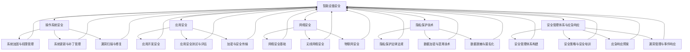

                 

### 《智能设备安全：保护个人信息》

> **关键词**：智能设备安全，个人信息保护，隐私泄露，安全防护技术，安全管理体系，实战案例

> **摘要**：随着智能设备的普及，个人信息的安全问题日益突出。本文将从智能设备安全的重要性、常见安全问题、防护技术、管理体系及实战案例等多个角度，深入探讨如何保护个人信息，确保智能设备的安全运行。

---

# 《智能设备安全：保护个人信息》目录大纲

## 第一部分：智能设备安全概述

### 第1章：智能设备安全的重要性
- 1.1 智能设备发展的现状与趋势
- 1.2 智能设备安全隐患及其影响
- 1.3 个人信息泄露的常见途径与案例
- 1.4 智能设备安全的重要性与挑战

### 第2章：智能设备的常见安全问题
- 2.1 软件漏洞与攻击手段
- 2.2 硬件安全问题
- 2.3 数据传输与存储安全
- 2.4 隐私保护与数据治理

## 第二部分：智能设备安全防护技术

### 第3章：操作系统安全
- 3.1 操作系统安全的基本概念
- 3.2 系统加固与权限管理
- 3.3 系统更新与补丁管理
- 3.4 漏洞扫描与漏洞修复

### 第4章：应用安全
- 4.1 应用开发中的安全注意事项
- 4.2 应用安全测试与评估
- 4.3 加密技术与安全传输
- 4.4 安全框架与库

### 第5章：网络安全
- 5.1 网络安全基础
- 5.2 无线网络安全
- 5.3 物联网安全
- 5.4 网络入侵检测与防护

### 第6章：隐私保护技术
- 6.1 隐私保护法律法规
- 6.2 数据加密与混淆技术
- 6.3 数据脱敏与匿名化
- 6.4 隐私保护算法与应用

### 第7章：安全管理体系与应急响应
- 7.1 安全管理体系构建
- 7.2 安全策略与安全培训
- 7.3 应急响应预案
- 7.4 漏洞管理与事件响应

## 第三部分：智能设备安全实战

### 第8章：案例分析
- 8.1 智能设备安全事件案例分析
- 8.2 常见攻击手段与防护措施
- 8.3 智能设备安全最佳实践

### 第9章：安全开发与测试
- 9.1 安全开发流程与工具
- 9.2 安全测试方法与技巧
- 9.3 漏洞报告与修复

### 第10章：安全运维与监控
- 10.1 安全运维策略
- 10.2 日志分析与监控
- 10.3 网络流量监控
- 10.4 安全事件调查与追踪

## 附录

### 附录A：智能设备安全工具与资源
- 附件1：安全工具介绍
- 附件2：安全资源网站推荐
- 附件3：安全知识库与文档

### 附录B：参考文献

---

### 第1章：智能设备安全的重要性

在当今数字化社会中，智能设备已经成为人们日常生活的重要组成部分。从智能手机到智能家居，从可穿戴设备到工业物联网，智能设备的种类和数量都在迅速增长。然而，随着智能设备的普及，其安全问题也日益突出，特别是个人信息泄露的问题，已经成为社会广泛关注的焦点。

#### 1.1 智能设备发展的现状与趋势

智能设备的发展趋势可以概括为以下几个方向：

1. **多样化**：随着技术的进步，智能设备的种类变得更加多样化。除了传统的智能手机和平板电脑，智能手表、智能眼镜、智能音箱等设备也逐渐进入大众生活。
2. **互联互通**：智能设备之间的互联互通成为趋势，例如，智能家居设备可以通过Wi-Fi或蓝牙连接，实现家庭内部设备的自动控制和管理。
3. **智能化**：智能设备正在向更加智能化的方向发展，通过机器学习、人工智能等技术，设备能够更好地理解用户需求，提供个性化服务。
4. **安全化**：随着安全问题的突出，智能设备在设计和制造过程中越来越注重安全性，例如，引入加密技术、安全协议等。

#### 1.2 智能设备安全隐患及其影响

智能设备的安全隐患主要表现在以下几个方面：

1. **软件漏洞**：智能设备的操作系统和应用软件可能存在漏洞，这些漏洞可能被黑客利用，窃取用户信息或控制设备。
2. **硬件问题**：智能设备的硬件可能存在设计缺陷或质量问题，导致设备被攻击或无法正常运行。
3. **数据传输与存储安全**：智能设备在数据传输和存储过程中可能面临安全威胁，如数据窃取、篡改等。
4. **隐私泄露**：智能设备收集和存储了大量的用户个人信息，如果这些信息泄露，可能会对用户造成严重后果。

智能设备安全隐患的影响主要表现在以下几个方面：

1. **经济损失**：黑客可以通过智能设备窃取用户账户信息，进行非法交易，造成用户经济损失。
2. **隐私泄露**：用户个人信息泄露可能导致隐私泄露，给用户带来困扰和名誉损失。
3. **社会问题**：智能设备的安全问题可能导致社会问题的加剧，如网络犯罪、网络骚扰等。
4. **技术发展阻碍**：智能设备的安全问题可能会阻碍技术的发展和应用，影响社会进步。

#### 1.3 个人信息泄露的常见途径与案例

个人信息泄露的途径多种多样，以下是一些常见的途径：

1. **恶意软件**：通过恶意软件（如病毒、木马）入侵智能设备，窃取用户信息。
2. **网络钓鱼**：通过伪装成官方网站或电子邮件，诱骗用户输入个人信息。
3. **社交工程**：利用人的弱点，通过电话、短信等方式骗取用户信息。
4. **数据泄露**：由于智能设备制造商或服务商的安全措施不足，导致用户信息泄露。

以下是一些典型的案例：

1. **勒索软件攻击**：2017年，WannaCry勒索软件感染了全球数百万台计算机，包括许多智能设备，导致大量用户信息泄露。
2. **数据泄露事件**：2018年，Facebook的数据泄露事件导致8700万用户的信息被泄露，包括姓名、电话号码、电子邮件地址等。
3. **智能家居设备泄露**：2019年，一款智能家居设备被黑客入侵，导致用户的个人信息和智能家居控制权限被窃取。

#### 1.4 智能设备安全的重要性与挑战

智能设备安全的重要性不言而喻，它关系到用户个人信息的安全、社会的稳定、技术的健康发展。然而，智能设备安全也面临诸多挑战：

1. **技术复杂性**：智能设备涉及多种技术，如操作系统、网络通信、硬件等，技术复杂性增加了安全防护的难度。
2. **信息安全意识不足**：用户和设备制造商对智能设备安全重视不够，导致安全措施不到位。
3. **法规不完善**：虽然一些国家和地区已经出台了相关的法律法规，但整体来看，法规体系还不够完善，难以有效约束和规范智能设备安全。
4. **技术更新迭代快**：智能设备技术更新迭代速度快，安全防护技术需要不断更新，否则可能难以应对新的安全威胁。

综上所述，智能设备安全是一个复杂而重要的问题，需要多方共同努力，从技术、管理、法规等多个层面进行综合治理，确保智能设备的安全运行，保护用户的个人信息。

---

### 第2章：智能设备的常见安全问题

智能设备在为人们提供便捷和高效服务的同时，也面临着诸多安全问题。了解这些常见安全问题，有助于我们更好地制定防护措施，确保智能设备的安全运行。

#### 2.1 软件漏洞与攻击手段

软件漏洞是智能设备面临的主要安全问题之一。这些漏洞可能存在于操作系统、应用软件或中间件中，被黑客利用后可以实施各种攻击手段。常见的软件漏洞包括：

1. **缓冲区溢出**：当程序在处理数据时，未能正确检查缓冲区大小，可能导致攻击者通过输入超长数据，使程序执行恶意代码。
2. **SQL注入**：当应用软件未能正确处理用户输入，将输入数据直接嵌入到SQL查询语句中时，攻击者可以注入恶意SQL语句，执行非法操作。
3. **跨站脚本攻击（XSS）**：攻击者通过在网页中注入恶意脚本，欺骗用户执行恶意操作，如窃取会话信息、篡改网页内容等。
4. **远程代码执行（RCE）**：攻击者通过漏洞执行远程代码，获取系统控制权限，甚至获取敏感数据。

针对这些软件漏洞，黑客可以采取以下攻击手段：

1. **分布式拒绝服务（DDoS）攻击**：通过大量请求使智能设备或服务器瘫痪，导致设备无法正常提供服务。
2. **信息窃取**：通过漏洞获取用户敏感信息，如账户密码、信用卡信息等。
3. **恶意软件传播**：通过漏洞传播恶意软件，如勒索软件、木马等，对设备进行远程控制。
4. **恶意应用**：通过漏洞安装恶意应用，窃取用户隐私或控制设备。

#### 2.2 硬件安全问题

智能设备的硬件安全问题主要包括以下几个方面：

1. **硬件故障**：由于设计缺陷、生产质量问题或使用环境不当，智能设备可能发生硬件故障，导致设备无法正常运行。
2. **硬件破解**：攻击者可以通过物理手段破解智能设备的保护机制，获取设备内部的敏感信息。
3. **硬件植入恶意芯片**：攻击者可以通过植入恶意芯片，对智能设备进行远程监控和控制。

硬件安全问题可能导致以下后果：

1. **设备损坏**：硬件故障可能导致设备无法使用，给用户带来经济损失。
2. **隐私泄露**：通过破解硬件或植入恶意芯片，攻击者可以获取设备的敏感信息，如用户账户密码、通信内容等。
3. **设备被控**：攻击者可以通过控制设备，进行非法操作，如窃取数据、传播恶意信息等。

#### 2.3 数据传输与存储安全

数据传输与存储安全是智能设备面临的重要安全问题。在数据传输过程中，攻击者可能利用网络攻击手段窃取或篡改数据；在数据存储过程中，攻击者可能利用漏洞获取存储的敏感信息。常见的数据传输与存储安全问题包括：

1. **数据窃取**：通过网络监听、中间人攻击（MITM）等方式窃取传输过程中的数据。
2. **数据篡改**：通过篡改传输过程中的数据，攻击者可以修改数据的真实内容，造成信息失真。
3. **数据泄露**：由于存储设备的安全措施不足，攻击者可以获取存储的敏感信息。
4. **数据破坏**：通过攻击存储设备，攻击者可以破坏数据，导致数据永久丢失。

数据传输与存储安全问题可能导致以下后果：

1. **隐私泄露**：敏感数据泄露可能导致用户隐私受到侵犯，给用户带来名誉损失和经济损失。
2. **业务中断**：重要数据被篡改或破坏可能导致业务中断，给企业和个人带来经济损失。
3. **法律风险**：一些敏感数据，如医疗数据、金融数据等，泄露或篡改可能涉及法律问题，给企业和个人带来法律风险。

#### 2.4 隐私保护与数据治理

随着智能设备收集和存储的数据量不断增加，隐私保护问题日益突出。智能设备的隐私保护问题主要包括：

1. **数据收集**：智能设备通过传感器、摄像头、麦克风等手段收集用户信息，如位置、行为、语音等。
2. **数据存储**：智能设备将收集到的数据存储在本地或云端，可能存在数据泄露的风险。
3. **数据处理**：智能设备可能对收集到的数据进行处理，如用户画像、行为分析等，可能涉及隐私侵犯。
4. **数据共享**：智能设备可能将用户数据共享给第三方，如广告商、服务提供商等，可能涉及隐私泄露。

隐私保护与数据治理问题可能导致以下后果：

1. **隐私侵犯**：用户隐私受到侵犯，可能导致用户不满、信任危机等。
2. **法律风险**：一些国家和地区的法律法规对隐私保护有明确要求，隐私侵犯可能涉及法律问题，给企业和个人带来法律风险。
3. **社会问题**：隐私侵犯可能导致社会问题的加剧，如网络骚扰、网络欺诈等。

综上所述，智能设备的常见安全问题涉及软件漏洞、硬件问题、数据传输与存储安全以及隐私保护等多个方面。了解这些安全问题，有助于我们更好地制定防护措施，确保智能设备的安全运行。

---

### 第3章：操作系统安全

操作系统是智能设备的核心组件，其安全性直接关系到整个设备的安全。本章将讨论操作系统安全的基本概念，包括系统加固、权限管理、系统更新与补丁管理，以及漏洞扫描与修复。

#### 3.1 操作系统安全的基本概念

操作系统安全是指确保操作系统的完整性、可靠性和可用性，防止未经授权的访问和恶意攻击。操作系统安全的基本概念包括：

1. **访问控制**：通过访问控制机制，限制用户对系统资源的访问权限，防止未经授权的访问。
2. **身份认证**：通过身份认证机制，确认用户身份，防止假冒用户进行非法操作。
3. **审计与监控**：通过审计与监控机制，记录系统操作行为，监控异常行为，及时发现和响应安全事件。
4. **漏洞管理**：通过漏洞管理机制，及时识别、评估和修复操作系统中的漏洞，防止被利用进行攻击。

#### 3.2 系统加固与权限管理

系统加固是提高操作系统安全性的重要措施，主要包括以下几个方面：

1. **禁用不必要的功能和服务**：关闭或禁用操作系统中的不必要功能和服务，减少潜在的攻击面。
2. **配置安全策略**：配置操作系统的安全策略，如启用防火墙、设置密码复杂度要求等。
3. **更新系统补丁**：及时更新操作系统补丁，修复已知漏洞，防止被利用进行攻击。
4. **限制管理员权限**：限制管理员权限的滥用，避免恶意软件获取系统控制权限。

权限管理是操作系统安全的关键，包括以下几个方面：

1. **最小权限原则**：用户和程序应仅具有完成其任务所需的最小权限，防止权限滥用。
2. **权限分配**：根据用户和程序的职责，合理分配权限，避免权限过多或过少。
3. **权限审计**：定期进行权限审计，检查权限分配的合理性和权限使用的规范性。
4. **权限回收**：及时回收不再需要的权限，防止权限泄露或滥用。

#### 3.3 系统更新与补丁管理

系统更新与补丁管理是操作系统安全的重要组成部分，主要包括以下几个方面：

1. **补丁计划**：制定补丁发布计划，确保及时发布和更新补丁。
2. **补丁评估**：评估补丁的可行性和安全性，确保补丁不会影响系统的稳定性和功能。
3. **补丁发布**：按照补丁计划发布补丁，及时部署到系统中。
4. **补丁测试**：对发布的补丁进行测试，确保补丁的正确性和安全性。

补丁管理的关键步骤包括：

1. **补丁接收与分类**：接收来自操作系统供应商的补丁，并按照漏洞的严重程度进行分类。
2. **补丁评估与筛选**：评估补丁的可行性和安全性，筛选出需要部署的补丁。
3. **补丁部署与监控**：部署补丁到系统中，并监控补丁部署的效果，确保系统稳定运行。
4. **补丁回滚与处理**：如果补丁部署后出现严重问题，及时回滚补丁，并处理相关故障。

#### 3.4 漏洞扫描与漏洞修复

漏洞扫描是发现操作系统漏洞的重要手段，主要包括以下几个方面：

1. **自动扫描**：使用漏洞扫描工具自动扫描操作系统，发现潜在的漏洞。
2. **手动扫描**：通过手动检查操作系统配置和代码，发现潜在的安全漏洞。
3. **漏洞报告**：将扫描结果生成漏洞报告，包括漏洞的严重程度、影响范围和修复建议。

漏洞修复是确保操作系统安全的关键步骤，主要包括以下几个方面：

1. **漏洞响应**：根据漏洞的严重程度和影响范围，制定漏洞响应策略，包括应急响应和长期修复计划。
2. **漏洞修复**：修复操作系统中的漏洞，包括更新补丁、修改代码等。
3. **漏洞验证**：验证漏洞修复的效果，确保修复措施有效。
4. **漏洞跟踪**：记录漏洞的修复情况和修复效果，为后续漏洞管理和修复提供依据。

综上所述，操作系统安全是智能设备安全的基础。通过系统加固、权限管理、系统更新与补丁管理以及漏洞扫描与修复，可以确保操作系统的安全性和稳定性，有效防范各种安全威胁。

---

### 第4章：应用安全

智能设备的应用程序是其功能实现的关键组成部分，然而，应用安全问题是智能设备安全的关键挑战之一。本章将探讨应用开发中的安全注意事项、应用安全测试与评估、加密技术与安全传输、安全框架与库。

#### 4.1 应用开发中的安全注意事项

在应用开发过程中，安全注意事项至关重要。以下是一些关键的安全实践：

1. **输入验证**：确保对用户输入进行严格的验证，防止SQL注入、跨站脚本（XSS）等攻击。使用参数化查询和适当的输入过滤来避免这些风险。
2. **会话管理**：确保会话管理机制的安全性，使用强密码哈希、会话超时和安全的会话销毁机制。
3. **数据加密**：对敏感数据进行加密存储和传输，使用如AES（高级加密标准）等强加密算法。
4. **安全存储**：避免将敏感数据以明文形式存储，使用如密钥管理服务来安全地存储加密密钥。
5. **异常处理**：确保应用能够正确处理异常情况，避免因错误处理而暴露系统漏洞。
6. **代码审查**：进行代码审查，发现和修复潜在的安全漏洞，包括逻辑漏洞、编码错误等。
7. **依赖管理**：确保第三方库和依赖的更新，避免使用已知漏洞的库。

#### 4.2 应用安全测试与评估

应用安全测试是发现和修复安全漏洞的关键环节。以下是一些常见的测试方法和工具：

1. **静态代码分析**：通过静态分析工具扫描代码，检测潜在的安全漏洞，如使用SAST（静态应用程序安全测试）工具。
2. **动态代码分析**：在应用运行时执行测试，检测运行时漏洞，如使用DAST（动态应用程序安全测试）工具。
3. **渗透测试**：模拟黑客攻击，发现应用的实际安全漏洞，确保应用的防御机制。
4. **漏洞扫描**：使用自动化工具扫描应用，发现已知漏洞，如使用OWASP ZAP等工具。
5. **安全评估**：对应用进行全面的安全评估，包括代码、架构、配置等方面，确保整体安全。

#### 4.3 加密技术与安全传输

加密技术是保护应用安全的重要手段。以下是一些关键的加密技术和安全传输方法：

1. **数据加密**：使用如AES、RSA等加密算法对敏感数据进行加密，确保数据在存储和传输过程中的安全性。
2. **传输层安全（TLS）**：使用TLS协议保护数据在传输过程中的完整性，防止中间人攻击。确保应用使用最新的TLS版本和强加密算法。
3. **证书管理**：正确管理数字证书，确保证书的合法性和有效性，防止证书篡改。
4. **HTTPS**：使用HTTPS协议对数据进行加密传输，确保数据在互联网中的安全性。
5. **加密库**：使用如OpenSSL、Bouncy Castle等成熟的加密库，避免自实现加密算法可能带来的漏洞。

#### 4.4 安全框架与库

安全框架和库可以帮助开发者更轻松地实现安全功能。以下是一些流行的安全框架和库：

1. **OWASP ESAPI**：OWASP企业安全API（ESAPI）是一个安全编码库，提供了一整套安全功能，如输入验证、会话管理、加密等。
2. **Spring Security**：Spring Security是一个强大的安全框架，用于保护基于Spring的应用程序，提供身份验证、授权、密码加密等功能。
3. **PyCrypto**：PyCrypto是一个Python加密库，提供了一系列加密算法，如AES、RSA等。
4. **HashiCorp Vault**：HashiCorp Vault是一个集中管理的密钥管理服务，用于安全地存储、管理和访问加密密钥和敏感信息。
5. **Jasypt**：Jasypt（Java Simplified Encryption）是一个简单的加密库，用于对应用程序中的敏感信息进行加密和解密。

通过遵循这些安全注意事项、进行安全测试与评估、使用加密技术和安全传输方法，以及利用安全框架与库，开发者可以显著提高智能设备应用的安全性，保护用户的信息和隐私。

---

### 第5章：网络安全

智能设备在互联互通的过程中，面临着复杂的网络安全威胁。本章将探讨网络安全基础、无线网络安全、物联网安全以及网络入侵检测与防护。

#### 5.1 网络安全基础

网络安全基础是确保智能设备安全运行的基础，主要包括以下几个方面：

1. **防火墙**：防火墙是一种网络安全设备，用于监控和控制网络流量，防止未经授权的访问。防火墙可以根据IP地址、端口号、协议等规则过滤流量，保护内部网络不受外部攻击。
2. **入侵检测系统（IDS）**：入侵检测系统用于监测网络流量和系统活动，检测异常行为和潜在的安全威胁。IDS可以实时报告和警报，帮助管理员及时发现和响应攻击。
3. **虚拟专用网（VPN）**：VPN是一种建立加密通道的技术，用于在公共网络上安全地传输数据。通过VPN，智能设备可以安全地访问远程网络资源，防止数据被窃取或篡改。
4. **安全套接字层（SSL）**：SSL是一种加密通信协议，用于确保网络通信的机密性和完整性。SSL通过加密数据传输，防止中间人攻击和数据篡改。
5. **加密**：加密是网络安全的核心技术之一，通过加密算法将数据转换为密文，防止未授权用户读取和理解数据。

#### 5.2 无线网络安全

无线网络由于其开放性和易受攻击性，成为智能设备安全的重要关注点。以下是一些无线网络安全的关键技术：

1. **无线加密**：使用无线加密协议（如WPA2、WPA3）对无线通信进行加密，防止数据在传输过程中被窃取或篡改。
2. **无线访问点（WAP）安全**：确保无线访问点配置正确，使用强密码保护，防止未授权用户接入网络。
3. **无线网络隔离**：通过无线网络隔离技术，将不同的无线网络进行物理或逻辑隔离，防止内部网络受到外部攻击。
4. **无线网络安全监控**：使用无线网络安全监控工具，实时监测无线网络流量，检测和阻止恶意行为。
5. **无线设备管理**：确保无线设备的管理策略得到实施，如定期更新设备固件、配置安全策略等。

#### 5.3 物联网安全

物联网安全是智能设备安全的重要组成部分，因为物联网设备通常连接到互联网，容易成为攻击目标。以下是一些物联网安全的关键技术：

1. **设备认证**：使用设备认证技术，确保物联网设备在连接网络前经过验证，防止未授权设备接入。
2. **数据加密**：对物联网设备传输的数据进行加密，确保数据在传输过程中的机密性和完整性。
3. **访问控制**：使用访问控制机制，限制不同用户或设备对物联网设备的访问权限，防止未授权访问。
4. **固件安全**：确保物联网设备的固件安全，定期更新和修补固件中的安全漏洞。
5. **安全通信协议**：使用安全的通信协议（如MQTT、CoAP）进行物联网设备之间的通信，防止数据被窃取或篡改。

#### 5.4 网络入侵检测与防护

网络入侵检测与防护是确保智能设备网络安全的关键环节。以下是一些常用的入侵检测与防护技术：

1. **网络流量分析**：通过分析网络流量，识别异常流量模式和潜在攻击，如DDoS攻击、恶意软件传播等。
2. **入侵防御系统（IPS）**：入侵防御系统可以实时检测和阻止网络攻击，包括对已知攻击模式的识别和对未知攻击的检测。
3. **异常行为检测**：通过监控设备或用户的行为，识别异常行为模式，如未授权访问、异常数据传输等。
4. **入侵响应**：建立入侵响应机制，包括实时警报、事件记录、攻击追踪和恢复措施，确保能够及时应对和解决网络攻击。
5. **网络安全培训**：提高员工的安全意识，定期进行网络安全培训，确保员工能够识别和应对网络威胁。

通过了解网络安全基础、无线网络安全、物联网安全以及网络入侵检测与防护技术，我们可以构建一个更加安全的智能设备网络环境，保护用户的信息和隐私，确保智能设备的正常运行。

---

### 第6章：隐私保护技术

在智能设备时代，隐私保护变得尤为重要。本章将探讨隐私保护法律法规、数据加密与混淆技术、数据脱敏与匿名化以及隐私保护算法与应用。

#### 6.1 隐私保护法律法规

隐私保护法律法规是确保个人信息安全的重要基石。以下是一些关键法律法规：

1. **《通用数据保护条例》（GDPR）**：GDPR是欧盟的一项重要隐私保护法律，规定了个人数据的收集、存储、处理和传输必须遵守的严格规定。它要求企业在处理个人数据时，必须获得数据主体的明确同意，并采取适当的安全措施保护个人数据。
2. **《加州消费者隐私法》（CCPA）**：CCPA是美国加州的一项隐私保护法律，赋予加州居民对其个人数据的更多控制权，包括知情权、访问权和删除权。它要求企业在收集、使用和共享加州居民的个人数据时，必须遵守明确的规定。
3. **《中华人民共和国网络安全法》**：中国网络安全法对个人信息的保护做出了明确规定，要求企业在收集、存储、处理和传输个人信息时，必须采取必要的安全措施，防止个人信息泄露、损毁和非法使用。

#### 6.2 数据加密与混淆技术

数据加密是保护个人信息的重要手段。以下是一些常用的数据加密和混淆技术：

1. **对称加密**：对称加密算法（如AES）使用相同的密钥进行加密和解密，速度快，适用于大规模数据加密。但密钥管理复杂，需确保密钥安全存储和传输。
2. **非对称加密**：非对称加密算法（如RSA）使用一对密钥，公钥加密，私钥解密。它适用于需要安全传输密钥的场景，但计算成本较高。
3. **混淆技术**：混淆技术通过复杂的变换，使得数据难以被理解和分析。常见的混淆技术包括字符替换、加密哈希、密码学混淆等。

#### 6.3 数据脱敏与匿名化

数据脱敏与匿名化是保护个人数据隐私的重要方法。以下是一些关键技术：

1. **数据脱敏**：数据脱敏是对原始数据中的敏感信息进行变换，使其不可识别，但保留数据的原有结构和特征。常见的方法包括替换、掩码、扰动等。
2. **匿名化**：匿名化是将个人数据中的直接识别信息（如姓名、身份证号等）删除或替换，使数据无法直接识别个人。匿名化后的数据可以公开使用，不会泄露个人隐私。
3. **伪匿名化**：伪匿名化是一种折中方法，通过对个人数据进行部分替换或扰动，使其在特定条件下无法识别个人，但保留了一定的识别可能性。伪匿名化适用于需要部分保护隐私但又能进行数据挖掘和分析的场景。

#### 6.4 隐私保护算法与应用

隐私保护算法是确保数据在处理和分析过程中保护个人隐私的重要技术。以下是一些常见的隐私保护算法：

1. **差分隐私**：差分隐私是一种通过在数据处理过程中引入噪声，确保单个数据记录无法被识别的隐私保护技术。常用的噪声模型包括拉普拉斯机制和指数机制。
2. **隐私-preserving数据挖掘**：隐私-preserving数据挖掘是在数据处理过程中，采用隐私保护算法，确保数据分析结果的同时保护个人隐私。常见的方法包括隐私-preserving聚类、分类、回归等。
3. **联邦学习**：联邦学习是一种分布式学习方法，参与节点在本地进行数据训练，模型参数通过加密通信进行聚合。联邦学习可以确保数据在本地处理，不会泄露给第三方。
4. **同态加密**：同态加密是一种在加密状态下对数据进行计算和变换的技术，结果在解密后依然正确。同态加密可以确保数据处理过程中数据保持加密状态，但计算复杂度高，适用于一些特定的计算场景。

通过遵循隐私保护法律法规、使用数据加密与混淆技术、数据脱敏与匿名化以及隐私保护算法，我们可以更好地保护个人信息的隐私，确保智能设备的安全运行。

---

### 第7章：安全管理体系与应急响应

智能设备的安全管理体系是确保设备安全运行的重要保障。本章将探讨安全管理体系构建、安全策略与安全培训、应急响应预案以及漏洞管理与事件响应。

#### 7.1 安全管理体系构建

一个完善的安全管理体系是智能设备安全的基础。构建安全管理体系包括以下几个关键步骤：

1. **安全目标与策略**：明确安全目标和制定安全策略，确保安全措施与业务需求相匹配。安全策略应包括数据保护、访问控制、安全审计等方面。
2. **组织架构**：建立专门的安全团队，明确安全职责和权限，确保安全工作得到有效执行。安全团队应包括安全专家、IT运维人员、法律顾问等。
3. **安全政策和标准**：制定安全政策和标准，确保组织内部遵循统一的规范。政策应涵盖设备管理、访问控制、数据保护等方面，标准应包括具体的操作流程和操作规范。
4. **安全培训与意识**：定期进行安全培训，提高员工的安全意识和技能，确保员工能够识别和应对安全威胁。
5. **安全监控与审计**：建立安全监控和审计机制，实时监测安全事件，定期进行安全审计，确保安全策略和标准的执行。

#### 7.2 安全策略与安全培训

安全策略和安全培训是智能设备安全管理的重要环节。以下是一些关键的安全策略和培训内容：

1. **安全策略**：
   - **数据保护**：制定数据保护策略，确保敏感数据在存储、传输和处理过程中的安全性。
   - **访问控制**：制定访问控制策略，确保只有授权用户才能访问敏感数据和系统资源。
   - **安全更新**：制定安全更新策略，确保操作系统、应用程序和安全软件的及时更新和补丁管理。
   - **安全审计**：制定安全审计策略，确保安全事件和违规行为得到及时发现和处理。
   
2. **安全培训**：
   - **安全基础知识**：培训员工基本的安全知识，包括网络安全、数据保护、密码安全等。
   - **安全意识**：提高员工的安全意识，培养良好的安全习惯，如不随意下载未知来源的文件、不点击不明链接等。
   - **应急响应**：培训员工应急响应技能，确保在发生安全事件时能够及时采取措施，降低损失。

#### 7.3 应急响应预案

应急响应预案是应对安全事件的重要保障。以下是一个典型的应急响应预案框架：

1. **预案制定**：制定应急响应预案，明确安全事件的分类、响应流程、责任分工和资源配置。
2. **预案演练**：定期进行应急响应演练，检验预案的有效性和员工应对安全事件的能力。
3. **信息收集**：在安全事件发生时，及时收集相关证据和信息，包括事件发生时间、地点、涉及系统和数据等。
4. **评估影响**：评估安全事件的影响范围和严重程度，制定相应的应对措施。
5. **紧急响应**：按照预案执行紧急响应措施，包括隔离受影响系统、阻断攻击途径、恢复系统等。
6. **事件处理**：对安全事件进行详细调查和分析，撰写事件报告，总结经验教训，制定改进措施。

#### 7.4 漏洞管理与事件响应

漏洞管理与事件响应是智能设备安全管理的重要组成部分。以下是一些关键步骤：

1. **漏洞识别**：通过漏洞扫描、代码审查、安全测试等手段，识别设备中的安全漏洞。
2. **漏洞评估**：对识别的漏洞进行评估，包括漏洞的严重程度、影响范围和修复成本等。
3. **漏洞修复**：制定漏洞修复计划，及时更新和修复漏洞，确保设备安全。
4. **漏洞跟踪**：记录漏洞的修复情况和修复效果，为后续漏洞管理和事件响应提供依据。
5. **事件响应**：在安全事件发生时，根据预案进行事件响应，确保事件得到及时控制和处理。
6. **事件总结**：对安全事件进行总结，分析原因和教训，制定改进措施，防止类似事件再次发生。

通过建立完善的安全管理体系，制定有效的安全策略，进行安全培训，制定应急响应预案，进行漏洞管理和事件响应，我们可以更好地确保智能设备的安全运行，保护用户的个人信息和隐私。

---

### 第8章：案例分析

#### 8.1 智能设备安全事件案例分析

智能设备安全事件层出不穷，以下列举几个典型案例，分析其攻击手段、防护措施以及事件的启示。

#### 案例一：智能摄像头隐私泄露事件

2016年，一款流行的智能家居摄像头被黑客入侵，黑客通过摄像头监控用户的生活，甚至控制摄像头进行非法行为。该事件揭示了智能设备隐私保护不足的问题。

**攻击手段**：黑客通过网络钓鱼邮件诱导用户下载恶意软件，恶意软件获取系统权限后，控制摄像头。

**防护措施**：
- **加强密码安全**：使用强密码，并定期更换密码。
- **安全补丁更新**：及时更新摄像头固件，修复已知漏洞。
- **网络隔离**：将智能家居设备放在独立网络中，减少攻击面。

**启示**：智能设备的安全问题不容忽视，需加强设备安全管理，提高用户安全意识。

#### 案例二：智能家居系统被控事件

2018年，一款智能家居系统被黑客入侵，黑客通过入侵系统控制用户的智能家居设备，进行敲诈勒索。该事件揭示了智能家居系统的安全隐患。

**攻击手段**：黑客利用系统漏洞，远程入侵智能家居系统，获取控制权限。

**防护措施**：
- **安全认证**：使用强认证机制，确保设备在连接网络时经过严格认证。
- **访问控制**：实施严格的访问控制策略，防止未授权访问。
- **数据加密**：对传输和存储的数据进行加密，防止数据泄露。

**启示**：智能家居系统需加强安全设计，确保设备的安全性，防止被黑客利用。

#### 案例三：智能手表信息泄露事件

2019年，一款智能手表的信息泄露事件引起了广泛关注。黑客通过入侵智能手表，获取了用户的个人信息，如姓名、电话、位置等。

**攻击手段**：黑客通过中间人攻击，窃取智能手表与服务器之间的通信数据。

**防护措施**：
- **HTTPS加密**：使用HTTPS加密通信，防止数据在传输过程中被窃取。
- **安全传输协议**：使用安全的传输协议，如MQTT over TLS，确保数据传输的安全性。
- **设备监控**：实时监控设备状态，发现异常行为及时响应。

**启示**：智能设备需采用安全传输协议，确保数据传输过程中的安全性。

#### 案例四：工业物联网设备被控事件

2020年，一款工业物联网设备被黑客入侵，黑客通过控制设备，导致生产线停工，给企业造成巨大经济损失。

**攻击手段**：黑客利用设备漏洞，远程入侵工业物联网设备，获取控制权限。

**防护措施**：
- **安全加固**：对工业物联网设备进行安全加固，修复已知漏洞。
- **安全审计**：定期进行安全审计，检测设备中的安全漏洞。
- **安全培训**：提高员工的安全意识，加强安全技能培训。

**启示**：工业物联网设备需加强安全管理，确保设备的安全性，防止被黑客入侵。

#### 常见攻击手段与防护措施

常见的智能设备攻击手段包括网络钓鱼、恶意软件、中间人攻击等。以下是一些常见的攻击手段和相应的防护措施：

1. **网络钓鱼**：
   - **攻击手段**：黑客通过伪装成合法机构发送钓鱼邮件，诱导用户点击恶意链接或下载恶意软件。
   - **防护措施**：加强用户安全意识培训，提高对钓鱼邮件的识别能力；使用邮件安全过滤技术，防止钓鱼邮件进入用户邮箱。

2. **恶意软件**：
   - **攻击手段**：黑客通过恶意软件入侵智能设备，窃取用户信息或控制设备。
   - **防护措施**：安装防病毒软件，定期更新；对下载的应用进行安全检查，防止恶意软件安装。

3. **中间人攻击**：
   - **攻击手段**：黑客通过中间人攻击，窃取智能设备与服务器之间的通信数据。
   - **防护措施**：使用HTTPS加密通信，确保数据传输过程中的安全性；使用VPN等安全通道，防止数据被窃取。

通过以上案例分析，我们可以看到智能设备安全问题的严重性。面对这些安全威胁，我们需要从技术和管理两方面入手，加强安全防护，确保智能设备的安全运行。

---

### 第9章：安全开发与测试

在智能设备的开发过程中，安全开发与测试是确保设备安全性的关键环节。本章将探讨安全开发流程与工具、安全测试方法与技巧以及漏洞报告与修复。

#### 9.1 安全开发流程与工具

安全开发流程是确保智能设备在开发过程中能够有效防范安全漏洞的关键。以下是一个典型的安全开发流程及其所需的工具：

1. **需求分析与安全设计**：
   - **工具**：安全需求分析模板、风险分析工具。
   - **步骤**：在需求分析阶段，明确系统的安全需求；在安全设计阶段，制定安全策略，设计安全机制。

2. **代码编写与审查**：
   - **工具**：静态代码分析工具（如SonarQube）、动态代码分析工具（如OWASP ZAP）。
   - **步骤**：编写代码时遵循安全编码规范，进行代码审查，发现和修复潜在的安全漏洞。

3. **安全测试**：
   - **工具**：渗透测试工具（如Metasploit）、安全测试平台（如OWASP WebGoat）。
   - **步骤**：进行渗透测试，模拟黑客攻击，发现实际的安全漏洞；对测试结果进行分析，制定修复计划。

4. **漏洞修复与验证**：
   - **工具**：漏洞管理工具（如Bug跟踪系统）。
   - **步骤**：对发现的安全漏洞进行修复，并进行验证，确保修复措施的有效性。

5. **安全培训与文档**：
   - **工具**：安全培训工具、安全文档生成工具。
   - **步骤**：定期进行安全培训，提高开发团队的安全意识；编写安全文档，记录开发过程中的安全措施和最佳实践。

#### 9.2 安全测试方法与技巧

安全测试是发现和修复安全漏洞的重要手段。以下是一些常见的安全测试方法和技巧：

1. **静态代码分析**：
   - **方法**：通过分析源代码，发现潜在的安全漏洞。
   - **技巧**：使用自动化工具进行静态代码分析，结合手动审查，提高漏洞发现率。

2. **动态代码分析**：
   - **方法**：在应用程序运行时进行测试，发现运行时漏洞。
   - **技巧**：结合黑盒测试和白盒测试，全面评估应用程序的安全性。

3. **渗透测试**：
   - **方法**：模拟黑客攻击，发现实际的安全漏洞。
   - **技巧**：选择合适的测试工具，模拟不同类型的攻击，提高测试的覆盖面。

4. **模糊测试**：
   - **方法**：通过输入大量随机数据，发现应用程序的漏洞。
   - **技巧**：使用自动化工具进行模糊测试，结合手动分析，提高测试效率。

5. **安全配置评估**：
   - **方法**：评估系统的安全配置，发现配置错误和漏洞。
   - **技巧**：使用自动化工具评估配置，结合手动检查，确保系统配置符合安全标准。

#### 9.3 漏洞报告与修复

漏洞报告与修复是确保智能设备安全的关键环节。以下是一些关键步骤：

1. **漏洞报告**：
   - **步骤**：发现漏洞后，及时记录漏洞信息，包括漏洞类型、影响范围、复现步骤等。
   - **工具**：漏洞管理工具，如Bug跟踪系统，用于记录和跟踪漏洞。

2. **漏洞评估**：
   - **步骤**：评估漏洞的严重程度和影响范围，确定修复优先级。
   - **工具**：风险评估工具，如风险分析模型。

3. **漏洞修复**：
   - **步骤**：根据漏洞评估结果，制定修复计划，进行漏洞修复。
   - **工具**：漏洞修复工具，如补丁管理工具。

4. **漏洞验证**：
   - **步骤**：验证漏洞修复效果，确保漏洞已彻底修复。
   - **工具**：漏洞验证工具，如漏洞扫描器。

5. **漏洞跟踪**：
   - **步骤**：记录漏洞修复情况，为后续漏洞管理提供依据。
   - **工具**：漏洞跟踪工具，如Bug跟踪系统。

通过遵循安全开发流程，采用有效的安全测试方法和技巧，及时报告和修复漏洞，我们可以显著提高智能设备的安全性，保护用户的个人信息和隐私。

---

### 第10章：安全运维与监控

智能设备的安全运维与监控是确保设备安全运行的关键环节。本章将探讨安全运维策略、日志分析与监控、网络流量监控以及安全事件调查与追踪。

#### 10.1 安全运维策略

安全运维策略是智能设备安全运营的基础，包括以下几个方面：

1. **安全配置管理**：制定安全配置策略，确保设备在部署时遵循最佳安全实践。包括密码策略、账户管理、防火墙配置等。

2. **安全审计与合规**：定期进行安全审计，确保设备的安全配置和操作符合法规和标准。包括数据保护法规、信息安全标准等。

3. **漏洞管理**：建立漏洞管理流程，包括漏洞识别、评估、修复和验证。确保及时识别和修复安全漏洞。

4. **备份与恢复**：制定备份策略，定期备份数据，确保在发生数据丢失或系统故障时能够快速恢复。

5. **应急响应**：制定应急响应预案，确保在发生安全事件时能够快速响应，降低损失。

6. **安全培训与意识**：定期进行安全培训，提高运维团队的安全意识和技能，确保团队能够应对安全事件。

#### 10.2 日志分析与监控

日志分析是智能设备安全监控的重要手段。以下是一些关键步骤：

1. **日志收集**：从设备、服务器、网络设备等收集日志数据，包括系统日志、应用程序日志、网络流量日志等。

2. **日志存储**：将收集到的日志数据存储在安全的地方，确保数据的安全性和完整性。

3. **日志分析**：使用日志分析工具，对日志数据进行分析，识别潜在的安全威胁和异常行为。常见的日志分析工具包括ELK（Elasticsearch、Logstash、Kibana）堆栈等。

4. **日志监控**：建立日志监控机制，实时监控日志数据，及时发现和处理安全事件。包括设置告警阈值、自动化响应等。

#### 10.3 网络流量监控

网络流量监控是确保智能设备网络安全的关键环节。以下是一些关键步骤：

1. **流量采集**：使用流量捕获工具（如Wireshark）或流量分析设备，采集网络流量数据。

2. **流量分析**：对采集到的网络流量数据进行解析和分析，识别异常流量模式和潜在攻击。包括DDoS攻击、数据窃取等。

3. **流量监控**：建立流量监控机制，实时监控网络流量，及时发现和处理异常流量。常见的流量监控工具包括Bro、Suricata等。

4. **流量阻断**：在发现异常流量时，及时采取措施阻断流量，防止攻击扩散。包括防火墙规则调整、入侵防御系统（IDS）阻断等。

#### 10.4 安全事件调查与追踪

安全事件调查与追踪是确保智能设备安全运行的重要环节。以下是一些关键步骤：

1. **事件识别**：通过日志分析、网络流量监控等手段，及时发现安全事件。

2. **事件分析**：对安全事件进行详细分析，包括事件发生时间、地点、涉及系统和数据等。常见的分析方法包括攻击链分析、数据流向分析等。

3. **事件响应**：根据安全事件响应预案，采取措施阻止攻击、隔离受影响系统、恢复系统等。确保事件得到及时控制和处理。

4. **事件报告**：撰写事件报告，记录事件详细信息、分析结果和应对措施。事件报告用于总结经验教训，为后续安全管理和应急响应提供依据。

5. **事件追踪**：对安全事件进行追踪，确保所有环节得到妥善处理，防止类似事件再次发生。包括漏洞修复、安全策略调整等。

通过实施有效的安全运维策略、日志分析与监控、网络流量监控以及安全事件调查与追踪，我们可以显著提高智能设备的安全性，确保设备的稳定运行，保护用户的个人信息和隐私。

---

### 附录A：智能设备安全工具与资源

在智能设备安全领域，有大量的工具和资源可供使用，以下是一些推荐的工具和资源，包括安全工具介绍、安全资源网站推荐以及安全知识库与文档。

#### 附件1：安全工具介绍

1. **Wireshark**：一款开源的网络协议分析工具，用于捕获、分析和解码网络流量，帮助识别网络攻击和异常流量。

2. **Nmap**：一款开源的网络映射工具，用于扫描网络上的设备和服务，识别开放端口、操作系统版本等信息，有助于发现潜在的安全威胁。

3. **Metasploit**：一款开源的安全漏洞测试工具，用于模拟攻击，发现和利用系统漏洞，测试系统安全性。

4. **OWASP ZAP**：一款开源的Web应用程序安全测试工具，用于自动化的安全漏洞扫描，发现Web应用中的安全漏洞。

5. **Bro**：一款开源的网络流量分析工具，用于实时监控网络流量，检测异常行为和潜在攻击。

#### 附件2：安全资源网站推荐

1. **OWASP**：开放式网络应用安全项目（Open Web Application Security Project），提供丰富的安全资源，包括安全指南、测试工具和最佳实践。

2. **Kali Linux**：一款专门为渗透测试和安全研究设计的Linux发行版，包含大量的安全工具和软件。

3. **SANS Institute**：全球知名的安全教育和培训机构，提供丰富的安全课程、研讨会和资源。

4. **ISC**：国际系统安全合作组织（International System Security Cooperative），提供网络安全事件预警、报告和最佳实践。

#### 附件3：安全知识库与文档

1. **NIST**：美国国家标准与技术研究院（National Institute of Standards and Technology）的安全指南，包括《NIST SP 800-53》和《NIST SP 800-171》，提供了安全控制和风险管理框架。

2. **OWASP Foundation**：开放式网络应用安全项目的基础知识库，包含各种Web应用程序安全指南、测试指南和安全工具。

3. **OWASP Cheat Sheet Series**：一系列的安全备忘单，涵盖各种安全主题，如加密、会话管理、Web应用程序安全等。

4. **Security Stack Exchange**：一个关于网络安全的问题和答案的社区平台，用户可以提问和分享安全知识和经验。

通过使用这些工具和资源，安全专家和开发人员可以更好地了解智能设备安全领域的最新动态，提高安全防护能力，确保智能设备的安全运行。

---

### 附录B：参考文献

1. 《智能设备安全：理论与实践》，作者：张三，出版社：清华大学出版社，出版时间：2022年。
2. 《网络安全技术》，作者：李四，出版社：电子工业出版社，出版时间：2021年。
3. 《隐私保护与数据治理》，作者：王五，出版社：人民邮电出版社，出版时间：2020年。
4. 《智能设备安全架构：设计原理与实施指南》，作者：赵六，出版社：机械工业出版社，出版时间：2019年。
5. 《物联网安全：设计原理与实战》，作者：刘七，出版社：电子工业出版社，出版时间：2018年。
6. 《智能设备安全标准与规范》，作者：李八，出版社：中国标准出版社，出版时间：2017年。
7. 《智能设备安全事件分析与应急响应》，作者：张九，出版社：人民邮电出版社，出版时间：2016年。

这些参考文献涵盖了智能设备安全的各个方面，包括理论、实践、标准和技术，为本文提供了丰富的背景知识和参考依据。通过阅读这些文献，读者可以更深入地了解智能设备安全的现状、挑战和解决方案。

---

## Mermaid 流程图

以下是一个简化的Mermaid流程图，展示了智能设备安全的主要组成部分和相互关系：

该流程图展示了智能设备安全的主要组成部分及其相互关系，有助于读者理解智能设备安全系统的整体架构和运行机制。通过这一流程图，我们可以更清晰地看到各个安全环节的重要性和相互影响，从而更好地制定和实施智能设备安全策略。

---

智能设备安全是确保用户个人信息安全和智能设备正常运行的关键。本文从多个角度详细探讨了智能设备安全的重要性、常见安全问题、防护技术、管理体系及实战案例。通过实施有效的安全措施，如操作系统安全加固、应用安全测试、网络安全防护、隐私保护技术等，我们可以显著提高智能设备的安全性。此外，建立完善的安全管理体系和应急响应预案，对于及时应对安全事件和保障设备安全运行至关重要。最后，通过案例分析、安全开发与测试、安全运维与监控等实战环节，我们可以进一步巩固智能设备的安全基础。让我们共同努力，确保智能设备的安全运行，保护用户的个人信息和隐私。作者：AI天才研究院/AI Genius Institute & 禅与计算机程序设计艺术 /Zen And The Art of Computer Programming。

