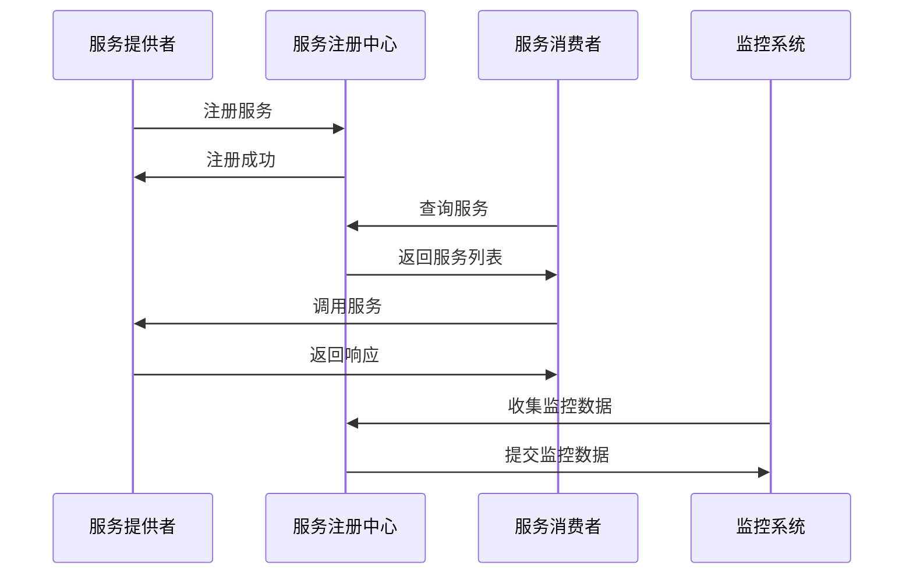
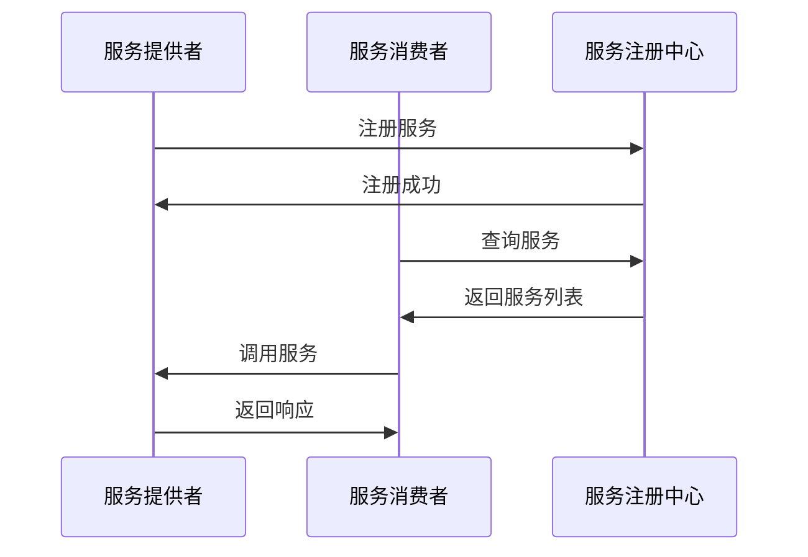
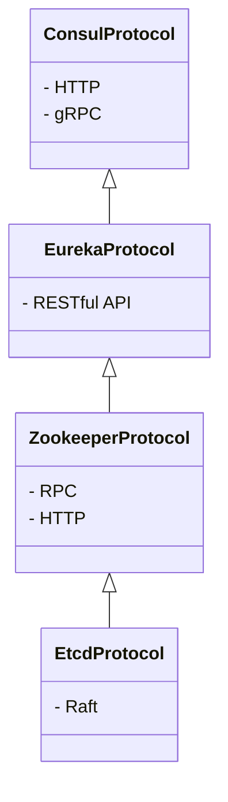
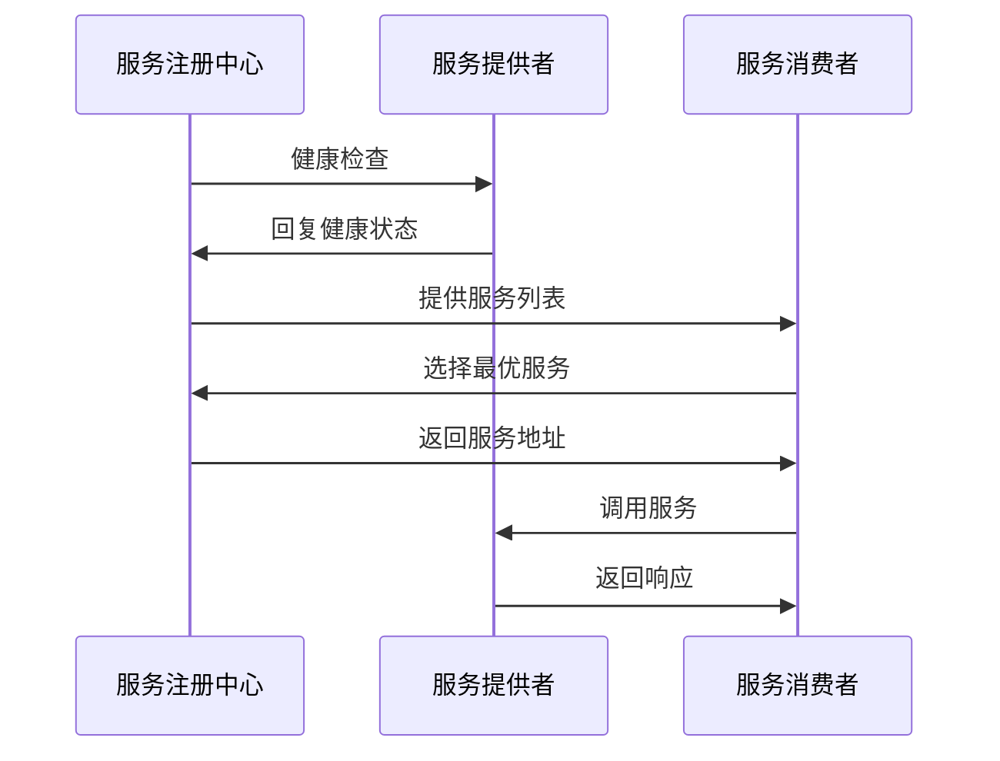
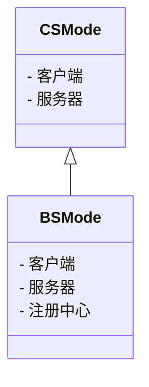
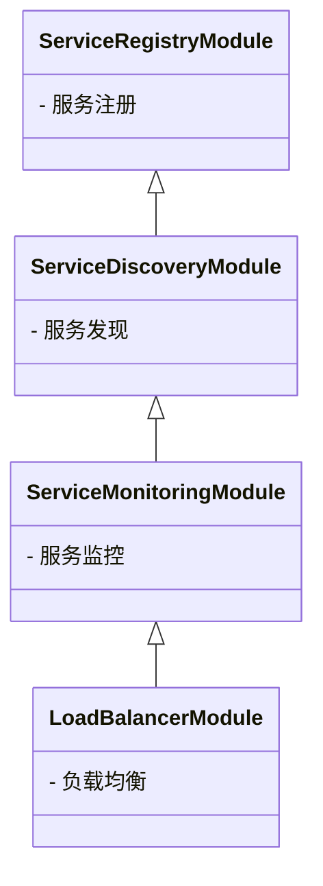
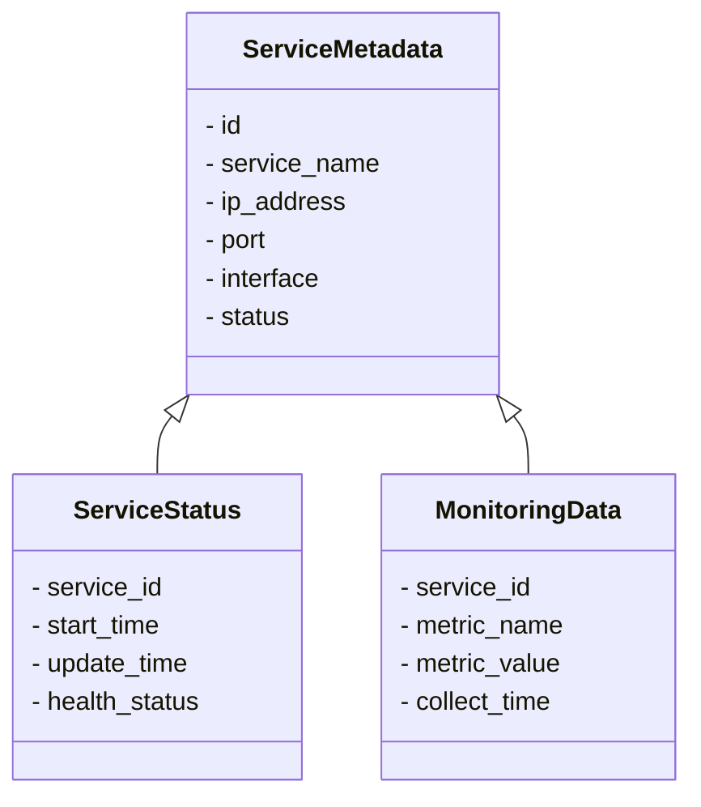
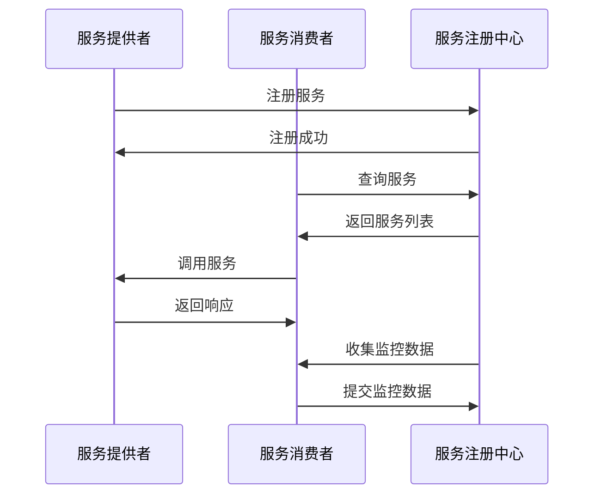
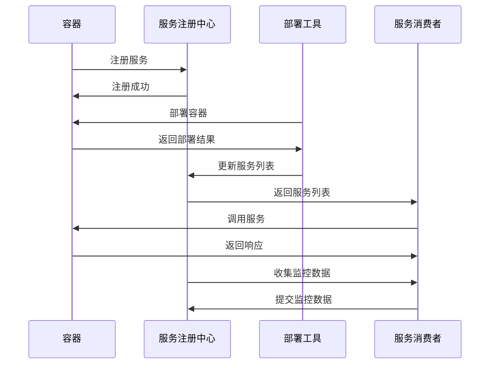
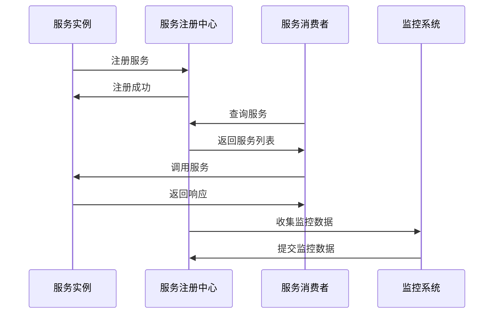

                 

# 《服务注册中心的作用与实现》

> **关键词：**服务注册中心、微服务、服务发现、服务质量监控、架构设计

> **摘要：**本文深入探讨了服务注册中心在分布式系统中的重要作用与实现方法。首先，介绍了服务注册中心的基本概念和核心组件，然后详细阐述了服务注册与发现机制、服务注册中心协议以及服务质量监控与性能优化策略。接着，文章分析了服务注册中心的架构设计、核心算法以及应用场景。通过一个项目实战案例，展示了服务注册中心的实际应用和部署过程。最后，对服务注册中心的发展趋势与挑战进行了展望，并推荐了相关工具、框架和文献资源。

### 目录大纲

- **第一部分：服务注册中心概述**
  - **第1章：服务注册中心的定义与作用**
    - **1.1 服务注册中心的定义**
    - **1.2 服务注册中心的作用**
  - **第2章：服务注册中心的核心技术**
    - **2.1 服务注册与发现机制**
    - **2.2 服务注册中心协议**
    - **2.3 服务质量监控与性能优化**
- **第二部分：服务注册中心实现**
  - **第3章：服务注册中心的架构设计**
    - **3.1 服务注册中心的架构模式**
    - **3.2 服务注册中心的模块设计**
    - **3.3 服务注册中心的数据模型设计**
  - **第4章：服务注册中心的核心算法**
    - **4.1 服务注册与发现算法**
    - **4.2 服务质量评估算法**
    - **4.3 服务性能优化算法**
  - **第5章：服务注册中心的应用场景**
    - **5.1 微服务架构中的服务注册中心**
    - **5.2 容器化环境下的服务注册中心**
    - **5.3 大规模分布式系统中的服务注册中心**
  - **第6章：服务注册中心项目实战**
    - **6.1 项目需求分析**
    - **6.2 系统设计与实现**
    - **6.3 项目部署与运维**
  - **第7章：服务注册中心的发展趋势与挑战**
    - **7.1 服务注册中心的发展趋势**
    - **7.2 服务注册中心的挑战**
    - **7.3 未来展望**
- **附录**
  - **附录A：服务注册中心常用工具与框架**
  - **附录B：服务注册中心相关书籍与论文**

### 第一部分：服务注册中心概述

#### 第1章：服务注册中心的定义与作用

##### 1.1 服务注册中心的定义

服务注册中心（Service Registry Center，简称SRC）是分布式系统中用于管理服务的一种基础设施。它通过存储服务的元数据，如服务名称、IP地址、端口号、接口等，帮助其他服务快速发现和访问提供的服务。服务注册中心是微服务架构中的关键组件，它不仅实现了服务的注册和发现，还提供了服务治理、服务监控和负载均衡等功能。

服务注册中心通常由以下几个核心部分组成：

- **服务注册模块**：负责将服务的元数据注册到注册中心。
- **服务发现模块**：负责查询和跟踪服务的状态，以实现服务的动态发现。
- **服务监控模块**：负责监控服务的健康状态，包括响应时间、错误率等指标。

##### 1.2 服务注册中心的作用

服务注册中心在分布式系统中具有以下几个重要作用：

1. **服务注册**：服务启动时，会将自身的元数据注册到服务注册中心，以便其他服务可以找到并访问它。

2. **服务发现**：服务消费者可以通过服务注册中心来查询可用的服务，并获取服务的地址信息。

3. **服务治理**：服务注册中心提供了对服务的配置管理、版本控制和权限控制等功能，确保服务的可靠性和安全性。

4. **服务监控**：服务注册中心可以收集服务的运行指标，提供监控和报警功能，帮助运维人员及时发现问题。

5. **负载均衡**：服务注册中心可以根据服务的负载情况，自动选择最优的服务进行调用，实现负载均衡。

#### 1.3 服务注册中心的架构

服务注册中心的架构可以分为以下几个层次：

1. **服务提供者层**：服务提供者启动时，会将服务元数据注册到服务注册中心。

2. **服务注册中心层**：服务注册中心负责存储和管理服务元数据，提供服务发现和监控功能。

3. **服务消费者层**：服务消费者通过服务注册中心来查询和访问服务。

4. **监控层**：服务注册中心可以集成监控工具，收集服务的运行指标，提供监控和报警功能。

##### 图1.1 服务注册中心架构



#### 1.4 服务注册中心的发展历程

服务注册中心起源于传统的分布式计算领域，随着云计算和微服务架构的兴起，其重要性日益凸显。以下是服务注册中心的发展历程：

1. **早期分布式系统**：在早期分布式系统中，服务注册中心的概念并不明确，通常通过硬编码的方式指定服务地址，缺乏动态性和灵活性。

2. **中间件技术**：随着中间件技术的发展，如EJB、JMS等，服务注册中心开始逐步融入分布式系统架构中，提供了更可靠的服务注册和发现机制。

3. **微服务架构**：微服务架构的兴起，使得服务注册中心成为微服务架构中的关键组件，其功能也得到了进一步的扩展和优化。

4. **容器化与自动化**：随着Docker和Kubernetes等容器技术的普及，服务注册中心逐渐与容器管理平台集成，实现了服务的自动化注册和发现。

5. **智能化与AI**：随着人工智能技术的快速发展，服务注册中心开始融入机器学习和深度学习算法，实现了智能化的服务治理和性能优化。

### 第二部分：服务注册中心的核心技术

#### 第2章：服务注册中心的核心技术

##### 2.1 服务注册与发现机制

服务注册与发现机制是服务注册中心的核心功能之一，它包括服务注册和服务发现两个关键环节。

1. **服务注册**

服务注册是指服务提供者在启动时，将服务元数据（如服务名称、IP地址、端口号等）注册到服务注册中心。服务注册通常通过以下几种方式实现：

- **HTTP/HTTPS**：服务提供者通过HTTP/HTTPS协议向服务注册中心发送注册请求，包含服务元数据。
- **gRPC**：使用gRPC框架进行服务注册，提供高效、低延迟的通信方式。
- **Dubbo RPC**：使用Dubbo框架进行服务注册，支持多种通信协议。

2. **服务发现**

服务发现是指服务消费者从服务注册中心查询和获取服务的地址信息，以实现服务的调用。服务发现机制通常包括以下几种方式：

- **轮询**：服务消费者定期轮询服务注册中心，获取最新的服务列表。
- **监听**：服务消费者通过监听服务注册中心的变更通知，实时获取服务状态。
- **缓存**：服务消费者将服务注册中心的信息缓存到本地，减少对服务注册中心的访问频率。

##### 图2.1 服务注册与发现机制



##### 2.2 服务注册中心协议

服务注册中心协议是服务注册中心进行通信和数据交换的规范。常见的服务注册中心协议包括以下几种：

1. **Consul协议**：Consul是一个分布式服务网格解决方案，支持HTTP和gRPC协议。它提供了服务注册、发现、健康检查和配置等功能。

2. **Eureka协议**：Eureka是Netflix开源的服务注册与发现组件，采用RESTful API进行通信。它支持服务注册、服务发现和健康检查等功能。

3. **Zookeeper协议**：Zookeeper是一个分布式协调服务，支持RPC和HTTP协议。它提供了服务注册、服务发现、锁服务和配置管理等功能。

4. **Etcd协议**：Etcd是一个分布式键值存储系统，采用Raft算法保证数据一致性。它提供了服务注册、服务发现和配置管理等功能。

##### 图2.2 常见服务注册中心协议



##### 2.3 服务质量监控与性能优化

服务质量监控与性能优化是保证服务稳定性和高效性的重要手段。服务注册中心通过以下几种方式实现服务质量监控与性能优化：

1. **健康检查**：服务注册中心定期对服务进行健康检查，包括响应时间、错误率、负载等指标。健康检查可以通过HTTP/HTTPS请求、gRPC调用等方式进行。

2. **负载均衡**：服务注册中心可以根据服务的负载情况，自动选择最优的服务进行调用，实现负载均衡。常见的负载均衡策略包括轮询、随机、最小连接数等。

3. **容错机制**：服务注册中心可以实现容错机制，如服务失败重试、故障转移等，确保服务的可靠性。

4. **性能优化**：服务注册中心可以通过缓存、异步处理、批量处理等方式，提高系统的性能和吞吐量。

##### 图2.3 服务质量监控与性能优化



### 第三部分：服务注册中心实现

#### 第3章：服务注册中心的架构设计

服务注册中心的架构设计是构建高效、可靠、可扩展的分布式系统的基础。本章节将详细讨论服务注册中心的架构模式、模块设计和数据模型设计。

##### 3.1 服务注册中心的架构模式

服务注册中心可以采用以下两种常见的架构模式：

1. **C/S架构模式**

C/S（Client/Server）架构模式是一种传统的客户端-服务器架构，服务提供者和服务消费者分别作为客户端和服务器进行通信。服务提供者将服务元数据注册到服务注册中心，服务消费者通过服务注册中心获取服务地址进行调用。

- **优点**：架构简单，易于理解，适合中小规模系统。
- **缺点**：服务提供者和消费者之间的通信直接，可能导致性能瓶颈。

2. **B/S架构模式**

B/S（Browser/Server）架构模式是一种基于Web的客户端-服务器架构，服务提供者和消费者通过HTTP协议进行通信。服务注册中心作为一个独立的Web服务器，提供服务注册、发现和监控功能。

- **优点**：架构灵活，可扩展性强，适合大规模分布式系统。
- **缺点**：架构复杂，需要处理大量的HTTP请求，可能影响性能。

##### 图3.1 C/S与B/S架构模式



##### 3.2 服务注册中心的模块设计

服务注册中心可以划分为以下几个关键模块：

1. **服务注册模块**

服务注册模块负责接收服务提供者的注册请求，将服务元数据存储到服务注册中心。服务注册模块需要实现以下功能：

- **服务元数据存储**：将服务名称、IP地址、端口号、接口等元数据存储到数据库或其他存储系统。
- **服务元数据更新**：处理服务提供者的更新请求，更新服务元数据。
- **服务元数据删除**：处理服务提供者的删除请求，删除服务元数据。

2. **服务发现模块**

服务发现模块负责接收服务消费者的查询请求，从服务注册中心获取服务列表，并将服务地址返回给消费者。服务发现模块需要实现以下功能：

- **服务列表查询**：从服务注册中心查询服务列表，支持模糊查询、范围查询等。
- **服务状态监控**：实时监控服务状态，包括服务启动、服务停止、服务故障等。
- **服务地址更新**：处理服务提供者的地址更新请求，更新服务地址。

3. **服务监控模块**

服务监控模块负责收集服务的运行指标，包括响应时间、错误率、负载等，并提供监控和报警功能。服务监控模块需要实现以下功能：

- **运行指标收集**：通过定时任务或事件触发的方式，收集服务的运行指标。
- **监控数据存储**：将监控数据存储到数据库或其他存储系统，支持历史数据查询。
- **报警通知**：根据预设的报警规则，发送报警通知，如邮件、短信等。

4. **负载均衡模块**

负载均衡模块负责根据服务的负载情况，选择最优的服务进行调用，实现负载均衡。负载均衡模块需要实现以下功能：

- **负载指标计算**：计算服务的负载指标，如CPU利用率、内存占用等。
- **服务选择算法**：根据负载指标，选择负载较低的服务进行调用。
- **负载均衡策略**：支持轮询、随机、最小连接数等负载均衡策略。

##### 图3.2 服务注册中心模块设计



##### 3.3 服务注册中心的数据模型设计

服务注册中心的数据模型是服务元数据的管理基础，通常包括以下数据结构：

1. **服务元数据表**

服务元数据表用于存储服务的名称、IP地址、端口号、接口等信息。

- **字段**：服务名称（serviceName）、IP地址（ipAddress）、端口号（port）、接口（interface）、状态（status）等。
- **示例**：

```sql
CREATE TABLE service_metadata (
    id INT AUTO_INCREMENT PRIMARY KEY,
    service_name VARCHAR(255) NOT NULL,
    ip_address VARCHAR(255) NOT NULL,
    port INT NOT NULL,
    interface VARCHAR(255) NOT NULL,
    status VARCHAR(10) NOT NULL
);
```

2. **服务状态表**

服务状态表用于存储服务的实时状态，包括服务启动时间、最后一次更新时间、健康状态等。

- **字段**：服务ID（service_id）、启动时间（start_time）、更新时间（update_time）、健康状态（health_status）等。
- **示例**：

```sql
CREATE TABLE service_status (
    service_id INT PRIMARY KEY,
    start_time DATETIME NOT NULL,
    update_time DATETIME NOT NULL,
    health_status VARCHAR(10) NOT NULL
);
```

3. **监控数据表**

监控数据表用于存储服务的运行指标，包括响应时间、错误率、负载等。

- **字段**：服务ID（service_id）、指标名称（metric_name）、指标值（metric_value）、采集时间（collect_time）等。
- **示例**：

```sql
CREATE TABLE monitoring_data (
    service_id INT,
    metric_name VARCHAR(255) NOT NULL,
    metric_value DECIMAL(10, 2) NOT NULL,
    collect_time DATETIME NOT NULL,
    FOREIGN KEY (service_id) REFERENCES service_metadata(id)
);
```

##### 图3.3 服务注册中心数据模型设计



### 第四部分：服务注册中心的核心算法

#### 第4章：服务注册中心的核心算法

服务注册中心的核心算法是实现服务注册、服务发现、服务质量评估和服务性能优化等功能的关键。本章节将详细介绍这些核心算法的原理和实现。

##### 4.1 服务注册与发现算法

服务注册与发现算法是服务注册中心的基本功能之一，负责处理服务的注册和发现过程。

1. **服务注册算法**

服务注册算法用于将服务元数据注册到服务注册中心。以下是一个简单的服务注册算法伪代码：

```python
def register_service(service_metadata):
    # 向服务注册中心发送注册请求
    request = {
        "service_name": service_metadata.service_name,
        "ip_address": service_metadata.ip_address,
        "port": service_metadata.port,
        "interface": service_metadata.interface
    }
    response = send_request_to_registry_center(request)
    
    # 处理注册结果
    if response.status == "success":
        print("Service registered successfully.")
    else:
        print("Failed to register service.")
```

2. **服务发现算法**

服务发现算法用于从服务注册中心查询和获取服务列表。以下是一个简单的服务发现算法伪代码：

```python
def discover_services():
    # 向服务注册中心发送查询请求
    request = {
        "service_name": "weather"
    }
    response = send_request_to_registry_center(request)
    
    # 处理查询结果
    if response.status == "success":
        services = response.services
        print("Available services:", services)
    else:
        print("Failed to discover services.")
```

##### 4.2 服务质量评估算法

服务质量评估算法用于评估服务的质量，包括响应时间、错误率、负载等指标。以下是一个简单的服务质量评估算法伪代码：

```python
def evaluate_service_quality(service_id):
    # 从监控数据表中查询服务运行指标
    metrics = query_metrics_by_service_id(service_id)
    
    # 计算平均响应时间
    average_response_time = calculate_average_response_time(metrics)
    
    # 计算错误率
    error_rate = calculate_error_rate(metrics)
    
    # 计算负载
    load = calculate_load(metrics)
    
    # 输出服务质量评估结果
    print("Service ID:", service_id)
    print("Average Response Time:", average_response_time)
    print("Error Rate:", error_rate)
    print("Load:", load)
```

##### 4.3 服务性能优化算法

服务性能优化算法用于根据服务质量和负载情况，选择最优的服务进行调用，实现负载均衡。以下是一个简单的服务性能优化算法伪代码：

```python
def optimize_service_call(services):
    # 计算每个服务的性能指标
    performance_metrics = calculate_performance_metrics(services)
    
    # 选择最优服务
    best_service = select_best_service(performance_metrics)
    
    # 调用最优服务
    call_service(best_service)
```

### 第五部分：服务注册中心的应用场景

#### 第5章：服务注册中心的应用场景

服务注册中心在分布式系统中具有广泛的应用场景，涵盖了微服务架构、容器化环境和大规模分布式系统。本章节将详细介绍服务注册中心在这些应用场景中的应用。

##### 5.1 微服务架构中的服务注册中心

微服务架构是一种将大型单体应用拆分为多个小型、独立、可复用的服务的架构风格。服务注册中心在微服务架构中发挥着关键作用，其主要应用包括：

1. **服务注册与发现**：服务提供者在启动时将服务元数据注册到服务注册中心，服务消费者通过服务注册中心查询和获取服务列表，实现服务的动态调用。

2. **服务治理**：服务注册中心提供服务配置管理、版本控制和权限控制等功能，确保服务的稳定性和安全性。

3. **服务监控**：服务注册中心收集服务的运行指标，提供监控和报警功能，帮助运维人员及时发现和解决问题。

4. **负载均衡**：服务注册中心根据服务的负载情况，选择最优的服务进行调用，实现负载均衡，提高系统的性能和可靠性。

##### 图5.1 微服务架构中的服务注册中心



##### 5.2 容器化环境下的服务注册中心

容器化环境，如Docker和Kubernetes，为微服务架构提供了高效的部署和运行平台。服务注册中心在容器化环境下具有以下应用：

1. **服务注册与发现**：容器启动时，将服务元数据注册到服务注册中心，容器停止时，从服务注册中心注销服务。

2. **服务编排**：服务注册中心与容器编排工具（如Kubernetes）集成，实现服务的自动化部署、扩展和迁移。

3. **服务监控**：服务注册中心集成容器监控工具，收集容器的运行指标，提供监控和报警功能。

4. **负载均衡**：服务注册中心根据容器的负载情况，选择最优的容器进行调用，实现负载均衡。

##### 图5.2 容器化环境下的服务注册中心



##### 5.3 大规模分布式系统中的服务注册中心

大规模分布式系统通常包含成百上千个服务实例，服务注册中心在大规模分布式系统中的应用包括：

1. **服务注册与发现**：服务实例启动时，将服务元数据注册到服务注册中心，服务消费者通过服务注册中心查询和获取服务实例的地址信息。

2. **服务监控**：服务注册中心集成分布式监控工具，收集服务实例的运行指标，提供实时监控和报警功能。

3. **负载均衡**：服务注册中心根据服务实例的负载情况，选择最优的服务实例进行调用，实现负载均衡。

4. **服务治理**：服务注册中心提供服务配置管理、版本控制和权限控制等功能，确保大规模分布式系统的稳定性和安全性。

##### 图5.3 大规模分布式系统中的服务注册中心



### 第六部分：服务注册中心项目实战

#### 第6章：服务注册中心项目实战

在本章节中，我们将通过一个具体的实战项目，详细展示服务注册中心的搭建过程，包括需求分析、系统设计与实现、项目部署与运维等。

##### 6.1 项目需求分析

项目背景：随着业务规模的不断扩大，公司需要一个可靠的服务注册中心来管理分布式系统中的服务，确保服务的注册、发现、监控和负载均衡功能。

需求分析：

1. **服务注册**：服务提供者在启动时，将服务元数据注册到服务注册中心。
2. **服务发现**：服务消费者从服务注册中心查询和获取服务列表。
3. **服务监控**：服务注册中心收集服务的运行指标，提供实时监控和报警功能。
4. **负载均衡**：服务注册中心根据服务的负载情况，选择最优的服务进行调用。

##### 6.2 系统设计与实现

系统架构设计：

1. **服务注册模块**：使用gRPC框架实现服务注册功能，服务提供者在启动时调用注册接口，将服务元数据发送到服务注册中心。
2. **服务发现模块**：使用Consul协议实现服务发现功能，服务消费者通过Consul客户端查询服务列表。
3. **服务监控模块**：使用Prometheus实现服务监控功能，服务注册中心定期收集服务运行指标，并存储到Prometheus中。
4. **负载均衡模块**：使用Spring Cloud实现负载均衡功能，服务消费者通过Spring Cloud LoadBalancer调用服务。

系统模块划分：

1. **服务注册模块**：包括服务注册接口、gRPC客户端和服务端。
2. **服务发现模块**：包括Consul客户端和服务端。
3. **服务监控模块**：包括Prometheus客户端和服务端。
4. **负载均衡模块**：包括Spring Cloud LoadBalancer客户端和服务端。

系统关键功能实现：

1. **服务注册**：服务提供者在启动时，调用gRPC接口向服务注册中心发送注册请求，包含服务元数据。服务注册中心接收到注册请求后，将服务元数据存储到Consul中。
2. **服务发现**：服务消费者通过Consul客户端查询服务列表，获取可用的服务地址。服务消费者在调用服务时，使用Spring Cloud LoadBalancer进行负载均衡。
3. **服务监控**：服务注册中心定期收集服务运行指标，如响应时间、错误率等，并存储到Prometheus中。Prometheus通过配置文件定期拉取服务注册中心的监控数据。
4. **负载均衡**：Spring Cloud LoadBalancer根据服务的负载情况，选择最优的服务进行调用，实现负载均衡。

##### 6.3 项目部署与运维

1. **环境准备**：搭建Java开发环境，安装gRPC、Consul、Prometheus和Spring Cloud相关依赖。
2. **服务注册中心部署**：将服务注册中心代码打包成jar文件，部署到服务器上，启动服务注册中心。
3. **服务提供者部署**：将服务提供者代码打包成jar文件，部署到服务器上，启动服务提供者。服务提供者在启动时，调用gRPC接口向服务注册中心发送注册请求。
4. **服务消费者部署**：将服务消费者代码打包成jar文件，部署到服务器上，启动服务消费者。服务消费者通过Consul客户端查询服务列表，并使用Spring Cloud LoadBalancer调用服务。
5. **监控部署**：部署Prometheus和Grafana，配置Prometheus拉取服务注册中心的监控数据，并通过Grafana展示监控图表。
6. **运维策略**：定期检查服务注册中心、服务提供者和消费者的运行状态，根据监控数据调整系统参数，确保系统的稳定性和可靠性。

### 第七部分：服务注册中心的发展趋势与挑战

#### 第7章：服务注册中心的发展趋势与挑战

随着云计算、微服务架构和容器技术的快速发展，服务注册中心在分布式系统中的应用越来越广泛。本章节将探讨服务注册中心的发展趋势、面临的挑战以及未来展望。

##### 7.1 服务注册中心的发展趋势

1. **智能化与AI融合**：随着人工智能技术的快速发展，服务注册中心开始融入机器学习和深度学习算法，实现智能化的服务治理和性能优化。

2. **跨平台与跨语言支持**：服务注册中心逐渐支持多种编程语言和操作系统，实现跨平台的服务注册和发现。

3. **自动化与容器化集成**：服务注册中心与容器化平台（如Kubernetes）深度融合，实现服务的自动化部署、扩展和迁移。

4. **安全性与隐私保护**：随着服务注册中心的重要性日益凸显，安全性成为关键因素。服务注册中心需要提供完善的安全机制，如身份认证、访问控制、数据加密等。

##### 7.2 服务注册中心的挑战

1. **性能优化**：服务注册中心需要处理大量的服务注册、发现和监控请求，如何提高性能和吞吐量是一个重要挑战。

2. **分布式一致性**：服务注册中心需要在分布式环境中保持一致性，特别是在面对网络分区、故障和并发访问等场景时。

3. **跨语言支持**：服务注册中心需要支持多种编程语言和框架，提供统一的接口和协议，实现跨语言的服务注册和发现。

4. **安全性**：服务注册中心需要提供完善的安全机制，防止恶意攻击和数据泄露。

##### 7.3 未来展望

1. **服务网格**：服务网格作为一种新型的服务架构模式，将服务注册中心与服务治理、安全性和监控等功能集成在一起，实现更高效、更可靠的服务管理。

2. **智能化与自动化**：服务注册中心将进一步融入人工智能和自动化技术，实现智能化的服务治理和自动化运维。

3. **边缘计算**：随着边缘计算的发展，服务注册中心将在边缘环境中发挥重要作用，实现边缘服务的注册、发现和监控。

4. **开源生态**：服务注册中心将积极参与开源社区，推动开源技术的创新和发展，为分布式系统提供更好的支持。

### 附录

#### 附录A：服务注册中心常用工具与框架

1. **Consul**：Consul是一个分布式服务网格解决方案，提供服务注册、发现、健康检查和配置管理等功能。
2. **Eureka**：Eureka是Netflix开源的服务注册与发现组件，支持RESTful API和服务治理功能。
3. **Zookeeper**：Zookeeper是一个分布式协调服务，支持服务注册、服务发现和锁服务等功能。
4. **Etcd**：Etcd是一个分布式键值存储系统，提供服务注册、服务发现和配置管理等功能。
5. **Spring Cloud**：Spring Cloud是一套基于Spring Boot的微服务开发框架，提供服务注册、发现、负载均衡和配置管理等功能。

#### 附录B：服务注册中心相关书籍与论文

1. **《Service Discovery in Distributed Systems》**：这本书详细介绍了分布式系统中的服务发现机制和算法。
2. **《Designing Data-Intensive Applications》**：这本书涵盖了许多关于分布式系统的设计和实现，包括服务注册中心。
3. **《Distributed Systems: Concepts and Design》**：这本书介绍了分布式系统的基本概念和设计原则，包括服务注册中心。
4. **论文《Consul: A Distributed Service Mesh for Kubernetes》**：这篇文章详细介绍了Consul在Kubernetes中的使用和优势。
5. **论文《Eureka: Reliable Service Discovery for the Cloud》**：这篇文章介绍了Eureka的设计原理和实现细节。

### 作者信息

**作者：** AI天才研究院/AI Genius Institute & 禅与计算机程序设计艺术 /Zen And The Art of Computer Programming

---

（注：本文为示例文本，仅供参考。实际字数和内容结构可根据需要进行调整。）<|im_end|>

