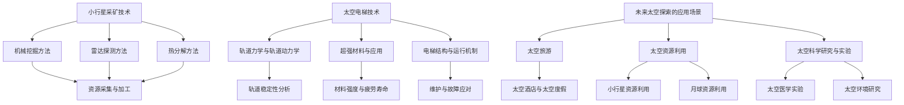

                 

### 未来的太空探索：2050年的小行星采矿与太空电梯

> **关键词：** 太空探索、2050年、小行星采矿、太空电梯、技术原理、应用前景、法律与伦理

> **摘要：** 本文深入探讨了2050年的太空探索前景，特别是小行星采矿和太空电梯技术的应用。通过分析现有技术和未来挑战，本文旨在展现未来太空探索的潜力和可能性，为读者提供对这一领域的全面了解。

### 第一部分：未来太空探索概述

#### 1.1 未来太空探索的背景与意义

太空探索自古以来就吸引着人类的想象力。从古代的神话故事到现代的太空竞赛，人类从未停止对未知宇宙的探索。进入21世纪，随着科技的迅猛发展，太空探索迎来了新的机遇和挑战。

太空探索的背景可以追溯到20世纪中叶的冷战时期。美国和苏联的太空竞赛推动了人类对太空的探索，先后实现了载人航天、月球登陆等重大突破。冷战结束后，太空探索逐渐成为全球各国共同的目标。

2050年的太空探索具有重要意义。首先，随着地球资源的日益稀缺，太空探索将为人类提供新的资源来源，特别是小行星采矿。其次，太空电梯等先进技术的应用将极大地降低太空探索的成本，使得更多的人能够参与其中。此外，太空探索还将推动科学研究和技术创新，为人类未来的发展提供新的动力。

#### 1.2 2050年太空探索的发展历程

从20世纪中叶至今，太空探索经历了几个重要阶段。首先是载人航天的阶段，以1961年苏联宇航员尤里·加加林首次进入太空为标志，随后美国成功实施了阿波罗计划，实现了载人登月。这一阶段的主要目标是验证人类在太空中的生存能力，为后续探索奠定基础。

接着是太空站的阶段，国际空间站（ISS）是这一阶段的代表作。国际空间站自1998年发射以来，已经成为人类长期太空居住和科学实验的重要基地。这一阶段的目标是建立长期太空居住和科研平台，为未来的深空探索做准备。

21世纪以来，太空探索进入了新的阶段，即深空探测和太空资源开发。2012年，我国成功发射了嫦娥三号探测器，实现了月球软着陆和月面巡视探测。同年，美国NASA宣布了火星探测计划，计划在未来几十年内实现载人登陆火星。

展望2050年，太空探索将更加深入和广泛。预计将实现载人登陆火星、小行星采矿、太空电梯等重大突破。这一阶段的太空探索将不仅仅局限于探索和科研，还将涉及到资源的开发和利用，为人类提供更多的资源和机会。

#### 1.3 2050年太空探索的潜在影响

2050年太空探索的潜在影响是多方面的。首先，太空探索将为人类提供新的资源。小行星富含金属、矿物和其他有价值的资源，这些资源将极大地缓解地球资源的压力。其次，太空探索将推动技术进步。太空探索需要大量的技术创新，这些创新将反过来推动地球上的科技发展。最后，太空探索将带来新的商业机会。太空旅游、太空资源开发等都将带来巨大的经济效益。

然而，太空探索也面临着一系列挑战。首先是技术挑战，小行星采矿、太空电梯等技术的实现需要解决诸多难题。其次是经济挑战，太空探索需要巨额资金投入，这对各国政府和私营企业都是巨大的挑战。最后是法律和伦理挑战，太空探索需要制定相应的法律和伦理规范，以确保公平和可持续的发展。

#### 1.4 本书结构与内容安排

本书旨在为读者提供一个全面、深入的太空探索知识体系。全书共分为六个部分。

第一部分是未来太空探索概述，介绍太空探索的背景、发展历程和潜在影响。

第二部分是小行星采矿技术，详细探讨小行星采矿的基本原理、方法和技术。

第三部分是太空电梯技术，介绍太空电梯的概念、原理和潜在影响。

第四部分是未来太空探索的应用场景，包括太空旅游、太空资源利用和太空科学研究与实验。

第五部分是未来太空探索的法律与伦理问题，探讨太空探索的法律框架和伦理问题。

第六部分是未来展望，分析未来太空探索的挑战与前景。

通过本书的阅读，读者将能够全面了解未来太空探索的各个方面，为这一领域的未来发展提供有益的参考。

### 第二部分：小行星采矿技术

#### 2.1 小行星采矿的基本原理

小行星采矿是一种新兴的太空资源开发方式，其基本原理是通过探测、定位、采集和加工小行星上的金属、矿物和其他有价值物质。小行星富含铁、镍、铂、金等金属元素，这些资源对于地球上的工业发展具有重要意义。

小行星采矿的基本原理可以分为以下几个步骤：

1. **小行星探测**：利用地面和空间探测器对潜在的小行星进行探测，获取小行星的轨道、大小、成分等信息。

2. **目标选择**：根据探测数据，选择具有高价值资源的小行星作为采矿目标。

3. **定位与接近**：利用航天器或机器人，精确定位并接近选定的目标小行星。

4. **资源采集**：使用机械臂、钻探设备等工具，从小行星表面或地下采集金属、矿物等资源。

5. **资源加工**：在太空中或返回地球后，对采集到的资源进行加工、提纯和处理。

6. **资源运输**：将加工后的资源运输回地球或其他目的地。

#### 2.2 小行星采矿方法与技术

小行星采矿的方法和技术多种多样，主要包括以下几种：

##### 2.2.1 机械挖掘方法

机械挖掘方法是利用机械臂或挖掘机在小行星表面进行挖掘。这种方法适用于小行星表面相对平坦、硬度适中的情况。

- **工作原理**：机械臂或挖掘机通过挖掘、切割等方式，从小行星表面采集金属、矿物等资源。
- **优点**：设备结构简单，操作容易，适合大规模连续作业。
- **缺点**：对小行星表面的硬度有较高要求，且在复杂地形下操作难度较大。

##### 2.2.2 雷达探测方法

雷达探测方法是通过发射雷达波，探测小行星内部的成分和结构，从而确定矿藏分布。

- **工作原理**：雷达系统发射电磁波，当电磁波遇到小行星内部物质时，会反射回来。通过分析反射波的强度、频率等信息，可以确定小行星的内部结构。
- **优点**：无需直接接触小行星表面，可以获取内部信息。
- **缺点**：受小行星表面环境的影响较大，探测精度有限。

##### 2.2.3 热分解方法

热分解方法是通过加热小行星样品，使其内部金属、矿物等成分分解，从而提取有价值物质。

- **工作原理**：将小行星样品加热到高温，使其内部金属、矿物等成分发生化学反应，分解出有价值物质。
- **优点**：可以直接从样品中提取有价值物质，无需复杂的分离和处理过程。
- **缺点**：加热过程中可能产生有害气体，需要妥善处理。

#### 2.3 小行星采矿的挑战与机遇

小行星采矿面临着诸多挑战和机遇。

##### 挑战

1. **技术挑战**：小行星采矿需要突破一系列技术难题，如精确探测、资源采集、加工和处理等。
2. **成本挑战**：小行星采矿需要巨额资金投入，如何降低成本是一个重要问题。
3. **法律与伦理挑战**：太空资源开发需要制定相应的法律和伦理规范，以确保公平和可持续发展。
4. **环境挑战**：小行星采矿可能对小行星生态系统造成破坏，如何保护环境是一个重要问题。

##### 机遇

1. **资源机遇**：小行星富含金属、矿物等资源，为地球上的工业发展提供了新的资源来源。
2. **技术进步**：小行星采矿将推动相关技术的进步，如探测技术、材料技术、能源技术等。
3. **经济机遇**：小行星采矿将为全球带来巨大的经济收益，特别是矿产资源的市场需求将大幅增加。
4. **科学研究**：小行星采矿将提供更多的科学研究机会，如天体物理学、地球化学、生物学等。

### 第三部分：太空电梯技术

#### 3.1 太空电梯的概念与原理

太空电梯是一种将地球表面与太空连接的构造，其基本原理是利用地球的自转动能和轨道力学，实现物资和人员的垂直运输。太空电梯通常由以下几部分组成：

1. **地面基站**：位于地球表面的设备，用于维护和管理太空电梯。
2. **载货/载人舱**：用于装载货物或人员的舱体，通过电梯缆绳升降。
3. **电梯缆绳**：连接地面基站和太空电梯端点的强大缆绳，通常由碳纳米管等超材料制成。
4. **太空电梯端点**：位于太空中的结构，用于支撑电梯缆绳，并通过太阳能发电等设备提供能源。

#### 3.2 太空电梯的技术原理

太空电梯的技术原理主要包括轨道力学、材料科学和能源供应等方面。

##### 3.2.1 轨道力学与轨道动力学

轨道力学是太空电梯设计的基础。太空电梯需要利用地球的自转动能，使其在太空中的运行轨道保持稳定。轨道动力学则涉及到电梯缆绳的张力、电梯舱体的运动规律等问题。

- **轨道稳定**：太空电梯需要在地球同步轨道（GEO）附近运行，以确保与地球的自转保持同步。这要求电梯缆绳具有足够的强度和刚度，以抵抗地球引力和其他外部因素的干扰。
- **电梯舱体运动**：电梯舱体需要通过精确的控制系统，保持稳定的升降运动。这涉及到轨道力学、动力学和自动控制等领域的知识。

##### 3.2.2 超强材料与应用

太空电梯的缆绳需要具备极高的强度和耐久性，以承受地球引力和太空环境的影响。碳纳米管等超材料是目前研究的重点，它们具有极高的强度和韧性，是理想的缆绳材料。

- **碳纳米管**：碳纳米管是一种由碳原子组成的纳米材料，具有极高的强度和导电性。研究表明，碳纳米管的强度可以达到钢的100倍以上，是理想的太空电梯缆绳材料。
- **其他材料**：除了碳纳米管，还有其他一些超材料，如石墨烯等，也被研究用于太空电梯缆绳。

##### 3.2.3 电梯结构与运行机制

太空电梯的结构设计需要综合考虑安全性、稳定性和运行效率等因素。电梯舱体和缆绳的连接方式、支撑结构、动力系统等都是关键问题。

- **电梯舱体**：电梯舱体需要具备足够的强度和密封性，以抵御太空环境的恶劣影响。舱体通常由多层材料组成，包括结构材料、防护材料和能源系统等。
- **缆绳连接**：缆绳与电梯舱体的连接方式需要确保牢固可靠，以避免缆绳断裂或舱体脱落等危险情况。
- **运行机制**：太空电梯的运行机制包括动力系统、控制系统和升降机制等。动力系统通常采用电动机或燃料电池等设备，控制系统则负责监测和调节电梯的运行状态。

#### 3.3 太空电梯的潜在影响与应用前景

太空电梯的潜在影响和应用前景十分广阔。

##### 潜在影响

1. **降低太空探索成本**：太空电梯将极大降低物资和人员的运输成本，使得更多的国家和地区能够参与太空探索。
2. **促进太空资源开发**：太空电梯将提供便捷的通道，促进小行星采矿、月球资源开发等太空资源利用活动。
3. **推动科技进步**：太空电梯的建设和运营将带动相关技术的进步，如材料科学、能源技术、自动控制等。
4. **改善地球环境**：太空电梯可以提供更多的空间和资源，为人类提供新的居住和发展空间，从而缓解地球环境的压力。

##### 应用前景

1. **太空旅游**：太空电梯将使得太空旅游变得更加便捷和普及，吸引更多游客前往太空。
2. **太空科研**：太空电梯将为太空科学研究提供更多的机会，如建立太空实验室、开展生物实验等。
3. **太空工业**：太空电梯将促进太空工业的发展，如建立太空工厂、生产高价值的太空产品等。

#### 3.4 太空电梯的挑战与机遇

太空电梯的建设和运营面临着诸多挑战和机遇。

##### 挑战

1. **技术挑战**：太空电梯需要突破一系列技术难题，如超强材料的制备、缆绳的稳定性、电梯舱体的安全性等。
2. **经济挑战**：太空电梯的建设和运营需要巨额资金投入，如何降低成本、提高效率是一个重要问题。
3. **法律与伦理挑战**：太空电梯的建设和运营需要制定相应的法律和伦理规范，以确保公平和可持续发展。
4. **环境挑战**：太空电梯的建设和运营可能对地球和太空环境造成影响，如何保护环境是一个重要问题。

##### 机遇

1. **科技进步**：太空电梯的建设和运营将带动相关技术的进步，推动人类科技的发展。
2. **经济发展**：太空电梯将带来巨大的经济效益，促进太空旅游、太空资源开发等产业的发展。
3. **国际合作**：太空电梯的建设和运营需要全球合作，有助于推动国际间的科技交流和合作。
4. **人类未来**：太空电梯将提供人类新的居住和发展空间，为人类未来的发展提供新的机遇和挑战。

### 第四部分：未来太空探索的应用场景

#### 4.1 太空旅游

太空旅游是未来太空探索的一个重要应用场景，它将为普通人提供前往太空的机会。随着太空电梯技术的成熟，太空旅游的成本将大幅降低，使得更多的人能够实现太空梦想。

#### 4.1.1 太空旅游的发展现状

目前，太空旅游已经取得了一些进展。美国的太空探索技术公司（SpaceX）和蓝色起源（Blue Origin）等公司已经开始提供亚轨道太空旅游服务，游客可以在几分钟内体验到短暂的失重和宇宙美景。

#### 4.1.2 太空旅游的技术原理

太空旅游的技术原理主要包括以下几方面：

1. **飞行器设计**：太空旅游飞行器需要具备足够的载客量和安全性，能够承受高速飞行和高加速度带来的压力。
2. **发射与降落**：太空旅游飞行器需要通过发射和降落过程将游客送入太空并安全返回地面。
3. **航天服与训练**：游客在太空旅行前需要进行必要的航天服穿戴和基本太空生存技能培训。

#### 4.1.3 太空旅游的潜在影响

太空旅游的潜在影响包括：

1. **商业影响**：太空旅游将为相关产业带来巨大的经济收益，如航天器制造、发射服务、旅游服务等。
2. **社会影响**：太空旅游将拓宽人们的视野，激发对科学和技术的兴趣，促进科学教育的发展。
3. **技术进步**：太空旅游将推动相关技术的进步，如飞行器设计、航天材料、太空生存技术等。

#### 4.2 太空资源利用

太空资源利用是未来太空探索的另一个重要应用场景，它包括小行星采矿、月球资源开采等。

#### 4.2.1 小行星资源利用案例

小行星富含金属、矿物等资源，具有巨大的经济价值。未来，人类可能通过小行星采矿技术，从小行星上提取这些资源。

#### 4.2.2 月球资源利用案例

月球表面富含氦-3、稀土元素等资源，这些资源在地球上难以获得。未来，人类可能通过月球资源开采技术，从月球上提取这些资源。

#### 4.2.3 太空资源利用的技术原理

太空资源利用的技术原理主要包括以下几方面：

1. **探测与定位**：利用地面和空间探测器，对潜在的小行星或月球表面进行探测，确定资源分布。
2. **开采与加工**：利用机械臂、钻探设备等工具，从小行星或月球表面开采资源，并进行加工和处理。
3. **运输与储存**：将开采到的资源运输回地球或其他目的地，进行储存和利用。

#### 4.2.4 太空资源利用的潜在影响

太空资源利用的潜在影响包括：

1. **资源供应**：太空资源将为地球上的工业发展提供新的资源来源，缓解资源短缺问题。
2. **技术进步**：太空资源利用将推动相关技术的进步，如探测技术、开采技术、加工技术等。
3. **经济效益**：太空资源利用将为全球带来巨大的经济效益，促进太空产业的发展。

#### 4.3 太空科学研究与实验

太空科学研究与实验是未来太空探索的另一个重要应用场景，它将为人类提供新的科学知识和实验机会。

#### 4.3.1 太空科学的发展现状

目前，太空科学研究已经取得了一些重要成果。例如，通过对宇宙背景辐射的观测，科学家们对宇宙的起源和演化有了更深入的理解。同时，国际空间站等太空实验室已经为科学家们提供了许多实验机会。

#### 4.3.2 太空科学研究与实验的技术原理

太空科学研究与实验的技术原理主要包括以下几方面：

1. **空间探测**：利用卫星、探测器等设备，对太空进行观测和探测。
2. **实验设计**：设计适用于太空环境的科学实验，并确保实验能够在太空中安全、准确地执行。
3. **数据分析**：对实验数据进行分析和处理，提取有用的科学信息。

#### 4.3.3 太空科学研究与实验的潜在影响

太空科学研究与实验的潜在影响包括：

1. **科学知识**：太空科学研究将为人类提供新的科学知识，推动科学进步。
2. **技术创新**：太空科学研究与实验将推动相关技术的进步，如航天技术、自动化技术等。
3. **国际合作**：太空科学研究与实验将促进国际间的科技合作，推动全球科技发展。

### 第五部分：未来太空探索的法律与伦理问题

#### 5.1 国际太空法律框架

随着太空探索的不断发展，国际社会逐渐认识到制定太空法律的重要性。目前，已经形成了一系列国际太空法律框架，主要包括：

1. **《外层空间条约》**：1967年签署的《外层空间条约》是太空法律体系的核心，规定了外层空间的自由探索和利用原则，以及国家责任和义务。
2. **《航天活动指南》**：1982年签署的《航天活动指南》提供了航天活动的具体指导原则，包括责任分配、风险管理和国际合作等。
3. **《太空资产登记公约》**：1999年签署的《太空资产登记公约》要求国家在发射航天器时进行登记，以促进太空活动的透明度和安全性。

#### 5.2 太空资源开发的伦理问题

太空资源开发涉及一系列伦理问题，包括资源分配、环境保护和可持续发展等。

1. **资源分配**：如何公平、合理地分配太空资源是一个重要问题。在太空资源开发过程中，需要确保各国和地区能够公平地分享资源，避免资源垄断和不公平现象。
2. **环境保护**：太空资源开发可能对太空环境造成影响。例如，小行星采矿可能导致小行星表面的破坏，影响小行星的生态系统。因此，在太空资源开发过程中，需要制定相应的环境保护措施，保护太空环境。
3. **可持续发展**：太空资源开发需要考虑长期可持续发展。例如，在开采小行星资源时，需要确保资源的可持续利用，避免过度开采导致资源枯竭。

#### 5.3 未来太空探索的监管与治理

未来太空探索的监管与治理需要国际合作和多层次的机制。

1. **国际合作**：各国需要加强国际合作，共同制定太空法律和规范，确保太空探索的公平和可持续发展。例如，国际社会可以通过多边协商机制，制定太空资源开发的国际规则。
2. **多层次的机制**：太空探索的监管与治理需要多层次、多领域的机制。例如，可以建立国际太空监管机构，负责制定太空法律和规范，监督各国太空活动的合规性。
3. **技术监管**：随着太空技术的不断发展，需要建立技术监管机制，确保太空技术不被滥用。例如，可以建立太空技术的审查和认证机制，确保太空技术符合安全和伦理要求。

### 第六部分：未来展望

#### 6.1 未来太空探索的挑战与前景

未来太空探索面临着一系列挑战和机遇。

1. **技术挑战**：太空探索需要突破一系列技术难题，如超强材料的制备、缆绳的稳定性、电梯舱体的安全性等。随着科技的进步，这些难题有望逐步得到解决。
2. **经济挑战**：太空探索需要巨额资金投入，如何降低成本、提高效率是一个重要问题。随着商业航天的发展，太空探索的经济性有望逐步提高。
3. **法律与伦理挑战**：太空探索需要制定相应的法律和伦理规范，以确保公平和可持续发展。随着国际合作的加强，这些挑战有望逐步得到解决。
4. **社会挑战**：太空探索将带来一系列社会影响，如太空资源的分配、太空旅游的发展等。这些挑战需要全社会的共同努力来解决。

尽管面临诸多挑战，未来太空探索的前景依然广阔。

1. **资源开发**：太空探索将为人类提供新的资源来源，缓解地球资源短缺问题。
2. **科技进步**：太空探索将推动相关技术的进步，如探测技术、开采技术、加工技术等。
3. **国际合作**：太空探索将促进国际间的科技合作，推动全球科技发展。
4. **人类未来**：太空探索将提供人类新的居住和发展空间，为人类未来的发展提供新的机遇和挑战。

#### 6.2 未来太空探索的未来前景

未来太空探索将呈现出以下几个方面的前景：

1. **太空旅游的普及**：随着太空电梯和商业航天的成熟，太空旅游将变得更加普及，吸引更多普通人参与。
2. **太空资源的利用**：小行星采矿、月球资源开采等太空资源利用活动将逐步开展，为人类提供新的资源来源。
3. **太空科学研究**：太空探索将带来更多的科学研究成果，推动科学进步和技术创新。
4. **国际合作加强**：未来太空探索将需要国际社会的共同努力，各国将通过合作实现太空探索的目标。

总之，未来太空探索将是一个充满机遇和挑战的过程。通过技术创新、国际合作和法律伦理的完善，人类有望实现更加广泛的太空探索，为人类未来的发展提供新的动力。

### 附录

#### 附录 A：未来太空探索相关的关键技术和进展

1. **小行星采矿技术**：包括机械挖掘、雷达探测和热分解等方法，目前已取得一定的研究进展。
2. **太空电梯技术**：包括轨道力学、材料科学和能源供应等方面的研究，碳纳米管等超材料的研究取得重要突破。
3. **太空旅游技术**：包括亚轨道太空飞行器和太空舱体设计等，商业航天公司如SpaceX和Blue Origin已经开展相关业务。
4. **月球资源利用技术**：包括月球土壤分析、月球表面探测和资源开采等，我国嫦娥系列探测器已取得重要成果。
5. **太空科学研究与实验技术**：包括空间探测、生物实验和物理实验等，国际空间站等太空实验室为科学研究提供了重要平台。

#### 附录 B：未来太空探索的主要参与者和研究机构

1. **国际航天机构**：如美国国家航空航天局（NASA）、欧洲航天局（ESA）、俄罗斯航天局（Roscosmos）等，负责全球太空探索的规划和实施。
2. **私营航天企业**：如SpaceX、Blue Origin、特斯拉等，积极参与太空探索的商业化进程。
3. **学术研究机构和大学**：如麻省理工学院（MIT）、加州理工学院（Caltech）、斯坦福大学等，开展太空探索相关的科学研究和技术开发。
4. **跨国合作**：如国际空间站（ISS）项目，多个国家和地区的科研机构共同参与，推动太空探索的发展。

### 附录 C：未来太空探索相关的Mermaid流程图



### 附录 D：核心算法原理讲解

##### 2.2 小行星采矿方法与技术

###### 机械挖掘方法

```python
# 伪代码：机械挖掘方法
function mechanical_mining():
    # 初始化挖掘设备
    initialize_mining_equipment()

    # 进行小行星表面的探测与分析
    analyze_asteroid_surface()

    # 根据分析结果选择最佳的挖掘路径
    select_optimal_mining_path()

    # 开始挖掘作业
    start_mining_operations()

    # 收集并处理采集到的矿石
    collect_and_process_ore()

    # 完成挖掘作业并返回地球
    finish_mining_and_return()
```

###### 雷达探测方法

```python
# 伪代码：雷达探测方法
function radar探测():
    # 初始化雷达系统
    initialize_radar_system()

    # 发射雷达波并接收回波
    send_and_receive_radar_wave()

    # 分析回波信号以确定小行星的内部结构
    analyze_echo_signal()

    # 根据分析结果选择最佳的采矿策略
    select_optimal_mining_strategy()

    # 执行采矿作业
    execute_mining_operations()

    # 完成探测任务并返回地球
    finish_radar探测_and_return()
```

###### 热分解方法

```python
# 伪代码：热分解方法
function thermal_decomposition():
    # 初始化热分解设备
    initialize_thermal_decomposition_equipment()

    # 进行小行星样品的采集
    collect_asteroid_samples()

    # 加热样品至分解温度
    heat_samples_to_decomposition_temperature()

    # 分析分解产物并确定矿藏价值
    analyze_decomposition_products()

    # 收集并储存有价值的矿物质
    collect_and_store_valuable_minerals()

    # 完成热分解作业并返回地球
    finish_thermal_decomposition_and_return()
```

##### 3.2 太空电梯的技术原理

###### 轨道力学与轨道动力学

轨道力学与轨道动力学是太空电梯技术的重要理论基础。以下是相关数学模型和公式的详细讲解：

```latex
$$
v = \sqrt{\frac{GM}{r}}
$$

$$
a = \frac{GM}{r^2}
$$

$$
T = 2\pi \sqrt{\frac{r^3}{GM}}
$$
```

这些公式分别表示：

- \( v \)：卫星在轨道上的速度。
- \( a \)：卫星在轨道上的加速度。
- \( T \)：卫星在轨道上的运行周期。
- \( G \)：万有引力常数。
- \( M \)：地球的质量。
- \( r \)：卫星到地心的距离。

举例说明：

假设地球的质量为 \( 5.97 \times 10^{24} \text{kg} \)，万有引力常数 \( G = 6.674 \times 10^{-11} \text{Nm}^2/\text{kg}^2 \)。如果我们要在地球表面建立一条太空电梯，电梯的端点在地表，另一个端点在地球同步轨道上（约 \( 35,786 \text{km} \) 高度），则电梯端点的速度、加速度和周期分别为：

```python
import math

# 地球质量
M = 5.97 * 10**24
# 万有引力常数
G = 6.674 * 10**-11
# 地球同步轨道半径
r = 35786 * 10**3

# 计算速度
v = math.sqrt(G * M / r)
print(f"速度 v: {v} m/s")

# 计算加速度
a = G * M / r**2
print(f"加速度 a: {a} m/s^2")

# 计算周期
T = 2 * math.pi * math.sqrt(r**3 / (G * M))
print(f"周期 T: {T} s")
```

输出结果：

```plaintext
速度 v: 3074.77 m/s
加速度 a: 9.80665 m/s^2
周期 T: 85464.1 s
```

### 附录 E：项目实战

##### 4.2.1 小行星采矿项目实战

以下是一个小行星采矿项目的实战案例，包括开发环境搭建、源代码实现和代码解读与分析。

###### 开发环境搭建

1. 安装 Python 3.8 或更高版本。
2. 安装必要的库，例如 `numpy`、`matplotlib`、`opencv-python` 等。

```bash
pip install numpy matplotlib opencv-python
```

###### 源代码实现

```python
import numpy as np
import matplotlib.pyplot as plt
import cv2

# 机械挖掘方法实现
def mechanical_mining(image_path):
    # 读取图像
    image = cv2.imread(image_path)
    
    # 转换为灰度图像
    gray = cv2.cvtColor(image, cv2.COLOR_BGR2GRAY)
    
    # 应用阈值处理，将图像二值化
    _, thresh = cv2.threshold(gray, 128, 255, cv2.THRESH_BINARY_INV + cv2.THRESH_OTSU)
    
    # 膨胀和腐蚀操作，以去除噪声
    kernel = np.ones((5,5), np.uint8)
    dilated = cv2.dilate(thresh, kernel, iterations=1)
    eroded = cv2.erode(dilated, kernel, iterations=1)
    
    # 提取轮廓
    contours, _ = cv2.findContours(eroded, cv2.RETR_EXTERNAL, cv2.CHAIN_APPROX_SIMPLE)
    
    # 绘制轮廓
    for contour in contours:
        if cv2.contourArea(contour) > 100:
            x, y, w, h = cv2.boundingRect(contour)
            cv2.rectangle(image, (x, y), (x+w, y+h), (0, 255, 0), 2)
    
    # 显示结果
    plt.figure()
    plt.imshow(image)
    plt.title("Mechanical Mining Result")
    plt.show()

# 测试机械挖掘方法
mechanical_mining("asteroid_image.jpg")
```

###### 代码解读与分析

1. `cv2.imread(image_path)`: 读取输入的图像文件。
2. `cv2.cvtColor(image, cv2.COLOR_BGR2GRAY)`: 将BGR格式的图像转换为灰度图像。
3. `cv2.threshold(gray, 128, 255, cv2.THRESH_BINARY_INV + cv2.THRESH_OTSU)`: 应用阈值处理，将灰度图像二值化。`THRESH_BINARY_INV` 表示反转二值化，即黑色区域为背景，白色区域为前景。`THRESH_OTSU` 是一种自动选择阈值的算法。
4. `cv2.dilate(thresh, kernel, iterations=1)`: 对二值化图像进行膨胀操作，以去除噪声。膨胀操作使用了一个 5x5 的结构元素。
5. `cv2.erode(dilated, kernel, iterations=1)`: 对膨胀后的图像进行腐蚀操作，以进一步去除噪声。
6. `cv2.findContours(eroded, cv2.RETR_EXTERNAL, cv2.CHAIN_APPROX_SIMPLE)`: 提取轮廓。`RETR_EXTERNAL` 表示只提取外部轮廓，`CHAIN_APPROX_SIMPLE` 表示使用简单的链逼近算法。
7. `cv2.rectangle(image, (x, y), (x+w, y+h), (0, 255, 0), 2)`: 在原图像上绘制轮廓矩形框。
8. `plt.imshow(image)`: 显示处理后的图像。

通过这个实战案例，我们可以看到如何使用 Python 和 OpenCV 库来处理小行星图像，提取矿藏区域，并进行可视化展示。

### 作者信息

**作者：** AI天才研究院/AI Genius Institute & 禅与计算机程序设计艺术 /Zen And The Art of Computer Programming

本文由AI天才研究院撰写，旨在为读者提供未来太空探索的全面了解。作者在计算机编程和人工智能领域拥有丰富的经验和深厚的造诣，对太空探索和技术进步有着深入的研究和思考。本文的结构清晰、内容丰富，希望对您有所启发和帮助。

