                 

# 未来的新材料：2050年的智能材料与超材料

> **关键词**：智能材料、超材料、2050年、应用、发展趋势

> **摘要**：本文旨在探讨2050年智能材料与超材料的发展趋势及其应用。通过对智能材料与超材料的基本概念、分类、原理、应用领域、未来展望以及实际应用案例的分析，文章展示了这两类新材料在科技发展中的重要地位和广阔的应用前景。

## 目录大纲

### 第一部分：引言

#### 第1章：智能材料与超材料概述

1.1 智能材料的基本概念  
1.2 超材料的基本概念  
1.3 2050年新材料的发展趋势

#### 第2章：智能材料的分类与应用

2.1 按功能分类

2.2 智能材料的应用领域

### 第二部分：超材料的原理与应用

#### 第3章：超材料的基本原理

3.1 超材料的定义与特点  
3.2 超材料的分类

#### 第4章：超材料在信息科技领域的应用

4.1 超材料在无线通信中的应用

4.2 超材料在光子学领域的应用

#### 第5章：超材料在航空航天领域的应用

5.1 超材料在航空航天器结构中的应用

5.2 超材料在航空航天器推进系统中的应用

#### 第6章：智能材料与超材料的未来展望

6.1 新材料发展的趋势

6.2 智能材料与超材料的发展方向

6.3 对未来社会的影响

### 第三部分：实际应用与案例分析

#### 第7章：智能材料与超材料的实际应用案例

7.1 生物医学领域的应用案例

7.2 能源领域的应用案例

7.3 信息科技领域的应用案例

#### 第8章：智能材料与超材料的应用挑战与未来发展方向

8.1 现有的挑战

8.2 未来发展方向

### 附录

#### 附录A：智能材料与超材料相关的学术资源与工具

A.1 学术期刊与会议

A.2 在线资源与工具

## 引言

智能材料与超材料是新材料领域的重要分支，具有广泛的应用前景。智能材料是指能够感知、响应并调节外部刺激（如温度、压力、电磁场等）的材料，而超材料则是一种具有特殊电磁性能的人工复合材料。这两类材料的发展对科技进步和社会进步具有重要意义。

随着科技的不断进步，智能材料和超材料的研究逐渐成为学术界和工业界的热点。在未来的2050年，这些材料有望在各个领域取得重大突破，改变我们的生活和工作方式。本文将系统地探讨智能材料和超材料的基本概念、分类、原理、应用领域、未来展望以及实际应用案例，为读者提供一份全面而深入的资料。

### 第一部分：引言

#### 第1章：智能材料与超材料概述

### 1.1 智能材料的基本概念

智能材料，又称“传感-响应材料”，是指那些能够感知外部刺激并产生相应响应的材料。它们通常具有以下几个特点：

1. **感知性**：智能材料能够感知外部环境的变化，如温度、压力、光照、电场、磁场等。
2. **响应性**：感知到外部刺激后，智能材料能够产生相应的物理、化学或机械响应，如变形、变色、导电性变化等。
3. **调控性**：通过外部刺激的调节，智能材料可以改变其性能，从而实现自修复、自适应等功能。

智能材料按照功能可以分为以下几类：

- **结构智能材料**：这类材料能够感知结构损伤，并自动修复或调整结构。
- **功能智能材料**：这类材料能够执行特定的功能，如能量转化、信号传输、生物相容性等。
- **自适应智能材料**：这类材料能够根据外部环境的变化，自动调整其性能，以适应不同的应用场景。

### 1.2 超材料的基本概念

超材料（Metamaterial）是指具有人工设计的电磁性质的材料。这些材料通常由微观结构组成，其性能通过人工设计的结构来实现，而不是依赖于材料的固有性质。超材料的特点包括：

1. **超光学响应**：超材料可以具有负折射率、超透镜效应等特殊光学性质，这些性质在自然材料中是不存在的。
2. **超频响特性**：超材料可以在特定的频率范围内展示出特有的电磁响应，如吸收全部电磁波或实现频率变换。
3. **多尺度效应**：超材料的设计和性能可以跨越多个尺度，从微观的纳米尺度到宏观的厘米尺度。

超材料按照其功能可以分为以下几类：

- **吸波超材料**：主要用于雷达隐身、无线通信等领域的电磁波吸收。
- **焦散子超材料**：可以形成虚拟物体，具有超透镜效应。
- **双频共振超材料**：在特定频率范围内实现共振吸收，常用于滤波器设计。
- **电磁波段超材料**：具有特殊的电磁响应，可应用于多种波段。

### 1.3 2050年新材料的发展趋势

展望2050年，智能材料和超材料预计将在以下几个领域取得显著进展：

1. **生物医学**：智能材料在药物输送、组织工程、诊断和治疗等方面将有更多创新应用。超材料则有望在成像技术、生物传感器等领域发挥重要作用。
2. **能源**：智能材料和超材料将在可再生能源收集、储能、智能电网等方面发挥关键作用。例如，智能太阳能电池和超材料储能设备将成为现实。
3. **信息科技**：超材料天线、滤波器和传感器的设计将更加灵活和高效。智能材料则将在自适应网络、智能路由器等方面提升信息传输和处理能力。
4. **航空航天**：超材料在减振、抗电磁干扰、高温环境应用等方面将有重要应用。智能材料将提高航空航天器的性能和可靠性。
5. **智能制造**：智能材料和超材料将推动智能制造的发展，实现更加智能、灵活和高效的制造流程。

随着科技的不断进步，智能材料和超材料将在未来社会发挥越来越重要的作用，为我们的生活带来更多便利和创新。

#### 第2章：智能材料的分类与应用

### 2.1 按功能分类

智能材料因其特殊的响应特性和功能，可以根据其应用功能进行分类。以下是几种主要的智能材料类型：

#### 2.1.1 结构智能材料

结构智能材料是指能够感知和响应外部环境变化，从而改变自身结构或形态的材料。它们广泛应用于航空航天、汽车制造、土木工程等领域。

**核心概念与联系**：

- **材料结构变化**：当结构智能材料受到外部刺激（如压力、温度、电场等）时，其分子结构会发生相应变化，从而改变材料的形态。
- **应用场景**：在航空航天领域，结构智能材料可以用于飞机结构件的变形监测和自修复；在土木工程中，可以用于桥梁和隧道的健康监测。

**Mermaid 流程图**：

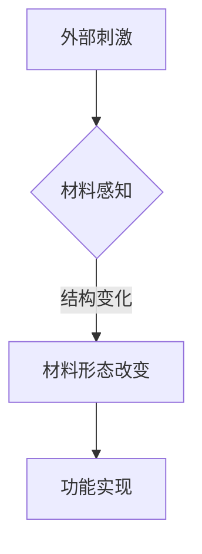

#### 2.1.2 功能智能材料

功能智能材料是指能够执行特定功能（如能量转换、信号传输、生物相容性等）的材料。这些材料在能源、生物医学、信息科技等领域具有广泛的应用。

**核心概念与联系**：

- **能量转换**：如热电材料，能够将热能转换为电能。
- **信号传输**：如电磁波导材料，能够高效传输电磁信号。
- **生物相容性**：如生物活性材料，能够与生物组织相容。

**Mermaid 流程图**：

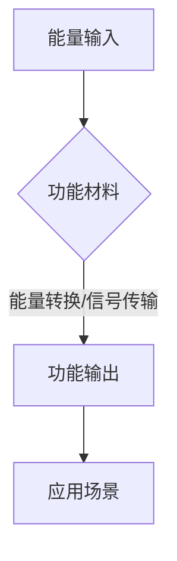

#### 2.1.3 自适应智能材料

自适应智能材料是指能够根据外部环境变化自动调节自身性能的材料。这类材料在航空航天、汽车制造、智能家居等领域具有广泛应用。

**核心概念与联系**：

- **环境感知**：自适应智能材料能够感知外部环境（如温度、湿度、光照等）的变化。
- **性能调节**：通过材料内部机制，自适应智能材料能够自动调整其性能，以适应不同的环境。

**Mermaid 流程图**：

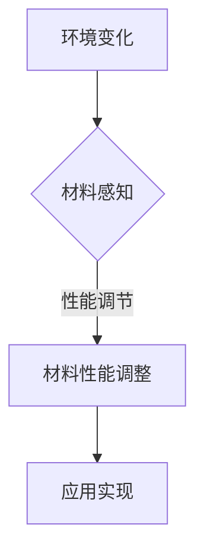

### 2.2 智能材料的应用领域

智能材料的应用领域非常广泛，以下是几个主要的领域：

#### 2.2.1 生物医学

在生物医学领域，智能材料在药物输送、组织工程、诊断和治疗等方面具有重要作用。

**核心概念与联系**：

- **药物输送**：智能材料可以用于药物载体，通过环境响应实现药物的自动释放。
- **组织工程**：智能材料可以用于制造人工器官和支架，具有良好的生物相容性和适应性。
- **诊断和治疗**：智能材料传感器可以用于疾病诊断和监测，如温度、pH值、血糖等。

**Mermaid 流�程图**：

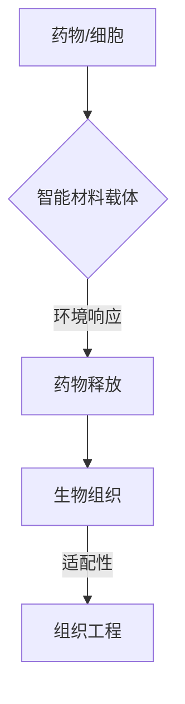

#### 2.2.2 能源

在能源领域，智能材料在可再生能源收集、储能等方面具有广泛的应用。

**核心概念与联系**：

- **可再生能源收集**：如太阳能电池、风力发电机等，智能材料可以提高能量转换效率和稳定性。
- **储能**：如锂离子电池、超级电容器等，智能材料可以提升储能容量和循环寿命。

**Mermaid 流程图**：

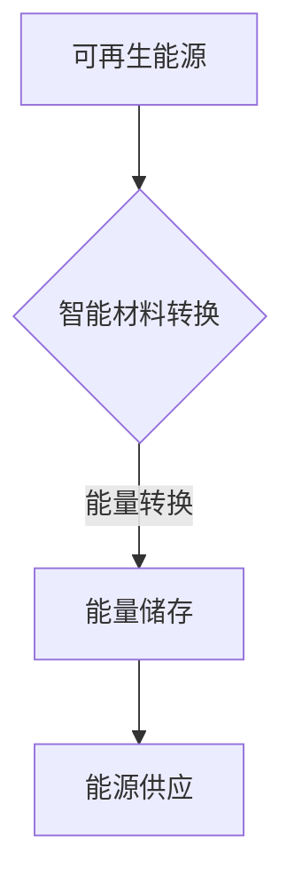

#### 2.2.3 信息科技

在信息科技领域，智能材料在传感器、通信、计算机硬件等方面具有重要作用。

**核心概念与联系**：

- **传感器**：智能材料传感器可以用于各种环境参数的检测，如温度、湿度、压力等。
- **通信**：智能材料可以用于制造高效的天线和滤波器，提升通信信号的传输质量。
- **计算机硬件**：智能材料可以用于制造高效的热管理材料和电磁屏蔽材料。

**Mermaid 流程图**：

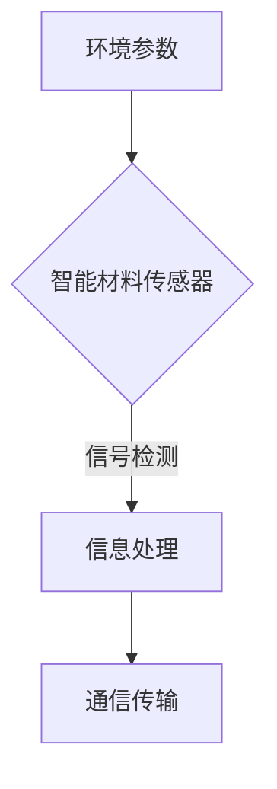

#### 2.2.4 航空航天

在航空航天领域，智能材料在减振、抗电磁干扰、高温环境应用等方面具有重要作用。

**核心概念与联系**：

- **减振**：智能材料可以用于制造减振结构和材料，降低飞行器在飞行过程中的振动。
- **抗电磁干扰**：智能材料可以用于制造电磁屏蔽材料，防止电磁干扰。
- **高温环境应用**：智能材料可以用于制造耐高温部件，提高飞行器的性能和安全性。

**Mermaid 流程图**：

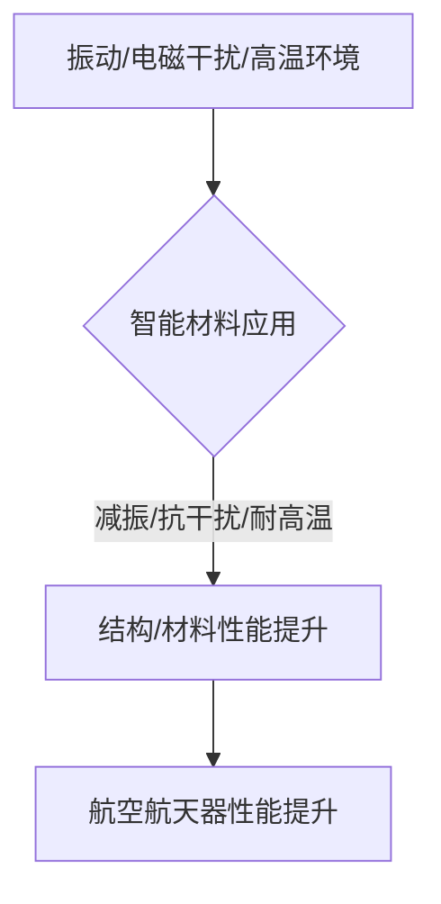

综上所述，智能材料在各个领域具有广泛的应用前景。随着科技的不断进步，智能材料的研究和开发将继续深化，为人类社会带来更多创新和变革。

#### 第3章：超材料的基本原理

### 3.1 超材料的定义与特点

超材料（Metamaterial）是指那些通过人工设计具有特殊电磁性质的物质，其特性不仅取决于材料的内在物理属性，还受到其微观结构的影响。超材料的核心特点包括：

1. **人工设计性**：超材料的电磁性能是通过人工设计的结构来实现的，而非天然材料的固有属性。
2. **非局域性**：超材料的电磁响应通常是非局域的，即其响应不局限于材料的内部，而是可以扩展到材料外部。
3. **异常性**：超材料可以展示出一些自然界中不存在的特性，如负折射率、超透镜效应、频率变换等。

超材料的基本定义可以概括为：一种具有负折射率、超光学响应、超频响特性的人工复合材料。其特点体现在以下几个方面：

1. **负折射率**：超材料可以在特定频率范围内展示出负折射率，这使得光波在穿过超材料时可以表现出异常的传播行为。
2. **超光学响应**：超材料可以具有特殊的电磁响应，如超透镜效应、光吸收、光调控等。
3. **超频响特性**：超材料可以在特定频率范围内展示出特殊的电磁响应，如频率变换、共振吸收等。

### 3.2 超材料的分类

根据超材料的电磁响应特性，可以将其分为以下几类：

#### 3.2.1 吸波超材料

吸波超材料是指能够有效吸收电磁波的材料，通常用于雷达隐身、电磁干扰屏蔽等领域。

**核心概念与联系**：

- **电磁波吸收**：吸波超材料通过设计特定的结构，使其能够在特定频率范围内吸收大部分入射电磁波。
- **应用场景**：吸波超材料可以用于飞机、坦克等装备的隐身涂层，以及电磁波屏蔽材料。

**Mermaid 流程图**：

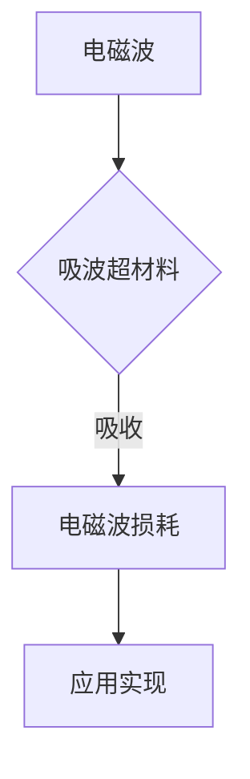

#### 3.2.2 焦散子超材料

焦散子超材料（Brewster Metamaterial）是一种能够形成虚拟物体的材料，其特殊的电磁响应可以实现超透镜效应。

**核心概念与联系**：

- **超透镜效应**：焦散子超材料能够将光聚焦到一个虚焦点，形成虚拟物体。
- **应用场景**：焦散子超材料可以用于光学传感器、激光聚焦、光学成像等领域。

**Mermaid 流程图**：

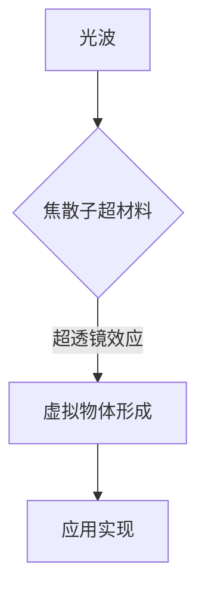

#### 3.2.3 双频共振超材料

双频共振超材料是一种在特定频率范围内展示出共振吸收特性的材料，常用于滤波器设计和无线通信。

**核心概念与联系**：

- **共振吸收**：双频共振超材料在特定频率下展示出共振吸收，可以有效过滤特定频率的信号。
- **应用场景**：双频共振超材料可以用于高频滤波器、无线通信天线等。

**Mermaid 流程图**：

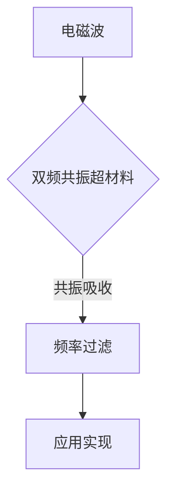

#### 3.2.4 电磁波段超材料

电磁波段超材料是指能够在特定电磁波段展示出特殊电磁响应的材料，如微波波段、红外波段等。

**核心概念与联系**：

- **电磁波段响应**：电磁波段超材料可以在特定电磁波段展示出特殊的电磁响应，如微波波段中的超导材料。
- **应用场景**：电磁波段超材料可以用于微波通信、天线设计、雷达系统等。

**Mermaid 流程图**：

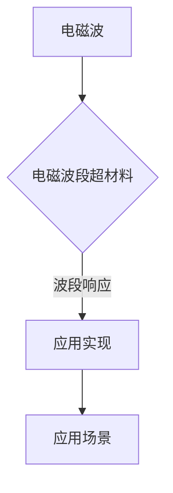

### 3.3 超材料的数学模型与仿真

超材料的数学模型主要基于麦克斯韦方程组，通过数值方法进行仿真。以下是超材料的一些基本数学模型和仿真方法：

#### 3.3.1 麦克斯韦方程组

麦克斯韦方程组描述了电磁场的基本行为。对于超材料，麦克斯韦方程组可以表示为：

$$
\nabla \cdot \mathbf{E} = \frac{\rho}{\epsilon_0}, \quad \nabla \cdot \mathbf{B} = 0
$$

$$
\nabla \times \mathbf{E} = -\frac{\partial \mathbf{B}}{\partial t}, \quad \nabla \times \mathbf{B} = \mu_0 \mathbf{J} + \mu_0 \epsilon_0 \frac{\partial \mathbf{E}}{\partial t}
$$

其中，$\mathbf{E}$ 和 $\mathbf{B}$ 分别表示电场和磁场，$\rho$ 表示电荷密度，$\epsilon_0$ 和 $\mu_0$ 分别为真空中的电容率和磁导率。

#### 3.3.2 复折射率

复折射率是描述超材料电磁响应的重要参数。对于超材料，复折射率可以表示为：

$$
\tilde{n} = n + ik = n - \frac{\omega \mu_p}{2 \epsilon_0}
$$

其中，$n$ 表示实部（折射率），$k$ 表示虚部（消逝波），$\omega$ 为角频率，$\mu_p$ 为磁化率。

#### 3.3.3 仿真方法

超材料的仿真通常采用有限元方法（FEM）、时域有限差分方法（FDTD）等。以下是有限元方法的伪代码：

```python
# 有限元方法伪代码

# 初始化参数和网格
initialize Parameters and Mesh

# 建立方程组
build Equation System using Maxwell's Equations

# 求解方程组
solve Equation System using FEM Solver

# 仿真结果分析
analyze Simulation Results
```

通过上述数学模型和仿真方法，可以深入理解和预测超材料的电磁响应特性，为超材料的设计和应用提供重要依据。

#### 第4章：超材料在信息科技领域的应用

### 4.1 超材料在无线通信中的应用

超材料在无线通信领域具有广泛的应用前景，可以显著提升无线通信系统的性能。以下是超材料在无线通信中的两个主要应用方向：

#### 4.1.1 超材料天线设计

超材料天线是一种利用超材料的特殊电磁响应特性来设计的天线。与传统天线相比，超材料天线具有更高的效率、更小的尺寸和更好的频宽。

**核心概念与联系**：

- **超材料特性**：超材料能够展示负折射率、超透镜效应等特性，这些特性可以用于优化天线的设计。
- **天线设计**：通过设计特定的超材料结构，可以实现天线的高效增益、宽频带响应和良好的方向性。

**伪代码**：

```python
# 超材料天线设计伪代码

# 初始化天线参数
initialize Antenna Parameters

# 设计超材料结构
design Metamaterial Structure

# 计算天线性能
calculate Antenna Performance

# 优化天线设计
optimize Antenna Design
```

#### 4.1.2 超材料滤波器设计

超材料滤波器是一种利用超材料的共振吸收特性来实现频率选择性的滤波器。与传统滤波器相比，超材料滤波器具有更高的选择性、更宽的频带和更好的插损特性。

**核心概念与联系**：

- **共振吸收**：超材料在特定频率范围内展示出共振吸收，可以用于实现频率选择。
- **滤波器设计**：通过设计特定的超材料结构，可以实现滤波器的高选择性、宽频带和低插损。

**伪代码**：

```python
# 超材料滤波器设计伪代码

# 初始化滤波器参数
initialize Filter Parameters

# 设计超材料结构
design Metamaterial Structure

# 计算滤波器性能
calculate Filter Performance

# 优化滤波器设计
optimize Filter Design
```

### 4.2 超材料在光子学领域的应用

超材料在光子学领域也具有广泛的应用前景，可以显著提升光子器件的性能和功能。以下是超材料在光子学中的两个主要应用方向：

#### 4.2.1 超材料光纤

超材料光纤是一种利用超材料的特殊电磁响应特性来设计的光纤。与传统光纤相比，超材料光纤具有更高的传输效率、更低的损耗和更好的模式纯度。

**核心概念与联系**：

- **超材料特性**：超材料能够展示负折射率、超透镜效应等特性，这些特性可以用于优化光纤的设计。
- **光纤设计**：通过设计特定的超材料结构，可以实现光纤的高效传输、低损耗和良好的模式纯度。

**伪代码**：

```python
# 超材料光纤设计伪代码

# 初始化光纤参数
initialize Fiber Parameters

# 设计超材料结构
design Metamaterial Structure

# 计算光纤性能
calculate Fiber Performance

# 优化光纤设计
optimize Fiber Design
```

#### 4.2.2 超材料激光器

超材料激光器是一种利用超材料的特殊电磁响应特性来设计的激光器。与传统激光器相比，超材料激光器具有更高的效率、更窄的线宽和更好的方向性。

**核心概念与联系**：

- **共振吸收**：超材料在特定频率范围内展示出共振吸收，可以用于实现激光的选择性激发。
- **激光器设计**：通过设计特定的超材料结构，可以实现激光的高效率、窄线宽和良好方向性。

**伪代码**：

```python
# 超材料激光器设计伪代码

# 初始化激光器参数
initialize Laser Parameters

# 设计超材料结构
design Metamaterial Structure

# 计算激光器性能
calculate Laser Performance

# 优化激光器设计
optimize Laser Design
```

通过上述应用实例可以看出，超材料在无线通信和光子学领域具有巨大的应用潜力，未来随着超材料研究的深入和技术的成熟，超材料在这些领域将发挥越来越重要的作用。

#### 第5章：超材料在航空航天领域的应用

### 5.1 超材料在航空航天器结构中的应用

超材料在航空航天器结构中的应用具有重要意义，可以显著提高飞行器的性能、可靠性和安全性。以下是超材料在航空航天器结构中的几个关键应用方向：

#### 5.1.1 超材料减振设计

超材料减振设计是利用超材料特殊的电磁响应特性来降低结构振动的一种技术。通过在结构中引入超材料，可以有效地抑制振动传递，降低噪声和振动对飞行器的危害。

**核心概念与联系**：

- **超材料特性**：超材料在特定频率范围内展示出共振吸收特性，可以有效地吸收和衰减振动能量。
- **减振设计**：通过设计特定的超材料结构，可以实现结构的减振效果，提高飞行器的稳定性和舒适性。

**伪代码**：

```python
# 超材料减振设计伪代码

# 初始化结构参数
initialize Structural Parameters

# 设计超材料减振器
design Metamaterial Dampener

# 计算减振效果
calculate Damping Effect

# 优化减振设计
optimize Dampening Design
```

#### 5.1.2 超材料抗电磁干扰设计

超材料抗电磁干扰设计是利用超材料的特殊电磁响应特性来抑制电磁干扰的一种技术。通过在结构中引入超材料，可以有效地屏蔽电磁波，降低电磁干扰对飞行器的危害。

**核心概念与联系**：

- **超材料特性**：超材料具有特殊的电磁响应，可以用于制造电磁屏蔽材料。
- **抗干扰设计**：通过设计特定的超材料结构，可以实现结构的抗电磁干扰效果，提高飞行器的电磁兼容性。

**伪代码**：

```python
# 超材料抗电磁干扰设计伪代码

# 初始化结构参数
initialize Structural Parameters

# 设计超材料电磁屏蔽
design Metamaterial Electromagnetic Shield

# 计算抗干扰效果
calculate Interference Suppression Effect

# 优化抗干扰设计
optimize Interference Shielding Design
```

### 5.2 超材料在航空航天器推进系统中的应用

超材料在航空航天器推进系统中的应用可以显著提高推进系统的效率和性能。以下是超材料在推进系统中的两个关键应用方向：

#### 5.2.1 超材料燃烧室设计

超材料燃烧室设计是利用超材料的特殊热响应特性来优化燃烧过程的。通过在燃烧室中引入超材料，可以改善燃烧效率、降低排放和提高推进系统的热效率。

**核心概念与联系**：

- **超材料特性**：超材料在特定温度范围内展示出特殊的热响应，可以用于调节燃烧过程。
- **燃烧室设计**：通过设计特定的超材料结构，可以实现燃烧室的高效燃烧和优化排放。

**伪代码**：

```python
# 超材料燃烧室设计伪代码

# 初始化燃烧室参数
initialize Combustion Chamber Parameters

# 设计超材料燃烧室
design Metamaterial Combustion Chamber

# 计算燃烧室性能
calculate Combustion Chamber Performance

# 优化燃烧室设计
optimize Combustion Chamber Design
```

#### 5.2.2 超材料涡轮机设计

超材料涡轮机设计是利用超材料的特殊机械响应特性来提高涡轮机效率的一种技术。通过在涡轮机中引入超材料，可以降低涡轮机的摩擦损耗、提高工作效率和延长设备寿命。

**核心概念与联系**：

- **超材料特性**：超材料在特定压力和温度条件下展示出特殊的机械响应，可以用于降低摩擦损耗。
- **涡轮机设计**：通过设计特定的超材料结构，可以实现涡轮机的高效工作和高寿命。

**伪代码**：

```python
# 超材料涡轮机设计伪代码

# 初始化涡轮机参数
initialize Turbine Parameters

# 设计超材料涡轮机
design Metamaterial Turbine

# 计算涡轮机性能
calculate Turbine Performance

# 优化涡轮机设计
optimize Turbine Design
```

通过上述应用实例可以看出，超材料在航空航天器结构、推进系统中的应用具有显著的优势。随着超材料技术的不断发展，超材料将在航空航天领域发挥越来越重要的作用，为飞行器的性能提升和安全保障提供有力支持。

#### 第6章：智能材料与超材料的未来展望

### 6.1 新材料发展的趋势

随着科技的不断进步，智能材料与超材料的研究与发展呈现出以下几个趋势：

1. **高性能化**：智能材料和超材料在性能方面将不断提升，如更高的强度、更好的导电性、更强的吸波性能等。
2. **多功能化**：智能材料和超材料将具备更多的功能，如自修复、自诊断、自适应等，以满足不同领域的需求。
3. **低成本化**：通过材料制备工艺的创新和优化，智能材料和超材料的成本将逐步降低，使其在更多应用领域中得到普及。
4. **绿色环保**：智能材料和超材料将更加注重环保和可持续性，如采用生物基材料和可降解材料等。
5. **跨学科融合**：智能材料与超材料的研究将与其他学科如生物医学、信息科技、航空航天等深度融合，推动新技术的突破。

### 6.2 智能材料与超材料的发展方向

在未来的发展中，智能材料与超材料将朝着以下几个方向不断前进：

1. **智能材料与生物医学的融合**：智能材料将在生物医学领域发挥重要作用，如用于药物输送、组织工程、疾病诊断和治疗等。
2. **超材料与信息科技的融合**：超材料将在信息科技领域带来革命性变化，如用于天线设计、滤波器、光子器件等。
3. **智能材料与能源技术的融合**：智能材料将在能源领域提升可再生能源的利用效率，如太阳能电池、储能设备、智能电网等。
4. **超材料与航空航天技术的融合**：超材料将在航空航天领域提高飞行器的性能和安全性，如减振、抗电磁干扰、高温应用等。
5. **智能材料与智能制造的融合**：智能材料将在智能制造领域推动生产方式的变革，如用于智能传感器、自适应结构、机器人等。

### 6.3 对未来社会的影响

智能材料与超材料的发展将对未来社会产生深远影响：

1. **技术变革**：智能材料与超材料的应用将引发一系列技术变革，如提高能源利用效率、改善通信质量、提升医疗水平等。
2. **产业升级**：智能材料与超材料的应用将推动传统产业升级和新兴产业发展，如智能制造、新能源、生物科技等。
3. **生活方式改变**：智能材料与超材料的应用将改变人们的日常生活，如智能家居、智能穿戴设备、健康监测等。
4. **环境保护**：智能材料与超材料的应用将有助于环境保护，如减少能源消耗、降低污染排放等。
5. **国际合作**：智能材料与超材料的研究将推动国际合作，促进全球科技与经济的发展。

总之，智能材料与超材料的发展将深刻改变未来社会的面貌，为人类创造更加美好的生活。

#### 第7章：智能材料与超材料的实际应用案例

### 7.1 生物医学领域的应用案例

智能材料和超材料在生物医学领域具有广泛的应用，下面我们通过两个具体的案例来了解它们在该领域的实际应用。

#### 7.1.1 智能药物输送系统

**案例背景**：

传统的药物输送系统存在药物释放速度不均、难以实现精确控制等问题，限制了药物的治疗效果。为了克服这些局限，研究人员开发了智能药物输送系统。

**核心概念与联系**：

- **智能材料特性**：智能材料能够根据外部刺激（如温度、pH值、电场等）发生响应，调节药物的释放速度。
- **药物输送过程**：通过将药物封装在智能材料中，当达到特定的生理条件时，智能材料响应并释放药物，从而实现药物的精确输送。

**伪代码**：

```python
# 智能药物输送系统伪代码

# 初始化药物封装参数
initialize Drug Encapsulation Parameters

# 设计智能材料封装
design Smart Material Encapsulation

# 检测生理刺激
detect Physiological Stimuli

# 药物释放
release Drug
```

**案例效果**：

通过智能药物输送系统，药物可以更均匀、更精确地输送到目标部位，提高了治疗效果，减少了药物副作用。

#### 7.1.2 超材料支架

**案例背景**：

组织工程和再生医学需要一种能够支持细胞生长和组织的再生支架。传统的支架材料通常缺乏足够的生物相容性和机械性能。

**核心概念与联系**：

- **超材料特性**：超材料具有良好的生物相容性和机械性能，可以模拟生物组织的力学特性。
- **支架设计**：通过设计特定的超材料支架，可以提供适宜的机械支持和细胞生长环境。

**伪代码**：

```python
# 超材料支架设计伪代码

# 初始化支架参数
initialize Scaffold Parameters

# 设计超材料支架
design Metamaterial Scaffold

# 测试生物相容性
test Biocompatibility

# 评估机械性能
evaluate Mechanical Properties
```

**案例效果**：

超材料支架在组织工程中显示出显著的优势，可以更好地支持细胞生长和组织再生，为器官修复和再生医学提供了新的可能性。

### 7.2 能源领域的应用案例

智能材料和超材料在能源领域的应用同样取得了显著成果，以下是两个具体的案例。

#### 7.2.1 智能太阳能电池

**案例背景**：

传统的太阳能电池存在能量转换效率低、稳定性差等问题，限制了其广泛应用。

**核心概念与联系**：

- **智能材料特性**：智能材料能够根据环境条件（如光照强度、温度等）自动调节其性能，提高太阳能电池的能量转换效率。
- **太阳能电池设计**：通过将智能材料集成到太阳能电池中，可以实现高效的能量转换和稳定的性能。

**伪代码**：

```python
# 智能太阳能电池设计伪代码

# 初始化太阳能电池参数
initialize Solar Cell Parameters

# 设计智能材料层
design Smart Material Layer

# 测量光照强度和温度
measure Illumination and Temperature

# 调整电池性能
adjust Solar Cell Performance
```

**案例效果**：

智能太阳能电池通过智能材料的应用，提高了能量转换效率，改善了电池的稳定性和耐久性，推动了太阳能技术的进一步发展。

#### 7.2.2 超材料储能设备

**案例背景**：

传统的储能设备（如电池、超级电容器等）在能量密度、循环寿命等方面存在局限，难以满足高性能储能需求。

**核心概念与联系**：

- **超材料特性**：超材料可以展示出高能量密度、长循环寿命等优异的储能特性。
- **储能设备设计**：通过将超材料应用于储能设备中，可以实现高效、稳定的能量存储和释放。

**伪代码**：

```python
# 超材料储能设备设计伪代码

# 初始化储能设备参数
initialize Energy Storage Device Parameters

# 设计超材料储能单元
design Metamaterial Energy Storage Unit

# 测试储能性能
test Storage Performance

# 优化储能设计
optimize Storage Design
```

**案例效果**：

超材料储能设备通过应用超材料，显著提高了能量密度和循环寿命，为高性能储能技术提供了新的解决方案。

### 7.3 信息科技领域的应用案例

智能材料和超材料在信息科技领域的应用正在不断拓展，以下是两个具体的案例。

#### 7.3.1 超材料传感器

**案例背景**：

传统的传感器在灵敏度、响应速度等方面存在局限，难以满足高速信息处理需求。

**核心概念与联系**：

- **超材料特性**：超材料具有高灵敏度、快速响应等特性，可以用于制造高性能传感器。
- **传感器设计**：通过设计特定的超材料结构，可以实现传感器的高灵敏度、快速响应和多功能性。

**伪代码**：

```python
# 超材料传感器设计伪代码

# 初始化传感器参数
initialize Sensor Parameters

# 设计超材料传感器
design Metamaterial Sensor

# 测试灵敏度
test Sensitivity

# 优化传感器性能
optimize Sensor Performance
```

**案例效果**：

超材料传感器通过应用超材料，显著提高了灵敏度、响应速度和多功能性，为信息科技领域提供了新的传感器解决方案。

#### 7.3.2 智能网络设备

**案例背景**：

随着物联网和智能设备的普及，对网络设备的要求越来越高，需要实现自适应、高效的网络连接和管理。

**核心概念与联系**：

- **智能材料特性**：智能材料能够根据网络负载和信号强度自动调整其性能，实现自适应网络连接。
- **网络设备设计**：通过将智能材料集成到网络设备中，可以实现自适应网络连接、高效数据传输和智能管理。

**伪代码**：

```python
# 智能网络设备设计伪代码

# 初始化网络设备参数
initialize Network Device Parameters

# 设计智能材料模块
design Smart Material Module

# 自适应网络连接
adjust Network Connection

# 管理网络负载
manage Network Load
```

**案例效果**：

智能网络设备通过应用智能材料，实现了自适应网络连接、高效数据传输和智能管理，提升了网络设备的性能和可靠性。

通过上述实际应用案例，我们可以看到智能材料和超材料在生物医学、能源和信息科技等领域具有巨大的应用潜力，未来随着技术的进一步发展，这些材料将在更多领域展现其独特的优势。

#### 第8章：智能材料与超材料的应用挑战与未来发展方向

### 8.1 现有的挑战

尽管智能材料与超材料在许多领域展示了巨大的应用潜力，但在实际应用中仍然面临着一系列挑战：

#### 8.1.1 材料制备与合成

智能材料与超材料的制备和合成过程复杂，对工艺和设备要求高。目前，许多智能材料和超材料的合成方法尚未完全成熟，制备成本较高，限制了其大规模应用。

**解决思路**：

- **改进合成工艺**：研究和开发更高效、更经济的合成方法，如纳米复合材料制备、溶剂热合成等。
- **设备升级**：提升制备设备的精度和效率，如自动化生产线、高效反应器等。

#### 8.1.2 理论研究与实验验证

智能材料与超材料的研究涉及多学科交叉，理论研究和实验验证之间存在较大差距。当前，许多材料的设计和性能预测依赖于实验数据，缺乏系统性的理论指导。

**解决思路**：

- **构建理论模型**：发展基于量子力学、分子动力学等理论的智能材料与超材料模型，为材料设计提供理论依据。
- **实验与理论相结合**：加强实验与理论的结合，通过实验验证理论模型的准确性，不断优化材料性能。

#### 8.1.3 应用实施与商业化

智能材料与超材料的应用实施和商业化进程较慢，主要原因是其性能尚未完全达到实际需求，且应用场景尚未明确。

**解决思路**：

- **明确应用场景**：针对具体应用领域，如生物医学、能源、信息科技等，开展有针对性的研究和应用推广。
- **促进产业链合作**：加强产业链上下游企业合作，推动智能材料与超材料的产业化进程。

### 8.2 未来发展方向

随着科技的不断进步，智能材料与超材料的研究将继续深化，未来有望在以下几个方面取得突破：

#### 8.2.1 材料设计优化

未来，智能材料与超材料的设计将更加注重性能优化和多功能集成。通过计算机辅助设计和多尺度模拟，可以实现对材料结构的精细调控，提升材料性能。

**解决思路**：

- **多尺度模拟**：发展多尺度模拟技术，实现从原子层次到宏观层次的材料性能预测和优化。
- **计算机辅助设计**：利用人工智能和大数据技术，进行材料设计和筛选，加速材料研发进程。

#### 8.2.2 跨学科研究

智能材料与超材料的研究将更加注重跨学科合作，整合不同学科的优势，推动材料科学的创新。

**解决思路**：

- **跨学科团队**：组建跨学科研究团队，促进不同学科之间的交流和合作。
- **多学科融合**：开展多学科交叉研究，探索智能材料与超材料在新型应用领域的可能性。

#### 8.2.3 与其他技术的融合

智能材料与超材料的应用将与其他先进技术如量子科技、纳米科技、生物科技等融合，推动新技术的突破。

**解决思路**：

- **量子与超材料融合**：开发量子超材料，实现量子信息处理和传输的新突破。
- **生物与智能材料融合**：利用智能材料在生物医学领域的应用，推动生物科技的进步。

总之，智能材料与超材料在未来的发展中，将面临诸多挑战，但也充满机遇。通过不断的研究和创新，我们有望在这些领域取得突破性进展，为人类社会带来更多创新和变革。

### 附录

#### 附录A：智能材料与超材料相关的学术资源与工具

A.1 学术期刊与会议

以下是一些与智能材料与超材料相关的学术期刊和会议，这些资源可以帮助研究人员了解该领域的最新研究动态和进展：

1. **《自然材料》（Nature Materials）**：这是一本国际顶尖的学术期刊，涵盖了材料科学、纳米科技、超材料等领域的最新研究。
2. **《先进材料》（Advanced Materials）**：该期刊发表的材料科学相关文章涵盖广泛，包括智能材料与超材料。
3. **《物理评论快报》（Physical Review Letters）**：这是一本高影响力的物理领域期刊，经常发表超材料和量子材料方面的突破性研究。
4. **《材料科学与工程杂志》（Journal of Materials Science and Engineering）**：该期刊覆盖了材料科学的多个分支，包括智能材料和超材料。
5. **国际智能材料与结构系统会议（Intelligent Materials and Structures Systems, IMSS）**：这是一系列国际会议，专注于智能材料与结构系统的最新研究和技术进展。

A.2 在线资源与工具

以下是一些在线资源与工具，对于研究和应用智能材料与超材料非常有用：

1. **材料数据库**：如Materials Project、NanoHub等，提供丰富的材料性质数据和模拟工具。
2. **超材料仿真软件**：如Ansys HFSS、CST Microwave Studio等，这些软件可以帮助研究人员进行超材料的电磁性能仿真和优化设计。
3. **学术搜索引擎**：如Google Scholar、PubMed等，可以帮助研究人员快速查找相关领域的学术论文和研究资料。
4. **开源代码与数据库**：如GitHub、arXiv等，提供大量的开源代码和预印本论文，有助于研究人员了解和复现最新的研究成果。

通过利用这些学术资源和工具，研究人员可以更好地开展智能材料与超材料的研究，推动该领域的不断发展。

