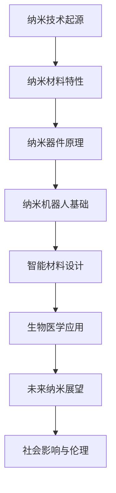
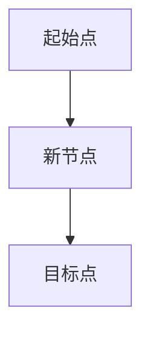

                 

# 未来的纳米技术：2050年的纳米机器人与智能材料

> **关键词：** 纳米技术、纳米机器人、智能材料、2050年、医疗健康、工业制造、环境保护。

> **摘要：** 本文章将探讨2050年的纳米技术发展趋势，重点分析纳米机器人和智能材料在医疗健康、工业制造和环境保护等领域的应用前景，以及面临的挑战和伦理问题。

## 目录大纲

### 第一部分：纳米技术基础

#### 第1章：纳米技术的起源与发展

- 1.1 纳米技术的定义与特点
- 1.2 纳米技术的发展历程
- 1.3 纳米技术的应用领域

#### 第2章：纳米材料的物理与化学特性

- 2.1 纳米材料的基本概念
- 2.2 纳米材料的物理特性
- 2.3 纳米材料的化学特性

#### 第3章：纳米器件与纳米机器人的基本原理

- 3.1 纳米器件的分类与工作原理
- 3.2 纳米机器人的定义与分类
- 3.3 纳米机器人的运作原理

### 第二部分：智能材料的发展与应用

#### 第4章：智能材料的概念与类型

- 4.1 智能材料的定义与特点
- 4.2 智能材料的分类
- 4.3 智能材料的应用领域

#### 第5章：智能材料的设计与制备

- 5.1 智能材料的设计原则
- 5.2 智能材料的制备方法
- 5.3 智能材料的应用实例

#### 第6章：智能材料在生物医学中的应用

- 6.1 智能材料在生物医学中的重要性
- 6.2 智能材料在药物递送系统中的应用
- 6.3 智能材料在生物传感器中的应用

### 第三部分：未来的纳米技术展望

#### 第7章：2050年的纳米机器人技术

- 7.1 纳米机器人技术的现状与挑战
- 7.2 纳米机器人在医疗健康领域的应用前景
- 7.3 纳米机器人在工业制造和环境保护中的应用

#### 第8章：智能材料的未来发展趋势

- 8.1 智能材料的发展趋势
- 8.2 智能材料在能源领域的应用前景
- 8.3 智能材料在航空航天领域的应用

#### 第9章：纳米技术的社会影响与伦理问题

- 9.1 纳米技术对社会的影响
- 9.2 纳米技术的伦理问题
- 9.3 纳米技术的监管与标准化

#### 附录

- 附录A：纳米技术与智能材料相关资源与工具介绍
- 附录B：纳米机器人与智能材料的实验设计与案例分析

### Mermaid 流程图：纳米技术的发展与应用

### 核心算法原理讲解：纳米机器人的运作原理

#### 纳米机器人控制算法

纳米机器人的运作原理主要依赖于其控制算法。控制算法负责指导纳米机器人在微观尺度上的运动和操作。以下是纳米机器人控制算法的基本原理：

#### 1. 位置控制算法

位置控制算法确保纳米机器人能够精确移动到指定的位置。常用的位置控制算法包括：

- **PID控制算法**：比例-积分-微分（PID）控制算法是最常用的控制算法之一。它通过调整比例、积分和微分三个参数来控制纳米机器人的位置。

$$
\frac{dx}{dt} = K_p(e(t) + \frac{1}{T} \int_{0}^{t} e(\tau)d\tau + K_d \frac{de(t)}{dt}
$$

其中，$e(t)$ 表示位置误差，$K_p$、$K_i$ 和 $K_d$ 分别是比例、积分和微分系数。

#### 2. 路径规划算法

路径规划算法负责指导纳米机器人在复杂环境中选择最优路径。常用的路径规划算法包括：

- **A*算法**：A*（A-star）算法是一种启发式搜索算法，它通过评估函数$f(n) = g(n) + h(n)$ 来选择下一个节点，其中 $g(n)$ 是从起始点到节点 $n$ 的实际路径长度，$h(n)$ 是从节点 $n$ 到目标节点的估计路径长度。

$$
f(n) = g(n) + h(n)
$$

- **RRT（快速随机树）算法**：RRT算法通过在随机生成的新节点与现有树中的节点之间建立连接来扩展树，从而找到一条从起始点到目标点的路径。

#### 3. 操作控制算法

操作控制算法负责指导纳米机器人在特定位置进行操作。常见的操作控制算法包括：

- **PID控制算法**：同样适用于操作控制，通过调整比例、积分和微分系数来控制纳米机器人的操作精度。

$$
\frac{dx}{dt} = K_p(e(t) + \frac{1}{T} \int_{0}^{t} e(\tau)d\tau + K_d \frac{de(t)}{dt}
$$

这些控制算法共同工作，确保纳米机器人能够在微观尺度上精确执行任务。通过不断优化这些算法，纳米机器人的性能和效率将得到显著提升。

---

接下来，我们将深入探讨纳米技术的起源与发展，为后续内容的讨论奠定基础。

### 第一部分：纳米技术基础

#### 第1章：纳米技术的起源与发展

纳米技术，顾名思义，是研究尺寸在1到100纳米范围内的材料、设备和技术。这一概念最早由物理学家Richard Feynman在1960年提出，他预言了在纳米尺度上操控原子和分子的可能性。

##### 1.1 纳米技术的定义与特点

纳米技术涉及多个学科，包括物理学、化学、材料科学和工程学。纳米技术的核心是纳米材料的制备、表征和应用。纳米材料具有独特的物理、化学和力学特性，例如高比表面积、量子效应和各向异性，这些特性使它们在许多领域具有广泛应用前景。

##### 1.2 纳米技术的发展历程

- **1980年代**：扫描隧道显微镜（STM）和原子力显微镜（AFM）的发明，使得直接观测和操控纳米级别的物质成为可能。
- **1990年代**：纳米材料的合成技术逐渐成熟，如化学气相沉积（CVD）和溶胶-凝胶法。
- **2000年代**：纳米技术在工业和医疗领域的应用开始广泛推广，如纳米涂层、纳米传感器和纳米药物递送系统。
- **2010年代至今**：纳米技术在生物医学、环境科学和能源领域的应用得到了快速发展，如纳米酶、纳米催化剂和纳米太阳能电池。

##### 1.3 纳米技术的应用领域

纳米技术在各个领域都有广泛的应用，以下是几个典型的应用领域：

- **电子与信息技术**：纳米技术已广泛应用于集成电路、显示器和存储器等电子设备中。
- **生物医学**：纳米材料在药物递送、成像诊断和治疗方面具有巨大潜力。
- **能源**：纳米技术可以用于提高太阳能电池的效率、开发和存储能源。
- **环境**：纳米材料在水质净化、污染检测和生物修复等方面有广泛应用。
- **材料科学**：纳米材料可以增强传统材料的性能，如高强度、高硬度和耐腐蚀性。

#### 第2章：纳米材料的物理与化学特性

纳米材料具有许多独特的物理和化学特性，这些特性源于其尺寸效应和量子效应。

##### 2.1 纳米材料的基本概念

纳米材料是指至少在一个维度上尺寸小于100纳米的材料。根据尺寸的不同，纳米材料可以分为零维（单个纳米颗粒）、一维（纳米线、纳米带）、二维（纳米片、纳米膜）和三维（纳米块）。

##### 2.2 纳米材料的物理特性

- **高比表面积**：纳米材料具有非常高的比表面积，这使其在催化、吸附和传感等方面具有显著优势。
- **量子效应**：在纳米尺度下，电子的行为受到量子效应的影响，这导致纳米材料表现出与传统材料不同的光学、电学和磁学性质。
- **各向异性**：纳米材料通常具有各向异性，即在不同方向上的物理性质不同。

##### 2.3 纳米材料的化学特性

纳米材料的化学特性与其尺寸和形状密切相关。例如，纳米颗粒的表面化学活性较高，容易与其他物质发生反应。此外，纳米材料的化学反应速率和热稳定性也与其尺寸有关。

#### 第3章：纳米器件与纳米机器人的基本原理

纳米器件和纳米机器人是纳米技术的重要发展方向。它们在微观尺度上执行特定功能，有望带来革命性的技术突破。

##### 3.1 纳米器件的分类与工作原理

纳米器件根据功能可以分为以下几类：

- **纳米电子器件**：如纳米晶体管、纳米存储器和纳米传感器。
- **纳米光电器件**：如纳米激光器、纳米太阳能电池和纳米光波导。
- **纳米热器件**：如纳米热传导材料、纳米热发生器和纳米热传感器。

纳米器件的工作原理通常基于纳米材料的物理和化学特性，如量子隧穿效应、光电效应和热传导。

##### 3.2 纳米机器人的定义与分类

纳米机器人是指能够在纳米尺度上执行特定任务的自动化装置。根据工作原理和用途，纳米机器人可以分为以下几类：

- **基于纳米机械系统的机器人**：如纳米机械臂、纳米切割器和纳米搬运器。
- **基于生物分子的机器人**：如分子机器、纳米酶和核酸机器人。
- **基于电子器件的机器人**：如纳米晶体管机器人、纳米传感器机器人和纳米微电机。

##### 3.3 纳米机器人的运作原理

纳米机器人的运作原理主要包括以下几个方面：

- **运动控制**：通过电磁力、热力和分子力等作用力实现纳米机器人在纳米尺度上的精确运动。
- **操作控制**：利用纳米机械臂、纳米针或分子工具等实现纳米机器人对纳米级别物质的操控。
- **感知与决策**：通过纳米传感器获取环境信息，结合算法进行数据处理和决策。

通过以上对纳米技术基础部分的介绍，我们为后续章节的内容讨论奠定了基础。在接下来的部分，我们将探讨智能材料的发展与应用，进一步揭示纳米技术在各个领域的革命性潜力。

### 第二部分：智能材料的发展与应用

#### 第4章：智能材料的概念与类型

智能材料是指能够响应外部刺激（如温度、压力、光、电、磁等）并作出相应响应的材料。这些材料具有自我感知、自我适应和自我修复的能力，因此被广泛应用于各个领域。

##### 4.1 智能材料的定义与特点

智能材料具有以下几个特点：

- **响应性**：能够对外部刺激作出快速响应。
- **自适应性**：能够根据环境变化自动调整其性能。
- **多功能性**：具有多种功能，如传感、执行、能量转换和储存等。
- **自修复性**：能够在受到损伤后自动修复。

##### 4.2 智能材料的分类

智能材料可以根据其响应刺激的类型和响应方式分为以下几类：

- **形状记忆合金**：在特定温度或应力下能够恢复原始形状的材料。
- **电致变色材料**：在电场作用下能够改变颜色的材料。
- **热敏材料**：对温度变化敏感的材料。
- **压敏材料**：对压力变化敏感的材料。
- **磁致伸缩材料**：在磁场作用下能够改变尺寸的材料。

##### 4.3 智能材料的应用领域

智能材料在许多领域都有广泛应用，以下是几个典型的应用领域：

- **航空航天**：用于飞机和航天器的结构材料和智能涂层。
- **生物医学**：用于药物递送、植入式设备和生物传感器。
- **汽车制造**：用于车身材料、悬挂系统和安全气囊。
- **建筑与土木工程**：用于智能混凝土、智能路面和智能窗户。
- **能源**：用于太阳能电池、储能系统和智能电网。

#### 第5章：智能材料的设计与制备

智能材料的设计与制备是纳米技术发展的重要方向。通过合理的设计和制备方法，可以实现具有特定性能的智能材料。

##### 5.1 智能材料的设计原则

智能材料的设计原则包括以下几个方面：

- **响应性**：确保材料能够对特定的外部刺激作出响应。
- **稳定性**：材料在长期使用中应保持稳定的性能。
- **多功能性**：设计具有多种功能的材料，以满足不同应用需求。
- **可扩展性**：设计能够方便制备和大规模生产的材料。

##### 5.2 智能材料的制备方法

智能材料的制备方法主要包括以下几种：

- **溶胶-凝胶法**：通过溶胶-凝胶过程将材料制备成所需形态。
- **化学气相沉积法**：通过气相反应将材料沉积在基底上。
- **电化学沉积法**：通过电化学反应在电极上沉积材料。
- **纳米印刷法**：利用纳米印刷技术将材料打印成所需形状。

##### 5.3 智能材料的应用实例

以下是一些智能材料的应用实例：

- **形状记忆合金**：用于航空发动机叶片、心脏支架和智能窗户。
- **电致变色材料**：用于智能窗户、可调光显示器和智能眼镜。
- **热敏材料**：用于智能温度传感器、热控涂层和热管理设备。
- **压敏材料**：用于汽车安全气囊、智能路面和智能手套。

#### 第6章：智能材料在生物医学中的应用

智能材料在生物医学领域具有广泛的应用，如药物递送、生物成像和生物传感器。

##### 6.1 智能材料在生物医学中的重要性

智能材料在生物医学中的重要性体现在以下几个方面：

- **药物递送**：智能材料能够根据生物体内的环境变化释放药物，提高药物的治疗效果和生物利用度。
- **生物成像**：智能材料可以作为生物成像的对比剂，提高成像的分辨率和对比度。
- **生物传感器**：智能材料能够对生物体内的生理信号进行检测和监测，为疾病诊断和治疗提供重要信息。

##### 6.2 智能材料在药物递送系统中的应用

智能材料在药物递送系统中的应用主要包括以下几种：

- **纳米载体**：如纳米颗粒、纳米胶囊和纳米凝胶，用于封装药物并实现靶向递送。
- **响应性材料**：如形状记忆合金和电致变色材料，用于控制药物的释放时间和速率。
- **智能涂层**：如热敏涂层和压敏涂层，用于检测生物体内的刺激信号并触发药物释放。

##### 6.3 智能材料在生物传感器中的应用

智能材料在生物传感器中的应用主要包括以下几种：

- **电化学传感器**：利用电致变色材料和热敏材料制成，用于检测生物体内的化学物质。
- **光学传感器**：利用光致变色材料和荧光材料制成，用于检测生物体内的光信号。
- **机械传感器**：利用压敏材料和应变传感器制成，用于检测生物体内的机械信号。

通过以上对智能材料的发展与应用部分的介绍，我们可以看到智能材料在各个领域具有巨大的应用潜力和广阔的发展前景。在接下来的部分，我们将深入探讨未来的纳米技术展望，探讨纳米机器人技术、智能材料的发展趋势以及纳米技术的社会影响与伦理问题。

### 第三部分：未来的纳米技术展望

#### 第7章：2050年的纳米机器人技术

随着纳米技术的不断发展，纳米机器人将在未来的2050年迎来新的突破和应用。在这一章节中，我们将探讨纳米机器人技术的现状与挑战，并分析其在医疗健康、工业制造和环境保护等领域的应用前景。

##### 7.1 纳米机器人技术的现状与挑战

目前，纳米机器人技术已经取得了显著的进展。例如，基于纳米机械系统的纳米机器人在生物医学领域已有实际应用，如用于细胞内药物递送的纳米机器人。然而，纳米机器人技术仍面临以下挑战：

- **控制精度**：如何实现纳米机器人更高精度的运动控制和操作。
- **环境适应性**：纳米机器人如何在不同生物环境和工业环境中稳定工作。
- **能源供应**：纳米机器人如何实现持续、稳定的能量供应。
- **材料与结构**：如何设计具有优异性能的纳米材料与结构，以提高纳米机器人的可靠性。

##### 7.2 纳米机器人在医疗健康领域的应用前景

在医疗健康领域，纳米机器人具有广泛的应用前景。以下是一些可能的场景：

- **精确药物递送**：纳米机器人可以精确地递送到病变组织，实现药物的靶向释放，提高治疗效果，减少副作用。
- **细胞手术**：纳米机器人可以实现对单个细胞的手术操作，如细胞切除、基因编辑和组织修复。
- **疾病诊断**：纳米机器人可以作为生物传感器，实时监测体内的生理和病理变化，为早期诊断提供支持。
- **生物成像**：纳米机器人可以作为成像探针，提高成像分辨率和对比度，帮助医生更好地了解病情。

##### 7.3 纳米机器人在工业制造和环境保护中的应用

在工业制造领域，纳米机器人可以用于微加工、精密组装和材料加工。例如，纳米机器人可以精确地操纵微米或纳米级别的材料，实现复杂的结构设计和制造。在环境保护领域，纳米机器人可以用于水质净化、污染检测和生物修复。例如，纳米机器人可以靶向污染物质，将其分解或捕获，从而实现环境净化。

#### 第8章：智能材料的未来发展趋势

智能材料在未来的发展将继续受到纳米技术的推动。以下将讨论智能材料的未来发展趋势以及它们在能源、航空航天等领域的应用前景。

##### 8.1 智能材料的发展趋势

智能材料的发展趋势主要包括以下几个方面：

- **多功能集成**：未来智能材料将实现多种功能的集成，如传感、执行、能量转换和储存等。
- **智能化**：智能材料将具备更高程度的智能化，能够自适应环境变化并实现自主决策。
- **个性化**：智能材料将能够根据用户需求定制化设计，满足特定应用场景的需求。
- **规模化**：随着制备技术的进步，智能材料的制备将变得更加经济高效，实现规模化生产。

##### 8.2 智能材料在能源领域的应用前景

在能源领域，智能材料具有广泛的应用前景。以下是一些具体的应用：

- **太阳能电池**：智能材料可以用于提高太阳能电池的转换效率和稳定性。
- **储能系统**：智能材料可以用于开发高效、安全的储能系统，如钠离子电池和全固态电池。
- **智能电网**：智能材料可以用于实现电网的智能化管理，提高能源利用效率和可靠性。

##### 8.3 智能材料在航空航天领域的应用

在航空航天领域，智能材料可以用于提高航空器的性能和安全性。以下是一些具体的应用：

- **结构材料**：智能材料可以用于制造轻质、高强度和耐高温的航空器结构，提高飞行器的承载能力和燃油效率。
- **热防护系统**：智能材料可以用于开发热防护系统，保护航天器在高温环境下不受损坏。
- **智能控制**：智能材料可以用于实现航天器的自主控制和故障诊断，提高飞行器的智能化水平。

#### 第9章：纳米技术的社会影响与伦理问题

随着纳米技术的快速发展，其对社会的影响和潜在的伦理问题越来越受到关注。以下将讨论纳米技术的社会影响、伦理问题和监管与标准化。

##### 9.1 纳米技术对社会的影响

纳米技术将对社会产生深远的影响，包括以下几个方面：

- **医疗健康**：纳米技术有望提高疾病诊断和治疗的精确性和有效性，改善人类健康状况。
- **工业制造**：纳米技术将推动工业制造领域的革新，提高生产效率和质量。
- **环境保护**：纳米技术可以用于污染治理和环境保护，改善生态环境。
- **能源利用**：纳米技术将有助于提高能源利用效率和可再生能源的开发。

##### 9.2 纳米技术的伦理问题

纳米技术也引发了一系列伦理问题，包括以下几个方面：

- **安全性**：纳米材料对人类健康和环境的安全性问题尚需进一步研究。
- **隐私**：纳米技术在生物医学领域的应用可能涉及隐私和数据保护问题。
- **生物伦理**：纳米技术在生物医学领域的应用可能引发生物伦理问题，如基因编辑和人类增强。
- **就业和劳动力**：纳米技术的发展可能导致就业结构的变化，需要关注劳动力的再培训和就业机会。

##### 9.3 纳米技术的监管与标准化

为了确保纳米技术的安全和合理应用，需要建立完善的监管和标准化体系。以下是一些具体的措施：

- **风险评估**：建立全面的纳米材料风险评估体系，确保纳米技术产品的安全性和可靠性。
- **法律法规**：制定相关的法律法规，明确纳米技术产品的责任和义务。
- **标准化**：推动纳米技术领域标准化工作，提高纳米技术的互操作性和兼容性。
- **公众参与**：鼓励公众参与纳米技术的决策过程，提高社会对纳米技术的认知和理解。

通过以上对未来的纳米技术展望的讨论，我们可以看到纳米技术将在医疗健康、工业制造和环境保护等领域发挥重要作用，同时也需要关注其社会影响和伦理问题。在接下来的附录部分，我们将介绍纳米技术与智能材料的相关资源与工具，为读者提供进一步的学习和实践指导。

### 附录

#### 附录A：纳米技术与智能材料相关资源与工具介绍

**A.1 纳米材料数据库**

- **NanoHub**：提供纳米材料的物理、化学和电子性能数据，以及相关的模拟和设计工具。
- **NanoSciNet**：一个综合性的纳米科学与技术数据库，包括纳米材料、纳米器件和纳米技术的最新研究进展。

**A.2 纳米材料模拟软件**

- **ABINIT**：一款用于固体物理和化学计算的量子力学软件，适用于纳米材料的电子结构模拟。
- **SIESTA**：一个基于密度泛函理论（DFT）的软件包，用于纳米材料的电子结构和动力学模拟。

**A.3 纳米机器人设计工具**

- **Nanovations Studio**：一款用于纳米机器人设计和模拟的软件，支持3D建模和路径规划。
- **Sim4NANO**：一个用于纳米机器人模拟和优化的平台，提供多物理场仿真功能。

**A.4 智能材料制备技术**

- **Pulse Laser Deposition (PLD)**：一种常用的纳米材料制备技术，适用于制造高性能薄膜和纳米结构。
- **Electrochemical Deposition (ECD)**：一种通过电化学反应制备纳米结构的技术，适用于制造复杂形状的纳米材料。

#### 附录B：纳米机器人与智能材料的实验设计与案例分析

**B.1 纳米机器人药物递送实验**

**实验目的**：验证纳米机器人对细胞内药物的精确递送。

**实验步骤**：
1. 设计并制造具有药物递送功能的纳米机器人。
2. 将纳米机器人与药物结合，形成药物递送系统。
3. 将药物递送系统引入细胞培养基中，观察纳米机器人与细胞的相互作用。
4. 通过荧光成像技术检测药物在细胞内的分布和释放。

**实验结果**：实验结果显示，纳米机器人能够精确地定位到细胞内，并实现药物的释放，提高了药物的生物利用度。

**B.2 智能材料热敏涂层实验**

**实验目的**：评估智能材料在热敏涂层中的应用性能。

**实验步骤**：
1. 制备具有热响应性的智能材料涂层。
2. 将涂层应用于热敏器件上，如热敏电阻或热敏传感器。
3. 测试涂层在不同温度下的电阻或响应信号。
4. 分析涂层的热响应特性和稳定性。

**实验结果**：实验结果显示，智能材料涂层在不同温度下具有良好的热响应特性，并且具有良好的稳定性和耐久性，适用于热敏器件的应用。

通过以上附录部分的内容，读者可以了解到纳米技术与智能材料相关的资源和工具，以及实际实验设计的案例分析，为深入研究和应用纳米技术提供了实践参考。这些资源和工具有助于推动纳米技术的进一步发展，为未来的科技革新奠定基础。

