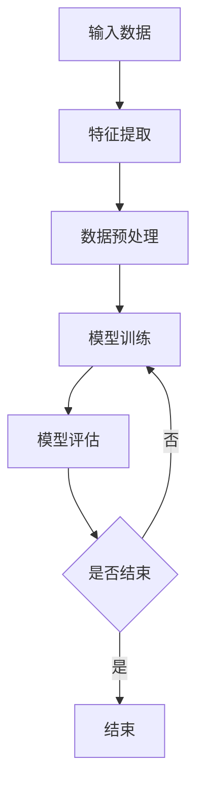

                 

# 机器学习在个性化推荐中的算法优化

## 关键词

机器学习、个性化推荐、算法优化、协同过滤、内容推荐、混合推荐系统、深度学习、特征工程、数据处理、评估指标

## 摘要

本文将深入探讨机器学习在个性化推荐系统中的应用，特别是算法优化方面。通过分析协同过滤、内容推荐和混合推荐系统，我们旨在揭示每种方法的原理和实现细节。此外，文章将介绍特征工程、数据处理和评估指标，以帮助读者全面理解个性化推荐系统的工作机制。最后，通过实际项目案例，我们将展示如何将理论应用到实践中，以提升推荐系统的效果。

### 第一部分：机器学习基础

#### 第1章：机器学习概述

##### 1.1 机器学习的定义与历史

机器学习（Machine Learning，ML）是一门研究如何让计算机从数据中学习规律，并自动进行决策和预测的学科。它起源于20世纪50年代，当时人工智能（Artificial Intelligence，AI）领域的研究者们开始探讨如何使计算机具备人类的学习能力。

###### 1.1.1 机器学习的概念

机器学习的核心思想是通过算法让计算机从数据中自动学习，而不是通过显式编程。这种学习可以是监督学习（Supervised Learning）、无监督学习（Unsupervised Learning）或强化学习（Reinforcement Learning）。

- **监督学习**：有标签的数据，例如分类和回归任务。
- **无监督学习**：无标签的数据，例如聚类和降维。
- **强化学习**：通过与环境的交互进行学习，例如游戏和机器人控制。

###### 1.1.2 机器学习的发展历程

- **1950s**：Arthur Samuel提出“机器学习”一词，并开发了第一个自动下棋程序。
- **1960s**：研究重点从符号学习转向数值学习。
- **1980s**：贝叶斯方法和决策树等算法的发展。
- **2000s**：深度学习和神经网络复兴，带来了一系列突破。

###### 1.1.3 机器学习的分类

- **监督学习**：有监督的学习方法，例如线性回归、决策树和神经网络。
- **无监督学习**：无监督的学习方法，例如聚类、降维和自编码器。
- **强化学习**：通过与环境交互进行学习的策略优化方法。

##### 1.2 机器学习的基本原理

机器学习的基本原理可以概括为以下几个步骤：

1. **数据收集**：从各种来源收集数据，包括文本、图像、音频等。
2. **数据预处理**：清洗和转换数据，使其适合于机器学习算法。
3. **特征提取**：从数据中提取有用的特征，以帮助算法进行学习。
4. **模型选择**：选择适合任务的机器学习模型。
5. **训练**：使用训练数据集训练模型。
6. **评估**：使用测试数据集评估模型性能。
7. **优化**：根据评估结果调整模型参数，以提高性能。

##### 1.3 机器学习算法

在个性化推荐系统中，常用的机器学习算法包括：

- **线性回归**：用于预测连续值输出。
- **逻辑回归**：用于分类任务，特别是二分类。
- **决策树**：用于分类和回归任务，具有很好的可解释性。
- **随机森林**：多个决策树的集成，提高了模型的预测能力。

#### 第2章：特征工程与数据处理

##### 2.1 特征工程

特征工程（Feature Engineering）是机器学习过程中至关重要的一步，它涉及从原始数据中提取和构建有用的特征，以提高模型性能。以下是特征工程的一些关键步骤：

- **特征选择**：从原始特征中选择最有用的特征，以减少数据维度和计算复杂度。
- **特征提取**：通过统计方法或数据转换方法，从原始数据中生成新的特征。
- **特征转换**：将原始特征转换为适合机器学习算法的形式。

##### 2.2 数据预处理

数据预处理是确保数据质量和模型性能的重要步骤，它包括以下任务：

- **缺失值处理**：处理缺失数据，例如删除缺失值、填充缺失值或使用均值、中位数等代替。
- **数据标准化**：将数据缩放到相同的范围，例如使用Z-Score标准化。
- **数据异常处理**：识别和处理异常数据点，例如使用聚类算法或异常检测算法。

##### 2.3 数据集划分与验证

为了评估模型的性能，通常将数据集划分为训练集和测试集。以下是一些常用的数据集划分和验证方法：

- **K折交叉验证**：将数据集划分为K个子集，每次使用其中一个子集作为测试集，其他子集作为训练集，进行K次迭代。
- **训练集和测试集划分**：随机将数据集划分为训练集和测试集，通常训练集占比更大。

### 第二部分：个性化推荐算法

#### 第3章：协同过滤算法

##### 3.1 协同过滤的原理

协同过滤（Collaborative Filtering）是一种常见的个性化推荐算法，它基于用户的行为和偏好，为用户提供个性化的推荐。协同过滤算法可以分为两类：基于用户的协同过滤和基于物品的协同过滤。

- **基于用户的协同过滤**：为用户推荐与其具有相似偏好的其他用户的喜欢的物品。
- **基于物品的协同过滤**：为用户推荐与用户已喜欢的物品相似的物品。

##### 3.2 隐式协同过滤

隐式协同过滤（Implicit Collaborative Filtering）处理的是用户未直接表达偏好的行为数据，例如浏览、点击和搜索等。隐式协同过滤算法需要从用户行为数据中推断用户的偏好。

- **用户行为数据的收集**：收集用户在系统中的各种行为数据，例如浏览历史、点击事件和搜索查询等。
- **隐式数据的建模**：使用矩阵分解或神经网络等方法，对用户行为数据建模，以推断用户的偏好。
- **隐式协同过滤算法的实现**：根据用户行为数据建模的结果，为用户推荐相似的物品。

#### 第4章：内容推荐算法

##### 4.1 内容推荐的原理

内容推荐（Content-Based Recommender System）是基于物品的属性和特征进行推荐的算法。内容推荐算法通过分析物品的文本描述、标签、分类等信息，为用户推荐相似的物品。

- **内容表示**：将物品的属性和特征转换为数值表示，例如词袋模型、词嵌入等。
- **相似度计算**：计算用户已喜欢的物品与新物品之间的相似度，常用的方法包括余弦相似度和Jaccard相似度等。
- **内容推荐算法的实现**：根据物品的相似度，为用户推荐相似的物品。

##### 4.2 基于知识图谱的推荐

基于知识图谱的推荐（Knowledge Graph-Based Recommender System）是一种利用知识图谱进行推荐的算法。知识图谱是一个结构化的语义网络，包含实体、属性和关系。

- **知识图谱的基本概念**：了解知识图谱的定义、结构和应用。
- **知识图谱在推荐系统中的应用**：利用知识图谱进行关联分析和推荐。
- **基于知识图谱的推荐算法实现**：结合知识图谱和推荐算法，实现个性化的推荐。

#### 第5章：混合推荐系统

##### 5.1 混合推荐系统的原理

混合推荐系统（Hybrid Recommender System）结合了协同过滤和内容推荐等不同算法的优点，以提供更准确、多样和个性化的推荐。

- **混合推荐系统的优点**：结合多种算法的优点，提高推荐效果和用户满意度。
- **混合推荐系统的设计**：选择合适的算法组合和融合策略。
- **混合推荐系统的实现**：实现混合推荐系统的架构和算法。

##### 5.2 深度学习在推荐系统中的应用

深度学习（Deep Learning）在推荐系统中有着广泛的应用，可以用于用户行为预测、物品表示学习等方面。

- **神经协同过滤算法**：结合深度学习和协同过滤的方法，提高推荐效果。
- **基于深度学习的用户行为预测**：使用深度学习模型预测用户的行为和偏好。
- **基于深度学习的物品表示学习**：通过深度学习模型生成物品的表示。

### 第三部分：算法优化与评估

#### 第6章：算法优化策略

##### 6.1 优化目标

在个性化推荐系统中，优化目标是提高推荐效果、用户满意度和算法的可扩展性。

- **推荐效果**：提高推荐列表的准确性和覆盖率。
- **用户满意度**：提高用户对推荐列表的满意度。
- **算法可扩展性**：处理大规模数据和多样化场景。

##### 6.2 优化方法

优化方法包括特征优化、模型优化和算法融合。

- **特征优化**：选择和调整特征，以提高模型性能。
- **模型优化**：选择和调整模型结构，以提高模型性能。
- **算法融合**：结合多种算法的优点，提高推荐效果。

#### 第7章：推荐系统评估

##### 7.1 评估指标

推荐系统评估指标包括覆盖率、精准度、多样性、稳定性和用户满意度等。

- **覆盖率**：推荐列表中包含的物品数与总物品数的比值。
- **精准度**：推荐列表中正确推荐物品的比例。
- **多样性**：推荐列表中物品的多样性度量。
- **稳定性**：推荐结果在不同时间段的一致性。
- **用户满意度**：用户对推荐列表的满意度。

##### 7.2 评估方法

评估方法包括实验设计和实验结果分析。

- **实验设计**：选择评估指标、实验场景和实验条件。
- **实验结果分析**：分析模型性能和优化方向。

### 第四部分：项目实战

#### 第8章：基于协同过滤的电商推荐系统

##### 8.1 项目背景

本节将介绍一个基于协同过滤的电商推荐系统，旨在为电商平台的用户推荐可能感兴趣的物品。

- **项目目的**：提高电商平台用户满意度。
- **项目数据集**：用户行为数据、商品信息等。

##### 8.2 系统设计

- **系统架构**：包括数据层、算法层和展示层。
- **数据预处理流程**：包括数据清洗、特征工程等。
- **推荐算法选择与实现**：基于用户的协同过滤算法。

##### 8.3 代码实现与解读

- **代码实现**：使用Python实现基于用户的协同过滤算法。
- **代码解读**：解读关键代码和实现逻辑。

##### 8.4 实验结果

- **实验设计**：设置评估指标和实验条件。
- **实验结果分析**：分析推荐效果和优化方向。

#### 第9章：基于深度学习的音乐推荐系统

##### 9.1 项目背景

本节将介绍一个基于深度学习的音乐推荐系统，旨在为用户提供个性化的音乐推荐。

- **项目目的**：提高音乐推荐系统的准确性。
- **项目数据集**：用户听歌行为数据、音乐信息等。

##### 9.2 系统设计

- **系统架构**：包括数据层、算法层和展示层。
- **数据预处理流程**：包括数据清洗、特征工程等。
- **推荐算法选择与实现**：基于深度学习的协同过滤算法。

##### 9.3 代码实现与解读

- **代码实现**：使用Python实现基于深度学习的协同过滤算法。
- **代码解读**：解读关键代码和实现逻辑。

##### 9.4 实验结果

- **实验设计**：设置评估指标和实验条件。
- **实验结果分析**：分析推荐效果和优化方向。

### 附录

#### 附录A：机器学习与推荐系统相关工具与资源

- **开源机器学习库**：Scikit-learn、TensorFlow、PyTorch
- **推荐系统开源项目**：Movielens、Netflix Prize、Alibaba Recommendation Platform
- **机器学习与推荐系统教程与论文**：《机器学习》 - 周志华、《推荐系统实践》 - 张基宏、《深度学习》 - Ian Goodfellow、Yoshua Bengio、Aaron Courville

#### 附录B：Mermaid流程图与伪代码示例

##### B.1 监督学习算法流程图



##### B.2 线性回归伪代码

```python
# 输入参数
X: 输入特征矩阵
y: 标签向量

# 梯度下降法求解线性回归
def linear_regression(X, y, learning_rate, iterations):
    m = len(y)
    theta = [0 for _ in range(len(X[0]))] # 初始化参数
    for i in range(iterations):
        h = X * theta
        error = h - y
        gradient = (1/m) * (X.T * error)
        theta = theta - learning_rate * gradient
    return theta
```

### 作者

作者：AI天才研究院/AI Genius Institute & 禅与计算机程序设计艺术 /Zen And The Art of Computer Programming

----------------------------------------------------------------

现在，我们已经完成了一篇关于机器学习在个性化推荐中的算法优化的详细技术博客。文章涵盖了机器学习的基础知识、个性化推荐算法、算法优化策略、评估方法和实际项目案例。希望这篇博客能够帮助读者深入理解个性化推荐系统的原理和实践，并在未来的项目中取得更好的成果。

