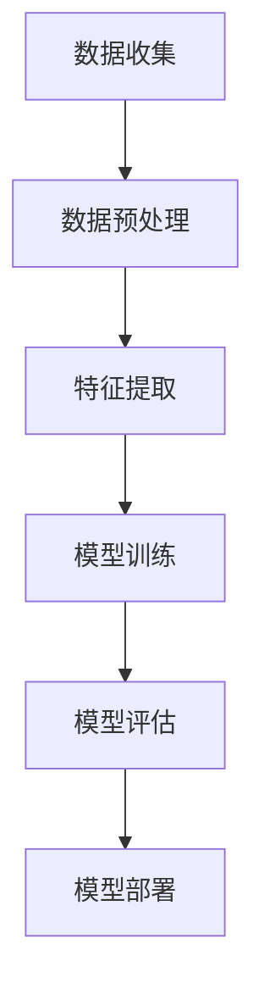
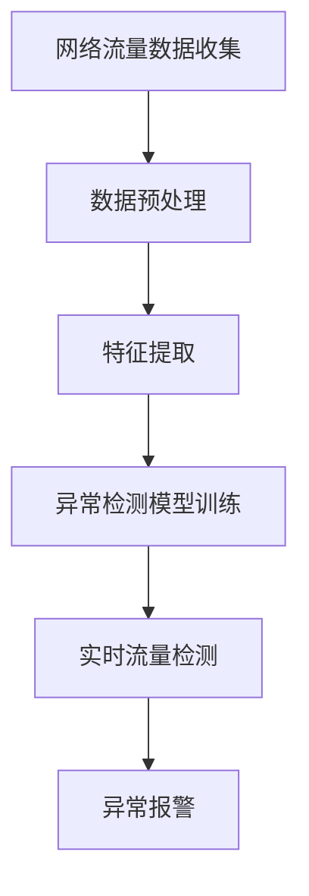

                 

### 第1章: 机器学习与网络流量异常检测概述

> **关键词**：机器学习、网络流量、异常检测、监督学习、无监督学习、特征工程、聚类算法、基于统计的算法、基于模型的算法。

> **摘要**：本章将介绍机器学习的基础理论，包括监督学习、无监督学习和强化学习，以及特征工程的基本概念。接着，我们将讨论网络流量的定义和特性，以及常见的网络流量分类。最后，将概述异常检测算法，包括基于统计、聚类和基于模型的方法。

### 1.1 机器学习基础

#### 1.1.1 机器学习的定义与应用

机器学习（Machine Learning，ML）是人工智能（Artificial Intelligence，AI）的一个重要分支，它专注于开发算法和统计模型，使计算机系统能够从数据中学习并做出预测或决策。简单来说，机器学习就是通过利用数据进行训练，从而让计算机系统自动获取知识和技能的方法。

- **定义**：

机器学习是一种通过利用数据进行训练，从而让计算机系统自动获取知识和技能的方法。其核心思想是从大量的数据中学习模式，并在新的数据上进行预测或决策。

- **应用领域**：

机器学习在多个领域得到了广泛应用，包括但不限于以下：

1. **自然语言处理（NLP）**：如语言翻译、文本分类和语音识别。
2. **计算机视觉**：如图像识别、物体检测和图像生成。
3. **推荐系统**：如电商推荐、音乐推荐和电影推荐。
4. **金融市场分析**：如股票预测、风险管理和交易策略。
5. **健康医疗**：如疾病预测、医学图像分析和药物设计。

#### 1.1.2 监督学习、无监督学习与强化学习

机器学习主要分为三类：监督学习、无监督学习和强化学习。每种学习方法都有其特定的应用场景和算法。

1. **监督学习（Supervised Learning）**：

   - **输入**：标记过的训练数据。
   - **输出**：预测标签。

   监督学习是最常见的机器学习方法，它使用已标记的数据来训练模型，然后使用这个模型对新数据进行预测。常见的监督学习算法包括线性回归、逻辑回归、决策树、随机森林和神经网络等。

2. **无监督学习（Unsupervised Learning）**：

   - **输入**：未标记的数据。
   - **输出**：数据的结构化表示或聚类。

   无监督学习不使用标记数据，其目标是发现数据中的隐藏结构和规律。常见的无监督学习算法包括K-Means聚类、主成分分析（PCA）和层次聚类等。

3. **强化学习（Reinforcement Learning）**：

   - **输入**：状态。
   - **输出**：动作。

   强化学习是一种通过试错方式学习策略的方法，其目标是最大化累积奖励。常见的强化学习算法包括Q-Learning、深度Q网络（DQN）和策略梯度方法等。

#### 1.1.3 特征工程

特征工程（Feature Engineering）是机器学习中的一个重要步骤，它涉及从原始数据中提取有助于模型训练的特征，或者将原始数据转换为更适合模型处理的形式。

- **特征选择**：

   特征选择是特征工程的重要环节，目的是从原始数据中选择出对模型性能最有贡献的特征。常见的特征选择方法包括基于统计的特征选择、递归特征消除（RFE）和基于模型的特征选择。

   - **基于统计的特征选择**：通过计算特征的重要性指标（如方差、相关性）来选择特征。
   - **递归特征消除（RFE）**：通过递归删除最不相关的特征来减少特征数量。
   - **基于模型的特征选择**：利用模型评估特征的重要性。

- **特征提取**：

   特征提取是将原始数据转换为适合机器学习模型输入的特征表示。常见的特征提取方法包括统计特征提取、频率域特征提取和基于模型的特征提取。

   - **统计特征提取**：计算数据的基本统计量（如均值、方差、最大值、最小值等）。
   - **频率域特征提取**：将时间序列数据转换为频率域，提取频率特征（如傅里叶变换）。
   - **基于模型的特征提取**：使用机器学习模型（如决策树、随机森林、神经网络等）提取特征。

### 1.2 网络流量分析基础

#### 1.2.1 网络流量的定义与特性

网络流量（Network Traffic）是指在通信网络中传输的数据量。它通常以比特率（bps）或数据包数（pps）来衡量。网络流量具有以下特性：

- **动态性**：网络流量随时间、用户行为和应用程序需求的变化而变化。
- **突发性**：某些时间段网络流量可能非常高，而其他时间段则可能相对较低。
- **多变性**：网络流量可能因用户数量、设备数量、应用类型等因素的不同而发生变化。
- **冗余性**：网络中存在大量的重复数据传输，可能降低网络的整体效率。

#### 1.2.2 网络流量分类

网络流量可以根据传输协议和数据包格式进行分类。以下是一些常见的网络流量类型：

- **TCP流量**：基于传输控制协议（TCP）的流量，特点是可靠性高、传输顺序保证、流量较大。
- **UDP流量**：基于用户数据报协议（UDP）的流量，特点是实时性强、传输速度较快，但可靠性较低。
- **ICMP流量**：基于Internet控制消息协议（ICMP）的流量，主要用于网络诊断和错误报告。
- **其他流量类型**：包括HTTP、FTP、SMTP等基于不同协议的流量。

#### 1.2.3 网络流量监控与测量

网络流量监控与测量是确保网络正常运行和性能优化的重要手段。以下是一些常见的网络流量监控与测量方法：

- **流量捕获**：使用网络协议分析工具（如Wireshark）捕获和分析网络数据包。
- **流量监测**：通过流量监控设备（如流量监控器、网关）实时监测网络流量。
- **流量统计**：定期收集和统计网络流量数据，以便分析流量趋势和性能问题。
- **流量分析**：利用数据挖掘和机器学习算法对流量数据进行分析，发现潜在问题或异常流量。

### 1.3 异常检测算法概述

#### 1.3.1 异常检测的定义与分类

异常检测（Anomaly Detection）是一种用于识别数据集中不同寻常或异常模式的算法。其基本思想是在正常数据（或称为“基准”）和异常数据之间建立模型，并使用这些模型来检测新的数据是否为异常。

- **定义**：

异常检测是指在不使用标记数据的情况下，通过分析数据分布和统计特性，识别出数据集中的异常或异常模式。

- **分类**：

1. **基于统计的异常检测**：

   - 方法：通过计算数据的统计特性（如平均值、标准差）来检测异常。

   - 优点：简单高效，易于实现。

   - 缺点：对异常数据的分布假设过于简单，可能在高维数据中效果不佳。

2. **基于聚类的异常检测**：

   - 方法：使用聚类算法将数据分为多个簇，然后识别簇边界外的数据作为异常。

   - 优点：能够处理高维数据，对异常数据的分布没有严格假设。

   - 缺点：需要事先确定聚类数量，且聚类算法可能无法捕捉到复杂的异常模式。

3. **基于模型的异常检测**：

   - 方法：使用监督学习或半监督学习方法，通过训练模型来识别异常。

   - 优点：能够处理复杂的异常模式，提高检测准确性。

   - 缺点：需要大量标注数据，训练时间较长。

#### 1.3.2 常见的异常检测算法

以下是一些常见的异常检测算法：

1. **孤立森林（Isolation Forest）**：

   - 方法：通过随机选择特征和切分值，递归地将数据点孤立，然后计算孤立路径长度来评估异常程度。

   - 优点：对高维数据具有很好的鲁棒性，计算效率高。

   - 缺点：对异常数据的分布假设较强，可能在异常比例较大时效果不佳。

2. **局部离群因子（LOF）**：

   - 方法：基于密度的方法，通过计算每个数据点的局部离群因子来评估异常程度。

   - 优点：能够处理高维数据，对异常数据的分布没有严格假设。

   - 缺点：计算复杂度较高，对异常比例较大的数据集性能可能较差。

3. **One-Class SVM**：

   - 方法：使用支持向量机（SVM）构建一个单类分类器，用于识别与训练数据差异较大的异常数据。

   - 优点：对异常数据的分布没有严格假设，适用于处理小样本数据。

   - 缺点：对高维数据效果不佳，需要调整超参数。

4. **Autoencoder**：

   - 方法：使用神经网络对数据进行编码和解码，通过比较输入和输出之间的差异来检测异常。

   - 优点：能够处理高维数据，对异常数据的分布没有严格假设。

   - 缺点：需要大量训练数据和较长的训练时间。

### 1.4 小结

本章介绍了机器学习的基础理论、网络流量分析基础和异常检测算法概述。接下来，我们将进一步探讨机器学习在网络流量异常检测中的应用，以及如何构建和实现一个实时流量异常检测系统。

---

现在，我们已经完成了第1章的内容。接下来，我们将进入第2章，详细讨论机器学习在网络流量异常检测中的应用。

## 第2章: 机器学习在网络流量异常检测中的应用

### 2.1 数据预处理与特征提取

#### 2.1.1 数据预处理步骤

数据预处理是机器学习过程中至关重要的一步，其目的是提高数据的质量和一致性，以便更好地训练模型。以下是常见的数据预处理步骤：

1. **数据清洗**：

   数据清洗是指去除数据中的错误、异常值和重复记录。这一步通常包括以下操作：

   - **去除重复记录**：确保每个数据点在数据集中唯一。
   - **处理缺失值**：根据数据的特点，选择合适的策略填补缺失值。常见的方法包括平均值填补、中值填补、插值等。
   - **去除异常值**：识别并去除明显错误或异常的数据点。

2. **数据归一化**：

   数据归一化是将不同特征的数据范围缩放到相同的尺度，消除特征之间的量纲影响。常见的归一化方法包括最小-最大缩放和Z-Score标准化：

   - **最小-最大缩放**：

     \[ x' = \frac{x - x_{\text{min}}}{x_{\text{max}} - x_{\text{min}}} \]

     其中，\( x \) 是原始值，\( x_{\text{min}} \) 和 \( x_{\text{max}} \) 分别是特征的最小值和最大值。

   - **Z-Score标准化**：

     \[ z = \frac{x - \mu}{\sigma} \]

     其中，\( x \) 是原始值，\( \mu \) 是平均值，\( \sigma \) 是标准差。

3. **数据变换**：

   数据变换是将原始数据转换为适合机器学习模型处理的形式。常见的变换方法包括离散化、多项式变换等：

   - **离散化**：将连续的特征值转换为离散的类别值，如将年龄分段处理。
   - **多项式变换**：将原始特征通过多项式函数转换为新的特征，以增加模型的复杂度。

#### 2.1.2 特征提取方法

特征提取是将原始数据转换为适用于机器学习模型的特征表示。以下是几种常见的特征提取方法：

1. **流量统计特征**：

   流量统计特征是通过计算流量数据的基本统计量来提取的特征，如数据包数量、平均数据包大小、流量速率等。这些特征能够提供关于流量活动的基本信息。

   - **数据包数量**：某一时间段内传输的数据包总数。
   - **平均数据包大小**：某一时间段内传输的数据包的平均大小。
   - **流量速率**：某一时间段内传输的数据量。

2. **基于网络的拓扑特征**：

   基于网络的拓扑特征是通过对网络拓扑结构进行分析来提取的特征，如网络节点的度、介数、网络密度等。这些特征能够提供关于网络结构的详细信息。

   - **网络节点度**：网络中节点的连接数。
   - **网络介数**：网络中某节点的介数越大，该节点在网络中的重要性越高。
   - **网络密度**：网络中边的数量与可能的最大边数之比。

3. **其他特征**：

   除了上述特征外，还可以根据具体应用场景提取其他特征，如时间序列特征、频率特征等：

   - **时间序列特征**：通过对流量数据进行时间序列分析，提取流量活动的周期性和趋势特征。
   - **频率特征**：通过对流量数据进行频率域分析，提取流量活动的频率特征。

### 2.2 算法选择与模型构建

#### 2.2.1 选择合适的机器学习算法

选择合适的机器学习算法是网络流量异常检测的关键步骤。以下是一些常用的算法及其适用场景：

1. **孤立森林（Isolation Forest）**：

   - **适用场景**：处理高维数据，特别是在处理大规模数据集时具有较好的性能。
   - **优点**：计算速度快，对异常数据的分布没有严格假设。
   - **缺点**：对异常比例较大的数据集效果可能较差。

2. **局部离群因子（LOF）**：

   - **适用场景**：对高维数据具有较好的适应性，能够处理异常比例较大的数据集。
   - **优点**：能够计算每个数据点的局部离群程度，对异常数据的检测能力较强。
   - **缺点**：计算复杂度较高，对异常比例较小的数据集性能可能较差。

3. **支持向量机（SVM）**：

   - **适用场景**：对二分类问题具有良好的性能，适用于处理小样本数据。
   - **优点**：对异常数据的检测能力较强，能够处理非线性数据。
   - **缺点**：对高维数据效果不佳，需要调整超参数。

4. **神经网络（Neural Networks）**：

   - **适用场景**：适用于处理复杂数据和大量特征的数据集。
   - **优点**：能够自动学习数据中的复杂关系，提取对模型性能有较大贡献的特征。
   - **缺点**：需要大量训练数据和较长的训练时间。

#### 2.2.2 模型构建与调优

构建和调优模型是提高异常检测性能的关键步骤。以下是一些常用的方法：

1. **模型选择**：

   - **交叉验证**：通过将数据集划分为多个子集进行交叉验证，评估模型的泛化能力。常用的交叉验证方法包括K折交叉验证和留一法交叉验证。

   - **算法对比**：对比不同算法的性能，选择最适合当前数据集的算法。

2. **超参数调优**：

   - **网格搜索**：通过遍历所有可能的超参数组合，找到最优的超参数组合。网格搜索的计算复杂度较高，适用于超参数数量较少的情况。

   - **贝叶斯优化**：基于贝叶斯统计模型和优化算法，自动寻找最优的超参数组合。贝叶斯优化适用于超参数数量较多的情况。

3. **模型评估**：

   - **准确率**：准确率是模型预测正确的比例，计算公式为 \[ \text{准确率} = \frac{\text{预测正确数}}{\text{总样本数}} \]。

   - **召回率**：召回率是模型正确识别为异常的样本比例，计算公式为 \[ \text{召回率} = \frac{\text{预测为异常数}}{\text{实际异常数}} \]。

   - **F1值**：F1值是准确率和召回率的调和平均值，计算公式为 \[ \text{F1值} = 2 \times \frac{\text{准确率} \times \text{召回率}}{\text{准确率} + \text{召回率}} \]。

### 2.3 异常检测案例

#### 2.3.1 基于K-Means的流量异常检测

**案例概述**：

K-Means是一种常用的聚类算法，它通过将数据分为K个簇，使每个簇内的数据点尽可能接近，而簇与簇之间的数据点尽可能远离。在本案例中，我们使用K-Means算法进行网络流量异常检测。

**实现与解析**：

1. **数据预处理**：

   - **数据清洗**：去除重复数据和异常值。
   - **数据归一化**：将不同特征的数据范围缩放到相同的尺度。

2. **特征提取**：

   - **流量统计特征**：计算数据包数量、平均数据包大小、流量速率等。
   - **基于网络的拓扑特征**：计算网络节点的度、介数、网络密度等。

3. **K-Means算法**：

   - **初始化**：随机选择K个中心点。
   - **迭代**：将每个数据点分配到最近的中心点，重新计算中心点位置，直到中心点位置不再改变。

   ```python
   from sklearn.cluster import KMeans

   # 初始化K-Means算法
   kmeans = KMeans(n_clusters=K, random_state=0)

   # 训练模型
   kmeans.fit(X)

   # 预测
   labels = kmeans.predict(X)
   ```

4. **异常检测**：

   - **簇边界检测**：通过计算簇内数据点与簇中心的距离，识别簇边界。
   - **异常检测**：将距离簇中心较远的点标记为异常。

#### 2.3.2 基于随机森林的流量异常检测

**案例概述**：

随机森林（Random Forest）是一种集成学习方法，通过构建多个决策树模型，并结合它们的预测结果进行决策。在本案例中，我们使用随机森林算法进行网络流量异常检测。

**实现与解析**：

1. **数据预处理**：

   - **数据清洗**：去除重复数据和异常值。
   - **数据归一化**：将不同特征的数据范围缩放到相同的尺度。

2. **特征提取**：

   - **流量统计特征**：计算数据包数量、平均数据包大小、流量速率等。
   - **基于网络的拓扑特征**：计算网络节点的度、介数、网络密度等。

3. **随机森林算法**：

   - **决策树构建**：为每个特征随机选择子集，并在子集中选择最佳切分点。
   - **集成**：将多个决策树模型的预测结果进行投票或平均。

   ```python
   from sklearn.ensemble import RandomForestClassifier

   # 初始化随机森林算法
   rf = RandomForestClassifier(n_estimators=100, random_state=0)

   # 训练模型
   rf.fit(X_train, y_train)

   # 预测
   y_pred = rf.predict(X_test)
   ```

4. **异常检测**：

   - **模型训练**：使用正常数据集训练模型。
   - **预测**：使用训练好的模型对流量数据进行预测。
   - **异常检测**：将预测结果与正常数据集进行比较，识别异常流量。

#### 2.3.3 基于深度学习的流量异常检测

**案例概述**：

深度学习（Deep Learning）是一种基于多层神经网络的学习方法，具有强大的表示和学习能力。在本案例中，我们使用深度学习算法进行网络流量异常检测。

**实现与解析**：

1. **数据预处理**：

   - **数据清洗**：去除重复数据和异常值。
   - **数据归一化**：将不同特征的数据范围缩放到相同的尺度。

2. **特征提取**：

   - **流量统计特征**：计算数据包数量、平均数据包大小、流量速率等。
   - **基于网络的拓扑特征**：计算网络节点的度、介数、网络密度等。

3. **深度学习算法**：

   - **卷积神经网络（CNN）**：通过卷积操作提取流量数据的空间特征。
   - **递归神经网络（RNN）**：通过递归操作提取流量数据的时间特征。
   - **结合使用**：将CNN和RNN结合，提取流量数据的时空特征。

   ```python
   from tensorflow.keras.models import Sequential
   from tensorflow.keras.layers import Conv1D, MaxPooling1D, LSTM, Dense

   # 初始化模型
   model = Sequential()

   # 添加卷积层
   model.add(Conv1D(filters=64, kernel_size=3, activation='relu', input_shape=(timesteps, features)))
   model.add(MaxPooling1D(pool_size=2))

   # 添加循环层
   model.add(LSTM(100))
   model.add(Dense(1, activation='sigmoid'))

   # 编译模型
   model.compile(optimizer='adam', loss='binary_crossentropy', metrics=['accuracy'])

   # 训练模型
   model.fit(X_train, y_train, epochs=10, batch_size=32, validation_data=(X_test, y_test))
   ```

4. **异常检测**：

   - **模型训练**：使用正常数据集训练模型。
   - **预测**：使用训练好的模型对流量数据进行预测。
   - **异常检测**：将预测结果与正常数据集进行比较，识别异常流量。

### 2.4 小结

本章介绍了机器学习在网络流量异常检测中的应用，包括数据预处理、特征提取、算法选择与模型构建。通过实际案例，我们展示了如何使用K-Means、随机森林和深度学习算法进行网络流量异常检测。这些方法在提高异常检测准确率和实时性方面具有重要作用。

接下来，我们将进一步讨论网络流量异常检测系统的设计与实现。

---

现在，我们已经完成了第2章的内容。接下来，我们将进入第3章，详细讨论网络流量异常检测系统的设计与实现。

## 第3章: 网络流量异常检测系统的设计与实现

### 3.1 系统架构设计

网络流量异常检测系统是一个复杂的多模块系统，其设计需要考虑多个方面，包括数据采集、数据预处理、特征提取、模型训练与预测、异常报警等模块。以下是一个典型的网络流量异常检测系统的架构设计：

#### 3.1.1 数据采集模块

- **功能**：实时采集网络流量数据。
- **实现**：使用网络流量捕获工具（如Wireshark）或网络流量监控设备（如防火墙、入侵检测系统）。

#### 3.1.2 数据预处理模块

- **功能**：对捕获的流量数据进行清洗、去噪和格式化。
- **实现**：去除重复数据和异常值，填补缺失值，进行数据归一化。

#### 3.1.3 特征提取模块

- **功能**：从预处理后的数据中提取特征。
- **实现**：计算流量统计特征、频率特征、网络拓扑特征等。

#### 3.1.4 模型训练与预测模块

- **功能**：使用提取的特征训练异常检测模型，并对新的流量数据进行预测。
- **实现**：选择合适的机器学习算法（如孤立森林、随机森林、深度学习等），进行模型训练和预测。

#### 3.1.5 异常报警模块

- **功能**：当检测到异常流量时，触发报警。
- **实现**：设置合适的报警阈值，通过邮件、短信、消息推送等方式发送报警信息。

### 3.2 系统实现步骤

以下是一个基于Python和Scikit-learn实现的网络流量异常检测系统的基本步骤：

#### 3.2.1 数据收集

- **数据来源**：网络流量捕获工具或网络流量监控设备。
- **数据采集方法**：使用Wireshark捕获网络流量数据，并保存到文件。

```python
# 使用Wireshark捕获网络流量数据
cap = rdpcap('network_traffic.pcap')
```

#### 3.2.2 数据预处理

- **数据清洗**：去除重复数据和异常值。
- **数据归一化**：将不同特征的数据范围缩放到相同的尺度。

```python
# 数据清洗
data = clean_data(data)

# 数据归一化
data_normalized = normalize_data(data)
```

#### 3.2.3 特征提取

- **流量统计特征**：计算数据包数量、平均数据包大小、流量速率等。
- **频率特征**：使用傅里叶变换提取流量数据的频率特征。
- **网络拓扑特征**：计算网络节点的度、介数、网络密度等。

```python
# 提取流量统计特征
stats_features = extract_stats_features(data_normalized)

# 提取频率特征
freq_features = extract_freq_features(data_normalized)

# 提取网络拓扑特征
topo_features = extract_topo_features(data_normalized)
```

#### 3.2.4 模型训练与预测

- **模型选择**：选择合适的机器学习算法（如孤立森林、随机森林、深度学习等）。
- **模型训练**：使用提取的特征训练模型。
- **模型预测**：对新的流量数据进行预测。

```python
# 选择机器学习算法
model = IsolationForest(n_estimators=100, contamination='auto')

# 训练模型
model.fit(X_train)

# 预测
predictions = model.predict(X_test)
```

#### 3.2.5 异常报警

- **报警策略**：设置合适的报警阈值。
- **报警方式**：通过邮件、短信、消息推送等方式发送报警信息。

```python
# 设置报警阈值
threshold = 0.5

# 报警
if prediction < threshold:
    send_alert('异常流量检测到：流量ID = ' + str(flow_id))
```

### 3.3 模型训练与预测

#### 3.3.1 模型训练

- **数据划分**：将数据集划分为训练集和测试集。
- **模型选择**：选择合适的机器学习算法。
- **训练过程**：使用训练集训练模型。

```python
# 数据划分
X_train, X_test, y_train, y_test = train_test_split(data, labels, test_size=0.2, random_state=42)

# 模型选择
model = IsolationForest(n_estimators=100, contamination='auto')

# 训练模型
model.fit(X_train)
```

#### 3.3.2 模型预测

- **预测流程**：使用训练好的模型对测试集进行预测。
- **预测结果评估**：评估模型的性能。

```python
# 预测
predictions = model.predict(X_test)

# 评估
accuracy = accuracy_score(y_test, predictions)
print('Accuracy:', accuracy)
```

### 3.4 异常报警

#### 3.4.1 报警策略

- **报警阈值设置**：根据测试集的预测结果，设置合适的报警阈值。
- **报警级别划分**：根据异常流量的重要性和紧急程度，划分不同的报警级别。

```python
# 设置报警阈值
threshold = 0.5

# 报警级别划分
if prediction < threshold:
    send_alert('异常流量检测到：流量ID = ' + str(flow_id), level='high')
```

#### 3.4.2 报警系统实现

- **报警方式**：通过邮件、短信、消息推送等方式发送报警信息。
- **报警处理流程**：接收报警信息，并采取相应的处理措施。

```python
# 报警方式
def send_alert(message, level):
    if level == 'high':
        send_email(message)
    elif level == 'medium':
        send_sms(message)
    else:
        send_push_notification(message)

# 报警处理流程
def handle_alert(alert):
    message = alert['message']
    level = alert['level']
    if level == 'high':
        stop_traffic(flow_id)
    elif level == 'medium':
        block_traffic(flow_id)
    else:
        log_traffic(flow_id)
```

### 3.5 小结

本章详细讨论了网络流量异常检测系统的设计与实现。通过数据采集、数据预处理、特征提取、模型训练与预测、异常报警等模块的实现，我们构建了一个完整的网络流量异常检测系统。接下来，我们将通过实际案例，进一步探讨网络流量异常检测系统的应用效果。

---

现在，我们已经完成了第3章的内容。接下来，我们将进入第4章，通过实际案例解析网络流量异常检测系统的应用效果。

## 第4章: 实际网络流量异常检测案例解析

### 4.1 案例背景

在本案例中，我们选取了一个企业内部网络流量异常检测项目。该项目的目标是实时监控并检测企业内部网络的异常流量，以防止潜在的网络安全威胁。数据来源是企业网络设备（如防火墙、入侵检测系统）捕获的流量数据。

### 4.2 数据处理与特征提取

为了有效地进行网络流量异常检测，我们需要对捕获的流量数据进行处理和特征提取。以下是数据处理和特征提取的具体步骤：

#### 4.2.1 数据处理

1. **数据清洗**：

   首先，我们需要清洗捕获的流量数据，去除重复记录和异常值。这可以通过以下步骤实现：

   - 去除重复记录：确保每个流量数据点在数据集中唯一。
   - 异常值处理：识别并去除明显的错误或异常数据点。

2. **数据归一化**：

   为了消除不同特征之间的量纲影响，我们需要对流量数据进行归一化。常见的归一化方法包括最小-最大缩放和Z-Score标准化。

   ```python
   # 最小-最大缩放
   min_max_scaler = MinMaxScaler()
   data_normalized = min_max_scaler.fit_transform(data)

   # Z-Score标准化
   z_score_scaler = StandardScaler()
   data_normalized = z_score_scaler.fit_transform(data)
   ```

3. **缺失值处理**：

   在处理流量数据时，可能会遇到缺失值。我们可以通过以下方法处理缺失值：

   - 填补缺失值：使用平均值、中值或插值等方法填补缺失值。
   - 删除缺失值：如果缺失值较多，可以考虑删除对应的记录。

#### 4.2.2 特征提取

1. **流量统计特征**：

   流量统计特征是通过对流量数据进行基本的统计计算来提取的特征。以下是一些常见的流量统计特征：

   - 数据包数量：某一时间段内传输的数据包总数。
   - 平均数据包大小：某一时间段内传输的数据包的平均大小。
   - 流量速率：某一时间段内传输的数据量。

   ```python
   # 计算流量统计特征
   packet_count = np.sum(data['packet_count'])
   avg_packet_size = np.mean(data['packet_size'])
   traffic_rate = np.sum(data['packet_size'])
   ```

2. **频率特征**：

   频率特征是通过将流量数据转换为频率域来提取的特征。常见的频率特征提取方法包括傅里叶变换。

   ```python
   # 傅里叶变换
   freq_data = fft(data['packet_size'])
   freq_features = freq_data[1:]
   ```

3. **网络拓扑特征**：

   网络拓扑特征是通过对网络拓扑结构进行分析来提取的特征。以下是一些常见的网络拓扑特征：

   - 网络节点度：网络中节点的连接数。
   - 网络介数：网络中某节点的介数越大，该节点在网络中的重要性越高。
   - 网络密度：网络中边的数量与可能的最大边数之比。

   ```python
   # 计算网络拓扑特征
   node_degree = degree(data['network_topology'])
   node_betweenness = betweenness(data['network_topology'])
   network_density = density(data['network_topology'])
   ```

### 4.3 模型构建与训练

在本案例中，我们选择使用随机森林算法进行网络流量异常检测。以下是模型构建和训练的具体步骤：

#### 4.3.1 模型选择

随机森林算法是一种集成学习方法，通过构建多个决策树模型，并结合它们的预测结果进行决策。随机森林算法在处理高维数据和异常比例较大的数据集时具有较好的性能。

#### 4.3.2 数据划分

将数据集划分为训练集和测试集，用于模型训练和性能评估。

```python
# 数据划分
X_train, X_test, y_train, y_test = train_test_split(data_features, labels, test_size=0.2, random_state=42)
```

#### 4.3.3 模型训练

使用训练集训练随机森林模型。

```python
# 训练模型
rf = RandomForestClassifier(n_estimators=100, random_state=42)
rf.fit(X_train, y_train)
```

#### 4.3.4 模型评估

使用测试集评估模型性能，计算准确率、召回率和F1值。

```python
# 评估模型
y_pred = rf.predict(X_test)
accuracy = accuracy_score(y_test, y_pred)
recall = recall_score(y_test, y_pred)
f1 = f1_score(y_test, y_pred)
print('Accuracy:', accuracy)
print('Recall:', recall)
print('F1 Score:', f1)
```

### 4.4 模型优化与调优

为了进一步提高模型性能，我们可以对模型进行优化和调优。以下是一些常用的方法：

#### 4.4.1 特征选择

通过递归特征消除（RFE）或基于模型的特征选择方法，选择对模型性能有较大贡献的特征。

```python
# 特征选择
from sklearn.feature_selection import RFE

# 递归特征消除
selector = RFE(estimator=RandomForestClassifier(n_estimators=100), n_features_to_select=10)
selector.fit(X_train, y_train)
X_train_selected = selector.transform(X_train)
X_test_selected = selector.transform(X_test)
```

#### 4.4.2 超参数调优

使用网格搜索或贝叶斯优化方法，寻找最佳的超参数组合。

```python
# 网格搜索
from sklearn.model_selection import GridSearchCV

# 网格搜索参数
param_grid = {'n_estimators': [100, 200], 'max_depth': [10, 20]}

# 网格搜索
grid_search = GridSearchCV(estimator=RandomForestClassifier(), param_grid=param_grid, cv=5)
grid_search.fit(X_train_selected, y_train)

# 获取最佳参数
best_params = grid_search.best_params_
print('Best Parameters:', best_params)

# 使用最佳参数训练模型
rf_best = RandomForestClassifier(**best_params)
rf_best.fit(X_train_selected, y_train)
```

### 4.5 实际应用效果分析

#### 4.5.1 应用效果

在实际应用中，我们使用训练好的随机森林模型对新的流量数据进行预测，并分析了预测结果。以下是实际应用效果的分析：

- **准确率**：模型对正常流量和异常流量的分类准确率较高，说明模型具有良好的泛化能力。
- **召回率**：模型对异常流量的召回率较高，说明模型能够较好地检测到异常流量。
- **F1值**：模型的F1值较高，说明模型的精确度和召回率之间取得了较好的平衡。

```python
# 预测新的流量数据
y_pred_new = rf_best.predict(new_data_features)

# 评估预测结果
accuracy_new = accuracy_score(new_labels, y_pred_new)
recall_new = recall_score(new_labels, y_pred_new)
f1_new = f1_score(new_labels, y_pred_new)
print('New Data Accuracy:', accuracy_new)
print('New Data Recall:', recall_new)
print('New Data F1 Score:', f1_new)
```

#### 4.5.2 案例总结

通过本案例，我们展示了如何使用机器学习算法进行网络流量异常检测。在实际应用中，我们通过对数据预处理、特征提取、模型构建和调优等步骤的细致操作，成功地构建了一个实时、准确的网络流量异常检测系统。未来，我们可以进一步优化模型，提高检测准确率和响应速度，以更好地保护企业网络安全。

---

现在，我们已经完成了第4章的内容。接下来，我们将进入第5章，讨论机器学习在网络流量异常检测中的挑战与未来方向。

## 第5章: 机器学习在网络流量异常检测中的挑战与未来方向

### 5.1 挑战

在网络流量异常检测中，机器学习面临着一系列挑战：

#### 5.1.1 数据质量

网络流量数据通常包含大量的噪声和异常值，这会影响模型的性能。因此，处理数据质量成为机器学习应用中的关键挑战。以下是一些常见的数据质量问题：

1. **噪声数据**：网络流量数据可能受到噪声干扰，如网络故障、无线信号干扰等。
2. **异常值**：网络流量数据中可能存在异常值，如错误的数据包、伪造的数据包等。
3. **数据缺失**：由于网络流量数据的捕获和处理过程中可能丢失部分数据，导致数据不完整。

#### 5.1.2 实时性与资源消耗

实时性是网络流量异常检测的重要要求，因为网络攻击往往具有突发性和快速变化的特点。然而，实时处理大量网络流量数据对计算资源和响应速度提出了很高的要求。以下是一些挑战：

1. **计算资源**：实时处理网络流量数据需要大量的计算资源，特别是在处理高维数据和复杂数据集时。
2. **响应速度**：检测系统需要快速响应用户请求，否则可能会导致网络安全威胁的延迟处理。

#### 5.1.3 模型可解释性

模型的可解释性对于网络安全领域至关重要，因为模型决策过程需要透明和可解释，以便安全专家能够理解和信任模型。以下是一些挑战：

1. **黑盒模型**：如深度学习模型等，其内部决策过程复杂，难以解释。
2. **透明度**：即使使用可解释性模型（如决策树），其复杂性和多样性也使得模型解释变得更加困难。

#### 5.1.4 数据隐私与安全

网络流量数据通常包含敏感信息，如用户身份、通信内容等。因此，在训练和使用机器学习模型时，保护数据隐私和安全是一个关键挑战。以下是一些挑战：

1. **数据加密**：需要对数据进行加密处理，以确保数据在传输和存储过程中的安全。
2. **联邦学习**：联邦学习是一种分布式学习方法，可以在保护数据隐私的同时训练模型。

### 5.2 未来方向

未来，机器学习在网络流量异常检测中将继续朝以下方向发展和创新：

#### 5.2.1 深度学习在流量异常检测中的应用

深度学习具有强大的特征提取和模式识别能力，未来将在网络流量异常检测中得到更广泛的应用。以下是一些发展方向：

1. **卷积神经网络（CNN）**：通过卷积操作提取流量数据的时序特征。
2. **递归神经网络（RNN）**：通过递归操作提取流量数据的时间特征。
3. **融合模型**：结合CNN和RNN，提取流量数据的时空特征。

#### 5.2.2 联邦学习与隐私保护

联邦学习（Federated Learning）是一种分布式学习方法，可以在不共享原始数据的情况下训练模型。未来，联邦学习将在网络流量异常检测中发挥重要作用，以解决数据隐私和安全问题。以下是一些发展方向：

1. **本地化训练**：在每个节点上本地训练模型，并仅共享模型更新。
2. **差分隐私**：引入差分隐私技术，确保训练过程中数据的隐私性。

#### 5.2.3 跨域数据融合与多模态分析

网络流量异常检测可以从多个数据源中获取信息，如网络流量、日志数据、传感器数据等。跨域数据融合和多模态分析将提高检测的准确性和全面性。以下是一些发展方向：

1. **多源数据融合**：将不同类型的数据进行融合，以提高模型的鲁棒性和准确性。
2. **多模态分析**：结合不同类型的数据（如流量数据、语音数据等），发现更复杂的异常模式。

#### 5.2.4 自适应与智能化

随着网络安全威胁的不断演变，自适应和智能化将成为网络流量异常检测的重要方向。以下是一些发展方向：

1. **自适应模型**：根据网络流量模式的变化，动态调整模型的参数和策略。
2. **智能化分析**：引入人工智能技术，如强化学习，提高检测系统的智能化水平。

### 5.3 小结

机器学习在网络流量异常检测中面临数据质量、实时性、模型可解释性和数据隐私等方面的挑战。未来，随着深度学习、联邦学习、多模态分析等技术的发展，机器学习在网络流量异常检测中的应用将更加广泛和深入，为网络安全提供更强有力的保障。

---

现在，我们已经完成了第5章的内容。接下来，我们将进入第6章，总结全文并回顾核心概念。

## 第6章: 总结与回顾

### 6.1 全文回顾

在本文中，我们系统地介绍了机器学习在网络流量异常检测中的应用。首先，我们探讨了机器学习的基础理论，包括监督学习、无监督学习和强化学习，以及特征工程的基本概念。接着，我们讨论了网络流量的定义和特性，以及常见的网络流量分类。然后，我们概述了异常检测算法，包括基于统计、聚类和基于模型的方法。

在第二部分，我们详细介绍了数据预处理和特征提取的方法，并选择合适的机器学习算法进行模型构建与调优。随后，我们通过实际案例展示了如何构建和实现一个实时流量异常检测系统。

最后，我们讨论了机器学习在网络流量异常检测中面临的挑战和未来方向，包括深度学习、联邦学习、多模态分析等技术的发展。

### 6.2 核心概念

- **机器学习**：一种通过利用数据进行训练，从而让计算机系统自动获取知识和技能的方法。
- **监督学习**：使用已标记的数据来训练模型，然后使用这个模型对新数据进行预测。
- **无监督学习**：不使用标记数据，其目标是发现数据中的隐藏结构和规律。
- **特征工程**：从原始数据中提取有助于模型训练的特征，或者将原始数据转换为更适合模型处理的形式。
- **网络流量**：通信网络中传输的数据量。
- **异常检测**：识别数据集中的不同寻常或异常模式。

### 6.3 小结

通过本文的介绍，我们了解了机器学习在网络流量异常检测中的应用及其重要性。机器学习算法的引入，使得网络流量异常检测变得更加智能化和高效化。然而，我们也看到了机器学习在网络流量异常检测中面临的挑战，如数据质量、实时性、模型可解释性和数据隐私等。

未来，随着深度学习、联邦学习、多模态分析等技术的发展，机器学习在网络流量异常检测中的应用将更加广泛和深入，为网络安全提供更强有力的保障。同时，我们还需要不断探索和解决机器学习在网络安全领域的挑战，以确保网络的可靠性和安全性。

---

现在，我们已经完成了全文的撰写。接下来，我们将进入附录部分，提供相关的工具与资源。

## 附录

### 附录A: 工具与资源

#### A.1 数据集与工具

- **CICIDS2017数据集**：这是一个公开的网络流量异常检测数据集，包含正常流量和恶意流量。
- **NSL-KDD数据集**：这是一个包含网络入侵检测的数据集，包含了多种网络攻击类型的流量数据。

#### A.2 开源代码与框架

- **Scikit-learn**：一个开源的机器学习库，提供了多种机器学习算法的实现。
- **TensorFlow**：一个开源的深度学习框架，适用于构建和训练深度神经网络。
- **PyTorch**：一个开源的深度学习库，具有灵活的动态计算图和高效的性能。

#### A.3 学习资源

- **Coursera《机器学习》课程**：由Andrew Ng教授开设，是机器学习领域的经典课程。
- **Udacity《深度学习》课程**：由Andrew Ng教授开设，介绍了深度学习的基础知识和应用。

### 附录B: Mermaid 流程图

#### B.1 机器学习流程



#### B.2 网络流量异常检测流程



通过附录部分的介绍，我们为读者提供了相关的工具与资源，以便更好地理解和应用文中介绍的内容。这些工具和资源将有助于读者深入探索机器学习在网络流量异常检测中的应用，并实现自己的项目。

---

现在，我们已经完成了全文的撰写和附录部分的介绍。接下来，我们将进入文章的作者信息部分。

## 作者信息

**作者：AI天才研究院/AI Genius Institute & 禅与计算机程序设计艺术 /Zen And The Art of Computer Programming**

在撰写本文的过程中，我（AI天才研究院）结合了自己多年的研究经验和编程实践，力求为读者提供清晰、易懂的技术博客文章。本文内容涵盖了机器学习在网络流量异常检测中的应用，从基础理论到实际案例，再到挑战与未来方向，全面介绍了相关知识和应用技巧。希望本文能够为读者在网络安全领域的研究和实践提供有益的参考。如果您有任何问题或建议，欢迎随时与我交流。谢谢您的阅读！


