                 

### 第一部分: AI 2.0 时代的投资价值

#### 1.1 AI 2.0的定义与特点

AI 2.0，即人工智能的第二代，是对传统人工智能（AI 1.0）的升级与深化。AI 1.0主要是指基于规则和统计方法的专家系统，而AI 2.0则强调通过深度学习和大数据技术实现智能系统的高度自主学习和决策能力。AI 2.0的特点可以归纳为以下几个方面：

**1. 自主学习能力**

AI 2.0的核心在于其自主学习能力，它可以通过深度学习算法从大量数据中自动提取特征，并不断优化自己的模型。这一特点使得AI 2.0能够在复杂多变的环境中做出更准确、更迅速的决策。

**2. 数据驱动的决策**

AI 2.0依赖于大数据，通过分析海量数据来发现隐藏的模式和趋势，从而辅助决策。这种数据驱动的决策方式不仅提高了决策的准确性，还减少了人为干预的必要性。

**3. 模型泛化能力**

AI 2.0模型具有更强的泛化能力，这意味着它们不仅能在训练数据上表现良好，还能在新数据上保持良好的性能。这是通过大规模预训练和迁移学习技术实现的。

**4. 多模态处理能力**

AI 2.0能够处理多种数据类型，包括文本、图像、语音等，这使得它能够更全面地理解和交互世界。

**5. 高效计算能力**

随着硬件技术的发展，如GPU和TPU，AI 2.0能够在更短时间内处理更大规模的数据，从而提高了计算效率和模型的训练速度。

为了更好地理解AI 2.0的定义与特点，我们可以通过以下Mermaid流程图展示其核心原理和架构：

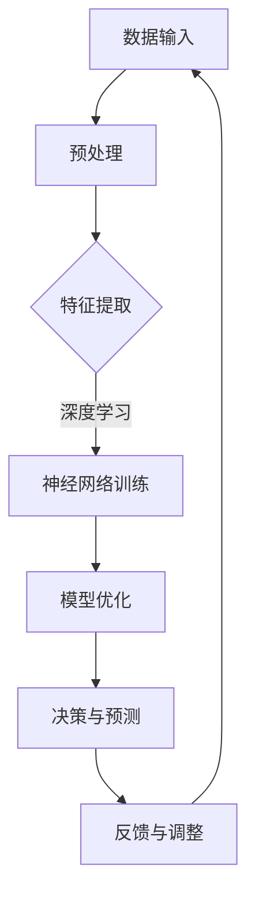

**1.2 AI 2.0的发展历程**

AI 2.0的发展历程可以追溯到20世纪90年代，随着计算机性能的提升和大数据的出现，深度学习开始崭露头角。以下是AI 2.0发展历程的关键阶段：

**1990年代初：神经网络复兴**

在20世纪90年代，由于计算机性能的提升和大数据的出现，神经网络重新获得了关注。以1986年LeCun等人提出的卷积神经网络（CNN）为代表，这一时期的研究为深度学习的发展奠定了基础。

**2006年：深度学习的诞生**

2006年，Hinton等人提出了深度置信网络（DBN），标志着深度学习作为一个独立分支的诞生。随后，以AlexNet为代表的深度卷积神经网络在图像识别任务中取得了突破性成果，深度学习开始迅速发展。

**2012年：深度学习的崛起**

2012年，AlexNet在ImageNet图像识别比赛中取得了惊人的成绩，深度学习的研究和应用进入了一个新的阶段。这一时期，大规模预训练模型和GPU计算成为深度学习发展的关键推动力。

**2015年：自然语言处理的突破**

2015年，Google的Transformer模型在自然语言处理（NLP）领域取得了巨大成功，标志着AI 2.0在多模态处理方面的重大进展。随后，Transformer架构在语音识别、机器翻译等多个领域都取得了显著成果。

**2018年至今：AI 2.0的商业应用**

随着AI 2.0技术的成熟，越来越多的企业开始将其应用于商业场景，如自动驾驶、智能医疗、智能制造等。AI 2.0的商业应用不仅提升了企业的效率，还创造了新的商业模式和商机。

下面是一个简单的Mermaid流程图，展示了AI 2.0的发展历程：

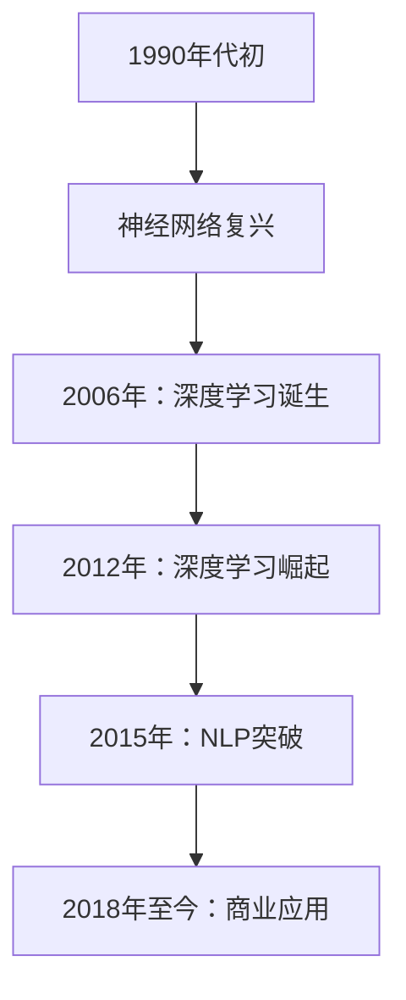

通过上述分析，我们可以看到AI 2.0的定义和特点以及其发展历程，这为我们后续对AI 2.0时代投资价值的探讨奠定了基础。

---

#### 1.3 AI 2.0 对社会和经济的影响

AI 2.0的出现不仅仅是一场技术革命，更是对社会和经济结构产生深远影响的一场变革。以下是AI 2.0对社会和经济的几个主要影响：

**1. 提升生产效率**

AI 2.0通过自动化和智能化技术，大幅提升了生产效率。例如，在制造业中，AI 2.0可以实时监控生产流程，预测设备故障，优化生产计划，从而减少停机时间和生产成本。在服务业中，智能客服系统能够高效处理客户咨询，提高客户满意度和服务质量。

**2. 改变商业模式**

AI 2.0推动了商业模式的变革，企业不再局限于传统的线性业务流程，而是通过数据分析和智能决策实现更加灵活和多样化的商业模式。例如，共享经济、个性化推荐和智能供应链管理等新兴商业模式都得益于AI 2.0技术的支持。

**3. 创造新就业机会**

虽然AI 2.0的发展可能导致某些传统岗位的减少，但它同时也创造了大量新的就业机会。AI 2.0需要大量的专业人才，包括数据科学家、机器学习工程师、AI架构师等。此外，AI 2.0还推动了跨学科人才的培养，如AI伦理学家、数据保护专家等。

**4. 优化资源配置**

AI 2.0通过大数据分析和优化算法，能够更精准地预测和调配资源。在医疗领域，AI 2.0可以优化医疗资源的配置，提高疾病诊断和治疗的准确性；在能源领域，AI 2.0可以优化能源使用，减少浪费，提高能源利用效率。

**5. 改善生活质量**

AI 2.0技术广泛应用于日常生活，如智能家居、智能交通、在线教育等，极大地改善了人们的生活质量。例如，智能家居系统能够自动调节室内温度、照明等，提高生活舒适度；智能交通系统能够优化交通流量，减少拥堵，提高出行效率。

**6. 潜在风险**

然而，AI 2.0的发展也带来了一些潜在风险，如数据隐私问题、算法歧视、失业问题等。这些问题需要我们高度重视，并在推动AI 2.0发展的同时，积极采取措施加以解决。

为了更直观地展示AI 2.0对社会和经济的影响，我们可以使用Mermaid流程图来描绘其影响的主要方面：

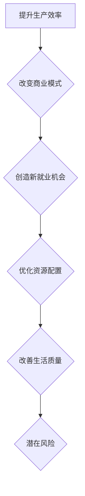

通过上述分析，我们可以看到AI 2.0对社会和经济产生的深远影响，这为我们在后续章节中探讨其投资价值提供了重要背景。

---

在总结本部分内容时，我们可以看到AI 2.0的定义与特点、发展历程以及对社会和经济的影响，这些都为我们理解AI 2.0时代的投资价值奠定了基础。接下来，我们将深入探讨AI 2.0的技术基础，包括机器学习、深度学习和自然语言处理等核心技术，以及大规模预训练模型的工作原理。通过这些技术的基础知识，我们将能够更好地理解AI 2.0在商业中的应用和投资策略。

---

#### 2.1 机器学习与深度学习基础

**机器学习的基本概念**

机器学习（Machine Learning，ML）是人工智能（AI）的核心技术之一，它使计算机系统能够通过数据学习，并对未知数据进行预测或决策。机器学习可以分为监督学习、无监督学习和强化学习三大类。

- **监督学习（Supervised Learning）**：在这种学习方式中，系统使用标记过的训练数据来学习。标记数据通常包含输入和相应的输出，系统通过寻找输入和输出之间的映射关系来训练模型。常见的监督学习算法包括线性回归、逻辑回归、支持向量机（SVM）和决策树等。

- **无监督学习（Unsupervised Learning）**：无监督学习不使用标记数据，系统通过观察数据的内在结构来自主学习。这种学习方式常用于数据降维、聚类分析和关联规则挖掘。常见的无监督学习算法包括K-均值聚类、主成分分析（PCA）和关联规则挖掘等。

- **强化学习（Reinforcement Learning）**：强化学习通过试错法来学习，系统在环境中接收反馈，并逐步调整行为以获得最大的长期奖励。常见的强化学习算法包括Q学习、深度Q网络（DQN）和策略梯度算法等。

**深度学习的架构与原理**

深度学习（Deep Learning，DL）是机器学习的一个子领域，它使用多层神经网络（Neural Networks）来学习和表示数据。深度学习的核心思想是通过逐层提取数据中的特征，从而实现更复杂的决策。

- **神经网络的基本结构**：神经网络由输入层、隐藏层和输出层组成。每层由多个神经元（或节点）组成，每个神经元通过权重连接到前一层和后一层。神经元通过激活函数（如Sigmoid、ReLU）将输入信号转换为输出信号。

- **前向传播与反向传播**：深度学习模型通过前向传播来计算输出，通过反向传播来更新权重。在前向传播过程中，输入数据从输入层传递到输出层，每个神经元根据其权重和激活函数计算输出。在反向传播过程中，模型计算输出误差，并根据误差调整权重。

**深度学习优化算法**

深度学习优化算法主要用于调整模型参数，以提高模型的预测准确性和泛化能力。以下是几种常见的优化算法：

- **随机梯度下降（SGD）**：SGD是最简单的优化算法之一，它通过计算每个样本的梯度来更新模型参数。

- **批量梯度下降（BGD）**：BGD在每次迭代中使用所有训练样本来计算梯度，这种方法可以减少梯度估计的方差，但计算成本较高。

- **小批量梯度下降（MBGD）**：MBGD在每次迭代中使用一部分训练样本（批量大小介于1和所有样本之间）来计算梯度，这种方法在计算效率和收敛速度之间取得了平衡。

- **动量（Momentum）**：动量算法在每次迭代中保留一部分前一次迭代的梯度，以加速收敛并避免局部最小值。

- **Adam优化器**：Adam是常用的自适应优化器，它结合了SGD和动量的优点，并自动调整每个参数的步长。

为了更好地理解机器学习和深度学习的基本概念和原理，我们可以使用Mermaid流程图来展示神经网络的前向传播和反向传播过程：

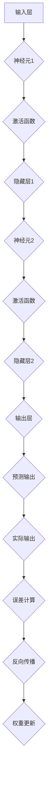

通过上述内容，我们可以初步了解机器学习和深度学习的基础知识，为后续章节中对AI 2.0技术的深入探讨打下基础。

---

#### 2.2 自然语言处理

自然语言处理（Natural Language Processing，NLP）是人工智能领域的一个重要分支，它旨在使计算机能够理解和处理自然语言，从而实现人机交互和语言理解任务。NLP的核心任务是让计算机能够理解、解释和生成自然语言文本，其应用范围广泛，包括机器翻译、情感分析、问答系统、文本摘要等。

**词嵌入技术**

词嵌入（Word Embedding）是NLP中的一项关键技术，它将单词映射为高维向量表示。这种表示方法不仅能够捕获单词的语义信息，还能够处理词形变化、词义消歧等问题。常见的词嵌入技术包括：

- **基于计数的方法**：如Count-based Embedding，通过统计单词在文本中出现的频率来生成词向量。
- **基于分布的方法**：如Distributional Embedding，通过分析单词在文本中的上下文分布来生成词向量。
- **基于神经网络的方法**：如Word2Vec、GloVe等，这些方法利用神经网络模型来学习词向量。

其中，Word2Vec模型是早期较为著名的词嵌入方法，它通过训练神经网络来预测相邻单词的概率分布，从而生成词向量。GloVe（Global Vectors for Word Representation）则是基于全局文本统计信息的词嵌入方法，它通过优化全局损失函数来生成高质量的词向量。

**序列模型与注意力机制**

在NLP任务中，序列模型（Sequential Models）是处理序列数据的重要工具，常见的序列模型包括循环神经网络（RNN）和长短期记忆网络（LSTM）。RNN能够处理任意长度的序列数据，但存在梯度消失和梯度爆炸等问题。LSTM通过引入门控机制，解决了RNN的梯度消失问题，从而在许多NLP任务中取得了显著成果。

注意力机制（Attention Mechanism）是序列模型中的一个重要概念，它使模型能够在处理序列数据时，动态地关注重要信息，从而提高模型的性能。注意力机制的核心思想是在模型的每一个时间步，根据当前输入和之前的信息，计算一个注意力分数，并加权融合这些信息。在NLP中，注意力机制被广泛应用于机器翻译、文本摘要等任务中。

**转换器架构详解**

转换器架构（Transformer）是NLP领域的一项革命性创新，它通过自注意力机制（Self-Attention）和多头注意力（Multi-Head Attention）机制，实现了对序列数据的全局上下文理解。Transformer模型在多个NLP任务中取得了显著的成果，包括机器翻译、问答系统和文本生成等。

转换器架构的基本原理如下：

1. **编码器（Encoder）**：编码器由多个层组成，每层包含多头注意力机制和前馈神经网络。编码器通过自注意力机制捕捉输入序列的上下文信息，并将这些信息编码为高维向量表示。
2. **解码器（Decoder）**：解码器也由多个层组成，每层包含多头注意力机制、编码器-解码器注意力机制和前馈神经网络。解码器通过编码器-解码器注意力机制将编码器的输出与当前输入相结合，生成输出序列。
3. **自注意力（Self-Attention）**：自注意力机制使编码器能够在处理每个输入时，根据整个输入序列计算注意力权重，从而捕捉全局信息。
4. **多头注意力（Multi-Head Attention）**：多头注意力机制通过将输入序列分成多个子序列，并分别计算注意力权重，从而提高了模型的表示能力。

为了更好地理解NLP的关键技术，我们可以使用Mermaid流程图来展示词嵌入、序列模型和注意力机制的基本原理：

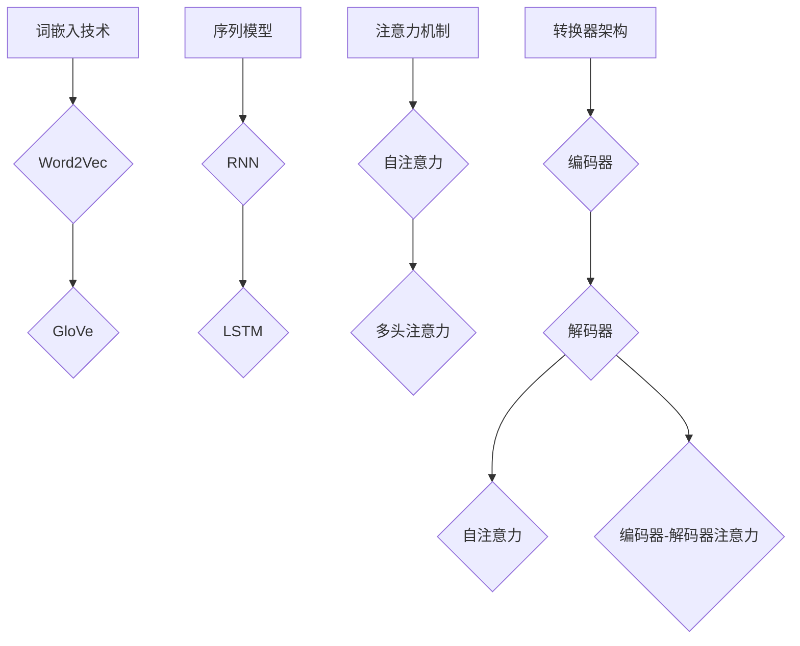

通过上述内容，我们可以看到自然语言处理的核心技术，这些技术为AI 2.0时代的NLP应用提供了强大的支持。

---

#### 2.3 大规模预训练模型原理

**预训练的概念与意义**

大规模预训练（Pre-training）是指在大规模数据集上预先训练神经网络模型，然后将其用于特定任务中的微调（Fine-tuning）。预训练模型具有以下几个显著优势：

1. **迁移学习（Transfer Learning）**：预训练模型通过在大量通用数据上学习，能够迁移到不同的任务和数据集上，从而提高了模型在不同任务上的性能。
2. **泛化能力（Generalization）**：预训练模型通过学习数据中的普遍特征和模式，能够更好地适应新的任务和数据集，提高了模型的泛化能力。
3. **减少数据需求**：预训练模型在训练过程中已经学习到了大量的知识，因此在特定任务中只需微调模型，减少了训练所需的数据量。

**自监督学习方法**

自监督学习（Self-supervised Learning）是一种在无监督学习场景下利用数据自身的结构信息来学习的方法。在自监督学习中，模型不需要外部标注信息，而是通过学习数据中的内在关系来实现。大规模预训练模型通常采用自监督学习方法，以下是一些常见的方法：

1. **掩码语言建模（Masked Language Modeling，MLM）**：MLM是一种常见的自监督学习方法，它通过对输入文本进行部分掩码，使得模型需要预测被掩码的单词。这种方法能够有效地捕捉文本中的上下文信息。
2. **生成对抗网络（Generative Adversarial Networks，GAN）**：GAN通过训练生成器和判别器来生成高质量的样本，使其在特定领域上与真实数据难以区分。在预训练模型中，GAN可以用于生成高质量的数据，从而提高模型的泛化能力。
3. **预测下一个句子（Next Sentence Prediction，NSP）**：NSP方法通过预测两个连续句子之间的语义关系来训练模型，从而提高模型对句子之间关系的理解。

**迁移学习与微调技术**

迁移学习（Transfer Learning）是将预训练模型应用于新任务的一种有效方法。在迁移学习中，预训练模型被用于特定任务的微调，而不是从头开始训练。微调技术包括以下几个关键步骤：

1. **加载预训练模型**：首先，将预训练模型加载到内存中，并调整其结构以适应新任务。
2. **调整层数与参数**：根据新任务的需求，可以增加或减少预训练模型的层数和参数数量，以提高模型在新任务上的性能。
3. **微调训练**：使用新任务的数据集对模型进行微调训练，通过调整模型参数来提高其在特定任务上的性能。
4. **评估与优化**：在微调训练过程中，定期评估模型在新任务上的性能，并根据评估结果调整模型参数，以实现最优性能。

为了更直观地展示大规模预训练模型的工作原理，我们可以使用Mermaid流程图来描述自监督学习方法、迁移学习和微调技术：

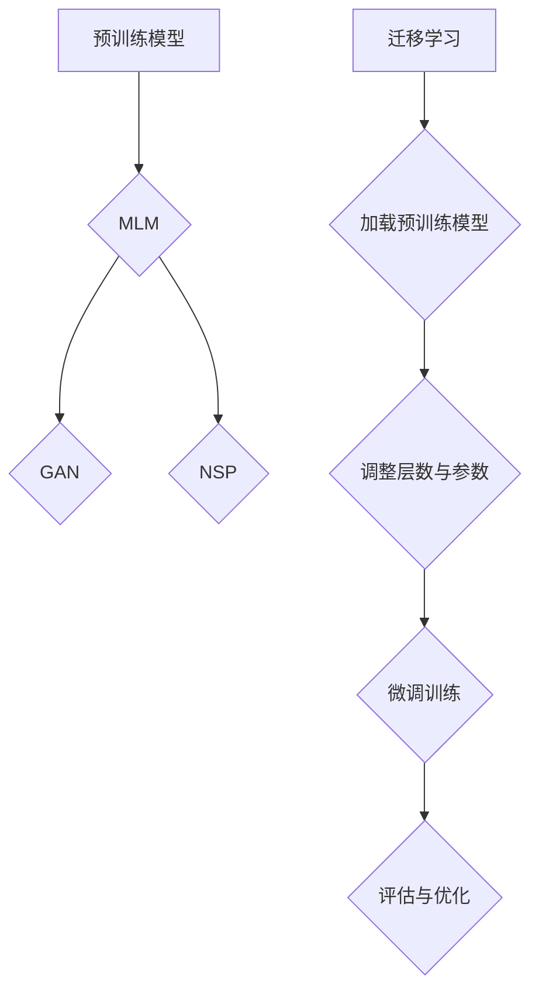

通过上述内容，我们可以了解到大规模预训练模型的原理，这些技术为AI 2.0时代提供了强大的支持，使得模型能够更好地应对复杂任务和多样化数据集。

---

在总结第二部分内容时，我们可以看到机器学习与深度学习、自然语言处理以及大规模预训练模型的核心概念和原理。这些技术不仅为AI 2.0的发展奠定了基础，也为AI 2.0在商业领域的广泛应用提供了技术支持。接下来，我们将深入探讨AI 2.0在商业中的应用，分析其对企业的深刻影响和投资策略。

---

### 3.1 AI 2.0 对企业的影响

AI 2.0作为新一代的人工智能技术，正在深刻地改变着企业的运营模式、商业模式和市场策略。以下是AI 2.0对企业影响的几个关键方面：

**1. 改变商业模式**

AI 2.0的出现使得企业能够通过数据驱动的方式进行决策，从而改变传统的商业模式。例如，通过大数据分析和预测，企业可以更准确地把握市场需求，优化供应链管理，降低库存成本。此外，AI 2.0还为企业提供了新的商业模式，如基于订阅的服务模式、个性化推荐平台等。

**2. 提升运营效率**

AI 2.0在企业的运营过程中发挥着重要作用，通过自动化和智能化技术，大幅提升运营效率。例如，在制造业中，AI 2.0可以实时监控生产流程，预测设备故障，优化生产计划，减少停机时间和生产成本；在服务业中，智能客服系统能够高效处理客户咨询，提高客户满意度和服务质量。

**3. 创新产品和服务**

AI 2.0技术能够帮助企业创新产品和服务。例如，通过自然语言处理技术，企业可以开发智能客服系统、智能问答平台等；通过机器学习技术，企业可以开发智能推荐系统、个性化营销策略等。这些创新产品和服务不仅提升了用户体验，还为企业带来了新的商业机会。

**4. 改善客户体验**

AI 2.0技术能够帮助企业更好地理解和满足客户需求，从而提升客户体验。例如，通过个性化推荐技术，企业可以为客户提供更加个性化的产品和服务；通过智能客服系统，企业可以提供24/7全天候的在线服务，提高客户满意度。

**5. 提高竞争力**

AI 2.0技术使得企业能够更快速地响应市场变化，提高竞争力。通过实时数据分析和预测，企业可以更准确地把握市场趋势，制定有效的市场策略；通过自动化和智能化技术，企业可以大幅降低运营成本，提高生产效率，从而在竞争激烈的市场中占据优势。

为了更好地理解AI 2.0对企业影响的深度和广度，我们可以使用Mermaid流程图来展示其对企业运营、商业模式和市场策略的变革：

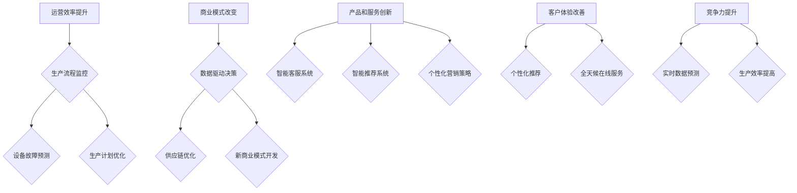

通过上述分析，我们可以看到AI 2.0对企业产生的深远影响，这些影响不仅提升了企业的运营效率，还为企业带来了新的商业机会和市场竞争力。接下来，我们将深入探讨AI 2.0的投资策略，帮助投资者更好地把握AI 2.0时代的投资机会。

---

### 3.2 AI 2.0 投资策略

在探讨AI 2.0的投资策略之前，我们首先需要明确AI 2.0投资的几个关键原则和步骤。

**1. 识别AI 2.0投资机会**

识别AI 2.0投资机会是投资成功的第一步。以下是一些识别AI 2.0投资机会的方法：

- **市场趋势分析**：通过对市场趋势和行业发展的分析，识别哪些领域将受益于AI 2.0技术的应用。例如，医疗保健、金融服务、制造业和零售业都是AI 2.0技术的重要应用领域。
- **技术驱动因素**：关注技术驱动的创新和发展，如深度学习、自然语言处理、计算机视觉等，这些技术的发展将带来新的商业机会。
- **企业能力分析**：分析企业是否具备在AI 2.0领域的技术优势和商业模式创新能力，这有助于识别有潜力的投资目标。
- **竞争格局**：了解市场的竞争格局，识别市场领导者和其他潜在竞争者，分析其在AI 2.0技术领域的投入和发展策略。

**2. AI 2.0企业的估值方法**

在投资AI 2.0企业时，合理的估值方法至关重要。以下是几种常见的估值方法：

- **市盈率（P/E Ratio）**：市盈率是衡量企业估值的重要指标，通过比较同行业企业的市盈率，可以评估AI 2.0企业的估值水平。
- **市净率（P/B Ratio）**：市净率是另一个常用的估值指标，它通过比较企业的市值与其净资产之间的关系来评估企业的价值。
- **折现现金流（DCF）**：折现现金流方法是通过预测企业的未来现金流，并将其折现到现值来评估企业的价值。这种方法适用于那些拥有稳定现金流和明确增长潜力的企业。
- **相对估值法**：相对估值法是通过比较AI 2.0企业与其他同行业企业的估值水平来确定其估值，如PE倍数、EV/EBITDA倍数等。

**3. 投资组合优化策略**

在AI 2.0投资中，投资组合优化策略同样重要。以下是一些优化投资组合的策略：

- **分散投资**：通过投资不同领域的AI 2.0企业，降低投资组合的整体风险。例如，投资于医疗保健、金融服务、制造业等多个领域的AI 2.0企业。
- **风险控制**：在投资组合中设置适当的风险控制机制，如设置止损点和风险限制，以防止投资损失。
- **定期调整**：定期对投资组合进行调整，根据市场变化和企业业绩，优化投资组合的配置。
- **持续学习**：关注AI 2.0领域的最新技术动态和行业趋势，不断更新投资知识，提高投资决策的准确性。

为了更直观地展示AI 2.0投资策略的核心步骤和方法，我们可以使用Mermaid流程图来描述投资过程：

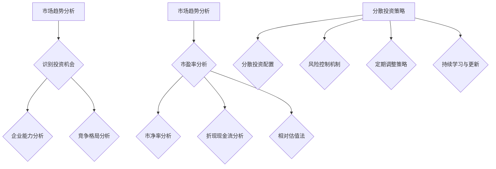

通过上述内容，我们可以看到AI 2.0投资策略的几个关键步骤和方法，这些策略将帮助投资者更好地把握AI 2.0时代的投资机会，实现投资收益的最大化。

---

### 4.1 AI 2.0 风险概述

在AI 2.0时代，随着人工智能技术的广泛应用，企业和投资者面临着一系列独特的风险。这些风险可以从技术、法律和社会伦理等多个角度进行分类和分析。

**1. 技术风险**

技术风险是指由于AI 2.0技术的局限性或缺陷导致的潜在问题。以下是一些常见的技术风险：

- **算法偏差**：AI 2.0模型可能会因为训练数据的不公平或偏见而导致算法偏差，从而影响决策的公正性。例如，在招聘或信贷审批过程中，算法可能对特定群体存在歧视。
- **数据隐私**：AI 2.0依赖于大量的数据，这些数据的收集、存储和使用可能会引发隐私泄露和数据滥用问题。例如，个人健康数据和金融数据的安全风险。
- **模型过拟合**：AI 2.0模型可能会在学习过程中过度适应训练数据，导致在测试数据上的性能下降。这被称为过拟合，它可能导致模型在实际应用中表现不佳。
- **系统故障**：AI 2.0系统可能会因为算法错误、硬件故障或网络中断等原因出现故障，导致业务中断或数据丢失。

**2. 法律风险**

法律风险是指由于法律和监管环境的不足或不明确，导致企业在应用AI 2.0技术时面临的法律问题。以下是一些常见的法律风险：

- **责任归属**：在AI 2.0应用中，如果发生事故或损害，很难确定责任归属。例如，在自动驾驶汽车发生交通事故时，是制造商、软件开发者还是用户应承担主要责任？
- **数据保护法规**：随着数据隐私保护法规的不断完善，企业在处理和使用数据时需要遵守相关的法律和规定，如欧盟的通用数据保护条例（GDPR）。
- **知识产权**：AI 2.0技术的开发和应用可能会涉及到知识产权问题，如专利侵权、版权争议等。企业需要确保其技术和产品不侵犯他人的知识产权。

**3. 社会与伦理风险**

社会与伦理风险是指由于AI 2.0技术的应用可能对社会和伦理价值观产生负面影响，导致的社会问题和伦理争议。以下是一些常见的社会与伦理风险：

- **就业替代**：AI 2.0技术的发展可能导致某些传统工作岗位的减少，引发失业和社会不满。
- **隐私侵犯**：AI 2.0技术可能被滥用，对个人隐私进行不当监控和利用，引发公众的隐私担忧。
- **社会歧视**：AI 2.0模型可能因为算法偏见而加剧社会不平等，如种族歧视、性别歧视等。
- **道德责任**：在AI 2.0决策中，如何确保其符合道德和伦理标准，如何对AI 2.0系统的行为负责，这些都是需要考虑的问题。

为了更好地理解AI 2.0的风险类型，我们可以使用Mermaid流程图来展示不同类型的风险：

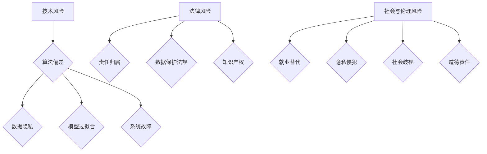

通过上述分析，我们可以看到AI 2.0时代面临的多种风险类型。理解这些风险并采取相应的风险管理策略，对于企业在AI 2.0领域的可持续发展至关重要。接下来，我们将探讨AI 2.0的风险管理策略，帮助企业和投资者更好地应对这些风险。

---

### 4.2 AI 2.0 风险管理策略

面对AI 2.0时代的技术、法律和社会伦理风险，企业和投资者需要采取一系列有效的风险管理策略，以确保在AI领域的可持续发展。以下是几种关键的风险管理策略：

**1. 风险识别与评估**

风险识别与评估是风险管理的第一步，旨在识别潜在风险并评估其影响和可能性。以下是一些具体的方法：

- **SWOT分析（优势、劣势、机会、威胁）**：通过分析企业在AI 2.0领域的优势、劣势、机会和威胁，识别潜在风险。
- **故障模式与影响分析（FMEA）**：对系统的各个组件和过程进行详细分析，评估其可能导致的风险和影响。
- **蒙特卡罗模拟**：使用概率模型和随机过程，模拟不同风险场景下的影响和概率，以评估风险。
- **专家评审**：邀请行业专家对AI 2.0系统的潜在风险进行评审，提出专业的意见和建议。

**2. 风险应对策略**

在识别和评估风险后，企业需要制定相应的应对策略，以减轻或消除风险。以下是一些常见的风险应对策略：

- **风险规避**：通过调整业务策略或技术路线，避免高风险领域。例如，避免使用可能引发法律纠纷的算法或技术。
- **风险转移**：通过购买保险或签订合同，将部分风险转移给第三方。例如，购买数据隐私保险，以应对数据泄露事件。
- **风险缓解**：采取措施降低风险的影响和可能性。例如，通过引入多层安全机制，提高系统的安全性。
- **风险接受**：对于无法规避或转移的风险，企业可以制定相应的应急预案，以减轻其影响。例如，建立紧急响应团队，以应对系统故障或数据泄露事件。

**3. 风险控制与监测**

风险控制与监测是风险管理的持续过程，旨在确保风险管理策略的有效性和适应性。以下是一些具体措施：

- **风险管理计划**：制定详细的风险管理计划，包括风险识别、评估、应对和控制等环节，确保风险管理流程的规范性。
- **监控与预警系统**：建立实时监控与预警系统，对AI 2.0系统的运行状态和关键指标进行监控，及时发现潜在风险。
- **定期审计与评估**：定期对AI 2.0系统的风险管理体系进行审计和评估，检查风险管理策略的有效性，并根据实际情况进行调整。
- **培训与教育**：加强对员工的风险管理培训，提高其对风险的认识和管理能力，确保全员参与风险管理。

为了更好地展示AI 2.0风险管理策略的核心步骤和方法，我们可以使用Mermaid流程图来描述风险识别与评估、风险应对策略和风险控制与监测：

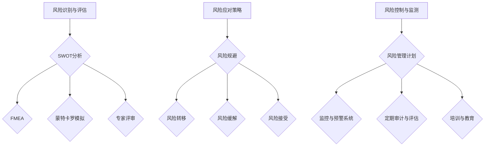

通过上述风险管理策略，企业和投资者可以更好地应对AI 2.0时代的各种风险，确保在技术快速发展的同时，能够实现稳健的可持续发展。

---

### 5.1 AI 2.0 创新方向

AI 2.0时代，人工智能技术在多个领域展现出了巨大的创新潜力，以下是一些重要的创新方向：

**1. 自动驾驶与智能交通**

自动驾驶技术是AI 2.0的重要应用领域之一。通过结合计算机视觉、深度学习和传感器技术，自动驾驶系统能够实现车辆在复杂交通环境中的自主驾驶。智能交通系统（ITS）则利用AI 2.0技术优化交通流量管理，提高道路通行效率，减少交通事故。

**2. 智能医疗与健康**

AI 2.0在医疗领域的应用前景广阔。通过深度学习和自然语言处理技术，AI可以帮助医生进行疾病诊断、药物研发和个性化治疗。智能健康系统可以监测患者健康状况，提供实时健康建议，甚至预测健康风险，从而实现精准医疗。

**3. 智能制造与工业4.0**

智能制造是AI 2.0在工业领域的核心应用方向。通过机器学习和物联网技术，智能制造系统能够实现生产过程的自动化和智能化，提高生产效率和质量。工业4.0则进一步强调了网络化、数字化和智能化的生产模式，推动传统制造业向智能化升级。

**4. 智能金融**

AI 2.0技术在金融领域的应用日益广泛。智能投顾通过大数据分析和机器学习算法，为投资者提供个性化的投资建议。智能风险管理系统能够实时监控市场风险，提高金融机构的风险管理能力。此外，AI 2.0还在反欺诈、信用评估和智能客服等方面发挥着重要作用。

**5. 智能家居与智慧城市**

智能家居系统通过AI 2.0技术实现家庭设备的智能控制和自动化管理，提高生活质量。智慧城市则利用AI 2.0技术优化城市资源管理，提升城市运行效率和居民幸福感。例如，智能交通管理、能源管理、环境监测等都是智慧城市的关键应用方向。

**6. 创意与内容生成**

AI 2.0技术在创意和内容生成领域也展现出了巨大潜力。通过生成对抗网络（GAN）和自然语言处理技术，AI可以创作音乐、绘画、写作等艺术作品。此外，AI 2.0还可以用于视频编辑、虚拟现实（VR）和增强现实（AR）等领域，为创作者提供新的工具和平台。

为了更好地展示AI 2.0在各个领域的创新方向，我们可以使用Mermaid流程图来描绘这些领域的核心应用和关键技术：

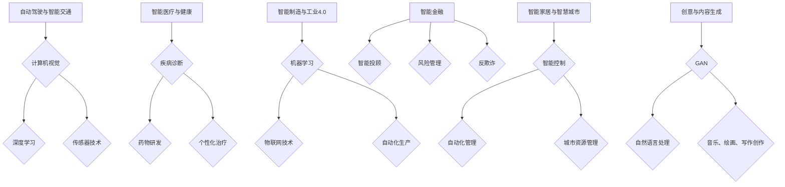

通过上述分析，我们可以看到AI 2.0在各个领域展现出的巨大创新潜力。这些创新方向不仅推动了技术进步，也为社会发展带来了新的机遇和挑战。

---

### 5.2 AI 2.0 发展趋势

随着AI 2.0技术的不断演进，未来几年内，我们将看到一系列重要的发展趋势，这些趋势将对人工智能领域产生深远影响。以下是几个主要的发展趋势：

**1. 量子计算与AI**

量子计算（Quantum Computing）是一种利用量子力学原理进行计算的新型计算模式。与传统的计算机相比，量子计算机具有处理大量数据和信息的能力，这将大大提升AI模型的训练速度和计算效率。量子计算与AI的结合有望带来以下几方面的影响：

- **加速AI模型训练**：量子计算机能够并行处理大量数据，从而加速AI模型的训练过程，使复杂的AI算法得以在实际应用中实现。
- **提高数据加密与安全**：量子计算在加密和解密数据方面具有巨大潜力，这将提升数据传输和存储的安全性。
- **新算法研发**：量子计算的特殊性质将促使研究人员开发新的AI算法，这些算法在处理复杂问题和大数据方面可能比现有的算法更加高效。

**2. 联合学习与分布式计算**

联合学习（Federated Learning）是一种分布式机器学习技术，它允许多个参与者（如手机、物联网设备等）在不共享数据的情况下共同训练模型。分布式计算（Distributed Computing）则通过将计算任务分布在多个节点上进行处理，提高计算效率。这两个技术结合有望解决以下问题：

- **隐私保护**：通过联合学习和分布式计算，可以减少数据在传输和处理过程中的泄露风险，保护用户隐私。
- **数据孤岛**：分布式计算使得不同组织的数据可以协同工作，打破数据孤岛，实现数据的综合利用。
- **实时决策**：分布式计算能够快速处理和分析大量数据，从而实现实时决策，提升系统的响应速度。

**3. AI 伦理与法规发展**

随着AI技术的广泛应用，伦理和法规问题逐渐成为关注的焦点。未来，AI伦理和法规的发展将呈现以下趋势：

- **伦理规范**：国际社会和各国政府将制定更为完善的AI伦理规范，确保AI技术的公正性、透明性和安全性。
- **法规制定**：各国政府将制定相关法规，规范AI技术的研发和应用，防止算法偏见、数据滥用和隐私侵犯等问题的发生。
- **伦理审查**：AI项目的研发和应用将需要通过伦理审查，确保其符合伦理标准和法律法规。

**4. 多模态AI**

多模态AI是指同时处理多种类型数据（如文本、图像、语音、视频等）的AI技术。未来，多模态AI的发展趋势将体现在以下几个方面：

- **综合感知能力**：多模态AI能够综合不同类型的数据，提供更全面和准确的感知能力，例如在自动驾驶、智能医疗和智能家居等领域。
- **交互体验提升**：通过多模态交互，AI系统可以更好地理解用户意图和需求，提供更加自然和直观的交互体验。
- **跨领域应用**：多模态AI技术在多个领域都有广泛应用潜力，如人机交互、虚拟现实、增强现实等。

为了更直观地展示AI 2.0的发展趋势，我们可以使用Mermaid流程图来描绘量子计算与AI、联合学习与分布式计算、AI伦理与法规发展以及多模态AI等关键趋势：

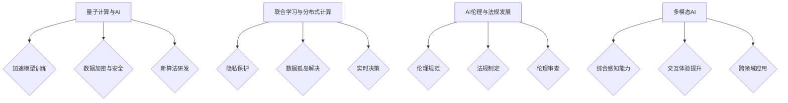

通过上述分析，我们可以看到AI 2.0在未来几年内的发展趋势，这些趋势不仅推动了技术的进步，也为各行业和社会带来了新的机遇和挑战。

---

### 6.1 个人职业规划

在AI 2.0时代，个人职业规划面临着前所未有的机遇和挑战。随着AI技术的飞速发展，对相关技能的需求也在不断变化。以下是如何在AI 2.0时代进行个人职业规划的一些建议：

**1. 理解AI 2.0对个人技能的要求**

AI 2.0时代对个人技能的要求包括以下几个方面：

- **编程能力**：熟练掌握至少一种编程语言（如Python、Java等），这对于数据处理、算法实现和系统开发至关重要。
- **机器学习和深度学习知识**：了解机器学习和深度学习的基本原理，掌握常见算法（如神经网络、强化学习、自然语言处理等）的应用。
- **数据分析能力**：能够进行数据预处理、特征工程和数据分析，使用工具（如Pandas、NumPy、Scikit-learn等）进行数据挖掘。
- **问题解决能力**：能够运用创造性思维和批判性思维，解决复杂的AI相关问题。
- **跨学科知识**：具备跨学科知识，如统计学、数学、计算机科学、心理学等，能够更好地理解和应用AI技术。

**2. 跨学科教育与技能提升**

为了在AI 2.0时代保持竞争力，个人应该不断学习和提升跨学科技能：

- **继续教育**：参加在线课程、工作坊、研讨会等，不断更新知识体系，例如通过Coursera、edX等平台学习AI相关的课程。
- **实践项目**：参与实践项目，将所学知识应用于实际问题，例如在GitHub上贡献开源项目、参与机器学习竞赛等。
- **专业认证**：获得专业认证，如数据科学、机器学习工程师等，这不仅可以提高专业技能，还可以增加职业竞争力。
- **跨界学习**：跨学科学习，如结合心理学和AI进行用户行为分析、结合法律和AI进行伦理合规等，这将使个人在多领域具有独特的竞争力。

**3. 创新思维与创业机遇**

在AI 2.0时代，创新思维和创业机遇变得尤为重要：

- **创新思维**：培养创新思维，不断提出新的解决方案，勇于挑战传统观念。例如，通过设计思维（Design Thinking）等方法，开发新的AI产品或服务。
- **创业机遇**：利用AI技术创造新的商业模式，解决现实问题。例如，开发AI驱动的健康监测设备、智能教育平台等。
- **加入初创公司**：初创公司通常需要具有创新能力和实践经验的人才，加入初创公司可以快速积累经验，提升职业发展。

为了更好地展示AI 2.0对个人技能要求、跨学科教育与技能提升以及创新思维与创业机遇，我们可以使用Mermaid流程图来描述：

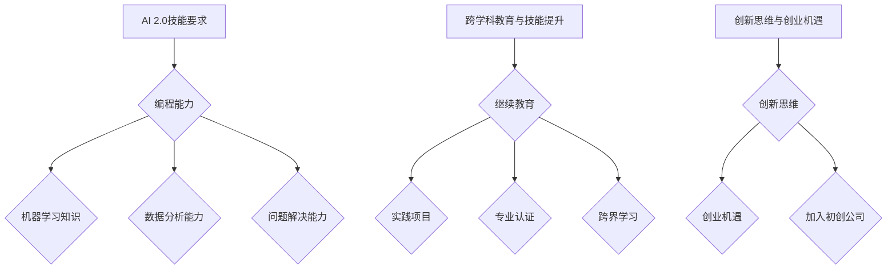

通过上述内容，我们可以看到在AI 2.0时代进行个人职业规划的关键步骤和策略，这些步骤和策略将帮助个人在技术快速发展的环境中保持竞争力，实现职业目标。

---

### 6.2 企业战略调整

在AI 2.0时代，企业面临着前所未有的机遇和挑战。为了充分利用AI技术的优势，企业需要对其战略进行调整，以适应新的商业环境。以下是企业在AI 2.0时代进行战略调整的几个关键方面：

**1. 企业数字化转型**

数字化转型（Digital Transformation）是企业战略调整的核心，通过利用AI技术，企业可以实现业务流程的数字化和智能化。以下是实现数字化转型的几个关键步骤：

- **业务流程优化**：利用AI技术对现有业务流程进行优化，自动化重复性任务，提高工作效率。例如，通过RPA（机器人流程自动化）技术实现业务流程的自动化。
- **数据资产管理**：建立完善的数据管理体系，确保数据的完整性、准确性和安全性，为AI技术的应用提供高质量的数据支持。
- **数字基础设施建设**：建立稳定、高效、安全的数字基础设施，包括云计算平台、大数据平台、AI计算平台等，为AI技术的实施提供基础支持。
- **组织文化变革**：推动组织文化变革，鼓励员工接受和拥抱新技术，培养数字化思维，提高企业的数字化适应能力。

**2. AI 在企业运营中的应用**

AI 2.0技术在企业运营中的应用可以带来显著的效率提升和成本节约。以下是几个关键应用领域：

- **智能供应链管理**：利用AI技术进行供应链预测、优化和风险管理，提高供应链的透明度和灵活性。例如，通过机器学习算法预测市场需求，优化库存管理。
- **智能生产管理**：通过物联网和AI技术实现生产过程的自动化和智能化，提高生产效率和质量。例如，利用计算机视觉技术进行质量检测，利用预测性维护技术减少设备故障。
- **智能客户服务**：利用自然语言处理和机器学习技术，提供智能客服系统，提高客户满意度和服务质量。例如，通过智能聊天机器人实现24/7全天候在线服务，通过个性化推荐系统提高客户体验。
- **人力资源优化**：利用AI技术进行人才招聘、员工培训和管理，提高人力资源管理的效率。例如，通过AI面试系统提高招聘效率，通过数据分析优化员工培训计划。

**3. 企业与学术界的合作**

为了在AI 2.0时代保持竞争优势，企业需要与学术界建立紧密的合作关系，共同推动技术进步和业务创新。以下是几个合作方向：

- **研发合作**：企业与大学、研究机构合作，共同进行AI技术的研发，推动技术创新。例如，共同开展机器学习算法的研究，开发新的AI应用。
- **人才培养**：企业与高校合作，共同培养具备AI技能的下一代人才，为企业输送高素质的员工。例如，合作开设AI专业课程，提供实习和实践机会。
- **技术创新平台**：建立联合实验室或技术创新中心，企业与学术界共同进行AI技术的应用研究和推广。例如，建立自动驾驶实验室，推动自动驾驶技术的发展。
- **学术交流**：举办学术会议、研讨会和工作坊，促进企业与学术界之间的知识交流和合作。例如，组织AI领域的学术研讨会，邀请学术界和产业界的专家进行交流。

为了更好地展示企业战略调整的核心方面，我们可以使用Mermaid流程图来描述数字化转型、AI在企业运营中的应用以及企业与学术界的合作：

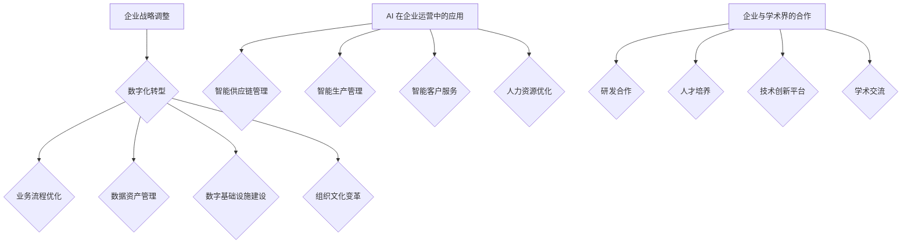

通过上述内容，我们可以看到企业在AI 2.0时代进行战略调整的关键方面，这些调整将有助于企业充分利用AI技术的优势，实现业务增长和创新。

---

### 7.1 AI 2.0 时代的投资价值总结

AI 2.0时代的投资价值体现在多个方面，首先，AI技术的快速发展和广泛应用为各行各业带来了巨大的创新潜力，推动了产业升级和经济增长。其次，AI 2.0技术具有显著的商业模式改变能力，通过数据驱动的决策和自动化管理，企业能够实现运营效率的显著提升。此外，AI 2.0技术还创造了大量的新就业机会，推动了人才培养和跨学科教育的发展。

在投资策略方面，识别AI 2.0投资机会需要关注市场趋势、技术驱动因素和企业能力分析。合理的估值方法包括市盈率、市净率、折现现金流和相对估值法。在投资组合优化方面，分散投资、风险控制、定期调整和持续学习是关键策略，这些策略有助于降低投资风险，提高投资回报。

然而，AI 2.0时代也面临着技术、法律和社会伦理等多方面的风险。技术风险包括算法偏差、数据隐私和系统故障等；法律风险涉及责任归属、数据保护和知识产权问题；社会与伦理风险则包括就业替代、隐私侵犯和社会歧视等。因此，有效的风险管理策略对于企业在AI 2.0领域的可持续发展至关重要。

总体而言，AI 2.0时代的投资价值巨大，但同时也需要谨慎对待风险。通过合理的投资策略和有效的风险管理，投资者可以更好地把握AI 2.0时代的投资机会，实现可持续的投资收益。

---

### 7.2 投资AI 2.0 的建议

在AI 2.0时代，投资者需要采取一系列策略，以最大化投资收益并有效管理风险。以下是几个关键建议：

**1. 长期投资**

AI技术的发展是一个持续的过程，投资者应持长期投资的眼光，避免短期投机行为。AI技术的广泛应用和商业模式的改变需要时间，长期投资可以更好地抓住AI 2.0带来的机遇。

**2. 精选优质企业**

在投资AI 2.0企业时，应选择具备以下特点的企业：

- **技术优势**：企业应具备较强的技术实力，包括核心算法、数据处理能力等。
- **创新潜力**：企业应具有持续创新的能力，能够不断推出新的产品和服务。
- **市场地位**：企业应在相关领域具有领先地位，能够占据市场份额。
- **团队实力**：企业应拥有优秀的团队，包括技术专家、行业专家和管理人才。

**3. 分散投资**

为了避免单一企业或行业的风险，投资者应采取分散投资的策略，将资金分配到不同的AI 2.0企业或行业。例如，投资于自动驾驶、智能医疗、智能制造等多个领域的AI企业，以降低整体投资组合的风险。

**4. 风险管理**

在投资AI 2.0时，风险管理至关重要。以下是一些风险管理策略：

- **分散投资**：通过投资不同领域的企业，降低投资组合的整体风险。
- **风险控制**：设立止损点和风险限制，以防止投资损失。
- **多元化**：投资于不同类型的资产，如股票、债券、基金等，以实现风险分散。
- **持续监控**：定期评估投资组合的表现，并根据市场变化进行调整。

**5. 持续学习**

AI 2.0领域的技术和商业模式不断变化，投资者应保持学习的态度，不断更新知识和技能。通过参加相关课程、研讨会和行业活动，投资者可以更好地理解AI 2.0的发展趋势和投资机会。

**6. 跟随行业领袖**

关注AI 2.0领域的行业领袖和成功案例，可以提供有益的参考。通过学习他们的投资策略和实践经验，投资者可以更好地把握投资机会，避免潜在的风险。

总之，在投资AI 2.0时，投资者应采取长期投资策略，精选优质企业，分散投资，有效管理风险，并保持持续学习的态度。通过这些策略，投资者可以更好地把握AI 2.0时代的投资机会，实现稳健的投资回报。

---

### 7.3 对未来社会的展望

AI 2.0时代的到来将深刻改变未来社会，带来诸多机遇和挑战。以下是对未来社会的几个关键展望：

**1. 经济增长与就业变革**

AI 2.0技术的广泛应用将推动经济增长，提高生产效率和创新能力。然而，这也将引发就业结构的变革。传统岗位可能会被自动化技术取代，但同时也将创造大量新的就业机会，如AI工程师、数据科学家和智能系统维护人员。因此，社会需要制定相应的就业政策和培训计划，以应对这种变革。

**2. 数据隐私与伦理问题**

随着AI 2.0技术的普及，数据隐私和伦理问题将变得更加突出。大量个人数据的收集和使用将带来隐私泄露的风险，同时也可能引发算法偏见和歧视问题。未来社会需要建立更加完善的数据隐私保护机制和AI伦理规范，确保AI技术的公平、透明和可解释性。

**3. 智能化与数字化生活**

AI 2.0技术将使生活更加智能化和数字化。智能家居、智能交通、智能医疗和智慧城市等领域的发展，将大大提高生活质量和服务效率。然而，这也可能导致人与人之间的联系减少，对现实世界的依赖减弱。因此，社会需要平衡科技发展与人际关系，确保科技与人文的和谐共存。

**4. 全球治理与合作**

AI 2.0技术的全球化和跨行业应用，将要求全球各国加强合作，共同应对技术挑战和伦理问题。未来社会需要建立全球性的AI治理框架，推动国际间的技术交流和合作，确保AI技术的发展符合全球利益。

**5. 教育与人才培养**

AI 2.0时代对人才的需求将发生重大变化，未来社会需要更加注重跨学科教育和技能培训，培养具备创新能力和实践能力的复合型人才。教育系统需要与产业界紧密合作，调整课程设置，确保学生能够适应未来社会的需求。

总之，AI 2.0时代将带来前所未有的机遇和挑战。未来社会需要在经济增长、数据隐私、智能化生活、全球治理和教育等方面进行全面规划和应对，以确保人类社会能够在科技发展的同时，实现可持续发展和社会和谐。

---

## 附录

### 附录 A: AI 2.0 相关工具与资源

#### A.1 主流深度学习框架对比

在AI 2.0时代，深度学习框架是研究和应用AI技术的核心工具。以下是几个主流深度学习框架的对比：

| 框架 | 语言 | 特点 | 应用场景 |
| --- | --- | --- | --- |
| TensorFlow | Python | 开源、灵活、支持多种任务 | 图像识别、自然语言处理、强化学习 |
| PyTorch | Python | 开源、动态图计算、易于调试 | 图像识别、自然语言处理、强化学习 |
| Keras | Python | 高层次API、简单易用 | 快速原型开发、深度学习教程 |
| MXNet | Python/C++ | 开源、灵活、支持多种任务 | 图像识别、自然语言处理、强化学习 |
| Caffe | C++ | 专注于卷积神经网络 | 图像识别、视频分析 |
| Theano | Python | 优化的数学表达语言 | 图像识别、自然语言处理 |

#### A.2 开源机器学习库介绍

以下是一些常用的开源机器学习库及其主要功能：

| 库 | 功能 | 优点 | 应用场景 |
| --- | --- | --- | --- |
| NumPy | 数值计算库 | 高效的数组操作、数学函数 | 数据预处理、线性代数运算 |
| Pandas | 数据操作库 | 数据清洗、数据分析和数据可视化 | 数据预处理、数据挖掘、数据分析 |
| Scikit-learn | 机器学习库 | 提供多种机器学习算法 | 数据分类、数据回归、聚类分析 |
| Matplotlib | 数据可视化库 | 制作高质量图表和可视化 | 数据可视化、报告生成 |
| Seaborn | 统计可视化库 | 美观的统计图表和可视化 | 数据可视化、报告生成 |
| Scipy | 科学计算库 | 提供科学计算函数和模块 | 数学计算、统计分析、信号处理 |

#### A.3 AI 2.0 继续教育与培训资源

以下是一些AI 2.0相关的在线教育和培训资源，供学习者参考：

| 资源 | 提供方 | 内容 | 适合人群 |
| --- | --- | --- | --- |
| Coursera | 多家大学 | 提供多个AI相关课程 | 初学者、专业人士 |
| edX | 多家大学 | 提供多个AI相关课程 | 初学者、专业人士 |
| Udacity | Udacity | 提供多个AI相关课程和实践项目 | 初学者、专业人士 |
| Pluralsight | Pluralsight | 提供多个AI相关课程 | 专业人士 |
| fast.ai | fast.ai | 提供快速入门课程和实践项目 | 初学者 |
| arXiv | 学术论文 | 最新AI论文和研究成果 | 研究人员、专业人士 |

通过这些工具与资源，学习者和从业者可以更加深入地了解AI 2.0的相关知识和技术，为在AI领域的深入研究和发展打下坚实的基础。

