                 

# 《李开复：AI 2.0 时代的未来》

## 摘要

本文旨在探讨AI 2.0时代的未来发展趋势和潜在影响。AI 2.0时代是基于大规模预训练模型和深度学习技术的下一代人工智能，它将带来更为智能、高效和广泛的应用场景。本文将详细分析AI 2.0时代的技术基础、应用场景、社会影响及未来趋势，并探讨个人与企业如何应对这一时代的挑战。

## 目录大纲

### 第一部分: AI 2.0 时代概述

### 第二部分: AI 2.0 时代的应用场景

### 第三部分: AI 2.0 时代的社会影响

### 第四部分: AI 2.0 时代的未来展望

### 附录

### 结语

<|assistant|>## 第一部分: AI 2.0 时代概述

### 第1章: AI 2.0 时代的到来

#### 1.1 AI 2.0 的定义与特点

AI 2.0时代，即第二代人工智能时代，是指以深度学习、大规模预训练模型等先进技术为核心的人工智能发展阶段。与AI 1.0时代（以规则驱动和基于知识的系统为主）相比，AI 2.0具有以下特点：

1. **自主学习能力**：AI 2.0能够通过大规模数据自动学习，优化模型参数，实现自我提升。
2. **跨领域应用**：AI 2.0不仅限于特定领域，而是可以在多个领域实现应用，如医疗、金融、教育等。
3. **高效处理能力**：AI 2.0能够处理海量数据，快速分析并做出决策。
4. **通用性**：AI 2.0模型具有更强的通用性，可以应用于多种任务，如自然语言处理、计算机视觉、语音识别等。

#### 1.2 从AI 1.0到AI 2.0的演进

AI 1.0时代主要以符号计算和规则系统为主，如专家系统和基于知识的系统。这些系统在特定领域表现出色，但在泛领域应用方面存在局限性。随着深度学习和大数据技术的发展，AI 2.0逐渐成为主流。这一演进过程可以分为以下几个阶段：

1. **深度学习崛起**：20世纪80年代，深度学习开始崭露头角，逐步替代传统机器学习方法。
2. **大数据驱动**：随着数据量的增长，机器学习模型在训练和优化方面取得了显著进展。
3. **预训练模型兴起**：2018年，GPT-3的出现标志着大规模预训练模型时代的到来，为AI 2.0奠定了基础。

#### 1.3 AI 2.0 时代的核心变革

AI 2.0时代的核心变革体现在以下几个方面：

1. **技术变革**：深度学习和大规模预训练模型成为人工智能发展的新动力。
2. **应用变革**：人工智能从单一领域应用向跨领域应用转变，实现更广泛的应用价值。
3. **产业变革**：人工智能技术逐渐融入各行各业，推动产业升级和创新发展。
4. **社会变革**：人工智能对社会生活、工作、教育等方面产生深远影响，引发社会变革。

#### 1.4 AI 2.0 对人类社会的潜在影响

AI 2.0时代的到来将对人类社会产生广泛而深远的影响：

1. **经济影响**：人工智能将重塑产业链和就业结构，推动经济高质量发展。
2. **社会影响**：人工智能将改变人们的生活方式，提高生活质量，促进社会进步。
3. **政治影响**：人工智能技术将在国家安全、国际竞争等方面发挥重要作用。
4. **伦理影响**：人工智能的发展将引发一系列伦理问题，如数据隐私、算法公平等。

### 第2章: AI 2.0 的技术基础

#### 2.1 深度学习与神经网络基础

##### 2.1.1 神经网络的基本结构

神经网络是人工智能的核心技术之一，其基本结构包括输入层、隐藏层和输出层。每个神经元（节点）通过加权连接与其他神经元相连，通过激活函数对输入信号进行处理，最终生成输出。


##### 2.1.2 深度学习架构详解

深度学习是神经网络的一种扩展，其特点在于模型层数多，能够提取更深层次的特征。深度学习架构包括卷积神经网络（CNN）、循环神经网络（RNN）和Transformer等。


##### 2.1.3 深度学习优化算法

深度学习模型的优化算法主要包括随机梯度下降（SGD）、Adam优化器等。这些算法通过不断调整模型参数，使得模型在训练数据上达到更好的拟合效果。


#### 2.2 自然语言处理技术

##### 2.2.1 词嵌入技术

词嵌入是将单词映射为固定长度的向量表示，从而实现文本数据的向量化。词嵌入技术包括词袋模型（Bag-of-Words）和词嵌入模型（Word Embedding）等。


##### 2.2.2 序列模型与注意力机制

序列模型是处理序列数据（如文本、语音等）的重要技术，包括循环神经网络（RNN）和长短时记忆网络（LSTM）。注意力机制则是一种用于提高模型在序列处理中的性能的技术。


##### 2.2.3 转换器架构详解

转换器（Transformer）架构是近年来自然语言处理领域的重要突破，其核心思想是使用多头自注意力机制来处理序列数据。转换器模型包括编码器和解码器两部分，能够实现高效、强大的文本生成和翻译功能。


#### 2.3 大规模预训练模型原理

##### 2.3.1 预训练的概念与意义

预训练是指在大规模语料库上对模型进行训练，使其能够自动获取语言知识和特征。预训练的意义在于：1）提高模型在下游任务中的表现；2）减少对大规模标注数据的依赖；3）实现跨领域的知识迁移。

##### 2.3.2 自监督学习方法

自监督学习是一种无需标注数据，仅通过输入数据自身信息进行训练的方法。在自然语言处理领域，自监督学习常用于预训练任务，如语言建模、掩码语言模型等。

##### 2.3.3 迁移学习与微调技术

迁移学习是指将预训练模型在特定任务上微调，以提高模型在目标任务上的表现。微调技术通过调整模型参数，使得预训练模型适应新任务的数据分布和特征。

## 第二部分: AI 2.0 时代的应用场景

### 第3章: AI 2.0 在医疗领域的应用

#### 3.1 AI 2.0 在医疗诊断中的应用

##### 3.1.1 基于深度学习的医学影像分析

深度学习在医学影像分析领域具有广泛的应用前景。通过卷积神经网络（CNN）等模型，可以自动识别和分类医学影像中的病变区域，如肿瘤、心脏病等。

核心概念与联系：Mermaid 流程图
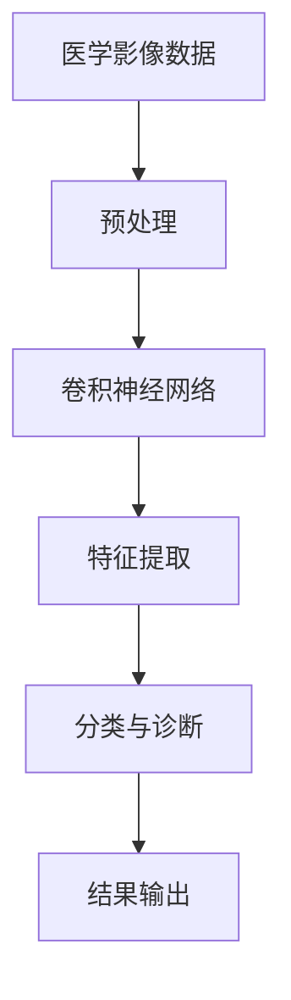

##### 3.1.2 自然语言处理在医疗文本中的应用

自然语言处理技术在医疗文本分析中也发挥着重要作用。通过文本分类、实体识别和关系抽取等技术，可以自动提取医疗文本中的关键信息，如疾病名称、症状等。

核心概念与联系：Mermaid 流程图
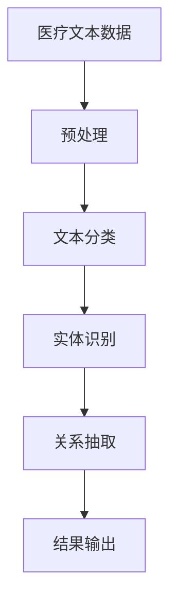

##### 3.1.3 医疗预测模型的构建与优化

AI 2.0时代，医疗预测模型在疾病预测、患者风险评估等方面取得了显著进展。通过深度学习和迁移学习技术，可以构建更加准确和可靠的预测模型。

核心算法原理讲解必须使用伪代码来详细阐述：

```python
# 伪代码：医疗预测模型构建与优化

# 数据预处理
data_preprocessing(input_data):
    # 数据清洗、归一化等操作
    return processed_data

# 深度学习模型
def deep_learning_model(processed_data):
    # 构建深度学习模型
    model = Sequential()
    model.add(Dense(128, activation='relu', input_shape=(input_shape)))
    model.add(Conv2D(32, (3, 3), activation='relu'))
    model.add(MaxPooling2D((2, 2)))
    model.add(Flatten())
    model.add(Dense(1, activation='sigmoid'))
    model.compile(optimizer='adam', loss='binary_crossentropy', metrics=['accuracy'])
    return model

# 模型训练与优化
def train_and_optimize(model, processed_data):
    # 训练模型
    model.fit(processed_data['X'], processed_data['y'], epochs=10, batch_size=32, validation_split=0.2)
    # 优化模型
    model.optimize(processed_data['X_val'], processed_data['y_val'], epochs=5, batch_size=32)
    return model
```

#### 3.2 AI 2.0 在医疗管理中的应用

##### 3.2.1 患者数据分析与管理

AI 2.0技术可以对患者数据进行深度分析，发现潜在的健康风险，为患者提供个性化的健康管理和建议。通过构建多模态数据融合模型，可以整合患者的历史病历、基因数据、生活方式等信息，实现全面的患者数据分析。

核心概念与联系：Mermaid 流程图
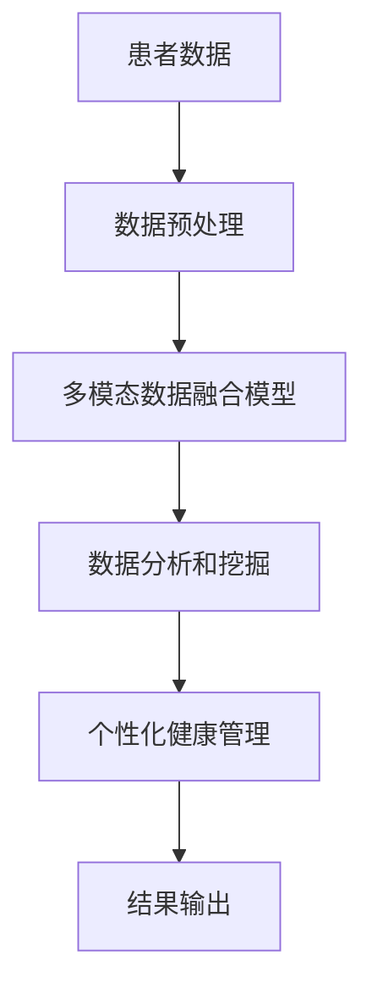

##### 3.2.2 医疗资源的优化配置

AI 2.0技术可以帮助医疗机构优化资源配置，提高医疗服务效率。通过预测患者流量、优化手术排程、智能药物配送等技术，可以降低医疗成本，提高医疗服务质量。

核心概念与联系：Mermaid 流程图
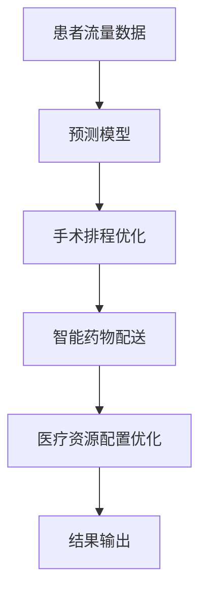

##### 3.2.3 医疗流程的自动化与智能化

AI 2.0技术可以实现医疗流程的自动化和智能化，提高医疗服务效率。通过自然语言处理、计算机视觉等技术，可以实现医疗信息的自动采集、分析和处理，降低医务人员的工作负担。

核心概念与联系：Mermaid 流�程图
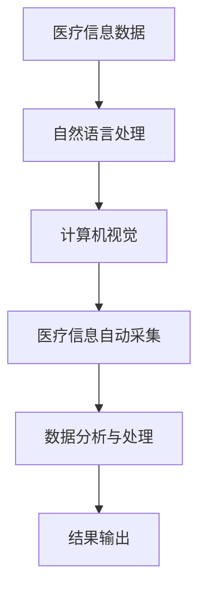

### 第4章: AI 2.0 在金融领域的应用

#### 4.1 AI 2.0 在金融分析中的应用

##### 4.1.1 金融数据的深度学习分析

深度学习技术在金融数据分析中具有广泛的应用。通过构建深度学习模型，可以自动提取金融数据中的特征，实现趋势预测、风险评估等任务。

核心算法原理讲解必须使用伪代码来详细阐述：

```python
# 伪代码：金融数据的深度学习分析

# 数据预处理
data_preprocessing(input_data):
    # 数据清洗、归一化等操作
    return processed_data

# 深度学习模型
def deep_learning_model(processed_data):
    # 构建深度学习模型
    model = Sequential()
    model.add(Dense(64, activation='relu', input_shape=(input_shape)))
    model.add(LSTM(50, activation='relu', return_sequences=True))
    model.add(Dense(1, activation='sigmoid'))
    model.compile(optimizer='adam', loss='binary_crossentropy', metrics=['accuracy'])
    return model

# 模型训练与预测
def train_and_predict(model, processed_data):
    # 训练模型
    model.fit(processed_data['X'], processed_data['y'], epochs=100, batch_size=32, validation_split=0.2)
    # 预测
    predictions = model.predict(processed_data['X_test'])
    return predictions
```

##### 4.1.2 风险评估与预测

AI 2.0技术在风险评估与预测方面具有重要作用。通过构建深度学习模型，可以实现对市场风险、信用风险等的多维度评估，提高金融机构的风险管理水平。

核心概念与联系：Mermaid 流程图
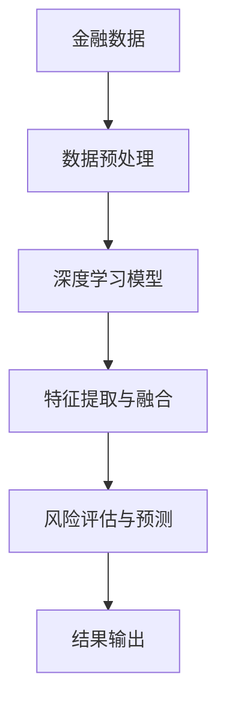

##### 4.1.3 金融市场的自动化交易

AI 2.0技术可以实现金融市场的自动化交易，提高交易效率和收益。通过构建基于深度学习和机器学习的交易策略，可以实现智能交易和量化投资。

核心概念与联系：Mermaid 流程图
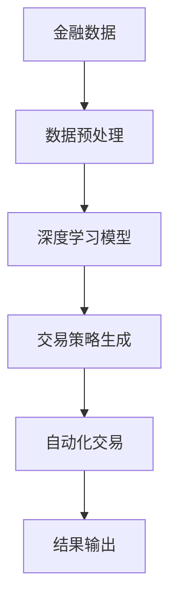

#### 4.2 AI 2.0 在金融服务中的应用

##### 4.2.1 智能客服与金融咨询

AI 2.0技术在金融服务中的应用可以显著提高客户服务水平和效率。通过自然语言处理、计算机视觉等技术，可以实现智能客服和金融咨询功能，为客户提供个性化、高效的金融服务。

核心概念与联系：Mermaid 流程图
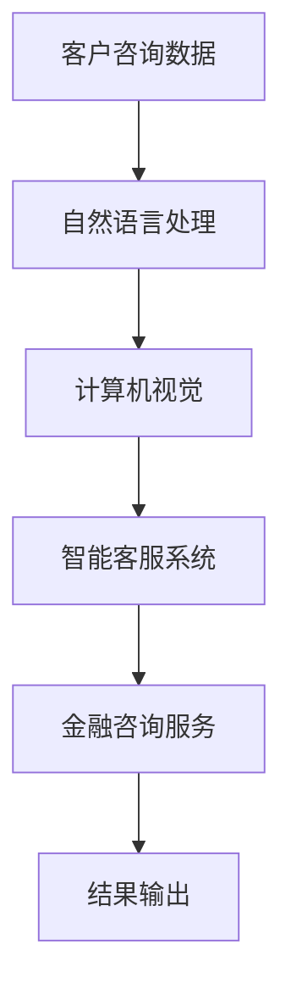

##### 4.2.2 贷款审批与信用评估

AI 2.0技术在贷款审批和信用评估方面具有重要作用。通过构建深度学习模型，可以自动评估借款人的信用状况，提高贷款审批的效率和准确性。

核心算法原理讲解必须使用伪代码来详细阐述：

```python
# 伪代码：贷款审批与信用评估

# 数据预处理
data_preprocessing(input_data):
    # 数据清洗、归一化等操作
    return processed_data

# 深度学习模型
def deep_learning_model(processed_data):
    # 构建深度学习模型
    model = Sequential()
    model.add(Dense(64, activation='relu', input_shape=(input_shape)))
    model.add(Conv1D(32, (3), activation='relu'))
    model.add(MaxPooling1D(pool_size=(2)))
    model.add(Flatten())
    model.add(Dense(1, activation='sigmoid'))
    model.compile(optimizer='adam', loss='binary_crossentropy', metrics=['accuracy'])
    return model

# 模型训练与评估
def train_and_evaluate(model, processed_data):
    # 训练模型
    model.fit(processed_data['X'], processed_data['y'], epochs=100, batch_size=32, validation_split=0.2)
    # 评估模型
    loss, accuracy = model.evaluate(processed_data['X_test'], processed_data['y_test'])
    return accuracy
```

##### 4.2.3 投资组合优化与风险控制

AI 2.0技术在投资组合优化和风险控制方面具有重要作用。通过构建基于深度学习和优化算法的模型，可以实现对投资组合的动态调整，降低投资风险，提高投资收益。

核心概念与联系：Mermaid 流程图
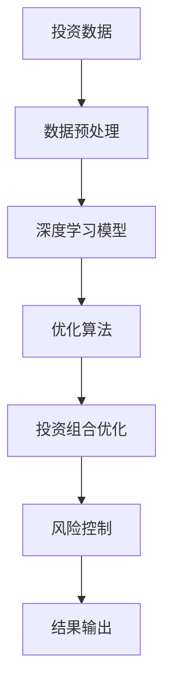

### 第三部分: AI 2.0 时代的社会影响

### 第5章: AI 2.0 对工作与就业的影响

#### 5.1 AI 2.0 对劳动力市场的冲击

AI 2.0技术的广泛应用将对劳动力市场产生深远影响，既带来了新的就业机会，也引发了对传统职位的担忧。

##### 5.1.1 自动化与失业

随着AI 2.0技术的不断发展，许多重复性和低技能的工作可能会被自动化取代。例如，制造业、物流、客服等行业的工作岗位可能会因为机器人和智能系统的引入而减少。然而，这种自动化也创造了新的工作机会，如AI系统维护、数据分析、机器学习工程师等。

核心概念与联系：Mermaid 流程图
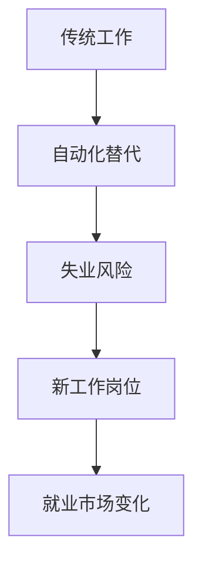

##### 5.1.2 技能更新与再培训

面对AI 2.0时代的到来，劳动力市场需要不断更新和提升员工的技能。企业和教育机构需要提供相应的培训和教育资源，帮助劳动者适应新的工作环境和技术要求。技能更新和再培训不仅有助于劳动者保持就业竞争力，也是社会整体经济持续发展的重要保障。

核心算法原理讲解必须使用伪代码来详细阐述：

```python
# 伪代码：技能更新与再培训

# 数据收集
collect_data():
    # 收集劳动力市场数据、职业需求等信息
    return data

# 技能评估
def assess_skills(data):
    # 对劳动者现有技能进行评估
    skill_levels = []
    for worker in data:
        skill_levels.append(worker['skills'])
    return skill_levels

# 培训计划
def create_training_plan(skill_levels):
    # 根据劳动者技能水平和市场需求，制定培训计划
    training_plan = {}
    for skill in skill_levels:
        if skill not in training_plan:
            training_plan[skill] = []
    return training_plan

# 培训实施
def implement_training(training_plan):
    # 实施培训计划，提升劳动者技能
    for skill, plan in training_plan.items():
        # 根据培训计划内容，开展针对性培训
        for module in plan:
            # 培训模块实施
            train_module(module)
```

##### 5.1.3 新型就业机会的出现

AI 2.0时代的到来也催生了新型就业机会，特别是在人工智能、数据科学、软件开发等领域。这些新兴职业不仅需要高技能人才，还要求劳动者具备创新思维和适应新技术的能力。新型就业机会的出现为劳动力市场提供了新的增长点。

核心概念与联系：Mermaid 流程图
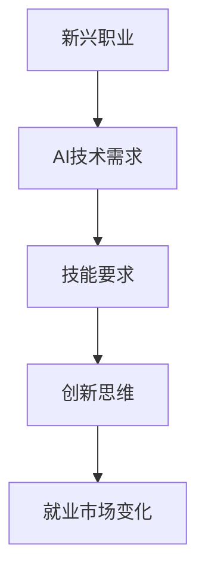

#### 5.2 AI 2.0 对教育的影响

AI 2.0技术对教育领域的影响同样深远，从教育模式、教学方法到教育资源等方面都带来了变革。

##### 5.2.1 教育模式的创新

AI 2.0技术推动了教育模式的创新，特别是在线教育和个性化教育的快速发展。通过人工智能技术，学生可以随时随地获取教育资源，实现个性化学习。同时，虚拟现实（VR）和增强现实（AR）技术的应用，使得学习体验更加生动和沉浸式。

核心概念与联系：Mermaid 流程图
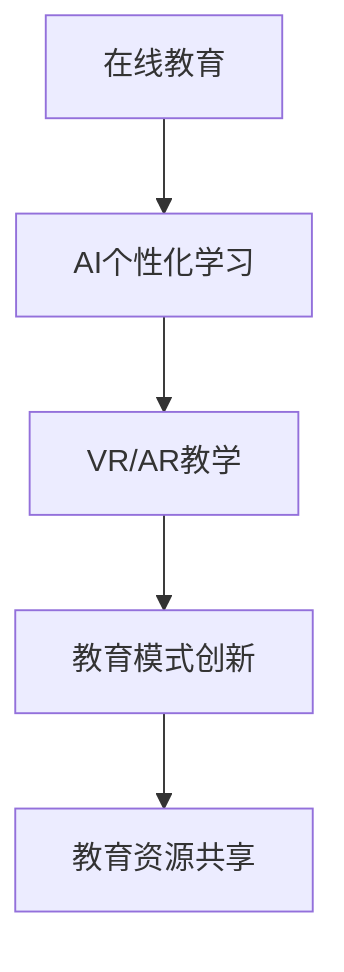

##### 5.2.2 个性化学习与智能辅导

AI 2.0技术可以帮助教育机构实现个性化学习，根据学生的学习进度、兴趣和需求，提供个性化的教学计划和辅导。智能辅导系统可以根据学生的学习行为和成绩数据，实时调整教学策略，提高教学效果。

核心算法原理讲解必须使用伪代码来详细阐述：

```python
# 伪代码：个性化学习与智能辅导

# 数据收集
collect_data(student):
    # 收集学生学习数据，如成绩、学习进度、兴趣等
    return data

# 评估学习状态
def assess_learning_state(data):
    # 根据学生学习数据，评估学习状态
    learning_state = {}
    for key, value in data.items():
        if value > threshold:
            learning_state[key] = 'good'
        else:
            learning_state[key] = 'poor'
    return learning_state

# 制定个性化教学计划
def create_personalized_plan(learning_state):
    # 根据学习状态，制定个性化教学计划
    plan = {}
    for state, status in learning_state.items():
        if status == 'poor':
            plan[state] = '加强辅导'
        else:
            plan[state] = '保持现状'
    return plan

# 实施个性化教学计划
def implement_personalized_plan(plan):
    # 根据个性化教学计划，实施教学活动
    for subject, action in plan.items():
        if action == '加强辅导':
            # 执行加强辅导策略
            reinforce_counseling(subject)
        else:
            # 执行保持现状策略
            maintain_status(subject)
```

##### 5.2.3 教育资源的优化配置

AI 2.0技术有助于教育资源的优化配置，通过大数据分析和机器学习算法，教育机构可以更好地了解学生的需求，合理分配教育资源。例如，可以根据学生的学习进度和成绩，动态调整课程安排和师资力量，提高教育资源利用效率。

核心概念与联系：Mermaid 流程图
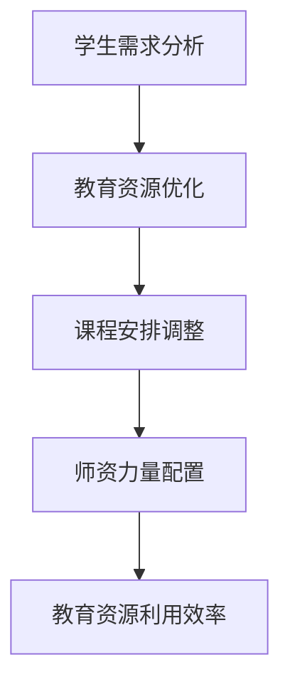

### 第6章: AI 2.0 对伦理与社会的影响

#### 6.1 AI 2.0 的伦理问题

AI 2.0技术的广泛应用引发了一系列伦理问题，如数据隐私、算法公平、责任归属等。这些伦理问题需要引起广泛关注，并采取相应的解决措施。

##### 6.1.1 数据隐私与安全性

随着AI 2.0技术的发展，大量的个人数据被收集和使用，数据隐私问题变得尤为突出。如何在确保数据有效利用的同时保护个人隐私，是AI 2.0时代面临的重要挑战。

核心概念与联系：Mermaid 流程图
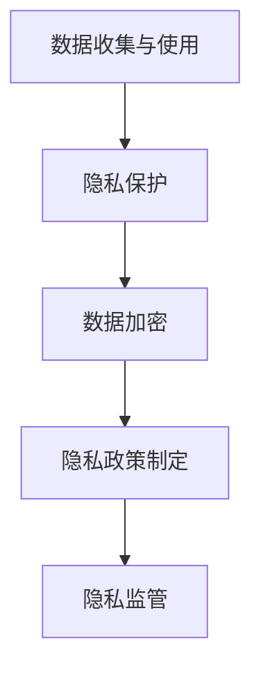

##### 6.1.2 人工智能的透明性与公正性

算法的透明性和公正性是AI 2.0时代的重要伦理问题。算法的决策过程应该对用户和监管机构透明，同时确保算法在处理数据时不会歧视特定群体。

核心概念与联系：Mermaid 流程图
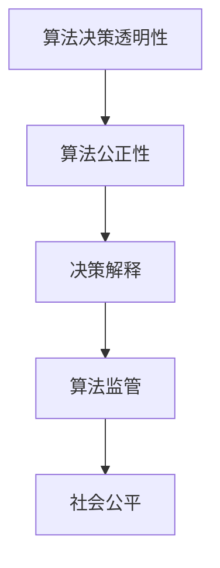

##### 6.1.3 人工智能的责任归属

在AI 2.0时代，当人工智能系统发生错误或造成损害时，如何确定责任归属成为一个重要问题。这需要法律法规的明确界定，以确保人工智能技术的发展不会带来不可预测的风险。

核心概念与联系：Mermaid 流程图
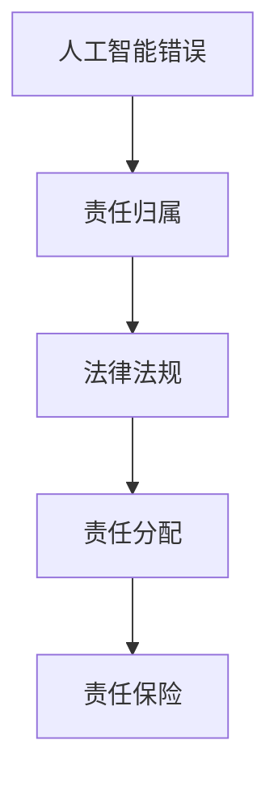

#### 6.2 AI 2.0 社会治理的挑战与机遇

AI 2.0技术为社会治理带来了前所未有的挑战和机遇。如何有效应对这些挑战，发挥AI 2.0技术的潜力，是社会治理的重要课题。

##### 6.2.1 政策法规的制定与执行

政策法规的制定和执行是AI 2.0社会治理的基础。政府需要制定全面、科学的政策法规，规范AI 2.0技术的研发、应用和监管，确保其发展符合社会公共利益。

核心概念与联系：Mermaid 流程图
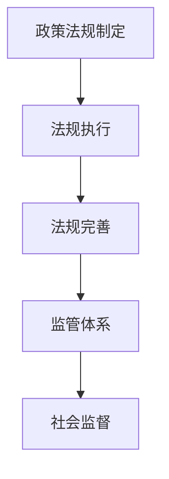

##### 6.2.2 人工智能监管体系的建立

建立人工智能监管体系是AI 2.0社会治理的重要保障。监管体系应包括技术标准、伦理审查、数据安全、责任追究等方面，确保AI 2.0技术的健康、可持续发展。

核心概念与联系：Mermaid 流程图
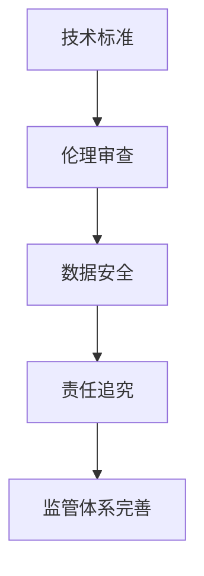

##### 6.2.3 智能社会的可持续发展

智能社会的可持续发展需要政府、企业和社会各界的共同努力。通过推动科技创新、优化社会治理、提升公众素质，实现智能社会的可持续发展。

核心概念与联系：Mermaid 流程图
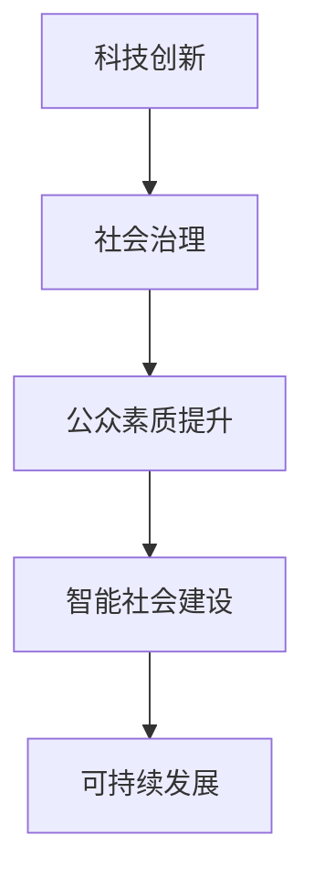

### 第四部分: AI 2.0 时代的未来展望

### 第7章: AI 2.0 时代的未来趋势

#### 7.1 AI 2.0 时代的未来技术发展方向

AI 2.0时代的未来技术发展方向将主要集中在以下几个方面：

1. **大模型的发展趋势**：随着计算能力和数据规模的不断提升，大模型将在AI 2.0时代发挥更为重要的作用。大模型能够处理更复杂的任务，实现更高的性能和精度。

2. **新型计算架构的探索**：为了应对大模型带来的计算挑战，新型计算架构（如GPU、TPU、FPGA等）将得到广泛应用。同时，分布式计算、边缘计算等新型计算模式也将成为未来研究的热点。

3. **生物计算与量子计算的结合**：生物计算和量子计算在处理复杂问题方面具有巨大潜力。未来，AI 2.0时代将探索生物计算与量子计算的结合，实现更高效、更强大的计算能力。

核心概念与联系：Mermaid 流程图
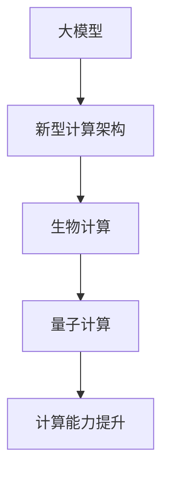

#### 7.2 AI 2.0 时代的社会发展路径

AI 2.0时代的社会发展路径将呈现以下趋势：

1. **智能社会的构建**：AI 2.0技术将广泛应用于各个领域，推动智能社会的建设。智能社会将实现人机协同、信息共享、资源优化，提高社会生产力和生活质量。

2. **人工智能与人类的和谐共生**：AI 2.0时代将推动人工智能与人类的和谐共生，实现人工智能为人类服务的目标。通过技术进步和伦理规范，确保人工智能的发展符合人类的利益和价值观。

3. **全球人工智能治理与合作**：随着AI 2.0技术的发展，全球人工智能治理与合作将成为重要议题。各国政府、企业、科研机构等将加强合作，共同应对人工智能带来的挑战和机遇。

核心概念与联系：Mermaid 流程图
```mermaid
graph TD
A[智能社会建设] --> B[人工智能与人类和谐共生]
B --> C[全球治理与合作]
C --> D[可持续发展]
```

### 第8章: 结语

AI 2.0时代是人工智能发展的新阶段，具有巨大的潜力和广泛的应用前景。在AI 2.0时代，技术、社会、伦理等方面都将面临前所未有的挑战和机遇。

个人与企业应积极应对AI 2.0时代的挑战，不断提升自身的技术能力和创新能力。同时，社会各界应加强合作，共同推动人工智能的健康发展。

在AI 2.0时代，我们有理由相信，人工智能将为人类社会带来更加美好的未来。

### 附录

#### 附录 A: AI 2.0 相关工具与资源

**A.1 主流AI框架介绍**

- TensorFlow：https://www.tensorflow.org/
- PyTorch：https://pytorch.org/
- Keras：https://keras.io/

**A.2 AI研究资源汇总**

- AI论文集：https://arxiv.org/
- AI课程资源：https://www.coursera.org/
- AI博客与社区：https://www.kaggle.com/

**A.3 AI社区与交流平台**

- GitHub：https://github.com/
- Stack Overflow：https://stackoverflow.com/
- AI Meetup：https://www.meetup.com/topics/artificialintelligence/

### 作者信息

作者：AI天才研究院/AI Genius Institute & 禅与计算机程序设计艺术/Zen And The Art of Computer Programming

---

## 文章标题

### 李开复：AI 2.0 时代的未来

### 关键词：AI 2.0、深度学习、预训练模型、自然语言处理、应用场景、社会影响

### 摘要

本文深入探讨了AI 2.0时代的未来发展趋势和潜在影响。AI 2.0时代是基于大规模预训练模型和深度学习技术的下一代人工智能，将在医疗、金融、教育等多个领域带来革命性的变革。本文分析了AI 2.0的技术基础、应用场景、社会影响及未来趋势，并探讨了个人与企业如何应对这一时代的挑战。文章以李开复先生的研究和观点为背景，结合实际案例，为读者呈现了一个全面、深入的AI 2.0时代全景。

