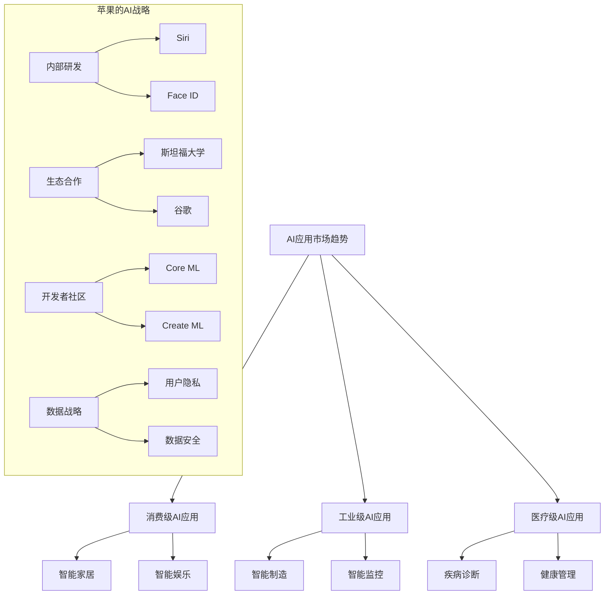
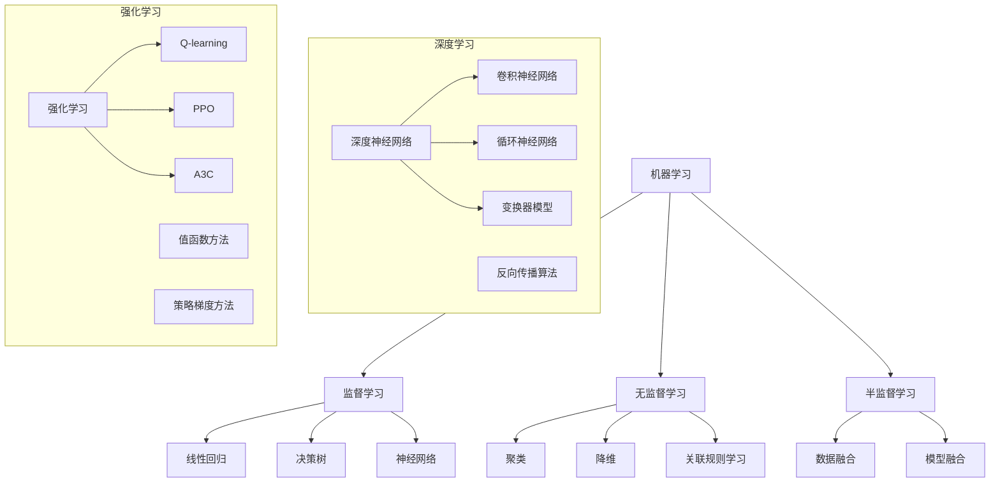
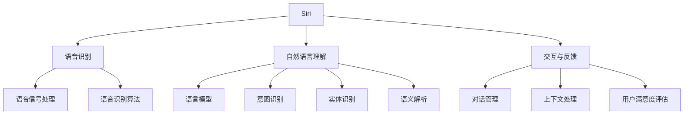
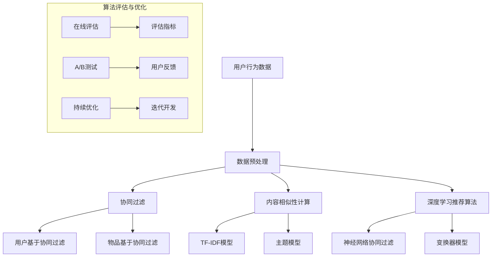
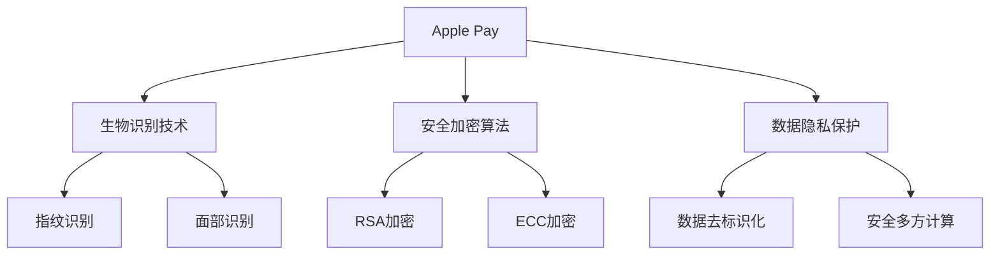
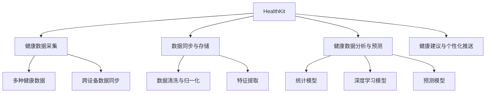

                 

### 第1章: 市场背景

#### 1.1.1 AI技术的发展历程与现状

人工智能（Artificial Intelligence, AI）自20世纪50年代首次提出以来，经历了多个阶段的发展。早期，AI以“逻辑推理”为核心，强调基于符号计算和规则系统。这一阶段的代表性成就是逻辑推理机（Logic Theorist）和通用问题求解器（General Problem Solver）。

然而，随着计算机性能的提升和大数据时代的到来，深度学习（Deep Learning）逐渐成为AI领域的主流。深度学习通过模拟人脑的神经网络结构，实现了在图像识别、语音识别和自然语言处理等领域的突破性进展。代表性模型包括卷积神经网络（Convolutional Neural Networks, CNNs）和循环神经网络（Recurrent Neural Networks, RNNs）。

目前，AI技术已广泛应用于各个行业，包括消费级应用（如智能家居、智能助手）、工业级应用（如智能制造、智能监控）和医疗级应用（如疾病诊断、健康管理）。AI的发展不仅改变了传统的商业模式，还推动了新技术的创新和变革。

#### 1.1.2 苹果公司的AI战略

苹果公司（Apple Inc.）在AI领域的发展可追溯到其智能助手Siri的推出。Siri采用了先进的自然语言处理和机器学习技术，为用户提供了便捷的语音交互体验。随后，苹果公司继续在AI领域进行深耕，不断推出支持AI技术的产品和服务。

苹果公司的AI战略主要包括以下几个方面：

1. **内部研发：** 苹果公司拥有强大的研发团队，专注于AI算法、硬件和软件的结合。公司内部的研究成果被广泛应用于iPhone、iPad和Mac等产品中。

2. **生态合作：** 苹果公司与多家顶尖AI研究机构和企业建立合作关系，共同推动AI技术的发展。例如，与斯坦福大学、卡内基梅隆大学等知名学府的合作，以及与谷歌、微软等科技巨头的竞争与合作。

3. **开发者社区：** 苹果公司积极构建开发者社区，为开发者提供丰富的AI开发工具和资源，鼓励创新和探索。这包括Core ML、Create ML等工具，帮助开发者将AI模型集成到iOS、macOS等平台中。

4. **数据战略：** 苹果公司注重用户隐私和数据安全，通过建立强大的数据平台，为AI算法提供高质量的数据支持。这使得苹果公司在AI应用方面具有独特的优势。

#### 1.1.3 AI应用市场的趋势与展望

AI应用市场正呈现出以下几个显著趋势：

1. **市场规模不断扩大：** 根据市场研究机构的预测，全球AI市场规模将持续增长，预计到2025年将达到数千亿美元。这主要得益于AI技术在各个行业的广泛应用和深度渗透。

2. **垂直行业需求增长：** 人工智能在医疗、金融、制造等垂直行业的需求日益增长，推动了相关领域的创新和发展。例如，医疗AI技术在疾病诊断、药物研发等领域取得了显著成果。

3. **AI与5G融合：** 随着5G技术的普及，AI应用将得到更广泛的应用场景。高速、低延迟的网络环境将促进AI技术的实时部署和优化。

4. **隐私保护与伦理问题：** 随着AI技术的应用日益广泛，隐私保护和伦理问题成为关注焦点。如何在保障用户隐私的同时，充分发挥AI技术的优势，是一个亟待解决的问题。

总之，AI应用市场前景广阔，但同时也面临诸多挑战。苹果公司凭借其强大的技术实力和战略布局，有望在AI应用市场中取得更大的突破。

#### 1.2 AI应用的市场分类

AI应用的市场可以大致分为消费级、工业级和医疗级三个主要类别。每个类别都有其独特的技术特点和应用场景。

##### 1.2.1 消费级AI应用

消费级AI应用主要包括智能手机、智能家居和智能娱乐等。这些应用主要面向个人消费者，旨在提升用户的生活质量和体验。以下是消费级AI应用的一些关键技术特点：

1. **自然语言处理（NLP）：** 智能语音助手、聊天机器人等应用都依赖于NLP技术，以实现与用户的自然对话交互。苹果公司的Siri和亚马逊的Alexa都是典型的NLP应用。

2. **计算机视觉（CV）：** 消费级AI应用在图像识别、目标检测和视频分析等方面有广泛应用。例如，智能手机的相机应用可以通过CV技术实现人像识别、图像编辑等功能。

3. **个性化推荐：** 消费级AI应用通过分析用户行为和偏好，提供个性化的内容推荐。例如，流媒体平台如Netflix和Spotify都会使用AI算法推荐用户可能感兴趣的内容。

##### 1.2.2 工业级AI应用

工业级AI应用主要面向制造业、物流和能源等行业，旨在提高生产效率、降低成本和提升产品质量。以下是工业级AI应用的一些关键技术特点：

1. **机器学习（ML）：** 工业级AI应用大量使用机器学习算法，对生产数据进行分析和预测，以优化生产流程。例如，预测性维护系统可以通过分析设备数据，提前预测设备故障并采取措施。

2. **计算机视觉（CV）：** 工业级AI应用在质量检测、自动化装配和物流管理等方面有广泛应用。例如，汽车生产线上的CV系统可以实时检测产品质量，防止缺陷产品流出。

3. **增强现实（AR）和虚拟现实（VR）：** 工业级AI应用结合AR和VR技术，提供虚拟仿真和远程协作解决方案，以提高生产效率和培训效果。

##### 1.2.3 医疗级AI应用

医疗级AI应用在疾病诊断、治疗和健康管理等方面发挥着重要作用。以下是医疗级AI应用的一些关键技术特点：

1. **图像分析：** 医疗级AI应用在医学图像分析方面有广泛应用，如肿瘤检测、骨折诊断等。深度学习算法可以自动识别和分类医学图像中的异常情况。

2. **电子健康记录（EHR）：** 医疗级AI应用通过对电子健康记录进行分析，提供个性化的治疗方案和健康建议。例如，智能药物推荐系统可以根据患者的病史和基因信息，推荐最合适的药物。

3. **智能辅助诊断：** 医疗级AI应用可以通过分析大量医学数据和病例，辅助医生进行诊断和决策。例如，AI系统可以快速分析患者的影像数据，提供初步的诊断建议。

总之，不同类别的AI应用具有各自独特的技术特点和需求，但它们共同推动着AI技术的进步和广泛应用。

#### 1.3 AI应用的技术架构

AI应用的技术架构通常由三个主要层次组成：数据处理层、模型训练层和应用部署层。这三个层次相互关联，共同构成了一个完整的AI系统。

##### 1.3.1 数据处理层

数据处理层是AI系统的数据输入和预处理阶段。其核心任务是收集和整理大量数据，确保数据的质量和可用性。

1. **数据收集：** 数据处理层需要从各种数据源（如传感器、数据库、网络等）收集数据。这些数据可能包括结构化数据（如数据库记录）、半结构化数据（如日志文件）和非结构化数据（如图像、文本等）。

2. **数据清洗：** 数据收集后，需要进行清洗和预处理，以去除噪声、填补缺失值和标准化数据。这有助于提高后续数据分析和模型训练的准确性。

3. **数据存储：** 数据处理层需要将清洗后的数据存储到合适的数据库或数据湖中，以便后续的模型训练和应用部署。

##### 1.3.2 模型训练层

模型训练层是AI系统的核心部分，负责利用处理后的数据训练机器学习模型。其目标是找到一个能够准确预测或分类的模型。

1. **模型选择：** 根据应用场景和需求，选择合适的机器学习算法和模型。常见的算法包括线性回归、决策树、支持向量机、神经网络等。

2. **模型训练：** 使用处理后的数据对选定的模型进行训练。训练过程中，模型会不断调整参数，以最小化预测误差。

3. **模型评估：** 训练完成后，需要评估模型的性能。常用的评估指标包括准确率、召回率、F1分数等。如果模型性能不佳，可能需要调整模型参数或选择不同的模型。

##### 1.3.3 应用部署层

应用部署层是将训练好的模型部署到实际应用场景中的阶段。其核心任务是确保模型能够高效、可靠地运行。

1. **模型优化：** 在部署前，可能需要对模型进行优化，以提高其性能和效率。例如，通过减少模型参数、使用更高效的算法等。

2. **模型集成：** 将模型集成到现有应用中，确保其与其他组件（如前端界面、数据库等）无缝衔接。

3. **模型部署：** 将优化后的模型部署到生产环境中，如服务器、云计算平台等。

4. **模型监控与维护：** 部署后，需要持续监控模型的性能和稳定性，并根据实际情况进行维护和更新。

通过以上三个层次的协同工作，AI系统可以有效地从数据中学习，并生成有价值的信息和决策。

### 第2章: 核心概念

#### 2.1 AI基础理论

人工智能（AI）是一门研究、开发用于模拟、延伸和扩展人的智能的理论、方法、技术及应用系统的科学技术。AI的基础理论涵盖了多个领域，包括机器学习、深度学习和强化学习等。

##### 2.1.1 机器学习基础

机器学习（Machine Learning, ML）是AI的核心技术之一，旨在使计算机通过数据学习并做出决策。机器学习可以分为监督学习、无监督学习和半监督学习三种类型。

1. **监督学习（Supervised Learning）：** 在监督学习中，算法通过已标记的数据来学习，并尝试预测新的数据。常见的监督学习算法包括线性回归、决策树、支持向量机和神经网络等。

2. **无监督学习（Unsupervised Learning）：** 无监督学习不使用标记数据，而是从未标记的数据中寻找隐藏的模式。常见的无监督学习算法包括聚类、降维和关联规则学习等。

3. **半监督学习（Semi-supervised Learning）：** 半监督学习结合了监督学习和无监督学习，利用少量标记数据和大量未标记数据来训练模型。

##### 2.1.2 深度学习原理

深度学习（Deep Learning, DL）是机器学习的一个分支，主要利用多层神经网络（Deep Neural Networks, DNNs）进行学习。深度学习在图像识别、语音识别和自然语言处理等领域取得了显著成果。

1. **神经网络（Neural Networks）：** 神经网络由大量的神经元（或节点）组成，每个神经元通过权重连接到其他神经元。神经网络通过学习输入和输出之间的映射关系，实现对数据的分类、预测和回归等任务。

2. **深度神经网络（Deep Neural Networks, DNNs）：** 深度神经网络包含多个隐藏层，相比传统神经网络具有更强的表示能力和学习能力。DNNs通过逐层提取特征，从原始数据中学习到更高层次的信息。

3. **反向传播算法（Backpropagation Algorithm）：** 反向传播算法是深度学习训练的核心算法，通过计算输出误差，逐层更新网络权重，以优化模型性能。

##### 2.1.3 强化学习介绍

强化学习（Reinforcement Learning, RL）是一种通过试错（trial and error）来学习如何在特定环境中做出最佳决策的机器学习方法。强化学习广泛应用于自动驾驶、游戏和机器人等领域。

1. **强化学习的基本概念：** 强化学习由四个主要部分组成：环境（Environment）、代理（Agent）、动作（Action）和奖励（Reward）。代理通过执行动作来影响环境，并获得环境反馈的奖励。

2. **强化学习算法：** 强化学习算法包括值函数方法（如Q-learning）和政策梯度方法（如PPO、A3C）等。这些算法通过迭代优化策略，使代理能够在环境中获得最大化的累积奖励。

3. **深度强化学习（Deep Reinforcement Learning, DRL）：** 深度强化学习结合了深度学习和强化学习，通过深度神经网络来表示状态和价值函数，从而提高了学习效率和决策能力。

总之，机器学习、深度学习和强化学习是AI领域的基础理论，它们共同推动着AI技术的不断进步和应用。了解这些基础理论，有助于我们更好地理解和应用AI技术。

#### 2.2 自然语言处理

自然语言处理（Natural Language Processing, NLP）是人工智能领域的一个重要分支，主要研究如何让计算机理解和处理人类自然语言。NLP技术广泛应用于机器翻译、文本分类、情感分析、问答系统和聊天机器人等领域。以下是对NLP核心概念的详细探讨：

##### 2.2.1 语言模型与文本生成

1. **语言模型（Language Model）：** 语言模型是一种统计模型，用于预测一段文本的概率分布。语言模型是许多NLP任务的基础，如机器翻译、文本生成和语音识别等。常见的语言模型包括n-gram模型、循环神经网络（RNN）和变换器（Transformer）等。

2. **文本生成（Text Generation）：** 文本生成是指利用语言模型生成符合语言规则和语义逻辑的文本。常见的文本生成方法包括基于模板的生成、基于统计模型生成和基于神经网络生成等。例如，GPT（Generative Pre-trained Transformer）模型就是一种基于变换器的先进文本生成技术。

##### 2.2.2 语义理解与情感分析

1. **语义理解（Semantic Understanding）：** 语义理解是指从文本中提取和理解语义信息，以便进行后续处理。语义理解包括词义消歧、实体识别、关系抽取和语义角色标注等任务。词嵌入（Word Embedding）是语义理解的重要工具，通过将词语映射到高维向量空间，使得计算机能够处理和比较词语的语义。

2. **情感分析（Sentiment Analysis）：** 情感分析是一种判断文本情感极性的技术，通常分为主观和客观两个类别。主观情感分析用于判断文本表达的情绪（如高兴、悲伤等），而客观情感分析则用于判断文本的倾向性（如正面、负面等）。常见的情感分析模型包括朴素贝叶斯、支持向量机和神经网络等。

##### 2.2.3 对话系统与聊天机器人

1. **对话系统（Dialogue System）：** 对话系统是一种与用户进行自然语言交互的系统，旨在模拟人类的对话行为。对话系统包括多轮对话和单轮对话两种类型。多轮对话系统能够维持多个对话轮次，提供更复杂和自然的交互体验，而单轮对话系统则仅能处理一次性的问答。

2. **聊天机器人（Chatbot）：** 聊天机器人是一种基于对话系统的应用，用于与用户进行实时聊天并提供服务。聊天机器人可以分为规则驱动和基于机器学习的聊天机器人。规则驱动聊天机器人通过预定义的规则和模板进行交互，而基于机器学习的聊天机器人则利用深度学习和自然语言处理技术，实现更自然和智能的交互。

总之，自然语言处理涵盖了从文本生成、语义理解到对话系统与聊天机器人的多个方面，是人工智能领域中一个充满挑战和机遇的领域。通过不断研究和创新，NLP技术正逐渐改变我们的生活和工作方式。

#### 2.3 计算机视觉

计算机视觉（Computer Vision, CV）是人工智能领域的一个重要分支，旨在使计算机能够“看”和“理解”图像和视频。计算机视觉在图像识别、目标检测、图像分割和视频分析等领域有广泛应用。以下是对计算机视觉核心概念的详细探讨：

##### 2.3.1 图像识别与分类

1. **图像识别（Image Recognition）：** 图像识别是指从图像中识别出特定对象或场景的过程。图像识别是计算机视觉的基础任务之一，广泛应用于人脸识别、物体识别和场景识别等领域。常见的图像识别算法包括卷积神经网络（CNN）和支持向量机（SVM）等。

2. **图像分类（Image Classification）：** 图像分类是一种将图像划分为预定义类别（如猫、狗、飞机等）的任务。图像分类通常使用特征提取和分类算法来实现。特征提取可以从图像中提取出具有区分性的特征向量，而分类算法（如线性分类器、集成分类器等）用于将图像映射到相应的类别。

##### 2.3.2 目标检测与跟踪

1. **目标检测（Object Detection）：** 目标检测是指从图像中识别出多个对象的位置和类别。目标检测是图像识别的一个高级任务，通常需要同时识别多个对象。常见的目标检测算法包括基于区域的候选生成（Region-Based Proposal）和基于特征的候选生成（Feature-Based Proposal）等。

2. **目标跟踪（Object Tracking）：** 目标跟踪是指在不同帧中跟踪同一个对象。目标跟踪广泛应用于视频监控、运动捕捉和自动驾驶等领域。常见的目标跟踪算法包括光流法、粒子滤波和深度学习方法等。

##### 2.3.3 视觉感知与理解

1. **视觉感知（Visual Perception）：** 视觉感知是指从图像中提取有用信息，如形状、颜色和纹理等。视觉感知是计算机视觉的核心任务，通过感知图像中的基本特征，计算机可以更好地理解和处理图像。

2. **视觉理解（Visual Understanding）：** 视觉理解是指从图像中提取高层次的信息，如场景语义、物体关系和空间布局等。视觉理解是计算机视觉的高级任务，通过结合感知和语义信息，计算机可以实现对图像的全面理解。

3. **图像分割（Image Segmentation）：** 图像分割是指将图像划分为多个区域，每个区域具有相似的特征。图像分割是视觉理解的重要步骤，常见的分割算法包括基于阈值的分割、基于区域的分割和基于深度学习的分割等。

4. **视频分析（Video Analysis）：** 视频分析是指从视频中提取有用信息，如动作识别、行为分析和事件检测等。视频分析广泛应用于监控、安全监控和运动捕捉等领域。

总之，计算机视觉通过图像识别、目标检测、视觉感知和理解等核心技术，实现了对图像和视频的智能分析和处理。随着深度学习和硬件技术的不断发展，计算机视觉的应用将越来越广泛，为我们的生活带来更多便利。

### 第3章: Siri的AI技术

Siri，作为苹果公司的智能语音助手，已经成为iOS、macOS和watchOS等设备中不可或缺的一部分。自2011年首次亮相以来，Siri通过不断的技术升级和功能扩展，已经成长为全球范围内最受欢迎的智能语音助手之一。以下是对Siri的AI技术进行全面剖析。

#### 3.1 Siri的发展历程

1. **初代Siri（2011年）：** Siri最早是由SRI International（斯坦福国际研究院）开发的一款智能语音助手。苹果公司在2011年收购了Siri，并将其整合到iPhone 4S中，正式向全球用户推出。

2. **功能扩展（2012-2014年）：** 在接下来的几年里，苹果公司不断优化Siri的功能，使其支持更多的语音指令和场景。2012年，Siri增加了对Safari浏览器的支持；2013年，Siri支持了更多第三方应用；2014年，Siri引入了语音搜索功能。

3. **技术升级（2015年至今）：** 从2015年开始，苹果公司对Siri进行了大规模的技术升级。2015年，Siri支持了多轮对话和语音翻译功能；2016年，Siri加入了用户隐私保护功能；2018年，Siri获得了更多第三方应用的支持，如音乐、电影、天气等；2020年，Siri在Apple Silicon芯片上进行了深度优化，性能大幅提升。

#### 3.2 Siri的语音识别技术

语音识别（Speech Recognition）是Siri能够理解用户语音指令的关键技术。Siri的语音识别技术主要分为以下几个阶段：

1. **语音信号处理：** 在语音识别的第一步，Siri需要对用户输入的语音信号进行预处理。这包括噪声过滤、音量调整和音素分割等操作。通过这些预处理操作，Siri可以更好地捕捉到用户输入的关键信息。

2. **声学模型：** 声学模型是语音识别的核心部分，负责将语音信号转换为声学特征向量。Siri使用的声学模型是基于深度神经网络（DNN）的，通过训练大量的语音数据，声学模型可以准确地将语音信号映射到特征向量。

3. **语言模型：** 语言模型是语音识别的另一个关键组件，用于将声学特征向量映射到文本。Siri的语言模型是基于n-gram模型和循环神经网络（RNN）的，通过学习大量文本数据，语言模型可以准确地将语音信号转换为文本。

4. **解码器：** 解码器是语音识别的最后一步，负责将文本映射到具体的操作指令。Siri使用的解码器是基于隐马尔可夫模型（HMM）和前馈神经网络（FNN）的，通过解码过程，Siri可以准确地理解用户的语音指令。

#### 3.3 Siri的自然语言理解

自然语言理解（Natural Language Understanding, NLU）是Siri能够处理用户复杂指令的核心技术。Siri的自然语言理解主要包括以下几个方面：

1. **语言模型：** 语言模型是NLU的基础，通过学习大量文本数据，Siri可以理解用户输入的自然语言。Siri使用的语言模型是基于变换器（Transformer）的，这种模型在处理长文本和多轮对话方面具有显著优势。

2. **意图识别（Intent Recognition）：** 意图识别是指从用户输入中识别出用户的意图。Siri的意图识别是基于深度学习的，通过训练大量的用户对话数据，意图识别模型可以准确地识别用户的意图。

3. **实体识别（Entity Recognition）：** 实体识别是指从用户输入中提取出关键信息，如人名、地名、时间等。Siri的实体识别是基于卷积神经网络（CNN）和循环神经网络（RNN）的，通过这些模型，Siri可以准确提取用户输入中的关键信息。

4. **语义解析（Semantic Parsing）：** 语义解析是将自然语言指令转换为机器可执行的指令。Siri的语义解析是基于图网络（Graph Network）的，通过这种模型，Siri可以将自然语言指令转换为具体的操作指令。

#### 3.4 Siri的交互与反馈

Siri的交互与反馈机制是其用户体验的重要组成部分。以下是对Siri交互与反馈机制的详细解析：

1. **对话管理（Dialogue Management）：** 对话管理是指协调对话中的各个步骤，确保对话能够顺利进行。Siri使用基于强化学习（Reinforcement Learning）的对话管理策略，通过不断学习和优化，Siri可以更好地与用户进行互动。

2. **上下文处理（Context Handling）：** 上下文处理是指从用户对话中提取上下文信息，并在后续对话中利用这些信息。Siri的上下文处理基于内存网络（Memory Network）和图网络（Graph Network）的，通过这种模型，Siri可以准确捕捉和理解用户对话的上下文。

3. **用户满意度评估（User Satisfaction Evaluation）：** 用户满意度评估是指评估用户对Siri服务的满意度。Siri使用多种评估方法，如用户反馈、对话分析和技术指标等，通过这些方法，Siri可以不断优化其服务，提升用户体验。

4. **错误处理与恢复（Error Handling and Recovery）：** 错误处理与恢复是指当Siri无法理解用户指令时，如何处理错误并恢复对话。Siri使用基于规则和机器学习的错误处理策略，通过这些策略，Siri可以在出现错误时提供帮助和指导，帮助用户顺利完成对话。

总之，Siri作为苹果公司的智能语音助手，通过不断的研发和技术升级，已经在语音识别、自然语言理解和交互反馈等方面取得了显著成果。随着AI技术的不断发展，Siri的用户体验将越来越智能化和人性化。

### 第4章: Apple News的AI推荐算法

Apple News是苹果公司推出的一款个性化新闻推送应用，旨在为用户提供个性化的新闻内容推荐。Apple News的AI推荐算法是核心驱动力，确保用户能够接收到与其兴趣相关的新闻。以下是Apple News推荐算法的详细解析。

#### 4.1 Apple News的发展与用户分析

Apple News于2015年正式推出，通过整合来自全球各地的新闻内容，为用户提供了一个丰富的新闻资源平台。Apple News的个性化推荐功能是其一大亮点，通过对用户行为和兴趣的分析，推荐符合其喜好的新闻内容。

1. **用户增长：** 自推出以来，Apple News用户数量持续增长。截至2022年，Apple News已拥有数亿活跃用户，覆盖全球多个国家和地区。

2. **内容多样：** Apple News涵盖了多种新闻类型，包括政治、经济、科技、体育、娱乐等。此外，用户还可以关注特定话题和新闻来源，以便获取更精确的信息。

3. **用户行为分析：** Apple News通过分析用户在应用中的行为，如阅读时间、阅读时长、点击频率等，了解用户的兴趣和偏好。这些数据为推荐算法提供了重要依据。

#### 4.2 数据采集与预处理

Apple News推荐算法的第一步是数据采集。以下是对数据采集和预处理过程的详细解析：

1. **数据来源：** Apple News的数据来源主要包括用户行为数据、新闻内容数据和第三方数据。用户行为数据包括阅读时间、阅读时长、点击频率等；新闻内容数据包括标题、正文、图片、视频等；第三方数据包括社交媒体数据、搜索引擎数据等。

2. **数据预处理：** 数据预处理是推荐算法的重要环节。主要包括以下步骤：
   - **数据清洗：** 去除无效数据、处理缺失值和异常值，确保数据质量。
   - **特征提取：** 从原始数据中提取关键特征，如关键词、主题、情感等。这些特征将用于训练推荐模型。
   - **数据归一化：** 对数据进行归一化处理，使其在不同尺度上具有可比性。

#### 4.3 内容推荐算法

Apple News推荐算法的核心是内容推荐算法。以下是对主要推荐算法的详细解析：

1. **协同过滤（Collaborative Filtering）：** 协同过滤是一种基于用户行为数据的推荐算法。它通过分析用户之间的相似性，为用户提供类似的新闻推荐。
   - **用户基于的协同过滤（User-based Collaborative Filtering）：** 用户基于的协同过滤通过计算用户之间的相似度，为用户提供相似用户的推荐新闻。常用的相似度计算方法包括余弦相似度、皮尔逊相关系数等。
   - **物品基于的协同过滤（Item-based Collaborative Filtering）：** 物品基于的协同过滤通过计算新闻之间的相似度，为用户提供类似新闻的推荐。这种方法通常使用余弦相似度或Jaccard系数计算新闻相似度。

2. **内容相似性计算（Content-based Filtering）：** 内容相似性计算是一种基于新闻内容特征的推荐算法。它通过分析新闻的标题、正文、标签等特征，为用户提供相关新闻。
   - **TF-IDF模型：** TF-IDF模型通过计算词语在新闻中的重要性来评估新闻的相似性。词语的重要性由其在新闻中的频率（TF）和其在整个新闻集中的分布（IDF）决定。
   - **主题模型（Latent Dirichlet Allocation, LDA）：** 主题模型是一种无监督学习方法，用于发现新闻中的潜在主题。通过LDA模型，可以将新闻划分为不同的主题，为用户提供与特定主题相关的新闻。

3. **深度学习推荐算法（Deep Learning-based Recommendation）：** 深度学习推荐算法结合了协同过滤和内容相似性计算的优点，通过神经网络模型对用户行为和新闻内容进行建模。
   - **神经网络协同过滤（Neural Collaborative Filtering, NCF）：** NCF是一种基于神经网络的协同过滤算法，通过多层感知器（MLP）和因子分解机（MF）的组合，实现高效的推荐。
   - **变换器（Transformer）模型：** 变换器模型是一种用于处理序列数据的神经网络模型，在自然语言处理和推荐系统中有广泛应用。通过变换器模型，Apple News可以对用户行为和新闻内容进行深度建模，实现高效的个性化推荐。

#### 4.4 算法评估与优化

算法评估与优化是推荐系统的重要组成部分。以下是对算法评估与优化方法的详细解析：

1. **评估指标：** 常用的评估指标包括准确率（Accuracy）、召回率（Recall）、精确率（Precision）和F1分数（F1 Score）等。
   - **准确率：** 准确率表示推荐算法预测正确的新闻数量与总新闻数量的比例。准确率越高，表示算法预测越准确。
   - **召回率：** 召回率表示推荐算法成功召回用户感兴趣的新闻数量与实际感兴趣新闻数量的比例。召回率越高，表示算法能够更好地覆盖用户的兴趣点。
   - **精确率：** 精确率表示推荐算法预测正确的新闻数量与推荐新闻总量的比例。精确率越高，表示算法推荐的新闻质量越高。
   - **F1分数：** F1分数是精确率和召回率的调和平均值，用于综合评估推荐算法的性能。

2. **在线评估：** 在线评估是在实际环境中对推荐算法进行评估。通过在线评估，可以实时监控算法的性能，并根据用户反馈进行优化。

3. **A/B测试：** A/B测试是一种通过对比不同算法或策略的效果，选择最优方案的方法。在A/B测试中，可以将用户随机分配到不同的测试组，比较各组的用户行为和满意度，从而评估算法的优劣。

4. **持续优化：** 推荐系统的优化是一个持续的过程。通过不断收集用户反馈和评估算法性能，可以持续优化推荐算法，提高用户体验。

总之，Apple News的AI推荐算法通过协同过滤、内容相似性和深度学习等多种方法，实现了高效的个性化推荐。通过算法评估与优化，Apple News能够不断改进推荐效果，为用户提供更精准的新闻内容。

### 第5章: Apple Pay的AI安全技术

Apple Pay作为苹果公司的移动支付服务，凭借其高效便捷和安全可靠的特点，在全球范围内得到了广泛的应用。Apple Pay的安全技术是保障用户支付安全的核心，以下将详细剖析Apple Pay的AI安全技术。

#### 5.1 Apple Pay的技术架构

Apple Pay的技术架构主要包括生物识别技术、安全加密算法和数据隐私保护三个方面。

1. **生物识别技术：** 生物识别技术是Apple Pay的关键组成部分，用于确保支付操作的安全性。Apple Pay支持指纹识别（Touch ID）和面部识别（Face ID），这两种技术可以确保只有用户本人才能进行支付操作。

2. **安全加密算法：** 安全加密算法用于保障用户支付信息在传输和存储过程中的安全性。Apple Pay使用了先进的加密算法，如RSA加密和ECC加密，确保支付信息在传输过程中不会被窃取或篡改。

3. **数据隐私保护：** 数据隐私保护是Apple Pay安全性的重要保障。Apple Pay通过数据去标识化和安全多方计算等手段，确保用户支付信息不会被第三方获取或滥用。

#### 5.2 生物识别技术

生物识别技术是Apple Pay安全性的基础，通过指纹识别和面部识别技术，确保支付操作的安全性。

1. **指纹识别（Touch ID）：** 指纹识别是一种基于生物特征的认证技术，通过检测用户指纹的纹理和形状，进行身份验证。Apple Pay使用Touch ID来确保用户在支付时必须是合法用户本人。

2. **面部识别（Face ID）：** 面部识别是Apple Pay在iPhone X及其后续型号上引入的一项技术，通过捕捉用户面部信息进行身份验证。Face ID使用了红外摄像头和深度传感器，能够在低光环境下准确识别用户面部。

#### 5.3 安全加密算法

安全加密算法是保障Apple Pay支付信息安全的核心技术。Apple Pay使用了多种先进的加密算法，如RSA加密和ECC加密。

1. **RSA加密：** RSA加密是一种非对称加密算法，由两个密钥（公钥和私钥）组成。公钥用于加密，私钥用于解密。Apple Pay使用RSA加密来保护支付信息在传输过程中的安全性。

2. **ECC加密：** ECC加密是一种基于椭圆曲线理论的加密算法，相较于RSA加密，ECC加密在提供相同安全级别的情况下，具有更高的加密效率。Apple Pay使用ECC加密来保障支付信息的安全传输。

#### 5.4 数据隐私保护

数据隐私保护是Apple Pay安全性的重要保障，通过数据去标识化和安全多方计算等手段，确保用户支付信息不会被第三方获取或滥用。

1. **数据去标识化：** 数据去标识化是一种数据保护技术，通过去除数据中的唯一标识信息，防止数据被追踪或关联。Apple Pay在处理用户支付信息时，会进行数据去标识化处理，确保支付信息不会被第三方获取。

2. **安全多方计算（Secure Multi-Party Computation）：** 安全多方计算是一种分布式计算技术，允许多个参与方在不需要共享原始数据的情况下，共同计算出一个结果。Apple Pay使用安全多方计算技术，确保支付交易过程中，参与方只能获得所需的信息，而无法获取其他参与方的数据。

总之，Apple Pay的AI安全技术通过生物识别技术、安全加密算法和数据隐私保护等多重保障，实现了支付操作的安全和便捷。随着AI技术的不断发展，Apple Pay的安全性能将进一步提升，为用户提供更安全、更可靠的支付体验。

### 第6章: HealthKit的AI健康管理

Apple的HealthKit平台是一个开放的健康数据管理框架，旨在帮助开发者创建整合和个性化的健康应用。HealthKit结合了先进的AI技术，为用户提供全面的健康管理解决方案。以下是对HealthKit的AI健康管理功能的详细剖析。

#### 6.1 HealthKit的功能与用户场景

HealthKit支持多种健康数据类型的采集、存储和分析，为用户提供了全面的健康监控和管理工具。以下是一些关键功能和用户场景：

1. **健康数据采集：** HealthKit支持多种健康数据的采集，包括步数、心率、睡眠质量、血压、血氧浓度、体重等。用户可以通过兼容的设备或应用，将健康数据上传到HealthKit。

2. **健康数据同步：** HealthKit支持跨设备数据同步，确保用户在不同设备上都可以访问其健康数据。用户可以在iPhone、iPad、Apple Watch等设备上查看和管理健康数据。

3. **个性化健康建议：** 通过分析用户的健康数据，HealthKit可以提供个性化的健康建议。例如，根据用户的心率数据，推荐适当的锻炼计划；根据体重数据，提醒用户关注饮食和运动习惯。

4. **健康数据分析：** HealthKit利用AI技术，对用户的健康数据进行深入分析，发现潜在的健康风险。例如，通过分析睡眠数据，识别睡眠不足或睡眠质量不佳的情况；通过分析心率数据，预测心血管疾病的风险。

5. **医疗健康记录：** HealthKit还支持医疗健康记录的存储和访问，用户可以将医生的诊断报告、病历等健康信息存储在HealthKit中，方便随时查看和管理。

#### 6.2 数据采集与处理

HealthKit的数据采集和处理是其AI健康管理功能的核心。

1. **数据类型：** HealthKit支持多种健康数据类型，包括生理数据（如心率、血压、血氧浓度）、活动数据（如步数、运动量）、睡眠数据（如睡眠时长、睡眠质量）等。

2. **数据同步：** HealthKit通过Apple Health应用，与用户的健康设备和应用进行数据同步。用户可以通过兼容的智能手表、健身追踪器、血压计等设备，将健康数据上传到HealthKit。

3. **数据处理：** HealthKit使用了一系列数据处理技术，包括数据清洗、数据归一化和特征提取等。数据清洗用于去除噪声和异常值，确保数据质量；数据归一化用于将不同数据类型进行统一处理，便于后续分析；特征提取用于从原始数据中提取具有区分性的特征向量，为AI模型提供输入。

#### 6.3 健康数据分析与预测

健康数据分析与预测是HealthKit AI健康管理功能的重要组成部分。以下是对相关技术的详细探讨：

1. **统计模型：** HealthKit使用统计模型对健康数据进行初步分析，识别潜在的健康风险。常见的统计模型包括线性回归、逻辑回归、决策树和支持向量机等。通过这些模型，可以分析用户的行为模式，预测健康趋势。

2. **深度学习模型：** HealthKit还采用了深度学习模型，对健康数据进行更深入的分析和预测。深度学习模型能够从大量数据中自动提取特征，并识别复杂的非线性关系。常见的深度学习模型包括卷积神经网络（CNN）、循环神经网络（RNN）和变换器（Transformer）等。

3. **预测模型：** HealthKit利用预测模型，对用户的健康数据进行分析，预测未来的健康趋势。例如，通过分析过去的心率数据，可以预测未来可能的心血管疾病风险；通过分析过去的睡眠数据，可以预测未来的睡眠质量。

4. **个性化建议：** 根据预测结果，HealthKit可以为用户提供个性化的健康建议。例如，如果预测用户未来可能存在心血管疾病风险，可以建议用户进行定期体检或调整生活习惯。

总之，HealthKit通过整合AI技术，为用户提供全面的健康管理解决方案。通过数据采集、处理、分析和预测，HealthKit不仅帮助用户更好地了解自己的健康状况，还为用户提供个性化的健康建议，助力用户实现健康生活。

### 第7章: AI应用开发框架与工具

开发高质量的AI应用需要一系列框架和工具的支持。本章将介绍AI应用开发中常用的环境搭建、开发工具选择以及数据处理与模型训练工具。

#### 7.1 AI开发环境搭建

一个稳定高效的AI开发环境是进行项目开发的基础。以下是在不同平台下搭建AI开发环境的步骤：

1. **Linux环境：** 
    - 安装必要的依赖库和工具，如Python、Numpy、Pandas等；
    - 配置虚拟环境，以隔离项目依赖；
    - 安装深度学习框架，如TensorFlow、PyTorch等。

2. **Windows环境：** 
    - 使用Python的官方安装包进行安装；
    - 安装Visual Studio Code或PyCharm等IDE；
    - 通过pip安装深度学习框架。

3. **macOS环境：** 
    - 使用Homebrew安装Python和其他依赖库；
    - 安装PyTorch或TensorFlow；
    - 配置虚拟环境，以便于多项目开发。

#### 7.2 开发工具选择

选择合适的开发工具可以提高开发效率和代码质量。以下是对几种主流开发工具的介绍：

1. **PyTorch：** PyTorch是一个流行的深度学习框架，具有简洁的API和强大的动态计算能力。它支持GPU加速，适用于研究和个人项目。

2. **TensorFlow：** TensorFlow是一个由Google开发的深度学习框架，具有广泛的应用场景和丰富的文档。它支持多种编程语言，包括Python、C++和Java。

3. **Keras：** Keras是一个高级深度学习框架，基于Theano和TensorFlow开发。它提供了简洁的API，适用于快速原型设计和小型项目。

#### 7.3 数据处理与模型训练工具

数据处理与模型训练是AI应用开发的关键步骤。以下是对几种常用数据处理与模型训练工具的介绍：

1. **Pandas：** Pandas是一个强大的数据处理库，提供了丰富的数据结构（如DataFrame）和操作函数。它支持多种文件格式的读写，如CSV、Excel和JSON。

2. **NumPy：** NumPy是一个用于数值计算的库，提供了高效的多维数组对象和数学运算函数。它是Pandas的基础，广泛应用于数据预处理和模型训练。

3. **Scikit-learn：** Scikit-learn是一个机器学习库，提供了多种经典算法和工具，如线性回归、决策树和支持向量机。它适用于数据分析和模型训练。

通过上述框架和工具的支持，开发者可以快速搭建AI应用的开发环境，选择合适的工具进行数据处理和模型训练，从而高效地实现AI应用。

### 第8章: AI应用开发实战案例

#### 8.1 项目背景与目标

本案例将开发一个基于深度学习的图像分类应用，旨在实现对各类图像的自动分类。具体目标包括：

1. **数据收集：** 收集大量包含不同类别图像的数据集，用于模型训练和评估。
2. **数据预处理：** 对收集到的图像进行预处理，包括缩放、裁剪、增强等操作，提高模型训练效果。
3. **模型设计：** 设计一个深度学习模型，用于图像分类。
4. **模型训练：** 使用预处理后的数据训练模型，并调整模型参数以优化性能。
5. **模型评估：** 使用测试数据评估模型性能，并调整模型以实现更高的准确率。
6. **应用部署：** 将训练好的模型部署到实际应用中，如移动端或Web端，供用户使用。

#### 8.2 数据收集与预处理

1. **数据收集：** 
    - 选择一个公开的图像数据集，如CIFAR-10或ImageNet，用于模型训练。
    - 使用脚本从互联网上下载图像数据，并存储到本地目录中。

2. **数据预处理：** 
    - 对图像进行缩放，使图像尺寸统一为模型输入的尺寸（如32x32或224x224）。
    - 对图像进行数据增强，如随机裁剪、旋转、翻转等，增加数据多样性。
    - 将图像数据转换为数值矩阵，便于模型处理。

```python
import torchvision.transforms as transforms
import torchvision.datasets as datasets

# 数据增强和预处理
transform = transforms.Compose([
    transforms.Resize((32, 32)),  # 缩放图像
    transforms.ToTensor(),         # 转换为数值矩阵
    transforms.Normalize(mean=[0.485, 0.456, 0.406], std=[0.229, 0.224, 0.225]),  # 归一化
])

train_data = datasets.CIFAR10(root='./data', train=True, download=True, transform=transform)
test_data = datasets.CIFAR10(root='./data', train=False, download=True, transform=transform)
```

#### 8.3 模型设计与实现

1. **模型架构：** 
    - 设计一个卷积神经网络（CNN），包括卷积层、池化层和全连接层。
    - 使用预训练的模型，如ResNet、VGG等，进行迁移学习。

2. **模型实现：** 
    - 使用深度学习框架（如PyTorch）实现模型。
    - 定义模型的层次结构，包括卷积层、池化层和全连接层。

```python
import torch
import torch.nn as nn
import torchvision.models as models

# 加载预训练的ResNet模型
model = models.resnet18(pretrained=True)

# 定义损失函数和优化器
criterion = nn.CrossEntropyLoss()
optimizer = torch.optim.Adam(model.parameters(), lr=0.001)

# 设置模型的训练模式
model.train()
```

#### 8.4 模型训练与评估

1. **模型训练：** 
    - 使用训练数据训练模型，并进行迭代。
    - 每个迭代过程中，计算损失函数并更新模型参数。

```python
for epoch in range(num_epochs):
    running_loss = 0.0
    for inputs, labels in train_loader:
        optimizer.zero_grad()
        outputs = model(inputs)
        loss = criterion(outputs, labels)
        loss.backward()
        optimizer.step()
        running_loss += loss.item()
    print(f'Epoch {epoch+1}, Loss: {running_loss/len(train_loader)}')
```

2. **模型评估：** 
    - 使用测试数据评估模型性能，计算准确率。

```python
model.eval()
with torch.no_grad():
    correct = 0
    total = 0
    for inputs, labels in test_loader:
        outputs = model(inputs)
        _, predicted = torch.max(outputs.data, 1)
        total += labels.size(0)
        correct += (predicted == labels).sum().item()
accuracy = 100 * correct / total
print(f'Accuracy on the test images: {accuracy}')
```

#### 8.5 应用部署与优化

1. **应用部署：** 
    - 将训练好的模型部署到Web或移动应用中。
    - 使用框架（如Flask、Django或TensorFlow Serving）搭建API接口。

2. **优化与迭代：** 
    - 收集用户反馈，不断优化模型和应用。
    - 根据用户需求，调整模型参数和应用功能。

通过上述步骤，开发者可以完成一个简单的基于深度学习的图像分类应用，并不断优化和改进，以满足实际需求。

### 第9章: AI应用开发的最佳实践

在AI应用开发过程中，遵循最佳实践可以提高项目的开发效率、代码质量和用户体验。以下是一些关键的AI应用开发最佳实践。

#### 9.1 数据质量的重要性

数据质量是AI应用成功的关键因素之一。高质量的数据有助于模型更好地学习，从而提高预测准确率和泛化能力。以下是一些保障数据质量的方法：

1. **数据清洗：** 对数据集进行清洗，去除噪声和异常值，确保数据的一致性和完整性。
2. **数据验证：** 对数据进行验证，确保数据符合预期的格式和范围。
3. **数据增强：** 通过数据增强技术，如随机裁剪、旋转、翻转等，增加数据的多样性，提高模型的鲁棒性。

#### 9.2 模型可解释性与可靠性

可解释性和可靠性是AI应用的关键特性。用户需要了解模型是如何做出决策的，并且模型需要能够在不同条件下稳定地运行。以下是一些提高模型可解释性和可靠性的方法：

1. **模型可视化：** 使用可视化工具（如TensorBoard、Visdom等）展示模型结构和训练过程，帮助用户理解模型的决策过程。
2. **模型验证：** 使用交叉验证、ROC曲线和AUC等指标对模型进行验证，确保模型在不同数据集上的性能一致。
3. **模型监控：** 在生产环境中持续监控模型的性能和稳定性，及时发现并解决潜在问题。

#### 9.3 安全性与隐私保护

安全性是AI应用必须考虑的重要方面。在数据收集、存储和传输过程中，必须采取有效的安全措施，以防止数据泄露和滥用。以下是一些保障安全性与隐私保护的方法：

1. **数据加密：** 对敏感数据进行加密存储和传输，确保数据在传输和存储过程中的安全性。
2. **访问控制：** 实施严格的访问控制策略，确保只有授权用户可以访问数据和应用。
3. **安全审计：** 定期进行安全审计，评估系统的安全性和漏洞，及时进行修复。

#### 9.4 持续迭代与优化

持续迭代和优化是AI应用成功的关键。以下是一些持续迭代与优化的方法：

1. **用户反馈：** 定期收集用户反馈，了解用户的需求和痛点，优化应用功能。
2. **性能优化：** 对模型和应用进行性能优化，提高响应速度和资源利用率。
3. **迭代开发：** 采用敏捷开发方法，快速迭代和发布新功能，不断优化用户体验。

通过遵循这些最佳实践，AI应用开发团队能够提高项目的开发效率和质量，为用户提供更好的产品和服务。

### 附录A: AI应用开发资源

**术语表**

- **AI：** 人工智能
- **ML：** 机器学习
- **DL：** 深度学习
- **NLP：** 自然语言处理
- **CV：** 计算机视觉
- **OCR：** 光学字符识别
- **IoT：** 物联网
- **MLaaS：** 机器学习即服务
- **FAIR：** 可解释性、可访问性、可重复性和可互操作性

**参考资料**

- **《深度学习》（Goodfellow, Bengio, Courville著）**
- **《Python机器学习》（Sebastian Raschka著）**
- **《自然语言处理综论》（Daniel Jurafsky和James H. Martin著）**
- **《苹果官方开发文档（Apple Developer）**（包含Apple Pay、Siri、HealthKit等技术文档）**
- **《AI简史：从控制论到深度学习》（Edwin Chen著）**
- **《AI应用实战：从入门到精通》（Max Pucher和Matthias Gauss著）**

**开发工具链接**

- **TensorFlow官网：** [https://www.tensorflow.org/](https://www.tensorflow.org/)
- **PyTorch官网：** [https://pytorch.org/](https://pytorch.org/)
- **Keras官网：** [https://keras.io/](https://keras.io/)
- **Apple Developer：** [https://developer.apple.com/](https://developer.apple.com/)
- **Pandas文档：** [https://pandas.pydata.org/pandas-docs/stable/](https://pandas.pydata.org/pandas-docs/stable/)
- **NumPy文档：** [https://numpy.org/doc/stable/](https://numpy.org/doc/stable/)
- **Scikit-learn文档：** [https://scikit-learn.org/stable/documentation.html](https://scikit-learn.org/stable/documentation.html)

**社群与学习资源**

- **Reddit AI社群：** [https://www.reddit.com/r/AI/](https://www.reddit.com/r/AI/)
- **Stack Overflow：** [https://stackoverflow.com/questions/tagged/ai](https://stackoverflow.com/questions/tagged/ai)
- **GitHub：** [https://github.com/search?q=ai](https://github.com/search?q=ai)
- **AI教程与课程：** [https://www.udacity.com/course/deep-learning--ud730](https://www.udacity.com/course/deep-learning--ud730)
- **Coursera AI课程：** [https://www.coursera.org/specializations/deep-learning](https://www.coursera.org/specializations/deep-learning)
- **EdX AI课程：** [https://www.edx.org/course/introduction-to-artificial-intelligence](https://www.edx.org/course/introduction-to-artificial-intelligence)

通过上述资源，开发者可以更好地了解AI应用开发的最新动态和技术趋势，为项目开发提供有力支持。

### 图解与代码示例

#### 第1章: AI应用市场趋势与苹果的AI战略

**图1.1: AI应用市场趋势与苹果的AI战略**



#### 第2章: AI基础理论架构图

**图2.1: AI基础理论架构图**



#### 第3章: Siri的AI技术架构图

**图3.1: Siri的AI技术架构图**



#### 第4章: Apple News推荐算法流程图

**图4.1: Apple News推荐算法流程图**



#### 第5章: Apple Pay安全技术架构图

**图5.1: Apple Pay安全技术架构图**



#### 第6章: HealthKit健康管理流程图

**图6.1: HealthKit健康管理流程图**



#### 第7章: AI开发环境搭建伪代码

```python
# 安装Python
!pip install python

# 安装Numpy和Pandas
!pip install numpy
!pip install pandas

# 安装深度学习框架（以PyTorch为例）
!pip install torch torchvision

# 创建虚拟环境
!python -m venv my_venv

# 激活虚拟环境
source my_venv/bin/activate

# 安装其他依赖库
!pip install scikit-learn
!pip install matplotlib
```

#### 第8章: AI应用开发实战案例代码片段

```python
# 导入必要的库
import torch
import torchvision
import torchvision.transforms as transforms
import torch.optim as optim

# 数据预处理
transform = transforms.Compose([
    transforms.Resize(224),
    transforms.ToTensor(),
    transforms.Normalize(mean=[0.485, 0.456, 0.406], std=[0.229, 0.224, 0.225]),
])

# 加载数据集
train_data = torchvision.datasets.CIFAR10(root='./data', train=True, download=True, transform=transform)
test_data = torchvision.datasets.CIFAR10(root='./data', train=False, download=True, transform=transform)

# 创建数据加载器
train_loader = torch.utils.data.DataLoader(train_data, batch_size=64, shuffle=True)
test_loader = torch.utils.data.DataLoader(test_data, batch_size=64, shuffle=False)

# 创建模型
model = torchvision.models.resnet18(pretrained=True)

# 定义损失函数和优化器
criterion = torch.nn.CrossEntropyLoss()
optimizer = optim.Adam(model.parameters(), lr=0.001)

# 设置模型训练模式
model.train()

# 模型训练
for epoch in range(num_epochs):
    running_loss = 0.0
    for inputs, labels in train_loader:
        optimizer.zero_grad()
        outputs = model(inputs)
        loss = criterion(outputs, labels)
        loss.backward()
        optimizer.step()
        running_loss += loss.item()
    print(f'Epoch {epoch+1}, Loss: {running_loss/len(train_loader)}')

# 模型评估
model.eval()
with torch.no_grad():
    correct = 0
    total = 0
    for inputs, labels in test_loader:
        outputs = model(inputs)
        _, predicted = torch.max(outputs.data, 1)
        total += labels.size(0)
        correct += (predicted == labels).sum().item()
accuracy = 100 * correct / total
print(f'Accuracy on the test images: {accuracy}')
```

#### 第9章: AI应用开发最佳实践代码示例

```python
# 数据清洗
def clean_data(data):
    # 去除噪声和异常值
    clean_data = data[data['feature_1'] > 0]
    return clean_data

# 数据增强
def augment_data(data):
    # 随机裁剪、旋转、翻转等操作
    augmented_data = torchvision.transforms.RandomApply([
        torchvision.transforms.RandomResizedCrop(size=224),
        torchvision.transforms.RandomHorizontalFlip(),
    ], p=0.5)(data)
    return augmented_data

# 模型监控
def monitor_model(model, data_loader):
    # 计算模型性能
    with torch.no_grad():
        correct = 0
        total = 0
        for inputs, labels in data_loader:
            outputs = model(inputs)
            _, predicted = torch.max(outputs.data, 1)
            total += labels.size(0)
            correct += (predicted == labels).sum().item()
        accuracy = 100 * correct / total
    print(f'Model accuracy: {accuracy}')
```

通过上述图解和代码示例，读者可以更好地理解AI应用开发的相关概念和技术实现，为实际项目开发提供参考。

