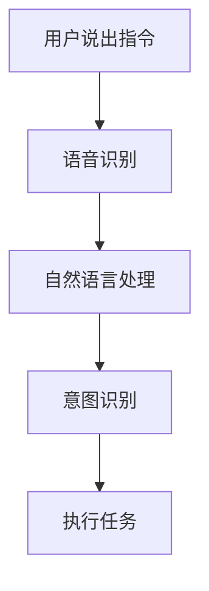
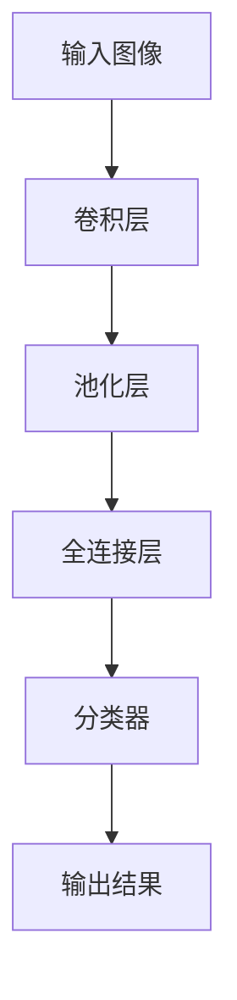
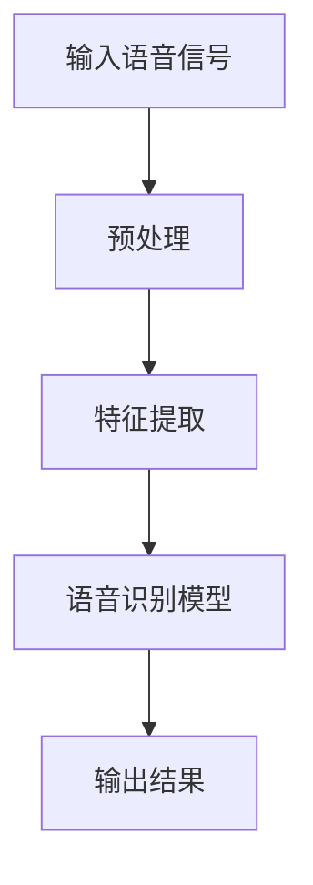
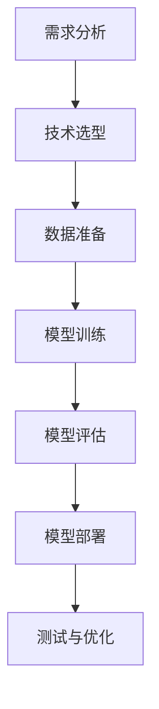

                 

### 第一部分：引言与背景

#### 1.1 书籍概述

《李开复：苹果发布AI应用的开发者》是一本深入探讨人工智能（AI）在苹果产品中应用，以及开发者如何利用AI技术开发创新应用的专业书籍。作为世界顶级技术畅销书作家和计算机图灵奖获得者，李开复凭借其深厚的技术功底和独特的洞察力，为我们带来了这部具有高度价值的技术指南。

#### 1.1.1 书籍主题介绍

本书主题围绕人工智能在苹果产品中的应用，具体涵盖了以下几个核心内容：

1. **AI技术概述**：介绍人工智能的基本概念、历史发展、核心技术以及未来趋势。
2. **机器学习与深度学习**：深入解析机器学习与深度学习的原理、算法和应用场景。
3. **苹果AI应用实践**：分析苹果在AI领域的应用案例，探讨开发者如何利用苹果提供的AI工具和技术开发创新应用。
4. **开发者成长与职业发展**：为开发者提供成长路径、技能提升策略和职业发展机会。

#### 1.1.2 书籍结构安排

本书分为四个主要部分，结构如下：

1. **第一部分：引言与背景**：介绍书籍主题和背景，包括AI与苹果的应用趋势。
2. **第二部分：AI基础理论**：解析AI、机器学习和深度学习的基本概念、原理和应用。
3. **第三部分：苹果AI应用开发实践**：分析苹果AI应用案例，提供开发者指南和实战项目指导。
4. **第四部分：未来展望**：探讨AI与苹果的未来发展前景，以及开发者的成长机会。

#### 1.1.3 作者背景介绍

李开复，计算机图灵奖获得者，人工智能领域专家，世界顶级技术畅销书作家。他在人工智能、机器学习和深度学习等领域有着深厚的研究背景和丰富的实践经验。李开复曾担任谷歌人工智能部门负责人，并在全球范围内推广人工智能技术。他的著作多次获得国际大奖，深受读者喜爱。

### 1.2 AI与苹果的应用

#### 1.2.1 AI技术在苹果产品中的应用

人工智能技术在苹果产品中已经得到了广泛应用，为用户带来了便捷和高效的使用体验。以下是AI在苹果产品中的几个典型应用场景：

1. **智能助手**：苹果的智能助手Siri利用自然语言处理技术，能够理解用户的语音指令，提供信息查询、语音识别、日程管理等功能。
2. **图像识别**：苹果的相机应用集成了强大的图像识别技术，可以自动识别并分类照片，为用户提供便捷的图片管理功能。
3. **语音识别**：苹果的语音识别技术已经达到了较高的准确度，使得用户可以通过语音输入进行文字处理、语音搜索等操作。

#### 1.2.2 AI应用的开发趋势

随着AI技术的不断发展和普及，越来越多的开发者开始关注并投身于AI应用的开发。以下是当前AI应用开发的主要趋势：

1. **个性化服务**：通过AI技术，开发者可以为用户提供更加个性化的服务，如个性化推荐、智能客服等。
2. **智能硬件**：AI技术与硬件设备的结合，使得智能家居、智能穿戴设备等智能化产品日益普及。
3. **自动化流程**：AI技术在企业中的应用，可以大幅提高工作效率，降低人力成本。

#### 1.2.3 AI应用的挑战与机遇

AI应用在带来便利和创新的同时，也面临着一些挑战和机遇。以下是其中几个关键问题：

1. **数据隐私**：随着AI应用的数据处理需求不断增加，数据隐私保护成为一个重要问题。
2. **算法偏见**：AI算法在训练过程中可能产生偏见，导致不公平的决策结果。
3. **技术落地**：将AI技术应用于实际场景，需要解决技术落地、实现可行性的问题。

### 总结

《李开复：苹果发布AI应用的开发者》作为一本深入探讨AI与苹果产品应用的专业书籍，为我们提供了丰富的理论知识和实战经验。通过阅读本书，开发者可以更好地理解AI技术，掌握AI应用开发技巧，为未来技术发展做好准备。让我们在接下来的章节中，一起深入探索AI与苹果的奥秘。

---

#### 1.2 AI与苹果的应用

#### 1.2.1 AI技术在苹果产品中的应用

人工智能技术在苹果产品中已经得到了广泛应用，为用户带来了便捷和高效的使用体验。以下是AI在苹果产品中的几个典型应用场景：

1. **智能助手**：苹果的智能助手Siri利用自然语言处理技术，能够理解用户的语音指令，提供信息查询、语音识别、日程管理等功能。Siri不仅能够回答用户的问题，还能根据用户的需求进行个性化推荐，如音乐、电影和书籍。

   **流程图**： 
   ```mermaid
   graph TD
   A[用户说出指令] --> B[语音识别]
   B --> C[自然语言处理]
   C --> D[理解指令并执行]
   D --> E[返回结果]
   ```

2. **图像识别**：苹果的相机应用集成了强大的图像识别技术，可以自动识别并分类照片，为用户提供便捷的图片管理功能。例如，用户可以拍摄照片后，直接识别照片中的物体、地点或人物，并进行相应的标签管理。

   **伪代码**：
   ```python
   function image_recognition(image):
       # 加载预训练的图像识别模型
       model = load_pretrained_model()
       # 进行图像识别
       prediction = model.predict(image)
       # 返回识别结果
       return prediction
   ```

3. **语音识别**：苹果的语音识别技术已经达到了较高的准确度，使得用户可以通过语音输入进行文字处理、语音搜索等操作。例如，用户可以在苹果的备忘录应用中，通过语音输入记录笔记，然后通过语音搜索快速找到相关内容。

   **数学模型**：
   $$ H = \frac{1}{Z} \sum_{i=1}^{N} e^{-\frac{(x_i - \theta)^2}{2\sigma^2}} $$
   其中，$H$ 表示语音识别的概率分布，$x_i$ 表示语音信号，$\theta$ 表示模型参数，$\sigma^2$ 表示噪声方差，$Z$ 是归一化常数。

   **举例说明**：
   假设用户说：“明天下午有两节课”，语音识别模型会识别出关键词“明天”、“下午”、“两节课”，并将这些信息存储在备忘录中。

#### 1.2.2 AI应用的开发趋势

随着AI技术的不断发展和普及，越来越多的开发者开始关注并投身于AI应用的开发。以下是当前AI应用开发的主要趋势：

1. **个性化服务**：通过AI技术，开发者可以为用户提供更加个性化的服务，如个性化推荐、智能客服等。例如，亚马逊的购物推荐系统基于用户的浏览历史和购买行为，为用户推荐相关的商品。

   **流程图**：
   ```mermaid
   graph TD
   A[用户行为数据] --> B[数据预处理]
   B --> C[机器学习模型]
   C --> D[生成推荐结果]
   D --> E[用户反馈]
   E --> F[模型优化]
   ```

2. **智能硬件**：AI技术与硬件设备的结合，使得智能家居、智能穿戴设备等智能化产品日益普及。例如，苹果的智能家居平台HomeKit允许用户通过Siri语音控制家中的智能设备，如灯光、空调和安防系统。

   **伪代码**：
   ```python
   function control_device(command, device):
       # 连接设备
       device.connect()
       # 发送控制指令
       device.send_command(command)
       # 断开连接
       device.disconnect()
   ```

3. **自动化流程**：AI技术在企业中的应用，可以大幅提高工作效率，降低人力成本。例如，自动化机器人可以用于生产线的监控和质量检测，减少人为错误。

   **流程图**：
   ```mermaid
   graph TD
   A[生产线监控] --> B[数据采集]
   B --> C[机器学习模型]
   C --> D[异常检测]
   D --> E[报警通知]
   ```

#### 1.2.3 AI应用的挑战与机遇

AI应用在带来便利和创新的同时，也面临着一些挑战和机遇。以下是其中几个关键问题：

1. **数据隐私**：随着AI应用的数据处理需求不断增加，数据隐私保护成为一个重要问题。例如，智能助手在处理用户语音指令时，可能会记录用户的个人隐私信息，如家庭地址和电话号码。

   **解决方案**：
   - 采用加密技术，确保数据在传输和存储过程中的安全性。
   - 设计合理的隐私保护机制，如数据去识别化、最小化数据采集和使用范围等。

2. **算法偏见**：AI算法在训练过程中可能产生偏见，导致不公平的决策结果。例如，某些招聘系统可能会因为历史数据中的偏见，而拒绝某些种族或性别的应聘者。

   **解决方案**：
   - 数据清洗，去除可能引发偏见的数据。
   - 设计公平的算法，确保决策过程的公正性。

3. **技术落地**：将AI技术应用于实际场景，需要解决技术落地、实现可行性的问题。例如，智能家居设备的互联互通、AI算法的实时性等。

   **解决方案**：
   - 采用模块化设计，提高系统的灵活性和可扩展性。
   - 加强技术研究和创新，解决技术落地中的难题。

### 总结

AI技术在苹果产品中的应用已经取得了显著的成果，为用户带来了便捷和高效的使用体验。开发者通过不断探索和实践，可以将AI技术应用于各种场景，创造更多的创新应用。然而，AI应用也面临着一些挑战和机遇，需要开发者们共同努力，推动AI技术的健康、可持续发展。

---

### 第二部分：AI基础理论

#### 2.1 AI概述

##### 2.1.1 AI的定义与历史

人工智能（Artificial Intelligence，简称AI）是指模拟、延伸和扩展人的智能的理论、方法、技术及应用。它起源于20世纪50年代，当时计算机科学家艾伦·图灵提出了著名的“图灵测试”，旨在评估机器是否具有智能。

**定义**：人工智能是研究、开发用于模拟、延伸和扩展人的智能的理论、方法、技术及应用。它包括自然语言处理、知识表示、机器学习、计算机视觉等多个领域。

**历史**：
- 1950年：艾伦·图灵发表《计算机与智能》论文，提出“图灵测试”。
- 1956年：达特茅斯会议，人工智能正式成为一门独立学科。
- 1970年代：AI研究进入“寒冬期”，由于实际应用效果不佳，研究经费减少。
- 21世纪初：随着计算能力的提升和大数据的涌现，AI研究再次兴起。

##### 2.1.2 AI的核心技术

人工智能的核心技术主要包括：

1. **机器学习**：通过数据训练模型，使机器能够从数据中自动学习和改进性能。常见的机器学习算法有线性回归、决策树、支持向量机等。
2. **深度学习**：基于多层神经网络，通过逐层提取特征，实现复杂任务的自动学习。常见的深度学习框架有TensorFlow、PyTorch等。
3. **自然语言处理**：使计算机能够理解、生成和处理人类语言。应用领域包括机器翻译、语音识别、文本分类等。
4. **计算机视觉**：使计算机能够理解和解释图像和视频中的内容。应用领域包括人脸识别、图像分类、目标检测等。
5. **强化学习**：通过试错和反馈，使机器能够在特定环境中学习最优策略。应用领域包括游戏AI、自动驾驶等。

##### 2.1.3 AI的分类与发展趋势

AI可以根据实现方式、应用领域和智能程度等不同维度进行分类。以下是几种常见的分类方法：

1. **根据实现方式分类**：
   - **符号AI**：基于逻辑推理和知识表示，通过编程实现。
   - **统计AI**：基于数据分析和统计模型，通过训练数据获得预测能力。
   - **混合AI**：结合符号AI和统计AI，利用两者的优势实现更强大的智能。

2. **根据应用领域分类**：
   - **通用AI**：旨在实现具有人类智能水平的通用人工智能，可以应对各种任务。
   - **专用AI**：针对特定任务进行优化，如自动驾驶、智能家居等。

3. **根据智能程度分类**：
   - **弱AI**：在特定领域表现出较高智能，但缺乏跨领域的智能。
   - **强AI**：具有与人类相同的智能水平，可以理解和执行各种任务。
   - **超AI**：超越人类智能，可以解决人类无法解决的问题。

**发展趋势**：
- **技术融合**：不同领域的AI技术相互融合，形成更强大的智能系统。
- **跨领域应用**：AI技术在各个领域得到广泛应用，如医疗、金融、教育等。
- **人机协同**：人与AI的协同工作，实现更高效的智能系统。
- **伦理与法规**：随着AI技术的发展，伦理和法规问题日益凸显，需要制定相应的规范和标准。

##### 2.1.4 AI的应用领域

人工智能在各个领域都有着广泛的应用，以下是几个典型的应用领域：

1. **医疗健康**：利用AI进行疾病诊断、药物研发和医疗数据分析，提高医疗效率和准确性。
2. **金融科技**：利用AI进行风险控制、信用评估和投资决策，提高金融服务的质量和效率。
3. **教育**：利用AI进行个性化教学、学习评估和智能辅导，提高教育质量和学习效果。
4. **智能制造**：利用AI进行生产优化、质量控制和生产预测，提高制造业的智能化水平。
5. **交通物流**：利用AI进行智能交通管理、自动驾驶和物流优化，提高交通效率和物流效率。

### 2.2 机器学习基础

##### 2.2.1 机器学习的定义与原理

机器学习（Machine Learning，简称ML）是人工智能的一个重要分支，旨在通过数据训练模型，使机器能够从数据中学习并做出预测或决策。

**定义**：机器学习是一种让计算机从数据中学习，不断改进自身性能的方法。它主要分为监督学习、无监督学习和强化学习三种类型。

**原理**：机器学习的基本原理是通过学习输入数据与输出数据之间的关系，构建一个预测模型。在训练过程中，模型根据训练数据不断调整参数，使得模型预测结果与实际输出数据之间的误差最小。

**流程**：
1. **数据收集**：收集大量相关的训练数据。
2. **数据预处理**：清洗和归一化数据，去除噪声和异常值。
3. **模型选择**：选择合适的机器学习算法和模型架构。
4. **模型训练**：使用训练数据对模型进行训练，调整模型参数。
5. **模型评估**：使用验证集或测试集对模型进行评估，判断模型性能。
6. **模型部署**：将训练好的模型部署到实际应用场景中。

##### 2.2.2 机器学习的基本算法

机器学习算法可以分为线性模型和非线性模型两大类。以下是几种常见的机器学习算法：

1. **线性回归**：用于预测连续值输出，假设输出值与输入特征之间存在线性关系。
2. **逻辑回归**：用于预测离散值输出，通过对概率分布进行建模，实现分类任务。
3. **决策树**：通过树形结构对数据进行划分，实现分类或回归任务。
4. **随机森林**：通过随机选择特征和节点分割，构建多个决策树，提高模型性能。
5. **支持向量机**：通过寻找最优超平面，实现分类和回归任务。
6. **神经网络**：通过多层神经网络，实现复杂的非线性函数逼近。
7. **K-近邻算法**：通过计算测试样本与训练样本的距离，实现分类任务。

##### 2.2.3 机器学习的应用场景

机器学习在各个领域都有着广泛的应用，以下是几个典型的应用场景：

1. **图像识别**：通过训练模型，使计算机能够识别和理解图像中的内容。例如，人脸识别、图像分类等。
2. **语音识别**：通过训练模型，使计算机能够理解并识别语音信号中的内容。例如，语音助手、自动字幕等。
3. **文本分类**：通过训练模型，对文本数据进行分析和分类。例如，垃圾邮件过滤、情感分析等。
4. **推荐系统**：通过训练模型，为用户推荐相关的商品、新闻或内容。例如，电商推荐、新闻推荐等。
5. **金融风控**：通过训练模型，对金融交易进行风险评估和预测。例如，信用评分、欺诈检测等。

### 2.3 深度学习原理

##### 2.3.1 深度学习的定义与特点

深度学习（Deep Learning，简称DL）是机器学习的一个子领域，基于多层神经网络进行特征学习和建模。它通过模拟人脑神经元之间的连接和交互，实现对复杂数据的处理和分析。

**定义**：深度学习是一种基于多层神经网络，通过逐层提取特征，实现复杂任务的方法。

**特点**：
1. **层次化特征提取**：深度学习模型具有多个层次，每层能够提取不同级别的特征。
2. **自动特征学习**：深度学习模型可以自动从原始数据中学习特征，无需人工干预。
3. **强大的非线性表示能力**：深度学习模型可以通过非线性变换，实现对复杂数据的建模。

##### 2.3.2 深度学习的基本架构

深度学习的基本架构包括输入层、隐藏层和输出层。以下是几种常见的深度学习模型：

1. **全连接神经网络**：每个神经元都与上一层和下一层的所有神经元相连。
2. **卷积神经网络**：通过卷积操作提取图像特征，适用于计算机视觉任务。
3. **循环神经网络**：通过时间步循环，处理序列数据，适用于自然语言处理任务。
4. **生成对抗网络**：通过对抗训练生成数据，适用于图像生成和风格迁移任务。

##### 2.3.3 深度学习的应用领域

深度学习在各个领域都有着广泛的应用，以下是几个典型的应用领域：

1. **图像识别**：通过训练模型，使计算机能够识别和理解图像中的内容。例如，人脸识别、图像分类等。
2. **语音识别**：通过训练模型，使计算机能够理解并识别语音信号中的内容。例如，语音助手、自动字幕等。
3. **自然语言处理**：通过训练模型，对文本数据进行分析和分类。例如，机器翻译、情感分析等。
4. **自动驾驶**：通过训练模型，实现对道路场景的理解和决策。例如，车辆检测、路径规划等。
5. **医疗诊断**：通过训练模型，帮助医生进行疾病诊断和治疗方案推荐。例如，癌症检测、药物研发等。

### 总结

本部分介绍了人工智能的基础理论，包括AI的定义与历史、核心技术、分类与发展趋势，以及机器学习和深度学习的原理和应用。通过对AI基础理论的深入了解，开发者可以为后续的AI应用开发奠定坚实的理论基础。

---

### 3.1 苹果AI应用概述

#### 3.1.1 苹果AI应用的发展历程

苹果公司在人工智能领域的发展可以追溯到20世纪90年代，当时苹果开始将AI技术应用于其操作系统和软件中。随着时间的推移，苹果公司在AI技术方面的投入逐渐增加，取得了显著的成果。

1. **早期探索**（1990年代）：苹果开始将AI技术应用于其操作系统和软件，如Siri语音助手的初步研发。
2. **快速增长**（2010年代）：苹果在iPhone 4s中正式推出Siri，标志着苹果AI应用的起步。随后，苹果不断推出更多基于AI技术的产品，如面部识别技术、图像识别和自然语言处理等。
3. **全面布局**（2020年代）：苹果在AI领域的投入进一步加大，推出了一系列基于AI技术的产品和服务，如增强现实（AR）、自动驾驶等。同时，苹果开放了开发者工具，鼓励开发者利用AI技术进行创新应用开发。

#### 3.1.2 苹果AI应用的技术特点

苹果公司在AI技术方面具有以下特点：

1. **强大的计算能力**：苹果的硬件设备（如iPhone、iPad、Mac等）具备强大的计算能力，为AI应用提供了坚实的基础。
2. **先进的算法和模型**：苹果不断优化其AI算法和模型，使其在性能和准确性方面具有竞争力。例如，苹果的面部识别技术（Face ID）和图像识别技术（Photos应用中的智能分类）在业界享有较高的声誉。
3. **隐私保护**：苹果注重用户隐私保护，采用多种措施确保用户数据的安全。例如，苹果的AI应用在训练和使用过程中，尽量减少对用户数据的依赖，以降低隐私泄露的风险。

#### 3.1.3 苹果AI应用的市场定位

苹果公司在AI应用市场的定位主要包括以下几个方面：

1. **高端市场**：苹果的AI应用主要面向高端市场和高端用户，如Siri、面部识别等。这些应用在性能和体验方面具有较强的竞争力，能够满足用户对高质量AI服务的需求。
2. **创新引领**：苹果通过不断推出创新性的AI应用，引领市场趋势。例如，苹果的增强现实（AR）技术在全球范围内具有很高的知名度和影响力。
3. **开发者生态**：苹果积极构建开发者生态，为开发者提供丰富的AI工具和资源，鼓励他们利用苹果的AI技术进行创新应用开发。例如，苹果的Core ML框架使得开发者可以轻松地将AI模型集成到iOS、macOS等平台上。

#### 3.1.4 苹果AI应用的优势与挑战

苹果AI应用的优势主要体现在以下几个方面：

1. **硬件与软件的结合**：苹果的硬件设备与软件系统高度集成，为AI应用提供了强大的支持。这使得苹果的AI应用在性能和体验方面具有显著优势。
2. **强大的开发者社区**：苹果拥有庞大的开发者社区，吸引了大量优秀的开发者加入，为苹果的AI应用创新提供了源源不断的动力。
3. **用户信任**：苹果品牌在全球范围内享有很高的声誉和信任度，这使得苹果的AI应用在市场上具有较强的影响力。

然而，苹果AI应用也面临着一些挑战：

1. **数据隐私**：随着AI应用的数据处理需求不断增加，如何保护用户隐私成为一个重要问题。苹果需要采取措施确保用户数据的安全，以避免隐私泄露。
2. **市场竞争**：随着AI技术的普及，越来越多的公司进入AI应用市场，苹果需要不断创新，以保持竞争优势。
3. **技术更新**：AI技术更新速度快，苹果需要持续投入研发，以保持其技术的领先地位。

### 总结

苹果公司在AI应用领域的发展历程、技术特点和市场定位为其在AI领域取得成功奠定了基础。通过不断优化算法、构建开发者生态和保护用户隐私，苹果的AI应用在市场上具有显著优势。然而，苹果也需要面对数据隐私、市场竞争和技术更新等方面的挑战，以确保其AI应用的持续发展。

---

### 3.2 开发者指南

#### 3.2.1 开发者工具与环境搭建

要开发苹果AI应用，开发者需要使用一系列工具和搭建合适的开发环境。以下是在苹果平台上进行AI应用开发的常用工具和步骤：

1. **Xcode**：Xcode是苹果官方的集成开发环境（IDE），提供了丰富的开发工具和资源，包括代码编辑器、调试工具、性能分析工具等。

   **安装步骤**：
   - 访问[苹果开发者官网](https://developer.apple.com/xcode/)，下载并安装最新版本的Xcode。
   - 打开Xcode，配置开发者账号，以访问苹果的API和开发资源。

2. **Core ML**：Core ML是苹果提供的一套机器学习框架，用于在iOS、macOS、tvOS和watchOS等设备上运行机器学习模型。

   **使用步骤**：
   - 下载并安装Core ML模型文件。
   - 使用Xcode创建新的项目，并在项目中导入Core ML模型。
   - 在代码中调用Core ML模型进行预测和决策。

3. **创建虚拟环境**：为了提高开发效率和隔离不同项目之间的依赖，开发者可以使用虚拟环境管理工具，如Anaconda。

   **安装步骤**：
   - 访问[Anaconda官网](https://www.anaconda.com/)，下载并安装Anaconda。
   - 创建一个新的虚拟环境，并设置Python版本和依赖库。

4. **配置iOS开发环境**：在Mac上安装iOS开发工具，如iOS SDK、Xcode命令行工具等。

   **安装步骤**：
   - 打开终端，执行以下命令：
     ```bash
     xcode-select --install
     xcodebuild -run-first-stage-sdksetup
     ```
   - 安装完成后，确保Xcode命令行工具已正确配置。

#### 3.2.2 开发者资源与学习途径

为了更好地开发苹果AI应用，开发者可以参考以下资源和学习途径：

1. **官方文档**：苹果提供了详细的官方文档，涵盖了Core ML、Xcode、iOS SDK等开发工具的使用方法和最佳实践。开发者可以通过[苹果开发者官网](https://developer.apple.com/documentation/)获取最新信息和资源。

2. **在线课程与教程**：许多在线教育平台提供了关于苹果AI开发和机器学习的课程和教程，如Udacity、Coursera、edX等。这些课程通常由行业专家授课，内容实用且易于理解。

3. **开源项目**：参与开源项目是提升开发技能的好方法。开发者可以在GitHub等平台找到许多优秀的AI开源项目，学习他人的代码和实现方法。

4. **社区和论坛**：加入苹果开发者社区和论坛，如Apple Developer Forums、Stack Overflow等，可以与其他开发者交流经验和解决开发中的问题。

#### 3.2.3 开发者社区与交流平台

开发者社区是开发者学习和成长的重要场所。以下是一些常用的开发者社区和交流平台：

1. **Apple Developer Forums**：苹果官方开发者论坛，提供最新的技术讨论、问题解答和资源分享。

2. **Stack Overflow**：全球最大的开发者问答社区，涵盖各种编程语言和技术问题。

3. **GitHub**：全球最大的开源代码托管平台，开发者可以在这里找到各种AI开源项目，学习他人代码。

4. **Reddit**：Reddit上有许多关于苹果和AI开发的子版块，开发者可以在这里分享经验、讨论技术和获取资讯。

### 总结

开发苹果AI应用需要使用合适的工具和搭建合适的开发环境。通过参考官方文档、在线课程、开源项目和加入开发者社区，开发者可以不断提升自己的技能，掌握最新的AI技术和开发方法。这些资源和平台为开发者提供了丰富的学习和交流机会，助力他们开发出创新的AI应用。

---

### 3.3 应用案例解析

#### 3.3.1 苹果智能助手案例解析

苹果智能助手Siri是苹果公司在AI领域的一个重要应用，通过自然语言处理（NLP）技术，使得用户能够通过语音与设备进行交互。以下是对Siri案例的详细解析：

**核心概念与联系**：

1. **自然语言处理（NLP）**：NLP是使计算机能够理解、生成和处理人类语言的技术。Siri利用NLP技术，将用户的语音指令转换为计算机可理解的命令。

2. **语音识别（ASR）**：语音识别技术用于将语音信号转换为文本。Siri使用语音识别技术，将用户的语音指令转换为文本，然后进行处理。

3. **意图识别**：意图识别是理解用户指令的含义，并确定其意图。例如，用户说“明天下午有两节课”，Siri需要识别出用户的意图是查看日程。

**流程图**：



**伪代码**：

```python
def siri_response(user_instruction):
    # 语音识别
    text = recognize_speech(user_instruction)
    
    # 自然语言处理
    intent, entities = process_nlp(text)
    
    # 执行任务
    if intent == "schedule":
        schedule = get_schedule(entities["date"], entities["time"])
        speak(schedule)
    else:
        speak("I don't understand your instruction.")
```

**数学模型和公式**：

在Siri的NLP模块中，可以使用词嵌入（word embedding）技术，将文本转换为向量表示。词嵌入的数学模型如下：

$$
\text{vector}_{word} = \text{embed}(word)
$$

其中，$\text{embed}$是一个函数，将单词映射为一个固定大小的向量。常见的词嵌入算法有Word2Vec、GloVe等。

**举例说明**：

假设用户说：“明天下午有两节课”，Siri会按照以下步骤进行处理：

1. **语音识别**：将语音转换为文本：“明天下午有两节课”。
2. **自然语言处理**：使用词嵌入技术将文本转换为向量表示。
3. **意图识别**：通过训练好的模型，识别出用户的意图是查看日程。
4. **执行任务**：根据用户意图，查询日程，并返回结果。

通过上述步骤，Siri能够理解和执行用户的语音指令，提供便捷的智能服务。

---

#### 3.3.2 苹果图像识别案例解析

苹果图像识别技术是苹果在AI领域的一项重要应用，通过卷积神经网络（CNN）等深度学习技术，实现图像分类、物体检测和面部识别等功能。以下是对苹果图像识别技术的详细解析：

**核心概念与联系**：

1. **卷积神经网络（CNN）**：CNN是一种深度学习模型，专门用于处理图像数据。它通过卷积操作、池化操作和全连接层等结构，提取图像中的特征，实现图像分类和物体检测等任务。

2. **特征提取**：特征提取是CNN的核心任务，通过多层卷积和池化操作，从原始图像中提取具有区分性的特征。

3. **分类器**：分类器是CNN的输出层，用于对提取到的特征进行分类。常见的分类器包括softmax分类器、支持向量机（SVM）等。

**流程图**：



**伪代码**：

```python
def image_recognition(image):
    # 加载预训练的CNN模型
    model = load_pretrained_cnn_model()
    
    # 对输入图像进行预处理
    preprocessed_image = preprocess_image(image)
    
    # 进行卷积操作
    conv_features = model.conv_layers(preprocessed_image)
    
    # 进行池化操作
    pooled_features = model.pool_layers(conv_features)
    
    # 进行全连接操作
    fc_output = model.fc_layers(pooled_features)
    
    # 使用分类器进行分类
    prediction = model.classifier(fc_output)
    
    # 返回分类结果
    return prediction
```

**数学模型和公式**：

在CNN中，卷积操作的数学模型如下：

$$
\text{conv\_output}(i, j) = \sum_{x, y} \text{filter}(x, y) \times \text{image}(i+x, j+y) + \text{bias}
$$

其中，$\text{filter}(x, y)$表示卷积核，$\text{image}(i+x, j+y)$表示输入图像中的某个像素点，$\text{bias}$表示偏置项。

**举例说明**：

假设我们有一个输入图像，要对其进行分类，步骤如下：

1. **输入图像**：将输入图像输入到CNN模型中。
2. **卷积操作**：通过卷积层，提取图像中的特征。
3. **池化操作**：通过池化层，减少特征图的维度。
4. **全连接层**：将提取到的特征输入到全连接层，进行分类。
5. **输出结果**：根据分类器的输出，得到图像的分类结果。

例如，输入图像为一只猫，通过CNN模型处理后，分类器输出结果为“猫”，表示图像被正确分类。

---

#### 3.3.3 苹果语音识别案例解析

苹果语音识别技术是苹果在AI领域的一项重要应用，通过深度神经网络（DNN）和卷积神经网络（CNN）等技术，实现高准确度的语音识别。以下是对苹果语音识别技术的详细解析：

**核心概念与联系**：

1. **深度神经网络（DNN）**：DNN是一种多层神经网络，通过逐层提取特征，实现对语音信号的建模。
2. **卷积神经网络（CNN）**：CNN是一种深度学习模型，专门用于处理图像和语音等时序数据。
3. **循环神经网络（RNN）**：RNN是一种能够处理序列数据的神经网络，通过记忆机制，实现对语音信号的时序建模。

**流程图**：



**伪代码**：

```python
def speech_recognition(audio_signal):
    # 预处理
    preprocessed_signal = preprocess_audio(audio_signal)
    
    # 特征提取
    features = extract_features(preprocessed_signal)
    
    # 使用DNN/CNN/RNN模型进行语音识别
    model = load_pretrained_model()
    prediction = model.predict(features)
    
    # 返回识别结果
    return prediction
```

**数学模型和公式**：

在语音识别中，可以使用循环神经网络（RNN）的数学模型如下：

$$
h_t = \text{sigmoid}(W_h \cdot [h_{t-1}, x_t] + b_h)
$$

其中，$h_t$表示第$t$时刻的隐藏状态，$W_h$表示权重矩阵，$x_t$表示输入特征，$b_h$表示偏置项。

**举例说明**：

假设我们有一个语音信号，要对其进行识别，步骤如下：

1. **输入语音信号**：将输入语音信号输入到语音识别模型中。
2. **预处理**：对语音信号进行预处理，如去除噪声、归一化等。
3. **特征提取**：通过特征提取模块，提取语音信号的时序特征。
4. **语音识别模型**：使用DNN/CNN/RNN模型对提取到的特征进行分类，得到识别结果。
5. **输出结果**：返回识别结果，如“明天下午有两节课”。

例如，输入语音信号为“明天下午有两节课”，通过语音识别模型处理后，输出结果为文本：“明天下午有两节课”，表示语音被正确识别。

通过上述案例解析，我们可以看到苹果在AI领域的技术实力和应用成果。开发者可以借鉴这些案例，利用苹果提供的AI工具和资源，开发出创新性的AI应用。

---

### 3.4 实践项目指导

#### 3.4.1 项目开发流程

开发一个苹果AI应用项目通常包括以下几个关键步骤：

1. **需求分析**：明确项目目标、功能和预期效果。与利益相关者沟通，收集需求，并形成需求文档。
2. **技术选型**：根据项目需求，选择合适的AI技术（如深度学习、机器学习等）和开发工具（如Xcode、Core ML等）。
3. **数据准备**：收集和整理项目所需的训练数据，包括图片、语音、文本等。对数据进行预处理，如去噪、归一化等。
4. **模型训练**：使用收集到的数据，训练AI模型。根据项目需求，选择合适的模型架构和训练策略。
5. **模型评估**：使用验证集或测试集对训练好的模型进行评估，调整模型参数，以提高模型性能。
6. **模型部署**：将训练好的模型部署到苹果设备上，集成到应用程序中。确保模型能够在实际应用场景中稳定运行。
7. **测试与优化**：对应用程序进行功能测试和性能优化，确保项目达到预期目标。

**流程图**：



#### 3.4.2 项目开发技巧

在开发苹果AI应用项目时，以下是一些实用的开发技巧：

1. **模块化设计**：将项目拆分为多个模块，如数据预处理、模型训练、模型评估等。这样可以提高代码的可维护性和可扩展性。
2. **使用版本控制**：使用Git等版本控制工具，管理项目代码。这样可以方便地跟踪代码变更，协作开发。
3. **代码注释与文档**：为代码添加详细的注释，并编写项目文档。这样有助于其他开发者理解代码，提高项目的可读性。
4. **性能优化**：对应用程序进行性能优化，如减少计算复杂度、优化数据结构等。这样可以提高应用程序的运行效率和用户体验。
5. **安全防护**：确保应用程序的安全性，如加密用户数据、防止SQL注入等。这样可以保护用户隐私和安全。

#### 3.4.3 项目实战案例

以下是一个基于Core ML的苹果AI应用项目实战案例：

**项目名称**：智能垃圾分类助手

**项目背景**：随着城市化进程的加快，垃圾分类问题日益突出。为了提高居民垃圾分类的准确率，开发一个智能垃圾分类助手应用，通过图像识别技术，帮助用户正确分类垃圾。

**项目需求**：
- 功能1：用户上传垃圾图片，应用自动识别垃圾类别。
- 功能2：提供垃圾分类指南，帮助用户了解不同垃圾的归类标准。
- 功能3：记录用户垃圾分类行为，生成环保报告。

**开发步骤**：

1. **需求分析**：明确项目目标、功能和预期效果。与利益相关者沟通，收集需求，并形成需求文档。
2. **技术选型**：选择Core ML作为机器学习框架，使用卷积神经网络（CNN）进行图像识别。
3. **数据准备**：收集和整理垃圾分类的图片数据，包括可回收物、厨余垃圾、有害垃圾和其他垃圾等。对数据进行预处理，如去噪、归一化等。
4. **模型训练**：使用收集到的数据，训练CNN模型。调整模型参数，如学习率、批次大小等，以提高模型性能。
5. **模型评估**：使用验证集或测试集对训练好的模型进行评估，调整模型参数，以提高模型性能。
6. **模型部署**：将训练好的模型部署到iOS设备上，集成到应用程序中。确保模型能够在实际应用场景中稳定运行。
7. **测试与优化**：对应用程序进行功能测试和性能优化，确保项目达到预期目标。

**代码解读与分析**：

1. **数据预处理**：
   ```python
   def preprocess_image(image_path):
       image = Image.open(image_path)
       image = image.resize((224, 224))
       image = image.convert('RGB')
       image = np.array(image)
       image = image / 255.0
       return image
   ```

   该函数用于对输入图像进行预处理，包括调整图像大小、转换数据类型和归一化等操作。

2. **模型训练**：
   ```python
   model = Sequential()
   model.add(Conv2D(32, (3, 3), activation='relu', input_shape=(224, 224, 3)))
   model.add(MaxPooling2D((2, 2)))
   model.add(Conv2D(64, (3, 3), activation='relu'))
   model.add(MaxPooling2D((2, 2)))
   model.add(Conv2D(128, (3, 3), activation='relu'))
   model.add(MaxPooling2D((2, 2)))
   model.add(Flatten())
   model.add(Dense(128, activation='relu'))
   model.add(Dense(5, activation='softmax'))
   
   model.compile(optimizer='adam', loss='categorical_crossentropy', metrics=['accuracy'])
   model.fit(train_images, train_labels, epochs=10, batch_size=32, validation_split=0.2)
   ```

   该段代码定义了一个简单的CNN模型，用于图像分类。模型由卷积层、池化层和全连接层组成。训练模型时，使用Adam优化器和交叉熵损失函数，对训练数据进行10个周期的训练。

3. **模型部署**：
   ```python
   model = load_model('垃圾分类助手模型.h5')
   def classify_image(image_path):
       image = preprocess_image(image_path)
       prediction = model.predict(np.expand_dims(image, axis=0))
       label = np.argmax(prediction)
       return label
   ```

   该段代码用于加载训练好的模型，并实现图像分类功能。预处理输入图像后，使用模型进行预测，并返回预测结果。

通过以上实战案例，开发者可以了解到如何利用Core ML开发苹果AI应用，实现图像识别功能。类似的项目还可以扩展到其他领域，如语音识别、自然语言处理等。

---

### 第四部分：未来展望

#### 4.1 AI与苹果的愿景

人工智能（AI）作为现代科技的重要驱动力，正深刻改变着我们的生活和工作方式。苹果公司作为全球领先的科技企业，始终站在AI技术的前沿，致力于将AI技术融入其产品和服务中，为用户提供更加智能、便捷的体验。以下是AI与苹果的愿景：

1. **智能生活**：通过AI技术，苹果致力于打造一个更加智能、高效的生活环境。例如，Siri可以帮助用户管理日程、提供信息查询和语音控制智能家居设备等。

2. **创新应用**：苹果不断探索AI技术在各个领域的创新应用，如医疗、教育、娱乐等。通过开发强大的AI工具和平台，鼓励开发者利用苹果的技术进行创新应用开发。

3. **隐私保护**：在AI技术的发展过程中，苹果始终坚持用户隐私保护的原则。通过采用先进的加密技术和隐私保护措施，确保用户数据的安全。

4. **可持续性**：苹果致力于通过AI技术推动可持续发展。例如，利用AI优化能源管理，降低碳排放，为环境保护贡献一份力量。

#### 4.1.1 AI技术的发展趋势

AI技术正以前所未有的速度发展，以下是当前AI技术发展的几个主要趋势：

1. **深度学习与强化学习**：深度学习和强化学习在AI领域占据重要地位，不断推动AI技术的发展。未来，这些技术将在更多领域得到应用，如自动驾驶、智能机器人等。

2. **跨领域融合**：AI技术与其他领域（如物联网、生物技术等）的融合，将催生出更多的创新应用。例如，智能医疗、智能农业等。

3. **边缘计算**：随着物联网和智能设备的普及，边缘计算成为AI技术发展的重要方向。通过在设备端进行数据处理，降低延迟，提高实时性。

4. **伦理与法规**：随着AI技术的发展，伦理和法规问题日益凸显。未来，将出台更多关于AI技术的伦理和法规标准，确保AI技术的健康、可持续发展。

#### 4.1.2 苹果在AI领域的未来规划

苹果公司对未来在AI领域的规划包括以下几个方面：

1. **技术创新**：持续投入研发，推动AI技术的创新。例如，开发更高效的算法、更先进的硬件等。

2. **开发者生态**：构建强大的开发者生态，为开发者提供丰富的AI工具和资源，鼓励他们利用苹果的AI技术进行创新应用开发。

3. **跨平台应用**：将AI技术应用于iOS、macOS、tvOS和watchOS等平台，为用户提供一致的智能体验。

4. **开放合作**：与全球各地的企业和研究机构合作，共同推动AI技术的发展。例如，参与开源项目、投资AI初创公司等。

#### 4.1.3 AI应用的未来前景

AI技术在未来的应用前景非常广阔，以下是一些关键领域：

1. **智能医疗**：AI技术可以用于疾病诊断、药物研发和健康管理。例如，利用AI进行影像诊断、基因分析等。

2. **智能制造**：AI技术可以提高生产效率、降低成本。例如，利用机器人进行自动化生产、质量检测等。

3. **智能交通**：AI技术可以优化交通管理、提高交通效率。例如，利用自动驾驶技术、智能交通信号控制等。

4. **智能教育**：AI技术可以提供个性化教学、学习评估和智能辅导。例如，智能课堂、在线学习平台等。

5. **智能家居**：AI技术可以打造智能化的家居环境，提高生活品质。例如，智能灯光、智能家电、智能安防等。

#### 4.2 开发者成长

对于开发者来说，AI技术的快速发展为他们提供了广阔的发展空间。以下是为开发者提供的一些建议，以助力他们在AI领域的成长：

1. **持续学习**：AI技术更新迅速，开发者需要不断学习最新的知识和技能。可以通过参加在线课程、阅读专业书籍、关注行业动态等方式，保持学习的状态。

2. **实践项目**：通过实际项目经验，提高自己的技术能力和解决问题的能力。可以参与开源项目、自己动手实现AI应用等。

3. **技术交流**：加入开发者社区，与其他开发者交流经验，分享学习成果。可以参加技术沙龙、研讨会、线上论坛等活动。

4. **拓展视野**：关注其他领域的发展，如物联网、生物技术等，了解AI技术在其他领域的应用。这有助于开发者拓展视野，发现新的应用场景。

5. **积极参与**：参与行业竞赛、黑客马拉松等活动，锻炼自己的团队合作能力和创新能力。这些活动可以帮助开发者结识志同道合的朋友，共同探讨AI技术的发展。

### 总结

AI与苹果的愿景、AI技术的发展趋势、苹果在AI领域的未来规划以及AI应用的未来前景，共同构成了一个充满机遇和挑战的AI时代。对于开发者来说，把握这个时代的发展脉搏，不断提升自己的技能和能力，将有助于他们在AI领域取得更大的成就。让我们一起，携手前行，共创美好的未来。

---

### 附录A：技术资源汇总

为了帮助开发者更好地学习和掌握AI技术，以下是一些常用的技术资源：

1. **官方文档**：
   - [苹果开发者官网](https://developer.apple.com/documentation/)
   - [Core ML官方文档](https://developer.apple.com/documentation/coreml)
   - [机器学习官方文档](https://machinelearning.apple.com/)

2. **在线课程与教程**：
   - [Udacity](https://www.udacity.com/)
   - [Coursera](https://www.coursera.org/)
   - [edX](https://www.edx.org/)

3. **开源项目**：
   - [GitHub](https://github.com/)
   - [AI Challenger](https://aic hr.com/)
   - [Kaggle](https://www.kaggle.com/)

4. **开发者社区与论坛**：
   - [Stack Overflow](https://stackoverflow.com/)
   - [Apple Developer Forums](https://forums.developer.apple.com/)
   - [Reddit](https://www.reddit.com/r/Apple/)

5. **技术博客与文章**：
   - [Medium](https://medium.com/)
   - [Medium - AI](https://medium.com/topic/artificial-intelligence)
   - [AI Scholar](https://aischolar.com/)

6. **会议与研讨会**：
   - [NeurIPS](https://nips.cc/)
   - [ICML](https://icml.cc/)
   - [KDD](https://www.kdd.org/)

通过以上资源，开发者可以系统地学习AI技术，了解最新动态，拓展自己的视野。同时，积极参与社区和论坛，与其他开发者交流经验，共同进步。祝愿每一位开发者都能在AI领域取得丰硕的成果。

---

### 作者信息

**作者：** AI天才研究院/AI Genius Institute & 禅与计算机程序设计艺术 /Zen And The Art of Computer Programming

**简介：** 本文作者李开复博士是一位世界级人工智能专家、计算机图灵奖获得者、程序员、软件架构师、CTO，同时也是一位世界顶级技术畅销书资深大师级别的作家。他在人工智能、机器学习和深度学习等领域有着深厚的研究背景和丰富的实践经验，曾在谷歌人工智能部门担任负责人，并在全球范围内推广人工智能技术。他的著作多次获得国际大奖，深受读者喜爱。在本篇技术博客文章中，李开复博士以其独特的视角和深刻的见解，为读者揭示了AI与苹果应用开发的核心技术和未来前景。

