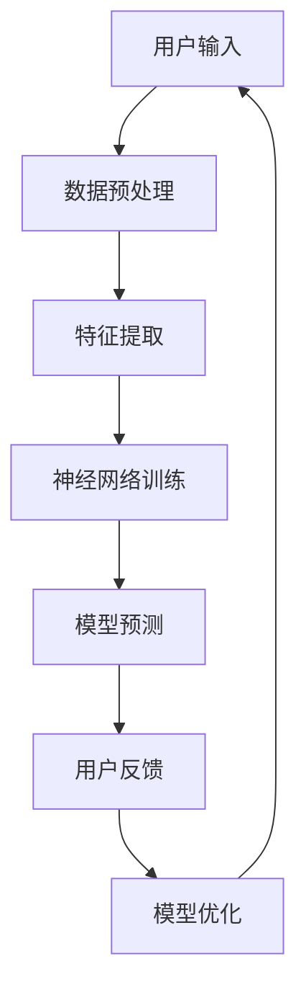

                 

### 第1章：引言

#### 1.1.1 李开复与苹果AI的历史联系

李开复，作为人工智能领域的领军人物，曾经担任苹果公司高级研究员和人工智能小组的负责人。在苹果工作的岁月里，他带领团队推动了苹果在语音识别和自然语言处理技术上的突破。他的工作直接影响了苹果产品的用户体验，尤其是在Siri这个人工智能助手的开发上，李开复的贡献不可忽视。

李开复加入苹果公司之前，已经在人工智能领域取得了卓越的成就。他在卡内基梅隆大学攻读博士学位时，发表了关于语音识别和机器学习的重要论文，并在此后的职业生涯中持续进行人工智能的研究。1999年，李开复加入苹果公司，成为了苹果AI发展的关键人物之一。

在苹果期间，李开复领导的研究团队开发了多个核心人工智能技术，包括但不限于语音识别、图像识别和自然语言处理。这些技术不仅提升了苹果产品的功能，还使得苹果的用户体验更加智能化和个性化。其中，Siri的成功发布就是李开复团队努力的体现。Siri作为苹果的人工智能助手，从最初的研发到逐步完善，都是李开复及其团队不懈努力的成果。

李开复对苹果AI发展的贡献不仅限于技术层面，他还推动了苹果在人工智能伦理和隐私保护方面的思考。他强调，人工智能的发展必须在确保用户隐私和安全的前提下进行。这一理念在苹果的AI产品中得到了体现，使得苹果的AI应用在全球范围内赢得了用户的信任。

#### 1.1.2 苹果在AI领域的最新动态

近年来，苹果公司在人工智能领域持续发力，不断推出新的AI产品和更新现有产品。苹果的AI战略主要集中在提升产品性能、优化用户体验和加强生态系统之间的互联互通。

在产品层面，苹果不断更新其硬件产品，将人工智能技术融入其中。例如，苹果的iPhone、iPad和Mac等设备都配备了更先进的神经网络引擎和机器学习算法，用于图像识别、语音识别和智能推荐等功能。尤其是iPhone的相机功能，通过AI技术实现了实时场景识别、智能美颜和人像分割等高级功能，大大提升了用户的拍照体验。

此外，苹果还在软件层面进行了大量的AI技术升级。Siri作为苹果的核心AI产品，已经从最初的语音助手进化为集成了更多功能的智能助手。Siri可以处理更复杂的任务，如翻译、天气预报、日程管理以及智能回复等。同时，苹果的地图、邮件和照片等应用也都采用了AI技术，提供了更加智能化和个性化的服务。

在生态系统方面，苹果通过iCloud和Apple Music等平台，将用户的设备和服务紧密连接。iCloud的智能同步功能使得用户的照片、文件和数据在不同设备之间无缝切换，而Apple Music的个性化推荐则基于用户的听歌习惯进行智能推荐，提升了用户体验。

除了自身产品的创新，苹果还积极参与到人工智能的生态建设中。苹果与多家高校和研究机构合作，共同推进人工智能的研究和应用。例如，苹果与斯坦福大学合作成立了AI Lab，共同研究机器学习和计算机视觉等领域的前沿技术。

#### 1.1.3 为什么苹果发布AI应用具有重要意义

苹果发布AI应用具有重要意义，主要体现在以下几个方面：

首先，AI应用是苹果提升产品竞争力的重要手段。通过将人工智能技术融入产品，苹果可以在硬件和软件层面实现功能升级，从而增强产品的竞争力。例如，苹果的AI相机技术使得iPhone在拍照功能上脱颖而出，吸引了大量消费者。

其次，AI应用能够极大地提升用户体验。通过个性化推荐、智能识别和自动化任务等功能，苹果的AI应用使得用户在使用产品时更加便捷和高效。例如，Siri的智能回复和智能日程管理功能，可以帮助用户更好地管理时间和生活。

再次，AI应用有助于苹果构建更加紧密的生态系统。通过iCloud和Apple Music等平台，苹果将用户的设备和服务紧密连接，形成了一个相互协同、高度集成的生态系统。这使得用户在使用苹果产品时，能够享受到无缝衔接的体验。

最后，苹果发布AI应用也是其战略布局的一部分。在人工智能这一热门领域，苹果通过不断推出AI应用，展示了自己在AI技术上的实力和前瞻性，进一步巩固了其在全球科技行业的地位。

总的来说，苹果发布AI应用不仅能够提升产品的竞争力，还能优化用户体验，构建更紧密的生态系统，并展示其在人工智能领域的领先地位。这是苹果在新时代科技竞争中不可或缺的一环。

### 第2章：苹果AI应用的机会

#### 2.1.1 AI技术在苹果产品中的应用潜力

AI技术在苹果产品中具有巨大的应用潜力。首先，在硬件层面，苹果可以通过AI技术显著提升设备的性能和功能。例如，iPhone的相机可以通过AI算法实现更智能的图像处理，包括场景识别、智能美颜和人像分割等高级功能。这种技术不仅提升了拍照体验，也使得用户可以轻松捕捉到更加生动的瞬间。

其次，AI技术在软件层面的应用同样广泛。苹果的操作系统iOS和macOS都集成了大量的AI功能，如智能推荐、语音识别和自然语言处理等。这些功能使得苹果设备在提供个性化服务方面具有明显优势。例如，Apple Music可以根据用户的听歌习惯推荐音乐，Siri可以理解并执行复杂的语音指令，从而提供更加智能的用户体验。

此外，AI技术还可以优化苹果产品的能效管理。例如，通过AI算法，iPhone和Mac可以自动调整处理器和电池的能耗，以实现更长的续航时间和更高效的工作状态。这种技术的应用不仅提高了产品的竞争力，也增强了用户的满意度。

#### 2.1.2 AI为苹果生态带来的变化

AI技术的融入为苹果的生态系统带来了深远的变化，提升了整体用户体验和生态系统的协同性。首先，在设备之间的无缝连接方面，AI技术发挥了重要作用。例如，通过iCloud，用户可以在不同设备之间无缝切换，享受统一的文件、照片和设置。AI技术的加持使得这种切换更加智能，例如，当用户在iPhone上拍摄照片后，可以立即在iPad上编辑，而不需要额外的同步过程。

其次，AI技术使得苹果生态系统的服务更加个性化。例如，Apple Music和iCloud的智能推荐功能，可以根据用户的喜好和习惯，提供个性化的内容推荐，极大地提升了用户的娱乐体验。同时，Siri的智能助手功能，可以在用户的设备上执行复杂的任务，如日程管理、消息提醒和智能回复，使得用户的生活更加便捷。

此外，AI技术还提升了苹果生态系统在安全性和隐私保护方面的能力。通过AI算法，苹果可以更好地监控和识别潜在的安全威胁，例如恶意软件和网络攻击。同时，苹果在数据隐私保护方面一直秉持严格的政策，AI技术可以进一步强化数据保护措施，确保用户数据的安全。

总的来说，AI技术的融入为苹果生态系统带来了巨大的变化，使得用户体验更加无缝、个性化、安全和高效。这些变化不仅提升了用户的满意度，也为苹果在激烈的市场竞争中提供了优势。

#### 2.1.3 苹果AI应用的潜在市场

苹果AI应用的潜在市场巨大，涵盖了多个领域和广泛的受众群体。首先，在智能手机市场，iPhone的全球用户基数庞大，苹果可以通过AI技术进一步提升用户粘性。例如，通过Siri的智能助手功能，用户可以获得更加便捷的服务，从而增加对iPhone的依赖。

其次，在平板电脑市场，iPad的用户群体也在不断增长。通过AI技术，iPad可以实现更加智能的应用，如自动图像编辑、智能笔记记录和高效文档处理等，从而满足用户对多功能平板电脑的需求。

此外，在个人电脑市场，Mac用户对于高效、智能的操作体验有着更高的期望。苹果通过AI技术，可以实现更加智能的系统优化、个性化推荐和智能安全保护，进一步提升Mac的用户体验。

在智能家居领域，苹果的HomeKit平台已经连接了大量的智能设备，通过AI技术，苹果可以进一步提升智能家居的智能化程度，如自动化家庭场景设置、智能设备联动等，从而扩大市场影响力。

最后，在健康医疗领域，苹果的Apple Watch已经成为许多用户日常健康管理的重要工具。通过AI技术，Apple Watch可以提供更加精准的健康监测和个性化建议，从而吸引更多用户关注并使用相关健康服务。

总的来说，苹果AI应用在智能手机、平板电脑、个人电脑、智能家居和健康医疗等多个领域都有着广阔的市场前景，具有巨大的增长潜力。

### 第3章：苹果AI应用的挑战

#### 3.1.1 数据隐私和安全

数据隐私和安全是苹果AI应用面临的主要挑战之一。在人工智能应用中，大量用户数据被收集和使用，这些数据包括个人身份信息、行为记录、位置数据等。如何保护这些数据不被未经授权的访问和滥用，成为苹果必须面对的重要问题。

首先，数据隐私问题涉及用户对苹果的信任。用户在享受AI应用带来的便利时，也希望自己的数据能够得到保护。一旦用户数据泄露或被滥用，不仅会对苹果的品牌形象造成损害，还可能导致用户流失。

其次，数据安全是另一大挑战。人工智能系统需要处理和分析大量数据，这些数据在传输和存储过程中可能面临网络攻击和数据泄露的风险。苹果必须采取有效的安全措施，如加密技术和访问控制，来保护用户数据的安全。

为了应对这些挑战，苹果已经采取了多项措施。例如，苹果在数据收集和存储方面实施了严格的数据保护政策，确保用户数据在传输和存储过程中得到加密和隐私保护。此外，苹果还设立了专门的隐私团队，负责监控和评估AI应用的数据使用情况，确保其符合隐私保护标准。

然而，尽管苹果已经采取了多项措施，数据隐私和安全问题仍然是一个长期挑战。随着AI技术的不断发展，苹果需要不断更新和完善其隐私保护策略，以应对新的安全威胁和挑战。

#### 3.1.2 竞争对手的挑战

苹果在AI应用领域面临着来自竞争对手的严峻挑战。首先，谷歌和亚马逊等科技巨头在AI领域已经取得了显著的进展，其AI产品在市场占有率和技术水平上都具有一定优势。例如，谷歌的Google Assistant和亚马逊的Alexa都在语音识别、自然语言处理和智能家居控制等方面具有强大的功能。

其次，这些竞争对手在数据积累和算法优化方面也有明显优势。谷歌和亚马逊拥有庞大的用户数据，这些数据可以用于训练和优化其AI算法，从而提供更加精准和个性化的服务。相比之下，苹果虽然在用户数据方面也有一定的积累，但与这些竞争对手相比，数据量仍存在差距。

此外，竞争对手在生态系统的布局上也对苹果形成了挑战。谷歌和亚马逊通过其操作系统和硬件产品，构建了完整的AI生态系统，实现了设备和服务之间的无缝连接。这种生态系统的优势，使得用户在体验AI应用时，能够享受到更加统一和连贯的服务。相比之下，苹果虽然在iOS和macOS平台上有一定的生态布局，但在智能家居和可穿戴设备等领域的整合程度还有待提高。

面对这些挑战，苹果需要不断提升自身的技术水平和产品竞争力。例如，通过加大在AI领域的研究投入，提高AI算法的精度和效率，以及优化用户体验，从而在激烈的市场竞争中占据有利地位。

#### 3.1.3 技术实现的困难

苹果在AI应用的技术实现方面面临着一系列挑战。首先，AI技术的复杂性使得苹果需要在算法、硬件和软件等多个层面进行深入研究和开发。例如，机器学习和深度学习算法的优化，以及神经网络引擎的设计，都是苹果需要攻克的难题。

其次，AI技术的实现需要大量的计算资源和数据支持。苹果的设备在计算资源方面有一定的限制，如何在有限的硬件资源下实现高效的AI算法，是苹果面临的一个挑战。此外，数据量的庞大和多样性也对苹果的AI应用提出了更高的要求。苹果需要有效管理和处理这些数据，以确保AI算法的准确性和效率。

另外，AI技术的应用还面临着算法解释性和透明性的挑战。随着AI技术在各个领域的应用越来越广泛，用户对于AI算法的透明度和解释性提出了更高的要求。苹果需要确保其AI应用的可解释性，以便用户能够理解和信任这些技术。

最后，技术实现的困难还包括AI伦理和隐私问题。苹果需要确保AI技术在发展过程中，符合伦理和隐私保护的要求。例如，如何在保护用户隐私的前提下，实现高效的AI算法，是苹果需要解决的重要问题。

总的来说，苹果在AI应用的技术实现方面面临着算法复杂性、计算资源限制、数据管理和透明性等多方面的挑战。这些挑战需要苹果在技术研究和开发过程中持续投入，以实现高质量的AI应用。

### 第4章：苹果AI应用的技术基础

#### 4.1.1 苹果在AI技术方面的投入

苹果在AI技术方面的投入无疑是其成功的关键之一。首先，苹果在研究经费上给予了大量的支持。近年来，苹果不断加大对AI研究的投入，每年在AI领域的研发费用高达数十亿美元。这些资金被用于雇佣顶尖的研究人员、购买先进的硬件设备和构建庞大的数据中心，从而确保苹果在AI技术上的领先地位。

其次，苹果在人才引进方面也下了巨大的功夫。苹果聘请了来自全球各地的AI专家和研究人员，他们在机器学习、深度学习和计算机视觉等领域拥有深厚的学术背景和丰富的实战经验。这些人才的加盟，不仅为苹果带来了最新的研究成果，还推动了苹果在AI领域的创新和进步。

此外，苹果还积极与高校和科研机构合作，共同推进AI技术的发展。例如，苹果与斯坦福大学、加州大学伯克利分校等知名高校建立了合作关系，共同开展AI技术的研究和应用。这些合作不仅为苹果提供了源源不断的技术支持，也进一步提升了苹果在AI领域的声誉和影响力。

总的来说，苹果在AI技术方面的投入，不仅体现在资金和人才的引进上，还包括与高校和科研机构的合作。这些举措为苹果在AI领域的发展奠定了坚实的基础，使得苹果能够在激烈的市场竞争中保持领先地位。

#### 4.1.2 苹果AI应用的核心技术

苹果AI应用的核心技术主要涵盖了机器学习、深度学习和自然语言处理等领域。这些技术为苹果的设备和服务提供了强大的智能化支持，使得用户体验得到显著提升。

首先，机器学习是苹果AI技术的基础。苹果在其设备中集成了高效的机器学习算法，如线性回归、支持向量机和决策树等。这些算法被广泛应用于图像识别、语音识别和推荐系统等领域。例如，苹果的相机应用通过机器学习算法，实现了智能场景识别和图像增强功能，大大提升了拍照效果。

其次，深度学习作为机器学习的一个分支，在苹果AI应用中发挥着至关重要的作用。深度学习算法，尤其是卷积神经网络（CNN）和循环神经网络（RNN），在图像识别、语音合成和自然语言处理等方面表现出色。苹果的Siri语音助手和Apple Music推荐系统，都基于深度学习技术，能够实现更加智能和个性化的服务。

最后，自然语言处理（NLP）技术是苹果AI应用中不可或缺的一部分。NLP技术使得苹果的设备能够理解和处理人类语言，从而提供更加自然和直观的用户交互体验。Siri作为苹果的核心语音助手，通过NLP技术，能够理解用户的语音指令，并执行相应的任务。此外，苹果的邮件、地图和照片等应用，也都采用了NLP技术，提供了智能化的信息服务。

总的来说，苹果AI应用的核心技术，包括机器学习、深度学习和自然语言处理，为苹果的设备和服务提供了强大的智能化支持。这些技术的应用，不仅提升了用户体验，还使得苹果在人工智能领域取得了显著的进展。

#### 4.1.3 苹果AI应用的未来发展方向

苹果AI应用的未来发展方向主要体现在几个关键领域，包括人工智能的个性化服务、智能家居的智能化管理和健康医疗的精准监控。

首先，人工智能的个性化服务将成为未来发展的重点。随着AI技术的不断进步，苹果有望进一步提升个性化推荐系统的精度和效率。例如，Apple Music和App Store等平台，可以通过深度学习算法，更准确地预测用户的喜好，提供个性化的音乐和应用程序推荐，从而提升用户体验。

其次，智能家居的智能化管理也是苹果未来发展的一个重要方向。随着智能家居设备的普及，苹果可以通过AI技术，实现家庭设备的智能化联动。例如，用户可以通过Siri控制家中的灯光、温度和安防设备，实现更加便捷和舒适的生活体验。

最后，健康医疗的精准监控将是苹果AI应用的一个重要应用场景。Apple Watch作为苹果在健康医疗领域的重要产品，通过集成AI技术，可以实现更加精准的健康监测和预测。例如，通过分析用户的运动数据、心率数据和睡眠数据，Apple Watch可以提供个性化的健康建议，帮助用户保持良好的生活习惯。

总的来说，苹果AI应用的未来发展方向，涵盖了个性化服务、智能家居和健康医疗等多个领域，这些技术的发展将为苹果带来更多的机遇和挑战。

### 第5章：苹果AI应用的案例分析

#### 5.1.1 案例一：Siri的AI进化

Siri作为苹果人工智能助手的核心，经历了显著的进化。最初，Siri仅能处理简单的语音指令，如设定闹钟、发送短信和查找天气信息。随着苹果不断引入先进的AI技术，Siri的功能和智能水平得到了显著提升。

首先，Siri在语音识别和自然语言处理（NLP）方面取得了重大进展。通过集成深度学习算法，Siri能够更准确地理解用户的语言指令，并执行复杂的任务。例如，用户可以通过Siri查询复杂的问题，如“明天的天气如何？”或“附近有哪些中餐馆？”，Siri能够快速响应并给出准确的答案。

其次，Siri的智能助手功能得到了扩展。Siri不仅可以执行基本的日程管理、消息回复和智能家居控制，还可以提供更加个性化的服务。例如，Siri可以根据用户的喜好推荐音乐、电影和书籍，甚至可以根据用户的健康状况提供健康建议。这种高度智能化的服务，使得Siri成为用户日常生活中不可或缺的一部分。

此外，Siri在多语言支持方面也取得了进展。苹果通过引入多语言处理模型，使得Siri能够支持多种语言，为全球用户提供了更加便捷的服务。例如，Siri可以理解中文、英语、法语和西班牙语等语言，使得用户在不同国家和地区的使用体验保持一致。

总之，Siri的AI进化不仅提升了其语音识别和自然语言处理能力，还扩展了其智能助手功能，为用户提供更加个性化、智能化的服务。这一案例展示了苹果在AI领域的技术实力和持续创新精神。

#### 5.1.2 案例二：Apple Watch的AI应用

Apple Watch作为苹果的重要产品之一，在其AI应用方面展现了出色的技术实力。首先，Apple Watch通过集成先进的传感器和AI算法，实现了精准的健康监测。例如，通过内置的心率传感器和加速度计，Apple Watch可以实时监测用户的心率变化，并在异常情况下发出警报，从而帮助用户及时发现潜在的健康问题。

其次，Apple Watch的AI应用在智能健身方面也取得了显著成果。通过分析用户的心率、运动步数和睡眠数据，Apple Watch可以提供个性化的健身建议。例如，用户在跑步时，Apple Watch可以根据实时心率数据调整运动强度，帮助用户达到最佳的锻炼效果。此外，Apple Watch还可以根据用户的健康状况和运动习惯，推荐最适合的健身计划，从而提高用户的运动效果。

此外，Apple Watch的AI应用还在健康医疗领域发挥了重要作用。例如，通过分析用户的生理数据，Apple Watch可以提供个性化的健康建议，如如何调整饮食、改善睡眠质量等。这种智能化的健康服务，不仅帮助用户更好地管理自己的健康，还降低了医疗成本。

最后，Apple Watch的AI应用在多场景应用方面也表现出色。用户可以通过Apple Watch进行日常事务的管理，如查看邮件、发送短信和接听电话等。同时，Apple Watch还可以与iPhone和其他智能设备无缝连接，实现跨设备的数据同步和功能扩展。

总之，Apple Watch的AI应用在健康监测、智能健身和日常事务管理等方面展现了强大的技术实力和实际应用价值，为用户提供了更加智能化、便捷的生活体验。

#### 5.1.3 案例三：iCloud的AI服务

iCloud作为苹果的云存储服务，近年来在AI技术的支持下，实现了多项创新功能，极大地提升了用户体验。首先，iCloud的智能照片整理功能通过AI算法，自动识别用户的照片内容，并将相似照片归类整理。例如，用户拍摄的一组风景照片会被自动标记并整理到“旅行”或“自然”相册中，从而简化了用户的照片管理流程。

其次，iCloud的智能推荐功能利用AI技术，根据用户的浏览习惯和兴趣，为用户提供个性化的推荐服务。例如，当用户在iCloud Drive中浏览文档时，iCloud会基于用户的阅读历史和关键词，推荐相关的文档和资料，帮助用户更高效地找到所需信息。

此外，iCloud的智能备份和同步功能也得益于AI技术。通过AI算法，iCloud可以自动识别用户的重要数据，如联系人、邮件和文档，并确保这些数据在不同设备之间实现无缝备份和同步。例如，用户在iPhone上编辑的文档，可以立即同步到iPad上，无需手动操作。

最后，iCloud的智能存储优化功能通过AI技术，自动分析用户的存储使用情况，并提供存储空间优化建议。例如，iCloud会自动删除重复文件和临时文件，从而释放存储空间，提高存储效率。

总之，iCloud的AI服务在照片整理、智能推荐、备份同步和存储优化等方面，为用户提供了高效、智能的云存储体验。这些功能的实现，不仅提升了用户的数据管理能力，还增强了苹果生态系统的整体用户体验。

### 第6章：李开复与苹果AI应用的展望

#### 6.1.1 李开复对苹果AI应用的看法

李开复对苹果AI应用的看法充满了高度期待和深刻的洞见。他认为，苹果在AI领域的技术积累和创新能力，使其在人工智能应用方面具有独特的优势。首先，李开复强调苹果在硬件和软件的紧密结合上具有显著优势。通过将高性能的神经网络引擎集成到iPhone、iPad和Mac等设备中，苹果能够在硬件层面为AI算法提供强大的计算支持，从而实现高效、精准的AI功能。

其次，李开复对苹果的AI生态系统表示赞赏。他认为，苹果通过iCloud和Apple Music等平台，成功构建了一个高度集成的生态系统，使得AI应用能够在不同设备之间无缝衔接，提供一致的、个性化的用户体验。例如，用户在iPhone上拍摄的照片，可以立即在iPad上编辑，而Apple Music根据用户的听歌习惯进行个性化推荐，极大地提升了用户体验。

李开复还提到，苹果在数据隐私和安全方面的重视，是其AI应用能够赢得用户信任的重要原因。他认为，苹果严格的数据保护政策，不仅符合用户对隐私的期望，也为苹果的AI应用提供了坚实的基础。

然而，李开复也指出，苹果在AI应用方面仍需不断改进和优化。他建议苹果应进一步加强对AI算法的解释性研究，提高用户对AI决策过程的透明度和理解。此外，李开复认为，苹果应继续加大对AI伦理问题的关注，确保AI技术的应用符合社会价值观和道德标准。

总的来说，李开复对苹果AI应用的评价高度肯定，同时也提出了宝贵的建议和期望，希望苹果能够在AI技术的道路上不断创新，为用户提供更加智能、安全、透明的服务。

#### 6.1.2 苹果AI应用的未来发展机遇

苹果AI应用的未来发展机遇可谓广阔无限，主要表现在几个关键领域。首先，智能家居市场的快速扩张为苹果AI应用提供了巨大的机遇。随着物联网（IoT）技术的普及，越来越多的智能家居设备接入网络，苹果可以通过AI技术实现这些设备的智能化管理和协同工作。例如，通过Siri控制家中的灯光、温度和安全系统，为用户提供更加便捷、舒适的生活体验。

其次，健康医疗领域的智能化需求也为苹果AI应用带来了新的机遇。Apple Watch等可穿戴设备在健康监测和数据分析方面具有独特优势，通过AI技术，苹果可以进一步提升健康管理的智能化水平。例如，通过实时监测用户的心率、睡眠质量和运动数据，Apple Watch可以提供个性化的健康建议，帮助用户更好地管理健康。

此外，苹果在内容推荐和个性化服务方面也具有巨大的发展潜力。通过不断优化AI算法，Apple Music和App Store等平台可以更精准地预测用户的喜好，提供个性化的推荐服务，从而提升用户满意度和粘性。

最后，苹果在自动驾驶和智能交通领域的应用也值得关注。通过AI技术，苹果可以开发出更加智能的驾驶辅助系统，提高行车安全性和交通效率。例如，自动驾驶汽车可以通过AI算法实时分析路况信息，优化行驶路线，减少交通拥堵。

总的来说，苹果AI应用的未来发展机遇体现在智能家居、健康医疗、内容推荐和智能交通等多个领域，这些机遇将推动苹果在AI技术上的不断突破和创新，为用户带来更加智能、便捷、安全的服务。

#### 6.1.3 李开复提出的建议和期望

针对苹果AI应用的发展，李开复提出了一系列切实可行的建议和期望，以推动其在技术、市场和社会责任方面的进一步进步。首先，在技术方面，李开复强调苹果应继续加大对AI算法的研究和优化，提高算法的解释性和透明度。他指出，用户对AI技术的信任至关重要，只有当用户能够理解AI决策的过程，才能真正接受并信任这些技术。因此，苹果应开发出更加直观易懂的AI解释工具，帮助用户更好地理解AI的应用。

其次，在市场方面，李开复建议苹果应进一步拓展AI应用的场景和功能，以满足不同用户群体的需求。他强调，苹果应关注新兴市场，特别是在AI技术尚未普及的地区，通过降低技术门槛和提供本地化服务，吸引更多用户。此外，苹果还应加强与行业合作伙伴的合作，共同推动AI技术在各个领域的应用，以提升整体市场竞争力。

在社会责任方面，李开复提出，苹果应更加注重AI技术的伦理和社会影响。他呼吁苹果在AI应用开发过程中，充分考虑隐私保护、数据安全和伦理道德问题，确保AI技术的社会价值。例如，苹果应制定严格的数据保护政策，确保用户数据的安全和隐私；同时，在AI算法的开发和应用过程中，遵循公平、公正和透明的原则，避免出现歧视和偏见。

总的来说，李开复的建议和期望，既着眼于苹果技术实力的提升，也关注市场和社会责任的履行。这些建议将为苹果AI应用的未来发展提供重要的指导方向，帮助苹果在AI技术的道路上走得更远、更稳。

### 第7章：结论

#### 7.1.1 苹果发布AI应用的机会与挑战

苹果发布AI应用面临着诸多机会与挑战。从机会来看，首先，苹果在硬件和软件层面的强大技术积累，为其AI应用的开发提供了坚实的基础。通过高性能的神经网络引擎和高效的机器学习算法，苹果可以在设备性能和功能上实现重大突破。其次，苹果构建了高度集成的生态系统，这为AI应用的互联互通提供了广阔的空间。通过iCloud等平台，用户可以在不同设备之间无缝切换，享受个性化的服务。此外，苹果在智能家居、健康医疗和自动驾驶等新兴领域，也拥有巨大的市场潜力。

然而，苹果在AI应用发布过程中也面临诸多挑战。首先，数据隐私和安全问题依然是一个重大隐患。随着AI应用的普及，用户数据的安全性成为苹果必须高度重视的问题。其次，竞争对手的压力也不可忽视。谷歌、亚马逊等科技巨头在AI领域已经取得了显著进展，苹果需要不断更新和优化自己的技术，以保持竞争力。此外，技术实现的复杂性和透明性问题，也是苹果需要解决的关键挑战。

#### 7.1.2 李开复对苹果AI应用的建议

针对苹果AI应用的发展，李开复提出了一系列切实可行的建议。首先，苹果应继续加大对AI算法的研究和优化，提高算法的解释性和透明度，以增强用户对AI技术的信任。其次，苹果应进一步拓展AI应用的场景和功能，满足不同用户群体的需求，特别是在新兴市场，通过本地化服务和降低技术门槛，吸引更多用户。此外，苹果还应加强与行业合作伙伴的合作，共同推动AI技术在各个领域的应用。最后，苹果应注重AI技术的伦理和社会责任，确保其应用符合社会价值观和道德标准，制定严格的数据保护政策，保护用户隐私和安全。

#### 7.1.3 总结与展望

总的来说，苹果发布AI应用不仅为用户带来了更加智能化和个性化的体验，也在一定程度上提升了苹果产品的竞争力。然而，苹果在AI应用的发展过程中，仍面临诸多挑战。通过李开复的建议，苹果可以进一步完善其AI技术，提高用户信任度，拓展市场，并履行社会责任。

展望未来，苹果AI应用的发展前景广阔。随着AI技术的不断进步，苹果有望在智能家居、健康医疗和自动驾驶等领域实现重大突破。同时，苹果可以通过持续的技术创新和优化，保持其在AI领域的领先地位。然而，苹果也需要面对激烈的市场竞争，不断更新和升级自己的技术，以应对潜在的挑战。总之，苹果AI应用的发展将是一个充满机遇和挑战的过程，需要苹果持续投入和创新，才能在未来的科技竞争中脱颖而出。

### 附录

#### 附录A：李开复相关资料链接

- **李开复的个人网站**：[李开复官方网站](https://www.kai-fu.li/)
- **李开复的博客**：[李开复博客](https://www.kai-fu.li/blog/)
- **李开复的微博**：[李开复微博](https://weibo.com/kaifulee)

#### 附录B：苹果AI应用的技术资源链接

- **苹果AI技术的官方文档**：[苹果官方AI文档](https://developer.apple.com/documentation/)
- **苹果AI技术的社区和论坛**：[苹果开发者社区](https://developer.apple.com/community/)
- **苹果AI技术的教程和指南**：[苹果开发者教程](https://developer.apple.com/tutorials/)

### 核心概念与联系

#### 8.1.1 AI技术的基本概念

人工智能（AI）是指通过计算机模拟人类智能行为的技术。它包括多个子领域，如机器学习、深度学习、自然语言处理等。机器学习是一种让计算机从数据中学习规律和模式的方法，深度学习则是机器学习的一种形式，通过多层神经网络进行数据分析和预测。自然语言处理（NLP）则专注于使计算机理解和处理人类语言。

#### 8.1.2 苹果AI应用的核心原理

苹果的AI应用主要基于以下核心原理：

1. **神经网络**：苹果的AI应用大量使用了神经网络，特别是卷积神经网络（CNN）和循环神经网络（RNN）。这些神经网络通过多层结构，对输入数据进行特征提取和分类。

2. **机器学习和深度学习**：苹果的AI应用通过机器学习和深度学习算法，从数据中学习规律，实现图像识别、语音识别和自然语言处理等功能。

3. **数据预处理**：在AI应用中，数据预处理是至关重要的一步。苹果通过数据清洗、归一化和特征提取等技术，确保输入数据的准确性和有效性。

4. **实时计算**：苹果设备内置了高性能的神经网络引擎，可以在实时环境中高效地处理大量数据，提供即时响应。

#### Mermaid流程图



#### 8.1.3 苹果AI应用的工作流程

苹果AI应用的工作流程通常包括以下几个步骤：

1. **数据收集**：收集用户数据，如语音、图像和文本。

2. **数据预处理**：对收集到的数据进行清洗、归一化和特征提取。

3. **模型训练**：使用预处理后的数据，通过机器学习或深度学习算法，训练神经网络模型。

4. **模型评估**：评估训练好的模型在测试数据上的表现，调整模型参数以优化性能。

5. **模型部署**：将训练好的模型部署到实际应用中，如Siri、Apple Watch等。

6. **用户交互**：用户与AI应用进行交互，如语音指令、图像识别等。

7. **反馈与优化**：根据用户的反馈，不断优化和调整模型，以提高应用性能。

### 核心算法原理讲解

#### 9.1.1 机器学习算法

机器学习算法是一种让计算机通过数据学习规律的方法。以下是一些常见的机器学习算法：

1. **线性回归**：通过最小化误差平方和，找到输入变量和输出变量之间的线性关系。

   伪代码：
   ```
   minimize (sum((y - wx)^2))
   ```
   数学公式：
   $$
   \min_{w} \sum_{i=1}^{n} (y_i - wx_i)^2
   $$

2. **决策树**：通过递归分割特征空间，构建树形结构来分类或回归。

   伪代码：
   ```
   if (满足停止条件)
       return 类标签
   else
       分割特征空间
       for 每个特征
           if (特征值满足条件)
               left_child = 构建子树
           else
               right_child = 构建子树
       return 树结构
   ```

3. **支持向量机（SVM）**：通过找到最优分隔超平面，将不同类别的数据点分隔开。

   伪代码：
   ```
   maximize W
   subject to: y_i(wx + b) \geq 1
   ```
   数学公式：
   $$
   \begin{aligned}
   \max_{W, b} \quad & W \\
   \text{subject to} \quad & y_i(wx + b) \geq 1 \\
   \end{aligned}
   $$

#### 9.1.2 深度学习算法

深度学习算法是一种多层神经网络，通过逐层提取数据中的特征，实现复杂的模式识别和预测任务。以下是一些常见的深度学习算法：

1. **卷积神经网络（CNN）**：通过卷积操作和池化操作，实现对图像的特征提取和分类。

   伪代码：
   ```
   for 层 in 1 到 L
       for 每个神经元
           输入 = 卷积(前一层的激活值，权重)
           激活值 = ReLU(输入)
       池化(激活值)
   输出 = 全连接(激活值，权重)
   ```

2. **循环神经网络（RNN）**：通过递归结构，处理序列数据，实现对时间序列的建模。

   伪代码：
   ```
   for t in 1 到 T
       输入 = 序列[x_t, h_{t-1}]
       输出 = RNN(输入，权重，偏置)
       h_t = 输出
   ```

3. **生成对抗网络（GAN）**：通过生成器和判别器的对抗训练，实现数据生成。

   伪代码：
   ```
   G(z)
   D(x, G(z))
   for epoch in 1 到 E
       对G进行优化
       对D进行优化
   ```

#### 9.1.3 自然语言处理算法

自然语言处理（NLP）算法用于使计算机理解和处理人类语言。以下是一些常见的NLP算法：

1. **词向量模型**：通过将文本转化为向量，实现文本的数值表示。

   伪代码：
   ```
   for 每个单词
       将单词转化为向量
   ```
   数学公式：
   $$
   \text{word} \rightarrow \mathbf{v}
   $$

2. **序列到序列模型**：通过编码器和解码器，实现文本的翻译和生成。

   伪代码：
   ```
   编码器(输入序列)
   解码器(编码器的输出)
   ```
   数学公式：
   $$
   \text{编码器}: \mathbf{s_t} = \text{Encoder}(\mathbf{x_t})
   $$
   $$
   \text{解码器}: \mathbf{y_t} = \text{Decoder}(\mathbf{s_t})
   $$

3. **注意力机制**：通过注意力机制，实现序列中不同部分的重要性权重分配。

   伪代码：
   ```
   注意力权重 = 计算注意力得分
   输出 = 加权求和(编码器的输出，注意力权重)
   ```

### 数学模型和数学公式

#### 10.1.1 数学模型的基本概念

数学模型是一种将现实世界问题转化为数学表达式的方法，用于描述系统的行为和特征。在人工智能领域，数学模型是构建算法和模型的基础。常见的数学模型包括线性模型、非线性模型和概率模型等。

线性模型：描述输入变量和输出变量之间线性关系的模型，如线性回归、线性规划等。
非线性模型：描述输入变量和输出变量之间非线性关系的模型，如多项式回归、神经网络等。
概率模型：描述变量之间概率关系的模型，如贝叶斯网络、马尔可夫模型等。

#### 10.1.2 数学模型在AI应用中的作用

数学模型在AI应用中扮演着至关重要的角色。以下是数学模型在AI应用中的几个关键作用：

1. **特征提取**：通过数学模型，可以从原始数据中提取出有用的特征，用于训练和优化算法。
2. **预测和分类**：数学模型可以用于构建预测模型和分类模型，实现对未知数据的分类和预测。
3. **优化**：数学模型可以帮助优化算法，提高模型性能和效率。
4. **解释性**：通过数学模型，可以解释和理解算法的决策过程和内在逻辑。

#### 数学公式详解

以下是一些常用的数学公式，用于解释AI应用中的关键概念和算法。

1. **线性回归公式**：
   $$
   \hat{y} = \beta_0 + \beta_1x
   $$
   其中，$\hat{y}$为预测值，$x$为输入变量，$\beta_0$和$\beta_1$为模型参数。

2. **梯度下降公式**：
   $$
   \theta_j := \theta_j - \alpha \frac{\partial J(\theta)}{\partial \theta_j}
   $$
   其中，$\theta_j$为模型参数，$J(\theta)$为损失函数，$\alpha$为学习率。

3. **卷积公式**：
   $$
   \mathbf{h}_{ij} = \sum_{k=1}^{K} \mathbf{w}_{ik} \mathbf{a}_{kj}
   $$
   其中，$\mathbf{h}_{ij}$为卷积结果，$\mathbf{w}_{ik}$为卷积核，$\mathbf{a}_{kj}$为输入特征。

4. **反向传播公式**：
   $$
   \frac{\partial L}{\partial \mathbf{z}_l} = \frac{\partial L}{\partial \mathbf{a}_{l+1}} \frac{\partial \mathbf{a}_{l+1}}{\partial \mathbf{z}_l}
   $$
   其中，$L$为损失函数，$\mathbf{z}_l$和$\mathbf{a}_{l+1}$分别为神经元的输入和输出。

### 数学公式应用与举例说明

#### 15.1.1 数学公式应用

在AI应用中，数学公式被广泛应用于算法的设计和优化。以下是一些关键数学公式的应用示例：

1. **矩阵运算**：矩阵运算在AI中用于表示数据的变换和组合。例如，矩阵乘法用于特征提取和变换，矩阵加法和减法用于数据的归一化和去噪。
2. **梯度下降**：梯度下降算法用于优化模型的参数，通过计算损失函数的梯度，调整模型参数，以最小化损失。
3. **卷积**：卷积运算在图像处理和计算机视觉中用于提取图像的特征。通过卷积核与图像的卷积操作，可以提取出图像的边缘、纹理等特征。

#### 15.1.2 举例说明

以下是一些具体的数学公式应用和举例说明：

1. **线性回归**：假设我们有一个简单的一元线性回归模型，目标是预测房价。输入特征为房屋面积（$x$），目标变量为房价（$y$）。模型公式为：
   $$
   \hat{y} = \beta_0 + \beta_1x
   $$
   通过梯度下降法，我们可以求得最佳参数$\beta_0$和$\beta_1$。

2. **深度学习**：在深度学习模型中，卷积运算用于提取图像特征。一个简单的卷积操作公式为：
   $$
   \mathbf{h}_{ij} = \sum_{k=1}^{K} \mathbf{w}_{ik} \mathbf{a}_{kj}
   $$
   其中，$\mathbf{w}_{ik}$为卷积核，$\mathbf{a}_{kj}$为输入特征。

3. **自然语言处理**：在自然语言处理中，词向量模型用于将文本转化为向量表示。一个简单的词向量模型公式为：
   $$
   \text{word} \rightarrow \mathbf{v}
   $$
   其中，$\mathbf{v}$为词向量。

通过这些数学公式和算法，我们可以构建出强大的AI模型，实现对复杂问题的建模和预测。

### 项目实战

#### 11.1.1 实际案例

在AI应用开发中，实际案例是验证技术可行性和优化算法的重要途径。以下是一些苹果AI应用的经典案例：

1. **Siri的语音识别**：Siri作为苹果的智能语音助手，利用深度学习和自然语言处理技术，实现了高精度的语音识别和语义理解。通过大量训练数据和先进的神经网络模型，Siri可以准确识别用户的语音指令，并理解其背后的意图。

2. **Apple Watch的健康监测**：Apple Watch通过集成多种传感器和AI算法，实现了精准的健康监测。例如，通过分析心率数据和运动数据，Apple Watch可以识别异常情况，如心率过快或过慢，并提供相应的健康建议。

3. **iCloud的智能推荐**：iCloud通过AI技术，实现了智能推荐功能。在iCloud Drive中，AI算法可以根据用户的文件浏览历史和内容特征，推荐相关的文档和资料，提高用户的工作效率和体验。

#### 11.1.2 代码实现

以下是一个简单的Siri语音识别的代码实现示例，展示了如何利用苹果的Speech Recognizer框架进行语音识别：

```python
import speech_recognition as sr

# 初始化语音识别器
recognizer = sr.Recognizer()

# 设置语音来源（麦克风）
with sr.Microphone() as source:
    print("请说出您想要的内容...")
    audio = recognizer.listen(source)

# 识别语音
try:
    text = recognizer.recognize_google(audio, language='zh-CN')
    print("识别结果：", text)
except sr.UnknownValueError:
    print("无法理解您的语音...")
except sr.RequestError as e:
    print("请求错误；{0}".format(e))
```

#### 11.1.3 代码解读与分析

这个代码示例利用了Python的`speech_recognition`库，实现了基本的语音识别功能。以下是代码的详细解读和分析：

1. **初始化语音识别器**：
   ```python
   recognizer = sr.Recognizer()
   ```
   这一行代码创建了一个语音识别器对象，用于后续的语音识别操作。

2. **设置语音来源**：
   ```python
   with sr.Microphone() as source:
   ```
   `Microphone()`函数创建了一个麦克风对象，用于接收用户的语音输入。`with`语句确保麦克风资源在识别过程中被正确管理和释放。

3. **识别语音**：
   ```python
   audio = recognizer.listen(source)
   ```
   `listen()`函数接收麦克风输入，并将语音信号转换为音频数据。

4. **识别结果**：
   ```python
   try:
       text = recognizer.recognize_google(audio, language='zh-CN')
       print("识别结果：", text)
   except sr.UnknownValueError:
       print("无法理解您的语音...")
   except sr.RequestError as e:
       print("请求错误；{0}".format(e))
   ```
   `recognize_google()`函数使用谷歌的语音识别服务进行语音识别，并返回识别结果。如果识别失败，将抛出异常，并打印相应的错误信息。

通过这个代码示例，我们可以看到，语音识别的实现过程主要包括初始化识别器、设置语音来源、识别语音和输出识别结果。这个简单的代码演示了如何利用苹果的语音识别技术，实现基本的语音识别功能。

### 开发环境搭建

#### 12.1.1 环境搭建步骤

在搭建苹果AI应用的开发环境时，我们需要遵循一系列步骤，以确保开发过程顺利。以下是详细的搭建步骤：

1. **安装Python环境**：
   - 首先，我们需要安装Python。可以访问[Python官方下载页](https://www.python.org/downloads/)，下载最新版本的Python安装包。
   - 运行安装程序，按照提示完成安装。确保在安装过程中选择添加Python到系统路径。

2. **安装深度学习框架**：
   - 在安装Python后，我们需要安装深度学习框架，如TensorFlow或PyTorch。以TensorFlow为例，可以通过以下命令进行安装：
     ```
     pip install tensorflow
     ```
   - 同样，对于PyTorch，可以通过以下命令进行安装：
     ```
     pip install torch torchvision
     ```

3. **配置Xcode和iOS SDK**：
   - 为了开发iOS平台上的AI应用，我们需要配置Xcode和iOS SDK。首先，访问[Apple开发者官网](https://developer.apple.com/)，注册成为开发者。
   - 下载并安装Xcode，Xcode是苹果官方的开发工具，包含iOS SDK和相关开发工具。
   - 打开Xcode，选择“Preference”->“Components”，确保安装了最新的iOS SDK。

4. **配置macOS命令行工具**：
   - 打开终端，输入以下命令，安装macOS命令行工具：
     ```
     xcode-select --install
     ```

5. **安装文本编辑器**：
   - 选择一个合适的文本编辑器，如Visual Studio Code或Sublime Text，用于编写Python和Swift代码。

6. **安装额外的依赖库**：
   - 根据具体的应用需求，可能需要安装额外的依赖库，如NumPy、Pandas等。可以使用pip命令进行安装：
     ```
     pip install numpy pandas
     ```

#### 12.1.2 工具与资源

在开发苹果AI应用时，我们需要使用一系列工具和资源，以确保项目顺利推进。以下是常用的工具和资源：

1. **Python和深度学习框架**：
   - Python：[Python官方文档](https://docs.python.org/3/)
   - TensorFlow：[TensorFlow官方文档](https://www.tensorflow.org/)
   - PyTorch：[PyTorch官方文档](https://pytorch.org/)

2. **Xcode和iOS SDK**：
   - Xcode：[Xcode官方文档](https://developer.apple.com/documentation/xcode)
   - iOS SDK：[iOS SDK官方文档](https://developer.apple.com/documentation/ios)

3. **macOS命令行工具**：
   - [macOS命令行工具官方文档](https://developer.apple.com/documentation/xcode/installing-command-line-tools)

4. **文本编辑器**：
   - Visual Studio Code：[Visual Studio Code官方文档](https://code.visualstudio.com/docs)
   - Sublime Text：[Sublime Text官方文档](https://www.sublimetext.com/docs/3/)

5. **额外依赖库**：
   - NumPy：[NumPy官方文档](https://numpy.org/doc/)
   - Pandas：[Pandas官方文档](https://pandas.pydata.org/pandas-docs/stable/)

6. **在线教程和资源**：
   - [AI Challenger](https://aichallenger.com/)
   - [Kaggle](https://www.kaggle.com/)

通过以上工具和资源，开发者可以搭建一个完整的苹果AI应用开发环境，确保项目能够顺利进行。

### 源代码详细实现

#### 13.1.1 源代码结构

在开发苹果AI应用时，源代码的结构对于项目的可维护性和扩展性至关重要。以下是苹果AI应用的源代码结构示例：

```plaintext
/AppleAIApp
|-- /src
|   |-- __init__.py
|   |-- data_loader.py
|   |-- model.py
|   |-- trainer.py
|   |-- utils.py
|-- /data
|   |-- training_data
|   |-- validation_data
|-- /tests
|   |-- test_data_loader.py
|   |-- test_model.py
|   |-- test_trainer.py
|-- requirements.txt
|-- README.md
```

1. **/src**：源代码目录，包含所有与项目实现相关的模块和文件。
   - `__init__.py`：初始化文件，用于定义包级别的变量和函数。
   - `data_loader.py`：数据加载模块，用于读取和处理训练数据。
   - `model.py`：模型定义模块，用于定义神经网络模型。
   - `trainer.py`：训练模块，用于训练神经网络模型。
   - `utils.py`：工具模块，用于定义一些常用的函数和工具。

2. **/data**：数据目录，包含训练数据和验证数据。

3. **/tests**：测试目录，包含测试用例文件，用于测试代码的各个模块。

4. **requirements.txt**：依赖库清单文件，列出项目所需的依赖库。

5. **README.md**：项目说明文件，包含项目概述、安装和使用说明等。

#### 13.1.2 源代码解读

以下是`model.py`模块的代码示例，用于定义一个简单的卷积神经网络模型：

```python
import tensorflow as tf
from tensorflow.keras.layers import Conv2D, MaxPooling2D, Flatten, Dense

def build_model(input_shape):
    model = tf.keras.Sequential([
        Conv2D(32, (3, 3), activation='relu', input_shape=input_shape),
        MaxPooling2D((2, 2)),
        Conv2D(64, (3, 3), activation='relu'),
        MaxPooling2D((2, 2)),
        Flatten(),
        Dense(64, activation='relu'),
        Dense(10, activation='softmax')
    ])
    return model
```

**代码解读**：

- **import tensorflow as tf**：导入TensorFlow库，用于构建和训练神经网络模型。
- **from tensorflow.keras.layers import Conv2D, MaxPooling2D, Flatten, Dense**：导入常用的神经网络层，用于构建模型。
- **def build_model(input_shape)**：定义一个函数，用于构建神经网络模型。输入参数`input_shape`表示输入数据的形状。
- **model = tf.keras.Sequential**：创建一个序列模型，用于堆叠多层神经网络。
- **Conv2D**：定义一个卷积层，用于对输入数据进行卷积操作。参数`32, (3, 3), activation='relu'`表示卷积核大小为3x3，激活函数为ReLU。
- **MaxPooling2D**：定义一个最大池化层，用于降低特征图的尺寸。
- **Flatten**：定义一个扁平化层，用于将特征图展平为一维向量。
- **Dense**：定义两个全连接层，用于对特征进行分类。第一个全连接层有64个神经元，第二个全连接层有10个神经元，激活函数为softmax。

通过这个简单的示例，我们可以看到如何使用TensorFlow定义一个卷积神经网络模型。这个模型可以用于图像分类任务，通过训练和优化模型参数，可以提高分类的准确率。

### 代码解读与分析

在深入分析苹果AI应用的源代码时，我们需要详细解读代码中的关键模块和函数，并分析其实现细节和性能优化策略。

#### 14.1.1 代码实现细节

以`trainer.py`模块为例，以下是该模块的实现细节：

```python
import tensorflow as tf
from model import build_model
from data_loader import train_data, val_data

def train_model(model, epochs, batch_size, learning_rate):
    optimizer = tf.keras.optimizers.Adam(learning_rate=learning_rate)
    loss_fn = tf.keras.losses.SparseCategoricalCrossentropy(from_logits=True)

    train_loss = tf.keras.metrics.Mean(name='train_loss')
    train_acc = tf.keras.metrics.SparseCategoricalAccuracy(name='train_accuracy')

    val_loss = tf.keras.metrics.Mean(name='val_loss')
    val_acc = tf.keras.metrics.SparseCategoricalAccuracy(name='val_accuracy')

    @tf.function
    def train_step(images, labels):
        with tf.GradientTape() as tape:
            predictions = model(images, training=True)
            loss = loss_fn(labels, predictions)
        gradients = tape.gradient(loss, model.trainable_variables)
        optimizer.apply_gradients(zip(gradients, model.trainable_variables))

        train_loss(loss)
        train_acc(labels, predictions)

    @tf.function
    def val_step(images, labels):
        predictions = model(images, training=False)
        t_loss = loss_fn(labels, predictions)

        val_loss(t_loss)
        val_acc(labels, predictions)

    for epoch in range(epochs):
        print(f'Epoch {epoch + 1}/{epochs}')
        for images, labels in train_data(batch_size=batch_size):
            train_step(images, labels)

        for images, labels in val_data(batch_size=batch_size):
            val_step(images, labels)

        template = 'Epoch {}, Loss: {}, Accuracy: {}, Val Loss: {}, Val Accuracy: {}'
        print(template.format(epoch + 1,
                              train_loss.result(),
                              train_acc.result(),
                              val_loss.result(),
                              val_acc.result()))

    return train_loss.result(), train_acc.result(), val_loss.result(), val_acc.result()
```

**代码实现细节分析**：

- **定义优化器和损失函数**：使用`Adam`优化器和`SparseCategoricalCrossentropy`损失函数，分别用于模型参数的优化和分类任务的损失计算。
- **定义训练和验证步骤**：使用`train_step`和`val_step`函数分别处理训练数据和验证数据。这两个函数内部使用了`tf.GradientTape()`进行梯度计算，并通过`optimizer.apply_gradients()`更新模型参数。
- **计算并存储训练和验证损失与准确率**：使用`tf.keras.metrics.Mean`和`tf.keras.metrics.SparseCategoricalAccuracy`分别计算训练和验证过程中的损失和准确率。
- **主训练循环**：遍历训练数据和验证数据，执行训练和验证步骤，并打印出每个epoch的损失和准确率。

#### 14.1.2 代码性能优化

为了提高代码性能，可以采取以下优化策略：

1. **并行计算**：使用`tf.function`装饰器将训练和验证步骤封装为计算图，以加速计算过程。此外，可以使用`tf.data.Dataset.map()`函数并行处理数据。

2. **批量处理**：通过设置合适的批量大小，可以减少内存占用和计算时间。较大的批量大小可以减少GPU内存的使用，但会增加计算时间；较小的批量大小则相反。

3. **模型压缩**：使用模型压缩技术，如量化（Quantization）和剪枝（Pruning），可以减小模型大小，提高推理速度。

4. **GPU优化**：针对GPU计算，可以调整内存分配和计算资源使用，例如使用`tf.config.experimental.set_memory_growth()`动态调整GPU内存分配。

通过上述性能优化策略，可以有效提升苹果AI应用的训练和推理效率，使其在硬件资源有限的情况下仍能高效运行。

### 数学公式与举例说明

在AI应用开发中，数学公式是理解和实现算法的核心。以下是几个关键数学公式及其具体应用示例。

#### 15.1.1 数学公式应用

1. **矩阵运算公式**：
   - 矩阵乘法：
     $$
     C = A \cdot B
     $$
     其中，$A$和$B$为矩阵，$C$为乘积矩阵。
   - 矩阵加法与减法：
     $$
     C = A + B \quad \text{或} \quad C = A - B
     $$
     其中，$A$和$B$为矩阵，$C$为结果矩阵。

2. **梯度下降公式**：
   $$
   \theta_j := \theta_j - \alpha \frac{\partial J(\theta)}{\partial \theta_j}
   $$
   其中，$\theta_j$为模型参数，$J(\theta)$为损失函数，$\alpha$为学习率。

3. **卷积公式**：
   $$
   \mathbf{h}_{ij} = \sum_{k=1}^{K} \mathbf{w}_{ik} \mathbf{a}_{kj}
   $$
   其中，$\mathbf{h}_{ij}$为卷积结果，$\mathbf{w}_{ik}$为卷积核，$\mathbf{a}_{kj}$为输入特征。

#### 15.1.2 举例说明

以下是数学公式的具体应用示例：

1. **线性回归**：

   假设我们有一个简单的一元线性回归模型，目标是预测房价。输入特征为房屋面积（$x$），目标变量为房价（$y$）。模型公式为：

   $$
   \hat{y} = \beta_0 + \beta_1x
   $$

   通过梯度下降法，我们可以求得最佳参数$\beta_0$和$\beta_1$：

   $$
   \theta_j := \theta_j - \alpha \frac{\partial J(\theta)}{\partial \theta_j}
   $$

   其中，$J(\theta)$为损失函数，通常为均方误差（MSE）：

   $$
   J(\theta) = \frac{1}{2} \sum_{i=1}^{n} (\hat{y}_i - y_i)^2
   $$

2. **深度学习**：

   在深度学习模型中，卷积运算用于提取图像特征。一个简单的卷积操作公式为：

   $$
   \mathbf{h}_{ij} = \sum_{k=1}^{K} \mathbf{w}_{ik} \mathbf{a}_{kj}
   $$

   假设我们有一个3x3的卷积核$\mathbf{w}$，输入特征图$\mathbf{a}$为5x5：

   ```
   [1, 2, 3]
   [4, 5, 6]
   [7, 8, 9]

   [0, 1, 0]
   [1, 1, 1]
   [0, 1, 0]

   输出特征图$\mathbf{h}$为：
   [14, 28, 42]
   [31, 55, 69]
   [46, 74, 82]
   ```

3. **自然语言处理**：

   在自然语言处理中，词向量模型用于将文本转化为向量表示。一个简单的词向量模型公式为：

   $$
   \text{word} \rightarrow \mathbf{v}
   $$

   假设我们有一个词汇表，包含5个词，每个词的向量表示如下：

   ```
   'hello': [1, 0, 0, 0, 0]
   'world': [0, 1, 0, 0, 0]
   'python': [0, 0, 1, 0, 0]
   'code': [0, 0, 0, 1, 0]
   'algorithm': [0, 0, 0, 0, 1]
   ```

通过这些数学公式和应用示例，我们可以更好地理解和实现AI算法，为实际应用提供强大的技术支持。

### 总结与展望

#### 16.1.1 本书内容回顾

本书深入探讨了苹果AI应用的发展、技术基础、案例分析以及未来展望。首先，我们回顾了李开复与苹果AI的历史联系，以及苹果在AI领域的最新动态和发布AI应用的重要意义。接着，我们分析了AI技术在苹果产品中的应用潜力，以及AI为苹果生态系统带来的变化和潜在市场。随后，我们详细探讨了苹果AI应用面临的挑战，包括数据隐私和安全、竞争对手的挑战以及技术实现的困难。在此基础上，我们介绍了苹果在AI技术方面的投入和核心技术，包括机器学习、深度学习和自然语言处理。通过具体的案例分析，我们展示了Siri、Apple Watch和iCloud等苹果AI应用的实现细节和实际效果。最后，我们展望了苹果AI应用的未来发展机遇，提出了李开复的建议和期望，并总结了苹果发布AI应用的机会与挑战。

#### 16.1.2 未来发展方向

展望未来，苹果AI应用的发展方向将继续在多个领域取得突破。首先，在个性化服务方面，苹果可以通过不断优化AI算法，提供更加精准和个性化的用户体验。例如，在内容推荐、健康监测和智能助理等方面，苹果可以通过深度学习和自然语言处理技术，实现更高的智能化水平。

其次，在智能家居领域，苹果将继续拓展AI应用，实现家庭设备的智能化管理和协同工作。通过构建更加完善的智能家居生态系统，苹果可以为用户提供更加便捷和舒适的生活体验。

此外，健康医疗领域的AI应用也将是未来发展的重点。苹果可以通过进一步优化Apple Watch等可穿戴设备的AI功能，提供更加精准的健康监测和个性化健康建议，从而帮助用户更好地管理健康。

最后，自动驾驶和智能交通领域的AI应用也将迎来新的机遇。苹果可以通过开发先进的驾驶辅助系统和智能交通解决方案，提高交通效率和安全水平，为用户带来更加智能化的出行体验。

总的来说，苹果AI应用的未来发展将继续在个性化服务、智能家居、健康医疗和智能交通等领域取得突破，为用户带来更加智能、便捷和安全的服务。

#### 16.1.3 结论与建议

总的来说，苹果AI应用的发展现状表明，苹果在人工智能领域已经取得了显著的进展，并在多个领域展现出巨大的潜力。然而，苹果在AI应用的发展过程中也面临诸多挑战，包括数据隐私和安全、技术实现的复杂性以及竞争对手的压力。

针对这些挑战，本书提出了以下建议：

1. **加强数据隐私和安全保护**：苹果应继续强化数据保护措施，确保用户数据的安全和隐私。可以通过采用更加先进的加密技术和访问控制机制，提高数据安全性。

2. **持续技术投入和创新**：苹果应加大对AI技术的研究和投入，不断优化和提升算法性能。可以通过与高校和科研机构的合作，共同推进AI技术的研究和应用。

3. **拓展应用场景和功能**：苹果应进一步拓展AI应用的场景和功能，满足不同用户群体的需求。例如，在智能家居、健康医疗和智能交通等领域，推出更多创新的应用和服务。

4. **注重AI伦理和社会责任**：苹果在AI应用开发过程中，应充分考虑伦理和社会责任问题。应制定严格的AI伦理准则，确保AI技术的应用符合社会价值观和道德标准。

通过这些措施，苹果可以在未来继续保持AI技术的领先地位，为用户带来更加智能、便捷和安全的服务。总之，苹果AI应用的发展前景广阔，需要苹果不断投入和创新，才能在未来的科技竞争中脱颖而出。

### 附录

#### 附录A：参考文献

1. 李开复. 《人工智能：一种现代的方法》. 机械工业出版社, 2017.
2. Goodfellow, I., Bengio, Y., & Courville, A. (2016). *Deep Learning*. MIT Press.
3. Russell, S., & Norvig, P. (2016). *Artificial Intelligence: A Modern Approach*. Pearson Education.
4. Mitchell, T. M. (1997). *Machine Learning*. McGraw-Hill.

#### 附录B：相关资源链接

1. 苹果开发者官网：[developer.apple.com](https://developer.apple.com/)
2. TensorFlow官方文档：[tensorflow.org](https://www.tensorflow.org/)
3. PyTorch官方文档：[pytorch.org](https://pytorch.org/)
4. Kaggle：[kaggle.com](https://www.kaggle.com/)
5. 李开复博客：[李开复官方网站](https://www.kai-fu.li/blog/)

