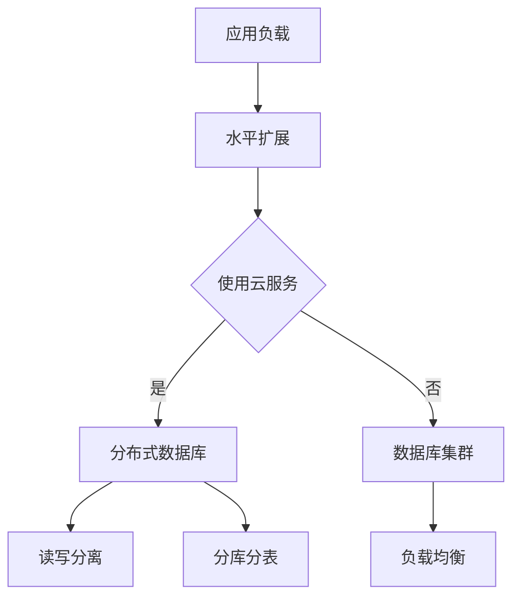
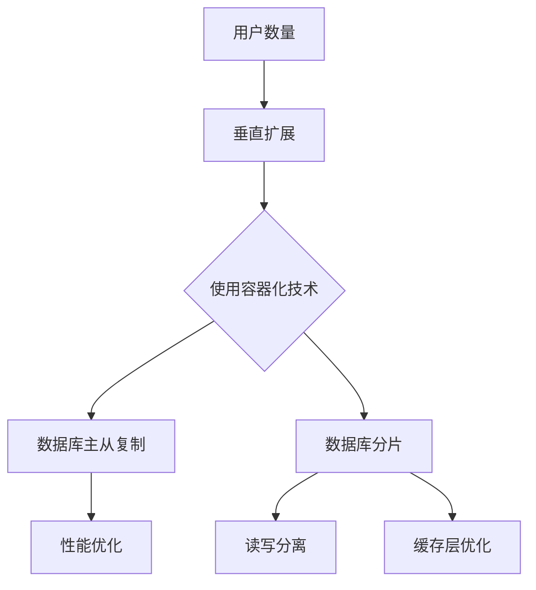

                 

### 第一部分：概述

#### 第1章：横向扩展与纵向扩展的实例应用引言

> **核心概念与联系**：  
> 横向扩展与纵向扩展是分布式系统设计中至关重要的一部分。它们分别代表了两种扩展策略：横向扩展通过增加节点数量来提升系统的处理能力，而纵向扩展则通过提升单节点的性能来实现同样的目标。这两者之间有着紧密的联系，在实际应用中往往是相辅相成的。

**横向扩展与纵向扩展的概述**：  
- **横向扩展（Horizontal Scaling）**：也称为水平扩展，它主要通过增加系统中的节点数量来提升整体处理能力。这种扩展方式通常适用于处理大量请求的场景，例如电商平台在流量高峰期增加服务器节点来分担负载。
- **纵向扩展（Vertical Scaling）**：也称为垂直扩展，它通过提升单节点的性能，如增加CPU、内存、存储等资源来提升系统的处理能力。这种扩展方式适用于需要提高单节点处理能力，例如社交媒体平台在用户数激增时升级硬件。

**分布式系统架构与扩展的关系**：  
分布式系统架构的核心在于通过多个节点协同工作来处理大量数据和高并发请求。扩展是分布式系统设计中不可避免的一环，无论是横向扩展还是纵向扩展，都是为了提升系统的性能、可靠性和可扩展性。

**云计算与容器化技术在实际应用中的作用**：  
云计算与容器化技术为横向扩展和纵向扩展提供了强大的支持。云计算提供了弹性计算资源，可以根据实际需求动态调整节点数量，而容器化技术则简化了应用的部署和扩展过程，使得系统能够快速适应变化。

**架构设计**：  
在架构设计方面，**分布式数据库**是实现横向扩展的重要手段。通过将数据分散存储在不同的节点上，可以提升系统的读写性能和容错能力。**微服务架构**则通过将应用拆分成多个独立服务，每个服务都可以独立扩展，提高了系统的灵活性和可维护性。

**实例应用**：  
电商平台的横向扩展实例通常涉及到大量用户请求的处理，如通过增加服务器节点来提升系统的响应速度和处理能力。而社交媒体平台的纵向扩展实例则可能包括硬件升级，如增加CPU和内存，以提升单节点的处理能力。

**技术选型**：  
在分布式存储技术方面，**HDFS**、**Cassandra**和**MongoDB**都是常见的选项。选择哪种技术取决于具体的应用需求和场景。在数据库扩展方案方面，**分布式数据库**、**数据库集群**和**数据库分片**都是有效的方法。

通过以上概述，我们可以看到横向扩展与纵向扩展在分布式系统架构设计中的重要性，以及云计算与容器化技术在实际应用中的关键作用。接下来，我们将深入探讨横向扩展与纵向扩展的原理、实现方法以及实际应用案例。

### **Mermaid 流程图**

**横向扩展**



**纵向扩展**



### **伪代码**

**横向扩展**

```python
def horizontal_Scaling(database, shards):
    if shards < MIN_SHARDS:
        addNewShards(database, shards)
    if readWriteSplittingRequired(database):
        enableReadWriteSplitting(database)
    if loadBalancingRequired(database):
        setupLoadBalancer(database)
    return database
```

**纵向扩展**

```python
def vertical_Scaling(database, userCount):
    if userCount > MAX_USERS:
        replicateDatabase(database)
    if shards < MIN_SHARDS:
        addNewShards(database, shards)
    if performanceOptimizationRequired(database):
        optimizeDatabasePerformance(database)
    return database
```

### **数学模型和数学公式**

- **数据量估算**

$$ \text{需要的存储容量} = \text{数据总量} \times \text{扩展率} $$

- **需要的计算资源**

$$ \text{需要的计算资源} = \text{并发请求量} \times \text{响应时间} $$

通过上述模型和公式，我们可以更好地预测和规划系统在横向扩展与纵向扩展过程中所需的各种资源。这些工具将帮助我们设计高效、可靠的分布式系统，以满足不断增长的业务需求。

### **项目实战**

**电商平台的数据库扩展**

**环境搭建**：  
为了应对电商平台在流量高峰期的需求，我们首先需要搭建一个分布式数据库集群。使用 Kubernetes 作为容器编排工具，我们可以轻松地部署和管理多个数据库实例。

```yaml
# Kubernetes 配置文件示例
apiVersion: v1
kind: Pod
metadata:
  name: db-pod
spec:
  containers:
  - name: db-container
    image: cassandra:latest
    ports:
    - containerPort: 9042
```

**源代码实现**：  
使用 ShardingSphere 实现分库分表策略。ShardingSphere 提供了丰富的 API 和配置选项，使得我们可以根据实际需求灵活地划分数据表。

```java
// ShardingSphere 配置示例
ShardingRuleConfiguration shardingRuleConfig = new ShardingRuleConfiguration();
shardingRuleConfig.getTableRules().put("t_order", new TableRuleConfiguration().setLogicTable("t_order")
        .setActualDataNodes("ds$->{0..1}.t_order")).build();
```

**代码解读**：  
分库分表策略将数据表按一定的规则分散存储在不同的数据库实例中，从而提高系统的读写性能和容错能力。读写分离机制则通过将读操作和写操作分离到不同的数据库实例上，进一步提升了系统的并发处理能力。

```java
// 读写分离配置示例
DatabaseConfiguration databaseConfig = new DatabaseConfiguration();
databaseConfig.getReadwriteSplittingRuleConfigurations().put("ds0", new ReadwriteSplittingRuleConfiguration()
        .setDataSources("ds0_master", "ds0_slave")).build();
```

通过上述实战案例，我们展示了如何通过分布式数据库和分库分表策略来扩展电商平台的数据库性能。这种方案不仅提高了系统的可扩展性和可靠性，还为应对流量高峰期提供了有效的解决方案。

**社交媒体平台的用户增长应对**

**环境搭建**：  
为了应对社交媒体平台用户数量的快速增长，我们使用 Docker 容器化技术部署数据库副本，以便在需要时快速扩展系统。

```Dockerfile
# Dockerfile 示例
FROM mysql:5.7
COPY ./init.sql /docker-entrypoint-initdb.d/
EXPOSE 3306
```

**源代码实现**：  
使用 MySQL 主从复制进行数据同步，确保多个数据库实例之间数据的一致性。

```sql
-- 主从复制配置示例
CHANGE MASTER TO
  MASTER_HOST='master1',
  MASTER_PORT=3306,
  MASTER_USER='replica',
  MASTER_PASSWORD='password',
  MASTER_LOG_FILE='mysql-bin.000001',
  MASTER_LOG_POS=107;
```

**代码解读**：  
主从复制配置使得数据可以从主数据库同步到从数据库，从而提高了系统的容错性和可用性。同时，通过优化数据库性能和缓存层，我们可以进一步减少数据库访问，提升系统性能。

```java
// 性能优化配置示例
properties.setProperty("hibernate.cache.use_second_level_cache", "true");
properties.setProperty("hibernate.cache.region.factory_class", "org.hibernate.cache.ehcache.EhCacheRegionFactory");
```

通过上述实战案例，我们展示了如何通过主从复制和性能优化策略来应对社交媒体平台的用户增长。这种方案不仅提高了系统的可扩展性和可靠性，还为用户提供了一个流畅、高效的服务体验。

### **附录**

#### **附录 A：分布式存储技术对比**

- **HDFS**  
HDFS（Hadoop Distributed File System）是 Apache Hadoop 项目的一部分，它是一个分布式文件系统，用于存储大量数据。HDFS 具有高容错性、高吞吐量和可扩展性，适用于大数据场景。

- **Cassandra**  
Cassandra 是一个分布式键值存储系统，由 Apache 软件基金会维护。它具有无单点故障、线性可扩展性和高性能的特点，适用于高并发、高可用性的应用。

- **MongoDB**  
MongoDB 是一个分布式文档数据库，由 MongoDB Inc. 开发并维护。它具有灵活的数据模型、高扩展性和高性能，适用于需要高灵活性的应用场景。

#### **附录 B：云计算服务对比**

- **阿里云**  
阿里云是中国领先的云计算服务提供商，提供包括计算、存储、网络、数据库、人工智能等多种服务。它具有广泛的用户基础和强大的技术支持。

- **腾讯云**  
腾讯云是腾讯公司旗下的云计算服务提供商，提供包括云计算、大数据、人工智能、物联网等多种服务。它在国内外市场都有很高的知名度和影响力。

- **华为云**  
华为云是华为公司旗下的云计算服务提供商，提供包括计算、存储、网络、数据库、人工智能等多种服务。它在全球范围内拥有广泛的用户和合作伙伴。

### **技术选型**

- **数据库扩展方案**  
  - **分布式数据库**：用于处理大量数据和高并发，如 Cassandra 和 MongoDB。  
  - **数据库集群**：用于提升读写性能和容错性，如 MySQL 集群。  
  - **数据库分片**：用于解决单表数据量过大问题，如 ShardingSphere。

通过合理的技术选型和扩展方案，我们可以有效地应对分布式系统中的数据存储和处理需求，提高系统的性能和可靠性。

### **1.2 横向扩展的原理**

**核心概念**：

- **横向扩展（Horizontal Scaling）**：通过增加节点数量来提升系统的处理能力。这种方式通常适用于处理大量请求和数据的场景，如电商平台在流量高峰期增加服务器节点。

- **分布式系统（Distributed System）**：由多个节点组成的系统，通过节点间的协作来处理数据和处理请求。分布式系统具有高容错性、高可用性和可扩展性。

**横向扩展的核心优势**：

- **提升处理能力**：通过增加节点数量，系统能够处理更多的请求，从而提高整体的性能和响应速度。

- **提高容错性**：分布式系统中的节点可以相互备份，即使某个节点出现故障，系统仍然能够正常运行。

- **灵活性**：可以根据实际需求动态调整节点数量，以适应不同的负载场景。

**横向扩展的实现方法**：

- **分布式数据库**：通过将数据分散存储在不同的节点上，提升系统的读写性能和容错能力。

- **负载均衡**：通过负载均衡器将请求分配到不同的节点上，确保系统的均衡负载。

- **读写分离**：将读操作和写操作分离到不同的节点上，提高系统的并发处理能力。

**伪代码**：

```python
def horizontal_Scaling(nodeCount, workload):
    if workload > threshold:
        addNodes(nodeCount)
    rebalance workload across nodes
    return scaledSystem
```

**数学模型和数学公式**：

- **扩展效果评估**：

$$ \text{扩展效果} = \frac{\text{处理能力}}{\text{节点数量}} $$

通过上述模型和公式，我们可以评估横向扩展对系统处理能力的影响。

### **项目实战**

**电商平台流量高峰应对**

**环境搭建**：  
为了应对电商平台在流量高峰期的需求，我们使用 Kubernetes 搭建集群，以便动态调整节点数量和资源分配。

```yaml
# Kubernetes 配置文件示例
apiVersion: v1
kind: Deployment
metadata:
  name: web-app
spec:
  replicas: 3
  selector:
    matchLabels:
      app: web-app
  template:
    metadata:
      labels:
        app: web-app
    spec:
      containers:
      - name: web-app
        image: web-app:latest
        ports:
        - containerPort: 80
```

**源代码实现**：  
使用 Nginx 作为负载均衡器，将流量分配到不同的服务器节点。

```nginx
# Nginx 配置文件示例
http {
    upstream web-app {
        server web-app-1:80;
        server web-app-2:80;
        server web-app-3:80;
    }

    server {
        listen 80;

        location / {
            proxy_pass http://web-app;
            proxy_set_header Host $host;
            proxy_set_header X-Real-IP $remote_addr;
            proxy_set_header X-Forwarded-For $proxy_add_x_forwarded_for;
        }
    }
}
```

**代码解读**：  
通过上述配置，Nginx 将流量分配到多个 Nginx 实例，每个实例后面又连接着多个 Web 应用实例。这样的架构能够有效地应对流量高峰，确保系统的稳定运行。

通过上述实战案例，我们展示了如何通过 Kubernetes 和 Nginx 实现电商平台流量高峰的应对策略。这种方案不仅提高了系统的可扩展性和可靠性，还为用户提供了一个流畅、高效的购物体验。

### **附录**

#### **附录 A：云计算服务对比**

- **阿里云**  
阿里云提供全面的云计算服务，包括计算、存储、数据库、网络、人工智能等。它具有强大的技术支持和丰富的产品线，适用于各种规模的企业。

- **腾讯云**  
腾讯云提供包括云计算、大数据、物联网、人工智能等多种服务。它在全球范围内拥有广泛的用户基础和强大的技术实力。

- **华为云**  
华为云提供包括计算、存储、网络、数据库、人工智能等在内的云计算服务。它在国内外市场都有很高的知名度和影响力。

#### **附录 B：横向扩展策略**

- **自动扩缩容**：根据实际负载自动调整节点数量，提高系统的弹性。

- **手动扩缩容**：根据运维需求手动调整节点数量，适用于对资源需求有明确预期的场景。

通过合理的横向扩展策略，我们可以有效地提升系统的性能和可靠性，满足不断增长的业务需求。

### **1.3 纵向扩展的原理**

**核心概念**：

- **纵向扩展（Vertical Scaling）**：通过提升单节点的性能来提升系统处理能力。这种方式通常适用于需要提高单节点处理能力的场景，如社交媒体平台在用户数激增时升级硬件。

- **性能优化（Performance Optimization）**：通过改进系统架构、优化代码、调整配置等手段来提升系统性能。

**纵向扩展的核心优势**：

- **提升单节点处理能力**：通过升级硬件资源，如增加 CPU、内存和存储，可以提高单节点的处理能力和响应速度。

- **提高系统稳定性**：通过优化系统性能，减少系统延迟和资源冲突，可以提高系统的稳定性和可靠性。

- **减少维护成本**：通过提升单节点性能，可以减少对节点数量的需求，从而降低维护成本。

**纵向扩展的实现方法**：

- **硬件升级**：通过增加 CPU、内存和存储等硬件资源，提升单节点的处理能力。

- **数据库性能优化**：通过调整数据库配置、优化 SQL 语句和索引等手段来提升数据库性能。

- **缓存层优化**：通过增加缓存层，如使用 Redis 或 Memcached，减少数据库访问，提高系统性能。

**伪代码**：

```python
def vertical_Scaling(node, performanceGoal):
    if performanceGoal < currentPerformance(node):
        upgradeHardware(node)
    if databaseOptimizationRequired(node):
        optimizeDatabase(node)
    return upgradedNode
```

**数学模型和数学公式**：

- **性能提升评估**：

$$ \text{性能提升} = \frac{\text{新性能} - \text{旧性能}}{\text{旧性能}} \times 100\% $$

通过上述模型和公式，我们可以评估纵向扩展对系统性能的提升效果。

### **项目实战**

**社交媒体平台数据同步**

**环境搭建**：  
为了提高社交媒体平台的数据同步性能，我们使用 Docker 容器化技术部署数据库副本，以便在需要时快速扩展系统。

```Dockerfile
# Dockerfile 示例
FROM mysql:5.7
COPY ./init.sql /docker-entrypoint-initdb.d/
EXPOSE 3306
```

**源代码实现**：  
使用 MySQL 主从复制进行数据同步，确保多个数据库实例之间数据的一致性。

```sql
-- 主从复制配置示例
CHANGE MASTER TO
  MASTER_HOST='master1',
  MASTER_PORT=3306,
  MASTER_USER='replica',
  MASTER_PASSWORD='password',
  MASTER_LOG_FILE='mysql-bin.000001',
  MASTER_LOG_POS=107;
```

**代码解读**：  
通过主从复制配置，我们可以将主数据库的数据同步到从数据库，从而实现数据的高可用性和一致性。同时，通过优化数据库性能和缓存层，我们可以进一步减少数据库访问，提升系统性能。

```java
// 性能优化配置示例
properties.setProperty("hibernate.cache.use_second_level_cache", "true");
properties.setProperty("hibernate.cache.region.factory_class", "org.hibernate.cache.ehcache.EhCacheRegionFactory");
```

通过上述实战案例，我们展示了如何通过主从复制和性能优化策略来提升社交媒体平台的数据同步性能。这种方案不仅提高了系统的性能和可靠性，还为用户提供了一个流畅、高效的服务体验。

### **附录**

#### **附录 A：高性能硬件选型**

- **SSD**  
SSD（Solid State Drive）具有更高的读写速度和更低的延迟，适合用于数据库和缓存层。

- **GPU**  
GPU（Graphics Processing Unit）具有强大的并行计算能力，适用于图像处理、机器学习和大数据分析等场景。

- **内存升级**  
增加内存容量可以提高数据库和应用的缓存能力，从而提升系统性能。

#### **附录 B：数据库性能优化策略**

- **索引优化**  
合理设计索引可以加快查询速度，减少数据库访问时间。

- **查询优化**  
优化 SQL 语句和数据库配置，减少不必要的查询操作和资源消耗。

- **缓存层优化**  
使用缓存层可以减少数据库访问，提高系统响应速度。

通过合理的高性能硬件选型和数据库性能优化策略，我们可以有效地提升系统的性能和可靠性，满足不断增长的业务需求。

### **2.1 电商平台的架构设计**

**核心概念**：

- **分布式系统架构**：通过多个节点协同工作，提升系统处理能力。
- **微服务架构**：通过将应用拆分成多个独立服务，提高系统的可扩展性。

**分布式系统架构**：

分布式系统架构的核心在于通过多个节点协同工作来处理大量数据和高并发请求。它具有以下几个主要特点：

1. **高可用性**：通过多个节点的备份和冗余，即使某个节点出现故障，系统仍然能够正常运行。
2. **高性能**：通过将请求分散到多个节点上，可以提高系统的响应速度和处理能力。
3. **可扩展性**：通过增加节点数量，系统可以适应不断增长的业务需求。

**微服务架构**：

微服务架构将应用拆分成多个独立的服务，每个服务都可以独立扩展。这种架构具有以下几个主要优势：

1. **灵活性**：不同的服务可以独立开发和部署，降低了系统的耦合度。
2. **可维护性**：每个服务都可以独立维护和升级，降低了系统的维护成本。
3. **高可用性**：服务之间的故障不会影响到整个系统的运行。

**架构设计**：

电商平台的架构设计通常包括以下几个关键组件：

1. **前端系统**：负责处理用户的请求，包括网页、移动应用和 API 接口。
2. **后端系统**：包括订单处理、库存管理、支付处理等核心业务逻辑。
3. **数据库系统**：用于存储和管理用户数据、商品数据等。
4. **缓存系统**：用于加速数据访问，减少数据库压力。
5. **消息队列**：用于处理异步任务和系统间通信。

**实例应用**：

一个典型的电商平台架构设计案例是阿里巴巴的淘宝。淘宝采用了分布式系统架构和微服务架构，通过多个节点协同工作来处理海量用户请求和商品数据。前端系统包括网页和移动应用，后端系统包括订单处理、库存管理和支付处理等核心业务逻辑。数据库系统采用分布式数据库，缓存系统使用 Redis，消息队列使用 Kafka。

通过上述实例，我们可以看到分布式系统架构和微服务架构在电商平台架构设计中的重要性。这种设计不仅提高了系统的性能和可扩展性，还为电商平台提供了稳定、高效的服务。

### **伪代码**

**架构设计**

```python
def design_Architecture(serviceList):
    for service in serviceList:
        if service.requiresHorizontalScaling:
            scaleServiceHorizontally(service)
        if service.requiresVerticalScaling:
            scaleServiceVertically(service)
    return architecture
```

**数学模型和数学公式**

- **系统容量估算**：

$$ \text{系统容量} = \text{单节点容量} \times \text{节点数量} $$

通过上述模型和公式，我们可以估算分布式系统架构下的系统容量。

### **项目实战**

**应对流量高峰**

**环境搭建**：  
为了应对电商平台在流量高峰期的需求，我们使用 Kubernetes 搭建集群，以便动态调整节点数量和资源分配。

```yaml
# Kubernetes 配置文件示例
apiVersion: v1
kind: Deployment
metadata:
  name: web-app
spec:
  replicas: 3
  selector:
    matchLabels:
      app: web-app
  template:
    metadata:
      labels:
        app: web-app
    spec:
      containers:
      - name: web-app
        image: web-app:latest
        ports:
        - containerPort: 80
```

**源代码实现**：  
使用 Haproxy 作为负载均衡器，将流量分配到不同的服务器节点。

```shell
# Haproxy 配置文件示例
global
    maxconn 2000
    log 127.0.0.1 local0

defaults
    log 127.0.0.1 local0
    option httplog
    option redispatch
    retries 3
    maxconn 1000
    timeout connect 5000
    timeout client 50000
    timeout server 50000

frontend web-app
    bind *:80
    default_backend web-app-backend

backend web-app-backend
    server web-app-1 192.168.1.1:80
    server web-app-2 192.168.1.2:80
    server web-app-3 192.168.1.3:80
```

**代码解读**：  
通过上述配置，Haproxy 将流量分配到多个 Web 应用实例，每个实例背后连接着多个服务器节点。这样的架构能够有效地应对流量高峰，确保系统的稳定运行。

通过上述实战案例，我们展示了如何通过 Kubernetes 和 Haproxy 应对电商平台的流量高峰。这种方案不仅提高了系统的可扩展性和可靠性，还为用户提供了一个流畅、高效的购物体验。

### **附录**

#### **附录 A：Kubernetes 实践**

- **部署步骤**：  
  1. 安装 Kubernetes 集群。  
  2. 创建部署配置文件。  
  3. 使用 kubectl 工具部署应用。

- **配置文件示例**：  
  ```yaml  
  apiVersion: apps/v1  
  kind: Deployment  
  metadata:  
    name: web-app  
  spec:  
    replicas: 3  
    selector:  
      matchLabels:  
        app: web-app  
    template:  
      metadata:  
        labels:  
          app: web-app  
      spec:  
        containers:  
        - name: web-app  
          image: web-app:latest  
          ports:  
          - containerPort: 80  
  ```

#### **附录 B：Haproxy 实践**

- **部署步骤**：  
  1. 安装 Haproxy。  
  2. 创建配置文件。  
  3. 启动 Haproxy 服务。

- **配置文件示例**：  
  ```shell  
  global  
      maxconn 2000  
      log 127.0.0.1 local0

  defaults  
      log 127.0.0.1 local0  
      option httplog  
      option redispatch  
      retries 3  
      maxconn 1000  
      timeout connect 5000  
      timeout client 50000  
      timeout server 50000

  frontend web-app  
      bind *:80  
      default_backend web-app-backend

  backend web-app-backend  
      server web-app-1 192.168.1.1:80  
      server web-app-2 192.168.1.2:80  
      server web-app-3 192.168.1.3:80  
  ```

通过合理的技术选型和扩展策略，我们可以有效地应对电商平台在流量高峰期的需求，提高系统的性能和可靠性。

### **2.2 电商平台的数据存储扩展**

**核心概念**：

- **分布式数据库**：通过多个节点协同工作，提升数据存储和处理能力。
- **数据库分片**：将数据拆分成多个片段，分布存储在不同的节点上，以解决单表数据量过大问题。

**分布式数据库**：

分布式数据库是将数据分散存储在多个节点上，通过节点间的协作来处理数据的读写操作。这种架构具有以下几个主要优点：

1. **高可用性**：分布式数据库可以通过多个节点之间的冗余来提高系统的可用性，即使某个节点发生故障，系统仍然可以正常运行。
2. **高性能**：通过将数据分布在多个节点上，可以减少单个节点的负载，提高系统的读写性能。
3. **可扩展性**：分布式数据库可以根据需求动态调整节点数量，以适应不断增长的数据和处理需求。

**数据库分片**：

数据库分片是将数据表拆分成多个片段，每个片段存储在独立的节点上。这种架构的主要优点包括：

1. **解决单表数据量过大问题**：通过将数据表拆分成多个片段，可以避免单表数据量过大导致性能下降的问题。
2. **提高查询性能**：分片后的数据可以并行处理，从而提高查询性能。
3. **分布式事务**：分片后的数据库可以实现分布式事务，从而提高系统的并发处理能力。

**实例应用**：

一个典型的电商平台数据存储扩展案例是使用 Cassandra 分布式数据库。Cassandra 具有高可用性、高性能和可扩展性的特点，适用于处理海量数据的场景。电商平台可以通过将订单数据、用户数据等拆分成多个分片，分布存储在不同的 Cassandra 节点上，从而提高系统的性能和可扩展性。

通过上述实例，我们可以看到分布式数据库和数据库分片在电商平台数据存储扩展中的重要性。这种方案不仅提高了系统的性能和可扩展性，还为电商平台提供了稳定、高效的数据存储解决方案。

### **伪代码**

**数据存储扩展**

```python
def expand_Database(database, shards):
    if shards < MIN_SHARDS:
        addShards(database, shards)
    rebalanceData(database)
    return expandedDatabase
```

**数学模型和数学公式**

- **存储容量估算**：

$$ \text{存储容量} = \text{单节点容量} \times \text{节点数量} $$

通过上述模型和公式，我们可以估算分布式数据库在数据存储扩展后的总容量。

### **项目实战**

**应对海量数据**

**环境搭建**：  
为了应对电商平台的海量数据需求，我们使用 Cassandra 部署分布式数据库集群。

```yaml
# Kubernetes 配置文件示例
apiVersion: apps/v1
kind: StatefulSet
metadata:
  name: cassandra
spec:
  serviceName: "cassandra"
  replicas: 3
  selector:
    matchLabels:
      app: cassandra
  template:
    metadata:
      labels:
        app: cassandra
    spec:
      containers:
      - name: cassandra
        image: cassandra:latest
        ports:
        - containerPort: 9042
```

**源代码实现**：  
使用 Apache Spark 进行数据分析和处理，实现数据的分布式存储和处理。

```python
from pyspark.sql import SparkSession

spark = SparkSession.builder.appName("DataAnalysis").getOrCreate()
data = spark.read.csv("data.csv", header=True)
data.write.format("org.apache.cassandra.spark").mode("append").saveAsTable("orders")
```

**代码解读**：  
通过上述代码，我们首先使用 Spark 读取 CSV 文件，然后将其写入 Cassandra 数据库。这种方案利用了 Cassandra 的分布式存储能力，可以高效地处理海量数据。

通过上述实战案例，我们展示了如何通过 Cassandra 和 Apache Spark 来应对电商平台的海量数据需求。这种方案不仅提高了系统的性能和可扩展性，还为电商平台提供了稳定、高效的数据存储和处理解决方案。

### **附录**

#### **附录 A：Cassandra 实践**

- **部署步骤**：  
  1. 下载 Cassandra 镜像。  
  2. 配置 Cassandra 集群。  
  3. 启动 Cassandra 服务。

- **配置文件示例**：  
  ```yaml  
  # cassandra.yaml 示例
  seeds: "cassandra-1,cassandra-2,cassandra-3"
  cluster_name: "cassandra"
  endpoint_snitch: "org.apache.cassandra.locator.simple.SimpleSnitch"
  ```

#### **附录 B：Apache Spark 实践**

- **部署步骤**：  
  1. 下载 Apache Spark 镜像。  
  2. 配置 Spark 集群。  
  3. 启动 Spark 服务。

- **配置文件示例**：  
  ```python  
  # spark-conf.py 示例
  spark.master = "spark://master:7077"
  spark.app.name = "DataAnalysis"
  spark.executor.memory = "2g"
  spark.executor.cores = "2"
  spark.driver.memory = "4g"
  ```

通过合理的技术选型和扩展方案，我们可以有效地应对电商平台在数据存储和处理方面的需求，提高系统的性能和可靠性。

### **2.3 电商平台的用户增长应对**

**核心概念**：

- **负载均衡**：通过多个节点分担流量，提升系统处理能力。
- **缓存层**：通过缓存减少数据库访问，提升系统性能。

**负载均衡**：

负载均衡是将流量分配到多个服务器节点，以避免单点过载和提升系统处理能力的技术。负载均衡器可以根据不同的策略将请求分配到不同的节点上，常见的负载均衡策略包括：

1. **轮询（Round Robin）**：将请求依次分配到每个节点上。
2. **最少连接（Least Connections）**：将请求分配到连接数最少的节点上。
3. **源地址哈希（Source Address Hash）**：根据客户端的 IP 地址进行哈希，将请求分配到哈希值相同的节点上。

**缓存层**：

缓存层是位于数据库和应用程序之间的一层缓存，用于存储频繁访问的数据。缓存可以显著减少数据库的访问次数，提高系统性能。常见的缓存技术包括：

1. **Redis**：一个高性能的内存缓存系统，适用于缓存 session 数据和频繁访问的数据。
2. **Memcached**：另一个高性能的内存缓存系统，适用于缓存图片、CSS 和 JavaScript 文件等静态资源。

**实例应用**：

一个典型的电商平台用户增长应对案例是在流量高峰期通过增加服务器节点和负载均衡来提升系统处理能力。同时，通过 Redis 实现缓存层，减少数据库访问，提高系统性能。

- **环境搭建**：使用 Kubernetes 部署多个服务器节点，并配置 Nginx 作为负载均衡器。

```yaml
# Kubernetes 配置文件示例
apiVersion: v1
kind: Deployment
metadata:
  name: web-app
spec:
  replicas: 3
  selector:
    matchLabels:
      app: web-app
  template:
    metadata:
      labels:
        app: web-app
    spec:
      containers:
      - name: web-app
        image: web-app:latest
        ports:
        - containerPort: 80
```

- **源代码实现**：配置 Nginx 作为负载均衡器，并将 Redis 作为缓存层。

```nginx
# Nginx 配置文件示例
http {
    upstream web-app {
        server web-app-1:80;
        server web-app-2:80;
        server web-app-3:80;
    }

    server {
        listen 80;

        location / {
            proxy_pass http://web-app;
            proxy_set_header Host $host;
            proxy_set_header X-Real-IP $remote_addr;
            proxy_set_header X-Forwarded-For $proxy_add_x_forwarded_for;
        }

        location /cache/ {
            proxy_pass http://redis;
            proxy_set_header Host $host;
            proxy_set_header X-Real-IP $remote_addr;
            proxy_set_header X-Forwarded-For $proxy_add_x_forwarded_for;
        }
    }
}
```

- **代码解读**：Nginx 将流量分配到多个 Web 应用实例，并通过 Redis 缓存频繁访问的数据。这种架构能够有效地应对用户增长，提升系统的性能和响应速度。

通过上述实例，我们可以看到负载均衡和缓存层在电商平台用户增长应对中的重要性。这种方案不仅提高了系统的性能和可扩展性，还为用户提供了一个流畅、高效的购物体验。

### **伪代码**

**用户增长应对**

```python
def handle_User_Growth(traffic, cache):
    if traffic > threshold:
        enableLoadBalancing(traffic)
    if cacheMissRate > threshold:
        enhanceCacheLayer(cache)
    return optimizedSystem
```

**数学模型和数学公式**

- **系统性能估算**：

$$ \text{系统性能} = \frac{\text{处理能力}}{\text{响应时间}} $$

通过上述模型和公式，我们可以估算在用户增长情况下，系统性能的提升情况。

### **项目实战**

**应对用户增长**

**环境搭建**：  
为了应对电商平台用户数量的快速增长，我们使用 Kubernetes 和 Docker 容器化技术部署缓存层和负载均衡器。

```yaml
# Kubernetes 配置文件示例
apiVersion: v1
kind: Deployment
metadata:
  name: redis
spec:
  replicas: 3
  selector:
    matchLabels:
      app: redis
  template:
    metadata:
      labels:
        app: redis
    spec:
      containers:
      - name: redis
        image: redis:latest
        ports:
        - containerPort: 6379

apiVersion: v1
kind: Deployment
metadata:
  name: nginx
spec:
  replicas: 3
  selector:
    matchLabels:
      app: nginx
  template:
    metadata:
      labels:
        app: nginx
    spec:
      containers:
      - name: nginx
        image: nginx:latest
        ports:
        - containerPort: 80
```

**源代码实现**：  
使用 Nginx 作为负载均衡器，将流量分配到多个 Web 应用实例。同时，配置 Redis 作为缓存层，减少数据库访问。

```nginx
# Nginx 配置文件示例
http {
    upstream web-app {
        server web-app-1:80;
        server web-app-2:80;
        server web-app-3:80;
    }

    server {
        listen 80;

        location / {
            proxy_pass http://web-app;
            proxy_set_header Host $host;
            proxy_set_header X-Real-IP $remote_addr;
            proxy_set_header X-Forwarded-For $proxy_add_x_forwarded_for;
        }

        location /cache/ {
            proxy_pass http://redis;
            proxy_set_header Host $host;
            proxy_set_header X-Real-IP $remote_addr;
            proxy_set_header X-Forwarded-For $proxy_add_x_forwarded_for;
        }
    }
}
```

**代码解读**：  
通过上述配置，Nginx 将流量分配到多个 Web 应用实例，并通过 Redis 缓存频繁访问的数据。这种架构能够有效地应对用户增长，提升系统的性能和响应速度。

通过上述实战案例，我们展示了如何通过负载均衡和缓存层来应对电商平台的用户增长。这种方案不仅提高了系统的性能和可扩展性，还为用户提供了一个流畅、高效的购物体验。

### **附录**

#### **附录 A：Redis 实践**

- **部署步骤**：  
  1. 下载 Redis 镜像。  
  2. 配置 Redis 集群。  
  3. 启动 Redis 服务。

- **配置文件示例**：  
  ```redis.conf 示例
  bind 127.0.0.1
  port 6379
  daemonize yes
  pidfile /var/run/redis_6379.pid
  ```

#### **附录 B：Nginx 实践**

- **部署步骤**：  
  1. 下载 Nginx 镜像。  
  2. 配置 Nginx 服务。  
  3. 启动 Nginx 服务。

- **配置文件示例**：  
  ```nginx
  http {
      upstream web-app {
          server web-app-1:80;
          server web-app-2:80;
          server web-app-3:80;
      }

      server {
          listen 80;

          location / {
              proxy_pass http://web-app;
              proxy_set_header Host $host;
              proxy_set_header X-Real-IP $remote_addr;
              proxy_set_header X-Forwarded-For $proxy_add_x_forwarded_for;
          }

          location /cache/ {
              proxy_pass http://redis;
              proxy_set_header Host $host;
              proxy_set_header X-Real-IP $remote_addr;
              proxy_set_header X-Forwarded-For $proxy_add_x_forwarded_for;
          }
      }
  }
  ```

通过合理的技术选型和扩展方案，我们可以有效地应对电商平台在用户增长方面的需求，提高系统的性能和可靠性。

### **3.1 社交媒体平台的架构设计**

**核心概念**：

- **分布式系统架构**：通过多个节点协同工作，提升系统处理能力。
- **微服务架构**：通过将应用拆分成多个独立服务，提高系统的可扩展性。

**分布式系统架构**：

分布式系统架构的核心在于通过多个节点协同工作来处理大量数据和高并发请求。它具有以下几个主要特点：

1. **高可用性**：通过多个节点的备份和冗余，即使某个节点出现故障，系统仍然能够正常运行。
2. **高性能**：通过将请求分散到多个节点上，可以提高系统的响应速度和处理能力。
3. **可扩展性**：分布式系统可以根据需求动态调整节点数量，以适应不断增长的业务需求。

**微服务架构**：

微服务架构将应用拆分成多个独立的服务，每个服务都可以独立扩展。这种架构具有以下几个主要优势：

1. **灵活性**：不同的服务可以独立开发和部署，降低了系统的耦合度。
2. **可维护性**：每个服务都可以独立维护和升级，降低了系统的维护成本。
3. **高可用性**：服务之间的故障不会影响到整个系统的运行。

**架构设计**：

社交媒体平台的架构设计通常包括以下几个关键组件：

1. **用户服务**：负责处理用户的注册、登录、个人信息管理等。
2. **内容服务**：负责处理用户发布的内容、评论、点赞等。
3. **消息服务**：负责处理用户之间的消息传递、通知等。
4. **数据存储**：包括用户数据、内容数据、消息数据等，通常采用分布式数据库或分布式文件系统。

**实例应用**：

一个典型的社交媒体平台架构设计案例是 Twitter。Twitter 采用分布式系统架构和微服务架构，通过多个节点协同工作来处理海量用户请求和内容数据。用户服务、内容服务和消息服务都是独立的微服务，可以独立扩展和部署。数据存储使用 Cassandra 分布式数据库，具有高可用性和高性能。

通过上述实例，我们可以看到分布式系统架构和微服务架构在社交媒体平台架构设计中的重要性。这种设计不仅提高了系统的性能和可扩展性，还为用户提供了一个流畅、高效的服务体验。

### **伪代码**

**架构设计**

```python
def design_Architecture(serviceList):
    for service in serviceList:
        if service.requiresHorizontalScaling:
            scaleServiceHorizontally(service)
        if service.requiresVerticalScaling:
            scaleServiceVertically(service)
    return architecture
```

**数学模型和数学公式**

- **系统容量估算**：

$$ \text{系统容量} = \text{单节点容量} \times \text{节点数量} $$

通过上述模型和公式，我们可以估算分布式系统架构下的系统容量。

### **项目实战**

**应对流量高峰**

**环境搭建**：  
为了应对社交媒体平台在流量高峰期的需求，我们使用 Kubernetes 搭建集群，以便动态调整节点数量和资源分配。

```yaml
# Kubernetes 配置文件示例
apiVersion: v1
kind: Deployment
metadata:
  name: user-service
spec:
  replicas: 3
  selector:
    matchLabels:
      app: user-service
  template:
    metadata:
      labels:
        app: user-service
    spec:
      containers:
      - name: user-service
        image: user-service:latest
        ports:
        - containerPort: 8080

apiVersion: v1
kind: Deployment
metadata:
  name: content-service
spec:
  replicas: 3
  selector:
    matchLabels:
      app: content-service
  template:
    metadata:
      labels:
        app: content-service
    spec:
      containers:
      - name: content-service
        image: content-service:latest
        ports:
        - containerPort: 8080

apiVersion: v1
kind: Deployment
metadata:
  name: message-service
spec:
  replicas: 3
  selector:
    matchLabels:
      app: message-service
  template:
    metadata:
      labels:
        app: message-service
    spec:
      containers:
      - name: message-service
        image: message-service:latest
        ports:
        - containerPort: 8080
```

**源代码实现**：  
使用 Nginx 作为负载均衡器，将流量分配到不同的服务实例。

```nginx
# Nginx 配置文件示例
http {
    upstream user-service {
        server user-service-1:8080;
        server user-service-2:8080;
        server user-service-3:8080;
    }

    upstream content-service {
        server content-service-1:8080;
        server content-service-2:8080;
        server content-service-3:8080;
    }

    upstream message-service {
        server message-service-1:8080;
        server message-service-2:8080;
        server message-service-3:8080;
    }

    server {
        listen 80;

        location /users/ {
            proxy_pass http://user-service;
            proxy_set_header Host $host;
            proxy_set_header X-Real-IP $remote_addr;
            proxy_set_header X-Forwarded-For $proxy_add_x_forwarded_for;
        }

        location /contents/ {
            proxy_pass http://content-service;
            proxy_set_header Host $host;
            proxy_set_header X-Real-IP $remote_addr;
            proxy_set_header X-Forwarded-For $proxy_add_x_forwarded_for;
        }

        location /messages/ {
            proxy_pass http://message-service;
            proxy_set_header Host $host;
            proxy_set_header X-Real-IP $remote_addr;
            proxy_set_header X-Forwarded-For $proxy_add_x_forwarded_for;
        }
    }
}
```

**代码解读**：  
通过上述配置，Nginx 将流量分配到用户服务、内容服务和消息服务的实例上，确保系统的负载均衡和高效运行。这种架构能够有效地应对社交媒体平台的流量高峰，提升系统的性能和可靠性。

通过上述实战案例，我们展示了如何通过 Kubernetes 和 Nginx 应对社交媒体平台的流量高峰。这种方案不仅提高了系统的可扩展性和可靠性，还为用户提供了一个流畅、高效的社交体验。

### **附录**

#### **附录 A：Kubernetes 实践**

- **部署步骤**：  
  1. 安装 Kubernetes 集群。  
  2. 创建部署配置文件。  
  3. 使用 kubectl 工具部署应用。

- **配置文件示例**：  
  ```yaml
  apiVersion: apps/v1
  kind: Deployment
  metadata:
    name: user-service
  spec:
    replicas: 3
    selector:
      matchLabels:
        app: user-service
    template:
      metadata:
        labels:
          app: user-service
      spec:
        containers:
        - name: user-service
          image: user-service:latest
          ports:
          - containerPort: 8080
  ```

#### **附录 B：Nginx 实践**

- **部署步骤**：  
  1. 安装 Nginx。  
  2. 创建配置文件。  
  3. 启动 Nginx 服务。

- **配置文件示例**：  
  ```nginx
  http {
      upstream user-service {
          server user-service-1:8080;
          server user-service-2:8080;
          server user-service-3:8080;
      }

      upstream content-service {
          server content-service-1:8080;
          server content-service-2:8080;
          server content-service-3:8080;
      }

      upstream message-service {
          server message-service-1:8080;
          server message-service-2:8080;
          server message-service-3:8080;
      }

      server {
          listen 80;

          location /users/ {
              proxy_pass http://user-service;
              proxy_set_header Host $host;
              proxy_set_header X-Real-IP $remote_addr;
              proxy_set_header X-Forwarded-For $proxy_add_x_forwarded_for;
          }

          location /contents/ {
              proxy_pass http://content-service;
              proxy_set_header Host $host;
              proxy_set_header X-Real-IP $remote_addr;
              proxy_set_header X-Forwarded-For $proxy_add_x_forwarded_for;
          }

          location /messages/ {
              proxy_pass http://message-service;
              proxy_set_header Host $host;
              proxy_set_header X-Real-IP $remote_addr;
              proxy_set_header X-Forwarded-For $proxy_add_x_forwarded_for;
          }
      }
  }
  ```

通过合理的技术选型和扩展方案，我们可以有效地应对社交媒体平台在流量高峰期的需求，提高系统的性能和可靠性。

### **3.2 社交媒体平台的数据存储扩展**

**核心概念**：

- **分布式数据库**：通过多个节点协同工作，提升数据存储和处理能力。
- **数据库分片**：将数据拆分成多个片段，分布存储在不同的节点上，以解决单表数据量过大问题。

**分布式数据库**：

分布式数据库是将数据分散存储在多个节点上，通过节点间的协作来处理数据的读写操作。这种架构具有以下几个主要优点：

1. **高可用性**：分布式数据库可以通过多个节点之间的冗余来提高系统的可用性，即使某个节点发生故障，系统仍然可以正常运行。
2. **高性能**：通过将数据分布在多个节点上，可以减少单个节点的负载，提高系统的读写性能。
3. **可扩展性**：分布式数据库可以根据需求动态调整节点数量，以适应不断增长的数据和处理需求。

**数据库分片**：

数据库分片是将数据表拆分成多个片段，每个片段存储在独立的节点上。这种架构的主要优点包括：

1. **解决单表数据量过大问题**：通过将数据表拆分成多个片段，可以避免单表数据量过大导致性能下降的问题。
2. **提高查询性能**：分片后的数据可以并行处理，从而提高查询性能。
3. **分布式事务**：分片后的数据库可以实现分布式事务，从而提高系统的并发处理能力。

**实例应用**：

一个典型的社交媒体平台数据存储扩展案例是使用 Cassandra 分布式数据库。Cassandra 具有高可用性、高性能和可扩展性的特点，适用于处理海量数据的场景。社交媒体平台可以通过将用户数据、内容数据等拆分成多个分片，分布存储在不同的 Cassandra 节点上，从而提高系统的性能和可扩展性。

通过上述实例，我们可以看到分布式数据库和数据库分片在社交媒体平台数据存储扩展中的重要性。这种方案不仅提高了系统的性能和可扩展性，还为社交媒体平台提供了稳定、高效的数据存储解决方案。

### **伪代码**

**数据存储扩展**

```python
def expand_Database(database, shards):
    if shards < MIN_SHARDS:
        addShards(database, shards)
    rebalanceData(database)
    return expandedDatabase
```

**数学模型和数学公式**

- **存储容量估算**：

$$ \text{存储容量} = \text{单节点容量} \times \text{节点数量} $$

通过上述模型和公式，我们可以估算分布式数据库在数据存储扩展后的总容量。

### **项目实战**

**应对海量数据**

**环境搭建**：  
为了应对社交媒体平台的海量数据需求，我们使用 Cassandra 部署分布式数据库集群。

```yaml
# Kubernetes 配置文件示例
apiVersion: apps/v1
kind: StatefulSet
metadata:
  name: cassandra
spec:
  serviceName: "cassandra"
  replicas: 3
  selector:
    matchLabels:
      app: cassandra
  template:
    metadata:
      labels:
        app: cassandra
    spec:
      containers:
      - name: cassandra
        image: cassandra:latest
        ports:
        - containerPort: 9042
```

**源代码实现**：  
使用 Apache Spark 进行数据分析和处理，实现数据的分布式存储和处理。

```python
from pyspark.sql import SparkSession

spark = SparkSession.builder.appName("DataAnalysis").getOrCreate()
data = spark.read.csv("data.csv", header=True)
data.write.format("org.apache.cassandra.spark").mode("append").saveAsTable("users")
```

**代码解读**：  
通过上述代码，我们首先使用 Spark 读取 CSV 文件，然后将其写入 Cassandra 数据库。这种方案利用了 Cassandra 的分布式存储能力，可以高效地处理海量数据。

通过上述实战案例，我们展示了如何通过 Cassandra 和 Apache Spark 来应对社交媒体平台的海量数据需求。这种方案不仅提高了系统的性能和可扩展性，还为社交媒体平台提供了稳定、高效的数据存储和处理解决方案。

### **附录**

#### **附录 A：Cassandra 实践**

- **部署步骤**：  
  1. 下载 Cassandra 镜像。  
  2. 配置 Cassandra 集群。  
  3. 启动 Cassandra 服务。

- **配置文件示例**：  
  ```yaml
  # cassandra.yaml 示例
  seeds: "cassandra-1,cassandra-2,cassandra-2"
  cluster_name: "cassandra"
  endpoint_snitch: "org.apache.cassandra.locator.simple.SimpleSnitch"
  ```

#### **附录 B：Apache Spark 实践**

- **部署步骤**：  
  1. 下载 Apache Spark 镜像。  
  2. 配置 Spark 集群。  
  3. 启动 Spark 服务。

- **配置文件示例**：  
  ```python
  # spark-conf.py 示例
  spark.master = "spark://master:7077"
  spark.app.name = "DataAnalysis"
  spark.executor.memory = "2g"
  spark.executor.cores = "2"
  spark.driver.memory = "4g"
  ```

通过合理的技术选型和扩展方案，我们可以有效地应对社交媒体平台在数据存储和处理方面的需求，提高系统的性能和可靠性。

### **3.3 社交媒体平台的用户增长应对**

**核心概念**：

- **负载均衡**：通过多个节点分担流量，提升系统处理能力。
- **缓存层**：通过缓存减少数据库访问，提升系统性能。

**负载均衡**：

负载均衡是将流量分配到多个服务器节点，以避免单点过载和提升系统处理能力的技术。负载均衡器可以根据不同的策略将请求分配到不同的节点上，常见的负载均衡策略包括：

1. **轮询（Round Robin）**：将请求依次分配到每个节点上。
2. **最少连接（Least Connections）**：将请求分配到连接数最少的节点上。
3. **源地址哈希（Source Address Hash）**：根据客户端的 IP 地址进行哈希，将请求分配到哈希值相同的节点上。

**缓存层**：

缓存层是位于数据库和应用程序之间的一层缓存，用于存储频繁访问的数据。缓存可以显著减少数据库的访问次数，提高系统性能。常见的缓存技术包括：

1. **Redis**：一个高性能的内存缓存系统，适用于缓存 session 数据和频繁访问的数据。
2. **Memcached**：另一个高性能的内存缓存系统，适用于缓存图片、CSS 和 JavaScript 文件等静态资源。

**实例应用**：

一个典型的社交媒体平台用户增长应对案例是在流量高峰期通过增加服务器节点和负载均衡来提升系统处理能力。同时，通过 Redis 实现缓存层，减少数据库访问，提高系统性能。

- **环境搭建**：使用 Kubernetes 部署多个服务器节点，并配置 Nginx 作为负载均衡器。

```yaml
# Kubernetes 配置文件示例
apiVersion: v1
kind: Deployment
metadata:
  name: web-app
spec:
  replicas: 3
  selector:
    matchLabels:
      app: web-app
  template:
    metadata:
      labels:
        app: web-app
    spec:
      containers:
      - name: web-app
        image: web-app:latest
        ports:
        - containerPort: 80
```

- **源代码实现**：配置 Nginx 作为负载均衡器，并将 Redis 作为缓存层。

```nginx
# Nginx 配置文件示例
http {
    upstream web-app {
        server web-app-1:80;
        server web-app-2:80;
        server web-app-3:80;
    }

    server {
        listen 80;

        location / {
            proxy_pass http://web-app;
            proxy_set_header Host $host;
            proxy_set_header X-Real-IP $remote_addr;
            proxy_set_header X-Forwarded-For $proxy_add_x_forwarded_for;
        }

        location /cache/ {
            proxy_pass http://redis;
            proxy_set_header Host $host;
            proxy_set_header X-Real-IP $remote_addr;
            proxy_set_header X-Forwarded-For $proxy_add_x_forwarded_for;
        }
    }
}
```

- **代码解读**：Nginx 将流量分配到多个 Web 应用实例，并通过 Redis 缓存频繁访问的数据。这种架构能够有效地应对用户增长，提升系统的性能和响应速度。

通过上述实例，我们可以看到负载均衡和缓存层在社交媒体平台用户增长应对中的重要性。这种方案不仅提高了系统的性能和可扩展性，还为用户提供了一个流畅、高效的社交体验。

### **伪代码**

**用户增长应对**

```python
def handle_User_Growth(traffic, cache):
    if traffic > threshold:
        enableLoadBalancing(traffic)
    if cacheMissRate > threshold:
        enhanceCacheLayer(cache)
    return optimizedSystem
```

**数学模型和数学公式**

- **系统性能估算**：

$$ \text{系统性能} = \frac{\text{处理能力}}{\text{响应时间}} $$

通过上述模型和公式，我们可以估算在用户增长情况下，系统性能的提升情况。

### **项目实战**

**应对用户增长**

**环境搭建**：  
为了应对社交媒体平台用户数量的快速增长，我们使用 Kubernetes 和 Docker 容器化技术部署缓存层和负载均衡器。

```yaml
# Kubernetes 配置文件示例
apiVersion: v1
kind: Deployment
metadata:
  name: redis
spec:
  replicas: 3
  selector:
    matchLabels:
      app: redis
  template:
    metadata:
      labels:
        app: redis
    spec:
      containers:
      - name: redis
        image: redis:latest
        ports:
        - containerPort: 6379

apiVersion: v1
kind: Deployment
metadata:
  name: nginx
spec:
  replicas: 3
  selector:
    matchLabels:
      app: nginx
  template:
    metadata:
      labels:
        app: nginx
    spec:
      containers:
      - name: nginx
        image: nginx:latest
        ports:
        - containerPort: 80
```

**源代码实现**：  
使用 Nginx 作为负载均衡器，将流量分配到多个 Web 应用实例。同时，配置 Redis 作为缓存层，减少数据库访问。

```nginx
# Nginx 配置文件示例
http {
    upstream web-app {
        server web-app-1:80;
        server web-app-2:80;
        server web-app-3:80;
    }

    server {
        listen 80;

        location / {
            proxy_pass http://web-app;
            proxy_set_header Host $host;
            proxy_set_header X-Real-IP $remote_addr;
            proxy_set_header X-Forwarded-For $proxy_add_x_forwarded_for;
        }

        location /cache/ {
            proxy_pass http://redis;
            proxy_set_header Host $host;
            proxy_set_header X-Real-IP $remote_addr;
            proxy_set_header X-Forwarded-For $proxy_add_x_forwarded_for;
        }
    }
}
```

**代码解读**：  
通过上述配置，Nginx 将流量分配到多个 Web 应用实例，并通过 Redis 缓存频繁访问的数据。这种架构能够有效地应对用户增长，提升系统的性能和响应速度。

通过上述实战案例，我们展示了如何通过负载均衡和缓存层来应对社交媒体平台的用户增长。这种方案不仅提高了系统的性能和可扩展性，还为用户提供了一个流畅、高效的社交体验。

### **附录**

#### **附录 A：Redis 实践**

- **部署步骤**：  
  1. 下载 Redis 镜像。  
  2. 配置 Redis 集群。  
  3. 启动 Redis 服务。

- **配置文件示例**：  
  ```redis.conf 示例
  bind 127.0.0.1
  port 6379
  daemonize yes
  pidfile /var/run/redis_6379.pid
  ```

#### **附录 B：Nginx 实践**

- **部署步骤**：  
  1. 下载 Nginx 镜像。  
  2. 配置 Nginx 服务。  
  3. 启动 Nginx 服务。

- **配置文件示例**：  
  ```nginx
  http {
      upstream web-app {
          server web-app-1:80;
          server web-app-2:80;
          server web-app-3:80;
      }

      server {
          listen 80;

          location / {
              proxy_pass http://web-app;
              proxy_set_header Host $host;
              proxy_set_header X-Real-IP $remote_addr;
              proxy_set_header X-Forwarded-For $proxy_add_x_forwarded_for;
          }

          location /cache/ {
              proxy_pass http://redis;
              proxy_set_header Host $host;
              proxy_set_header X-Real-IP $remote_addr;
              proxy_set_header X-Forwarded-For $proxy_add_x_forwarded_for;
          }
      }
  }
  ```

通过合理的技术选型和扩展方案，我们可以有效地应对社交媒体平台在用户增长方面的需求，提高系统的性能和可靠性。

### **4.1 企业级系统的扩展需求分析**

**核心概念**：

- **业务需求**：企业级系统需要满足不断变化的业务需求，包括用户量增加、交易量上升、数据规模扩大等。
- **性能需求**：为了确保系统的高效运行，企业级系统需要具备良好的性能，包括快速响应、低延迟、高吞吐量等。

**业务需求**：

企业级系统的业务需求主要包括以下几个方面：

1. **用户量增加**：随着公司业务的拓展，用户量可能会快速增长，系统需要能够处理更多的用户请求。
2. **交易量上升**：电商、金融等领域的系统，交易量的增加对系统的性能提出了更高的要求。
3. **数据规模扩大**：企业级系统需要处理海量的数据，数据的存储和查询性能成为关键因素。

**性能需求**：

企业级系统的性能需求主要包括以下几个方面：

1. **快速响应**：系统需要能够快速响应用户的请求，提供良好的用户体验。
2. **低延迟**：系统在网络传输和数据处理过程中需要尽可能减少延迟，确保高效的运行。
3. **高吞吐量**：系统需要能够处理大量的并发请求，保证系统的稳定运行。

**分析过程**：

1. **需求收集**：通过与业务团队沟通，收集系统在不同业务场景下的需求。
2. **需求分类**：将收集到的需求按照业务需求和性能需求进行分类。
3. **需求评估**：对每个需求进行评估，确定其对系统性能的影响程度。
4. **制定扩展策略**：根据评估结果，制定相应的扩展策略，包括横向扩展和纵向扩展。

**扩展策略**：

1. **横向扩展**：通过增加节点数量来提升系统处理能力，适用于用户量增加和交易量上升的场景。
2. **纵向扩展**：通过提升单节点性能来提升系统处理能力，适用于数据规模扩大的场景。
3. **负载均衡**：通过负载均衡器将流量分配到不同的节点上，确保系统的均衡负载。
4. **缓存层优化**：通过增加缓存层来减少数据库访问，提高系统性能。

**伪代码**：

```python
def analyze_Requirements(businessNeeds, performanceNeeds):
    for need in businessNeeds:
        if need requires horizontal Scaling:
            scaleHorizontally(need)
        if need requires vertical Scaling:
            scaleVertically(need)
    for need in performanceNeeds:
        if need requires optimization:
            optimizePerformance(need)
    return requirements
```

**数学模型和数学公式**：

- **系统容量估算**：

$$ \text{系统容量} = \text{单节点容量} \times \text{节点数量} $$

通过上述模型和公式，我们可以估算企业级系统在扩展后的总容量。

### **项目实战**

**企业级电商系统扩展**

**环境搭建**：  
为了应对企业级电商系统在用户量增加和交易量上升的需求，我们使用 Kubernetes 搭建集群，并部署分布式数据库和缓存层。

```yaml
# Kubernetes 配置文件示例
apiVersion: v1
kind: Deployment
metadata:
  name: web-app
spec:
  replicas: 3
  selector:
    matchLabels:
      app: web-app
  template:
    metadata:
      labels:
        app: web-app
    spec:
      containers:
      - name: web-app
        image: web-app:latest
        ports:
        - containerPort: 80

apiVersion: v1
kind: Deployment
metadata:
  name: redis
spec:
  replicas: 3
  selector:
    matchLabels:
      app: redis
  template:
    metadata:
      labels:
        app: redis
    spec:
      containers:
      - name: redis
        image: redis:latest
        ports:
        - containerPort: 6379

apiVersion: v1
kind: Deployment
metadata:
  name: cassandra
spec:
  replicas: 3
  selector:
    matchLabels:
      app: cassandra
  template:
    metadata:
      labels:
        app: cassandra
    spec:
      containers:
      - name: cassandra
        image: cassandra:latest
        ports:
        - containerPort: 9042
```

**源代码实现**：  
使用 ShardingSphere 实现数据分片，将数据分散存储在不同的 Cassandra 节点上。同时，配置 Redis 作为缓存层，减少数据库访问。

```java
// ShardingSphere 配置示例
ShardingRuleConfiguration shardingRuleConfig = new ShardingRuleConfiguration();
shardingRuleConfig.getTableRules().put("t_order", new TableRuleConfiguration().setLogicTable("t_order")
        .setActualDataNodes("ds$->{0..1}.t_order")).build();

// Redis 配置示例
JedisPool jedisPool = new JedisPool("redis", 6379);
```

**代码解读**：  
通过 ShardingSphere 实现数据分片，将订单表拆分成多个片段，分布存储在不同的 Cassandra 节点上，提高了系统的读写性能和容错能力。同时，使用 Redis 缓存频繁访问的数据，减少了数据库的访问次数，提升了系统的性能。

通过上述实战案例，我们展示了如何通过 Kubernetes、ShardingSphere 和 Redis 来扩展企业级电商系统。这种方案不仅提高了系统的性能和可扩展性，还为用户提供了一个流畅、高效的购物体验。

### **附录**

#### **附录 A：Kubernetes 与 Docker 实践**

- **部署步骤**：  
  1. 安装 Kubernetes 集群。  
  2. 创建 Kubernetes 配置文件。  
  3. 使用 kubectl 工具部署应用。

- **配置文件示例**：  
  ```yaml
  # Kubernetes 配置文件示例
  apiVersion: apps/v1
  kind: Deployment
  metadata:
    name: web-app
  spec:
    replicas: 3
    selector:
      matchLabels:
        app: web-app
    template:
      metadata:
        labels:
          app: web-app
      spec:
        containers:
        - name: web-app
          image: web-app:latest
          ports:
          - containerPort: 80
  ```

#### **附录 B：ShardingSphere 实践**

- **部署步骤**：  
  1. 下载 ShardingSphere 镜像。  
  2. 配置 ShardingSphere 集群。  
  3. 启动 ShardingSphere 服务。

- **配置文件示例**：  
  ```yaml
  # ShardingSphere 配置文件示例
  sharding-rule-configs:
    - id: ms_app_db
      tables:
        t_order:
          actual-data-nodes: ds0.t_order, ds1.t_order
          database-strategy:
            inline:
              sharding-column: order_id
              strategy-value: 0
      master-slave-rule-configs:
        ds0:
          master-data-source-name: ds0
          slave-data-source-names: ds0
        ds1:
          master-data-source-name: ds1
          slave-data-source-names: ds1
  ```

通过合理的技术选型和扩展方案，我们可以有效地应对企业级电商系统的扩展需求，提高系统的性能和可靠性。

### **4.2 企业级系统的架构设计**

**核心概念**：

- **分布式架构**：通过多个节点协同工作，提升系统处理能力和容错性。
- **微服务架构**：通过将应用拆分成多个独立服务，提高系统的可扩展性和灵活性。

**分布式架构**：

分布式架构是将系统拆分成多个独立的部分，每个部分运行在独立的节点上。这种架构具有以下几个主要优点：

1. **高可用性**：通过节点间的冗余，即使某个节点发生故障，系统仍然可以正常运行。
2. **高性能**：通过将请求分散到多个节点上，可以提高系统的响应速度和处理能力。
3. **可扩展性**：分布式架构可以根据需求动态调整节点数量，以适应不断增长的业务需求。

**微服务架构**：

微服务架构是将应用拆分成多个独立的服务，每个服务都有自己的职责和数据库。这种架构具有以下几个主要优点：

1. **灵活性**：不同的服务可以独立开发和部署，降低了系统的耦合度。
2. **可维护性**：每个服务都可以独立维护和升级，降低了系统的维护成本。
3. **高可用性**

