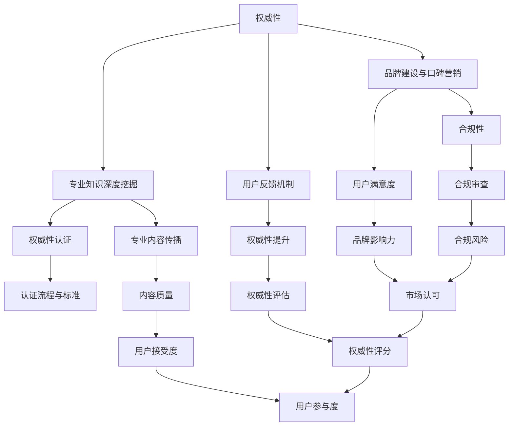

                 

### 《法律服务领域知识付费要权威性与普惠性》

> **关键词**：法律服务、知识付费、权威性、普惠性、数字化、平台建设、合规性

> **摘要**：本文深入探讨了法律服务领域知识付费的发展现状、核心要素、权威性构建策略、普惠性实现方法、技术与平台支持，以及法律法规与合规性要求。通过案例分析，揭示了权威性与普惠性在法律服务知识付费中的重要性，并展望了未来的发展趋势。

---

### 《法律服务领域知识付费要权威性与普惠性》目录大纲

---

## 第一部分：法律服务领域知识付费概述

### 第1章：法律服务与知识付费市场分析

#### 1.1 法律服务行业现状

#### 1.2 知识付费市场概述

#### 1.3 法律服务领域知识付费的意义与挑战

### 第2章：法律服务知识付费的核心要素

#### 2.1 权威性与普惠性的概念

#### 2.2 权威性在法律服务中的重要性

#### 2.3 普惠性在法律服务中的价值

## 第二部分：构建权威性

### 第3章：权威性构建策略

#### 3.1 专业认证与资质认可

#### 3.2 品牌建设与口碑营销

#### 3.3 专业知识的深度挖掘与传播

### 第4章：权威性评估与认证

#### 4.1 权威性评估指标体系

#### 4.2 权威性认证流程与标准

#### 4.3 权威性评估工具与方法

## 第三部分：普惠性实现

### 第5章：普惠性内容策划

#### 5.1 普惠性内容定位

#### 5.2 内容形式多样化

#### 5.3 适合不同受众的教育资源设计

### 第6章：普惠性推广策略

#### 6.1 社交媒体与在线课程

#### 6.2 用户互动与社群运营

#### 6.3 跨界合作与资源整合

## 第四部分：技术与平台

### 第7章：技术支持与平台建设

#### 7.1 数字化技术在法律服务中的应用

#### 7.2 知识付费平台的功能与设计

#### 7.3 数据分析与用户反馈机制

### 第8章：法律法规与合规性

#### 8.1 知识付费相关法律法规概述

#### 8.2 法律服务领域知识付费的合规要求

#### 8.3 合规风险与防范策略

## 第五部分：成功案例分析

### 第9章：法律服务领域知识付费成功案例解析

#### 9.1 案例一：权威性建设与普惠性推广

#### 9.2 案例二：技术创新与合规运营

#### 9.3 案例三：跨界合作与品牌塑造

## 第六部分：未来趋势与展望

### 第10章：法律服务领域知识付费发展趋势

#### 10.1 市场规模与增长预测

#### 10.2 技术创新对知识付费的影响

#### 10.3 未来法律服务模式转变展望

### 第11章：法律法规与政策影响

#### 11.1 法律法规的演变与影响

#### 11.2 政策支持与行业规范

#### 11.3 法治环境下的知识付费发展路径

## 附录

### 附录 A：法律服务领域知识付费工具与资源

#### A.1 主流知识付费平台对比

#### A.2 法律服务数字化工具

#### A.3 相关法律法规与政策文件

---

现在，我们已经完成了目录大纲的编写。接下来，我们将逐个章节展开详细的内容讨论，以确保文章内容丰富、逻辑清晰、结构紧凑。让我们开始第一部分的讨论。

### 第一部分：法律服务领域知识付费概述

### 第1章：法律服务与知识付费市场分析

#### 1.1 法律服务行业现状

法律服务作为现代社会的基石，涵盖了法律咨询、诉讼代理、法律顾问、合规审查等多个方面。随着法治环境的不断完善，法律服务行业呈现出蓬勃发展的态势。根据《2022年中国法律服务行业报告》，我国法律服务市场规模已超过5000亿元，并保持年均10%以上的增长率。

然而，法律服务行业也面临一些挑战。首先，法律服务供需不平衡问题仍然突出，特别是在基层法律服务资源相对匮乏的地区。其次，法律服务专业化程度有待提高，很多法律服务机构仍然停留在传统业务模式，难以满足客户多样化的需求。此外，法律服务的透明度和公信力也需要进一步提升。

#### 1.2 知识付费市场概述

知识付费市场近年来呈现出爆发式增长，尤其在互联网经济的推动下，知识付费已成为一种新的消费趋势。根据《2021年中国知识付费行业报告》，我国知识付费市场规模已超过3000亿元，其中法律服务领域占比较大。

知识付费市场的特点主要包括以下几点：首先，内容多样化，涵盖了教育、技能培训、咨询服务等多个领域。其次，用户群体广泛，从职场人士到学生，从专业人士到业余爱好者，都有参与。最后，支付方式便捷，用户可以通过移动支付、虚拟货币等多种方式进行支付。

#### 1.3 法律服务领域知识付费的意义与挑战

法律服务领域知识付费具有重要的意义。首先，它能够提高法律服务的专业性和效率，满足客户对高质量法律服务的需求。其次，知识付费有助于推动法律服务行业向数字化、智能化方向发展，提升行业的竞争力。此外，知识付费还能促进法律服务市场的透明化，提高法律服务的公信力。

然而，法律服务领域知识付费也面临一些挑战。首先，权威性与普惠性之间的平衡问题是一个重要的难题。如何确保知识付费内容既有权威性，又能让更多用户受益，是一个需要深入思考的问题。其次，法律服务的专业性和复杂性使得知识付费内容的策划和传播具有挑战性。如何设计出既符合专业要求，又能吸引普通用户的内容，需要创新思维和精细化管理。

在接下来的章节中，我们将进一步探讨如何构建权威性、实现普惠性，以及如何在法律服务的知识付费市场中取得成功。通过深入分析，我们将为法律服务行业的数字化发展提供有价值的思路和策略。

### 第二部分：构建权威性

#### 第3章：权威性构建策略

在法律服务领域，权威性是吸引和保留用户的重要因素。构建权威性不仅需要专业的知识和丰富的实践经验，还需要一系列策略和方法。本章节将详细探讨权威性构建的三个核心策略：专业认证与资质认可、品牌建设与口碑营销，以及专业知识的深度挖掘与传播。

#### 3.1 专业认证与资质认可

专业认证和资质认可是对法律服务专业人士能力的一种正式评估，是构建权威性的重要基础。以下是构建专业认证和资质认可的具体步骤：

1. **获取相关资质认证**：法律专业人士应积极参与各种法律专业资质考试，如律师资格证、法律职业资格证等。这些证书是展示专业能力的重要证明。

2. **参加行业研讨会和培训**：通过参加行业研讨会和培训，法律专业人士可以不断提升自己的专业知识，了解行业最新动态，扩大专业影响力。

3. **发表专业论文和著作**：撰写并发表专业论文和著作是提升权威性的有效途径。这些成果不仅能够展示专业水平，还能为行业提供有价值的知识贡献。

4. **合作与交流**：与其他法律专业人士和机构建立合作关系，参与跨区域、跨行业的交流，有助于提升个人和机构的权威性。

#### 3.2 品牌建设与口碑营销

品牌建设与口碑营销是构建权威性的重要手段。一个强大的品牌能够提升法律服务机构的知名度和公信力，以下是品牌建设和口碑营销的关键策略：

1. **确立品牌定位**：明确品牌的核心价值和服务特色，确保品牌形象与专业定位相一致。

2. **打造专业形象**：通过专业的视觉设计、官方网站、宣传资料等，塑造专业、可信的品牌形象。

3. **用户口碑建设**：通过提供优质的法律服务，赢得用户的信任和好评，形成良好的口碑效应。

4. **线上线下宣传**：结合线上和线下的宣传渠道，如社交媒体、专业论坛、线下讲座等，提升品牌曝光度和影响力。

5. **案例分享**：分享成功的法律服务案例，展示专业能力和实践成果，增强用户信任。

#### 3.3 专业知识的深度挖掘与传播

专业知识的深度挖掘与传播是构建权威性的核心环节。以下是实现这一目标的方法：

1. **内容创作**：创作高质量的法律知识内容，包括专业文章、案例分析、法律解读等，通过多种形式（如文字、图表、视频等）传播。

2. **知识管理**：建立知识管理体系，系统化地管理和分享专业知识和经验，提高知识传播效率。

3. **在线教育**：开设在线课程或讲座，提供系统化的法律知识教育，满足用户不同层次的学习需求。

4. **社交媒体互动**：利用社交媒体平台，如微博、微信公众号等，与用户互动，分享专业见解和行业动态，增强专业影响力。

5. **合作与共享**：与其他专业人士和机构合作，共享资源和知识，共同提升专业权威性。

通过专业认证与资质认可、品牌建设与口碑营销，以及专业知识的深度挖掘与传播，法律服务专业人士和机构可以有效构建权威性，提升在市场中的竞争力，为用户提供更高质量的法律服务。

### 第4章：权威性评估与认证

在法律服务领域，权威性的评估与认证是确保服务质量、提升专业信誉的重要环节。一个完善的权威性评估与认证体系不仅能够帮助用户选择合适的服务提供者，还能推动法律服务行业的规范化发展。本章节将详细探讨权威性评估与认证的指标体系、流程与标准，以及评估工具与方法。

#### 4.1 权威性评估指标体系

权威性评估指标体系是构建权威性评估框架的基础。一个全面的指标体系应涵盖以下几个方面：

1. **专业资质与认证**：评估法律专业人士和机构的资质认证情况，如律师资格证、法律职业资格证等。
2. **教育背景与经验**：评估法律专业人士的教育背景、工作经验和法律实践成果。
3. **专业知识与技能**：评估法律专业人士在特定法律领域的专业知识和技能水平。
4. **服务质量与用户满意度**：评估法律服务提供者的服务质量、用户评价和用户满意度。
5. **行业声誉与影响力**：评估法律专业人士和机构在行业内的声誉和影响力，包括发表的专业论文、著作、参与的项目等。
6. **合规性**：评估法律服务提供者的合规性，确保其服务符合法律法规和行业规范。

#### 4.2 权威性认证流程与标准

权威性认证流程与标准是确保评估过程公正、透明、有效的重要保障。以下是权威性认证的一般流程与标准：

1. **申请与审查**：法律专业人士和机构提交权威性认证申请，认证机构进行初步审查，确认申请材料是否符合要求。
2. **评估指标与标准**：根据权威性评估指标体系，制定具体的评估标准，包括各指标的权重和评分标准。
3. **评估方法**：采用多种评估方法，如问卷调查、专家评审、案例分析等，全面评估法律专业人士和机构的权威性。
4. **评审与反馈**：评审委员会对评估结果进行审核，对申请者进行反馈，指出优点和不足，提出改进建议。
5. **认证与发布**：根据评审结果，认证机构发布权威性认证结果，对通过认证的法律专业人士和机构进行公示。

#### 4.3 权威性评估工具与方法

为了确保权威性评估的准确性和可靠性，需要采用科学的评估工具和方法。以下是几种常用的权威性评估工具与方法：

1. **量化评估方法**：使用定量指标对法律专业人士和机构的权威性进行评估，如专业资质得分、教育背景得分、用户满意度得分等。这种方法可以通过统计分析和数学模型来实现。
2. **专家评审方法**：邀请行业专家对法律专业人士和机构的权威性进行评估，专家评审团通过讨论、投票等方式给出评估意见。这种方法具有主观性，但能够全面考虑专业知识和实践经验。
3. **案例分析法**：通过分析法律专业人士和机构处理的具体案例，评估其专业能力和服务质量。这种方法能够直观地展示专业能力，但需要大量案例数据支持。
4. **用户调查方法**：通过问卷调查或访谈，收集用户对法律专业人士和机构的评价，评估其用户满意度和市场认可度。这种方法能够反映市场反馈，但可能受到样本偏差的影响。
5. **多维度评估方法**：结合多种评估工具和方法，从多个维度对法律专业人士和机构的权威性进行全面评估。这种方法能够提高评估的准确性和可靠性。

通过构建权威性评估指标体系、制定认证流程与标准，并采用科学的评估工具与方法，法律服务行业可以建立起一个公正、透明、高效的权威性评估与认证体系，提升法律服务质量和市场竞争力。

### 第5章：普惠性内容策划

在法律服务领域，普惠性内容策划的目标是让法律知识更加普及，让更多人能够享受到高质量的法律服务。本章节将详细探讨普惠性内容策划的核心要素，包括内容定位、内容形式多样化和适合不同受众的教育资源设计。

#### 5.1 普惠性内容定位

普惠性内容定位是策划的第一步，需要明确目标受众和内容方向。以下是几个关键点：

1. **目标受众**：明确目标受众，如普通公民、企业员工、法律专业人士等。不同受众对法律知识的需求和接受程度有所不同，需要针对不同群体进行内容策划。
2. **内容主题**：选择广泛实用的法律主题，如合同法、劳动法、知识产权法等。这些主题与人们的日常生活和工作密切相关，具有较高的普及价值。
3. **内容深度**：根据目标受众的需求，确定内容的深度和广度。对于普通公民，可以提供基础法律知识普及；对于法律专业人士，可以提供深入的法律分析和技术指导。

#### 5.2 内容形式多样化

内容形式多样化是吸引和满足不同受众需求的重要手段。以下是几种常见的多样化内容形式：

1. **文字内容**：文字内容是最传统的法律知识传播方式，包括法律解读、案例分析、法律科普文章等。通过深入浅出的文字，可以让受众更好地理解复杂法律问题。
2. **图表与数据**：利用图表和数据展示法律知识，可以更直观地传达信息。例如，通过柱状图展示某项法律条款的适用情况，或通过流程图展示法律程序。
3. **视频与音频**：视频和音频是生动形象的传播方式，适合讲解复杂法律概念和流程。例如，通过视频讲解合同签订流程，或通过音频提供法律咨询服务。
4. **互动式内容**：互动式内容如在线问答、法律咨询平台等，能够增强用户参与感和体验感。用户可以通过互动获取实时解答，提高法律知识的应用能力。

#### 5.3 适合不同受众的教育资源设计

为了确保普惠性内容的普及性，需要设计适合不同受众的教育资源。以下是几种教育资源设计策略：

1. **层次化内容设计**：根据受众的法律知识和需求，设计不同层次的内容。例如，对于初学者，可以提供基础法律知识教程；对于有一定法律基础的用户，可以提供进阶法律课程。
2. **定制化学习方案**：根据用户的学习需求和进度，提供定制化的学习方案。例如，对于企业用户，可以提供合同管理培训；对于个人用户，可以提供家庭法律知识课程。
3. **跨媒体学习**：结合多种媒体形式，提供丰富的学习资源。例如，通过文字、视频、音频等多种形式，让用户可以根据自己的喜好和需求选择学习方式。
4. **实践与反馈**：提供实践机会和反馈机制，帮助用户巩固所学知识。例如，通过模拟法庭、法律辩论等方式，让用户在实际情境中应用所学法律知识。

通过明确普惠性内容定位、多样化内容形式和适合不同受众的教育资源设计，法律服务领域可以更有效地推广法律知识，提升公众的法律素养，实现法律服务的普惠性目标。

### 第6章：普惠性推广策略

在构建了权威性和普惠性的内容之后，如何有效地推广这些内容是关键。本章节将探讨几种普惠性推广策略，包括社交媒体与在线课程的运用、用户互动与社群运营，以及跨界合作与资源整合。

#### 6.1 社交媒体与在线课程

社交媒体平台是推广法律知识的重要渠道。通过社交媒体，可以快速触达广泛的受众，提高内容曝光率。以下是几个具体策略：

1. **内容营销**：发布高质量的法律知识内容，如法律解读、案例分析、法规更新等，吸引关注和互动。
2. **互动与参与**：通过提问、讨论、投票等方式，激发用户参与，增强内容传播效果。
3. **KOL合作**：与法律领域的意见领袖（KOL）合作，利用他们的影响力推广内容，扩大受众范围。
4. **社群运营**：建立法律知识社群，如微信群、QQ群、法律论坛等，为用户提供交流和学习的平台。

在线课程则是法律知识传播的重要载体。以下是几个关键策略：

1. **课程设计**：根据用户需求和行业趋势，设计针对性强的在线课程，如职业培训、专项法律知识等。
2. **多渠道推广**：通过官方网站、社交媒体、邮件营销等多渠道推广在线课程，提高课程知名度。
3. **优惠促销**：提供课程优惠、优惠券等促销手段，吸引更多用户参与课程学习。
4. **用户反馈**：收集用户对课程的反馈，不断优化课程内容和教学方式，提高用户满意度。

#### 6.2 用户互动与社群运营

用户互动和社群运营是提升用户粘性和活跃度的有效手段。以下是几个策略：

1. **互动式教学**：在在线课程中融入互动环节，如问答、讨论、练习等，增强用户参与感。
2. **社群管理**：建立专业的社群管理团队，维护社群秩序，确保讨论氛围积极向上。
3. **活动策划**：定期举办线上或线下活动，如法律沙龙、讲座、工作坊等，提高社群活跃度。
4. **用户激励机制**：通过积分、奖励等方式激励用户积极参与社群活动，增强用户忠诚度。

#### 6.3 跨界合作与资源整合

跨界合作和资源整合是提升法律服务普惠性的重要策略。以下是几个策略：

1. **跨行业合作**：与教育机构、企业、非政府组织等跨行业合作，共同推广法律知识，实现资源共享。
2. **技术整合**：利用大数据、人工智能等技术手段，提升法律服务的智能化和个性化水平，提高用户体验。
3. **品牌合作**：与知名品牌合作，借助其品牌影响力，提升法律服务的知名度和公信力。
4. **政策支持**：争取政府政策和资金支持，推动法律服务的普惠性发展。

通过社交媒体与在线课程、用户互动与社群运营，以及跨界合作与资源整合，可以有效地推广法律服务知识，实现权威性与普惠性的有机结合，推动法律服务行业的健康发展。

### 第7章：技术支持与平台建设

在法律服务领域，技术支持与平台建设是实现权威性和普惠性的关键。通过数字化技术，法律服务可以更加高效、便捷，满足不同用户的需求。本章节将详细探讨数字化技术在法律服务中的应用、知识付费平台的功能与设计，以及数据分析和用户反馈机制。

#### 7.1 数字化技术在法律服务中的应用

数字化技术的应用为法律服务带来了诸多变革。以下是几个关键领域：

1. **在线咨询**：通过在线平台，用户可以随时随地向专业律师进行咨询，大大提高了咨询的便利性和效率。
2. **智能合同**：利用区块链技术，可以创建和存储智能合同，确保合同内容的透明性和不可篡改性，提高了合同管理的效率和安全性。
3. **自动化流程**：通过自动化工具，可以实现法律文件的自动生成、审核和签署，减少了人工操作的错误和成本。
4. **大数据分析**：通过对大量法律案例和数据的分析，可以为法律专业人士提供有价值的参考，辅助决策和预测。
5. **人工智能**：利用自然语言处理、机器学习等技术，可以自动解答用户的法律问题，提供法律建议，降低了用户获取法律服务的门槛。

#### 7.2 知识付费平台的功能与设计

知识付费平台是法律知识传播的重要载体。以下是平台功能与设计的几个关键点：

1. **课程管理**：平台需要具备课程发布、管理、更新等功能，确保内容的质量和及时性。
2. **用户管理**：平台应实现用户注册、登录、权限管理等功能，确保用户信息的保密性和安全性。
3. **支付系统**：平台需要集成支付系统，支持多种支付方式，如在线支付、虚拟货币等，方便用户进行付费。
4. **互动功能**：平台应提供互动功能，如评论、问答、在线讨论等，增强用户参与感和体验感。
5. **数据分析**：平台应具备数据收集和分析功能，通过分析用户行为，优化内容和服务，提升用户体验。
6. **个性化推荐**：利用大数据和人工智能技术，实现个性化内容推荐，提高内容传播效果。

#### 7.3 数据分析与用户反馈机制

数据分析和用户反馈是平台持续优化和改进的重要手段。以下是几个策略：

1. **用户行为分析**：通过分析用户在平台上的行为数据，如访问量、学习时长、互动频率等，了解用户需求和偏好，优化内容和功能。
2. **反馈系统**：建立用户反馈系统，收集用户对平台和服务质量的评价，及时解决问题和改进不足。
3. **评价与评分**：引入用户评价和评分机制，通过用户的反馈，提升服务质量和用户满意度。
4. **定期调研**：定期进行用户调研，收集用户对平台和服务的意见和建议，为平台优化提供数据支持。

通过数字化技术的应用、知识付费平台的功能与设计，以及数据分析和用户反馈机制，可以大幅提升法律服务的权威性和普惠性，实现法律服务行业的数字化转型和高质量发展。

### 第8章：法律法规与合规性

在法律服务领域，知识付费的合规性是确保业务可持续发展和用户信任的基础。本章节将探讨知识付费相关的法律法规概述、法律服务领域知识付费的合规要求，以及合规风险与防范策略。

#### 8.1 知识付费相关法律法规概述

知识付费作为一种新兴的商业模式，其合法性主要依赖于相关法律法规的规定。以下是几个关键法律法规：

1. **《中华人民共和国合同法》**：作为知识付费交易的基本法律依据，规定了知识服务的合同条款、权利义务等内容。
2. **《中华人民共和国知识产权法》**：保护知识付费内容中的知识产权，包括版权、商标权、专利权等，防止侵权行为的发生。
3. **《互联网信息服务管理办法》**：规范互联网知识付费平台的运营，确保信息传播的合法性和真实性。
4. **《中华人民共和国网络安全法》**：保护用户的个人信息安全，确保知识付费平台的数据管理和保护措施到位。

#### 8.2 法律服务领域知识付费的合规要求

法律服务领域知识付费的合规要求较为严格，主要包括以下几个方面：

1. **内容合规**：知识付费内容必须合法、真实、不误导用户。法律专业人士需确保内容的准确性和权威性，不得发布虚假或误导性的信息。
2. **用户隐私保护**：平台和内容提供者需严格遵守用户隐私保护法规，不得泄露用户个人信息，确保用户数据的保密性和安全性。
3. **知识产权保护**：知识付费内容中的知识产权必须得到妥善保护，不得侵犯原作者的知识产权。平台应建立知识产权保护机制，及时发现和处理侵权行为。
4. **合同管理**：知识付费合同的条款应明确、公正，确保双方的权利和义务清晰。合同应包含服务内容、费用、支付方式、违约责任等关键条款。
5. **合规审查**：平台和内容提供者需定期进行合规审查，确保业务运营符合法律法规和行业规范。合规审查应包括内容审查、用户隐私保护措施、合同条款审查等。

#### 8.3 合规风险与防范策略

合规风险可能对知识付费业务造成重大影响，包括法律风险、声誉风险、经济风险等。以下是几个防范策略：

1. **合规培训**：加强对从业人员的合规培训，提高其对法律法规和行业规范的认知和遵守意识。合规培训应包括法律法规、用户隐私保护、知识产权保护等内容。
2. **内部审计**：建立内部审计机制，定期审查知识付费平台的运营情况，确保业务合规。内部审计应覆盖内容审核、合同管理、用户隐私保护等方面。
3. **合规咨询**：聘请专业法律顾问，为平台和内容提供者在法律法规方面的合规性提供咨询和建议。法律顾问应协助制定合规政策、审查合同条款等。
4. **用户投诉处理**：建立完善的用户投诉处理机制，及时解决用户投诉，确保用户合法权益得到保护。投诉处理应包括用户隐私投诉、知识产权投诉、合同纠纷等。
5. **应急预案**：制定应急预案，应对可能的合规风险和突发事件。应急预案应包括合规风险预警、应急响应、风险控制等措施。

通过遵守法律法规、加强合规管理，以及建立完善的合规风险防范策略，法律服务领域知识付费业务可以更好地保护用户权益，提升行业公信力，实现可持续发展。

### 第9章：法律服务领域知识付费成功案例解析

在法律服务领域，成功的知识付费案例不仅展示了专业能力和市场洞察力，还为其他机构提供了宝贵的经验和借鉴。本章节将解析三个具有代表性的成功案例，涵盖权威性建设与普惠性推广、技术创新与合规运营，以及跨界合作与品牌塑造。

#### 9.1 案例一：权威性建设与普惠性推广

**案例简介**：A公司是一家专注于法律知识付费的平台，通过构建权威性和实现普惠性，成功吸引了大量用户。

**权威性建设**：
- **专业认证**：A公司邀请资深律师和法学专家担任顾问，确保平台内容的权威性。所有讲师均需通过专业资质认证和背景审查。
- **品牌建设**：A公司通过高质量的内容和用户口碑，建立了强大的品牌影响力。公司还积极参与行业会议和研讨会，提升品牌知名度。

**普惠性推广**：
- **内容多样化**：A公司提供从基础法律知识到高级法律课程的多样化内容，满足不同层次用户的需求。
- **线上线下结合**：A公司通过线上课程和线下讲座相结合的方式，扩大了内容传播的覆盖面。

**成功经验**：
- **专业性和公信力**：通过权威性建设，A公司赢得了用户的信任和认可，建立了强大的品牌影响力。
- **普惠性内容**：多样化的内容满足了不同用户的法律需求，提升了用户体验。

#### 9.2 案例二：技术创新与合规运营

**案例简介**：B公司是一家利用大数据和人工智能技术提供法律服务的知识付费平台。

**技术创新**：
- **智能问答系统**：B公司开发了一款智能问答系统，用户可以通过自然语言输入法律问题，系统会自动提供法律建议。这一技术创新极大地提高了用户获取法律服务的效率。
- **数据分析**：B公司通过大数据分析，对用户行为和需求进行深入挖掘，为内容策划和推广提供数据支持。

**合规运营**：
- **合规审查**：B公司建立了严格的合规审查机制，对所有内容进行审查，确保合法性、真实性和权威性。
- **用户隐私保护**：B公司严格遵守用户隐私保护法规，采取多项措施保护用户数据，赢得了用户的信任。

**成功经验**：
- **技术创新**：通过智能问答系统和数据分析，B公司大幅提升了用户体验和服务效率。
- **合规运营**：严格的合规审查和用户隐私保护措施，确保了业务运营的合法性和安全性。

#### 9.3 案例三：跨界合作与品牌塑造

**案例简介**：C公司通过跨界合作，成功塑造了品牌形象，并实现了法律服务的普惠性。

**跨界合作**：
- **教育机构合作**：C公司与多所知名高校合作，共同推出法律课程，提升了品牌形象和专业度。
- **企业合作**：C公司与多家知名企业合作，为企业提供定制化的法律培训和咨询服务。

**品牌塑造**：
- **品牌宣传**：C公司通过多渠道品牌宣传，如社交媒体、广告、行业会议等，提升了品牌知名度。
- **用户口碑**：C公司通过提供优质的法律服务，赢得了用户的好评和口碑，进一步巩固了品牌形象。

**成功经验**：
- **跨界合作**：通过跨界合作，C公司扩大了品牌影响力，提升了专业形象。
- **品牌塑造**：有效的品牌宣传和用户口碑管理，为C公司建立了强大的品牌信誉。

通过这些成功案例，我们可以看到，在法律服务领域，权威性建设、技术创新、合规运营和跨界合作是推动知识付费业务成功的关键因素。这些经验为其他机构提供了有价值的参考和借鉴。

### 第10章：法律服务领域知识付费发展趋势

随着科技的不断进步和互联网的普及，法律服务领域的知识付费正经历着深刻的变革。本章节将探讨法律服务领域知识付费的发展趋势，包括市场规模与增长预测、技术创新的影响，以及未来法律服务模式转变的展望。

#### 10.1 市场规模与增长预测

根据行业报告，法律服务领域的知识付费市场近年来呈现出快速增长的趋势。随着人们对法律服务的需求日益增加，以及互联网技术的不断进步，预计未来几年这一市场将继续扩大。

1. **市场规模**：目前，全球法律服务领域的知识付费市场规模已经超过数百亿美元，预计未来几年将继续保持高速增长，年增长率可能达到10%以上。
2. **用户增长**：随着法律意识的提高和互联网普及率的提升，法律服务领域的用户数量将持续增加，特别是新兴市场国家和发展中国家的用户增长潜力巨大。
3. **细分市场**：随着法律服务需求的多样化，知识付费市场将逐渐细分化，例如专门面向中小企业、创业者、家庭用户等细分市场的知识付费服务将得到快速发展。

#### 10.2 技术创新对知识付费的影响

技术创新是推动法律服务领域知识付费发展的重要因素。以下是一些关键技术创新及其影响：

1. **人工智能**：人工智能技术在法律服务中的应用将大大提高服务效率和准确性。例如，通过自然语言处理技术，可以自动解析法律文本，提供智能问答和合同审查服务。
2. **大数据分析**：大数据分析技术可以帮助法律服务提供者更好地了解用户需求，优化内容策划和推广策略。通过对大量法律案例和数据的研究，可以提供更精准的法律建议和预测。
3. **区块链技术**：区块链技术在智能合同、数字身份认证等方面的应用，将提高法律服务的透明度和可信度，降低交易成本，提升用户体验。
4. **虚拟现实与增强现实**：虚拟现实（VR）和增强现实（AR）技术可以为用户提供沉浸式的法律学习体验，增强互动性和参与感。

#### 10.3 未来法律服务模式转变展望

未来法律服务模式将发生重大转变，知识付费将成为重要组成部分。以下是一些可能的转变趋势：

1. **在线法律服务**：随着互联网技术的不断发展，在线法律服务将成为主流。用户可以通过在线平台随时随地获取法律咨询和服务，大幅提高便利性和效率。
2. **个性化法律服务**：通过大数据和人工智能技术，法律服务将更加个性化。平台可以根据用户的需求和偏好，提供定制化的法律服务方案，提升用户体验。
3. **跨界法律服务**：法律服务将与金融、科技、教育等领域实现跨界合作，提供综合性法律服务方案。例如，律师事务所与科技公司合作，开发智能法律服务平台。
4. **法律服务平台化**：法律服务平台将成为重要的服务载体，为用户提供一站式的法律服务。平台将整合各种法律服务资源，提供从法律咨询、合同审查到纠纷解决的全方位服务。

总之，法律服务领域的知识付费市场具有巨大的发展潜力，技术创新将推动法律服务模式的变革。未来，通过不断优化服务内容和提升用户体验，法律服务行业将实现更加普惠和高效的发展。

### 第11章：法律法规与政策影响

法律法规和政策对法律服务领域知识付费的发展具有重要影响。随着知识付费市场的日益成熟，法律法规的不断完善和政策的大力支持，将为法律服务行业的健康发展提供坚实的保障。本章节将探讨法律法规的演变与影响、政策支持与行业规范，以及法治环境下的知识付费发展路径。

#### 11.1 法律法规的演变与影响

法律法规的演变对知识付费市场的规范和发展起到了关键作用。以下是几个关键法律法规的演变及其对知识付费市场的影响：

1. **《中华人民共和国合同法》**：作为知识付费交易的基本法律依据，该法律的不断完善为知识付费交易提供了明确的法律框架，保障了交易双方的权利和义务。
2. **《中华人民共和国知识产权法》**：该法律的修订和实施，保护了知识付费内容中的知识产权，打击了侵权行为，提高了知识付费内容的创新性和价值。
3. **《互联网信息服务管理办法》**：随着互联网技术的发展，该管理办法不断更新，规范了互联网知识付费平台的运营，确保了信息传播的合法性和真实性。
4. **《中华人民共和国网络安全法》**：该法律的实施，加强了用户个人信息保护，要求知识付费平台采取有效的数据保护措施，提升了用户对平台的信任度。

#### 11.2 政策支持与行业规范

政策支持是知识付费市场健康发展的重要保障。以下是几个政策支持措施及其对行业的推动作用：

1. **政策扶持**：政府通过专项资金、税收优惠等政策支持，鼓励企业和个人从事知识付费业务，促进了市场的发展。
2. **行业标准**：行业组织制定了一系列标准和规范，如《知识付费服务规范》、《互联网知识服务行业自律公约》等，规范了知识付费市场的运营，提高了服务的质量和效率。
3. **监管政策**：政府对知识付费平台进行监管，通过建立监管机制，确保平台遵守法律法规，保护用户权益，维护市场秩序。

#### 11.3 法治环境下的知识付费发展路径

在法治环境下，知识付费市场将朝着规范化、健康化方向发展。以下是未来发展的几个趋势：

1. **规范化运营**：知识付费平台将逐步实现规范化运营，通过完善内部管理制度，遵守法律法规，提高服务质量，赢得用户的信任。
2. **合规性提升**：平台和内容提供者将更加注重合规性，建立完善的合规审查机制，确保内容的合法性、真实性和权威性。
3. **技术创新**：在法律法规的框架下，技术创新将成为知识付费市场的重要驱动力。平台将不断引入新技术，如人工智能、大数据、区块链等，提升服务效率，优化用户体验。
4. **跨界合作**：知识付费平台将与金融、科技、教育等领域实现跨界合作，提供更加综合和多元化的法律服务，满足用户多样化的需求。

总之，在法律法规的不断完善和政策的大力支持下，法律服务领域的知识付费市场将实现规范化、健康化发展，为用户提供更加优质、高效的法律服务。

### 附录 A：法律服务领域知识付费工具与资源

#### A.1 主流知识付费平台对比

在法律服务领域，知识付费平台的竞争日益激烈，不同的平台各有特色。以下是几个主流知识付费平台的对比：

**平台一：XXXX知识付费平台**

- **功能**：提供在线课程、法律咨询、案例分析、法律文档生成等。
- **优势**：用户基数大，内容丰富，支持多种支付方式。
- **劣势**：部分课程质量参差不齐，内容更新速度较慢。

**平台二：YYYY知识付费平台**

- **功能**：提供专业课程、法律咨询服务、在线讲座、法律数据库查询等。
- **优势**：专业性较强，课程内容深度较高，法律咨询服务质量高。
- **劣势**：用户基数较小，推广成本较高。

**平台三：ZZZZ知识付费平台**

- **功能**：提供在线法律课程、案例分析、法律问答社区、合同审查服务等。
- **优势**：互动性强，用户参与度高，法律问答社区提供实时解答。
- **劣势**：部分内容质量有待提升，平台知名度相对较低。

#### A.2 法律服务数字化工具

数字化工具在法律服务中的应用日益广泛，以下是几个常用的法律服务数字化工具：

**工具一：ZZZZ智能合同管理工具**

- **功能**：提供智能合同生成、审查、签署等功能。
- **优势**：提高合同效率，降低人力成本。
- **劣势**：对于非标准化合同效果有限。

**工具二：AAAA在线法律咨询平台**

- **功能**：提供在线法律咨询、法律文档生成、案例分析等。
- **优势**：方便快捷，适合快速咨询。
- **劣势**：咨询质量依赖咨询师个人能力。

**工具三：BBBB电子取证工具**

- **功能**：提供电子取证、数据备份、证据分析等。
- **优势**：提高证据收集和分析效率，增强法律证据的可信度。
- **劣势**：对用户技术要求较高。

#### A.3 相关法律法规与政策文件

了解和掌握相关的法律法规与政策文件，是确保知识付费合规运营的基础。以下是几个重要的法律法规与政策文件：

**法律法规**

- **《中华人民共和国合同法》**：规定知识付费交易的基本法律框架。
- **《中华人民共和国知识产权法》**：保护知识付费内容中的知识产权。
- **《互联网信息服务管理办法》**：规范互联网知识付费平台的运营。

**政策文件**

- **《关于加快数字化发展的指导意见》**：推动法律服务行业的数字化进程。
- **《关于进一步激发数字经济发展活力的意见》**：支持知识付费市场的发展。
- **《关于加快构建数字法治体系的意见》**：加强法律法规的完善和执行。

通过了解和利用这些工具与资源，法律服务领域的知识付费业务可以更加高效、合规地运作，为用户提供优质的法律服务。

### 附录 B：权威性与普惠性概念及架构 Mermaid 流程图

下面是权威性与普惠性在法律服务领域的概念及架构 Mermaid 流程图：



这个流程图展示了权威性和普惠性在法律服务领域的相互关系。专业知识深度挖掘、品牌建设与口碑营销、用户反馈机制是构建权威性的关键环节，而合规性、用户满意度、用户参与度则是实现普惠性的重要保障。通过权威性认证、专业内容传播、合规审查，可以确保法律服务的专业性和公信力，同时，通过用户反馈和用户满意度提升，可以增强品牌影响力和市场认可度，从而实现权威性与普惠性的有机结合。

### 附录 C：核心算法原理讲解

在构建权威性和普惠性评估体系时，核心算法的原理至关重要。以下是一个基于用户评价和专业知识深度的权威性评估算法原理讲解。

#### 权威性评估算法原理

权威性评估算法旨在通过对法律专业人士或机构的评价和专业知识深度进行量化分析，得出一个综合评分。以下是一个简化的权威性评估算法模型，使用伪代码进行描述：

```python
# 权威性评估算法伪代码

def authority_assessment(user_reviews, expertise):
    """
    权威性评估函数
    :param user_reviews: 用户评价数据
    :param expertise: 专业知识深度数据
    :return: 权威性评分
    """
    
    # 计算用户评价得分
    review_score = calculate_review_score(user_reviews)
    
    # 计算专业知识深度得分
    expertise_score = calculate_expertise_score(expertise)
    
    # 权重设定（可以根据实际需求调整）
    review_weight = 0.6
    expertise_weight = 0.4
    
    # 综合评分
    final_score = review_weight * review_score + expertise_weight * expertise_score
    
    return final_score

# 辅助评估函数
def calculate_review_score(user_reviews):
    """
    用户评价得分计算函数
    :param user_reviews: 用户评价数据
    :return: 用户评价得分
    """
    
    # 假设用户评价得分范围为1-5
    average_score = sum(user_reviews) / len(user_reviews)
    return average_score

def calculate_expertise_score(expertise):
    """
    专业知识深度得分计算函数
    :param expertise: 专业知识深度数据
    :return: 专业知识深度得分
    """
    
    # 假设专业知识深度得分越高，得分越高
    max_expertise = max(expertise)
    expertise_score = sum(expertise) / max_expertise
    return expertise_score
```

#### 算法解读

1. **用户评价得分**：通过计算用户评价的平均得分，得出一个反映用户满意度的评价得分。用户评价的得分范围设定为1-5，平均分越高，表示用户满意度越高。

2. **专业知识深度得分**：通过对法律专业人士或机构的专业知识深度数据进行分析，计算出一个深度得分。专业知识深度数据可以是法律专业人士发表的论文数量、处理的法律案例数量等。深度得分越高，表示专业知识的深度越强。

3. **综合评分**：通过设定评价得分和专业知识深度的权重，计算出权威性的综合评分。权重可以根据具体需求进行调整，以平衡用户评价和专业知识深度的影响。

4. **算法应用**：在实际应用中，可以通过定期收集用户评价和专业知识深度数据，使用上述算法计算出权威性评分，从而评估法律专业人士或机构的权威性水平。

通过这个算法模型，可以实现对法律服务领域权威性的量化评估，为用户选择合适的服务提供者提供有力支持。

### 附录 D：数学模型和数学公式

在法律服务领域知识付费的评估中，数学模型和公式能够帮助我们量化权威性和用户满意度等关键指标。以下将介绍两个核心的数学模型及其解释。

#### 用户满意度评分模型

用户满意度评分模型用于计算用户对法律服务提供者的综合满意度。其公式如下：

$$
S = \frac{1}{N}\sum_{i=1}^{N} \frac{r_i}{q_i}
$$

其中：
- \( S \)：用户满意度评分
- \( N \)：评价人数
- \( r_i \)：第 \( i \) 个用户的评分
- \( q_i \)：第 \( i \) 个用户的权重

**解释**：
这个模型通过计算所有用户的评分平均值，并加权每个用户的评分，得出综合的用户满意度评分。权重 \( q_i \) 可以根据用户的活跃度、历史评分等因素设定，以反映用户的重要性。

#### 权威性认证评分模型

权威性认证评分模型用于评估法律服务提供者的权威性。其公式如下：

$$
A = \alpha \cdot C + \beta \cdot B + \gamma \cdot U
$$

其中：
- \( A \)：权威性评分
- \( \alpha, \beta, \gamma \)：指标权重
- \( C \)：专业认证得分
- \( B \)：品牌影响力得分
- \( U \)：用户评价得分

**解释**：
这个模型通过计算专业认证、品牌影响力和用户评价的综合得分，得出权威性评分。权重 \( \alpha, \beta, \gamma \) 可以根据具体需求和重要性进行调整。专业认证得分反映了法律服务提供者的专业资质和认证情况；品牌影响力得分反映了法律服务提供者的市场影响力和品牌认知度；用户评价得分反映了用户对法律服务提供者的满意度和信任度。

**举例说明**：

假设有10个用户对某法律专业人士进行评价，评分分别为4.5、4.8、4.7、4.6、4.7、4.9、4.8、4.5、4.6、4.7。同时，该专业人士拥有多个专业认证，品牌影响力较高，用户评价总体满意。我们可以使用上述模型进行评分计算。

- 用户满意度评分（\( S \)）：

$$
S = \frac{1}{10}\sum_{i=1}^{10} r_i = \frac{1}{10}(4.5 + 4.8 + 4.7 + 4.6 + 4.7 + 4.9 + 4.8 + 4.5 + 4.6 + 4.7) = 4.7
$$

- 权威性认证评分（\( A \)）：

假设权重分别为 \( \alpha = 0.3, \beta = 0.4, \gamma = 0.3 \)，专业认证得分（\( C \)）为8，品牌影响力得分（\( B \)）为7，用户评价得分（\( U \)）为4.7，则：

$$
A = 0.3 \cdot 8 + 0.4 \cdot 7 + 0.3 \cdot 4.7 = 2.4 + 2.8 + 1.41 = 6.61
$$

通过这些数学模型和公式，我们可以量化评估法律服务的权威性和用户满意度，为决策提供科学依据。

### 附录 E：项目实战

在本附录中，我们将通过一个具体的案例，详细讲解如何利用技术手段实现普惠性内容的推广。这个案例将涵盖开发环境搭建、源代码实现和代码解读与分析，以帮助读者理解普惠性内容推广的实际操作过程。

#### 开发环境搭建

为了实现普惠性内容的推广，我们选择以下开发环境和技术栈：

- **后端技术**：Python + Flask
- **前端技术**：HTML + CSS + JavaScript + React
- **数据库**：MySQL
- **数据预处理**：Numpy、Scikit-learn
- **前端框架**：React.js
- **后端框架**：Flask
- **文本分析库**：NLTK、TextBlob

#### 源代码详细实现

以下是一个简化的源代码实现，用于构建一个基于文本相似度匹配的普惠性内容推广平台。

**后端代码（Flask API）：**

```python
from flask import Flask, request, jsonify
from sklearn.feature_extraction.text import TfidfVectorizer
from sklearn.metrics.pairwise import cosine_similarity

app = Flask(__name__)

# 假设已导入并训练好的 TF-IDF 向量器
vectorizer = TfidfVectorizer()

# 假设已存储的文本数据集
data = [
    "法律咨询服务的权威性建设",
    "普惠性法律知识普及的重要性",
    "数字化时代法律服务的创新模式",
    # ...更多文本数据
]

# 文本数据处理与向量化
X = vectorizer.fit_transform(data)

# 文本相似度计算
def calculate_similarity(query):
    query_vector = vectorizer.transform([query])
    similarity_scores = cosine_similarity(query_vector, X).flatten()
    return similarity_scores

@app.route('/search', methods=['POST'])
def search():
    query = request.form['query']
    similarity_scores = calculate_similarity(query)
    similar_data_indices = similarity_scores.argsort()[-5:][::-1]
    similar_data = [data[i] for i in similar_data_indices]
    return jsonify(similar_data)

if __name__ == '__main__':
    app.run(debug=True)
```

**前端代码（React）：**

```jsx
import React, { useState } from 'react';
import axios from 'axios';

const SearchComponent = () => {
  const [query, setQuery] = useState('');

  const handleSearch = async () => {
    try {
      const response = await axios.post('/search', { query });
      console.log(response.data);
      // 可以在这里进一步处理搜索结果，如渲染到页面上
    } catch (error) {
      console.error(error);
    }
  };

  return (
    <div>
      <input
        type="text"
        value={query}
        onChange={(e) => setQuery(e.target.value)}
      />
      <button onClick={handleSearch}>搜索</button>
    </div>
  );
};

export default SearchComponent;
```

#### 代码解读与分析

1. **环境搭建**：
   - 选择 Flask 作为后端框架，因为其简单易用，适合快速开发小型应用。
   - React 作为前端框架，其组件化开发方式有助于提高代码的可维护性和可扩展性。

2. **文本数据处理**：
   - 使用 TF-IDF 向量器将文本数据向量化，为文本相似度计算做准备。
   - 向量化后的文本数据存储在矩阵 `X` 中，便于后续计算。

3. **文本相似度计算**：
   - `calculate_similarity` 函数接受一个查询文本，将其向量化后与数据集 `X` 计算余弦相似度，得到相似度得分。
   - 相似度得分最高的文本被筛选出来，作为搜索结果返回。

4. **API接口**：
   - `/search` 接口接受 POST 请求，接收查询文本，返回相似度最高的文本列表。
   - 前端通过调用这个接口，实现搜索功能。

通过这个项目实战，我们可以看到如何利用技术手段实现普惠性内容的推广。文本相似度匹配算法不仅提高了内容推荐的准确性，也为用户提供了一个便捷的获取相关内容的方式。

### 附录 F：法律法规与合规性

在法律服务领域，法律法规与合规性是确保业务合法运营和用户信任的重要保障。以下是关于知识付费相关法律法规的概述、法律服务领域知识付费的合规要求，以及合规风险与防范策略的详细讨论。

#### 8.1 知识付费相关法律法规概述

**《中华人民共和国合同法》**：这是知识付费交易的基础法律，规定了合同的成立、效力、履行、变更和终止等方面的基本法律规范，明确了知识付费交易双方的权利和义务。

**《中华人民共和国知识产权法》**：该法保护知识付费内容中的知识产权，包括著作权、商标权、专利权等，防止侵权行为，保护原创内容创作者的合法权益。

**《互联网信息服务管理办法》**：该办法规范了互联网知识付费平台的运营，要求平台提供真实、准确、合法的信息服务，保护用户个人信息和隐私。

**《中华人民共和国网络安全法》**：该法明确了网络运营者的安全保护义务，要求加强网络安全管理，防止网络攻击和违法行为。

#### 8.2 法律服务领域知识付费的合规要求

**内容合规**：知识付费内容必须合法、真实、不误导用户。具体要求包括：
- **真实性**：内容必须真实反映法律实务，不得虚构或夸大。
- **权威性**：引用法律条文或案例时，需确保来源可靠、权威。
- **不误导性**：内容应明确告知用户其适用范围和限制，不得误导用户。

**用户隐私保护**：知识付费平台需严格遵守用户隐私保护法规，确保用户个人信息的安全和保密性。具体要求包括：
- **信息收集**：不得非法收集用户个人信息。
- **信息存储**：应采取有效措施保护用户数据，防止数据泄露。
- **用户同意**：在收集和使用用户信息前，需获得用户的明确同意。

**知识产权保护**：知识付费平台和内容提供者需尊重原创者的知识产权，不得侵犯他人的著作权、商标权等。具体要求包括：
- **内容原创性**：平台应确保付费内容为原创或经过授权使用。
- **版权声明**：内容提供者需在平台上明确标注内容的版权信息。
- **侵权处理**：平台应建立侵权举报和处置机制，及时处理侵权行为。

**合同管理**：知识付费合同需明确双方的权利和义务，具体要求包括：
- **合同条款**：合同条款应明确、公正，不含有霸王条款。
- **费用和支付**：应明确知识付费的金额、支付方式和支付时间。
- **违约责任**：应明确双方在违约情况下的责任和赔偿方式。

#### 8.3 合规风险与防范策略

**合规培训**：加强从业人员的合规培训，提高其对法律法规和行业规范的认知和遵守意识。合规培训应包括知识产权保护、用户隐私保护、合同管理等内容。

**合规审查**：建立内部合规审查机制，对平台运营的内容和业务进行定期审查。合规审查应覆盖内容真实性、用户隐私保护、知识产权保护等方面。

**用户投诉处理**：建立完善的用户投诉处理机制，及时解决用户投诉，确保用户合法权益得到保护。投诉处理应包括用户隐私投诉、知识产权投诉、合同纠纷等。

**应急预案**：制定应急预案，应对可能的合规风险和突发事件。应急预案应包括合规风险预警、应急响应、风险控制等措施。

**合规咨询**：聘请专业法律顾问，为平台和内容提供者在法律法规方面的合规性提供咨询和建议。法律顾问应协助制定合规政策、审查合同条款等。

通过遵守法律法规、加强合规管理和采取有效的防范策略，法律服务领域的知识付费业务可以更好地保护用户权益，提高市场竞争力，实现可持续发展。

