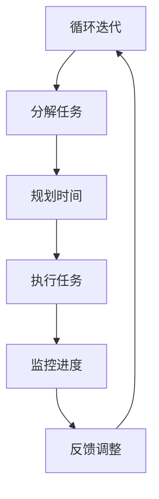

                 

## 文章标题

注意力管理与自我管理策略：通过专注力增强个人和职业成功

> **关键词**：注意力管理、自我管理、专注力、个人效率、心理健康、职业成功

> **摘要**：本文将深入探讨注意力管理和自我管理策略的重要性，以及它们如何通过提升专注力来增强个人和职业成功。通过详细分析注意力管理的基础概念、自我管理策略、注意力增强方法，以及注意力管理在职场和心理健康中的实际应用，本文旨在为读者提供实用的指导，帮助他们在生活和工作中实现更高水平的专注力和自我管理能力。

---

### 引言

在当今信息爆炸、竞争激烈的时代，专注力和自我管理成为个人和职业成功的关键因素。注意力管理，作为一种高效的方法，可以帮助我们集中精力，提高工作效率，同时维护心理健康。自我管理则是一种综合能力，它包括时间管理、情绪调节、自我激励等多个方面，对于实现个人和职业目标至关重要。

本文旨在系统地探讨注意力管理和自我管理策略，帮助读者理解其核心概念，掌握实用的方法，并将其应用于实际生活和工作中。文章将分为以下几个部分：

1. **注意力管理基础**：介绍注意力的基本概念、分类及其作用，分析注意力管理的重要性、基本原理和常见误区。
2. **自我管理策略**：探讨自我管理的定义、意义、自我认知的发展、自我调节策略以及时间管理与任务规划。
3. **注意力增强的方法**：讨论认知训练、习惯养成、环境优化和技术辅助在注意力管理中的作用。
4. **注意力管理与心理健康**：分析注意力管理对心理健康的影响，探讨心理健康与注意力管理的互动以及心理调适与自我管理的结合。
5. **注意力管理在职场中的应用**：探讨职场中的注意力管理挑战、团队协作与注意力管理、领导力与注意力管理。
6. **注意力管理策略在企业中的应用**：分析企业中的注意力管理策略、人力资源管理中的注意力管理、项目管理中的应用。
7. **注意力管理策略的未来发展趋势**：讨论注意力管理技术的发展趋势、个人与企业注意力管理的整合以及跨领域的融合。
8. **注意力管理实践案例分析**：提供个人和企业注意力管理的实践案例，分享实践经验。
9. **附录**：提供注意力管理资源与工具、注意力管理流程图、注意力管理算法原理与伪代码、注意力管理实践指导。

通过本文的阅读，读者将能够全面了解注意力管理和自我管理策略，掌握实用的方法，从而在个人和职业生活中取得更大的成功。

### 注意力管理基础

注意力管理，作为一种科学的方法，涉及到对注意力的理解、管理和优化。在深入了解注意力管理之前，我们需要先了解注意力的基本概念、分类及其作用。

#### 1.1 注意力概述

**注意力的定义**

注意力是指心理活动对一定对象的指向和集中。换句话说，注意力是我们在进行认知活动时，选择关注某个特定对象或任务的心理过程。它是一种有限的资源，决定了我们在处理信息时的效率和质量。

**注意力的分类**

注意力可以分为几种不同的类型，包括：

1. **选择性注意力**：指的是我们在面对多种信息时，选择关注某一特定信息的能力。
2. **持续性注意力**：是指我们在长时间内保持对某一特定任务或对象关注的能力。
3. **分配性注意力**：是指我们在同时处理多个任务或对象时，能够有效地分配注意力的能力。
4. **执行性注意力**：是指我们在执行复杂任务时，需要主动调控和调节注意力的能力。

**注意力的作用**

注意力在我们的日常生活中扮演着重要角色，具体体现在以下几个方面：

1. **信息筛选**：注意力使我们能够从大量信息中选择出对我们最重要的信息。
2. **任务执行**：注意力使我们能够集中精力完成某一特定任务。
3. **决策制定**：注意力使我们能够集中精力思考问题，做出合理的决策。
4. **情绪调节**：注意力使我们能够关注和调节自己的情绪状态。

#### 1.2 注意力管理的重要性

**个人效率的提升**

注意力管理能够显著提高个人效率。通过有效的注意力管理，我们能够减少分散注意力的行为，避免浪费时间在无关紧要的事物上，从而更高效地完成任务。

**心理健康的维护**

注意力管理不仅对个人效率有积极影响，还对心理健康具有重要意义。通过注意力管理，我们可以更好地控制自己的情绪，减少焦虑和压力，从而维护心理健康。

**职业成功的关键因素**

在职业领域，注意力管理是取得成功的关键因素之一。专注的工作态度、高效的执行力以及良好的决策能力，都离不开注意力管理的支持。

#### 1.3 注意力管理的基本原理

**注意力资源的分配**

注意力资源的分配是注意力管理的基础。通过合理安排注意力的分配，我们可以在不同任务之间灵活切换，从而提高工作效率。例如，在处理多个任务时，我们可以优先关注最重要的任务，确保其得到充分的时间和资源。

**注意力切换机制**

注意力切换机制是指我们在不同任务之间切换注意力的能力。有效的注意力切换机制可以使我们在短时间内快速适应新任务，从而提高整体工作效率。

**注意力集中与分散的调节**

注意力集中与分散的调节是注意力管理的重要组成部分。通过调整注意力的集中程度，我们可以在面对复杂任务时保持高效，同时也能够在需要休息和放松时适当分散注意力。

#### 1.4 注意力管理的误区

**过度依赖外部刺激**

有些人错误地认为，通过不断接受外部刺激来提高注意力。然而，过度依赖外部刺激不仅无法提高注意力，反而可能导致注意力分散。

**忽视内部心理状态**

注意力管理不仅仅是关注外部事物，还需要关注内部心理状态。忽视内部心理状态可能导致情绪波动，从而影响注意力管理效果。

**陷入多任务处理的陷阱**

多任务处理似乎可以提高效率，但实际上往往会降低注意力集中程度，导致工作效率下降。正确的做法是专注于一个任务，直到完成后再切换到下一个任务。

通过以上分析，我们可以看到，注意力管理是一个复杂但重要的过程。只有通过深入了解和有效管理注意力，我们才能在个人和职业生活中取得成功。

### 第1章：注意力管理基础

在了解注意力管理的重要性之后，接下来我们将深入探讨注意力管理的基础概念，包括注意力的定义、分类及其作用。

#### 1.1 注意力概述

**注意力的定义**

注意力是指心理活动对一定对象的指向和集中。换句话说，注意力是我们在进行认知活动时，选择关注某个特定对象或任务的心理过程。它是一种有限的资源，决定了我们在处理信息时的效率和质量。

**注意力的分类**

注意力可以分为几种不同的类型，包括：

1. **选择性注意力**：选择性注意力指的是我们在面对多种信息时，选择关注某一特定信息的能力。例如，在嘈杂的环境中，我们能够选择性地关注某个人说话的声音，而忽略其他声音。

2. **持续性注意力**：持续性注意力是指我们在长时间内保持对某一特定任务或对象关注的能力。例如，学生上课时需要长时间保持注意力集中，才能理解老师讲解的内容。

3. **分配性注意力**：分配性注意力是指我们在同时处理多个任务或对象时，能够有效地分配注意力的能力。例如，驾驶员在驾驶过程中需要同时关注路况、车辆控制以及其他潜在的危险。

4. **执行性注意力**：执行性注意力是指我们在执行复杂任务时，需要主动调控和调节注意力的能力。例如，程序员在编写代码时，需要不断地调整注意力，以处理复杂的问题和逻辑。

**注意力的作用**

注意力在我们的日常生活中扮演着重要角色，具体体现在以下几个方面：

1. **信息筛选**：注意力使我们能够从大量信息中选择出对我们最重要的信息。例如，在阅读一篇长文章时，我们能够选择性地关注关键信息，以便更好地理解文章的主旨。

2. **任务执行**：注意力使我们能够集中精力完成某一特定任务。例如，在进行一项重要工作时，我们需要集中注意力，以确保工作的质量和效率。

3. **决策制定**：注意力使我们能够集中精力思考问题，做出合理的决策。例如，在面临重要决策时，我们需要集中注意力，考虑各种可能的后果，以便做出最佳选择。

4. **情绪调节**：注意力使我们能够关注和调节自己的情绪状态。例如，当我们感到焦虑或愤怒时，通过调整注意力，我们可以更好地控制自己的情绪，避免情绪失控。

#### 1.2 注意力管理的重要性

**个人效率的提升**

注意力管理能够显著提高个人效率。通过有效的注意力管理，我们能够减少分散注意力的行为，避免浪费时间在无关紧要的事物上，从而更高效地完成任务。例如，在处理多项任务时，我们可以优先关注最重要的任务，确保其得到充分的时间和资源。

**心理健康的维护**

注意力管理不仅对个人效率有积极影响，还对心理健康具有重要意义。通过注意力管理，我们可以更好地控制自己的情绪，减少焦虑和压力，从而维护心理健康。例如，当我们面对压力和挑战时，通过调整注意力，我们可以更好地应对，避免情绪波动。

**职业成功的关键因素**

在职业领域，注意力管理是取得成功的关键因素之一。专注的工作态度、高效的执行力以及良好的决策能力，都离不开注意力管理的支持。例如，一位项目经理在规划项目时，需要集中注意力，确保每个任务都得到妥善安排，从而确保项目的顺利进行。

#### 1.3 注意力管理的基本原理

**注意力资源的分配**

注意力资源的分配是注意力管理的基础。通过合理安排注意力的分配，我们可以在不同任务之间灵活切换，从而提高工作效率。例如，在处理多个任务时，我们可以优先关注最重要的任务，确保其得到充分的时间和资源。

**注意力切换机制**

注意力切换机制是指我们在不同任务之间切换注意力的能力。有效的注意力切换机制可以使我们在短时间内快速适应新任务，从而提高整体工作效率。例如，当我们在工作过程中需要处理一个紧急任务时，我们可以快速切换注意力，确保紧急任务得到及时处理。

**注意力集中与分散的调节**

注意力集中与分散的调节是注意力管理的重要组成部分。通过调整注意力的集中程度，我们可以在面对复杂任务时保持高效，同时也能够在需要休息和放松时适当分散注意力。例如，在长时间工作后，通过短暂休息和分散注意力，我们可以缓解疲劳，提高后续工作的效率。

#### 1.4 注意力管理的误区

**过度依赖外部刺激**

有些人错误地认为，通过不断接受外部刺激来提高注意力。然而，过度依赖外部刺激不仅无法提高注意力，反而可能导致注意力分散。例如，在嘈杂的环境中工作，我们可能会因为外界的干扰而无法集中精力。

**忽视内部心理状态**

注意力管理不仅仅是关注外部事物，还需要关注内部心理状态。忽视内部心理状态可能导致情绪波动，从而影响注意力管理效果。例如，当感到焦虑或紧张时，我们可能会难以集中注意力。

**陷入多任务处理的陷阱**

多任务处理似乎可以提高效率，但实际上往往会降低注意力集中程度，导致工作效率下降。正确的做法是专注于一个任务，直到完成后再切换到下一个任务。例如，在同时处理多个任务时，我们可能会因为注意力分散而无法高效地完成任务。

通过以上分析，我们可以看到，注意力管理是一个复杂但重要的过程。只有通过深入了解和有效管理注意力，我们才能在个人和职业生活中取得成功。

#### 第2章：自我管理策略

自我管理是一种重要的能力，它涉及到对自身行为、情绪和时间的有效管理，对于实现个人目标和职业成功具有重要意义。自我管理策略包括自我认知的发展、自我调节的策略、时间管理和任务规划等方面。

#### 2.1 自我管理的概念与意义

**自我管理的定义**

自我管理是指个体在自我认知的基础上，通过自我调节、自我激励和自我约束等手段，实现个人目标的过程。它不仅包括对自身行为的控制，还包括对情绪、心理状态和时间的有效管理。

**自我管理与注意力管理的关系**

自我管理与注意力管理密切相关。有效的自我管理可以帮助我们更好地集中注意力，提高工作效率。例如，通过自我激励，我们可以提高对任务的兴趣和投入程度，从而更好地保持注意力。

**自我管理在职业发展中的作用**

自我管理在职业发展中扮演着关键角色。它有助于提高个人职业素养，增强职业竞争力。例如，通过时间管理，我们可以合理安排工作，确保高效完成任务；通过自我调节，我们可以更好地应对工作中的压力和挑战。

#### 2.2 自我认知的发展

**自我认知的层次**

自我认知可以分为多个层次，包括：

1. **自我意识**：个体对自己存在的认知，包括自身的身体、情感、思想和行为。
2. **自我评价**：个体对自己的能力、价值和地位的评价，包括自我肯定和自我否定。
3. **自我效能感**：个体对自己完成某项任务的能力的信心，是自我认知的核心部分。

**自我效能感**

自我效能感对注意力管理具有重要影响。高自我效能感的个体更有信心面对挑战，能够更好地集中注意力完成任务。例如，一个自我效能感强的程序员在遇到编程难题时，会更有信心通过努力解决问题。

**自我认知对注意力管理的影响**

自我认知可以影响我们的注意力分配和任务执行。一个有清晰自我认知的个体，能够更好地理解自己的优势和不足，从而合理安排注意力资源，提高工作效率。例如，一个认识到自己擅长分析和逻辑思考的程序员，会在编写代码时更加专注，避免不必要的干扰。

#### 2.3 自我调节的策略

**自我激励与自我约束**

自我激励和自我约束是自我调节的重要策略。自我激励可以通过设定目标和奖励机制，激发个体的内在动机，提高工作积极性。例如，一个自我激励的程序员会设定每天完成一定的代码量，并在完成后给予自己一定的奖励，如休息或娱乐。

自我约束则是指个体通过自我控制和自我监督，克服内外部干扰，坚持完成任务。例如，在面临工作压力时，一个自我约束的程序员会坚持按时完成任务，避免拖延。

**自我反思与自我调整**

自我反思是自我调节的重要手段。通过反思自己的行为和结果，个体可以发现自己的不足，并进行调整。例如，一个自我反思的程序员会定期回顾自己的工作，分析哪些方面做得好，哪些方面需要改进。

**情绪调节与压力管理**

情绪调节和压力管理是自我调节的关键内容。情绪调节可以帮助个体保持良好的心理状态，提高工作效率。例如，一个情绪调节能力强的程序员在面对挫折时，能够及时调整自己的情绪，避免影响工作。

压力管理则是指个体通过有效的方法应对工作中的压力。例如，一个有良好压力管理能力的程序员会合理安排工作和休息时间，确保身心健康。

#### 2.4 时间管理与任务规划

**时间管理的重要性**

时间管理是自我管理的重要组成部分，对于提高工作效率和个人生活质量具有重要意义。有效的时间管理可以帮助个体合理安排时间，避免拖延和过度劳累。

**常见时间管理方法**

1. **时间块法**：将时间分为不同的块，每个块专注于一项任务，以减少任务切换的时间成本。
2. **四象限法**：将任务分为紧急和重要两类，优先处理紧急且重要的任务，以提高工作效率。
3. **任务清单法**：将任务列清单，逐项完成，以避免遗漏和重复。

**任务规划的策略与技巧**

1. **明确任务目标**：在规划任务时，首先要明确任务的目标和期望结果。
2. **分解任务**：将大任务分解为小任务，以降低任务的难度和压力。
3. **设置优先级**：根据任务的重要性和紧急程度，设置优先级，优先完成重要且紧急的任务。
4. **定期回顾**：定期回顾任务进度，及时调整计划，确保任务按计划完成。

通过以上策略和技巧，个体可以更有效地管理时间，提高工作效率，实现个人和职业目标。

### 注意力增强的方法

在了解了注意力管理的基础知识和自我管理策略之后，接下来我们将探讨如何通过多种方法来增强注意力，从而提高个人和职业成功率。注意力增强的方法主要包括认知训练、习惯养成、环境优化和技术辅助等方面。

#### 3.1 认知训练

**认知训练的概念**

认知训练是指通过特定的训练方法来提升个体的认知能力，包括注意力、记忆、思维等。通过认知训练，个体可以更好地控制注意力，提高注意力的集中程度和分配效率。

**认知训练的方法**

1. **专注力训练**：通过专注于特定任务或对象，如冥想、专注力游戏等，提升个体的专注力。
2. **多任务处理训练**：通过同时处理多个任务，如分屏工作、多任务切换练习等，提高个体的分配性注意力。
3. **记忆训练**：通过记忆游戏、记忆练习等，提升个体的记忆能力，从而增强注意力管理。

**认知训练的实际应用**

1. **提高工作效率**：通过专注力训练，个体可以在工作中更好地集中注意力，减少因注意力分散而导致的效率降低。
2. **改善学习效果**：通过记忆训练，个体可以更好地记住学习内容，提高学习效果。

#### 3.2 习惯养成

**习惯的形成与改变**

习惯是指个体在长期生活中形成的稳定的、自动化的行为模式。习惯的形成需要时间和持续的努力。而改变习惯同样需要坚定的意志和科学的方法。

**习惯养成的策略**

1. **明确目标**：设定清晰的、可实现的习惯养成目标，以便更好地指导和监督自己的行为。
2. **建立规律**：通过建立规律的生活和工作习惯，如定时作息、定期锻炼等，帮助个体形成稳定的习惯。
3. **持续激励**：通过自我激励和外部激励，如奖励机制、同伴监督等，增强个体养成新习惯的动力。

**习惯养成与注意力管理的关联**

良好的习惯可以帮助个体更好地管理注意力，避免因习惯不良导致的注意力分散。例如，定时作息和锻炼可以帮助个体保持良好的精神状态，提高注意力集中程度。

#### 3.3 环境优化

**环境对注意力的影响**

环境对个体的注意力有着重要影响。良好的工作生活环境可以提高个体的注意力集中程度，减少干扰和分散。

**优化工作与生活环境的策略**

1. **减少干扰**：通过关闭手机通知、屏蔽噪音等方式，减少环境中的干扰因素。
2. **创造有序环境**：通过整理工作区域、保持桌面整洁等方式，创造一个有序、舒适的工作环境。
3. **合理布局**：根据任务特点和个人习惯，合理安排工作空间，以提高工作效率。

**环境优化与注意力管理的关系**

通过优化环境，个体可以更好地集中注意力，减少因环境干扰导致的注意力分散，从而提高工作效率。

#### 3.4 技术辅助

**注意力管理应用软件**

随着科技的发展，各种注意力管理应用软件应运而生，为个体提供了有效的工具和支持。这些软件可以帮助个体监控注意力使用情况、设定专注时间、提醒休息等。

**技术工具在注意力管理中的应用**

1. **注意力监控**：通过注意力监控工具，个体可以实时了解自己的注意力状态，及时发现并调整注意力分散的情况。
2. **专注时间设定**：通过设定专注时间，个体可以更好地管理自己的工作时间，确保在关键任务上保持高度集中。
3. **提醒休息**：通过设置休息提醒，个体可以避免长时间过度工作，保护身体健康，提高长期工作效率。

**技术对注意力管理的挑战与应对**

虽然技术工具为注意力管理提供了便利，但也存在一定的挑战。例如，过度依赖技术工具可能导致个体对技术产生依赖，从而影响自我管理能力。应对策略包括：

1. **合理使用**：个体应合理使用注意力管理工具，避免过度依赖。
2. **自我监督**：个体应自我监督，确保在使用技术工具的同时，能够保持自我管理的能力。

通过以上方法，个体可以有效地增强注意力，提高个人和职业成功率。认知训练、习惯养成、环境优化和技术辅助相互配合，共同构建一个高效、有序的注意力管理体系。

### 注意力管理与心理健康

注意力管理不仅对个人的工作和学习效率有直接影响，还与心理健康密切相关。有效管理注意力可以显著改善心理状态，提高生活质量。本节将探讨注意力管理对心理健康的影响，心理健康与注意力管理的互动，以及心理调适与自我管理的结合。

#### 4.1 注意力管理对心理健康的影响

**注意力管理与焦虑**

注意力管理对于缓解焦虑具有显著作用。通过注意力管理，个体可以更好地控制自己的思维和行为，减少不必要的担忧和焦虑情绪。例如，通过专注力训练，个体可以学会将注意力集中在当前任务上，而不是过度担忧未来或过去的失败。这种方法有助于降低焦虑水平，提升心理韧性。

**注意力管理与抑郁**

注意力管理同样对抑郁症状有积极影响。抑郁症患者往往难以集中注意力，容易陷入消极思维。通过注意力管理，个体可以逐步提高注意力集中程度，减少分散和干扰，从而改善抑郁情绪。例如，通过冥想和正念练习，个体可以训练自己的注意力，学会活在当下，减少对过去或未来的过度思考。

**注意力管理与压力管理**

压力是现代生活中普遍存在的问题，有效管理注意力可以显著减轻压力。通过注意力管理，个体可以更好地应对压力源，减少因压力导致的焦虑和抑郁。例如，通过定期进行专注力训练和放松练习，个体可以学会在压力情境下保持冷静，集中注意力处理问题，从而提高应对能力。

#### 4.2 心理健康与注意力管理的互动

**心理健康对注意力管理的影响**

心理健康对注意力管理具有重要影响。一个心理状态良好的人往往能够更轻松地集中注意力，有效处理信息。相反，心理状态不佳，如焦虑、抑郁等，会显著降低个体的注意力水平。例如，长期焦虑可能导致注意力分散，影响工作效率。因此，维护心理健康是提升注意力管理能力的基础。

**注意力管理对心理健康的促进作用**

注意力管理不仅有助于提高注意力水平，还可以促进心理健康。通过专注力训练，个体可以学会更好地控制自己的情绪和行为，提高心理韧性。例如，通过冥想练习，个体可以训练自己的注意力，学会在压力情境下保持冷静，减少焦虑和抑郁情绪。

**心理健康与注意力管理的相互作用**

心理健康与注意力管理之间存在相互作用。良好的心理健康有助于提升注意力管理能力，而有效的注意力管理可以改善心理健康。例如，一个心理健康的人通过专注力训练，可以更好地集中注意力，提高工作效率，从而增强自信心和自我效能感，进一步改善心理健康。

#### 4.3 心理调适与自我管理

**心理调适的方法**

心理调适是指通过一系列方法来调整和改善心理状态，以适应外界环境和压力。以下是几种常见的心理调适方法：

1. **情绪调节**：通过认知重构、情绪表达和情绪释放等方法，调整和改善情绪状态。
2. **放松训练**：通过深呼吸、冥想和放松技巧，减轻身心压力，提高放松感。
3. **自我认知**：通过自我反思、自我接纳和自我肯定，提升自我认知水平和心理韧性。

**自我管理与心理健康的平衡**

自我管理是维持心理健康的重要手段。通过自我管理，个体可以更好地控制自己的情绪和行为，从而促进心理健康。以下是几种自我管理策略：

1. **时间管理**：合理安排时间和任务，避免过度劳累和拖延，保持身心健康。
2. **情绪管理**：学会识别和调节自己的情绪，避免情绪波动对心理健康的影响。
3. **自我激励**：设定合理的目标，通过奖励和正向反馈，激励自己持续进步。

**心理调适与注意力管理的结合**

心理调适与注意力管理是相辅相成的。通过心理调适，个体可以更好地管理自己的情绪和心理状态，从而提高注意力集中程度。例如，在感到焦虑时，通过深呼吸和冥想练习，个体可以迅速缓解焦虑情绪，提高注意力。同时，通过注意力管理，个体可以更好地控制自己的注意力，避免情绪干扰，进一步改善心理调适效果。

总之，注意力管理与心理健康密切相关。通过有效管理注意力，个体可以改善心理状态，提高生活质量。同时，心理健康也是提升注意力管理能力的基础。通过结合心理调适和自我管理策略，个体可以建立更加健康和高效的注意力管理体系，实现个人和职业成功。

### 注意力管理在职场中的应用

在职场中，注意力管理是一项至关重要的技能，它不仅影响着个人的工作效率，还直接关系到团队合作和领导力的发挥。本文将探讨职场中注意力管理的挑战、团队协作与注意力管理、以及领导力与注意力管理。

#### 5.1 职场中的注意力管理

**注意力管理的挑战**

在职场中，注意力管理面临着诸多挑战：

1. **多任务处理**：现代职场往往要求员工能够同时处理多个任务，这容易导致注意力分散和效率降低。
2. **信息过载**：随着信息技术的不断发展，员工每天都要处理大量的信息，容易陷入信息过载的困境。
3. **工作与生活的平衡**：职场压力和工作时间的延长使得员工难以在工作和生活之间保持平衡，从而影响注意力管理。

**注意力管理的策略**

1. **设定优先级**：明确任务的重要性和紧急程度，优先处理关键任务，避免因多任务处理而导致效率低下。
2. **减少干扰**：通过关闭不必要的社交媒体通知、屏蔽噪音等方式，减少干扰，提高专注力。
3. **合理安排时间**：合理安排工作和休息时间，确保有足够的休息时间，避免过度劳累。

**注意力管理的重要性**

在职场中，注意力管理对于提高工作效率和实现职业目标具有重要意义：

1. **提高工作效率**：通过有效管理注意力，员工可以更专注于关键任务，减少因注意力分散而浪费的时间，从而提高工作效率。
2. **提升职业竞争力**：专注和高效的员工更容易获得同事和上司的认可，提高职业竞争力。
3. **促进职业发展**：有效的注意力管理有助于员工在复杂的工作环境中保持冷静和专注，从而实现职业上的成长和发展。

#### 5.2 团队协作与注意力管理

**团队协作中的注意力管理**

团队协作是职场中不可或缺的一部分，而注意力管理在团队协作中发挥着关键作用：

1. **任务分配**：通过合理分配任务，确保每个成员都能专注于自己擅长和重要的领域，从而提高团队整体效率。
2. **沟通协调**：有效沟通和协调是团队协作的关键，通过明确任务目标和期望结果，减少团队成员之间的误解和冲突。
3. **专注力共享**：在团队项目中，团队成员可以互相分享注意力资源，共同应对复杂任务，从而提高整体工作效率。

**注意力管理的协调**

1. **明确目标**：团队需要设定明确的目标和期望结果，确保每个成员都清楚自己的任务和职责。
2. **分工合作**：通过明确分工，确保团队成员可以专注于自己的任务，避免因分工不清而导致注意力分散。
3. **定期沟通**：定期召开团队会议，检查项目进展，讨论遇到的问题和解决方案，确保团队协作的顺利进行。

**团队注意力管理的案例分析**

以某软件公司的一个团队项目为例，该团队在开发一款新软件时，通过以下措施进行注意力管理：

1. **任务优先级设定**：团队明确每个任务的优先级，确保关键功能优先开发。
2. **任务分解**：将大任务分解为小任务，确保每个成员都能专注于自己的部分，提高开发效率。
3. **定期沟通**：团队每周召开一次会议，讨论项目进展和遇到的问题，确保团队成员之间保持高效的沟通和协作。

通过这些措施，团队成功在预定时间内完成了项目，并得到了客户的高度评价。

#### 5.3 领导力与注意力管理

**领导者的注意力管理**

领导者的注意力管理对于团队和组织的成功至关重要：

1. **任务分配与监督**：领导者需要明确任务分配，并监督任务的执行情况，确保团队成员能够专注于自己的任务。
2. **决策能力**：领导者需要具备良好的决策能力，能够快速处理复杂问题，确保团队在关键时刻能够保持高效运行。
3. **时间管理**：领导者需要合理安排自己的时间，确保有足够的时间关注团队和组织的长远发展。

**注意力管理对领导力的影响**

注意力管理对领导力有着深远的影响：

1. **提高决策质量**：通过有效管理注意力，领导者可以更集中精力进行决策，减少决策失误，提高决策质量。
2. **提升团队士气**：领导者通过有效管理自己的注意力，可以更好地关注团队成员的需求和情绪，提升团队士气和工作满意度。
3. **促进组织发展**：领导者通过管理注意力，可以更有效地推动组织战略的执行，促进组织的长远发展。

**领导者的注意力管理策略**

1. **设定明确目标**：领导者需要明确团队和组织的目标，确保团队成员和领导者的注意力都集中在实现这些目标上。
2. **培养专注力**：通过专注力训练，领导者可以提升自己的专注力，从而更好地处理复杂问题，提高决策效率。
3. **关注团队成员**：领导者需要关注团队成员的情绪和需求，通过有效的沟通和反馈，提升团队的整体注意力水平。

总之，注意力管理在职场中具有重要作用。通过有效管理注意力，员工可以提高工作效率，提升职业竞争力；团队可以高效协作，实现共同目标；领导者可以更好地决策，推动组织发展。职场中的注意力管理不仅关系到个人和团队的成功，还直接影响着组织的长远发展。

### 注意力管理策略在企业中的应用

在企业发展过程中，注意力管理策略的有效实施对于提升员工绩效、优化项目管理和促进企业整体效益具有重要作用。以下将详细探讨注意力管理策略在企业中的实际应用。

#### 6.1 企业中的注意力管理策略

**企业注意力管理的现状**

当前，越来越多的企业开始意识到注意力管理对员工绩效和企业效益的重要性。一些领先企业已经开始采用注意力管理策略，通过以下措施提升员工注意力和工作效率：

1. **专注工作环境**：企业通过优化办公环境，减少干扰因素，如关闭不必要的通知、减少噪音干扰等，以帮助员工更好地集中注意力。
2. **灵活工作时间**：企业采用灵活的工作时间安排，如弹性工作时间、远程办公等，以帮助员工更好地平衡工作和生活，提高专注力。
3. **培训和激励**：企业通过提供注意力管理培训，帮助员工掌握有效的注意力管理技巧，并通过激励措施，如奖励和认可，鼓励员工积极应用这些策略。

**企业注意力管理的策略**

1. **明确工作目标**：企业需要为员工设定明确的工作目标和期望结果，确保员工了解自己的职责和任务，从而能够更专注地完成任务。
2. **优化工作流程**：通过优化工作流程，减少冗余步骤和浪费时间的行为，帮助员工集中精力处理核心任务。
3. **定期反馈与评估**：企业应定期对员工的工作进行反馈和评估，及时发现和解决注意力管理方面的问题，并提供针对性的支持和指导。

#### 6.2 注意力管理在人力资源管理中的应用

**注意力管理在招聘与培训中的应用**

1. **招聘策略**：企业在招聘过程中，可以注重候选人的注意力管理能力和自我管理能力，通过面试和评估，筛选出具备良好注意力管理能力的人才。
2. **培训与发展**：企业可以为新员工提供注意力管理培训，帮助他们掌握有效的注意力管理技巧。同时，通过持续的职业发展和培训，提升员工的自我管理能力。

**注意力管理在员工绩效管理中的应用**

1. **绩效评估**：企业可以将注意力管理能力作为员工绩效评估的重要指标之一，通过定期的绩效评估，了解员工在注意力管理方面的表现。
2. **激励机制**：企业可以设计激励机制，奖励那些在注意力管理方面表现出色的员工，鼓励员工持续提升自己的注意力管理能力。

**注意力管理在员工激励中的应用**

1. **目标设定**：企业可以帮助员工设定明确的个人目标，并提供必要的支持和资源，帮助员工实现这些目标，从而提高工作满意度和忠诚度。
2. **工作与生活平衡**：企业可以通过提供灵活的工作安排和福利政策，帮助员工更好地平衡工作和生活，减少因工作压力导致的注意力分散。

#### 6.3 注意力管理在项目管理中的应用

**注意力管理在项目计划中的应用**

1. **任务分解**：在项目计划阶段，项目经理可以将大任务分解为小任务，并为每个任务设定明确的优先级，确保项目团队能够更专注地处理核心任务。
2. **时间管理**：项目经理可以通过合理的时间分配，确保项目团队在关键任务上投入足够的精力，避免因时间浪费导致的注意力分散。

**注意力管理在项目执行中的应用**

1. **专注工作区**：项目经理可以为项目团队提供一个专注的工作环境，减少外部干扰，提高团队成员的注意力集中程度。
2. **定期沟通**：项目经理应定期与团队成员进行沟通，了解任务进展和遇到的问题，及时调整项目计划，确保项目按照预期进行。

**注意力管理在项目监控与评估中的应用**

1. **绩效监控**：项目经理可以通过定期的绩效监控，了解团队成员在注意力管理方面的表现，及时提供反馈和指导。
2. **项目评估**：在项目结束时，项目经理应进行项目评估，分析注意力管理策略在项目执行中的效果，并根据评估结果进行改进。

**案例分析**

以某科技公司的项目管理为例，该公司通过以下措施进行注意力管理：

1. **任务分解**：项目团队将大项目分解为多个子任务，并为每个任务设定了优先级，确保团队成员能够专注于关键任务。
2. **专注工作区**：公司为项目团队提供了一个安静、有序的工作环境，减少外部干扰，提高工作效率。
3. **定期沟通**：项目经理每周召开一次项目会议，与团队成员沟通任务进展和问题，确保项目按计划进行。

通过这些措施，该公司在多个项目中取得了显著的成果，项目交付时间缩短，质量得到提高，员工满意度也随之提升。

总之，注意力管理策略在企业中的应用，不仅有助于提升员工绩效和项目成功率，还能为企业带来更高的整体效益。通过明确工作目标、优化工作流程、提供培训和激励机制，以及关注员工的注意力和心理健康，企业可以构建一个高效、有序的工作环境，推动企业的持续发展。

### 注意力管理策略的未来发展趋势

随着科技的不断进步和社会的快速发展，注意力管理策略在未来将面临新的挑战和机遇。本文将探讨注意力管理技术的发展趋势、个人与企业注意力管理的整合以及注意力管理跨领域的融合。

#### 7.1 注意力管理技术的发展趋势

**新型注意力管理技术的出现**

随着人工智能和大数据技术的不断发展，新型注意力管理技术应运而生。例如：

1. **人工智能注意力监测技术**：通过机器学习算法和传感器技术，可以实时监测个体的注意力状态，提供个性化的注意力管理建议。
2. **虚拟现实（VR）注意力训练**：利用虚拟现实技术，为用户提供沉浸式的注意力训练环境，提高注意力训练的效果。
3. **脑机接口（BCI）技术**：通过脑机接口技术，可以直接读取个体的脑电波，实现注意力状态的实时监控和调节。

**注意力管理技术的未来发展方向**

未来注意力管理技术将向以下方向发展：

1. **个性化**：随着大数据和人工智能技术的应用，注意力管理将更加个性化，根据个体的特点和需求，提供定制化的注意力管理方案。
2. **智能化**：利用智能算法和数据分析，注意力管理将更加智能化，能够自动识别个体的注意力状态，并自动调整注意力的分配。
3. **融合化**：注意力管理技术将与虚拟现实、增强现实、脑机接口等新兴技术深度融合，为用户提供更加丰富和有效的注意力管理工具。

**注意力管理技术在企业中的应用前景**

在企业中，注意力管理技术将发挥重要作用：

1. **提高员工绩效**：通过实时监测和反馈，帮助企业了解员工的注意力状态，提供针对性的支持和指导，提高员工的工作效率和绩效。
2. **优化项目管理**：通过智能化的注意力管理工具，帮助项目经理更有效地分配任务和资源，确保项目按时、高质量完成。
3. **提升企业竞争力**：通过关注员工的注意力和心理健康，提高员工的满意度和忠诚度，从而增强企业的核心竞争力。

#### 7.2 个人与企业注意力管理的整合

**个人注意力管理与企业战略的结合**

未来，个人与企业将更加注重注意力管理的整合，将注意力管理纳入企业战略的重要组成部分。具体措施包括：

1. **员工培训**：企业可以为员工提供注意力管理培训，帮助员工掌握有效的注意力管理技巧，提高工作效能。
2. **激励机制**：企业可以通过激励机制，如奖励和认可，鼓励员工积极应用注意力管理策略，提高个人和团队绩效。
3. **员工关怀**：企业应关注员工的注意力和心理健康，提供必要的支持和资源，帮助员工更好地应对工作压力，保持良好的心理状态。

**企业内部注意力管理系统的构建**

为了实现个人与企业注意力管理的整合，企业可以构建内部注意力管理系统，包括：

1. **注意力监测工具**：通过安装注意力监测软件，实时了解员工的注意力状态，提供个性化管理建议。
2. **注意力管理平台**：搭建集中化的注意力管理平台，整合注意力管理工具和数据，为企业提供全面的管理支持。
3. **员工反馈机制**：建立员工反馈机制，收集员工对注意力管理工具和策略的反馈，持续优化和改进。

**个人与企业注意力管理协同发展的趋势**

未来，个人与企业将在注意力管理方面实现更紧密的协同发展。具体趋势包括：

1. **共同目标**：个人和企业将共同关注注意力管理，将注意力管理视为实现共同目标的重要手段。
2. **资源共享**：企业将提供注意力管理资源，如培训、工具和平台，供员工使用，同时员工也将共享自己的注意力管理经验，形成良好的学习氛围。
3. **协同创新**：个人与企业将共同探索和开发新型注意力管理技术和策略，推动注意力管理领域的创新和发展。

#### 7.3 注意力管理跨领域的融合

**注意力管理与其他领域的交叉融合**

未来，注意力管理将与其他领域深度融合，推动多领域的发展：

1. **教育与培训**：注意力管理将融入教育领域，帮助教师和学生提高学习效率和注意力集中程度，促进教育质量的提升。
2. **医疗健康**：注意力管理将应用于医疗健康领域，通过注意力训练和调节，帮助患者改善心理健康，提高生活质量。
3. **心理健康咨询**：注意力管理技术将结合心理健康咨询，为用户提供更科学、有效的注意力管理方案。

**跨学科注意力管理研究的发展**

跨学科注意力管理研究将促进注意力管理领域的创新和发展：

1. **心理学与计算机科学**：心理学与计算机科学的结合，将推动注意力管理技术的进步，为用户提供更智能、个性化的注意力管理工具。
2. **生物学与信息技术**：生物学与信息技术的融合，将有助于开发基于生物机制的注意力管理技术，提高注意力的调控效果。
3. **社会学与管理学**：社会学与管理学的研究将提供更全面的视角，探讨注意力管理在社会和管理领域中的应用，推动注意力管理理论的完善。

总之，注意力管理策略的未来发展趋势充满机遇和挑战。随着科技的进步和多领域融合的深化，注意力管理将不断创新发展，为个人、企业和整个社会带来更多价值。

### 注意力管理实践案例分析

在实际应用中，注意力管理策略的有效实施可以显著提升个人和企业的绩效。以下将提供几个个人和企业注意力管理的实践案例，并分析其实施效果和经验教训。

#### 8.1 个人注意力管理实践案例

**案例一：通过注意力管理提升个人工作效率**

**背景**：张先生是一名软件工程师，由于工作繁忙，他经常感到压力巨大，工作效率低下。

**实施措施**：

1. **明确目标**：张先生首先设定了明确的工作目标，将任务分解为短期和长期目标，确保每个任务都有明确的优先级。
2. **时间管理**：他采用了时间块法，将一天的时间分为不同的块，每个块专注于一项任务，避免多任务处理导致的时间浪费。
3. **专注力训练**：张先生每天进行专注力训练，通过冥想和专注力游戏，提高自己的注意力集中程度。

**效果分析**：

通过注意力管理策略的实施，张先生的工作效率显著提升。他能够更专注地处理任务，减少了因分心导致的工作延误。此外，由于合理分配时间和注意力，他的工作压力也明显减轻，工作效率和满意度得到了提升。

**经验教训**：

1. **明确目标**：设定明确的目标是注意力管理成功的关键，有助于提高工作动力和专注力。
2. **时间管理**：合理安排时间，避免多任务处理，可以提高工作效率。
3. **专注力训练**：通过专注力训练，可以有效提高注意力集中程度，减少分心现象。

**案例二：利用注意力管理改善个人心理健康**

**背景**：李女士是一名教师，由于工作繁忙和压力巨大，她常常感到焦虑和疲惫。

**实施措施**：

1. **情绪调节**：李女士学习了情绪调节技巧，如深呼吸和放松训练，帮助她在面对压力时保持冷静。
2. **专注力训练**：她每天进行专注力训练，通过冥想和正念练习，提高自己的心理韧性。
3. **时间管理**：李女士合理安排工作和休息时间，确保有足够的休息和放松时间。

**效果分析**：

通过注意力管理策略的实施，李女士的焦虑和疲惫感显著减轻，她的心理健康状况得到了显著改善。她能够更好地应对工作压力，保持积极的心态，工作效率和生活质量也得到了提升。

**经验教训**：

1. **情绪调节**：学会情绪调节技巧，可以帮助我们更好地应对压力，保持心理健康。
2. **专注力训练**：专注力训练可以提高心理韧性，增强对压力的抵抗力。
3. **时间管理**：合理安排时间和休息，有助于缓解工作压力，提高生活质量。

**案例三：实践注意力管理策略的个人经验分享**

**背景**：王先生是一名企业家，他希望通过注意力管理策略提高个人和企业的绩效。

**实施措施**：

1. **目标设定**：王先生明确了个人和企业的发展目标，确保团队成员都清楚自己的职责和任务。
2. **时间管理**：他采用了时间块法和四象限法，合理安排工作和休息时间，避免多任务处理导致的时间浪费。
3. **团队协作**：王先生通过定期沟通和任务分配，确保团队成员能够专注于自己的任务，提高团队协作效率。

**效果分析**：

通过注意力管理策略的实施，王先生的企业业绩显著提升，团队协作效率也得到提高。他能够更好地应对商业挑战，保持企业的可持续发展。

**经验教训**：

1. **明确目标**：设定明确的目标，有助于提高团队协作和工作效率。
2. **时间管理**：合理安排时间和任务，避免多任务处理，可以提高工作效率。
3. **团队协作**：通过有效的团队协作和沟通，可以提高整体工作效率和绩效。

总之，注意力管理实践案例表明，通过有效的注意力管理策略，个人和企业的绩效可以显著提升。明确目标、时间管理和团队协作是成功实施注意力管理的关键。同时，个人和企业的管理者需要不断学习和实践，不断优化注意力管理策略，以适应不断变化的工作环境和挑战。

### 附录

#### 附录 A: 注意力管理资源与工具

**注意力管理相关书籍推荐**

1. **《深度工作》**（Deep Work） - Cal Newport
2. **《注意力管理》**（Attention Management） - David Allen
3. **《如何控制你的注意力》**（How to Win at Attention）- Richard Davidson and Daniel Goleman

**注意力管理应用软件介绍**

1. **Freedom**：一款可以帮助用户屏蔽干扰网站和应用程序的工具，提高专注力。
2. **RescueTime**：一款能够监控用户时间使用情况的软件，提供详细的报告和提醒，帮助用户管理注意力。
3. **Forest**：一款通过种植虚拟植物来帮助用户集中注意力的应用，用户设定专注时间后，植物会逐渐成长，如果中途分心，植物会枯萎。

**注意力管理实践资源链接**

1. **注意力管理在线课程**：提供各种注意力管理和专注力训练的在线课程和教程。
2. **注意力管理社区**：如Reddit上的r/Productivity和r/selfmanagement，用户可以分享经验和技巧，互相学习和支持。

#### 附录 B: 注意力管理流程图



**注意力管理关键步骤示意图**


#### 附录 C: 注意力管理算法原理与伪代码

**注意力管理算法原理概述**

注意力管理算法旨在通过实时监控和分析个体的注意力状态，提供个性化的注意力管理建议。算法的核心是注意力状态评估和任务优先级分配。

**注意力管理算法伪代码实现**

```plaintext
函数 AttentionManagementAlgorithm(用户数据，任务列表)
    1. 初始化注意力分数为0
    2. 对每个任务执行以下步骤：
        a. 计算任务对注意力的需求
        b. 根据用户数据，计算任务对注意力的适合度
        c. 计算任务优先级 = 注意力需求 * 注意力适合度
    3. 按照任务优先级对任务列表排序
    4. 遍历排序后的任务列表，执行以下步骤：
        a. 如果当前注意力分数低于任务需求，跳过任务
        b. 执行任务，更新注意力分数
    5. 返回排序后的任务列表
```

#### 附录 D: 注意力管理实践指导

**注意力管理实践步骤**

1. **设定明确目标**：确定要达成的目标，并将其分解为可执行的任务。
2. **规划时间**：使用时间块法或四象限法，合理安排工作和休息时间。
3. **执行任务**：专注于当前任务，避免多任务处理。
4. **监控进度**：定期检查任务进展，确保按照计划进行。
5. **反馈调整**：根据任务执行情况，调整时间管理和任务优先级。

**注意力管理常见问题解答**

1. **如何提高专注力？**
   - **技巧1**：通过专注力训练，如冥想和正念练习，提高专注力。
   - **技巧2**：减少干扰，如关闭不必要的通知和社交媒体。
   - **技巧3**：合理安排休息时间，避免过度劳累。

2. **如何管理多任务处理？**
   - **策略1**：将任务分解为小块，逐一完成。
   - **策略2**：使用时间块法，专注于一个任务一段时间，再切换到下一个任务。
   - **策略3**：设定明确的任务优先级，优先处理重要任务。

3. **如何平衡工作和生活？**
   - **建议1**：设定明确的工作时间，避免加班。
   - **建议2**：合理安排休息和娱乐时间，保持身心健康。
   - **建议3**：与家人和朋友保持良好的沟通，减少工作压力。

通过以上实践指导和常见问题解答，读者可以更好地理解和应用注意力管理策略，提高个人和职业成功率。

