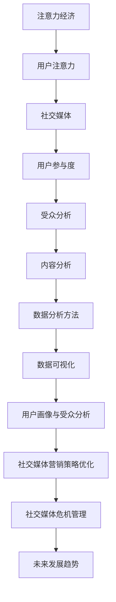
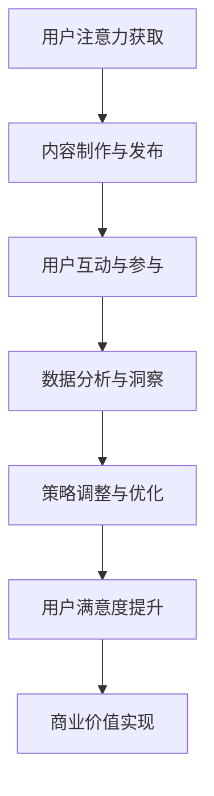
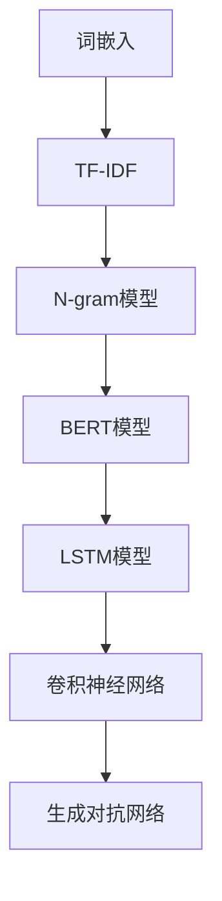

                 

## 注意力经济与社交媒体分析洞察力：了解受众参与度的秘密

### 关键词：
- 注意力经济
- 社交媒体分析
- 受众参与度
- 数据分析
- 情感分析
- 用户画像
- 内容效果评估

### 摘要：
本文将探讨注意力经济在社交媒体分析中的应用，分析注意力市场的原理、社交媒体平台与注意力经济的关系，以及如何通过社交媒体数据分析了解受众参与度。文章将介绍用户参与度分析的核心算法、数学模型，并通过实际项目案例展示社交媒体分析的实战方法和效果评估。最后，本文将讨论社交媒体分析的未来发展趋势和面临的挑战。

### 目录大纲：

#### 第一部分：注意力经济的基础理论

1. **第一部分引言**
    - 注意力经济的定义与核心概念
    - 注意力经济的起源与发展
    - 注意力经济的重要性
2. **注意力市场原理**
    - 注意力市场的特性
    - 注意力资源的分配机制
    - 注意力市场的供需关系
3. **注意力经济的商业模式**
    - 广告模式
    - 赞助模式
    - 内容付费模式
4. **社交媒体平台与注意力经济**
    - 社交媒体在注意力经济中的作用
    - 社交媒体平台商业模式分析
    - 社交媒体平台对用户注意力的影响

#### 第二部分：社交媒体数据分析方法

1. **第二部分引言**
    - 社交媒体数据分析的意义
    - 社交媒体数据分析的挑战与机遇
    - 社交媒体数据分析的应用场景
2. **数据采集与预处理**
    - 社交媒体数据来源
    - 数据采集工具与技巧
    - 数据预处理方法与策略
3. **数据可视化与探索性分析**
    - 数据可视化技术
    - 探索性数据分析方法
    - 用户行为分析
4. **用户画像与受众分析**
    - 用户画像的概念与构建
    - 用户分群与细分
    - 受众分析策略
5. **内容分析**
    - 内容分析方法
    - 情感分析与话题挖掘
    - 内容效果评估

#### 第三部分：社交媒体分析实战

1. **第三部分引言**
    - 社交媒体分析项目的规划与执行
    - 社交媒体分析工具与实践案例
    - 社交媒体分析的效果评估与优化
2. **社交媒体营销策略优化**
    - 营销策略制定
    - 营销效果监测与评估
    - 营销策略调整与优化
3. **社交媒体危机管理**
    - 危机识别与预警
    - 危机应对策略
    - 危机恢复与风险管理
4. **社交媒体分析的未来发展趋势**
    - 新技术与应用
    - 社交媒体分析在行业中的应用
    - 社交媒体分析面临的挑战与机遇

#### 附录

1. **附录A：社交媒体分析工具汇总**
    - 社交媒体数据分析平台介绍
    - 数据采集与处理工具介绍
    - 可视化分析工具介绍
2. **附录B：常见数学模型与算法总结**
    - 数据分析常用数学模型
    - 社交媒体分析常用算法
    - 代码示例与实现细节

### 第一节 引言

#### 注意力经济的定义与核心概念

注意力经济是指通过获取和利用用户的注意力资源来创造商业价值的一种经济模式。在这个模式中，用户的注意力被视为一种稀缺资源，而提供有价值的内容和服务则是获取这种资源的关键。注意力经济的核心概念包括注意力市场、注意力资源、注意力定价和注意力分配等。

**注意力市场** 是指一个用户注意力资源的交换和分配平台。在这个市场中，内容提供商（如社交媒体平台、广告商和内容创作者）通过提供有价值的内容来吸引用户的注意力，而用户则通过关注、点赞、评论和分享等行为来表明他们对内容的兴趣。注意力市场具有以下几个特性：

1. **稀缺性**：用户的注意力资源是有限的，因此具有一定的稀缺性。
2. **易逝性**：用户的注意力容易受到干扰和转移，因此具有易逝性。
3. **可度量性**：通过用户的互动行为，可以量化用户对内容的注意力程度。

**注意力资源** 是指用户用于关注和参与内容的能力。这些资源可以通过以下几种方式获取：

1. **时间资源**：用户花费在内容上的时间。
2. **情绪资源**：用户对内容的情感反应，如喜欢、厌恶、兴奋等。
3. **认知资源**：用户在理解、分析和评估内容时所消耗的认知能力。

**注意力定价** 是指为用户注意力资源设置一个合理的价格，以便在市场上进行交换。注意力定价的原理是基于内容的价值和用户的注意力分配。一般来说，高质量和有吸引力的内容能够获得更高的注意力定价。

**注意力分配** 是指用户如何在不同的内容和服务之间分配其有限的注意力资源。注意力分配受到多种因素的影响，包括内容的吸引力、用户的需求和偏好、内容提供商的影响力等。

#### 注意力经济的起源与发展

注意力经济的概念最早可以追溯到20世纪90年代。当时，互联网的普及和社交媒体的兴起，使得用户注意力成为了一个重要的商业资源。随着互联网的发展，内容提供商开始意识到，只有提供有价值的内容，才能吸引用户的注意力，从而实现商业价值。

在早期的互联网时代，广告模式是主要的注意力经济模式。广告商通过在网站上展示广告来吸引用户的注意力，并通过点击率、曝光率等指标来衡量广告效果。随着社交媒体的发展，广告模式逐渐向精准投放和效果营销转变。例如，Facebook和Google等平台通过算法和数据分析，将广告精确地投放到目标用户身上，从而提高了广告的转化率和投资回报率。

除了广告模式，注意力经济还包括赞助模式、内容付费模式等。赞助模式是指内容提供商通过合作获得赞助资金，以支持内容创作和传播。这种模式在电视、电影和体育等领域非常常见。内容付费模式是指用户为获取高质量内容而支付费用，如订阅服务、付费下载等。这种模式在流媒体服务和专业内容领域具有广泛的应用。

#### 注意力经济的重要性

注意力经济在现代商业中具有重要意义。首先，注意力经济使得内容提供商和广告商能够通过用户的注意力资源实现商业价值。通过了解用户的需求和偏好，内容提供商可以创造更有吸引力的内容，从而吸引更多的用户。广告商则可以通过精准投放广告，提高广告的转化率和投资回报率。

其次，注意力经济推动了社交媒体平台的发展和竞争。社交媒体平台通过提供有价值的内容和服务，吸引用户的注意力，从而获得广告收入和其他商业机会。在这个过程中，平台需要不断优化用户体验，提高用户粘性，以保持竞争优势。

最后，注意力经济对社会和文化也产生了深远的影响。随着用户注意力资源的稀缺性日益凸显，用户逐渐意识到注意力价值的重要性。这促使人们更加注重时间的利用和效率，同时引发了关于数字隐私和数据安全的讨论。

#### 第二节 注意力市场原理

在探讨注意力市场原理之前，我们需要了解几个基本概念：注意力资源、注意力定价和注意力分配。

**注意力资源** 是指用户在特定时间内可用于关注和参与内容的能力。这些资源可以包括用户的时间、情绪和认知能力。例如，一个用户在一天中可以花费数小时浏览社交媒体，这代表了他们的时间资源。当他们对某些内容产生情感共鸣时，如开心、愤怒或感动，这代表了他们的情绪资源。而在理解和分析内容时，用户则消耗了他们的认知资源。

**注意力定价** 是指为用户的注意力资源设定一个合理的价格，以便在市场上进行交换。注意力定价的原理是基于内容的价值和用户的注意力分配。例如，一个用户可能会为观看一部高质量的电影而支付费用，这就是对电影内容的注意力定价。同样，广告商可能会为在热门视频前展示广告而支付较高的费用，因为这样能够更有效地吸引目标受众的注意力。

**注意力分配** 是指用户如何在不同的内容和服务之间分配其有限的注意力资源。注意力分配受到多种因素的影响，包括内容的吸引力、用户的需求和偏好、内容提供商的影响力等。例如，一个用户可能会更倾向于关注和参与他们感兴趣的话题，而忽视其他不相关的信息。

#### 注意力市场的特性

1. **稀缺性**：用户的注意力资源是有限的，因此具有一定的稀缺性。这意味着用户必须做出选择，决定将注意力分配给哪些内容和服务。内容提供商和广告商需要通过提供高质量、有价值的内容来争夺用户的注意力。

2. **易逝性**：用户的注意力容易受到干扰和转移，因此具有易逝性。一个用户在某一时刻的注意力可能很快就会转移到其他内容上。因此，内容提供商需要快速抓住用户的注意力，并提供持续吸引力的内容。

3. **可度量性**：通过用户的互动行为，可以量化用户对内容的注意力程度。例如，用户的点赞、评论、分享和点击等行为，都可以作为衡量注意力程度的指标。这些指标有助于内容提供商和广告商了解用户对内容的兴趣和参与度。

#### 注意力资源的分配机制

注意力资源的分配机制是指用户如何在不同的内容和服务之间分配其有限的注意力资源。这一机制受到多种因素的影响，包括：

1. **内容质量**：高质量的内容更容易吸引用户的注意力。内容提供商需要通过创意、技术手段和用户互动等方式，提高内容的质量和价值。

2. **用户需求与偏好**：用户的注意力分配受其个人需求和偏好影响。例如，一个科技爱好者可能会更倾向于关注科技新闻和产品评测，而忽视其他类型的内容。

3. **内容提供商的影响力**：具有影响力的内容提供商能够更容易地吸引用户的注意力。这可能是由于他们在行业内的知名度、口碑或品牌价值等因素。

4. **用户时间与精力**：用户的时间与精力是有限的，因此需要在各种内容和服务之间进行权衡。内容提供商需要提供高效率、有吸引力的内容，以节省用户的时间。

5. **市场动态**：市场动态也会影响注意力资源的分配。例如，热门事件、季节性促销或行业趋势等都可能导致用户的注意力集中到特定内容上。

#### 注意力市场的供需关系

在注意力市场中，供需关系是决定内容提供商和广告商策略的关键因素。注意力供给方是用户，他们提供自己的注意力资源。而注意力需求方则是内容提供商和广告商，他们希望通过高质量的内容和服务来获取用户的注意力。

1. **供给方**：用户的注意力供给是有限的，受到时间、精力、兴趣等因素的限制。在注意力市场上，用户的选择决定了哪些内容和服务能够获得他们的注意力。因此，内容提供商需要通过创新和优化，提供高质量、有价值的内容，以满足用户的需求。

2. **需求方**：内容提供商和广告商在注意力市场上竞争，希望通过投放广告或提供内容来获取用户的注意力。他们需要分析市场趋势、用户行为和竞争对手的动态，以制定有效的策略。例如，广告商可能会通过大数据分析和算法优化，将广告精准地投放到目标用户身上。

3. **供需平衡**：注意力市场的供需关系处于不断变化中。当供给过剩时，内容提供商可能会通过降低内容质量或提高价格来争夺用户注意力。当需求过剩时，广告商可能会提高广告投放预算，以获取更多的用户注意力。通过市场反馈和调整策略，内容提供商和广告商可以找到供需平衡点，实现商业价值最大化。

#### 第三节 注意力经济的商业模式

注意力经济的商业模式是指通过获取和利用用户的注意力资源来实现商业价值的一系列策略和方法。在社交媒体时代，注意力经济的商业模式主要包括广告模式、赞助模式和内容付费模式。

**广告模式** 是注意力经济中最常见的商业模式之一。内容提供商通过在平台上展示广告来吸引用户的注意力，广告商则通过支付费用来获取用户注意力。广告模式可以分为以下几种类型：

1. **展示广告**：在用户浏览内容时，展示在页面上的横幅、弹出或插页广告。这种广告形式成本低，但用户体验较差。
2. **原生广告**：与内容紧密融合的广告形式，通常以文章、视频或图片的形式出现。原生广告具有较高的用户体验，但制作成本较高。
3. **按点击付费广告**：广告商根据用户点击广告的次数支付费用。这种广告模式对广告商来说风险较低，但需要较高的点击率才能产生收益。
4. **按展示付费广告**：广告商根据广告被展示的次数支付费用。这种广告模式对广告商来说成本较低，但需要较高的曝光率才能产生效果。

**赞助模式** 是指内容提供商与品牌合作，为其提供赞助内容。这种模式通常以品牌宣传、品牌植入或品牌冠名等形式出现。赞助模式的特点是广告形式多样，用户体验较好，同时品牌传播效果显著。赞助模式可以分为以下几种类型：

1. **品牌宣传**：品牌通过赞助内容来提升品牌知名度，通常以品牌名称、标志或口号的形式出现。
2. **品牌植入**：品牌将产品或服务融入内容中，以自然、不引人注意的方式向用户传递品牌信息。
3. **品牌冠名**：品牌为内容提供者提供资金支持，并获得内容的命名权。例如，某个电视节目可能会被命名为“XX品牌之夜”。

**内容付费模式** 是指用户为获取高质量、有价值的内容而支付费用。这种模式通常适用于专业内容、独家新闻或原创作品。内容付费模式可以分为以下几种类型：

1. **订阅服务**：用户为持续获取内容而支付定期费用。例如，Netflix、Spotify等平台通过订阅模式提供视频和音乐服务。
2. **付费下载**：用户为获取单个内容而支付一次性费用。例如，电子书、电影、音乐等。
3. **付费会员**：用户为获得额外服务或优惠而支付额外费用。例如，某些社交媒体平台可能为付费用户提供更多的功能和权限。

#### 广告模式

广告模式是注意力经济中最为普遍的一种商业模式，它依托于用户的注意力资源，通过在社交媒体平台上展示广告来为广告主和内容提供商创造价值。广告模式的基本原理是，广告主付费获取用户的注意力，内容提供商则通过展示广告来赚取收入。

**广告模式的分类**

广告模式可以根据广告形式、投放策略和计费方式等多种维度进行分类。以下是几种常见的广告形式：

1. **展示广告**：展示广告是最基础的广告形式，通常以横幅、弹出或插页的形式出现在用户浏览的页面中。展示广告的目的是提高品牌的曝光率和知名度，但因其影响用户体验，效果通常较为有限。

2. **原生广告**：原生广告是与内容紧密结合的广告形式，它们通常以文章、视频或图片的形式出现，使得用户难以分辨广告内容与普通内容之间的差异。原生广告具有较高的用户体验，能够更好地吸引用户的注意力，从而提高广告效果。

3. **按点击付费广告**（CPC）：按点击付费广告是指广告主根据用户点击广告的次数支付费用。这种模式对广告主来说风险较低，因为只有在用户实际点击广告时才会产生费用。CPC广告适用于希望提高品牌知名度或直接引导用户进行特定行动的广告主。

4. **按展示付费广告**（CPM）：按展示付费广告是指广告主根据广告被展示的次数支付费用，而不论用户是否实际点击广告。CPM广告适用于希望扩大品牌曝光率的广告主，但需要考虑广告的点击率和转化率。

5. **按转化付费广告**（CPA）：按转化付费广告是指广告主根据用户完成特定目标（如购买产品、注册账号等）的次数支付费用。这种模式对广告主来说风险较高，但能够更精确地衡量广告的投资回报率。

**广告模式的优势与挑战**

广告模式的优势在于其广泛的适用性和高效的变现能力。通过大数据分析和算法优化，广告主能够将广告精准地投放到目标受众身上，提高广告的点击率和转化率。同时，内容提供商能够通过广告获得稳定的收入，从而支持内容创作和平台运营。

然而，广告模式也面临一些挑战。首先，用户对广告的抵触情绪日益增加，这可能导致广告效果下降。其次，广告过多可能影响用户体验，导致用户流失。最后，随着隐私保护和数据安全法规的加强，广告主和内容提供商需要遵守相关法规，确保用户数据的合法使用。

#### 赞助模式

赞助模式是注意力经济中的一种重要商业模式，它通过品牌与内容提供商的深度合作，实现双方共赢。赞助模式的核心在于，品牌为内容提供资金支持，并获得在内容中展示自身品牌的机会。这种模式在电视、电影、体育赛事和社交媒体等领域得到了广泛应用。

**赞助模式的分类**

赞助模式可以根据赞助形式、赞助内容以及赞助目的进行分类。以下是几种常见的赞助形式：

1. **品牌宣传**：品牌通过赞助活动或内容来提升品牌知名度和品牌形象。这种形式的赞助通常不涉及具体的广告植入，而是通过赞助商的品牌名称、标志或口号在活动中展示。

2. **品牌植入**：品牌将产品或服务以自然、不引人注意的方式融入内容中。这种形式的赞助能够更好地融入用户的生活场景，提高用户的接受度和认同感。例如，在电影中，品牌可能会以产品展示或背景植入的形式出现。

3. **品牌冠名**：品牌为活动、节目或内容提供全部或部分资金支持，并获得内容的命名权。这种形式的赞助能够为品牌带来大量的曝光和传播机会，但同时也要求品牌与内容的契合度较高。

4. **联合推广**：品牌与内容提供商合作，共同策划和执行营销活动。这种形式的赞助通常能够更好地整合品牌和内容资源，实现1+1>2的效果。

**赞助模式的优势**

赞助模式具有以下优势：

1. **高曝光率**：赞助模式能够为品牌带来大量的曝光机会，尤其是在大型活动或热门节目中的赞助，能够迅速提升品牌的知名度。

2. **良好的用户体验**：相比于硬广告，赞助模式通常以更为柔和、自然的方式呈现，不易引起用户的反感，从而提升用户体验。

3. **深度品牌传播**：赞助模式能够将品牌信息深度融入内容中，提高用户对品牌的认知度和认同感。

4. **合作共赢**：赞助模式能够为品牌和内容提供商带来双赢的结果。品牌通过赞助获得曝光和传播，而内容提供商则通过合作获得资金支持，从而提升内容质量和用户满意度。

**赞助模式的挑战**

赞助模式同样面临一些挑战：

1. **匹配度要求**：品牌与内容之间的匹配度是赞助成功的关键。如果品牌与内容不匹配，可能会导致用户对赞助内容的抵触情绪。

2. **品牌风险**：赞助活动或内容如果出现问题，如负面新闻或用户投诉，可能会对品牌形象造成负面影响。

3. **监管限制**：随着隐私保护和数据安全法规的加强，赞助活动需要遵守相关法规，确保用户数据的合法使用。

4. **预算限制**：赞助模式的成本较高，对于中小型品牌可能存在预算限制，需要权衡赞助效果和成本。

#### 内容付费模式

内容付费模式是指用户为获取高质量、有价值的内容而支付费用。这种模式在信息爆炸的时代尤为受欢迎，因为它为内容创作者提供了稳定的收入来源，同时也满足了用户对高质量内容的消费需求。内容付费模式主要分为订阅服务、付费下载和付费会员等几种形式。

**订阅服务** 是内容付费模式中最常见的形式之一。用户为持续获取内容而支付定期费用，例如Netflix、Spotify等平台。订阅服务的优势在于其便捷性和连续性，用户无需每次消费时进行付费，只需支付固定的订阅费用即可享受无限的内容。对于内容提供商而言，订阅服务能够带来稳定的现金流，降低用户流失率。

**付费下载** 是指用户为获取单个内容（如电子书、电影、音乐等）而支付一次性费用。付费下载的优势在于其灵活性，用户可以根据自己的需求购买和下载特定内容。这种模式适用于那些具有独特价值和吸引力的内容，例如独家报道、原创小说或热门电影。对于内容提供商而言，付费下载能够迅速变现，但需要不断推出高质量的内容来维持用户的购买意愿。

**付费会员** 是指用户为获得额外服务或优惠而支付额外费用。例如，某些社交媒体平台可能为付费用户提供更多的功能和权限，如去广告、高清视频、会员专属活动等。付费会员的优势在于其能够为用户提供独特的价值，提高用户粘性和满意度。对于内容提供商而言，付费会员不仅能够带来额外的收入，还能够通过会员数据分析了解用户需求，优化产品和服务。

**内容付费模式的挑战**

尽管内容付费模式具有诸多优势，但同样面临一些挑战：

1. **用户消费习惯**：在免费内容充斥的网络环境中，用户对付费内容的接受度可能较低，需要内容提供商提供足够的价值和吸引力来吸引用户。

2. **版权保护**：内容付费模式要求严格的版权保护，防止用户非法获取和分享内容。这需要内容提供商投入大量资源进行版权管理和监控。

3. **市场竞争**：随着越来越多的内容提供商进入市场，竞争日益激烈。内容提供商需要不断优化内容质量和用户体验，以在激烈的市场竞争中脱颖而出。

4. **数据隐私**：随着用户对数据隐私的关注日益增加，内容提供商需要确保用户数据的合法使用和保护。

#### 第四节 社交媒体平台与注意力经济

社交媒体平台在注意力经济中扮演着关键角色，它们不仅是内容生成和传播的载体，也是注意力资源分配的核心枢纽。社交媒体平台通过其独特的商业模式和用户互动机制，有效地吸引了大量的用户注意力，并在注意力市场中占据了一席之地。

**社交媒体平台在注意力经济中的作用**

1. **用户注意力聚集**：社交媒体平台通过提供多样化的内容和服务，吸引了大量用户，并将他们的注意力集中到平台上。用户每天花费数小时在社交媒体上浏览、互动和分享，这为平台创造了巨大的流量和用户参与度。

2. **用户参与度提升**：社交媒体平台通过用户生成内容（UGC）和社交互动机制，鼓励用户积极参与内容创作和分享。用户之间的互动、评论、点赞和分享等行为，不仅增加了内容的曝光率和影响力，也提升了用户的参与度和粘性。

3. **广告和赞助机会**：社交媒体平台为广告主和品牌提供了广泛的广告和赞助机会。通过精准的定位和投放策略，平台能够将广告和赞助内容有效地呈现给目标用户，从而提高广告效果和品牌传播效果。

**社交媒体平台商业模式分析**

1. **广告模式**：广告收入是社交媒体平台的主要收入来源。平台通过展示广告、原生广告、按点击付费广告和按展示付费广告等多种形式，从广告主处获取收入。平台利用用户数据和行为分析，进行精准广告投放，提高广告效果和投资回报率。

2. **内容付费模式**：一些社交媒体平台也提供内容付费服务，如付费订阅、付费下载和付费会员等。这些模式为平台创造了额外的收入来源，同时提升了用户体验和内容质量。

3. **赞助模式**：品牌通过赞助社交媒体平台的活动、节目或内容，获得品牌曝光和传播机会。赞助模式为平台和品牌带来了双赢的结果，提高了平台的商业价值和品牌的知名度。

**社交媒体平台对用户注意力的影响**

1. **注意力资源的分配**：社交媒体平台通过算法和数据分析，将用户的注意力资源分配给不同的内容和服务。平台会根据用户的兴趣、行为和历史数据，推荐相关的文章、视频、广告等，使用户更容易找到感兴趣的内容。

2. **注意力消耗**：社交媒体平台提供了丰富多样的内容和服务，使用户的注意力资源被大量消耗。用户在浏览、点赞、评论和分享等行为中，不断投入注意力资源，这可能导致注意力疲劳和分散。

3. **注意力转移**：社交媒体平台通过不断更新的内容流和社交互动，吸引用户持续关注。然而，这也可能导致用户的注意力频繁转移，难以长时间集中在一个内容或任务上。

**社交媒体平台的挑战**

1. **用户隐私保护**：随着用户对隐私保护的重视，社交媒体平台需要采取更加严格的数据保护措施，确保用户数据的合法使用和隐私保护。

2. **内容质量控制**：社交媒体平台需要不断优化内容质量，防止低质量、虚假或有害内容的传播。这需要平台投入大量资源和精力进行内容审核和监控。

3. **广告效果和用户参与度**：在激烈的市场竞争中，社交媒体平台需要不断提升广告效果和用户参与度，以吸引更多用户和广告主。

#### 第五节 社交媒体数据分析的意义

社交媒体数据分析在现代商业中具有重要意义。通过对社交媒体数据的深入分析，企业能够更好地理解用户需求、优化营销策略、提升用户参与度和满意度。以下是社交媒体数据分析的几个关键意义：

1. **用户行为分析**：社交媒体数据分析可以帮助企业了解用户在平台上的行为，包括浏览习惯、互动行为、偏好和反馈等。通过这些数据，企业可以识别用户需求，优化产品和服务，提高用户体验。

2. **市场趋势洞察**：社交媒体数据分析能够揭示市场趋势和消费者行为变化。通过分析用户对特定话题、品牌或产品的关注度和互动行为，企业可以及时调整营销策略，抓住市场机遇。

3. **竞争分析**：通过分析竞争对手在社交媒体上的表现，企业可以了解竞争对手的优势和劣势，从而制定更有针对性的营销策略。社交媒体数据分析可以帮助企业发现竞争对手的弱点，提供差异化竞争优势。

4. **品牌声誉管理**：社交媒体数据分析可以帮助企业监测品牌声誉，及时识别和处理负面信息。通过分析用户评论、反馈和互动，企业可以了解用户对品牌的看法和态度，采取措施提升品牌形象。

5. **营销效果评估**：社交媒体数据分析可以量化营销活动的效果，包括广告投放效果、推广活动的转化率等。通过评估营销效果，企业可以优化营销预算和策略，提高投资回报率。

#### 第六节 社交媒体数据分析的挑战与机遇

随着社交媒体的普及和用户生成内容的大幅增加，社交媒体数据分析成为企业获取用户洞察、优化营销策略和提升用户体验的重要手段。然而，这一领域也面临着诸多挑战和机遇。

**数据量与多样性**：社交媒体平台每天产生海量的数据，包括文本、图片、视频和音频等多种形式。这些数据不仅数量庞大，而且结构复杂、多样性高。因此，如何有效地采集、存储和管理这些数据，是社交媒体数据分析面临的首要挑战。

**实时性与时效性**：社交媒体信息更新迅速，用户行为和趋势变化频繁。这就要求社交媒体数据分析系统能够实现实时或近实时的数据处理和分析，以便企业能够及时作出决策和调整策略。

**隐私与合规性**：用户隐私保护和数据合规性问题日益突出。社交媒体平台和企业需要遵守相关法律法规，确保用户数据的合法使用和保护。这要求企业在进行数据分析和处理时，采取严格的隐私保护措施，遵循合规性要求。

**算法透明性与可解释性**：随着机器学习和人工智能技术在社交媒体数据分析中的应用，算法的复杂性和黑箱化问题日益明显。如何提高算法的透明性和可解释性，使企业能够理解算法的决策过程和结果，是当前的一个研究热点和挑战。

**数据质量**：社交媒体数据质量参差不齐，包括数据缺失、噪声和错误等问题。这些质量问题是影响数据分析结果准确性和可靠性的重要因素。因此，如何清洗和预处理数据，提高数据质量，是社交媒体数据分析的重要一环。

**多平台整合**：社交媒体平台繁多，每个平台都有其独特的数据格式和接口。如何实现多平台数据的整合和分析，是一个复杂而具有挑战性的问题。多平台整合需要跨平台的API接口、数据转换和统一的数据模型。

**机遇**：

1. **用户洞察**：通过社交媒体数据分析，企业能够更深入地了解用户需求和行为，从而提供更加个性化、精准的产品和服务。

2. **营销优化**：社交媒体数据分析能够帮助企业优化营销策略，提高广告投放效果和转化率，实现营销预算的最大化利用。

3. **实时决策**：实时社交媒体数据分析使企业能够快速响应市场变化和用户需求，抓住实时商机。

4. **创新应用**：随着技术的进步，社交媒体数据分析的应用场景不断扩展，包括用户画像、情感分析、网络分析、推荐系统等。

5. **数据驱动决策**：社交媒体数据分析为企业提供了数据驱动决策的依据，使企业能够基于数据而非直觉进行战略规划和业务运营。

**应对策略**：

1. **技术革新**：采用先进的分析技术，如机器学习、深度学习和自然语言处理，提高数据分析的精度和效率。

2. **合规性管理**：建立完善的数据合规性管理体系，确保用户数据的合法使用和保护。

3. **数据质量管理**：加强数据质量管理，通过数据清洗、去噪和标准化等方法，提高数据质量。

4. **多平台整合**：采用统一的数据平台和接口，实现多平台数据的整合和分析。

5. **用户参与**：鼓励用户参与数据分析过程，通过用户反馈和互动，提高数据分析的准确性和实用性。

#### 第七节 社交媒体数据分析的应用场景

社交媒体数据分析在多个应用场景中发挥着重要作用，以下是一些常见且重要的应用场景：

1. **用户行为分析**：通过分析用户在社交媒体平台上的行为数据，如浏览时长、互动频率、点赞、评论和分享等，企业可以深入了解用户的需求和偏好。这有助于优化产品功能、提升用户体验，并制定更加个性化的营销策略。

2. **市场趋势分析**：社交媒体数据分析能够揭示市场趋势和消费者行为变化。通过分析用户对特定话题、品牌或产品的关注度和互动行为，企业可以预测市场动向，及时调整营销策略，抓住市场机遇。

3. **竞争分析**：通过分析竞争对手在社交媒体上的表现，如粉丝增长、内容发布频率、互动质量和广告投放效果等，企业可以了解竞争对手的优势和劣势，从而制定更有针对性的营销策略，提供差异化竞争优势。

4. **品牌声誉管理**：社交媒体数据分析可以帮助企业监测品牌声誉，及时识别和处理负面信息。通过分析用户评论、反馈和互动，企业可以了解用户对品牌的看法和态度，采取措施提升品牌形象。

5. **营销效果评估**：社交媒体数据分析可以量化营销活动的效果，包括广告投放效果、推广活动的转化率等。通过评估营销效果，企业可以优化营销预算和策略，提高投资回报率。

6. **用户画像与细分**：通过社交媒体数据分析，企业可以构建详细的用户画像，识别不同的用户群体和细分市场。这有助于企业更好地理解用户需求，提供个性化的产品和服务，并制定更加精准的营销策略。

7. **内容效果评估**：社交媒体数据分析可以帮助企业评估不同类型的内容效果，如文章、视频、图片等。通过分析用户的互动行为和反馈，企业可以了解哪些内容类型最受欢迎，优化内容创作和发布策略。

8. **危机管理**：在社交媒体危机事件发生时，数据分析可以帮助企业快速识别危机信号，评估危机影响，制定应对策略。通过分析用户反馈和舆论趋势，企业可以及时采取行动，缓解危机，保护品牌声誉。

9. **用户参与度分析**：社交媒体数据分析可以衡量用户的参与度，如用户对品牌的关注、互动和忠诚度等。通过分析参与度数据，企业可以了解用户的忠诚度，优化用户参与策略，提升用户满意度。

10. **情感分析**：通过分析用户在社交媒体上的情感表达，如正面、负面或中立情感，企业可以了解用户的情感倾向和情绪变化。这有助于企业更好地了解用户需求，优化产品和服务，提升用户满意度。

#### 第八节 数据采集与预处理

数据采集与预处理是社交媒体数据分析的基础，决定了数据的质量和分析结果的可信度。以下是数据采集与预处理的步骤、方法和注意事项：

**数据采集步骤**：

1. **确定数据来源**：根据分析目标，选择合适的数据来源，如社交媒体平台、网站日志、API接口等。
2. **数据采集**：使用自动化工具（如爬虫、API调用等）或手动方式采集数据。
3. **数据收集**：将采集到的数据存储在合适的存储系统中，如数据库、文件系统等。

**数据采集方法**：

1. **爬虫技术**：使用爬虫工具（如Scrapy、BeautifulSoup等）自动爬取社交媒体平台上的数据。
2. **API调用**：通过社交媒体平台的API接口获取数据，如Twitter API、Facebook Graph API等。
3. **手动采集**：手动下载或复制社交媒体平台上的数据。

**数据预处理方法与策略**：

1. **数据清洗**：去除重复、缺失和异常数据，确保数据的一致性和完整性。
    - **去重**：去除重复的数据条目，确保数据集的准确性。
    - **处理缺失数据**：对于缺失的数据，可以选择填充、删除或插补等方法进行处理。
    - **异常值处理**：检测和处理异常值，如异常的数值或文本。

2. **数据转换**：将数据转换为适合分析的形式，如统一数据格式、归一化、标准化等。
    - **统一格式**：将不同来源的数据转换为相同的数据格式，如CSV、JSON等。
    - **归一化**：将不同特征的数据范围转换为相同的尺度，如将年龄、收入等特征转换为0-1范围。

3. **数据集成**：将来自不同来源和格式的数据集成到一个统一的数据集中。
    - **数据合并**：将多个数据集合并为一个数据集，如将用户行为数据和用户画像数据合并。
    - **数据连接**：使用数据连接技术（如SQL、Pandas等）连接和合并数据。

**注意事项**：

1. **数据合规性**：在采集和预处理数据时，要确保遵守相关法律法规，尊重用户隐私。
2. **数据质量**：保证数据的质量是数据分析成功的关键，要严格把控数据采集和预处理过程。
3. **可扩展性**：设计灵活的数据采集和预处理系统，以适应不断变化的数据需求和规模。

#### 第九节 数据可视化与探索性分析

数据可视化与探索性分析是社交媒体数据分析中的重要环节，它们帮助分析师直观地理解和解释数据，发现潜在的模式和趋势。以下是数据可视化和探索性分析的方法、技术和工具。

**数据可视化方法**：

1. **图表类型**：选择合适的图表类型来展示数据，如柱状图、折线图、饼图、散点图等。
    - **柱状图**：用于比较不同类别或时间段的数据。
    - **折线图**：用于展示数据的变化趋势和周期性。
    - **饼图**：用于展示各部分占整体的比例。
    - **散点图**：用于展示两个变量之间的关系。

2. **交互式可视化**：使用交互式可视化工具，如D3.js、Plotly等，实现数据动态交互和用户互动。

**探索性数据分析方法**：

1. **描述性统计**：计算数据的中心趋势、离散程度和分布情况，如均值、中位数、标准差等。
2. **相关性分析**：分析两个或多个变量之间的相关性，如皮尔逊相关系数、斯皮尔曼相关系数等。
3. **聚类分析**：将数据分为多个类别，如K-means聚类、层次聚类等。
4. **时间序列分析**：分析数据随时间的变化趋势，如移动平均、自回归模型等。

**数据可视化与探索性分析工具**：

1. **Python可视化库**：如Matplotlib、Seaborn、Plotly等，支持丰富的图表类型和交互式可视化。
2. **R语言**：提供多种数据可视化包，如ggplot2、lattice等，适用于复杂数据的可视化。
3. **Tableau**：商业化的数据可视化工具，支持多种数据源和交互式分析。
4. **Power BI**：微软推出的数据可视化和分析工具，易于使用且功能强大。

**用户行为分析**：

用户行为分析是社交媒体数据分析的核心之一，通过分析用户在平台上的行为，企业可以深入了解用户需求、优化产品功能、提升用户体验。以下是用户行为分析的几个关键方面：

1. **浏览行为**：分析用户在平台上的浏览时长、浏览频率和页面跳转路径等，了解用户对内容的兴趣和偏好。
2. **互动行为**：分析用户在内容上的点赞、评论、分享等互动行为，了解用户的参与度和忠诚度。
3. **参与度指标**：计算用户的参与度指标，如平均互动次数、参与度评分等，评估用户对品牌和内容的关注度。
4. **留存率**：分析用户在平台上的留存情况，了解用户流失的原因和如何提高用户留存率。

**案例：用户行为分析实践**

假设我们要分析一个社交媒体平台上的用户行为，以下是一个简化的分析流程：

1. **数据采集**：从社交媒体平台获取用户行为数据，包括用户ID、时间戳、行为类型（浏览、点赞、评论、分享等）和交互内容等。
2. **数据预处理**：清洗和转换数据，为后续分析做好准备。例如，去除重复数据、处理缺失值、统一时间格式等。
3. **描述性统计**：计算用户的平均浏览时长、浏览频率、点赞次数等描述性统计指标。
4. **相关性分析**：分析用户行为类型之间的相关性，如浏览和点赞之间的关系，帮助发现用户兴趣点。
5. **交互式可视化**：使用交互式可视化工具，如Plotly，创建折线图、散点图等，展示用户行为趋势和关系。
6. **用户分群**：使用聚类分析方法，将用户分为不同的群体，分析不同群体之间的行为差异，如高互动用户、低互动用户等。
7. **留存率分析**：计算用户的留存率，分析用户流失的原因和如何提高留存率。

通过用户行为分析，企业可以深入了解用户需求和行为模式，优化产品功能和服务，提升用户满意度和忠诚度。

#### 第十节 用户画像与受众分析

用户画像与受众分析是社交媒体数据分析中的重要环节，它们帮助企业更好地了解用户需求、优化产品和服务、提高营销效果。以下将介绍用户画像的概念与构建、用户分群与细分、以及受众分析策略。

**用户画像的概念与构建**

用户画像是指通过对用户的属性、行为、兴趣等多维度数据进行综合分析，构建出用户的基本特征和偏好模型。用户画像的构建主要包括以下几个步骤：

1. **数据采集**：从各种数据源（如社交媒体平台、用户反馈、交易记录等）收集用户数据。
2. **数据清洗**：清洗和预处理数据，去除重复、缺失和异常数据，确保数据质量。
3. **特征提取**：从原始数据中提取用户特征，如性别、年龄、地理位置、兴趣爱好、行为习惯等。
4. **特征筛选**：筛选和选择对用户画像构建有重要影响的关键特征，去除冗余和无关特征。
5. **模型训练**：使用机器学习算法（如聚类分析、分类算法等）对特征数据进行建模，构建用户画像。

**用户分群与细分**

用户分群与细分是指将用户按照不同的特征或行为进行分类和分组，以更好地理解和满足他们的需求。用户分群与细分的方法主要包括以下几种：

1. **基于人口统计学的分群**：根据用户的性别、年龄、地理位置等人口统计特征进行分群。这种方法简单直观，适用于不同年龄段、性别和地域的用户需求分析。
2. **基于行为的分群**：根据用户在社交媒体平台上的行为数据，如浏览时长、互动频率、购买行为等，进行分群。这种方法能够更深入地了解用户的兴趣和行为模式。
3. **基于兴趣的分群**：根据用户对特定话题、品牌、内容等的兴趣，进行分群。这种方法能够更好地满足用户的个性化需求。
4. **基于价值的分群**：根据用户对品牌的贡献度和忠诚度，将用户分为高价值用户、中价值用户和低价值用户。这种方法有助于企业制定差异化的营销策略。

**受众分析策略**

受众分析策略是指通过对用户画像和分群结果的分析，制定有针对性的营销策略和内容创作方案。以下是一些常见的受众分析策略：

1. **个性化营销**：根据用户的分群结果，为不同分群的用户提供个性化的营销内容和优惠。例如，为高价值用户提供定制化的产品推荐和专属优惠。
2. **精准广告投放**：根据用户的兴趣和行为，将广告精准地投放到目标受众身上，提高广告的点击率和转化率。
3. **内容创作与优化**：根据用户画像和兴趣，创作和优化符合用户需求的内容。例如，针对年轻女性用户，创作时尚美妆内容；针对科技爱好者，创作科技新闻和产品评测。
4. **用户反馈与互动**：通过分析用户反馈和互动数据，了解用户对产品和服务的满意度和需求，及时调整和优化产品和服务。

通过用户画像与受众分析，企业可以更深入地了解用户需求，提高用户满意度，实现营销效果的最大化。

#### 第十一节 内容分析

内容分析是社交媒体数据分析的核心环节之一，通过分析用户生成的内容，企业可以深入了解用户需求、优化内容策略、提升品牌影响力。以下是内容分析的方法、情感分析与话题挖掘、以及内容效果评估。

**内容分析方法**

内容分析是指对用户在社交媒体平台上发布的内容（如文本、图片、视频等）进行系统性分析和解读，以提取有价值的信息和洞察。以下是几种常用的内容分析方法：

1. **文本分析**：对文本内容进行结构化处理，提取关键词、短语和主题。常用的文本分析工具包括NLP库（如NLTK、spaCy）、TF-IDF算法和主题模型（如LDA）。
2. **图像和视频分析**：对图像和视频内容进行视觉特征提取和情感分析，常用的工具包括OpenCV、TensorFlow和预训练的卷积神经网络（如VGG、ResNet）。
3. **情感分析**：使用自然语言处理技术，分析文本内容的情感倾向，如正面、负面或中性情感。常用的情感分析模型包括朴素贝叶斯、支持向量机和深度学习模型（如LSTM、BERT）。
4. **话题挖掘**：通过分析用户生成的内容，识别和提取常见的主题和话题。常用的方法包括词频分析、LDA主题模型和图论算法。

**情感分析与话题挖掘**

情感分析与话题挖掘是内容分析中的重要方面，它们有助于企业了解用户的情感态度和关注话题，从而优化内容策略和营销活动。

1. **情感分析**：情感分析是指通过分析文本内容，识别用户的情感倾向。常用的情感分析模型包括：
    - **朴素贝叶斯**：基于统计模型，通过计算词语的频率和条件概率进行情感分类。
    - **支持向量机（SVM）**：基于机器学习算法，通过找到最优决策边界进行情感分类。
    - **深度学习模型**：如LSTM、BERT等，通过神经网络结构提取文本特征进行情感分类。
2. **话题挖掘**：话题挖掘是指通过分析用户生成的内容，识别和提取常见的主题和话题。常用的方法包括：
    - **词频分析**：通过统计词语出现的频率，识别高频词汇和主题。
    - **LDA主题模型**：通过概率生成模型，将文本数据分为多个主题，每个主题由一组关键词表示。
    - **图论算法**：通过构建词关系图，利用图论算法（如社区发现算法）识别和提取话题。

**内容效果评估**

内容效果评估是指通过分析内容的表现和用户反馈，评估内容的传播效果、用户参与度和影响力。以下是一些常用的内容效果评估指标：

1. **传播效果**：包括内容的曝光率、阅读量、转发量等，用于衡量内容的传播范围和影响力。
2. **用户参与度**：包括用户的点赞、评论、分享等互动行为，用于衡量用户对内容的兴趣和参与度。
3. **情感倾向**：通过情感分析，评估用户对内容的情感反应，如正面、负面或中性情感。
4. **用户留存率**：通过分析用户在内容页面的停留时间、页面跳转率等，评估用户对内容的持续关注程度。
5. **转化率**：通过分析用户在内容页面上的操作行为，如点击购买按钮、填写表单等，评估内容的商业价值。

通过内容分析，企业可以深入了解用户需求、优化内容策略、提升品牌影响力，实现营销目标的最大化。

#### 第十二节 社交媒体分析项目的规划与执行

社交媒体分析项目是帮助企业和品牌更好地理解用户行为、优化营销策略、提升业务绩效的重要手段。一个成功的社交媒体分析项目需要科学的规划与严谨的执行，以下是项目规划与执行的主要步骤：

**1. 项目需求分析**

在项目启动阶段，首先需要进行项目需求分析。这包括确定项目的目标、分析需求、明确项目范围和预期成果。需求分析可以通过以下步骤进行：

- **目标确定**：明确项目的主要目标，如提升用户参与度、提高品牌知名度、优化广告投放策略等。
- **问题分析**：分析当前面临的挑战和问题，如用户流失、品牌形象受损、营销效果不佳等。
- **需求收集**：通过调研、访谈、用户反馈等方式，收集项目相关的需求信息。

**2. 数据采集与预处理**

数据采集与预处理是社交媒体分析项目的基础，确保数据的质量和一致性。具体步骤如下：

- **数据源选择**：根据项目需求，选择合适的数据源，如社交媒体平台、用户反馈、广告点击数据等。
- **数据采集**：使用自动化工具（如爬虫、API调用等）或手动方式采集数据。
- **数据清洗**：去除重复、缺失和异常数据，进行数据格式统一和规范化处理。

**3. 数据分析策略制定**

数据分析策略制定是项目规划的关键环节，包括确定分析目标、选择合适的分析方法和工具。具体步骤如下：

- **分析目标**：明确项目分析的目标，如用户行为分析、内容效果评估、营销策略优化等。
- **分析方法**：根据分析目标，选择合适的数据分析方法，如描述性统计、相关性分析、聚类分析、情感分析等。
- **工具选择**：选择合适的分析工具，如Python、R、Tableau等，确保能够高效地实现分析目标。

**4. 数据分析执行**

数据分析执行是项目实施的核心环节，根据分析策略对数据进行处理和分析。具体步骤如下：

- **数据预处理**：进行数据清洗、转换和集成，确保数据质量。
- **数据分析**：根据分析策略，执行各种数据分析任务，如描述性统计、可视化分析、模型训练等。
- **结果验证**：验证分析结果的准确性和可靠性，确保数据分析和模型预测的有效性。

**5. 报告生成与展示**

报告生成与展示是项目执行的最后一个环节，将分析结果和结论以清晰、简洁的方式呈现给项目利益相关者。具体步骤如下：

- **报告编写**：编写详细的分析报告，包括数据分析方法、结果、结论和推荐策略。
- **可视化展示**：使用图表、图形和可视化工具，直观展示分析结果和关键发现。
- **汇报与交流**：进行项目汇报和交流，与项目利益相关者讨论分析结果和下一步行动。

**6. 项目监控与优化**

在项目执行过程中，需要持续监控项目进展和效果，根据实际情况进行调整和优化。具体步骤如下：

- **进度监控**：定期检查项目进度，确保按计划执行。
- **效果评估**：评估项目效果和业务绩效，确保实现项目目标。
- **优化调整**：根据监控和评估结果，调整项目策略和执行计划，优化项目效果。

通过科学的规划与严格的执行，社交媒体分析项目可以帮助企业和品牌实现数据驱动决策，提升业务绩效和市场竞争力。

#### 第十三节 社交媒体分析工具与实践案例

社交媒体分析工具是实现数据驱动的营销和业务决策的重要工具。以下将介绍几种常用的社交媒体分析工具，并提供一个具体的项目实战案例，展示如何使用这些工具进行社交媒体分析。

**常用社交媒体分析工具**

1. **Klout**：Klout是一个知名的社交媒体分析平台，提供影响力分析工具，帮助用户了解自己在社交媒体上的影响力。它通过分析用户的社交行为、互动频率和参与度等指标，为用户提供影响力评分和详细报告。

2. **Brandwatch**：Brandwatch是一个功能强大的社交媒体数据分析工具，支持话题追踪、趋势分析和社交媒体监测。它提供实时数据分析功能，帮助用户快速了解市场动态和用户需求。

3. **Hootsuite Insights**：Hootsuite Insights是一个社交媒体监控和分析工具，提供广泛的社交媒体数据采集和分析功能。它支持多平台数据集成，帮助用户了解品牌表现和受众行为。

4. **Sprout Social**：Sprout Social是一个社交媒体管理工具，提供数据分析和报告生成功能。它支持定制化报表和实时数据监控，帮助用户优化社交媒体营销策略。

**项目实战案例**

**项目背景**：

某电子商务公司希望通过社交媒体分析，提升用户参与度和销售额。公司计划分析用户行为数据、优化社交媒体营销策略，并评估营销活动的效果。

**开发环境**：

- **数据采集工具**：PySpark
- **数据分析工具**：Pandas, Scikit-learn
- **数据可视化工具**：Matplotlib, Seaborn
- **编程语言**：Python

**实现步骤**：

1. **数据采集**：

使用PySpark从社交媒体平台（如Facebook、Twitter等）获取用户行为数据，包括用户ID、时间戳、互动行为（点赞、评论、分享）和内容信息（文本、图片、视频）等。

2. **数据预处理**：

清洗和转换数据，去除重复、缺失和异常值，统一数据格式和时间戳。对文本数据进行分词和去停用词处理，为后续分析做准备。

3. **用户参与度分析**：

使用伪代码中的用户参与度分析算法，计算每个用户的参与度得分，并对其进行排序。具体算法如下：

```python
def analyze_user_participation(data):
    # 数据清洗与预处理
    cleaned_data = preprocess_data(data)

    # 构建用户参与度指标
    user_participation_scores = []

    for user in cleaned_data:
        score = 0
        score += calculate_comment_count(user)
        score += calculate_like_count(user)
        score += calculate_share_count(user)
        user_participation_scores.append(score)

    # 对用户参与度进行排序
    sorted_users = sort_by_participation_score(user_participation_scores)

    # 输出结果
    return sorted_users
```

4. **情感分析**：

对用户评论进行情感分析，识别用户对产品或服务的情感倾向。使用自然语言处理技术（如TF-IDF、LSTM模型）进行情感分类，评估用户满意度。

5. **用户画像构建**：

基于用户行为数据和情感分析结果，构建用户画像。包括用户的基本属性（性别、年龄、地理位置）和行为特征（浏览时长、互动频率）等。

6. **营销策略优化**：

根据用户参与度和画像，优化社交媒体营销策略。包括内容优化、广告投放策略和用户互动策略等。通过A/B测试，评估不同策略的效果，持续优化营销策略。

**代码实现与解读**：

以下是一个简单的用户参与度分析代码实现，展示了数据采集、预处理和用户参与度计算的步骤：

```python
# 数据采集与预处理
data = spark.read.csv("user_data.csv", header=True)
cleaned_data = preprocess_data(data)

# 用户参与度分析
user_participation_scores = analyze_user_participation(cleaned_data)

# 输出结果
print(user_participation_scores)
```

在代码中，`preprocess_data` 函数负责清洗和预处理数据，`analyze_user_participation` 函数计算用户参与度得分，并按得分排序。通过分析用户参与度得分，公司可以识别高价值用户，并制定针对性的营销策略。

**代码解读与分析**：

1. **数据采集与预处理**：首先使用PySpark从社交媒体平台获取用户行为数据，然后进行数据清洗和预处理。这一步骤确保数据的一致性和完整性，为后续分析奠定基础。

2. **用户参与度分析**：通过计算用户的点赞、评论和分享数量，构建用户参与度得分。得分越高，表示用户对内容的参与度越高。公司可以根据参与度得分识别高价值用户，并进行针对性的营销活动。

3. **情感分析**：对用户评论进行情感分析，了解用户对产品和服务的满意度。通过情感分析，公司可以及时发现问题，并优化产品和服务。

4. **用户画像构建**：基于用户行为数据和情感分析结果，构建用户画像。用户画像有助于公司更好地了解用户需求，制定个性化的营销策略。

5. **营销策略优化**：根据用户参与度和画像，优化社交媒体营销策略。通过不断调整和优化，公司可以提升用户参与度和满意度，实现业务增长。

通过这个项目实战，读者可以了解到如何使用社交媒体分析工具进行数据采集、预处理、分析和策略优化，从而实现业务目标的最大化。

#### 第十四节 社交媒体营销策略优化

社交媒体营销策略优化是提升品牌影响力、用户参与度和转化率的关键环节。以下将介绍社交媒体营销策略的制定、营销效果监测与评估，以及策略调整与优化。

**营销策略制定**

1. **明确目标**：在制定营销策略前，首先要明确营销目标。目标可以是提高品牌知名度、提升用户参与度、增加销售转化等。

2. **目标受众分析**：分析目标受众的特征和需求，包括年龄、性别、地理位置、兴趣爱好等。这有助于制定有针对性的营销内容和策略。

3. **内容策略**：根据目标受众的特点，制定适合的内容策略。内容可以是文字、图片、视频等多种形式，要注重内容的质量和创新性。

4. **广告策略**：选择合适的广告形式和投放平台，如横幅广告、原生广告、视频广告等。同时，要结合目标受众的特点，制定精准的定位和投放策略。

5. **互动策略**：鼓励用户互动和参与，如举办线上活动、发起话题讨论、提供互动游戏等。通过互动策略，提高用户的参与度和忠诚度。

**营销效果监测与评估**

1. **关键指标**：设定关键指标（KPI）来衡量营销效果，如曝光率、点击率、参与度、转化率等。

2. **数据分析**：定期收集和分析营销数据，评估各项指标的表现。使用数据分析工具（如Google Analytics、社交媒体分析平台等）进行详细分析。

3. **反馈机制**：与用户互动，收集用户反馈和意见。这有助于了解用户的真实需求和满意度，及时调整营销策略。

**策略调整与优化**

1. **数据驱动**：根据数据分析结果，识别优势和不足，制定针对性的调整方案。数据是优化策略的重要依据。

2. **A/B测试**：通过A/B测试，比较不同营销策略的效果，找出最优方案。A/B测试有助于发现细微的改进点，提升营销效果。

3. **持续优化**：营销策略不是一成不变的，要根据市场动态和用户需求，持续优化和调整。不断尝试新的策略和方法，找到最适合自己和目标受众的营销组合。

通过社交媒体营销策略的制定、监测与评估，以及调整与优化，企业可以提升品牌影响力、用户参与度和转化率，实现业务目标的最大化。

#### 第十五节 社交媒体危机管理

社交媒体危机管理是企业在面对突发危机事件时，通过有效的危机应对策略、危机恢复与风险管理，保护品牌形象和市场份额的关键环节。以下将介绍危机识别与预警、危机应对策略，以及危机恢复与风险管理。

**危机识别与预警**

1. **监测社交媒体**：通过实时监测社交媒体平台，如Twitter、Facebook、Instagram等，及时发现负面信息、用户投诉和品牌争议。

2. **舆情分析**：使用社交媒体分析工具（如Brandwatch、Hootsuite等）进行舆情分析，识别潜在的危机信号。舆情分析可以帮助企业发现趋势、热点话题和负面情绪。

3. **建立预警系统**：建立危机预警系统，通过自动化工具和人工监测相结合，及时识别危机事件，并启动应急响应机制。

**危机应对策略**

1. **迅速响应**：在危机事件发生时，企业需要迅速做出反应，公开透明地回应公众关切。及时发布声明，解释事件原因和处理措施，避免谣言和误解的扩散。

2. **与媒体沟通**：与媒体保持良好沟通，提供准确的信息和官方声明。在危机事件中，媒体往往是公众获取信息的主要渠道，有效的媒体沟通有助于缓解危机。

3. **用户互动**：积极与用户互动，倾听用户的意见和建议，回应他们的关切。通过社交媒体平台和在线论坛等渠道，建立与用户的沟通桥梁。

4. **内部协调**：协调内部各部门，确保危机应对的一致性和高效性。内部协调包括公关部门、营销部门、人力资源部门等，确保危机应对措施的顺利实施。

**危机恢复与风险管理**

1. **品牌修复**：在危机得到控制后，企业需要采取措施修复品牌形象。这包括发布正面的内容、加强与用户的互动、举办公益活动等，以提升公众对品牌的信任和认可。

2. **风险评估与控制**：对危机事件进行风险评估，识别潜在的负面影响和风险。通过风险控制措施，如改进产品和服务、加强品牌管理、提高危机应对能力等，预防类似危机的再次发生。

3. **培训与演练**：定期进行危机管理培训，提高员工对危机事件的应对能力。通过危机演练，模拟可能发生的危机情景，测试危机应对计划和响应机制的有效性。

通过有效的危机识别与预警、危机应对策略，以及危机恢复与风险管理，企业可以保护品牌形象和市场份额，应对突发危机事件，实现长期可持续发展。

#### 第十六节 社交媒体分析的未来发展趋势

社交媒体分析作为现代营销和商业策略的核心工具，正经历着迅速的发展和变革。以下将讨论社交媒体分析的新技术与应用、社交媒体分析在行业中的应用，以及社交媒体分析面临的挑战与机遇。

**新技术与应用**

1. **人工智能与机器学习**：人工智能和机器学习技术在社交媒体分析中的应用日益广泛。通过深度学习和自然语言处理（NLP）技术，社交媒体分析能够更准确地理解和分析用户生成的内容，包括情感分析、话题挖掘和用户行为预测。

2. **大数据分析**：随着数据量的爆炸性增长，大数据分析技术成为社交媒体分析的必要工具。大数据分析能够处理和分析海量社交媒体数据，揭示用户行为模式和市场趋势，为企业提供决策依据。

3. **实时分析**：实时分析技术使得社交媒体分析能够实时捕捉用户行为和市场动态，为企业提供即时的洞察和响应。这有助于企业迅速调整营销策略，抓住市场机会。

4. **区块链技术**：区块链技术在社交媒体分析中具有潜在应用，可以提供数据透明性和安全性。通过区块链，社交媒体分析数据可以更加可信和安全地存储和共享。

**社交媒体分析在行业中的应用**

1. **市场营销**：社交媒体分析在市场营销中发挥着重要作用，帮助企业了解目标受众、优化广告投放策略、提升用户参与度和转化率。

2. **客户服务**：通过社交媒体分析，企业能够更好地了解用户反馈和需求，提供个性化的客户服务，提升客户满意度和忠诚度。

3. **品牌管理**：社交媒体分析帮助品牌监测品牌声誉，及时识别和处理负面信息，保护品牌形象。

4. **风险管理与危机应对**：社交媒体分析在风险管理和危机应对中的应用，可以帮助企业及时发现潜在危机，制定有效的危机应对策略。

5. **行业趋势预测**：通过分析社交媒体数据，企业可以预测行业趋势，为业务发展和战略规划提供依据。

**面临的挑战与机遇**

1. **数据隐私与合规性**：随着用户对隐私保护的重视，社交媒体分析在数据采集和处理过程中面临合规性和隐私保护的挑战。

2. **数据质量与准确性**：社交媒体数据质量参差不齐，如何提高数据质量、确保分析结果的准确性，是社交媒体分析面临的挑战。

3. **技术复杂性与可解释性**：随着人工智能和大数据技术的应用，社交媒体分析变得日益复杂，如何提高算法的可解释性和透明性，是企业需要解决的重要问题。

4. **市场竞争与创新**：在激烈的市场竞争中，企业需要不断创新，利用社交媒体分析提升业务绩效，以应对竞争对手的挑战。

5. **行业应用拓展**：随着社交媒体分析的不断发展，其在不同行业中的应用前景广阔，企业需要探索新的应用场景，实现业务价值的最大化。

通过新技术与应用、行业应用拓展，以及应对挑战和抓住机遇，社交媒体分析将继续在营销和商业领域发挥重要作用。

#### 附录A：社交媒体分析工具汇总

**社交媒体数据分析平台**

1. **Klout**：提供社交媒体影响力分析工具，帮助用户了解自己在社交媒体上的影响力。
2. **Brandwatch**：提供全面的社交媒体数据分析工具，支持话题追踪、趋势分析等。
3. **Hootsuite Insights**：提供社交媒体监控和分析功能，帮助用户了解品牌表现和受众行为。
4. **Sprout Social**：提供社交媒体管理工具，支持数据分析和报告生成。

**数据采集与处理工具**

1. **PySpark**：Python与Spark的集成，支持大规模数据采集和处理。
2. **Node.js**：用于构建高效的数据采集和处理应用程序。
3. **Apache Nutch**：开源的搜索引擎，用于爬取社交媒体数据。

**可视化分析工具**

1. **Matplotlib**：Python的绘图库，用于生成各种类型的图表。
2. **Seaborn**：基于Matplotlib的高级可视化库，提供更精美的图表样式。
3. **Tableau**：数据可视化工具，支持多种数据源和复杂的图表类型。
4. **Google Charts**：提供各种图表和图形，易于集成到Web应用中。

这些工具和平台在社交媒体分析中具有广泛应用，能够帮助企业有效采集、处理和分析社交媒体数据，提供深入的洞察和决策支持。

#### 附录B：常见数学模型与算法总结

**数据分析常用数学模型**

1. **回归分析**：用于分析变量之间的关系，预测数值结果。
2. **聚类分析**：将数据点分组，使组内数据点相似，组间数据点差异较大。
3. **主成分分析**（PCA）：降低数据维度，同时保留数据的主要信息。
4. **因子分析**：提取数据中的潜在变量，用于简化数据结构。

**社交媒体分析常用算法**

1. **词嵌入**：将文本转换为向量表示，用于文本分析和机器学习。
2. **情感分析**：使用自然语言处理技术，分析文本的情感倾向。
3. **网络分析**：分析社交媒体中的用户关系网络，了解用户之间的连接和影响。
4. **推荐系统**：根据用户的历史行为和偏好，推荐相关内容或产品。

**代码示例与实现细节**

以下是一个简单的情感分析算法示例，使用Python和Scikit-learn库：

```python
from sklearn.feature_extraction.text import CountVectorizer
from sklearn.model_selection import train_test_split
from sklearn.naive_bayes import MultinomialNB
from sklearn.metrics import accuracy_score

# 社交媒体数据集
data = [
    ("我很开心", "正面"),
    ("我今天不开心", "负面"),
    ("这部电影太棒了", "正面"),
    ("这个餐厅的服务太差了", "负面"),
]

# 分离文本和标签
texts, labels = zip(*data)

# 将文本转换为词频矩阵
vectorizer = CountVectorizer()
X = vectorizer.fit_transform(texts)

# 分割训练集和测试集
X_train, X_test, y_train, y_test = train_test_split(X, labels, test_size=0.2, random_state=42)

# 使用朴素贝叶斯分类器进行训练
classifier = MultinomialNB()
classifier.fit(X_train, y_train)

# 预测测试集
predictions = classifier.predict(X_test)

# 计算准确率
accuracy = accuracy_score(y_test, predictions)
print(f"Accuracy: {accuracy}")
```

该示例首先使用CountVectorizer将文本转换为词频矩阵，然后使用朴素贝叶斯分类器进行训练和预测，最后计算准确率。这个简单的模型可以作为一个起点，为进一步的模型优化和性能提升提供参考。

### 核心概念与联系

为了更好地理解注意力经济与社交媒体分析的关系，我们使用Mermaid流程图来展示核心概念与联系。



**注意力经济与社交媒体分析流程图**



**社交媒体分析中的核心算法**



通过这些流程图，我们可以清晰地看到注意力经济在社交媒体分析中的各个环节，以及各个算法和技术在社交媒体分析中的应用和作用。

### 总结与展望

本文从注意力经济的理论基础出发，探讨了社交媒体分析在用户参与度提升、品牌管理、市场营销等方面的应用。通过分析注意力市场的原理、社交媒体平台的商业模式以及数据采集、预处理、分析等方法，我们深入了解了如何利用社交媒体数据来优化营销策略，提升用户满意度和品牌价值。

**关键点总结**：

1. **注意力经济**：用户注意力是稀缺资源，内容提供商和广告商需要通过高质量内容和服务来吸引和保留用户注意力。
2. **社交媒体数据分析**：数据采集、预处理、分析是社交媒体分析的核心步骤，通过这些步骤可以获取用户洞察，优化营销策略。
3. **用户参与度分析**：用户参与度是衡量用户对品牌和内容兴趣的重要指标，通过分析用户行为，可以提升用户参与度和忠诚度。
4. **内容分析**：情感分析和话题挖掘可以帮助企业了解用户情感和关注点，优化内容策略，提升内容效果。
5. **营销策略优化**：通过实时数据分析，企业可以及时调整营销策略，提高营销效果和投资回报率。

**未来展望**：

随着人工智能、大数据、区块链等新技术的不断发展，社交媒体分析将迎来更广阔的应用前景。未来，社交媒体分析将更加智能化、个性化，能够更精准地满足用户需求，提升用户体验。同时，随着数据隐私和合规性问题的日益突出，社交媒体分析需要不断优化数据处理和保护机制，确保用户数据的合法和安全使用。

**作者信息**：

作者：AI天才研究院/AI Genius Institute & 禅与计算机程序设计艺术 /Zen And The Art of Computer Programming

通过本文，我们希望读者能够对注意力经济与社交媒体分析有更深入的理解，并能够运用这些知识来提升自身的营销策略和业务绩效。感谢您的阅读！
 

