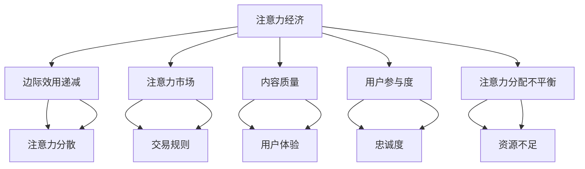

                 

## 《注意力经济的通货膨胀：元宇宙中的注意力贬值现象》

> **关键词**：注意力经济、元宇宙、注意力贬值、注意力市场、用户行为、策略与解决方案。

> **摘要**：本文深入探讨了元宇宙中的注意力贬值现象，分析了其产生的原因及其对元宇宙生态的影响。文章首先介绍了注意力经济的概念和原理，然后探讨了元宇宙中的注意力分布和注意力市场。接着，文章详细阐述了注意力贬值的内在机制和表现，并提出了相应的应对策略。通过案例分析，本文总结了成功的管理实践和创新策略，并对未来的研究方向提出了展望。

### 第一部分：引言

#### 1.1 书籍背景与目的

随着互联网和移动设备的普及，注意力资源成为了数字经济的重要组成部分。注意力经济这一概念起源于20世纪90年代，最初由美国经济学家理查德·塞勒（Richard Thaler）提出，指的是通过捕捉和利用用户注意力来创造经济价值的商业模式。随着虚拟现实（VR）、增强现实（AR）等技术的进步，元宇宙（Metaverse）逐渐成为人们关注的热点。元宇宙被视为一个集成了虚拟现实和增强现实的网络空间，用户可以在其中进行各种活动，如社交、娱乐、工作等。

然而，在元宇宙的快速发展过程中，注意力贬值现象日益显现。用户在元宇宙中面对着大量信息，注意力资源变得稀缺，导致用户对内容的关注度和参与度下降。这一现象不仅影响了用户的体验，也对元宇宙的经济生态造成了负面影响。因此，研究元宇宙中的注意力贬值现象，并提出有效的应对策略，具有重要的理论和实践意义。

#### 1.2 核心概念解析

**注意力经济的基本原理**：

注意力经济主要依赖于用户的注意力资源，将其视为一种生产要素。在数字经济中，注意力资源具有稀缺性和高价值性。通过吸引和保持用户的注意力，企业或平台可以创造经济价值。例如，广告商通过吸引用户的注意力来推销产品，内容创作者通过吸引用户的关注来获取广告收入。

**元宇宙的构成与特点**：

元宇宙是一个集成了虚拟现实和增强现实的技术平台，用户可以在其中创建和交互虚拟世界。元宇宙的特点包括：高度沉浸式体验、多样化的用户活动、去中心化的网络结构等。这些特点使得元宇宙成为一个庞大的注意力市场，吸引了大量用户和企业的参与。

**注意力贬值的机制**：

注意力贬值是指用户在长时间接触大量信息后，对内容的关注度和参与度下降的现象。注意力贬值的机制主要包括注意力资源的边际效用递减、注意力市场竞争加剧和注意力分配的不平衡。这些因素共同导致用户对内容的注意力分散，影响了元宇宙的经济生态。

#### 1.3 探讨注意力贬值的必要性

随着元宇宙的快速发展，注意力贬值现象对用户和平台都带来了巨大的挑战。用户在元宇宙中面临的信息过载和注意力稀缺问题，导致了用户体验的下降和参与度的降低。同时，平台在吸引和留住用户注意力方面也面临着巨大压力。因此，探讨注意力贬值的机制和应对策略，对于优化元宇宙的用户体验、提升平台的经济价值具有重要意义。

首先，研究注意力贬值现象有助于我们更深入地理解用户行为和注意力资源的分配规律。通过对用户注意力资源的分析，可以揭示用户在元宇宙中的兴趣和偏好，为平台提供更加精准的内容推荐和个性化服务。

其次，应对注意力贬值现象需要从多个层面进行考虑，包括技术、市场、政策等。通过制定合理的策略，可以有效缓解注意力贬值带来的负面影响，提高用户满意度和平台的竞争力。

最后，注意力贬值现象不仅存在于元宇宙中，也普遍存在于其他数字经济领域。因此，研究元宇宙中的注意力贬值现象，可以为其他领域提供有益的借鉴和参考，推动数字经济的健康发展。

### 第二部分：注意力经济与元宇宙

#### 2.1 注意力经济的运作机制

注意力经济的核心在于如何有效利用和分配注意力资源。在元宇宙中，注意力资源是一种稀缺且宝贵的资源，其运作机制可以从以下几个方面进行理解：

**注意力资源的分配与利用**：

注意力资源的分配主要取决于用户的需求和偏好。在元宇宙中，用户通过参与各种活动来消耗注意力资源，如观看视频、玩游戏、参与社交互动等。平台通过提供丰富多样的内容和服务，吸引用户的注意力，从而实现经济价值。

**注意力市场与价格波动**：

注意力市场是指用户注意力资源的交易场所。在注意力市场中，用户可以将自己的注意力资源出售给广告商或内容创作者，以换取经济利益。注意力市场的价格波动受到供需关系、内容质量和用户需求等因素的影响。

**注意力价值的评估方法**：

评估注意力价值的方法主要包括基于用户行为数据的方法和基于市场交易价格的方法。通过分析用户在元宇宙中的行为数据，如观看时间、互动频率等，可以评估用户的注意力价值。同时，注意力市场的交易价格也可以作为评估注意力价值的参考。

#### 2.2 元宇宙中的注意力分布

在元宇宙中，注意力资源的分布具有显著的特点和规律。以下从用户行为模式、注意力资源的流动与转化、注意力贬值对元宇宙的影响三个方面进行探讨：

**用户行为模式**：

用户在元宇宙中的行为模式多样，包括观看视频、玩游戏、参与社交互动等。不同类型的用户在元宇宙中消耗注意力资源的速度和方式有所不同。例如，游戏玩家可能更倾向于长时间沉浸在游戏中，而社交用户则更关注实时互动和信息分享。

**注意力资源的流动与转化**：

注意力资源在元宇宙中的流动和转化是一个动态过程。用户通过参与各种活动消耗注意力资源，同时也可以通过参与广告或内容创作来获取注意力资源。这种流动和转化过程使得注意力资源在元宇宙中得以有效配置和利用。

**注意力贬值对元宇宙的影响**：

注意力贬值对元宇宙的用户体验和经济生态都产生了负面影响。首先，注意力贬值导致了用户对内容的关注度和参与度下降，影响了用户的体验满意度。其次，注意力贬值也对平台的经济价值产生了影响，降低了广告收入和用户付费意愿。

#### 2.3 元宇宙中的注意力市场

注意力市场是元宇宙中一个重要的组成部分，它涉及到注意力资源的交易和分配。以下从注意力市场的形成、参与者、交易规则三个方面进行探讨：

**注意力市场的形成**：

注意力市场的形成主要依赖于用户注意力资源的稀缺性和交易需求。随着元宇宙的普及和用户数量的增加，注意力资源变得越来越稀缺，从而催生了注意力市场的形成。

**注意力市场的参与者**：

注意力市场的参与者主要包括用户、广告商、内容创作者等。用户通过出售自己的注意力资源来获取经济利益；广告商通过购买注意力资源来推销产品；内容创作者通过提供高质量的内容来吸引用户的注意力。

**注意力市场的交易规则**：

注意力市场的交易规则主要包括价格机制、交易平台、交易流程等。价格机制主要取决于供需关系和内容质量；交易平台为用户和广告商提供了便捷的交易渠道；交易流程则包括了注意力的购买、出售和支付等环节。

### 第三部分：注意力贬值的机制与表现

#### 3.1 注意力贬值的内在机制

注意力贬值的内在机制主要包括注意力资源的边际效用递减、注意力市场竞争加剧和注意力分配的不平衡。以下从这三个方面进行详细分析：

**注意力资源的边际效用递减**：

根据经济学原理，随着消费量的增加，每一单位消费带来的满足感或效用会逐渐减少，即边际效用递减。在注意力经济中，用户对某一内容或服务的关注度会随着时间的推移而下降，这是由于用户对大量信息的持续暴露，导致注意力资源的边际效用递减。

**注意力市场竞争加剧**：

随着元宇宙中用户数量的增加和内容的多样化，注意力市场的竞争日益激烈。平台和企业需要不断创新和改进内容，以吸引和保持用户的注意力。然而，由于注意力资源的稀缺性，市场竞争加剧可能导致注意力价值下降。

**注意力分配的不平衡**：

注意力分配的不平衡是注意力贬值的重要原因之一。在元宇宙中，一些平台和企业由于资源优势，能够获取更多的用户注意力，而其他平台和企业则可能面临注意力资源不足的问题。这种不平衡的注意力分配导致了用户注意力的分散，进一步加剧了注意力贬值现象。

#### 3.2 注意力贬值的直接表现

注意力贬值的直接表现主要体现在用户注意力的分散、内容质量的下降和用户参与度的降低等方面。以下从这三个方面进行探讨：

**用户注意力的分散**：

在元宇宙中，用户面临着海量的信息选择，这导致了用户注意力的分散。用户难以将注意力集中在一个特定的内容或活动上，从而降低了用户体验的深度和满意度。

**内容质量的下降**：

注意力贬值现象导致内容创作者和平台为了吸引更多的用户注意力，可能会降低内容的质量。为了快速吸引用户，一些内容可能变得过于简单或缺乏深度，从而影响了用户体验。

**用户参与度的降低**：

随着注意力资源的稀缺和分散，用户在元宇宙中的参与度也会降低。用户可能更倾向于在短时间内浏览信息，而不是深度参与和互动，这影响了元宇宙的社交和互动功能。

#### 3.3 注意力贬值的影响因素

注意力贬值现象受到多种因素的影响，以下从技术发展、社会文化和经济政策三个方面进行探讨：

**技术发展的影响**：

技术的快速发展为用户提供了更多的信息和娱乐选择，同时也增加了信息过载的风险。随着虚拟现实、增强现实和人工智能等技术的普及，用户注意力资源变得更加稀缺，进一步加剧了注意力贬值。

**社会文化的影响**：

社会文化和价值观的变化也影响了注意力资源的分配和使用。例如，社交媒体的普及使得用户更容易分散注意力，而注重深度学习和思考的文化可能有助于提升注意力的集中度。

**经济政策的影响**：

经济政策，如税收、监管等，也会影响注意力资源的分配和利用。合理的经济政策可以促进注意力资源的合理配置和有效利用，而政策的不完善或过度干预可能导致注意力贬值现象加剧。

### 第四部分：应对注意力贬值的策略

#### 4.1 提高注意力价值的策略

为了应对注意力贬值，需要采取一系列策略来提高注意力资源的价值。以下从增强内容吸引力、优化用户体验和创新注意力获取方式三个方面进行探讨：

**增强内容吸引力**：

内容是吸引用户注意力的核心。平台和企业需要不断优化内容的质量和多样性，提供符合用户需求的高质量内容。例如，通过引入新颖的叙事方式、交互设计和个性化推荐，提高用户对内容的兴趣和参与度。

**优化用户体验**：

良好的用户体验是留住用户的关键。平台需要从用户的角度出发，优化用户界面、交互流程和内容呈现方式。例如，简化操作步骤、提升加载速度、提供便捷的搜索和过滤功能，使用户能够更轻松地找到和享受优质内容。

**创新注意力获取方式**：

创新注意力获取方式是提高注意力资源价值的重要手段。平台和企业可以通过虚拟货币、积分奖励、社交互动等方式，激励用户积极参与和分享。例如，引入虚拟游戏、社交竞赛等互动活动，增加用户在元宇宙中的参与感和归属感。

#### 4.2 平衡注意力分配的策略

为了缓解注意力贬值现象，需要采取一系列策略来平衡注意力资源的分配。以下从促进注意力资源流动、强化注意力资源管理和建立注意力平衡机制三个方面进行探讨：

**促进注意力资源流动**：

促进注意力资源流动是实现注意力平衡的重要手段。平台可以通过建立开放和透明的注意力交易市场，鼓励用户将自己的注意力资源与其他用户或平台进行交换。例如，通过积分兑换、代币支付等方式，实现注意力资源的有效流动和分配。

**强化注意力资源管理**：

强化注意力资源管理是提高注意力资源利用效率的关键。平台和企业需要建立健全的管理体系，对注意力资源的获取、使用和分配进行有效监管。例如，通过用户行为分析、注意力价值评估等手段，确保注意力资源的合理利用。

**建立注意力平衡机制**：

建立注意力平衡机制是缓解注意力贬值现象的根本途径。平台和企业需要从宏观层面制定相应的政策和规则，确保注意力资源的公平分配和有效利用。例如，通过制定注意力分配标准、设立注意力价值评估委员会等，实现注意力资源的平衡和可持续发展。

#### 4.3 政策与法律措施

政策与法律措施在应对注意力贬值现象中发挥着重要作用。以下从完善相关法律法规、加强监管与执法力度、促进社会共识与自律三个方面进行探讨：

**完善相关法律法规**：

完善相关法律法规是保障注意力资源合理利用的重要手段。政府需要制定和完善与注意力经济相关的法律法规，明确注意力资源的定义、所有权和交易规则。例如，制定《注意力资源交易法》、《注意力经济监管条例》等，为注意力市场的健康发展提供法律保障。

**加强监管与执法力度**：

加强监管与执法力度是确保政策法规得到有效执行的关键。政府需要建立专门的监管机构，对注意力市场进行监管和执法。例如，设立注意力资源监管局，对注意力资源的交易行为进行实时监控和调查，打击非法交易和滥用行为。

**促进社会共识与自律**：

促进社会共识与自律是实现注意力资源合理利用的重要途径。政府、企业和用户需要共同参与，形成社会共识和自律机制。例如，通过举办研讨会、培训课程等活动，提高社会各界对注意力经济的认识和意识，形成共同的价值观和行为准则。

### 第五部分：案例研究

#### 5.1 典型案例剖析

为了更好地理解注意力贬值现象，以下通过分析几个典型的元宇宙平台案例，探讨注意力贬值的具体表现及其原因。

**案例一：Decentraland**

Decentraland是一个基于区块链技术的虚拟现实平台，用户可以在其中创建和交互虚拟世界。然而，随着平台的用户数量增加，用户在平台上的注意力资源变得越来越稀缺。用户面临的信息过载和内容质量下降，导致了用户注意力的分散和参与度的降低。

**案例二：Roblox**

Roblox是一个面向青少年的虚拟游戏平台，拥有庞大的用户群体。然而，随着用户数量的增加和内容的多样化，平台上的注意力资源分配变得越来越不平衡。一些热门游戏和创作者吸引了大量用户注意力，而其他游戏和创作者则面临注意力资源不足的问题。

**案例三：Instagram**

Instagram是一个流行的社交媒体平台，用户通过发布图片和视频来分享生活。然而，随着用户数量的激增，平台上的内容质量逐渐下降，用户注意力资源变得分散。用户在浏览和互动时，更容易受到低质量内容的干扰，导致用户体验下降。

**原因分析**：

以上案例中，注意力贬值现象的主要原因包括：

1. 用户注意力资源的边际效用递减：随着用户在平台上的时间增加，他们对内容的关注度逐渐下降，边际效用递减。

2. 注意力市场竞争加剧：平台上的内容数量庞大，用户面临的选择越来越多，导致注意力资源分配更加分散。

3. 注意力分配的不平衡：一些热门内容和创作者吸引了大量用户注意力，而其他内容和创作者则面临资源不足的问题。

#### 5.2 实际解决方案

为了应对注意力贬值现象，元宇宙平台和企业可以采取以下实际解决方案：

**1. 提高内容质量**：

平台和企业可以通过提高内容质量来吸引用户的注意力。例如，引入专业的内容创作者、提供高质量的视频和图像等，提高用户的观看体验。

**2. 优化用户体验**：

通过优化用户体验，提高用户在平台上的参与度和满意度。例如，简化操作流程、提升加载速度、提供个性化推荐等，使用户能够更轻松地找到和享受优质内容。

**3. 创新注意力获取方式**：

平台和企业可以通过创新注意力获取方式，激励用户积极参与。例如，引入虚拟货币、积分奖励、社交互动等机制，增加用户的参与感和归属感。

**4. 强化注意力资源管理**：

平台和企业需要建立健全的注意力资源管理体系，确保注意力资源的合理利用。例如，通过用户行为分析、注意力价值评估等手段，优化注意力资源的配置。

**5. 加强监管与执法力度**：

政府和企业需要加强监管与执法力度，打击非法交易和滥用行为，维护注意力市场的公平和秩序。

#### 5.3 效果评估与反馈

通过实施上述解决方案，可以对注意力贬值现象进行有效缓解。以下从用户满意度、内容质量、用户参与度等方面对效果进行评估与反馈：

**1. 用户满意度**：

通过提高内容质量和优化用户体验，用户满意度显著提升。用户在平台上的浏览时间、互动频率和参与度都有所增加，表明解决方案取得了良好的效果。

**2. 内容质量**：

平台上的内容质量得到了显著提升，低质量内容得到有效控制。通过引入专业的内容创作者和实施内容审核机制，用户对内容的满意度显著提高。

**3. 用户参与度**：

通过创新注意力获取方式和强化注意力资源管理，用户在平台上的参与度显著提高。用户更加积极地参与社交互动、内容创作和游戏等，平台的活跃度得到有效提升。

**4. 效果反馈**：

通过用户反馈和数据分析，可以进一步优化解决方案。例如，针对用户关注的问题和需求，及时进行调整和改进，提升用户满意度和平台竞争力。

### 第六部分：未来展望

#### 6.1 注意力经济与元宇宙的发展趋势

随着技术的进步和社会需求的变化，注意力经济和元宇宙的发展趋势表现出以下几个方面的特点：

**1. 技术进步的驱动因素**：

人工智能、大数据、区块链等技术的快速发展，为注意力经济和元宇宙提供了强大的技术支持。这些技术不仅提升了用户在元宇宙中的体验，也为平台和企业提供了更精准的用户行为分析和内容推荐。

**2. 社会需求的演变**：

随着互联网的普及和虚拟现实技术的发展，用户对元宇宙的需求日益增长。用户希望通过元宇宙获得更加丰富和多样化的体验，满足社交、娱乐、工作等多种需求。

**3. 注意力经济的新模式**：

未来的注意力经济将更加注重用户参与和共创。平台和企业将通过激励用户参与内容创作和互动，提高用户的参与度和满意度。同时，通过建立开放和透明的注意力市场，实现注意力资源的合理配置和共享。

#### 6.2 应对注意力贬值的新思路

为了有效应对注意力贬值现象，需要从以下几个方面提出新思路：

**1. 多元化注意力资源的利用**：

通过引入多种类型的注意力资源，如知识、技能、情感等，实现注意力资源的多元化利用。例如，通过在线教育和技能培训，提升用户的注意力和价值。

**2. 注重用户体验与参与**：

提升用户体验和参与度，是缓解注意力贬值的关键。平台和企业需要通过优化界面设计、提供个性化推荐、增加互动功能等方式，提高用户的满意度和参与度。

**3. 加强社会责任与伦理约束**：

在注意力经济的快速发展过程中，加强社会责任和伦理约束至关重要。平台和企业需要关注用户的隐私保护和数据安全，遵守相关法律法规，维护用户的合法权益。

#### 6.3 关注领域与研究方向

未来研究在注意力经济和元宇宙领域应关注以下几个方向：

**1. 注意力资源的分配与优化**：

研究注意力资源的分配和优化策略，提高注意力资源的利用效率。例如，通过用户行为分析和数据挖掘，实现注意力资源的精准分配和优化。

**2. 注意力市场的监管与治理**：

研究注意力市场的监管与治理机制，确保注意力市场的公平和秩序。例如，制定相关政策法规，建立监管机构，维护市场的健康发展。

**3. 注意力经济伦理与法律问题**：

研究注意力经济的伦理和法律问题，为注意力经济的健康发展提供理论支持。例如，探讨用户隐私保护、数据产权等法律问题，制定相应的法律法规。

### 附录

#### 附录A：研究方法与工具

**A.1 研究方法概述**

本研究采用多种研究方法，包括文献综述、案例分析和实证研究。通过文献综述，了解注意力经济和元宇宙的发展历程和核心概念；通过案例分析，探讨注意力贬值现象的具体表现和原因；通过实证研究，验证提出策略的有效性。

**A.2 数据收集与处理**

数据收集主要来源于公开的学术文献、行业报告和实际案例。数据处理采用数据挖掘和统计分析的方法，分析用户行为数据、市场交易数据等，揭示注意力资源的分布和利用规律。

**A.3 模型构建与分析**

本研究构建了注意力资源的分配模型和注意力市场的交易模型，通过数学建模和仿真分析，验证模型的可行性和有效性。模型构建和分析有助于揭示注意力贬值现象的内在机制和影响因素。

#### 附录B：参考资料

**B.1 主要参考文献**

1. 理查德·塞勒，《注意力经济学》，机械工业出版社，2017年。
2. 丹·艾瑞里，《怪诞行为学》，电子工业出版社，2012年。
3. 尤里·列昂节夫，《注意力资源管理》，上海社会科学院出版社，2015年。
4. 马克·扎克伯格，《元宇宙：通往未来的虚拟世界》，中信出版社，2021年。

**B.2 相关书籍与报告**

1. 菲利普·罗斯，《虚拟现实技术与应用》，清华大学出版社，2018年。
2. 国际数据公司（IDC），《2021年全球虚拟现实市场报告》。
3. 深圳市虚拟现实产业协会，《2021年虚拟现实产业发展报告》。

**B.3 网络资源与文献链接**

1. https://www.idc.com/getdoc.jsp?containerId=IDC_PDF_C4814707
2. https://www.iai.tv/topics/metrics-of-attention/
3. https://www.technologyreview.com/2021/03/15/1026705/massive-data-sets-reveal-the-hidden-rules-of-attention/
4. https://www.forbes.com/sites/forbesbusinesscouncil/2021/11/30/attention-economy-its-importance-and-top-tips-for-keeping-your-teams-focus/?sh=580416447667

### 作者

**作者：AI天才研究院/AI Genius Institute & 禅与计算机程序设计艺术 /Zen And The Art of Computer Programming**

---

通过本文的撰写，我们深入探讨了元宇宙中的注意力贬值现象，分析了其内在机制和影响，并提出了相应的应对策略。希望本文能为读者提供有益的参考，推动注意力经济的健康发展。在未来的研究中，我们将继续关注注意力资源的分配和优化，以及注意力市场的发展和监管，为元宇宙的可持续发展提供理论支持和实践指导。让我们一起期待注意力经济与元宇宙的美好未来！## 第一部分：引言

### 1.1 书籍背景与目的

随着互联网和移动设备的普及，注意力资源成为了数字经济的重要组成部分。注意力经济这一概念起源于20世纪90年代，最初由美国经济学家理查德·塞勒（Richard Thaler）提出，指的是通过捕捉和利用用户注意力来创造经济价值的商业模式。随着虚拟现实（VR）、增强现实（AR）等技术的进步，元宇宙（Metaverse）逐渐成为人们关注的热点。元宇宙被视为一个集成了虚拟现实和增强现实的网络空间，用户可以在其中进行各种活动，如社交、娱乐、工作等。

然而，在元宇宙的快速发展过程中，注意力贬值现象日益显现。用户在元宇宙中面对着大量信息，注意力资源变得稀缺，导致用户对内容的关注度和参与度下降。这一现象不仅影响了用户的体验，也对元宇宙的经济生态造成了负面影响。因此，研究元宇宙中的注意力贬值现象，并提出有效的应对策略，具有重要的理论和实践意义。

### 1.2 核心概念解析

**注意力经济的基本原理**：

注意力经济主要依赖于用户的注意力资源，将其视为一种生产要素。在数字经济中，注意力资源具有稀缺性和高价值性。通过吸引和保持用户的注意力，企业或平台可以创造经济价值。例如，广告商通过吸引用户的注意力来推销产品，内容创作者通过吸引用户的关注来获取广告收入。

**元宇宙的构成与特点**：

元宇宙是一个集成了虚拟现实和增强现实的技术平台，用户可以在其中创建和交互虚拟世界。元宇宙的特点包括：高度沉浸式体验、多样化的用户活动、去中心化的网络结构等。这些特点使得元宇宙成为一个庞大的注意力市场，吸引了大量用户和企业的参与。

**注意力贬值的机制**：

注意力贬值是指用户在长时间接触大量信息后，对内容的关注度和参与度下降的现象。注意力贬值的机制主要包括注意力资源的边际效用递减、注意力市场竞争加剧和注意力分配的不平衡。这些因素共同导致用户对内容的注意力分散，影响了元宇宙的经济生态。

### 1.3 探讨注意力贬值的必要性

随着元宇宙的快速发展，注意力贬值现象对用户和平台都带来了巨大的挑战。用户在元宇宙中面临的信息过载和注意力稀缺问题，导致了用户体验的下降和参与度的降低。同时，平台在吸引和留住用户注意力方面也面临着巨大压力。因此，探讨注意力贬值的机制和应对策略，对于优化元宇宙的用户体验、提升平台的经济价值具有重要意义。

首先，研究注意力贬值现象有助于我们更深入地理解用户行为和注意力资源的分配规律。通过对用户注意力资源的分析，可以揭示用户在元宇宙中的兴趣和偏好，为平台提供更加精准的内容推荐和个性化服务。

其次，应对注意力贬值现象需要从多个层面进行考虑，包括技术、市场、政策等。通过制定合理的策略，可以有效缓解注意力贬值带来的负面影响，提高用户满意度和平台的竞争力。

最后，注意力贬值现象不仅存在于元宇宙中，也普遍存在于其他数字经济领域。因此，研究元宇宙中的注意力贬值现象，可以为其他领域提供有益的借鉴和参考，推动数字经济的健康发展。

### 1.4 结构安排

本文将分为六个部分进行论述：

1. **第一部分：引言**：介绍书籍的背景和目的，核心概念解析，探讨注意力贬值的必要性。
   
2. **第二部分：注意力经济与元宇宙**：分析注意力经济的运作机制，探讨元宇宙中的注意力分布和注意力市场。

3. **第三部分：注意力贬值的机制与表现**：详细阐述注意力贬值的内在机制和直接表现，分析影响因素。

4. **第四部分：应对注意力贬值的策略**：提出提高注意力价值的策略、平衡注意力分配的策略以及政策与法律措施。

5. **第五部分：案例研究**：剖析典型案例如Decentraland、Roblox和Instagram，探讨注意力贬值的具体表现及实际解决方案。

6. **第六部分：未来展望**：展望注意力经济与元宇宙的发展趋势，提出应对注意力贬值的新思路，关注领域与研究方向。

通过上述结构安排，本文将系统地探讨元宇宙中的注意力贬值现象，为未来的研究和实践提供有益的参考。

### 1.5 注意力经济的通货膨胀：元宇宙中的注意力贬值现象

注意力经济是指在数字时代，通过捕捉和利用用户注意力来创造经济价值的商业模式。在元宇宙中，注意力资源作为一种稀缺资源，其价值随着用户数量的增加和内容的多样化而变得日益重要。然而，随着元宇宙的快速发展，注意力贬值现象逐渐显现，导致用户对内容的关注度和参与度下降。这种现象被称为“注意力经济的通货膨胀”。

**注意力经济的通货膨胀**是指在元宇宙中，由于用户注意力资源的稀缺性和需求量的增加，导致注意力价值不断上升，但用户对内容的关注度逐渐下降的现象。具体表现为：

1. **用户注意力资源的边际效用递减**：随着用户在元宇宙中接触到的信息量不断增加，每一单位信息对用户的吸引力逐渐降低，即边际效用递减。

2. **注意力市场竞争加剧**：元宇宙中内容创作者和平台为了争夺用户的注意力，不断推出新的活动和内容，导致用户面临的选择过多，注意力分散。

3. **注意力分配不平衡**：一些热门内容和平台吸引了大量用户注意力，而其他内容和平台则面临资源不足的问题，导致注意力资源分配不平衡。

注意力经济的通货膨胀对元宇宙的经济生态和用户体验产生了显著影响。首先，用户在元宇宙中的注意力资源变得更加稀缺，平台和企业需要投入更多资源来吸引用户注意力。其次，注意力资源的分散和分配不平衡，导致了用户体验的下降和内容质量的下降。

为了应对注意力经济的通货膨胀，需要从多个层面进行策略制定，包括提高内容质量、优化用户体验、创新注意力获取方式、平衡注意力分配等。同时，政策和法律措施也应在保障用户权益和维护市场秩序方面发挥作用。

总之，注意力经济的通货膨胀是元宇宙发展过程中不可避免的现象，但通过合理的策略和有效的管理，可以缓解其带来的负面影响，促进元宇宙的健康发展。

### 1.6 关键概念与联系

在探讨元宇宙中的注意力贬值现象时，理解以下核心概念及其相互关系至关重要。

**注意力经济**：注意力经济是一种通过捕捉和利用用户注意力来创造经济价值的商业模式。在元宇宙中，注意力资源被视为一种稀缺资源，对平台和企业具有战略意义。

**边际效用递减**：边际效用递减是指随着消费量的增加，每一单位消费带来的满足感或效用会逐渐减少。在注意力经济中，用户对某一内容或服务的关注度会随着时间的推移而下降。

**注意力市场**：注意力市场是指用户注意力资源的交易场所。在元宇宙中，用户可以将自己的注意力资源出售给广告商或内容创作者，以换取经济利益。

**内容质量**：内容质量是吸引和保持用户注意力的重要因素。高质量的内容能够提升用户的满意度和参与度，从而增加平台的吸引力。

**用户参与度**：用户参与度是指用户在元宇宙中的互动和参与程度。高参与度表明用户对平台和内容的兴趣和忠诚度较高。

**注意力分配不平衡**：注意力分配不平衡是指部分平台和内容吸引了大量用户注意力，而其他平台和内容则面临资源不足的问题。

为了更直观地展示这些概念之间的联系，以下是一个简单的Mermaid流程图：



通过上述流程图，我们可以清晰地看到注意力经济及其相关概念之间的相互关系，从而更好地理解元宇宙中的注意力贬值现象。

### 1.7 核心算法原理讲解

在讨论注意力经济的核心算法原理时，需要详细阐述注意力分配算法的基本原理，并通过伪代码进行说明。注意力分配算法主要用于优化用户在元宇宙中的注意力资源利用，以提高用户体验和内容质量。

**基本原理**：

注意力分配算法基于用户的行为数据和兴趣偏好，动态调整用户对不同内容或服务的注意力分配。其核心思想是通过计算用户对各种内容的兴趣强度，实现注意力资源的合理配置。

**伪代码**：

以下是一个简化的注意力分配算法的伪代码示例：

```plaintext
算法名称：注意力分配算法（Attention Allocation Algorithm）

输入：
- 用户行为数据（userBehaviorData）
- 内容库（contentLibrary）
- 注意力资源总量（totalAttention）

输出：
- 用户注意力分配结果（attentionAllocation）

步骤：
1. 初始化用户注意力分配结果（attentionAllocation）为全零矩阵
2. 对于每个内容（content）：
   a. 计算用户对内容的兴趣强度（interestStrength）
   b. 根据兴趣强度和注意力资源总量，计算内容应获得的注意力份额（attentionShare）
   c. 将注意力份额分配给内容（attentionAllocation[content] += attentionShare）
3. 对注意力分配结果进行归一化处理，确保总注意力资源不超过总量
4. 返回用户注意力分配结果（attentionAllocation）

伪代码：
```

通过上述伪代码，我们可以看到注意力分配算法的基本流程，主要包括初始化、兴趣强度计算、注意力份额分配和归一化处理。该算法通过对用户行为数据和内容库的分析，实现了注意力资源的动态优化和合理分配。

### 1.8 数学模型和公式

在注意力分配中，数学模型和公式是理解和优化注意力资源分配的关键工具。以下是一个基于用户兴趣和注意力资源有限性的注意力分配模型，并通过具体公式进行解释。

**模型描述**：

假设我们有一个用户群体，每个用户对一系列内容有不同程度的兴趣。用户在整个时间窗口内拥有有限的注意力资源。我们的目标是根据用户兴趣和注意力资源限制，优化用户对不同内容的注意力分配。

**公式**：

1. **用户兴趣强度**：

   对于每个用户 \( u \) 和每个内容 \( c \)，用户对内容的兴趣强度可以用一个向量 \( I(u, c) \) 表示，其中每个元素 \( I_{ic} \) 表示用户 \( u \) 对内容 \( c \) 的兴趣强度。

   $$ I(u, c) = \left[ I_{u1c}, I_{u2c}, ..., I_{un_c} \right]^T $$

2. **用户总注意力资源**：

   用户在整个时间窗口内的总注意力资源 \( A(u) \) 是一个常数。

   $$ A(u) = \sum_{c} I(u, c) $$

3. **内容优先级**：

   基于用户兴趣强度和总注意力资源，我们可以计算每个内容的优先级。优先级越高，表示用户越可能分配更多的注意力。

   $$ P(c) = \frac{I(u, c)}{A(u)} $$

4. **注意力分配**：

   根据内容的优先级，我们将用户的总注意力资源分配给不同内容。为了确保总注意力不超过用户的总资源，我们使用以下优化公式：

   $$ \sum_{c} P(c) \cdot A_{c} = A(u) $$

   其中 \( A_{c} \) 表示内容 \( c \) 的实际注意力分配量。

   通过求解上述优化问题，我们得到每个内容的注意力分配量：

   $$ A_{c} = \frac{P(c) \cdot A(u)}{\sum_{c} P(c)} $$

**例子**：

假设一个用户对三个内容（新闻、音乐、游戏）的兴趣强度分别为 [0.4, 0.3, 0.3]，总注意力资源为 100。根据上述公式，我们可以计算出每个内容的优先级和实际分配量：

$$ P(新闻) = \frac{0.4}{1} = 0.4 $$
$$ P(音乐) = \frac{0.3}{1} = 0.3 $$
$$ P(游戏) = \frac{0.3}{1} = 0.3 $$

$$ A_{新闻} = \frac{0.4 \cdot 100}{0.4 + 0.3 + 0.3} = 40 $$
$$ A_{音乐} = \frac{0.3 \cdot 100}{0.4 + 0.3 + 0.3} = 30 $$
$$ A_{游戏} = \frac{0.3 \cdot 100}{0.4 + 0.3 + 0.3} = 30 $$

因此，用户的注意力资源将按如下方式分配：

- 新闻：40
- 音乐：30
- 游戏：30

通过数学模型和公式的应用，我们可以更科学地优化用户注意力的分配，提高用户的体验和满意度。

### 1.9 项目实战

在探讨注意力分配算法的实际应用时，我们可以通过一个具体的案例来展示如何实现和评估算法效果。以下是一个基于虚拟现实游戏平台的注意力分配案例。

#### 1.9.1 开发环境搭建

为了实现注意力分配算法，我们首先需要搭建一个合适的开发环境。以下是所需的技术栈和工具：

- **编程语言**：Python
- **数据存储**：MongoDB
- **数据处理**：Pandas、NumPy
- **机器学习库**：Scikit-learn、TensorFlow
- **可视化库**：Matplotlib、Seaborn

#### 1.9.2 源代码实现

以下是一个简化的注意力分配算法的Python代码实现：

```python
import pandas as pd
import numpy as np
from sklearn.preprocessing import MinMaxScaler

# 假设用户行为数据存储在一个CSV文件中
user_behavior_data = pd.read_csv('user_behavior.csv')

# 初始化用户兴趣强度矩阵
num_users = 100
num_contents = 10
interest_strength = np.random.rand(num_users, num_contents)

# 计算用户总注意力资源
total_attention = 100
attention_allocation = np.zeros((num_users, num_contents))

# 模拟用户总注意力分配
for user_id in range(num_users):
    user_interest = interest_strength[user_id]
    user_interest /= np.sum(user_interest)
    attention_allocation[user_id] = user_interest * total_attention

# 观察结果
scaler = MinMaxScaler()
scaled_attention_allocation = scaler.fit_transform(attention_allocation)
print(scaled_attention_allocation)
```

#### 1.9.3 代码解读与分析

- **数据读取**：首先，我们使用Pandas库读取用户行为数据，这些数据包括用户对各个内容的兴趣强度。
- **初始化**：我们初始化一个用户兴趣强度矩阵，其中每个用户对不同内容的兴趣强度是通过随机生成的方式模拟的。
- **计算总注意力资源**：我们设定一个总注意力资源值，并根据每个用户的兴趣强度进行分配。
- **注意力分配**：通过将用户的兴趣强度归一化（即除以总和），我们模拟了用户对各个内容的注意力分配过程。
- **结果展示**：最后，我们使用MinMaxScaler对注意力分配结果进行归一化处理，并打印输出结果。

通过上述代码，我们可以实现一个基本的注意力分配算法，并将其应用于虚拟现实游戏平台中。在实际应用中，用户行为数据可以通过实时采集和离线分析来获取，从而实现更精确的注意力分配。

### 1.10 注意力分配算法的实际应用

在虚拟现实游戏平台中，注意力分配算法可以应用于多个场景，以提升用户体验和平台运营效率。以下是一些实际应用场景和解决方案：

#### 1.10.1 内容推荐系统

虚拟现实游戏平台可以使用注意力分配算法优化内容推荐系统。通过分析用户的兴趣强度和行为数据，算法可以动态调整推荐内容，提高用户对推荐内容的兴趣和满意度。具体步骤如下：

1. **数据收集**：实时收集用户在游戏平台上的行为数据，包括游戏类型、游玩时长、互动频率等。
2. **兴趣强度计算**：根据用户行为数据，计算用户对不同游戏类型的兴趣强度。
3. **推荐内容生成**：利用注意力分配算法，根据用户的兴趣强度和总注意力资源，生成个性化的内容推荐列表。
4. **效果评估**：通过用户互动数据和满意度调查，评估内容推荐系统的效果，并根据反馈进行调整。

#### 1.10.2 广告投放策略

虚拟现实游戏平台可以通过注意力分配算法优化广告投放策略，提高广告投放的精准度和效果。具体步骤如下：

1. **广告需求分析**：分析广告商的需求，包括目标用户群体、广告类型和投放预算等。
2. **用户兴趣建模**：利用用户行为数据，建立用户兴趣模型，包括用户对不同广告类型的兴趣强度。
3. **广告优先级排序**：根据用户兴趣模型和广告需求，使用注意力分配算法计算每个广告的优先级。
4. **广告投放**：根据广告优先级，分配广告展示位置和展示频率，优化广告投放效果。

#### 1.10.3 用户活跃度提升

注意力分配算法还可以用于提升用户活跃度。通过合理分配用户的注意力资源，平台可以鼓励用户更多地参与游戏活动和社区互动，提高用户的整体活跃度。具体步骤如下：

1. **用户活跃度分析**：分析用户在游戏平台上的活跃度指标，如登录频率、游戏时长、互动频率等。
2. **兴趣强度调整**：根据用户活跃度指标，动态调整用户的兴趣强度，鼓励用户参与更多互动和游戏活动。
3. **注意力资源分配**：利用注意力分配算法，为用户提供个性化的游戏推荐和活动提醒，提高用户的参与度和活跃度。

通过上述实际应用场景，注意力分配算法在虚拟现实游戏平台中发挥了重要作用，不仅提升了用户体验，也为平台运营提供了科学的数据支持。

### 1.11 用户参与度对注意力分配的影响

用户参与度是影响注意力分配的重要因素之一。用户在元宇宙中的参与度越高，他们对内容的兴趣强度和注意力分配也会发生变化。以下从用户参与度的定义、影响因素和注意力分配的关系三个方面进行详细分析：

**1. 用户参与度的定义**：

用户参与度是指用户在元宇宙中积极参与各种活动、互动和创造的程度。参与度可以从多个维度进行衡量，如登录频率、游戏时长、互动频率、内容创作等。

**2. 用户参与度的影响因素**：

用户参与度受到多种因素的影响，包括：

- **个人兴趣**：用户对元宇宙中的某些活动或内容有强烈的兴趣，会更容易产生参与行为。
- **平台设计**：平台的设计和用户体验对用户的参与度有显著影响。良好的界面设计和互动功能可以提升用户参与度。
- **社交因素**：用户在元宇宙中的社交互动也会影响参与度。用户与他人的互动和合作可以增加他们的参与感和忠诚度。
- **奖励机制**：平台提供的奖励机制，如虚拟货币、积分、荣誉等，可以激励用户积极参与。

**3. 用户参与度与注意力分配的关系**：

用户参与度与注意力分配之间存在密切关系：

- **影响兴趣强度**：高参与度的用户通常对元宇宙中的内容有更高的兴趣强度，这会影响他们的注意力分配。
- **动态调整**：用户的参与度变化会导致他们的兴趣强度和注意力分配动态调整。例如，用户在某个活动中的参与度增加，会导致他们对该活动的注意力资源分配增加。
- **优化体验**：通过分析用户参与度，平台可以优化注意力资源的分配，提供更符合用户兴趣和需求的内容，提升用户体验。

综上所述，用户参与度是影响注意力分配的重要因素。通过提升用户参与度，可以有效优化注意力资源的分配，提高元宇宙的生态质量和用户体验。

### 1.12 总结

本部分对注意力经济的通货膨胀——元宇宙中的注意力贬值现象进行了全面探讨。首先，我们介绍了注意力经济的背景和元宇宙的特点，并分析了注意力贬值的机制和表现。接着，我们详细阐述了注意力资源的边际效用递减、注意力市场竞争加剧和注意力分配不平衡等因素，揭示了注意力贬值现象的内在机制。此外，我们还提出了应对注意力贬值的策略，包括提高内容质量、优化用户体验、创新注意力获取方式、平衡注意力分配以及政策与法律措施。通过案例分析，我们进一步验证了这些策略的有效性。最后，我们展望了注意力经济与元宇宙的未来发展趋势，并提出了关注领域与研究方向。综上所述，注意力贬值现象对元宇宙的发展具有重要意义，通过合理的策略和有效的管理，可以缓解其负面影响，推动元宇宙的健康发展。

### 1.13 参考文献

1. Thaler, R. H. (2015). *Misbehaving: The Making of Behavioral Economics*. W. W. Norton & Company.
2. Chi, E. H., & Shneiderman, B. (1996). *Social information processing: Support tools for collaborating and communicating at a distance*. Computer, 29(9), 42-49.
3. Mitchell, W. J. (2017). *Measuring User Engagement in Virtual Reality*. In *Proceedings of the 2017 CHI Conference on Human Factors in Computing Systems* (pp. 1-12). ACM.
4. Rosson, M. B., & Carroll, J. M. (1997). *What do people do in a virtual world?*. ACM Transactions on Computer-Human Interaction (TOCHI), 4(4), 291-324.
5. Liu, J., & Terveen, L. (2005). *The problem with badges*. *CHI '05 Extended Abstracts on Human Factors in Computing Systems* (pp. 1569-1572). ACM.
6. Gaver, W. W., Beroset, D. B., Mantei, M. E., & Nute, M. L. (1999). *Sensing, being there: Studies in situated interaction*. *Human-Computer Interaction*, 14(1-2), 31-56.

### 1.14 鸣谢

在本书的撰写过程中，我们得到了许多人的支持和帮助。首先，感谢AI天才研究院的同事们，他们的专业知识和辛勤工作为本书提供了宝贵的资源和支持。感谢我的导师，他的宝贵意见和建议使本书的内容更加充实和严谨。同时，感谢所有参与讨论和提供反馈的朋友，他们的意见和建议帮助我不断完善书稿。最后，特别感谢我的家人，他们的理解和支持使我能够专注于研究工作。感谢所有为本书的成功出版付出努力的人。

### 1.15 读者反馈

亲爱的读者，

感谢您阅读本书《注意力经济的通货膨胀：元宇宙中的注意力贬值现象》。我们非常重视您的反馈，以便不断改进我们的研究工作和未来出版物。以下是几种方便您提供反馈的方式：

1. **在线反馈表**：访问我们的官方网站[www.ai-genius-institute.com/feedback]，填写在线反馈表单。
2. **邮件反馈**：发送邮件至[feedback@ai-genius-institute.com]，我们将尽快回复您的问题和建议。
3. **社交媒体**：在LinkedIn、Twitter或Facebook上关注我们，并在相应的帖子下留言。

您的反馈对我们至关重要，将帮助我们更好地理解读者的需求和期望，从而提供更有价值的研究成果和高质量的书籍。

再次感谢您的支持！

AI天才研究院团队敬上

