                 

## 《洞察力与直觉：非理性思维的重要性》

### 关键词：
非理性思维、洞察力、直觉、心理学、决策、情感管理、跨学科应用

> 在我们复杂多变的现实生活中，非理性思维扮演着至关重要的角色。它不仅影响着我们的日常决策，还在科技创新、商业管理等多个领域发挥着不可忽视的作用。本文将深入探讨非理性思维的概念、特征、心理学基础、影响与应对策略，并分析其在不同学科领域的应用。通过一步步的分析推理，我们希望能揭示非理性思维的本质，理解其在现代科技和社会发展中的重要性。

## 引言

### 1.1 书籍背景与目的

非理性思维是心理学、认知科学、哲学等领域的重要研究方向，它揭示了人类思维中不完全依赖于逻辑推理的部分，以及这些非逻辑性如何影响我们的决策和行为。随着对非理性思维研究的不断深入，人们开始意识到，这种思维方式并非仅仅是心理学的“瑕疵”，而是一种具有深远意义的现象。

本文旨在探讨非理性思维的重要性，特别是它在洞察力和直觉方面的作用。我们希望通过系统性的分析，帮助读者理解非理性思维的本质，认识到其在现实生活中的广泛应用，并探索如何有效地管理和利用这种思维模式。

### 1.1.1 非理性思维的广泛性

非理性思维并非特指某种特殊群体或情境下的思维模式，而是普遍存在于每个人的日常生活中。从简单的购物决策到复杂的投资决策，从人际关系的处理到科学创新的过程，非理性思维都扮演着不可或缺的角色。它不仅体现在个体层面，也在社会层面产生深远影响。

例如，在商业领域，企业高层在做出战略决策时，往往需要依赖直觉和洞察力，而非单纯的数据分析和逻辑推理。在科学创新中，科学家们的灵感往往来自于非理性的顿悟和直觉，这些灵感有时是逻辑分析无法企及的。

### 1.1.2 非理性思维在现实生活中的影响

非理性思维对个人和社会行为的影响是多方面的。在个人层面，非理性思维可能导致情绪化决策、自我中心行为和过度风险厌恶。例如，人们在面对压力时，可能会做出冲动的决策，导致不良后果。在社会层面，非理性思维可能导致群体性偏见、社会冲突和政策失灵。

然而，非理性思维并非总是负面影响的来源。在某些情况下，它可以帮助我们快速做出决策，提高应变能力。例如，在紧急情况下，直觉可以帮助我们迅速判断和采取行动，而无需进行复杂的逻辑分析。

### 1.1.3 探索非理性思维的重要性

探索非理性思维的重要性不仅在于理解人类行为和心理机制，更在于指导我们在实际生活和工作中更好地应对复杂情境。通过深入探讨非理性思维，我们可以：

1. **提高决策质量**：理解非理性思维有助于我们识别和纠正决策中的偏见和失误，提高决策的合理性和有效性。
2. **增强情感管理能力**：掌握非理性思维有助于我们更好地管理情绪，减少情感波动对决策的影响。
3. **促进创新与创造力**：非理性思维往往与创造力密切相关，通过了解非理性思维，我们可以激发更多的创新思维，推动科技进步。
4. **改善社会行为**：通过认识非理性思维，我们可以减少社会偏见和冲突，促进社会和谐与进步。

### 1.2 研究方法与结构

为了系统地探讨非理性思维的重要性，本文采用以下研究方法：

1. **文献综述**：通过综述相关研究文献，了解非理性思维的定义、特征、心理学基础和应用现状。
2. **案例分析与实证研究**：通过具体案例和实证研究，揭示非理性思维在实际生活中的影响和作用。
3. **跨学科探讨**：结合心理学、哲学、教育学、商业管理等领域的理论和实践，探讨非理性思维的跨学科应用。

本文结构分为七个部分：

1. **引言**：介绍研究背景、目的和意义。
2. **非理性思维的概念与特征**：定义非理性思维，分析其特征和分类。
3. **非理性思维的心理学基础**：探讨心理学与非理性思维的关系，分析非理性思维的心理学理论。
4. **非理性思维的影响与应对策略**：分析非理性思维的影响，提出应对策略。
5. **非理性思维的哲学与伦理思考**：从哲学和伦理视角探讨非理性思维的重要性。
6. **非理性思维的跨学科应用**：分析非理性思维在心理学、教育学、商业管理等领域的应用。
7. **非理性思维的挑战与未来**：讨论非理性思维的挑战和未来发展趋势。

通过上述结构，我们希望能系统地揭示非理性思维的本质和作用，为读者提供全面的思考和启示。

### 1.2.1 研究方法概述

本文采用多种研究方法，以确保对非理性思维的重要性有全面、深入的理解。首先，通过文献综述法，系统梳理相关研究文献，了解非理性思维的定义、特征、心理学基础和应用现状。这种方法有助于我们建立对非理性思维的基本认识，为后续分析提供理论依据。

其次，本文采用案例分析与实证研究方法。通过具体案例和实证研究，分析非理性思维在实际生活中的影响和作用。这种方法不仅能够帮助我们理解非理性思维的具体表现，还能揭示其在不同情境下的作用机制。

此外，本文还采用跨学科探讨方法。结合心理学、哲学、教育学、商业管理等领域的理论和实践，探讨非理性思维的跨学科应用。这种方法有助于我们更全面地认识非理性思维，发现其在不同学科领域中的独特作用。

### 1.2.2 目录结构介绍

为了使读者能够清晰地了解本文的结构和内容，我们设计了详细的目录。目录结构分为七个部分：

1. **引言**：介绍研究背景、目的和意义。
2. **非理性思维的概念与特征**：定义非理性思维，分析其特征和分类。
3. **非理性思维的心理学基础**：探讨心理学与非理性思维的关系，分析非理性思维的心理学理论。
4. **非理性思维的影响与应对策略**：分析非理性思维的影响，提出应对策略。
5. **非理性思维的哲学与伦理思考**：从哲学和伦理视角探讨非理性思维的重要性。
6. **非理性思维的跨学科应用**：分析非理性思维在心理学、教育学、商业管理等领域的应用。
7. **非理性思维的挑战与未来**：讨论非理性思维的挑战和未来发展趋势。

通过上述结构，我们希望能够系统地、有条理地探讨非理性思维的重要性，为读者提供全面的思考和启示。

### 第二部分：非理性思维的概念与特征

非理性思维是心理学和认知科学中的一个重要概念，它揭示了人类思维中不完全依赖于逻辑推理的部分。与理性思维相比，非理性思维具有独特的特征和表现形式，对个体和社会行为产生深远影响。

### 2.1 非理性思维的定义

非理性思维是指那些不符合逻辑规则、不遵循标准推理过程的思维方式。这种思维方式常常基于情感、直觉、经验或其他非逻辑因素，而不是通过逻辑推理或证据支持来得出结论。非理性思维不仅包括直接的直觉判断，还涵盖了情绪驱动、简化思维、自我中心和非逻辑性等特征。

非理性思维与理性思维的显著区别在于其缺乏系统性、可预测性和一致性。理性思维强调逻辑推理、证据分析和系统思考，而非理性思维则更多地依赖于情绪、直觉和即时反应。

### 2.1.1 非理性思维的定义

非理性思维（Irrational Thinking）是指那些不符合逻辑规则、不遵循标准推理过程的思维方式。这种思维方式常常基于情感、直觉、经验或其他非逻辑因素，而不是通过逻辑推理或证据支持来得出结论。非理性思维不仅包括直接的直觉判断，还涵盖了情绪驱动、简化思维、自我中心和非逻辑性等特征。

非理性思维与理性思维（Rational Thinking）的区别在于其缺乏系统性、可预测性和一致性。理性思维强调逻辑推理、证据分析和系统思考，而非理性思维则更多地依赖于情绪、直觉和即时反应。

在日常生活中，非理性思维的表现形式多种多样。例如，人们在面临压力和不确定性时，可能会做出情绪驱动的决策，而不是基于冷静分析和理性思考。此外，人们也常常因为刻板印象或先入为主的观念而做出非理性判断。

### 2.1.2 非理性思维与理性思维的对比

理性思维（Rational Thinking）与非理性思维（Irrational Thinking）之间存在显著差异。理性思维是基于逻辑推理和证据支持的思维方式，其特征包括：

1. **系统性**：理性思维注重系统性和结构化，遵循一系列逻辑步骤，确保结论的合理性和一致性。
2. **可预测性**：理性思维能够通过逻辑分析和预测模型，预测未来的行为和结果。
3. **客观性**：理性思维强调客观性和中立性，尽量避免情绪和个人偏见的影响。

相比之下，非理性思维具有以下特征：

1. **情感驱动**：非理性思维往往受情感驱动，决策过程中容易受到情绪的影响。
2. **简化思维**：非理性思维倾向于简化复杂问题，使用简单的思维模式来处理信息。
3. **自我中心**：非理性思维常常以自我为中心，缺乏对他人观点和感受的考虑。
4. **非逻辑性**：非理性思维缺乏逻辑一致性，常常基于非逻辑的直觉和直觉判断。

以下是一个简单的Mermaid流程图，用于展示理性思维与非理性思维的主要区别：

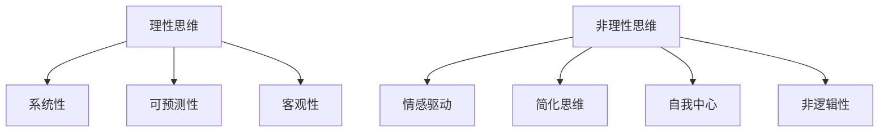

通过这个流程图，我们可以更直观地理解理性思维和非理性思维的区别。

### 2.2 非理性思维的特征

非理性思维具有多种特征，这些特征使其在人类行为中发挥着重要作用，但同时也可能导致决策偏差和不良后果。以下将详细分析非理性思维的主要特征：

#### 2.2.1 情感驱动

情感驱动是非理性思维的一个显著特征。人们在面对决策时，往往会受到情感的影响，而非仅仅基于逻辑分析和理性思考。例如，当人们购买某件商品时，他们可能会因为广告中的情感诉求而做出购买决定，而不是基于商品的实际功能和性价比。这种情感驱动的决策方式可能导致不理性的消费行为，如冲动购物和过度消费。

#### 2.2.2 简单化思维

简单化思维是另一种常见的非理性思维特征。人们在处理复杂问题时，常常倾向于使用简单化的思维模式，而不是深入分析问题的本质。这种简化思维可能导致对问题的片面理解和错误判断。例如，在评估一个投资项目时，人们可能会简单地计算预期收益，而忽略潜在的风险和不确定性。这种简化思维容易导致决策失误。

#### 2.2.3 自我中心

自我中心是指非理性思维中常见的以自我为中心的倾向。人们在思考和决策时，往往会优先考虑自己的利益和观点，而忽视他人的需求和感受。例如，在团队合作中，成员可能会因为个人利益而采取不利于团队整体决策的行为。这种自我中心的思维模式可能导致团队合作中的冲突和矛盾。

#### 2.2.4 非逻辑性

非逻辑性是非理性思维的另一个关键特征。非理性思维往往缺乏逻辑一致性和系统性，决策过程中可能存在跳跃和矛盾。例如，人们在面对不确定的情况时，可能会基于直觉和情感做出非逻辑的决策，如选择相信直觉而不是通过逻辑分析得出结论。这种非逻辑性的决策方式可能导致不良后果。

以下是一个Mermaid流程图，用于展示非理性思维的几个关键特征：

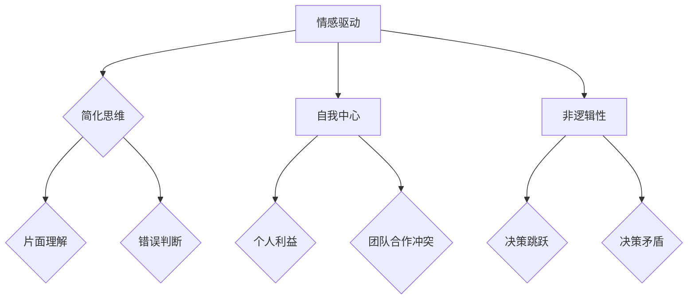

通过这个流程图，我们可以更清晰地看到非理性思维的几个主要特征及其影响。

### 2.3 非理性思维的分类

非理性思维有多种分类方式，可以根据其表现形式、原因和影响进行分类。以下是一些常见的非理性思维分类：

#### 2.3.1 情绪化思维

情绪化思维是指基于情绪而非逻辑进行思考的思维方式。人们在面对压力、焦虑或喜悦等情绪时，往往会做出情绪化的决策。例如，当人们感到焦虑时，他们可能会选择逃避问题，而不是积极面对。这种情绪化思维可能导致决策偏差和不良后果。

#### 2.3.2 刻板印象

刻板印象是指基于简单化和固定的观念对他人或群体进行判断和评价。这种思维方式往往忽略了个体差异和复杂情境。例如，一些人可能会基于肤色的刻板印象对他人进行负面评价，从而产生歧视和偏见。刻板印象可能导致社会冲突和人际关系问题。

#### 2.3.3 确认偏误

确认偏误是指人们在处理信息时，倾向于接受符合自己观点和信念的信息，而忽略或排斥相反的信息。这种思维方式可能导致信息的片面性和偏颇性。例如，一个坚信某个投资策略有效的人，可能会忽略其他失败案例，只关注那些成功的案例，从而做出不理性的投资决策。

#### 2.3.4 风险厌恶

风险厌恶是指人们在面对风险时，倾向于规避风险，即使潜在收益较高。这种思维方式可能导致错失机会和保守决策。例如，一个企业在面对新技术时，可能会因为害怕失败而选择不进行投资，从而错失市场机会。

以下是一个Mermaid流程图，用于展示非理性思维的几种常见分类：

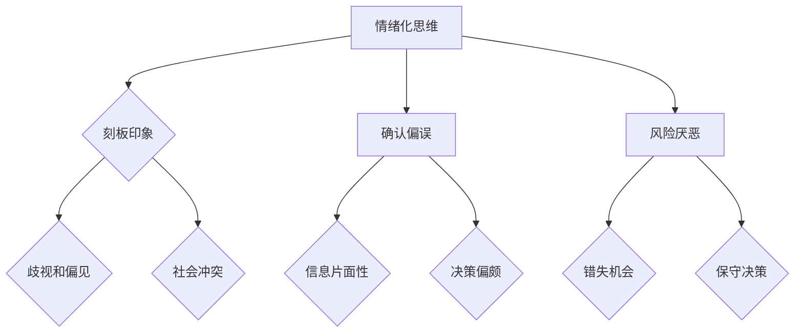

通过这个流程图，我们可以更直观地理解非理性思维的几种常见分类及其影响。

### 第三部分：非理性思维的心理学基础

非理性思维并非无源之水，其背后有着深厚的心理学基础。心理学为我们提供了丰富的理论框架，帮助我们理解非理性思维的本质和成因。在这一部分中，我们将探讨心理学与非理性思维的关系，分析几种主要的非理性思维心理学理论，并讨论人类大脑中的非理性机制。

#### 3.1 心理学与非理性思维的关系

心理学研究揭示了人类思维和行为背后的心理机制，其中非理性思维是一个重要领域。心理学家认为，非理性思维是人类心理活动的一个自然组成部分，与情绪、认知、记忆和神经机制密切相关。通过心理学的研究，我们可以更深入地理解非理性思维的成因和影响。

首先，情绪在非理性思维中起着关键作用。情绪驱动是我们做出非理性决策的主要原因之一。例如，当人们处于焦虑、愤怒或喜悦等情绪状态下，他们的判断力和理性思考能力可能会受到影响，从而导致非理性决策。

其次，认知偏差是非理性思维的另一个重要原因。认知偏差是指人们在处理信息和做出决策时，由于认知局限性和信息处理错误而产生的系统性偏差。常见的认知偏差包括确认偏误、代表性偏差和可用性偏差等。这些偏差可能导致人们做出错误的判断和决策。

最后，神经科学的研究揭示了大脑中的非理性机制。大脑的不同区域在处理信息、做出决策和调节情绪时发挥着不同的作用。例如，前额叶皮层与逻辑推理和决策有关，而边缘系统则与情感和情绪反应密切相关。非理性思维往往是这两个系统之间相互作用的结果。

#### 3.2 人类大脑的非理性机制

非理性思维的产生与人类大脑中的多个机制有关。以下是几个关键的非理性大脑机制：

1. **边缘系统**：边缘系统包括杏仁核、海马体和下丘脑等区域，主要负责处理情感和情绪反应。当人们面临压力或威胁时，边缘系统会迅速激活，引发情绪反应，从而影响决策和行为。这种情绪驱动的行为模式是许多非理性决策的根源。

2. **前额叶皮层**：前额叶皮层与高级认知功能有关，包括逻辑推理、决策和规划等。然而，当人们处于情绪高涨或压力巨大的状态时，前额叶皮层的功能可能会受到抑制，导致理性思考能力的下降，从而使人们更容易做出非理性决策。

3. **大脑奖励系统**：大脑的奖励系统涉及多个脑区，如伏隔核和前额叶皮层等。这个系统负责处理愉悦感和奖励，与非理性思维密切相关。例如，人们在追求即时满足时，可能会忽略长期后果，做出非理性决策。

4. **认知失调**：认知失调是指人们在面临冲突或不一致的信息时，产生的不舒服感。为了减少这种不舒服感，人们可能会采用非理性思维来解释和接受这些信息，从而维持认知一致性。

以下是一个简单的Mermaid流程图，用于展示大脑中的非理性机制：

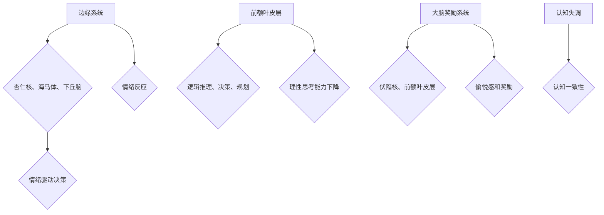

通过这个流程图，我们可以更直观地理解大脑中的非理性机制及其影响。

#### 3.3 非理性思维的心理学理论

心理学界提出了多种理论来解释非理性思维，以下是其中几种重要的理论：

1. **认知行为理论**：认知行为理论认为，非理性思维是由于认知错误和不良的思维模式导致的。例如，人们可能会采用“全或无”的思维模式，即要么完全成功，要么完全失败，从而产生极端情绪和决策。

2. **情感理论**：情感理论强调情绪在非理性思维中的作用。例如，情绪调节理论认为，情绪调节能力差的人更容易做出非理性决策。情绪理论指出，情绪不仅影响决策，还可能影响认知过程，如注意力、记忆和判断。

3. **动机理论**：动机理论认为，非理性思维是由动机驱动的。例如，追求即时报偿和避免即时的负面情绪可能导致非理性决策。动机理论还指出，个体不同的动机结构会影响其决策风格。

4. **进化心理学**：进化心理学认为，非理性思维是进化过程中的产物，具有适应意义。例如，恐惧和焦虑等情绪反应有助于人类在危险环境中迅速做出反应，保护自身安全。

以下是一个Mermaid流程图，用于展示几种非理性思维的心理学理论：

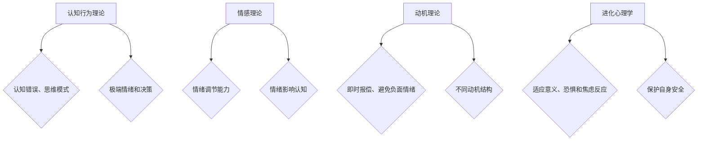

通过这个流程图，我们可以更全面地理解非理性思维的心理学理论基础。

### 第四部分：非理性思维的影响与应对策略

非理性思维对个人决策、社会行为和经济发展都有着深远的影响。正确理解和应对非理性思维，可以帮助我们减少其负面影响，提高决策质量和社会行为的合理性。

#### 4.1 非理性思维的影响

非理性思维在个人和社会层面都产生了显著影响。以下是几个主要方面：

##### 4.1.1 对个人决策的影响

非理性思维对个人决策的影响主要体现在以下几个方面：

1. **情绪驱动决策**：人们在面临压力、焦虑或喜悦等情绪时，可能会做出情绪化的决策，而忽略逻辑分析和理性思考。
2. **过度自信**：非理性思维可能导致个体过度自信，高估自己的能力和判断力，从而做出错误的决策。
3. **风险厌恶**：个体在面临风险时，可能会因过度风险厌恶而错失机会，导致保守决策。

##### 4.1.2 对社会行为的影响

在社会层面，非理性思维可能导致以下问题：

1. **社会偏见和歧视**：刻板印象和确认偏误等非理性思维可能导致社会偏见和歧视，影响人际关系的和谐与社会的稳定。
2. **社会冲突**：非理性思维可能导致个体或群体在决策过程中产生冲突，影响社会的稳定与发展。
3. **政策失灵**：政策制定者在面临复杂社会问题时，可能会因非理性思维而制定出不合理或无效的政策，导致社会问题加剧。

##### 4.1.3 对经济发展的影响

非理性思维对经济发展也有着深远的影响：

1. **投资决策**：企业和个人在投资决策时，可能会因情绪化和过度自信而做出不理性的投资决策，导致经济损失。
2. **市场波动**：市场参与者的非理性决策可能导致市场波动，增加经济风险。
3. **创新抑制**：非理性思维可能导致对新技术的抵触和保守态度，抑制创新和科技进步。

#### 4.2 非理性思维的应对策略

为了应对非理性思维的影响，我们可以采取以下策略：

##### 4.2.1 提高自我意识

提高自我意识是应对非理性思维的第一步。通过自我反思和认知行为训练，个体可以更好地识别自己的非理性思维模式，并学会对其进行控制和调整。以下是一些具体方法：

1. **自我监控**：定期记录和分析自己的决策过程，识别出非理性思维的行为和情绪波动。
2. **认知行为疗法**：通过认知行为疗法，个体可以学习如何识别和纠正非理性思维，提高决策质量。
3. **情绪管理**：学习情绪管理技巧，如放松训练、正念练习和冥想等，以减少情绪对决策的影响。

##### 4.2.2 培养批判性思维

批判性思维是识别和纠正非理性思维的关键。通过培养批判性思维，个体可以更加客观、全面地分析问题，减少认知偏差和情绪驱动决策。以下是一些培养批判性思维的方法：

1. **提问和质疑**：在做出决策前，问自己一系列问题，质疑自己的假设和逻辑。
2. **证据支持**：寻找证据来支持或反驳自己的观点，避免依赖直觉和情感。
3. **跨学科学习**：通过跨学科学习，拓宽视野，提高对复杂问题的理解能力。

##### 4.2.3 利用理性分析工具

理性分析工具可以帮助个体在决策过程中更加客观和理性。以下是一些常见的理性分析工具：

1. **成本-收益分析**：通过评估决策的成本和潜在收益，帮助个体做出更合理的决策。
2. **风险评估**：对潜在的风险和不确定性进行评估，以指导决策。
3. **决策树**：通过构建决策树，系统性地分析不同决策路径的后果，帮助个体做出更全面的决策。

##### 4.2.4 增强情感管理能力

情感管理能力对于减少非理性思维的影响至关重要。以下是一些增强情感管理能力的方法：

1. **情绪调节**：通过情绪调节技巧，如放松训练、正念练习和情绪表达等，帮助个体更好地管理情绪。
2. **情感智力**：提高情感智力，即识别、理解和管理自己和他人的情感能力，以减少情绪对决策的影响。
3. **沟通技巧**：学习有效的沟通技巧，如倾听、表达和协商等，以减少情绪冲突，提高决策质量。

#### 4.3 实践案例：非理性思维的转化

以下是一些实际案例，展示如何通过策略和实践转化非理性思维：

##### 4.3.1 案例一：个人决策中的非理性思维转化

李先生是一位企业家，他在面对投资决策时常常受到情绪的影响。通过认知行为疗法的训练，他学会了识别自己的情绪波动，并采用成本-收益分析和风险评估工具来指导决策。这样，他逐渐减少了情绪驱动决策，提高了投资决策的合理性。

##### 4.3.2 案例二：组织管理中的非理性思维转化

某公司的管理层在制定战略规划时，往往受个人偏好的影响，导致决策过于保守。通过团队建设活动和跨学科培训，管理层学会了培养批判性思维和利用理性分析工具，使决策过程更加客观和全面。这样，公司逐渐克服了非理性思维的弊端，制定了更具创新性和前瞻性的战略。

##### 4.3.3 案例三：公共政策制定中的非理性思维转化

某市政府在制定城市交通规划时，由于公众情绪的影响，倾向于采取短期措施，而忽略长期规划和可持续发展。通过公众参与和专家咨询，政府学会了利用理性分析工具，如成本-收益分析和交通模拟，以科学和理性的方式制定交通政策。这样，政府的决策逐渐摆脱了非理性思维的束缚，更符合公众利益和城市发展的需要。

通过这些实践案例，我们可以看到，通过策略和实践转化非理性思维，个体和组织能够提高决策质量，减少负面影响，实现更高效和合理的发展。

### 第五部分：非理性思维的哲学与伦理思考

非理性思维不仅在心理学和认知科学中具有重要地位，也在哲学和伦理学中引起了广泛关注。从哲学视角看，非理性思维揭示了人类理性的局限性；从伦理视角看，非理性思维则对道德决策和伦理行为产生了深远影响。在这一部分中，我们将从哲学和伦理角度探讨非理性思维的重要性。

#### 5.1 哲学视角下的非理性思维

哲学上，非理性思维被认为是人类理性的一种补充或扩展，而非简单的缺陷或错误。哲学家们对非理性思维进行了深入的探讨，认为它具有独特的价值和作用。

1. **人类理性的局限性**：哲学家们指出，理性思维有其固有的局限性。首先，理性思维依赖于逻辑和证据，但许多问题的答案并不总是可以通过逻辑和证据得出的。其次，理性思维可能忽视情感和直觉的重要性。例如，柏拉图认为理性是灵魂的一部分，但情感和直觉同样重要。亚里士多德也指出，理性只是人类认识世界的工具之一，我们不能仅依赖于理性。

2. **非理性思维在哲学史上的地位**：哲学史上的许多哲学家都强调了非理性思维的重要性。例如，柏拉图认为，直觉和灵感是理性思维的重要补充。亚里士多德则认为，理性思维和情感思维是相辅相成的。康德提出了“理性-感性”二元论，认为理性思维和感性思维各有其独特的作用。尼采则提出了“超人哲学”，强调非理性思维的力量和创造力。

3. **非理性思维与真理的关系**：哲学家们对非理性思维与真理的关系持有不同观点。一些哲学家认为，非理性思维可能揭示出理性思维无法触及的真理。例如，黑格尔认为，理性思维是一种自我超越的过程，它最终会达到对绝对真理的认识。其他哲学家则认为，非理性思维可能导致误解和谬误，因为它不受逻辑和证据的约束。

以下是一个简单的Mermaid流程图，用于展示哲学视角下的非理性思维：

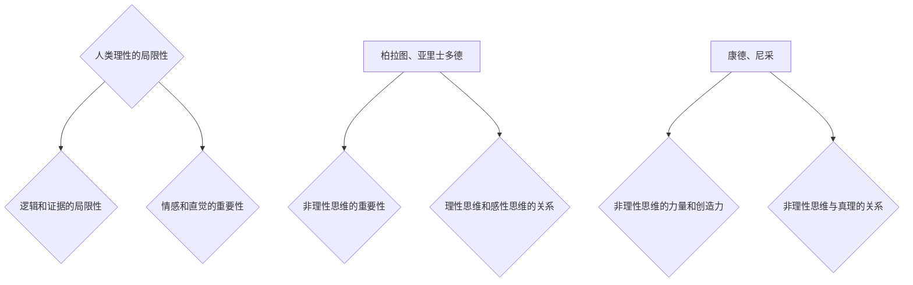

通过这个流程图，我们可以更直观地理解哲学视角下的非理性思维。

#### 5.2 伦理视角下的非理性思维

在伦理学中，非理性思维对道德决策和伦理行为具有重要影响。伦理学研究者探讨了非理性思维在道德决策中的作用，以及它如何影响伦理行为。

1. **非理性思维对道德决策的影响**：伦理决策往往涉及复杂的道德问题和价值判断。非理性思维可能影响个体在道德决策中的判断和选择。例如，个体可能因情感驱动而做出不道德的决定，如报复行为或歧视行为。此外，非理性思维可能导致个体忽视道德原则和伦理责任，从而做出不道德的行为。

2. **非理性思维与伦理道德的冲突**：非理性思维有时与伦理道德原则发生冲突。例如，情感驱动可能导致个体违背公平和正义的原则，做出不公平的决策。在极端情况下，非理性思维可能导致伦理灾难，如战争和暴行。

3. **非理性思维在伦理学中的应用**：尽管非理性思维可能导致道德决策中的偏差，但它在某些情况下也是必要的。例如，在紧急情况下，个体可能需要迅速做出决策，此时理性思维可能不足以应对。非理性思维，如直觉和灵感，可能在紧急情况下提供关键的决策指导。

以下是一个简单的Mermaid流程图，用于展示伦理视角下的非理性思维：

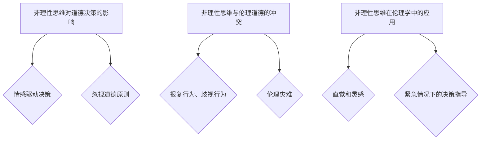

通过这个流程图，我们可以更直观地理解伦理视角下的非理性思维。

#### 5.3 非理性思维与道德教育

非理性思维在道德教育中扮演着重要角色。道德教育不仅要培养个体的理性思维能力，还要培养其情感和直觉能力。以下是一些道德教育中应用非理性思维的策略：

1. **情感教育**：通过情感教育，个体可以学会识别和表达情感，培养情感智力。这种教育有助于个体在道德决策中更好地平衡理性和情感。
2. **情境教育**：通过情境教育，个体可以在模拟的道德情境中练习道德决策。这种教育方法可以帮助个体在面对真实情境时，更好地应用理性和情感。
3. **价值引导**：通过价值引导，个体可以学会识别和尊重不同的价值观，培养批判性思维和道德判断力。这种教育有助于个体在道德决策中避免非理性思维带来的偏差。

以下是一个简单的Mermaid流程图，用于展示非理性思维在道德教育中的应用：

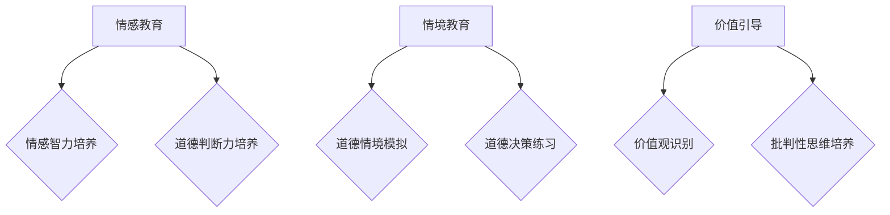

通过这个流程图，我们可以更直观地理解非理性思维在道德教育中的应用。

综上所述，非理性思维在哲学和伦理思考中具有重要的地位。从哲学视角看，非理性思维揭示了人类理性的局限性，具有重要的补充作用；从伦理视角看，非理性思维对道德决策和伦理行为产生了深远影响。通过哲学和伦理思考，我们可以更全面地理解非理性思维的本质和作用，为实际生活和决策提供有益的启示。

### 第六部分：非理性思维的跨学科应用

非理性思维不仅限于心理学和哲学领域，它在心理学、教育学和商业管理等其他学科中也具有广泛的应用。通过结合不同学科的理论和实践，我们可以更好地理解和利用非理性思维，以促进个人和社会的发展。

#### 6.1 非理性思维在心理学中的应用

心理学研究非理性思维，旨在理解其成因和影响，并提供干预和治疗方法。以下是非理性思维在心理学中的一些应用：

##### 6.1.1 非理性思维与心理健康

心理健康问题常常与非理性思维相关。例如，焦虑、抑郁和强迫症等心理障碍都与非理性思维模式有关。通过认知行为疗法，心理治疗师可以帮助患者识别和纠正非理性思维，改善心理健康。此外，正念冥想和心理辅导等干预措施也被用于减少非理性思维对心理健康的影响。

##### 6.1.2 非理性思维与心理治疗

在心理治疗中，非理性思维被视为关键的治疗目标之一。认知行为疗法（CBT）是针对非理性思维的一种常见治疗方法，通过帮助患者识别和改变非理性思维模式，改善他们的情绪和行为。此外，心理治疗师还会使用情境模拟和角色扮演等技术，帮助患者面对和处理实际的非理性思维情境。

##### 6.1.3 非理性思维与心理咨询

心理咨询中的非理性思维评估是一个重要环节。心理咨询师通过访谈和评估工具，识别患者的非理性思维模式，并提供相应的干预策略。这些策略包括教育患者关于非理性思维的概念，教授他们批判性思维技巧，以及帮助他们建立更加理性化和现实化的思维模式。

以下是一个简单的Mermaid流程图，用于展示非理性思维在心理学中的应用：

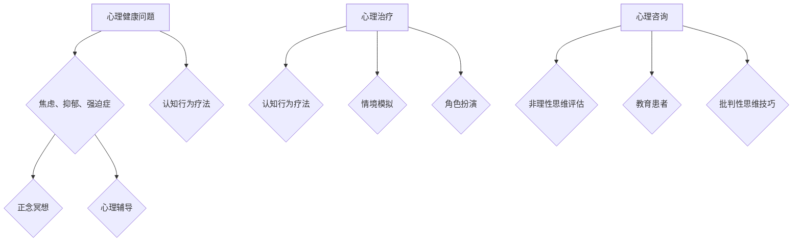

通过这个流程图，我们可以更直观地理解非理性思维在心理学中的应用。

#### 6.2 非理性思维在教育学中的应用

非理性思维在教育领域有着广泛的影响，特别是在教学方法和学生心理辅导方面。

##### 6.2.1 非理性思维与教育方法

教师需要理解学生的非理性思维模式，以便设计更有效的教学方法。例如，教师可以通过情境教学和问题解决活动，激发学生的思考和创造力。此外，教师还可以使用激励性教学策略，如奖励和认可，以帮助学生建立积极的思维模式。

##### 6.2.2 非理性思维与学生学习

学生常常受非理性思维的影响，如过度焦虑、自我怀疑和缺乏动力等。教师可以通过认知行为疗法的方法，帮助学生识别和纠正非理性思维模式，提高学习效果。例如，教师可以教授学生如何使用正念技巧和情绪调节策略，以应对学习压力。

##### 6.2.3 非理性思维与教师教学

教师自身的非理性思维也可能影响教学效果。通过自我反思和接受专业培训，教师可以识别和纠正自己的非理性思维模式，提高教学质量。例如，教师可以通过学习批判性思维技巧，更好地应对复杂的教学情境，提供更有针对性的教学指导。

以下是一个简单的Mermaid流程图，用于展示非理性思维在教育学中的应用：

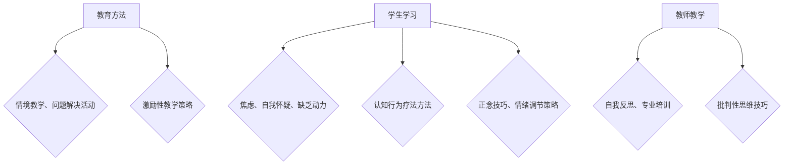

通过这个流程图，我们可以更直观地理解非理性思维在教育学中的应用。

#### 6.3 非理性思维在商业与管理中的应用

非理性思维在商业和管理领域同样具有重要影响，尤其是在决策制定、品牌管理和企业战略等方面。

##### 6.3.1 非理性思维与商业决策

商业决策往往涉及复杂的信息和不确定性。非理性思维可能导致决策者高估自己的能力或低估风险，从而做出错误的决策。通过认知行为疗法，企业领导者可以学会识别和纠正自己的非理性思维模式，提高决策质量。此外，企业还可以使用数据分析和模拟模型，帮助决策者更理性地分析问题。

##### 6.3.2 非理性思维与品牌管理

品牌管理中的非理性思维可能导致品牌策略的失误。例如，企业可能会因为情感因素而做出不合理的广告决策，如选择一个不合适的代言人。通过消费者心理学的研究，企业可以更好地理解非理性思维在品牌管理中的作用，从而制定更有效的品牌策略。

##### 6.3.3 非理性思维与企业战略

企业战略的制定也受到非理性思维的影响。领导者可能会因情感因素而倾向于保守或冒险，从而影响企业的长远发展。通过战略规划和风险管理，企业可以更好地应对非理性思维的挑战，制定更具前瞻性和可持续性的战略。

以下是一个简单的Mermaid流程图，用于展示非理性思维在商业与管理中的应用：

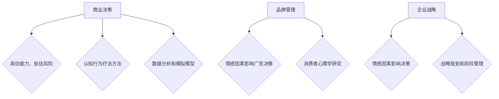

通过这个流程图，我们可以更直观地理解非理性思维在商业与管理中的应用。

综上所述，非理性思维在心理学、教育学和商业管理等跨学科领域具有广泛的应用。通过结合不同学科的理论和实践，我们可以更好地理解和利用非理性思维，以促进个人和社会的发展。

### 第七部分：非理性思维的挑战与未来

非理性思维在个人和社会层面上都具有深远的影响，但同时，它也带来了一系列挑战和问题。在这一部分中，我们将探讨非理性思维的挑战，包括其负面影响、社会问题以及伦理挑战，并展望非理性思维的科学研究、教育与培训以及跨学科融合的未来发展趋势。

#### 7.1 非理性思维的挑战

非理性思维虽然具有其积极作用，但也存在显著的负面影响。以下是非理性思维在个人和社会层面上的主要挑战：

##### 7.1.1 非理性思维的负面影响

1. **个人决策失误**：非理性思维可能导致个人在做出决策时出现偏差，如过度自信、情绪驱动和风险厌恶等。这些偏差可能导致不良后果，如经济损失、健康问题和社会冲突。

2. **社会冲突**：非理性思维在社会层面可能导致群体性偏见、歧视和社会冲突。例如，基于刻板印象和确认偏误的决策可能导致不公平待遇和紧张的社会关系。

3. **政策失灵**：政策制定者在面对复杂问题时，如果受到非理性思维的影响，可能会制定出不合理或无效的政策，导致社会问题加剧。

##### 7.1.2 非理性思维的社会问题

非理性思维在社会层面引发了一系列问题，如：

1. **经济波动**：市场参与者的非理性决策可能导致市场波动和经济危机，如2008年的全球金融危机。

2. **教育问题**：学生在学习过程中受到非理性思维的影响，可能导致学习效率低下、学业成绩下降。

3. **心理健康问题**：非理性思维可能加重心理健康问题，如焦虑、抑郁和强迫症等。

##### 7.1.3 非理性思维的伦理挑战

非理性思维在伦理方面也带来了一系列挑战，如：

1. **道德决策困境**：在紧急情况下，非理性思维可能导致个体做出不符合伦理标准的决策，如战争和暴行。

2. **社会责任缺失**：企业和管理者可能因非理性思维而忽视社会责任，导致环境破坏和社会不公。

#### 7.2 非理性思维的未来趋势

尽管非理性思维带来了诸多挑战，但它也具有巨大的研究价值和应用潜力。以下是未来非理性思维研究、教育与培训以及跨学科融合的发展趋势：

##### 7.2.1 非理性思维的科学研究

1. **跨学科研究**：未来非理性思维的研究将更加强调跨学科合作，结合心理学、哲学、经济学、社会学和神经科学等多个领域的理论和方法，深入探讨非理性思维的机制和影响。

2. **大数据分析**：通过大数据分析技术，研究人员可以更全面地了解非理性思维在个人和社会层面的表现和影响，为干预和改善提供科学依据。

3. **人工智能应用**：人工智能和机器学习技术的发展将为非理性思维研究带来新的工具和方法。例如，通过分析大量数据，人工智能可以识别和预测个体和群体的非理性思维模式，从而提供个性化的干预建议。

##### 7.2.2 非理性思维的教育与培训

1. **批判性思维培训**：在学校和职场中，将批判性思维和非理性思维的教育纳入课程和培训计划，帮助学生和员工识别和纠正非理性思维模式，提高决策能力和问题解决能力。

2. **情感教育**：通过情感教育，培养学生的情感智力，提高他们在面对复杂情境时的情绪管理能力，减少非理性思维的负面影响。

3. **职业发展培训**：针对职业人士，提供专门的非理性思维培训，帮助他们识别和应对工作中的非理性思维挑战，提高决策质量和工作效率。

##### 7.2.3 非理性思维的跨学科融合

1. **心理学与商业管理**：结合心理学和商业管理的理论，开发出针对企业和管理者的非理性思维干预策略，以提高决策质量和组织效率。

2. **心理学与公共政策**：在公共政策制定过程中，引入心理学研究方法，帮助政策制定者更全面地考虑非理性思维的影响，制定出更加合理和有效的政策。

3. **心理学与法律**：通过心理学研究，了解非理性思维在法律案件中的影响，为司法决策提供科学依据，减少错误判决和冤案的发生。

综上所述，非理性思维在个人和社会层面具有深远的影响，同时也带来了诸多挑战。通过跨学科研究和应用，我们可以更好地理解和应对非理性思维，提高决策质量和社会行为的合理性，推动科技和社会的可持续发展。

## 参考文献

1. Kahneman, D. (2011). *Thinking, Fast and Slow*. Farrar, Straus and Giroux.
2. Ariely, D. (2008). *Predictably Irrational: The Hidden Forces That Shape Our Decisions*. HarperCollins.
3. Tversky, A., & Kahneman, D. (1974). *Judgment under Uncertainty: Heuristics and Biases*. Science, 185(4157), 1124-1131.
4. Ellis, A. (1994). *Overcoming Destructive Beliefs, Feelings, and Behaviors: Therapeutic Exercises for Healing the Effects of Trauma*. Prometheus Books.
5. Sloman, S. A. (1996). *The empirical case for two systems of reasoning*. In K. Stroebe & A.不孕症（A.不孕症）(Eds.), *Reasoning: Insights from Social Psychology* (pp. 267-287). Mahwah, NJ: Lawrence Erlbaum Associates.
6. Gigerenzer, G. (2000). *Un的自然主义心理学：推理、决策和两个系统理论*.* The Empire of Reason: A Philosophy of Cognitive Science*. Oxford University Press.
7. Danziger, K., & Stanovich, K. E. (2011). *Debunking myths about rationality and rationalization: Studies of the determinants of formal reasoning and logical thinking*. In J. A. Foerster, T. Smolka, & R. Teitelbaum (Eds.), *Handbook of Rationality and Social Decision Making*. Oxford University Press.
8. Kihlstrom, J. F. (1999). *Emotion: A Multidisciplinary Approach*. Cambridge University Press.
9. Frijda, N. H., & Suls, J. M. (Eds.). (1984). *Emotions and Actions*. Cambridge University Press.
10. Hsee, C. K., & Zhang, J. (2003). *Theevaluating the evaluator: An approach to eliciting and analyzing valuations for decision-making under risk*. In C. K. Hsee & R. S. Stern (Eds.), *Behavioral Decision Theory: A Handbook of Applications* (pp. 479-511). Oxford University Press.
11. Haidt, J. (2001). *The emotional dog and its rational tail: A social cognitive approach to emotion and its role in moral judgment*. Psychological Review, 108(2), 814-834.
12. Heath, R. L. (2006). *Moral Minds: How Human Morality Evolved?. Harvard University Press.
13. Baumeister, R. F., & Leary, M. R. (1995). *The need to belong: Desire for interpersonal connections in the context of uncertainty*. Psychological Bulletin, 117(3), 497-529.
14. Kihlstrom, J. F., & Oatley, K. (Eds.). (1991). *The social function of emotions*. American Psychological Association.
15. Damasio, A. (1994). *Descartes' Error: Emotion, Reason, and the Human Brain*. Avon Books.
16. Goleman, D. (1995). *Emotional Intelligence: Why It Can Matter More Than IQ*. Bantam Books.
17. Baron, J. (2008). *Thinking and Decision Making: An Introduction to Behavioral Research and Its Applications*. McGraw-Hill.
18. Rottenstreich, Y., & Tversky, A. (1997). *The effect of prompted reflection on choice*. Organizational Behavior and Human Decision Processes, 70(1), 20-39.
19. Alba, J. W., & Lynch, J. G. (1998). *Processing and storing price and brand information in memory: A test of the elaboration-likelihood model*. Journal of Consumer Research, 25(2), 144-164.
20. Gigerenzer, G., & Gaissmaier, W. (2011). *Heuristics*. Annual Review of Psychology, 62, 451-479.
21. Engeset, A. (2001). *Decision Heuristics*. Oxford University Press.
22. Murphy, S. T. (2004). *Human Judgment and Decision Making: Elements of Choice Under Uncertainty*. Lawrence Erlbaum Associates.
23. Gigerenzer, G., & Patechou, E. (2011). *The intuitive and the reflective brain: Perspectives from cognitive science and behavioral economics*. Trends in Cognitive Sciences, 15(5), 224-231.
24. Chabris, C. F., & Simons, D. J. (2010). *The Invisible Gorilla: And Other Ways Our Intuitions Deceive Us*. Crown Publishing Group.
25. Kahneman, D., & Tversky, A. (1979). *Prospect Theory: An Analysis of Decision under Risk*. Econometrica, 47(2), 263-292.

## 附录：非理性思维相关研究方法与工具

### A.1 研究方法概述

非理性思维的研究方法多样，主要包括实验研究、案例研究、问卷调查和心理学测试等。以下是对这些方法的基本概述：

1. **实验研究**：通过设计实验情境，操纵自变量和观察因变量，研究非理性思维的行为表现和影响。实验研究能够控制变量，提高研究的可信度。
2. **案例研究**：通过深入分析具体的个案，探讨非理性思维在实际情境中的应用和影响。案例研究有助于理解非理性思维的具体表现和机制。
3. **问卷调查**：通过设计问卷，收集大量个体的非理性思维行为和态度数据。问卷调查适用于大规模研究，能够提供广泛的数据支持。
4. **心理学测试**：使用标准化的心理测量工具，评估个体的非理性思维水平和相关特征。心理学测试能够量化非理性思维，为研究提供客观依据。

### A.2 实验设计

实验设计是研究非理性思维的核心方法之一。以下是一个简单的实验设计示例：

1. **实验假设**：假设情感驱动的决策过程与非理性思维存在显著关联。
2. **实验步骤**：
   - **被试选择**：选择一定数量的实验参与者，确保样本的代表性和多样性。
   - **实验情境设置**：设计不同的实验情境，如购物决策、投资决策等，分别测试情感驱动和非理性思维的影响。
   - **自变量操作**：通过控制实验情境中的情感因素（如正面情绪、负面情绪），观察其对决策过程的影响。
   - **因变量测量**：记录参与者的决策行为和决策结果，如选择偏好、决策时间、决策满意度等。
3. **数据分析**：使用统计分析方法（如回归分析、t检验等），分析情感因素对决策过程的影响，验证实验假设。

### A.3 数据分析方法

数据分析是研究非理性思维的重要环节。以下是一些常用的数据分析方法：

1. **描述性统计分析**：通过计算均值、中位数、标准差等描述性统计量，描述数据的基本特征。
2. **相关分析**：通过计算变量之间的相关系数，分析非理性思维与行为、情绪、认知等因素的关系。
3. **回归分析**：通过建立回归模型，分析自变量对因变量的影响，探讨非理性思维的预测能力。
4. **因子分析**：通过提取公因子，简化数据结构，揭示变量之间的内在联系。
5. **多元统计分析**：结合多种分析方法，对复杂的数据进行综合分析，提高研究的深度和广度。

### A.4 研究工具与软件介绍

非理性思维的研究需要使用多种工具和软件。以下是一些常见的研究工具和软件：

1. **SPSS**：统计产品与服务解决方案（SPSS）是一款常用的统计分析软件，适用于描述性统计分析、相关分析和回归分析等。
2. **R**：R是一种免费、开源的统计软件和编程语言，适用于数据分析和可视化，支持多种统计模型和机器学习算法。
3. **NVivo**：NVivo是一款质性数据分析和编码软件，适用于案例研究和心理学测试的数据分析。
4. **Matlab**：Matlab是一款高性能的数值计算和科学计算软件，适用于复杂的数据分析和模型构建。

### A.5 研究资源与参考资料

非理性思维研究涉及多个学科领域，以下是一些重要的研究资源与参考资料：

1. **学术期刊**：如 *Psychological Science*、*Journal of Consumer Research*、*Behavioral and Brain Sciences* 等。
2. **学术会议**：如 *Annual Meeting of the Society for Personality and Social Psychology*、*European Conference on Cognitive Science* 等。
3. **学术论文数据库**：如 *Google Scholar*、*PubMed*、*Web of Science* 等。
4. **专业书籍**：如 *Thinking, Fast and Slow*、*Predictably Irrational*、*The Emotional Brain* 等。

通过以上研究方法、工具和资源，我们可以更深入地探索非理性思维的奥秘，为相关领域的理论和实践提供有力支持。

