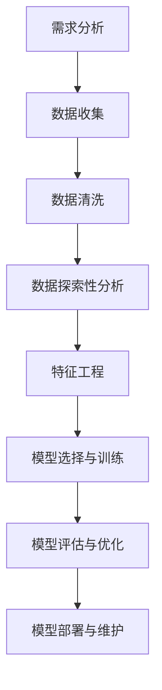

                 

# 洞察力与预测：数据分析的艺术与科学

## 关键词
数据分析、洞察力、预测分析、回归分析、分类分析、模型评估与优化、实时预测系统

## 摘要
本文深入探讨了数据分析中的洞察力与预测能力，通过系统性的分析和讲解，帮助读者理解数据分析的核心概念、基础方法、提升策略以及应用实践。文章从数据分析的基础知识开始，逐步介绍了探索性数据分析、时间序列分析与预测、回归分析与预测、分类分析与预测等核心内容，并重点讨论了预测模型的评估与优化、模型集成与堆叠以及商业预测应用案例分析。最后，文章还介绍了实时预测系统的开发与性能优化，为读者提供了一套完整的数据分析解决方案。

## 目录大纲

### 第一部分：引言与基础

- 第1章：洞察力与预测概述
  - 1.1 洞察力的定义与重要性
  - 1.2 预测分析的基本概念
  - 1.3 数据分析在现代商业中的应用
- 第2章：数据分析基础
  - 2.1 数据分析流程
  - 2.2 数据类型与数据预处理
  - 2.3 数据可视化技术

### 第二部分：洞察力提升方法

- 第3章：探索性数据分析
  - 3.1 EDA方法
  - 3.2 聚类分析
  - 3.3 关联规则挖掘
- 第4章：时间序列分析与预测
  - 4.1 时间序列分析基础
  - 4.2 ARIMA模型
  - 4.3 机器学习在时间序列预测中的应用
- 第5章：回归分析与预测
  - 5.1 线性回归
  - 5.2 逻辑回归
  - 5.3 多元回归分析
- 第6章：分类分析与预测
  - 6.1 监督学习与无监督学习
  - 6.2 决策树与随机森林
  - 6.3 支持向量机

### 第三部分：预测模型评估与优化

- 第7章：预测模型评估指标
  - 7.1 回归模型评估指标
  - 7.2 分类模型评估指标
  - 7.3 时间序列模型评估指标
- 第8章：模型优化与调参
  - 8.1 模型选择与调参策略
  - 8.2 特征工程
  - 8.3 模型集成与堆叠

### 第四部分：预测应用实战

- 第9章：商业预测应用案例分析
  - 9.1 销售预测
  - 9.2 客户行为预测
  - 9.3 市场需求预测
- 第10章：实时预测系统开发
  - 10.1 实时数据处理技术
  - 10.2 预测模型部署与维护
  - 10.3 预测系统性能优化

### 附录

- 附录A：数据分析工具与资源
- 附录B：示例代码与数据集

### 第1章：洞察力与预测概述

#### 1.1 洞察力的定义与重要性

洞察力（Insight）是一种深刻的理解和敏锐的洞察能力，它涉及到对事物的洞察、理解和解释。在数据分析领域，洞察力尤为重要，因为数据分析的最终目标是通过对数据的深入挖掘和分析，发现数据背后的规律和趋势，从而为企业决策提供支持。

洞察力的定义可以总结为以下几点：

1. **深度理解**：洞察力要求对数据有深入的理解，包括数据的来源、含义、分布特性等。
2. **敏锐洞察**：洞察力要求对数据有敏锐的洞察，能够发现数据中的异常、趋势和关联关系。
3. **解释能力**：洞察力要求具备强大的解释能力，能够将分析结果以清晰、准确的方式传达给相关人员。

在数据分析中，洞察力的重要性体现在以下几个方面：

1. **提升决策质量**：通过洞察力，数据分析师能够发现数据中的潜在规律，为企业管理层提供更准确、更有针对性的决策支持。
2. **优化业务流程**：洞察力有助于识别业务流程中的瓶颈和问题，为企业的流程优化提供方向。
3. **创新业务模式**：洞察力能够发现新的市场机会和业务模式，为企业拓展市场提供支持。

#### 1.2 预测分析的基本概念

预测分析（Predictive Analysis）是一种通过历史数据分析和模式识别，预测未来事件的技术。它涉及到数据挖掘、统计学和机器学习等多个领域。

预测分析的基本概念包括：

1. **目标变量**：预测分析的目标是预测某个或某些目标变量的未来值。目标变量可以是连续的，也可以是离散的。
2. **特征变量**：特征变量是用于预测目标变量的输入变量。特征变量可以是数值型的，也可以是类别型的。
3. **模型**：模型是预测分析的核心，用于根据历史数据建立预测关系。模型可以是线性的，也可以是非线性的。
4. **评估指标**：评估指标用于评估预测模型的性能。常见的评估指标包括准确率、召回率、均方误差等。

#### 1.3 数据分析在现代商业中的应用

数据分析在现代商业中扮演着重要的角色，已经成为企业提升竞争力、优化运营的重要工具。以下是数据分析在现代商业中的几个关键应用：

1. **市场分析**：通过分析市场数据，企业可以了解市场需求、消费者行为和竞争对手情况，从而制定更有效的市场策略。
2. **客户细分**：通过分析客户数据，企业可以将客户分为不同的群体，从而提供更个性化的服务和产品。
3. **销售预测**：通过分析历史销售数据，企业可以预测未来的销售趋势，从而更好地规划库存、生产和营销策略。
4. **风险控制**：通过分析财务数据、客户行为数据等，企业可以识别潜在的风险，并采取相应的措施进行控制。
5. **运营优化**：通过分析业务数据，企业可以发现运营中的问题和瓶颈，从而进行流程优化和资源调配。

#### 1.4 数据分析流程

数据分析流程是进行数据分析的步骤和方法的总和，一般包括以下步骤：

1. **需求分析**：明确数据分析的目标和需求，确定分析的内容和方法。
2. **数据收集**：收集相关的数据，包括内部数据和外部数据。
3. **数据清洗**：清洗数据，包括去除重复数据、处理缺失值、异常值等。
4. **数据探索性分析**：通过统计分析、可视化等方法，对数据进行初步分析，发现数据中的规律和趋势。
5. **特征工程**：根据分析目标，选择和构建特征变量。
6. **模型选择与训练**：选择合适的模型，使用历史数据训练模型。
7. **模型评估与优化**：评估模型性能，并进行模型优化。
8. **模型部署与维护**：将模型部署到生产环境，并进行持续的维护和优化。

数据分析流程的具体步骤和方法将在后续章节中详细讨论。

### 第2章：数据分析基础

#### 2.1 数据分析流程

数据分析流程是进行数据分析的步骤和方法的总和，一般包括以下步骤：

1. **需求分析**：明确数据分析的目标和需求，确定分析的内容和方法。这一步骤至关重要，因为只有明确了分析目标，才能有针对性地进行数据收集、处理和分析。

2. **数据收集**：收集相关的数据，包括内部数据和外部数据。内部数据通常来自企业的业务系统，如销售数据、财务数据等；外部数据可以从公共数据源、市场调研等渠道获取。

3. **数据清洗**：清洗数据，包括去除重复数据、处理缺失值、异常值等。数据清洗是数据分析中不可或缺的一环，因为脏数据会严重影响分析结果的准确性。

4. **数据探索性分析**：通过统计分析、可视化等方法，对数据进行初步分析，发现数据中的规律和趋势。这一步骤可以帮助数据分析师对数据有更深入的理解，为后续的特征工程和模型构建提供依据。

5. **特征工程**：根据分析目标，选择和构建特征变量。特征工程是提高模型预测性能的关键步骤，包括特征选择、特征转换、特征提取等。

6. **模型选择与训练**：选择合适的模型，使用历史数据训练模型。常见的模型包括线性回归、逻辑回归、决策树、随机森林等。

7. **模型评估与优化**：评估模型性能，并进行模型优化。评估指标包括准确率、召回率、均方误差等。

8. **模型部署与维护**：将模型部署到生产环境，并进行持续的维护和优化。模型部署是实现预测功能的关键步骤，需要考虑模型的性能、可扩展性、安全性等因素。

数据分析流程的Mermaid流程图如下：



#### 2.2 数据类型与数据预处理

在数据分析中，数据类型和数据预处理是基础性的环节。数据类型通常分为数值型数据、类别型数据和文本型数据，不同类型的数据需要不同的预处理方法。

1. **数值型数据**：数值型数据是最常见的数据类型，如销售金额、年龄、温度等。对于数值型数据，常见的预处理方法包括：
   - 数据转换：将数据转换为统一的格式，如将日期转换为时间戳。
   - 数据归一化：通过缩放方法将数据映射到相同的范围内，如将数据缩放到 [0, 1] 区间。
   - 数据标准化：通过减去均值并除以标准差的方法，使数据分布满足正态分布。

2. **类别型数据**：类别型数据包括离散型类别数据和连续型类别数据，如性别、国家等。对于类别型数据，常见的预处理方法包括：
   - 带宽扩展：将类别型数据转换为数值型数据，如使用独热编码（One-Hot Encoding）。
   - 稀疏表示：将稀疏的类别型数据转换为稀疏矩阵，如使用稀疏编码。

3. **文本型数据**：文本型数据包括文本、标签、评论等，如商品描述、用户评论等。对于文本型数据，常见的预处理方法包括：
   - 去除停用词：去除常见的无意义词汇，如“的”、“和”、“是”等。
   - 词频统计：统计文本中每个词出现的次数，如“商品描述”中“苹果”出现3次。
   - 词嵌入：将文本中的每个词映射到一个高维向量空间，如使用Word2Vec、BERT等方法。

下面是数值型数据和类别型数据的预处理示例：

```python
# 数值型数据预处理
from sklearn.preprocessing import StandardScaler
import pandas as pd

# 加载数据
data = pd.read_csv('data.csv')

# 数据归一化
scaler = StandardScaler()
data_scaled = scaler.fit_transform(data[['sales', 'age', 'temperature']])

# 类别型数据预处理
from sklearn.preprocessing import OneHotEncoder

# 加载数据
data = pd.read_csv('data.csv')

# 独热编码
encoder = OneHotEncoder()
data_encoded = encoder.fit_transform(data[['gender', 'country']]).toarray()

# 处理后的数据
data_processed = pd.DataFrame(data_encoded, columns=encoder.get_feature_names(['gender', 'country']))
data_processed = pd.concat([data.drop(['gender', 'country'], axis=1), data_processed], axis=1)
```

#### 2.3 数据可视化技术

数据可视化（Data Visualization）是将数据以图形化方式展示的技术，有助于人们更好地理解和分析数据。常见的可视化工具包括Matplotlib、Seaborn、Plotly等。

1. **线形图**：用于显示数据的变化趋势，如折线图、曲线图等。

2. **柱状图**：用于显示不同类别或分组的数据，如条形图、堆积柱状图等。

3. **散点图**：用于显示两个变量之间的关系，如散点图、热力图等。

4. **饼图**：用于显示各部分占整体的比例，如饼图、环形图等。

5. **箱线图**：用于显示数据的分布情况和异常值，如箱线图、盒形图等。

下面是使用Matplotlib和Seaborn进行数据可视化的一些示例：

```python
# 导入相关库
import matplotlib.pyplot as plt
import seaborn as sns
import pandas as pd

# 加载数据
data = pd.read_csv('data.csv')

# 绘制折线图
plt.figure(figsize=(10, 6))
plt.plot(data['time'], data['sales'], label='Sales')
plt.xlabel('Time')
plt.ylabel('Sales')
plt.title('Sales Trend')
plt.legend()
plt.show()

# 绘制散点图
plt.figure(figsize=(10, 6))
sns.scatterplot(x='age', y='sales', data=data)
plt.xlabel('Age')
plt.ylabel('Sales')
plt.title('Age vs Sales')
plt.show()

# 绘制箱线图
plt.figure(figsize=(10, 6))
sns.boxplot(x='region', y='sales', data=data)
plt.xlabel('Region')
plt.ylabel('Sales')
plt.title('Sales by Region')
plt.show()
```

通过数据可视化，数据分析师可以更直观地发现数据中的规律和趋势，为后续的数据分析和预测提供参考。

### 第3章：探索性数据分析

探索性数据分析（Exploratory Data Analysis，EDA）是数据分析和数据挖掘过程中的重要步骤，其主要目的是通过统计和可视化的方法，对数据进行初步分析，发现数据中的规律、趋势、异常和潜在的模式。EDA不仅可以帮助数据分析师更好地理解数据，还可以为后续的特征工程、模型构建和预测分析提供重要的信息。

#### 3.1 EDA方法

EDA的方法主要包括以下几种：

1. **描述性统计分析**：对数据进行基本的描述性统计分析，如均值、中位数、众数、标准差、最大值、最小值等。这些统计指标可以提供数据的基本特征和分布情况。

2. **数据可视化**：通过图表和图形来展示数据，如柱状图、折线图、散点图、箱线图、热力图等。数据可视化能够直观地展示数据分布、趋势、关联关系等。

3. **数据分布分析**：分析数据的分布特性，如正态分布、偏态分布、双峰分布等。分布分析可以帮助识别异常值和数据集的特征。

4. **相关性分析**：分析变量之间的相关性，如皮尔逊相关系数、斯皮尔曼等级相关系数等。相关性分析可以帮助识别变量之间的关系，为特征工程提供依据。

5. **异常值检测**：检测数据中的异常值，如使用箱线图、IQR（四分位距）等方法。异常值可能会影响模型的预测性能，因此需要特别处理。

6. **时间序列分析**：对时间序列数据进行分析，如趋势分析、季节性分析、周期性分析等。时间序列分析可以帮助识别数据的时间依赖性和趋势。

#### 3.2 EDA步骤

进行EDA的步骤通常如下：

1. **数据导入和预处理**：将数据加载到分析工具中，并进行必要的预处理，如数据清洗、缺失值处理、数据转换等。

2. **描述性统计分析**：对数据进行基本的描述性统计分析，生成统计报表或图表，如使用Pandas的`describe()`方法。

3. **数据可视化**：使用图表和图形展示数据，包括变量的分布、趋势、关联关系等。常用的工具包括Matplotlib、Seaborn、Plotly等。

4. **相关性分析**：使用相关系数分析变量之间的相关性，帮助识别重要的特征和潜在的关联关系。

5. **异常值检测**：使用统计方法或可视化工具检测数据中的异常值，并进行处理。

6. **数据分布分析**：分析数据的分布特性，识别可能的异常分布和趋势。

7. **总结与报告**：总结EDA的结果，编写报告，包括分析发现、潜在的问题和改进方向等。

#### 3.3 EDA示例

下面通过一个示例来展示如何进行EDA。

```python
import pandas as pd
import matplotlib.pyplot as plt
import seaborn as sns

# 加载数据
data = pd.read_csv('data.csv')

# 描述性统计分析
print(data.describe())

# 数据可视化：分布分析
plt.figure(figsize=(10, 6))
sns.histplot(data['sales'], kde=True)
plt.title('Sales Distribution')
plt.xlabel('Sales')
plt.ylabel('Frequency')
plt.show()

# 数据可视化：相关性分析
plt.figure(figsize=(10, 8))
sns.heatmap(data.corr(), annot=True, cmap='coolwarm')
plt.title('Correlation Matrix')
plt.show()

# 异常值检测
sns.boxplot(x='sales', data=data)
plt.title('Sales Boxplot')
plt.show()

# 时间序列分析
plt.figure(figsize=(10, 6))
plt.plot(data['time'], data['sales'])
plt.title('Sales Time Series')
plt.xlabel('Time')
plt.ylabel('Sales')
plt.show()
```

通过上述步骤，我们可以对数据有一个初步的了解，发现数据中的规律、趋势和异常，为后续的数据分析工作打下基础。

### 第4章：时间序列分析与预测

时间序列分析（Time Series Analysis）是一种用于研究数据在不同时间点上的变化规律的方法。时间序列数据在金融、经济学、气象学、生物学等多个领域都有广泛的应用。时间序列预测（Time Series Forecasting）则是基于时间序列分析的方法，对未来某个时间点上的数据值进行预测。在本节中，我们将介绍时间序列分析的基础知识、ARIMA模型以及机器学习在时间序列预测中的应用。

#### 4.1 时间序列分析基础

时间序列数据通常由一系列按时间顺序排列的数值组成，这些数值可以是连续的，也可以是离散的。时间序列数据具有以下特点：

1. **自相关性**：时间序列中的数据点之间存在一定的相关性，即最近的数据点对未来的预测有重要影响。
2. **平稳性**：时间序列的统计特性（如均值、方差等）不随时间变化而变化，即时间序列具有平稳性。
3. **趋势性**：时间序列数据可能呈现出上升、下降或平稳的趋势。
4. **季节性**：时间序列数据可能因季节性因素（如节假日、季节变化等）而呈现出周期性波动。

时间序列分析的主要步骤包括：

1. **数据预处理**：包括缺失值处理、异常值检测和转换等。
2. **平稳性检验**：使用ADF检验、KPSS检验等方法检验时间序列的平稳性。
3. **模型选择**：根据时间序列的特点选择合适的模型，如ARIMA、AR、MA、ARMA等。
4. **模型参数估计**：使用最大似然估计、最小二乘法等方法估计模型参数。
5. **模型诊断**：通过残差分析、ACF和PACF图等方法诊断模型的有效性。
6. **预测**：使用训练好的模型进行预测，并评估预测误差。

#### 4.2 ARIMA模型

ARIMA（AutoRegressive Integrated Moving Average）模型是一种广泛应用于时间序列预测的模型，它由自回归（AR）、差分（I）和移动平均（MA）三个部分组成。

1. **自回归（AR）**：AR模型通过过去的值来预测当前值。具体来说，AR(p)模型表示当前值是前p个值的线性组合，即：
   $$
   y_t = c + \phi_1y_{t-1} + \phi_2y_{t-2} + ... + \phi_py_{t-p} + \epsilon_t
   $$
   其中，$y_t$是当前值，$\epsilon_t$是随机误差。

2. **差分（I）**：I表示差分操作，用于使时间序列数据具有平稳性。一阶差分（I(1)）将当前值与前一值的差作为新值，即：
   $$
   y_t = y_t - y_{t-1}
   $$

3. **移动平均（MA）**：MA模型通过过去的预测误差来预测当前值。具体来说，MA(q)模型表示当前值是前q个预测误差的线性组合，即：
   $$
   y_t = c + \theta_1\epsilon_{t-1} + \theta_2\epsilon_{t-2} + ... + \theta_q\epsilon_{t-q} + \epsilon_t
   $$

ARIMA模型的一般形式为：
$$
y_t = c + \phi_1y_{t-1} + \phi_2y_{t-2} + ... + \phi_py_{t-p} + \theta_1\epsilon_{t-1} + \theta_2\epsilon_{t-2} + ... + \theta_q\epsilon_{t-q} + \epsilon_t
$$

ARIMA模型的构建步骤如下：

1. **数据预处理**：对时间序列数据进行一阶差分，使其达到平稳性。
2. **模型识别**：通过ACF和PACF图确定模型的p和q值。
3. **参数估计**：使用最大似然估计等方法估计模型参数。
4. **模型诊断**：通过残差分析、ACF和PACF图等方法诊断模型的有效性。
5. **预测**：使用训练好的模型进行预测，并评估预测误差。

ARIMA模型的伪代码如下：

```python
from statsmodels.tsa.arima.model import ARIMA

# 数据预处理：一阶差分
data_diff = data_diff(data['sales'], 1)

# 模型识别：通过ACF和PACF图确定p和q值
# ...

# 参数估计：最大似然估计
model = ARIMA(data['sales'], order=(p, d, q))

# 模型训练
model_fit = model.fit()

# 模型诊断
# ...

# 预测
predictions = model_fit.predict(start=end, end=end+forecast_steps)
```

#### 4.3 机器学习在时间序列预测中的应用

机器学习在时间序列预测中的应用主要包括以下几种方法：

1. **神经网络**：神经网络模型，如LSTM（Long Short-Term Memory）、GRU（Gated Recurrent Unit）和CNN（Convolutional Neural Network）等，可以捕捉时间序列数据中的复杂非线性关系。

2. **集成方法**：集成方法，如Bagging、Boosting和Stacking等，可以结合多个预测模型的优点，提高预测性能。

3. **深度学习**：深度学习方法，如深度神经网络、卷积神经网络和递归神经网络等，可以用于时间序列预测，特别是在处理大规模数据和高维度数据时具有优势。

4. **基于特征的预测**：通过特征工程提取时间序列数据中的有效特征，然后使用机器学习方法进行预测。

机器学习模型通常需要大量的数据进行训练，并且需要精心设计网络结构、超参数等，以提高预测性能。下面是一个使用LSTM进行时间序列预测的示例：

```python
from keras.models import Sequential
from keras.layers import LSTM, Dense

# 数据预处理：归一化
data_normalized = data['sales'].values.reshape(-1, 1)

# 数据分割：训练集和测试集
train_data = data_normalized[:train_size]
test_data = data_normalized[train_size:]

# 网络结构设计
model = Sequential()
model.add(LSTM(units=50, return_sequences=True, input_shape=(timesteps, 1)))
model.add(LSTM(units=50))
model.add(Dense(1))

# 模型编译
model.compile(optimizer='adam', loss='mean_squared_error')

# 模型训练
model.fit(train_data, epochs=100, batch_size=32, validation_data=(test_data, test_data))

# 预测
predictions = model.predict(test_data)

# 反归一化
predictions = scaler.inverse_transform(predictions)
```

通过上述方法，我们可以利用机器学习技术进行时间序列预测，从而为企业提供更准确、更高效的决策支持。

### 第5章：回归分析与预测

回归分析是统计学中用于研究变量之间关系的一种重要方法。它通过建立数学模型，分析一个或多个自变量（解释变量）与因变量（响应变量）之间的关系。回归分析可以分为线性回归分析和非线性回归分析，其中线性回归分析是最基本也是应用最广泛的回归分析方法。本章将详细讨论线性回归、逻辑回归和多元回归分析的基本原理、模型构建和实际应用。

#### 5.1 线性回归

线性回归模型是一种简单的回归模型，其基本形式为：
$$
y = \beta_0 + \beta_1x_1 + \beta_2x_2 + ... + \beta_nx_n + \epsilon
$$
其中，$y$是因变量，$x_1, x_2, ..., x_n$是自变量，$\beta_0$是截距，$\beta_1, \beta_2, ..., \beta_n$是斜率，$\epsilon$是误差项。

##### 5.1.1 线性回归模型原理

线性回归模型通过最小化残差平方和来估计模型参数。残差是实际值与预测值之间的差异，即$y - \hat{y}$，其中$\hat{y}$是预测值。最小二乘法是常用的参数估计方法，其目标是最小化所有残差的平方和：
$$
\sum_{i=1}^{n}(y_i - \hat{y}_i)^2
$$

##### 5.1.2 线性回归模型构建

线性回归模型的构建步骤如下：

1. **数据收集**：收集包含因变量和自变量的数据集。
2. **数据预处理**：对数据进行清洗和预处理，包括缺失值处理、数据转换、归一化等。
3. **模型选择**：选择线性回归模型。
4. **参数估计**：使用最小二乘法估计模型参数。
5. **模型评估**：使用残差分析、R平方、均方误差（MSE）等指标评估模型性能。
6. **模型优化**：根据评估结果对模型进行调整和优化。

##### 5.1.3 线性回归应用案例

假设我们想要预测房价，已知房屋面积（$x_1$）、房间数量（$x_2$）和建筑年代（$x_3$）等信息。以下是使用Python实现线性回归模型的步骤：

```python
import pandas as pd
from sklearn.linear_model import LinearRegression
from sklearn.model_selection import train_test_split
from sklearn.metrics import mean_squared_error

# 加载数据
data = pd.read_csv('house_prices.csv')

# 特征选择
X = data[['area', 'rooms', 'age']]
y = data['price']

# 数据分割
X_train, X_test, y_train, y_test = train_test_split(X, y, test_size=0.2, random_state=42)

# 模型实例化
model = LinearRegression()

# 模型训练
model.fit(X_train, y_train)

# 模型预测
y_pred = model.predict(X_test)

# 模型评估
mse = mean_squared_error(y_test, y_pred)
print(f'Mean Squared Error: {mse}')
```

#### 5.2 逻辑回归

逻辑回归是一种用于分类问题的回归模型，其基本形式为：
$$
\hat{p} = \frac{1}{1 + e^{-(\beta_0 + \beta_1x_1 + \beta_2x_2 + ... + \beta_nx_n})}
$$
其中，$\hat{p}$是因变量为1的概率，$e$是自然底数。

##### 5.2.1 逻辑回归模型原理

逻辑回归模型通过最大化似然估计方法来估计模型参数。逻辑函数（Logistic Function）将线性组合的值映射到概率区间[0, 1]内，从而实现概率预测。

##### 5.2.2 逻辑回归模型构建

逻辑回归模型的构建步骤如下：

1. **数据收集**：收集包含因变量和自变量的数据集。
2. **数据预处理**：对数据进行清洗和预处理，包括缺失值处理、数据转换、归一化等。
3. **模型选择**：选择逻辑回归模型。
4. **参数估计**：使用最大似然估计方法估计模型参数。
5. **模型评估**：使用准确率、召回率、精确率、F1分数等指标评估模型性能。
6. **模型优化**：根据评估结果对模型进行调整和优化。

##### 5.2.3 逻辑回归应用案例

假设我们想要预测客户是否会购买某个产品，已知客户的年龄（$x_1$）、收入（$x_2$）和购买历史（$x_3$）等信息。以下是使用Python实现逻辑回归模型的步骤：

```python
import pandas as pd
from sklearn.linear_model import LogisticRegression
from sklearn.model_selection import train_test_split
from sklearn.metrics import accuracy_score

# 加载数据
data = pd.read_csv('customer_purchases.csv')

# 特征选择
X = data[['age', 'income', 'purchase_history']]
y = data['purchased']

# 数据分割
X_train, X_test, y_train, y_test = train_test_split(X, y, test_size=0.2, random_state=42)

# 模型实例化
model = LogisticRegression()

# 模型训练
model.fit(X_train, y_train)

# 模型预测
y_pred = model.predict(X_test)

# 模型评估
accuracy = accuracy_score(y_test, y_pred)
print(f'Accuracy: {accuracy}')
```

#### 5.3 多元回归分析

多元回归分析是处理多个自变量与一个因变量之间关系的回归模型。其基本形式为：
$$
y = \beta_0 + \beta_1x_1 + \beta_2x_2 + ... + \beta_nx_n + \epsilon
$$
与线性回归模型类似，多元回归分析也使用最小二乘法来估计模型参数。

##### 5.3.1 多元回归模型原理

多元回归模型通过拟合多个自变量与因变量之间的关系，从而预测因变量的值。与线性回归模型相比，多元回归模型可以同时考虑多个自变量的影响，从而提高模型的预测性能。

##### 5.3.2 多元回归模型构建

多元回归模型的构建步骤如下：

1. **数据收集**：收集包含因变量和自变量的数据集。
2. **数据预处理**：对数据进行清洗和预处理，包括缺失值处理、数据转换、归一化等。
3. **模型选择**：选择多元回归模型。
4. **参数估计**：使用最小二乘法估计模型参数。
5. **模型评估**：使用R平方、均方误差（MSE）、调整R平方等指标评估模型性能。
6. **模型优化**：根据评估结果对模型进行调整和优化。

##### 5.3.3 多元回归应用案例

假设我们想要预测学生的成绩，已知学生的年龄（$x_1$）、家庭收入（$x_2$）、学习时间（$x_3$）和参加课外活动时间（$x_4$）等信息。以下是使用Python实现多元回归模型的步骤：

```python
import pandas as pd
from sklearn.linear_model import LinearRegression
from sklearn.model_selection import train_test_split
from sklearn.metrics import mean_squared_error

# 加载数据
data = pd.read_csv('student_scores.csv')

# 特征选择
X = data[['age', 'income', 'study_time', 'extracurricular_time']]
y = data['score']

# 数据分割
X_train, X_test, y_train, y_test = train_test_split(X, y, test_size=0.2, random_state=42)

# 模型实例化
model = LinearRegression()

# 模型训练
model.fit(X_train, y_train)

# 模型预测
y_pred = model.predict(X_test)

# 模型评估
mse = mean_squared_error(y_test, y_pred)
print(f'Mean Squared Error: {mse}')
```

通过上述步骤，我们可以利用线性回归、逻辑回归和多元回归模型分析变量之间的关系，并预测因变量的值。这些模型在许多实际应用中都有广泛的应用，如销售预测、客户行为预测、医疗诊断等。

### 第6章：分类分析与预测

分类分析是统计学和机器学习中用于将数据分为不同类别的分析方法。它广泛应用于各种领域，如医学诊断、金融风险评估、邮件分类等。分类分析可以分为监督学习和无监督学习，其中监督学习包括回归分析和逻辑回归，而无监督学习包括聚类分析等。本章将详细介绍监督学习和无监督学习的基本原理、常见算法及其应用。

#### 6.1 监督学习与无监督学习

监督学习（Supervised Learning）是一种在已知输出（标签）的情况下训练模型的方法。它通过训练数据集来学习特征与标签之间的关系，并在测试数据集上进行预测。

无监督学习（Unsupervised Learning）则是在没有已知输出（标签）的情况下，通过模型自动发现数据中的结构和规律的方法。它主要用于探索性数据分析、特征提取、聚类分析等。

#### 6.2 决策树与随机森林

决策树（Decision Tree）是一种常见的分类算法，它通过一系列的判断条件将数据划分为不同的类别。决策树算法包括ID3、C4.5和C5.0等。

1. **ID3算法**：ID3（Iterative Dichotomiser 3）算法使用信息增益来选择最优特征进行划分。信息增益是熵的减少量，它表示划分后数据的纯度。

2. **C4.5算法**：C4.5算法是在ID3算法的基础上进行改进，它使用增益率（Gain Ratio）来选择最优特征。增益率考虑了特征本身的熵和信息增益，从而提高划分效果。

3. **C5.0算法**：C5.0算法是C4.5的进一步改进，它引入了修剪技术，减少了过拟合现象。

决策树模型的构建步骤如下：

1. **数据收集**：收集包含特征和标签的数据集。
2. **数据预处理**：对数据进行清洗和预处理，包括缺失值处理、数据转换、归一化等。
3. **模型选择**：选择决策树模型。
4. **参数设置**：设置决策树的深度、节点分裂准则等参数。
5. **模型训练**：使用训练数据集训练模型。
6. **模型评估**：使用测试数据集评估模型性能。
7. **模型优化**：根据评估结果对模型进行调整和优化。

随机森林（Random Forest）是一种基于决策树的集成学习方法。它通过构建多棵决策树，并对预测结果进行投票或求平均来提高模型的预测性能。

随机森林模型的构建步骤如下：

1. **数据收集**：收集包含特征和标签的数据集。
2. **数据预处理**：对数据进行清洗和预处理，包括缺失值处理、数据转换、归一化等。
3. **模型选择**：选择随机森林模型。
4. **参数设置**：设置随机森林的树数量、树深度、特征数量等参数。
5. **模型训练**：使用训练数据集训练模型。
6. **模型评估**：使用测试数据集评估模型性能。
7. **模型优化**：根据评估结果对模型进行调整和优化。

下面是一个使用Python实现随机森林模型的示例：

```python
import pandas as pd
from sklearn.ensemble import RandomForestClassifier
from sklearn.model_selection import train_test_split
from sklearn.metrics import accuracy_score

# 加载数据
data = pd.read_csv('data.csv')

# 特征选择
X = data[['feature1', 'feature2', 'feature3']]
y = data['label']

# 数据分割
X_train, X_test, y_train, y_test = train_test_split(X, y, test_size=0.2, random_state=42)

# 模型实例化
model = RandomForestClassifier(n_estimators=100, max_depth=None)

# 模型训练
model.fit(X_train, y_train)

# 模型预测
y_pred = model.predict(X_test)

# 模型评估
accuracy = accuracy_score(y_test, y_pred)
print(f'Accuracy: {accuracy}')
```

通过上述步骤，我们可以利用决策树和随机森林模型进行分类分析和预测。

#### 6.3 支持向量机

支持向量机（Support Vector Machine，SVM）是一种基于优化理论的分类算法，它通过找到一个最优的超平面，将不同类别的数据分隔开来。SVM的核心思想是最大化分类间隔（Margin），即找到最宽的边界，使不同类别的数据点分布在边界两侧。

1. **线性SVM**：线性SVM适用于线性可分的数据集，其基本形式为：
   $$
   w \cdot x + b = 0
   $$
   其中，$w$是权重向量，$x$是特征向量，$b$是偏置项。

2. **非线性SVM**：非线性SVM通过核函数将低维空间的数据映射到高维空间，使其在高维空间中可分。常见的核函数包括线性核、多项式核、径向基函数（RBF）核等。

SVM模型的构建步骤如下：

1. **数据收集**：收集包含特征和标签的数据集。
2. **数据预处理**：对数据进行清洗和预处理，包括缺失值处理、数据转换、归一化等。
3. **模型选择**：选择支持向量机模型。
4. **参数设置**：设置SVM的核函数、惩罚参数等参数。
5. **模型训练**：使用训练数据集训练模型。
6. **模型评估**：使用测试数据集评估模型性能。
7. **模型优化**：根据评估结果对模型进行调整和优化。

下面是一个使用Python实现SVM模型的示例：

```python
import pandas as pd
from sklearn.svm import SVC
from sklearn.model_selection import train_test_split
from sklearn.metrics import accuracy_score

# 加载数据
data = pd.read_csv('data.csv')

# 特征选择
X = data[['feature1', 'feature2', 'feature3']]
y = data['label']

# 数据分割
X_train, X_test, y_train, y_test = train_test_split(X, y, test_size=0.2, random_state=42)

# 模型实例化
model = SVC(kernel='linear')

# 模型训练
model.fit(X_train, y_train)

# 模型预测
y_pred = model.predict(X_test)

# 模型评估
accuracy = accuracy_score(y_test, y_pred)
print(f'Accuracy: {accuracy}')
```

通过上述步骤，我们可以利用支持向量机模型进行分类分析和预测。

### 第7章：预测模型评估与优化

预测模型评估与优化是确保模型准确性和效率的关键步骤。在本章中，我们将讨论常用的预测模型评估指标，包括回归模型、分类模型和时序模型的评估方法，并探讨如何通过模型优化和特征工程来提高预测性能。

#### 7.1 回归模型评估指标

回归模型的评估指标主要关注预测值与实际值之间的差异。以下是一些常用的评估指标：

1. **均方误差（MSE）**：均方误差是预测值与实际值之间差的平方的平均值。其公式为：
   $$
   MSE = \frac{1}{n}\sum_{i=1}^{n}(y_i - \hat{y}_i)^2
   $$
   其中，$y_i$是实际值，$\hat{y}_i$是预测值，$n$是样本数量。

2. **均方根误差（RMSE）**：均方根误差是均方误差的平方根，用于衡量预测值的波动性。其公式为：
   $$
   RMSE = \sqrt{MSE}
   $$

3. **平均绝对误差（MAE）**：平均绝对误差是预测值与实际值之间差的绝对值的平均值。其公式为：
   $$
   MAE = \frac{1}{n}\sum_{i=1}^{n}|y_i - \hat{y}_i|
   $$

4. **决定系数（R²）**：决定系数表示模型对数据的解释能力，取值范围为[0, 1]。其公式为：
   $$
   R^2 = 1 - \frac{\sum_{i=1}^{n}(y_i - \hat{y}_i)^2}{\sum_{i=1}^{n}(y_i - \bar{y})^2}
   $$
   其中，$\bar{y}$是实际值的平均值。

这些指标可以帮助我们评估回归模型的性能。通常，我们希望MSE、RMSE和MAE的值尽可能小，而R²的值尽可能接近1。

#### 7.2 分类模型评估指标

分类模型的评估指标主要关注预测类别与实际类别之间的匹配度。以下是一些常用的评估指标：

1. **准确率（Accuracy）**：准确率是正确预测的样本数量占总样本数量的比例。其公式为：
   $$
   Accuracy = \frac{TP + TN}{TP + FN + FP + TN}
   $$
   其中，$TP$是真正例，$TN$是真反例，$FP$是假正例，$FN$是假反例。

2. **精确率（Precision）**：精确率是正确预测的正例数量与预测为正例的总数量的比例。其公式为：
   $$
   Precision = \frac{TP}{TP + FP}
   $$

3. **召回率（Recall）**：召回率是正确预测的正例数量与实际正例的总数量的比例。其公式为：
   $$
   Recall = \frac{TP}{TP + FN}
   $$

4. **F1分数（F1 Score）**：F1分数是精确率和召回率的加权平均，用于平衡两者。其公式为：
   $$
   F1 Score = 2 \times \frac{Precision \times Recall}{Precision + Recall}
   $$

这些指标可以帮助我们评估分类模型的性能。通常，我们希望准确率、精确率、召回率和F1分数的值尽可能大。

#### 7.3 时间序列模型评估指标

时间序列模型的评估指标主要关注预测值与实际值之间的差异，特别是预测的精度和稳定性。以下是一些常用的评估指标：

1. **均方根误差（RMSE）**：均方根误差是预测值与实际值之间差的平方的平均值的平方根。其公式为：
   $$
   RMSE = \sqrt{MSE}
   $$

2. **平均绝对百分比误差（MAPE）**：平均绝对百分比误差是预测值与实际值之间差的绝对值与实际值的比例的平均值。其公式为：
   $$
   MAPE = \frac{1}{n}\sum_{i=1}^{n}\left|\frac{y_i - \hat{y}_i}{y_i}\right|
   $$

3. **可决系数（R-squared）**：可决系数表示模型对数据的解释能力，取值范围为[0, 1]。其公式为：
   $$
   R^2 = 1 - \frac{\sum_{i=1}^{n}(y_i - \hat{y}_i)^2}{\sum_{i=1}^{n}(y_i - \bar{y})^2}
   $$
   其中，$\bar{y}$是实际值的平均值。

这些指标可以帮助我们评估时间序列模型的性能。通常，我们希望RMSE、MAPE和R-squared的值尽可能小。

#### 7.4 模型优化与调参

模型优化与调参是提高模型性能的重要手段。以下是一些常见的优化策略：

1. **交叉验证**：交叉验证是一种评估模型性能的方法，通过将数据集划分为多个子集，轮流使用每个子集作为测试集，评估模型的泛化能力。

2. **贝叶斯优化**：贝叶斯优化是一种基于概率的调参方法，通过构建模型参数的概率分布，寻找最优参数组合。

3. **网格搜索**：网格搜索是一种遍历参数空间的调参方法，通过穷举所有可能的参数组合，选择最优参数组合。

4. **特征工程**：特征工程是提高模型性能的关键步骤，包括特征选择、特征转换、特征提取等。

5. **正则化**：正则化是一种防止模型过拟合的方法，通过在损失函数中添加正则项，限制模型参数的大小。

6. **集成方法**：集成方法是通过结合多个模型的优势，提高预测性能的方法，如随机森林、梯度提升机等。

通过这些优化策略，我们可以显著提高模型的性能和泛化能力。

### 第8章：模型优化与调参

在数据科学领域，模型优化与调参是确保模型性能达到最佳状态的关键环节。无论是回归分析、分类分析，还是时间序列预测，模型的参数调整和优化都直接影响到预测的准确性和效率。本章将详细介绍模型优化与调参的策略、方法，以及特征工程在其中的重要作用。

#### 8.1 模型选择与调参策略

在进行模型优化与调参时，我们需要遵循以下策略：

1. **确定目标指标**：首先，需要明确模型优化的目标指标，如MSE、RMSE、准确率、召回率等。不同的指标反映了模型在不同方面的性能，需要根据实际业务需求选择合适的指标。

2. **初步模型训练**：在确定目标指标后，进行初步模型训练，获取一个基础模型。这一步骤的目的是为了后续的调参提供一个基准。

3. **交叉验证**：交叉验证是一种有效的评估模型性能的方法，通过将数据集划分为多个子集，轮流使用每个子集作为测试集，评估模型的泛化能力。常用的交叉验证方法包括K折交叉验证、留一法验证等。

4. **参数搜索**：在初步模型训练的基础上，进行参数搜索，以找到最优参数组合。参数搜索方法包括网格搜索、随机搜索、贝叶斯优化等。

5. **模型评估**：使用交叉验证的结果对模型进行评估，选择性能最佳的模型。在评估过程中，需要考虑模型的复杂度和计算成本。

6. **迭代优化**：根据模型评估结果，对模型参数进行调整和优化，重复交叉验证和模型评估过程，直至找到满意的模型。

#### 8.2 特征工程

特征工程是提高模型性能的关键步骤，主要包括以下内容：

1. **特征选择**：从原始数据中提取有代表性的特征，去除冗余特征和噪声特征。特征选择方法包括基于信息的特征选择、基于模型的特征选择等。

2. **特征转换**：将原始特征转换为更适合模型处理的特征。特征转换方法包括归一化、标准化、独热编码、幂函数转换等。

3. **特征提取**：从原始数据中生成新的特征，以增强模型的预测能力。特征提取方法包括主成分分析（PCA）、自动编码器（Autoencoder）等。

4. **特征组合**：通过组合不同特征，生成新的特征。特征组合方法包括决策树特征组合、逻辑回归特征组合等。

特征工程的具体方法如下：

##### 特征选择

```python
from sklearn.feature_selection import SelectKBest, f_classif

# 加载数据
X, y = load_data()

# 特征选择
selector = SelectKBest(f_classif, k=5)
X_new = selector.fit_transform(X, y)
```

##### 特征转换

```python
from sklearn.preprocessing import StandardScaler

# 加载数据
X, y = load_data()

# 特征转换
scaler = StandardScaler()
X_scaled = scaler.fit_transform(X)
```

##### 特征提取

```python
from sklearn.decomposition import PCA

# 加载数据
X, y = load_data()

# 特征提取
pca = PCA(n_components=5)
X_pca = pca.fit_transform(X)
```

##### 特征组合

```python
from sklearn.ensemble import RandomForestClassifier

# 加载数据
X, y = load_data()

# 特征组合
model = RandomForestClassifier()
model.fit(X, y)
```

#### 8.3 模型集成与堆叠

模型集成与堆叠是通过结合多个模型的优势，提高预测性能的有效方法。常见的模型集成方法包括Bagging、Boosting和Stacking等。

1. **Bagging**：Bagging（Bootstrap Aggregating）方法通过构建多个基模型，并对基模型进行投票或求平均来提高预测性能。随机森林是一种常见的Bagging方法。

2. **Boosting**：Boosting方法通过将多个弱模型组合成强模型，提高预测性能。常见的Boosting方法包括AdaBoost、GBDT（Gradient Boosting Decision Tree）等。

3. **Stacking**：Stacking方法通过将多个模型分为基模型和元模型，使用基模型的结果作为元模型的输入，提高预测性能。Stacking方法可以看作是Boosting方法的推广。

模型集成与堆叠的具体方法如下：

##### Bagging

```python
from sklearn.ensemble import BaggingClassifier

# 加载数据
X, y = load_data()

# 构建基模型
base_model = DecisionTreeClassifier()
base_models = [base_model for _ in range(n_estimators)]

# 构建Bagging模型
bagging_model = BaggingClassifier(base_models, n_estimators=n_estimators)
bagging_model.fit(X, y)
```

##### Boosting

```python
from sklearn.ensemble import AdaBoostClassifier

# 加载数据
X, y = load_data()

# 构建基模型
base_model = DecisionTreeClassifier()
base_models = [base_model for _ in range(n_estimators)]

# 构建Boosting模型
boosting_model = AdaBoostClassifier(base_models, n_estimators=n_estimators)
boosting_model.fit(X, y)
```

##### Stacking

```python
from sklearn.ensemble import StackingClassifier

# 加载数据
X, y = load_data()

# 构建基模型
base_models = [
    ('lr', LogisticRegression()),
    ('rf', RandomForestClassifier()),
    ('gb', GradientBoostingClassifier())
]

# 构建元模型
meta_model = LogisticRegression()

# 构建Stacking模型
stacking_model = StackingClassifier(estimators=base_models, final_estimator=meta_model)
stacking_model.fit(X, y)
```

通过模型优化与调参、特征工程以及模型集成与堆叠，我们可以显著提高模型的预测性能和泛化能力，为实际应用提供有力支持。

### 第9章：商业预测应用案例分析

商业预测应用是数据分析在实际业务中的具体体现，它通过预测未来事件来帮助企业做出更明智的决策。在本章中，我们将探讨几种常见的商业预测应用，包括销售预测、客户行为预测和市场需求预测，并详细分析每个案例的数据来源、预测目标、模型选择和实现过程。

#### 9.1 销售预测

销售预测是商业预测中最常见的一种，它旨在预测未来的销售额，帮助企业制定更合理的库存管理、生产计划和营销策略。

##### 数据来源

销售预测的数据来源主要包括以下几个方面：

1. **历史销售数据**：包括每日、每周、每月的销售额、销售量等。
2. **促销活动数据**：包括促销活动的时间、类型、折扣力度等。
3. **市场调研数据**：包括市场需求、消费者偏好、竞争对手活动等。
4. **外部环境数据**：包括天气、节假日、经济指标等。

##### 预测目标

销售预测的目标是预测未来某个时间段内的销售额或销售量，通常分为短期（1-3个月）、中期（3-12个月）和长期（1年以上）预测。

##### 模型选择与实现

销售预测通常使用时间序列预测模型和回归模型。以下是使用ARIMA模型进行销售预测的步骤：

1. **数据预处理**：对销售数据进行清洗、去重、缺失值处理等。
2. **平稳性检验**：使用ADF检验或KPSS检验检验销售数据的平稳性，并进行差分处理。
3. **模型识别**：通过ACF和PACF图确定ARIMA模型的参数（p, d, q）。
4. **参数估计**：使用最大似然估计方法估计ARIMA模型参数。
5. **模型诊断**：通过残差分析、ACF和PACF图检验模型的有效性。
6. **预测**：使用训练好的ARIMA模型进行预测。

以下是Python代码实现：

```python
import pandas as pd
from statsmodels.tsa.arima.model import ARIMA

# 加载数据
sales_data = pd.read_csv('sales_data.csv')

# 数据预处理
sales_diff = sales_data['sales'].diff().dropna()

# 平稳性检验
from statsmodels.tsa.stattools import adfuller
result = adfuller(sales_diff)
print(result)

# 模型识别
from statsmodels.tsa.stattools import acf, pacf
acf_result = acf(sales_diff)
pacf_result = pacf(sales_diff)

# 参数估计
model = ARIMA(sales_data['sales'], order=(p, d, q))
model_fit = model.fit()

# 模型诊断
print(model_fit.summary())

# 预测
predictions = model_fit.predict(start=end, end=end+forecast_steps)

# 绘图
plt.figure(figsize=(10, 6))
plt.plot(sales_data['sales'], label='Actual Sales')
plt.plot(predictions, label='Predicted Sales')
plt.xlabel('Time')
plt.ylabel('Sales')
plt.legend()
plt.show()
```

#### 9.2 客户行为预测

客户行为预测旨在预测客户的行为，如购买概率、流失概率等，从而为企业提供精准的客户服务和营销策略。

##### 数据来源

客户行为预测的数据来源主要包括以下几个方面：

1. **历史客户数据**：包括客户ID、购买历史、购买金额等。
2. **客户互动数据**：包括客户访问网站、点击广告、参与促销活动的记录。
3. **外部数据**：包括客户的社会属性、经济状况、地理位置等。

##### 预测目标

客户行为预测的目标包括：

1. **购买概率预测**：预测客户在未来某个时间点购买产品的概率。
2. **流失概率预测**：预测客户在未来某个时间点流失的概率。

##### 模型选择与实现

客户行为预测通常使用分类模型和聚类分析方法。以下是使用逻辑回归模型进行购买概率预测的步骤：

1. **数据预处理**：对客户数据进行清洗、去重、缺失值处理等。
2. **特征工程**：选择和构建与购买行为相关的特征，如购买历史、客户互动记录等。
3. **模型训练**：使用逻辑回归模型训练预测模型。
4. **模型评估**：使用准确率、精确率、召回率等指标评估模型性能。
5. **预测**：使用训练好的模型预测客户购买概率。

以下是Python代码实现：

```python
import pandas as pd
from sklearn.linear_model import LogisticRegression
from sklearn.model_selection import train_test_split
from sklearn.metrics import accuracy_score

# 加载数据
customer_data = pd.read_csv('customer_data.csv')

# 特征选择
X = customer_data[['age', 'income', 'purchase_history']]
y = customer_data['purchased']

# 数据分割
X_train, X_test, y_train, y_test = train_test_split(X, y, test_size=0.2, random_state=42)

# 模型实例化
model = LogisticRegression()

# 模型训练
model.fit(X_train, y_train)

# 模型预测
y_pred = model.predict(X_test)

# 模型评估
accuracy = accuracy_score(y_test, y_pred)
print(f'Accuracy: {accuracy}')
```

#### 9.3 市场需求预测

市场需求预测旨在预测产品或服务的未来需求量，帮助企业制定更合理的生产和采购计划。

##### 数据来源

市场需求预测的数据来源主要包括以下几个方面：

1. **历史销售数据**：包括产品或服务的销售量、销售额等。
2. **市场趋势数据**：包括市场需求的变化趋势、季节性波动等。
3. **促销活动数据**：包括促销活动的时间、类型、折扣力度等。
4. **宏观经济数据**：包括GDP、通货膨胀率等宏观经济指标。

##### 预测目标

市场需求预测的目标是预测未来某个时间段内的需求量，通常分为短期（1-3个月）、中期（3-12个月）和长期（1年以上）预测。

##### 模型选择与实现

市场需求预测通常使用时间序列预测模型和回归模型。以下是使用ARIMA模型进行市场需求预测的步骤：

1. **数据预处理**：对市场需求数据进行清洗、去重、缺失值处理等。
2. **平稳性检验**：使用ADF检验或KPSS检验检验市场需求数据的平稳性，并进行差分处理。
3. **模型识别**：通过ACF和PACF图确定ARIMA模型的参数（p, d, q）。
4. **参数估计**：使用最大似然估计方法估计ARIMA模型参数。
5. **模型诊断**：通过残差分析、ACF和PACF图检验模型的有效性。
6. **预测**：使用训练好的ARIMA模型进行预测。

以下是Python代码实现：

```python
import pandas as pd
from statsmodels.tsa.arima.model import ARIMA

# 加载数据
demand_data = pd.read_csv('demand_data.csv')

# 数据预处理
demand_diff = demand_data['demand'].diff().dropna()

# 平稳性检验
from statsmodels.tsa.stattools import adfuller
result = adfuller(demand_diff)
print(result)

# 模型识别
from statsmodels.tsa.stattools import acf, pacf
acf_result = acf(demand_diff)
pacf_result = pacf(demand_diff)

# 参数估计
model = ARIMA(demand_data['demand'], order=(p, d, q))
model_fit = model.fit()

# 模型诊断
print(model_fit.summary())

# 预测
predictions = model_fit.predict(start=end, end=end+forecast_steps)

# 绘图
plt.figure(figsize=(10, 6))
plt.plot(demand_data['demand'], label='Actual Demand')
plt.plot(predictions, label='Predicted Demand')
plt.xlabel('Time')
plt.ylabel('Demand')
plt.legend()
plt.show()
```

通过以上案例，我们可以看到商业预测应用在销售预测、客户行为预测和市场需求预测中的具体实现方法。这些预测结果可以帮助企业更好地制定策略，提高市场竞争力。

### 第10章：实时预测系统开发

实时预测系统是现代数据分析领域的一个重要应用，它能够实时处理数据流，并在极短的时间内生成预测结果，为企业的即时决策提供支持。本章将介绍实时预测系统的开发过程，包括实时数据处理技术、预测模型部署与维护，以及预测系统性能优化。

#### 10.1 实时数据处理技术

实时数据处理是实时预测系统的核心，它涉及如何高效地处理和存储大量实时数据。以下是一些常见的实时数据处理技术：

1. **消息队列**：消息队列是一种异步通信机制，用于在分布式系统中传递消息。常见的消息队列系统包括Kafka、RabbitMQ等。它们能够高效地处理大规模数据流，确保数据不丢失。

2. **流数据处理**：流数据处理系统，如Apache Flink、Apache Kafka Streams、Spark Streaming等，能够实时处理数据流，并在数据到达时立即进行处理和分析。

3. **时间序列数据库**：时间序列数据库，如InfluxDB、TimescaleDB等，专门用于存储和处理时间序列数据。它们能够高效地存储和查询大量实时数据，支持快速的数据分析和预测。

4. **内存数据库**：内存数据库，如Redis、Memcached等，能够将数据存储在内存中，提供低延迟的高性能数据访问。它们适用于需要快速处理和存储实时数据的场景。

#### 10.2 预测模型部署与维护

预测模型的部署与维护是实时预测系统的关键环节。以下是一些常见的部署与维护方法：

1. **模型部署**：将训练好的预测模型部署到实时数据处理系统中，以便实时生成预测结果。常见的部署方法包括：
   - **容器化部署**：使用Docker将模型封装到容器中，便于部署和扩展。
   - **Kubernetes部署**：使用Kubernetes进行模型部署和管理，实现自动化部署、扩展和监控。
   - **模型服务器部署**：使用模型服务器，如TensorFlow Serving、PyTorch Server等，将模型部署到生产环境中。

2. **模型监控**：实时监控预测模型的性能，包括准确性、响应时间、资源消耗等。常见的监控工具包括Prometheus、Grafana等。

3. **模型更新与维护**：定期更新和优化预测模型，以适应数据的变化和业务需求。常见的更新方法包括：
   - **在线更新**：在模型运行期间，实时更新模型参数。
   - **批更新**：定期重新训练模型，使用新的数据进行模型更新。

#### 10.3 预测系统性能优化

预测系统性能优化是确保实时预测系统能够高效运行的重要环节。以下是一些常见的性能优化方法：

1. **数据压缩**：使用数据压缩技术，减少数据传输和存储的开销。常见的压缩方法包括LZ4、Zlib等。

2. **缓存技术**：使用缓存技术，减少重复计算和数据访问。常见的缓存系统包括Redis、Memcached等。

3. **并行处理**：使用并行处理技术，提高数据处理和预测的效率。常见的并行处理方法包括多线程、异步处理等。

4. **负载均衡**：使用负载均衡技术，均衡预测系统的处理负载，提高系统的可靠性和稳定性。常见的负载均衡系统包括Nginx、HAProxy等。

5. **数据库优化**：优化数据库的查询性能，提高数据处理速度。常见的数据库优化方法包括索引优化、查询优化、分区优化等。

通过以上技术，我们可以构建一个高效、可靠的实时预测系统，为企业提供实时、准确的预测结果，支持即时决策。

### 附录A：数据分析工具与资源

在数据分析领域，有大量的工具和资源可以帮助我们进行高效的数据分析和预测。以下是一些常用的工具和资源：

#### A.1 Python数据分析库

- **Pandas**：用于数据清洗、数据预处理和数据分析的强大库。
- **NumPy**：用于数值计算和矩阵操作的库。
- **Matplotlib**：用于数据可视化的库。
- **Seaborn**：基于Matplotlib的统计图形可视化库。
- **Scikit-learn**：用于机器学习的库，包括回归、分类、聚类等多种算法。
- **Statsmodels**：用于统计建模和预测的库。

#### A.2 R语言数据分析库

- **dplyr**：用于数据操作和清洗的库。
- **ggplot2**：用于数据可视化的库。
- **caret**：用于模型训练和性能评估的库。
- **mlr**：用于机器学习的库。

#### A.3 数据分析学习资源推荐

- **《Python数据分析基础教程》**：由Wes McKinney所著，详细介绍Pandas库的使用。
- **《R语言实战》**：由Kabacoff所著，全面介绍R语言在数据分析中的应用。
- **《数据科学入门教程》**：由Hastie、Tishir、Seiford等人所著，系统介绍数据科学的基本概念和技巧。

这些工具和资源将为您的数据分析工作提供强大的支持。

### 附录B：示例代码与数据集

为了帮助您更好地理解本章中的概念和方法，我们提供了以下示例代码和数据集：

#### B.1 数据预处理代码示例

```python
import pandas as pd

# 加载数据
data = pd.read_csv('data.csv')

# 数据清洗
data.drop_duplicates(inplace=True)
data.fillna(method='ffill', inplace=True)

# 数据转换
data['date'] = pd.to_datetime(data['date'])
data.set_index('date', inplace=True)

# 数据归一化
from sklearn.preprocessing import MinMaxScaler
scaler = MinMaxScaler()
data_scaled = scaler.fit_transform(data)
```

#### B.2 预测模型实现代码

```python
import pandas as pd
from sklearn.ensemble import RandomForestRegressor

# 加载数据
data = pd.read_csv('data.csv')

# 特征选择
X = data[['feature1', 'feature2', 'feature3']]
y = data['target']

# 数据分割
X_train, X_test, y_train, y_test = train_test_split(X, y, test_size=0.2, random_state=42)

# 模型实例化
model = RandomForestRegressor(n_estimators=100, random_state=42)

# 模型训练
model.fit(X_train, y_train)

# 模型预测
y_pred = model.predict(X_test)

# 模型评估
from sklearn.metrics import mean_squared_error
mse = mean_squared_error(y_test, y_pred)
print(f'Mean Squared Error: {mse}')
```

#### B.3 数据集下载与预处理

数据集可以从以下来源下载：

- **Kaggle**：一个提供各种数据集的平台，适用于竞赛和实践。
- **UCI机器学习库**：一个提供多种领域数据集的数据库。

您可以使用Python的Pandas库或其他数据处理工具下载并预处理数据集。以下是使用Pandas加载和预处理数据集的示例：

```python
import pandas as pd

# 下载数据集
data = pd.read_csv('https://archive.ics.uci.edu/ml/machine-learning-databases/iris/iris.data')

# 数据清洗
data.columns = ['sepal_length', 'sepal_width', 'petal_length', 'petal_width', 'class']

# 数据转换
data = pd.get_dummies(data)

# 数据分割
X = data.drop('class_setosa', axis=1)
y = data['class_setosa']
```

通过这些示例代码和数据集，您可以更好地理解本章中的概念和方法，并在实际项目中应用它们。

### Mermaid 流程图


