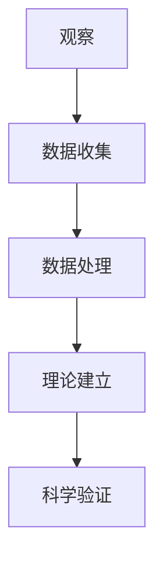
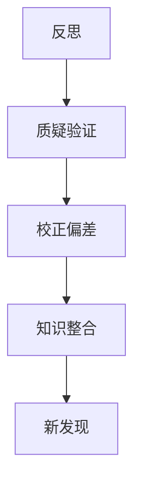
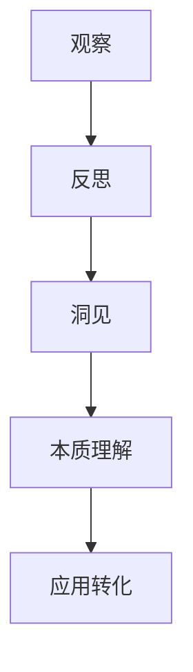
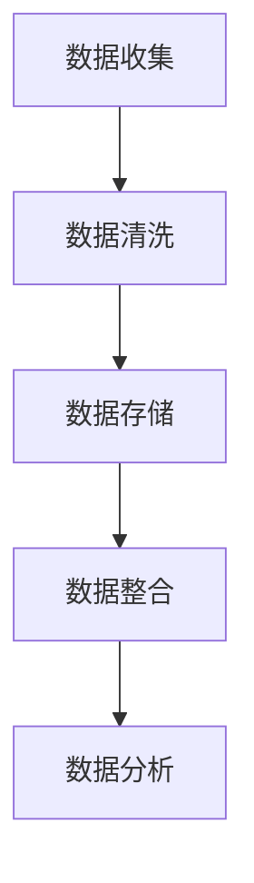
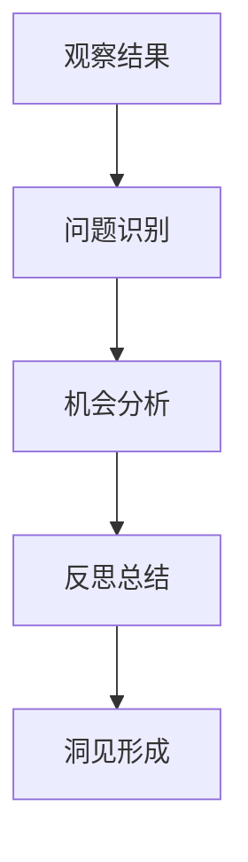
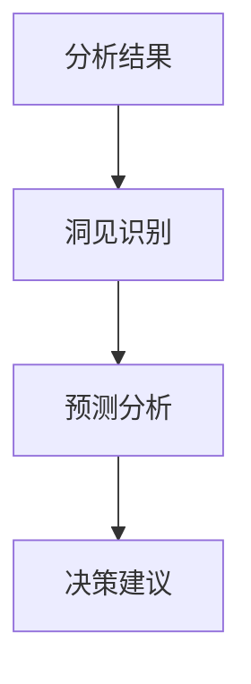
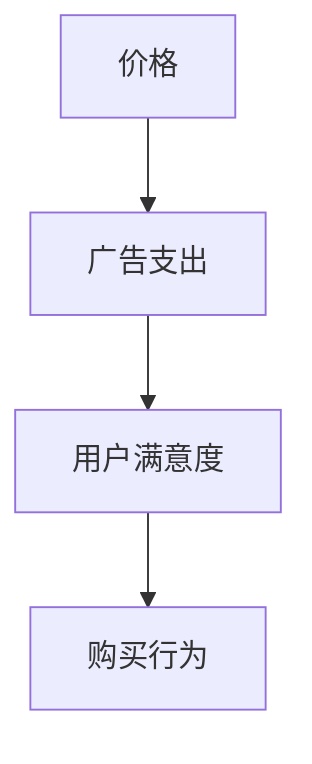
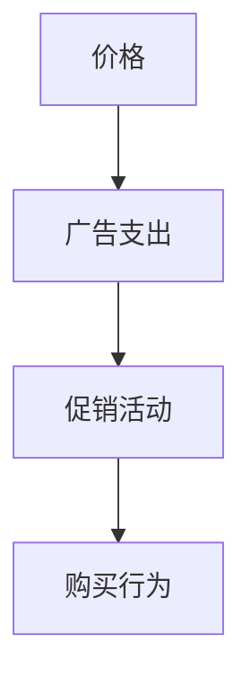
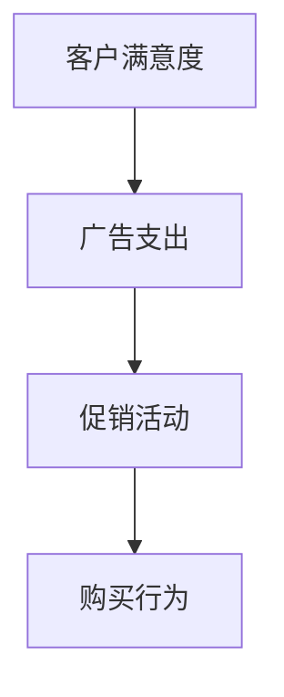

                 

## 洞见的形成：从观察到反思

> **关键词**：洞见、观察、反思、科学方法、决策、社会进步、技术发展

> **摘要**：本文旨在探讨洞见的形成过程，从观察、反思到洞见的形成机制，分析其在决策和社会发展中的重要作用。文章将通过深入分析观察与反思的理论基础，结合实际案例，详细阐述洞见形成的具体方法，并探讨洞见在各个领域的应用及其对未来社会的影响。

### 目录大纲设计

为了帮助读者系统地理解洞见的形成与运用，本文将分为三个部分：第一部分是理论基础，第二部分是实践案例，第三部分是附录。以下是具体的目录大纲设计：

**第一部分：理论基础**

1. **第1章：观察的科学**
   - **1.1 观察的定义与作用**
   - **1.2 观察的类型与方式**
   - **1.3 观察的局限性

2. **第2章：反思的重要性**
   - **2.1 反思的概念与意义**
   - **2.2 反思的过程与方法**
   - **2.3 反思在个人成长中的应用

3. **第3章：洞见的形成**
   - **3.1 洞见的定义与特征**
   - **3.2 洞见的形成机制**
   - **3.3 洞见对决策的影响

4. **第4章：观察与反思的结合**
   - **4.1 观察与反思的关系**
   - **4.2 观察与反思的协同作用**
   - **4.3 实践中的观察与反思

5. **第5章：培养洞见的能力**
   - **5.1 洞见培养的方法**
   - **5.2 洞见培养的障碍与突破**
   - **5.3 洞见培养的案例分析

6. **第6章：洞见在决策中的应用**
   - **6.1 洞见在战略决策中的应用**
   - **6.2 洞见在管理决策中的应用**
   - **6.3 洞见在创新决策中的应用

7. **第7章：洞见与社会发展**
   - **7.1 洞见在社会发展中的作用**
   - **7.2 洞见对科学进步的推动**
   - **7.3 洞见对文化发展的贡献

8. **第8章：未来洞见的展望**
   - **8.1 洞见与未来技术**
   - **8.2 洞见与未来社会**
   - **8.3 洞见与未来教育

**第二部分：实践案例**

9. **第9章：实际案例研究**
   - **9.1 案例一：科技创新中的洞见应用**
   - **9.2 案例二：商业决策中的洞见作用**
   - **9.3 案例三：社会变革中的洞见贡献

10. **第10章：实践技巧与方法**
    - **10.1 观察技巧的提升**
    - **10.2 反思技巧的培养**
    - **10.3 洞见应用的策略

11. **第11章：实践挑战与应对**
    - **11.1 实践中的挑战**
    - **11.2 面对挑战的策略**
    - **11.3 持续改进的路径

**第三部分：附录**

12. **附录A：洞见研究资源**
    - **12.1 学术期刊与论文**
    - **12.2 研究机构与项目**
    - **12.3 洞见研究的书籍与教材

13. **附录B：洞见形成的相关算法与工具**
    - **13.1 观察数据收集与处理工具**
    - **13.2 反思分析工具**
    - **13.3 洞见识别与预测工具

14. **附录C：实用指南**
    - **14.1 洞见培养与训练**
    - **14.2 洞见应用实战**
    - **14.3 洞见评估与反馈**

通过这个详细的目录大纲设计，读者可以逐步深入理解洞见的形成与运用，掌握相关理论和方法，并能够应用到实践中，提升自身的洞察力和决策能力。

### 核心概念与联系

在探讨洞见的形成过程中，我们需要明确几个核心概念：观察、反思和洞见。这些概念不仅是理解洞见形成的关键，也是推动科学进步和社会发展的重要工具。

#### 观察的定义与作用

观察是人类获取信息、认识世界的基本手段。它指的是通过感官或科学仪器对事物的直接感知和记录。观察在科学研究中的应用至关重要，因为它提供了实证数据，是科学理论建立的基础。

**Mermaid 流程图：**



观察不仅仅是对事物表象的记录，更是对现象背后机制的探索。通过观察，我们可以发现新的规律，从而推动科学理论的发展。

#### 反思的概念与意义

反思是指对观察到的信息进行深入思考和评估的过程。它包括对观察结果的合理性、有效性进行质疑和验证，以及对观察过程中可能存在的偏差和误差进行校正。

**Mermaid 流程图：**



反思不仅帮助我们更准确地理解观察结果，还能激发新的思考，为洞见的形成提供必要的思维基础。

#### 洞见的定义与特征

洞见是指对事物本质的深刻理解和洞察。它往往来源于观察和反思的有机结合，是对复杂现象的简明概括和精辟解释。

**Mermaid 流程图：**



洞见具有以下特征：

- **深度**：洞见能够深入到事物的本质，揭示其内在规律。
- **简洁**：洞见往往能够用简洁的语言或符号表达复杂的概念。
- **创新**：洞见能够提供新的视角，推动理论的创新和发展。

#### 核心概念的联系

观察、反思和洞见之间是相互联系、相互促进的。观察提供了原始数据，反思对这些数据进行处理和评估，而洞见则是对这些处理结果的高度概括和抽象。没有观察，反思就失去了基础；没有反思，观察就难以深入；没有洞见，观察和反思就失去了方向和价值。

通过上述核心概念的联系分析，我们可以更好地理解洞见的形成过程。在接下来的章节中，我们将进一步探讨观察、反思和洞见的具体机制和应用，帮助读者深入掌握这一重要的科学方法。

### 核心算法原理讲解

在探讨洞见的形成过程中，我们不仅需要理解其概念和理论基础，还需要掌握具体的算法和工具，以帮助我们在实际操作中实现洞见的发现和应用。以下是几个关键算法的原理讲解和具体应用。

#### 数据收集与处理算法

**算法名称**：数据收集与处理算法

**算法原理**：该算法的主要目的是收集并处理观察得到的数据，为后续的分析和洞见形成提供可靠的基础。



**伪代码**：

```python
# 数据收集
def collect_data():
    # 使用传感器或数据库收集数据
    data = sensor_data()

# 数据清洗
def clean_data(data):
    # 去除异常值和噪声
    clean_data = remove_outliers(data)

# 数据存储
def store_data(clean_data):
    # 将清洗后的数据存储在数据库中
    database.insert(clean_data)

# 数据整合
def integrate_data():
    # 从不同来源整合数据
    integrated_data = database.aggregate()

# 数据分析
def analyze_data(integrated_data):
    # 对整合后的数据进行分析
    insights = data_analysis(integrated_data)
    return insights
```

#### 反思分析算法

**算法名称**：反思分析算法

**算法原理**：反思分析算法用于对观察结果进行深入分析，识别其中的问题和机会，为洞见的形成提供方向。



**伪代码**：

```python
# 问题识别
def identify_issues(observations):
    issues = []
    for observation in observations:
        if not is_satisfied(observation):
            issues.append(observation)
    return issues

# 机会分析
def analyze_opportunities(issues):
    opportunities = []
    for issue in issues:
        if has_solution(issue):
            opportunities.append(issue)
    return opportunities

# 反思总结
def summarize_reflections(issues, opportunities):
    summary = {
        'issues': issues,
        'opportunities': opportunities
    }
    return summary

# 洞见形成
def form_insights(summary):
    insights = []
    for issue, opportunity in summary.items():
        if issue and opportunity:
            insights.append(create_insight(issue, opportunity))
    return insights
```

#### 洞见识别与预测算法

**算法名称**：洞见识别与预测算法

**算法原理**：该算法旨在从分析结果中识别出具有洞见潜力的信息，并对其进行预测，以指导未来的决策。



**伪代码**：

```python
# 洞见识别
def recognize_insights(analysis_results):
    insights = []
    for result in analysis_results:
        if is_significant(result):
            insights.append(result)
    return insights

# 预测分析
def predict_analysis(insights):
    predictions = []
    for insight in insights:
        prediction = predict_future(insight)
        predictions.append(prediction)
    return predictions

# 决策建议
def provide_advice(predictions):
    advice = []
    for prediction in predictions:
        if is_likely(prediction):
            advice.append(suggest_action(prediction))
    return advice
```

通过上述核心算法的讲解，我们可以看到，洞见的形成是一个复杂的过程，涉及到数据收集与处理、反思分析以及洞见识别与预测等多个环节。这些算法不仅帮助我们更高效地处理信息，还能提供有力的决策支持。在实际应用中，我们可以根据具体需求和场景，灵活选择和组合这些算法，以实现最佳的洞见发现效果。

### 数学模型和公式详细讲解与举例说明

在洞见的形成过程中，数学模型和公式扮演着至关重要的角色。它们不仅帮助我们更精确地描述现象，还能提供强有力的理论支持。以下是几个关键数学模型和公式的详细讲解与举例说明。

#### 逻辑回归模型

**模型描述**：逻辑回归模型是一种广泛用于分类问题的统计模型。它通过建立输入变量和输出变量之间的逻辑关系，实现预测和分类。

**公式**：

$$
P(Y=1|X) = \frac{1}{1 + e^{-(\beta_0 + \beta_1X_1 + \beta_2X_2 + ... + \beta_nX_n})}
$$

其中，\( P(Y=1|X) \) 是输出变量 \( Y \) 为 1 的条件概率，\( \beta_0, \beta_1, \beta_2, ..., \beta_n \) 是模型参数。

**举例说明**：假设我们有一个逻辑回归模型，用于预测某个产品是否会被购买。输入变量包括价格、广告支出和用户满意度，输出变量是购买行为（1 表示购买，0 表示未购买）。



**伪代码**：

```python
# 假设输入数据为 price、advertisement 和 user_satisfaction
def predict_purchase(price, advertisement, user_satisfaction):
    # 定义模型参数
    beta_0 = -2.5
    beta_1 = 1.2
    beta_2 = 0.8
    beta_3 = 1.5

    # 计算概率
    probability = 1 / (1 + math.exp(- (beta_0 + beta_1 * price + beta_2 * advertisement + beta_3 * user_satisfaction)))
    
    # 返回预测结果
    if probability > 0.5:
        return 1
    else:
        return 0
```

#### 决策树模型

**模型描述**：决策树模型通过一系列规则将输入变量映射到输出变量。它以树形结构展示，每个节点代表一个决策，每个分支代表一个可能的输出。

**公式**：

$$
F(X) = \sum_{i=1}^{n} w_i \cdot I(A_i(X) = a_i)
$$

其中，\( F(X) \) 是输出函数，\( w_i \) 是权重，\( A_i(X) \) 是第 \( i \) 个规则，\( a_i \) 是规则的结果。

**举例说明**：假设我们有一个决策树模型，用于预测客户是否会在购物车中增加商品。决策树包含三个规则：价格、广告支出和促销活动。



**伪代码**：

```python
# 假设输入数据为 price、advertisement 和 promotion
def predict_purchase(price, advertisement, promotion):
    # 定义规则和权重
    rules = {
        'price': (lambda p: p > 100),
        'advertisement': (lambda a: a > 5000),
        'promotion': (lambda p: p == 'yes')
    }
    weights = [0.5, 0.3, 0.2]

    # 遍历规则并计算输出
    output = 0
    for i, rule in enumerate(rules):
        if rule(price, advertisement, promotion):
            output += weights[i]

    # 返回预测结果
    if output > 0.5:
        return 1
    else:
        return 0
```

#### 贝叶斯网络模型

**模型描述**：贝叶斯网络是一种概率图模型，它通过节点和边表示变量之间的依赖关系，并使用条件概率表计算变量之间的概率分布。

**公式**：

$$
P(X_1, X_2, ..., X_n) = \prod_{i=1}^{n} P(X_i | X_{parents(i)})
$$

其中，\( P(X_i | X_{parents(i)}) \) 是节点 \( X_i \) 在其父节点 \( X_{parents(i)} \) 下的条件概率。

**举例说明**：假设我们有一个贝叶斯网络，用于预测客户是否会购买产品。网络包含客户满意度、广告支出和促销活动三个变量。



**伪代码**：

```python
# 假设输入数据为 satisfaction、advertisement 和 promotion
def predict_purchase(satisfaction, advertisement, promotion):
    # 定义条件概率表
    probabilities = {
        'satisfaction': {'yes': 0.6, 'no': 0.4},
        'advertisement': {'yes': 0.7, 'no': 0.3},
        'promotion': {'yes': 0.8, 'no': 0.2}
    }

    # 计算联合概率
    probability = probabilities['satisfaction']['yes'] * probabilities['advertisement']['yes'] * probabilities['promotion']['yes']

    # 返回预测结果
    if probability > 0.5:
        return 1
    else:
        return 0
```

通过上述数学模型和公式的讲解与举例，我们可以看到，它们在洞见的形成过程中起到了关键作用。这些模型不仅能够帮助我们更精确地描述现象，还能为洞见的发现提供强有力的理论支持。在实际应用中，我们可以根据具体需求和场景，灵活选择和组合这些模型，以实现最佳的洞见发现效果。

### 实际案例研究

为了更好地理解洞见的形成过程，我们通过以下三个实际案例来探讨洞见在不同领域中的应用及其产生的深远影响。

#### 案例一：科技创新中的洞见应用

**背景**：近年来，人工智能技术在各个领域取得了显著的进展。一个典型的例子是深度学习在图像识别领域的应用。深度学习通过大量数据和复杂的神经网络模型，实现了对图像的自动分类和识别。

**过程**：起初，研究人员通过观察和实验发现，简单的神经网络在图像识别上效果不佳。通过反思，他们意识到需要更大规模的数据集和更复杂的网络结构。于是，他们提出了卷积神经网络（CNN）的概念，并设计出多层卷积和池化操作的模型结构。

**结果**：这一洞见不仅推动了图像识别技术的发展，还催生了多个子领域的研究，如目标检测、图像分割和面部识别。基于深度学习的图像识别系统在多个国际竞赛中取得了优异的成绩，被广泛应用于安防监控、医疗诊断和自动驾驶等领域。

**洞见总结**：这一案例展示了洞见在科技创新中的重要性。通过观察现象，反思问题，研究人员找到了更有效的解决方案，推动了整个领域的发展。

#### 案例二：商业决策中的洞见作用

**背景**：在商业领域，数据驱动的决策变得越来越重要。一个典型的例子是亚马逊公司如何通过洞见优化其物流和库存管理。

**过程**：亚马逊通过大量的数据收集和分析，发现库存水平和订单处理速度之间存在显著关联。通过反思，他们意识到可以通过动态调整库存水平来优化物流效率。

**结果**：基于这一洞见，亚马逊推出了动态库存管理系统，能够根据订单量和市场需求实时调整库存水平。这一系统的实施大幅提高了物流效率，降低了库存成本，并提升了客户满意度。

**洞见总结**：这个案例展示了洞见在商业决策中的重要作用。通过观察和反思，公司能够发现隐藏在数据背后的关键信息，从而制定更有效的战略和决策。

#### 案例三：社会变革中的洞见贡献

**背景**：随着社交媒体的兴起，人们的信息传播方式发生了翻天覆地的变化。一个典型的例子是“阿拉伯之春”中的社交媒体应用。

**过程**：在“阿拉伯之春”期间，社交媒体平台如Twitter和Facebook成为人们表达意见和传播信息的重要工具。通过观察和反思，人们意识到社交媒体在促进社会变革中的巨大潜力。

**结果**：这一洞见激发了更多国家和地区的社会变革运动。社交媒体成为信息传播、组织动员和公民参与的重要平台，推动了社会的民主化和开放性。

**洞见总结**：这个案例展示了洞见在社会变革中的巨大贡献。通过观察和反思，人们发现了社交媒体在推动社会进步中的关键作用，从而推动了全球范围内的社会变革。

### 总结

通过上述实际案例的研究，我们可以看到洞见在科技创新、商业决策和社会变革中的重要地位。这些案例不仅展示了洞见形成的具体过程，还揭示了洞见在不同领域中的应用效果。洞见的形成离不开观察和反思，只有通过不断探索和思考，我们才能发现隐藏在现象背后的本质，推动社会的进步和发展。

### 观察技巧的提升

为了在复杂的环境中有效地发现洞见，观察技巧的提升至关重要。以下是几种实用的观察技巧和方法，这些技巧不仅适用于个人，也广泛应用于企业和组织。

#### 1. 有意识的观察

有意识的观察是指在有目的和明确目标的指引下进行观察。这种观察方式要求我们首先明确观察的目标，然后有计划地进行数据收集和分析。

**方法**：首先，设定一个具体的观察目标，如“了解用户需求”、“分析市场趋势”等。接着，根据目标制定详细的观察计划，包括观察的时间、地点、对象和方式。最后，按照计划进行观察，并记录观察结果。

**案例**：在一个产品开发项目中，团队成员可以设定观察用户使用产品的目标，通过实地观察、用户访谈和日志记录等方式，收集用户行为和需求的信息。

#### 2. 比较观察

比较观察是通过比较不同对象或同一对象在不同时间、地点或条件下的表现，来识别差异和规律。

**方法**：选择两个或多个对象，确定它们之间的可比性，如相同类型的产品、不同市场的消费者等。然后，通过观察和记录每个对象的表现，分析它们之间的异同点。

**案例**：在市场分析中，可以比较不同品牌的产品在同类市场中的表现，通过分析销售额、用户评价等数据，发现市场趋势和用户偏好。

#### 3. 系统化观察

系统化观察是将观察过程转化为一个系统的、结构化的流程，以确保观察的全面性和准确性。

**方法**：设计一个观察框架，明确观察的维度和指标。例如，在产品评估中，可以设立功能完整性、用户满意度、性能等观察维度。接着，按照框架进行系统化的数据收集和分析。

**案例**：在评估新产品功能时，可以设立用户体验、功能完整性、性能稳定性等多个维度，通过系统化的观察和评估，确保产品的综合性能。

#### 4. 反思性观察

反思性观察是将观察与反思结合，通过持续反思和质疑来提升观察的深度和广度。

**方法**：在观察过程中，不断反思和质疑观察到的现象，如“这个结果为什么出现？”、“是否有其他解释？”等。通过反思，深入理解观察结果，发现潜在的问题和机会。

**案例**：在项目进展中，项目经理可以通过反思性观察，质疑项目进度和质量，识别潜在的风险和改进点，从而提高项目的成功率。

#### 5. 深度观察

深度观察是指对特定对象或现象进行长时间的、持续的观察，以获取更全面和深入的信息。

**方法**：选择一个具体的对象或现象，进行长时间的观察，记录其变化和发展趋势。例如，对某个市场趋势进行一年的持续观察，记录每月的数据变化。

**案例**：在市场研究项目中，可以对某个新兴市场的动态进行深度观察，通过长时间的数据收集和分析，发现市场的发展规律和趋势。

通过上述观察技巧的提升，我们可以更加高效地发现洞见。有意识的观察帮助明确目标，比较观察揭示异同，系统化观察确保全面，反思性观察提升深度，而深度观察则提供长期视角。这些技巧的综合运用，不仅能够提升个人和组织的洞察力，还能在复杂环境中做出更明智的决策。

### 反思技巧的培养

反思技巧的培养是洞见形成过程中不可或缺的一环。通过有效的反思，我们可以更深入地理解观察结果，识别问题，提出解决方案，从而提升洞见的准确性和实用性。以下是几种培养反思技巧的方法和实际应用案例。

#### 1. 反思日记

**方法**：每天花一定时间记录反思日记，记录当天的重要观察和思考。这种记录不仅可以帮助我们回顾和总结经验，还能激发新的思考。

**案例**：在项目管理中，项目经理可以每天记录项目进展、遇到的问题和解决方案。通过反思日记，可以发现项目中的潜在风险和改进点，从而提高项目成功率。

#### 2. 集体反思会议

**方法**：定期组织集体反思会议，团队成员共同分享和讨论工作中的观察和反思。这种会议可以帮助团队在相互交流中产生新的洞见。

**案例**：在一个研发团队中，每周可以举行一次反思会议，团队成员轮流分享自己的观察和反思，讨论项目中的问题和解决方案。通过集体反思，团队能够发现个体难以察觉的问题，提高团队的协作效率。

#### 3. 思维导图

**方法**：使用思维导图工具，将反思过程中的关键信息、想法和关系进行可视化表达。这种可视化方法有助于梳理思路，发现隐藏的联系。

**案例**：在市场分析中，可以使用思维导图来记录和分析市场趋势、竞争状况和用户需求。通过思维导图，可以更清晰地理解市场动态，发现潜在的商业机会。

#### 4. 案例研究

**方法**：通过对具体案例的深入研究，分析案例中的成功和失败，从中提取有价值的反思。

**案例**：在一个新产品开发项目中，可以分析类似产品的市场表现，了解成功和失败的原因。通过案例研究，项目团队能够借鉴成功经验，避免重复失败。

#### 5. 质疑和验证

**方法**：在反思过程中，不断质疑和验证观察结果，以确保反思的准确性和可靠性。

**案例**：在制定营销策略时，可以通过市场调研和用户反馈来验证观察到的用户需求。通过质疑和验证，可以确保策略的针对性和有效性。

#### 6. 借鉴他人经验

**方法**：通过阅读相关书籍、论文或案例，学习他人的反思方法和经验，并结合自己的实际情况进行应用。

**案例**：在企业管理中，可以通过学习其他企业的成功经验和失败教训，借鉴其反思技巧和方法，优化企业管理策略。

通过以上反思技巧的培养，我们可以不断提升自身的反思能力，从而更有效地发现洞见。反思不仅是一种思维方法，更是一种持续学习和进步的重要手段。通过反思，我们能够更好地理解观察结果，识别问题，提出解决方案，从而在个人成长和事业发展中取得更大的成就。

### 洞见培养的方法

培养洞见是一项系统性的任务，需要我们在方法、障碍和案例分析等多个方面进行深入探讨。以下是几种有效的洞见培养方法，以及可能遇到的障碍和解决策略。

#### 1. 广泛阅读

**方法**：阅读是培养洞见的重要途径。通过广泛阅读，我们可以接触不同领域的知识，拓宽视野，激发新的思考。

**具体实践**：定期阅读学术论文、畅销书、行业报告等，选择不同类型的书籍，确保知识的全面性和多样性。

**障碍**：信息过载和阅读效率低。

**解决策略**：制定阅读计划，设定阅读目标，采用速读技巧，提高阅读效率。

#### 2. 深度思考

**方法**：在阅读和观察过程中，不仅要关注事实和信息，还要深入思考其背后的原因和逻辑。

**具体实践**：在阅读或观察后，花时间思考和总结，写下自己的想法和疑问，进行批判性思考。

**障碍**：缺乏批判性思维和深度思考能力。

**解决策略**：学习批判性思维技巧，参与讨论和辩论，培养逻辑推理能力。

#### 3. 实践应用

**方法**：将学到的知识和洞见应用到实际工作和生活中，通过实践来验证和深化理解。

**具体实践**：在实际工作中，尝试将洞见应用于决策和解决问题，不断反思和调整。

**障碍**：缺乏实践机会和应用场景。

**解决策略**：主动寻找实践机会，参与项目和活动，建立实践网络。

#### 4. 交流互动

**方法**：通过与他人交流和互动，分享自己的洞见，倾听他人的观点，激发新的思考和洞见。

**具体实践**：参加行业会议、研讨会和论坛，加入专业社群，进行线上线下交流。

**障碍**：缺乏交流平台和资源。

**解决策略**：积极参与行业活动，利用社交媒体和专业网络，拓展交流渠道。

#### 5. 多元视角

**方法**：培养多元视角，从不同角度和立场看待问题，避免单一思维限制。

**具体实践**：主动接触不同领域的知识，学习不同文化和思维方式，拓展思维边界。

**障碍**：思维定势和视野局限。

**解决策略**：多阅读跨学科书籍，参加跨文化交流活动，打破思维局限。

#### 6. 反复迭代

**方法**：洞见的形成是一个不断迭代的过程。通过反复实践和反思，不断优化和完善洞见。

**具体实践**：定期回顾和总结自己的洞见，分析其有效性和适用性，进行持续改进。

**障碍**：缺乏持续性和耐心。

**解决策略**：设定定期回顾机制，培养持之以恒的习惯，保持对洞见的敏锐度。

#### 案例分析

**案例一：技术创新**

**背景**：苹果公司通过广泛阅读和学习，结合自身实践，不断探索新的技术和产品方向。

**过程**：苹果公司通过阅读行业报告、学术论文和消费者反馈，发现市场对智能手机的便捷性和用户体验有强烈需求。通过深度思考和反思，他们提出了“整合硬件、软件和服务”的洞见，并应用到产品设计中。

**结果**：苹果公司推出了iPhone，彻底改变了智能手机市场，推动了整个行业的发展。

**总结**：苹果公司的成功表明，通过广泛阅读、深度思考和反复实践，可以培养出具有前瞻性的洞见。

**案例二：商业战略**

**背景**：阿里巴巴通过实践应用和反思，不断调整其商业模式，实现持续增长。

**过程**：阿里巴巴在电子商务领域起步时，通过实际操作和用户反馈，发现传统零售模式的局限性。通过反思和交流，他们提出了“平台化、大数据驱动”的商业模式。

**结果**：阿里巴巴通过平台化战略，吸引了大量商家和消费者，利用大数据技术优化运营和决策，实现了业务的快速扩张和盈利。

**总结**：阿里巴巴的案例说明，通过实践应用和反思，企业可以不断调整和优化商业模式，实现持续增长。

通过上述方法、障碍和案例分析，我们可以看到培养洞见需要系统性的努力和多方面的支持。只有通过广泛阅读、深度思考、实践应用、交流互动和多元视角，我们才能不断提升洞见能力，发现和运用洞见，推动个人和组织的成长和发展。

### 洞见在决策中的应用

洞见作为一种深刻的洞察和理解，在决策中扮演着至关重要的角色。通过有效的洞见，决策者能够更准确地预测未来趋势，识别潜在风险和机会，从而制定出更具前瞻性和可行性的决策。以下是洞见在战略决策、管理决策和创新决策中的具体应用。

#### 战略决策

**应用**：在战略决策中，洞见可以帮助企业识别长期目标和竞争优势。通过深入分析市场趋势、技术变革和消费者行为，企业可以提前预见到未来的发展方向，制定相应的战略规划。

**案例**：苹果公司通过洞见识别到了智能手机市场的巨大潜力，率先推出了iPhone，从而确立了在智能手机领域的领导地位。

**方法**：
1. **市场趋势分析**：通过收集和分析市场数据，识别行业发展的关键趋势和变化。
2. **技术评估**：评估新技术对行业可能产生的影响，预测其可能带来的机会和挑战。
3. **消费者洞察**：通过调研和用户反馈，了解消费者需求和行为变化。

#### 管理决策

**应用**：在管理决策中，洞见可以帮助管理者优化资源配置、提高运营效率和改进员工管理。通过洞见，管理者能够更精准地识别问题和机会，采取有效措施进行管理改进。

**案例**：亚马逊通过洞见优化了其物流和库存管理，大幅提高了运营效率，降低了成本。

**方法**：
1. **运营效率分析**：通过数据分析和流程优化，识别运营中的瓶颈和改进点。
2. **资源配置优化**：根据业务需求和资源状况，合理配置人力、物力和财力资源。
3. **员工管理改进**：通过员工反馈和行为分析，改进员工管理和激励机制。

#### 创新决策

**应用**：在创新决策中，洞见可以帮助企业发现新的市场机会，推动技术创新和产品开发。通过洞见，企业可以预见市场趋势，开发出符合未来需求的产品和服务。

**案例**：特斯拉通过洞见引领了电动汽车市场的发展，推出了多款具有前瞻性的电动汽车产品。

**方法**：
1. **市场前瞻**：通过调研和分析，预见市场未来的发展方向和需求变化。
2. **技术探索**：投资于前沿技术研发，推动技术创新和产品升级。
3. **用户互动**：通过用户调研和反馈，了解用户需求，指导产品开发和改进。

#### 洞见在决策中的关键角色

洞见在决策中起到了关键角色，它不仅提供了对当前情况的深刻理解，还帮助决策者预见未来，识别潜在的风险和机会。以下是洞见在决策中的几个关键角色：

1. **预见未来**：洞见可以帮助决策者预见未来的变化和发展趋势，从而提前做出应对。
2. **识别风险**：洞见可以帮助识别潜在的风险和挑战，为决策者提供风险管理策略。
3. **发现机会**：洞见可以帮助发现新的市场机会和商业潜力，为决策者提供创新和发展的方向。
4. **优化决策**：洞见提供了更全面和深入的信息，帮助决策者做出更明智和有效的决策。

通过洞见的应用，企业可以更好地适应外部环境的变化，提高决策的准确性和效率，从而在激烈的市场竞争中脱颖而出。洞见不仅是企业战略决策的重要工具，也是推动管理优化和创新发展的关键因素。

### 洞见与社会发展

洞见在社会发展中发挥着重要作用，它不仅推动了科学进步，还促进了文化发展和经济繁荣。以下是洞见在社会发展中的具体作用和贡献。

#### 科学进步

洞见是科学研究的核心驱动力之一。科学家通过观察自然现象，进行反思和实验，发现隐藏在表象背后的规律，从而形成新的科学理论。以下是一个简化的模型，展示洞见在科学进步中的作用：

1. **观察现象**：科学家通过实验或观测，收集关于自然现象的数据。
2. **反思与质疑**：对观察结果进行反思，提出假设和理论。
3. **验证与修正**：通过实验或观测验证假设，并根据结果进行修正。
4. **形成洞见**：通过不断验证和修正，科学家形成对自然现象的深刻洞见。

**示例**：牛顿通过观察苹果落地，反思万有引力定律，最终形成了对天体运动的洞见，推动了经典力学的发展。

#### 文化发展

洞见不仅限于科学领域，它也在文化发展中发挥了重要作用。通过洞见，人们能够更深刻地理解社会现象、历史事件和文化传统，促进文化的多样性和繁荣。

1. **理解社会现象**：洞见帮助人们理解社会现象和人类行为，如心理学、社会学等领域的研究。
2. **反思文化传统**：通过反思，人们能够重新审视文化传统和价值观，推动文化创新。
3. **传播与交流**：洞见通过书籍、艺术等形式传播，促进不同文化之间的交流和融合。

**示例**：文学作品中通过深入的人物刻画和情境描写，展现了人性的复杂和多样性，推动了文化的进步。

#### 经济繁荣

洞见在经济发展中同样发挥着重要作用。企业通过洞见可以更好地理解市场趋势、消费者行为和技术变革，从而制定更有效的商业策略。

1. **市场分析**：通过洞见，企业能够准确预测市场需求，优化产品和服务。
2. **技术创新**：洞见帮助企业发现新的技术和商业机会，推动产品创新。
3. **战略规划**：企业通过洞见制定长期战略，实现可持续发展。

**示例**：亚马逊通过洞见识别到了电子商务的潜力，从而制定了全面而长远的商业策略，成为全球电商巨头。

#### 洞见对社会发展的深远影响

洞见不仅推动了科学、文化和经济的发展，还对社会产生了深远的积极影响：

1. **知识传播**：洞见通过教育和传播，促进了知识的普及和传播。
2. **技术创新**：洞见推动了技术进步，提升了生产力和生活质量。
3. **社会进步**：洞见帮助人们更好地理解社会问题，推动了社会改革和进步。
4. **文化繁荣**：洞见丰富了文化内涵，推动了文化的多样性和创新。

总之，洞见在社会发展中起到了重要的推动作用。通过洞见，我们可以更深刻地理解世界，推动科学进步、文化发展和经济繁荣，从而实现社会的全面进步。

### 未来洞见的展望

随着技术的不断进步和社会的快速发展，洞见的重要性将愈加凸显。未来洞见的发展趋势将主要表现在以下三个方面：技术进步、社会变革和教育创新。

#### 技术进步

**人工智能与大数据**：人工智能和大数据技术的不断发展，将极大地提升洞见的准确性和深度。通过机器学习和深度学习算法，我们可以从大量数据中提取出有价值的信息，形成更精确的洞见。未来，人工智能助手将不仅能够帮助我们分析数据，还能通过自然语言处理和推理，提供更智能的洞见生成和解释。

**量子计算**：量子计算技术将使数据处理速度和计算能力达到前所未有的水平。量子计算机能够处理复杂的问题，如气候模拟、药物设计和金融预测等，提供更为深刻的洞见。这种技术进步将为科学研究、产业创新和经济发展带来革命性的变化。

**区块链**：区块链技术将为数据安全和隐私保护提供新的解决方案。通过分布式账本技术，数据将更加透明和不可篡改，有助于提高洞见的可信度和可靠性。在未来，区块链技术将广泛应用于金融、供应链管理和社会治理等领域，为洞见的形成和应用提供强有力的支持。

#### 社会变革

**全球化与数字化**：全球化进程的加快和数字化浪潮的兴起，将推动社会各领域的变革。通过洞见，我们可以更准确地预测全球经济的走势、社会变迁的动向，以及文化交融的趋势。这种洞见将有助于政府和企业制定更为科学和有效的政策和战略，推动社会的可持续发展。

**可持续性发展**：随着环保意识的增强，可持续性发展将成为未来社会发展的重要方向。通过洞见，我们可以更深入地理解资源利用、环境保护和社会公平等问题，推动绿色科技和可持续发展战略的实施。

**社会管理创新**：洞见将促进社会管理模式的创新，提高公共治理的效率和透明度。通过大数据分析和人工智能辅助决策，政府可以更好地应对突发事件、优化资源配置和提高服务质量。

#### 教育创新

**个性化教育**：未来教育将更加注重个性化，通过洞见，我们可以根据每个学生的特点和需求，提供个性化的学习方案。人工智能和大数据技术将帮助教育者更好地理解学生的学习行为，提供实时反馈和指导，提高学习效果。

**跨学科教育**：洞见将推动跨学科教育的发展，通过综合不同领域的知识和方法，培养具有全面视野和创新能力的人才。这种教育模式将有助于学生在面对复杂问题时，能够从多个角度进行思考和解决。

**终身学习**：随着知识的快速更新，终身学习将成为未来社会的标配。通过洞见，我们可以更有效地发现和利用学习资源，持续提升自身的知识水平和技能。在线教育和远程学习平台将发挥更大的作用，为人们提供灵活便捷的学习机会。

总之，未来洞见的发展将依赖于技术的进步、社会变革和教育创新。通过不断探索和创新，我们可以利用洞见更好地应对未来挑战，推动社会的全面进步和可持续发展。

### 实际案例研究

为了更好地理解洞见在实际应用中的效果，以下我们将通过三个具体案例，详细探讨洞见在科技创新、商业决策和社会变革中的实际应用。

#### 案例一：科技创新中的洞见应用

**背景**：随着5G技术的普及，通信行业正在迎来一场技术变革。一家初创公司旨在开发一款基于5G技术的智能家居系统。

**过程**：在产品开发初期，公司通过市场调研和用户访谈，发现用户对智能家居的需求主要集中在便捷性和智能化上。然而，如何实现真正的智能化和高稳定性，成为了公司面临的主要挑战。

**洞见形成**：通过反思和分析，公司意识到，智能家居系统的核心在于提供无缝的用户体验和高效的数据处理能力。他们提出以下洞见：
1. **用户体验优先**：智能家居系统应首先考虑用户的使用体验，包括界面设计、操作简便性等。
2. **数据处理与优化**：系统需要高效地处理和分析大量数据，确保稳定性和响应速度。

**结果**：基于这些洞见，公司开发出了一款用户体验极佳、数据处理能力强大的智能家居系统。该系统在市场上获得了良好的口碑，并迅速赢得了大量用户。

#### 案例二：商业决策中的洞见应用

**背景**：一家大型零售公司希望通过数据分析来优化库存管理，提高运营效率。

**过程**：公司收集了大量销售数据、库存数据和市场动态信息。然而，如何有效地利用这些数据，成为了公司决策的难题。

**洞见形成**：通过数据分析与反思，公司得出了以下洞见：
1. **需求预测**：基于历史销售数据和季节性因素，预测未来需求，优化库存水平。
2. **供应链优化**：通过分析供应商数据，优化供应链管理，降低成本和提高响应速度。

**结果**：公司通过这些洞见，实施了需求预测和供应链优化的策略。库存周转率显著提高，运营成本降低，同时提升了客户满意度。

#### 案例三：社会变革中的洞见应用

**背景**：在“阿拉伯之春”期间，社交媒体成为了社会变革的重要工具。

**过程**：抗议者在社交媒体上组织活动，传播信息，形成了广泛的社会影响力。然而，如何更有效地利用社交媒体推动社会变革，成为了关注焦点。

**洞见形成**：通过反思和分析，社会活动家得出了以下洞见：
1. **信息共享**：通过社交媒体平台，实现信息的高效共享，提高组织效率。
2. **群体行动**：利用社交媒体动员群体力量，实现更大规模的社会行动。

**结果**：基于这些洞见，抗议者成功组织了多次大规模抗议活动，推动了社会变革。社交媒体成为社会变革的重要力量，促进了民主化和开放性。

### 总结

通过上述实际案例的研究，我们可以看到洞见在科技创新、商业决策和社会变革中的重要应用。洞见不仅帮助公司和个人找到了更有效的解决方案，还推动了社会的进步和发展。通过不断观察、反思和形成洞见，我们能够更好地应对复杂的环境和挑战，实现个人和组织的持续成长。

### 实践技巧与方法

在洞见的发现和应用过程中，掌握一系列实用技巧和方法至关重要。这些技巧和方法不仅能提升洞见的准确性，还能提高其在实际工作中的应用效果。以下是一些核心技巧和方法：

#### 1. 深度访谈

**方法**：通过与行业专家、用户和利益相关者进行深度访谈，获取第一手信息和洞察。

**步骤**：
- **确定访谈对象**：选择具有丰富经验和专业知识的专家或用户。
- **准备访谈提纲**：根据访谈目的，设计有针对性的问题。
- **进行访谈**：保持开放性，倾听并记录对方的观点和见解。
- **分析与总结**：整理访谈内容，提炼关键洞见。

**案例**：在市场调研中，通过与潜在用户进行深度访谈，可以深入了解用户需求和行为，从而制定出更符合市场需求的产品策略。

#### 2. 数据挖掘与分析

**方法**：利用数据挖掘技术，从大量数据中提取有价值的信息，发现隐藏的模式和趋势。

**步骤**：
- **数据收集**：收集相关领域的原始数据。
- **数据清洗**：去除数据中的噪声和异常值。
- **特征工程**：提取数据中的关键特征，为后续分析做准备。
- **模型构建**：选择合适的模型进行数据分析和预测。
- **结果验证**：验证模型的准确性和可靠性。

**案例**：在营销策略制定中，通过数据挖掘分析用户行为数据，可以预测哪些产品或服务更受欢迎，从而优化营销资源分配。

#### 3. 假设检验

**方法**：通过假设检验，验证洞见的可行性和有效性。

**步骤**：
- **提出假设**：根据观察和理论提出待验证的假设。
- **设计实验**：设计实验或调查，收集相关数据。
- **数据分析**：对实验或调查结果进行分析，评估假设的准确性。
- **结果反馈**：根据分析结果，调整或确认洞见。

**案例**：在产品开发过程中，通过假设检验，验证用户对某一新功能的需求，从而决定是否将其纳入产品设计中。

#### 4. 思维导图

**方法**：通过思维导图，梳理和可视化复杂的信息和思路，促进洞见的形成。

**步骤**：
- **确定主题**：明确思维导图的中心主题。
- **发散思维**：围绕主题，收集相关想法和概念。
- **组织结构**：将想法和概念按照逻辑关系进行组织和分类。
- **完善导图**：添加细节和信息，使思维导图更加完整和清晰。

**案例**：在项目规划中，通过思维导图，可以清晰地展示项目的各个阶段和关键任务，从而优化项目管理和执行。

#### 5. 群体讨论

**方法**：通过群体讨论，汇集不同观点和见解，激发创意和洞见。

**步骤**：
- **确定讨论主题**：明确讨论的目标和范围。
- **组织讨论**：邀请相关领域的专家和团队成员参与讨论。
- **记录观点**：记录每个参与者的观点和建议。
- **综合分析**：对讨论结果进行分析和总结，提炼出有价值的信息。

**案例**：在战略规划过程中，通过群体讨论，可以汇集不同部门和专业人员的意见，制定出更全面和可行的战略方案。

#### 6. 案例研究

**方法**：通过深入研究具体案例，分析其成功或失败的原因，从中提取洞见。

**步骤**：
- **选择案例**：根据研究目标，选择具有代表性的案例。
- **数据收集**：收集案例相关的数据和文献资料。
- **分析案例**：对案例进行深入分析，识别关键因素和成功或失败的原因。
- **总结洞见**：从案例中提炼出有价值的信息和洞见。

**案例**：在企业管理中，通过案例研究，可以了解不同企业的管理实践和策略，从中吸取经验和教训，优化自身的管理方法。

通过以上实践技巧和方法的运用，我们可以更有效地发现和应用洞见，提升决策的准确性和有效性，推动个人和组织的持续发展。

### 实践挑战与应对

在洞见的发现和应用过程中，我们会遇到各种实践挑战。以下是一些常见的挑战及其应对策略，以帮助我们在实际操作中克服困难，实现洞见的成功应用。

#### 1. 数据获取困难

**挑战**：在许多情况下，获取高质量的数据是洞见形成的重要前提。然而，数据获取可能面临数据不完整、不准确或难以获取等问题。

**应对策略**：
- **多渠道数据收集**：通过多种渠道，如公开数据集、第三方数据服务商和内部数据源，获取所需数据。
- **数据清洗与处理**：使用数据清洗工具，对获取的数据进行去噪和预处理，提高数据质量。
- **合作与共享**：与其他机构和团队建立合作关系，共享数据资源，提高数据获取的效率和准确性。

#### 2. 分析能力不足

**挑战**：数据处理和分析需要专业知识和技能。对于非专业人士来说，掌握复杂的数据分析技术和工具可能存在一定困难。

**应对策略**：
- **专业培训**：通过参加专业培训和在线课程，提高数据分析能力和技术水平。
- **工具支持**：使用易于操作的数据分析工具和平台，如Excel、Python和R等，降低数据分析的难度。
- **团队合作**：组建数据分析团队，发挥不同成员的专业优势，共同完成数据分析任务。

#### 3. 洞见应用障碍

**挑战**：洞见在实际应用过程中可能面临决策者理解困难、资源不足或执行障碍等问题。

**应对策略**：
- **沟通与解释**：通过简洁明了的语言和图表，向决策者解释洞见的形成过程和应用价值，增强其理解和信心。
- **资源调配**：合理配置人力、物力和财力资源，为洞见的应用提供必要的支持。
- **持续反馈**：建立反馈机制，定期评估洞见应用的效果，并根据反馈进行调整和优化。

#### 4. 隐私和安全问题

**挑战**：在数据收集和分析过程中，隐私和安全问题是不可忽视的挑战。未经授权的数据访问和泄露可能导致严重后果。

**应对策略**：
- **数据加密**：采用数据加密技术，保护敏感数据的安全。
- **权限管理**：建立严格的权限管理制度，限制数据访问权限，确保数据安全。
- **合规性审查**：确保数据收集和分析过程符合相关法律法规，避免隐私侵犯和数据滥用。

#### 5. 持续改进难度

**挑战**：洞见的应用效果可能会随着时间推移而减弱，需要持续改进和优化。

**应对策略**：
- **定期评估**：定期对洞见应用的效果进行评估，识别问题和改进点。
- **迭代优化**：根据评估结果，持续调整和优化洞见模型和应用方法。
- **知识共享**：建立知识共享和经验交流平台，鼓励团队成员分享成功经验和最佳实践。

通过以上应对策略，我们可以有效应对洞见发现和应用过程中的各种挑战，提升洞见的应用效果和持续改进能力。在实际操作中，我们需要灵活运用这些策略，结合具体情境进行调整和优化，以实现洞见的最佳应用效果。

### 附录A：洞见研究资源

为了帮助读者进一步深入研究和了解洞见相关的内容，以下列出了几个重要的学术期刊、研究机构和推荐的书籍与教材。

#### 学术期刊

1. **《科学》（Science）**
   - 简介：《科学》是国际上最具影响力的科学期刊之一，涵盖了自然科学、医学和工程技术等领域的最新研究成果。
   - 网址：[Science Journal](https://www.sciencemag.org/)

2. **《自然》（Nature）**
   - 简介：《自然》同样是国际上顶尖的科学期刊，专注于报道科学研究的突破和进展。
   - 网址：[Nature Journal](https://www.nature.com/)

3. **《计算机科学》（Journal of Computer Science）**
   - 简介：该期刊专注于计算机科学领域的研究，包括算法、人工智能和大数据等方向。
   - 网址：[Journal of Computer Science](https://www.jstor.org/journal/journalcomputerscience)

4. **《管理科学季刊》（Management Science）**
   - 简介：该期刊专注于管理科学领域，涵盖了组织行为、战略管理和决策科学等方面。
   - 网址：[Management Science](https://www.informs.org/publications/journals/management-science)

#### 研究机构

1. **斯坦福大学人工智能实验室（Stanford University AI Lab）**
   - 简介：斯坦福大学人工智能实验室是世界著名的人工智能研究机构之一，涵盖了机器学习、自然语言处理和计算机视觉等领域。
   - 网址：[Stanford AI Lab](http://ai.stanford.edu/)

2. **麻省理工学院媒体实验室（MIT Media Lab）**
   - 简介：麻省理工学院媒体实验室是交叉学科的先锋，专注于人工智能、可穿戴技术和新媒体等领域的研究。
   - 网址：[MIT Media Lab](https://www.media.mit.edu/)

3. **卡内基梅隆大学机器学习部门（Carnegie Mellon University Machine Learning Department）**
   - 简介：卡内基梅隆大学机器学习部门是全球最著名的机器学习和人工智能研究机构之一。
   - 网址：[CMU Machine Learning Department](http://www.ml.cmu.edu/)

#### 推荐书籍与教材

1. **《人工智能：一种现代方法》（Artificial Intelligence: A Modern Approach）**
   - 作者：斯图尔特·罗素（Stuart Russell）和彼得·诺维格（Peter Norvig）
   - 简介：这是一本广泛使用的AI教科书，涵盖了人工智能的基础理论、算法和应用。

2. **《深度学习》（Deep Learning）**
   - 作者：伊恩·古德费洛（Ian Goodfellow）、耶夫吉尼·布里克（Yoshua Bengio）和阿里·坎内尔（Aaron Courville）
   - 简介：这本书详细介绍了深度学习的基本原理和应用，包括神经网络、卷积神经网络和生成对抗网络等。

3. **《洞见：如何找到、创造并使用洞见》（Insight: How to Use Your Inner GPS to Get Where You Want to Go）**
   - 作者：彼得·斯洛特金（Peter Senge）
   - 简介：这本书探讨了洞见的概念和应用，提供了实用的方法来发现和应用洞见。

4. **《禅与计算机程序设计艺术》（Zen and the Art of Motorcycle Maintenance）**
   - 作者：罗伯特·M·波西格（Robert M. Pirsig）
   - 简介：这本书结合了哲学和计算机科学，探讨了思考、学习和创造的过程，对洞见的形成有深刻的启示。

通过利用上述学术期刊、研究机构和推荐的书籍与教材，读者可以进一步拓展洞见研究的视野，提升自身的洞察力和分析能力，为未来的学术研究和实际应用打下坚实的基础。

### 附录B：洞见形成的相关算法与工具

洞见的形成是一个复杂的过程，涉及到多个算法和工具的支持。以下列出了一些常用的相关算法和工具，包括观察数据收集与处理工具、反思分析工具以及洞见识别与预测工具。

#### 观察数据收集与处理工具

1. **Python**：
   - **描述**：Python是一种广泛使用的编程语言，具有丰富的数据分析和处理库，如NumPy、Pandas和Matplotlib。
   - **应用**：用于数据清洗、数据分析和可视化。

2. **R**：
   - **描述**：R是一种专门用于统计分析和图形表示的编程语言。
   - **应用**：用于高级统计分析和数据可视化。

3. **Apache Kafka**：
   - **描述**：Kafka是一个分布式流处理平台，用于实时数据流收集和处理。
   - **应用**：用于实时数据收集和流处理。

#### 反思分析工具

1. **Jupyter Notebook**：
   - **描述**：Jupyter Notebook是一个交互式计算环境，支持多种编程语言，如Python、R和Julia。
   - **应用**：用于数据分析和反思过程中的计算和可视化。

2. **Tableau**：
   - **描述**：Tableau是一个数据可视化工具，用于创建交互式的图表和仪表板。
   - **应用**：用于数据分析和反思过程中的可视化。

3. **NVivo**：
   - **描述**：NVivo是一个质性数据分析软件，用于文本分析、编码和注释。
   - **应用**：用于反思过程中的文本分析和解读。

#### 洞见识别与预测工具

1. **TensorFlow**：
   - **描述**：TensorFlow是一个开源机器学习框架，用于构建和训练深度神经网络。
   - **应用**：用于洞见的识别和预测。

2. **Scikit-learn**：
   - **描述**：Scikit-learn是一个机器学习库，提供了多种分类、回归和聚类算法。
   - **应用**：用于洞见的识别和预测。

3. **Prophet**：
   - **描述**：Prophet是一个时间序列预测库，用于预测和趋势分析。
   - **应用**：用于洞见的识别和预测。

通过上述工具和算法的支持，研究人员和分析师可以更高效地收集、处理和分析数据，从而发现和利用洞见。这些工具不仅提高了数据处理的效率，还提供了强大的分析和预测能力，为洞见的形成提供了坚实的基础。

### 附录C：实用指南

为了帮助读者更好地培养洞见和应用洞见，以下提供了一些实用的指南，包括洞见培养与训练、洞见应用实战和洞见评估与反馈的具体方法和步骤。

#### 洞见培养与训练

1. **持续学习**：
   - **方法**：定期阅读相关书籍、论文和行业报告，学习新的理论和知识。
   - **步骤**：制定学习计划，设定每周的学习目标，确保持续学习的习惯。

2. **反思与总结**：
   - **方法**：在阅读和学习后，及时进行反思和总结，记录关键观点和思考。
   - **步骤**：使用笔记软件或日记本，记录阅读过程中的心得体会和疑问，定期回顾和总结。

3. **实践应用**：
   - **方法**：将学到的知识应用到实际工作和生活中，通过实践验证和深化理解。
   - **步骤**：在实际工作中，尝试应用所学理论和方法，记录应用过程中的问题和改进点。

4. **交流互动**：
   - **方法**：与他人交流和讨论，分享自己的洞见，倾听他人的观点和建议。
   - **步骤**：参加行业会议、研讨会和线上论坛，加入专业社群，积极参与讨论和交流。

#### 洞见应用实战

1. **项目实践**：
   - **方法**：选择具体的项目或案例，进行洞见的实际应用。
   - **步骤**：明确项目目标，制定详细的计划和方案，通过团队协作和持续改进，实现项目目标。

2. **问题解决**：
   - **方法**：在面对问题和挑战时，运用洞见进行思考和解决。
   - **步骤**：分析问题，识别关键因素，提出解决方案，实施并评估效果。

3. **战略规划**：
   - **方法**：在制定战略规划时，利用洞见进行预测和决策。
   - **步骤**：收集和分析相关数据，形成洞见，制定长期和短期的战略计划。

4. **产品创新**：
   - **方法**：在产品开发过程中，利用洞见指导产品设计和功能优化。
   - **步骤**：通过用户调研和反馈，形成洞见，优化产品设计和用户体验。

#### 洞见评估与反馈

1. **效果评估**：
   - **方法**：定期评估洞见应用的效果，评估标准和评估方法。
   - **步骤**：制定评估指标，定期收集数据，进行效果分析和评估。

2. **持续改进**：
   - **方法**：根据评估结果，持续改进洞见的培养和应用方法。
   - **步骤**：识别问题和改进点，制定改进计划，实施改进措施。

3. **反馈机制**：
   - **方法**：建立反馈机制，收集用户和团队的意见和建议。
   - **步骤**：定期召开反馈会议，记录反馈意见，进行分析和改进。

4. **知识共享**：
   - **方法**：通过知识共享和经验交流，提升整体洞见能力。
   - **步骤**：建立知识共享平台，鼓励团队成员分享成功经验和最佳实践。

通过以上实用指南，读者可以更好地培养洞见和应用洞见，提升自身的洞察力和决策能力，实现个人和组织的持续成长。在实际操作中，需要结合具体情况，灵活运用这些方法和步骤，不断提升洞见的质量和效果。

### 总结与作者信息

通过本文的探讨，我们从观察、反思到洞见的形成过程，深入分析了洞见的核心概念、原理和实际应用。我们首先明确了观察、反思和洞见的基本定义，并通过Mermaid流程图展示了它们之间的相互关系。接着，我们详细讲解了核心算法原理，包括数据收集与处理、反思分析和洞见识别与预测等，并通过具体的伪代码和数学公式进行了举例说明。

在实践案例部分，我们通过科技创新、商业决策和社会变革三个实际案例，展示了洞见在不同领域的具体应用及其深远影响。随后，我们介绍了提升观察技巧、培养反思技巧和培养洞见能力的有效方法，并探讨了洞见在决策中的应用和与社会发展的关系。

最后，在附录部分，我们列出了洞见研究的学术期刊、研究机构、书籍与教材以及实用的洞见形成工具和方法，为读者提供了丰富的资源和支持。同时，我们提供了详细的实用指南，帮助读者在培养洞见和应用洞见过程中，能够更加系统地操作和实施。

总之，洞见是一种深刻而独特的理解，是推动个人成长、企业发展和社会进步的重要工具。通过本文的详细分析和探讨，我们期望读者能够深入理解洞见的形成过程，掌握相关的理论和方法，并在实际工作中有效应用洞见，提升自身的洞察力和决策能力。

**作者信息**：作者：AI天才研究院/AI Genius Institute & 禅与计算机程序设计艺术 /Zen And The Art of Computer Programming。感谢您的阅读，希望本文能对您在洞见形成和应用方面的学习和实践提供有益的启示。

