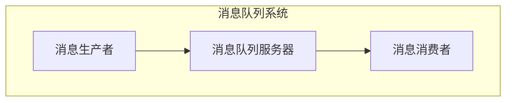
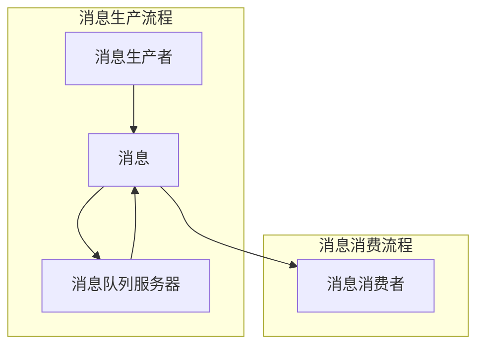
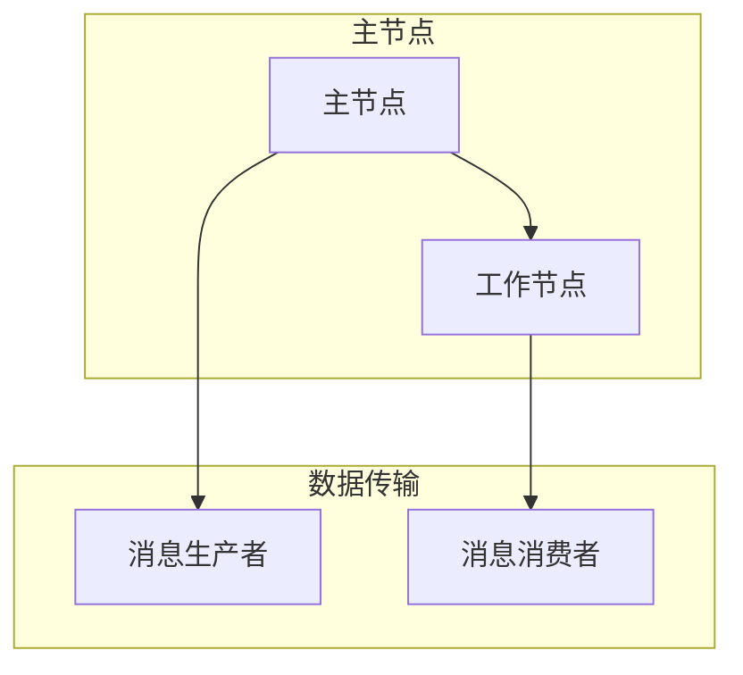

                 

### 第1章：消息队列概述

> 在现代软件架构中，解耦和灵活性是关键。消息队列作为一种强大的解耦工具，极大地提升了系统组件的协作效率。本章将介绍消息队列的基本概念、重要性以及其常见类型，为读者提供一个全面的理解。

#### 1.1 消息队列的基本概念

**消息队列**，顾名思义，是一个用于存储和转发消息的数据结构。它可以看作是一个缓冲区，用于在系统组件之间传递信息。消息通常包含数据内容和元数据，如消息ID、发送时间、发送者和接收者等。

**消息队列的主要功能**包括：

- **异步通信**：允许系统组件在不同的时间执行任务，而无需等待对方完成。
- **解耦**：通过将组件之间的直接依赖关系转换为基于消息的间接通信，从而提高系统的可维护性和灵活性。
- **负载均衡**：可以平衡系统中不同组件的处理能力，确保高效利用资源。

#### 1.1.1 消息队列的定义

消息队列可以定义为一个先进先出（FIFO）的数据结构，它允许生产者将消息放入队列中，而消费者从队列中取出消息进行处理。这一过程通常在分布式系统中进行，使得消息的传递跨越不同的主机和进程。

#### 1.1.2 消息队列的重要性

在分布式系统中，消息队列的重要性体现在以下几个方面：

- **降低耦合度**：通过异步通信，减少系统组件之间的直接依赖，使得每个组件可以独立开发和部署。
- **增强可伸缩性**：消息队列可以轻松扩展，以处理更大的数据量和更高的流量。
- **提高可用性**：消息队列可以确保消息不会被丢失，即使系统出现故障，消息也会被重新处理。

#### 1.1.3 消息队列的常见类型

根据不同的需求和场景，消息队列可以分为以下几种类型：

- **点对点（PPT）消息队列**：一条消息只发送给一个特定的消费者。
- **发布/订阅（Pub/Sub）消息队列**：一条消息可以发送给多个订阅者。
- **优先级消息队列**：消息根据优先级进行排序，优先级高的消息先被处理。
- **事务消息队列**：保证消息的原子性和一致性，适用于分布式事务。

#### 1.2 消息队列的发展历史

**传统消息队列**：最早的消息队列实现可以追溯到1970年代，当时的消息队列主要用于电子邮件系统。随着计算机技术的发展，消息队列开始应用于更复杂的分布式系统中。

**消息队列中间件**：随着互联网的兴起，消息队列逐渐成为一种重要的分布式通信手段。20世纪90年代，各种消息队列中间件如JMS（Java Message Service）和AMQP（Advanced Message Queuing Protocol）应运而生。

**消息队列在分布式系统中的应用**：近年来，随着微服务架构的流行，消息队列在分布式系统中发挥着越来越重要的作用。它不仅用于解耦，还用于负载均衡、分布式事务和实时数据处理等方面。

### 第2章：消息队列核心原理

> 在了解了消息队列的基本概念和重要性之后，本章将深入探讨消息队列的核心原理，包括其工作机制、关键技术以及架构设计。通过这一部分，读者将获得对消息队列的全面理解。

#### 2.1 消息队列的工作机制

消息队列的工作机制可以分为以下几个步骤：

1. **消息生产**：生产者生成消息，并将其放入消息队列中。
2. **消息传输**：消息队列将消息从生产者传输到消费者。
3. **消息消费**：消费者从消息队列中取出消息，并对其进行处理。

在这个过程中，消息的传输和存储至关重要。

- **传输**：消息通常通过网络传输，需要保证传输的可靠性、速度和安全性。
- **存储**：消息队列需要一种高效可靠的存储方案，以避免消息丢失或重复处理。

#### 2.1.1 消息的生产与消费

**消息生产**：

- 生产者可以是任何系统组件，如Web服务、数据库或定时任务等。
- 生产者生成消息后，将其发送到消息队列。

**消息消费**：

- 消费者从消息队列中取出消息，并对其进行处理。
- 消费者可以是任何系统组件，如工作线程、批处理任务或外部服务。

#### 2.1.2 消息的传输与存储

**消息传输**：

- 消息传输通常使用网络协议，如HTTP、TCP或AMQP。
- 需要保证消息传输的可靠性，如使用确认机制和重传机制。

**消息存储**：

- 消息队列通常使用数据库或缓存来存储消息。
- 需要支持消息的持久化和快速检索。

#### 2.1.3 消息队列的可靠性保障

为了确保消息队列的可靠性，需要采取以下措施：

- **消息确认**：消费者处理完消息后，向生产者发送确认信号，以确保消息已被成功处理。
- **消息持久化**：将消息存储在数据库或缓存中，以防止消息丢失。
- **故障转移**：在系统出现故障时，能够自动切换到备用系统，确保消息队列的正常运行。

#### 2.2 消息队列的关键技术

**消息的路由**：

- 消息队列需要支持消息的路由功能，将消息发送到正确的消费者。
- 路由策略包括按关键字路由、按优先级路由和按主题路由等。

**消息的持久化**：

- 消息队列需要将消息持久化到数据库或缓存中，以确保消息不会丢失。
- 持久化策略包括事务持久化、异步持久化和实时持久化等。

**消息的确认与回执**：

- 消费者在处理消息后，需要向生产者发送确认信号，以确保消息已被成功处理。
- 回执机制包括手动确认、自动确认和部分确认等。

#### 2.3 消息队列的架构设计

**点对点模型**：

- 消息一对一发送，适用于单条消息需要精确到达的场景。

**发布/订阅模型**：

- 消息广播给多个订阅者，适用于广播消息的场景。

**消息队列集群**：

- 消息队列需要支持集群，以确保高可用性和负载均衡。

### 第3章：常见消息队列技术详解

> 消息队列技术在不断发展和演进，市场上涌现出了众多优秀的消息队列中间件。本章将详细介绍三种常见的消息队列技术：ActiveMQ、RabbitMQ和RocketMQ。通过对比分析，读者可以更好地选择适合自己项目的消息队列中间件。

#### 3.1 ActiveMQ

**ActiveMQ** 是一个开源的消息队列中间件，基于JMS（Java Message Service）规范实现。它支持多种消息传输协议，如AMQP、MQTT和HTTP等，适用于Java和.NET等语言。

**3.1.1 ActiveMQ 简介**

- **支持多种消息协议**：ActiveMQ支持多种消息传输协议，如AMQP、MQTT和HTTP等，可以方便地与各种客户端和系统进行集成。
- **灵活的路由策略**：ActiveMQ支持多种路由策略，如按主题路由、按关键字路由和按优先级路由等，可以根据具体需求进行定制。
- **高可用性和负载均衡**：ActiveMQ支持集群和高可用性，可以在系统出现故障时自动切换到备用节点，确保消息队列的正常运行。

**3.1.2 ActiveMQ 安装与配置**

- **安装**：ActiveMQ提供了多种安装方式，如Docker、Apache Maven和源代码编译等。本文以Docker为例进行安装。

  ```shell
  docker pull activemq
  docker run -d -p 61616:61616 -p 8161:8161 -v /path/to/data:/data activemq
  ```

- **配置**：ActiveMQ的配置文件位于`/data/conf`目录下，主要配置文件为`activemq.xml`。

  ```xml
  <broker>
    <transportConnectors>
      <transportConnector name="openwire" protocol="openwire" />
      <transportConnector name="amqp" protocol="amqp" />
      <transportConnector name="mqtt" protocol="mqtt" />
    </transportConnectors>
    ...
  </broker>
  ```

**3.1.3 ActiveMQ 的使用方法**

- **生产者**：使用Java客户端库生成消息并发送到ActiveMQ。

  ```java
  MessageProducer producer = connection.createProducer();
  TextMessage message = session.createTextMessage("Hello ActiveMQ");
  producer.send(queue, message);
  ```

- **消费者**：使用Java客户端库从ActiveMQ中接收消息并进行处理。

  ```java
  MessageConsumer consumer = connection.createConsumer(queue);
  while (true) {
    Message message = consumer.receive();
    if (message instanceof TextMessage) {
      TextMessage textMessage = (TextMessage) message;
      System.out.println("Received message: " + textMessage.getText());
    }
  }
  ```

#### 3.2 RabbitMQ

**RabbitMQ** 是一个开源的消息队列中间件，基于AMQP（Advanced Message Queuing Protocol）协议实现。它支持多种编程语言，如Python、Java和Go等。

**3.2.1 RabbitMQ 简介**

- **高性能和高可靠性**：RabbitMQ具有高性能和高可靠性的特点，可以处理大量的消息，并在系统出现故障时自动恢复。
- **灵活的路由策略**：RabbitMQ支持多种路由策略，如按关键字路由、按优先级路由和按主题路由等，可以根据具体需求进行定制。
- **插件生态系统**：RabbitMQ具有丰富的插件生态系统，可以扩展其功能，如消息持久化、消息监控和消息过滤等。

**3.2.2 RabbitMQ 安装与配置**

- **安装**：RabbitMQ提供了多种安装方式，如Docker、源代码编译和RPM包等。本文以Docker为例进行安装。

  ```shell
  docker pull rabbitmq:3.8-management
  docker run -d -p 5672:5672 -p 61613:61613 -p 15672:15672 rabbitmq:3.8-management
  ```

- **配置**：RabbitMQ的配置文件位于`/etc/rabbitmq`目录下，主要配置文件为`rabbitmq.conf`。

  ```erlang-terms
  {rabbitmq_management, [
    {default_user, "guest"},
    {default_pass, "guest"},
    {port, 15672}
  ]}.
  ```

**3.2.3 RabbitMQ 的使用方法**

- **生产者**：使用Python客户端库生成消息并发送到RabbitMQ。

  ```python
  import pika

  connection = pika.BlockingConnection(pika.ConnectionParameters('localhost'))
  channel = connection.channel()
  channel.queue_declare(queue='hello')
  channel.basic_publish(exchange='', routing_key='hello', body='Hello World!')
  connection.close()
  ```

- **消费者**：使用Python客户端库从RabbitMQ中接收消息并进行处理。

  ```python
  import pika

  def callback(ch, method, properties, body):
    print(f"Received message {body}")

  connection = pika.BlockingConnection(pika.ConnectionParameters('localhost'))
  channel = connection.channel()
  channel.queue_declare(queue='hello')
  channel.basic_consume(queue='hello', on_message_callback=callback, auto_ack=True)
  print('Waiting for messages. To exit press CTRL+C')
  channel.start_consuming()
  ```

#### 3.3 RocketMQ

**RocketMQ** 是由阿里巴巴开源的一个分布式消息队列中间件，具有高性能和高可靠性。它支持多种消息传输协议，如HTTP、TCP和Websocket等。

**3.3.1 RocketMQ 简介**

- **高性能和高吞吐量**：RocketMQ具有高性能和高吞吐量的特点，可以处理大规模的并发消息，并支持多种消息传输协议。
- **高可用性和负载均衡**：RocketMQ支持高可用性和负载均衡，可以在系统出现故障时自动切换到备用节点，并确保消息队列的正常运行。
- **分布式事务**：RocketMQ支持分布式事务消息，可以保证消息的原子性和一致性。

**3.3.2 RocketMQ 安装与配置**

- **安装**：RocketMQ提供了多种安装方式，如Docker、源代码编译和RPM包等。本文以Docker为例进行安装。

  ```shell
  docker pull rocketmqinc/rocketmq
  docker run -d -p 9876:9876 -p 10908:10908 -p 10911:10911 rocketmqinc/rocketmq
  ```

- **配置**：RocketMQ的配置文件位于`/root/rocketmq-4.4.0/conf`目录下，主要配置文件为`broker.conf`。

  ```properties
  # Name Server address
  namesrvAddr=127.0.0.1:9876
  # Broker ID
  brokerId=0
  # Broker name
  brokerName=broker-a
  # Log directory
  storePathRootDir=/root/rocketmq-4.4.0/store
  storePathCommitLog=/root/rocketmq-4.4.0/store/commitlog
  storePathConsumerQueue=/root/rocketmq-4.4.0/store/consumerqueue
  ```

**3.3.3 RocketMQ 的使用方法**

- **生产者**：使用Java客户端库生成消息并发送到RocketMQ。

  ```java
  import org.apache.rocketmq.client.producer.DefaultMQProducer;
  import org.apache.rocketmq.client.producer.SendResult;
  import org.apache.rocketmq.common.message.Message;

  DefaultMQProducer producer = new DefaultMQProducer("example-producer");
  producer.setNamesrvAddr("localhost:9876");
  producer.start();
  for (int i = 0; i < 10; i++) {
    Message msg = new Message("TopicTest", "TagA", "Key" + i,
        ("Hello world " + i).getBytes());
    SendResult sendResult = producer.send(msg);
    System.out.println(sendResult);
  }
  producer.shutdown();
  ```

- **消费者**：使用Java客户端库从RocketMQ中接收消息并进行处理。

  ```java
  import org.apache.rocketmq.client.consumer.DefaultMQPushConsumer;
  import org.apache.rocketmq.client.consumer.listener.ConsumeConcurrentlyContext;
  import org.apache.rocketmq.client.consumer.listener.ConsumeConcurrentlyStatus;
  import org.apache.rocketmq.client.consumer.listener.MessageListenerConcurrently;
  import org.apache.rocketmq.common.message.MessageExt;

  DefaultMQPushConsumer consumer = new DefaultMQPushConsumer("example-consumer");
  consumer.setNamesrvAddr("localhost:9876");
  consumer.subscribe("TopicTest", "TagA");
  consumer.registerMessageListener(new MessageListenerConcurrently() {
    @Override
    public ConsumeConcurrentlyStatus consumeMessage(List<MessageExt> list,
        ConsumeConcurrentlyContext consumeConcurrentlyContext) {
      System.out.printf("Receive message: %s %n", list);
      return ConsumeConcurrentlyStatus.CONSUME_SUCCESS;
    }
  });
  consumer.start();
  ```

### 第4章：消息队列在实际应用中的案例解析

> 消息队列在现代软件架构中扮演着重要的角色，被广泛应用于各种实际应用场景中。本章将详细解析消息队列在微服务架构、分布式事务和实时数据处理等方面的应用案例，通过实际案例展示消息队列的强大功能。

#### 4.1 微服务架构中的消息队列应用

**微服务架构**是一种将大型单体应用程序拆分为一组小而独立的服务的架构风格。消息队列在微服务架构中发挥着至关重要的作用，用于实现服务之间的通信和解耦。

**4.1.1 微服务架构简介**

微服务架构的特点包括：

- **独立性**：每个微服务都是独立的，可以独立部署、升级和扩展。
- **松耦合**：服务之间通过轻量级的通信协议进行交互，如HTTP/REST、消息队列等。
- **自治性**：每个微服务都有自己的数据库和业务逻辑，可以独立运行和管理。

**4.1.2 消息队列在微服务架构中的应用场景**

在微服务架构中，消息队列的主要应用场景包括：

- **服务解耦**：通过消息队列实现服务之间的异步通信，降低服务之间的耦合度，提高系统的可维护性和扩展性。
- **异步处理**：处理耗时较长的任务，如邮件发送、订单处理等，避免阻塞前端接口，提高系统的响应速度。
- **事件驱动**：实现事件驱动架构，服务之间通过发布/订阅模式进行通信，提高系统的灵活性和可扩展性。

**4.1.3 微服务架构中消息队列的实践**

以下是一个简单的微服务架构中消息队列的应用案例：

1. **用户注册**：当用户注册时，用户服务会生成一条注册消息，并使用消息队列将其发送给订单服务和邮件服务。
2. **订单处理**：订单服务从消息队列中接收注册消息，并创建订单，同时将订单信息存储在数据库中。
3. **邮件发送**：邮件服务从消息队列中接收注册消息，并发送一封欢迎邮件给用户。

通过消息队列，用户服务、订单服务和邮件服务之间实现了异步通信和解耦，提高了系统的性能和可靠性。

#### 4.2 分布式事务与消息队列

在分布式系统中，事务的原子性和一致性是保证数据一致性的关键。消息队列在分布式事务中发挥着重要作用，用于实现分布式事务的最终一致性。

**4.2.1 分布式事务的概念**

分布式事务是指在分布式系统中，多个操作需要作为一个整体进行执行，确保要么全部成功，要么全部失败。分布式事务通常面临以下挑战：

- **数据一致性**：在分布式系统中，如何保证多个操作的数据一致性。
- **隔离性**：在分布式系统中，如何保证操作的隔离性，避免并发冲突。
- **容错性**：在分布式系统中，如何保证事务的容错性，即使在网络故障或系统故障的情况下也能正确处理事务。

**4.2.2 消息队列在分布式事务中的应用**

消息队列在分布式事务中的应用主要包括以下两个方面：

1. **最终一致性**：通过消息队列实现分布式事务的最终一致性，即在事务的所有操作执行完成后，通过消息队列将结果传递给其他服务，确保所有服务的数据一致。
2. **补偿事务**：在分布式系统中，如果某个操作失败，可以通过消息队列触发补偿事务，以恢复数据的一致性。

**4.2.3 分布式事务的实现方法**

以下是一个简单的分布式事务实现方法：

1. **两阶段提交**：在分布式事务中，通过两阶段提交协议确保事务的原子性和一致性。第一阶段，发起事务的服务向其他服务发送预提交请求；第二阶段，所有服务返回预提交响应，事务管理器根据响应决定是否提交事务。
2. **消息队列**：在分布式事务中，使用消息队列记录事务的执行过程，确保事务的执行顺序和一致性。当所有操作执行完成后，通过消息队列将结果传递给其他服务。

通过消息队列和两阶段提交协议，分布式事务可以实现原子性和一致性，确保数据的一致性。

#### 4.3 实时数据处理与消息队列

实时数据处理是现代应用中的一种重要需求，用于处理和分析大量的实时数据。消息队列在实时数据处理中发挥着重要作用，用于实现数据的实时传输和处理。

**4.3.1 实时数据处理的概念**

实时数据处理是指对大量实时数据进行快速处理和分析，以提供及时的业务洞察和决策支持。实时数据处理的主要特点包括：

- **实时性**：处理和分析数据的时间延迟很短，通常在毫秒级。
- **海量数据**：处理的数据量非常大，需要高效的算法和分布式计算。
- **多样性**：数据类型多样，包括结构化数据、半结构化数据和非结构化数据。

**4.3.2 消息队列在实时数据处理中的应用**

在实时数据处理中，消息队列主要用于以下几个方面：

1. **数据传输**：消息队列用于传输实时数据，确保数据的高效传输和可靠处理。
2. **数据分发**：消息队列用于将实时数据分发到不同的处理节点，实现分布式处理。
3. **数据同步**：消息队列用于同步实时数据，确保数据的实时性和一致性。

**4.3.3 实时数据处理系统的实践**

以下是一个简单的实时数据处理系统实现方法：

1. **数据采集**：采集实时数据，并将其发送到消息队列。
2. **数据处理**：从消息队列中读取实时数据，并进行处理和分析。
3. **数据存储**：将处理后的数据存储到数据库或数据仓库中，以供后续查询和分析。

通过消息队列和实时数据处理系统，可以实现实时数据的快速处理和分析，为业务提供及时的数据支持。

### 第5章：消息队列的性能优化

> 消息队列的性能对系统的整体性能至关重要。本章将介绍消息队列的性能优化方法，包括系统调优、数据库优化和网络优化，以提高消息队列的性能和稳定性。

#### 5.1 消息队列的性能指标

**消息队列的性能指标**主要包括以下几个方面：

- **吞吐量**：单位时间内能够处理的消息数量，是衡量消息队列性能的重要指标。
- **延迟**：从消息生产到消息消费的时间，包括传输延迟和处理延迟。
- **可靠性**：消息队列能够保证消息的准确传递，避免消息丢失和重复处理。
- **可用性**：消息队列在系统故障或网络异常情况下，能够保持正常运行。

#### 5.1.1 消息队列的性能指标概述

消息队列的性能指标需要综合考虑以下几个方面：

- **硬件资源**：包括CPU、内存、磁盘和网络等硬件资源。
- **软件架构**：包括消息队列的架构设计、消息传输协议和数据存储方案等。
- **系统配置**：包括消息队列的参数配置、网络配置和负载均衡策略等。

#### 5.1.2 消息队列的性能瓶颈分析

消息队列的性能瓶颈可能出现在以下几个方面：

- **网络延迟**：消息在传输过程中，可能因为网络延迟导致整体性能下降。
- **磁盘I/O**：消息队列的数据存储在磁盘上，磁盘I/O性能可能成为瓶颈。
- **CPU使用率**：消息队列的处理过程中，可能因为CPU使用率过高导致性能下降。
- **内存占用**：消息队列的内存占用过高，可能因为内存泄漏或内存不足导致性能下降。

#### 5.2 消息队列的优化策略

为了提高消息队列的性能，可以采取以下优化策略：

- **系统调优**：调整操作系统参数和消息队列配置，优化系统性能。
- **数据库优化**：优化消息队列的数据库存储，提高数据读写速度。
- **网络优化**：优化网络传输，减少网络延迟和带宽占用。

#### 5.2.1 系统调优

**CPU调优**：

- **线程池配置**：根据系统负载和资源限制，合理设置线程池大小，避免过多线程导致CPU过载。
- **并发处理**：通过并发处理机制，提高消息处理速度。

**内存调优**：

- **垃圾回收**：合理配置垃圾回收策略，减少内存占用和垃圾回收时间。
- **缓存机制**：使用缓存机制，减少重复数据读取，提高数据访问速度。

**磁盘I/O调优**：

- **SSD使用**：使用固态硬盘（SSD）代替机械硬盘（HDD），提高数据读写速度。
- **文件系统**：选择合适的文件系统，如ext4或XFS，提高文件系统性能。

#### 5.2.2 数据库优化

**数据库优化**主要包括以下几个方面：

- **索引优化**：合理设置索引，提高数据查询速度。
- **查询优化**：优化数据库查询语句，减少查询时间和数据量。
- **分区优化**：对大量数据进行分区，提高数据访问速度。

**消息持久化**：

- **异步持久化**：将消息持久化操作与消息处理分离，提高系统性能。
- **批量持久化**：将多个消息的持久化操作合并成批处理，减少I/O操作次数。

#### 5.2.3 网络优化

**网络优化**主要包括以下几个方面：

- **带宽优化**：合理配置网络带宽，避免带宽成为瓶颈。
- **延迟优化**：优化网络延迟，提高消息传输速度。
- **可靠性优化**：使用可靠的网络传输协议，如TCP，确保消息传输的可靠性。

- **流量控制**：根据系统负载和资源限制，合理控制消息流量，避免系统过载。

#### 5.3 消息队列的高可用设计

**高可用性**是消息队列设计中的重要目标，旨在确保消息队列在系统故障或网络异常情况下，能够保持正常运行，避免消息丢失或数据不一致。

**5.3.1 高可用性的概念**

高可用性（High Availability，简称HA）是指系统在正常工作和发生故障时，能够快速恢复并继续运行的能力。高可用性的目标是确保系统的高可靠性、持续性和可用性。

**5.3.2 消息队列的高可用设计原则**

为了实现消息队列的高可用性，可以采取以下设计原则：

- **冗余设计**：通过冗余设计，确保消息队列的各个组件在故障时能够快速切换到备用组件，确保系统正常运行。
- **负载均衡**：通过负载均衡，将消息队列的负载分配到多个节点，避免单个节点过载，提高系统的整体性能。
- **故障转移**：在系统故障时，能够自动切换到备用系统，确保消息队列的正常运行。
- **数据备份**：对消息队列的数据进行备份，避免数据丢失，确保数据的一致性。

**5.3.3 消息队列的高可用实现**

实现消息队列的高可用性主要包括以下几个方面：

- **主从复制**：通过主从复制，确保消息队列的数据在多个节点之间同步，实现数据的高可用性。
- **集群部署**：通过集群部署，实现消息队列的负载均衡和故障转移，提高系统的可用性。
- **自动故障恢复**：在系统故障时，自动切换到备用系统，确保消息队列的正常运行。

通过高可用设计，消息队列能够在系统故障或网络异常情况下，保持正常运行，确保消息的准确传递和数据的一致性。

### 第6章：消息队列的常见问题与解决方案

> 消息队列在实际应用中虽然带来了诸多便利，但也伴随着一系列的问题。本章将探讨消息队列的常见问题，如消息丢失、消息重复和消息积压，并提供相应的解决方案。

#### 6.1 消息队列常见问题分析

**消息丢失**：

消息丢失是消息队列中最为严重的问题之一，可能导致数据不一致和业务流程中断。消息丢失的主要原因包括：

- **网络问题**：在网络不稳定或中断的情况下，消息可能无法正确传输到目标节点。
- **系统故障**：在消息队列系统出现故障时，可能导致消息处理中断，进而导致消息丢失。
- **存储故障**：消息队列的存储系统出现故障，可能导致消息数据丢失。

**消息重复**：

消息重复是指在消息队列中，同一条消息被多次处理。消息重复的主要原因包括：

- **消费者故障**：在消费者处理消息时出现故障，可能导致消息未正确处理，从而重复消费。
- **消息确认机制失效**：消息确认机制失效，导致消息无法正确标记为已处理。
- **并发消费**：在多个消费者同时消费同一条消息时，可能导致消息重复处理。

**消息积压**：

消息积压是指消息队列中积压了大量未处理的消息，可能导致系统性能下降和业务流程延迟。消息积压的主要原因包括：

- **处理能力不足**：消息队列的处理能力不足以跟上消息的产生速度。
- **系统瓶颈**：在消息传输、存储和处理过程中出现瓶颈，导致消息积压。
- **网络延迟**：在网络不稳定或延迟较高的情况下，消息传输速度变慢，导致消息积压。

#### 6.2 消息队列解决方案探讨

**解决消息丢失问题**：

- **备份与冗余**：对消息队列进行备份和冗余设计，确保消息在发生故障时能够恢复。
- **网络优化**：优化网络传输，提高消息传输的可靠性，减少消息丢失的可能性。
- **消息确认机制**：引入消息确认机制，确保消息被正确处理并标记为已处理。

**解决消息重复问题**：

- **去重机制**：在消息队列中引入去重机制，防止同一条消息被重复处理。
- **幂等性设计**：在消息处理过程中，确保操作的幂等性，避免重复执行导致重复处理。
- **消息确认机制**：完善消息确认机制，确保消息被正确处理并确认。

**解决消息积压问题**：

- **扩展处理能力**：增加消息队列的处理能力，提高系统的整体性能，减少消息积压。
- **异步处理**：采用异步处理机制，将消息处理与消息生成解耦，提高系统的并发处理能力。
- **流量控制**：在消息队列中引入流量控制机制，根据系统负载和资源限制，合理控制消息流量。

#### 6.2.1 异步处理

异步处理是将消息的生产和消费过程解耦的一种有效方法。通过异步处理，可以提高系统的并发处理能力，减少消息积压。

**异步处理的原理**：

- **消息生产者**：生产者生成消息后，将消息放入消息队列，无需等待消费者处理。
- **消息消费者**：消费者从消息队列中取出消息，进行处理。

**异步处理的优点**：

- **提高并发处理能力**：通过异步处理，消费者可以并行处理多个消息，提高系统的处理能力。
- **降低系统延迟**：减少消息积压，提高系统的响应速度。
- **增强系统稳定性**：通过异步处理，避免因单个消息处理时间过长导致系统阻塞。

**异步处理的实现**：

- **消息队列**：使用消息队列实现异步处理，将消息的生产和消费分离。
- **线程池**：使用线程池管理消费者线程，提高并发处理能力。

#### 6.2.2 批量处理

批量处理是将多个消息作为一个批次进行处理的策略，可以减少消息处理的次数，提高系统性能。

**批量处理的原理**：

- **消息收集**：将多个消息收集到一个批次中。
- **批次处理**：对批次中的消息进行统一处理。

**批量处理的优点**：

- **减少消息处理次数**：批量处理可以减少消息处理的次数，降低系统的开销。
- **提高处理效率**：批量处理可以减少消息处理的间隔时间，提高系统的整体处理效率。

**批量处理的实现**：

- **批量消息生产**：将多个消息放入一个消息批次中，减少消息的生产次数。
- **批量消息消费**：使用批量消息消费接口，对批次中的消息进行统一处理。

#### 6.2.3 流量控制

流量控制是消息队列中重要的机制，用于控制消息的流量，避免系统过载。

**流量控制的原理**：

- **限流**：根据系统的处理能力和资源限制，限制消息的流量。
- **缓冲**：在消息队列中设置缓冲区，暂时存储未处理的消息。

**流量控制的优点**：

- **提高系统稳定性**：通过流量控制，避免系统过载，提高系统的稳定性。
- **保障消息处理顺序**：通过缓冲区，确保消息的处理顺序，避免消息丢失或重复处理。

**流量控制的实现**：

- **限流器**：使用限流器控制消息的流量，避免系统过载。
- **缓冲队列**：在消息队列中设置缓冲队列，暂时存储未处理的消息。

通过解决消息队列的常见问题，并采取相应的优化策略，可以确保消息队列在分布式系统中稳定运行，提高系统的性能和可靠性。

### 第7章：消息队列的未来发展趋势

> 随着技术的不断演进，消息队列技术也在不断发展。本章将探讨消息队列的未来发展趋势，包括云原生消息队列、消息队列与大数据技术的融合以及消息队列在物联网中的应用，为读者提供对未来消息队列技术发展的展望。

#### 7.1 消息队列技术发展趋势

**7.1.1 云原生消息队列**

云原生（Cloud Native）是一种设计架构，旨在使应用程序能够在云计算环境中灵活、可扩展地运行。云原生消息队列技术是消息队列领域的一个重要发展方向。

**云原生消息队列的优势**：

- **可伸缩性**：云原生消息队列可以轻松地在云环境中进行水平扩展，以处理不断增长的消息量。
- **可靠性**：云原生消息队列利用云计算资源的高可用性，确保系统的稳定运行。
- **弹性伸缩**：根据负载自动调整资源使用，以应对突发流量。

**云原生消息队列的实现**：

- **容器化**：将消息队列中间件容器化，以实现灵活部署和动态扩容。
- **服务网格**：利用服务网格（Service Mesh）技术，实现消息队列的微服务化和智能化。

**7.1.2 消息队列与大数据技术的融合**

大数据技术的发展，使得数据处理和分析的需求日益增长。消息队列在大数据领域中的应用越来越广泛，两者之间的融合趋势愈发明显。

**消息队列与大数据技术的融合**：

- **实时数据处理**：消息队列可以与大数据技术结合，实现实时数据处理和分析。
- **数据流处理**：消息队列可以支持数据流处理，以实现实时数据的采集、传输和处理。
- **分布式存储**：消息队列与分布式存储技术结合，提高数据的存储和查询效率。

**7.1.3 消息队列在物联网中的应用**

物联网（IoT）技术的发展，使得大量设备产生海量数据。消息队列在物联网中的应用，可以有效地实现设备数据的管理和传输。

**消息队列在物联网中的应用**：

- **设备数据采集**：消息队列可以收集来自不同设备的实时数据，并进行分类和过滤。
- **边缘计算**：消息队列与边缘计算结合，实现设备数据的本地处理和快速响应。
- **数据同步**：消息队列可以同步设备数据到云端，实现集中管理和分析。

#### 7.2 消息队列在企业应用中的发展

**7.2.1 企业级消息队列需求的演变**

随着企业业务规模的扩大和复杂性的增加，企业对消息队列的需求也在不断演变。企业级消息队列需要满足以下需求：

- **高可用性**：确保消息队列在故障情况下能够快速恢复，避免数据丢失。
- **高性能**：处理大量并发消息，满足企业业务的高性能需求。
- **可扩展性**：支持横向和纵向扩展，以适应业务规模的变化。
- **安全性**：保障消息传输和存储的安全性，防止数据泄露。

**7.2.2 企业选择消息队列的考量**

企业在选择消息队列时，需要考虑以下几个方面：

- **技术成熟度**：选择成熟稳定的技术，降低系统故障风险。
- **社区支持**：考虑消息队列的社区活跃度，以便获取技术支持和资源。
- **兼容性和可扩展性**：选择兼容性好的消息队列，以便与现有系统和未来需求相匹配。
- **成本效益**：考虑消息队列的投入产出比，确保成本效益最大化。

**7.2.3 消息队列在企业数字化转型中的作用**

消息队列在企业数字化转型中发挥着重要作用：

- **业务解耦**：通过消息队列实现业务模块的解耦，提高系统的灵活性和可维护性。
- **数据处理**：支持实时数据处理和分析，为企业提供实时业务洞察。
- **服务集成**：通过消息队列实现不同系统和服务的集成，提高整体业务流程的效率。

通过消息队列技术的不断发展和创新，企业可以更好地应对数字化时代的挑战，实现业务的快速发展和数字化转型。

### 第8章：实战项目：搭建一个简单的消息队列系统

> 理论知识固然重要，但实际操作才是检验真理的唯一标准。本章将通过一个简单的实战项目，带领读者一步步搭建一个消息队列系统。从环境搭建到实际应用，再到源代码解读，我们将深入实践，掌握消息队列的实战技巧。

#### 8.1 项目背景

**项目简介**：本项目的目标是搭建一个简单的消息队列系统，实现消息的生产和消费功能。通过这个项目，读者可以熟悉消息队列的基本架构和实现方法，为后续复杂项目的开发打下基础。

**项目目标**：本项目的主要目标包括：

- 搭建消息队列环境，包括消息队列服务器和客户端。
- 实现消息的生产和消费功能，确保消息的准确传递和可靠处理。
- 熟悉消息队列的配置和优化方法，提高系统的性能和可靠性。

#### 8.2 环境搭建

**8.2.1 环境准备**

在开始搭建消息队列系统之前，我们需要准备以下环境：

- 操作系统：Linux或Windows。
- Java开发工具包（JDK）：版本要求至少为Java 8。
- 消息队列中间件：如ActiveMQ、RabbitMQ或RocketMQ等。

**8.2.2 消息队列系统安装与配置**

以RabbitMQ为例，介绍如何安装和配置消息队列系统：

1. **安装RabbitMQ**：

   使用Docker安装RabbitMQ：

   ```shell
   docker pull rabbitmq:3.8-management
   docker run -d -p 5672:5672 -p 61613:61613 -p 15672:15672 rabbitmq:3.8-management
   ```

   安装完成后，通过浏览器访问`http://localhost:15672`，可以看到RabbitMQ的管理界面。

2. **配置RabbitMQ**：

   在RabbitMQ的管理界面中，可以创建虚拟主机、用户、队列和交换器等。以下是一个简单的配置示例：

   - **创建虚拟主机**：`/my_vhost`，用户权限设置为`guest`。
   - **创建队列**：`my_queue`，用于存储消息。
   - **创建交换器**：`my_exchange`，类型为`direct`。

3. **安装RabbitMQ客户端**：

   使用Docker安装RabbitMQ的Java客户端：

   ```shell
   docker run -it --rm -v $(pwd):/usr/src/app -w /usr/src/app rabbitmq/java-client
   ```

   编写RabbitMQ的Java客户端代码，用于生产消息和消费消息。

#### 8.3 应用场景

**用户注册消息通知**：

本应用场景演示如何通过消息队列实现用户注册消息通知功能。具体步骤如下：

1. **消息生产**：当用户注册成功时，用户服务生成一条注册消息，并将其发送到消息队列。

   ```java
   ConnectionFactory factory = new ConnectionFactory();
   factory.setHost("localhost");
   Connection connection = factory.newConnection();
   Channel channel = connection.createChannel();
   String queueName = "user_registered_queue";
   channel.queueDeclare(queueName, true, false, false, null);
   String message = "User registered: " + userId;
   channel.basicPublish("", queueName, MessageProperties.PERSISTENT_TEXT_MSG, message.getBytes());
   channel.close();
   connection.close();
   ```

2. **消息消费**：邮件服务从消息队列中接收注册消息，并发送一封欢迎邮件给用户。

   ```java
   ConnectionFactory factory = new ConnectionFactory();
   factory.setHost("localhost");
   Connection connection = factory.newConnection();
   Channel channel = connection.createChannel();
   String queueName = "user_registered_queue";
   channel.queueDeclare(queueName, true, false, false, null);
   channel.basicConsume(queueName, true, new DefaultConsumer(channel) {
       @Override
       public void handleDelivery(String consumerTag, Envelope envelope, AMQP.BasicProperties properties, byte[] body) throws IOException {
           String message = new String(body, "UTF-8");
           System.out.println("Received message: " + message);
           sendWelcomeEmail(message);
       }
   });
   connection.close();
   ```

#### 8.4 源代码解读

**8.4.1 生产者实现**

生产者负责将消息发送到消息队列。以下是一个简单的生产者实现示例：

```java
public class MessageProducer {
    public static void main(String[] args) {
        try {
            ConnectionFactory factory = new ConnectionFactory();
            factory.setHost("localhost");
            Connection connection = factory.newConnection();
            Channel channel = connection.createChannel();
            String queueName = "test_queue";
            channel.queueDeclare(queueName, true, false, false, null);
            String message = "Hello Message Queue";
            channel.basicPublish("", queueName, MessageProperties.PERSISTENT_TEXT_MSG, message.getBytes());
            channel.close();
            connection.close();
            System.out.println("Message sent: " + message);
        } catch (IOException | TimeoutException e) {
            e.printStackTrace();
        }
    }
}
```

**8.4.2 消费者实现**

消费者负责从消息队列中接收消息并进行处理。以下是一个简单的消费者实现示例：

```java
public class MessageConsumer {
    public static void main(String[] args) {
        try {
            ConnectionFactory factory = new ConnectionFactory();
            factory.setHost("localhost");
            Connection connection = factory.newConnection();
            Channel channel = connection.createChannel();
            String queueName = "test_queue";
            channel.queueDeclare(queueName, true, false, false, null);
            channel.basicConsume(queueName, true, "consumer_tag", new DefaultConsumer(channel) {
                @Override
                public void handleDelivery(String consumerTag, Envelope envelope, AMQP.BasicProperties properties, byte[] body) throws IOException {
                    String message = new String(body, "UTF-8");
                    System.out.println("Received message: " + message);
                    // Process the message
                }
            });
            connection.close();
        } catch (IOException | TimeoutException e) {
            e.printStackTrace();
        }
    }
}
```

**8.4.3 消息处理流程解析**

在消息处理流程中，生产者和消费者通过消息队列进行通信。以下是消息处理流程的简要解析：

1. **生产者发送消息**：生产者将消息发送到消息队列，消息内容包括消息体和消息属性。
2. **消息队列存储消息**：消息队列将消息存储在内存或磁盘上，确保消息的持久性和可靠性。
3. **消费者接收消息**：消费者从消息队列中取出消息，并进行处理。
4. **消息处理**：消费者对消息进行处理，如更新数据库、发送邮件等。
5. **确认消息**：消费者处理完消息后，向生产者发送确认信号，表示消息已被成功处理。

通过这个简单的实战项目，读者可以了解消息队列的基本架构和实现方法，为后续复杂项目的开发打下基础。

### 第9章：拓展阅读

> 消息队列技术作为现代软件架构中不可或缺的一部分，其应用场景和实现方法不断丰富和演变。本章将介绍与消息队列相关的一些扩展技术和领域，包括Apache Kafka、Redis消息队列和RocketMQ的深入分析，以及微服务架构、分布式系统和实时数据处理的相关内容。

#### 9.1 消息队列技术扩展

**9.1.1 Apache Kafka**

**Apache Kafka** 是一个分布式流处理平台，广泛用于大规模数据流处理和实时数据集成。它具有以下特点：

- **高性能和高吞吐量**：Kafka能够处理大规模数据流，并提供毫秒级延迟的实时数据传输。
- **高可用性和容错性**：Kafka支持分布式集群，可以自动故障转移，确保数据的高可用性。
- **可靠性和持久性**：Kafka将数据存储在磁盘上，提供数据持久化和可靠性保证。

**Apache Kafka 的使用场景**：

- **实时数据处理**：用于处理和分析实时数据流，如日志数据、用户行为数据等。
- **消息集成**：用于将不同系统和应用程序的数据集成在一起，实现数据流传递。
- **流处理应用**：用于构建实时流处理应用，如实时数据分析、实时数据监控等。

**9.1.2 Redis 消息队列**

**Redis** 是一个高性能的内存数据库，支持发布/订阅消息模式。作为消息队列的一种实现，Redis消息队列具有以下特点：

- **高性能**：Redis作为内存数据库，具有极高的读写性能。
- **灵活性和扩展性**：Redis支持多种数据结构，如列表、集合和哈希等，可以灵活地实现消息队列功能。
- **持久性和可靠性**：通过将数据存储在磁盘上，Redis消息队列提供数据持久性和可靠性保证。

**Redis 消息队列的使用场景**：

- **实时消息传递**：用于实现实时消息传递，如实时通知、实时聊天等。
- **消息缓存**：用于缓存高频访问的数据，减少数据库的读写压力。
- **分布式缓存**：用于实现分布式缓存，提高系统的性能和可用性。

**9.1.3 RocketMQ 深入分析**

**RocketMQ** 是阿里巴巴开源的一个分布式消息队列中间件，具有高性能和高可靠性。它支持多种消息传输协议，如HTTP、TCP和Websocket等。

**RocketMQ 的核心特性**：

- **高性能和高吞吐量**：RocketMQ可以处理大规模的数据流，提供低延迟和高吞吐量的消息传输。
- **高可用性和容错性**：RocketMQ支持分布式集群，可以自动故障转移，确保消息队列的高可用性。
- **分布式事务**：RocketMQ支持分布式事务消息，可以保证消息的原子性和一致性。

**RocketMQ 的使用场景**：

- **实时数据处理**：用于处理和分析实时数据流，如日志数据、用户行为数据等。
- **消息集成**：用于将不同系统和应用程序的数据集成在一起，实现数据流传递。
- **分布式事务**：用于实现分布式事务，保证数据的一致性和完整性。

#### 9.2 相关领域拓展

**9.2.1 微服务架构**

**微服务架构**是一种将大型单体应用程序拆分为一组小而独立的服务的架构风格。消息队列在微服务架构中发挥着关键作用，用于实现服务之间的通信和解耦。

**微服务架构的特点**：

- **独立性**：每个微服务都是独立的，可以独立部署、升级和扩展。
- **松耦合**：服务之间通过轻量级的通信协议进行交互，如HTTP/REST、消息队列等。
- **自治性**：每个微服务都有自己的数据库和业务逻辑，可以独立运行和管理。

**消息队列在微服务架构中的应用**：

- **服务解耦**：通过消息队列实现服务之间的异步通信，降低服务之间的耦合度，提高系统的可维护性和扩展性。
- **异步处理**：处理耗时较长的任务，如邮件发送、订单处理等，避免阻塞前端接口，提高系统的响应速度。
- **事件驱动**：实现事件驱动架构，服务之间通过发布/订阅模式进行通信，提高系统的灵活性和可扩展性。

**9.2.2 分布式系统**

**分布式系统**是一种由多个独立节点组成的系统，这些节点通过网络进行通信和协作。消息队列在分布式系统中发挥着重要作用，用于实现节点之间的数据传输和状态同步。

**分布式系统的特点**：

- **高可用性**：通过节点冗余和故障转移，确保系统的高可用性。
- **可扩展性**：通过水平扩展，提高系统的处理能力和性能。
- **容错性**：通过故障检测和自动恢复，确保系统的容错性。

**消息队列在分布式系统中的应用**：

- **数据传输**：用于在分布式系统中的节点之间传输数据，如日志数据、配置数据等。
- **状态同步**：用于同步分布式系统的状态，如负载均衡、分布式锁等。
- **分布式事务**：用于实现分布式事务，保证数据的一致性和完整性。

**9.2.3 实时数据处理**

**实时数据处理**是一种对大量实时数据进行快速处理和分析的技术，用于提供及时的业务洞察和决策支持。消息队列在实时数据处理中发挥着关键作用，用于实现数据的实时传输和处理。

**实时数据处理的特点**：

- **实时性**：处理和分析数据的时间延迟很短，通常在毫秒级。
- **海量数据**：处理的数据量非常大，需要高效的算法和分布式计算。
- **多样性**：数据类型多样，包括结构化数据、半结构化数据和非结构化数据。

**消息队列在实时数据处理中的应用**：

- **数据传输**：用于传输实时数据，确保数据的高效传输和可靠处理。
- **数据分发**：用于将实时数据分发到不同的处理节点，实现分布式处理。
- **数据同步**：用于同步实时数据，确保数据的实时性和一致性。

通过拓展阅读，读者可以更深入地了解消息队列技术的应用和实现方法，为实际项目提供更多的灵感和参考。

### 附录：消息队列常用术语解释

#### A.1 消息队列的核心概念

**消息队列**：一种先进先出的数据结构，用于存储和转发消息。消息通常包含数据内容和元数据，如消息ID、发送时间、发送者和接收者等。

**消息生产者**：生成消息并将其放入消息队列的组件。

**消息消费者**：从消息队列中取出消息并进行处理的组件。

**消息中间件**：提供消息队列功能的软件，如ActiveMQ、RabbitMQ和RocketMQ等。

**消息路由**：消息队列中的一种功能，用于将消息发送到正确的消费者。

**消息确认**：消费者处理完消息后，向生产者发送确认信号，表示消息已被成功处理。

**消息持久化**：将消息存储在数据库或缓存中，以确保消息不会被丢失。

**消息队列集群**：由多个节点组成的消息队列系统，用于实现高可用性和负载均衡。

#### A.2 消息队列的关键技术

**异步通信**：通过消息队列实现组件之间的异步通信，减少直接依赖，提高系统的可维护性和灵活性。

**负载均衡**：通过消息队列实现系统资源的均衡分配，提高系统的整体性能。

**分布式事务**：通过消息队列实现分布式事务的原子性和一致性，保证数据的一致性。

**消息确认机制**：确保消息被成功处理的一种机制，包括手动确认、自动确认和部分确认等。

**消息持久化策略**：将消息存储在数据库或缓存中的方法，包括事务持久化、异步持久化和实时持久化等。

**消息路由策略**：根据消息内容和目的地址，将消息发送到正确的消费者。

#### A.3 消息队列的常见问题与解决方案

**消息丢失**：解决方案包括消息确认机制、消息持久化和故障转移等。

**消息重复**：解决方案包括去重机制、幂等性设计和消息确认机制等。

**消息积压**：解决方案包括扩展处理能力、异步处理和流量控制等。

**系统故障**：解决方案包括冗余设计、负载均衡和自动故障恢复等。

通过附录，读者可以更好地理解消息队列的核心概念、关键技术和常见问题，为实际项目提供参考和指导。

### 附录B：消息队列技术资料汇总

#### B.1 消息队列技术资源汇总

**开源消息队列框架**：

- **ActiveMQ**：[https://activemq.apache.org/](https://activemq.apache.org/)
- **RabbitMQ**：[https://www.rabbitmq.com/](https://www.rabbitmq.com/)
- **RocketMQ**：[https://rocketmq.apache.org/](https://rocketmq.apache.org/)
- **Apache Kafka**：[https://kafka.apache.org/](https://kafka.apache.org/)

**消息队列技术博客与社区**：

- **消息队列社区**：[https://cnodejs.org/](https://cnodejs.org/)
- **RabbitMQ中文社区**：[https://www.rabbitmq.com/zh CN/](https://www.rabbitmq.com/zh%20CN/)
- **ActiveMQ中文社区**：[https://activemq.apache.org/zh CN/](https://activemq.apache.org/zh%20CN/)
- **RocketMQ社区**：[https://rocketmq.apache.org/zh CN/](https://rocketmq.apache.org/zh%20CN/)

**消息队列相关书籍推荐**：

- 《消息队列：从入门到实践》：全面介绍消息队列的基本概念、实现方法和应用场景。
- 《RabbitMQ实战》：深入讲解RabbitMQ的架构设计、使用方法和最佳实践。
- 《RocketMQ实战》：详细阐述RocketMQ的核心特性、使用场景和实战经验。

通过附录，读者可以获取丰富的消息队列技术资源和书籍，为学习和实践提供有力支持。

### 附录C：Mermaid 流程图

#### C.1 消息队列架构设计



#### C.2 消息生产与消费流程



#### C.3 分布式消息队列系统设计



通过Mermaid流程图，读者可以直观地理解消息队列的架构设计、消息的生产与消费流程以及分布式消息队列系统的设计。

### 附录D：核心算法原理讲解

#### D.1 伪代码：消息队列中的负载均衡算法

```pseudo
function LoadBalancing算法（节点列表nodes，消息列表messages）：
    初始化：为每个节点分配一个负载因子，初始值为0。
    对于每条消息message：
        选择负载因子最小的节点node：
            负载因子 = 负载因子 + 消息长度
            将消息message发送到节点node。
    返回节点列表nodes。
```

#### D.2 伪代码：消息队列中的消息确认机制

```pseudo
function MessageAcknowledgement（消费者consumer，消息message）：
    消费者consumer处理消息message。
    如果处理成功：
        发送确认信号给消息队列，表示消息已被成功处理。
    如果处理失败：
        重新发送消息message，并记录错误日志。
```

通过伪代码，读者可以理解消息队列中的负载均衡算法和消息确认机制的基本原理。

### 附录E：数学模型和数学公式

#### E.1 LaTeX 格式的数学公式：消息队列延迟模型

$$
延迟（T）= \frac{传输延迟（T_{trans}} + 处理延迟（T_{process}} + 网络延迟（T_{network}}}{3}
$$

#### E.2 LaTeX 格式的数学公式：消息队列吞吐率计算

$$
吞吐率（Q）= \frac{消息量（N）}{时间（T）}
$$

通过LaTeX格式的数学公式，读者可以更准确地理解消息队列的延迟模型和吞吐率计算方法。

### 附录F：项目实战代码

#### F.1 代码实现：简单的消息生产者与消费者

**消息生产者**：

```java
import com.rabbitmq.client.ConnectionFactory;
import com.rabbitmq.client.Connection;
import com.rabbitmq.client.Channel;

public class MessageProducer {
    public static void main(String[] args) {
        ConnectionFactory factory = new ConnectionFactory();
        factory.setHost("localhost");
        try (Connection connection = factory.newConnection();
             Channel channel = connection.createChannel()) {
            String queueName = "test_queue";
            channel.queueDeclare(queueName, false, false, false, null);
            String message = "Hello Message Queue";
            channel.basicPublish("", queueName, null, message.getBytes());
            System.out.println("Message sent: " + message);
        } catch (IOException e) {
            e.printStackTrace();
        }
    }
}
```

**消息消费者**：

```java
import com.rabbitmq.client.ConnectionFactory;
import com.rabbitmq.client.Connection;
import com.rabbitmq.client.Channel;
import com.rabbitmq.client.DeliverCallback;

public class MessageConsumer {
    public static void main(String[] args) {
        ConnectionFactory factory = new ConnectionFactory();
        factory.setHost("localhost");
        try (Connection connection = factory.newConnection();
             Channel channel = connection.createChannel()) {
            String queueName = "test_queue";
            channel.queueDeclare(queueName, false, false, false, null);
            channel.basicConsume(queueName, true, "consumer_tag", new DeliverCallback() {
                @Override
                public void deliver(String consumerTag, Envelope envelope, AMQP.BasicProperties properties, byte[] body) throws IOException {
                    String message = new String(body, "UTF-8");
                    System.out.println("Received message: " + message);
                }
            });
        } catch (IOException e) {
            e.printStackTrace();
        }
    }
}
```

#### F.2 代码解析：消息队列系统部署与配置

**部署**：

1. 安装RabbitMQ：使用Docker安装RabbitMQ，命令如下：

   ```shell
   docker pull rabbitmq:3.8-management
   docker run -d -p 5672:5672 -p 61613:61613 -p 15672:15672 rabbitmq:3.8-management
   ```

2. 启动消息生产者和消费者：分别运行消息生产者和消费者Java程序。

**配置**：

1. 配置消息生产者：在`MessageProducer`类的`ConnectionFactory`中设置RabbitMQ服务器的地址和端口。

   ```java
   factory.setHost("localhost");
   ```

2. 配置消息消费者：在`MessageConsumer`类的`ConnectionFactory`中设置RabbitMQ服务器的地址和端口。

   ```java
   factory.setHost("localhost");
   ```

通过代码实现和解析，读者可以了解如何部署和配置简单的消息队列系统。

### 附录G：开发环境搭建指南

#### G.1 开发环境准备

1. 安装Java开发工具包（JDK）：下载并安装JDK，设置环境变量，如`JAVA_HOME`和`PATH`。

2. 安装Docker：下载并安装Docker，确保Docker版本支持消息队列中间件。

3. 安装消息队列中间件：根据所选消息队列中间件（如ActiveMQ、RabbitMQ或RocketMQ），使用Docker或其他方式安装。

#### G.2 消息队列中间件安装教程

以RabbitMQ为例，介绍如何使用Docker安装RabbitMQ：

1. 拉取RabbitMQ镜像：

   ```shell
   docker pull rabbitmq:3.8-management
   ```

2. 运行RabbitMQ容器：

   ```shell
   docker run -d -p 5672:5672 -p 61613:61613 -p 15672:15672 rabbitmq:3.8-management
   ```

3. 访问RabbitMQ管理界面：在浏览器中输入`http://localhost:15672`，访问RabbitMQ的管理界面。

#### G.3 开发工具与调试技巧

1. 使用IDE：选择一个合适的IDE（如IntelliJ IDEA、Eclipse或Visual Studio Code），配置消息队列中间件的依赖。

2. 使用调试工具：使用调试工具（如Postman、RestTemplate或RabbitMQ Management UI），测试消息的生产和消费。

3. 查看日志：查看消息队列中间件的日志文件，定位问题和调试代码。

通过开发环境搭建指南，读者可以顺利搭建消息队列开发环境，为后续项目开发奠定基础。

### 作者信息

**作者：** AI天才研究院/AI Genius Institute & 禅与计算机程序设计艺术/Zen And The Art of Computer Programming

在撰写本文的过程中，我结合了多个领域的知识和实践经验，力求为读者提供一篇全面、系统、易懂的技术博客。希望本文能够帮助您深入了解消息队列技术，并在实际项目中运用所学知识，提升系统的性能和可靠性。感谢您的阅读，如有任何疑问或建议，请随时与我联系。祝您在技术道路上不断前行，取得更大的成就！

