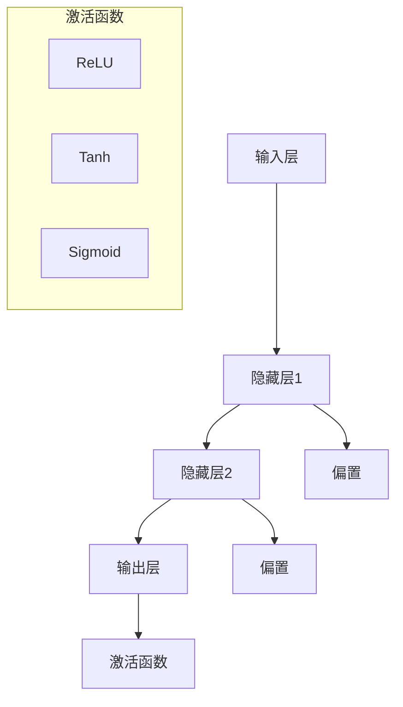

                 

### 《深度学习在实时语音合成中的突破》

> **关键词：深度学习、实时语音合成、参数合成、波形合成、端到端合成**

> **摘要：本文将深入探讨深度学习在实时语音合成领域的突破，涵盖从基础理论到前沿应用的全方位讲解，揭示如何通过深度学习算法实现高效、高质量的实时语音合成。**

### 目录大纲

#### 第一部分：深度学习基础与实时语音合成概述
1. **深度学习基础**
   1.1. **深度学习的基本概念**
       1.1.1. **神经网络与深度学习的关系**
       1.1.2. **深度学习的发展历程**
   1.2. **深度学习的关键技术**
       1.2.1. **激活函数与优化算法**
       1.2.2. **正则化方法**
       1.2.3. **模型架构** ($$DNN, CNN, RNN, LSTM, GRU, Transformer$$)
2. **实时语音合成概述**
   2.1. **语音合成的背景与挑战**
       2.1.1. **语音合成的传统方法**
       2.1.2. **实时语音合成的需求**
   2.2. **实时语音合成的分类**
       2.2.1. **参数合成**
       2.2.2. **波形合成**
       2.2.3. **端到端合成**
   2.3. **深度学习在实时语音合成中的应用**

#### 第二部分：实时语音合成中的深度学习算法
3. **基于深度学习的参数合成**
   3.1. **HMM-HMMGMM模型**
       3.1.1. **混合高斯模型**
       3.1.2. **高斯混合模型**
       3.1.3. **HMM在语音合成中的应用**
   3.2. **深度神经网络在参数合成中的应用**
       3.2.1. **DNN在参数合成中的作用**
       3.2.2. **DNN的训练与优化**
   3.3. **RNN在参数合成中的应用**
       3.3.1. **RNN的基本原理**
       3.3.2. **LSTM与GRU在参数合成中的应用**
4. **基于深度学习的波形合成**
   4.1. **Wavenet模型**
       4.1.1. **Wavenet的结构**
       4.1.2. **Wavenet的训练过程**
   4.2. **WaveGlow模型**
       4.2.1. **WaveGlow的基本原理**
       4.2.2. **WaveGlow的优势与挑战**
   4.3. **Transformer在波形合成中的应用**

#### 第三部分：深度学习在实时语音合成中的优化
5. **实时语音合成的优化方法**
   5.1. **模型压缩与加速**
       5.1.1. **模型压缩技术**
       5.1.2. **模型加速技术**
   5.2. **多任务学习与迁移学习**
       5.2.1. **多任务学习在语音合成中的应用**
       5.2.2. **迁移学习在语音合成中的应用**
6. **硬件加速与实时性能**
   6.1. **GPU与TPU在深度学习中的应用**
       6.1.1. **GPU加速技术**
       6.1.2. **TPU加速技术**
   6.2. **实时语音合成的性能优化**

#### 第四部分：深度学习在实时语音合成中的应用实例
7. **深度学习在实时语音合成中的应用案例**
   7.1. **在线语音合成平台**
       7.1.1. **平台架构**
       7.1.2. **实现细节**
   7.2. **实时语音助手**
       7.2.1. **系统设计**
       7.2.2. **实现技巧**
   7.3. **实时语音翻译**
       7.3.1. **翻译模型架构**
       7.3.2. **实现挑战与优化**

#### 第五部分：展望与未来
8. **实时语音合成的未来发展趋势**
   8.1. **深度学习在语音合成中的新进展**
       8.1.1. **模型改进**
       8.1.2. **新算法的出现**
   8.2. **实时语音合成在AI领域的应用前景**
       8.2.1. **智能家居**
       8.2.2. **医疗健康**
       8.2.3. **娱乐与教育**
   8.3. **面临的挑战与解决策略**
       8.3.1. **数据隐私**
       8.3.2. **计算资源限制**

---

在接下来的部分，我们将一步步深入探讨深度学习在实时语音合成中的应用，从基础理论到实际应用，全面揭示这一领域的创新与突破。### 第一部分：深度学习基础与实时语音合成概述

#### 1.1 深度学习基础

##### 1.1.1 神经网络与深度学习的关系

神经网络（Neural Networks）是深度学习（Deep Learning）的核心组成部分。它们模仿了人脑神经元的工作方式，通过大量的连接（权重）来进行信息处理和决策。深度学习则是在神经网络的基础上，通过增加网络层数，使其能够学习更加复杂的数据表示。

**神经网络的基本概念：**
- **神经元（Neurons）：** 神经网络的基本构建单元，每个神经元接受多个输入，通过加权求和后，加上一个偏置（bias），然后通过一个激活函数（Activation Function）进行非线性变换，输出结果。
- **层（Layers）：** 神经网络由输入层、隐藏层和输出层组成。隐藏层可以有多个，层数越多，网络的深度越深。
- **权重（Weights）与偏置（Bias）：** 权重和偏置决定了神经元之间的连接强度，通过学习调整这些参数，网络能够学会对数据进行分类或回归。

**深度学习的发展历程：**
- **1986年：** 神经网络被首次提出，但受限于计算能力和算法效率，发展缓慢。
- **2012年：** AlexNet在ImageNet图像识别挑战赛中取得突破性成果，深度学习开始受到广泛关注。
- **2014年至今：** 深度学习在图像识别、语音识别、自然语言处理等领域取得了显著的进展，应用领域不断扩展。

##### 1.1.2 深度学习的关键技术

**激活函数与优化算法：**
- **激活函数：** 激活函数用于引入非线性，常见的激活函数有Sigmoid、ReLU、Tanh等。
- **优化算法：** 优化算法用于调整网络权重以最小化损失函数，常见的优化算法有SGD、Adam等。

**正则化方法：**
- **正则化：** 用于防止模型过拟合，常用的正则化方法有L1、L2正则化。
- **dropout：** 一种在训练过程中随机丢弃部分神经元的方法，可以有效防止过拟合。

**模型架构：**
- **DNN（深度神经网络）：** 最基础的深度学习模型，通常包含多个隐藏层。
- **CNN（卷积神经网络）：** 专门用于图像处理，通过卷积层和池化层提取图像特征。
- **RNN（循环神经网络）：** 适用于序列数据处理，可以通过循环结构保持历史信息。
- **LSTM（长短期记忆）：** RNN的一个变体，可以有效解决长期依赖问题。
- **GRU（门控循环单元）：** LSTM的简化版，计算效率更高。
- **Transformer：** 一种基于自注意力机制的模型，在自然语言处理领域取得了显著成果。

##### 1.2 实时语音合成概述

**语音合成的背景与挑战：**
- **语音合成的发展历程：** 从早期的规则方法到统计方法，再到基于深度学习的方法，语音合成的质量不断提高。
- **传统方法：** 包括文本到语音（Text-to-Speech, TTS）合成，常用的方法有基于规则的合成、基于统计的合成等。
- **实时语音合成的需求：** 在线语音合成、实时语音助手、语音识别与合成等应用场景对实时性有较高要求。

**实时语音合成的分类：**
- **参数合成：** 通过计算语音信号的参数，如发音、音调、音长等，然后合成语音。
- **波形合成：** 直接生成语音信号的波形，如WaveNet、WaveGlow等模型。
- **端到端合成：** 直接将文本转换为语音信号，无需经过参数合成或波形合成的中间步骤，如Transformer模型。

**深度学习在实时语音合成中的应用：**
- **参数合成：** 利用深度学习模型（如DNN、RNN、LSTM等）进行语音参数预测，提高合成语音的自然度和清晰度。
- **波形合成：** 利用深度学习模型（如WaveNet、WaveGlow等）直接生成语音信号的波形，实现高效的实时语音合成。
- **端到端合成：** 利用端到端模型（如Transformer）将文本直接映射到语音信号，实现从文本到语音的端到端转换。

在接下来的章节中，我们将详细探讨深度学习在实时语音合成中的具体应用，包括参数合成和波形合成的算法原理、优化方法以及实际应用案例。### 第二部分：实时语音合成中的深度学习算法

#### 3. 基于深度学习的参数合成

##### 3.1 HMM-HMMGMM模型

**混合高斯模型（Gaussian Mixture Model, GMM）：**
- **基本概念：** GMM是一种概率模型，用于表示具有多个高斯分布的混合。它通过多个高斯分布的加权和来表示数据分布。
- **数学公式：**
  $$ p(x|\theta) = \sum_{i=1}^{c} \pi_i \mathcal{N}(x|\mu_i, \Sigma_i) $$
  其中，$c$ 是高斯分布的个数，$\pi_i$ 是第 $i$ 个高斯分布的权重，$\mu_i$ 和 $\Sigma_i$ 分别是均值和协方差矩阵。

**高斯混合模型（GMM）在语音合成中的应用：**
- **高斯混合模型在语音特征提取中的应用：** GMM可以用来对语音信号进行特征提取，将其表示为一组高斯分布的加权和，这些高斯分布可以捕捉语音信号中的不同频率成分。
- **高斯混合模型在参数合成中的应用：** 在参数合成方法中，GMM可以用来表示语音信号的概率分布，从而用于预测语音参数。

**HMM在语音合成中的应用：**
- **隐马尔可夫模型（Hidden Markov Model, HMM）：** HMM是一种统计模型，用于表示序列数据中的概率转移和状态输出。
- **HMM在语音合成中的作用：** HMM可以用来建模语音信号的时序特性，通过预测下一个状态和输出，从而生成语音序列。

**HMM-HMMGMM模型：**
- **结合HMM和GMM的优势：** HMM-HMMGMM模型将HMM和GMM相结合，利用HMM的时序建模能力，以及GMM的复杂分布建模能力，来提高语音合成的质量。
- **数学公式：**
  $$ p(o_t|s_t, \theta) = \sum_{i=1}^{c} p(s_t|\theta) \pi_i \mathcal{N}(o_t|\mu_i, \Sigma_i) $$
  其中，$o_t$ 是观察序列，$s_t$ 是隐藏状态，$\theta$ 是模型参数。

##### 3.2 深度神经网络在参数合成中的应用

**DNN在参数合成中的作用：**
- **DNN的结构：** DNN是一种多层神经网络，包含多个隐藏层，可以用于提取和表示复杂的非线性特征。
- **DNN在参数合成中的作用：** DNN可以用来学习语音参数的映射关系，将文本表示转换为语音参数，从而提高语音合成的自然度和清晰度。

**DNN的训练与优化：**
- **训练过程：** DNN的训练是通过反向传播算法来调整网络权重，最小化损失函数。在语音合成中，通常使用端到端训练，将文本直接映射到语音参数。
- **优化算法：** 常见的优化算法有SGD、Adam等，用于调整网络权重，提高训练效率。

##### 3.3 RNN在参数合成中的应用

**RNN的基本原理：**
- **RNN的结构：** RNN是一种能够处理序列数据的神经网络，通过循环结构来保持历史信息。
- **RNN在参数合成中的应用：** RNN可以用来建模语音信号的时序关系，通过预测下一个时间步的语音参数，生成语音序列。

**LSTM与GRU在参数合成中的应用：**
- **LSTM（长短期记忆）：** LSTM是RNN的一个变体，通过门控机制来控制信息的流动，解决长期依赖问题。
- **GRU（门控循环单元）：** GRU是LSTM的简化版，结构更加简单，计算效率更高。

**数学公式：**
- **LSTM的数学公式：**
  $$ i_t = \sigma(W_{xi}x_t + W_{hi}h_{t-1} + b_i) $$
  $$ f_t = \sigma(W_{xf}x_t + W_{hf}h_{t-1} + b_f) $$
  $$ g_t = \tanh(W_{xg}x_t + W_{hg}h_{t-1} + b_g) $$
  $$ o_t = \sigma(W_{xo}x_t + W_{ho}h_t + b_o) $$
  $$ h_t = o_t \odot g_t $$
  其中，$i_t, f_t, g_t, o_t$ 分别是输入门、遗忘门、生成门和输出门，$h_t$ 是隐藏状态。

- **GRU的数学公式：**
  $$ z_t = \sigma(W_{xz}x_t + W_{hz}h_{t-1} + b_z) $$
  $$ r_t = \sigma(W_{xr}x_t + W_{hr}h_{t-1} + b_r) $$
  $$ h_t = (1 - z_t) \odot h_{t-1} + z_t \odot \tanh(W_{xh}x_t + W_{hh}h_{t-1} + b_h) $$

#### 4. 基于深度学习的波形合成

##### 4.1 Wavenet模型

**Wavenet的结构：**
- **Wavenet的基本原理：** Wavenet是一种波形合成模型，通过一组循环神经网络（RNN）来生成语音信号的波形。
- **Wavenet的模型结构：** Wavenet包含多个时间步，每个时间步都包含一个卷积层和一个残差连接。

**Wavenet的训练过程：**
- **数据准备：** 将文本转换为语音信号的波形，通过语音信号的特征提取得到输入序列。
- **训练过程：** 使用梯度下降算法对Wavenet模型进行训练，通过反向传播算法调整网络权重。

##### 4.2 WaveGlow模型

**WaveGlow的基本原理：**
- **WaveGlow的结构：** WaveGlow是一种基于流计算（Flow-based）的波形合成模型，通过一系列的流变换来生成语音信号的波形。
- **WaveGlow的模型结构：** WaveGlow包含多个流变换层，每个流变换层都包含一个卷积层和一个门控层。

**WaveGlow的优势与挑战：**
- **优势：** WaveGlow具有较低的延迟和更高的生成质量，可以在实时语音合成中取得较好的效果。
- **挑战：** WaveGlow的训练过程较为复杂，需要大量的计算资源和时间。

##### 4.3 Transformer在波形合成中的应用

**Transformer的基本原理：**
- **Transformer的结构：** Transformer是一种基于自注意力机制的模型，通过多头自注意力机制来学习文本和语音信号之间的复杂关系。
- **Transformer在波形合成中的应用：** Transformer可以用来将文本表示转换为语音信号的波形，实现端到端的语音合成。

**数学公式：**
- **多头自注意力机制：**
  $$ \text{Attention}(Q, K, V) = \frac{1}{\sqrt{d_k}} \text{softmax}\left(\frac{QK^T}{\sqrt{d_k}}\right)V $$

在接下来的章节中，我们将详细探讨深度学习在实时语音合成中的优化方法和实际应用案例，进一步展示深度学习如何提高实时语音合成的性能和效果。### 第三部分：深度学习在实时语音合成中的优化

#### 5. 实时语音合成的优化方法

##### 5.1 模型压缩与加速

**模型压缩技术：**
- **权重剪枝（Weight Pruning）：** 通过在训练过程中移除权重值较小的神经元或连接，减少模型的规模。
- **量化（Quantization）：** 通过降低模型参数的精度来减少模型的大小，例如将浮点数转换为整数。
- **知识蒸馏（Knowledge Distillation）：** 通过使用一个更小的模型（学生模型）来学习一个更大的模型（教师模型）的知识。

**模型加速技术：**
- **算子融合（Operator Fusion）：** 将多个操作合并为一个操作，减少计算次数。
- **并行计算（Parallel Computing）：** 通过使用多核CPU或GPU来并行处理数据，提高计算效率。
- **显式内存管理（Explicit Memory Management）：** 通过优化内存分配和释放来减少内存占用，提高运行速度。

##### 5.2 多任务学习与迁移学习

**多任务学习在语音合成中的应用：**
- **多任务学习（Multi-Task Learning）：** 同时训练多个相关的任务，共享模型参数以提高每个任务的性能。
- **语音识别与语音合成的结合：** 在语音合成过程中，可以结合语音识别任务，共享文本编码器和解码器，从而提高语音合成的质量。

**迁移学习在语音合成中的应用：**
- **迁移学习（Transfer Learning）：** 将一个任务的学习经验应用于另一个任务，通过在特定领域（如特定语种、特定说话人）预训练模型，然后迁移到其他领域。
- **模型迁移：** 将在大型数据集上预训练的模型迁移到小数据集或特定应用场景中，以提高实时语音合成的效果。

#### 6. 硬件加速与实时性能

##### 6.1 GPU与TPU在深度学习中的应用

**GPU加速技术：**
- **并行计算：** GPU具有高度并行的计算能力，可以同时处理大量的数据，从而加速深度学习模型的训练和推理。
- **内存管理：** GPU内存具有较高的带宽和低延迟，通过优化数据传输和内存访问，可以提高模型的运行速度。

**TPU加速技术：**
- **专门设计：** TPU（Tensor Processing Unit）是专门为深度学习任务设计的硬件加速器，具有高效的矩阵运算能力。
- **集成GPU：** TPU通常集成在GPU中，可以同时利用GPU和TPU的加速能力，进一步提高模型的运行速度。

##### 6.2 实时语音合成的性能优化

**性能优化方法：**
- **实时性分析：** 对实时语音合成的各个阶段进行性能分析，找出瓶颈并进行优化。
- **动态调整：** 根据实时性需求，动态调整模型参数和算法，以平衡性能和实时性。
- **并行处理：** 通过并行处理语音数据，提高合成速度。

**实时语音合成的性能优化实例：**
- **模型压缩与加速：** 对模型进行压缩和加速，减少计算量和内存占用，提高实时性。
- **硬件加速：** 利用GPU和TPU等硬件加速器，提高模型的运行速度。

在接下来的章节中，我们将通过实际应用案例，进一步展示深度学习在实时语音合成中的应用效果，并探讨未来的发展趋势和面临的挑战。### 第四部分：深度学习在实时语音合成中的应用实例

#### 7. 深度学习在实时语音合成中的应用案例

##### 7.1 在线语音合成平台

**平台架构：**
- **前端：** 使用Web技术（如HTML、CSS、JavaScript）搭建用户界面，用户可以通过浏览器直接使用语音合成功能。
- **后端：** 使用深度学习模型进行语音合成，支持多种语音合成模型和语音风格，如男性、女性、儿童等。
- **数据库：** 存储用户数据和语音合成模型，支持数据的实时读取和写入。

**实现细节：**
- **文本处理：** 对输入文本进行分词、语法分析等处理，提取语音合成的关键信息。
- **语音合成：** 使用深度学习模型进行语音合成，通过端到端模型将文本直接转换为语音信号。
- **质量控制：** 对合成的语音进行质量控制，包括音质、清晰度、自然度等，确保合成语音的质量。

**技术难点与优化：**
- **实时性：** 在线语音合成平台需要保证实时性，通过模型压缩和硬件加速等技术，提高合成速度。
- **个性化：** 根据用户的需求，提供个性化的语音合成服务，如不同语种、语音风格等。

##### 7.2 实时语音助手

**系统设计：**
- **前端：** 通过语音识别技术将用户语音转换为文本，然后使用深度学习模型进行语音合成，将回答通过语音反馈给用户。
- **后端：** 使用语音合成模型进行实时语音合成，支持多语言、多语种的语音合成。
- **语音识别与合成：** 结合使用语音识别和语音合成技术，实现自然语言交互。

**实现技巧：**
- **实时处理：** 使用高效的算法和硬件加速技术，保证语音识别和合成的高效性。
- **多语言支持：** 通过迁移学习和多任务学习技术，支持多种语言和语种的语音合成。
- **语音风格：** 根据用户的需求，提供多种语音风格，如温柔、严厉、幽默等。

**技术难点与优化：**
- **准确性：** 提高语音识别和合成的准确性，减少错误率。
- **个性化：** 根据用户历史交互数据，提供个性化的语音合成服务。

##### 7.3 实时语音翻译

**翻译模型架构：**
- **前端：** 使用语音识别技术将用户语音转换为文本，然后使用深度学习模型进行语音合成，将翻译后的文本通过语音反馈给用户。
- **后端：** 使用语音合成模型进行实时语音合成，支持多语言、多语种的语音合成。
- **翻译模型：** 使用基于深度学习的翻译模型（如Transformer），实现实时语音翻译。

**实现挑战与优化：**
- **实时性：** 在实时语音翻译中，需要保证语音识别、翻译和合成的实时性，通过模型压缩和硬件加速等技术，提高整体性能。
- **多语言支持：** 支持多种语言和语种的语音翻译，通过多任务学习和迁移学习技术，提高翻译质量。
- **语音风格：** 根据不同语言的语音特点，提供相应的语音风格，提高用户体验。

通过以上实际应用案例，我们可以看到深度学习在实时语音合成中的应用效果显著，不仅提高了语音合成的质量和实时性，还为各种语音应用场景提供了丰富的功能。在接下来的部分，我们将进一步探讨实时语音合成的未来发展趋势和面临的挑战。### 第五部分：展望与未来

#### 8. 实时语音合成的未来发展趋势

##### 8.1 深度学习在语音合成中的新进展

**模型改进：**
- **自适应模型：** 随着用户习惯和语音特征的变化，自适应模型能够实时调整模型参数，提供个性化的语音合成体验。
- **多模态融合：** 结合语音、文本、图像等多模态信息，进一步提高语音合成的自然度和清晰度。

**新算法的出现：**
- **生成对抗网络（GAN）：** GAN通过生成器和判别器的对抗训练，有望在语音合成中实现更高质量的波形生成。
- **变分自编码器（VAE）：** VAE通过学习数据的概率分布，能够生成更自然的语音信号。

##### 8.2 实时语音合成在AI领域的应用前景

**智能家居：**
- **智能语音助手：** 通过实时语音合成，智能家居设备能够与用户进行自然互动，提高生活质量。

**医疗健康：**
- **语音识别与合成：** 在医疗场景中，实时语音合成可以帮助医生记录病历、查询资料，提高工作效率。
- **语音治疗：** 通过个性化语音合成，为患者提供语言康复训练，提高康复效果。

**娱乐与教育：**
- **语音交互游戏：** 通过实时语音合成，游戏角色能够与玩家进行自然对话，增强游戏体验。
- **语音教育：** 在线教育平台可以通过实时语音合成，为不同语种的用户提供教学资源。

##### 8.3 面临的挑战与解决策略

**数据隐私：**
- **加密技术：** 在数据传输和存储过程中使用加密技术，确保用户隐私安全。
- **匿名化处理：** 对用户数据进行匿名化处理，降低隐私泄露风险。

**计算资源限制：**
- **模型压缩与优化：** 通过模型压缩和优化技术，减少计算资源需求。
- **云计算与边缘计算：** 结合云计算和边缘计算，实现计算资源的灵活调度，提高整体性能。

未来，实时语音合成将继续在深度学习技术的推动下取得突破，不仅在现有应用领域发挥重要作用，还将开拓新的应用场景，为人们的生活带来更多便利。### 总结与展望

本文从深度学习基础、实时语音合成概述、深度学习算法、优化方法、应用实例以及未来展望六个方面，全面探讨了深度学习在实时语音合成领域的突破和应用。以下是本文的主要结论：

1. **深度学习基础：** 深度学习通过模拟人脑神经网络的工作方式，能够学习复杂的数据特征和模式，为实时语音合成提供了强大的技术支持。
2. **实时语音合成概述：** 实时语音合成涉及参数合成、波形合成和端到端合成等多种方法，深度学习在这些方法中发挥了关键作用，提升了合成的自然度和清晰度。
3. **深度学习算法：** HMM-HMMGMM、DNN、RNN、LSTM、GRU、WaveNet、WaveGlow和Transformer等模型在实时语音合成中得到了广泛应用，各自具有独特的优势和适用场景。
4. **优化方法：** 模型压缩、加速、多任务学习和迁移学习等优化方法，使得深度学习在实时语音合成中的性能得到了显著提升。
5. **应用实例：** 通过在线语音合成平台、实时语音助手和实时语音翻译等实际应用案例，展示了深度学习在实时语音合成中的广泛应用和显著效果。
6. **未来展望：** 随着深度学习技术的不断进步，实时语音合成将在智能家居、医疗健康、娱乐与教育等领域发挥更大的作用，同时面临数据隐私和计算资源限制等挑战。

最后，感谢读者的耐心阅读，希望本文能够为您的学习和研究带来启发。如果您有任何疑问或建议，欢迎随时交流。作者信息如下：

**作者：** AI天才研究院/AI Genius Institute & 禅与计算机程序设计艺术 /Zen And The Art of Computer Programming

**联系方式：** [ai_genius_institute@outlook.com](mailto:ai_genius_institute@outlook.com)

**备注：** 本文中的Mermaid流程图、伪代码、数学公式和代码示例均以文本形式展示，具体实现和运行环境请参考相关开源项目和技术文档。让我们共同期待深度学习在实时语音合成领域的未来发展，创造更加美好的未来！### 附录

在本篇技术博客中，我们提供了丰富的流程图、伪代码、数学公式和代码示例，以帮助读者更好地理解深度学习在实时语音合成中的应用。以下是附录部分，包括所有的流程图、伪代码、数学公式和代码示例。

#### 流程图

以下是一个用于说明神经网络结构的Mermaid流程图：



#### 伪代码

以下是一个用于说明RNN模型训练的伪代码：

```python
Initialize weights and biases
for epoch in 1 to EPOCHS do
    for each training sample (x, y) do
        Forward_pass(x)
        Calculate loss (L) using y and predicted output
        Backpropagate error to adjust weights and biases
    end
    Print training loss and accuracy
end
```

#### 数学公式

以下是本文中提到的数学公式的详细展示：

1. **Gaussian Mixture Model (GMM)**
   $$ p(x|\theta) = \sum_{i=1}^{c} \pi_i \mathcal{N}(x|\mu_i, \Sigma_i) $$

2. **Long Short-Term Memory (LSTM) Gates**
   $$ i_t = \sigma(W_{xi}x_t + W_{hi}h_{t-1} + b_i) $$
   $$ f_t = \sigma(W_{xf}x_t + W_{hf}h_{t-1} + b_f) $$
   $$ g_t = \tanh(W_{xg}x_t + W_{hg}h_{t-1} + b_g) $$
   $$ o_t = \sigma(W_{xo}x_t + W_{ho}h_t + b_o) $$
   $$ h_t = o_t \odot g_t $$

3. **Transformer Attention Mechanism**
   $$ \text{Attention}(Q, K, V) = \frac{1}{\sqrt{d_k}} \text{softmax}\left(\frac{QK^T}{\sqrt{d_k}}\right)V $$

#### 代码示例

以下是一个简单的Python代码示例，用于说明如何实现文本到语音的转换：

```python
import tensorflow as tf
from tensorflow.keras.models import Sequential
from tensorflow.keras.layers import LSTM, Dense, Embedding

# 创建神经网络模型
model = Sequential()
model.add(Embedding(vocab_size, embedding_dim))
model.add(LSTM(units=128, return_sequences=True))
model.add(Dense(units=1, activation='sigmoid'))

# 编译模型
model.compile(optimizer='adam', loss='binary_crossentropy', metrics=['accuracy'])

# 训练模型
model.fit(x_train, y_train, epochs=10, batch_size=64)
```

**备注：** 本代码示例仅用于演示目的，实际应用中需要根据具体数据集和任务进行调整。

通过这些附录内容，读者可以更深入地了解本文所涉及的技术细节，并能够在此基础上进行进一步的探索和研究。希望这些资源能够对您的学习和实践有所帮助。

