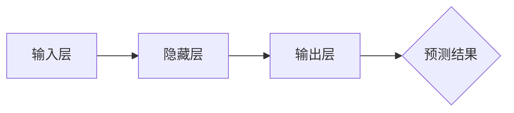
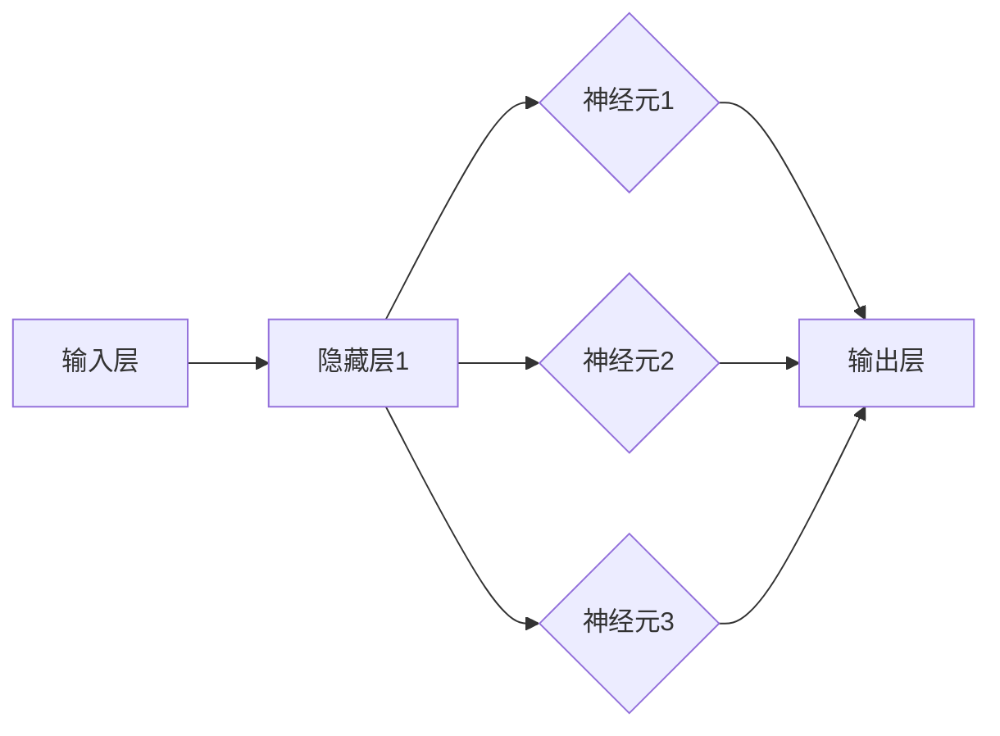

                 

# 《深度学习在自然语言处理中的突破：理解与生成》

## 核心关键词

- 深度学习
- 自然语言处理
- 文本分类
- 情感分析
- 序列标注
- 机器翻译
- 问答系统
- 文本生成

## 摘要

本文将探讨深度学习在自然语言处理（NLP）领域的突破性进展，包括理解与生成两个方面。我们将首先回顾深度学习的发展历程和核心概念，然后深入探讨神经网络基础、文本预处理、词嵌入技术和序列模型等自然语言处理的基础知识。接着，我们将详细介绍深度学习在自然语言处理中的各种应用，如文本分类、情感分析、序列标注、机器翻译、问答系统和文本生成。最后，我们将总结深度学习在NLP中的成就与挑战，并展望未来的发展趋势。本文旨在为广大读者提供一份全面、深入的深度学习与自然语言处理的技术指南。

---

## 《深度学习在自然语言处理中的突破：理解与生成》目录大纲

### 第一部分：深度学习基础

#### 第1章：深度学习概述

##### 1.1 深度学习的发展历程
##### 1.2 深度学习的核心概念
##### 1.3 深度学习的应用领域

#### 第2章：神经网络基础

##### 2.1 神经网络的基本结构
##### 2.2 激活函数
##### 2.3 前向传播与反向传播
##### 2.4 优化算法

### 第二部分：自然语言处理基础

#### 第3章：文本预处理

##### 3.1 字符级别的文本表示
##### 3.2 词级别的文本表示
##### 3.3 序列对齐与填充

#### 第4章：词嵌入技术

##### 4.1 词嵌入的基本概念
##### 4.2 Word2Vec算法
##### 4.3 GloVe算法

#### 第5章：序列模型

##### 5.1 隐藏层循环单元（RNN）
##### 5.2 长短时记忆网络（LSTM）
##### 5.3 门控循环单元（GRU）

### 第三部分：深度学习在自然语言处理中的应用

#### 第6章：文本分类

##### 6.1 基于词嵌入的分类
##### 6.2 基于神经网络的分类
##### 6.3 文本分类实战

#### 第7章：情感分析

##### 7.1 基于词嵌入的情感分析
##### 7.2 基于神经网络的情感分析
##### 7.3 情感分析实战

#### 第8章：序列标注

##### 8.1 基于规则的方法
##### 8.2 基于统计的方法
##### 8.3 基于神经网络的方法
##### 8.4 序列标注实战

#### 第9章：机器翻译

##### 9.1 神经网络机器翻译
##### 9.2 序列到序列模型
##### 9.3 机器翻译实战

### 第四部分：理解与生成

#### 第10章：问答系统

##### 10.1 知识图谱
##### 10.2 答案抽取
##### 10.3 问答系统实战

#### 第11章：文本生成

##### 11.1 序列到序列生成
##### 11.2 零样本生成
##### 11.3 文本生成实战

#### 第12章：生成对抗网络

##### 12.1 GAN的基础概念
##### 12.2 GAN的架构
##### 12.3 GAN的应用
##### 12.4 GAN实战

### 第13章：总结与展望

##### 13.1 深度学习在自然语言处理中的成就
##### 13.2 深度学习在自然语言处理中的挑战
##### 13.3 未来发展趋势

### 附录

##### 附录 A：深度学习相关工具与框架

###### A.1 TensorFlow
###### A.2 PyTorch
###### A.3 Keras
###### A.4 其他深度学习框架简介

##### 附录 B：参考文献与推荐阅读

###### B.1 参考文献
###### B.2 推荐阅读

---

## 第1章：深度学习概述

### 1.1 深度学习的发展历程

深度学习（Deep Learning）是人工智能（Artificial Intelligence，AI）的一个重要分支，其核心思想是通过模拟人脑的神经网络结构，利用大量数据进行训练，从而实现机器学习（Machine Learning，ML）任务。深度学习的发展历程可以追溯到20世纪40年代，当时心理学家和数学家开始探索如何通过计算模型来模拟人脑的神经网络结构。

#### 1.1.1 早期探索

1943年，心理学家McCulloch和数学家Pitts提出了神经网络的雏形，即MCP（McCulloch-Pitts）神经元模型。这一模型奠定了神经网络理论的基础，但当时由于计算机技术和算法的限制，神经网络的应用受到极大限制。

#### 1.1.2 1980年代的突破

1982年，Rumelhart、Hinton和Williams提出了反向传播算法（Backpropagation Algorithm），这一算法使得多层神经网络的训练成为可能，大大提高了神经网络的性能和应用范围。1986年，Hinton和Engelhardt等人提出了深度信念网络（Deep Belief Networks，DBN），这是第一个基于深层网络结构的机器学习模型。

#### 1.1.3 21世纪初的复兴

随着计算机技术的进步，尤其是GPU（Graphics Processing Unit）在深度学习计算中的应用，深度学习迎来了新的发展机遇。2006年，Hinton提出了深度置信网络（Deep Belief Network，DBN），并成功应用于语音识别和图像识别领域。这一时期的代表性成果包括深度卷积神经网络（Deep Convolutional Neural Network，DCNN）和深度强化学习（Deep Reinforcement Learning）。

#### 1.1.4 近年来的发展

近年来，深度学习在自然语言处理（Natural Language Processing，NLP）、计算机视觉、语音识别等领域取得了显著的进展。以2012年AlexNet在ImageNet竞赛中的夺冠为标志，深度学习开始在计算机视觉领域崭露头角。此外，深度学习在自然语言处理领域的应用也得到了极大的关注，例如机器翻译、情感分析、问答系统和文本生成等。

### 1.1.5 深度学习的重要里程碑

- **2012年**：AlexNet在ImageNet竞赛中夺得冠军，标志着深度学习在计算机视觉领域的重大突破。
- **2014年**：Google Brain团队训练了含有1.5亿参数的深层神经网络，展示了深度学习在处理大规模数据集上的潜力。
- **2016年**：AlphaGo战胜世界围棋冠军李世石，标志着深度学习在强化学习领域的重大突破。
- **2018年**：BERT模型的提出，推动了自然语言处理领域的发展。

### 1.1.6 当前深度学习的发展趋势

目前，深度学习在学术界和工业界都取得了显著进展，未来的发展趋势包括：

- **模型压缩与优化**：为了提高深度学习模型的效率和可部署性，研究者们致力于模型压缩与优化技术，如蒸馏、剪枝、量化等。
- **自适应学习**：自适应学习是深度学习未来的一个重要方向，通过自适应地调整学习策略，提高模型的训练效率和泛化能力。
- **跨学科融合**：深度学习与其他领域的融合，如生物学、心理学、认知科学等，将有助于深度学习理论的深入发展。

## 1.2 深度学习的核心概念

深度学习的核心概念包括神经网络、多层结构、损失函数、优化算法等。

### 1.2.1 神经网络

神经网络（Neural Network，NN）是深度学习的基础。神经网络由大量的简单计算单元（神经元）组成，每个神经元都与其他神经元相连，并通过权重进行信息传递。神经网络的目的是通过学习输入和输出之间的关系，从而实现对复杂数据的建模和预测。

#### 1.2.1.1 神经元

神经元是神经网络的基本单元，它通过接收输入信号、计算加权求和并应用激活函数，产生输出信号。一个简单的神经元可以表示为：

\[ z = \sum_{i} w_i x_i + b \]
\[ a = \sigma(z) \]

其中，\( x_i \) 是输入，\( w_i \) 是权重，\( b \) 是偏置，\( \sigma \) 是激活函数，通常是Sigmoid函数或ReLU函数。

#### 1.2.1.2 层

神经网络通常包含多个层次，包括输入层、隐藏层和输出层。输入层接收外部输入，隐藏层负责特征提取和变换，输出层产生最终预测。

\[ \text{输入层} \rightarrow \text{隐藏层1} \rightarrow \text{隐藏层2} \rightarrow \ldots \rightarrow \text{输出层} \]

#### 1.2.1.3 前向传播

前向传播是神经网络处理输入数据的过程，数据从输入层流向隐藏层，最后到达输出层。每个神经元都通过加权求和和激活函数计算输出。

### 1.2.2 多层结构

多层结构是深度学习的重要特征。通过增加网络的深度，可以提取更高层次的特征，从而提高模型的复杂度和泛化能力。

#### 1.2.2.1 深度与宽度

深度（Depth）是指网络层数，宽度（Width）是指每层的神经元数量。深度可以增加网络的表征能力，但也会导致过拟合和计算复杂度增加。宽度可以增加模型的容量，但也可能导致过拟合和计算复杂度增加。

#### 1.2.2.2 网络类型

根据网络的结构和功能，可以分类为以下几种类型：

- **全连接神经网络（FCNN）**：每层的所有神经元都与其他层所有神经元相连。
- **卷积神经网络（CNN）**：适用于图像识别和图像处理，通过卷积层和池化层提取特征。
- **循环神经网络（RNN）**：适用于序列数据，通过循环结构处理长距离依赖。
- **长短期记忆网络（LSTM）**：RNN的一种改进，解决了梯度消失和梯度爆炸问题。
- **生成对抗网络（GAN）**：用于生成新的数据，通过生成器和判别器的对抗训练。

### 1.2.3 损失函数

损失函数是评估模型预测结果与真实值之间差异的指标。常见的损失函数包括均方误差（MSE）、交叉熵（Cross-Entropy）和Hinge损失。

#### 1.2.3.1 均方误差（MSE）

均方误差是用于回归问题的常见损失函数，计算预测值与真实值之差的平方和的平均值。

\[ L(\theta) = \frac{1}{2m} \sum_{i=1}^{m} (h_\theta(x^{(i)}) - y^{(i)})^2 \]

其中，\( m \) 是样本数量，\( h_\theta(x) \) 是预测函数，\( y^{(i)} \) 是真实值。

#### 1.2.3.2 交叉熵（Cross-Entropy）

交叉熵是用于分类问题的常见损失函数，计算预测概率分布与真实分布之间的差异。

\[ L(\theta) = -\sum_{i=1}^{m} y^{(i)} \log(h_\theta(x^{(i)})) \]

其中，\( y^{(i)} \) 是真实标签，\( h_\theta(x) \) 是预测概率。

#### 1.2.3.3 Hinge损失

Hinge损失是支持向量机（SVM）的损失函数，用于分类问题。

\[ L(\theta) = \max(0, 1 - y^{(i)} h_\theta(x^{(i)})) \]

### 1.2.4 优化算法

优化算法用于更新网络的参数，以最小化损失函数。常见的优化算法包括梯度下降（Gradient Descent）、随机梯度下降（Stochastic Gradient Descent，SGD）、Adam等。

#### 1.2.4.1 梯度下降

梯度下降是一种基本的优化算法，通过计算损失函数对参数的梯度，并沿着梯度的反方向更新参数。

\[ \theta_j := \theta_j - \alpha \frac{\partial L}{\partial \theta_j} \]

其中，\( \theta_j \) 是参数，\( \alpha \) 是学习率。

#### 1.2.4.2 随机梯度下降

随机梯度下降是对梯度下降的改进，每次迭代仅更新一个样本的梯度。

\[ \theta_j := \theta_j - \alpha \frac{\partial L}{\partial \theta_j} \]

#### 1.2.4.3 Adam

Adam是一种自适应优化算法，结合了AdaGrad和RMSProp的优点。

\[ m_t = \beta_1 m_{t-1} + (1 - \beta_1) \frac{\partial L}{\partial \theta_j} \]
\[ v_t = \beta_2 v_{t-1} + (1 - \beta_2) (\frac{\partial L}{\partial \theta_j})^2 \]
\[ \theta_j := \theta_j - \alpha \frac{m_t}{\sqrt{v_t} + \epsilon} \]

其中，\( m_t \) 和 \( v_t \) 分别是指数加权移动平均的一阶和二阶矩估计，\( \beta_1 \) 和 \( \beta_2 \) 是超参数。

## 1.3 深度学习的应用领域

深度学习在多个领域取得了显著的成果，以下是深度学习在自然语言处理、计算机视觉、语音识别和强化学习等领域的应用：

### 1.3.1 自然语言处理

深度学习在自然语言处理（NLP）领域取得了重要突破，包括文本分类、情感分析、机器翻译、问答系统和文本生成等。

- **文本分类**：通过将文本数据映射到低维向量，使用深度学习模型（如CNN和RNN）进行分类。
- **情感分析**：通过分析文本的情感倾向，用于情感识别和情感分析。
- **机器翻译**：使用深度学习模型（如Seq2Seq）进行翻译，实现了高质量的自动翻译。
- **问答系统**：通过理解和生成文本，实现智能问答系统。
- **文本生成**：通过序列模型（如RNN和LSTM）生成新的文本，用于文本创作和内容生成。

### 1.3.2 计算机视觉

深度学习在计算机视觉（CV）领域取得了巨大成功，包括图像分类、目标检测、图像分割和图像生成等。

- **图像分类**：通过将图像映射到低维向量，使用深度学习模型（如CNN）进行分类。
- **目标检测**：通过检测图像中的目标，用于自动驾驶、人脸识别等应用。
- **图像分割**：通过将图像划分为不同的区域，用于医学图像分析和图像识别。
- **图像生成**：通过生成对抗网络（GAN）生成新的图像。

### 1.3.3 语音识别

深度学习在语音识别（ASR）领域取得了显著成果，通过将语音信号映射到文本，实现了高效的语音识别。

- **声学模型**：通过将语音信号映射到特征向量，用于声学建模。
- **语言模型**：通过将文本映射到概率分布，用于语言建模。
- **结合声学和语言模型**：将声学模型和语言模型结合，实现高质量的语音识别。

### 1.3.4 强化学习

深度学习在强化学习（RL）领域取得了重要突破，通过深度神经网络实现智能体的决策和行动。

- **深度Q网络（DQN）**：通过学习Q值函数，实现智能体的决策。
- **深度确定性策略梯度（DDPG）**：通过学习策略网络，实现智能体的决策。
- **深度策略梯度（DeepPG）**：通过学习策略网络，实现智能体的决策。

### 1.3.5 其他应用领域

深度学习在其他领域也取得了显著成果，包括生物信息学、金融、医疗等。

- **生物信息学**：通过深度学习模型进行基因序列分析和蛋白质结构预测。
- **金融**：通过深度学习模型进行股票市场预测和风险控制。
- **医疗**：通过深度学习模型进行医学图像分析和疾病诊断。

## 第2章：神经网络基础

### 2.1 神经网络的基本结构

神经网络（Neural Network，NN）是深度学习的基础，由大量的神经元组成，每个神经元都与相邻的神经元相连，并通过权重进行信息传递。神经网络的基本结构包括输入层、隐藏层和输出层。

#### 2.1.1 输入层

输入层是神经网络的第一层，接收外部输入的数据。这些数据可以是图像像素值、文本表示或者声音信号的序列。

#### 2.1.2 隐藏层

隐藏层位于输入层和输出层之间，可以有一个或多个。每个隐藏层由多个神经元组成，这些神经元通过前一层神经元的激活值进行计算。

#### 2.1.3 输出层

输出层是神经网络的最后一层，负责生成最终的预测结果。输出层的神经元数量和类型取决于具体的应用任务，例如二分类任务需要一个神经元，多分类任务需要多个神经元。

#### 2.1.4 连接权重和偏置

在神经网络中，神经元之间的连接由权重（weights）表示，每个连接权重都关联有一个偏置（bias）。权重和偏置共同决定了神经元的输出。

#### 2.1.5 激活函数

激活函数是神经网络中的一个关键组件，用于引入非线性特性。常见的激活函数包括 sigmoid、ReLU 和 tanh。

- **Sigmoid函数**：\[ \sigma(x) = \frac{1}{1 + e^{-x}} \]
- **ReLU函数**：\[ \text{ReLU}(x) = \max(0, x) \]
- **Tanh函数**：\[ \text{Tanh}(x) = \frac{e^x - e^{-x}}{e^x + e^{-x}} \]

### 2.2 激活函数

激活函数（Activation Function）是神经网络中的核心组件，它为神经网络引入了非线性特性，使得神经网络能够从输入数据中学习到复杂的模式。以下是几种常见的激活函数及其性质：

#### 2.2.1 Sigmoid函数

Sigmoid函数是一种常用的激活函数，其公式为：

\[ \sigma(x) = \frac{1}{1 + e^{-x}} \]

Sigmoid函数的输出范围在 \( (0, 1) \) 之间，常用于二分类问题。然而，Sigmoid函数的导数在接近0和1时非常小，这可能导致梯度消失问题。

\[ \frac{d\sigma}{dx} = \sigma(1 - \sigma) \]

#### 2.2.2 ReLU函数

ReLU（Rectified Linear Unit）函数是一种线性激活函数，其公式为：

\[ \text{ReLU}(x) = \max(0, x) \]

ReLU函数的优点是计算简单且不会出现梯度消失问题，因此有助于加快训练速度。然而，ReLU函数的一个缺点是可能会出现“死神经元”现象，即某些神经元可能会在训练过程中一直处于非激活状态。

#### 2.2.3 Tanh函数

Tanh（Hyperbolic Tangent）函数是另一种常用的激活函数，其公式为：

\[ \text{Tanh}(x) = \frac{e^x - e^{-x}}{e^x + e^{-x}} \]

Tanh函数的输出范围在 \( (-1, 1) \) 之间，类似于Sigmoid函数，但Tanh函数没有梯度消失问题，且能够更好地捕捉输入数据的对称性。

\[ \frac{d\text{Tanh}(x)}{dx} = 1 - \text{Tanh}^2(x) \]

#### 2.2.4 Leaky ReLU函数

Leaky ReLU是ReLU函数的一个改进版本，用于解决ReLU函数中的“死神经元”问题。其公式为：

\[ \text{Leaky ReLU}(x) = \max(0.01x, x) \]

Leaky ReLU通过引入一个很小的常数 \( 0.01 \) 来避免神经元完全停止更新，从而提高了网络的训练稳定性。

\[ \frac{d\text{Leaky ReLU}(x)}{dx} = \begin{cases} 
0.01 & \text{if } x < 0 \\
1 & \text{if } x \geq 0 
\end{cases} \]

#### 2.2.5 SELU函数

SELU（Scaled Exponential Linear Unit）函数是一种自适应激活函数，其公式为：

\[ \text{SELU}(x) = \lambda \cdot (\exp(x) - 1) \]

其中，\[ \lambda = 1.0507 \]

SELU函数具有自适应特性，能够根据输入数据的分布自动调整激活函数的斜率，从而提高网络的性能。

\[ \text{SELU}'(x) = \lambda \cdot \text{sign}(x) \cdot \text{SELU}(x) \]

### 2.3 前向传播与反向传播

前向传播（Forward Propagation）和反向传播（Back Propagation）是神经网络训练过程中的两个核心步骤。前向传播用于计算网络的输出，而反向传播用于更新网络的权重和偏置，以优化模型。

#### 2.3.1 前向传播

前向传播是指将输入数据通过神经网络，逐层计算每个神经元的输出。以下是前向传播的步骤：

1. **初始化参数**：首先，随机初始化网络的权重 \( w \) 和偏置 \( b \)。
2. **输入数据输入到输入层**：将输入数据输入到输入层，每个输入值通过每个输入层神经元。
3. **前向计算**：从输入层开始，通过每个隐藏层和输出层，每个神经元的输出通过以下公式计算：

\[ a_{j}^{(l)} = \sigma(z_{j}^{(l)}) \]

其中，\[ z_{j}^{(l)} = \sum_{i} w_{ij}^{(l)} a_{i}^{(l-1)} + b_{j}^{(l)} \]

\[ a_{j}^{(l)} \] 表示第 \( j \) 个神经元的输出，\[ w_{ij}^{(l)} \] 表示第 \( i \) 个神经元到第 \( j \) 个神经元的权重，\[ b_{j}^{(l)} \] 表示第 \( j \) 个神经元的偏置，\[ \sigma \] 表示激活函数。
4. **输出层输出**：当数据通过输出层后，得到最终的预测输出。

#### 2.3.2 反向传播

反向传播是指通过计算误差，更新网络中的权重和偏置，以优化模型。以下是反向传播的步骤：

1. **计算损失函数**：首先，计算预测输出与真实标签之间的损失。常见的损失函数有均方误差（MSE）和交叉熵（Cross-Entropy）。
2. **计算梯度**：通过反向传播，计算每个神经元的梯度。梯度是损失函数对网络权重的导数，用于指导权重更新。

\[ \frac{\partial J}{\partial w_{ij}^{(l)}} = a

