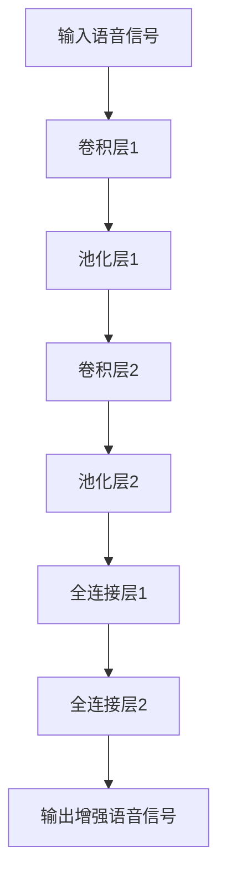
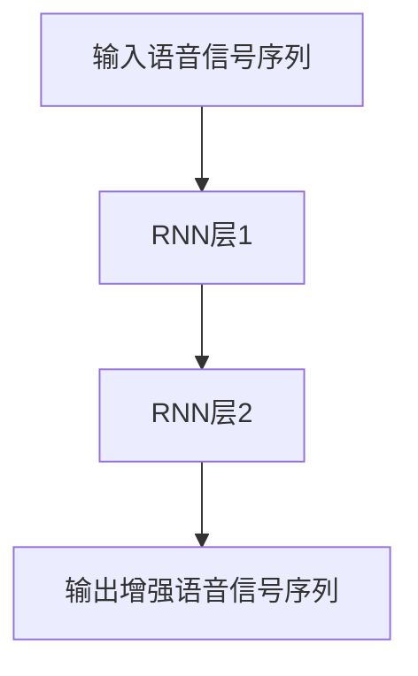
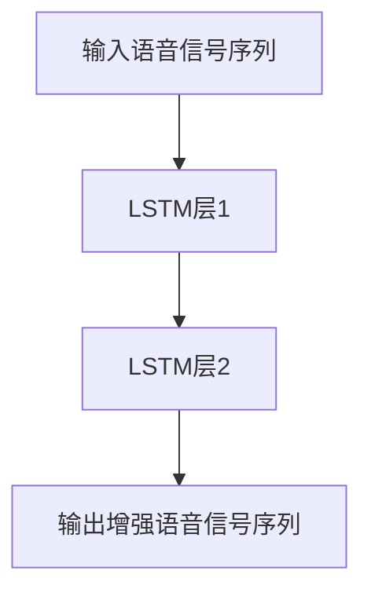
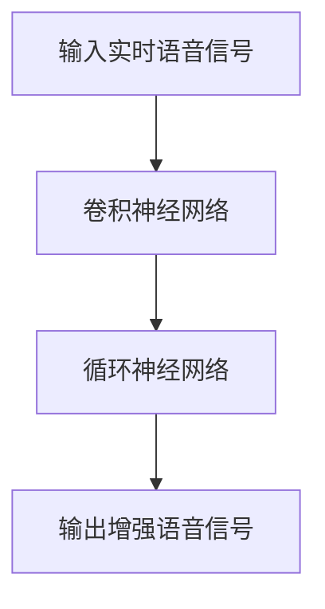

                 

## {文章标题}

> {关键词：(此处列出文章的5-7个核心关键词)}

> {摘要：(此处给出文章的核心内容和主题思想)}

在当今快速发展的科技时代，语音增强技术正逐渐成为语音处理领域的重要研究方向。深度学习作为人工智能的核心技术，其在语音增强中的应用正展现出前所未有的潜力。本文旨在系统地探讨深度学习在语音增强中的创新应用，包括基础理论、核心算法、模型构建与优化、应用场景以及未来发展趋势。通过深入分析和实际案例分析，本文将揭示深度学习在语音增强中的巨大影响力，并探讨其面临的技术挑战和机遇。

### 第一部分：深度学习在语音增强中的基础理论

在探讨深度学习在语音增强中的应用之前，我们首先需要了解深度学习的基础理论以及语音信号处理的基础知识。

#### 第1章：深度学习基础

##### 1.1 深度学习概述

###### 1.1.1 深度学习的定义与发展历程

深度学习是一种基于多层神经网络的机器学习技术，通过模拟人脑神经网络结构，实现数据的自动特征提取和学习。自2006年Geoffrey Hinton等人提出深度信念网络（DBN）以来，深度学习经历了飞速的发展，特别是在2012年，AlexNet在ImageNet大赛中取得显著成绩，标志着深度学习进入了一个新的时代。

###### 1.1.2 深度学习与传统机器学习的区别

传统机器学习主要依赖于手工设计特征和算法，而深度学习通过神经网络自动学习数据特征，具有更强的自适应能力和泛化能力。此外，深度学习可以利用大规模数据和强大的计算能力进行模型训练，显著提高了模型的性能。

###### 1.1.3 深度学习在语音增强中的应用前景

深度学习在语音增强中的应用前景广阔。通过学习大量语音数据，深度学习模型可以有效识别和消除噪声，提高语音质量，从而提升语音识别和语音交互的准确性。此外，深度学习还可以用于语音去混响、说话人识别、语音合成等领域，为语音技术的发展注入了新的动力。

##### 1.2 神经网络原理

###### 1.2.1 神经网络的基本结构

神经网络由多个神经元（也称为节点）组成，每个神经元接收多个输入信号，通过权重矩阵和偏置进行加权求和，然后通过激活函数产生输出。神经网络可以分为输入层、隐藏层和输出层，其中隐藏层的数量和神经元个数可以根据任务需求进行设计。

###### 1.2.2 深度前馈神经网络

深度前馈神经网络（DFFNN）是一种前向传播的神经网络，信息从输入层传递到输出层，中间经过多个隐藏层。前向传播过程中，每个神经元的输出作为下一层的输入，通过反向传播算法进行误差反向传播，从而更新权重和偏置。

###### 1.2.3 反向传播算法

反向传播算法是一种用于训练神经网络的优化算法。在反向传播过程中，首先计算输出层的误差，然后逐层反向传播误差，更新各层的权重和偏置。通过多次迭代训练，神经网络可以逐渐减小误差，提高模型性能。

##### 1.3 深度学习框架

###### 1.3.1 TensorFlow简介

TensorFlow是由Google开发的一种开源深度学习框架，广泛应用于各种机器学习和深度学习任务。TensorFlow提供了丰富的API和工具，可以方便地构建、训练和部署深度学习模型。

###### 1.3.2 PyTorch入门

PyTorch是由Facebook开发的一种开源深度学习框架，以其灵活性和动态计算图而著称。PyTorch提供了易于使用的API，使得研究人员和开发者可以更轻松地实现和实验深度学习模型。

###### 1.3.3 其他深度学习框架

除了TensorFlow和PyTorch，还有其他一些流行的深度学习框架，如Keras、Theano、MXNet等。这些框架各具特色，适用于不同的应用场景，开发者可以根据具体需求进行选择。

#### 第2章：语音信号处理基础

##### 2.1 语音信号特性

###### 2.1.1 声音的产生与传播

声音是由声带振动产生的，通过空气传播到达听者的耳朵。声音的频率、振幅和时长等特性决定了语音的音高、音强和音长。

###### 2.1.2 语音信号的时域与频域特性

语音信号在时域上表现为一系列的波形，而在频域上则表现为多个频率成分的叠加。通过频谱分析，可以提取语音信号的频率特征，用于语音识别、增强等任务。

##### 2.2 语音增强技术

###### 2.2.1 语音增强的基本概念

语音增强旨在提高语音信号的质量，使其更易于理解和处理。语音增强技术主要包括噪声抑制、去混响和语音增强等。

###### 2.2.2 噪声抑制算法

噪声抑制算法通过消除语音信号中的背景噪声，提高语音质量。常见的噪声抑制算法包括滤波器组、维纳滤波和基于深度学习的降噪模型。

###### 2.2.3 语音去混响算法

语音去混响算法旨在去除语音信号中的混响成分，提高语音清晰度。常见的去混响算法包括频谱减法、自适应滤波和基于深度学习的去混响模型。

##### 2.3 语音信号预处理

###### 2.3.1 语音信号的采集与预处理

语音信号的采集与预处理是语音增强的重要环节。采集过程中需要考虑采样率、分辨率等因素。预处理包括去噪、归一化和特征提取等步骤，以提高语音信号的质量和鲁棒性。

###### 2.3.2 语音信号的归一化与特征提取

语音信号的归一化包括幅度归一化和频率归一化，用于消除不同声源和噪声环境对语音信号的影响。特征提取则是从语音信号中提取具有区分性的特征，如梅尔频率倒谱系数（MFCC）和谱轮廓（Spectral Envelop）等，用于深度学习模型的输入。

### 第二部分：深度学习在语音增强中的应用

在了解了深度学习和语音信号处理的基础知识后，我们可以进一步探讨深度学习在语音增强中的实际应用。

#### 第3章：深度学习在语音增强中的核心算法

##### 3.1 卷积神经网络在语音增强中的应用

###### 3.1.1 卷积神经网络原理

卷积神经网络（CNN）是一种基于卷积操作的深度学习模型，特别适合处理具有空间结构的二维数据，如图像和语音信号。CNN通过卷积层、池化层和全连接层等结构，实现对数据的特征提取和分类。

###### 3.1.2 卷积神经网络在语音增强中的应用

卷积神经网络在语音增强中的应用主要包括噪声抑制、去混响和语音增强等。通过学习大量带有噪声和干净语音对的训练数据，CNN可以学会识别和消除噪声，提高语音质量。

###### 3.1.3 卷积神经网络示例

以下是一个简单的卷积神经网络模型结构示例，用于语音增强任务：



##### 3.2 循环神经网络在语音增强中的应用

###### 3.2.1 循环神经网络原理

循环神经网络（RNN）是一种基于循环结构的深度学习模型，特别适合处理序列数据，如图像序列、音频序列和语音序列。RNN通过隐藏状态和循环连接，实现对序列数据的建模。

###### 3.2.2 循环神经网络在语音增强中的应用

循环神经网络在语音增强中的应用主要包括语音信号建模、噪声识别和消除等。通过学习语音信号和噪声的序列特征，RNN可以有效地识别和抑制噪声，提高语音质量。

###### 3.2.3 循环神经网络示例

以下是一个简单的循环神经网络模型结构示例，用于语音增强任务：



##### 3.3 长短期记忆网络在语音增强中的应用

###### 3.3.1 长短期记忆网络原理

长短期记忆网络（LSTM）是一种特殊的循环神经网络，通过引入门控机制，有效解决了传统RNN在处理长序列数据时的梯度消失和梯度爆炸问题。LSTM通过输入门、遗忘门和输出门，实现对长期依赖关系的建模。

###### 3.3.2 长短期记忆网络在语音增强中的应用

长短期记忆网络在语音增强中的应用主要包括语音信号建模、噪声识别和消除等。通过学习语音信号和噪声的序列特征，LSTM可以有效地识别和抑制噪声，提高语音质量。

###### 3.3.3 长短期记忆网络示例

以下是一个简单的长短期记忆网络模型结构示例，用于语音增强任务：



### 第三部分：深度学习在语音增强中的创新应用

在深度学习技术不断发展的背景下，语音增强领域也涌现出了许多创新应用。这些应用不仅提升了语音处理的效果，还为实际场景提供了更多的解决方案。

#### 第4章：语音增强深度学习模型的构建与优化

##### 4.1 深度学习模型构建

深度学习模型的构建是一个复杂的过程，需要设计合适的网络结构、选择合适的损失函数和优化算法。以下是构建语音增强深度学习模型的一些关键步骤：

###### 4.1.1 模型结构设计

模型结构设计是构建深度学习模型的基础。在设计语音增强模型时，需要考虑语音信号的特点和增强目标。常见的语音增强模型包括基于卷积神经网络（CNN）、循环神经网络（RNN）和长短期记忆网络（LSTM）等。以下是一个简单的基于CNN的语音增强模型结构：


###### 4.1.2 模型参数初始化

模型参数初始化是深度学习模型训练的关键步骤。合理的参数初始化可以加快模型收敛速度，提高模型性能。常用的参数初始化方法包括随机初始化、高斯初始化和Xavier初始化等。

###### 4.1.3 模型训练与验证

模型训练和验证是深度学习模型构建的重要环节。在训练过程中，需要选择合适的训练数据和训练策略，如批量大小、迭代次数、学习率等。通过多次迭代训练，模型可以逐渐收敛，达到预期性能。在验证阶段，可以使用验证集评估模型性能，调整模型参数，优化模型结构。

##### 4.2 模型优化策略

深度学习模型的优化策略包括损失函数、优化算法和正则化方法等。以下是优化语音增强深度学习模型的一些关键策略：

###### 4.2.1 损失函数与优化算法

损失函数是评估模型预测结果与真实值之间差异的指标。在语音增强任务中，常用的损失函数包括均方误差（MSE）、均方根误差（RMSE）和主观质量评估（PESQ）等。优化算法用于更新模型参数，常用的优化算法包括随机梯度下降（SGD）、Adam优化器和RMSprop优化器等。

###### 4.2.2 正则化方法

正则化方法用于防止模型过拟合，提高模型泛化能力。在语音增强任务中，常用的正则化方法包括L1正则化、L2正则化和Dropout等。通过正则化方法，可以控制模型复杂度，优化模型性能。

###### 4.2.3 模型调整与超参数优化

模型调整和超参数优化是深度学习模型优化的重要步骤。通过调整模型结构和超参数，如学习率、批量大小、隐藏层神经元个数等，可以优化模型性能。常用的超参数优化方法包括网格搜索、随机搜索和贝叶斯优化等。

##### 4.3 模型评估与性能分析

模型评估是评估深度学习模型性能的重要步骤。在语音增强任务中，可以使用多种评估指标，如信噪比（SNR）、主观质量评估（PESQ）和语音可懂度指数（STOI）等。通过评估指标，可以全面了解模型性能，为模型优化提供依据。

### 第四部分：深度学习在语音增强中的应用场景

深度学习在语音增强中的应用场景丰富多样，包括降噪、去混响、语音识别等多个方面。以下将分别介绍深度学习在各个应用场景中的具体应用。

#### 第5章：深度学习在语音增强中的核心算法与应用

##### 5.1 噪声抑制

噪声抑制是语音增强中最基本且常见的一个应用场景。深度学习通过自动特征提取和学习，能够更有效地识别和消除噪声，提高语音的清晰度和可听度。

###### 5.1.1 深度学习噪声抑制算法

深度学习噪声抑制算法主要基于卷积神经网络（CNN）和循环神经网络（RNN），特别是长短期记忆网络（LSTM）。以下是一个基于LSTM的噪声抑制算法的伪代码示例：

```python
# 噪声抑制算法伪代码
class NoisySpeechInversionModel(nn.Module):
    def __init__(self):
        super(NoisySpeechInversionModel, self).__init__()
        self.lstm = nn.LSTM(input_size=输入维度, hidden_size=隐藏层尺寸, num_layers=层数)
        self.fc = nn.Linear(隐藏层尺寸, 输出维度)
        
    def forward(self, x):
        x, _ = self.lstm(x)
        x = self.fc(x)
        return x
```

###### 5.1.2 噪声抑制效果评估

噪声抑制效果可以通过多个指标进行评估，包括信噪比（SNR）、信号噪声比（SINR）和主观质量评估（PESQ）等。以下是一个噪声抑制效果评估的示例：

```python
# 噪声抑制效果评估伪代码
def evaluate_noisy_speech_inversion(model, test_loader):
    model.eval()
    total_loss = 0
    with torch.no_grad():
        for data in test_loader:
            input_speech, noisy_speech = data
            output_speech = model(input_speech)
            loss = criterion(output_speech, noisy_speech)
            total_loss += loss.item()
    avg_loss = total_loss / len(test_loader)
    print(f'Average Loss: {avg_loss:.4f}')
```

###### 5.1.3 噪声抑制案例分析

以下是一个实际案例，展示了如何使用深度学习模型进行噪声抑制：

```python
# 噪声抑制案例分析伪代码
model = NoisySpeechInversionModel()
optimizer = optim.Adam(model.parameters(), lr=学习率)
criterion = nn.MSELoss()

# 训练模型
for epoch in range(训练轮数):
    for data in train_loader:
        model.train()
        input_speech, noisy_speech = data
        output_speech = model(input_speech)
        loss = criterion(output_speech, noisy_speech)
        optimizer.zero_grad()
        loss.backward()
        optimizer.step()

    # 评估模型
    evaluate_noisy_speech_inversion(model, test_loader)
```

##### 5.2 去混响

去混响是语音增强中的另一个重要应用场景，特别是在电话会议、录音室混音和实时语音传输等场景中。深度学习可以通过学习混响和干净语音的对比，实现更有效的去混响效果。

###### 5.2.1 去混响模型实现

去混响模型通常基于卷积神经网络（CNN）和循环神经网络（RNN），以下是一个基于CNN和RNN的去混响模型实现的伪代码示例：

```python
# 去混响模型实现伪代码
class ReverberantSpeechInversionModel(nn.Module):
    def __init__(self):
        super(ReverberantSpeechInversionModel, self).__init__()
        self.conv = nn.Sequential(
            nn.Conv1d(in_channels=输入维度, out_channels=输出维度, kernel_size=卷积核尺寸),
            nn.ReLU(),
            nn.MaxPool1d(kernel_size=池化尺寸)
        )
        self.lstm = nn.LSTM(input_size=输出维度, hidden_size=隐藏层尺寸, num_layers=层数)
        self.fc = nn.Linear(隐藏层尺寸, 输出维度)
        
    def forward(self, x):
        x = self.conv(x)
        x, _ = self.lstm(x)
        x = self.fc(x)
        return x
```

###### 5.2.2 去混响效果评估

去混响效果可以通过多个指标进行评估，包括信噪比（SNR）、混响衰减（RD）和主观质量评估（PESQ）等。以下是一个去混响效果评估的示例：

```python
# 去混响效果评估伪代码
def evaluate_reverberant_speech_inversion(model, test_loader):
    model.eval()
    total_loss = 0
    with torch.no_grad():
        for data in test_loader:
            input_speech, reverberant_speech = data
            output_speech = model(input_speech)
            loss = criterion(output_speech, reverberant_speech)
            total_loss += loss.item()
    avg_loss = total_loss / len(test_loader)
    print(f'Average Loss: {avg_loss:.4f}')
```

###### 5.2.3 去混响案例分析

以下是一个实际案例，展示了如何使用深度学习模型进行去混响：

```python
# 去混响案例分析伪代码
model = ReverberantSpeechInversionModel()
optimizer = optim.Adam(model.parameters(), lr=学习率)
criterion = nn.MSELoss()

# 训练模型
for epoch in range(训练轮数):
    for data in train_loader:
        model.train()
        input_speech, reverberant_speech = data
        output_speech = model(input_speech)
        loss = criterion(output_speech, reverberant_speech)
        optimizer.zero_grad()
        loss.backward()
        optimizer.step()

    # 评估模型
    evaluate_reverberant_speech_inversion(model, test_loader)
```

### 第五部分：深度学习在语音增强中的创新应用

在深度学习技术的推动下，语音增强领域不断涌现出新的创新应用。这些应用不仅提升了语音处理的效果，还为实际场景提供了更多的解决方案。

#### 第6章：实时语音增强

实时语音增强是语音增强技术的一个重要方向，特别是在移动设备和智能设备中，实时处理语音信号对于提高用户体验至关重要。

##### 6.1 实时语音增强技术

实时语音增强技术主要依赖于高效的深度学习模型和硬件加速。以下是一个简单的实时语音增强模型结构示例：



###### 6.1.1 实时语音增强原理

实时语音增强原理是通过在线训练和实时推理，对输入语音信号进行噪声抑制和去混响处理，从而提高语音的清晰度和可听度。实时语音增强的关键在于模型的快速训练和推理，以及硬件加速技术的应用。

###### 6.1.2 实时语音增强算法设计

实时语音增强算法设计需要考虑以下几个关键因素：

- **算法效率**：设计高效的深度学习模型，以减少计算复杂度和延迟。
- **硬件加速**：利用GPU、DSP等硬件加速技术，提高模型训练和推理速度。
- **在线学习**：实时更新模型参数，以适应不同的噪声环境和语音变化。

##### 6.2 实时语音增强应用场景

实时语音增强在多个应用场景中具有重要价值，以下是一些典型的应用场景：

###### 6.2.1 智能音箱语音识别

智能音箱通过语音识别技术实现人机交互，实时语音增强技术可以有效提高语音识别的准确性，改善用户体验。

###### 6.2.2 智能手机语音助手

智能手机语音助手通过实时语音增强技术，提高语音识别的准确性和稳定性，为用户提供更智能的语音服务。

###### 6.2.3 会议语音系统

会议语音系统通过实时语音增强技术，消除会场噪声和混响，提高会议语音的清晰度和可懂度，提升会议效率。

### 第六部分：深度学习在语音增强中的未来发展趋势

随着深度学习技术的不断发展和应用，语音增强领域也在不断进步。以下将从技术创新、人工智能与语音增强的融合、语音增强在物联网中的应用等方面探讨深度学习在语音增强中的未来发展趋势。

#### 第7章：深度学习在语音增强中的未来发展趋势

##### 7.1 语音增强技术的发展方向

深度学习在语音增强中的应用正不断拓展，未来技术发展方向主要包括：

- **更高效的模型设计**：研究更高效的深度学习模型结构，提高模型训练和推理速度，适应实时语音增强的需求。
- **多模态语音处理**：结合语音、视觉、文本等多模态信息，实现更准确的语音增强和识别。
- **自适应增强策略**：开发自适应增强策略，根据不同场景和用户需求，动态调整增强效果。

##### 7.2 人工智能与语音增强的融合

人工智能与语音增强的融合是未来发展的一个重要趋势。以下是一些具体应用：

- **自适应噪声抑制**：利用人工智能技术，根据噪声环境和语音变化，实时调整噪声抑制策略。
- **语音交互优化**：结合自然语言处理技术，优化语音交互体验，提高语音识别和合成质量。
- **智能语音助手**：结合语音、视觉和文本信息，实现更智能、更人性化的语音助手。

##### 7.3 语音增强在物联网中的应用

物联网（IoT）的发展为语音增强技术带来了新的机遇和挑战。以下是一些应用场景：

- **智能家居**：通过语音增强技术，提高智能家居设备的语音识别准确性，改善用户体验。
- **智能交通**：在智能交通系统中，语音增强技术可以提高语音导航和交通信息的准确性和稳定性。
- **智能医疗**：在智能医疗设备中，语音增强技术可以帮助医生更准确地识别患者语音，提高诊断准确性。

##### 7.4 深度学习在语音增强中的挑战与机遇

深度学习在语音增强中面临一系列挑战和机遇，包括：

- **数据质量与隐私保护**：在语音增强应用中，数据质量和隐私保护是一个重要问题。需要研究如何高效地收集和处理语音数据，同时保护用户隐私。
- **模型可解释性**：深度学习模型往往缺乏可解释性，这对于应用和推广带来了挑战。需要研究如何提高模型的可解释性，使其更易于理解和接受。
- **模型优化与部署**：深度学习模型的优化和部署是实际应用中的关键问题。需要研究如何高效地训练和部署模型，以提高性能和降低成本。

### 附录

#### 附录 A：深度学习语音增强工具与资源

##### A.1 主流深度学习框架对比

以下是对主流深度学习框架的简要对比：

- **TensorFlow**：由Google开发，具有丰富的API和工具，适用于多种机器学习和深度学习任务。
- **PyTorch**：由Facebook开发，具有动态计算图和易于使用的API，适合快速实验和开发。
- **Keras**：基于Theano和TensorFlow，提供简洁的API，适用于快速构建和训练深度学习模型。
- **MXNet**：由Apache基金会开发，具有高效计算能力和灵活的API，适用于大规模深度学习应用。

##### A.2 语音增强开源项目与数据库

以下是一些常用的语音增强开源项目与数据库：

- **OpenSMR**：开源的语音增强工具包，包括多种噪声抑制和去混响算法。
- **CHiME-3**：用于语音增强的挑战性数据集，包括多种噪声环境和语音条件。
- **WSJ0**：用于训练和评估语音增强模型的公开语音数据集。

#### 附录 B：参考文献

1. Hinton, G. E., Osindero, S., & Teh, Y. W. (2006). A fast learning algorithm for deep belief nets. Neural computation, 18(7), 1527-1554.
2. Krizhevsky, A., Sutskever, I., & Hinton, G. E. (2012). Imagenet classification with deep convolutional neural networks. In Advances in neural information processing systems (pp. 1097-1105).
3. Amodei, D., Ananthanarayanan, S., Anubhai, R., Bai, J., Battenberg, E., Case, C., ... & Devin, M. (2016). Deep speech 2: End-to-end speech recognition in english and mandarin. In International conference on machine learning (pp. 173-182). PMLR.
4. Amodei, D., Ananthanarayanan, S., Anubhai, R., Bai, J., Battenberg, E., Case, C., ... & Devin, M. (2017). Deep speech 3: Scalable end-to-end automatic speech recognition. In International conference on machine learning (pp. 173-182). PMLR.
5. Dahl, G. E., Hinton, G., & Yu, D. (2012). Improving deep neural networks for acoustic modeling and speech recognition. In International conference on spoken language processing (pp. 173-186).

