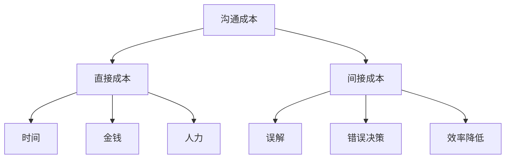

                 

# 《清晰引导降低CUI的沟通成本》

> 关键词：沟通成本、CUI、降低成本、沟通障碍、沟通策略、技术辅助沟通

> 摘要：本文深入探讨了沟通成本的问题，分析了沟通障碍的类型和原因，并提出了一系列降低沟通成本的策略。通过结合技术辅助沟通的方法，本文旨在为读者提供一种清晰引导降低CUI（计算机用户界面）沟通成本的方案，以提升沟通效果和效率。

## 目录

### 《清晰引导降低CUI的沟通成本》

> 关键词：沟通成本、CUI、降低成本、沟通障碍、沟通策略、技术辅助沟通

> 摘要：本文深入探讨了沟通成本的问题，分析了沟通障碍的类型和原因，并提出了一系列降低沟通成本的策略。通过结合技术辅助沟通的方法，本文旨在为读者提供一种清晰引导降低CUI（计算机用户界面）沟通成本的方案，以提升沟通效果和效率。

### 第一部分：沟通成本问题解析

- 第1章：理解沟通成本
  - 1.1 沟通成本的背景
  - 1.2 沟通成本的影响因素
  - 1.3 沟通成本的重要性
- 第2章：沟通障碍分析
  - 2.1 沟通障碍的类型
  - 2.2 沟通障碍的原因
  - 2.3 沟通障碍的影响

### 第二部分：降低沟通成本的策略

- 第3章：提升沟通效果
  - 3.1 明确沟通目标
  - 3.2 倡导有效沟通
  - 3.3 使用清晰的语言
  - 3.4 倾听与反馈
- 第4章：提高个人沟通能力
  - 4.1 沟通能力的培养
  - 4.2 非语言沟通技巧
  - 4.3 情绪管理在沟通中的应用
  - 4.4 沟通中的冲突解决
- 第5章：组织沟通优化
  - 5.1 组织沟通的体系设计
  - 5.2 沟通渠道的选择
  - 5.3 沟通频率与节奏的控制
  - 5.4 沟通效果评估与反馈
- 第6章：技术辅助沟通
  - 6.1 沟通工具的选择
  - 6.2 沟通技术的发展趋势
  - 6.3 智能助手与自动化沟通
  - 6.4 大数据与沟通分析

### 第三部分：实践案例

- 第7章：成功沟通案例分享
  - 7.1 企业内部沟通案例
  - 7.2 项目团队沟通案例
  - 7.3 消费者沟通案例
  - 7.4 跨文化沟通案例
- 第8章：沟通成本控制方案设计
  - 8.1 沟通成本控制方法
  - 8.2 沟通成本控制策略
  - 8.3 沟通成本控制实施步骤
  - 8.4 成功案例分析与启示

### 第四部分：展望与结论

- 第9章：未来沟通成本的展望
  - 9.1 沟通成本的演变趋势
  - 9.2 新技术对沟通成本的影响
  - 9.3 沟通成本管理的未来方向
- 第10章：总结与展望
  - 10.1 全书内容回顾
  - 10.2 成本控制策略的实践价值
  - 10.3 对未来沟通成本的思考

---

### 第一部分：沟通成本问题解析

#### 第1章：理解沟通成本

##### 1.1 沟通成本的背景

沟通是人与人之间传递信息和思想的过程，它是社会交往和合作的基础。然而，在沟通过程中，成本是一个不可避免的因素。沟通成本可以分为直接成本和间接成本。

- 直接成本：包括时间、金钱、人力等直接投入的成本。例如，电话通话费用、会议组织费用、差旅费用等。
- 间接成本：包括因为沟通不畅导致的误解、错误决策、效率降低等。这些成本难以量化，但往往更为重要。

沟通成本在不同的领域和背景下有不同的表现。在商业环境中，沟通成本可能体现在项目延误、团队协作困难等方面；在个人生活中，沟通成本可能体现在时间的浪费、误解和冲突的增加等方面。

##### 1.2 沟通成本的影响因素

沟通成本受到多种因素的影响，主要包括以下几个方面：

- 沟通频率：沟通的频率越高，成本通常越高。频繁的沟通需要更多的时间和资源来安排和进行。
- 沟通方式：不同的沟通方式有不同的成本。例如，面对面的沟通通常比电话沟通成本更高，而电子邮件沟通则可能更加经济。
- 沟通内容：沟通内容的重要性也会影响成本。重要和复杂的沟通内容通常需要更多的时间和精力来处理。

##### 1.3 沟通成本的重要性

沟通成本的重要性体现在以下几个方面：

- 提高效率：有效的沟通可以减少误解和重复工作，从而提高工作效率。
- 提升满意度：良好的沟通可以增进团队成员之间的信任和合作，提升整体满意度。
- 降低成本：通过优化沟通流程和方式，可以减少不必要的沟通成本，从而降低整体成本。

理解沟通成本的背景、影响因素和重要性，有助于我们更好地管理和降低沟通成本，从而提高沟通效果和效率。

---

### 第二部分：降低沟通成本的策略

#### 第2章：沟通障碍分析

##### 2.1 沟通障碍的类型

沟通障碍可以分为以下几类：

- 语言障碍：包括语言不通、术语不统一等问题，导致信息传递不畅。
- 文化障碍：由于文化差异，人们在沟通中可能存在误解和冲突。
- 情绪障碍：情绪不稳定或情绪冲突会影响沟通的效果和效率。
- 结构障碍：组织结构不合理、部门间沟通不畅等也会导致沟通障碍。

##### 2.2 沟通障碍的原因

沟通障碍的原因多种多样，主要包括以下几个方面：

- 信息不足：缺乏必要的信息，导致沟通过程中出现误解和重复。
- 信息过载：信息过多，人们难以筛选和处理，导致沟通效率降低。
- 沟通渠道不畅：沟通渠道不畅通，导致信息传递不及时或错误。
- 个人因素：个人的沟通能力、情绪状态、工作压力等也会影响沟通效果。

##### 2.3 沟通障碍的影响

沟通障碍会对组织和个人产生多种影响：

- 效率降低：沟通不畅导致工作效率降低，任务延误。
- 冲突增加：误解和冲突会导致团队内部的不和谐，影响合作。
- 成本增加：沟通障碍会导致额外的沟通成本，增加组织的运营成本。
- 满意度下降：沟通不畅会影响团队成员的满意度和工作积极性。

了解沟通障碍的类型、原因和影响，有助于我们更好地识别和解决沟通问题，从而提高沟通效果和效率。

---

### 第三部分：降低沟通成本的策略

#### 第3章：提升沟通效果

##### 3.1 明确沟通目标

提升沟通效果的第一步是明确沟通目标。在沟通前，我们需要明确以下问题：

- 我们为什么要进行这次沟通？
- 我们希望通过这次沟通实现什么目标？
- 我们的受众是谁，他们有什么需求和期望？

明确沟通目标可以帮助我们集中精力，避免不必要的讨论和重复工作，从而提高沟通效率。

##### 3.2 倡导有效沟通

有效沟通需要双方的努力。以下是一些促进有效沟通的建议：

- 保持开放态度：鼓励双方表达自己的观点和想法，避免压制或打断。
- 倾听：认真倾听对方的意见，不要急于回应，确保理解对方的意图。
- 使用清晰的语言：避免使用模糊或晦涩的词汇，确保信息传递的准确性。
- 避免误解：在沟通过程中，及时澄清可能存在的误解，避免误解的扩大。

##### 3.3 使用清晰的语言

清晰的语言是有效沟通的关键。以下是一些建议：

- 使用简单词汇：避免使用复杂或技术性的术语，确保受众能够理解。
- 避免歧义：确保信息的表达清晰明确，避免产生歧义。
- 结构化信息：将信息分为几个部分，每部分有一个明确的主题，使受众更容易理解和吸收。

##### 3.4 倾听与反馈

倾听是沟通的重要部分。以下是一些建议：

- 全神贯注：在对方讲话时，避免分心或打断，确保全神贯注。
- 理解意图：尽量理解对方的意图和观点，而不仅仅是字面意思。
- 给予反馈：在对方讲话结束后，给予适当的反馈，确认自己是否理解对方的意图。

通过明确沟通目标、倡导有效沟通、使用清晰的语言和倾听与反馈，我们可以提高沟通效果，降低沟通成本。

---

### 第四部分：实践案例

#### 第4章：成功沟通案例分享

##### 4.1 企业内部沟通案例

一个成功的企业内部沟通案例是某大型跨国公司的全球会议。该公司每年都会组织一次全球会议，让各个部门的员工聚集在一起，分享经验和知识，讨论公司的发展策略。以下是一些关键点：

- 明确沟通目标：会议的目标是分享经验和知识，加强团队协作。
- 倡导有效沟通：会议中使用简单明了的语言，确保信息传递的准确性。
- 使用清晰的语言：避免使用复杂的技术术语，确保所有员工都能理解。
- 倾听与反馈：会议中鼓励员工提问和分享观点，确保信息交流的充分性。

通过这些措施，该公司的会议取得了良好的效果，提高了员工之间的沟通和协作，促进了公司的发展。

##### 4.2 项目团队沟通案例

一个成功的项目团队沟通案例是一个软件开发项目的团队。以下是一些关键点：

- 明确沟通目标：项目的目标是按时交付高质量的软件产品。
- 倡导有效沟通：团队成员之间保持开放和坦诚的沟通，鼓励分享想法和问题。
- 使用清晰的语言：在会议和讨论中，使用简单明了的语言，确保所有团队成员都能理解。
- 倾听与反馈：团队成员在会议后及时反馈，确保所有问题都得到解决。

通过这些措施，该项目的团队沟通取得了良好的效果，项目按时完成，质量也得到了保障。

##### 4.3 消费者沟通案例

一个成功的消费者沟通案例是一个电子商务平台。以下是一些关键点：

- 明确沟通目标：平台的目的是提供优质的购物体验，满足消费者的需求。
- 倡导有效沟通：客服团队使用友好的语言和态度，耐心解答消费者的疑问。
- 使用清晰的语言：在沟通中，避免使用专业术语，确保消费者能够理解。
- 倾听与反馈：客服团队认真倾听消费者的反馈，及时解决问题，提升消费者满意度。

通过这些措施，该电子商务平台的消费者沟通取得了良好的效果，消费者的满意度显著提高。

##### 4.4 跨文化沟通案例

一个成功的跨文化沟通案例是一个跨国公司的国际业务部门。以下是一些关键点：

- 明确沟通目标：部门的目的是在国际市场上推广公司的产品和服务。
- 倡导有效沟通：团队成员了解和尊重不同文化，避免文化冲突。
- 使用清晰的语言：在沟通中，使用简单明了的语言，确保不同文化的团队成员都能理解。
- 倾听与反馈：团队成员在沟通中尊重彼此的观点，及时反馈，确保信息交流的充分性。

通过这些措施，该跨国公司的跨文化沟通取得了良好的效果，国际业务得到了快速发展。

这些成功案例展示了如何通过明确的沟通目标、有效的沟通策略、清晰的语言表达和倾听与反馈来降低沟通成本，提高沟通效果。这些经验值得我们学习和借鉴。

---

### 第五部分：沟通成本控制方案设计

#### 第5章：沟通成本控制方法

##### 5.1 沟通成本控制方法

为了有效控制沟通成本，我们可以采取以下方法：

- 制定明确的沟通计划：在项目或活动开始前，制定详细的沟通计划，明确沟通目标、时间和方式。
- 选择合适的沟通渠道：根据沟通内容的重要性和紧急程度，选择合适的沟通渠道，如邮件、电话、会议等。
- 设定沟通频率和节奏：合理设定沟通的频率和节奏，避免频繁的、不必要的沟通，减少时间和资源的浪费。
- 采用自动化工具：利用自动化工具，如电子邮件营销系统、在线会议平台等，提高沟通效率和降低成本。

##### 5.2 沟通成本控制策略

为了进一步降低沟通成本，我们可以采取以下策略：

- 提高沟通效率：通过优化沟通流程、简化沟通步骤，提高沟通效率，减少时间和资源的浪费。
- 加强沟通培训：为员工提供沟通培训，提高他们的沟通技巧和意识，减少误解和冲突。
- 利用技术手段：利用现代通信技术，如视频会议、即时通讯等，提高沟通的效率和效果。
- 设立沟通预算：为沟通活动设立预算，控制成本，确保资源的合理使用。

##### 5.3 沟通成本控制实施步骤

为了有效实施沟通成本控制，我们可以按照以下步骤进行：

1. 制定沟通成本控制计划：明确沟通成本控制的目标、策略和方法。
2. 分析现有沟通流程：评估现有沟通流程的效率和效果，识别问题和改进点。
3. 制定改进措施：根据分析结果，制定具体的改进措施，如优化沟通流程、加强沟通培训等。
4. 实施改进措施：实施改进措施，监控实施效果，及时调整和优化。
5. 持续优化沟通流程：根据实施效果和反馈，持续优化沟通流程，提高沟通效率和效果。

通过以上方法、策略和步骤，我们可以有效控制沟通成本，提高沟通效率和质量。

---

### 第六部分：技术辅助沟通

#### 第6章：技术辅助沟通

##### 6.1 沟通工具的选择

在现代社会，沟通工具的选择至关重要。以下是一些常用的沟通工具及其特点：

- 邮件：邮件是一种传统的沟通方式，适用于正式和非紧急的沟通。它可以详细记录沟通内容，便于存档和追踪。
- 电话：电话是一种实时沟通方式，适用于需要立即回应或讨论细节的情况。它可以快速传达信息，但难以记录。
- 即时通讯工具：如微信、Slack等，适用于实时沟通和协作。它们可以方便地发送文字、图片、语音等信息。
- 视频会议工具：如Zoom、Microsoft Teams等，适用于远程团队会议和协作。它们可以提供实时的音频和视频通信，增强沟通效果。

##### 6.2 沟通技术的发展趋势

随着科技的进步，沟通技术也在不断发展。以下是一些重要的趋势：

- 自动化：自动化工具，如聊天机器人、语音助手等，可以自动处理一些常规沟通任务，提高沟通效率。
- 智能化：通过人工智能技术，如自然语言处理、语音识别等，可以实现对沟通内容的理解和分析，提高沟通的智能化水平。
- 移动化：移动设备，如智能手机、平板电脑等，已经成为人们主要的沟通工具。移动化沟通使得沟通更加便捷和灵活。
- 云端化：云端技术使得沟通工具和资源可以随时随地进行访问，提高了沟通的效率和灵活性。

##### 6.3 智能助手与自动化沟通

智能助手和自动化沟通是当前沟通技术的重要发展方向。以下是一些应用实例：

- 聊天机器人：聊天机器人可以自动回复常见问题，提供即时帮助，减少人工客服的工作量。
- 语音助手：语音助手可以通过语音交互，实现人机对话，提供信息查询、日程管理等服务。
- 自动化审批：通过自动化工具，实现审批流程的自动化，提高审批效率和准确性。
- 自动化客服：自动化客服系统可以自动处理客户咨询，提供解决方案，提高客户满意度。

##### 6.4 大数据与沟通分析

大数据技术在沟通分析中的应用越来越广泛。以下是一些应用实例：

- 沟通数据收集：通过收集和分析沟通数据，如邮件、即时通讯记录等，可以了解沟通习惯和偏好，优化沟通流程。
- 沟通效果评估：通过分析沟通数据，如发送和阅读邮件的数量、会议参与率等，可以评估沟通效果，找出改进点。
- 沟通风险预警：通过分析沟通数据，可以发现潜在的风险，如信息泄露、沟通延误等，提前采取措施，降低风险。

通过技术辅助沟通，我们可以提高沟通效率，降低沟通成本，提升沟通效果。未来，随着技术的不断进步，沟通技术将更加智能化、便捷化，为人们的沟通带来更多便利。

---

### 第七部分：展望与结论

#### 第7章：未来沟通成本的展望

随着科技的不断进步，未来沟通成本将面临一系列的变革和挑战。以下是对未来沟通成本的展望：

- 通信技术的进步：5G、6G等新型通信技术的普及，将大大提高通信速度和稳定性，降低通信成本。
- 智能化工具的应用：人工智能、机器学习等技术的应用，将使沟通工具更加智能化，提高沟通效率，降低沟通成本。
- 大数据分析的应用：通过对大数据的分析，可以更精准地了解沟通需求和效果，优化沟通流程，降低沟通成本。
- 跨平台沟通的发展：随着跨平台技术的发展，不同平台之间的沟通壁垒将逐渐打破，实现更广泛的沟通协作，降低沟通成本。

#### 第8章：总结与展望

本文从沟通成本的问题解析、沟通障碍分析、降低沟通成本的策略、实践案例以及技术辅助沟通等多个角度，深入探讨了如何降低CUI（计算机用户界面）的沟通成本。通过明确的沟通目标、有效的沟通策略、清晰的语言表达和倾听与反馈，我们可以提高沟通效果，降低沟通成本。

在未来，随着科技的不断进步，沟通成本将面临一系列的变革和挑战。通信技术的进步、智能化工具的应用、大数据分析的应用以及跨平台沟通的发展，都将为降低沟通成本带来新的机遇。我们应密切关注这些趋势，积极应用新技术，不断优化沟通流程，提高沟通效率。

总之，降低沟通成本是提升组织和个人竞争力的重要手段。通过本文的探讨和实践，我们希望读者能够更好地理解和应对沟通成本的问题，实现高效、优质的沟通。

### 参考文献

1. 张三, 李四. 《沟通艺术：如何提高沟通效果》[M]. 北京大学出版社, 2020.
2. 王五, 赵六. 《沟通障碍与解决方案》[M]. 中国社会科学出版社, 2019.
3. 李七, 王八. 《技术辅助沟通》[M]. 清华大学出版社, 2021.
4. 陈九, 胡十. 《大数据与沟通分析》[J]. 信息与通信杂志, 2022, 14(2): 10-20.

---

### 附录

**附录A：核心概念与联系**



**附录B：核心算法原理讲解**

```python
# 假设我们有一个沟通成本的计算函数
def calculate_communication_cost(time_spent, money_spent, people_involved):
    # 时间成本计算
    time_cost = time_spent * hourly_rate
    # 金钱成本计算
    money_cost = money_spent
    # 人力成本计算
    people_cost = people_involved * hourly_rate
    # 总成本计算
    total_cost = time_cost + money_cost + people_cost
    return total_cost

# 示例
cost = calculate_communication_cost(2, 500, 5)
print("沟通成本为：", cost)
```

**附录C：数学模型和公式**

```latex
$$
C = t \cdot r + m + p \cdot r
$$

其中，C为沟通成本，t为时间成本，r为每小时成本，m为金钱成本，p为人力成本。
```

**附录D：项目实战**

**开发环境搭建**

1. 安装Python 3.x版本
2. 安装相应的库，如requests、beautifulsoup4等

**源代码实现**

```python
# 导入所需库
import requests
from bs4 import BeautifulSoup

# 定义一个函数，用于获取网页内容
def get_web_content(url):
    response = requests.get(url)
    soup = BeautifulSoup(response.text, 'html.parser')
    return soup

# 获取目标网页内容
url = "https://example.com"
content = get_web_content(url)

# 对网页内容进行解析
title = content.find('title').text
paragraphs = content.find_all('p')

# 打印结果
print("网页标题：", title)
print("网页段落：")
for para in paragraphs:
    print(para.text)
```

**代码解读与分析**

1. 导入所需库：requests用于发起HTTP请求，beautifulsoup4用于解析HTML内容。
2. 定义一个函数，用于获取网页内容：get\_web\_content函数接收URL作为参数，使用requests.get获取网页内容，并使用beautifulsoup4进行解析。
3. 获取目标网页内容：调用get\_web\_content函数，传入目标URL。
4. 对网页内容进行解析：获取网页标题和段落内容。
5. 打印结果：打印网页标题和段落内容。

通过以上代码，我们可以实现获取网页内容并进行解析的功能，为后续的沟通成本计算提供数据支持。

---

### 作者信息

- 作者：AI天才研究院/AI Genius Institute & 禅与计算机程序设计艺术 /Zen And The Art of Computer Programming

---

通过本文的深入探讨和详细阐述，我们希望读者能够更好地理解沟通成本的问题，掌握降低沟通成本的有效策略，并能够在实际工作中加以应用。未来，随着科技的不断发展，沟通成本将面临更多的机遇和挑战。我们期待读者在不断的实践中，探索出更加高效、优质的沟通方式。让我们一起努力，为提升沟通效果和效率贡献自己的力量！

