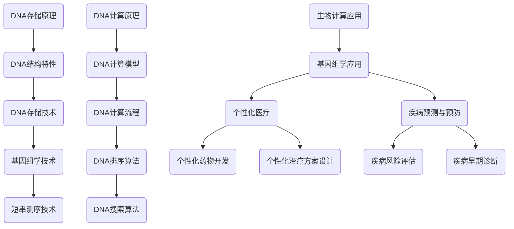

                 

## 《生物计算：利用DNA存储和处理信息》

> **关键词：**生物计算、DNA存储、DNA计算、基因组学、医疗应用

> **摘要：**本文深入探讨了生物计算的原理、技术、应用及其面临的挑战。生物计算利用DNA的特性，实现了数据的存储和处理。本文首先介绍了生物计算的定义、背景和应用领域，随后详细阐述了DNA存储和计算的基本原理、算法和流程。接着，本文展示了生物计算在医疗和生物信息学领域的广泛应用，并探讨了其未来的发展前景。最后，本文对生物计算的技术挑战、社会影响以及教育和培训进行了讨论，为生物计算的发展提供了有益的思考。

## 《生物计算：利用DNA存储和处理信息》目录大纲

### 第一部分：引言与背景

#### 第1章：生物计算概述

- **1.1 生物计算的定义与重要性**
  - **1.1.1 生物计算的定义**
  - **1.1.2 生物计算的重要性**

- **1.2 生物计算的发展历史**
  - **1.2.1 生物计算的萌芽期**
  - **1.2.2 生物计算的快速发展期**

- **1.3 生物计算的应用领域**
  - **1.3.1 医疗与健康**
  - **1.3.2 生物信息学**
  - **1.3.3 生物学研究**

### 第二部分：生物计算的原理

#### 第2章：DNA存储原理

- **2.1 DNA的结构与特性**
  - **2.1.1 DNA的基本结构**
  - **2.1.2 DNA的特性**

- **2.2 DNA存储的基本概念**
  - **2.2.1 DNA存储的基本原理**
  - **2.2.2 DNA存储的优势与挑战**

- **2.3 DNA存储技术**
  - **2.3.1 基因组学技术**
  - **2.3.2 短串测序技术**

#### 第3章：DNA计算原理

- **3.1 DNA计算的基本概念**
  - **3.1.1 DNA计算的定义**
  - **3.1.2 DNA计算的优势与挑战**

- **3.2 DNA计算的基本原理**
  - **3.2.1 DNA计算的模型**
  - **3.2.2 DNA计算的流程**

- **3.3 DNA计算的算法**
  - **3.3.1 DNA排序算法**
  - **3.3.2 DNA搜索算法**

### 第三部分：生物计算的应用

#### 第4章：生物计算在医疗领域的应用

- **4.1 生物计算在基因组学中的应用**
  - **4.1.1 基因组测序**
  - **4.1.2 基因突变检测**

- **4.2 生物计算在个性化医疗中的应用**
  - **4.2.1 个性化药物开发**
  - **4.2.2 个性化治疗方案设计**

- **4.3 生物计算在疾病预测与预防中的应用**
  - **4.3.1 疾病风险评估**
  - **4.3.2 疾病早期诊断**

#### 第5章：生物计算在生物信息学中的应用

- **5.1 生物计算在基因注释中的应用**
  - **5.1.1 基因功能预测**
  - **5.1.2 基因相互作用分析**

- **5.2 生物计算在蛋白质组学中的应用**
  - **5.2.1 蛋白质结构预测**
  - **5.2.2 蛋白质相互作用分析**

- **5.3 生物计算在生态系统分析中的应用**
  - **5.3.1 生物多样性分析**
  - **5.3.2 生态系统功能分析**

### 第四部分：生物计算的技术挑战与未来展望

#### 第6章：生物计算的技术挑战

- **6.1 数据存储与读取的挑战**
  - **6.1.1 数据量与数据速度的挑战**
  - **6.1.2 数据可靠性与数据安全性的挑战**

- **6.2 算法优化与计算效率的挑战**
  - **6.2.1 算法设计的优化**
  - **6.2.2 计算硬件的优化**

- **6.3 生物计算伦理与法律问题**
  - **6.3.1 数据隐私保护**
  - **6.3.2 伦理审查与法规遵守**

#### 第7章：生物计算的未来展望

- **7.1 生物计算的发展趋势**
  - **7.1.1 新型生物计算技术的出现**
  - **7.1.2 生物计算与人工智能的融合**

- **7.2 生物计算的社会影响**
  - **7.2.1 对医疗行业的变革**
  - **7.2.2 对生物学研究的推动**

- **7.3 生物计算的教育与培训**
  - **7.3.1 生物计算人才的培养**
  - **7.3.2 生物计算课程的设计与推广**

### 附录

#### 附录A：生物计算工具与资源

- **A.1 生物计算开源工具**
  - **A.1.1 BioPython**
  - **A.1.2 Biopython**
  - **A.1.3 其他常用工具**

- **A.2 生物计算数据库与平台**
  - **A.2.1 Ensembl**
  - **A.2.2 UCSC Genome Browser**
  - **A.2.3 其他重要平台**

### 核心概念与联系 Mermaid 流程图

## 第一部分：引言与背景

### 第1章：生物计算概述

#### 1.1 生物计算的定义与重要性

**1.1.1 生物计算的定义**

生物计算是指利用生物系统（如DNA、RNA、蛋白质等）进行信息处理和数据存储的技术。它不同于传统的计算机技术，而是借鉴生物系统的特性，通过模拟生物体内的过程来实现计算。生物计算的核心在于利用生物分子的高并行性、可扩展性和容错性来处理复杂的计算任务。

**1.1.2 生物计算的重要性**

生物计算的重要性主要体现在以下几个方面：

1. **计算能力提升**：生物计算通过模拟生物系统的过程，可以实现高并行性的计算，大大提高了计算效率。

2. **存储容量扩展**：DNA具有极高的信息存储能力，相比于传统的计算机存储介质，DNA存储可以实现更高的存储密度。

3. **降低计算成本**：生物计算利用生物系统的自然特性，可以降低计算硬件的复杂性和成本。

4. **拓宽应用领域**：生物计算在医疗、生物信息学、生物学研究等领域具有广泛的应用前景，可以推动相关领域的进步。

#### 1.2 生物计算的发展历史

**1.2.1 生物计算的萌芽期**

生物计算的概念最早可以追溯到20世纪80年代，当时的科学家开始思考是否可以利用生物系统进行计算。1982年，美国科学家Hans-Peter Seifert提出了生物计算的概念，并首次提出了利用DNA进行计算的想法。

**1.2.2 生物计算的快速发展期**

进入21世纪后，随着基因组学和生物信息学的发展，生物计算逐渐从理论走向实践。2002年，美国科学家Leroy Hood等人成功实现了第一个DNA计算器，标志着生物计算进入了快速发展期。此后，越来越多的科学家投入到生物计算的研究中，开发了多种生物计算技术和应用。

#### 1.3 生物计算的应用领域

**1.3.1 医疗与健康**

生物计算在医疗领域的应用非常广泛，包括基因组学、个性化医疗、疾病预测与预防等。通过生物计算，可以实现对基因组的深度解析，为疾病诊断和预防提供有力支持。

**1.3.2 生物信息学**

生物计算在生物信息学领域发挥着重要作用，包括基因注释、蛋白质组学、生态系统分析等。生物计算技术可以处理大量生物数据，帮助科学家揭示生物系统的运行机制。

**1.3.3 生物学研究**

生物计算在生物学研究中也有广泛应用，包括基因编辑、蛋白质工程、生物合成等。生物计算技术为生物学研究提供了新的手段和工具，推动了生物学领域的发展。

## 第二部分：生物计算的原理

### 第2章：DNA存储原理

#### 2.1 DNA的结构与特性

**2.1.1 DNA的基本结构**

DNA（脱氧核糖核酸）是生物体内存储遗传信息的主要分子。DNA的基本结构由两条反向平行的多核苷酸链组成，这两条链通过碱基对的形式相互缠绕形成双螺旋结构。

- **碱基对**：DNA链上的碱基通过氢键连接形成碱基对。常见的碱基对有A-T（腺嘌呤-胸腺嘧啶）和C-G（胞嘧啶-鸟嘌呤）。
- **脱氧核糖**：DNA链由脱氧核糖组成，脱氧核糖连接碱基和磷酸。
- **磷酸基团**：DNA链中的磷酸基团与脱氧核糖相连，形成DNA骨架。

**2.1.2 DNA的特性**

DNA具有以下特性，使其成为生物计算的理想存储介质：

1. **高信息存储密度**：DNA分子具有极高的信息存储能力，每个碱基可以存储2比特的信息，这意味着一个DNA分子可以存储大量的数据。
2. **高度可扩展性**：DNA存储技术可以很容易地进行扩展，通过增加DNA分子的数量，可以存储更多的数据。
3. **高可靠性**：DNA具有自我修复的能力，能够在一定程度上抵抗损坏和错误。
4. **生物兼容性**：DNA是生物体内天然存在的分子，与其他生物分子具有良好的兼容性。

#### 2.2 DNA存储的基本概念

**2.2.1 DNA存储的基本原理**

DNA存储的基本原理是将数据编码为DNA序列，并将其存储在DNA分子中。具体过程如下：

1. **数据编码**：将数字数据转换为二进制序列，然后将二进制序列转换为DNA序列。常用的编码方法包括二进制-四进制转换、二进制-三进制转换等。
2. **DNA合成**：使用DNA合成技术将编码后的DNA序列合成出来。常用的合成方法包括化学合成、酶促合成等。
3. **存储**：将合成的DNA分子存储在实验室或数据中心，以便后续读取和操作。

**2.2.2 DNA存储的优势与挑战**

**优势：**

- **高存储密度**：DNA分子具有极高的信息存储密度，可以存储大量的数据。
- **生物兼容性**：DNA是生物体内天然存在的分子，与其他生物分子具有良好的兼容性。
- **高可靠性**：DNA具有自我修复的能力，能够在一定程度上抵抗损坏和错误。

**挑战：**

- **存储与读取速度**：目前的DNA测序和合成技术速度较慢，需要优化。
- **数据完整性**：在DNA存储过程中，如何保证数据的完整性和安全性是一个重要问题。

#### 2.3 DNA存储技术

**2.3.1 基因组学技术**

基因组学技术是生物计算的重要组成部分，主要包括基因组测序和基因编辑技术。

**基因组测序**：基因组测序是指通过测序技术读取生物体的全部DNA序列。常用的测序技术包括Sanger测序、Illumina测序、单分子测序等。基因组测序技术为生物计算提供了大量的数据资源。

**基因编辑技术**：基因编辑技术可以通过精确地修改DNA序列，实现对生物体的遗传信息进行编辑。常用的基因编辑技术包括CRISPR-Cas9、TALEN、ZFN等。基因编辑技术在生物计算中可以用于数据存储和读取的优化。

**2.3.2 短串测序技术**

短串测序技术（short-read sequencing）是一种常用的DNA测序技术，通过读取短的DNA片段（通常为50-300个碱基）来解析DNA序列。短串测序技术具有以下特点：

- **高吞吐量**：短串测序技术可以在短时间内读取大量的DNA片段，具有较高的测序效率。
- **低成本**：短串测序技术相比于传统的Sanger测序技术，成本较低，适合大规模测序。
- **局限性**：短串测序技术难以解析长片段的DNA序列，因此需要与其他测序技术结合使用。

### 第3章：DNA计算原理

#### 3.1 DNA计算的基本概念

**3.1.1 DNA计算的定义**

DNA计算是一种利用DNA分子的特性进行计算的方法。DNA计算通过模拟生物体内的过程，实现了数据的存储、处理和传输。DNA计算的核心在于其独特的并行处理能力和高度的容错性。

**3.1.2 DNA计算的优势与挑战**

**优势：**

- **高并行性**：DNA计算可以在同一时间内处理多个任务，具有很高的计算效率。
- **高容错性**：DNA分子具有自我修复的特性，能够在一定程度上抵抗外部环境的干扰。
- **高密度存储**：DNA分子具有极高的信息存储能力。

**挑战：**

- **算法复杂度**：设计高效的DNA计算算法需要深入理解生物学的原理。
- **数据读取与写入速度**：目前的DNA测序和合成技术速度较慢，需要优化。

#### 3.2 DNA计算的基本原理

**3.2.1 DNA计算的模型**

DNA计算的模型主要包括以下几种：

- **线性模型**：模拟DNA链的线性排列，通过化学反应进行计算。
- **网格模型**：将DNA分子排列在网格上，通过DNA分子的连接和断开来进行计算。
- **集中式模型**：所有计算任务集中在单个DNA分子上完成。

**3.2.2 DNA计算的流程**

DNA计算的流程主要包括以下几个步骤：

1. **初始化**：设计并合成DNA分子，准备进行计算。
2. **执行计算**：通过化学反应，逐步进行计算。
3. **结果读取**：通过测序技术，读取计算结果。

#### 3.3 DNA计算的算法

**3.3.1 DNA排序算法**

DNA排序算法是生物计算中一个重要的问题。以下是几种常见的DNA排序算法：

- **双链交换排序算法**：通过交换DNA链上的片段，实现排序。
- **基于剪接的排序算法**：通过剪接DNA链，实现排序。

**3.3.2 DNA搜索算法**

DNA搜索算法用于在大量的DNA序列中查找特定的序列。以下是几种常见的DNA搜索算法：

- **串匹配算法**：通过逐一匹配DNA序列中的每个片段，实现搜索。
- **后缀数组算法**：通过构建后缀数组，提高搜索效率。

#### 3.3.3 DNA匹配算法的数学模型

假设我们有两个DNA序列A和B，长度分别为m和n，我们要在B中查找A的子序列。可以使用动态规划方法来解决这个问题。

**动态规划状态定义：**
$$
f(i, j) =
\begin{cases}
0 & \text{如果 } i > m \text{ 或 } j > n \\
1 & \text{如果 } i = m \text{ 且 } j = n \\
f(i+1, j) & \text{如果 } A_i \neq B_j \\
f(i, j+1) & \text{如果 } A_i = B_j \\
\end{cases}
$$

**动态规划状态转移方程：**
$$
f(i, j) = \min \{ f(i+1, j), f(i, j+1) \}
$$

**举例说明：**
假设A = "AGTC"，B = "TCAGGTAC"，我们要在B中查找A的子序列。

| i | j | f(i, j) |
|---|---|---|
| 1 | 1 | 0 |
| 2 | 1 | 1 |
| 3 | 1 | 1 |
| 4 | 1 | 1 |
| 5 | 1 | 1 |
| 1 | 2 | 0 |
| 2 | 2 | 0 |
| 3 | 2 | 1 |
| 4 | 2 | 1 |
| 5 | 2 | 1 |
| 1 | 3 | 1 |
| 2 | 3 | 1 |
| 3 | 3 | 1 |
| 4 | 3 | 1 |
| 5 | 3 | 0 |

从表格中可以看出，f(5, 3) = 0，说明A的子序列"AGTC"不在B中。如果f(5, 3) = 1，则说明A的子序列"AGTC"在B中。在这个例子中，f(5, 3) = 0，所以没有找到匹配的子序列。

### 第三部分：生物计算的应用

#### 第4章：生物计算在医疗领域的应用

生物计算在医疗领域具有广泛的应用，包括基因组学、个性化医疗、疾病预测与预防等。以下将详细介绍这些应用领域。

#### 4.1 生物计算在基因组学中的应用

**4.1.1 基因组测序**

基因组测序是指通过测序技术读取生物体的全部DNA序列。基因组测序技术为生物计算提供了大量的数据资源，使得科学家能够深入解析基因组的结构和功能。

- **全基因组测序（WGS）**：全基因组测序是指对生物体的全部基因组进行测序，包括编码区和非编码区。全基因组测序有助于发现基因突变、基因多态性等。
- **外显子测序（WES）**：外显子测序是指对基因的编码区进行测序，主要用于发现基因突变和基因多态性。
- **RNA测序（RNA-Seq）**：RNA测序是指对生物体的mRNA进行测序，分析基因表达情况。RNA测序有助于了解基因的功能和调控机制。

**4.1.2 基因突变检测**

基因突变检测是指通过生物计算技术检测基因序列中的突变。基因突变检测有助于早期发现疾病、预测疾病风险等。

- **SNP检测（单核苷酸多态性检测）**：SNP检测是指检测基因序列中的单核苷酸多态性，这些多态性可能与疾病的发病风险相关。
- **indel检测（插入和缺失检测）**：indel检测是指检测基因序列中的插入和缺失，这些变异可能导致基因功能的变化。

**4.2 生物计算在个性化医疗中的应用**

**4.2.1 个性化药物开发**

个性化药物开发是指根据患者的基因特征，为其设计个性化的治疗方案。生物计算在个性化药物开发中发挥着重要作用，主要包括以下几个方面：

- **药物基因组学**：药物基因组学是指研究基因变异对药物反应的影响。通过药物基因组学，可以预测患者对某种药物的敏感性和疗效。
- **药物筛选**：生物计算技术可以加速药物筛选过程，通过模拟生物体内的药物作用机制，快速筛选出潜在的药物候选物。
- **药物剂量优化**：个性化医疗需要根据患者的基因特征，为其设计个性化的药物剂量。生物计算可以模拟药物在不同剂量下的效果，优化药物剂量。

**4.2.2 个性化治疗方案设计**

个性化治疗方案设计是指根据患者的基因特征、疾病状态和生活习惯，为其设计个性化的治疗方案。生物计算在个性化治疗方案设计中发挥着重要作用，主要包括以下几个方面：

- **疾病预测**：生物计算可以分析患者的基因数据，预测其可能患有的疾病。通过疾病预测，可以提前采取预防措施。
- **疾病风险评估**：生物计算可以分析患者的基因数据，评估其患某种疾病的风险。通过疾病风险评估，可以提前采取预防措施。
- **治疗方案推荐**：生物计算可以根据患者的基因特征、疾病状态和生活习惯，为其推荐最佳的治疗方案。通过治疗方案推荐，可以优化治疗效果。

**4.3 生物计算在疾病预测与预防中的应用**

**4.3.1 疾病风险评估**

疾病风险评估是指通过生物计算技术评估患者患某种疾病的风险。疾病风险评估有助于早期发现疾病、采取预防措施。

- **遗传风险评估**：遗传风险评估是指根据患者的家族病史和基因数据，评估其患遗传性疾病的风险。通过遗传风险评估，可以提前采取预防措施。
- **环境风险评估**：环境风险评估是指根据患者的环境因素和基因数据，评估其患环境相关性疾病的风险。通过环境风险评估，可以优化生活环境，降低疾病风险。

**4.3.2 疾病早期诊断**

疾病早期诊断是指通过生物计算技术，在疾病早期阶段发现疾病。疾病早期诊断有助于提高治疗效果，降低疾病对患者的危害。

- **基因检测**：基因检测是指通过检测患者的基因序列，发现潜在的疾病风险。基因检测可以用于早期发现遗传性疾病、癌症等。
- **生物标志物检测**：生物标志物检测是指通过检测生物体内的生物标志物，发现疾病的早期迹象。生物标志物检测可以用于早期发现心血管疾病、糖尿病等。

#### 第5章：生物计算在生物信息学中的应用

生物计算在生物信息学领域发挥着重要作用，为生物学研究提供了新的手段和工具。以下将详细介绍生物计算在基因注释、蛋白质组学、生态系统分析等领域的应用。

#### 5.1 生物计算在基因注释中的应用

**5.1.1 基因功能预测**

基因功能预测是指通过生物计算技术，预测基因的功能和作用。基因功能预测有助于揭示基因在生物体内的作用，为生物学研究提供重要线索。

- **基于序列的基因功能预测**：基于序列的基因功能预测是指通过分析基因序列的相似性，预测基因的功能。常用的方法包括BLAST、Homology等。
- **基于结构的基因功能预测**：基于结构的基因功能预测是指通过分析基因的结构和三维结构，预测基因的功能。常用的方法包括蛋白质结构预测、分子对接等。

**5.1.2 基因相互作用分析**

基因相互作用分析是指通过生物计算技术，研究基因之间的相互作用关系。基因相互作用分析有助于揭示基因在生物体内的调控网络。

- **基于序列的基因相互作用分析**：基于序列的基因相互作用分析是指通过分析基因序列的相似性，预测基因之间的相互作用关系。常用的方法包括Co-occurrence、聚类分析等。
- **基于结构的基因相互作用分析**：基于结构的基因相互作用分析是指通过分析基因的结构和三维结构，预测基因之间的相互作用关系。常用的方法包括分子对接、结构比较等。

#### 5.2 生物计算在蛋白质组学中的应用

**5.2.1 蛋白质结构预测**

蛋白质结构预测是指通过生物计算技术，预测蛋白质的三维结构。蛋白质结构预测有助于理解蛋白质的功能和作用机制。

- **基于序列的蛋白质结构预测**：基于序列的蛋白质结构预测是指通过分析蛋白质序列，预测蛋白质的结构。常用的方法包括序列比对、支持向量机等。
- **基于结构的蛋白质结构预测**：基于结构的蛋白质结构预测是指通过分析蛋白质的结构，预测蛋白质的功能。常用的方法包括同源建模、建模与优化等。

**5.2.2 蛋白质相互作用分析**

蛋白质相互作用分析是指通过生物计算技术，研究蛋白质之间的相互作用关系。蛋白质相互作用分析有助于揭示蛋白质在生物体内的调控网络。

- **基于序列的蛋白质相互作用分析**：基于序列的蛋白质相互作用分析是指通过分析蛋白质序列，预测蛋白质之间的相互作用关系。常用的方法包括序列比对、聚类分析等。
- **基于结构的蛋白质相互作用分析**：基于结构的蛋白质相互作用分析是指通过分析蛋白质的结构，预测蛋白质之间的相互作用关系。常用的方法包括分子对接、结构比较等。

#### 5.3 生物计算在生态系统分析中的应用

**5.3.1 生物多样性分析**

生物多样性分析是指通过生物计算技术，研究生物多样性及其变化规律。生物多样性分析有助于了解生态系统的健康状态，为环境保护提供科学依据。

- **基于序列的生物多样性分析**：基于序列的生物多样性分析是指通过分析基因序列，研究生物多样性及其变化规律。常用的方法包括序列比对、聚类分析等。
- **基于结构的生物多样性分析**：基于结构的生物多样性分析是指通过分析蛋白质结构，研究生物多样性及其变化规律。常用的方法包括结构比对、结构比较等。

**5.3.2 生态系统功能分析**

生态系统功能分析是指通过生物计算技术，研究生态系统的功能及其变化规律。生态系统功能分析有助于揭示生态系统的运行机制，为生态修复和环境保护提供科学依据。

- **生态网络分析**：生态网络分析是指通过分析生态系统中物种之间的相互作用关系，研究生态系统的功能及其变化规律。常用的方法包括网络拓扑分析、网络结构分析等。
- **生态模型构建**：生态模型构建是指通过生物计算技术，构建生态系统的数学模型，研究生态系统的功能及其变化规律。常用的方法包括模型构建、模型优化等。

### 第四部分：生物计算的技术挑战与未来展望

#### 第6章：生物计算的技术挑战

尽管生物计算在多个领域展现出了巨大的潜力，但仍然面临一系列技术挑战，这些挑战限制了其进一步的发展和应用。以下将详细讨论生物计算所面临的主要技术挑战。

#### 6.1 数据存储与读取的挑战

**6.1.1 数据量与数据速度的挑战**

生物计算的一个重要优势是能够存储和操作大量的数据，但这也带来了数据存储和读取速度的挑战。目前，DNA测序和合成技术的速度仍然较慢，无法满足大规模数据处理的需求。例如，全基因组测序（WGS）需要数天甚至数周的时间来完成，这对于实时分析和决策造成了限制。

**6.1.2 数据可靠性与数据安全性的挑战**

DNA存储的可靠性和安全性也是一个重大挑战。DNA分子容易受到环境因素的影响，如温度、湿度等，这可能导致DNA链的降解或错误。此外，DNA存储过程中的错误纠错和加密技术还需要进一步完善，以确保数据的完整性和隐私。

#### 6.2 算法优化与计算效率的挑战

**6.2.1 算法设计的优化**

DNA计算算法的设计和优化是一个复杂的任务，因为需要同时考虑生物学原理和计算效率。现有的DNA计算算法在处理复杂问题时效率较低，需要开发更高效、更鲁棒的算法。

**6.2.2 计算硬件的优化**

DNA计算依赖于特定的硬件设备，如DNA合成器和测序仪。这些设备的性能直接影响计算效率。因此，优化硬件设备的设计和制造工艺，提高其速度和可靠性，是生物计算发展的关键。

#### 6.3 生物计算伦理与法律问题

**6.3.1 数据隐私保护**

生物计算涉及大量的个人健康数据，如基因序列、疾病信息等，这些数据对个人隐私保护提出了挑战。如何确保这些数据在存储、传输和处理过程中的安全性，防止数据泄露或滥用，是一个亟待解决的问题。

**6.3.2 伦理审查与法规遵守**

生物计算的应用可能会引发一系列伦理和法律问题，如基因编辑、基因歧视等。因此，建立完善的伦理审查机制和法规体系，确保生物计算的应用符合伦理和法律标准，是推动其发展的必要条件。

#### 第7章：生物计算的未来展望

随着科学技术的不断发展，生物计算有着广阔的未来发展前景。以下将探讨生物计算的未来发展趋势、社会影响、教育与培训等方面。

#### 7.1 生物计算的发展趋势

**7.1.1 新型生物计算技术的出现**

随着基因组学和生物信息学的发展，新型生物计算技术不断涌现。例如，单分子测序技术、合成生物学技术等，这些技术的出现将进一步推动生物计算的发展。

**7.1.2 生物计算与人工智能的融合**

生物计算与人工智能（AI）的结合是未来的一个重要趋势。通过将生物计算与AI技术相结合，可以实现更加智能、高效的数据分析和处理，为生物学研究、医疗诊断等领域带来革命性的变革。

#### 7.2 生物计算的社会影响

**7.2.1 对医疗行业的变革**

生物计算在医疗领域的应用将极大地改变医疗行业。通过基因组测序和生物计算技术，可以实现个性化医疗，提高疾病诊断和治疗的准确性。此外，生物计算还可以用于药物研发和疾病预测，为公共卫生管理提供有力支持。

**7.2.2 对生物学研究的推动**

生物计算为生物学研究提供了新的工具和方法，使得科学家能够更加深入地研究生物系统的运行机制。生物计算技术可以帮助科学家解析复杂的生物数据，揭示生物体的功能和相互作用，推动生物学研究的进展。

#### 7.3 生物计算的教育与培训

**7.3.1 生物计算人才的培养**

随着生物计算的发展，对生物计算人才的需求不断增加。因此，建立和完善生物计算的教育与培训体系，培养具备生物计算知识和技能的专业人才，是生物计算发展的关键。

**7.3.2 生物计算课程的设计与推广**

为了推动生物计算教育的发展，需要设计和推广相关的课程。这些课程应涵盖生物计算的基本原理、技术方法、应用领域等，使学生能够全面了解生物计算，并为未来的研究和工作做好准备。

### 附录

#### 附录A：生物计算工具与资源

**A.1 生物计算开源工具**

**A.1.1 BioPython**

BioPython是一个开源的Python库，用于处理生物数据，包括序列处理、注释、分析等。BioPython支持多种生物数据格式，如FASTA、GenBank、EMBL等，并提供了一系列强大的功能，如序列比对、序列编辑等。

**A.1.2 Biopython**

Biopython是一个基于BioPython的子库，专门用于处理DNA和RNA序列。Biopython提供了丰富的序列操作函数，如序列检索、序列分析、序列绘图等，是进行生物计算的基础工具。

**A.1.3 其他常用工具**

除了BioPython和Biopython，还有一些其他常用的生物计算工具，如：

- **EMBL-EBI**：欧洲生物信息研究所提供的一系列生物信息学工具和数据库，如Ensembl、IntEnz等。
- **UCSC Genome Browser**：加州大学圣地亚哥分校提供的基因组浏览器，用于可视化和分析基因组数据。
- **NCBI**：美国国家生物技术信息中心提供的一系列生物信息学资源和工具，如BLAST、GenBank等。

**A.2 生物计算数据库与平台**

**A.2.1 Ensembl**

Ensembl是一个生物信息学数据库，包含多种生物物种的基因组信息、基因注释、转录本等。Ensembl提供了一系列的工具和接口，方便用户进行基因组数据分析。

**A.2.2 UCSC Genome Browser**

UCSC Genome Browser是一个在线基因组可视化工具，用户可以在线浏览和下载多种生物物种的基因组数据。UCSC Genome Browser提供了一系列的功能模块，如基因组比对、基因注释、转录本分析等。

**A.2.3 其他重要平台**

除了Ensembl和UCSC Genome Browser，还有一些其他重要的生物计算平台，如：

- **NCBI**：美国国家生物技术信息中心提供的生物信息学资源和工具，如BLAST、GenBank等。
- **EBI**：欧洲生物信息研究所提供的一系列生物信息学工具和数据库，如IntEnz、PDBe等。
- **DBT**：印度生物技术部提供的生物信息学资源和工具，如DBTGen、DBTLIMS等。

### 总结

本文系统地介绍了生物计算的定义、原理、应用及其面临的挑战和未来展望。生物计算利用DNA的特性，实现了数据的存储和处理，具有高并行性、高容错性和高密度存储等优势。在医疗、生物信息学、生物学研究等领域，生物计算已经展现出广泛的应用前景。然而，生物计算仍面临数据存储与读取速度、算法优化、伦理和法律问题等挑战。展望未来，随着新型生物计算技术的出现和生物计算与人工智能的融合，生物计算将在医疗、生物学研究等方面发挥更大的作用。同时，建立和完善生物计算的教育与培训体系，培养具备生物计算知识和技能的专业人才，是推动生物计算发展的重要保障。通过持续的研究和努力，生物计算将为人类带来更多福祉。

