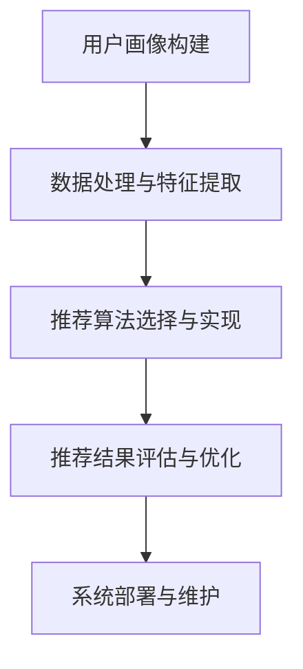

                 

## 《用户画像在电商个性化推荐 应用中的应用：方法与实践》

### 核心关键词
- 用户画像
- 电商个性化推荐
- 数据处理
- 推荐算法
- 深度学习

### 摘要
本文将深入探讨用户画像在电商个性化推荐中的应用，从基础概念、数据处理、算法实现到实战应用进行全面剖析。通过介绍用户画像的定义、作用、构建方法以及个性化推荐系统的架构和实现，文章旨在为电商从业者提供一套实用的方法和实践指导，助力提升用户满意度与业务收益。

---

### 第一部分：用户画像基础

#### 第1章：用户画像概述

##### 1.1 用户画像的概念与分类

用户画像（User Profiling）是指通过收集和分析用户的属性、行为和偏好等数据，构建出一个综合反映用户特征和需求的模型。它可以帮助企业更好地理解用户，从而提供更加个性化的产品和服务。

**用户画像的基本概念**：

- 用户属性：包括用户的基本信息（如年龄、性别、地理位置、职业等）和静态属性（如兴趣爱好、消费习惯等）。
- 用户行为：记录用户在平台上的互动行为，如浏览、点击、购买、评价等。
- 用户偏好：通过用户的历史行为和反馈，推断出用户对产品或服务的偏好。

**用户画像的分类**：

- 按照数据的来源，可以分为主动收集和被动收集。
    - 主动收集：通过用户注册、填写问卷等方式获取数据。
    - 被动收集：通过用户在平台上的行为数据自动收集。
- 按照用户画像的应用场景，可以分为：
    - 活跃用户画像：用于分析当前活跃用户的行为特征和需求。
    - 潜在用户画像：用于挖掘潜在用户的需求和偏好，以便进行精准营销。
    - 转化用户画像：用于分析已转化用户的特征，优化转化路径。

##### 1.2 用户画像的作用与应用场景

**用户画像的作用**：

- 个性化推荐：根据用户画像，为用户推荐感兴趣的商品或服务。
- 客户细分：将用户分为不同的群体，有针对性地制定营销策略。
- 产品优化：根据用户画像，了解用户需求，优化产品功能和体验。
- 风险控制：通过分析用户行为，识别潜在的风险用户。

**用户画像的应用场景**：

- 电商领域：通过对用户行为的分析，实现商品个性化推荐，提升用户购买意愿和转化率。
- 金融行业：通过用户画像，进行风险评估和欺诈检测。
- 娱乐行业：根据用户偏好，推荐音乐、电影等娱乐内容。
- 医疗健康：通过用户健康数据，提供个性化的健康建议。

##### 1.3 用户画像的核心要素

**用户属性**：用户画像的基础，包括用户的基本信息和静态属性。

**用户行为**：用户在平台上的互动行为，如浏览、点击、购买等。

**用户偏好**：通过用户行为分析，推断出的用户对商品或服务的偏好。

##### 1.4 用户画像的数据来源与收集方法

**数据来源**：

- 用户直接提供：如注册信息、问卷调查等。
- 平台自动收集：如用户行为日志、交易数据等。

**数据收集方法**：

- 数据挖掘：通过分析已有的数据，提取出有价值的信息。
- 用户反馈：通过用户评价、反馈等方式，获取用户偏好和需求。

#### 第2章：用户画像数据处理

##### 2.1 数据预处理

**数据清洗**：去除重复、无效的数据，确保数据的准确性和完整性。

**数据归一化**：将不同数据量级的数据统一到同一个尺度，以便后续分析。

**数据降维**：通过降维技术，减少数据的维度，提高分析效率。

##### 2.2 特征工程

**特征提取**：从原始数据中提取出对用户画像构建有用的特征。

**特征选择**：选择对用户画像构建最有影响力的特征，减少冗余。

**特征构造**：通过组合和变换现有特征，构建新的特征。

##### 2.3 数据存储与管理

**数据库选择**：根据用户画像的数据规模和处理需求，选择合适的数据库。

**数据库设计**：设计合理的数据库架构，确保数据的高效存储和查询。

**数据库优化**：通过索引、分区等手段，提高数据库的访问速度。

### 第二部分：用户画像在电商个性化推荐中的应用

#### 第3章：电商个性化推荐系统概述

##### 3.1 个性化推荐系统的工作原理

**协同过滤**：基于用户行为数据，通过计算用户之间的相似度，为用户推荐其他用户喜欢的商品。

**内容推荐**：基于商品本身的特征（如分类、标签等），为用户推荐与之相关的商品。

**混合推荐**：结合协同过滤和内容推荐，提供更加个性化的推荐结果。

##### 3.2 电商个性化推荐系统的架构

**推荐算法模块**：实现推荐算法的逻辑，为用户生成推荐列表。

**数据处理模块**：负责数据预处理、特征工程等任务，为推荐算法提供数据支持。

**用户界面模块**：展示推荐结果，提供用户交互接口。

##### 3.3 电商个性化推荐系统的主要挑战

**数据量庞大**：电商平台通常拥有海量的用户和商品数据，如何高效处理这些数据是一个挑战。

**实时性要求高**：用户行为数据不断更新，需要实时生成推荐结果，满足用户的即时需求。

**多样化的用户需求**：不同用户对商品的需求和偏好各不相同，如何提供满足多样化需求的推荐是一个难题。

#### 第4章：基于用户画像的推荐算法

##### 4.1 基于协同过滤的推荐算法

**基本协同过滤算法**：通过计算用户之间的相似度，为用户推荐其他用户喜欢的商品。

**改进协同过滤算法**：结合用户行为数据和商品特征，提高推荐效果。

##### 4.2 基于内容的推荐算法

**文本挖掘**：通过分析商品描述、用户评论等文本数据，提取出对推荐有用的信息。

**文本相似性计算**：计算用户和商品之间的相似性，为用户推荐相关商品。

**基于内容的推荐算法实现**：结合文本挖掘和相似性计算，实现基于内容的推荐算法。

##### 4.3 基于深度学习的推荐算法

**深度神经网络**：通过多层神经网络，自动提取用户和商品的特征。

**循环神经网络**：通过记忆机制，捕捉用户行为的时间序列特征。

**卷积神经网络在推荐中的应用**：利用卷积神经网络的结构特点，提取商品特征的局部信息。

#### 第5章：用户画像在电商个性化推荐中的实战应用

##### 5.1 用户画像数据的收集与处理

**数据收集**：通过用户注册、行为日志等方式，收集用户画像数据。

**数据预处理**：进行数据清洗、归一化等处理，为推荐算法提供高质量的数据。

##### 5.2 建立电商个性化推荐系统

**系统设计**：设计推荐系统的整体架构，包括数据处理、算法实现、用户界面等模块。

**算法实现**：实现推荐算法的逻辑，结合用户画像，生成个性化的推荐结果。

##### 5.3 系统部署与优化

**系统部署**：将推荐系统部署到生产环境中，确保系统的高可用性和稳定性。

**系统优化**：通过性能调优、推荐结果评估等手段，提升系统的推荐效果。

### 第三部分：方法与实践

#### 第6章：用户画像在电商个性化推荐中的关键技术与挑战

##### 6.1 关键技术探讨

**数据挖掘**：通过分析大量用户行为数据，挖掘出有价值的信息。

**机器学习**：利用算法模型，自动学习用户的行为特征和偏好。

**深度学习**：通过多层神经网络，自动提取用户和商品的特征。

##### 6.2 主要挑战

**数据隐私**：用户数据的隐私保护是一个重要挑战，需要遵循相关法律法规。

**冷启动问题**：对于新用户或新商品，如何生成有效的推荐结果。

**系统实时性**：如何在高并发情况下，快速生成推荐结果。

#### 第7章：案例研究与分析

##### 7.1 案例介绍

以某大型电商平台为例，介绍其用户画像与个性化推荐系统的实现。

##### 7.2 案例分析

**用户画像的构建**：如何收集和处理用户画像数据。

**推荐算法的实现**：如何结合用户画像，生成个性化的推荐结果。

**系统性能评估**：如何评估推荐系统的效果，并进行优化。

### 第四部分：未来发展展望

#### 第8章：用户画像与个性化推荐的未来发展

##### 8.1 用户画像技术的未来发展

**数据分析**：随着数据量的增长，如何更高效地分析和利用用户画像。

**人工智能**：如何利用人工智能技术，提升用户画像的构建和推荐效果。

**大数据分析**：如何利用大数据分析技术，挖掘更深层次的用户需求。

##### 8.2 电商个性化推荐系统的未来发展

**新算法**：如何引入新的推荐算法，提高推荐效果。

**新技术**：如何利用新技术（如深度学习、图神经网络等），提升推荐系统的性能。

**新场景**：如何将个性化推荐应用到新的场景中，如社交电商、直播电商等。

### 附录

#### 附录A：推荐系统开发工具与资源

**A.1 主流推荐系统开发工具**

- Python推荐库：如scikit-learn、TensorFlow等。
- 其他工具：如Apache Mahout、RecommendationSystems等。

**A.2 资源汇总**

- 学习资料：推荐系统相关的论文、书籍等。
- 开源项目：如Surprise、RecSys等。
- 相关网站：如推荐系统博客、技术社区等。

### 用户画像与个性化推荐流程图



---

### 作者信息

**作者：** AI天才研究院/AI Genius Institute & 禅与计算机程序设计艺术 /Zen And The Art of Computer Programming

---

本文旨在为广大电商从业者提供用户画像与个性化推荐的相关知识和实践方法。通过深入分析和实例讲解，希望读者能够掌握用户画像构建、数据处理、推荐算法实现等关键技能，从而提升电商业务的竞争力和用户满意度。在实际应用中，读者可以根据自身业务需求和技术水平，灵活调整和优化推荐系统，实现更好的推荐效果。同时，也期待读者继续关注用户画像和个性化推荐领域的技术发展，把握行业趋势，不断探索创新。让我们共同为打造更加智能、个性化的电商体验而努力！### 用户画像在电商个性化推荐中的应用：方法与实践

---

#### 第1章：用户画像概述

##### 1.1 用户画像的概念与分类

用户画像（User Profiling）是一种通过数据分析和建模技术，对用户进行全方位描述的方法。它能够帮助电商企业了解用户的需求和行为模式，从而实现更加精准的营销和个性化服务。用户画像通常由三个核心部分构成：用户属性、用户行为和用户偏好。

**用户画像的基本概念**

- **用户属性**：包括用户的基本信息（如年龄、性别、地理位置、收入水平等）和偏好信息（如兴趣爱好、消费习惯等）。这些信息通常是静态的，但随着时间的推移，也会有所变化。
- **用户行为**：记录用户在电商平台上的一系列活动，如浏览、点击、搜索、购买、评价等。这些行为数据能够反映用户的兴趣点和购买意图。
- **用户偏好**：通过对用户行为的分析，推测用户对某种商品或服务的偏好。例如，一个用户经常购买运动装备，可能表明其对运动的偏好。

**用户画像的分类**

用户画像可以根据不同的维度进行分类，常见的分类方式有：

- **按数据来源分类**：
  - **主动收集**：通过用户注册、问卷调查等方式直接获取用户信息。
  - **被动收集**：通过用户在平台上的行为数据自动收集，如浏览记录、购买历史等。

- **按应用场景分类**：
  - **活跃用户画像**：分析当前活跃用户的行为特征和需求。
  - **潜在用户画像**：挖掘潜在用户的需求和偏好，用于市场拓展和营销活动。
  - **转化用户画像**：分析已转化用户的特征，用于优化营销策略和转化路径。

##### 1.2 用户画像的作用与应用场景

**用户画像的作用**

用户画像在电商领域具有多重作用，主要包括以下几个方面：

- **个性化推荐**：基于用户的属性、行为和偏好，为用户推荐相关的商品或服务，提高用户满意度和购买转化率。
- **客户细分**：将用户分为不同的群体，为每个群体制定个性化的营销策略，提高营销效果。
- **产品优化**：通过分析用户需求和偏好，优化产品功能和体验，提升用户体验和忠诚度。
- **风险控制**：通过分析用户行为，识别潜在的风险用户，采取相应的风险控制措施。

**用户画像的应用场景**

用户画像不仅适用于电商领域，还可以应用于其他行业，如金融、医疗、教育等。以下是一些具体的应用场景：

- **电商领域**：通过对用户行为的分析，实现商品个性化推荐，提升用户购买意愿和转化率。
- **金融行业**：通过用户画像，进行风险评估和欺诈检测。
- **娱乐行业**：根据用户偏好，推荐音乐、电影等娱乐内容。
- **医疗健康**：通过用户健康数据，提供个性化的健康建议。

##### 1.3 用户画像的核心要素

构建一个完整的用户画像，需要从多个维度收集和处理数据，以下是用户画像的核心要素：

- **用户属性**：用户的基本信息，如年龄、性别、地理位置、职业等。这些信息可以帮助企业了解用户的基本特征。
- **用户行为**：用户在平台上的行为数据，如浏览记录、搜索关键词、购买历史、评价等。这些数据可以反映用户的兴趣和需求。
- **用户偏好**：通过分析用户行为，推测用户的偏好，如喜欢的商品类型、品牌、价格区间等。这些偏好信息可以帮助企业更精准地推荐商品。

##### 1.4 用户画像的数据来源与收集方法

**数据来源**

用户画像的数据来源可以分为以下几类：

- **用户直接提供**：用户在注册或填写问卷时提供的个人信息，如年龄、性别、兴趣爱好等。
- **平台自动收集**：用户在平台上的行为数据，如浏览记录、点击量、购买历史等。这些数据通常通过技术手段自动收集。

**数据收集方法**

- **用户注册信息**：在用户注册时，通过填写问卷或表单的方式收集用户的个人信息。
- **用户行为日志**：通过技术手段（如cookies、日志记录等）自动收集用户在平台上的行为数据。
- **第三方数据源**：通过购买或共享的方式，获取其他平台或机构的用户数据。

##### 1.5 用户画像构建的步骤

构建用户画像通常需要以下步骤：

1. **数据收集**：从各种渠道收集用户数据，包括用户直接提供的数据和平台自动收集的数据。
2. **数据清洗**：去除重复、无效的数据，确保数据的准确性和完整性。
3. **数据归一化**：将不同数据量级的数据统一到同一个尺度，以便后续分析。
4. **特征工程**：提取有用的特征，进行特征选择和构造，为用户画像构建提供数据支持。
5. **用户画像建模**：利用机器学习或深度学习算法，构建用户画像模型。
6. **用户画像应用**：将构建好的用户画像应用于个性化推荐、客户细分、产品优化等业务场景。

通过以上步骤，电商企业可以构建出全面的用户画像，为用户提供更加精准和个性化的服务。

---

在下一章中，我们将深入探讨用户画像数据处理的方法，包括数据预处理、特征工程和用户画像建模等技术。通过这些技术，我们可以从海量的用户数据中提取出有价值的信息，为电商个性化推荐奠定基础。

---

### 第2章：用户画像数据处理

用户画像的构建是一个复杂的过程，涉及数据的收集、清洗、特征提取、建模等多个环节。本章将详细介绍用户画像数据处理的方法和技术，帮助读者了解如何从原始数据中提取有价值的信息，为个性化推荐提供数据支持。

#### 2.1 数据预处理

数据预处理是用户画像构建的第一步，其目的是将原始数据转化为适合分析的形式。数据预处理通常包括以下任务：

##### 2.1.1 数据清洗

数据清洗是去除数据中的错误、重复和无关信息的过程。具体步骤如下：

- **去除重复数据**：通过唯一标识（如用户ID）识别并删除重复的数据记录。
- **填充缺失值**：对于缺失的数据，可以选择填充平均值、中位数或使用机器学习算法预测缺失值。
- **处理异常值**：识别并处理异常值，可以选择删除或替换异常值。

##### 2.1.2 数据归一化

数据归一化的目的是将不同数据量级的数据统一到同一个尺度，以便后续分析。常见的方法有：

- **最小-最大归一化**：将数据映射到[0, 1]区间。
  $$ x' = \frac{x - \min(x)}{\max(x) - \min(x)} $$
- **标准归一化**：将数据映射到标准正态分布。
  $$ x' = \frac{x - \mu}{\sigma} $$
  其中，$ \mu $ 是均值，$ \sigma $ 是标准差。

##### 2.1.3 数据降维

数据降维是一种减少数据维度，提高分析效率的技术。常见的降维方法有：

- **主成分分析（PCA）**：通过保留主要成分，降低数据维度。
- **线性判别分析（LDA）**：用于分类问题，通过降低数据维度，提高分类效果。
- **t-SNE**：一种非线性的降维方法，适用于可视化高维数据。

#### 2.2 特征工程

特征工程是用户画像构建中至关重要的一步，其目的是从原始数据中提取出对用户画像构建有用的特征。特征工程包括以下任务：

##### 2.2.1 特征提取

特征提取是指从原始数据中提取出对用户画像构建有用的特征。常见的特征提取方法有：

- **统计特征**：基于数据统计结果提取特征，如均值、方差、标准差等。
- **文本特征**：对文本数据（如用户评论、商品描述等）进行词频统计、TF-IDF计算等。
- **序列特征**：对时间序列数据（如用户行为日志）进行序列建模，提取时间特征、上下文特征等。

##### 2.2.2 特征选择

特征选择是指从提取出的特征中挑选出对用户画像构建最有影响力的特征。常见的特征选择方法有：

- **基于过滤的方法**：通过统计方法（如相关性、信息增益等）直接筛选特征。
- **基于包裹的方法**：通过模型选择（如递归特征消除等）挑选特征。
- **基于评估的方法**：结合模型评估指标（如AUC、准确率等）筛选特征。

##### 2.2.3 特征构造

特征构造是指通过组合和变换现有特征，构建新的特征。常见的特征构造方法有：

- **交互特征**：将两个或多个特征进行组合，如“年龄*收入”。
- **派生特征**：基于现有特征计算新的特征，如“购买频率”。
- **编码特征**：将类别特征转换为数值特征，如“性别”编码为“0”或“1”。

#### 2.3 数据存储与管理

在用户画像构建过程中，数据存储与管理是一个关键环节。合理的数据存储与管理能够提高数据查询和分析的效率。以下是数据存储与管理的一些方法：

##### 2.3.1 数据库选择

根据用户画像数据的规模和处理需求，可以选择以下类型的数据库：

- **关系数据库**：如MySQL、PostgreSQL，适用于结构化数据存储和查询。
- **NoSQL数据库**：如MongoDB、Cassandra，适用于存储大量非结构化或半结构化数据。
- **分布式数据库**：如HBase、Hive，适用于大数据存储和查询。

##### 2.3.2 数据库设计

数据库设计应考虑以下因素：

- **表设计**：设计合理的表结构，包括字段、数据类型、索引等。
- **数据分区**：将数据按照一定规则分区，提高查询效率。
- **数据索引**：为常用的查询字段创建索引，提高查询速度。

##### 2.3.3 数据库优化

数据库优化包括以下方面：

- **查询优化**：通过分析查询日志，优化查询语句和索引策略。
- **存储优化**：通过数据压缩、存储格式优化等方式，降低存储空间占用。
- **并发控制**：通过锁机制、队列机制等，控制并发访问，提高系统性能。

通过以上方法，可以有效地进行用户画像数据处理，为电商个性化推荐提供高质量的数据支持。

在下一章中，我们将探讨用户画像在电商个性化推荐中的应用，包括推荐算法的选择、实现和优化。通过深入分析，我们将了解如何利用用户画像数据，为用户推荐他们感兴趣的商品。

---

### 第3章：电商个性化推荐系统概述

电商个性化推荐系统是电商企业提升用户体验和转化率的重要手段。通过个性化推荐，系统能够根据用户的历史行为和偏好，为用户推荐他们可能感兴趣的商品或服务。本章将介绍电商个性化推荐系统的工作原理、架构和主要挑战。

#### 3.1 个性化推荐系统的工作原理

个性化推荐系统的工作原理可以分为以下三个主要步骤：

1. **数据收集**：系统首先需要收集用户在平台上的各种行为数据，如浏览记录、购买历史、搜索关键词等。
2. **用户画像构建**：通过数据分析和建模技术，从收集到的数据中提取出用户的基本信息、行为特征和偏好信息，构建出完整的用户画像。
3. **推荐算法实现**：利用用户画像和商品特征，通过推荐算法生成个性化推荐结果，并将结果展示给用户。

**协同过滤**：基于用户行为数据，通过计算用户之间的相似度，为用户推荐其他用户喜欢的商品。协同过滤可以分为两种类型：

- **用户基于的协同过滤（User-based Collaborative Filtering）**：通过计算用户之间的相似度，找到与目标用户相似的其他用户，推荐这些用户喜欢的商品。
- **物品基于的协同过滤（Item-based Collaborative Filtering）**：通过计算商品之间的相似度，找到与目标商品相似的其他商品，推荐给用户。

**内容推荐**：基于商品本身的特征（如分类、标签、描述等），为用户推荐相关商品。内容推荐可以分为以下步骤：

- **特征提取**：从商品描述、标签等文本数据中提取出特征。
- **特征匹配**：将用户画像中的特征与商品特征进行匹配，计算相似度。
- **推荐生成**：根据相似度计算结果，生成个性化推荐结果。

**混合推荐**：结合协同过滤和内容推荐，提供更加个性化的推荐结果。混合推荐系统通常利用不同的算法和模型，综合利用用户行为数据和商品特征，提高推荐效果。

#### 3.2 电商个性化推荐系统的架构

电商个性化推荐系统的架构可以分为三个主要模块：数据处理模块、推荐算法模块和用户界面模块。

**数据处理模块**：负责数据收集、数据预处理、用户画像构建等任务。具体职责包括：

- **数据收集**：从各个渠道收集用户行为数据，如浏览记录、购买历史等。
- **数据预处理**：对收集到的数据进行清洗、归一化、降维等处理，确保数据的质量和一致性。
- **用户画像构建**：通过特征提取、特征选择和特征构造等技术，构建出用户画像。

**推荐算法模块**：负责实现个性化推荐算法，生成推荐结果。具体职责包括：

- **算法选择**：根据业务需求和数据特点，选择合适的推荐算法，如协同过滤、内容推荐等。
- **算法实现**：根据选定的算法，编写算法代码，实现推荐算法的逻辑。
- **模型训练**：利用用户画像和商品特征，训练推荐模型，优化推荐效果。

**用户界面模块**：负责将推荐结果展示给用户，提供用户交互接口。具体职责包括：

- **推荐结果展示**：根据推荐算法生成的推荐结果，设计展示界面，将推荐结果呈现给用户。
- **用户交互**：提供用户与推荐系统交互的接口，如筛选、排序、反馈等。

#### 3.3 电商个性化推荐系统的主要挑战

电商个性化推荐系统在实际应用中面临诸多挑战，主要包括：

**数据量庞大**：电商平台通常拥有海量的用户和商品数据，如何高效处理这些数据是一个挑战。数据量庞大导致计算资源和存储资源的需求大幅增加，需要采用分布式计算和大数据技术来应对。

**实时性要求高**：用户行为数据不断更新，需要实时生成推荐结果，满足用户的即时需求。实时性要求高意味着推荐系统需要具备高并发处理能力和快速响应能力，这对系统的设计和实现提出了更高的要求。

**多样化的用户需求**：不同用户对商品的需求和偏好各不相同，如何提供满足多样化需求的推荐是一个难题。多样化的用户需求要求推荐系统具备灵活的推荐策略和强大的用户画像建模能力，以便为用户提供个性化的推荐结果。

**数据隐私保护**：用户数据的隐私保护是一个重要问题，用户对个人隐私的担忧可能影响他们对推荐系统的接受度。在构建用户画像和推荐系统时，需要严格遵守相关法律法规，采取有效的数据加密和隐私保护措施。

**冷启动问题**：对于新用户或新商品，如何生成有效的推荐结果是一个挑战。冷启动问题通常发生在用户刚注册或商品刚上线时，由于缺乏足够的历史数据，传统的推荐算法可能无法准确预测用户的需求和偏好。为了解决冷启动问题，可以采用基于内容的推荐、基于样本的推荐等策略。

**系统稳定性与可靠性**：推荐系统需要保证高可用性和稳定性，确保在高峰期和极端情况下仍能正常运行。系统稳定性与可靠性是推荐系统能否持续为用户提供高质量服务的基础。

通过深入了解电商个性化推荐系统的工作原理、架构和主要挑战，我们可以更好地理解如何构建和优化推荐系统，为电商企业提供有效的个性化服务。在下一章中，我们将探讨基于用户画像的推荐算法，包括协同过滤、内容推荐和深度学习等方法的实现和应用。

---

### 第4章：基于用户画像的推荐算法

推荐算法是电商个性化推荐系统的核心组成部分，它们通过分析用户画像和商品特征，为用户生成个性化的推荐结果。本章将介绍几种常见的基于用户画像的推荐算法，包括协同过滤、内容推荐和深度学习等方法。

#### 4.1 基于协同过滤的推荐算法

协同过滤（Collaborative Filtering）是一种通过分析用户之间的相似性来生成推荐结果的推荐算法。它分为两种主要类型：用户基于的协同过滤（User-based Collaborative Filtering）和物品基于的协同过滤（Item-based Collaborative Filtering）。

##### 4.1.1 用户基于的协同过滤

用户基于的协同过滤通过计算用户之间的相似性，找到与目标用户相似的其他用户，然后推荐这些用户喜欢的商品。具体步骤如下：

1. **计算相似度**：使用余弦相似度、皮尔逊相关系数等方法计算用户之间的相似度。
2. **找到相似用户**：根据相似度分数，选择与目标用户最相似的K个用户。
3. **推荐商品**：推荐这些相似用户喜欢的商品，并按照相似度分数进行排序。

伪代码如下：

```python
# 输入：用户评分矩阵R，相似度阈值k
# 输出：推荐结果L

def user_based_collaborative_filtering(R, k):
    # 计算用户相似度矩阵S
    S = compute_similarity(R)
    
    # 找到相似用户
    similar_users = find_top_k_users(S, k)
    
    # 计算每个用户的推荐分数
    for user in similar_users:
        scores = compute_item_scores(R, S, user)
        # 按照推荐分数排序
        sorted_scores = sort_scores(scores)
        # 生成推荐结果
        L[user] = sorted_scores

# 计算相似度函数
def compute_similarity(R):
    # 使用余弦相似度计算用户相似度
    return cosine_similarity(R)

# 找到相似用户
def find_top_k_users(S, k):
    # 返回与目标用户最相似的K个用户
    return top_k_users(S, k)

# 计算商品推荐分数
def compute_item_scores(R, S, user):
    # 计算用户user喜欢的商品的平均评分
    user_avg_rating = average_rating(R, user)
    # 计算相似用户对每个商品的评分预测
    scores = {}
    for other_user in S[user]:
        for item in R[other_user]:
            score = R[other_user][item] - user_avg_rating
            scores[item] = scores.get(item, 0) + S[user][other_user] * score
    return scores
```

##### 4.1.2 物品基于的协同过滤

物品基于的协同过滤通过计算商品之间的相似性，找到与目标商品相似的其他商品，然后推荐给用户。具体步骤如下：

1. **计算相似度**：使用余弦相似度、Jaccard相似度等方法计算商品之间的相似度。
2. **找到相似商品**：根据相似度分数，选择与目标商品最相似的K个商品。
3. **推荐商品**：推荐这些相似商品。

伪代码如下：

```python
# 输入：用户评分矩阵R，相似度阈值k
# 输出：推荐结果L

def item_based_collaborative_filtering(R, k):
    # 计算商品相似度矩阵S
    S = compute_similarity(R)
    
    # 找到相似商品
    similar_items = find_top_k_items(S, k)
    
    # 计算每个用户的推荐分数
    for user in R:
        scores = compute_user_scores(R, S, user)
        # 按照推荐分数排序
        sorted_scores = sort_scores(scores)
        # 生成推荐结果
        L[user] = sorted_scores

# 计算相似度函数
def compute_similarity(R):
    # 使用余弦相似度计算商品相似度
    return cosine_similarity(R)

# 找到相似商品
def find_top_k_items(S, k):
    # 返回与目标商品最相似的K个商品
    return top_k_items(S, k)

# 计算用户推荐分数
def compute_user_scores(R, S, user):
    # 计算用户user喜欢的商品的平均评分
    user_avg_rating = average_rating(R, user)
    # 计算相似商品的平均评分
    avg_rating = average_rating(R, similar_items)
    # 计算用户对每个商品的评分预测
    scores = {}
    for item in R[user]:
        score = avg_rating - user_avg_rating
        scores[item] = score
    return scores
```

##### 4.1.3 改进协同过滤算法

协同过滤算法在处理稀疏数据时效果不佳，因此可以引入矩阵分解、基于模型的协同过滤等方法进行改进。以下是一个基于矩阵分解的协同过滤算法的伪代码：

```python
# 输入：用户评分矩阵R，隐藏因子数m
# 输出：预测评分矩阵\(\hat{R}\)

def matrix_factorization(R, m):
    # 初始化用户和商品的隐藏向量
    U = initialize_user_factors(R, m)
    V = initialize_item_factors(R, m)
    
    # 定义优化目标
    objective = lambda U, V: sum((R[i][j] - dot(U[i], V[j]))**2 for i in range(num_users) for j in range(num_items))
    
    # 使用梯度下降优化隐藏向量
    U, V = gradient_descent(U, V, objective)
    
    # 预测评分
    \hat{R} = dot(U, V)
    
    return \hat{R}

# 初始化隐藏向量
def initialize_user_factors(R, m):
    return [[random() for _ in range(m)] for _ in range(num_users)]

def initialize_item_factors(R, m):
    return [[random() for _ in range(m)] for _ in range(num_items)]

# 梯度下降
def gradient_descent(U, V, objective):
    # 定义学习率
    learning_rate = 0.01
    
    while not converged:
        # 计算梯度
        dU = -2 * sum((R[i][j] - dot(U[i], V[j])) * V[j] for i in range(num_users) for j in range(num_items))
        dV = -2 * sum((R[i][j] - dot(U[i], V[j])) * U[i] for i in range(num_users) for j in range(num_items))
        
        # 更新隐藏向量
        U = [u - learning_rate * du for u, du in zip(U, dU)]
        V = [v - learning_rate * dv for v, dv in zip(V, dV)]
        
        # 检查收敛
        if converged(U, V):
            break
            
    return U, V

# 检查是否收敛
def converged(U, V):
    # 如果隐藏向量的变化小于某个阈值，则认为已收敛
    return all(abs(u - u_prev) < threshold for u, u_prev in zip(U, U_prev)) and all(abs(v - v_prev) < threshold for v, v_prev in zip(V, V_prev))
```

#### 4.2 基于内容的推荐算法

基于内容的推荐算法（Content-based Filtering）通过分析商品的内容特征（如文本描述、分类标签等），为用户推荐相关商品。具体步骤如下：

1. **特征提取**：从商品描述、分类标签等文本数据中提取出特征。
2. **特征匹配**：计算用户画像与商品特征之间的相似度。
3. **推荐生成**：推荐与用户画像最相似的商品。

##### 4.2.1 文本挖掘

文本挖掘是特征提取的关键步骤，常用的方法有：

- **词频统计**：计算每个词在文档中出现的次数。
- **TF-IDF**：结合词频和逆文档频率，衡量词的重要性。
- **主题模型**：如LDA（Latent Dirichlet Allocation），用于发现文本中的潜在主题。

以下是一个基于TF-IDF的文本挖掘示例：

```python
# 输入：文档集合D，词典V， IDF阈值d
# 输出：特征向量矩阵X

def text_mining(D, V, d):
    # 计算词频矩阵F
    F = [[count_word(d Document) for word in V] for Document in D]
    
    # 计算文档-词矩阵X
    X = [document for document in F if sum(document) > d]
    
    # 计算逆文档频率矩阵IDF
    IDF = [1 / (1 + log(num_documents)) for word in V]
    
    # 计算TF-IDF特征矩阵
    X = [[F[i][j] * IDF[j] for j in range(num_words)] for i in range(num_documents)]
    
    return X

# 计算词频
def count_word(document):
    return [document.count(word) for word in V]

# 计算逆文档频率
def compute_idf(V, num_documents):
    return [1 / (1 + log(num_documents)) for word in V]
```

##### 4.2.2 文本相似性计算

计算用户画像与商品特征之间的相似性，可以使用余弦相似度、Jaccard相似度等方法。以下是一个基于余弦相似度的文本相似性计算示例：

```python
# 输入：用户画像X1，商品特征X2
# 输出：相似度similarity

def cosine_similarity(X1, X2):
    # 计算点积
    dot_product = sum(X1[i] * X2[i] for i in range(len(X1)))
    
    # 计算用户画像和商品特征的内积
    norm_X1 = sqrt(sum(X1[i]**2 for i in range(len(X1))))
    norm_X2 = sqrt(sum(X2[i]**2 for i in range(len(X2))))
    
    # 计算余弦相似度
    similarity = dot_product / (norm_X1 * norm_X2)
    
    return similarity
```

##### 4.2.3 基于内容的推荐算法实现

基于内容的推荐算法实现包括以下步骤：

1. **提取特征**：从商品描述、分类标签等文本数据中提取特征。
2. **计算相似度**：计算用户画像与商品特征之间的相似度。
3. **推荐生成**：根据相似度计算结果，生成推荐结果。

以下是一个基于内容的推荐算法的实现伪代码：

```python
# 输入：用户画像X1，商品特征矩阵X，相似度阈值k
# 输出：推荐结果L

def content_based_filtering(X1, X, k):
    # 计算用户画像与商品特征的相似度矩阵S
    S = compute_similarity(X1, X)
    
    # 找到相似度最高的K个商品
    similar_items = find_top_k_items(S, k)
    
    # 计算每个用户的推荐分数
    for user in similar_items:
        scores = compute_item_scores(X, S, user)
        # 按照推荐分数排序
        sorted_scores = sort_scores(scores)
        # 生成推荐结果
        L[user] = sorted_scores

# 计算相似度函数
def compute_similarity(X1, X):
    # 计算用户画像与商品特征之间的余弦相似度
    return cosine_similarity(X1, X)

# 找到相似商品
def find_top_k_items(S, k):
    # 返回与用户画像最相似的K个商品
    return top_k_items(S, k)

# 计算商品推荐分数
def compute_item_scores(X, S, user):
    # 计算用户user喜欢的商品的平均评分
    user_avg_rating = average_rating(X, user)
    # 计算相似商品的平均评分
    avg_rating = average_rating(X, similar_items)
    # 计算用户对每个商品的评分预测
    scores = {}
    for item in similar_items:
        score = avg_rating - user_avg_rating
        scores[item] = score
    return scores
```

#### 4.3 基于深度学习的推荐算法

基于深度学习的推荐算法通过构建深度神经网络，自动学习用户和商品的特征表示，从而生成个性化的推荐结果。常用的深度学习模型有：

- **深度神经网络（DNN）**：通过多层神经网络，自动提取用户和商品的特征。
- **循环神经网络（RNN）**：通过记忆机制，捕捉用户行为的时间序列特征。
- **卷积神经网络（CNN）**：利用卷积神经网络的结构特点，提取商品特征的局部信息。

##### 4.3.1 深度神经网络在推荐中的应用

以下是一个基于深度神经网络的推荐算法的实现伪代码：

```python
# 输入：用户画像X1，商品特征矩阵X，训练数据D
# 输出：预测评分矩阵\(\hat{R}\)

def deep_neural_network(X1, X, D):
    # 构建深度神经网络模型
    model = build_model()
    
    # 训练模型
    model.fit(D, epochs=10)
    
    # 预测评分
    \hat{R} = model.predict([X1, X])
    
    return \hat{R}

# 构建深度神经网络模型
def build_model():
    # 构建模型
    model = Sequential()
    model.add(Dense(128, activation='relu', input_shape=(input_shape,)))
    model.add(Dense(64, activation='relu'))
    model.add(Dense(1, activation='sigmoid'))
    
    # 编译模型
    model.compile(optimizer='adam', loss='binary_crossentropy', metrics=['accuracy'])
    
    return model
```

##### 4.3.2 循环神经网络在推荐中的应用

循环神经网络（RNN）通过记忆机制，能够捕捉用户行为的时间序列特征。以下是一个基于RNN的推荐算法的实现伪代码：

```python
# 输入：用户行为序列X1，商品特征矩阵X，训练数据D
# 输出：预测评分矩阵\(\hat{R}\)

def recurrent_neural_network(X1, X, D):
    # 构建RNN模型
    model = build_model()
    
    # 训练模型
    model.fit(D, epochs=10)
    
    # 预测评分
    \hat{R} = model.predict([X1, X])
    
    return \hat{R}

# 构建RNN模型
def build_model():
    # 构建模型
    model = Sequential()
    model.add(LSTM(128, activation='relu', input_shape=(timesteps, features)))
    model.add(Dense(1, activation='sigmoid'))
    
    # 编译模型
    model.compile(optimizer='adam', loss='binary_crossentropy', metrics=['accuracy'])
    
    return model
```

##### 4.3.3 卷积神经网络在推荐中的应用

卷积神经网络（CNN）通过卷积操作，能够提取商品特征的局部信息。以下是一个基于CNN的推荐算法的实现伪代码：

```python
# 输入：用户画像X1，商品特征矩阵X，训练数据D
# 输出：预测评分矩阵\(\hat{R}\)

def convolutional_neural_network(X1, X, D):
    # 构建CNN模型
    model = build_model()
    
    # 训练模型
    model.fit(D, epochs=10)
    
    # 预测评分
    \hat{R} = model.predict([X1, X])
    
    return \hat{R}

# 构建CNN模型
def build_model():
    # 构建模型
    model = Sequential()
    model.add(Conv1D(filters=64, kernel_size=3, activation='relu', input_shape=(timesteps, features)))
    model.add(MaxPooling1D(pool_size=2))
    model.add(Flatten())
    model.add(Dense(1, activation='sigmoid'))
    
    # 编译模型
    model.compile(optimizer='adam', loss='binary_crossentropy', metrics=['accuracy'])
    
    return model
```

通过以上方法，我们可以利用用户画像构建个性化的推荐系统，提升电商业务的用户体验和转化率。在下一章中，我们将通过一个实战案例，详细讲解用户画像在电商个性化推荐中的实际应用，帮助读者更好地理解推荐算法的实现和优化。

---

### 第5章：用户画像在电商个性化推荐中的实战应用

在了解了用户画像和推荐算法的理论知识后，本章节将通过一个具体的实战案例，详细讲解用户画像在电商个性化推荐中的实际应用。我们将从用户画像数据的收集与处理、电商个性化推荐系统的建立、系统部署与优化等方面，进行深入探讨。

#### 5.1 用户画像数据的收集与处理

用户画像数据的收集是构建个性化推荐系统的第一步。以下是一个电商平台的用户画像数据收集流程：

1. **用户直接提供的数据**：用户在注册时填写的信息，如姓名、年龄、性别、职业、联系方式等。这些数据可以通过注册表单或用户问卷调查等方式收集。

2. **平台自动收集的数据**：用户在平台上的行为数据，如浏览记录、搜索关键词、购买历史、评价等。这些数据可以通过服务器日志、API调用记录等方式自动收集。

**数据收集步骤**：

1. **注册信息收集**：在用户注册时，通过填写表单收集用户的基本信息。
2. **行为数据收集**：通过用户行为日志记录用户在平台上的活动，如浏览、搜索、购买等。

**数据预处理步骤**：

1. **数据清洗**：去除重复、无效的数据，确保数据的准确性和完整性。
2. **数据归一化**：对数值型数据进行归一化处理，如年龄、收入等，将不同量级的数据统一到同一个尺度。
3. **数据降维**：通过降维技术（如PCA、t-SNE等），减少数据的维度，提高数据处理和分析的效率。

#### 5.2 建立电商个性化推荐系统

建立电商个性化推荐系统的过程可以分为以下几个步骤：

1. **系统设计**：设计推荐系统的整体架构，包括数据处理模块、推荐算法模块和用户界面模块。确定数据流和模块之间的交互方式。

2. **数据处理模块**：实现数据处理逻辑，包括数据收集、数据清洗、特征提取和用户画像构建等。使用Python的Pandas、NumPy等库进行数据处理。

3. **推荐算法模块**：实现推荐算法的逻辑，包括协同过滤、内容推荐和深度学习等。使用Python的scikit-learn、TensorFlow等库实现算法。

4. **用户界面模块**：设计用户界面，展示推荐结果，并提供用户交互接口。使用Web开发框架（如Django、Flask等）实现用户界面。

**系统架构**：


**数据处理模块实现**：

```python
import pandas as pd
from sklearn.preprocessing import StandardScaler
from sklearn.decomposition import PCA

# 数据收集
data = pd.read_csv('user_data.csv')
behavior_data = pd.read_csv('user_behavior.csv')

# 数据清洗
data.drop_duplicates(inplace=True)
behavior_data.drop_duplicates(inplace=True)

# 数据归一化
scaler = StandardScaler()
data[['age', 'income']] = scaler.fit_transform(data[['age', 'income']])
behavior_data[['purchase_count', 'review_count']] = scaler.fit_transform(behavior_data[['purchase_count', 'review_count']])

# 数据降维
pca = PCA(n_components=5)
data = pca.fit_transform(data)
behavior_data = pca.fit_transform(behavior_data)

# 用户画像构建
user_profile = data.merge(behavior_data, on='user_id')
```

**推荐算法模块实现**：

```python
from sklearn.neighbors import NearestNeighbors
from sklearn.model_selection import train_test_split

# 划分训练集和测试集
X_train, X_test, y_train, y_test = train_test_split(user_profile, test_size=0.2, random_state=42)

# 用户基于的协同过滤
neighb

