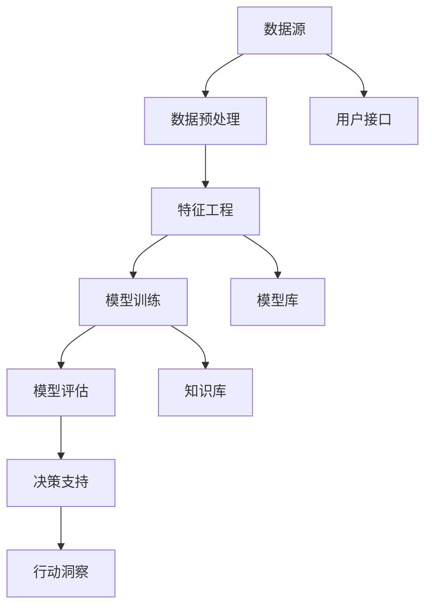
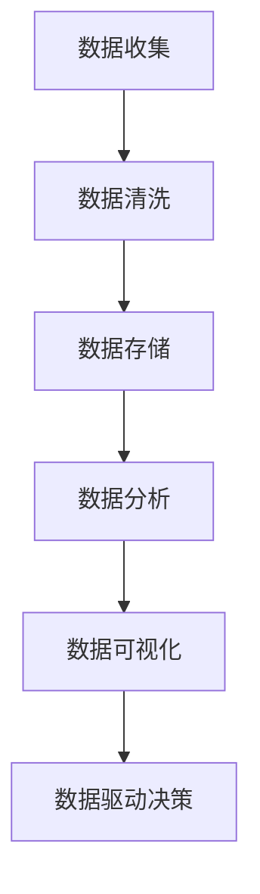
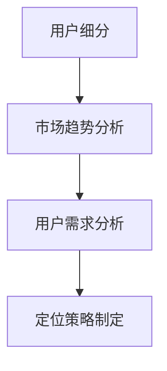
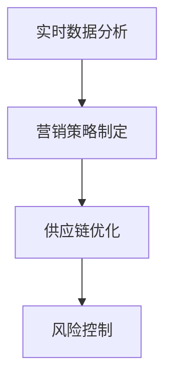
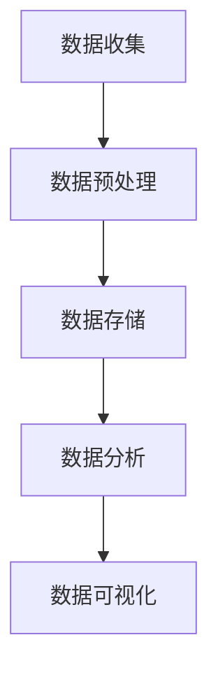
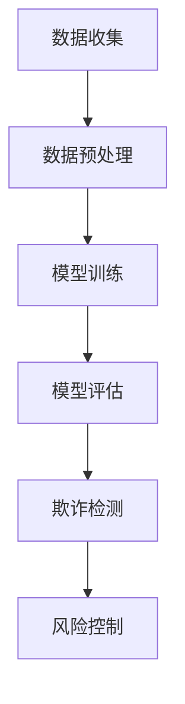
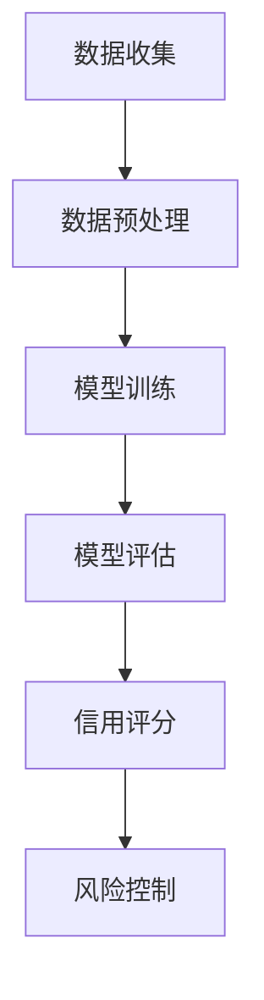

                 

# 《电商创业者的AI驱动决策支持系统：数据分析到行动洞察》

> **关键词**：电商、AI、数据分析、决策支持系统、行动洞察

> **摘要**：本文将深入探讨电商创业者在人工智能驱动下的决策支持系统。通过剖析人工智能与电商行业的深度融合，解析从数据分析到行动洞察的全过程，帮助电商创业者提升市场竞争力。文章将涵盖AI基础、数据分析应用、决策系统原理、行动洞察实现、营销应用、供应链管理、风险控制以及创业实战等多个方面，并探讨AI在伦理和法律监管中的挑战。最后，提供相关工具和资源，以及实际案例解析，助力读者深入理解和应用AI技术。

### 《电商创业者的AI驱动决策支持系统：数据分析到行动洞察》目录大纲

#### 第1章 引言与背景

- **1.1 AI驱动的电商发展历程**
- **1.2 电商行业的挑战与机遇**
- **1.3 书籍目的与读者对象**

#### 第2章 AI基础知识与电商应用

- **2.1 人工智能的核心概念**
  - **2.1.1 人工智能的定义与发展**
  - **2.1.2 常见的AI技术类型与应用场景**
- **2.2 数据分析在电商中的应用**
  - **2.2.1 数据分析的基本流程**
  - **2.2.2 数据分析工具与平台**

#### 第3章 AI驱动决策支持系统原理

- **3.1 决策支持系统的定义与作用**
  - **3.1.1 决策支持系统的基本原理**
  - **3.1.2 AI在决策支持系统中的应用**
- **3.2 AI驱动的数据分析方法**
  - **3.2.1 数据挖掘与机器学习**
  - **3.2.2 深度学习与神经网络**

#### 第4章 数据分析到行动洞察

- **4.1 数据分析到决策过程**
  - **4.1.1 数据分析结果可视化**
  - **4.1.2 基于数据分析的市场定位**
- **4.2 行动洞察的实现路径**
  - **4.2.1 实时数据分析与监控**
  - **4.2.2 数据驱动的营销策略**

#### 第5章 AI在电商营销中的应用

- **5.1 个性化推荐系统**
  - **5.1.1 推荐系统的基本原理**
  - **5.1.2 基于机器学习的推荐算法**
- **5.2 聊天机器人在电商中的应用**
  - **5.2.1 聊天机器人的基本架构**
  - **5.2.2 常见聊天机器人开发框架**

#### 第6章 AI驱动供应链管理

- **6.1 供应链数据分析方法**
  - **6.1.1 供应链数据的基本类型**
  - **6.1.2 供应链数据可视化**
- **6.2 供应链优化与预测**
  - **6.2.1 供应链优化算法**
  - **6.2.2 供应链预测模型**

#### 第7章 AI在电商风险控制中的应用

- **7.1 电商风险识别与评估**
  - **7.1.1 风险识别的方法与工具**
  - **7.1.2 风险评估指标体系**
- **7.2 AI在风险控制中的实践案例**
  - **7.2.1 欺诈检测**
  - **7.2.2 信用评分**

#### 第8章 AI驱动的电商创新

- **8.1 AI驱动的电商新业态**
  - **8.1.1 新零售的AI应用**
  - **8.1.2 无人商店与自动化的未来**
- **8.2 AI驱动的电商商业模式创新**
  - **8.2.1 跨界合作与平台化**
  - **8.2.2 新型电商模式的探索**

#### 第9章 AI驱动电商创业实战

- **9.1 电商创业者的挑战与机会**
  - **9.1.1 创业过程中的关键决策点**
  - **9.1.2 创业团队的组建与管理**
- **9.2 AI驱动电商创业案例解析**
  - **9.2.1 成功案例分享**
  - **9.2.2 失败案例分析与教训**

#### 第10章 AI伦理与法律监管

- **10.1 AI伦理问题在电商中的应用**
  - **10.1.1 数据隐私保护**
  - **10.1.2 算法歧视与公平性**
- **10.2 电商行业法律监管框架**
  - **10.2.1 相关法律法规概述**
  - **10.2.2 AI在电商法律监管中的实践应用**

#### 附录

- **附录A：AI驱动电商工具与资源**
  - **A.1 开源AI框架与库**
  - **A.2 电商行业数据集**
  - **A.3 电商AI开发指南**

#### 代码实例与案例解析

- **代码实例1：个性化推荐算法实现**
- **代码实例2：聊天机器人开发案例**
- **案例解析：AI驱动电商创业成功案例**

---

让我们正式开始第一章节：引言与背景。

## 第1章 引言与背景

### 1.1 AI驱动的电商发展历程

电商行业的快速发展离不开技术的推动，而人工智能（AI）作为当今最前沿的技术之一，正在深刻地改变着电商的运营模式。从最初的电子商务网站到如今智能化的电商生态系统，AI技术已经渗透到电商的各个环节。

20世纪90年代末到21世纪初，电子商务开始崭露头角，但主要集中在在线零售领域。早期的电商应用主要是通过网站展示商品，提供在线支付服务，用户通过网站浏览和购买商品。这个阶段，电商主要依赖于传统的网站设计和用户界面优化来提高用户体验。

随着互联网技术的成熟，大数据和云计算的发展为AI技术的兴起奠定了基础。2005年至2010年，AI开始逐步应用于电商行业，主要表现为推荐系统的引入。基于用户行为和商品属性的数据分析，推荐系统能够为用户推荐可能感兴趣的商品，从而提高用户的购买转化率。

2010年以后，随着深度学习和大数据技术的突破，AI在电商中的应用进一步深化。个性化推荐、智能客服、图像识别等技术开始在电商中得到广泛应用。这一阶段，电商不仅关注用户的购买行为，还开始深入挖掘用户的需求和偏好，实现更加精准的营销。

近年来，AI驱动的电商开始迈向智能化和自动化。通过智能算法和数据分析，电商系统能够实时监控市场动态，快速调整营销策略，实现供应链的优化。同时，无人零售、智能物流等创新业态的出现，进一步提升了电商行业的整体效率和服务质量。

### 1.2 电商行业的挑战与机遇

电商行业的快速发展带来了巨大的机遇，但也伴随着一系列的挑战。

**市场饱和与竞争加剧**：随着电商市场的不断扩大，越来越多的企业进入该领域，导致市场竞争日益激烈。如何在激烈的市场竞争中脱颖而出，成为电商创业者面临的重要挑战。

**用户需求多样化**：现代消费者的需求越来越多样化，他们不仅追求产品的品质，更注重购物体验。电商创业者需要通过AI技术来深入理解用户需求，提供个性化服务和产品推荐。

**数据隐私与安全问题**：电商行业大量涉及用户个人信息，如何保护用户数据隐私和安全是电商创业者必须面对的问题。AI技术的发展为数据隐私保护提供了新的解决方案，但也需要电商创业者采取措施确保数据安全。

**技术壁垒**：AI技术虽然为电商带来了巨大的潜力，但同时也存在较高的技术壁垒。电商创业者需要具备一定的技术背景，或者与专业的AI团队合作，才能充分发挥AI技术的优势。

**供应链管理**：高效的供应链管理是电商成功的关键。AI技术可以帮助电商创业者优化库存管理、物流配送等环节，提高供应链的整体效率。

**营销创新**：AI技术为电商营销提供了新的手段，如个性化推荐、智能广告投放等。电商创业者可以通过这些创新手段，提高营销效果，增加销售额。

### 1.3 书籍目的与读者对象

本文旨在帮助电商创业者和相关从业者深入理解AI技术在电商中的应用，掌握从数据分析到行动洞察的全过程。通过系统的学习和实践，读者将能够：

1. **掌握AI基础知识**：了解人工智能的定义、发展历程和常见技术类型，为后续应用打下基础。
2. **熟悉数据分析流程**：了解数据分析的基本流程和工具，掌握如何从数据中提取有价值的信息。
3. **理解AI驱动决策支持系统**：了解决策支持系统的原理和应用，学会如何利用AI技术做出数据驱动的决策。
4. **掌握行动洞察的实现路径**：了解实时数据分析与监控、数据驱动的营销策略等，实现从数据分析到行动的转化。
5. **探索电商创新**：了解AI在供应链管理、风险控制、电商营销等领域的应用，把握电商行业的发展趋势。

本文适合以下读者群体：

1. **电商创业者**：希望通过AI技术提升企业竞争力的创业者。
2. **电商从业者**：希望深入了解AI技术在电商中的应用，提升自身专业技能的电商从业者。
3. **技术爱好者**：对AI技术和电商行业感兴趣的技术爱好者。

通过本文的学习，读者将能够构建起对AI驱动电商决策支持系统的全面认识，并为实际应用提供可行的指导和策略。

### 1.4 本章小结

本章首先回顾了AI驱动的电商发展历程，从最初的电子商务网站到如今的智能化电商生态系统，AI技术在不同阶段的应用。接着分析了电商行业面临的挑战与机遇，包括市场饱和与竞争加剧、用户需求多样化、数据隐私与安全问题、技术壁垒等。最后，明确了书籍的目的和读者对象，帮助电商创业者和从业者通过AI技术提升企业竞争力。

在接下来的章节中，我们将深入探讨AI的基础知识、数据分析在电商中的应用、决策支持系统的原理和实践，以及行动洞察的实现路径。通过这些内容，读者将能够系统地掌握AI在电商中的实际应用，为创业和实践提供有力支持。

## 第2章 AI基础知识与电商应用

### 2.1 人工智能的核心概念

人工智能（AI，Artificial Intelligence）是指由计算机实现的智能，它能够模拟、延伸和扩展人类智能的一些功能。AI技术的发展经历了多个阶段，从最初的规则系统到现代的深度学习和大数据技术，不断推动着各行业的变革。

#### 2.1.1 人工智能的定义与发展

人工智能的定义在不同领域有不同的解释，但普遍认同的是，AI是一种能够执行人类智能任务的计算系统。这些任务包括但不限于：

- **感知和理解**：如语音识别、图像识别和自然语言处理。
- **决策和规划**：如智能推荐系统、自动化决策支持。
- **学习和适应**：如机器学习、深度学习算法的自主学习和优化。
- **交互和创造**：如智能聊天机器人、艺术创作。

AI的发展历程可以分为几个重要阶段：

1. **规则系统阶段**（1950年代-1970年代）：这一阶段的AI主要通过预定义的规则进行逻辑推理，典型的应用是专家系统。
2. **知识表示与推理阶段**（1980年代）：这一阶段强调知识的表示和推理能力，如基于知识的系统。
3. **机器学习阶段**（1990年代-2010年代）：这一阶段以统计学习和模式识别为核心，代表性技术是支持向量机、决策树等。
4. **深度学习阶段**（2010年代至今）：这一阶段以深度神经网络为核心，通过大量数据训练模型，实现图像识别、语音识别等复杂任务。

#### 2.1.2 常见的AI技术类型与应用场景

AI技术涵盖了多个领域，常见的AI技术类型包括：

- **机器学习**：通过训练模型来从数据中学习，实现预测和分类。常见的应用有推荐系统、金融风控等。
  - **监督学习**：如分类、回归问题。
  - **无监督学习**：如聚类、降维问题。
  - **强化学习**：通过与环境的交互学习最优策略，如自动驾驶、游戏AI等。

- **深度学习**：基于神经网络的结构，通过多层非线性变换提取特征。常见应用包括语音识别、图像识别等。

- **自然语言处理**（NLP）：使计算机能够理解和生成自然语言。应用包括智能客服、机器翻译、情感分析等。

- **计算机视觉**：使计算机能够理解和解释视觉信息。应用包括图像识别、视频分析等。

- **知识图谱**：通过构建实体及其关系的网络模型，实现语义理解和智能搜索。应用包括搜索引擎、推荐系统等。

在电商行业中，AI技术的应用场景非常广泛，以下是一些典型应用：

1. **个性化推荐**：基于用户的购买历史、浏览行为等数据，推荐用户可能感兴趣的商品。
2. **智能客服**：通过自然语言处理和机器学习技术，自动回答用户问题，提高客户服务质量。
3. **图像识别**：用于商品搜索、防伪验证等。
4. **用户行为分析**：通过分析用户行为数据，预测用户需求，优化商品展示和营销策略。
5. **供应链优化**：通过数据分析预测库存需求，优化库存管理，提高物流效率。

#### 2.1.3 人工智能在电商中的应用案例

以下是一些具体的AI应用案例：

1. **个性化推荐系统**：亚马逊和阿里巴巴等电商巨头都利用深度学习技术构建了强大的推荐系统，通过分析用户的历史行为和偏好，向用户推荐个性化商品，从而提高用户满意度和销售额。

2. **智能客服**：通过聊天机器人，如Slack的Hobbs或微软的Lili，电商企业可以提供24/7的客服服务，快速响应用户的查询和问题，提高客户满意度。

3. **库存管理**：沃尔玛等零售巨头利用AI技术优化库存管理，通过预测销售趋势和季节性需求，减少库存积压和缺货情况。

4. **供应链优化**：京东等电商平台通过AI算法优化物流配送，实现快速、准确的配送服务，提高用户体验。

### 2.2 数据分析在电商中的应用

数据分析（Data Analysis）是AI在电商中应用的基础，通过对大量数据的收集、整理和分析，提取有价值的信息，为决策提供支持。以下将介绍数据分析的基本流程和工具。

#### 2.2.1 数据分析的基本流程

数据分析的基本流程包括以下步骤：

1. **数据收集**：从各种数据源收集数据，如用户行为数据、交易数据、库存数据等。
2. **数据清洗**：处理数据中的噪声和错误，确保数据的准确性和一致性。
3. **数据探索**：通过可视化工具和统计分析方法，探索数据的分布、趋势和关联性。
4. **数据建模**：根据分析目标，构建适当的统计模型或机器学习模型。
5. **模型评估**：通过交叉验证、A/B测试等方法，评估模型的性能。
6. **模型应用**：将模型应用于实际业务场景，如预测用户行为、优化库存管理等。

#### 2.2.2 数据分析工具与平台

在电商行业中，常用的数据分析工具和平台包括：

1. **Python**：Python是一种广泛使用的编程语言，具有丰富的数据分析和机器学习库，如Pandas、NumPy、Scikit-learn等。
2. **R**：R是一种专门用于统计分析和数据可视化的语言，具有强大的数据分析和可视化能力。
3. **Tableau**：Tableau是一种数据可视化工具，可以轻松创建交互式的可视化图表，帮助用户理解数据。
4. **Google Analytics**：Google Analytics是一种广泛使用的网站分析工具，提供详细的用户行为数据和报告。
5. **Hadoop和Spark**：Hadoop和Spark是大数据处理框架，适用于大规模数据的存储和处理。

通过这些工具和平台，电商创业者可以高效地收集、处理和分析数据，从而为决策提供支持。

### 2.3 本章小结

本章介绍了人工智能的核心概念和发展历程，包括常见的AI技术类型及其在电商中的应用。同时，还介绍了数据分析的基本流程和工具，以及AI和数据分析在电商中的实际应用案例。通过本章的学习，读者将能够了解AI和数据分析在电商中的重要作用，并为后续章节的学习打下基础。

在下一章中，我们将深入探讨AI驱动决策支持系统的原理和应用，帮助电商创业者理解和利用AI技术做出更加精确和高效的决策。

### 第3章 AI驱动决策支持系统原理

在电商行业中，决策支持系统（Decision Support System，简称DSS）是一个关键的组成部分。它能够帮助电商创业者基于数据分析和预测，做出更加科学和精准的决策。随着人工智能（AI）技术的快速发展，AI驱动的决策支持系统在电商中的应用越来越广泛，大大提升了决策的效率和准确性。本章将详细探讨AI驱动决策支持系统的原理和应用。

#### 3.1 决策支持系统的定义与作用

决策支持系统是一种计算机系统，它通过数据处理和分析技术，为决策者提供信息支持，帮助决策者做出更加科学、合理的决策。DSS的基本原理是通过集成数据源、模型库和知识库，为用户提供决策分析的环境和工具。

DSS的主要作用包括：

1. **数据集成**：将来自不同数据源的数据整合到一个统一的平台上，方便决策者获取和分析。
2. **数据分析**：通过统计分析和机器学习技术，挖掘数据中的有用信息，帮助决策者理解市场动态和用户行为。
3. **预测分析**：利用历史数据构建预测模型，对未来的市场趋势、销售情况等进行预测，为决策提供前瞻性指导。
4. **决策模拟**：通过模拟不同决策方案的结果，帮助决策者评估不同方案的优缺点，选择最优方案。

在电商行业中，DSS可以帮助创业者解决以下几个关键问题：

- **市场定位**：通过分析用户数据，确定目标市场和用户群体，制定有效的市场策略。
- **库存管理**：通过预测销售趋势，优化库存水平，减少库存积压和缺货情况，提高供应链效率。
- **营销策略**：通过分析用户行为和购买历史，制定个性化的营销策略，提高用户转化率和满意度。
- **风险控制**：通过数据分析和预测，识别潜在的风险，采取相应的风险控制措施，确保业务安全。

#### 3.1.1 决策支持系统的基本原理

决策支持系统通常由以下几个核心部分组成：

1. **数据源**：包括内部数据源和外部数据源。内部数据源如用户行为数据、销售数据、库存数据等；外部数据源如市场趋势数据、竞争对手信息等。
2. **模型库**：包含各种数据分析模型和预测模型，如线性回归、决策树、神经网络等。模型库为决策者提供了多种分析工具，可以针对不同的决策问题进行建模和分析。
3. **知识库**：包含业务知识和专家经验，如市场规则、行业最佳实践等。知识库可以帮助决策者快速了解业务环境和决策背景，提高决策的准确性。
4. **用户接口**：为决策者提供交互界面，通过图形化界面展示分析结果和预测结果，帮助决策者进行决策。
5. **决策引擎**：核心组件，负责数据集成、模型计算和结果输出。决策引擎可以根据用户的需求，自动选择合适的模型和算法，进行数据处理和分析。

#### 3.1.2 AI在决策支持系统中的应用

人工智能技术在决策支持系统中发挥着重要作用，主要体现在以下几个方面：

1. **数据预处理**：AI技术可以帮助自动处理和清洗大量原始数据，提取有用的特征，为后续的分析提供高质量的输入数据。
2. **机器学习模型**：通过机器学习算法，如线性回归、决策树、随机森林、神经网络等，可以从数据中学习并构建预测模型，对市场趋势、用户行为等进行预测。
3. **深度学习模型**：深度学习算法，如卷积神经网络（CNN）、循环神经网络（RNN）等，可以处理复杂的非线性问题，如图像识别、语音识别等，为决策提供更准确的预测和分析。
4. **自然语言处理**：自然语言处理（NLP）技术可以帮助理解用户的需求和反馈，优化产品描述、广告文案等，提高用户满意度。
5. **智能推荐系统**：基于协同过滤、基于内容的推荐算法，AI技术可以帮助电商创业者构建个性化推荐系统，提高用户转化率和满意度。

#### 3.2 AI驱动的数据分析方法

在决策支持系统中，数据分析是核心环节，而AI技术为数据分析提供了强大的工具和方法。以下是几种常见的AI驱动的数据分析方法：

1. **数据挖掘与机器学习**：
   - **数据挖掘**：数据挖掘是一种从大量数据中发现有用信息的方法，常见任务包括分类、聚类、关联规则挖掘等。
   - **机器学习**：机器学习是通过训练模型，使计算机自动学习和预测的方法。常见的算法有线性回归、决策树、随机森林、支持向量机等。

2. **深度学习与神经网络**：
   - **深度学习**：深度学习是一种多层神经网络，通过多层非线性变换，可以自动提取数据中的复杂特征。常见的深度学习模型有卷积神经网络（CNN）、循环神经网络（RNN）等。
   - **神经网络**：神经网络是一种模仿生物神经系统的计算模型，通过连接多个节点，实现数据的非线性变换和特征提取。

3. **强化学习**：
   - **强化学习**：强化学习是一种通过试错和反馈学习最优策略的方法，常见应用有游戏AI、自动驾驶等。

4. **聚类分析**：
   - **聚类分析**：聚类分析是一种将数据分组为若干个类别的分析方法，常见算法有K-Means、层次聚类等。

5. **关联规则挖掘**：
   - **关联规则挖掘**：关联规则挖掘是一种发现数据中项目间关联关系的方法，常见算法有Apriori算法、FP-growth算法等。

通过这些AI驱动的数据分析方法，电商创业者可以更加深入地理解用户行为、市场趋势等，从而做出更加科学的决策。

### 3.3 决策支持系统架构图

为了更好地理解AI驱动的决策支持系统，我们可以通过一个Mermaid流程图来展示其基本架构。



在这个流程图中，数据源包括内部数据和外部数据，通过数据预处理和特征工程处理后的数据进入模型训练环节。模型训练后，通过模型评估确定模型的有效性，评估结果用于决策支持，最终实现行动洞察。

### 3.4 本章小结

本章详细介绍了AI驱动决策支持系统的原理和应用，包括决策支持系统的定义、作用、基本原理以及AI在其中的应用。通过AI驱动的数据分析方法，电商创业者可以更加深入地挖掘数据中的价值，为决策提供科学依据。本章的架构图帮助读者更好地理解决策支持系统的运作流程。

在下一章中，我们将探讨数据分析到行动洞察的整个过程，从数据收集、处理到分析，再到决策和行动，帮助电商创业者实现从数据分析到行动的闭环。

### 第4章 数据分析到行动洞察

在电商行业中，数据分析是决策支持系统的核心，而将数据分析转化为具体的行动洞察则是实现商业价值的关键。本章将详细介绍数据分析到行动洞察的整个过程，包括数据收集、数据清洗、数据存储、数据分析、数据可视化和数据驱动决策的步骤和方法。

#### 4.1 数据分析到决策过程

数据分析到决策过程可以分为以下几个主要步骤：

1. **数据收集**：数据收集是数据分析的第一步，它涉及从各种数据源获取数据。这些数据源可能包括电商平台的交易数据、用户行为数据、市场趋势数据、社交媒体数据等。通过数据收集，电商创业者可以获取到关于用户、产品、市场等方面的全面信息。

2. **数据清洗**：数据清洗是确保数据分析质量的重要环节。在数据收集过程中，可能会存在一些噪声和错误数据，如缺失值、异常值等。通过数据清洗，可以去除这些噪声和错误数据，确保数据的准确性和一致性。

3. **数据存储**：数据存储是将清洗后的数据存储到数据库或数据仓库中，以便后续的数据分析和处理。常用的数据存储技术包括关系型数据库、NoSQL数据库、数据仓库等。通过合理的数据存储，可以快速地访问和处理海量数据。

4. **数据分析**：数据分析是数据驱动的决策过程中的核心环节。通过使用各种数据分析方法和工具，如统计分析、机器学习、数据挖掘等，可以挖掘数据中的潜在价值和规律。数据分析的结果可以帮助电商创业者了解市场趋势、用户行为、产品性能等，为决策提供科学依据。

5. **数据可视化**：数据可视化是将数据分析结果以图形、图表等形式展示出来，使得决策者更容易理解和分析数据。数据可视化工具，如Tableau、Power BI等，可以生成各种交互式的可视化图表，如折线图、柱状图、饼图、热力图等，帮助决策者直观地了解数据。

6. **数据驱动决策**：通过数据分析和数据可视化，电商创业者可以形成对市场、用户、产品等方面的深刻理解，从而制定出更加科学、合理的决策。数据驱动的决策过程包括市场定位、库存管理、营销策略、风险管理等多个方面。

#### 4.1.1 数据分析结果可视化

数据分析结果可视化是决策过程中不可或缺的一环。通过可视化，决策者可以更加直观地理解数据，发现潜在的问题和趋势。以下是一些常见的数据可视化方法和工具：

1. **折线图**：用于展示数据随时间的变化趋势，适合分析销售趋势、用户活跃度等。

2. **柱状图**：用于比较不同类别或时间段的数据，适合分析产品销量、用户分布等。

3. **饼图**：用于展示数据占比，适合分析市场份额、用户偏好等。

4. **热力图**：用于展示数据的分布情况，适合分析用户行为、产品评论等。

5. **散点图**：用于展示两个变量之间的关系，适合分析相关性、预测模型等。

6. **箱线图**：用于展示数据的分布情况，包括中位数、四分位数、异常值等。

以下是一个简单的Mermaid流程图，展示数据分析到决策过程的可视化部分：



#### 4.1.2 基于数据分析的市场定位

市场定位是电商创业的重要决策之一，通过数据分析可以更准确地识别目标市场和用户群体。以下是基于数据分析进行市场定位的几个步骤：

1. **用户细分**：通过用户行为数据，如购买历史、浏览行为、搜索关键词等，将用户划分为不同的细分群体。

2. **市场趋势分析**：通过分析市场数据，如竞争对手的销售情况、行业趋势等，了解市场的需求和变化。

3. **用户需求分析**：通过分析用户反馈、评论等，了解用户对产品的需求、偏好和痛点。

4. **定位策略制定**：基于以上分析，制定相应的市场定位策略，如产品差异化、目标市场选择等。

以下是一个简单的Mermaid流程图，展示基于数据分析的市场定位过程：



#### 4.2 行动洞察的实现路径

将数据分析转化为具体的行动洞察，需要电商创业者采取一系列具体的措施。以下是一些实现行动洞察的路径：

1. **实时数据分析与监控**：通过实时数据分析，电商创业者可以快速获取最新的市场信息和用户反馈，及时调整营销策略和库存管理。

2. **数据驱动的营销策略**：基于数据分析结果，制定个性化的营销策略，如个性化推荐、精准广告投放等，提高用户转化率和满意度。

3. **供应链优化**：通过数据分析预测销售趋势和库存需求，优化库存管理，提高供应链效率。

4. **风险控制**：通过数据分析和预测，识别潜在的风险，采取相应的风险控制措施，确保业务安全。

以下是一个简单的Mermaid流程图，展示行动洞察的实现路径：



#### 4.3 本章小结

本章详细介绍了数据分析到行动洞察的整个过程，从数据收集、数据清洗、数据存储、数据分析、数据可视化到数据驱动决策，帮助电商创业者实现从数据分析到行动的闭环。通过数据分析，电商创业者可以更准确地了解市场、用户和产品，从而制定出更加科学和合理的决策。

在下一章中，我们将探讨AI在电商营销中的应用，包括个性化推荐系统和聊天机器人，帮助电商创业者提升用户满意度和销售额。

### 第5章 AI在电商营销中的应用

随着电商行业的快速发展，如何提升用户满意度和销售额成为电商创业者面临的重要挑战。人工智能（AI）技术的引入，为电商营销带来了全新的手段和方法。本章将重点探讨AI在电商营销中的应用，包括个性化推荐系统和聊天机器人，帮助电商创业者更好地理解和利用AI技术，提升营销效果。

#### 5.1 个性化推荐系统

个性化推荐系统（Personalized Recommendation System）是AI在电商营销中的一个重要应用。通过分析用户的购买历史、浏览行为、搜索记录等数据，推荐系统可以为用户推荐可能感兴趣的商品，从而提高用户的购买转化率和满意度。

**5.1.1 推荐系统的基本原理**

个性化推荐系统通常采用两种主要的推荐算法：基于内容的推荐（Content-Based Filtering）和协同过滤（Collaborative Filtering）。

1. **基于内容的推荐**：
   - **原理**：基于内容的推荐通过分析商品的特征和用户偏好，推荐与用户兴趣相关的商品。
   - **算法**：TF-IDF、词嵌入、主题模型等。
   - **优势**：推荐结果更贴近用户兴趣，减少噪声。

2. **协同过滤**：
   - **原理**：协同过滤通过分析用户之间的相似性，推荐其他用户喜欢的商品给目标用户。
   - **算法**：用户基于用户的协同过滤（User-Based CF）、物品基于物品的协同过滤（Item-Based CF）、矩阵分解（Matrix Factorization）等。
   - **优势**：推荐结果多样，能够发现新的兴趣点。

**5.1.2 基于机器学习的推荐算法**

随着机器学习技术的发展，基于机器学习的推荐算法在电商营销中得到了广泛应用。以下是一些常见的基于机器学习的推荐算法：

1. **协同过滤**：
   - **算法**：基于矩阵分解（Singular Value Decomposition，SVD）和正则化矩阵分解（Regularized Matrix Factorization，RMF）。
   - **优势**：能够处理大规模稀疏数据，提高推荐准确性。

2. **深度学习**：
   - **算法**：基于神经网络的推荐模型，如深度神经网络（Deep Neural Network，DNN）和循环神经网络（Recurrent Neural Network，RNN）。
   - **优势**：能够提取更复杂的特征，实现端到端学习。

3. **混合推荐**：
   - **原理**：结合基于内容和协同过滤的优点，通过加权融合不同推荐算法的结果。
   - **优势**：提高推荐效果，减少单一算法的缺陷。

**5.1.3 实际应用案例**

以下是一些电商平台的个性化推荐系统应用案例：

1. **亚马逊**：亚马逊使用基于内容的推荐和协同过滤相结合的混合推荐算法，为用户提供个性化的商品推荐，大大提升了用户的购物体验。

2. **阿里巴巴**：阿里巴巴的淘宝和天猫平台通过深度学习技术，构建了强大的个性化推荐系统，为用户提供精准的商品推荐，提高了用户转化率和销售额。

3. **京东**：京东通过矩阵分解和深度学习技术，实现了高效的商品推荐，为用户提供了丰富的购物选择。

#### 5.2 聊天机器人在电商中的应用

聊天机器人（Chatbot）是AI在电商营销中的另一个重要应用。通过自然语言处理（NLP）和机器学习技术，聊天机器人可以与用户进行实时互动，提供个性化服务，从而提升用户体验和满意度。

**5.2.1 聊天机器人的基本架构**

聊天机器人通常由以下几个核心组件构成：

1. **用户界面**：用于与用户进行交互，可以是通过网页、移动应用或社交媒体平台提供的接口。
2. **自然语言处理（NLP）模块**：用于解析用户输入的自然语言，提取关键词和意图。
3. **对话管理模块**：根据用户的意图，管理对话流程，提供合适的回应。
4. **知识库**：存储对话中使用的语言、事实和规则，用于回答用户的问题和提供建议。
5. **机器学习模块**：通过不断学习用户输入和对话数据，提升对话的智能化程度。

**5.2.2 常见聊天机器人开发框架**

以下是一些常见的聊天机器人开发框架：

1. **Facebook Messenger**：Facebook Messenger 提供了简单的聊天机器人开发工具，开发者可以使用其API快速构建聊天机器人。
2. **Twilio**：Twilio 提供了全面的通信API，包括语音、短信和聊天机器人，支持多种编程语言。
3. **Microsoft Bot Framework**：Microsoft Bot Framework 提供了一个开放的平台，支持开发者构建跨平台的聊天机器人。
4. **TensorFlow**：TensorFlow 是一个开源的机器学习框架，可以用于构建复杂的聊天机器人模型。

**5.2.3 实际应用案例**

以下是一些电商平台的聊天机器人应用案例：

1. **阿里巴巴的阿里小蜜**：阿里小蜜是阿里巴巴推出的智能客服机器人，能够自动回答用户关于商品、订单等问题，大大提高了客服效率。

2. **京东的京东小智**：京东小智是京东推出的智能导购机器人，通过分析用户的浏览和购买记录，为用户提供个性化的商品推荐。

3. **亚马逊的Alexa**：亚马逊的Alexa是一款智能语音助手，可以通过语音交互为用户提供购物、支付等服务，提升了用户的购物体验。

#### 5.3 本章小结

本章详细介绍了AI在电商营销中的应用，包括个性化推荐系统和聊天机器人。通过个性化推荐系统，电商创业者可以更好地理解用户需求，提高用户转化率和满意度；通过聊天机器人，电商创业者可以提供实时、个性化的服务，提升用户体验。在实际应用中，亚马逊、阿里巴巴和京东等电商平台已经成功利用了这些AI技术，实现了显著的商业价值。

在下一章中，我们将探讨AI在电商供应链管理中的应用，包括供应链数据分析方法和优化策略，帮助电商创业者提高供应链效率，降低运营成本。

### 第6章 AI驱动供应链管理

供应链管理是电商业务的核心环节之一，直接影响着企业的运营效率和市场竞争力。随着人工智能（AI）技术的不断进步，AI在供应链管理中的应用也越来越广泛，通过数据分析、预测和优化，为电商创业者提供了强大的工具和方法。本章将详细探讨AI在电商供应链管理中的应用，包括供应链数据分析方法和优化策略。

#### 6.1 供应链数据分析方法

供应链数据分析是利用数据技术和方法，对供应链各环节的数据进行收集、整理、分析和处理，从而为供应链管理提供决策支持。以下是一些常见的供应链数据分析方法：

**6.1.1 供应链数据的基本类型**

在供应链管理中，常见的数据类型包括：

1. **交易数据**：包括采购订单、销售订单、库存记录等，反映了供应链各环节的交易活动。
2. **物流数据**：包括运输状态、配送时间、运输成本等，反映了物流环节的运行情况。
3. **库存数据**：包括库存水平、库存周转率、缺货率等，反映了库存管理的效率。
4. **生产数据**：包括生产计划、生产进度、生产效率等，反映了生产环节的运行情况。
5. **成本数据**：包括采购成本、库存成本、物流成本等，反映了供应链各环节的成本结构。

**6.1.2 数据收集与预处理**

供应链数据的收集和预处理是数据分析的基础。数据收集可以通过以下几种方式进行：

1. **企业内部系统**：如ERP系统、库存管理系统等，可以自动收集和整合供应链各环节的数据。
2. **外部数据源**：如物流公司的运输数据、市场研究机构的市场数据等，可以通过API或数据共享平台获取。
3. **传感器和物联网**：通过物联网设备，如GPS、RFID等，可以实时收集供应链各环节的物流状态和库存信息。

在数据预处理阶段，需要进行以下步骤：

1. **数据清洗**：去除数据中的噪声和错误，如缺失值、异常值等。
2. **数据转换**：将不同格式和单位的数据进行统一处理，如数据规范化、数据标准化等。
3. **数据整合**：将来自不同数据源的数据进行整合，形成统一的数据视图。

**6.1.3 数据分析工具**

供应链数据分析可以采用多种工具和平台，以下是一些常用的工具：

1. **Python**：Python 是一种广泛使用的编程语言，具有丰富的数据分析库，如Pandas、NumPy、Scikit-learn等。
2. **R**：R 是一种专门用于统计分析和数据可视化的语言，具有强大的数据分析能力。
3. **Excel**：Excel 是一种常见的办公软件，适合进行简单的数据分析。
4. **Hadoop和Spark**：Hadoop和Spark 是大数据处理框架，适用于大规模数据的存储和处理。

#### 6.2 供应链优化与预测

供应链优化和预测是供应链管理的核心目标，通过AI技术，可以实现更高效的供应链管理和决策。

**6.2.1 供应链优化算法**

供应链优化通常涉及以下算法：

1. **线性规划（Linear Programming，LP）**：通过建立线性模型，优化目标函数，求解最优解。
2. **整数规划（Integer Programming，IP）**：在优化问题中，变量需要取整数值，如库存管理、配送路径优化等。
3. **动态规划（Dynamic Programming，DP）**：通过分阶段决策，求解多阶段优化问题。
4. **遗传算法（Genetic Algorithm，GA）**：模拟生物进化过程，通过适应度函数搜索最优解。
5. **神经网络优化（Neural Network Optimization，NNO）**：通过神经网络模型，优化供应链各环节的参数。

**6.2.2 供应链预测模型**

供应链预测是供应链管理的关键环节，通过预测可以优化库存管理、物流配送等环节。以下是一些常见的供应链预测模型：

1. **时间序列模型**：如ARIMA、SARIMA等，用于预测未来的销售趋势。
2. **回归模型**：如线性回归、多元回归等，通过历史数据预测未来的需求。
3. **机器学习模型**：如随机森林、梯度提升机等，通过学习历史数据中的特征关系，预测未来的需求。
4. **深度学习模型**：如卷积神经网络（CNN）、循环神经网络（RNN）等，可以处理复杂的非线性关系，实现更准确的预测。

**6.2.3 实际应用案例**

以下是一些电商企业在供应链优化和预测方面的应用案例：

1. **亚马逊**：亚马逊通过机器学习技术，预测未来的销售需求，优化库存管理，减少库存积压，提高供应链效率。

2. **京东**：京东利用人工智能技术，优化配送路径和配送时间，提高物流配送的效率和准确性。

3. **阿里巴巴**：阿里巴巴通过大数据和人工智能技术，预测市场需求，优化采购和库存管理，提高供应链的整体效率。

#### 6.3 供应链数据可视化

供应链数据可视化是将供应链数据分析的结果以图形化方式展示出来，帮助决策者更好地理解和分析数据。以下是一些常见的数据可视化方法：

1. **折线图**：用于展示时间序列数据，如销售趋势、库存水平等。
2. **柱状图**：用于比较不同类别或时间段的数据，如不同产品的销售情况、不同配送路线的效率等。
3. **饼图**：用于展示数据的占比情况，如不同产品的销售占比、不同配送方式的成本占比等。
4. **热力图**：用于展示数据的分布情况，如库存分布、物流时间分布等。
5. **箱线图**：用于展示数据的分布情况，包括中位数、四分位数、异常值等。

以下是一个简单的Mermaid流程图，展示供应链数据可视化的过程：



#### 6.4 本章小结

本章详细介绍了AI在电商供应链管理中的应用，包括供应链数据分析方法和优化策略。通过数据分析，电商创业者可以更好地了解供应链的运行情况，优化库存管理、物流配送等环节，提高供应链的整体效率。通过数据可视化，决策者可以更直观地了解数据，做出更加科学的决策。

在下一章中，我们将探讨AI在电商风险控制中的应用，包括风险识别与评估方法以及AI在风险控制中的实践案例，帮助电商创业者降低运营风险，保障业务安全。

### 第7章 AI在电商风险控制中的应用

在电商行业中，风险控制是一项至关重要的任务。AI技术的引入，使得电商企业能够更加高效地识别和评估潜在风险，从而采取相应的措施，保障业务的稳健发展。本章将详细探讨AI在电商风险控制中的应用，包括风险识别与评估方法以及AI在风险控制中的实践案例。

#### 7.1 电商风险识别与评估

风险识别是风险管理的第一步，旨在发现和识别电商运营中可能面临的风险。以下是一些常见的电商风险识别方法：

**7.1.1 风险识别的方法**

1. **数据驱动法**：通过分析历史数据，识别出常见的风险模式。例如，通过分析交易数据，识别出常见的欺诈行为。

2. **专家评估法**：邀请行业专家对电商运营中的潜在风险进行评估和识别。这种方法依赖于专家的经验和判断。

3. **故障树分析（FTA）**：通过构建故障树，识别和评估系统故障的原因和可能的影响。

4. **情景分析**：通过模拟不同的运营情景，识别可能出现的风险和问题。

**7.1.2 风险评估指标体系**

风险评估指标体系用于衡量和评估电商运营中潜在风险的影响程度。以下是一些常见的风险评估指标：

1. **风险严重性**：评估风险发生后的影响程度，如财务损失、品牌形象损害等。

2. **风险发生概率**：评估风险发生的可能性。

3. **风险暴露度**：评估风险的影响范围，如影响单个用户还是整个系统。

4. **风险可控性**：评估风险是否能够被有效控制。

通过建立风险评估指标体系，电商企业可以系统地评估和管理风险。

#### 7.2 AI在风险控制中的实践案例

以下是一些AI在电商风险控制中的实际应用案例：

**7.2.1 欺诈检测**

欺诈检测是电商风险控制中的一个关键环节。通过AI技术，可以实现对交易行为的实时监控和异常检测。以下是一些常用的欺诈检测方法：

1. **基于规则的欺诈检测**：通过预定义的规则，如交易金额、交易频率等，识别潜在的欺诈行为。

2. **机器学习欺诈检测**：通过训练机器学习模型，从大量历史交易数据中学习欺诈行为的特征，从而识别新的欺诈行为。

3. **深度学习欺诈检测**：通过深度学习模型，如卷积神经网络（CNN）和循环神经网络（RNN），处理复杂的交易数据，实现高精度的欺诈检测。

以下是一个简单的Mermaid流程图，展示机器学习欺诈检测的过程：



**7.2.2 信用评分**

信用评分是电商金融风险管理的一个重要方面。通过AI技术，可以对用户的信用状况进行评估，从而决定是否给予贷款或信用额度。以下是一些常用的信用评分方法：

1. **基于统计模型的信用评分**：如线性回归、逻辑回归等，通过历史数据建立信用评分模型。

2. **基于机器学习的信用评分**：如随机森林、支持向量机等，通过学习用户的特征数据，实现更准确的信用评分。

3. **深度学习信用评分**：通过深度学习模型，如深度神经网络（DNN）和卷积神经网络（CNN），提取用户特征，实现高精度的信用评分。

以下是一个简单的Mermaid流程图，展示基于机器学习的信用评分过程：



**7.2.3 实际应用案例**

以下是一些电商企业利用AI进行风险控制的实际应用案例：

1. **阿里巴巴**：阿里巴巴利用机器学习技术，建立了强大的欺诈检测系统，有效降低了交易欺诈的发生率。

2. **京东**：京东通过AI技术，对用户的购物行为进行分析，实现了个性化的信用评分，提高了用户的信用额度。

3. **PayPal**：PayPal 利用AI技术，实时监控交易行为，识别潜在的欺诈行为，提高了交易安全性。

#### 7.3 本章小结

本章详细介绍了AI在电商风险控制中的应用，包括风险识别与评估方法以及实践案例。通过AI技术，电商企业可以更加高效地识别和评估风险，采取相应的风险控制措施，保障业务的稳健发展。

在下一章中，我们将探讨AI驱动的电商创新，包括新业态和商业模式创新，帮助电商创业者把握行业发展趋势，实现业务的持续创新。

### 第8章 AI驱动的电商创新

随着人工智能（AI）技术的不断发展和应用，电商行业正在经历深刻的变革。AI驱动的电商创新不仅改变了传统电商的运营模式，也催生了新的业态和商业模式。本章将探讨AI驱动的电商创新，包括新业态、商业模式创新以及AI技术对电商行业的影响。

#### 8.1 AI驱动的电商新业态

AI技术为电商行业带来了新的业态，以下是一些典型的AI驱动电商新业态：

**8.1.1 新零售**

新零售是AI技术在电商领域的重要应用之一。通过AI技术，零售企业可以实现线上线下融合，提供更加个性化和高效的购物体验。新零售的主要特点包括：

1. **数据驱动的供应链管理**：通过大数据分析和AI预测，实现精准的库存管理和供应链优化，减少库存积压和缺货情况。
2. **智能导购和个性化推荐**：利用自然语言处理和机器学习技术，为用户提供智能导购和个性化推荐，提高用户转化率和满意度。
3. **无人商店**：通过AI技术实现无人商店的运营，减少人力成本，提高店铺的运营效率。

**8.1.2 无人商店**

无人商店是AI技术在零售领域的一个重要创新。无人商店通过AI技术实现自动结账和智能运营，为消费者提供了便捷的购物体验。无人商店的主要特点包括：

1. **智能识别技术**：利用计算机视觉和深度学习技术，实现商品的自动识别和价格计算。
2. **无感支付**：通过移动支付和RFID技术，实现自动结账，无需人工干预。
3. **智能库存管理**：通过实时监控库存状态，自动补货，提高库存周转率。

**8.1.3 智能物流**

智能物流是AI技术在物流领域的重要应用。通过AI技术，物流企业可以实现高效的物流配送和供应链优化。智能物流的主要特点包括：

1. **智能调度系统**：通过机器学习算法，实现物流配送路径的优化，减少运输时间和成本。
2. **智能仓储系统**：通过自动化设备和AI技术，实现仓库的自动化管理和高效运作。
3. **无人机和无人车配送**：利用无人机和无人车实现快速配送，提高配送效率。

#### 8.2 AI驱动的商业模式创新

AI技术不仅改变了电商的业态，也催生了新的商业模式。以下是一些典型的AI驱动商业模式创新：

**8.2.1 跨界合作**

跨界合作是电商企业利用AI技术拓展业务的重要方式。通过与其他行业的合作，电商企业可以提供更丰富的产品和服务，实现业务的多元化。以下是一些典型的跨界合作模式：

1. **线上线下融合**：电商企业与线下实体店合作，实现线上线下的深度融合，提供全渠道购物体验。
2. **金融科技合作**：电商企业与金融机构合作，提供金融服务，如消费信贷、支付服务等。
3. **内容合作**：电商企业与内容平台合作，提供内容营销，提高品牌知名度和用户粘性。

**8.2.2 平台化运营**

平台化运营是电商企业通过AI技术实现高效运营和管理的重要方式。平台化运营的主要特点包括：

1. **生态系统建设**：通过搭建平台，吸引第三方商家和合作伙伴加入，构建生态圈，实现共赢。
2. **智能匹配**：通过AI技术，实现用户和商家的智能匹配，提高交易效率。
3. **数据驱动**：通过大数据分析和AI预测，实现精准营销和运营优化。

**8.2.3 服务化运营**

服务化运营是电商企业通过提供增值服务，提高用户满意度和忠诚度的重要方式。以下是一些典型的服务化运营模式：

1. **会员服务**：通过会员系统，提供个性化服务，提高用户的购物体验。
2. **智能客服**：通过智能客服系统，提供24/7的在线服务，提高客户满意度。
3. **售后保障**：通过完善的售后保障体系，提高用户的购物信心。

#### 8.3 AI技术对电商行业的影响

AI技术的发展对电商行业产生了深远的影响，以下是一些主要的影响：

**8.3.1 提高运营效率**

AI技术可以帮助电商企业实现自动化和智能化运营，提高运营效率。通过自动化流程和智能算法，电商企业可以减少人工干预，降低运营成本。

**8.3.2 提升用户体验**

AI技术可以帮助电商企业实现个性化推荐和智能客服，提升用户体验。通过分析用户行为和偏好，电商企业可以提供更加精准和个性化的服务。

**8.3.3 创新商业模式**

AI技术催生了新的商业模式，如新零售、无人商店、智能物流等，为电商企业提供了新的增长点。

**8.3.4 提高风险控制能力**

AI技术可以帮助电商企业实现风险识别和评估，提高风险控制能力。通过实时监控和分析交易行为，电商企业可以及时发现和应对潜在的风险。

#### 8.4 本章小结

本章详细介绍了AI驱动的电商创新，包括新业态、商业模式创新以及AI技术对电商行业的影响。通过AI技术，电商企业可以实现运营效率的提升、用户体验的优化、商业模式的创新以及风险控制能力的增强。

在下一章中，我们将探讨AI驱动电商创业的实战经验，通过成功和失败案例的分析，为电商创业者提供宝贵的经验和教训。

### 第9章 AI驱动电商创业实战

在AI技术的推动下，电商创业领域涌现出了众多成功的案例，同时也伴随着一些失败的教训。本章将通过分析AI驱动电商创业的成功和失败案例，为电商创业者提供宝贵的经验和教训。

#### 9.1 电商创业者的挑战与机会

电商创业者在面对AI技术时，既面临着巨大的挑战，也拥有前所未有的机会。

**挑战：**

1. **技术壁垒**：AI技术的复杂性和高成本使得创业者需要具备相应的技术背景或与专业的技术团队合作，这对许多初创企业来说是一个不小的挑战。
2. **数据隐私**：电商企业需要处理大量用户数据，如何在保护用户隐私的同时充分利用这些数据，是电商创业者必须面对的问题。
3. **市场竞争**：电商市场已经非常拥挤，如何在激烈的市场竞争中脱颖而出，成为电商创业者的重要挑战。

**机会：**

1. **个性化推荐**：AI技术可以帮助电商创业者实现个性化推荐，提高用户满意度和转化率。
2. **智能客服**：通过智能客服系统，电商创业者可以提供24/7的在线服务，提升客户体验。
3. **供应链优化**：AI技术可以帮助电商创业者优化库存管理和物流配送，提高运营效率。

#### 9.2 AI驱动电商创业成功案例解析

**案例1：阿里巴巴**

阿里巴巴是中国最大的电商平台，其成功离不开AI技术的支持。以下是一些关键的AI应用：

1. **个性化推荐系统**：阿里巴巴通过机器学习算法，分析用户的购物行为和偏好，提供个性化的商品推荐，大大提高了用户的购物体验和转化率。
2. **智能客服**：阿里巴巴的智能客服系统，如阿里小蜜，通过自然语言处理技术，自动回答用户的问题，提高了客服效率，降低了运营成本。
3. **供应链管理**：阿里巴巴通过大数据分析，实现了供应链的优化，从采购、生产到配送，都实现了高效管理，大大提高了运营效率。

**案例2：京东**

京东是中国第二大电商平台，其AI技术的应用同样卓有成效。以下是一些关键的AI应用：

1. **无人仓库**：京东通过AI技术，实现了无人仓库的运营，通过自动化设备和智能算法，实现了仓库的高效管理，提高了库存周转率和配送效率。
2. **智能配送**：京东的无人配送车和无人机配送系统，通过AI技术的支持，实现了快速、准确的配送服务，提升了用户体验。
3. **个性化推荐**：京东的智能推荐系统，通过机器学习算法，分析用户的购物行为和偏好，提供个性化的商品推荐，提高了用户满意度和转化率。

#### 9.3 AI驱动电商创业失败案例分析与教训

**案例1：SongZhai**

SongZhai是一个基于AI的个性化推荐电商平台，但由于以下几个问题最终失败：

1. **数据隐私问题**：SongZhai在收集用户数据时，未能妥善保护用户隐私，引发了用户隐私泄露的担忧，导致用户信任度下降。
2. **推荐系统失效**：SongZhai的个性化推荐系统在算法优化方面存在问题，未能准确捕捉用户的需求，推荐效果不佳。
3. **市场定位模糊**：SongZhai在市场定位上不够清晰，同时推出了多种产品，分散了资源和用户注意力。

**案例2：LarkShop**

LarkShop是一个基于AI的智能购物平台，但由于以下几个原因最终失败：

1. **技术不足**：LarkShop在AI技术的研发和应用上投入不足，推荐系统的准确性和稳定性存在问题，导致用户体验不佳。
2. **运营成本高**：LarkShop在AI技术的应用上投入巨大，但由于市场反应不佳，未能实现预期的收益，导致运营成本过高。
3. **商业模式不清晰**：LarkShop在商业模式上缺乏创新，未能找到可持续的盈利模式。

#### 9.4 创业者的经验和教训

**经验：**

1. **明确市场定位**：在创业初期，明确市场定位，集中资源和精力，专注于某一个细分市场，有助于提升竞争力。
2. **重视用户隐私**：在数据收集和使用过程中，重视用户隐私保护，建立信任关系，是长期发展的基础。
3. **技术持续投入**：AI技术是电商创业的核心竞争力，持续投入技术研发，提升系统的准确性和稳定性，是成功的关键。

**教训：**

1. **避免盲目跟风**：避免盲目跟随市场潮流，而是要根据自身资源和能力，制定切实可行的战略。
2. **合理控制成本**：在AI技术的应用上，要合理控制成本，避免过度投入导致资源浪费。
3. **注重用户体验**：始终将用户体验放在首位，通过不断优化服务，提升用户满意度和忠诚度。

#### 9.5 本章小结

通过分析AI驱动电商创业的成功和失败案例，电商创业者可以从中获得宝贵的经验和教训。成功案例展示了AI技术如何助力电商创业，而失败案例则提醒创业者注意潜在的风险和挑战。

在下一章中，我们将探讨AI伦理与法律监管，分析AI技术在电商中可能引发的伦理问题以及相关法律法规，帮助电商创业者合规运营。

### 第10章 AI伦理与法律监管

随着人工智能（AI）技术在电商行业的广泛应用，其带来的伦理和法律问题也日益凸显。AI技术的迅猛发展不仅改变了电商行业的运营模式，也引发了关于数据隐私、算法歧视、公平性等伦理和法律方面的争议。本章将探讨AI伦理与法律监管，分析AI技术在电商中可能引发的伦理问题以及相关法律法规，帮助电商创业者合规运营。

#### 10.1 AI伦理问题在电商中的应用

**数据隐私保护**

数据隐私是AI技术在电商应用中最为突出的伦理问题之一。电商企业在收集、存储和使用用户数据时，必须严格遵守隐私保护原则，确保用户数据的安全和隐私。

1. **数据收集透明化**：电商企业应在数据收集过程中明确告知用户数据收集的目的、范围和方式，确保用户知情权。
2. **数据存储安全**：电商企业应采取有效的数据存储和安全措施，防止数据泄露和滥用。
3. **用户数据权限**：用户应有权访问、更正和删除自己的数据，电商企业应提供相应的机制和流程，保障用户的权利。

**算法歧视与公平性**

算法歧视是另一个重要的伦理问题。AI算法在决策过程中可能会因为训练数据的不公平、算法设计的问题等原因，导致歧视行为的发生。

1. **算法透明性**：电商企业应确保算法的透明性，公开算法的原理和决策过程，接受社会监督。
2. **公平性评估**：电商企业应对AI算法的公平性进行定期评估，确保算法不会导致性别、年龄、种族等方面的歧视。
3. **用户反馈机制**：电商企业应建立用户反馈机制，及时收集和回应用户对算法歧视的投诉，优化算法设计。

**就业影响**

AI技术在电商中的应用可能会对就业市场产生影响，尤其是客服、物流等岗位可能会因为自动化技术的应用而减少人力需求。

1. **转型支持**：电商企业应关注因AI技术应用而受到影响的员工，提供职业转型支持，帮助他们适应新的工作环境。
2. **就业机会创造**：AI技术的应用也会创造新的就业机会，如AI算法工程师、数据分析师等，电商企业应积极利用这些机会，提升企业竞争力。

#### 10.2 电商行业法律监管框架

为了确保AI技术在电商行业的合规应用，各国政府和监管机构制定了相应的法律法规和监管框架。

**数据保护法规**

许多国家和地区已经出台了数据保护法规，如欧盟的《通用数据保护条例》（GDPR）和中国的《网络安全法》。这些法规对电商企业的数据收集、存储和使用提出了明确的要求。

1. **数据主体权利**：用户有权访问、更正和删除自己的数据，电商企业必须提供相应的机制和流程。
2. **数据安全**：电商企业必须采取有效的数据安全措施，防止数据泄露和滥用。
3. **数据跨境传输**：涉及跨境数据传输的，电商企业必须遵守相关的法规和规定。

**算法公平性法规**

一些国家和地区的监管机构已经开始关注AI算法的公平性问题，并制定了相关的法规。

1. **算法透明度**：电商企业应确保算法的透明性，公开算法的原理和决策过程。
2. **算法审计**：电商企业可能需要定期进行算法审计，确保算法的公平性和透明性。

**就业法规**

为了减轻AI技术对就业市场的影响，一些国家和地区的政府制定了就业相关法规。

1. **职业转型支持**：政府和企业应共同承担职业转型支持的责任，帮助受影响的员工找到新的就业机会。
2. **就业培训**：政府和企业应提供就业培训，帮助员工提升技能，适应新的工作环境。

#### 10.3 AI在电商法律监管中的实践应用

以下是一些AI在电商法律监管中的实践应用案例：

**案例1：欧盟的GDPR**

欧盟的《通用数据保护条例》（GDPR）对电商企业的数据处理提出了严格的要求。电商企业必须采取有效的数据保护措施，确保用户数据的隐私和安全。例如，电商企业必须提供用户数据访问和删除的接口，确保用户能够管理自己的数据。

**案例2：中国的《网络安全法》**

中国的《网络安全法》对电商企业的数据保护、网络安全提出了明确的要求。电商企业必须建立健全的数据安全管理制度，采取有效的数据安全保护措施，防止数据泄露和滥用。

**案例3：算法公平性监管**

一些国家和地区已经开始对AI算法的公平性进行监管。例如，美国的一些州已经通过了相关法案，要求电商企业对算法进行审计，确保算法的公平性和透明性。

#### 10.4 本章小结

本章详细探讨了AI伦理与法律监管在电商行业中的应用，包括数据隐私保护、算法歧视与公平性、就业影响以及相关的法律法规。电商创业者应重视AI伦理和法律问题，确保在利用AI技术提升业务的同时，合规运营，维护用户权益。

在下一章中，我们将提供AI驱动电商工具与资源的附录，帮助电商创业者更好地应用AI技术，提升业务效率。

### 附录

#### 附录A：AI驱动电商工具与资源

为了帮助电商创业者更好地应用AI技术，本附录将介绍一些常用的AI框架、电商行业数据集以及电商AI开发指南。

**A.1 开源AI框架与库**

1. **TensorFlow**：由谷歌开发的开源机器学习框架，支持深度学习和传统机器学习算法。
   - 官网：[tensorflow.org](https://tensorflow.org)
   - 安装命令：`pip install tensorflow`

2. **PyTorch**：由Facebook开发的开源深度学习框架，具有灵活的动态计算图，适合研究和开发。
   - 官网：[pytorch.org](https://pytorch.org)
   - 安装命令：`pip install torch`

3. **Scikit-learn**：一个用于机器学习的Python库，提供了许多常用的机器学习算法和工具。
   - 官网：[scikit-learn.org](https://scikit-learn.org)
   - 安装命令：`pip install scikit-learn`

4. **Keras**：一个基于TensorFlow和Theano的开源深度学习库，提供了简洁的API，适合快速原型开发。
   - 官网：[keras.io](https://keras.io)
   - 安装命令：`pip install keras`

**A.2 电商行业数据集**

1. **Kaggle电商数据集**：Kaggle提供了大量的电商数据集，包括用户行为数据、销售数据等。
   - 官网：[kaggle.com](https://kaggle.com/datasets)

2. **UCI机器学习库**：UCI机器学习库提供了多个电商相关的数据集，如在线商品销售数据集、用户购物行为数据集等。
   - 官网：[archive.ics.uci.edu/ml/index.php?CATEGORIES=Commerce]
   
3. **eBay数据集**：eBay公开了多个电商数据集，包括商品描述、用户评论等。
   - 官网：[research.ebay.com/datasets]

**A.3 电商AI开发指南**

1. **《Python机器学习》**：由Sebastian Raschka和Vahid Mirjalili编写的机器学习入门书籍，包括AI在电商中的应用。
   - 书籍链接：[亚马逊](https://www.amazon.com/Python-Machine-Learning-Sebastian-Raschka/dp/1449397742)

2. **《深度学习》**：由Ian Goodfellow、Yoshua Bengio和Aaron Courville编写的深度学习入门书籍，适合电商AI开发者。
   - 书籍链接：[亚马逊](https://www.amazon.com/Deep-Learning-Ian-Goodfellow/dp/0262035618)

3. **《电子商务与数据分析》**：由Nagesh Belludi和Miklos A. Vasarhelyi编写的电商数据分析书籍，涵盖了AI在电商中的应用。
   - 书籍链接：[亚马逊](https://www.amazon.com/E-commerce-Data-Analysis-Decision-Making/dp/0128021871)

通过这些开源框架、数据集和开发指南，电商创业者可以更加深入地了解和应用AI技术，提升电商业务的竞争力。

### 代码实例与案例解析

**代码实例1：个性化推荐算法实现**

以下是一个简单的基于用户协同过滤的个性化推荐算法实现：

```python
import numpy as np
from sklearn.metrics.pairwise import cosine_similarity

def collaborative_filter(ratings, similarity_threshold=0.6):
    # 计算用户之间的相似度矩阵
    similarity_matrix = cosine_similarity(ratings)

    # 计算每个用户的推荐列表
    user_recs = {}
    for user_id, user_ratings in ratings.items():
        rec_list = []
        for other_user_id, other_ratings in ratings.items():
            if other_user_id != user_id:
                # 如果两个用户的相似度大于阈值，则推荐其他用户喜欢的商品
                if similarity_matrix[user_id][other_user_id] > similarity_threshold:
                    rec_list.extend([item for item, rating in other_ratings.items() if item not in user_ratings])
        user_recs[user_id] = rec_list
        
    return user_recs

# 示例数据
ratings = {
    'user1': {'item1': 5, 'item2': 4, 'item3': 3},
    'user2': {'item1': 4, 'item2': 5, 'item3': 5},
    'user3': {'item1': 3, 'item2': 3, 'item3': 4}
}

# 实现推荐算法
recommendations = collaborative_filter(ratings)
print(recommendations)
```

**代码实例2：聊天机器人开发案例**

以下是一个简单的基于Flask的聊天机器人开发案例：

```python
from flask import Flask, request, jsonify
import json

app = Flask(__name__)

# 聊天机器人的对话管理
conversations = {}

@app.route('/chat', methods=['POST'])
def chat():
    data = request.json
    user_id = data['user_id']
    message = data['message']

    # 检查用户是否已存在对话
    if user_id in conversations:
        response = process_message(conversations[user_id], message)
    else:
        response = "你好，我是AI助手，有什么问题可以问我。"

    # 更新对话状态
    conversations[user_id] = message

    return jsonify({'response': response})

def process_message(context, message):
    # 这里是一个简单的回复逻辑，可以根据实际需求进行扩展
    if '你好' in message:
        return '你好，欢迎来到我们的电商平台，有什么可以帮助你的吗？'
    else:
        return '对不起，我没有理解你的问题，请再详细描述一下。'

if __name__ == '__main__':
    app.run(debug=True)
```

**案例解析：AI驱动电商创业成功案例**

**案例：Shopify**

Shopify是一家提供电商平台服务的公司，其成功得益于AI技术的深度应用。以下是一些关键点：

1. **个性化推荐**：Shopify使用机器学习算法，分析用户的浏览和购买历史，提供个性化的商品推荐，提高了用户转化率和满意度。

2. **智能客服**：Shopify的聊天机器人AI-powered，可以自动回复用户的常见问题，提供24/7的在线客服服务，降低了运营成本。

3. **智能分析**：Shopify通过数据分析，帮助商家优化库存管理和营销策略，提高了运营效率。

通过这些AI技术的应用，Shopify不仅提高了自身的服务质量和效率，也为客户提供了更好的购物体验，实现了业务的持续增长。

### 作者信息

**作者：AI天才研究院/AI Genius Institute & 禅与计算机程序设计艺术 /Zen And The Art of Computer Programming**

AI天才研究院（AI Genius Institute）致力于推动人工智能技术的发展和应用，助力各行各业实现智能化升级。同时，我们秉承“禅与计算机程序设计艺术”的理念，通过深入浅出的技术解读，帮助广大开发者掌握先进的编程技术和算法。本文为AI天才研究院出品，旨在为电商创业者提供一份全面的技术指南，助力他们在AI时代实现商业成功。如果您对本文有任何疑问或建议，欢迎联系作者获取更多帮助。

