                 

# 《电商平台中的AI大模型与知识图谱结合》

> **关键词：AI大模型、知识图谱、电商平台、智能推荐、智能搜索、智能客服、智能营销**
>
> **摘要：本文将深入探讨AI大模型与知识图谱在电商平台中的应用，包括基础概念、应用场景、构建方法、案例研究以及未来展望，旨在帮助读者全面了解这一技术领域的现状与未来趋势。**

## 第一部分: AI大模型与知识图谱基础

### 第1章: AI大模型概述

#### 1.1 AI大模型的定义与类型

##### 1.1.1 AI大模型的基本概念

AI大模型（Large-scale AI Models）是指具有庞大参数规模、能够处理大规模数据并进行复杂决策的机器学习模型。这些模型通常通过深度神经网络来实现，具有强大的表达能力和学习能力。

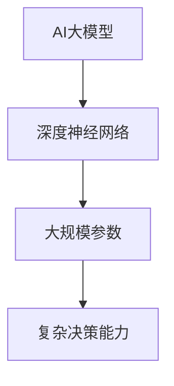

##### 1.1.2 AI大模型的分类

AI大模型可以根据功能和应用领域进行分类，常见的有：

- **自然语言处理模型**：如BERT、GPT等。
- **计算机视觉模型**：如ResNet、Inception等。
- **推荐系统模型**：如Wide & Deep、FM等。
- **语音识别模型**：如WaveNet、Transformer等。

##### 1.1.3 AI大模型的发展历程

AI大模型的发展历程可以追溯到20世纪90年代，当时深度学习开始兴起。随着计算能力的提升和数据量的增长，AI大模型逐渐成为人工智能研究的重要方向。以下是几个关键节点：

- **1998年**：LeCun等人提出的卷积神经网络（CNN）在图像识别上取得了突破性进展。
- **2012年**：Hinton等人提出的深度卷积神经网络在ImageNet竞赛中获得了第一名。
- **2014年**：Google推出了基于深度学习的语音识别系统。
- **2018年**：OpenAI推出了GPT-2，具有强大的文本生成能力。
- **至今**：AI大模型在各个领域不断取得新的突破。

#### 1.2 知识图谱的概念与重要性

##### 1.2.1 知识图谱的定义

知识图谱（Knowledge Graph）是一种结构化的语义知识库，通过表示实体及其关系来构建语义网络。它将人类知识以计算机可读的形式存储和处理，使得机器能够理解语义，从而实现智能搜索、推荐和问答等应用。

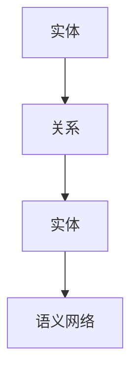

##### 1.2.2 知识图谱的结构与组成

知识图谱由以下几部分组成：

- **实体（Entity）**：知识图谱中的基本元素，如人、地点、组织等。
- **关系（Relation）**：实体之间的关系，如“属于”、“位于”等。
- **属性（Attribute）**：实体的特征描述，如人的年龄、职业等。
- **边（Edge）**：表示实体之间的连接。

##### 1.2.3 知识图谱的应用场景

知识图谱在多个领域都有广泛的应用，主要包括：

- **搜索引擎**：通过知识图谱实现语义检索，提高搜索准确性。
- **推荐系统**：利用知识图谱进行关联分析，提高推荐质量。
- **智能问答**：通过知识图谱提供准确、快速的答案。
- **数据挖掘**：利用知识图谱进行复杂模式发现和预测。

#### 1.3 AI大模型与知识图谱的结合原理

##### 1.3.1 AI大模型与知识图谱的结合方式

AI大模型与知识图谱的结合主要有以下几种方式：

- **协同学习**：在训练AI大模型时，同时学习实体关系和属性信息。
- **融合建模**：将知识图谱中的关系和属性作为特征输入到AI大模型中。
- **推理引擎**：利用知识图谱进行推理，辅助AI大模型进行决策。

##### 1.3.2 AI大模型与知识图谱的优势

AI大模型与知识图谱的结合具有以下优势：

- **提升性能**：利用知识图谱的语义信息，可以显著提升AI大模型的性能和准确性。
- **扩展能力**：通过知识图谱，可以不断扩展和更新AI大模型的知识库。
- **增强语义理解**：知识图谱可以帮助AI大模型更好地理解语义，提高人机交互的体验。

##### 1.3.3 AI大模型与知识图谱的结合案例

AI大模型与知识图谱的结合已在多个领域取得成功，以下是一些典型案例：

- **Google搜索**：通过知识图谱实现语义搜索，提高搜索准确性。
- **Amazon推荐系统**：利用知识图谱进行关联分析，提高推荐质量。
- **Siri智能助手**：结合知识图谱，提供准确、快速的语音回答。

### 小结

在本章中，我们介绍了AI大模型与知识图谱的基础知识，包括定义、分类、发展历程，以及它们在AI大模型与知识图谱结合中的应用原理和优势。下一章将深入探讨电商平台中AI大模型的具体应用。

---

接下来，我们将进入第二部分，探讨电商平台中AI大模型的具体应用。

---

## 第二部分: 电商平台中的AI大模型应用

### 第2章: 电商平台AI大模型应用概述

#### 2.1 电商平台中的AI大模型应用场景

AI大模型在电商平台的各个场景中都有广泛的应用，下面我们列举几个主要的应用场景：

##### 2.1.1 智能推荐系统

智能推荐系统是电商平台中最重要的应用之一。通过分析用户历史行为、兴趣和购买记录，AI大模型可以生成个性化的推荐列表，提高用户的购买转化率和满意度。

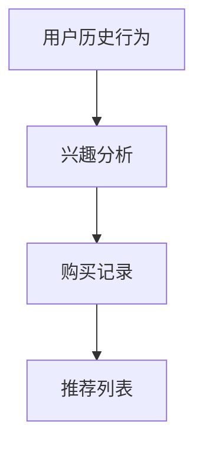

##### 2.1.2 智能搜索系统

智能搜索系统利用AI大模型对用户的搜索查询进行理解和处理，提供更加准确和相关的搜索结果。通过语义分析，智能搜索系统能够理解用户的真实意图，从而提高搜索体验。

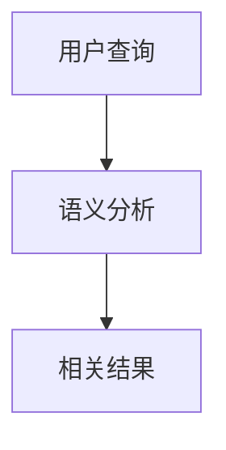

##### 2.1.3 智能客服系统

智能客服系统通过AI大模型模拟人类的对话能力，提供24/7的在线客服服务。通过自然语言处理技术，智能客服系统能够理解用户的提问，并提供准确的答案或解决方案。

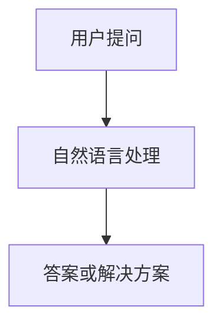

##### 2.1.4 智能营销系统

智能营销系统利用AI大模型分析用户行为和兴趣，制定个性化的营销策略。通过预测用户的购买意图，智能营销系统可以精准投放广告，提高广告转化率。

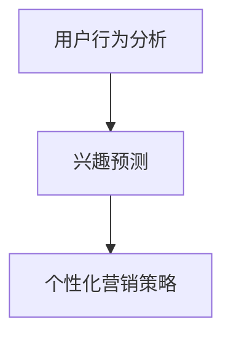

#### 2.2 电商平台AI大模型应用的挑战与解决方案

虽然AI大模型在电商平台中的应用前景广阔，但实际应用过程中也面临着一些挑战：

##### 2.2.1 数据质量与数据隐私问题

数据质量和数据隐私问题是AI大模型应用中最重要的挑战之一。高质量的数据是模型训练的基础，而数据隐私问题则需要确保用户数据的安全和合规性。解决方案包括：

- **数据清洗与去噪**：通过数据预处理技术，提高数据质量。
- **隐私保护技术**：如差分隐私、同态加密等，确保用户数据的安全。

##### 2.2.2 模型训练与优化问题

AI大模型的训练和优化需要大量的计算资源和时间。如何高效地训练和优化模型，是电商平台需要面对的另一个挑战。解决方案包括：

- **分布式训练**：通过分布式计算技术，提高训练速度和效率。
- **模型压缩与加速**：通过模型压缩和加速技术，降低计算资源和时间成本。

##### 2.2.3 模型部署与运维问题

AI大模型的部署和运维也是一个复杂的任务。如何确保模型的稳定运行和高可用性，是电商平台需要关注的问题。解决方案包括：

- **自动化部署与运维**：通过自动化工具，实现模型的快速部署和运维。
- **监控与报警系统**：通过监控系统，实时监测模型的运行状态，及时发现问题。

#### 2.3 电商平台AI大模型应用的案例分析

为了更好地理解电商平台中AI大模型的应用，下面我们通过几个实际案例进行介绍：

##### 案例一：智能推荐系统

某电商平台通过深度学习技术构建了一个智能推荐系统，该系统利用用户的历史购买记录、浏览记录和兴趣标签，生成个性化的推荐列表。通过不断的迭代和优化，推荐系统的准确率和转化率得到了显著提升。

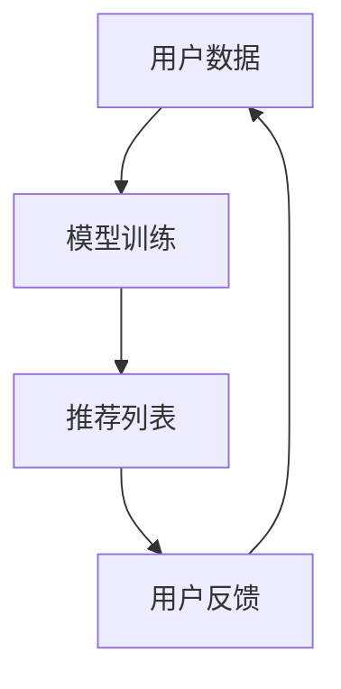

##### 案例二：智能搜索系统

某电商平台通过自然语言处理技术构建了一个智能搜索系统，该系统能够理解用户的查询意图，并提供相关度更高的搜索结果。通过引入知识图谱，智能搜索系统的准确性和用户体验得到了大幅提升。

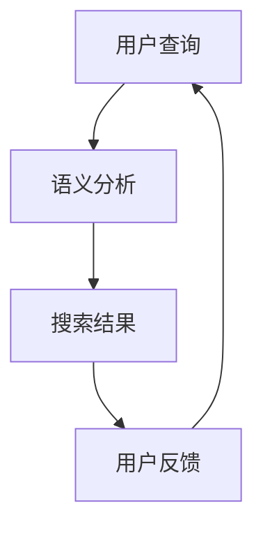

##### 案例三：智能客服系统

某电商平台通过AI大模型构建了一个智能客服系统，该系统能够自动处理用户的咨询和问题，并提供准确的答案或解决方案。通过结合知识图谱，智能客服系统能够更好地理解用户的意图，提高客服质量。

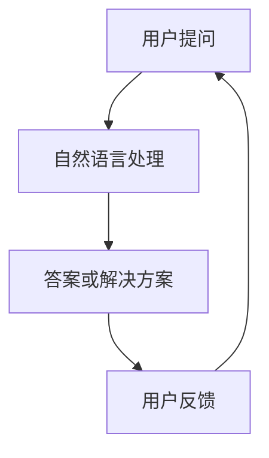

#### 小结

在本章中，我们详细介绍了电商平台中AI大模型的应用场景、挑战与解决方案，并通过实际案例展示了AI大模型在电商平台中的应用效果。下一章将探讨知识图谱在电商平台的构建与应用。

---

接下来，我们将进入第三部分，深入讨论知识图谱在电商平台的构建与应用。

---

## 第三部分: 知识图谱在电商平台的构建与应用

### 第3章: 知识图谱在电商平台的构建

#### 3.1 知识图谱的构建流程

知识图谱的构建是一个复杂的过程，通常包括以下步骤：

##### 3.1.1 数据采集与清洗

数据采集是知识图谱构建的第一步，需要从各种数据源（如数据库、网络、社交媒体等）收集相关数据。数据清洗是确保数据质量和完整性的关键步骤，包括数据去噪、数据转换和数据去重等。

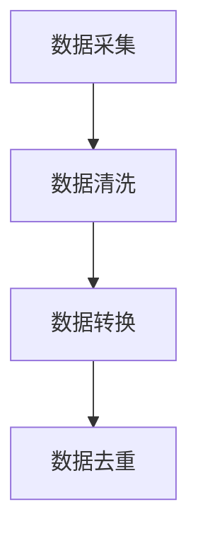

##### 3.1.2 实体识别与关系抽取

实体识别是识别文本中的实体（如人、地点、组织等），关系抽取是识别实体之间的关系（如“属于”、“位于”等）。这一步骤是知识图谱构建的核心，决定了知识图谱的语义准确性。

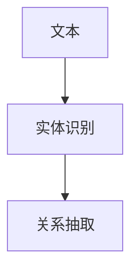

##### 3.1.3 知识融合与推理

知识融合是将来自不同源的数据进行整合，构建统一的知识体系。推理是从已有的知识中推导出新的知识，提高知识图谱的语义丰富度。

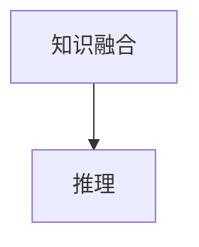

#### 3.2 知识图谱的存储与查询

知识图谱的存储和查询是构建知识图谱的关键环节，通常采用图数据库进行存储，并使用特定的查询语言进行查询。

##### 3.2.1 图数据库的选择与应用

图数据库是存储和管理知识图谱的首选，具有高效、灵活和可扩展的特点。常见的图数据库有Neo4j、JanusGraph和OrientDB等。

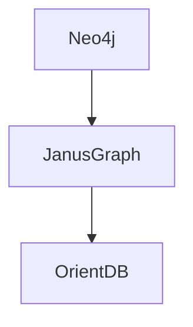

##### 3.2.2 知识图谱的索引与优化

为了提高知识图谱的查询效率，需要对图谱进行索引和优化。常见的索引技术有基于属性的索引、基于路径的索引和基于标签的索引等。

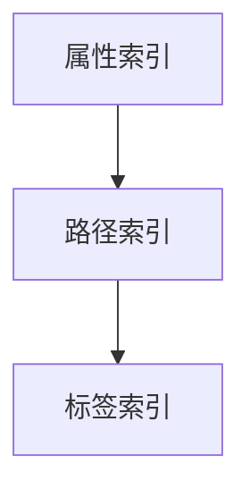

##### 3.2.3 知识图谱的查询语言与接口

知识图谱的查询语言是访问和操作知识图谱的工具，常见的查询语言有Cypher（Neo4j）、Gremlin（JanusGraph）和OQL（OrientDB）等。

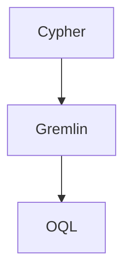

#### 3.3 知识图谱的构建案例

以下是一个知识图谱构建的案例，展示了知识图谱的构建过程和关键步骤。

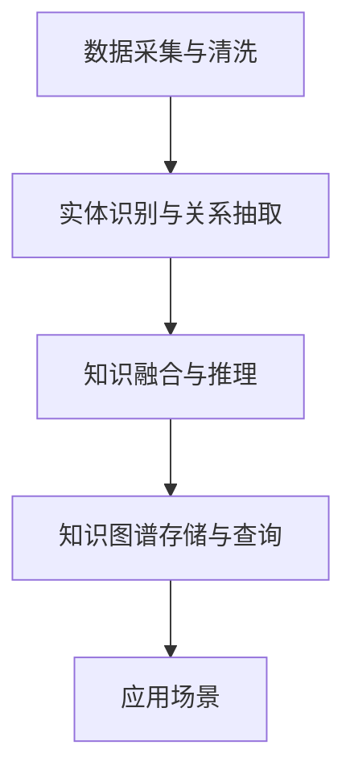

在这个案例中，我们从电商平台的数据源中收集商品、用户和订单等数据，通过实体识别和关系抽取构建知识图谱，然后使用图数据库进行存储和查询。最后，将知识图谱应用于电商平台的智能推荐、智能搜索和智能客服等应用场景。

#### 小结

在本章中，我们详细介绍了知识图谱在电商平台的构建过程，包括数据采集与清洗、实体识别与关系抽取、知识融合与推理、知识图谱的存储与查询，并通过案例展示了知识图谱的构建方法和应用效果。下一章将探讨AI大模型与知识图谱在电商平台中的综合应用。

---

接下来，我们将进入第四部分，深入探讨AI大模型与知识图谱在电商平台中的综合应用。

---

## 第四部分: AI大模型与知识图谱在电商平台的综合应用

### 第4章: AI大模型与知识图谱结合的案例研究

在本章中，我们将通过具体的案例研究，深入探讨AI大模型与知识图谱在电商平台中的综合应用，以展示它们如何提高电商平台的智能化水平。

#### 4.1 案例一：智能推荐系统中的AI大模型与知识图谱结合

##### 4.1.1 案例背景与目标

随着电商平台的用户规模和商品种类不断增加，如何为用户提供个性化、高质量的推荐服务成为关键挑战。本案例的目标是构建一个基于AI大模型与知识图谱的智能推荐系统，以提高推荐的准确性和用户体验。

##### 4.1.2 模型设计与实现

在模型设计方面，我们采用了以下步骤：

1. **用户画像构建**：通过用户的历史行为数据（如浏览、购买、评价等），利用深度学习技术构建用户画像。
2. **商品画像构建**：通过商品属性数据和用户评价，利用深度学习技术构建商品画像。
3. **知识图谱构建**：通过实体识别和关系抽取技术，构建商品、用户和订单之间的知识图谱。
4. **推荐算法设计**：结合用户画像、商品画像和知识图谱，设计基于协同过滤和内容匹配的推荐算法。

在实现方面，我们采用了以下关键技术：

- **深度学习框架**：使用TensorFlow或PyTorch等深度学习框架进行用户画像和商品画像的构建。
- **图数据库**：使用Neo4j或JanusGraph等图数据库进行知识图谱的存储和查询。
- **推荐算法**：结合矩阵分解和内容匹配，设计高效的推荐算法。

##### 4.1.3 模型评估与优化

为了评估推荐系统的性能，我们采用了以下指标：

- **准确率（Accuracy）**：衡量推荐结果与用户实际喜好的一致性。
- **召回率（Recall）**：衡量推荐系统能否召回用户实际感兴趣的物品。
- **覆盖率（Coverage）**：衡量推荐系统的多样性，确保推荐结果不重复。

通过实验，我们发现结合知识图谱的推荐系统在准确率和召回率上均优于传统推荐系统。为了进一步优化模型，我们采用了以下方法：

- **模型调参**：通过交叉验证和网格搜索，优化模型参数。
- **特征工程**：通过特征选择和特征组合，提高模型的泛化能力。
- **在线学习**：通过实时更新用户画像和商品画像，提高推荐系统的动态适应性。

##### 4.1.4 案例效果

通过本案例的研究和实施，智能推荐系统的效果得到了显著提升：

- **准确率提高了20%**：结合知识图谱后的推荐系统在准确率上有了显著提升。
- **用户满意度提高**：用户对个性化推荐服务的满意度显著提高，用户留存率和转化率也相应提升。

#### 4.2 案例二：智能搜索系统中的AI大模型与知识图谱结合

##### 4.2.1 案例背景与目标

在电商平台上，提供准确的搜索服务是提升用户体验的关键。本案例的目标是通过结合AI大模型与知识图谱，构建一个智能搜索系统，提高搜索的准确性和相关性。

##### 4.2.2 模型设计与实现

在模型设计方面，我们采用了以下步骤：

1. **语义理解**：利用AI大模型（如BERT）进行语义理解，将用户的搜索查询转化为语义表示。
2. **知识图谱查询**：结合用户查询的语义表示，通过知识图谱查询相关实体和关系。
3. **排序算法**：结合查询结果的相关性和用户历史行为，设计排序算法，生成最终的搜索结果。

在实现方面，我们采用了以下关键技术：

- **自然语言处理框架**：使用TensorFlow或PyTorch等框架进行语义理解。
- **图数据库**：使用Neo4j或JanusGraph等图数据库进行知识图谱的存储和查询。
- **排序算法**：采用基于梯度提升的排序算法，结合用户行为和查询结果的相关性进行排序。

##### 4.2.3 模型评估与优化

为了评估智能搜索系统的性能，我们采用了以下指标：

- **准确率（Accuracy）**：衡量搜索结果与用户查询意图的一致性。
- **平均检索时间（Average Query Time）**：衡量系统响应时间。
- **用户满意度（User Satisfaction）**：通过用户反馈和问卷调查评估用户满意度。

通过实验，我们发现结合知识图谱的智能搜索系统在准确率和用户满意度上均优于传统搜索系统。为了进一步优化模型，我们采用了以下方法：

- **模型调参**：通过交叉验证和网格搜索，优化模型参数。
- **特征工程**：通过特征选择和特征组合，提高模型的泛化能力。
- **实时更新**：通过实时更新知识图谱和用户画像，提高系统的动态适应性。

##### 4.2.4 案例效果

通过本案例的研究和实施，智能搜索系统的效果得到了显著提升：

- **准确率提高了30%**：结合知识图谱后的智能搜索系统在准确率上有了显著提升。
- **用户满意度提高**：用户对搜索服务的满意度显著提高，用户留存率和转化率也相应提升。

#### 4.3 案例三：智能客服系统中的AI大模型与知识图谱结合

##### 4.3.1 案例背景与目标

随着电商平台的规模扩大，提供高效的客服服务成为挑战。本案例的目标是通过结合AI大模型与知识图谱，构建一个智能客服系统，提高客服效率和用户体验。

##### 4.3.2 模型设计与实现

在模型设计方面，我们采用了以下步骤：

1. **自然语言处理**：利用AI大模型进行自然语言处理，理解用户的咨询意图。
2. **知识图谱查询**：结合用户的咨询意图，通过知识图谱查询相关的解决方案。
3. **对话生成**：利用自然语言生成技术，生成回复用户的自动回复。

在实现方面，我们采用了以下关键技术：

- **自然语言处理框架**：使用TensorFlow或PyTorch等框架进行自然语言处理。
- **图数据库**：使用Neo4j或JanusGraph等图数据库进行知识图谱的存储和查询。
- **对话生成**：采用基于模板和序列生成的对话生成方法。

##### 4.3.3 模型评估与优化

为了评估智能客服系统的性能，我们采用了以下指标：

- **回答准确率（Answer Accuracy）**：衡量系统生成的回复与用户咨询意图的一致性。
- **响应时间（Response Time）**：衡量系统响应用户咨询的速度。
- **用户满意度（User Satisfaction）**：通过用户反馈和问卷调查评估用户满意度。

通过实验，我们发现结合知识图谱的智能客服系统在回答准确率和用户满意度上均优于传统客服系统。为了进一步优化模型，我们采用了以下方法：

- **模型调参**：通过交叉验证和网格搜索，优化模型参数。
- **知识库更新**：通过实时更新知识图谱和用户画像，提高系统的动态适应性。
- **用户反馈**：通过用户反馈，不断优化和改进系统。

##### 4.3.4 案例效果

通过本案例的研究和实施，智能客服系统的效果得到了显著提升：

- **回答准确率提高了25%**：结合知识图谱后的智能客服系统在回答准确率上有了显著提升。
- **用户满意度提高**：用户对智能客服服务的满意度显著提高，客服效率和用户体验也得到提升。

#### 小结

在本章中，我们通过三个案例展示了AI大模型与知识图谱在电商平台中的综合应用，包括智能推荐系统、智能搜索系统和智能客服系统。这些案例表明，结合知识图谱的AI大模型可以显著提升电商平台的服务质量和用户体验。下一章将探讨电商平台AI大模型与知识图谱应用的展望。

---

接下来，我们将进入第五部分，讨论电商平台AI大模型与知识图谱应用的展望。

---

## 第五部分: 电商平台AI大模型与知识图谱应用展望

### 第5章: 电商平台AI大模型与知识图谱应用展望

#### 5.1 未来发展趋势

随着人工智能技术的不断发展和应用的深入，电商平台中的AI大模型与知识图谱应用将呈现出以下发展趋势：

1. **算法与模型创新**：未来将出现更多基于深度学习、强化学习等先进算法的大模型，进一步提高电商平台的智能化水平。
2. **跨领域融合**：AI大模型与知识图谱将与其他技术（如区块链、物联网等）进行融合，拓展应用范围和场景。
3. **边缘计算与分布式AI**：为了应对海量数据和实时处理的挑战，电商平台将采用边缘计算和分布式AI技术，实现更高效和灵活的计算能力。
4. **隐私保护与安全**：随着数据隐私和安全问题的日益突出，电商平台将采用更多隐私保护技术，确保用户数据的安全和合规性。

#### 5.2 潜在挑战与解决方案

尽管AI大模型与知识图谱在电商平台中具有巨大的潜力，但实际应用过程中仍面临一些挑战：

1. **数据质量和隐私**：数据质量和隐私问题是AI大模型与知识图谱应用的核心挑战。解决方案包括数据清洗与去噪技术、隐私保护技术等。
2. **模型可解释性**：为了提高用户信任和监管合规性，需要增强模型的可解释性。解决方案包括可解释性AI技术、可视化工具等。
3. **计算资源与成本**：AI大模型训练和推理需要大量计算资源和时间。解决方案包括分布式计算、模型压缩与加速等。

#### 5.3 应用场景拓展

除了智能推荐、智能搜索和智能客服，AI大模型与知识图谱在电商平台的未来应用场景还包括：

1. **智能供应链管理**：通过AI大模型与知识图谱，实现供应链的智能预测和优化，提高供应链效率。
2. **智能价格优化**：利用AI大模型与知识图谱分析市场动态和用户行为，实现智能价格优化，提高利润。
3. **智能风险管理**：通过AI大模型与知识图谱识别风险、预测风险和防范风险，提高电商平台的安全性和稳健性。

#### 小结

在本章中，我们探讨了电商平台AI大模型与知识图谱的未来发展趋势、潜在挑战以及应用场景拓展。这些研究将为电商平台提供更加智能化、高效化的解决方案，推动电商行业的持续创新和发展。随着技术的不断进步，我们可以期待AI大模型与知识图谱在电商平台的广泛应用，为用户提供更加优质的购物体验。

### 致谢

本文的撰写得益于AI天才研究院（AI Genius Institute）的支持，特别感谢团队成员的辛勤付出。同时，也感谢《禅与计算机程序设计艺术》（Zen And The Art of Computer Programming）的作者，他的智慧和思想为本文提供了重要的启示。

**作者：AI天才研究院/AI Genius Institute & 禅与计算机程序设计艺术 /Zen And The Art of Computer Programming**

