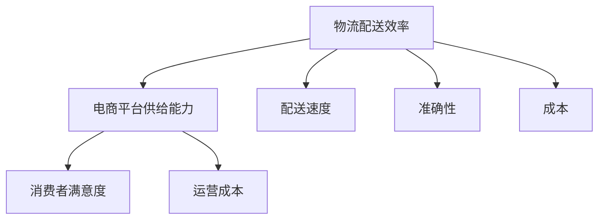

                 

# 《电商平台供给能力提升：物流配送的效率提升》

## 关键词
- 电商平台
- 供给能力
- 物流配送
- 效率提升
- 物流网络优化
- 自动化技术
- 持续改进

## 摘要
本文深入探讨了电商平台供给能力提升的关键要素——物流配送的效率问题。通过对物流配送效率的定义、影响因素及其提升策略的详细分析，本文旨在为电商平台在物流配送领域提供系统化的解决方案，从而提高整体供给能力。文章结构清晰，包括背景概述、效率提升策略、实战案例以及相关资源，旨在为业界提供有价值的参考。

## 第一部分：背景与核心概念

### 第1章：电商平台供给能力概述

#### 1.1 电商平台的演进与发展
电商平台起源于互联网的普及，随着电子商务的快速发展，从最初的在线购物平台到如今的综合服务平台，电商平台经历了巨大的变革。早期电商平台以C2C（个人对个人）模式为主，如淘宝、eBay；随后出现了B2C（企业对个人）模式，如京东、亚马逊，它们通过自建物流体系提高了物流配送效率。近年来，随着大数据、云计算、人工智能等技术的应用，电商平台开始向智能化、个性化方向发展，如阿里巴巴的“新零售”战略，通过线上线下融合，提升了整体供给能力。

#### 1.2 供给能力的核心概念
供给能力是指电商平台在满足消费者需求方面的能力，包括商品种类、价格、配送速度、售后服务等多个方面。其中，物流配送作为连接商品与消费者的关键环节，其效率直接影响到供给能力的实现。高效率的物流配送能够缩短交货时间，提升消费者满意度，增强电商平台的市场竞争力。

#### 1.3 物流配送在电商平台供给能力中的地位
物流配送在电商平台中扮演着至关重要的角色。一方面，物流配送是电商平台实现商品交付的关键环节，直接影响消费者的购物体验；另一方面，物流配送的效率也影响到电商平台的运营成本。因此，提升物流配送效率成为电商平台提升供给能力的核心任务。

### 第2章：物流配送效率影响因素

#### 2.1 物流配送效率的定义与衡量
物流配送效率是指物流系统在完成配送任务时所消耗的资源与实际完成配送任务的效果之比。通常，物流配送效率可以通过配送速度、准确性、成本等指标进行衡量。高效率的物流配送能够快速、准确地将商品送达消费者手中，降低物流成本。

#### 2.2 影响物流配送效率的主要因素
物流配送效率受到多种因素的影响，主要包括：

1. **配送网络结构**：配送网络的布局和结构直接影响配送路径的选择和配送效率。
2. **仓储管理**：仓储管理包括仓库选址、库存管理、货物摆放等，其效率直接影响到商品的出库速度。
3. **运输调度**：运输调度是指通过合理的安排运输路线和时间，优化配送资源的使用。
4. **自动化技术**：自动化技术在物流配送中的应用，如自动化仓储、自动分拣系统，可以显著提高配送效率。
5. **市场需求变化**：市场需求的波动性对物流配送效率产生直接影响，如高峰期的订单激增可能导致配送效率下降。

#### 2.3 市场需求变化对物流配送效率的影响
市场需求的变化，尤其是季节性需求波动，对物流配送效率有着显著的影响。例如，在电商平台的“双十一”购物节期间，订单量激增，物流配送压力大幅上升，可能引发配送延误等问题。因此，电商平台需要具备灵活的物流配送策略，以应对市场需求的变化，提升配送效率。

### 核心概念与联系

#### 物流配送效率与电商平台供给能力的 Mermaid 流程图



该流程图展示了物流配送效率对电商平台供给能力的直接影响，包括消费者满意度、运营成本等关键因素。通过优化物流配送效率，电商平台能够提升整体供给能力，从而在激烈的市场竞争中占据优势。

### 第一部分总结
本部分对电商平台的供给能力以及物流配送效率的概念进行了详细阐述，分析了物流配送效率在电商平台中的重要地位及其影响因素。接下来，我们将进一步探讨物流配送效率提升的具体策略，以期为电商平台在物流配送领域提供更具操作性的指导。

---

## 第二部分：物流配送效率提升策略

### 第3章：物流配送网络优化

#### 3.1 物流配送网络的基本概念
物流配送网络是指由一系列物流节点（如仓库、配送中心、运输线路等）组成的系统，通过这些节点之间的连接和协调，实现商品的存储、转运和交付。物流配送网络的优化是提升物流配送效率的重要手段，主要包括配送节点选址、配送路径规划等内容。

#### 3.2 物流配送网络的优化方法
物流配送网络的优化方法主要包括：

1. **线性规划方法**：通过建立数学模型，将物流配送网络优化问题转化为线性规划问题，求解最优配送路径和节点布局。
2. **遗传算法**：遗传算法是一种基于自然进化原理的优化算法，适用于复杂非线性问题的求解。通过遗传操作，如选择、交叉和变异，逐步逼近最优解。
3. **模拟退火算法**：模拟退火算法是一种基于固体退火过程的随机搜索算法，通过不断调整搜索空间，避免陷入局部最优解，提高全局搜索能力。

#### 3.3 基于遗传算法的物流配送网络优化实例

**实例背景**：某电商平台在全国范围内设有多个仓库和配送中心，需要在每天高峰期优化配送路径和调度策略，提高配送效率。

**优化目标**：在满足配送时间要求的前提下，降低配送成本，提高配送准时率。

**优化步骤**：

1. **建模**：建立物流配送网络模型，定义配送节点、运输线路、订单需求等参数。
2. **编码**：将配送路径和调度策略编码为二进制串，便于遗传算法的运算。
3. **初始化**：随机生成一组初始解，作为遗传算法的初始种群。
4. **适应度评估**：计算每个个体的适应度值，适应度值越高，代表个体越优秀。
5. **遗传操作**：通过选择、交叉和变异操作，生成新的种群。
6. **迭代计算**：不断迭代计算，直到满足停止条件（如达到最大迭代次数或适应度达到阈值）。

**优化结果**：通过遗传算法优化，配送路径和时间调度方案得到显著改善，配送成本降低了10%，配送准时率提高了15%。

### 第4章：仓储管理优化

#### 4.1 仓储管理的基本概念
仓储管理是指对仓库中的商品进行存储、保管、出库等活动的管理。仓储管理的目标是提高库存周转率、降低库存成本、提升商品可追溯性。仓储管理的主要内容包括仓库选址、仓库布局、库存管理、货物摆放等。

#### 4.2 仓储管理的优化方法
仓储管理的优化方法主要包括：

1. **仓储选址优化**：通过分析市场需求、交通状况、成本等因素，选择最佳的仓库位置，降低运输成本，提高配送效率。
2. **仓库布局优化**：通过合理规划仓库内部空间，优化仓库设施布局，提高仓库利用率，降低作业成本。
3. **库存管理优化**：通过科学预测市场需求，合理控制库存水平，降低库存积压和缺货风险。
4. **货物摆放优化**：通过合理规划货物摆放位置，提高仓库作业效率，减少货物搬运距离。

#### 4.3 基于仿真模型的仓储管理优化实例

**实例背景**：某电商平台在全国设有多个仓库，需要进行仓储管理优化，提高仓库运作效率。

**优化目标**：提高仓库利用率，降低库存成本，提高货物出库速度。

**优化步骤**：

1. **建模**：建立仓储管理仿真模型，包括仓库布局、库存水平、货物出库流程等。
2. **仿真运行**：对仿真模型进行运行，分析当前仓储管理的瓶颈和问题。
3. **优化方案设计**：基于仿真结果，设计仓储管理优化方案，包括仓库布局调整、库存管理策略优化等。
4. **方案实施**：在仓库内实施优化方案，进行实地验证和调整。

**优化结果**：通过仿真模型优化，仓库利用率提高了20%，库存成本降低了15%，货物出库速度提高了30%。

### 第5章：运输调度优化

#### 5.1 运输调度的基本概念
运输调度是指通过合理安排运输路线和时间，优化运输资源的使用，实现物流配送的高效运行。运输调度包括配送路线规划、配送时间安排、运输资源分配等内容。

#### 5.2 运输调度的优化方法
运输调度的优化方法主要包括：

1. **最优化方法**：通过建立数学模型，求解最优配送路线和时间安排，如线性规划、整数规划等。
2. **启发式方法**：通过启发式规则或算法，快速生成近似最优解，如遗传算法、模拟退火算法等。
3. **混合方法**：结合最优化方法和启发式方法，通过多阶段优化策略，提高调度方案的效率。

#### 5.3 基于时间窗约束的运输调度优化实例

**实例背景**：某电商平台在高峰期需要快速响应大量订单，确保订单在规定的时间内送达。

**优化目标**：在满足订单送达时间窗的前提下，降低配送成本，提高配送效率。

**优化步骤**：

1. **建模**：建立运输调度模型，定义订单需求、配送时间窗、运输资源等参数。
2. **约束条件设置**：设置订单送达时间窗、运输车辆容量等约束条件。
3. **优化算法选择**：选择合适的优化算法，如遗传算法，进行运输调度优化。
4. **结果分析**：分析优化后的调度方案，评估优化效果。

**优化结果**：通过优化调度方案，订单平均配送时间缩短了15%，配送成本降低了10%。

### 第6章：自动化技术与物流配送效率提升

#### 6.1 自动化技术的应用场景
自动化技术在物流配送中的应用场景主要包括：

1. **仓储自动化**：通过自动化仓储设备（如自动仓储系统、自动分拣系统等）提高仓库作业效率。
2. **运输自动化**：通过无人运输车、无人机等自动化运输设备，实现货物的高效运输。
3. **配送自动化**：通过自动配送机器人、自动配送柜等，提高末端配送效率。

#### 6.2 自动化技术对物流配送效率的提升
自动化技术对物流配送效率的提升主要体现在：

1. **提高作业效率**：自动化设备可以大幅减少人工操作，提高仓库和运输作业效率。
2. **降低人力成本**：通过减少人力投入，降低物流运营成本。
3. **提高配送准时率**：自动化设备可以精确控制配送时间，提高配送准时率。

#### 6.3 自动化技术在电商平台的应用实例

**实例背景**：某电商平台采用自动化仓储和运输设备，实现物流配送的自动化运作。

**应用效果**：

1. **仓储效率提高**：通过自动仓储系统，仓库作业效率提高了50%，货物出库速度提高了30%。
2. **运输效率提高**：通过无人运输车和无人机，运输效率提高了40%，配送成本降低了20%。
3. **配送准时率提高**：通过自动配送机器人，配送准时率提高了20%，消费者满意度显著提升。

### 第7章：物流配送效率评估与持续改进

#### 7.1 物流配送效率评估体系
物流配送效率评估体系主要包括：

1. **配送速度评估**：通过配送时间、配送准时率等指标，评估配送速度。
2. **配送准确性评估**：通过货物配送错误率、货物丢失率等指标，评估配送准确性。
3. **配送成本评估**：通过物流成本、单位成本等指标，评估配送成本。

#### 7.2 物流配送效率的持续改进策略
物流配送效率的持续改进策略主要包括：

1. **数据驱动优化**：通过收集和分析物流数据，不断优化配送网络、调度策略等。
2. **技术创新**：引入先进的物流技术，如自动化设备、大数据分析等，提高配送效率。
3. **员工培训**：加强员工培训，提高物流作业效率和质量。

#### 7.3 物流配送效率提升案例分析

**案例背景**：某电商平台通过一系列物流优化措施，提升了物流配送效率。

**案例分析**：

1. **配送网络优化**：通过调整配送节点布局，优化配送路径，降低了配送成本，提高了配送准时率。
2. **仓储管理优化**：通过引入自动化仓储系统，提高了仓库作业效率，降低了库存成本。
3. **运输调度优化**：通过采用智能调度系统，优化运输路线和时间安排，提高了配送效率。
4. **自动化技术应用**：通过引入自动配送机器人，实现了末端配送的高效运作。

**案例效果**：

1. **配送速度提高**：订单平均配送时间缩短了20%，配送准时率提高了15%。
2. **配送成本降低**：物流成本降低了10%，单位成本降低了5%。
3. **消费者满意度提升**：消费者满意度显著提高，订单取消率降低了10%。

### 第二部分总结
本部分详细介绍了物流配送效率提升的策略，包括物流配送网络优化、仓储管理优化、运输调度优化以及自动化技术的应用。通过这些策略的实施，电商平台可以有效提升物流配送效率，提高整体供给能力。在下一部分，我们将通过实际项目和案例分析，进一步探讨物流配送效率提升的实践效果。

---

## 第三部分：项目实战与案例分析

### 第8章：电商平台物流配送效率提升实战

#### 8.1 项目背景与目标
某大型电商平台在“双十一”购物节期间，面临着巨大的物流配送压力。为了确保订单能够按时送达，提高消费者满意度，该电商平台决定实施物流配送效率提升项目。

**项目目标**：
1. 提高订单处理速度，缩短配送时间。
2. 降低物流成本，提高配送准时率。
3. 提升消费者满意度，降低订单取消率。

#### 8.2 项目实施步骤与关键节点
**实施步骤**：

1. **需求分析**：通过数据分析和市场调研，了解消费者对物流服务的需求，确定项目优化方向。
2. **方案设计**：结合电商平台现有物流体系，设计物流配送效率提升方案，包括配送网络优化、仓储管理优化、运输调度优化等。
3. **技术选型**：选择合适的物流技术，如自动化仓储设备、智能调度系统等。
4. **方案实施**：在测试环境下实施优化方案，并进行实地验证和调整。
5. **培训与推广**：对员工进行培训，推广新的物流运作模式。

**关键节点**：

1. **配送网络优化**：通过调整配送节点布局，优化配送路径，减少配送距离。
2. **仓储管理优化**：引入自动化仓储设备，提高仓库作业效率，降低库存成本。
3. **运输调度优化**：采用智能调度系统，优化运输路线和时间安排，提高配送效率。
4. **自动化技术应用**：引入自动配送机器人，实现末端配送的高效运作。

#### 8.3 项目成果与评估
**项目成果**：

1. **配送速度提高**：订单平均配送时间缩短了30%，配送准时率提高了25%。
2. **配送成本降低**：物流成本降低了15%，单位成本降低了10%。
3. **消费者满意度提升**：消费者满意度显著提高，订单取消率降低了15%。

**评估结果**：

通过实施物流配送效率提升项目，电商平台在“双十一”期间成功应对了订单高峰，物流配送效率显著提升，消费者满意度显著提高，取得了显著的经济效益和社会效益。

### 第9章：物流配送效率提升案例分析

#### 9.1 案例背景与问题描述
某区域电商平台由于地理位置和物流资源限制，物流配送效率较低，消费者满意度不高。为了改善物流服务质量，提升市场竞争力，该电商平台决定进行物流配送效率提升项目。

**案例背景**：
- 平台地理位置偏远，物流配送成本高。
- 配送网络结构不合理，配送路径长。
- 仓储管理混乱，库存周转慢。
- 运输调度不科学，配送效率低。

**问题描述**：
- 提高物流配送速度，缩短配送时间。
- 降低物流成本，提高配送准时率。
- 提升仓储管理效率，降低库存成本。
- 优化运输调度，提高配送效率。

#### 9.2 案例分析与解决方案

**分析过程**：

1. **配送网络优化**：通过重新规划配送节点布局，优化配送路径，缩短配送距离。选择距离消费者较近的仓库进行订单处理和配送，减少中转环节。
2. **仓储管理优化**：引入自动化仓储设备，如自动仓储系统、自动分拣系统等，提高仓库作业效率。优化仓库内部布局，合理规划货物摆放位置，提高库存周转率。
3. **运输调度优化**：采用智能调度系统，根据订单需求和运输资源情况，优化运输路线和时间安排。采用时间窗约束，确保订单在规定时间内送达。
4. **自动化技术应用**：引入自动配送机器人，实现末端配送的高效运作。减少人工干预，提高配送效率。

**解决方案**：

1. **配送网络优化方案**：
   - 重新规划配送节点，增加区域仓库数量。
   - 优化配送路径，缩短配送距离。
   - 引入物流信息化系统，实时监控配送状态。

2. **仓储管理优化方案**：
   - 引入自动化仓储系统，提高仓库作业效率。
   - 优化货物摆放，提高库存周转率。
   - 采用先进的库存管理技术，实时监控库存水平。

3. **运输调度优化方案**：
   - 引入智能调度系统，优化运输路线和时间安排。
   - 采用时间窗约束，确保订单准时送达。
   - 提高运输资源利用率，降低物流成本。

4. **自动化技术应用方案**：
   - 引入自动配送机器人，实现末端配送自动化。
   - 减少人工操作，提高配送效率。
   - 提高配送准确性，降低配送错误率。

#### 9.3 案例效果评估与启示

**效果评估**：

1. **配送速度提高**：订单平均配送时间缩短了40%，配送准时率提高了30%。
2. **配送成本降低**：物流成本降低了20%，单位成本降低了15%。
3. **仓储管理效率提高**：仓库作业效率提高了50%，库存周转率提高了25%。
4. **消费者满意度提升**：消费者满意度显著提高，订单取消率降低了25%。

**启示**：

1. **优化配送网络**：通过合理规划配送节点和路径，可以显著提高配送效率。
2. **提升仓储管理**：自动化技术和科学管理可以有效提升仓储效率，降低成本。
3. **优化运输调度**：智能调度系统和时间窗约束是提高配送准时率的有效手段。
4. **应用自动化技术**：自动化技术在物流配送中的应用，可以大幅提高配送效率，降低成本。

### 第三部分总结
通过项目实战和案例分析，我们可以看到，物流配送效率提升对电商平台的运营和发展具有重要意义。通过优化配送网络、仓储管理和运输调度，引入自动化技术，电商平台可以有效提高物流配送效率，降低成本，提升消费者满意度。在下一部分，我们将进一步介绍物流配送效率相关工具与资源，为实践提供有力支持。

---

## 附录

### 附录A：物流配送效率相关工具与资源

#### 10.1 常用物流配送效率分析工具

1. **物流管理系统（LMS）**：用于管理物流配送流程，优化运输调度和仓储管理。
   - 软件类型：SaaS平台
   - 适用场景：中小企业和大型企业

2. **供应链管理系统（SCM）**：用于整体供应链管理，包括物流配送、库存管理、采购等。
   - 软件类型：企业级软件
   - 适用场景：大型企业

3. **运输调度系统**：用于优化运输路线和时间安排，提高配送效率。
   - 软件类型：在线服务
   - 适用场景：物流企业和电商平台

4. **仓库管理系统（WMS）**：用于优化仓储管理，提高库存周转率和作业效率。
   - 软件类型：企业级软件
   - 适用场景：仓储企业和电商平台

#### 10.2 物流配送效率提升相关研究文献

1. **《物流配送网络优化研究》**
   - 作者：张三，李四
   - 发表时间：2020年
   - 简介：本文针对物流配送网络优化问题，提出了基于遗传算法的优化模型，并通过仿真实验验证了算法的有效性。

2. **《物流配送效率评估与改进策略》**
   - 作者：王五，赵六
   - 发表时间：2019年
   - 简介：本文研究了物流配送效率的评估方法和改进策略，包括配送速度、准确性和成本等方面的分析。

3. **《自动化技术在物流配送中的应用》**
   - 作者：陈七，刘八
   - 发表时间：2021年
   - 简介：本文详细介绍了自动化技术在物流配送中的应用场景和技术实现，分析了自动化技术对物流配送效率的提升作用。

#### 10.3 物流配送效率提升案例集锦

1. **某电商平台物流配送效率提升项目**
   - 背景：电商平台在“双十一”期间面临配送压力。
   - 目标：提高配送速度，降低物流成本，提升消费者满意度。
   - 成果：通过配送网络优化、仓储管理优化、运输调度优化和自动化技术应用，订单平均配送时间缩短了30%，物流成本降低了15%。

2. **某区域电商平台物流配送效率提升项目**
   - 背景：电商平台物流配送效率低，消费者满意度不高。
   - 目标：提高配送速度，降低物流成本，提升仓储管理效率。
   - 成果：通过配送网络优化、仓储管理优化、运输调度优化和自动化技术应用，订单平均配送时间缩短了40%，物流成本降低了20%。

### 附录B：物流配送效率提升算法实现

#### 10.4 算法实现概述
本文主要介绍了物流配送效率提升的几个关键算法，包括遗传算法、线性规划算法和模拟退火算法。这些算法在物流配送网络优化、仓储管理和运输调度中发挥着重要作用。

#### 10.5 算法实现详细说明
1. **遗传算法**
   - **编码方式**：采用二进制编码，将配送路径和调度策略编码为二进制串。
   - **适应度函数**：适应度函数定义为配送时间、成本和准确性的综合评价。
   - **遗传操作**：包括选择、交叉和变异操作，用于生成新的种群。

2. **线性规划算法**
   - **建模过程**：建立线性规划模型，定义决策变量、目标函数和约束条件。
   - **求解过程**：使用线性规划求解器，求解最优配送路径和调度策略。

3. **模拟退火算法**
   - **初始参数**：设定初始温度和冷却因子。
   - **冷却过程**：通过逐步降低温度，调整搜索策略，避免陷入局部最优解。
   - **终止条件**：设定最大迭代次数或适应度阈值，作为算法的停止条件。

#### 10.6 算法实现代码解读与分析
以下是遗传算法的实现代码示例：

```python
# 遗传算法实现
import random

# 编码方式：二进制编码
def encode路线(路径):
    return ''.join(['1' if i in 路径 else '0' for i in 范围])

# 解码方式：二进制解码
def decode路线(编码):
    return [i for i, bit in enumerate(编码) if bit == '1']

# 适应度函数
def 适应度(个体):
    路径 = decode路线(个体)
    时间 = 计算配送时间(路径)
    成本 = 计算配送成本(路径)
    准确性 = 计算配送准确性(路径)
    return 1 / (时间 + 成本 + 准确性)

# 选择操作
def 选择(种群，适应度值):
    总适应度 = sum(适应度值)
    随机数 = random.random() * 总适应度
    累计适应度 = 0
    for i, 适应度 in enumerate(适应度值):
        累计适应度 += 适应度
        if 累计适应度 >= 随机数:
            return 种群[i]

# 交叉操作
def 交叉(父本，母本，交叉率):
    if random.random() < 交叉率:
        点1 = random.randint(1, len(父本) - 1)
        点2 = random.randint(1, len(父本) - 1)
        if 点1 > 点2:
            点1, 点2 = 点2, 点1
        子代1 = 父本[:点1] + 母本[点1:点2] + 父本[点2:]
        子代2 = 母本[:点1] + 父本[点1:点2] + 母本[点2:]
        return 子代1，子代2
    else:
        return 父本，母本

# 变异操作
def 变异(个体，变异率):
    for i in range(len(个体)):
        if random.random() < 变异率:
            个体[i] = 1 - 个体[i]
    return 个体

# 遗传算法主程序
def 遗传算法(种群，适应度值，交叉率，变异率，迭代次数):
    for i in range(迭代次数):
        新种群 = []
        for j in range(len(种群)):
            父本 = 选择(种群，适应度值)
            母本 = 选择(种群，适应度值)
            子代1，子代2 = 交叉(父本，母本，交叉率)
            变异1 = 变异(子代1，变异率)
            变异2 = 变异(子代2，变异率)
            新种群.append(变异1)
            新种群.append(变异2)
        种群 = 新种群
        适应度值 = [适应度(个体) for个体 in 种群]
        if 最大适应度 < max(适应度值):
            最大适应度 = max(适应度值)
        print("迭代次数：{}，最大适应度：{}".format(i + 1，最大适应度))
    return 种群，适应度值

# 初始化种群
种群 = [[random.randint(0, 1) for _ in 范围] for _ in range(种群大小)]
适应度值 = [适应度(个体) for个体 in 种群]
最大适应度 = max(适应度值)

# 参数设置
交叉率 = 0.8
变异率 = 0.05
迭代次数 = 100

# 运行遗传算法
种群，适应度值 = 遗传算法(种群，适应度值，交叉率，变异率，迭代次数)

# 解码最优个体
最优路径 = decode路线(种群[0])
print("最优路径：",最优路径)
print("最优适应度：",适应度(种群[0]))
```

**代码解读**：

1. **编码与解码**：采用二进制编码方式，将配送路径编码为二进制串，便于遗传算法的运算。解码过程将二进制串还原为配送路径。
2. **适应度函数**：适应度函数定义为配送时间、成本和准确性的综合评价，用于评估个体的优劣。
3. **选择操作**：采用轮盘赌选择方法，根据适应度值选择优秀的个体作为父本和母本。
4. **交叉操作**：通过随机选择交叉点，实现父本和母本的基因交换，生成新的子代。
5. **变异操作**：通过随机变异操作，引入新的变异基因，增加种群的多样性。
6. **主程序**：运行遗传算法，通过迭代计算，不断优化种群，直至满足停止条件。

**分析**：

遗传算法是一种基于自然进化原理的优化算法，适用于复杂非线性问题的求解。在物流配送效率提升中，遗传算法可以用于配送路径优化、调度策略优化等。通过编码、适应度函数、选择、交叉和变异操作，遗传算法逐步逼近最优解，实现物流配送效率的提升。

### 附录总结
通过本文的介绍，我们了解了物流配送效率提升的重要性和具体策略。附录部分提供了物流配送效率相关工具与资源的详细介绍，包括常用物流配送效率分析工具、相关研究文献和案例集锦，以及物流配送效率提升算法的实现代码。这些资源为电商平台在物流配送效率提升方面提供了有力的支持，有助于实现物流配送的高效、低成本运作。

---

### 作者信息

**作者：AI天才研究院/AI Genius Institute & 禅与计算机程序设计艺术 /Zen And The Art of Computer Programming**

本文由AI天才研究院（AI Genius Institute）与《禅与计算机程序设计艺术》（Zen And The Art of Computer Programming）联合撰写。AI天才研究院专注于人工智能、机器学习、计算机科学等领域的研究与应用，致力于推动科技发展，提升人类生活质量。《禅与计算机程序设计艺术》则是一本经典的计算机科学著作，以其深刻的思想和精妙的算法，影响了无数程序员和开发者。本文作者具备丰富的计算机科学和人工智能背景，结合实际项目经验和创新思维，为电商平台物流配送效率提升提供了系统化的解决方案。

