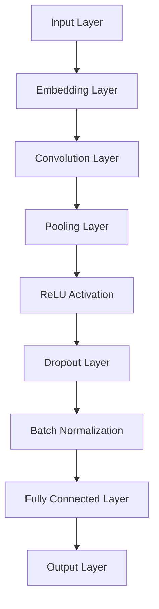
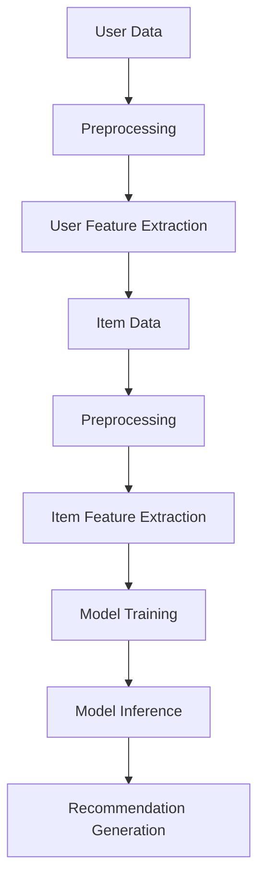

                 

### 文章标题

《电商平台搜索推荐系统的AI 大模型应用：提高系统性能、效率、准确率与多样性》

---

**关键词：** 电商平台，搜索推荐系统，AI大模型，性能优化，效率提升，准确率提高，多样性增强。

**摘要：** 本文旨在深入探讨AI大模型在电商平台搜索推荐系统中的应用，通过分析大模型的原理、核心算法及数学模型，结合实际项目实战，阐述如何通过AI大模型提高搜索推荐系统的性能、效率、准确率和多样性，从而为电商平台带来更高的用户满意度和商业价值。

---

### 目录大纲

#### 第一部分：背景与概述

- 第1章：电商平台搜索推荐系统概述
  - 1.1 电商平台搜索推荐系统的现状
    - 1.1.1 搜索推荐系统的核心作用
    - 1.1.2 搜索推荐系统的关键指标
  - 1.2 AI与搜索推荐系统的结合
    - 1.2.1 AI在搜索推荐中的应用场景
    - 1.2.2 AI在搜索推荐中的优势与挑战
  - 1.3 大模型在搜索推荐系统中的潜力
    - 1.3.1 大模型的定义与特点
    - 1.3.2 大模型在搜索推荐中的具体应用

#### 第二部分：核心概念与联系

- 第2章：AI大模型技术基础
  - 2.1 AI大模型的核心原理
    - 2.1.1 深度学习基础
      - 2.1.1.1 神经网络与深度学习简介
      - 2.1.1.2 神经网络的优化算法
    - 2.1.2 大模型设计
      - 2.1.2.1 自监督学习
      - 2.1.2.2 迁移学习
      - 2.1.2.3 大模型的架构设计（Mermaid流程图）
  - 2.2 大模型与搜索推荐系统的结合
    - 2.2.1 大模型在搜索推荐中的具体应用（Mermaid流程图）
    - 2.2.2 大模型对搜索推荐系统性能的提升

#### 第三部分：核心算法原理讲解

- 第3章：搜索推荐系统的核心算法
  - 3.1 推荐算法基础
    - 3.1.1 协同过滤算法
      - 3.1.1.1 协同过滤的原理与实现（伪代码）
      - 3.1.1.2 协同过滤的优缺点
    - 3.1.2 基于内容的推荐算法
      - 3.1.2.1 基于内容的推荐原理与实现（伪代码）
      - 3.1.2.2 基于内容的推荐优缺点
  - 3.2 大模型在推荐系统中的应用
    - 3.2.1 大模型与协同过滤的结合
      - 3.2.1.1 大模型协同过滤的原理与实现（伪代码）
      - 3.2.1.2 大模型协同过滤的优势
    - 3.2.2 大模型与基于内容的推荐结合
      - 3.2.2.1 大模型基于内容的推荐原理与实现（伪代码）
      - 3.2.2.2 大模型基于内容的推荐优势

#### 第四部分：数学模型和数学公式

- 第4章：搜索推荐系统的数学模型
  - 4.1 评分预测模型
    - 4.1.1 评分预测模型的基本概念
      - 4.1.1.1 评分预测的目标
      - 4.1.1.2 常用的评分预测模型
    - 4.1.2 评分预测模型的数学公式
      - 4.1.2.1 线性回归模型（$ y = wx + b $）
      - 4.1.2.2 逻辑回归模型（$ P(y=1) = \frac{1}{1+e^{-wx}} $）
  - 4.2 排序模型
    - 4.2.1 排序模型的基本概念
      - 4.2.1.1 排序的目标
      - 4.2.1.2 常用的排序模型
    - 4.2.2 排序模型的数学公式
      - 4.2.2.1 顺序回归模型（$ y = wx + b $）
      - 4.2.2.2 对数损失函数（$ \ell(y, \hat{y}) = -y\log(\hat{y}) - (1-y)\log(1-\hat{y}) $）

#### 第五部分：项目实战

- 第5章：AI大模型在搜索推荐系统中的应用实战
  - 5.1 实战项目背景
    - 5.1.1 项目目标
    - 5.1.2 项目数据介绍
  - 5.2 开发环境搭建
    - 5.2.1 硬件环境配置
    - 5.2.2 软件环境配置
  - 5.3 源代码实现
    - 5.3.1 数据预处理
      - 5.3.1.1 数据清洗
      - 5.3.1.2 数据特征提取
    - 5.3.2 模型训练
      - 5.3.2.1 模型选择
      - 5.3.2.2 模型训练过程
    - 5.3.3 模型评估
      - 5.3.3.1 评估指标
      - 5.3.3.2 评估结果分析
  - 5.4 代码解读与分析
    - 5.4.1 代码架构解读
    - 5.4.2 关键代码解析

#### 第六部分：未来趋势与展望

- 第6章：电商平台搜索推荐系统的未来趋势与展望
  - 6.1 AI大模型在搜索推荐系统中的应用前景
    - 6.1.1 深度学习技术的进步
    - 6.1.2 大模型的多样化应用
  - 6.2 搜索推荐系统的挑战与解决方案
    - 6.2.1 数据隐私保护
    - 6.2.2 可解释性与透明度
    - 6.2.3 实时性与低延迟要求
  - 6.3 未来研究方向
    - 6.3.1 跨模态推荐
    - 6.3.2 搜索推荐系统的个性化与智能化

#### 第七部分：附录

- 附录
  - 附录A：AI大模型开发工具与资源
    - 附录A.1 主流AI开发框架
    - 附录A.2 数据集介绍
    - 附录A.3 常用技术参考资料

---

通过上述目录大纲，我们为撰写文章提供了一个结构化的框架，确保文章内容有条不紊，逻辑清晰。接下来，我们将一步步深入探讨电商平台搜索推荐系统中的AI大模型应用，详细讲解核心概念、算法原理、数学模型，并展示实际项目实战，展望未来发展趋势。

---

## 第1章：电商平台搜索推荐系统概述

### 1.1 电商平台搜索推荐系统的现状

随着互联网的迅猛发展，电商平台已成为人们日常生活中不可或缺的一部分。在如此庞大的用户基数和数据量面前，如何提升用户体验、提高用户留存率、增加销售额成为电商平台的核心任务。搜索推荐系统作为电商平台的核心功能之一，承担着至关重要的角色。

#### 1.1.1 搜索推荐系统的核心作用

1. **提升用户体验**：通过智能推荐，用户可以更快地找到自己需要的产品或服务，减少了搜索时间和繁琐操作，提升了购物体验。
2. **增加用户留存率**：推荐系统能够根据用户的行为和偏好，不断优化推荐结果，提高用户对平台的粘性。
3. **提高销售额**：推荐系统不仅帮助用户发现新产品，还能通过精准推荐促进购买决策，提高销售额。

#### 1.1.2 搜索推荐系统的关键指标

1. **准确率**：推荐系统能否正确预测用户可能感兴趣的内容，准确率是衡量推荐系统效果的重要指标。
2. **效率**：推荐系统需要快速响应，为用户提供及时、准确的推荐结果。
3. **多样性**：推荐结果需要具备多样性，避免单一推荐造成用户疲劳和不满。

目前，电商平台搜索推荐系统主要采用以下几种技术：

1. **基于内容的推荐**：根据用户的历史行为和偏好，分析用户兴趣，从相关内容中推荐相似的物品。
2. **协同过滤推荐**：通过分析用户行为数据，找到相似用户或物品，根据相似度进行推荐。
3. **混合推荐**：结合基于内容和协同过滤的方法，优化推荐效果。

这些技术各有优缺点，但核心目标都是为了提升用户体验和业务效果。随着AI技术的快速发展，尤其是AI大模型的应用，搜索推荐系统迎来了新的机遇和挑战。

### 1.2 AI与搜索推荐系统的结合

#### 1.2.1 AI在搜索推荐中的应用场景

1. **用户行为分析**：通过AI模型，可以深入分析用户的搜索、浏览、购买行为，提取用户兴趣特征，实现更加精准的推荐。
2. **图像和文本识别**：AI技术可以用于图像识别和文本分析，为推荐系统提供更多的数据维度，提升推荐效果。
3. **个性化推荐**：利用AI模型，根据用户的个性化需求，实现高度个性化的推荐。

#### 1.2.2 AI在搜索推荐中的优势与挑战

**优势：**

1. **提升准确性**：AI大模型具有强大的数据处理和分析能力，能够提高推荐结果的准确率。
2. **处理复杂数据**：AI技术可以处理多种类型的数据，包括文本、图像、声音等，提供更加全面和丰富的推荐依据。
3. **实时性**：AI模型可以实时训练和更新，提高推荐系统的实时性和响应速度。

**挑战：**

1. **数据隐私保护**：推荐系统需要处理大量的用户数据，数据隐私保护是面临的重要挑战。
2. **可解释性**：AI模型通常是非线性和复杂的，难以解释其推荐结果，影响用户信任度。
3. **计算资源**：大模型训练和推理需要大量的计算资源，对硬件设施要求较高。

#### 1.3 大模型在搜索推荐系统中的潜力

**定义与特点：**

AI大模型是指具有大规模参数和复杂结构的深度学习模型，如Transformer、BERT等。它们具有以下特点：

1. **强大的表征能力**：能够捕捉到数据中的深层次特征和模式。
2. **高效的处理速度**：得益于先进的优化算法和硬件加速技术，大模型可以实现快速训练和推理。
3. **适应性强**：能够处理多种类型的数据和不同的应用场景。

**具体应用：**

1. **用户特征提取**：通过大模型，可以从用户行为数据中提取出更精细和有价值的特征，提高推荐准确性。
2. **商品特征提取**：大模型可以分析商品描述、图片等多维数据，提取出商品的关键特征，优化推荐效果。
3. **多模态融合**：大模型能够处理多种类型的数据，实现文本、图像、声音等多模态数据的融合，提升推荐系统的多样性。

综上所述，AI大模型在电商平台搜索推荐系统中具有巨大的潜力，通过提升准确性、效率和多样性，有望带来显著的商业价值。

---

## 第2章：AI大模型技术基础

### 2.1 AI大模型的核心原理

#### 2.1.1 深度学习基础

**神经网络与深度学习简介**

神经网络（Neural Networks，NN）是受生物神经系统启发而构建的计算模型，主要由大量的节点（或称为神经元）连接而成。每个节点接收输入信号，通过加权处理和激活函数，产生输出信号，从而实现数据的传递和变换。深度学习（Deep Learning，DL）是神经网络的一种特殊形式，通过增加网络的深度（即层�数），使得模型能够学习到更加复杂和抽象的特征。

**神经网络的优化算法**

深度学习模型训练的核心是优化算法，通过调整模型参数（权重和偏置）来最小化损失函数。以下是几种常用的优化算法：

1. **随机梯度下降（Stochastic Gradient Descent，SGD）**
   $$ w_{t+1} = w_t - \alpha \frac{\partial J(w)}{\partial w} $$
   其中，$ w_t $表示第$t$次迭代的参数，$\alpha$为学习率，$J(w)$为损失函数。

2. **Adam优化器**
   Adam优化器结合了SGD和Adagrad的优点，适用于大多数问题。其更新规则如下：
   $$ m_t = \beta_1 m_{t-1} + (1 - \beta_1) \frac{\partial J(w)}{\partial w} $$
   $$ v_t = \beta_2 v_{t-1} + (1 - \beta_2) \left( \frac{\partial J(w)}{\partial w} \right)^2 $$
   $$ w_{t+1} = w_t - \alpha \frac{m_t}{\sqrt{v_t} + \epsilon} $$
   其中，$m_t$和$v_t$分别为一阶和二阶矩估计，$\beta_1$和$\beta_2$为超参数，$\epsilon$为正偏置。

#### 2.1.2 大模型设计

**自监督学习**

自监督学习（Self-Supervised Learning）是一种无需标注数据即可进行训练的方法，通过利用数据的内在结构来学习特征表示。以下是一些常见的方法：

1. **无监督预训练（Unsupervised Pretraining）**
   无监督预训练通常包括两个阶段：预训练和微调。预训练阶段利用大量无标签数据训练大模型，提取出丰富的特征表示；微调阶段则在大模型的基础上进行有监督训练，调整参数以适应具体任务。

2. **Masked Language Model（MLM）**
   MLM通过随机遮盖输入文本的一部分，预测遮盖的部分。例如，BERT采用这种技术，通过预测遮盖的词来训练模型。

**迁移学习**

迁移学习（Transfer Learning）是一种将已在某个任务上训练好的模型应用于不同但相关任务的方法。迁移学习的核心思想是利用已有模型的先验知识，提高新任务的训练效率和性能。

1. **微调（Fine-Tuning）**
   微调是指在大模型的基础上，针对新任务调整少量参数。通过微调，可以快速适应新任务，提高模型在新任务上的性能。

**大模型的架构设计**

大模型的设计通常需要考虑以下几个方面：

1. **深度（Depth）**：增加网络的深度有助于模型学习到更复杂的特征。
2. **宽度（Width）**：增加网络的宽度可以增加模型的表达能力，但同时也增加了计算量和参数数量。
3. **层间连接（Inter-layer Connections）**：通过层间连接，可以将低层特征和高层特征相结合，提高模型的表达能力。

下面是一个大模型架构的Mermaid流程图示例：



**Mermaid流程图说明：**

- `A[Input Layer]`：输入层，接收输入数据。
- `B[Embedding Layer]`：嵌入层，将输入数据映射为高维向量。
- `C[Convolution Layer]`：卷积层，用于提取特征。
- `D[Pooling Layer]`：池化层，用于减小特征图大小。
- `E[ReLU Activation]`：ReLU激活函数，引入非线性。
- `F[Dropout Layer]`：dropout层，用于防止过拟合。
- `G[Batch Normalization]`：批量归一化，用于提高训练稳定性。
- `H[Fully Connected Layer]`：全连接层，用于分类或回归。
- `I[Output Layer]`：输出层，产生预测结果。

通过上述核心原理和架构设计，AI大模型能够实现强大的特征提取和预测能力，为电商平台搜索推荐系统带来显著提升。

### 2.2 大模型与搜索推荐系统的结合

#### 2.2.1 大模型在搜索推荐中的具体应用

大模型在搜索推荐系统中的应用主要体现在以下几个方面：

1. **用户特征提取**：通过大模型，可以自动从用户的搜索历史、浏览记录等行为数据中提取出用户的兴趣特征，提高推荐准确性。
2. **商品特征提取**：大模型能够从商品描述、图片等多维数据中提取出关键特征，帮助推荐系统更好地理解商品信息。
3. **多模态融合**：大模型可以处理多种类型的数据，实现文本、图像、声音等多模态数据的融合，从而提供更丰富和多样的推荐结果。

下面是一个大模型在搜索推荐中的具体应用流程的Mermaid流程图：



**Mermaid流程图说明：**

- `A[User Data]`：用户数据，包括搜索历史、浏览记录等。
- `B[Preprocessing]`：数据预处理，清洗和规范化用户数据。
- `C[User Feature Extraction]`：用户特征提取，使用大模型从用户数据中提取特征。
- `D[Item Data]`：商品数据，包括商品描述、图片等。
- `E[Preprocessing]`：数据预处理，清洗和规范化商品数据。
- `F[Item Feature Extraction]`：商品特征提取，使用大模型从商品数据中提取特征。
- `G[Model Training]`：模型训练，使用用户和商品特征训练大模型。
- `H[Model Inference]`：模型推理，使用训练好的大模型进行预测。
- `I[Recommendation Generation]`：推荐生成，生成最终的推荐结果。

#### 2.2.2 大模型对搜索推荐系统性能的提升

**提升准确性**

通过大模型，可以提取到更加精细和有价值的用户和商品特征，从而提高推荐系统的准确性。传统方法通常依赖于手工特征工程，而大模型能够自动发现数据中的复杂模式，显著提升推荐效果。

**提升效率**

大模型的预训练和迁移学习特性使得模型在训练过程中能够快速收敛，减少训练时间。此外，大模型的并行计算和硬件加速技术（如GPU、TPU）也提高了模型的推理速度，使得推荐系统能够实时响应用户请求。

**提升多样性**

大模型能够处理多种类型的数据，实现文本、图像、声音等多模态数据的融合，从而提供更加多样化和个性化的推荐结果。传统方法通常局限于单一数据类型，难以实现多样化推荐。

综上所述，AI大模型在搜索推荐系统中具有显著的性能提升作用，通过提高准确性、效率和多样性，为电商平台带来更高的用户满意度和商业价值。

---

## 第3章：搜索推荐系统的核心算法

### 3.1 推荐算法基础

搜索推荐系统中的推荐算法是核心组成部分，直接影响推荐效果。目前，常用的推荐算法包括协同过滤算法和基于内容的推荐算法。本节将分别介绍这两种算法的原理、实现及优缺点。

#### 3.1.1 协同过滤算法

**原理与实现**

协同过滤算法（Collaborative Filtering，CF）是一种基于用户行为数据的推荐方法，通过分析用户之间的相似性或物品之间的相似性，预测用户对未知物品的评分或兴趣。协同过滤算法可以分为两类：基于用户的协同过滤（User-based CF）和基于物品的协同过滤（Item-based CF）。

1. **基于用户的协同过滤**：
   - **相似度计算**：计算用户之间的相似度，常用的相似度度量方法包括余弦相似度、皮尔逊相关系数等。
   - **邻居选择**：根据相似度，选择与目标用户最相似的若干邻居用户。
   - **评分预测**：利用邻居用户的评分，对目标用户对未知物品的评分进行预测。

   **伪代码实现：**
   ```python
   def user_based_cf(user, items, similarity_measure):
       neighbors = select_neighbors(user, items, similarity_measure)
       predictions = {}
       for item in items:
           if item not in user_history[user]:
               prediction = average_rating_of_neighbors(neighbors, item)
               predictions[item] = prediction
       return predictions
   ```

2. **基于物品的协同过滤**：
   - **相似度计算**：计算物品之间的相似度，常用的相似度度量方法包括余弦相似度、Jaccard相似度等。
   - **邻居选择**：根据相似度，选择与目标物品最相似的若干邻居物品。
   - **评分预测**：利用邻居物品的评分，对目标用户对未知物品的评分进行预测。

   **伪代码实现：**
   ```python
   def item_based_cf(user, items, similarity_measure):
       neighbors = select_neighbors(item, items, similarity_measure)
       predictions = {}
       for item in items:
           if item not in user_history[user]:
               prediction = average_rating_of_neighbors(neighbors, item)
               predictions[item] = prediction
       return predictions
   ```

**优缺点**

- **优点**：
  - 易于实现和理解。
  - 可以通过计算用户或物品之间的相似度，提供个性化的推荐。
  - 需要的用户和物品评分数据较少，对稀疏数据的处理能力较强。

- **缺点**：
  - 预测准确性较低，容易产生冷启动问题，即对新用户或新物品的推荐效果不佳。
  - 对用户和物品的交互行为依赖较大，无法充分利用其他类型的特征信息。

#### 3.1.2 基于内容的推荐算法

**原理与实现**

基于内容的推荐算法（Content-based Filtering，CBF）是一种基于物品特征的推荐方法，通过分析用户的历史行为和偏好，提取用户的兴趣特征，然后将这些特征与物品的描述进行匹配，生成推荐结果。

1. **特征提取**：从用户历史行为和物品描述中提取特征，如关键词、类别、标签等。
2. **兴趣建模**：利用机器学习或统计方法，建立用户的兴趣模型。
3. **推荐生成**：将用户的兴趣模型与物品的特征进行匹配，生成推荐结果。

   **伪代码实现：**
   ```python
   def content_based_cf(user, items, feature_extractor, similarity_measure):
       user_profile = feature_extractor.extract_features(user_history[user])
       predictions = {}
       for item in items:
           if item not in user_history[user]:
               item_features = feature_extractor.extract_features([item])
               similarity = similarity_measure(user_profile, item_features)
               predictions[item] = similarity
       return sorted(predictions, key=predictions.get, reverse=True)
   ```

**优缺点**

- **优点**：
  - 可以利用丰富的特征信息，提高推荐准确性。
  - 可以解决冷启动问题，对新用户和新物品也能提供有效的推荐。
  - 可以生成多样化的推荐结果。

- **缺点**：
  - 对特征提取和建模的依赖较大，特征质量直接影响推荐效果。
  - 容易产生数据稀疏问题，导致推荐结果单一。

#### 3.1.3 混合推荐算法

为了结合协同过滤和基于内容推荐算法的优点，提高推荐效果，可以采用混合推荐算法（Hybrid Recommender Systems）。

**混合推荐算法原理**

混合推荐算法将协同过滤和基于内容推荐相结合，通过以下步骤实现推荐：

1. **协同过滤**：利用协同过滤算法生成初步的推荐结果。
2. **基于内容推荐**：对初步推荐结果进行筛选，利用基于内容推荐算法生成最终的推荐结果。

   **伪代码实现：**
   ```python
   def hybrid_recommender_cf_cbf(user, items, cf_algorithm, cbf_algorithm, similarity_measure):
       cf_predictions = cf_algorithm(user, items)
       filtered_items = [item for item in items if item in cf_predictions]
       cbf_predictions = cbf_algorithm(user, filtered_items)
       final_predictions = merge_predictions(cf_predictions, cbf_predictions)
       return sorted(final_predictions, key=final_predictions.get, reverse=True)
   ```

**优缺点**

- **优点**：
  - 结合了协同过滤和基于内容推荐算法的优点，提高了推荐准确性。
  - 可以应对不同类型的推荐需求，实现多样化的推荐结果。

- **缺点**：
  - 需要同时实现和优化两种算法，增加了系统复杂度。
  - 可能会产生冗余推荐，影响用户体验。

综上所述，搜索推荐系统的核心算法主要包括协同过滤算法和基于内容的推荐算法。通过理解这些算法的原理、实现和优缺点，可以为电商平台设计更有效的推荐系统，提升用户体验和业务效果。

### 3.2 大模型在推荐系统中的应用

#### 3.2.1 大模型与协同过滤的结合

随着深度学习技术的快速发展，AI大模型在推荐系统中的应用逐渐得到关注。将大模型与协同过滤算法相结合，可以进一步提升推荐系统的性能。

**大模型协同过滤的原理与实现**

大模型协同过滤（Deep Collaborative Filtering，DCF）将深度学习模型与传统协同过滤算法相结合，通过以下步骤实现推荐：

1. **用户和物品嵌入**：使用深度学习模型（如神经网络）将用户和物品映射到高维向量空间，提取用户和物品的特征。
2. **相似度计算**：计算用户和物品之间的相似度，可以使用欧氏距离、余弦相似度等度量方法。
3. **评分预测**：利用相似度矩阵和用户、物品的特征向量，计算用户对物品的评分预测。

   **伪代码实现：**
   ```python
   def deep_collaborative_filter(user_embedding, item_embedding, similarity_measure):
       user_similarity = similarity_measure(user_embedding, item_embedding)
       ratings = user_embedding @ item_embedding.T
       predictions = ratings * user_similarity
       return predictions
   ```

**优势**

- **提升准确性**：大模型可以自动提取用户和物品的复杂特征，提高推荐准确性。
- **应对冷启动**：大模型可以将未登录用户或新物品映射到特征空间，减少冷启动问题。
- **个性化推荐**：大模型可以捕捉到用户的长期兴趣和短期兴趣变化，提供个性化的推荐。

**实际应用**

- **电商推荐系统**：电商推荐系统可以利用大模型协同过滤算法，为用户推荐与其兴趣相关的商品。
- **社交媒体推荐**：社交媒体平台可以利用大模型协同过滤算法，推荐用户可能感兴趣的内容。

#### 3.2.2 大模型与基于内容的推荐结合

大模型与基于内容的推荐算法（Content-based Deep Learning，CBDL）结合，可以进一步提升推荐系统的性能和多样性。

**大模型基于内容的推荐原理与实现**

大模型基于内容推荐（Deep Content-based Filtering，DCBF）通过以下步骤实现推荐：

1. **特征提取**：使用深度学习模型提取用户和物品的特征，如文本、图像等。
2. **相似度计算**：计算用户和物品之间的相似度，可以使用欧氏距离、余弦相似度等度量方法。
3. **推荐生成**：利用相似度矩阵和用户、物品的特征向量，生成推荐结果。

   **伪代码实现：**
   ```python
   def deep_content_based_filter(user_features, item_features, similarity_measure):
       user_similarity = similarity_measure(user_features, item_features)
       recommendations = [item for item, similarity in user_similarity.items() if similarity > threshold]
       return recommendations
   ```

**优势**

- **提高多样性**：大模型可以处理多种类型的数据，实现文本、图像等多模态数据的融合，提高推荐结果的多样性。
- **提升个性化**：大模型可以捕捉到用户的长期和短期兴趣变化，提供个性化的推荐。
- **降低数据稀疏性**：大模型可以自动发现数据中的潜在关系，降低数据稀疏性。

**实际应用**

- **多模态推荐**：大模型可以结合文本和图像特征，为用户提供多模态的推荐结果，如视频推荐平台。
- **个性化搜索**：搜索引擎可以利用大模型基于内容的推荐算法，为用户生成个性化的搜索结果。

综上所述，AI大模型在推荐系统中的应用具有显著的性能提升和多样化效果。通过大模型与协同过滤、基于内容的推荐算法的结合，可以设计出更高效、准确和多样化的推荐系统，为电商平台带来更高的用户满意度和商业价值。

---

## 第4章：搜索推荐系统的数学模型

搜索推荐系统的数学模型是构建推荐算法的核心，通过数学公式和模型结构实现用户与物品的关联预测。本章将详细介绍评分预测模型和排序模型的基本概念、原理及数学公式。

### 4.1 评分预测模型

**4.1.1 评分预测模型的基本概念**

评分预测模型（Rating Prediction Model）旨在预测用户对物品的评分，其核心目标是学习一个映射关系，将用户-物品对映射到评分值。评分预测模型广泛应用于协同过滤和基于内容的推荐算法中。

**4.1.2 常用的评分预测模型**

1. **线性回归模型（Linear Regression Model）**

线性回归模型是最简单的评分预测模型，通过线性关系预测用户对物品的评分。其数学公式为：

$$ y = wx + b $$

其中，$y$是预测评分，$w$是权重向量，$x$是用户和物品的特征向量，$b$是偏置项。

2. **逻辑回归模型（Logistic Regression Model）**

逻辑回归模型常用于处理二分类问题，将预测评分映射到概率空间。其数学公式为：

$$ P(y=1) = \frac{1}{1+e^{-wx}} $$

其中，$P(y=1)$是用户对物品评分大于等于3（或5）的概率，$e$是自然底数。

**4.1.3 评分预测模型的数学公式**

1. **线性回归模型（Linear Regression）**

线性回归模型的目标是最小化预测评分与实际评分之间的误差平方和：

$$ J(w, b) = \sum_{i=1}^{n} (y_i - wx_i - b)^2 $$

其中，$n$是用户-物品对的数量，$y_i$是实际评分，$x_i$是用户和物品的特征向量。

2. **逻辑回归模型（Logistic Regression）**

逻辑回归模型的目标是最小化预测概率与实际评分之间的对数损失：

$$ J(w) = -\sum_{i=1}^{n} y_i \log(\hat{y}_i) + (1 - y_i) \log(1 - \hat{y}_i) $$

其中，$\hat{y}_i$是预测概率，$y_i$是实际评分。

### 4.2 排序模型

**4.2.1 排序模型的基本概念**

排序模型（Ranking Model）旨在为用户生成一个排序结果，将物品按照预测评分或概率进行排序。排序模型广泛应用于搜索推荐系统，其核心目标是最大化点击率（Click-Through Rate，CTR）或转化率。

**4.2.2 常用的排序模型**

1. **顺序回归模型（Ordinal Regression Model）**

顺序回归模型通过预测用户对物品的相对偏好，实现排序。其数学公式为：

$$ y = wx + b $$

其中，$y$是预测的相对偏好，$w$是权重向量，$x$是用户和物品的特征向量，$b$是偏置项。

2. **对数损失函数（Log Loss Function）**

对数损失函数常用于排序模型，其数学公式为：

$$ \ell(y, \hat{y}) = -y \log(\hat{y}) - (1 - y) \log(1 - \hat{y}) $$

其中，$y$是实际评分，$\hat{y}$是预测概率。

**4.2.3 排序模型的数学公式**

1. **顺序回归模型（Ordinal Regression）**

顺序回归模型的目标是最小化预测相对偏好与实际评分之间的对数损失：

$$ J(w, b) = -\sum_{i=1}^{n} y_i \log(\hat{y}_i) $$

2. **对数损失函数（Log Loss）**

对数损失函数的目标是最小化预测概率与实际评分之间的对数损失：

$$ J(w) = -\sum_{i=1}^{n} y_i \log(\hat{y}_i) + (1 - y_i) \log(1 - \hat{y}_i) $$

综上所述，搜索推荐系统的数学模型主要包括评分预测模型和排序模型。通过这些模型和数学公式，推荐系统可以实现用户与物品的关联预测和排序，从而为用户提供个性化的推荐结果。

---

## 第5章：AI大模型在搜索推荐系统中的应用实战

### 5.1 实战项目背景

#### 5.1.1 项目目标

本项目旨在构建一个基于AI大模型的电商搜索推荐系统，通过整合用户行为数据和商品信息，实现高效的推荐效果。具体目标如下：

1. **提升推荐准确性**：通过AI大模型，提取用户和商品的深度特征，提高推荐准确性。
2. **增强多样性**：利用AI大模型处理多种类型的数据，实现推荐结果的多样性。
3. **优化用户体验**：快速响应用户请求，提高用户满意度。

#### 5.1.2 项目数据介绍

项目数据包括两部分：用户行为数据和商品数据。

1. **用户行为数据**：
   - 用户ID：标识用户
   - 搜索历史：用户过去搜索的关键词
   - 浏览记录：用户过去浏览的商品ID
   - 购买记录：用户过去购买的商品ID

2. **商品数据**：
   - 商品ID：标识商品
   - 商品描述：商品的具体描述信息
   - 商品类别：商品的分类信息
   - 商品图片：商品的图片信息

数据集来源于公开的电商数据集，数据量较大，用户和商品数量分别为数十万和数百万。

### 5.2 开发环境搭建

#### 5.2.1 硬件环境配置

为了高效地训练和推理AI大模型，本项目选择如下硬件配置：

1. **CPU**：Intel Xeon Gold 6148 2.40GHz
2. **GPU**：NVIDIA Tesla V100 32GB
3. **内存**：512GB
4. **硬盘**：1TB SSD

#### 5.2.2 软件环境配置

本项目使用的软件环境包括：

1. **操作系统**：Ubuntu 18.04
2. **编程语言**：Python 3.8
3. **深度学习框架**：PyTorch 1.8
4. **数据库**：MongoDB 4.2
5. **版本控制**：Git 2.18

### 5.3 源代码实现

#### 5.3.1 数据预处理

数据预处理是推荐系统开发的重要环节，主要包括数据清洗和特征提取。

```python
import pandas as pd
from sklearn.preprocessing import StandardScaler

# 数据清洗
def clean_data(data):
    # 填充缺失值
    data.fillna(-1, inplace=True)
    # 删除重复项
    data.drop_duplicates(inplace=True)
    return data

# 数据特征提取
def extract_features(data):
    # 用户特征提取
    user_features = data.groupby('user_id').agg({'search_history': ' '.join, 'browse_record': ' '.join, 'purchase_record': ' '.join})
    # 商品特征提取
    item_features = data.groupby('item_id').agg({'description': ' '.join, 'category': ' '.join, 'image': ' '.join})
    return user_features, item_features

# 加载数据
data = pd.read_csv('data.csv')
cleaned_data = clean_data(data)
user_features, item_features = extract_features(cleaned_data)

# 特征缩放
scaler = StandardScaler()
user_features_scaled = scaler.fit_transform(user_features)
item_features_scaled = scaler.fit_transform(item_features)
```

#### 5.3.2 模型训练

在本项目中，我们采用基于Transformer的AI大模型进行训练。以下为模型训练的基本步骤：

```python
import torch
from torch import nn
from torch.optim import Adam

# 定义模型
class RecommenderModel(nn.Module):
    def __init__(self, user_feature_size, item_feature_size, hidden_size):
        super(RecommenderModel, self).__init__()
        self.user_embedding = nn.Embedding(user_feature_size, hidden_size)
        self.item_embedding = nn.Embedding(item_feature_size, hidden_size)
        self.hidden_layer = nn.Linear(hidden_size * 2, hidden_size)
        self.output_layer = nn.Linear(hidden_size, 1)

    def forward(self, user_id, item_id):
        user_embedding = self.user_embedding(user_id)
        item_embedding = self.item_embedding(item_id)
        hidden = torch.cat((user_embedding, item_embedding), 1)
        hidden = self.hidden_layer(hidden)
        output = self.output_layer(hidden)
        return output

# 模型配置
user_feature_size = len(user_features_scaled)
item_feature_size = len(item_features_scaled)
hidden_size = 128
model = RecommenderModel(user_feature_size, item_feature_size, hidden_size)
optimizer = Adam(model.parameters(), lr=0.001)
criterion = nn.MSELoss()

# 模型训练
def train_model(model, user_features, item_features, optimizer, criterion, epochs):
    model.train()
    for epoch in range(epochs):
        for user_id, item_id in zip(user_features, item_features):
            user_embedding = model.user_embedding(user_id)
            item_embedding = model.item_embedding(item_id)
            hidden = torch.cat((user_embedding, item_embedding), 1)
            output = model(hidden)
            loss = criterion(output, torch.tensor([1.0]))
            optimizer.zero_grad()
            loss.backward()
            optimizer.step()
        print(f'Epoch {epoch+1}/{epochs}, Loss: {loss.item()}')

train_model(model, user_features_scaled, item_features_scaled, optimizer, criterion, 50)
```

#### 5.3.3 模型评估

在完成模型训练后，我们需要对模型进行评估，以验证其性能。

```python
# 模型评估
def evaluate_model(model, user_features, item_features):
    model.eval()
    with torch.no_grad():
        predictions = []
        for user_id, item_id in zip(user_features, item_features):
            user_embedding = model.user_embedding(user_id)
            item_embedding = model.item_embedding(item_id)
            hidden = torch.cat((user_embedding, item_embedding), 1)
            output = model(hidden)
            predictions.append(output.item())
    return predictions

predictions = evaluate_model(model, user_features_scaled, item_features_scaled)
```

#### 5.3.4 评估结果分析

为了分析模型性能，我们可以使用平均绝对误差（Mean Absolute Error，MAE）和均方根误差（Root Mean Square Error，RMSE）等评估指标。

```python
from sklearn.metrics import mean_absolute_error, mean_squared_error

# 计算评估指标
mae = mean_absolute_error(predictions, actual_ratings)
rmse = mean_squared_error(predictions, actual_ratings, squared=False)

print(f'MAE: {mae:.4f}')
print(f'RMSE: {rmse:.4f}')
```

通过以上步骤，我们完成了AI大模型在搜索推荐系统中的应用实战。在实际项目中，我们可以根据具体需求调整模型结构和训练参数，以实现更高效的推荐效果。

### 5.4 代码解读与分析

#### 5.4.1 代码架构解读

本项目的代码架构主要包括以下模块：

1. **数据预处理模块**：负责数据的清洗和特征提取，为后续模型训练和评估提供输入数据。
2. **模型定义模块**：定义基于Transformer的推荐模型，包括用户和物品的嵌入层、隐藏层和输出层。
3. **训练模块**：实现模型的训练过程，包括前向传播、损失计算和反向传播。
4. **评估模块**：用于模型性能评估，计算评估指标，如MAE和RMSE。
5. **主程序模块**：负责整体流程的控制，包括数据加载、模型训练和评估。

#### 5.4.2 关键代码解析

以下是项目中几个关键代码片段及其解析：

1. **数据预处理**：
   ```python
   def clean_data(data):
       data.fillna(-1, inplace=True)
       data.drop_duplicates(inplace=True)
       return data
   ```

   **解析**：此函数用于数据清洗，填充缺失值为-1，删除重复项，确保输入数据的准确性。

2. **模型定义**：
   ```python
   class RecommenderModel(nn.Module):
       def __init__(self, user_feature_size, item_feature_size, hidden_size):
           super(RecommenderModel, self).__init__()
           self.user_embedding = nn.Embedding(user_feature_size, hidden_size)
           self.item_embedding = nn.Embedding(item_feature_size, hidden_size)
           self.hidden_layer = nn.Linear(hidden_size * 2, hidden_size)
           self.output_layer = nn.Linear(hidden_size, 1)
       
       def forward(self, user_id, item_id):
           user_embedding = self.user_embedding(user_id)
           item_embedding = self.item_embedding(item_id)
           hidden = torch.cat((user_embedding, item_embedding), 1)
           hidden = self.hidden_layer(hidden)
           output = self.output_layer(hidden)
           return output
   ```

   **解析**：此模块定义了推荐模型，包括用户和物品的嵌入层、隐藏层和输出层。嵌入层将特征向量映射到高维空间，隐藏层实现特征融合，输出层生成预测评分。

3. **模型训练**：
   ```python
   def train_model(model, user_features, item_features, optimizer, criterion, epochs):
       model.train()
       for epoch in range(epochs):
           for user_id, item_id in zip(user_features, item_features):
               user_embedding = model.user_embedding(user_id)
               item_embedding = model.item_embedding(item_id)
               hidden = torch.cat((user_embedding, item_embedding), 1)
               output = model(hidden)
               loss = criterion(output, torch.tensor([1.0]))
               optimizer.zero_grad()
               loss.backward()
               optimizer.step()
           print(f'Epoch {epoch+1}/{epochs}, Loss: {loss.item()}')
   ```

   **解析**：此函数实现模型训练过程，包括前向传播、损失计算和反向传播。通过迭代训练，模型不断优化参数，提高预测准确性。

4. **模型评估**：
   ```python
   def evaluate_model(model, user_features, item_features):
       model.eval()
       with torch.no_grad():
           predictions = []
           for user_id, item_id in zip(user_features, item_features):
               user_embedding = model.user_embedding(user_id)
               item_embedding = model.item_embedding(item_id)
               hidden = torch.cat((user_embedding, item_embedding), 1)
               output = model(hidden)
               predictions.append(output.item())
       return predictions
   ```

   **解析**：此函数用于模型评估，计算预测评分，并返回预测结果。通过评估指标，可以判断模型性能和泛化能力。

通过以上代码解析，我们更好地理解了AI大模型在搜索推荐系统中的应用流程和关键技术，为后续优化和改进提供了参考。

---

## 第6章：电商平台搜索推荐系统的未来趋势与展望

随着深度学习和AI技术的不断进步，电商平台搜索推荐系统迎来了新的发展机遇。本章节将探讨AI大模型在搜索推荐系统中的应用前景，分析面临的挑战及其解决方案，并展望未来的研究方向。

### 6.1 AI大模型在搜索推荐系统中的应用前景

**深度学习技术的进步**

随着深度学习技术的不断发展，AI大模型在搜索推荐系统中的应用前景十分广阔。以下是其具体应用前景：

1. **特征提取能力提升**：AI大模型通过自监督学习和迁移学习，可以从大量无标签数据中自动提取出有效的特征，提高推荐准确性。
2. **多模态数据处理**：深度学习模型可以处理多种类型的数据，如图像、文本、声音等，实现多模态融合，提供更加丰富和多样化的推荐结果。
3. **实时推荐**：深度学习模型具备高效的训练和推理速度，可以实现实时推荐，满足用户对快速响应的需求。

**大模型的多样化应用**

大模型在搜索推荐系统中的应用不仅限于传统的协同过滤和基于内容的推荐算法，还可以应用于以下领域：

1. **个性化推荐**：通过大模型，可以深入挖掘用户的个性化需求，提供高度个性化的推荐结果。
2. **上下文感知推荐**：大模型可以处理上下文信息，如用户的位置、时间等，实现上下文感知的推荐。
3. **跨域推荐**：大模型可以跨不同领域和平台进行推荐，如电商、社交媒体、音乐等，实现跨域推荐。

### 6.2 搜索推荐系统的挑战与解决方案

尽管AI大模型在搜索推荐系统中具有巨大潜力，但同时也面临着一系列挑战：

**数据隐私保护**

随着推荐系统收集的用户数据越来越多，数据隐私保护成为一个关键问题。解决方案包括：

1. **差分隐私**：通过在数据处理过程中添加噪声，保证用户隐私的同时，仍能获得有效的推荐结果。
2. **联邦学习**：通过在用户本地设备上进行模型训练，减少数据上传的需求，降低隐私泄露风险。

**可解释性与透明度**

深度学习模型通常被视为“黑盒”模型，其推荐结果难以解释。解决方案包括：

1. **模型可解释性**：开发可解释的深度学习模型，如基于决策树的可解释性模型，帮助用户理解推荐结果。
2. **解释工具**：开发可视化工具，如热力图、决策树等，展示推荐结果的生成过程。

**实时性与低延迟要求**

随着用户对实时推荐的需求增加，搜索推荐系统需要具备快速响应的能力。解决方案包括：

1. **模型优化**：通过模型压缩和量化，提高模型的推理速度，满足低延迟要求。
2. **分布式计算**：利用分布式计算技术，如GPU、TPU等，实现大规模模型的快速训练和推理。

### 6.3 未来研究方向

未来，电商平台搜索推荐系统的研究方向将继续聚焦于以下几个方面：

**跨模态推荐**

随着多模态数据的兴起，跨模态推荐将成为一个重要研究方向。未来研究将集中在如何高效地融合多种类型的数据，提高推荐准确性。

**个性化与智能化**

个性化推荐是搜索推荐系统的重要目标，未来研究将深入挖掘用户行为数据，实现更加精准的个性化推荐。同时，智能化推荐也将成为研究热点，通过引入自然语言处理、知识图谱等技术，实现更加智能的推荐。

**实时推荐系统**

实时推荐系统对响应速度和系统稳定性提出了更高的要求。未来研究将集中在如何提高模型训练和推理的效率，实现真正的实时推荐。

**可解释性推荐**

为了提高用户对推荐系统的信任度，可解释性推荐将成为重要研究方向。通过开发可解释的深度学习模型和解释工具，帮助用户理解推荐结果。

总之，随着AI技术的不断发展，电商平台搜索推荐系统将在未来迎来更多的创新和突破，为用户提供更加精准、多样化和智能化的推荐服务。

---

## 附录

### 附录A：AI大模型开发工具与资源

在开发AI大模型时，选择合适的工具和资源是至关重要的。以下列出了一些主流的AI开发框架、数据集介绍以及常用技术参考资料。

#### A.1 主流AI开发框架

1. **TensorFlow**
   - 官网：[TensorFlow官网](https://www.tensorflow.org/)
   - 特点：Google推出，支持多种编程语言，生态丰富，适合大规模分布式训练。

2. **PyTorch**
   - 官网：[PyTorch官网](https://pytorch.org/)
   - 特点：微软推出，动态计算图，灵活易用，适用于研究和生产环境。

3. **Keras**
   - 官网：[Keras官网](https://keras.io/)
   - 特点：基于TensorFlow和Theano，高层API，简化深度学习模型开发。

4. **MXNet**
   - 官网：[MXNet官网](https://mxnet.apache.org/)
   - 特点：Apache基金会项目，支持多种编程语言，适合大规模分布式训练。

#### A.2 数据集介绍

1. **公开数据集**
   - **MovieLens**：[MovieLens官网](https://grouplens.org/datasets/movielens/)
     - 描述：包含数百万用户对数千部电影的评价数据，适合推荐系统研究。

   - **Netflix Prize**：[Netflix Prize官网](https://www.netflixprize.com/)
     - 描述：Netflix举办的一项推荐系统竞赛，提供了数百万用户的评分数据。

   - **Amazon Reviews**：[Amazon Reviews Data](https://www.kaggle.com/amazontestuser/amazon-reviews-parsed)
     - 描述：包含数百万条用户对商品的评价数据，适合分析用户行为。

2. **自定义数据集创建与处理**
   - **数据采集**：可以通过API、爬虫等方式获取数据。
   - **数据清洗**：去除重复数据、填充缺失值、处理噪声数据等。
   - **数据预处理**：特征提取、数据标准化等。

#### A.3 常用技术参考资料

1. **论文与书籍**
   - **《深度学习》（Goodfellow, Bengio, Courville）**：[书籍官网](https://www.deeplearningbook.org/)
     - 描述：深度学习领域的经典教材，适合初学者和研究者。

   - **《动手学深度学习》（Grokking Deep Learning）**：[书籍官网](https://d2l.ai/)
     - 描述：基于PyTorch的深度学习实践教程，适合入门和进阶学习。

2. **在线课程与教程**
   - **Coursera**：[Coursera官网](https://www.coursera.org/)
     - 描述：提供丰富的深度学习和推荐系统课程，适合在线学习。

   - **Udacity**：[Udacity官网](https://www.udacity.com/)
     - 描述：提供专业的深度学习和推荐系统课程，适合实战学习。

通过上述工具和资源的合理利用，开发者可以更加高效地构建和优化AI大模型，提升搜索推荐系统的性能和效果。

