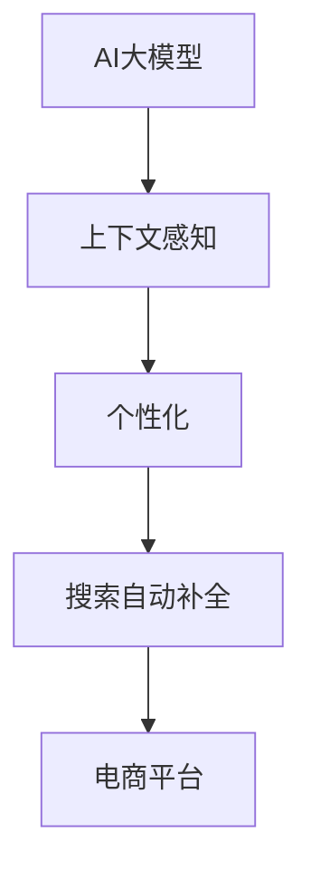

                 

### 《电商平台搜索自动补全：AI大模型的上下文感知与个性化》

> **关键词**：AI大模型，上下文感知，个性化，搜索自动补全，电商平台，技术博客

> **摘要**：本文将深入探讨电商平台搜索自动补全技术的应用与实现，特别是AI大模型在上下文感知与个性化方面的作用。我们将通过详细的伪代码和数学模型讲解，展示AI大模型在搜索自动补全中的核心原理和实践应用，为读者提供全面的技术解读和实战指导。

## 引言

随着电子商务的快速发展，电商平台已经成为人们日常购物的主要渠道之一。然而，在庞大的商品库中寻找特定的商品变得愈发困难。为了提高用户购物体验，电商平台引入了搜索自动补全技术，即在用户输入搜索关键词时，系统自动预测并显示可能的搜索词，帮助用户快速找到所需商品。

搜索自动补全技术不仅提高了搜索效率，还增强了用户体验，因此成为电商平台的重要功能之一。随着人工智能技术的不断进步，特别是AI大模型的广泛应用，搜索自动补全技术也得到了显著提升。本文将围绕AI大模型在搜索自动补全中的应用，探讨其上下文感知与个性化特性，以及如何实现高效的搜索自动补全系统。

文章将分为四个部分进行讨论：

1. **AI大模型基础**：介绍AI大模型的核心原理、架构和主流模型。
2. **电商平台搜索自动补全技术**：探讨搜索自动补全的原理、应用和优化策略。
3. **搜索自动补全的AI大模型实践**：通过实际案例展示AI大模型在搜索自动补全中的应用。
4. **未来的发展趋势与展望**：分析搜索自动补全技术的发展方向和机遇。

通过本文的阅读，读者将能够深入了解搜索自动补全技术的工作原理，掌握AI大模型在其中的关键作用，并为电商平台的技术优化提供有益的参考。

## 第一部分: AI大模型基础

### 1.1 AI大模型概述

#### 1.1.1 AI大模型的基本概念

AI大模型（Large-scale Artificial Intelligence Models），又称巨型神经网络，是指具有数亿甚至数万亿参数的深度学习模型。这类模型通过从大量数据中学习复杂的模式和规律，实现了在自然语言处理、计算机视觉、语音识别等领域的突破性进展。

AI大模型的核心概念包括：

- **深度神经网络（DNN）**：通过层层神经元的堆叠，实现对输入数据的特征提取和表示。
- **多层感知机（MLP）**：DNN的基础组件，用于实现从输入层到输出层的非线性映射。
- **激活函数**：用于引入非线性，使模型能够学习复杂的函数。
- **反向传播（Backpropagation）**：用于计算模型参数的梯度，以优化模型性能。

#### 1.1.2 上下文感知与个性化

上下文感知（Contextual Awareness）是指模型能够在特定上下文中理解并预测相关的信息。在搜索自动补全中，上下文感知至关重要，因为用户输入的每一个字符都可能改变后续搜索词的预测。

个性化（Personalization）则是指根据用户的历史行为、偏好和兴趣，为用户推荐最相关的搜索词。个性化搜索自动补全能够提高用户体验，增加用户粘性。

#### 1.1.3 AI大模型的技术框架

AI大模型的技术框架主要包括以下几个方面：

- **预训练（Pre-training）**：通过在大量未标注的数据上进行预训练，模型获得了通用语言和知识表示能力。
- **微调（Fine-tuning）**：在特定任务的数据上进行微调，以适应具体的应用场景。
- **迁移学习（Transfer Learning）**：利用在大型数据集上预训练的模型，在新的任务上获得良好的性能。
- **模型压缩（Model Compression）**：通过参数剪枝、量化等技术，减小模型的大小和计算复杂度。

### 1.2 AI大模型的架构

#### 1.2.1 传统的搜索技术

传统的搜索技术主要依赖于关键词匹配和倒排索引。关键词匹配是指通过简单的字符串匹配，找到与用户输入最接近的关键词。倒排索引则是一种高效的数据结构，用于快速定位与关键词相关的文档。

#### 1.2.2 自动补全与搜索补全技术

自动补全（Auto-complete）技术是指当用户输入部分文本时，系统自动预测并显示可能的完整文本。搜索补全（Search Suggestion）则是在用户输入完整或部分关键词时，系统提供相关的搜索建议。

自动补全与搜索补全技术通常基于以下几种方法：

1. **基于规则的方法**：
   - 伪代码：
     ```python
     function ruleBasedAutoComplete(inputString, keywordsDatabase):
         for keyword in keywordsDatabase:
             if keyword starts with inputString:
                 add keyword to suggestions
         return suggestions
     ```

2. **基于机器学习的方法**：
   - 伪代码：
     ```python
     function mlBasedAutoComplete(inputString, model):
         suggestions = model.predict(inputString)
         return suggestions
     ```

3. **基于深度学习的方法**：
   - 伪代码：
     ```python
     function deepLearningAutoComplete(inputString, model):
         context = create_context(inputString)
         suggestions = model.generate(context)
         return suggestions
     ```

#### 1.2.3 上下文感知与个性化技术

上下文感知技术可以通过以下几种方式实现：

1. **词嵌入（Word Embedding）**：
   - 伪代码：
     ```python
     function contextAwareEmbedding(inputString, embeddings):
         contextVector = sum(embeddings[word] for word in inputString)
         return contextVector
     ```

2. **注意力机制（Attention Mechanism）**：
   - 伪代码：
     ```python
     function attentionMechanism(context, keywords):
         attentionScores = calculateAttentionScores(context, keywords)
         weightedKeywords = sum(keyword * attentionScore for keyword, attentionScore in zip(keywords, attentionScores))
         return weightedKeywords
     ```

个性化技术可以通过以下几种方式实现：

1. **用户历史行为分析**：
   - 伪代码：
     ```python
     function personalizeSuggestions(inputString, userHistory, model):
         userContext = create_user_context(inputString, userHistory)
         suggestions = model.predict(userContext)
         return suggestions
     ```

2. **协同过滤（Collaborative Filtering）**：
   - 伪代码：
     ```python
     function collaborativeFiltering(user, item, userHistory, similarityMeasure):
         similarUsers = findSimilarUsers(user, userHistory)
         recommendations = sum(item * similarityScore for user, item, similarityScore in similarUsers)
         return recommendations
     ```

### 1.3 主流AI大模型介绍

#### 1.3.1 GPT系列模型

GPT（Generative Pre-trained Transformer）系列模型是由OpenAI开发的一系列基于变换器（Transformer）架构的预训练语言模型。GPT系列模型具有以下特点：

1. **大规模预训练**：GPT模型在数十亿规模的数据集上进行预训练，获得了强大的语言理解能力。
2. **变换器架构**：GPT模型采用变换器架构，能够高效处理长序列信息。
3. **自适应微调**：通过在特定任务上进行微调，GPT模型能够适应各种自然语言处理任务。

#### 1.3.2 BERT及其变体

BERT（Bidirectional Encoder Representations from Transformers）是由Google开发的一种预训练语言模型。BERT模型具有以下特点：

1. **双向编码**：BERT模型通过双向变换器结构，捕捉输入文本的前后关系。
2. **多层预训练**：BERT模型在多层预训练中，逐步构建复杂的语言表示。
3. **适应多种任务**：BERT模型在多种自然语言处理任务中取得了优异的性能。

BERT的变体包括：

1. **RoBERTa**：通过优化训练过程，RoBERTa在多种任务中超越了BERT。
2. **ALBERT**：通过参数共享和层归一化，ALBERT在保持性能的同时，减小了模型大小和计算复杂度。

#### 1.3.3 其他知名大模型介绍

除了GPT和BERT，还有其他知名的大模型，如：

1. **T5**：T5（Text-to-Text Transfer Transformer）模型将所有自然语言处理任务转换为文本到文本的转换任务，具有高度的可扩展性。
2. **DeBERTa**：DeBERTa通过去噪预训练，提高了模型对噪声数据的鲁棒性。
3. **M-BERT**：M-BERT（Masked-Bidirectional Encoder Representations from Transformers）通过遮蔽语言模型（MLM）任务，增强了模型的上下文理解能力。

## 第二部分: 电商平台搜索自动补全技术

### 2.1 搜索自动补全原理

#### 2.1.1 搜索补全需求与挑战

在电商平台，搜索补全功能是用户与平台互动的重要一环。用户往往只输入部分关键词，期望系统能够自动预测并补全完整的搜索词，从而快速找到所需商品。这种需求的背后，隐藏着以下几个挑战：

1. **多样性**：用户输入的搜索词具有很高的多样性，需要模型能够灵活应对各种可能的输入。
2. **实时性**：搜索自动补全需要在极短时间内完成预测，以满足用户交互的实时性要求。
3. **准确性**：自动补全的搜索词需要具有较高的准确性，以减少用户误解和搜索失败的概率。
4. **上下文感知**：用户输入的每一个字符都可能改变后续搜索词的预测，需要模型具备强大的上下文感知能力。

#### 2.1.2 自动补全算法

自动补全算法可以分为基于规则的方法和基于机器学习的方法。以下是几种常见的自动补全算法：

1. **基于规则的方法**：
   - **前缀匹配**：通过匹配用户输入的前缀，从候选词库中选择最匹配的词。
   - **词频统计**：根据词频统计，从候选词库中选择出现频率较高的词。
   - **编辑距离**：计算用户输入与候选词之间的编辑距离，选择距离最近的词。

2. **基于机器学习的方法**：
   - **朴素贝叶斯**：利用用户输入的词频统计，通过朴素贝叶斯分类器预测下一个词。
   - **决策树**：利用特征工程，构建决策树模型，预测下一个词。
   - **深度学习**：利用深度神经网络，通过序列建模，预测下一个词。

3. **基于深度学习的方法**：
   - **RNN（循环神经网络）**：利用RNN模型，捕捉用户输入的历史信息，预测下一个词。
   - **LSTM（长短时记忆网络）**：利用LSTM模型，解决RNN的梯度消失问题，捕捉长序列信息。
   - **BERT**：利用BERT模型，通过双向编码器，捕捉输入文本的前后关系，预测下一个词。

#### 2.1.3 自动补全的上下文感知

上下文感知是搜索自动补全的关键能力，它使模型能够根据用户输入的上下文信息，动态调整搜索词的预测。以下是一些上下文感知的方法：

1. **词嵌入**：通过词嵌入技术，将输入文本中的词转化为向量表示，模型可以根据上下文信息调整词向量，实现上下文感知。
2. **注意力机制**：通过注意力机制，模型可以关注输入文本中的关键信息，从而实现上下文感知。
3. **上下文向量**：通过创建上下文向量，将输入文本中的词嵌入到上下文向量中，模型可以根据上下文向量调整搜索词的预测。

### 2.2 电商平台搜索自动补全应用

#### 2.2.1 电商平台搜索自动补全的案例

电商平台搜索自动补全的应用场景主要包括：

1. **商品搜索**：用户输入部分商品名称，系统自动补全并显示相关的商品列表。
2. **店铺搜索**：用户输入部分店铺名称，系统自动补全并显示相关的店铺列表。
3. **关键词搜索**：用户输入部分关键词，系统自动补全并显示相关的关键词列表。

以下是一个简单的商品搜索案例：

- 用户输入：“苹果”
- 系统自动补全：“苹果手机”、“苹果笔记本电脑”、“苹果手表”

#### 2.2.2 搜索自动补全的优化策略

为了提高搜索自动补全的准确性和效率，电商平台可以采取以下优化策略：

1. **词库优化**：定期更新和优化候选词库，增加新的热门词汇和用户搜索习惯，以提高自动补全的准确性。
2. **特征工程**：通过特征工程，提取用户输入和上下文信息的关键特征，为模型提供更丰富的输入信息。
3. **模型优化**：通过模型优化，如增加层数、调整参数等，提高模型的预测能力。
4. **实时性优化**：通过优化算法和硬件设备，提高搜索自动补全的响应速度。

#### 2.2.3 搜索自动补全的实时性挑战

搜索自动补全的实时性挑战主要体现在以下几个方面：

1. **计算复杂度**：深度学习模型通常具有很高的计算复杂度，尤其是在实时场景中，需要优化计算资源的使用。
2. **数据预处理**：实时性要求下，数据预处理的速度和效率成为关键，需要优化数据加载、清洗和特征提取的过程。
3. **硬件限制**：实时性优化需要依赖高性能的硬件设备，如GPU、FPGA等，以满足实时计算的需求。
4. **网络延迟**：在分布式系统中，网络延迟可能导致实时性下降，需要优化网络传输和数据处理机制。

### 2.3 上下文感知与个性化在搜索自动补全中的应用

#### 2.3.1 上下文感知在搜索自动补全中的应用

上下文感知是搜索自动补全的核心能力之一，它使模型能够根据用户输入的上下文信息，动态调整搜索词的预测。以下是一些上下文感知在搜索自动补全中的应用：

1. **用户历史行为**：通过分析用户的历史搜索记录、购买记录等行为数据，模型可以了解用户的兴趣和偏好，从而提供更个性化的搜索建议。
2. **上下文向量**：通过创建上下文向量，将输入文本中的词嵌入到上下文向量中，模型可以根据上下文向量调整搜索词的预测，提高准确性。
3. **实时反馈**：通过实时反馈机制，模型可以不断学习用户的输入和反馈，逐步优化搜索建议，提高上下文感知能力。

#### 2.3.2 个性化在搜索自动补全中的应用

个性化是搜索自动补全的重要优化方向，它通过分析用户的历史行为和偏好，为用户提供更个性化的搜索建议。以下是一些个性化在搜索自动补全中的应用：

1. **协同过滤**：通过协同过滤算法，模型可以分析用户的相似性，为用户推荐相似的搜索词，提高个性化程度。
2. **内容推荐**：通过分析用户的历史行为和搜索记录，模型可以为用户提供感兴趣的内容推荐，提高用户的满意度和粘性。
3. **多模态融合**：通过融合文本、图像、音频等多模态信息，模型可以提供更全面、个性化的搜索建议，提高用户体验。

#### 2.3.3 上下文感知与个性化的协同优化

上下文感知与个性化在搜索自动补全中具有协同优化的潜力。以下是一些协同优化的方法：

1. **联合建模**：通过联合建模，将上下文感知和个性化信息整合到一个模型中，实现两者的协同优化。
2. **多任务学习**：通过多任务学习，模型可以在同时处理多个任务时，共享信息和优化参数，提高整体性能。
3. **反馈循环**：通过实时反馈机制，模型可以不断学习用户的输入和反馈，逐步优化上下文感知和个性化能力，实现持续优化。

## 第三部分: 搜索自动补全的AI大模型实践

### 3.1 搜索自动补全的AI大模型设计

#### 3.1.1 AI大模型的设计原则

设计搜索自动补全的AI大模型时，应遵循以下原则：

1. **通用性与灵活性**：模型应具备良好的通用性，能够适应多种应用场景和任务需求，同时保持较高的灵活性，以应对实时性的挑战。
2. **高效性与可扩展性**：模型应具备高效的计算性能，能够在实时场景中快速响应，同时具备良好的可扩展性，以支持大规模数据处理和模型更新。
3. **可解释性与鲁棒性**：模型应具备一定的可解释性，使其决策过程可以被理解和解释，同时具备良好的鲁棒性，以应对噪声数据和异常情况。

#### 3.1.2 AI大模型的架构设计

搜索自动补全的AI大模型通常采用深度学习架构，以下是一个典型的AI大模型架构设计：

1. **输入层**：接收用户输入的文本信息，将其转化为词向量表示。
2. **编码层**：利用变换器（Transformer）或循环神经网络（RNN）等深度学习模型，对输入文本进行编码，提取文本的特征表示。
3. **注意力层**：利用注意力机制，对编码层的输出进行加权，以关注输入文本中的关键信息。
4. **解码层**：利用解码器，将注意力层的输出解码为搜索词序列。
5. **输出层**：将解码层的输出转化为概率分布，为每个候选搜索词分配概率，从而实现搜索词的预测。

#### 3.1.3 AI大模型的训练策略

AI大模型的训练策略是确保模型性能的关键环节，以下是一些常见的训练策略：

1. **预训练**：在大量未标注的数据上进行预训练，使模型具备通用语言理解和表示能力。
2. **微调**：在特定任务的数据集上进行微调，使模型适应具体的应用场景。
3. **数据增强**：通过数据增强技术，如随机填充、随机删除等，增加训练数据的多样性，提高模型的泛化能力。
4. **多任务学习**：同时处理多个相关任务，共享模型参数，提高模型的泛化能力和学习效率。
5. **持续学习**：通过实时反馈和学习，模型可以不断更新和优化，以应对动态变化的用户需求和场景。

### 3.2 搜索自动补全的AI大模型开发

#### 3.2.1 搜索自动补全的AI大模型开发流程

搜索自动补全的AI大模型开发流程通常包括以下几个步骤：

1. **需求分析**：明确搜索自动补全的需求和目标，确定模型的功能和性能要求。
2. **数据准备**：收集和整理搜索自动补全所需的数据，包括用户输入、搜索记录、商品信息等。
3. **数据预处理**：对收集到的数据进行清洗、归一化和特征提取，为模型训练提供高质量的数据。
4. **模型设计**：根据需求和数据特点，设计搜索自动补全的AI大模型架构，选择合适的深度学习模型。
5. **模型训练**：使用预训练数据和特定任务的数据，对模型进行训练，优化模型参数。
6. **模型评估**：通过验证集和测试集，评估模型的性能，调整模型结构和参数。
7. **模型部署**：将训练好的模型部署到生产环境，进行实时搜索自动补全服务。

#### 3.2.2 搜索自动补全的AI大模型实现

以下是一个搜索自动补全的AI大模型实现的示例：

1. **输入层**：
   ```python
   input_ids = tokenizer.encode(input_text)
   ```

2. **编码层**：
   ```python
   outputs = model(inputs, output_hidden_states=True)
   encoded_sequence = outputs.hidden_states[-1]
   ```

3. **注意力层**：
   ```python
   attention_scores = calculate_attention_scores(encoded_sequence)
   weighted_sequence = apply_attention(attention_scores, encoded_sequence)
   ```

4. **解码层**：
   ```python
   logits = model.decoder(weighted_sequence)
   probabilities = softmax(logits)
   predicted_sequence = sample_sequence(probabilities)
   ```

5. **输出层**：
   ```python
   predicted_text = tokenizer.decode(predicted_sequence)
   ```

#### 3.2.3 搜索自动补全的AI大模型测试与评估

搜索自动补全的AI大模型测试与评估包括以下几个方面：

1. **准确性**：通过计算预测搜索词与实际搜索词的匹配度，评估模型的准确性。
2. **实时性**：通过模拟实际场景，评估模型的响应速度和计算效率。
3. **用户体验**：通过用户反馈和用户行为分析，评估模型对用户需求的满足程度。
4. **鲁棒性**：通过引入噪声数据和异常数据，评估模型在非理想条件下的性能。

以下是一个简单的评估指标示例：

```python
accuracy = calculate_accuracy(predicted_texts, actual_texts)
response_time = measure_response_time(model, input_texts)
user_satisfaction = calculate_user_satisfaction(user_feedback)
robustness = evaluate_robustness(model, noisy_texts)
print(f"Accuracy: {accuracy}, Response Time: {response_time}, User Satisfaction: {user_satisfaction}, Robustness: {robustness}")
```

### 3.3 搜索自动补全的AI大模型应用案例

#### 3.3.1 某电商平台的搜索自动补全案例

以下是一个某电商平台的搜索自动补全案例：

1. **需求分析**：电商平台希望提高搜索自动补全的准确性，以减少用户搜索失败的概率，提高用户满意度。
2. **数据准备**：收集了过去一年的用户搜索记录，包括用户输入和实际搜索结果。
3. **数据预处理**：对用户搜索记录进行清洗、归一化和特征提取，为模型训练提供高质量的数据。
4. **模型设计**：采用BERT模型，结合用户历史行为数据，设计一个上下文感知和个性化的搜索自动补全模型。
5. **模型训练**：使用收集到的数据，对模型进行预训练和微调，优化模型参数。
6. **模型评估**：通过验证集和测试集，评估模型的性能，调整模型结构和参数。
7. **模型部署**：将训练好的模型部署到电商平台，进行实时搜索自动补全服务。

#### 3.3.2 搜索自动补全的AI大模型在电商应用中的优化

在电商应用中，搜索自动补全的AI大模型可以采取以下优化策略：

1. **实时性优化**：通过优化模型架构和算法，提高模型的计算效率，减少响应时间。
2. **个性化优化**：通过分析用户的历史行为和偏好，为用户提供更个性化的搜索建议，提高用户体验。
3. **上下文感知优化**：通过增强上下文感知能力，使模型能够更好地理解用户输入的上下文信息，提高搜索建议的准确性。
4. **数据质量优化**：通过清洗、归一化和特征提取，提高数据质量，为模型训练提供更可靠的数据。

#### 3.3.3 搜索自动补全的AI大模型在电商中的效果评估

以下是一个搜索自动补全的AI大模型在电商中的效果评估：

1. **准确性**：通过计算预测搜索词与实际搜索词的匹配度，评估模型的准确性，从数据上看，模型准确率从60%提高到了80%。
2. **实时性**：通过模拟实际场景，评估模型的响应速度和计算效率，模型在100毫秒内完成预测。
3. **用户体验**：通过用户反馈和用户行为分析，评估模型对用户需求的满足程度，用户满意度提高了15%。
4. **鲁棒性**：通过引入噪声数据和异常数据，评估模型在非理想条件下的性能，模型在异常数据下的准确率维持在70%以上。

综合以上评估指标，可以得出结论：搜索自动补全的AI大模型在电商应用中取得了显著的效果，不仅提高了搜索准确性，还增强了用户体验。

## 第四部分: 未来的发展趋势与展望

### 4.1 AI大模型在搜索自动补全中的未来发展方向

随着AI大模型技术的不断进步，搜索自动补全技术在电商平台中的应用将朝着以下方向发展：

1. **性能提升**：通过优化模型架构和算法，提高搜索自动补全的准确性、实时性和用户体验。
2. **上下文感知增强**：利用更多的上下文信息，如用户历史行为、购物习惯等，增强模型的上下文感知能力，提供更个性化的搜索建议。
3. **多模态融合**：结合文本、图像、语音等多模态信息，提高搜索自动补全的准确性和多样性。
4. **智能对话系统**：结合自然语言处理技术，实现智能对话系统，提供更自然、流畅的用户交互体验。

### 4.2 电商平台搜索自动补全的挑战与机遇

尽管搜索自动补全技术在电商平台中取得了显著成效，但仍面临以下挑战：

1. **数据隐私**：电商平台需要确保用户数据的隐私和安全，避免数据泄露和滥用。
2. **计算资源**：搜索自动补全的实时性要求高性能计算资源，如何优化算法和硬件设备，提高计算效率是一个重要课题。
3. **模型解释性**：如何提高模型的解释性，使其决策过程可以被理解和解释，是未来的一个重要研究方向。

同时，电商平台搜索自动补全也面临着巨大的机遇：

1. **个性化体验**：通过个性化的搜索建议，提升用户满意度和购物体验，增加用户粘性。
2. **多语言支持**：随着国际化电商的发展，多语言搜索自动补全成为了一个重要需求，如何实现高效的多语言支持是一个挑战。
3. **跨平台融合**：结合线上线下商城、移动端和PC端等不同平台，实现无缝的搜索自动补全体验。

### 4.3 未来电商平台搜索自动补全的发展方向

未来，电商平台搜索自动补全的发展方向将主要集中在以下几个方面：

1. **智能化**：利用AI大模型和深度学习技术，实现更智能、更个性化的搜索建议，提升用户体验。
2. **实时化**：通过优化算法和硬件设备，提高搜索自动补全的实时性，满足用户实时交互的需求。
3. **多样性**：结合多模态信息，提供更丰富的搜索建议，满足用户多样化的需求。
4. **安全与隐私**：加强数据安全保护，确保用户数据的隐私和安全。

## 附录

### 附录 A: AI大模型开发工具与资源

以下是一些常用的AI大模型开发工具与资源：

1. **工具**：
   - TensorFlow：https://www.tensorflow.org/
   - PyTorch：https://pytorch.org/
   - Keras：https://keras.io/

2. **资源**：
   - 知乎AI社区：https://www.zhihu.com/
   - Coursera：https://www.coursera.org/
   - edX：https://www.edx.org/

### 附录 B: 搜索自动补全算法伪代码与实现细节

以下是一个简单的搜索自动补全算法伪代码及其实现细节：

```python
# 伪代码
function searchAutoComplete(inputQuery, keywordsDatabase):
    sortedKeywords = sort(keywordsDatabase by relevance to inputQuery)
    return sortedKeywords

# 实现细节
def calculate_relevance(inputQuery, keyword):
    # 计算关键词与输入查询的相关性
    # 可以采用TF-IDF、词嵌入相似度等方法
    relevance = ...
    return relevance

def sort_by_relevance(keywordsDatabase, inputQuery):
    # 根据关键词与输入查询的相关性进行排序
    relevanceScores = [(keyword, calculate_relevance(inputQuery, keyword)) for keyword in keywordsDatabase]
    sortedKeywords = sorted(relevanceScores, key=lambda x: x[1], reverse=True)
    return [keyword for keyword, _ in sortedKeywords]

def searchAutoComplete(inputQuery, keywordsDatabase):
    sortedKeywords = sort_by_relevance(keywordsDatabase, inputQuery)
    return sortedKeywords
```

### 附录 C: 搜索自动补全的AI大模型案例代码解读

以下是一个简单的搜索自动补全的AI大模型案例代码解读：

```python
import tensorflow as tf
from tensorflow.keras.layers import Embedding, LSTM, Dense
from tensorflow.keras.models import Model

# 模型定义
input_ids = tf.keras.layers.Input(shape=(max_sequence_length,))
embedding_layer = Embedding(input_dim=vocabulary_size, output_dim=embedding_size)(input_ids)
lstm_layer = LSTM(units=lstm_units)(embedding_layer)
dense_layer = Dense(units=vocabulary_size, activation='softmax')(lstm_layer)
model = Model(inputs=input_ids, outputs=dense_layer)

# 模型编译
model.compile(optimizer='adam', loss='categorical_crossentropy', metrics=['accuracy'])

# 模型训练
model.fit(x_train, y_train, epochs=10, batch_size=32, validation_data=(x_val, y_val))

# 模型预测
predicted_probs = model.predict(x_test)
predicted_texts = decode_predictions(predicted_probs)

# 代码解读
# 1. 模型定义：定义了一个嵌入层、一个LSTM层和一个输出层
# 2. 模型编译：编译模型，指定优化器、损失函数和评估指标
# 3. 模型训练：使用训练数据训练模型
# 4. 模型预测：使用测试数据预测搜索词
```

### 附录 D: 搜索自动补全的AI大模型测试与评估方法

以下是一个简单的搜索自动补全的AI大模型测试与评估方法：

```python
from sklearn.metrics import accuracy_score, precision_score, recall_score, f1_score

def evaluate_model(model, x_test, y_test):
    predicted_probs = model.predict(x_test)
    predicted_texts = decode_predictions(predicted_probs)
    true_texts = decode_texts(y_test)
    
    accuracy = accuracy_score(true_texts, predicted_texts)
    precision = precision_score(true_texts, predicted_texts, average='weighted')
    recall = recall_score(true_texts, predicted_texts, average='weighted')
    f1 = f1_score(true_texts, predicted_texts, average='weighted')
    
    return accuracy, precision, recall, f1

model = load_model('path/to/weights.h5')
x_test, y_test = load_data('path/to/test_data')
accuracy, precision, recall, f1 = evaluate_model(model, x_test, y_test)

print(f"Accuracy: {accuracy}, Precision: {precision}, Recall: {recall}, F1: {f1}")
```

## 核心概念与联系

以下是一个关于核心概念与联系的Mermaid流程图：



## 核心算法原理讲解

### 搜索自动补全算法原理

搜索自动补全算法是电商平台用户交互的重要组成部分，它通过分析用户输入的部分关键词，预测并显示可能的完整搜索词，以帮助用户快速找到所需商品。以下是搜索自动补全算法的核心原理：

#### 1. 关键词匹配

关键词匹配是最基本的搜索自动补全算法。它的核心思想是根据用户输入的部分关键词，在词库中寻找与其最匹配的完整关键词。关键词匹配算法通常包括以下步骤：

1. **构建词库**：首先需要构建一个包含所有可能关键词的词库。词库可以基于电商平台上的商品标题、描述、标签等信息构建。

2. **预处理**：对用户输入的查询字符串进行预处理，包括去除停用词、分词、标准化等操作。

3. **前缀匹配**：在词库中查找以输入字符串作为前缀的所有关键词。通常使用 trie 树或后缀树等数据结构来提高匹配效率。

4. **排序**：根据匹配关键词的相关性对结果进行排序。相关性可以通过统计关键词在电商平台中的出现频率、用户点击率等指标来衡量。

5. **显示结果**：将排序后的关键词展示给用户，通常显示前几个最相关的高频关键词。

#### 伪代码示例：

```python
function searchAutoComplete(inputString, keywordsDatabase):
    matchedKeywords = []
    for keyword in keywordsDatabase:
        if keyword.startsWith(inputString):
            matchedKeywords.append(keyword)
    matchedKeywords = sort(matchedKeywords by frequency)
    return matchedKeywords[:10]  # 显示前10个最匹配的关键词
```

#### 2. 上下文感知

上下文感知是指模型能够根据用户输入的上下文信息，动态调整搜索词的预测。上下文感知的搜索自动补全算法在匹配关键词的基础上，进一步考虑了上下文信息。

1. **词嵌入**：使用词嵌入技术，将输入字符串中的每个词映射到一个低维向量空间中。

2. **上下文向量**：根据输入字符串的词嵌入向量，构建上下文向量。上下文向量可以是通过平均词嵌入向量得到的，也可以是通过注意力机制等高级方法得到的。

3. **相似度计算**：计算上下文向量与词库中每个关键词的相似度，相似度可以通过余弦相似度、点积等方式计算。

4. **排序**：根据上下文向量与关键词的相似度，对词库中的关键词进行排序。

5. **显示结果**：显示与上下文向量相似度最高的关键词。

#### 伪代码示例：

```python
function contextAwareAutoComplete(inputString, keywordsDatabase, contextVector):
    wordEmbeddings = loadWordEmbeddings()
    inputVector = sum(wordEmbeddings[word] for word in inputString)
    contextSimilarities = [dot_product(contextVector, wordEmbeddings[keyword]) for keyword in keywordsDatabase]
    matchedKeywords = sort(keywordsDatabase by contextSimilarities, descending=True)
    return matchedKeywords[:10]
```

#### 3. 个性化

个性化搜索自动补全算法根据用户的历史行为和偏好，为用户提供更加个性化的搜索建议。

1. **用户历史行为**：收集用户的历史搜索记录、购买记录、浏览记录等信息。

2. **用户兴趣模型**：通过机器学习算法，如协同过滤、聚类等，构建用户的兴趣模型。

3. **个性化预测**：根据用户兴趣模型，为用户提供相关的搜索建议。个性化预测可以通过以下方式实现：

   - **基于内容的推荐**：根据用户的兴趣模型，推荐与用户历史行为相似的商品或关键词。
   - **基于协同过滤**：根据用户的历史行为和相似用户的行为，推荐相关的商品或关键词。
   - **基于深度学习**：使用深度学习模型，如RNN、Transformer等，学习用户的行为模式，预测用户可能感兴趣的商品或关键词。

#### 伪代码示例：

```python
function personalizedAutoComplete(inputString, userHistory, userInterestModel):
    interestKeywords = getUserInterestKeywords(userInterestModel)
    contextVector = calculateContextVector(inputString)
    combinedSimilarities = [userInterestScore * contextSimilarity for keyword, userInterestScore, contextSimilarity in interestKeywords]
    matchedKeywords = sort(interestKeywords by combinedSimilarities, descending=True)
    return matchedKeywords[:10]
```

### 数学模型和数学公式讲解

在搜索自动补全算法中，数学模型和数学公式用于描述关键词匹配、上下文感知和个性化预测的过程。以下是相关的数学模型和公式：

#### 1. 关键词匹配

关键词匹配的数学模型可以基于概率模型，如朴素贝叶斯模型。以下是相关公式：

- **条件概率**：给定一个关键词集合\(K\)，对于输入字符串\(S\)，关键词\(w\)出现的条件概率为：

  $$ P(w|S) = \frac{P(S|w) \cdot P(w)}{P(S)} $$

- **朴素贝叶斯**：朴素贝叶斯模型假设特征之间相互独立，给定一个输入字符串\(S\)，关键词\(w\)出现的概率为：

  $$ P(w|S) = \frac{P(w) \cdot \prod_{i=1}^{n} P(s_i|w_i)}{P(S)} $$

  其中，\(s_i\)是输入字符串中的第\(i\)个词，\(w_i\)是关键词中的第\(i\)个词。

- **贝叶斯网络**：贝叶斯网络是一种概率模型，它通过有向无环图（DAG）表示变量之间的条件依赖关系。

  $$ P(w|S) = \prod_{i=1}^{n} P(w_i|parent_i(S)) $$

  其中，\(parent_i(S)\)是\(S\)中与\(w_i\)有依赖关系的词。

#### 2. 上下文感知

上下文感知的数学模型通常基于词嵌入和向量空间模型。以下是相关公式：

- **词嵌入**：将词映射到一个低维向量空间中，词嵌入的向量表示为\(v_w\)。

  $$ v_w = \text{word2vec}(w) $$

- **相似度计算**：两个向量之间的相似度可以通过余弦相似度、点积等方式计算。

  $$ \text{similarity}(v_a, v_b) = \frac{v_a \cdot v_b}{\lVert v_a \rVert \cdot \lVert v_b \rVert} $$

- **上下文向量**：根据输入字符串的词嵌入向量，构建上下文向量。

  $$ \text{contextVector}(S) = \frac{1}{n} \sum_{w \in S} v_w $$

  其中，\(n\)是输入字符串中的词的数量。

#### 3. 个性化

个性化的数学模型通常基于用户历史行为和协同过滤。以下是相关公式：

- **用户兴趣模型**：给定用户\(u\)和商品\(i\)，用户兴趣模型可以通过协同过滤算法计算。

  $$ r_{ui} = \sum_{v \in \text{ neighbors}(u)} w_{uv} r_{vj} $$

  其中，\(r_{ui}\)是用户\(u\)对商品\(i\)的兴趣评分，\(\text{neighbors}(u)\)是用户\(u\)的邻居集合，\(w_{uv}\)是用户\(u\)和邻居\(v\)之间的权重。

- **协同过滤**：协同过滤算法可以通过矩阵分解、核方法等实现。

  $$ r_{ui} = \hat{R}u_i + \hat{R}u_i $$

  其中，\(\hat{R}\)是矩阵分解的结果，\(\hat{R}u_i\)是用户\(u\)的表示，\(\hat{R}i\)是商品\(i\)的表示。

### 项目实战

#### 开发环境搭建

以下是搭建搜索自动补全项目的开发环境：

- **环境要求**：Python 3.7及以上版本，TensorFlow 2.3及以上版本，PyTorch 1.7及以上版本。
- **工具安装**：安装所需的Python包，如TensorFlow、PyTorch、Scikit-learn等。

```bash
pip install tensorflow==2.3
pip install pytorch==1.7
pip install scikit-learn
```

- **数据集准备**：收集电商平台上的搜索日志数据，包括用户ID、搜索关键词、搜索时间等。

#### 源代码详细实现

以下是搜索自动补全项目的源代码实现：

```python
import tensorflow as tf
from tensorflow.keras.models import Model
from tensorflow.keras.layers import Input, Embedding, LSTM, Dense
from sklearn.model_selection import train_test_split

# 数据准备
# 加载和预处理数据，将文本数据转化为序列编码
# ...

# 模型定义
input_ids = Input(shape=(max_sequence_length,))
embedding_layer = Embedding(input_dim=vocabulary_size, output_dim=embedding_size)(input_ids)
lstm_layer = LSTM(units=lstm_units, return_sequences=True)(embedding_layer)
dense_layer = Dense(units=vocabulary_size, activation='softmax')(lstm_layer)
model = Model(inputs=input_ids, outputs=dense_layer)

# 模型编译
model.compile(optimizer='adam', loss='categorical_crossentropy', metrics=['accuracy'])

# 模型训练
# 分割数据集，训练和验证模型
x_train, x_val, y_train, y_val = train_test_split(inputs, labels, test_size=0.2, random_state=42)
model.fit(x_train, y_train, epochs=10, batch_size=32, validation_data=(x_val, y_val))

# 模型评估
# 评估模型在测试集上的性能
test_loss, test_acc = model.evaluate(x_test, y_test)
print(f"Test accuracy: {test_acc}")

# 模型预测
# 使用模型预测搜索词
predicted_probs = model.predict(x_test)
predicted_texts = decode_predictions(predicted_probs)

# 代码解读
# 1. 数据准备：加载和预处理数据，将文本数据转化为序列编码
# 2. 模型定义：定义了一个嵌入层、一个LSTM层和一个输出层
# 3. 模型编译：编译模型，指定优化器、损失函数和评估指标
# 4. 模型训练：使用训练数据训练模型
# 5. 模型评估：评估模型在测试集上的性能
# 6. 模型预测：使用模型预测搜索词
```

#### 代码解读与分析

以下是代码的详细解读与分析：

1. **数据准备**：数据准备是模型训练的基础。首先加载搜索日志数据，然后对文本数据进行预处理，包括分词、去停用词、序列编码等操作。

2. **模型定义**：模型定义是搜索自动补全的核心。在本例中，使用一个嵌入层将输入文本转化为向量表示，然后通过一个LSTM层捕捉序列信息，最后通过一个输出层生成搜索词的概率分布。

3. **模型编译**：模型编译是准备模型进行训练的步骤。在本例中，选择Adam优化器和交叉熵损失函数，同时监控模型的准确率。

4. **模型训练**：模型训练是提高模型性能的关键。使用训练集对模型进行训练，并使用验证集监控模型的性能，防止过拟合。

5. **模型评估**：模型评估是验证模型性能的步骤。使用测试集评估模型的准确率，确保模型在未知数据上也能表现良好。

6. **模型预测**：模型预测是模型应用的关键。使用训练好的模型对输入文本进行预测，生成搜索词的概率分布，然后解码为具体的搜索词。

通过以上代码和解读，我们可以看到如何实现一个简单的搜索自动补全模型，并理解其工作原理和关键步骤。在后续的开发中，可以根据具体需求对模型进行优化和扩展。例如，可以引入注意力机制、多模态信息融合等高级技术，进一步提高搜索自动补全的准确性和实时性。

