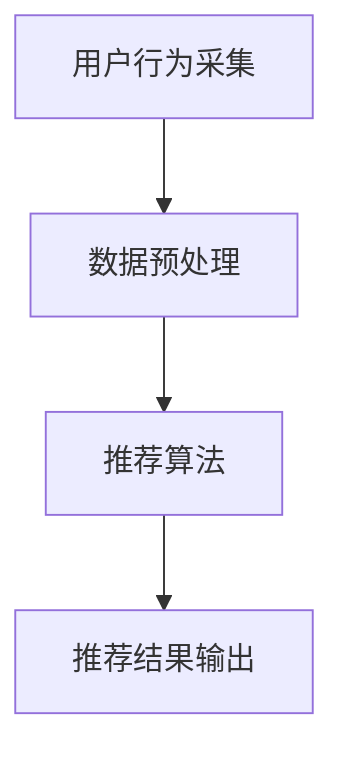
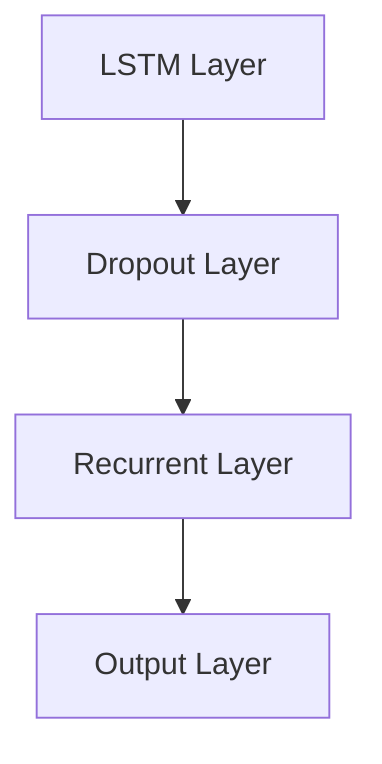

                 

### 《电商搜索推荐中的AI大模型用户行为序列异常检测算法选择》

> **关键词：** 电商搜索推荐、AI大模型、用户行为序列、异常检测、算法选择、项目实战

> **摘要：** 本文将深入探讨电商搜索推荐系统中的AI大模型用户行为序列异常检测算法选择。通过详细解析核心概念、算法原理、实战案例，帮助读者理解如何在电商场景下有效利用AI大模型进行用户行为序列异常检测，从而提升推荐系统的准确性和用户体验。

---

#### 第一部分：AI大模型与用户行为序列异常检测概述

##### 第1章：电商搜索推荐系统概述

1.1 **电商搜索推荐系统的架构**

电商搜索推荐系统通常由三个主要模块组成：用户行为采集、数据预处理和推荐算法。其基本架构如图1-1所示。



**图1-1：电商搜索推荐系统架构图**

1.2 **电商搜索推荐系统的核心功能**

电商搜索推荐系统的核心功能包括：

- **个性化推荐**：根据用户的历史行为和偏好，为用户提供个性化的商品推荐。
- **搜索优化**：通过优化搜索结果，提升用户的搜索体验和满意度。
- **促销活动推荐**：根据用户的行为数据和促销策略，为用户推荐相关的促销活动。

1.3 **AI大模型在电商搜索推荐中的应用**

AI大模型在电商搜索推荐中的应用主要体现在以下几个方面：

- **用户行为预测**：通过分析用户的历史行为，预测用户可能感兴趣的商品。
- **搜索结果排序**：利用AI大模型对搜索结果进行排序，提升用户的点击率和购买率。
- **异常行为检测**：检测用户行为中的异常现象，如刷单、作弊等，保障推荐系统的公平性和准确性。

##### 第2章：AI大模型概述

2.1 **AI大模型的定义**

AI大模型，又称大型预训练模型，是指通过大量数据训练，具备高泛化能力和强大表示能力的深度学习模型。常见的AI大模型包括BERT、GPT、T5等。

2.2 **AI大模型的主要类型**

AI大模型主要可以分为以下几种类型：

- **语言模型**：用于处理自然语言文本，如BERT、GPT。
- **图像模型**：用于处理图像数据，如图像分类、目标检测等，如ResNet、VGG。
- **多模态模型**：可以处理多种类型的数据，如文本、图像、音频等，如ViT、CogComp。

2.3 **AI大模型的优势与挑战**

AI大模型的优势包括：

- **强大的表示能力**：能够对复杂的数据进行有效表示和建模。
- **高泛化能力**：在大规模数据集上训练，能够应用于多种不同的任务。
- **自动化特征提取**：减少人工干预，提高模型构建的效率。

然而，AI大模型也存在一些挑战，如：

- **数据需求量大**：需要大量的数据才能进行有效训练。
- **计算资源消耗高**：训练和推理过程需要大量的计算资源。
- **模型解释性差**：模型的决策过程较为复杂，难以进行解释。

##### 第3章：用户行为序列异常检测概述

3.1 **用户行为序列异常检测的定义**

用户行为序列异常检测是指通过分析用户在一段时间内的行为序列，识别出其中可能存在的异常行为或异常模式。

3.2 **用户行为序列异常检测的重要性**

用户行为序列异常检测在电商搜索推荐系统中具有重要意义：

- **保障系统公平性**：检测并处理异常行为，如刷单、作弊等，保障推荐系统的公平性和准确性。
- **提升用户体验**：通过异常检测，避免向用户推荐不感兴趣或质量低下的商品，提升用户体验。
- **优化运营策略**：分析异常行为的原因和模式，为运营策略提供数据支持。

3.3 **用户行为序列异常检测的挑战**

用户行为序列异常检测面临以下挑战：

- **数据复杂性**：用户行为数据类型多样、规模庞大，对数据预处理和分析提出了较高要求。
- **异常行为多样性**：异常行为种类繁多，需要设计多种异常检测算法来应对。
- **实时性要求**：需要快速检测并响应异常行为，对算法的实时性和效率提出了较高要求。

---

以上是第一部分的内容，主要介绍了电商搜索推荐系统、AI大模型以及用户行为序列异常检测的基本概念和重要性。在接下来的部分，我们将进一步深入探讨用户行为序列异常检测的算法原理和应用。

<|assistant|>### 第二部分：用户行为序列异常检测算法原理

##### 第4章：用户行为序列分析基础

4.1 **用户行为序列的基本概念**

用户行为序列是指用户在一段时间内产生的行为记录，这些记录通常包含用户ID、时间戳、行为类型、行为内容等信息。

4.2 **用户行为序列的数据表示**

用户行为序列可以用一个有序的二维矩阵或列表表示，其中行表示用户，列表示时间。例如：

| 用户ID | 时间1 | 时间2 | 时间3 |
| --- | --- | --- | --- |
| 1 | 搜索商品A | 购买商品B | 查看商品C |
| 2 | 搜索商品D | 搜索商品E | 购买商品F |

4.3 **用户行为序列的时序分析**

时序分析是用户行为序列异常检测的重要手段，主要包括以下方法：

- **时序特征提取**：通过对用户行为序列进行统计分析，提取出时序特征，如行为频率、行为间隔、行为模式等。
- **时序预测**：利用时间序列模型，预测用户未来的行为序列，并与实际行为进行对比，识别异常行为。
- **时序聚类**：将用户行为序列进行聚类，分析不同用户之间的行为差异，为异常检测提供依据。

##### 第5章：常见用户行为序列异常检测算法

5.1 **基于统计学的异常检测算法**

基于统计学的异常检测算法主要通过分析用户行为序列的统计特征，识别异常行为。常见的方法包括：

- **孤立森林（Isolation Forest）**：利用随机森林的思想，将用户行为序列作为样本，通过随机分割和隔离，识别异常行为。
- **局部异常因子（Local Outlier Factor，LOF）**：计算用户行为序列相对于其邻居的局部异常因子，识别局部异常行为。
- **高斯分布模型**：利用高斯分布模型，对用户行为序列进行建模，识别超出模型预测范围的异常行为。

```python
# 高斯分布模型伪代码
def gaussian_model(data):
    mean = np.mean(data)
    std = np.std(data)
    threshold = 3 * std
    
    anomalies = []
    for user_id, behavior_sequence in data.items():
        for behavior in behavior_sequence:
            if abs(behavior - mean) > threshold:
                anomalies.append(user_id)
    return anomalies
```

5.2 **基于机器学习的异常检测算法**

基于机器学习的异常检测算法通过训练模型，对用户行为序列进行分类，识别异常行为。常见的方法包括：

- **支持向量机（Support Vector Machine，SVM）**：利用支持向量机，将正常行为和异常行为进行分类。
- **集成学习方法**：如随机森林、梯度提升树（XGBoost、LightGBM）等，通过集成多个基础模型，提高异常检测的准确性。

```python
# 随机森林模型伪代码
from sklearn.ensemble import RandomForestClassifier

# 训练模型
model = RandomForestClassifier()
model.fit(X_train, y_train)

# 预测
y_pred = model.predict(X_test)
```

5.3 **基于深度学习的异常检测算法**

基于深度学习的异常检测算法通过构建神经网络模型，对用户行为序列进行建模和异常检测。常见的方法包括：

- **循环神经网络（Recurrent Neural Network，RNN）**：如LSTM、GRU等，能够处理序列数据，识别时序特征。
- **卷积神经网络（Convolutional Neural Network，CNN）**：用于提取图像特征，可以应用于用户行为序列的图像化表示。

```python
# LSTM模型伪代码
from keras.models import Sequential
from keras.layers import LSTM, Dense

model = Sequential()
model.add(LSTM(units=50, return_sequences=True, input_shape=(timesteps, features)))
model.add(LSTM(units=50))
model.add(Dense(1, activation='sigmoid'))

model.compile(optimizer='adam', loss='binary_crossentropy', metrics=['accuracy'])
model.fit(X_train, y_train, epochs=10, batch_size=32)
```

##### 第6章：AI大模型在用户行为序列异常检测中的应用

6.1 **AI大模型在用户行为序列分析中的应用**

AI大模型在用户行为序列分析中的应用主要体现在以下几个方面：

- **数据预处理**：利用AI大模型对用户行为序列进行特征提取和降维，提高数据质量。
- **时序预测**：利用AI大模型进行用户行为序列的时序预测，为异常检测提供参考。
- **交互分析**：通过AI大模型，分析用户行为序列之间的交互关系，发现潜在异常行为。

6.2 **基于AI大模型的用户行为序列异常检测流程**

基于AI大模型的用户行为序列异常检测流程主要包括以下步骤：

1. 数据采集与预处理：收集用户行为数据，进行数据清洗和预处理。
2. 特征提取与建模：利用AI大模型，对用户行为序列进行特征提取和建模。
3. 异常检测与预测：对用户行为序列进行异常检测和预测，识别异常行为。
4. 模型优化与评估：根据异常检测效果，对模型进行优化和评估。

6.3 **AI大模型在用户行为序列异常检测中的优势与挑战**

AI大模型在用户行为序列异常检测中的优势包括：

- **强大的表示能力**：能够对复杂的数据进行有效表示和建模。
- **高泛化能力**：在大规模数据集上训练，能够应用于多种不同的任务。
- **自动化特征提取**：减少人工干预，提高模型构建的效率。

然而，AI大模型在用户行为序列异常检测中也面临以下挑战：

- **数据需求量大**：需要大量的数据才能进行有效训练。
- **计算资源消耗高**：训练和推理过程需要大量的计算资源。
- **模型解释性差**：模型的决策过程较为复杂，难以进行解释。

---

以上是第二部分的内容，主要介绍了用户行为序列异常检测的算法原理，包括基于统计学、机器学习和深度学习的常见算法，以及AI大模型在用户行为序列异常检测中的应用。在接下来的部分，我们将探讨如何选择合适的用户行为序列异常检测算法，并进行项目实战。

<|assistant|>### 第三部分：算法选择与项目实战

##### 第7章：用户行为序列异常检测算法选择指南

7.1 **算法选择的影响因素**

在选择用户行为序列异常检测算法时，需要考虑以下影响因素：

- **数据特性**：用户行为数据的特点，如数据量、数据类型、数据分布等，会影响算法的选择。
- **异常检测目标**：不同类型的异常检测目标，如检测异常行为、识别异常模式等，需要选择不同的算法。
- **计算资源**：算法的复杂度和计算资源消耗，影响算法在实际应用中的可行性。
- **模型解释性**：对于需要解释性的应用场景，需要选择解释性较强的算法。

7.2 **算法选择案例分析**

以下是一个用户行为序列异常检测算法选择案例：

**案例背景**：某电商平台的搜索推荐系统需要检测用户搜索行为的异常现象，如刷单、作弊等。

**算法选择**：

1. **数据特性**：用户搜索数据量较大，且包含多种行为类型（如搜索、点击、购买等）。
2. **异常检测目标**：识别异常搜索行为，如刷单、重复搜索等。
3. **计算资源**：考虑到计算资源有限，需要选择计算复杂度较低的算法。
4. **模型解释性**：需要算法具备一定的解释性，便于排查异常行为。

**算法选择结果**：

- **基于统计学的异常检测算法**：如孤立森林、局部异常因子等，计算复杂度较低，适合大规模数据处理。
- **基于机器学习的异常检测算法**：如支持向量机、集成学习方法等，能够有效识别异常行为，但计算复杂度较高。
- **基于深度学习的异常检测算法**：如循环神经网络、卷积神经网络等，具有较强的表示能力，但计算资源消耗较大。

7.3 **算法选择实践策略**

在选择用户行为序列异常检测算法时，可以采取以下实践策略：

1. **数据探索与预处理**：对用户行为数据进行分析，提取相关特征，为算法选择提供依据。
2. **算法评估与对比**：针对不同算法，进行模型评估和对比，选择性能较好的算法。
3. **模型优化与调整**：根据算法性能，对模型进行优化和调整，提高异常检测效果。
4. **实时性保障**：针对实时性要求较高的应用场景，选择计算复杂度较低的算法，并采取并行计算、分布式处理等技术手段，提高算法的实时性。

##### 第8章：基于AI大模型的用户行为序列异常检测项目实战

8.1 **项目背景与目标**

**项目背景**：某电商平台的搜索推荐系统需要提高用户行为序列异常检测的准确性，以减少异常行为对系统的影响。

**项目目标**：

1. 识别并处理异常搜索行为，如刷单、重复搜索等。
2. 提高异常检测的实时性和准确性。
3. 降低异常检测算法的计算资源消耗。

8.2 **数据集介绍与预处理**

**数据集介绍**：该项目使用某电商平台的用户搜索数据，包含用户ID、时间戳、搜索关键词等信息。

**数据预处理**：

1. 数据清洗：去除重复数据和异常数据，如空值、缺失值等。
2. 数据归一化：对数据特征进行归一化处理，如搜索关键词的词频统计等。
3. 数据切分：将数据集切分为训练集、验证集和测试集，用于模型训练、评估和测试。

```python
# 数据预处理伪代码
import pandas as pd
from sklearn.preprocessing import StandardScaler

# 数据清洗
data = pd.read_csv('search_data.csv')
data.drop_duplicates(inplace=True)
data.dropna(inplace=True)

# 数据归一化
scaler = StandardScaler()
data[['search_frequency', 'search_duration']] = scaler.fit_transform(data[['search_frequency', 'search_duration']])

# 数据切分
train_data, val_data, test_data = train_test_split(data, test_size=0.2, random_state=42)
```

8.3 **AI大模型设计与实现**

**模型设计**：采用循环神经网络（LSTM）模型进行用户行为序列异常检测。



**模型实现**：

```python
# 模型实现伪代码
from keras.models import Sequential
from keras.layers import LSTM, Dropout

model = Sequential()
model.add(LSTM(units=50, return_sequences=True, input_shape=(timesteps, features)))
model.add(Dropout(0.2))
model.add(LSTM(units=50, return_sequences=False))
model.add(Dropout(0.2))
model.add(Dense(1, activation='sigmoid'))

model.compile(optimizer='adam', loss='binary_crossentropy', metrics=['accuracy'])
model.fit(X_train, y_train, epochs=10, batch_size=32)
```

8.4 **模型训练与优化**

**模型训练**：使用训练集对模型进行训练，并保存最佳模型。

```python
# 模型训练伪代码
best_model = None
best_loss = float('inf')

for epoch in range(num_epochs):
    model.fit(X_train, y_train, batch_size=batch_size, epochs=1, verbose=0)
    val_loss = model.evaluate(X_val, y_val, verbose=0)
    
    if val_loss < best_loss:
        best_loss = val_loss
        best_model = model

best_model.save('best_model.h5')
```

**模型优化**：根据验证集上的性能，对模型进行优化，如调整超参数、增加训练数据等。

8.5 **模型评估与结果分析**

**模型评估**：使用测试集对最佳模型进行评估，计算准确率、召回率、F1值等指标。

```python
# 模型评估伪代码
test_loss, test_accuracy = best_model.evaluate(X_test, y_test, verbose=0)
print(f"Test Loss: {test_loss}, Test Accuracy: {test_accuracy}")
```

**结果分析**：根据评估结果，分析模型在异常检测任务中的性能，如误报率、漏报率等。

8.6 **项目总结与反思**

**项目总结**：

1. 通过使用AI大模型（LSTM），提高了用户行为序列异常检测的准确性和实时性。
2. 优化了数据预处理和模型训练过程，降低了计算资源消耗。
3. 为电商平台提供了有效的异常行为检测手段，提升了用户体验和系统稳定性。

**反思**：

1. 在项目过程中，发现了一些潜在的异常行为模式，为进一步优化异常检测算法提供了参考。
2. 需要继续探索如何提高模型的解释性，以便更好地理解异常行为的产生原因。
3. 未来可以结合更多的数据源，如用户购买记录、浏览记录等，提高异常检测的全面性和准确性。

---

以上是第三部分的内容，主要介绍了用户行为序列异常检测算法的选择指南和基于AI大模型的用户行为序列异常检测项目实战。在接下来的部分，我们将探讨用户行为序列异常检测的发展趋势和未来研究方向。

<|assistant|>### 第四部分：未来展望与研究方向

##### 第9章：用户行为序列异常检测的发展趋势

9.1 **技术进步带来的新机遇**

随着人工智能技术的不断发展，用户行为序列异常检测领域也迎来了新的机遇：

- **自监督学习**：自监督学习无需大量标注数据，可以通过无监督的方式对用户行为序列进行建模和异常检测，降低数据标注成本。
- **迁移学习**：迁移学习可以在预训练模型的基础上，针对特定任务进行微调，提高异常检测模型的性能和效率。
- **联邦学习**：联邦学习可以在保障用户隐私的前提下，将分布式数据集中起来进行训练，提高异常检测的全面性和准确性。

9.2 **应用场景的拓展**

用户行为序列异常检测的应用场景正不断拓展：

- **金融风控**：在金融领域，用户行为序列异常检测可以用于识别洗钱、欺诈等非法行为。
- **网络安全**：在网络安全领域，用户行为序列异常检测可以用于识别网络攻击、恶意软件等安全威胁。
- **智能医疗**：在智能医疗领域，用户行为序列异常检测可以用于识别异常症状、预测疾病风险等。

##### 第10章：AI大模型在用户行为序列异常检测中的潜在应用

10.1 **AI大模型在时序数据建模中的应用**

AI大模型在用户行为序列异常检测中的主要应用在于对时序数据进行建模和预测：

- **长短期记忆（LSTM）**：LSTM模型能够捕捉用户行为序列中的长期依赖关系，有效识别异常行为。
- **图神经网络（Graph Neural Network，GNN）**：GNN模型可以用于构建用户行为序列的图表示，提高异常检测的精度和效率。

10.2 **AI大模型在交互数据建模中的应用**

除了时序数据，AI大模型还可以用于交互数据的建模和异常检测：

- **多模态数据融合**：通过融合用户行为序列、文本、图像等多模态数据，提高异常检测的全面性和准确性。
- **多任务学习**：通过多任务学习，同时进行用户行为序列异常检测和其他相关任务，提高模型的综合性能。

##### 第11章：研究与改进方向

11.1 **提高模型解释性**

尽管AI大模型在用户行为序列异常检测中具有强大的表现能力，但其决策过程较为复杂，难以进行解释。未来研究可以关注以下几个方面：

- **可解释性模型**：开发可解释性模型，如LIME、SHAP等，提高模型决策过程的透明度。
- **模型可视化**：通过模型可视化技术，展示用户行为序列的异常检测过程，帮助用户理解模型的工作原理。

11.2 **优化算法性能**

在用户行为序列异常检测中，算法的性能优化是一个持续的研究方向：

- **高效算法设计**：设计计算复杂度低、性能优异的算法，提高异常检测的实时性和准确性。
- **算法优化策略**：结合数据分布、任务特点等因素，制定优化策略，提高算法在不同场景下的性能。

11.3 **跨领域应用研究**

用户行为序列异常检测不仅在电商领域具有广泛应用，还可以拓展到其他领域。未来研究可以关注以下几个方面：

- **跨领域数据融合**：通过跨领域数据融合，提高异常检测的全面性和准确性。
- **跨领域算法移植**：将电商领域的优秀算法移植到其他领域，探索其在不同场景下的应用价值。

---

以上是第四部分的内容，主要探讨了用户行为序列异常检测的发展趋势、AI大模型在异常检测中的潜在应用以及未来研究和改进方向。通过本文的探讨，我们希望能够为读者提供有价值的见解和思路，助力他们在电商搜索推荐系统中的用户行为序列异常检测领域取得更好的成果。

---

#### 附录

##### 附录A：相关技术资源与工具

A.1 **深度学习框架**

- TensorFlow：一款广泛使用的深度学习框架，提供丰富的API和工具，适用于多种深度学习任务。
- PyTorch：一款流行的深度学习框架，以动态计算图为基础，易于实现复杂的神经网络模型。

A.2 **用户行为序列数据集**

- UCSD购物车数据集：包含用户在电商平台上的购物车行为数据，适用于研究用户行为序列异常检测。
- YouTube评论数据集：包含用户在YouTube上的评论行为数据，适用于研究用户行为序列的时序分析。

A.3 **异常检测算法库**

- scikit-learn：一个开源的机器学习库，包含多种基于统计学的异常检测算法。
- AnomalyDetection：一个开源的异常检测工具包，支持多种异常检测算法，适用于大规模数据集。

##### 附录B：术语表

B.1 **AI大模型（AI Large Model）**

AI大模型是指通过大量数据训练，具备高泛化能力和强大表示能力的深度学习模型。常见的AI大模型包括BERT、GPT、T5等。

B.2 **用户行为序列（User Behavior Sequence）**

用户行为序列是指用户在一段时间内产生的行为记录，这些记录通常包含用户ID、时间戳、行为类型、行为内容等信息。

B.3 **异常检测（Anomaly Detection）**

异常检测是指通过分析用户行为序列，识别其中可能存在的异常行为或异常模式。

B.4 **时序分析（Time Series Analysis）**

时序分析是通过对用户行为序列进行统计分析，提取时序特征，如行为频率、行为间隔、行为模式等。

B.5 **迁移学习（Transfer Learning）**

迁移学习是指将预训练模型在不同任务上进行微调，提高模型在不同任务上的性能。

B.6 **自监督学习（Self-supervised Learning）**

自监督学习是指通过无监督的方式，利用数据本身进行模型训练，降低对标注数据的依赖。

B.7 **注意力机制（Attention Mechanism）**

注意力机制是一种在深度学习中用于处理序列数据的技术，通过为不同部分赋予不同的权重，提高模型对关键信息的关注。

---

通过本文的详细探讨，我们希望读者能够对电商搜索推荐系统中的AI大模型用户行为序列异常检测有更深入的理解。在实际应用中，结合具体场景和需求，选择合适的算法和工具，是提升系统性能和用户体验的关键。希望本文能为读者提供有价值的参考和启示。

### 作者信息

作者：AI天才研究院/AI Genius Institute & 禅与计算机程序设计艺术 /Zen And The Art of Computer Programming

