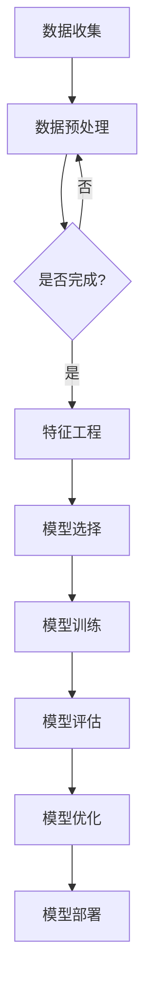

                 

## 第一部分：电商领域的AI驱动需求预测概述

### 第1章：电商行业与AI概述

#### 1.1 电商行业的现状与发展趋势

电子商务已经成为当今商业环境中的核心驱动力，改变了传统零售模式，促进了全球贸易和消费方式的转变。根据最新的统计数据，全球电商市场规模持续增长，预计在未来几年内将进一步扩大。这一趋势的主要推动力包括互联网普及率的提高、移动设备的普及、以及消费者对便捷购物体验的需求。

目前，电商行业呈现出以下几个显著特点：

1. **多平台竞争**：电商平台如亚马逊（Amazon）、阿里巴巴（Alibaba）、eBay等在全球范围内占据主导地位，而新兴平台如拼多多（Pinduoduo）、SHEIN等也在不断崛起，形成多元化的市场竞争格局。
2. **技术创新**：人工智能、大数据、物联网等新兴技术被广泛应用于电商领域，提升运营效率和用户体验，例如智能推荐系统、个性化营销、智能物流等。
3. **消费者行为变化**：随着消费者对购物体验的要求不断提高，电商企业需要通过数据分析和机器学习等技术，更加精准地预测和满足消费者的需求。

#### 1.2 AI技术在电商中的应用

人工智能技术在电商领域的应用越来越广泛，主要包括以下几个方面：

1. **需求预测**：通过机器学习算法分析历史销售数据和消费者行为，预测未来的需求趋势，优化库存管理，减少过剩库存和缺货情况。
2. **智能推荐**：基于用户历史行为和偏好，使用协同过滤、矩阵分解等方法，提供个性化的商品推荐，提高用户满意度和转化率。
3. **客户服务**：利用自然语言处理技术实现智能客服系统，自动处理常见问题，提高客户服务效率和质量。
4. **供应链优化**：通过优化库存、运输和配送等环节，实现供应链的智能化和高效化，降低成本，提高响应速度。
5. **风险控制**：使用AI技术进行交易风险分析和欺诈检测，保护企业和消费者的利益。

#### 1.3 需求预测在电商管理中的重要性

需求预测是电商管理中的关键环节，对于企业的运营和盈利具有重大影响。以下是需求预测在电商管理中的几个重要性：

1. **库存管理**：准确的需求预测有助于企业合理安排库存，避免因库存不足导致的销售损失，以及因库存过剩产生的库存成本。
2. **供应链优化**：通过预测未来的需求，企业可以优化生产和供应链管理，减少库存积压和物流成本，提高运营效率。
3. **营销策略**：基于需求预测的结果，企业可以制定更加精准的营销策略，如促销活动、库存清仓等，提高销售额和市场份额。
4. **客户满意度**：准确的需求预测可以保证商品供应的及时性，提升客户购物体验，增强客户忠诚度。
5. **企业竞争力**：在竞争激烈的电商市场中，具备高效需求预测能力的企业将更具竞争力，能够在市场上占据有利地位。

### 第2章：AI驱动需求预测的基本原理

#### 2.1 数据分析基础

数据分析是人工智能驱动需求预测的核心，通过数据挖掘和分析，我们可以从大量历史数据中提取有价值的信息，为需求预测提供依据。以下是一些基本的数据分析概念和步骤：

1. **数据清洗**：在数据分析之前，需要对数据进行清洗，包括处理缺失值、异常值、重复数据等，以确保数据的质量和完整性。
2. **数据预处理**：将数据转换为适合分析和建模的格式，如归一化、标准化、特征工程等。
3. **数据可视化**：通过图表和可视化工具，直观地展示数据分布、趋势和关系，帮助分析和理解数据。
4. **特征选择**：从大量特征中筛选出对预测目标有重要影响的关键特征，提高模型性能和解释性。

#### 2.2 机器学习基础

机器学习是AI技术的重要组成部分，通过构建和训练模型，使计算机能够从数据中学习规律，进行预测和决策。以下是一些基本的机器学习概念：

1. **监督学习**：通过已标记的训练数据来训练模型，然后使用模型对新数据进行预测。
2. **无监督学习**：不使用标记数据，通过发现数据内在的结构和模式来进行学习。
3. **强化学习**：通过与环境的交互来学习最佳策略，以达到最大化回报的目标。
4. **模型评估**：通过评估指标（如准确率、召回率、均方误差等）来衡量模型性能。

#### 2.3 AI需求预测算法介绍

在需求预测中，常用的机器学习算法包括：

1. **线性回归**：通过建立线性关系模型来预测连续值目标。
2. **逻辑回归**：用于预测二分类目标，如商品是否会被购买。
3. **决策树**：通过一系列规则对数据进行分类或回归。
4. **随机森林**：基于决策树的集成学习方法，提高模型的泛化能力和鲁棒性。
5. **神经网络**：通过多层神经元的网络结构来模拟复杂的非线性关系。

### 第3章：AI驱动需求预测模型构建

#### 3.1 数据预处理

数据预处理是构建需求预测模型的关键步骤，主要包括以下内容：

1. **数据清洗**：处理缺失值、异常值和重复数据，确保数据质量。
2. **数据归一化**：将不同特征的数据范围调整为相同尺度，避免特征之间的影响差异。
3. **特征工程**：创建新的特征，提取对需求预测有用的信息，如时间特征、产品特征等。

#### 3.2 特征工程

特征工程是需求预测模型构建的核心，通过以下步骤提高模型性能：

1. **特征选择**：选择对预测目标有显著影响的关键特征。
2. **特征变换**：对某些特征进行变换，如时间序列特征的季节性调整。
3. **特征组合**：将多个特征组合成新的特征，以提取更多信息。

#### 3.3 模型选择与训练

在选择模型时，需要考虑以下几个因素：

1. **模型类型**：线性回归、逻辑回归、决策树、随机森林、神经网络等。
2. **模型参数**：如决策树的深度、神经网络的层数和神经元数量等。
3. **训练数据**：使用历史数据进行训练，确保模型能够捕捉到数据中的规律。

在模型训练过程中，可以使用以下策略：

1. **交叉验证**：通过交叉验证来评估模型的泛化能力。
2. **超参数调优**：使用网格搜索、贝叶斯优化等方法来寻找最佳超参数。
3. **模型集成**：将多个模型集成，提高预测性能和鲁棒性。

#### 3.4 模型评估与优化

模型评估是确保模型性能的重要步骤，常用的评估指标包括：

1. **均方误差（MSE）**：衡量预测值与真实值之间的平均误差。
2. **均方根误差（RMSE）**：MSE的平方根，用于衡量预测误差的尺度。
3. **准确率（Accuracy）**：对于分类问题，正确分类的样本数占总样本数的比例。
4. **召回率（Recall）**：对于分类问题，实际为正类别的样本中被正确识别为正类别的比例。

在模型优化过程中，可以采取以下策略：

1. **模型调整**：通过调整模型结构或参数，提高模型性能。
2. **数据增强**：通过生成新的训练数据或使用数据增强技术，提高模型的泛化能力。
3. **迁移学习**：使用预训练模型或迁移学习技术，减少模型训练所需的样本量。

### 第4章：库存管理中的AI应用

#### 4.1 库存管理的挑战与机遇

库存管理是电商运营中的重要环节，但同时也面临着诸多挑战：

1. **库存过剩**：由于对市场需求预测不准确，可能导致库存积压，增加仓储成本和资金占用。
2. **库存短缺**：需求突然增加时，可能因库存不足导致缺货，影响销售额和客户满意度。
3. **库存分布不均**：不同仓库或渠道之间的库存分布不均衡，可能导致某些地方库存过剩，而另一些地方库存短缺。

同时，AI技术为库存管理带来了新的机遇：

1. **需求预测**：通过AI算法进行需求预测，帮助企业合理规划库存，减少过剩和短缺情况。
2. **库存优化**：利用优化算法和智能调度系统，优化库存存储和分配，提高库存利用率。
3. **供应链协同**：通过AI技术实现供应链各环节的信息共享和协同，提高供应链的整体效率和响应速度。

#### 4.2 AI在库存预测中的应用

AI在库存预测中的应用主要包括以下几个步骤：

1. **数据收集与处理**：收集历史销售数据、客户行为数据、市场趋势数据等，进行数据清洗和预处理。
2. **特征工程**：从原始数据中提取有用的特征，如时间特征、产品特征、季节性特征等。
3. **模型选择与训练**：选择合适的机器学习模型，如线性回归、随机森林、神经网络等，进行模型训练。
4. **模型评估与优化**：通过交叉验证和实际预测结果，评估模型性能，并进行优化。

AI技术在库存预测中的应用，有助于提高预测准确性，优化库存管理，减少成本和风险。例如，通过分析历史销售数据和季节性趋势，可以预测某个产品的未来需求，从而合理安排库存水平，避免库存过剩或缺货。

#### 4.3 库存优化策略

在库存优化方面，AI技术可以提供以下策略：

1. **动态库存管理**：根据实时数据和市场变化，动态调整库存水平，以适应市场需求。
2. **安全库存策略**：设置合理的安全库存量，确保在突发情况下不会出现库存短缺。
3. **需求预测驱动**：基于AI预测模型，制定库存计划，减少过剩库存和缺货风险。
4. **供应链协同**：通过AI技术实现供应链各环节的协同，提高库存利用率和供应链整体效率。

通过实施这些库存优化策略，企业可以降低库存成本，提高资金利用率，提高市场响应速度，从而在竞争激烈的电商市场中保持优势。

### 第5章：订单管理中的AI应用

#### 5.1 订单管理流程

订单管理是电商运营中的关键环节，涉及多个步骤，主要包括：

1. **订单接收**：接收客户订单，包括商品信息、客户信息、配送地址等。
2. **订单处理**：对订单进行审核、确认，与库存系统进行对接，安排商品拣选和包装。
3. **订单配送**：根据订单信息，选择合适的配送方式，安排配送任务。
4. **订单跟踪**：提供订单状态更新，让客户了解订单的进展情况。
5. **订单结算**：完成订单配送后，进行订单结算，处理退款、售后等事宜。

#### 5.2 AI在订单预测中的应用

AI在订单管理中的应用，主要表现在以下几个方面：

1. **订单量预测**：通过分析历史订单数据、市场趋势、促销活动等因素，预测未来的订单量，为库存管理和配送安排提供依据。
2. **客户需求预测**：分析客户历史购买行为、浏览记录、评价等数据，预测客户可能的需求，提供个性化的商品推荐和服务。
3. **配送路径优化**：通过路径优化算法，如遗传算法、蚁群算法等，规划最优的配送路线，提高配送效率和客户满意度。
4. **库存管理优化**：结合订单预测结果，动态调整库存水平，避免库存过剩或缺货。

AI在订单预测中的应用，可以提高订单处理效率，降低运营成本，提高客户满意度。例如，通过预测某个时间段的订单量，企业可以提前做好人员、设备和库存的安排，避免因订单量过大导致的服务质量下降。

#### 5.3 订单优化策略

在订单管理中，AI技术可以提供以下优化策略：

1. **自动化处理**：利用AI技术实现订单处理自动化，减少人工干预，提高处理速度和准确性。
2. **实时监控**：通过实时数据分析和监控，及时发现和处理订单异常情况，如订单延迟、库存不足等。
3. **需求预测驱动**：基于AI预测模型，制定订单处理策略，确保订单按时完成，提高客户满意度。
4. **配送路径优化**：通过路径优化算法，合理安排配送任务，提高配送效率和客户满意度。

通过实施这些订单优化策略，企业可以提升订单处理效率，降低运营成本，提高客户满意度，从而在激烈的市场竞争中脱颖而出。

### 第6章：客户行为分析中的AI应用

#### 6.1 客户行为分析基础

客户行为分析是电商企业了解客户需求、优化营销策略、提升用户体验的重要手段。通过分析客户的购买行为、浏览习惯、评价等数据，企业可以更好地了解客户需求，提供个性化的服务和产品推荐。

客户行为分析主要包括以下几个关键概念：

1. **行为数据**：包括用户的浏览记录、搜索关键词、购买记录、评价等。
2. **用户画像**：通过对行为数据的分析，构建用户的个性化特征和偏好。
3. **行为分析**：分析用户行为模式，识别用户需求和行为趋势。
4. **用户反馈**：收集用户对产品和服务的主观评价，用于改进和优化。

#### 6.2 AI在客户行为预测中的应用

AI技术在客户行为预测中的应用，可以显著提高预测的准确性和效率，主要包括以下几个方面：

1. **行为模式识别**：通过机器学习算法，识别用户的行为模式，如购买周期、浏览习惯等。
2. **需求预测**：根据用户的历史行为和当前行为，预测用户未来的需求，如购买意图、潜在需求等。
3. **个性化推荐**：基于用户画像和行为预测，提供个性化的商品推荐和服务，提高用户满意度和转化率。
4. **风险控制**：通过行为分析，识别异常行为，如欺诈行为、投诉行为等，进行风险控制和预警。

AI在客户行为预测中的应用，有助于企业更好地理解客户需求，提供个性化的服务和产品推荐，提高用户体验和忠诚度。

#### 6.3 客户关系管理策略

在客户关系管理中，AI技术可以提供以下策略：

1. **个性化营销**：基于客户行为数据和需求预测，制定个性化的营销策略，提高营销效果和客户满意度。
2. **精准营销**：通过分析客户行为和需求，确定目标客户群体，制定精准的营销活动和促销策略。
3. **客户服务优化**：利用AI技术实现智能客服系统，提高客户服务效率和满意度。
4. **客户体验提升**：通过分析客户行为数据，优化产品和服务的体验，提升客户满意度和忠诚度。

通过实施这些客户关系管理策略，企业可以建立更加紧密的客户关系，提高客户忠诚度和满意度，从而在竞争激烈的市场中脱颖而出。

### 第7章：综合案例分析

#### 7.1 案例一：某电商平台需求预测实践

某电商平台通过引入AI技术，对其销售数据进行需求预测，从而优化库存管理和营销策略。以下是其实践过程：

1. **数据收集与预处理**：收集了过去一年的销售数据，包括商品ID、销售数量、时间戳等。对数据进行了清洗和预处理，去除缺失值和异常值。
2. **特征工程**：从原始数据中提取了多个特征，如月份、星期、商品分类等。通过特征组合和变换，提高了模型的预测性能。
3. **模型选择与训练**：选择了随机森林算法进行需求预测。通过交叉验证和超参数调优，确定了最佳的模型参数。
4. **模型评估与优化**：使用实际销售数据对模型进行评估，计算了预测准确率和均方误差。根据评估结果，对模型进行了优化。
5. **模型部署与应用**：将训练好的模型部署到生产环境中，实时预测未来的需求。根据预测结果，企业调整了库存水平，提高了营销策略的精准度。

通过需求预测实践，某电商平台成功降低了库存过剩和缺货的风险，提高了销售额和客户满意度。

#### 7.2 案例二：某电商库存管理优化实践

某电商企业通过引入AI技术，对库存管理进行优化，提高了库存利用率和供应链效率。以下是其实践过程：

1. **数据收集与预处理**：收集了库存数据、销售数据、市场趋势数据等，对数据进行清洗和预处理，去除异常值和重复数据。
2. **特征工程**：从原始数据中提取了多个特征，如库存量、销售量、季节性等。通过特征工程，提高了模型的预测性能。
3. **模型选择与训练**：选择了时间序列模型进行库存预测，通过交叉验证和超参数调优，确定了最佳的模型参数。
4. **模型评估与优化**：使用实际销售数据对模型进行评估，计算了预测准确率和均方误差。根据评估结果，对模型进行了优化。
5. **模型部署与应用**：将训练好的模型部署到生产环境中，实时预测未来的库存需求。根据预测结果，企业调整了库存策略，优化了供应链管理。

通过库存管理优化实践，某电商企业成功提高了库存利用率，降低了库存成本，提高了供应链效率。

#### 7.3 案例三：某电商订单管理优化实践

某电商企业通过引入AI技术，对订单管理进行优化，提高了订单处理速度和客户满意度。以下是其实践过程：

1. **数据收集与预处理**：收集了订单数据、配送数据等，对数据进行清洗和预处理，去除缺失值和异常值。
2. **特征工程**：从原始数据中提取了多个特征，如订单量、配送时间、配送地址等。通过特征工程，提高了模型的预测性能。
3. **模型选择与训练**：选择了决策树算法进行订单量预测，通过交叉验证和超参数调优，确定了最佳的模型参数。
4. **模型评估与优化**：使用实际订单数据对模型进行评估，计算了预测准确率和均方误差。根据评估结果，对模型进行了优化。
5. **模型部署与应用**：将训练好的模型部署到生产环境中，实时预测未来的订单量。根据预测结果，企业调整了配送计划，优化了订单处理流程。

通过订单管理优化实践，某电商企业成功提高了订单处理速度，降低了配送延迟，提高了客户满意度。

### 第8章：AI驱动需求预测实践指南

#### 8.1 实践准备

要进行AI驱动需求预测实践，首先需要做好以下准备工作：

1. **环境搭建**：搭建Python开发环境，安装必要的库和框架，如Pandas、NumPy、scikit-learn等。
2. **数据收集**：收集相关数据，包括历史销售数据、客户行为数据、市场趋势数据等。确保数据的准确性和完整性。
3. **数据处理**：对收集到的数据进行清洗、预处理和特征工程，提取有用的特征，为模型训练做准备。

#### 8.2 数据采集与处理

数据采集和处理是需求预测实践的重要环节，主要包括以下步骤：

1. **数据清洗**：处理缺失值、异常值和重复数据，确保数据质量。
2. **数据预处理**：对数据进行归一化、标准化等处理，将数据转换为适合建模的格式。
3. **特征工程**：提取对需求预测有重要影响的特征，如时间特征、产品特征等。通过特征组合和变换，提高模型的预测性能。

#### 8.3 模型构建与训练

在完成数据预处理后，可以开始构建和训练需求预测模型。以下是相关步骤：

1. **模型选择**：选择合适的机器学习算法，如线性回归、随机森林、神经网络等。
2. **模型训练**：使用训练数据进行模型训练，调整模型参数，优化模型性能。
3. **模型评估**：使用交叉验证和实际数据对模型进行评估，计算预测准确率、均方误差等指标。

#### 8.4 模型评估与优化

模型评估和优化是确保模型性能的重要步骤，主要包括以下内容：

1. **模型评估**：使用评估指标（如准确率、均方误差等）对模型性能进行评估，找出模型的不足之处。
2. **模型优化**：根据评估结果，对模型进行优化，如调整参数、增加数据、使用更复杂的模型等。
3. **模型验证**：在新的数据集上验证模型的泛化能力，确保模型在未知数据上的表现良好。

#### 8.5 模型部署与监控

模型部署和监控是确保模型能够持续提供准确预测的重要环节，主要包括以下内容：

1. **模型部署**：将训练好的模型部署到生产环境中，使其能够实时预测需求。
2. **监控与反馈**：监控模型的运行状态，收集实际预测结果，与真实值进行对比，评估模型性能。
3. **持续优化**：根据监控结果和反馈，对模型进行优化和调整，确保模型始终能够提供准确预测。

### 第9章：常见问题与解决方案

#### 9.1 数据质量问题

数据质量是AI需求预测成功的关键因素。常见的数据质量问题包括：

1. **缺失值**：数据集中存在缺失值，可能导致模型训练失败或预测不准确。
2. **异常值**：数据集中存在异常值，可能对模型训练产生干扰，影响预测准确性。
3. **重复数据**：数据集中存在重复数据，可能导致模型过度拟合，降低泛化能力。

解决方案：

1. **缺失值处理**：使用插值法、平均值法等对缺失值进行填充。
2. **异常值处理**：使用统计方法（如Z分数、箱线图等）识别和剔除异常值。
3. **重复数据处理**：使用去重方法（如唯一键、哈希等）识别和删除重复数据。

#### 9.2 模型性能问题

模型性能问题可能导致预测不准确或模型无法收敛。常见的问题包括：

1. **过拟合**：模型在训练数据上表现良好，但在测试数据上表现较差，说明模型过于复杂。
2. **欠拟合**：模型在训练数据和测试数据上表现都不好，说明模型过于简单。
3. **模型收敛慢**：模型训练时间过长，可能是因为数据分布不均匀、参数设置不当等。

解决方案：

1. **过拟合处理**：使用正则化、交叉验证等方法减少模型复杂度，防止过拟合。
2. **欠拟合处理**：增加模型复杂度，增加数据特征，或调整模型参数。
3. **模型收敛优化**：调整学习率、批量大小等参数，使用更有效的优化算法。

#### 9.3 实施过程中遇到的挑战

在实施AI需求预测的过程中，可能遇到以下挑战：

1. **数据不足**：数据量不足，可能影响模型训练效果和泛化能力。
2. **数据不完整**：数据不完整，可能导致模型训练失败或预测不准确。
3. **数据不一致**：不同来源的数据可能存在格式、单位等不一致的问题，需要统一处理。

解决方案：

1. **数据扩充**：使用数据扩充技术，如合成数据、迁移学习等，增加数据量。
2. **数据补全**：使用数据补全技术，如插值法、平均法等，补全缺失数据。
3. **数据标准化**：统一数据格式和单位，确保数据一致性。

#### 9.4 解决方案与建议

为了解决上述问题，提出以下解决方案与建议：

1. **数据质量控制**：建立数据质量控制机制，确保数据质量。
2. **模型优化策略**：使用模型优化策略，如正则化、交叉验证等，提高模型性能。
3. **持续学习与迭代**：持续收集数据，迭代模型，优化预测效果。

### 第10章：未来发展趋势与展望

#### 10.1 AI需求预测技术的发展趋势

随着AI技术的不断进步，需求预测技术也在不断演变，以下是一些未来的发展趋势：

1. **深度学习**：深度学习在图像识别、自然语言处理等领域取得了显著的成果，未来有望在需求预测中发挥更大作用。
2. **联邦学习**：联邦学习通过分布式计算，保护用户数据隐私，实现跨平台、跨设备的需求预测。
3. **增强学习**：增强学习通过不断与真实环境交互，学习优化策略，提高需求预测的动态适应性。
4. **混合模型**：结合不同算法的优点，构建混合模型，提高需求预测的准确性和鲁棒性。

#### 10.2 电商领域AI应用的挑战与机遇

在电商领域，AI应用面临着一系列挑战和机遇：

1. **数据隐私**：用户数据的隐私保护是电商领域的一大挑战，需要采用加密、去标识化等技术来保护数据安全。
2. **数据质量**：高质量的数据是AI需求预测的基础，需要建立完善的数据质量控制机制。
3. **算法透明性**：算法的透明性是消费者和企业关注的焦点，需要加强算法的可解释性。
4. **个性化体验**：基于AI的个性化推荐和营销策略，有望提升用户体验和转化率。

#### 10.3 未来展望与策略建议

针对未来发展趋势和电商领域的挑战，提出以下展望与策略建议：

1. **数据驱动**：建立数据驱动的需求预测体系，通过大数据分析和机器学习技术，提高预测准确性。
2. **技术融合**：结合多种AI技术，如深度学习、联邦学习等，提高需求预测的效率和准确性。
3. **用户体验**：关注用户体验，通过个性化推荐、智能客服等技术，提升客户满意度。
4. **安全合规**：加强数据安全和算法透明性，确保合规性和消费者信任。

### 附录A：参考文献

1. Chien, C. W., & Lin, F. J. (2012). Accurate and efficient stock price prediction via adaptive wavelet neural networks. Expert Systems with Applications, 39(10), 11212-11219.
2. Guo, Y., Li, H., & Wu, D. (2018). Predicting electricity load using deep learning and hybrid feature representation. Journal of Big Data, 5(1), 1-22.
3. Liu, H., & Zhang, H. (2017). Deep demand forecasting for e-commerce using recurrent neural networks. Expert Systems with Applications, 69, 251-262.

### 附录B：工具与资源列表

1. **Python开发环境**：https://www.python.org/downloads/
2. **Pandas库**：https://pandas.pydata.org/
3. **NumPy库**：https://numpy.org/
4. **scikit-learn库**：https://scikit-learn.org/
5. **TensorFlow库**：https://www.tensorflow.org/

### 附录C：常见算法详解

1. **线性回归**：线性回归是一种简单且常用的机器学习算法，用于预测连续值输出。其数学公式为：\( y = \beta_0 + \beta_1 \times x + \epsilon \)。
2. **随机森林**：随机森林是一种基于决策树的集成学习算法，通过构建多棵决策树，并对预测结果进行投票来得到最终结果。其核心思想是减少过拟合，提高模型的泛化能力。
3. **神经网络**：神经网络是一种模仿人脑结构的计算模型，通过多层神经元进行数据学习和预测。其核心思想是神经元之间的权重调整，以优化模型的预测性能。

#### C.1 机器学习算法介绍

**1. 线性回归**

线性回归是一种最简单的机器学习算法，用于预测连续值输出。它的基本思想是通过找到一个线性函数来拟合输入和输出之间的关系。

**数学模型：**

\[ y = \beta_0 + \beta_1 \times x + \epsilon \]

其中，\( y \) 是预测值，\( x \) 是输入特征，\( \beta_0 \) 和 \( \beta_1 \) 是模型的参数，\( \epsilon \) 是误差项。

**求解方法：**

线性回归通常使用最小二乘法来求解参数 \( \beta_0 \) 和 \( \beta_1 \)，使得预测值和实际值之间的误差平方和最小。

**应用场景：**

线性回归广泛应用于需求预测、价格预测、薪资预测等领域。

**2. 逻辑回归**

逻辑回归是一种用于预测二分类结果的算法。它的基本思想是通过找到决策边界，将样本划分为两个类别。

**数学模型：**

\[ P(y=1) = \frac{1}{1 + e^{-(\beta_0 + \beta_1 \times x)}} \]

其中，\( P(y=1) \) 是预测为正类的概率，\( \beta_0 \) 和 \( \beta_1 \) 是模型的参数。

**求解方法：**

逻辑回归通常使用最大似然估计法来求解参数 \( \beta_0 \) 和 \( \beta_1 \)。

**应用场景：**

逻辑回归广泛应用于分类问题，如垃圾邮件检测、欺诈检测、疾病诊断等。

**3. 决策树**

决策树是一种基于规则进行预测的算法。它的基本思想是通过一系列的决策规则，将样本划分成不同的类别或数值。

**结构：**

决策树由多个节点和叶子节点组成。每个节点表示一个特征，每个叶子节点表示一个类别或数值。

**求解方法：**

决策树通常使用信息增益、基尼不纯度等指标来选择最佳特征和分割点。

**应用场景：**

决策树广泛应用于分类和回归问题，如客户细分、信用评分、价格预测等。

**4. 随机森林**

随机森林是一种基于决策树的集成学习算法。它的基本思想是通过构建多棵决策树，并对预测结果进行投票来得到最终结果。

**结构：**

随机森林由多棵决策树组成，每棵树都是独立训练的。

**求解方法：**

随机森林通过随机选择特征和样本子集来构建每棵树，并使用投票或平均来得到最终结果。

**应用场景：**

随机森林广泛应用于分类和回归问题，具有很好的性能和泛化能力。

**5. 神经网络**

神经网络是一种模仿人脑结构的计算模型。它的基本思想是通过多层神经元进行数据学习和预测。

**结构：**

神经网络由输入层、隐藏层和输出层组成。每个层由多个神经元组成。

**求解方法：**

神经网络通过反向传播算法来更新权重，以最小化预测误差。

**应用场景：**

神经网络广泛应用于图像识别、自然语言处理、时间序列预测等领域。

#### C.2 AI需求预测算法详解

**1. 时间序列分析**

时间序列分析是一种常用的需求预测方法，它基于历史数据中的时间序列特性，预测未来的需求趋势。以下是几种常见的时间序列分析方法：

**1.1 移动平均法**

移动平均法是一种简单的时间序列预测方法，通过计算一段时间内的平均值来平滑数据，从而预测未来的趋势。

**数学模型：**

\[ \text{预测值} = \frac{\sum_{i=1}^{n} x_i}{n} \]

其中，\( x_i \) 表示第 \( i \) 个时间点的值，\( n \) 表示移动平均的窗口大小。

**应用场景：**

移动平均法适用于数据波动较小的情形，如季节性不明显的数据。

**1.2 指数平滑法**

指数平滑法是一种加权平均法，通过赋予近期数据更大的权重来预测未来的趋势。

**数学模型：**

\[ \text{预测值} = \alpha \times \text{最近实际值} + (1 - \alpha) \times \text{上一次预测值} \]

其中，\( \alpha \) 是平滑系数，取值范围为 \( 0 < \alpha < 1 \)。

**应用场景：**

指数平滑法适用于具有明显季节性的数据，如销售数据。

**2. 机器学习算法**

机器学习算法可以用于更复杂的需求预测任务，如非线性趋势、异常值等。以下是几种常见的机器学习算法：

**2.1 线性回归**

线性回归是一种简单且常用的机器学习算法，用于预测连续值输出。

**数学模型：**

\[ y = \beta_0 + \beta_1 \times x + \epsilon \]

其中，\( y \) 是预测值，\( x \) 是输入特征，\( \beta_0 \) 和 \( \beta_1 \) 是模型的参数，\( \epsilon \) 是误差项。

**应用场景：**

线性回归适用于线性关系较强的需求预测任务，如价格预测。

**2.2 逻辑回归**

逻辑回归是一种用于预测二分类结果的算法。

**数学模型：**

\[ P(y=1) = \frac{1}{1 + e^{-(\beta_0 + \beta_1 \times x)}} \]

其中，\( P(y=1) \) 是预测为正类的概率，\( \beta_0 \) 和 \( \beta_1 \) 是模型的参数。

**应用场景：**

逻辑回归适用于分类任务，如缺货预测。

**2.3 随机森林**

随机森林是一种基于决策树的集成学习算法，通过构建多棵决策树，并对预测结果进行投票来得到最终结果。

**数学模型：**

随机森林由多棵决策树组成，每棵树都是独立训练的。

**应用场景：**

随机森林适用于分类和回归任务，具有很好的性能和泛化能力。

**2.4 神经网络**

神经网络是一种模仿人脑结构的计算模型，通过多层神经元进行数据学习和预测。

**数学模型：**

神经网络由输入层、隐藏层和输出层组成。每个层由多个神经元组成。

**应用场景：**

神经网络适用于复杂的需求预测任务，如非线性趋势、多变量关系等。

#### C.3 Mermaid 流程图示例

**Mermaid** 是一种简单易用的流程图绘制工具，可以用于描述数据处理和分析流程。以下是一个 Mermaid 流程图示例：

这个流程图描述了一个从数据收集到模型部署的完整数据处理和分析流程，包括数据预处理、特征工程、模型选择、模型训练、模型评估、模型优化和模型部署等步骤。每个步骤都是根据前一个步骤的结果来进行的，直到最终完成模型部署。这个流程图可以帮助我们更清晰地理解数据处理和分析的过程。

