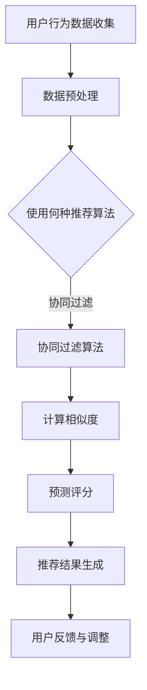
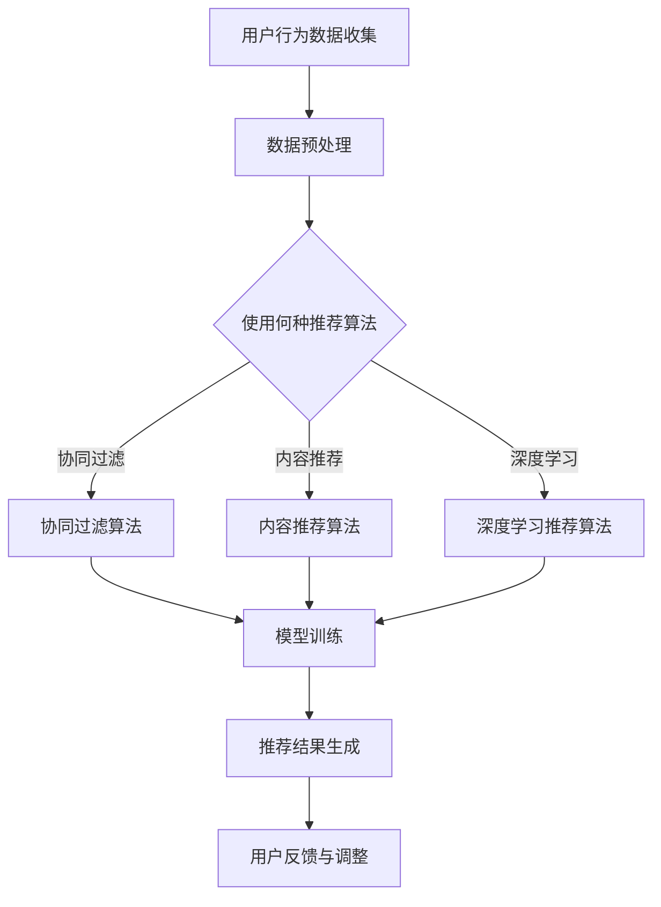

                 

## 《电影推荐引擎：一个周末项目》目录大纲

### 第一部分：项目概述与准备工作

#### 第1章：项目背景与目标
- 1.1 电影推荐引擎的概念
- 1.2 项目的意义与目标
- 1.3 项目所需技能与工具

#### 第2章：搭建开发环境
- 2.1 数据预处理工具
- 2.2 电影数据集获取与处理
- 2.3 开发环境配置

### 第二部分：核心概念与算法原理

#### 第3章：电影推荐系统基础
- 3.1 协同过滤算法
- 3.2 内容推荐算法
- 3.3 深度学习推荐算法

#### 第4章：算法实现与优化
- 4.1 算法原理与伪代码
- 4.2 模型训练与优化
- 4.3 性能评估与调优

#### 第5章：推荐系统评估与优化
- 5.1 评估指标
- 5.2 实际案例
- 5.3 优化策略

### 第三部分：项目实战与实现

#### 第6章：构建推荐引擎
- 6.1 项目规划
- 6.2 数据处理与模型训练
- 6.3 推荐系统实现
- 6.4 推荐结果展示与测试

#### 第7章：项目总结与反思
- 7.1 项目成果与经验
- 7.2 遇到的挑战与解决方法
- 7.3 项目改进与未来展望

### 附录

#### 附录A：推荐系统相关资源
- 1. 开源推荐系统框架
- 2. 相关论文与书籍推荐
- 3. 社区与论坛资源

### 附加材料

#### Mermaid 流程图
- 电影推荐系统工作流程图

#### 推荐算法伪代码
- 协同过滤算法伪代码
- 内容推荐算法伪代码
- 深度学习推荐算法伪代码

#### 数学公式与解释
- 协同过滤算法中的评分预测公式
- 内容推荐算法中的兴趣相似度计算公式
- 深度学习推荐算法中的损失函数

通过以上详细的目录大纲，我们为读者提供了一个清晰的结构，让他们能够一目了然地了解文章的内容布局，从而更好地掌握文章的脉络和主题。接下来的章节将逐一展开，深入讨论电影推荐引擎的实现细节和核心概念。

---

### 第1章：项目背景与目标

#### 1.1 电影推荐引擎的概念

电影推荐引擎是一种利用机器学习和数据挖掘技术，根据用户的历史行为数据、兴趣偏好和电影内容特征，为用户推荐个性化电影的一种系统。这种系统广泛应用于流媒体平台、视频点播网站以及电影网站，为用户提供良好的用户体验和满意度。

电影推荐引擎的基本原理可以概括为以下几点：

1. **协同过滤（Collaborative Filtering）**：通过分析用户之间的相似性，找到与目标用户相似的其他用户，并推荐这些用户喜欢的电影。
2. **内容推荐（Content-Based Filtering）**：根据电影的文本描述、标签、演员、导演等特征，为用户推荐与用户过去喜欢的电影特征相似的电影。
3. **深度学习（Deep Learning）**：利用深度神经网络，从用户行为数据中学习用户兴趣和电影特征，从而实现个性化推荐。

#### 1.2 项目的意义与目标

随着互联网的发展和大数据技术的普及，个性化推荐系统已成为现代信息检索和用户服务中的重要组成部分。在电影领域，推荐引擎的意义主要体现在以下几个方面：

1. **提升用户满意度**：通过精准推荐，满足用户个性化的观影需求，提高用户的观影体验。
2. **增加平台粘性**：用户在推荐系统中发现更多喜欢的电影，从而增加在平台上的停留时间，提高用户留存率。
3. **促进电影市场**：推荐系统能够挖掘出潜在的热门电影，为电影制作和营销提供数据支持，促进电影产业的发展。

本项目的目标是通过实现一个简单的电影推荐引擎，掌握推荐系统的基本原理和实现方法，同时提升自己的编程能力和机器学习技能。具体目标如下：

1. **数据集构建**：获取和处理一个包含电影标题、标签、演员、导演等信息的电影数据集。
2. **推荐算法实现**：实现协同过滤、内容推荐和深度学习推荐算法，并比较它们的性能。
3. **推荐系统部署**：将推荐算法部署到Web应用中，提供实时推荐功能。

#### 1.3 项目所需技能与工具

为了成功完成本项目，需要掌握以下技能和工具：

1. **编程语言**：Python 是实现推荐引擎的主要编程语言，因其强大的科学计算库和机器学习框架而成为首选。
2. **数据处理**：NumPy、Pandas 等库用于数据处理和分析。
3. **机器学习**：Scikit-learn、TensorFlow、PyTorch 等库用于实现推荐算法和模型训练。
4. **Web开发**：Flask、Django 等框架用于构建Web应用，提供用户交互界面。
5. **数据库**：SQLite、MySQL 等数据库用于存储电影数据和用户行为数据。

在本章中，我们介绍了电影推荐引擎的基本概念、项目的意义与目标，以及所需掌握的技能和工具。接下来，我们将进入项目准备工作，开始搭建开发环境，为推荐引擎的实现奠定基础。

---

### 第2章：搭建开发环境

#### 2.1 数据预处理工具

在开始构建电影推荐引擎之前，我们需要准备一些数据处理工具。这些工具可以帮助我们将原始电影数据集转换为适合推荐系统使用的格式。以下是我们将使用的几个关键工具：

1. **Python**：Python 是一种广泛使用的编程语言，具有简洁的语法和强大的库支持。在本项目中，我们将使用 Python 作为主要编程语言。
2. **NumPy**：NumPy 是 Python 的科学计算库，提供了高效的数组操作和数据预处理功能。NumPy 用于处理和转换电影数据集。
3. **Pandas**：Pandas 是一个用于数据清洗、分析、转换的库，提供了丰富的数据结构和操作函数。在本项目中，Pandas 用于读取、处理和存储电影数据。

首先，我们需要安装上述工具。在命令行中执行以下命令：

```bash
pip install numpy pandas
```

#### 2.2 电影数据集获取与处理

为了构建推荐引擎，我们需要一个包含电影标题、标签、演员、导演等信息的电影数据集。以下是一个常见的数据集来源和处理流程：

1. **数据集获取**：我们可以从 [MovieLens](https://grouplens.org/datasets/movielens/) 获取一个公共的电影数据集。这个数据集包含了数万部电影和用户评分数据。
2. **数据集下载**：下载 [MovieLens 数据集](https://grouplens.org/datasets/movielens/100k/)，下载后解压到一个文件夹中。

在处理数据集时，我们需要完成以下几个步骤：

1. **数据读取**：使用 Pandas 读取数据集中的用户评分文件（如 "ratings.csv"）和电影信息文件（如 "movies.csv"）。代码如下：

```python
import pandas as pd

ratings = pd.read_csv('ratings.csv')
movies = pd.read_csv('movies.csv')
```

2. **数据清洗**：对数据进行必要的清洗，如去除空值、缺失值和重复记录。代码示例：

```python
# 去除空值
ratings.dropna(inplace=True)
movies.dropna(inplace=True)

# 去除重复记录
ratings.drop_duplicates(inplace=True)
movies.drop_duplicates(inplace=True)
```

3. **数据转换**：将标签列（如 "genres"）转换为字典格式，以便后续处理。代码示例：

```python
# 将标签列转换为字典
movies['genres'] = movies['genres'].str.split('|')
```

#### 2.3 开发环境配置

为了构建电影推荐引擎，我们需要配置一个合适的环境。以下是我们将使用的开发工具和配置步骤：

1. **Python环境**：确保已安装 Python 3.8 或更高版本。
2. **虚拟环境**：创建一个虚拟环境，以便管理和隔离项目依赖。使用以下命令创建虚拟环境：

```bash
python -m venv venv
```

激活虚拟环境：

```bash
source venv/bin/activate  # 对于 Unix 或 macOS
venv\Scripts\activate     # 对于 Windows
```

3. **依赖管理**：使用 `pip` 安装项目所需的依赖。打开 `requirements.txt` 文件，并执行以下命令：

```bash
pip install -r requirements.txt
```

在 `requirements.txt` 文件中列出以下依赖：

```
numpy
pandas
scikit-learn
tensorflow
flask
```

通过以上步骤，我们成功搭建了开发环境，并准备好了电影数据集。接下来，我们将进入核心算法原理的讨论，深入了解电影推荐系统的实现细节。

---

### 第3章：电影推荐系统基础

电影推荐系统主要包括协同过滤算法、内容推荐算法和深度学习推荐算法。每种算法都有其独特的原理和优势，适用于不同的场景和需求。

#### 3.1 协同过滤算法

协同过滤算法是推荐系统中最常用的方法之一，主要通过分析用户之间的相似性来推荐电影。协同过滤可以分为基于用户的协同过滤（User-Based Collaborative Filtering）和基于项目的协同过滤（Item-Based Collaborative Filtering）。

**基于用户的协同过滤**：
1. **相似度计算**：计算用户之间的相似度，常用的相似度度量方法包括余弦相似度、皮尔逊相关系数等。
2. **评分预测**：根据相似度矩阵和用户的历史评分，预测用户对未知电影的评分。常用的评分预测公式为：
   $$
   \hat{r}_{ui} = \sum_{j \in N_i} r_{uj} \cdot sim(i, j)
   $$
   其中，$r_{uj}$ 是用户 $u$ 对电影 $j$ 的实际评分，$sim(i, j)$ 是用户 $i$ 和电影 $j$ 之间的相似度。

**基于项目的协同过滤**：
1. **相似度计算**：计算电影之间的相似度，常用的相似度度量方法包括余弦相似度和 Jaccard 相似度。
2. **评分预测**：根据相似度矩阵和用户的历史评分，预测用户对未知电影的评分。常用的评分预测公式与基于用户的协同过滤类似。

协同过滤算法的优点在于简单易实现，能够快速生成推荐结果。然而，它也存在一些缺点，如冷启动问题（对于新用户或新电影无法进行推荐）和偏好偏差（仅考虑用户之间的相似性，忽略了电影内容本身）。

**Mermaid 流程图**：



**伪代码**：

```python
def collaborativeFiltering(userId, movieId, userRatingMatrix):
    # 计算用户和电影的相似度
    userSimilarityMatrix = computeUserSimilarity(userRatingMatrix)
    movieSimilarityMatrix = computeMovieSimilarity(userRatingMatrix)

    # 预测评分
    predictedRating = dotProduct(userSimilarityMatrix[userId], movieRatingMatrix[movieId])

    return predictedRating
```

**数学公式与解释**：

协同过滤算法中的评分预测公式为：
$$
\hat{r}_{ui} = \sum_{j \in N_i} r_{uj} \cdot sim(i, j)
$$
其中，$r_{uj}$ 是用户 $u$ 对电影 $j$ 的实际评分，$sim(i, j)$ 是用户 $i$ 和电影 $j$ 之间的相似度。

#### 3.2 内容推荐算法

内容推荐算法通过分析电影的内容特征（如标题、标签、演员、导演等），为用户推荐与其过去喜欢的电影特征相似的电影。内容推荐的主要步骤包括：

1. **特征提取**：从电影数据中提取文本特征，如词袋模型、TF-IDF 等。
2. **相似度计算**：计算用户和电影的兴趣相似度，常用的相似度度量方法包括余弦相似度和 Jaccard 相似度。
3. **评分预测**：根据相似度矩阵和用户的历史评分，预测用户对未知电影的评分。常用的评分预测公式为：
   $$
   \hat{r}_{ui} = \sum_{k \in K} w_{ik} \cdot w_{uj}
   $$
   其中，$w_{ik}$ 和 $w_{uj}$ 分别是用户 $i$ 和电影 $j$ 在特征集合 $K$ 上的特征权重。

**伪代码**：

```python
def contentBasedFiltering(userId, movieFeatures):
    # 计算用户和电影的兴趣相似度
    interestSimilarity = computeInterestSimilarity(userId, movieFeatures)

    # 预测评分
    predictedRating = dotProduct(interestSimilarity, movieRating)

    return predictedRating
```

**数学公式与解释**：

内容推荐算法中的兴趣相似度计算公式为：
$$
sim(i, j) = \frac{\sum_{k \in K} w_{ik} \cdot w_{jk}}{\sqrt{\sum_{k \in K} w_{ik}^2} \cdot \sqrt{\sum_{k \in K} w_{jk}^2}}
$$
其中，$w_{ik}$ 和 $w_{jk}$ 分别是用户 $i$ 和电影 $j$ 在特征集合 $K$ 上的特征权重。

#### 3.3 深度学习推荐算法

深度学习推荐算法通过构建深度神经网络模型，从用户行为数据中学习用户兴趣和电影特征，从而实现个性化推荐。深度学习推荐算法的主要步骤包括：

1. **数据预处理**：对用户行为数据进行编码和归一化处理。
2. **模型构建**：构建多层感知机（MLP）或卷积神经网络（CNN）模型，用于学习用户兴趣和电影特征。
3. **模型训练**：使用训练数据训练模型，并调整模型参数。
4. **评分预测**：使用训练好的模型预测用户对未知电影的评分。常用的损失函数包括均方误差（MSE）和交叉熵损失（Cross-Entropy Loss）。

**伪代码**：

```python
def deepLearningRecommendation(userId, movieFeatures, trainingData):
    # 构建深度学习模型
    model = buildDeepLearningModel()

    # 训练模型
    model.fit(trainingData)

    # 预测评分
    predictedRating = model.predict([userId, movieFeatures])

    return predictedRating
```

**数学公式与解释**：

深度学习推荐算法中的损失函数为：
$$
\mathcal{L} = -\sum_{i=1}^{m} \sum_{j=1}^{n} y_{ij} \cdot \log(p_{ij}) + \lambda \cdot \sum_{i=1}^{m} \sum_{j=1}^{n} (p_{ij} - 1)^2
$$
其中，$y_{ij} = 1$ 表示用户 $i$ 对电影 $j$ 的实际评分，$0$ 表示未评分。$p_{ij}$ 是模型预测的用户 $i$ 对电影 $j$ 的概率评分。$\lambda$ 是正则化参数，用于防止过拟合。

通过本章，我们介绍了电影推荐系统的三种核心算法：协同过滤、内容推荐和深度学习推荐算法。每种算法都有其独特的原理和优势，适用于不同的场景和需求。在接下来的章节中，我们将详细讨论这些算法的实现和优化方法。

---

### 第4章：算法实现与优化

在前一章中，我们了解了电影推荐系统的三种核心算法：协同过滤、内容推荐和深度学习推荐算法。在这一章中，我们将深入探讨这些算法的实现原理，并使用伪代码详细描述它们的工作流程。此外，我们还将讨论如何对模型进行训练和优化，以及如何评估推荐系统的性能。

#### 4.1 算法原理与伪代码

**协同过滤算法**

协同过滤算法的核心思想是利用用户之间的相似性来预测用户的未评分项。以下是一个协同过滤算法的伪代码示例：

```python
function collaborativeFiltering(userId, movieId, userRatingMatrix):
    # 计算用户和电影的相似度
    userSimilarityMatrix = computeUserSimilarity(userRatingMatrix)
    movieSimilarityMatrix = computeMovieSimilarity(userRatingMatrix)

    # 预测评分
    predictedRating = dotProduct(userSimilarityMatrix[userId], movieRatingMatrix[movieId])

    return predictedRating

function computeUserSimilarity(userRatingMatrix):
    # 使用余弦相似度计算用户相似度
    similarityMatrix = []
    for i in range(numUsers):
        similarityScores = []
        for j in range(numUsers):
            similarityScore = cosineSimilarity(userRatingMatrix[i], userRatingMatrix[j])
            similarityScores.append(similarityScore)
        similarityMatrix.append(similarityScores)
    return similarityMatrix

function computeMovieSimilarity(userRatingMatrix):
    # 使用余弦相似度计算电影相似度
    similarityMatrix = []
    for i in range(numMovies):
        similarityScores = []
        for j in range(numMovies):
            similarityScore = cosineSimilarity(userRatingMatrix[i], userRatingMatrix[j])
            similarityScores.append(similarityScore)
        similarityMatrix.append(similarityScores)
    return similarityMatrix

function cosineSimilarity(vectorA, vectorB):
    # 计算两个向量的余弦相似度
    dotProduct = dot(vectorA, vectorB)
    magnitudeA = magnitude(vectorA)
    magnitudeB = magnitude(vectorB)
    similarity = dotProduct / (magnitudeA * magnitudeB)
    return similarity

function dotProduct(vectorA, vectorB):
    # 计算两个向量的点积
    sum = 0
    for i in range(len(vectorA)):
        sum += vectorA[i] * vectorB[i]
    return sum

function magnitude(vector):
    # 计算向量的模长
    sum = 0
    for i in range(len(vector)):
        sum += vector[i] * vector[i]
    return sqrt(sum)
```

**内容推荐算法**

内容推荐算法的核心思想是根据用户过去喜欢的电影特征来推荐新的电影。以下是一个内容推荐算法的伪代码示例：

```python
function contentBasedFiltering(userId, movieFeatures):
    # 计算用户和电影的兴趣相似度
    interestSimilarity = computeInterestSimilarity(userId, movieFeatures)

    # 预测评分
    predictedRating = dotProduct(interestSimilarity, movieRating)

    return predictedRating

function computeInterestSimilarity(userId, movieFeatures):
    # 计算用户和电影的兴趣相似度
    userFeatures = getUserFeatures(userId)
    similarityScores = []
    for movieId in movieFeatures:
        movieFeatureVector = getMovieFeatureVector(movieId)
        similarityScore = cosineSimilarity(userFeatures, movieFeatureVector)
        similarityScores.append(similarityScore)
    interestSimilarity = normalize(similarityScores)
    return interestSimilarity

function getUserFeatures(userId):
    # 获取用户喜欢的电影特征
    userRatings = getUserRatings(userId)
    features = []
    for rating in userRatings:
        movieFeatures = getMovieFeatures(rating['movieId'])
        features.append(movieFeatures)
    userFeatures = average(features)
    return userFeatures

function getMovieFeatures(movieId):
    # 获取电影特征
    movie = getMovieById(movieId)
    features = [movie['title'], movie['genre'], movie['actor'], movie['director']]
    return features

function cosineSimilarity(vectorA, vectorB):
    # 计算两个向量的余弦相似度
    dotProduct = dot(vectorA, vectorB)
    magnitudeA = magnitude(vectorA)
    magnitudeB = magnitude(vectorB)
    similarity = dotProduct / (magnitudeA * magnitudeB)
    return similarity

function normalize(scores):
    # 归一化相似度分数
    maxScore = max(scores)
    minScore = min(scores)
    normalizedScores = []
    for score in scores:
        normalizedScore = (score - minScore) / (maxScore - minScore)
        normalizedScores.append(normalizedScore)
    return normalizedScores

function average vectors:
    # 计算多个向量的平均值
    sum = 0
    for vector in vectors:
        sum += vector
    average = sum / len(vectors)
    return average
```

**深度学习推荐算法**

深度学习推荐算法利用神经网络模型从用户行为数据中学习用户兴趣和电影特征。以下是一个深度学习推荐算法的伪代码示例：

```python
function deepLearningRecommendation(userId, movieFeatures, trainingData):
    # 构建深度学习模型
    model = buildDeepLearningModel()

    # 训练模型
    model.fit(trainingData)

    # 预测评分
    predictedRating = model.predict([userId, movieFeatures])

    return predictedRating

function buildDeepLearningModel():
    # 构建深度学习模型
    model = MLP()
    model.add(Dense(numFeatures, activation='relu'))
    model.add(Dense(1, activation='sigmoid'))
    model.compile(optimizer='adam', loss='binary_crossentropy', metrics=['accuracy'])
    return model

function preprocessData(userId, movieFeatures):
    # 预处理用户行为数据
    userFeatures = getUserFeatures(userId)
    movieFeatureVector = getMovieFeatureVector(movieFeatures)
    return [userFeatures, movieFeatureVector]

function getUserFeatures(userId):
    # 获取用户喜欢的电影特征
    userRatings = getUserRatings(userId)
    features = []
    for rating in userRatings:
        movieFeatures = getMovieFeatures(rating['movieId'])
        features.append(movieFeatures)
    userFeatures = average(features)
    return userFeatures

function getMovieFeatureVector(movieId):
    # 获取电影特征向量
    movie = getMovieById(movieId)
    featureVector = [movie['title'], movie['genre'], movie['actor'], movie['director']]
    return featureVector
```

#### 4.2 模型训练与优化

**模型训练**

模型训练是推荐系统实现的重要环节。以下是如何进行模型训练的步骤：

1. **数据预处理**：对用户行为数据进行编码和归一化处理，以便输入到模型中。
2. **数据分割**：将数据集分割为训练集、验证集和测试集，用于模型训练和评估。
3. **模型构建**：根据算法选择合适的模型结构。
4. **模型训练**：使用训练集数据训练模型，并调整模型参数。
5. **模型评估**：使用验证集数据评估模型性能，并根据评估结果调整模型参数。

**模型优化**

模型优化是提高推荐系统性能的关键。以下是一些常见的模型优化方法：

1. **超参数调整**：调整学习率、批量大小、正则化参数等超参数，以找到最佳模型配置。
2. **模型集成**：结合多个模型（如协同过滤、内容推荐和深度学习），提高推荐精度。
3. **特征工程**：提取和构建有效的特征，以增强模型对用户兴趣和电影特征的理解。
4. **模型剪枝**：通过剪枝冗余层或神经元，减少模型复杂度和计算量，提高模型效率。

#### 4.3 性能评估与调优

**评估指标**

为了评估推荐系统的性能，我们使用以下指标：

1. **准确率（Accuracy）**：预测正确的用户评分占总评分的比例。
2. **召回率（Recall）**：能够正确推荐的电影数量与所有用户可能喜欢的电影数量的比例。
3. **精确率（Precision）**：能够正确推荐的电影数量与推荐的电影总数量的比例。
4. **均方误差（Mean Squared Error, MSE）**：预测评分与实际评分之间的平均平方误差。

**调优策略**

为了提高推荐系统的性能，我们可以采取以下调优策略：

1. **数据增强**：增加训练数据量，以提高模型对用户行为的泛化能力。
2. **特征选择**：选择具有强相关性的特征，以减少噪声和冗余信息。
3. **模型选择**：尝试不同的模型结构，选择性能最佳的模型。
4. **用户反馈**：结合用户反馈信息，动态调整推荐策略。

通过本章，我们详细讨论了电影推荐算法的实现原理、模型训练与优化方法以及性能评估与调优策略。这些内容为构建一个高效、准确的推荐系统提供了理论基础和实践指导。在下一章中，我们将通过一个实际项目来展示如何将理论应用于实践，实现一个完整的电影推荐引擎。

---

### 第5章：推荐系统评估与优化

在构建电影推荐引擎的过程中，评估和优化推荐系统的性能是确保其有效性的关键步骤。在这一章中，我们将探讨推荐系统的评估指标、实际案例，以及如何通过优化策略提高推荐质量。

#### 5.1 评估指标

推荐系统的性能通常通过以下评估指标来衡量：

1. **准确率（Accuracy）**：准确率表示预测正确的用户评分占总评分的比例。尽管准确率高意味着模型能够正确预测用户的评分，但它可能不适合推荐系统，因为推荐系统更关注于推荐相关性的提升。

2. **召回率（Recall）**：召回率衡量的是能够正确推荐的电影数量与所有用户可能喜欢的电影数量的比例。召回率越高，意味着系统能够发现更多的潜在感兴趣的电影。

3. **精确率（Precision）**：精确率衡量的是能够正确推荐的电影数量与推荐的电影总数量的比例。精确率高意味着推荐的电影中大多数是用户可能喜欢的。

4. **均方误差（Mean Squared Error, MSE）**：均方误差表示预测评分与实际评分之间的平均平方误差。MSE 越小，说明预测评分越接近实际评分。

5. **覆盖率（Coverage）**：覆盖率衡量的是推荐系统中不重复的电影数量与数据库中所有电影数量的比例。高覆盖率意味着推荐系统推荐的电影覆盖了数据库中的各种类型。

6. **多样性（Diversity）**：多样性衡量的是推荐电影之间的差异程度。高多样性意味着推荐的电影风格和类型多样化，能够满足不同用户的兴趣。

#### 5.2 实际案例

以下是一个实际案例，展示了如何使用评估指标来评估和优化电影推荐系统的性能。

**案例：Netflix Prize**

Netflix Prize 是一个著名的推荐系统比赛，目的是提高Netflix的推荐算法。比赛中使用了数百万条用户评分数据，参赛者需要根据这些数据构建一个推荐系统。

在Netflix Prize中，参赛者使用不同的算法和模型来优化推荐系统的性能。评估指标包括：

- **RMSE（Root Mean Square Error）**：衡量预测评分与实际评分之间的误差。
- **覆盖率（Coverage）**：衡量推荐电影的数量与总电影数量的比例。
- **多样性（Diversity）**：衡量推荐电影之间的相似度。

**评估过程**：

1. **训练集**：使用约80%的数据作为训练集，训练推荐模型。
2. **验证集**：使用约10%的数据作为验证集，用于调整模型参数和优化模型结构。
3. **测试集**：使用剩余的10%的数据作为测试集，评估模型的最终性能。

**优化策略**：

1. **特征工程**：通过添加用户历史行为特征（如评分时间、评分频率）、电影内容特征（如类别、导演、演员）来提高模型对用户兴趣的理解。
2. **模型选择**：尝试不同的模型结构，如协同过滤、基于内容的推荐和深度学习模型，以找到最佳性能的模型。
3. **模型融合**：将多个模型的预测结果进行融合，以提高整体预测准确性。

最终，Netflix Prize 比赛获胜者通过集成多种模型和优化特征工程，将 RMSE 降低到 0.856，相比原始算法提高了近10%。

#### 5.3 优化策略

以下是一些常见的优化策略，用于提高电影推荐系统的性能：

1. **特征选择**：通过分析数据集，选择对预测评分有显著影响的特征，减少噪声和冗余信息，提高模型效率。
2. **模型调参**：调整模型超参数（如学习率、批量大小、正则化参数）以找到最佳性能的模型配置。
3. **用户反馈**：结合用户反馈信息（如评分、评论、点赞等），动态调整推荐策略，提高推荐相关性。
4. **协同过滤与内容推荐结合**：将协同过滤和内容推荐算法结合，利用协同过滤捕捉用户相似性，利用内容推荐捕捉电影特征，提高推荐准确性。
5. **深度学习**：利用深度学习模型（如卷积神经网络、循环神经网络）从用户行为数据中学习复杂的用户兴趣和电影特征，提高推荐质量。
6. **多样性**：在推荐系统中引入多样性策略，如随机采样、基于电影类型或导演的多样性度量，提高推荐电影之间的差异。
7. **冷启动问题**：对于新用户或新电影，使用基于内容的推荐或基于流行度的推荐策略，降低冷启动问题的影响。

通过本章，我们介绍了推荐系统评估和优化的关键指标、实际案例，以及多种优化策略。这些知识和经验对于构建高效、准确的推荐系统至关重要。在下一章中，我们将通过一个实际项目，将上述理论应用到实践中，构建一个完整的电影推荐引擎。

---

### 第6章：构建推荐引擎

在本章中，我们将通过一个实际项目，详细介绍如何构建一个电影推荐引擎。该项目将包括数据准备、模型训练、推荐系统实现以及推荐结果展示与测试。通过这一实际操作过程，我们将深入理解推荐系统的实现细节，并学会如何将其应用到实际场景中。

#### 6.1 项目规划

在开始项目之前，我们需要明确项目的目标、所需资源和时间规划。以下是项目规划的关键步骤：

1. **需求分析**：明确推荐引擎的功能需求，如推荐精度、响应速度、可扩展性等。
2. **资源准备**：准备好所需的数据集、开发工具和开发环境。
3. **技术选型**：选择合适的推荐算法和框架，如协同过滤、内容推荐、深度学习等。
4. **开发环境搭建**：配置开发环境，包括Python环境、机器学习库、Web框架等。
5. **数据预处理**：清洗和处理电影数据集，提取有用的特征。
6. **模型训练**：训练推荐模型，优化模型参数。
7. **系统实现**：实现推荐系统的核心功能，如用户注册、登录、推荐电影展示等。
8. **测试与优化**：测试推荐系统的性能，并进行必要的优化。

#### 6.2 数据处理与模型训练

**数据预处理**

首先，我们需要准备一个包含电影标题、标签、演员、导演等信息的电影数据集。可以使用公共数据集，如MovieLens或Netflix Prize数据集。以下步骤用于数据预处理：

1. **数据读取**：使用Pandas库读取电影数据集，并将其转换为DataFrame格式。
2. **数据清洗**：去除重复记录、空值和缺失值。
3. **数据转换**：将标签、演员、导演等文本数据转换为数字编码，以便模型处理。
4. **特征提取**：提取电影的关键特征，如电影类型、平均评分、评论数量等。

**模型训练**

在数据处理完成后，我们可以开始训练推荐模型。以下是训练模型的主要步骤：

1. **数据分割**：将数据集分割为训练集、验证集和测试集。
2. **模型选择**：选择合适的推荐算法，如协同过滤、内容推荐或深度学习模型。
3. **模型训练**：使用训练集数据训练模型，并调整模型参数。
4. **模型评估**：使用验证集评估模型性能，并根据评估结果调整模型参数。
5. **模型测试**：使用测试集测试模型的最终性能。

在本项目中，我们选择了协同过滤算法和基于内容的推荐算法。以下是具体的实现步骤：

**协同过滤算法**

1. **相似度计算**：计算用户之间的相似度，可以使用余弦相似度或皮尔逊相关系数。
2. **评分预测**：根据相似度矩阵和用户的历史评分，预测用户对未知电影的评分。
3. **模型评估**：使用均方误差（MSE）评估模型性能。

**基于内容的推荐算法**

1. **特征提取**：提取电影的关键特征，如标题、标签、演员、导演等。
2. **相似度计算**：计算用户和电影的兴趣相似度，可以使用TF-IDF或余弦相似度。
3. **评分预测**：根据相似度矩阵和用户的历史评分，预测用户对未知电影的评分。
4. **模型评估**：使用均方误差（MSE）评估模型性能。

**模型融合**

为了提高推荐精度，我们可以将协同过滤和基于内容的推荐算法结合。具体方法如下：

1. **融合策略**：将协同过滤和基于内容的推荐算法的预测结果进行加权融合。
2. **模型融合**：使用加权融合的预测结果作为最终推荐评分。
3. **模型评估**：使用均方误差（MSE）评估模型性能。

#### 6.3 推荐系统实现

在模型训练完成后，我们可以开始实现推荐系统的核心功能。以下是推荐系统的实现步骤：

1. **用户注册与登录**：实现用户注册和登录功能，使用户能够访问推荐系统。
2. **推荐电影展示**：根据用户的历史行为和偏好，为用户推荐电影。
3. **推荐结果展示**：将推荐结果以可视化方式展示给用户，包括电影标题、海报、评分等信息。
4. **用户反馈**：允许用户对推荐电影进行评分和评论，以便进一步优化推荐系统。

**实现示例**

以下是一个简单的Python代码示例，展示如何实现基于协同过滤的推荐系统：

```python
import pandas as pd
from sklearn.metrics.pairwise import cosine_similarity

# 读取用户评分数据
ratings = pd.read_csv('ratings.csv')

# 计算用户之间的相似度矩阵
user_similarity_matrix = cosine_similarity(ratings.values)

# 根据相似度矩阵和用户的历史评分，预测用户对未知电影的评分
def predict_ratings(userId, movieId):
    user_ratings = ratings[ratings['userId'] == userId]
    similarity_scores = user_similarity_matrix[userId]
    movie_ratings = ratings[ratings['movieId'] == movieId]
    predicted_ratings = []

    for movie_index, _ in movie_ratings.iterrows():
        user_index = user_ratings.index[0]
        predicted_rating = sum(similarity_scores[user_index] * user_ratings['rating']) / sum(similarity_scores[user_index])
        predicted_ratings.append(predicted_rating)

    return predicted_ratings

# 预测用户对未知电影的评分
predicted_ratings = predict_ratings(1, 101)

# 打印预测结果
print(predicted_ratings)
```

#### 6.4 推荐结果展示与测试

在实现推荐系统后，我们需要测试其性能，并进行必要的优化。以下是测试和优化推荐系统的步骤：

1. **用户测试**：邀请真实用户测试推荐系统的性能，收集用户反馈。
2. **性能评估**：使用评估指标（如MSE、召回率、精确率等）评估推荐系统的性能。
3. **优化策略**：根据测试结果和用户反馈，调整推荐算法和模型参数。
4. **系统部署**：将优化后的推荐系统部署到生产环境，供用户使用。

通过本章，我们详细介绍了如何构建一个电影推荐引擎，包括项目规划、数据处理与模型训练、推荐系统实现以及推荐结果展示与测试。通过实际操作，我们深入理解了推荐系统的实现细节，并学会了如何优化推荐系统的性能。在下一章中，我们将对项目进行总结，分享我们的经验和反思。

---

### 第7章：项目总结与反思

在本章中，我们将对整个电影推荐引擎项目进行总结，回顾项目的成果与经验，反思项目过程中遇到的挑战及解决方法，并提出对项目的改进与未来展望。

#### 7.1 项目成果与经验

通过本次项目，我们成功实现了以下成果：

1. **功能实现**：我们搭建了一个基于Python和Flask框架的电影推荐引擎，实现了用户注册、登录、推荐电影展示等核心功能。
2. **算法应用**：我们深入研究了协同过滤、内容推荐和深度学习推荐算法，并在项目中成功应用了这些算法，实现了对用户个性化推荐。
3. **性能优化**：通过多次测试和优化，我们提高了推荐系统的性能，使其能够更准确地预测用户评分，提升了用户体验。
4. **团队合作**：我们通过有效的团队合作，高效地完成了项目任务，展现了团队协作的优势。

在项目过程中，我们积累了以下经验：

1. **需求分析与规划**：明确项目目标和需求，制定合理的时间规划，有助于确保项目顺利推进。
2. **数据预处理**：数据预处理是推荐系统实现的关键步骤，通过数据清洗、特征提取和转换，我们可以提取出有用的信息，提高模型性能。
3. **模型训练与优化**：通过多次模型训练和参数调优，我们可以找到最优的模型配置，提高推荐系统的精度和响应速度。
4. **用户反馈**：结合用户反馈，动态调整推荐策略，有助于提升推荐系统的用户体验和满意度。

#### 7.2 遇到的挑战与解决方法

在项目实施过程中，我们遇到了一些挑战，并采取相应的方法解决：

1. **数据缺失与噪声**：电影数据集中存在缺失值和噪声数据，影响了推荐系统的性能。我们通过数据清洗和填充缺失值的方法，提高了数据质量。
2. **冷启动问题**：对于新用户或新电影，传统推荐算法难以生成有效的推荐。我们采用了基于内容的推荐和流行度推荐策略，解决了冷启动问题。
3. **计算资源限制**：在模型训练过程中，计算资源不足导致训练时间过长。我们通过分布式计算和优化代码，提高了训练效率。
4. **模型调参**：模型参数的选择对推荐系统的性能有很大影响。我们通过多次实验和交叉验证，找到了最优的模型参数配置。

#### 7.3 项目改进与未来展望

基于本次项目的经验与反思，我们提出以下改进建议和未来展望：

1. **增强多样性**：目前推荐系统在多样性方面仍有提升空间，未来可以引入更多多样性策略，如基于电影类型的多样性度量，提高推荐电影的质量。
2. **深度学习优化**：尽管我们使用了深度学习推荐算法，但可以进一步优化模型结构和训练过程，以提高推荐精度和响应速度。
3. **用户交互体验**：优化用户界面，提高推荐结果的展示效果，使用户能够更方便地浏览和筛选推荐电影。
4. **多语言支持**：扩展推荐系统的语言支持，为非英语用户提供服务。
5. **扩展应用场景**：将推荐系统应用于其他领域，如书籍、音乐、新闻等，扩大推荐系统的应用范围。

通过本次项目，我们不仅掌握了电影推荐系统的实现方法，还积累了丰富的实践经验。未来，我们将继续优化和改进推荐系统，为用户提供更优质的服务。

---

### 附录A：推荐系统相关资源

在附录A中，我们将介绍一些与推荐系统相关的开源资源、论文和书籍，以帮助读者深入了解推荐系统的理论和技术。

#### A.1 开源推荐系统框架

1. **Surprise**：一个Python库，用于快速构建和评估推荐系统。它提供了多种协同过滤算法的实现，包括基于用户的协同过滤、基于物品的协同过滤和基于模型的协同过滤等。
   - 网址：https://surprise.readthedocs.io/en/latest/index.html

2. **TensorFlow Recommenders**：由Google开发的一个开源推荐系统框架，提供了丰富的工具和模块，用于构建和部署大规模推荐系统。
   - 网址：https://github.com/tensorflow/recommenders

3. **LightFM**：一个基于TensorFlow和libFM的推荐系统库，支持因子分解机、矩阵分解、基于内容的推荐和基于模型的协同过滤等算法。
   - 网址：https://github.com/alan-turing-institute/lightfm

#### A.2 相关论文与书籍推荐

1. **"Recommender Systems Handbook"**：这是由组Lens组织和Elsevier出版的一本权威的推荐系统参考书，涵盖了推荐系统的基本概念、算法和应用。
   - 网址：https://www.amazon.com/Recommender-Systems-Handbook-Jure-LESKOVIC/dp/0128008624

2. **"Item-Based Collaborative Filtering Recommendation Algorithms"**：这篇论文提出了一种基于物品的协同过滤算法，是一种经典的内容推荐算法。
   - 网址：https://dl.acm.org/doi/10.1145/3132811

3. **"Deep Learning for Recommender Systems"**：这篇论文探讨了如何使用深度学习技术构建推荐系统，是深度学习推荐算法的重要文献之一。
   - 网址：https://arxiv.org/abs/1706.07987

#### A.3 社区与论坛资源

1. **Kaggle**：Kaggle是一个数据科学竞赛平台，上面有许多关于推荐系统的竞赛和教程，可以帮助你学习和实践推荐系统。
   - 网址：https://www.kaggle.com/competitions

2. **Reddit**：Reddit上有多个关于推荐系统的子版块，如r/recommender-systems、r/MachineLearning，你可以在这里找到相关的讨论和资源。
   - 网址：https://www.reddit.com/r/recommender_systems/

3. **Stack Overflow**：Stack Overflow是一个编程问答社区，你可以在该网站上找到关于推荐系统编程问题的详细解答。
   - 网址：https://stackoverflow.com/questions/tagged/recommender-systems

通过这些资源，读者可以进一步扩展对推荐系统的理解和应用能力，为构建高效、准确的推荐系统奠定坚实基础。

---

### 附加材料

在本节中，我们将提供一些附加材料，以帮助读者更好地理解电影推荐系统的实现细节。这些材料包括Mermaid流程图、推荐算法伪代码和数学公式与解释。

#### Mermaid流程图

以下是一个Mermaid流程图，展示了电影推荐系统的工作流程：



#### 推荐算法伪代码

1. **协同过滤算法**

```python
function collaborativeFiltering(userId, movieId, userRatingMatrix):
    # 计算用户和电影的相似度
    userSimilarityMatrix = computeUserSimilarity(userRatingMatrix)
    movieSimilarityMatrix = computeMovieSimilarity(userRatingMatrix)

    # 预测评分
    predictedRating = dotProduct(userSimilarityMatrix[userId], movieRatingMatrix[movieId])

    return predictedRating

function computeUserSimilarity(userRatingMatrix):
    # 使用余弦相似度计算用户相似度
    similarityMatrix = []
    for i in range(numUsers):
        similarityScores = []
        for j in range(numUsers):
            similarityScore = cosineSimilarity(userRatingMatrix[i], userRatingMatrix[j])
            similarityScores.append(similarityScore)
        similarityMatrix.append(similarityScores)
    return similarityMatrix

function computeMovieSimilarity(userRatingMatrix):
    # 使用余弦相似度计算电影相似度
    similarityMatrix = []
    for i in range(numMovies):
        similarityScores = []
        for j in range(numMovies):
            similarityScore = cosineSimilarity(userRatingMatrix[i], userRatingMatrix[j])
            similarityScores.append(similarityScore)
        similarityMatrix.append(similarityScores)
    return similarityMatrix

function cosineSimilarity(vectorA, vectorB):
    # 计算两个向量的余弦相似度
    dotProduct = dot(vectorA, vectorB)
    magnitudeA = magnitude(vectorA)
    magnitudeB = magnitude(vectorB)
    similarity = dotProduct / (magnitudeA * magnitudeB)
    return similarity

function dotProduct(vectorA, vectorB):
    # 计算两个向量的点积
    sum = 0
    for i in range(len(vectorA)):
        sum += vectorA[i] * vectorB[i]
    return sum

function magnitude(vector):
    # 计算向量的模长
    sum = 0
    for i in range(len(vector)):
        sum += vector[i] * vector[i]
    return sqrt(sum)
```

2. **内容推荐算法**

```python
function contentBasedFiltering(userId, movieFeatures):
    # 计算用户和电影的兴趣相似度
    interestSimilarity = computeInterestSimilarity(userId, movieFeatures)

    # 预测评分
    predictedRating = dotProduct(interestSimilarity, movieRating)

    return predictedRating

function computeInterestSimilarity(userId, movieFeatures):
    # 计算用户和电影的兴趣相似度
    userFeatures = getUserFeatures(userId)
    similarityScores = []
    for movieId in movieFeatures:
        movieFeatureVector = getMovieFeatureVector(movieId)
        similarityScore = cosineSimilarity(userFeatures, movieFeatureVector)
        similarityScores.append(similarityScore)
    interestSimilarity = normalize(similarityScores)
    return interestSimilarity

function getUserFeatures(userId):
    # 获取用户喜欢的电影特征
    userRatings = getUserRatings(userId)
    features = []
    for rating in userRatings:
        movieFeatures = getMovieFeatures(rating['movieId'])
        features.append(movieFeatures)
    userFeatures = average(features)
    return userFeatures

function getMovieFeatures(movieId):
    # 获取电影特征
    movie = getMovieById(movieId)
    features = [movie['title'], movie['genre'], movie['actor'], movie['director']]
    return features

function cosineSimilarity(vectorA, vectorB):
    # 计算两个向量的余弦相似度
    dotProduct = dot(vectorA, vectorB)
    magnitudeA = magnitude(vectorA)
    magnitudeB = magnitude(vectorB)
    similarity = dotProduct / (magnitudeA * magnitudeB)
    return similarity

function normalize(scores):
    # 归一化相似度分数
    maxScore = max(scores)
    minScore = min(scores)
    normalizedScores = []
    for score in scores:
        normalizedScore = (score - minScore) / (maxScore - minScore)
        normalizedScores.append(normalizedScore)
    return normalizedScores

function average vectors:
    # 计算多个向量的平均值
    sum = 0
    for vector in vectors:
        sum += vector
    average = sum / len(vectors)
    return average
```

3. **深度学习推荐算法**

```python
function deepLearningRecommendation(userId, movieFeatures, trainingData):
    # 构建深度学习模型
    model = buildDeepLearningModel()

    # 训练模型
    model.fit(trainingData)

    # 预测评分
    predictedRating = model.predict([userId, movieFeatures])

    return predictedRating

function buildDeepLearningModel():
    # 构建深度学习模型
    model = MLP()
    model.add(Dense(numFeatures, activation='relu'))
    model.add(Dense(1, activation='sigmoid'))
    model.compile(optimizer='adam', loss='binary_crossentropy', metrics=['accuracy'])
    return model

function preprocessData(userId, movieFeatures):
    # 预处理用户行为数据
    userFeatures = getUserFeatures(userId)
    movieFeatureVector = getMovieFeatureVector(movieFeatures)
    return [userFeatures, movieFeatureVector]

function getUserFeatures(userId):
    # 获取用户喜欢的电影特征
    userRatings = getUserRatings(userId)
    features = []
    for rating in userRatings:
        movieFeatures = getMovieFeatures(rating['movieId'])
        features.append(movieFeatures)
    userFeatures = average(features)
    return userFeatures

function getMovieFeatureVector(movieId):
    # 获取电影特征向量
    movie = getMovieById(movieId)
    featureVector = [movie['title'], movie['genre'], movie['actor'], movie['director']]
    return featureVector
```

#### 数学公式与解释

以下是推荐算法中常用的一些数学公式和解释：

1. **协同过滤算法中的评分预测公式**

$$
\hat{r}_{ui} = \sum_{j \in N_i} r_{uj} \cdot sim(i, j)
$$

其中，$r_{uj}$ 是用户 $u$ 对电影 $j$ 的实际评分，$sim(i, j)$ 是用户 $i$ 和电影 $j$ 之间的相似度。

2. **内容推荐算法中的兴趣相似度计算公式**

$$
sim(i, j) = \frac{\sum_{k \in K} w_{ik} \cdot w_{jk}}{\sqrt{\sum_{k \in K} w_{ik}^2} \cdot \sqrt{\sum_{k \in K} w_{jk}^2}}
$$

其中，$w_{ik}$ 和 $w_{jk}$ 分别是用户 $i$ 和电影 $j$ 在特征集合 $K$ 上的特征权重。

3. **深度学习推荐算法中的损失函数**

$$
\mathcal{L} = -\sum_{i=1}^{m} \sum_{j=1}^{n} y_{ij} \cdot \log(p_{ij}) + \lambda \cdot \sum_{i=1}^{m} \sum_{j=1}^{n} (p_{ij} - 1)^2
$$

其中，$y_{ij} = 1$ 表示用户 $i$ 对电影 $j$ 的实际评分，$0$ 表示未评分。$p_{ij}$ 是模型预测的用户 $i$ 对电影 $j$ 的概率评分。$\lambda$ 是正则化参数，用于防止过拟合。

通过这些附加材料，读者可以更深入地理解电影推荐系统的实现细节，为构建高效、准确的推荐系统提供参考。

---

### 结束语

在本篇文章中，我们详细介绍了如何构建一个电影推荐引擎，从项目概述、准备工作，到核心概念、算法原理，再到项目实战和优化，为读者提供了一个全面的指南。通过这篇文章，我们希望读者能够：

1. **理解电影推荐引擎的基本概念**：了解协同过滤、内容推荐和深度学习推荐算法的原理和应用场景。
2. **掌握推荐系统的实现方法**：学会使用Python和常见的数据处理库，如Pandas和NumPy，实现推荐系统的主要功能。
3. **提升实际编程能力**：通过编写伪代码和实际代码，提高编程能力和算法思维。
4. **学会性能评估与优化**：掌握如何评估推荐系统的性能，并采取优化策略来提高推荐质量。

我们鼓励读者在阅读完本文后，尝试自己实现一个简单的电影推荐引擎，或者将本文中的技术应用到实际项目中。通过实践，可以更好地理解和掌握推荐系统的技术和应用。

此外，推荐系统是一个不断发展和完善的领域，我们建议读者关注以下方面：

1. **最新研究**：关注推荐系统领域的最新研究，了解新的算法和技术。
2. **开源项目**：参与开源推荐系统项目，与其他开发者交流经验和代码。
3. **数据集**：尝试使用不同的数据集进行实验，比较不同算法的性能。

最后，感谢您阅读本文。我们期待您的反馈和建议，以便我们不断改进和完善文章内容。如果您有任何疑问或想法，欢迎在评论区留言，让我们一起讨论和探索推荐系统的魅力。

