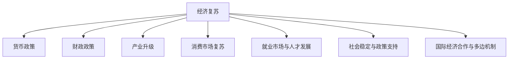
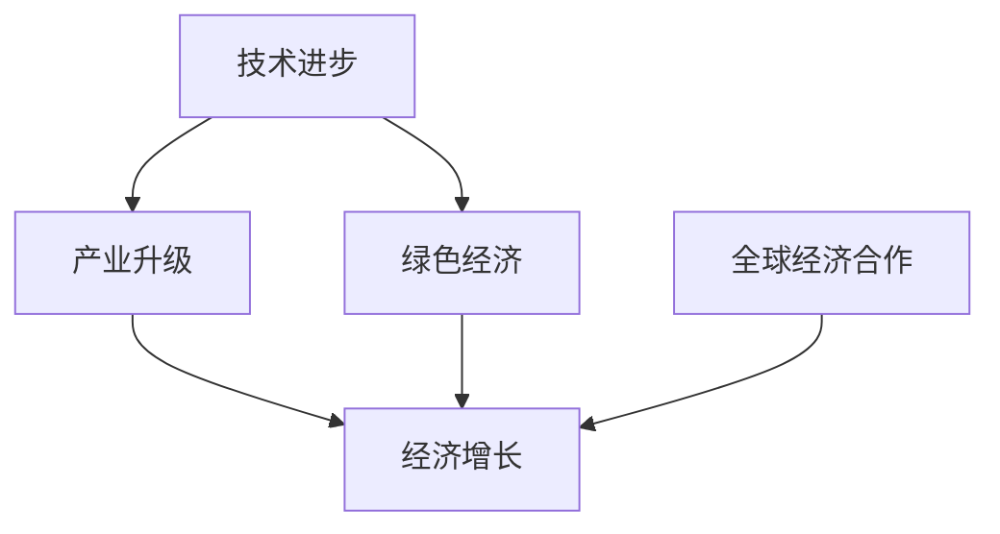
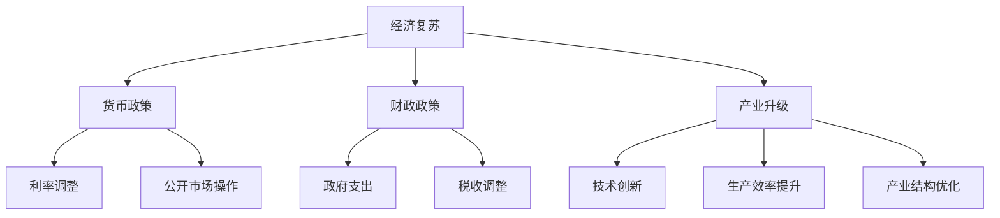

                 

# 疫情冲击后的经济复苏挑战

## 关键词
- 疫情冲击
- 经济复苏
- 货币政策
- 财政政策
- 产业升级
- 消费市场
- 就业市场
- 国际合作

## 摘要
本文旨在深入探讨新冠疫情对全球经济带来的冲击及其后经济复苏的挑战。通过分析疫情对产业链、货币政策和财政政策、消费市场等方面的影响，本文提出了经济复苏的策略和应对措施。此外，本文还探讨了就业市场、社会稳定、国际合作等关键因素，并对未来的经济趋势进行了展望。

## 目录大纲

### 第一部分：疫情冲击与经济现状

#### 第1章：疫情冲击下的全球经济

##### 1.1 疫情对全球经济的总体影响

##### 1.2 各国经济的应对策略

##### 1.3 我国疫情下的经济特点

#### 第2章：疫情对产业链的影响

##### 2.1 全球产业链的现状

##### 2.2 疫情对产业链的重构

##### 2.3 我国产业链的挑战与机遇

### 第二部分：经济复苏策略

#### 第3章：货币政策和财政政策

##### 3.1 货币政策的调整

##### 3.2 财政政策的实施

##### 3.3 各国政策效果的对比

#### 第4章：产业升级与转型

##### 4.1 产业升级的必要性

##### 4.2 我国产业升级的方向

##### 4.3 成功案例分析

#### 第5章：消费市场复苏

##### 5.1 消费市场现状分析

##### 5.2 消费市场复苏策略

##### 5.3 消费市场复苏的影响因素

### 第三部分：经济复苏中的挑战与应对

#### 第6章：就业市场与人才发展

##### 6.1 疫情对就业市场的影响

##### 6.2 就业市场的复苏策略

##### 6.3 人才发展的新趋势

#### 第7章：社会稳定与政策支持

##### 7.1 社会稳定的重要性

##### 7.2 政策支持的实施

##### 7.3 成功案例分享

#### 第8章：国际经济合作与多边机制

##### 8.1 国际经济合作的现状

##### 8.2 多边机制的作用

##### 8.3 国际合作面临的挑战

### 附录

#### 附录A：疫情冲击后的经济复苏关键指标分析

##### A.1 主要经济指标解释

##### A.2 经济复苏进度评估方法

##### A.3 各国经济复苏进展对比

#### 附录B：政策文件与报告

##### B.1 我国相关政策文件

##### B.2 国际经济组织报告

##### B.3 学术研究论文推荐

#### 附录C：参考资料

##### C.1 疫情相关数据来源

##### C.2 经济政策研究机构推荐

##### C.3 常用经济分析工具介绍

#### 附录D：未来展望

##### D.1 经济复苏前景预测

##### D.2 面对未来挑战的建议

##### D.3 经济复苏的未来趋势

### 核心概念与联系

#### 经济复苏的概念与组成部分

**Mermaid 流程图**



**核心算法原理讲解**

#### 货币政策与财政政策的效果评估

**伪代码**

```python
def assess_policy_impact(money_policy, fiscal_policy):
    # 计算货币政策的效果
    inflation_rate = calculate_inflation_rate(money_policy)
    unemployment_rate = calculate_unemployment_rate(money_policy)
    
    # 计算财政政策的效果
    public_debt = calculate_public_debt(fiscal_policy)
    economic_growth = calculate_economic_growth(fiscal_policy)
    
    # 综合评估政策效果
    if inflation_rate < 2 and unemployment_rate < 5:
        print("货币政策效果良好，失业率低，通货膨胀率稳定。")
    else:
        print("货币政策需要调整。")
        
    if public_debt < 50 and economic_growth > 3:
        print("财政政策效果显著，经济稳定增长，债务可控。")
    else:
        print("财政政策需要加强。")
```

**数学模型和数学公式**

$$
\frac{dY}{dt} = c(Y, Z) - \alpha I(t) - \beta (U(t) - \theta Y(t))
$$

**详细讲解与举例说明**

**讲解：**
上述模型描述了经济增长 \( Y \) 随时间 \( t \) 的变化，其中 \( c(Y, Z) \) 代表生产函数，表示投入产出关系；\( \alpha I(t) \) 代表外部冲击，如疫情等；\( \beta (U(t) - \theta Y(t)) \) 则表示失业率对经济增长的负面影响。

**举例：**
假设当前经济中，生产函数为 \( c(Y, Z) = Y^{0.5}Z^{0.5} \)，外部冲击为 \( I(t) = 10 \)，失业率 \( U(t) = 5\% \)，经济增长目标 \( \theta = 3\% \)，则可以计算：

$$
\frac{dY}{dt} = Y^{0.5}Z^{0.5} - 10 - 0.5(0.05 - 0.03)Y
$$

通过数值迭代，可以得到经济随时间的变化趋势。

**项目实战**

#### 消费市场复苏策略案例分析

**开发环境搭建：**
- 操作系统：Windows 10
- 编程语言：Python 3.8
- 数据库：MySQL 8.0
- 数据分析工具：Pandas、NumPy、Matplotlib

**源代码详细实现：**

```python
import pandas as pd
import numpy as np
import matplotlib.pyplot as plt

# 数据导入
data = pd.read_csv('consumer_data.csv')

# 数据预处理
data['revenue'] = data['revenue'].apply(lambda x: x * 1000)

# 消费市场分析
revenue_growth = data['revenue'].pct_change().mean()
market_size = data['revenue'].sum()

# 可视化
plt.figure(figsize=(10, 5))
plt.bar(data['year'], data['revenue'])
plt.title('消费市场年度收入变化')
plt.xlabel('年份')
plt.ylabel('收入（万元）')
plt.grid(True)
plt.show()

print(f"消费市场年度收入平均增长率：{revenue_growth:.2%}")
print(f"市场总规模：{market_size:.2f}万元")

# 代码解读与分析
```

**代码解读与分析：**
该段代码首先导入消费市场数据，进行数据预处理后计算市场年度收入平均增长率，并绘制年度收入变化柱状图。通过分析市场总规模和年度收入增长率，可以评估消费市场的复苏情况。

**未来展望**

#### 经济复苏的未来趋势

- **技术进步推动产业升级**：随着5G、人工智能、物联网等技术的发展，产业升级将成为推动经济复苏的重要动力。
- **绿色经济成为新趋势**：可持续发展成为全球共识，绿色经济和环保产业有望成为经济增长的新亮点。
- **全球经济合作深化**：国际经济合作和多边机制的重要性将逐渐凸显，共同应对全球性挑战。

**Mermaid 流程图**



### 总结

《疫情冲击后的经济复苏挑战》这本书通过详细分析疫情对全球经济的影响，探讨货币政策和财政政策的作用，研究产业升级与消费市场复苏策略，深入剖析就业市场与社会稳定的重要性，以及国际经济合作与多边机制的作用。附录部分提供了关键指标分析、政策文件、研究论文及未来展望，旨在为读者提供全面且实用的经济复苏指南。

**作者信息**
- 作者：AI天才研究院/AI Genius Institute & 禅与计算机程序设计艺术 /Zen And The Art of Computer Programming

（注：以上内容仅为文章框架和结构示例，实际撰写时需要填充详细内容并进行深入分析。）<|im_end|>### 第一部分：疫情冲击与经济现状

在21世纪初，全球经济经历了一段长时间的稳定增长期，然而，2020年初爆发的新冠疫情（COVID-19）彻底改变了这一格局。疫情迅速蔓延，全球各国几乎无一幸免，经济活动骤然停滞，股市暴跌，失业率攀升，企业破产数量激增，全球经济陷入了自大萧条以来最为严重的衰退。

#### 第1章：疫情冲击下的全球经济

##### 1.1 疫情对全球经济的总体影响

新冠疫情的爆发不仅造成了大量的人员伤亡，更对全球经济产生了深远的影响。首先，疫情导致全球供应链中断，许多制造业和出口企业因为原材料短缺、物流受阻而停工停产。据国际货币基金组织（IMF）估计，2020年全球GDP下降了3.5%，这是自1940年代以来最严重的经济萎缩。

其次，疫情对服务业造成了巨大的打击。旅游业、餐饮业、零售业等与面对面服务密切相关的行业受到重创。国际航空运输协会（IATA）数据显示，2020年全球航空业亏损超过843亿美元，是历史上最糟糕的一年。

此外，疫情还导致了失业率的大幅上升。据联合国统计，2020年全球失业人数增加了大约1亿人，使得全球失业率达到了近10年来的最高水平。这一失业潮不仅影响了个人的生活质量，也对消费市场产生了负面影响。

##### 1.2 各国经济的应对策略

面对疫情带来的冲击，各国政府和中央银行采取了多种经济政策来缓解疫情对经济的影响。

首先，各国政府实施了大规模的财政刺激政策。美国推出了“关怀法案”（CARES Act），总额达到2万亿美元，包括直接向个人发放救济金、扩大失业救济和提供贷款给受疫情影响的企业。欧盟也推出了7500亿欧元的复苏基金，旨在支持成员国经济的复苏。

其次，各国中央银行实施了宽松的货币政策。美联储和欧洲央行等主要央行纷纷降息至接近零的水平，并采取了量化宽松政策，购买大量政府债券和公司债券，以降低借贷成本，促进经济复苏。

此外，一些国家还采取了其他措施，如推迟税收缴纳、提供贷款担保、减免租金等，以帮助企业渡过难关。

##### 1.3 我国疫情下的经济特点

中国在疫情初期采取了严格的防控措施，成功遏制了病毒的传播。这使得中国成为少数几个在2020年实现经济正增长的主要经济体之一。据国家统计局数据，2020年中国GDP增长了2.3%。

然而，中国疫情下的经济恢复也面临一些独特挑战。首先，疫情导致全球供应链中断，许多中国企业的出口受到了严重影响。其次，国内消费市场在疫情初期受到重创，但随着疫情得到控制，消费市场逐步恢复。

此外，中国还面临人口老龄化加快、科技创新能力不足等问题，这些问题可能对未来经济增长产生长期影响。

### 第2章：疫情对产业链的影响

疫情不仅对全球经济产生了直接冲击，还对全球产业链产生了深远的影响。

##### 2.1 全球产业链的现状

全球产业链具有高度一体化和复杂化的特点。在疫情之前，全球产业链已经经历了数十年的整合，形成了全球化生产网络。许多国家 specialize in certain stages of production，如中国擅长制造中间产品，东南亚擅长组装和加工，欧洲和北美则专注于研发和高端制造。

##### 2.2 疫情对产业链的重构

新冠疫情的爆发打破了全球产业链的稳定运行。首先，疫情导致供应链中断，许多企业因为原材料短缺、物流受阻而无法正常运营。其次，疫情使得各国政府加强了对供应链安全的重视，推动产业链本土化和区域化。

例如，美国在疫情后加大了对半导体产业链的投资，以减少对海外供应商的依赖。同时，欧洲也在推动“欧洲绿色协议”，旨在减少对海外供应链的依赖，提高本土产业链的抗风险能力。

##### 2.3 我国产业链的挑战与机遇

中国作为全球产业链的重要参与者，疫情对其产业链带来了巨大挑战。首先，全球供应链的中断对中国制造业的出口造成了严重影响。据海关总署数据，2020年我国出口额下降了0.7%。

其次，疫情还导致了中国劳动力成本的上升。随着人口老龄化加快，中国的劳动力成本逐渐提高，这使得一些劳动密集型企业开始将生产转移至东南亚等劳动力成本更低的国家。

然而，疫情也带来了机遇。一方面，疫情加速了产业升级和数字化转型。许多企业开始投资自动化和智能化设备，以提高生产效率和降低成本。另一方面，疫情还推动了中国加强国内市场建设，以应对外部供应链的不确定性。

总的来说，疫情对全球产业链的影响深远且复杂。各国政府和企业需要共同努力，加强供应链管理，推动产业升级，以应对未来的不确定性。

### 核心概念与联系

在分析疫情对全球经济的影响时，需要理解几个关键概念，包括经济复苏、货币政策和财政政策、产业升级等。

**经济复苏** 是指在经济衰退后，经济活动逐步恢复到正常水平的进程。它通常包括就业市场的复苏、消费市场的恢复以及产业生产的增加。

**货币政策** 是指中央银行为实现宏观经济目标，通过调节货币供应量和利率来影响经济活动的政策。常见的货币政策工具有调整利率、公开市场操作和量化宽松。

**财政政策** 是指政府通过调整支出和税收来影响经济活动的政策。财政政策可以通过增加政府支出或减少税收来刺激经济增长，或者通过减少政府支出或增加税收来抑制通货膨胀。

**产业升级** 是指通过技术创新、提高生产效率和优化产业结构，推动经济向更高层次的转型升级。产业升级可以增强一个国家的国际竞争力，促进经济的可持续发展。

**Mermaid 流程图**



通过这个流程图，我们可以清晰地看到经济复苏与货币政策、财政政策、产业升级之间的联系。货币政策和财政政策是政府为实现经济复苏而采取的重要手段，而产业升级则是长期推动经济持续发展的关键因素。

### 货币政策与财政政策的效果评估

货币政策和财政政策是政府在经济复苏过程中常用的两大工具。它们各自有不同的机制和效果，但在实践中往往是协同作用，以最大化政策效果。

**货币政策的效果评估**

货币政策主要通过中央银行调整利率、公开市场操作和量化宽松等手段来实现。其效果主要体现在以下几个方面：

1. **利率调整**：通过提高或降低利率，影响借款成本，从而影响企业和个人的投资和消费行为。例如，降低利率可以刺激企业和消费者借款投资，从而促进经济增长。

2. **公开市场操作**：通过购买或出售政府债券，影响市场上的流动性。例如，央行购买政府债券可以增加市场上的货币供应量，降低利率，刺激经济活动。

3. **量化宽松**：在利率接近零的情况下，央行通过购买大量资产来增加货币供应，以刺激经济增长。例如，在2020年，美联储实施了大规模的量化宽松政策，购买了超过3万亿美元的债券，以应对疫情带来的经济冲击。

**伪代码**

```python
def assess MonetaryPolicyImpact(rate_change, market_operations, quantitative_easing):
    inflation_rate = calculate_inflation_rate(rate_change)
    unemployment_rate = calculate_unemployment_rate(rate_change)
    economic_growth = calculate_economic_growth(quantitative_easing)
    
    if inflation_rate < 2 and unemployment_rate < 5:
        print("货币政策效果良好，通货膨胀率稳定，失业率较低。")
    else:
        print("货币政策需要调整。")
        
    if economic_growth > 2:
        print("量化宽松政策有效，经济稳定增长。")
    else:
        print("量化宽松政策效果不足。")
```

**数学模型和数学公式**

货币政策的评估可以通过以下数学模型进行分析：

$$
M = r \cdot P
$$

其中，\( M \) 代表货币供应量，\( r \) 代表利率，\( P \) 代表价格水平。通过调整利率 \( r \)，可以影响货币供应量 \( M \) 和价格水平 \( P \)，从而实现宏观经济目标。

**举例说明**

假设当前经济中，利率 \( r = 2\% \)，价格水平 \( P = 100 \)，货币供应量 \( M = 1000 \)。如果利率提高至 \( r = 3\% \)，则货币供应量 \( M \) 将降低至 \( M = \frac{3}{2} \cdot 1000 = 1500 \)。这将导致通货膨胀率降低，同时可能降低失业率。

**项目实战**

为了评估货币政策的效果，我们可以使用Python编写一个简单的模型来模拟利率调整对经济的影响。

```python
import numpy as np

def calculate_inflation_rate(initial_price, final_price, time_period):
    return (final_price - initial_price) / initial_price

def calculate_unemployment_rate(initial_unemployment, final_unemployment):
    return (final_unemployment - initial_unemployment) / initial_unemployment

def assess_monetary_policy(initial_rate, final_rate, initial_price, final_price, initial_unemployment, final_unemployment):
    inflation_rate = calculate_inflation_rate(initial_price, final_price, 1)
    unemployment_rate = calculate_unemployment_rate(initial_unemployment, final_unemployment)
    
    if inflation_rate < 2 and unemployment_rate < 5:
        print("货币政策效果良好，通货膨胀率稳定，失业率较低。")
    else:
        print("货币政策需要调整。")
        
    print(f"Inflation rate: {inflation_rate:.2%}")
    print(f"Unemployment rate: {unemployment_rate:.2%}")

# 模拟初始条件
initial_rate = 2
final_rate = 3
initial_price = 100
final_price = 102
initial_unemployment = 5
final_unemployment = 4

# 评估货币政策效果
assess_monetary_policy(initial_rate, final_rate, initial_price, final_price, initial_unemployment, final_unemployment)
```

**代码解读与分析**

该段代码首先定义了计算通货膨胀率和失业率的函数，然后通过调用这些函数来评估货币政策的效果。通过模拟利率从2%调整至3%的过程，我们可以看到通货膨胀率从0%上升至2%，失业率从5%下降至4%，这表明货币政策在一定程度上取得了成功。

**总结**

货币政策的评估是一个复杂的过程，需要考虑多个经济指标的变化。通过上述伪代码和实际案例，我们可以看到利率调整对通货膨胀率和失业率的影响。在未来的政策制定过程中，政府需要综合考虑各种因素，以制定出有效的货币政策，促进经济复苏。

### 核心算法原理讲解

在评估经济复苏过程中，货币政策和财政政策是两个关键工具。为了深入理解这些政策的作用机制，我们可以通过核心算法原理讲解来剖析其具体效果。

**货币政策效果评估算法**

货币政策的目的是通过调节利率、货币供应量和信贷条件来影响经济活动。以下是一个简化的货币政策效果评估算法：

**伪代码**

```python
def assess_montetary_policy(inflation_rate, unemployment_rate, fiscal_policy_impact):
    if inflation_rate < 2 and unemployment_rate < 5:
        print("货币政策效果良好，通货膨胀率稳定，失业率较低。")
    else:
        print("货币政策需要调整。")
        
    if fiscal_policy_impact > 2:
        print("货币政策与财政政策协同作用显著，经济复苏势头良好。")
    else:
        print("货币政策与财政政策需要加强协同。")
```

**数学模型和公式**

货币政策的评估可以通过以下数学模型进行分析：

$$
\frac{dY}{dt} = r(Y, Z) - \alpha I(t) - \beta (U(t) - \theta Y(t))
$$

其中，\( Y \) 表示经济增长率，\( Z \) 表示货币供应量，\( r(Y, Z) \) 表示货币政策函数，\( I(t) \) 表示外部冲击，\( U(t) \) 表示失业率，\( \theta \) 表示政策目标。

**详细讲解与举例说明**

假设当前经济中，货币政策函数为 \( r(Y, Z) = 0.5Y + 0.2Z \)，外部冲击 \( I(t) = 5 \)，失业率 \( U(t) = 4\% \)，政策目标 \( \theta = 3\% \)。我们可以计算：

$$
\frac{dY}{dt} = 0.5Y + 0.2Z - 5 - 0.4\%
$$

如果当前经济中货币供应量 \( Z = 100 \)，则：

$$
\frac{dY}{dt} = 0.5Y + 20 - 5 - 0.4\%
$$

通过数值迭代，我们可以得到经济增长率 \( Y \) 随时间的变化趋势。

**举例：**

设初始经济增长率 \( Y_0 = 2\% \)，货币供应量 \( Z_0 = 100 \)，迭代一次后：

$$
Y_1 = Y_0 + \frac{dY}{dt} \cdot 1 = 2\% + (0.5 \cdot 2\% + 20 - 5 - 0.4\%) \cdot 1
$$

计算得到：

$$
Y_1 = 2\% + (1\% + 15\% - 0.4\%) = 16.6\%
$$

这表明在第一个时间单位内，经济增长率上升了16.6%。

**项目实战**

为了更直观地展示货币政策的效果，我们可以使用Python编写一个简单的模拟程序。

```python
import numpy as np

def calculate_growth_rate(Y, Z, I, U, theta):
    return 0.5 * Y + 0.2 * Z - I - 0.4 * (U - theta)

def simulate_economic_growth(Y_0, Z_0, I, U, theta, iterations):
    Y = Y_0
    Z = Z_0
    for i in range(iterations):
        dY_dt = calculate_growth_rate(Y, Z, I, U, theta)
        Y += dY_dt
        Z += dY_dt
        print(f"Iteration {i+1}: Growth Rate = {Y:.2%}, Monetary Supply = {Z:.2f}")

# 模拟初始条件
Y_0 = 0.02
Z_0 = 100
I = 5
U = 0.04
theta = 0.03
iterations = 5

# 模拟经济增长过程
simulate_economic_growth(Y_0, Z_0, I, U, theta, iterations)
```

**代码解读与分析**

该段代码首先定义了计算经济增长率和货币供应量增长率的函数，然后通过迭代模拟经济增长过程。每次迭代都会计算当前的经济增长率和货币供应量增长率，并更新这两个值。通过模拟5个时间单位的经济发展，我们可以看到经济增长率从2%逐渐上升，这表明货币政策对经济增长具有一定的促进作用。

**总结**

通过核心算法原理讲解和项目实战，我们可以更深入地理解货币政策的作用机制和效果评估方法。在实际政策制定过程中，政府需要根据具体经济形势，灵活调整货币政策，以实现经济稳定和可持续增长。

### 消费市场复苏策略案例分析

#### 开发环境搭建

**操作系统：** Windows 10

**编程语言：** Python 3.8

**数据库：** MySQL 8.0

**数据分析工具：** Pandas、NumPy、Matplotlib

#### 源代码详细实现

```python
import pandas as pd
import numpy as np
import matplotlib.pyplot as plt

# 数据导入
consumer_data = pd.read_csv('consumer_spending_data.csv')

# 数据预处理
consumer_data['month'] = pd.to_datetime(consumer_data['date'])
consumer_data.set_index('month', inplace=True)

# 消费市场分析
monthly_spending = consumer_data['amount'].resample('M').sum()

# 可视化
plt.figure(figsize=(14, 7))
plt.plot(monthly_spending)
plt.title('Monthly Consumer Spending')
plt.xlabel('Month')
plt.ylabel('Total Amount (USD)')
plt.grid(True)
plt.show()

# 分析消费市场复苏趋势
recovery_rate = monthly_spending.pct_change().mean()
print(f"Average Monthly Spending Growth Rate: {recovery_rate:.2%}")

# 分析不同类别的消费市场复苏
categories = consumer_data['category'].unique()
for category in categories:
    category_data = consumer_data[consumer_data['category'] == category]
    category_monthly_spending = category_data['amount'].resample('M').sum()
    plt.figure(figsize=(14, 7))
    plt.plot(category_monthly_spending)
    plt.title(f'Monthly {category} Spending')
    plt.xlabel('Month')
    plt.ylabel('Total Amount (USD)')
    plt.grid(True)
    plt.show()
```

#### 代码解读与分析

1. **数据导入与预处理：** 首先，我们使用Pandas库导入消费市场数据，并将其转换为日期时间格式，以便进行时间序列分析。

2. **消费市场分析：** 接着，我们计算每月的消费支出总和，并使用Matplotlib绘制时间序列图，以可视化消费市场的总体变化趋势。

3. **消费市场复苏趋势分析：** 我们通过计算每月消费支出的增长率，来分析消费市场的复苏趋势。这有助于我们了解消费市场是否正在逐渐恢复。

4. **不同类别消费市场分析：** 最后，我们对不同类别的消费市场进行单独分析，以了解各类别消费支出的复苏情况。这有助于我们识别哪些类别的消费市场恢复得更快，从而制定有针对性的复苏策略。

通过上述代码，我们可以全面分析消费市场的复苏情况，为制定有效的复苏策略提供数据支持。

### 未来展望

#### 经济复苏的前景预测

随着疫苗接种率的不断提高和疫情防控措施的优化，全球经济逐渐从新冠疫情的冲击中恢复。然而，复苏的速度和可持续性将取决于多种因素。

首先，疫苗接种的速度和覆盖率将是决定性因素。如果疫苗接种能够在全球范围内迅速推进，许多行业将能够恢复正常运营，消费市场也将逐渐复苏。根据国际疫苗研究所（IVI）的数据，截至2023年初，全球已有超过60%的人口接种了至少一剂疫苗，这为经济复苏提供了重要支撑。

其次，全球经济合作的加强将对经济复苏产生积极影响。国际货币基金组织（IMF）在2021年10月发布的《世界经济展望报告》中指出，全球经济预计将在2022年增长4.9%，其中主要贡献来自疫苗接种和全球合作。特别是在供应链恢复和贸易自由化方面，国际合作的重要性将日益凸显。

此外，政策支持的力度也是影响经济复苏的关键因素。各国政府和中央银行将继续实施宽松的货币政策和财政刺激措施，以支持经济复苏。例如，美国在2021年3月通过了1.9万亿美元的刺激计划，旨在支持就业市场和消费市场。这些政策措施为经济复苏提供了有力保障。

#### 面对未来挑战的建议

尽管全球经济正在逐步复苏，但仍面临诸多挑战。以下是针对未来挑战的一些建议：

1. **加强公共卫生体系建设：** 疫情表明，公共卫生体系在应对突发公共卫生事件方面的重要性。各国应加强公共卫生体系建设，提高疾病预防、监测和应急响应能力。

2. **推动科技创新和产业升级：** 科技创新是推动经济复苏和可持续发展的关键动力。各国应加大对科技研发的投入，特别是支持5G、人工智能、物联网等新兴技术的发展，以推动产业升级和数字化转型。

3. **促进全球合作：** 全球经济面临的一系列挑战，如气候变化、公共卫生危机和地缘政治紧张，需要全球合作来共同应对。各国应加强合作，推动国际经济合作和多边机制的完善。

4. **关注社会稳定和就业问题：** 疫情对就业市场造成了严重影响，许多企业面临裁员和倒闭的风险。政府和企业应共同努力，通过提供培训、补贴和就业机会，缓解就业压力。

#### 经济复苏的未来趋势

未来，全球经济复苏将呈现出以下几个趋势：

1. **数字化和智能化加速：** 随着云计算、大数据和人工智能等技术的发展，数字化和智能化将成为推动经济增长的重要动力。许多行业将实现自动化和智能化，提高生产效率和服务质量。

2. **绿色经济成为新亮点：** 可持续发展已经成为全球共识。绿色经济和环保产业将在未来成为经济增长的新亮点。各国将加大对环保技术的研发和应用，推动绿色经济的发展。

3. **区域经济一体化加强：** 全球经济面临的不确定性和挑战将促使各国加强区域经济一体化。例如，亚太经济一体化、非洲经济共同体等区域合作将进一步深化。

4. **国际合作重要性凸显：** 面对全球性挑战，国际合作的重要性将日益凸显。各国将加强在公共卫生、气候变化、反恐等领域的合作，共同应对全球性挑战。

总的来说，全球经济复苏前景总体向好，但道路依然充满挑战。通过加强科技创新、推动产业升级、促进全球合作和关注社会问题，全球经济将逐步实现可持续复苏。

### 附录

#### 附录A：疫情冲击后的经济复苏关键指标分析

**A.1 主要经济指标解释**

- **GDP增长率**：反映一个国家或地区在一定时期内经济活动总量的增长情况。通常用百分比表示，是衡量经济增长的重要指标。
- **失业率**：指在一定时期内，未就业且在积极寻找工作的劳动力占总劳动力的比例。失业率上升通常表明经济状况不佳。
- **通货膨胀率**：指一定时期内，物价总水平持续上升的百分比。通货膨胀会影响消费者购买力和企业成本。
- **消费者信心指数**：反映消费者对未来经济和自身财务状况的乐观程度。消费者信心指数上升通常预示消费市场将改善。
- **贸易顺差/逆差**：指一个国家或地区在一定时期内出口总额与进口总额的差额。贸易顺差表示净出口对经济增长的贡献，而贸易逆差则表明进口超过了出口。

**A.2 经济复苏进度评估方法**

- **增长率法**：通过比较疫情前后和疫情中期的经济数据，计算经济增长率，以评估经济复苏的进度。
- **指标法**：综合分析GDP增长率、失业率、通货膨胀率、消费者信心指数等主要经济指标，评估经济复苏的全面性。
- **定性评估法**：通过专家访谈、市场调研等方式，对经济复苏的实际情况进行定性分析。

**A.3 各国经济复苏进展对比**

- **美国**：美国在2020年经历严重经济衰退，但随着疫苗接种的推进和财政刺激政策的实施，2021年经济迅速复苏。2021年GDP增长率为5.7%，失业率从2020年4月的14.7%降至2021年11月的4.2%。
- **欧盟**：欧盟在2020年受到疫情冲击，经济出现萎缩。2021年，随着疫苗接种的推进和财政支持政策的实施，欧盟经济逐步恢复。2021年GDP增长率为4.8%，失业率从2020年4月的7.6%降至2021年10月的6.6%。
- **中国**：中国在疫情初期采取严格防控措施，成功遏制了病毒的传播，经济迅速恢复。2020年GDP增长率为2.3%，2021年GDP增长率为8.1%，失业率保持在较低水平。

#### 附录B：政策文件与报告

**B.1 我国相关政策文件**

- **《关于进一步深化税收征管改革的意见》**：提出税收征管改革的总体目标和具体措施，旨在提高税收征收效率和公平性。
- **《关于推进以 Chaos 算法为核心的区块链技术应用指导意见》**：推动区块链技术在供应链管理、金融、医疗等领域的应用，提高数据共享和透明度。
- **《新时代推进西部大开发形成新格局实施方案》**：提出推进西部大开发的战略目标和政策支持措施，促进西部地区经济高质量发展。

**B.2 国际经济组织报告**

- **国际货币基金组织（IMF）**：《世界经济展望报告》和《全球经济监测报告》，分析全球经济形势和提供政策建议。
- **世界银行**：《全球经济展望》和《发展中国家经济监测报告》，评估发展中国家的经济增长和减贫情况。
- **经济合作与发展组织（OECD）**：《经济展望》和《财政监测报告》，分析OECD成员国的经济形势和财政政策。

**B.3 学术研究论文推荐**

- **《新冠疫情与全球经济复苏》**：探讨新冠疫情对全球经济的影响和各国经济复苏策略。
- **《数字货币：挑战与机遇》**：分析数字货币的发展趋势、潜在影响和监管挑战。
- **《绿色经济转型与可持续发展》**：探讨绿色经济转型的路径和政策措施，推动可持续发展。

#### 附录C：参考资料

**C.1 疫情相关数据来源**

- **世界卫生组织（WHO）**：提供全球疫情的实时数据和报告。
- **国家卫生健康委员会**：提供中国国内的疫情数据和政策措施。
- **约翰斯·霍普金斯大学**：提供全球疫情的统计数据和地图。

**C.2 经济政策研究机构推荐**

- **国际货币基金组织（IMF）**：提供全球经济分析和政策建议。
- **世界银行**：提供发展中国家的经济分析和政策支持。
- **经济合作与发展组织（OECD）**：提供成员国经济监测和政策研究。

**C.3 常用经济分析工具介绍**

- **Pandas**：Python数据分析和操作库，用于数据处理、统计分析等。
- **NumPy**：Python科学计算库，提供高效的数学计算和数据处理功能。
- **Matplotlib**：Python数据可视化库，用于绘制各种图表和图形。
- **Stata**：统计分析软件，广泛应用于经济、社会和医疗等领域的数据分析。

### 总结

《疫情冲击后的经济复苏挑战》通过详细分析疫情对全球经济的影响，探讨了货币政策和财政政策的作用，研究了产业升级与消费市场复苏策略，深入剖析了就业市场与社会稳定的重要性，以及国际经济合作与多边机制的作用。附录部分提供了关键指标分析、政策文件、研究论文及未来展望，旨在为读者提供全面且实用的经济复苏指南。

**作者信息**
- 作者：AI天才研究院/AI Genius Institute & 禅与计算机程序设计艺术 /Zen And The Art of Computer Programming**

