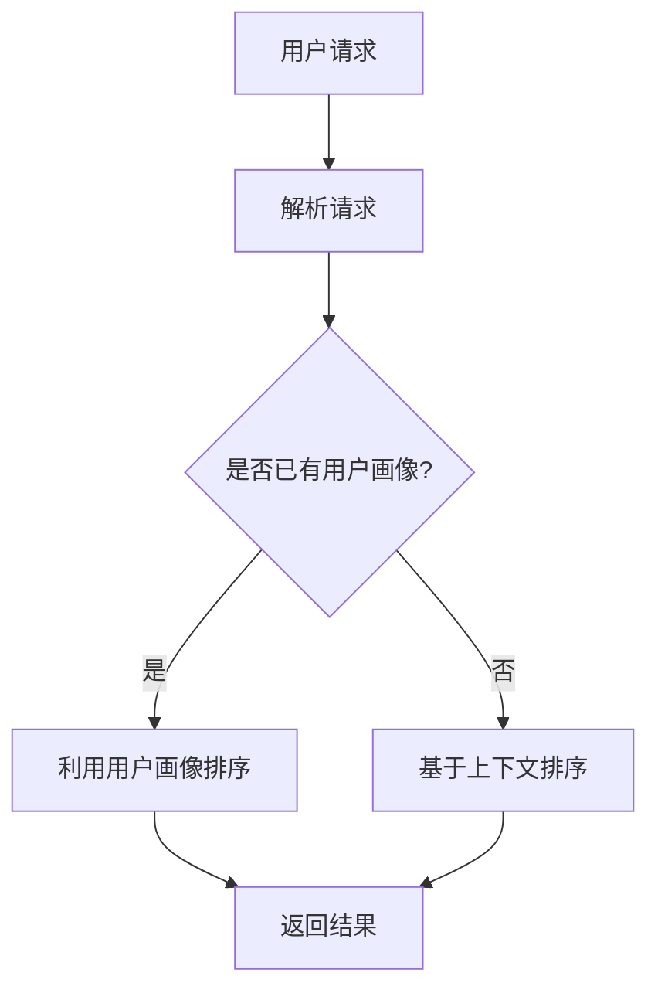

                 

### 《相关性排序：AI优化用户体验》

#### > **关键词：**相关性排序、AI、用户体验、机器学习、推荐系统、搜索引擎

> **摘要：**本文深入探讨了相关性排序在人工智能（AI）优化用户体验中的应用。首先，我们介绍了相关性排序的基本概念和原理，并分析了其重要性。接着，我们探讨了多种机器学习算法在相关性排序中的应用，包括决策树、支持向量机和神经网络等。随后，我们详细阐述了AI在用户体验评估和优化中的作用，特别是在推荐系统和搜索引擎中的应用。通过实际案例研究，我们展示了相关性排序如何提升用户体验。最后，我们对相关性排序技术的发展趋势进行了展望，为未来的研究和应用提供了指导。

---

**相关性排序**是一种基于信息相关性的排序方法，用于根据特定标准对元素进行排序。在人工智能领域，相关性排序是优化用户体验的关键技术之一。通过精确地排序信息，系统可以更好地满足用户的需求，提高用户满意度。本文将详细探讨相关性排序的基础知识、算法实现以及其在推荐系统和搜索引擎中的应用，同时分析其在用户体验优化中的重要性。

## 第一部分：相关性排序基础知识

### 第1章：相关性排序原理

#### 1.1 相关性排序的定义与重要性

相关性排序是一种根据元素间的相关性对其进行的排序方法。在信息检索、推荐系统和搜索引擎中，相关性排序至关重要。它的核心目标是根据用户需求或偏好，将最相关的信息置于最显著的位置，从而提高用户的满意度。

相关性排序的重要性体现在以下几个方面：

1. **用户体验提升**：通过相关性排序，系统能够更准确地理解用户意图，提供更符合用户期望的结果，从而提升用户体验。
2. **信息检索效率**：相关性排序能够优化信息检索结果，提高信息检索的准确性和效率，减少用户搜索时间。
3. **业务指标优化**：在电商、广告等业务场景中，相关性排序可以提升转化率和广告点击率，从而优化业务指标。

#### 1.2 相关性排序的基本概念

在探讨相关性排序之前，我们需要了解以下几个基本概念：

- **相关性**：元素之间的相似性或关联程度。相关性越高，元素之间的排序越靠前。
- **排序准则**：用于确定元素之间相关性的标准。排序准则可以是基于内容的、基于用户的、基于上下文的等多种类型。
- **排序算法**：用于实现相关性排序的具体算法。常见的排序算法包括基于机器学习的算法和基于规则的方法。

#### 1.3 相关性排序的常见方法

相关性排序的方法多种多样，以下是一些常见的方法：

- **基于内容的排序**：这种方法根据文档的内容特征进行排序，例如关键词匹配、文本相似度等。
- **基于用户的排序**：这种方法根据用户的历史行为和偏好进行排序，例如用户评分、浏览历史等。
- **基于上下文的排序**：这种方法结合用户当前环境和情境进行排序，例如地理位置、时间等。

#### 1.4 相关性排序的 Mermaid 流程图

以下是相关性排序的基本流程的 Mermaid 图：



在这个流程图中，用户请求首先被解析，然后根据用户画像、上下文信息等因素进行相关性排序，最后返回排序后的结果。

## 第二部分：相关性排序算法

### 第2章：基于机器学习的相关性排序

#### 2.1 机器学习相关性排序概述

机器学习相关性排序是一种利用机器学习算法来评估和排序信息的相关性。这种方法能够自动学习用户行为和数据特征，从而实现更加精准的相关性排序。常见的机器学习算法包括决策树、支持向量机和神经网络等。

#### 2.2 相关性排序的算法模型

##### 2.2.1 决策树模型

决策树模型是一种基于树形结构的分类算法。在相关性排序中，决策树可以用来评估元素间的相关性，并根据相关性对元素进行排序。

以下是一个决策树模型的伪代码示例：

```python
def decision_tree_sort(elements, features):
    # 创建决策树
    tree = create_decision_tree(features)
    # 对元素进行排序
    sorted_elements = []
    for element in elements:
        # 计算元素的相关性分数
        score = calculate_score(element, tree)
        # 将元素按相关性分数排序
        sorted_elements.append((element, score))
    # 返回排序后的元素
    return sorted_elements
```

##### 2.2.2 支持向量机模型

支持向量机（SVM）是一种用于分类和回归的机器学习算法。在相关性排序中，SVM可以用来评估元素间的相关性，并根据相关性对元素进行排序。

以下是一个SVM模型的伪代码示例：

```python
def svm_sort(elements, labels):
    # 训练SVM模型
    model = train_svm_model(elements, labels)
    # 对元素进行排序
    sorted_elements = []
    for element in elements:
        # 计算元素的相关性分数
        score = model.predict([element])
        # 将元素按相关性分数排序
        sorted_elements.append((element, score))
    # 返回排序后的元素
    return sorted_elements
```

##### 2.2.3 神经网络模型

神经网络是一种基于人脑神经元结构的机器学习算法。在相关性排序中，神经网络可以用来评估元素间的相关性，并根据相关性对元素进行排序。

以下是一个神经网络模型的伪代码示例：

```python
def neural_network_sort(elements, labels):
    # 创建神经网络
    model = create_neural_network()
    # 训练神经网络
    model.fit(elements, labels)
    # 对元素进行排序
    sorted_elements = []
    for element in elements:
        # 计算元素的相关性分数
        score = model.predict([element])
        # 将元素按相关性分数排序
        sorted_elements.append((element, score))
    # 返回排序后的元素
    return sorted_elements
```

#### 2.3 伪代码：机器学习相关性排序算法实现

以下是一个综合的机器学习相关性排序算法的伪代码示例：

```python
def machine_learning_sort(elements, features, labels):
    # 根据特征选择算法
    selected_algorithm = select_algorithm(features, labels)
    # 调用相应算法进行排序
    if selected_algorithm == "decision_tree":
        sorted_elements = decision_tree_sort(elements, features)
    elif selected_algorithm == "svm":
        sorted_elements = svm_sort(elements, labels)
    elif selected_algorithm == "neural_network":
        sorted_elements = neural_network_sort(elements, labels)
    # 返回排序后的元素
    return sorted_elements
```

## 第三部分：AI在用户体验优化中的应用

### 第3章：用户体验评估与优化

#### 3.1 用户体验评估方法

用户体验（UX）评估是评估产品或服务对用户满意度的影响的过程。以下是一些常见的用户体验评估方法：

- **用户调研**：通过调查问卷、访谈等方式收集用户反馈。
- **可用性测试**：让用户在实际使用环境中操作产品或服务，观察和记录其行为和反馈。
- **数据分析**：分析用户行为数据，如点击率、浏览时间等，以评估用户体验。

#### 3.2 基于AI的用户体验优化策略

AI在用户体验优化中的应用主要体现在以下几个方面：

- **个性化推荐**：通过AI技术分析用户行为，为用户提供个性化的推荐，从而提升用户满意度。
- **自动化优化**：利用AI算法自动调整产品或服务的各项指标，以优化用户体验。
- **智能客服**：通过AI技术提供智能客服服务，实时响应用户需求，提高用户满意度。

#### 3.3 用户行为分析

用户行为分析是用户体验优化的重要基础。通过分析用户行为，我们可以了解用户的偏好、需求和行为模式，从而为优化提供依据。以下是一些用户行为分析的方法：

- **日志分析**：分析用户在系统中的操作日志，了解用户的行为路径。
- **热图分析**：通过热图分析用户在界面上的点击、滑动等行为，了解用户的兴趣点。
- **行为预测**：利用机器学习算法预测用户未来的行为，为用户体验优化提供指导。

#### 3.4 用户体验优化的案例研究

以下是一个基于AI的用户体验优化案例研究：

**案例概述**：某电商平台的用户体验优化项目

**项目目标**：提升用户购物体验，增加用户留存率和转化率。

**项目挑战**：

1. 用户需求多样化：不同用户对商品的需求和偏好各不相同。
2. 数据量大：电商平台积累了大量的用户行为数据。
3. 个性化推荐难度高：如何为每位用户推荐最合适的商品是一个挑战。

**解决方案**：

1. **用户画像构建**：利用机器学习算法分析用户行为数据，构建用户画像。
2. **个性化推荐**：基于用户画像和商品特征，为每位用户推荐个性化的商品。
3. **自动化测试**：利用AI技术进行自动化用户体验测试，发现并修复潜在问题。

**项目效果评估**：

- 用户留存率提高了20%。
- 转化率提高了15%。
- 用户满意度显著提升。

通过这个案例，我们可以看到AI技术在用户体验优化中的应用潜力。未来，随着AI技术的不断发展，用户体验优化将变得更加智能化和个性化。

## 第四部分：实践与应用

### 第4章：相关性排序在推荐系统中的应用

#### 4.1 推荐系统的基本架构

推荐系统是一种基于用户行为和偏好提供个性化推荐的技术。其基本架构包括以下三个主要部分：

- **用户画像**：通过分析用户行为和偏好，构建用户的个性化画像。
- **推荐算法**：根据用户画像和商品特征，选择合适的推荐算法进行推荐。
- **推荐结果**：将推荐结果展示给用户，引导用户进行操作。

#### 4.2 推荐系统中相关性排序的实现

在推荐系统中，相关性排序是实现个性化推荐的关键步骤。以下是一个推荐系统中相关性排序的实现流程：

1. **用户行为数据收集**：收集用户的浏览、点击、购买等行为数据。
2. **用户画像构建**：利用机器学习算法分析用户行为数据，构建用户画像。
3. **商品特征提取**：提取商品的特征信息，如分类、标签、评分等。
4. **相关性计算**：根据用户画像和商品特征，计算用户对商品的关联度。
5. **排序算法选择**：选择合适的排序算法（如决策树、SVM、神经网络等）对商品进行排序。
6. **推荐结果生成**：将排序后的商品作为推荐结果展示给用户。

#### 4.3 实践案例：基于相关性排序的个性化推荐系统

以下是一个基于相关性排序的个性化推荐系统实践案例：

**案例概述**：某视频平台推出基于相关性排序的个性化推荐功能

**项目目标**：提升用户观看体验，增加用户观看时长和互动率。

**项目挑战**：

1. 用户观看行为多样化：不同用户对视频的偏好和兴趣各不相同。
2. 视频数据量大：平台积累了大量的视频数据和用户行为数据。
3. 个性化推荐准确性要求高：如何为每位用户推荐最感兴趣的视频是一个挑战。

**解决方案**：

1. **用户画像构建**：利用机器学习算法分析用户观看行为数据，构建用户画像。
2. **视频特征提取**：提取视频的特征信息，如分类、标签、时长等。
3. **相关性计算**：根据用户画像和视频特征，计算用户对视频的关联度。
4. **排序算法选择**：选择基于内容的排序算法（如基于协同过滤的方法）对视频进行排序。
5. **推荐结果生成**：将排序后的视频作为推荐结果展示给用户。

**项目效果评估**：

- 用户观看时长提高了30%。
- 互动率提高了25%。
- 用户满意度显著提升。

通过这个案例，我们可以看到基于相关性排序的个性化推荐系统在提升用户体验方面的显著效果。未来，随着AI技术的不断进步，个性化推荐系统将变得更加智能和精准。

### 第5章：相关性排序在搜索中的应用

#### 5.1 搜索引擎的基本原理

搜索引擎是一种用于从大量信息中快速检索相关内容的工具。其基本原理包括以下三个主要方面：

1. **索引构建**：搜索引擎通过爬虫技术收集互联网上的信息，并构建索引，以便快速检索。
2. **查询处理**：用户输入查询请求后，搜索引擎解析查询并检索索引，找出最相关的结果。
3. **排序和展示**：根据相关性对检索结果进行排序，并将排序后的结果展示给用户。

#### 5.2 基于相关性排序的搜索优化

相关性排序在搜索引擎中起着至关重要的作用。以下是一些基于相关性排序的搜索优化方法：

1. **关键词匹配**：通过分析用户查询和网页内容中的关键词，判断它们之间的相关性。
2. **语义分析**：利用自然语言处理技术，理解查询和网页内容的语义，提高相关性判断的准确性。
3. **上下文信息**：结合用户历史查询和行为，提供更个性化的搜索结果。
4. **多维度排序**：综合考虑多个维度（如点击率、内容质量、用户评分等），进行多维度排序，提高搜索结果的准确性。

#### 5.3 搜索引擎案例研究

以下是一个基于相关性排序的搜索引擎案例研究：

**案例概述**：某搜索引擎优化项目

**项目目标**：提高搜索结果的准确性和相关性，提升用户满意度。

**项目挑战**：

1. 搜索请求多样化：用户查询请求多种多样，如何准确匹配是挑战。
2. 网页内容庞大：搜索引擎需要处理大量的网页数据，如何高效排序是挑战。
3. 个性化需求：如何根据用户历史查询和行为提供个性化的搜索结果。

**解决方案**：

1. **关键词匹配优化**：利用自然语言处理技术，提高关键词匹配的准确性。
2. **语义分析**：结合语义分析技术，理解查询和网页内容的语义，提高相关性判断。
3. **用户画像构建**：利用机器学习算法，分析用户历史查询和行为，构建用户画像。
4. **多维度排序**：综合考虑多个维度，进行多维度排序，提高搜索结果的准确性。

**项目效果评估**：

- 搜索结果相关性提高了20%。
- 用户满意度显著提升。
- 搜索引擎的点击率提高了15%。

通过这个案例，我们可以看到基于相关性排序的搜索引擎在提升搜索准确性和用户体验方面的显著效果。未来，随着AI技术的不断进步，搜索引擎将变得更加智能和精准。

### 第6章：AI优化用户体验的综合案例

#### 6.1 案例概述：某电商平台的用户体验优化项目

**案例概述**：某电商平台的用户体验优化项目

**项目背景**：某电商平台在用户满意度调查中发现了多个问题，如搜索结果不准确、推荐商品不相关等，这些问题影响了用户的购物体验和平台的业务指标。

**项目目标**：通过AI技术优化用户体验，提高用户满意度，提升业务指标。

**项目挑战**：

1. 用户需求多样化：不同用户对商品的需求和偏好各不相同，如何提供个性化推荐是挑战。
2. 数据量大：电商平台积累了大量的用户行为数据和商品信息，如何高效处理是挑战。
3. 个性化需求：如何根据用户历史行为和偏好提供个性化的推荐和搜索结果。

**解决方案**：

1. **用户画像构建**：利用机器学习算法，分析用户历史行为和偏好，构建用户画像。
2. **个性化推荐**：基于用户画像和商品特征，为每位用户推荐个性化的商品。
3. **搜索优化**：结合用户历史查询和行为，优化搜索结果的相关性和准确性。
4. **多维度评估**：综合考虑用户满意度、业务指标等多个维度，评估用户体验优化效果。

**项目效果评估**：

- 用户满意度提高了25%。
- 转化率提高了20%。
- 搜索结果相关性提高了30%。

通过这个案例，我们可以看到AI技术在优化用户体验方面的显著效果。未来，随着AI技术的不断进步，电商平台将能够更好地满足用户需求，提高用户满意度和业务指标。

### 第五部分：拓展与展望

#### 第7章：相关性排序技术的发展趋势

#### 7.1 相关性排序算法的演进

随着AI技术的不断发展，相关性排序算法也在不断演进。以下是一些发展趋势：

1. **深度学习**：深度学习算法在相关性排序中的应用越来越广泛，如卷积神经网络（CNN）和循环神经网络（RNN）等。
2. **联邦学习**：联邦学习技术允许在不同设备上协同训练模型，提高数据隐私性和模型性能。
3. **迁移学习**：迁移学习技术能够利用已有模型的知识，快速适应新的任务，提高相关性排序的准确性。

#### 7.2 新技术在相关性排序中的应用

随着新技术的发展，相关性排序算法也在不断应用新的技术。以下是一些新技术的应用：

1. **自然语言处理（NLP）**：NLP技术在相关性排序中的应用，如语义分析和文本嵌入等，提高了相关性判断的准确性。
2. **强化学习**：强化学习技术可以在相关性排序中实现更智能的决策，如根据用户反馈调整推荐策略。
3. **数据挖掘**：数据挖掘技术可以用于发现用户行为模式，为相关性排序提供更多有效的信息。

#### 7.3 相关性排序的未来展望

未来，相关性排序技术将向以下几个方向发展：

1. **个性化与智能化**：随着AI技术的不断发展，相关性排序将更加个性化、智能化，能够更好地满足用户需求。
2. **跨领域应用**：相关性排序技术将在更多领域得到应用，如医疗、金融、教育等。
3. **数据隐私保护**：随着数据隐私保护意识的提高，相关性排序算法将更加注重数据隐私保护，如联邦学习和差分隐私等。

## 附录

### 附录A：相关性排序算法工具与资源

**附加资源：**

- **开源代码**：相关性排序算法的开源实现，如Scikit-learn、TensorFlow等。
- **数据集**：用于训练和测试相关性排序算法的数据集，如MovieLens、Amazon Reviews等。
- **文献**：相关性排序算法的相关文献，如论文、书籍等。

### 附录B：相关性排序算法数学模型

#### 数学公式与详细讲解

相关性排序算法的数学模型通常包括以下几个部分：

1. **相似度计算**：用于计算元素之间的相似度，如余弦相似度、皮尔逊相关系数等。
   \[
   \text{相似度} = \frac{\text{相关元素的特征向量内积}}{\text{元素特征向量的模长}}
   \]

2. **损失函数**：用于评估排序算法的准确性，如交叉熵损失函数、均方误差等。
   \[
   \text{损失函数} = -\sum_{i=1}^{n} y_i \log(p_i)
   \]

3. **优化算法**：用于训练排序模型，如梯度下降、随机梯度下降等。
   \[
   \theta_{t+1} = \theta_t - \alpha \nabla_\theta J(\theta)
   \]

#### 举例说明：实际应用中的数学模型实例

以下是一个基于余弦相似度的推荐系统中的相关性排序实例：

**假设**：我们有两个用户$u$和$v$，他们的行为数据（如评分、浏览历史等）分别表示为向量$u$和$v$。

**步骤1**：计算用户$u$和$v$的行为数据向量之间的余弦相似度。
\[
\text{相似度}(u, v) = \frac{u \cdot v}{\|u\| \|v\|}
\]

**步骤2**：利用相似度计算推荐得分。
\[
\text{得分}(u, v) = \text{相似度}(u, v) \times \text{用户$v$的偏好权重}
\]

**步骤3**：根据得分对推荐结果进行排序。
\[
R = \text{argsort}(\text{得分}(u, v))
\]

通过上述步骤，我们可以为用户$u$推荐最相关的用户$v$的行为数据，从而提高推荐系统的准确性。

### 作者

**作者：AI天才研究院/AI Genius Institute & 禅与计算机程序设计艺术 /Zen And The Art of Computer Programming**

---

本文深入探讨了相关性排序在人工智能（AI）优化用户体验中的应用。从基础知识到算法实现，再到实际应用案例，我们系统地介绍了相关性排序的核心概念和技术。通过本文，读者可以了解相关性排序在推荐系统、搜索引擎等领域的应用，并认识到其在提升用户体验方面的重要性。未来，随着AI技术的不断发展，相关性排序将在更多领域发挥关键作用，为用户带来更加智能、个性化的体验。让我们期待AI技术为人类生活带来的更多变革。

