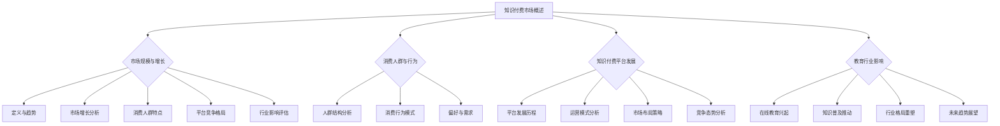

                 

# 《知识付费与个人品牌IP的协同增长》

## 关键词：
知识付费、个人品牌IP、协同增长、市场分析、案例分析、算法原理、模型构建、项目实战

## 摘要：
本文将从知识付费市场概况、个人品牌IP建设、知识付费与个人品牌IP的协同策略以及未来发展趋势等方面，全面探讨知识付费与个人品牌IP的协同增长。通过深入分析市场现状、核心算法原理、数学模型以及实际项目案例，本文旨在为读者提供有价值的见解和实用的策略，帮助知识付费从业者和个人品牌IP创建者实现互利共赢。

### 《知识付费与个人品牌IP的协同增长》目录大纲

#### 第一部分：知识付费市场概况

##### 第1章：知识付费市场概述
- **1.1 知识付费的定义与趋势**
- **1.2 知识付费市场的规模与增长**
- **1.3 知识付费的消费人群与行为**
- **1.4 知识付费平台的发展与竞争**
- **1.5 知识付费对教育行业的影响**

##### 第2章：知识付费产品与服务类型
- **2.1 在线课程**
- **2.2 电子书与知识库**
- **2.3 音频课程与播客**
- **2.4 实战手册与工具书**
- **2.5 知识付费产品的特点与优势**

##### 第3章：知识付费平台案例分析
- **3.1 Coursera：全球在线教育巨头**
- **3.2 Udemy：多样化的课程平台**
- **3.3 慕课网：国内领先的知识付费平台**
- **3.4 知乎Live：社区化知识付费模式**
- **3.5 知识付费平台的运营模式与创新**

#### 第二部分：个人品牌IP建设

##### 第4章：个人品牌IP概述
- **4.1 个人品牌IP的定义与价值**
- **4.2 个人品牌IP的构成要素**
- **4.3 个人品牌IP的重要性**
- **4.4 个人品牌IP的创建与定位**

##### 第5章：个人品牌IP建设策略
- **5.1 确立个人品牌IP的核心竞争力**
- **5.2 构建个人品牌IP的视觉识别系统**
- **5.3 利用社交媒体打造个人品牌**
- **5.4 通过内容创作提升个人品牌影响力**
- **5.5 个人品牌IP的商业化路径**

##### 第6章：知识付费与个人品牌IP的协同
- **6.1 知识付费与个人品牌IP的关联**
- **6.2 知识付费对个人品牌IP建设的促进作用**
- **6.3 个人品牌IP对知识付费产品的影响**
- **6.4 知识付费与个人品牌IP协同策略**

##### 第7章：案例分析与应用实践
- **7.1 成功案例分享**
  - **7.1.1 李笑来：从知识付费到个人品牌IP的跨越**
  - **7.1.2 薇安：打造个人品牌IP的电商之路**
  - **7.1.3 凯叔讲故事：内容付费与个人品牌IP的结合**
- **7.2 个人品牌IP与知识付费实战指南**
  - **7.2.1 个人品牌IP建设步骤与技巧**
  - **7.2.2 知识付费产品设计与运营策略**
  - **7.2.3 知识付费与个人品牌IP的协同案例解析**

#### 第三部分：未来趋势与挑战

##### 第8章：知识付费与个人品牌IP的未来发展
- **8.1 科技进步对知识付费市场的影响**
- **8.2 个人品牌IP的全球化趋势**
- **8.3 知识付费与个人品牌IP的发展机遇**
- **8.4 知识付费与个人品牌IP的可持续发展**

##### 第9章：面临的挑战与应对策略
- **9.1 知识付费市场的竞争加剧**
- **9.2 个人品牌IP建设的风险与挑战**
- **9.3 知识付费与个人品牌IP的平衡发展**
- **9.4 未来趋势与应对策略**

#### 附录

- **附录A：知识付费与个人品牌IP工具资源汇总**
  - **A.1 主流知识付费平台介绍**
  - **A.2 个人品牌IP建设工具推荐**
  - **A.3 知识付费与个人品牌IP相关书籍与文章推荐**

### Mermaid 流程图

### 第一部分：知识付费市场概况

#### 第1章：知识付费市场概述

##### 1.1 知识付费的定义与趋势

知识付费，顾名思义，是指用户为获取特定领域的专业知识、技能或信息，通过付费方式获取内容或服务的现象。随着互联网技术的飞速发展和数字化时代的到来，知识付费已成为一种重要的商业模式。从在线课程到电子书，从音频播客到专业咨询，知识付费的范畴不断扩大。

近年来，知识付费呈现出以下几个显著趋势：

1. **市场规模持续扩大**：根据相关报告，全球知识付费市场规模逐年增长，预计未来几年仍将保持高速增长。这主要得益于互联网普及率的提高和用户对自我提升需求的增加。

2. **内容类型多样化**：除了传统的在线课程和电子书，知识付费产品逐渐向音频课程、实战手册、专业工具书等多样化方向发展，满足了用户多样化的学习需求。

3. **用户群体扩大**：知识付费不再仅限于专业人士和职场人士，越来越多的普通用户也参与到知识付费的行列中，推动了市场的进一步扩大。

4. **平台竞争加剧**：随着知识付费市场的火热，各类平台纷纷涌入，竞争愈发激烈。平台之间的差异化竞争主要体现在内容质量、用户体验、用户粘性等方面。

##### 1.2 知识付费市场的规模与增长

知识付费市场的规模可以从多个维度进行衡量，包括用户规模、市场规模、交易额等。以下是对当前知识付费市场规模的简要概述：

1. **用户规模**：根据调查数据显示，全球知识付费用户已超过数亿人，且用户规模仍在持续增长。特别是在亚洲市场，知识付费用户增长尤为显著。

2. **市场规模**：据统计，全球知识付费市场规模已达到数百亿美元，且每年以两位数的速度增长。这一增长趋势在不同地区和不同领域都有所体现。

3. **交易额**：知识付费平台的交易额也在快速增长。以Coursera和Udemy等知名平台为例，它们的年交易额均已超过数亿美元。

##### 1.3 知识付费的消费人群与行为

知识付费的消费人群呈现出多样化和年轻化的趋势。以下是对知识付费消费人群的简要分析：

1. **人群结构**：知识付费用户主要包括职场人士、学生、自由职业者和其他对自我提升有需求的群体。其中，职场人士和学生是知识付费的主要消费人群。

2. **消费行为**：知识付费用户的消费行为表现出明显的季节性和周期性。例如，在每年的考试季和晋升季，知识付费的购买量通常会大幅增加。

3. **偏好与需求**：知识付费用户对内容的质量、实用性、更新速度和互动性等方面有较高的要求。他们更倾向于选择权威专家、专业机构的课程和内容。

##### 1.4 知识付费平台的发展与竞争

知识付费平台的发展历程可以分为几个阶段：

1. **初创阶段**：这一阶段的平台主要提供简单的在线课程和电子书，用户规模相对较小。

2. **成长阶段**：随着市场的扩大，知识付费平台开始引入更多元化的内容和服务，用户规模和交易额快速增长。

3. **成熟阶段**：知识付费市场逐渐成熟，平台之间的竞争加剧，差异化竞争成为主流。平台在内容质量、用户体验、用户粘性等方面进行深耕。

以下是对当前知识付费平台竞争态势的简要分析：

1. **平台竞争格局**：目前，全球知识付费市场形成了以Coursera、Udemy、慕课网等为代表的几个主要平台。这些平台在内容质量、用户体验、用户粘性等方面各有优势。

2. **运营模式分析**：知识付费平台的运营模式主要包括免费试听、付费订阅、一次性购买等。不同的运营模式适用于不同的用户群体和内容类型。

3. **市场布局策略**：为了扩大市场份额，知识付费平台不断拓展业务范围，如引入直播课程、专业咨询、社交互动等功能，提升用户粘性。

4. **竞争态势分析**：知识付费市场的竞争态势呈现出“马太效应”，即优势平台的市场份额不断扩大，而中小平台的市场份额逐渐萎缩。

##### 1.5 知识付费对教育行业的影响

知识付费对教育行业产生了深远的影响，具体体现在以下几个方面：

1. **在线教育兴起**：知识付费推动了在线教育的发展，打破了传统教育的时空限制，让更多人有机会接受高质量的教育资源。

2. **知识普及推动**：知识付费促进了知识的普及，让更多人有机会接触到专业知识和实用技能，提高了全民素质。

3. **行业格局重塑**：知识付费改变了教育行业的竞争格局，传统教育机构面临新的挑战，需要调整战略以适应市场变化。

4. **未来趋势展望**：随着知识付费市场的进一步扩大，教育行业将迎来更多的创新和变革，知识付费将成为教育行业的重要组成部分。

#### 第2章：知识付费产品与服务类型

##### 2.1 在线课程

在线课程是知识付费产品中最常见的形式之一，它通过互联网平台为用户提供系统性的学习内容。以下是对在线课程的主要类型、特点及优势的简要分析：

1. **主要类型**：
   - **专业课程**：这类课程通常由行业专家或大学教授主讲，涵盖各个领域的高级知识和技能。
   - **入门课程**：适合初学者，从基础内容入手，帮助用户快速入门。
   - **专项课程**：针对某一具体技能或领域进行深入讲解，适用于有特定需求的用户。

2. **特点**：
   - **灵活性**：用户可以灵活安排学习时间，随时随地学习。
   - **互动性**：许多在线课程提供论坛、问答环节，用户可以与讲师和其他学员互动。
   - **系统性**：在线课程通常有完整的课程体系，有助于用户系统性地学习。

3. **优势**：
   - **降低学习成本**：用户无需承担高昂的学费，即可获取高质量的学习资源。
   - **便捷性**：用户可以随时随地进行学习，提高了学习的便捷性。
   - **个性化学习**：在线课程可以根据用户的需求和进度进行调整，实现个性化学习。

##### 2.2 电子书与知识库

电子书和知识库是知识付费产品中的另一种重要形式，它们以文本、图片、音频等多种形式为用户提供知识内容。以下是对电子书和知识库的主要类型、特点及优势的简要分析：

1. **主要类型**：
   - **专业电子书**：这类电子书通常由专家或学者撰写，内容专业、权威。
   - **工具书**：提供实用工具、技巧和指南，帮助用户快速解决问题。
   - **百科全书**：涵盖多个领域的知识，用户可以一站式获取所需信息。

2. **特点**：
   - **便携性**：电子书可以随时随地阅读，用户无需携带实体书籍。
   - **可搜索性**：电子书和知识库通常支持全文搜索，方便用户快速找到所需信息。
   - **多格式**：电子书和知识库可以提供多种格式，如PDF、EPUB等，满足不同用户的需求。

3. **优势**：
   - **高效获取知识**：用户可以快速获取所需信息，提高学习效率。
   - **资源丰富**：电子书和知识库内容丰富，为用户提供了大量的学习资源。
   - **持续更新**：知识库中的内容可以持续更新，保持时效性。

##### 2.3 音频课程与播客

音频课程和播客是知识付费产品中的创新形式，它们通过音频形式为用户提供知识内容。以下是对音频课程和播客的主要类型、特点及优势的简要分析：

1. **主要类型**：
   - **音频课程**：以音频形式讲授，用户可以通过手机或其他音频设备随时随地学习。
   - **播客**：以对话或独白形式，分享知识和观点，用户可以收听节目，获取信息。

2. **特点**：
   - **便利性**：音频课程和播客可以在通勤、运动等场景下收听，方便用户利用碎片时间学习。
   - **互动性**：许多音频课程和播客提供互动环节，用户可以留言、提问，与讲师或其他用户交流。
   - **灵活性**：用户可以根据自己的需求选择课程内容，实现个性化学习。

3. **优势**：
   - **随时随地学习**：用户可以随时随地进行学习，不受时间和地点限制。
   - **提高学习效率**：音频课程和播客适合于听书模式，可以更好地保持用户的学习兴趣。
   - **丰富内容形式**：音频课程和播客为用户提供了多样化的学习内容形式，满足不同用户的需求。

##### 2.4 实战手册与工具书

实战手册和工具书是知识付费产品中的实用工具，它们为用户提供具体的操作指南和实用工具。以下是对实战手册和工具书的主要类型、特点及优势的简要分析：

1. **主要类型**：
   - **实战手册**：提供具体的操作指南，帮助用户快速掌握技能。
   - **工具书**：包含各种实用工具、模板和资源，方便用户在实际工作中使用。

2. **特点**：
   - **实用性**：实战手册和工具书紧密结合实际工作，为用户提供了实用的操作指南。
   - **针对性**：针对特定领域或技能，为用户提供有针对性的内容。
   - **更新性**：随着技术的发展和变化，实战手册和工具书会不断更新，保持内容的时效性。

3. **优势**：
   - **高效解决问题**：实战手册和工具书提供了具体的操作指南，帮助用户快速解决实际问题。
   - **提升工作效率**：工具书中的实用工具和资源可以提高用户的工作效率。
   - **实用性强**：实战手册和工具书的内容紧密结合实际工作，为用户提供了实用的帮助。

##### 2.5 知识付费产品的特点与优势

知识付费产品具有以下几个主要特点与优势：

1. **高质量内容**：知识付费产品通常由行业专家、学者或专业机构提供，内容质量有保障。

2. **个性化学习**：知识付费产品可以根据用户的需求和进度进行个性化推荐，满足不同用户的学习需求。

3. **灵活性强**：知识付费产品提供了多种学习形式，如在线课程、电子书、音频课程等，用户可以根据自己的时间安排和学习习惯选择。

4. **互动性**：知识付费产品通常提供互动环节，用户可以与讲师或其他用户进行交流，提高学习效果。

5. **持续更新**：知识付费产品会根据技术的发展和市场需求进行内容更新，保持时效性。

6. **实用性**：知识付费产品紧密结合实际工作，为用户提供了实用的操作指南和工具。

7. **经济效益**：知识付费产品为用户提供了高效的学习途径，提高了工作效率和职业竞争力，具有显著的经济效益。

#### 第3章：知识付费平台案例分析

##### 3.1 Coursera：全球在线教育巨头

Coursera 是一家全球领先的在线教育平台，成立于2012年，总部位于美国加利福尼亚州。Coursera 致力于提供高质量、全球化的在线课程，覆盖计算机科学、数据科学、商业管理、艺术等多个领域。以下是对 Coursera 的简要分析：

1. **发展历程**：
   - 2012年：Coursera 成立，推出首批免费在线课程。
   - 2013年：Coursera 开始提供付费认证服务，用户支付一定费用可以获得官方认证。
   - 2014年：Coursera 与多家顶尖大学和机构建立合作关系，课程内容进一步丰富。
   - 2015年：Coursera 完成C轮融资，筹集资金2.07亿美元，进一步加速发展。
   - 2018年：Coursera 推出职业认证项目，帮助用户提升职场竞争力。

2. **平台特色**：
   - **高质量课程**：Coursera 的课程由全球顶尖大学和机构提供，内容权威、专业。
   - **灵活学习**：用户可以根据自己的时间安排进行学习，支持多种设备在线学习。
   - **互动性强**：课程提供论坛、问答环节，用户可以与讲师和其他学员互动。
   - **职业认证**：用户可以通过完成课程并支付一定费用获得官方认证，提高职场竞争力。

3. **成功经验**：
   - **全球化合作**：Coursera 与全球顶尖大学和机构建立合作关系，吸引了大量优质课程资源。
   - **创新商业模式**：通过提供高质量课程和灵活的学习方式，Coursera 赢得了用户的信任和支持。
   - **持续创新**：Coursera 不断推出新的课程和项目，如职业认证、在线实验等，满足用户多样化的学习需求。

4. **挑战与展望**：
   - **市场竞争**：随着在线教育市场的竞争加剧，Coursera 需要不断创新，保持竞争优势。
   - **用户需求**：用户需求不断变化，Coursera 需要提供更多个性化、多样化的课程和项目。
   - **可持续发展**：随着教育行业的发展和变化，Coursera 需要不断调整战略，实现可持续发展。

##### 3.2 Udemy：多样化的课程平台

Udemy 是一家全球领先的在线学习平台，成立于2010年，总部位于美国加利福尼亚州。Udemy 提供多样化的课程，涵盖编程、设计、营销、数据科学等多个领域。以下是对 Udemy 的简要分析：

1. **发展历程**：
   - 2010年：Udemy 成立，推出首批在线课程。
   - 2012年：Udemy 完成A轮融资，筹集资金500万美元，加速发展。
   - 2014年：Udemy 推出个性化推荐系统，提高用户学习体验。
   - 2015年：Udemy 完成B轮融资，筹集资金1.2亿美元，进一步扩展业务。
   - 2019年：Udemy 在纽约证券交易所上市，股票代码为“UDMY”。

2. **平台特色**：
   - **多样化课程**：Udemy 提供丰富的课程，满足不同用户的学习需求。
   - **灵活学习**：用户可以根据自己的时间安排进行学习，支持多种设备在线学习。
   - **互动性强**：课程提供论坛、问答环节，用户可以与讲师和其他学员互动。
   - **价格实惠**：Udemy 的课程价格相对较低，适合广大用户。

3. **成功经验**：
   - **用户导向**：Udemy 注重用户需求，提供个性化、多样化的课程和项目。
   - **合作广泛**：Udemy 与全球众多机构和专家合作，确保课程质量和内容权威性。
   - **灵活商业模式**：Udemy 采用灵活的商业模式，为用户提供了多样化的学习选择。

4. **挑战与展望**：
   - **市场竞争**：随着在线教育市场的竞争加剧，Udemy 需要不断创新，保持竞争优势。
   - **内容质量**：内容质量是用户选择学习平台的重要因素，Udemy 需要不断提高课程质量。
   - **可持续发展**：随着教育行业的发展和变化，Udemy 需要不断调整战略，实现可持续发展。

##### 3.3 慕课网：国内领先的知识付费平台

慕课网（imooc.com）是国内领先的知识付费平台，成立于2012年，总部位于中国北京。慕课网提供丰富的在线课程，涵盖编程、设计、运营、营销等多个领域。以下是对慕课网的简要分析：

1. **发展历程**：
   - 2012年：慕课网成立，推出首批在线课程。
   - 2013年：慕课网完成A轮融资，筹集资金1000万元人民币，加速发展。
   - 2015年：慕课网推出“学习合伙人”计划，鼓励用户分享课程，提高平台知名度。
   - 2017年：慕课网完成B轮融资，筹集资金2亿元人民币，进一步扩展业务。
   - 2019年：慕课网推出“人工智能学院”，专注于人工智能领域的教育培训。

2. **平台特色**：
   - **内容丰富**：慕课网提供丰富的课程，满足不同用户的学习需求。
   - **灵活学习**：用户可以根据自己的时间安排进行学习，支持多种设备在线学习。
   - **互动性强**：课程提供论坛、问答环节，用户可以与讲师和其他学员互动。
   - **价格实惠**：慕课网的课程价格相对较低，适合广大用户。

3. **成功经验**：
   - **用户导向**：慕课网注重用户需求，提供个性化、多样化的课程和项目。
   - **合作广泛**：慕课网与国内多家知名高校和机构合作，确保课程质量和内容权威性。
   - **本土化运营**：慕课网深入挖掘国内用户需求，提供符合本土市场的课程和项目。

4. **挑战与展望**：
   - **市场竞争**：随着在线教育市场的竞争加剧，慕课网需要不断创新，保持竞争优势。
   - **内容质量**：内容质量是用户选择学习平台的重要因素，慕课网需不断提高课程质量。
   - **可持续发展**：随着教育行业的发展和变化，慕课网需要不断调整战略，实现可持续发展。

##### 3.4 知乎Live：社区化知识付费模式

知乎Live 是知乎推出的一种知识付费产品，通过直播、录播等形式为用户提供高质量的知识内容。以下是对知乎Live 的简要分析：

1. **发展历程**：
   - 2016年：知乎Live 上线，首批直播课程上线。
   - 2017年：知乎Live 完成A轮融资，筹集资金1.2亿美元，加速发展。
   - 2018年：知乎Live 推出“知乎Live 拓客计划”，鼓励用户分享课程，提高平台知名度。
   - 2019年：知乎Live 推出“知乎Live 直播课堂”，聚焦教育培训领域。

2. **平台特色**：
   - **社区化**：知乎Live 融合了知乎的社区属性，用户可以在课程中与其他用户互动，提高学习体验。
   - **高质量内容**：知乎Live 的课程由行业专家、学者和知名人士主讲，内容质量有保障。
   - **互动性强**：知乎Live 提供实时互动功能，用户可以在课程中提问、讨论，与讲师和其他学员交流。
   - **多样化形式**：知乎Live 提供直播、录播、问答等多种形式，满足不同用户的学习需求。

3. **成功经验**：
   - **社区化运营**：知乎Live 将社区属性与知识付费相结合，提高了用户粘性。
   - **互动性强**：知乎Live 的互动功能吸引了大量用户，提高了课程的用户参与度。
   - **优质内容**：知乎Live 的课程由知名人士主讲，内容质量有保障，吸引了大量用户。

4. **挑战与展望**：
   - **市场竞争**：随着知识付费市场的竞争加剧，知乎Live 需要不断创新，保持竞争优势。
   - **内容质量**：内容质量是用户选择学习平台的重要因素，知乎Live 需要不断提高课程质量。
   - **可持续发展**：随着教育行业的发展和变化，知乎Live 需要不断调整战略，实现可持续发展。

##### 3.5 知识付费平台的运营模式与创新

知识付费平台的运营模式主要包括以下几种：

1. **平台收费模式**：知识付费平台向用户收取课程费用，平台与讲师分成。这是最常见的运营模式，平台通过提供流量和运营支持，吸引讲师入驻，同时确保课程质量。

2. **会员模式**：知识付费平台推出会员制度，用户支付一定费用成为会员，享受平台提供的所有课程。会员模式可以降低用户的决策成本，提高用户粘性。

3. **广告模式**：知识付费平台在课程中投放广告，通过广告收入实现盈利。这种模式适用于拥有大量用户的平台，可以通过广告投放获得可观的收益。

4. **佣金模式**：知识付费平台为讲师提供课程推广和销售服务，向讲师收取一定比例的佣金。这种模式适用于讲师资源丰富、用户量大的平台。

知识付费平台的创新主要体现在以下几个方面：

1. **个性化推荐**：知识付费平台通过大数据分析，为用户推荐符合其兴趣和需求的课程，提高用户的学习体验。

2. **互动教学**：知识付费平台引入直播、问答等互动教学形式，提高用户参与度，增强学习效果。

3. **社群运营**：知识付费平台建立学习社群，用户可以在社群中交流、讨论，提高学习体验。

4. **内容变现**：知识付费平台通过内容变现，为讲师和平台创造价值。例如，通过版权授权、知识付费直播等方式，实现内容价值的最大化。

#### 第二部分：个人品牌IP建设

##### 第4章：个人品牌IP概述

##### 4.1 个人品牌IP的定义与价值

个人品牌IP，即个人知识产权，是指个人在特定领域内通过持续的内容创作、专业输出和影响力积累所形成的独特品牌形象和知识产权。个人品牌IP不仅包括个人的知名度、影响力，还涵盖其专业知识、技能、价值观等多个方面。以下是对个人品牌IP的定义与价值的详细分析：

1. **定义**：

   个人品牌IP可以理解为个人在特定领域的“商标”，它具有以下几个核心特征：

   - **独特性**：个人品牌IP具有独特的个性特点，与其他人区别开来。
   - **价值性**：个人品牌IP具有经济价值和影响力，能够为个人带来收益。
   - **持续性**：个人品牌IP通过持续的内容创作和影响力积累，能够长期存在并发挥作用。
   - **延展性**：个人品牌IP可以扩展到多个领域，如内容创作、产品开发、教育培训等。

2. **价值**：

   个人品牌IP的价值可以从以下几个方面进行理解：

   - **经济价值**：个人品牌IP能够为个人带来直接的经济收益，如通过课程销售、版权授权、广告收入等方式。
   - **职业价值**：个人品牌IP能够提升个人的职业竞争力，增加职场机会和薪资待遇。
   - **社交价值**：个人品牌IP能够扩大个人的社交圈子，提高社交地位和影响力。
   - **心理价值**：个人品牌IP能够提升个人的自信心和满足感，实现个人价值和社会认同。

##### 4.2 个人品牌IP的构成要素

个人品牌IP的构成要素包括以下几个方面：

1. **专业背景与技能**：

   专业背景和技能是个人品牌IP的核心要素，它们决定了个人在特定领域的专业程度和影响力。以下是对专业背景与技能的详细分析：

   - **专业背景**：个人在某个领域的学习、工作经历和学术成果，是个人品牌IP的基础。
   - **专业技能**：个人在某个领域的实际操作能力、解决问题的能力，是个人品牌IP的核心竞争力。
   - **专业认证**：专业认证是个人品牌IP的重要背书，如学位、资格证书等。

2. **个人形象与风格**：

   个人形象和风格是个人品牌IP的重要组成部分，它们决定了个人在公众中的形象和认知。以下是对个人形象与风格的详细分析：

   - **外观特征**：个人的外貌、衣着、举止等，是个人形象的重要组成部分。
   - **言行举止**：个人的言行举止，如语言表达、沟通方式、行为规范等，会影响个人在公众中的形象。
   - **风格特点**：个人的独特风格，如幽默、严谨、热情等，能够吸引特定群体的关注。

3. **个人知识体系与内容输出**：

   个人知识体系和内容输出是个人品牌IP的核心内容，它们决定了个人在特定领域的知识水平和影响力。以下是对个人知识体系与内容输出的详细分析：

   - **知识体系**：个人在某个领域的知识结构、知识深度和知识广度，是个人品牌IP的重要支撑。
   - **内容输出**：个人在某个领域的内容创作、知识分享和观点表达，是个人品牌IP的展现方式。
   - **内容形式**：个人品牌IP的内容输出形式，如文字、图片、视频、音频等，会影响个人的影响力。

4. **社交媒体与渠道拓展**：

   社交媒体和渠道拓展是个人品牌IP传播和影响力扩展的重要手段，以下是对社交媒体与渠道拓展的详细分析：

   - **社交媒体**：个人在社交媒体平台上的活跃度、影响力、粉丝数量等，是个人品牌IP的重要体现。
   - **渠道拓展**：个人通过多种渠道（如博客、网站、公众号等）进行品牌传播，扩大影响力。

##### 4.3 个人品牌IP的重要性

个人品牌IP在现代社会中具有重要价值，以下是对个人品牌IP重要性的详细分析：

1. **提升职业竞争力**：

   个人品牌IP能够提升个人的职业竞争力，使其在职场中脱颖而出。以下是对提升职业竞争力的详细分析：

   - **专业认可**：个人品牌IP的建立，能够获得行业内外的专业认可，增加职场机会。
   - **薪资待遇**：个人品牌IP能够为个人带来更高的薪资待遇，提升职业价值。
   - **职位晋升**：个人品牌IP的建立，有助于个人在职场中快速晋升，获得更高的职位。

2. **增加商业机会**：

   个人品牌IP能够为个人带来多种商业机会，以下是对增加商业机会的详细分析：

   - **内容创作**：个人品牌IP的建立，可以创作高质量的内容，通过知识付费实现商业变现。
   - **产品开发**：个人品牌IP可以延伸到产品开发领域，开发相关产品，实现商业价值。
   - **合作机会**：个人品牌IP的建立，可以吸引更多的合作机会，如品牌代言、投资等。

3. **提升个人影响力**：

   个人品牌IP能够提升个人的影响力，使其在社交、职场等多个领域具有更大的话语权和影响力。以下是对提升个人影响力的详细分析：

   - **社交影响力**：个人品牌IP的建立，可以扩大个人的社交圈子，提升社交地位。
   - **职场影响力**：个人品牌IP的建立，可以在职场中树立权威形象，提升个人影响力。
   - **公众形象**：个人品牌IP的建立，可以提升个人在公众中的形象和认知，增强个人影响力。

##### 4.4 个人品牌IP的创建与定位

创建个人品牌IP是一个系统的过程，需要明确个人品牌定位、构建个人品牌故事、设计个性化品牌视觉以及制定个人品牌IP的创建步骤。以下是对个人品牌IP创建与定位的详细分析：

1. **明确个人品牌定位**：

   个人品牌定位是创建个人品牌IP的首要步骤，它决定了个人品牌IP的发展方向和目标群体。以下是对明确个人品牌定位的详细分析：

   - **确定目标领域**：根据个人兴趣、专业背景和市场需求，确定个人品牌IP的目标领域。
   - **分析竞争对手**：研究同领域内的竞争对手，了解他们的优势、劣势和机会点。
   - **确定个人特色**：根据个人特点，如专业知识、技能、风格等，确定个人品牌IP的独特价值。

2. **构建个人品牌故事**：

   个人品牌故事是个人品牌IP的重要组成部分，它能够吸引和打动目标群体，建立情感连接。以下是对构建个人品牌故事的详细分析：

   - **讲述专业成长**：分享个人在专业领域的成长经历、学习过程和心路历程。
   - **展示专业成果**：分享个人在专业领域的成果、成就和荣誉，展示专业实力。
   - **传递价值观**：传递个人的价值观、信念和人生观，与目标群体建立共鸣。

3. **个性化品牌视觉设计**：

   个性化品牌视觉设计是个人品牌IP的视觉表达，它能够提升品牌识别度，增强品牌影响力。以下是对个性化品牌视觉设计的详细分析：

   - **设计LOGO**：设计一个独特、易于识别的LOGO，体现个人品牌的独特价值。
   - **选择颜色方案**：选择符合个人品牌定位和情感表达的色彩方案，提升品牌视觉美感。
   - **设计风格**：确定个人品牌的视觉风格，如简约、复古、时尚等，与品牌定位相匹配。

4. **制定个人品牌IP的创建步骤**：

   制定个人品牌IP的创建步骤是确保个人品牌IP成功的关键，以下是对制定个人品牌IP的创建步骤的详细分析：

   - **第一步：明确品牌定位**：明确个人品牌IP的目标领域和独特价值。
   - **第二步：构建品牌故事**：构建个人品牌故事，与目标群体建立情感连接。
   - **第三步：设计品牌视觉**：设计个性化品牌视觉，提升品牌识别度。
   - **第四步：发布高质量内容**：持续发布高质量内容，提升个人品牌影响力。
   - **第五步：拓展渠道与平台**：利用社交媒体、博客、公众号等多渠道拓展个人品牌影响力。
   - **第六步：监测与优化**：定期监测个人品牌IP的发展状况，根据反馈进行优化和调整。

##### 4.4.1 明确个人品牌定位

明确个人品牌定位是创建个人品牌IP的首要任务，它决定了个人品牌IP的发展方向和目标群体。以下是对明确个人品牌定位的详细分析：

1. **确定目标领域**：

   根据个人兴趣、专业背景和市场需求，确定个人品牌IP的目标领域。以下是对确定目标领域的详细分析：

   - **分析个人兴趣**：了解自己的兴趣爱好，选择感兴趣的领域作为个人品牌IP的目标领域。
   - **评估专业背景**：评估自己的专业知识和技能，选择能够发挥自身优势的领域。
   - **研究市场需求**：了解目标领域的市场需求和发展趋势，选择具有市场前景的领域。

2. **分析竞争对手**：

   研究同领域内的竞争对手，了解他们的优势、劣势和机会点，为个人品牌定位提供参考。以下是对分析竞争对手的详细分析：

   - **优势分析**：分析竞争对手在目标领域内的优势，如专业知识、影响力、资源等。
   - **劣势分析**：分析竞争对手在目标领域内的劣势，如内容质量、服务体验、市场拓展等。
   - **机会点分析**：分析竞争对手在目标领域内的机会点，如新兴领域、市场空白等。

3. **确定个人特色**：

   根据个人特点，如专业知识、技能、风格等，确定个人品牌IP的独特价值。以下是对确定个人特色

