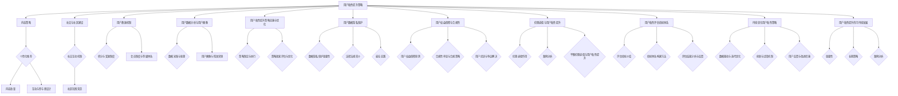

                 

# 第一部分：知识付费创业概述

## 1.1 知识付费市场的背景与趋势

### 1.1.1 知识付费的兴起

知识付费作为新兴商业模式，起源于人们对高质量信息和知识的需求。随着互联网的普及和信息技术的快速发展，传统知识传播方式逐渐演变。过去，知识的传播主要依赖于传统教育机构和专业媒体，而如今，知识付费平台为用户提供了更加便捷、灵活和个性化的学习途径。

知识付费的兴起可以追溯到2016年，当时知识分享平台如雨后春笋般涌现，例如得到、知乎Live、分答等。这些平台通过邀请行业专家、学者和专业人士开设课程、讲座、问答等形式，满足了用户在各个领域的学习需求。知识付费市场因此迅速发展，吸引了大量用户和资本涌入。

### 1.1.2 知识付费市场的主要玩家

在知识付费领域，主要玩家包括如下几个方面：

1. **大型互联网公司**：如腾讯、阿里巴巴等，它们依托自身的平台优势和用户基础，推出了各自的知识付费产品。例如，腾讯的企鹅辅导、阿里巴巴的阿里课堂等。

2. **专业知识分享平台**：如得到、知乎Live、分答等，这些平台专注于提供高质量的知识内容，通过邀请专业讲师授课，满足了用户个性化学习需求。

3. **垂直领域平台**：这类平台聚焦于特定领域，如编程、设计、金融等，提供专业知识和技能培训。例如，极客时间、优设网等。

4. **自媒体人和知识创作者**：利用个人影响力，通过平台开设课程、专栏等方式进行知识付费。

### 1.1.3 知识付费的市场前景

知识付费市场前景广阔，主要表现在以下几个方面：

1. **用户需求持续增长**：随着人们对于知识获取的重视程度不断提高，知识付费用户群体不断扩大。

2. **行业竞争加剧**：越来越多的企业和个人进入知识付费领域，市场竞争日益激烈。

3. **技术创新带来新机遇**：人工智能、大数据、区块链等技术的发展，为知识付费平台提供了更多创新空间，有助于提升用户体验和降低成本。

4. **商业模式不断创新**：例如，会员制、订阅制等新的商业模式不断涌现，为知识付费市场注入新的活力。

### 1.2 知识付费创业的关键成功因素

### 1.2.1 产品质量与服务

在知识付费市场中，产品质量和服务是吸引和留住用户的关键因素。优质的内容和服务能够提高用户满意度和忠诚度，从而促进用户留存和口碑传播。具体而言，知识付费创业需要关注以下几个方面：

1. **内容质量**：确保内容的专业性、实用性和针对性，满足用户的学习需求。可以通过邀请行业专家、学者和专业讲师，提升内容质量。

2. **服务体验**：提供优质的客户服务，及时响应用户需求和反馈，解决用户在使用过程中遇到的问题。可以通过24小时在线客服、一对一辅导等形式，提升用户体验。

3. **用户互动**：通过互动环节，如问答、讨论、测评等，增强用户参与感，提高用户满意度。

### 1.2.2 市场定位与目标用户

市场定位是知识付费创业的核心环节，决定了创业项目的发展方向和市场份额。在进行市场定位时，需要考虑以下几个方面：

1. **目标市场**：明确目标市场的范围和规模，了解市场需求和竞争状况。

2. **目标用户**：研究目标用户的特点、需求和消费行为，制定针对性的产品和服务策略。

3. **差异化定位**：通过独特的产品特色、服务优势或市场细分，形成差异化竞争优势。

### 1.2.3 营销策略与推广

营销策略和推广是知识付费创业成功的重要因素。合理的营销策略能够提高品牌知名度，吸引潜在用户，并促进用户转化。以下是一些有效的营销策略：

1. **内容营销**：通过高质量的内容创作，吸引用户关注，提高品牌知名度。例如，撰写专业博客、发布行业报告等。

2. **社交营销**：利用社交媒体平台，如微信、微博、抖音等，进行品牌推广和用户互动。

3. **渠道推广**：通过合作渠道、广告投放、线下活动等方式，扩大品牌影响力和用户覆盖范围。

4. **用户运营**：通过会员制度、积分奖励、用户反馈等手段，提高用户满意度和忠诚度。

### 1.3 知识付费创业案例分析

#### 1.3.1 成功案例分享

**得到App**：得到App是知识付费领域的领军企业，其成功主要得益于以下几点：

1. **内容优势**：得到了众多知名专家和学者，提供高质量的内容。
2. **平台运营**：通过精细化运营，提高用户满意度和粘性。
3. **营销策略**：通过微信、微博等社交媒体平台进行广泛宣传，提高品牌知名度。

**极客时间**：极客时间是专注于技术领域的知识付费平台，其成功经验包括：

1. **内容聚焦**：聚焦技术领域，提供专业、实用的技术课程。
2. **专家团队**：邀请业界知名专家和资深技术人士授课，提升内容质量。
3. **用户互动**：通过社区互动、问答等环节，增强用户参与感。

#### 1.3.2 失败案例分析

**某垂直领域知识付费平台**：该平台因以下原因导致失败：

1. **内容质量不高**：内容质量参差不齐，无法满足用户需求。
2. **市场定位不准确**：目标用户群体较小，市场竞争激烈。
3. **推广力度不足**：缺乏有效的营销策略，品牌知名度较低。

通过以上成功和失败案例，我们可以得出以下结论：知识付费创业的成功离不开优质的内容、精准的市场定位和有效的营销策略。同时，注重用户体验和用户互动也是提升用户粘性的关键因素。

----------------------------------------------------------------

## 2.1 用户粘性的概念与重要性

### 2.1.1 用户粘性的定义

用户粘性（User Stickiness）是指用户在一个平台或应用上持续活跃、频繁互动的行为表现。它是衡量用户忠诚度和平台吸引力的重要指标。高粘性的用户群体意味着用户对平台的依赖性和忠诚度较高，更愿意在平台上投入时间和精力。

### 2.1.2 用户粘性与用户留存率的关系

用户粘性与用户留存率之间存在密切的关系。用户留存率是指在一定时间内，持续使用平台的用户比例。高粘性用户往往具有较高的留存率，因为他们对平台内容和服务有较高的满意度和依赖性。相反，低粘性用户更容易流失，导致平台用户留存率下降。

### 2.1.3 提升用户粘性的重要性

提升用户粘性对于知识付费创业至关重要，具体表现在以下几个方面：

1. **增加用户留存**：高粘性用户更愿意长期留在平台上，减少用户流失率。

2. **提高用户参与度**：通过互动设计、社交机制等，提高用户在平台上的活跃度和参与度。

3. **增强用户忠诚度**：提升用户粘性有助于培养忠实用户群体，促进用户二次消费和口碑传播。

4. **降低获客成本**：高粘性用户通过口碑传播，有助于降低新用户的获取成本。

5. **优化产品和服务**：通过用户反馈和行为数据，不断优化产品和服务，提高用户满意度。

### 2.1.4 用户粘性提升策略的关键要素

提升用户粘性需要综合考虑多个因素，以下是一些关键要素：

1. **内容质量**：提供高质量、专业、有针对性的内容，满足用户需求。

2. **用户体验**：优化平台设计，提升用户体验，减少用户使用过程中的摩擦。

3. **互动与社交**：设计多样化的互动机制，促进用户之间的交流与互动。

4. **激励机制**：通过积分、奖励、会员等级等机制，激励用户积极参与平台活动。

5. **个性化推荐**：基于用户行为数据，提供个性化推荐，提高用户满意度。

6. **用户反馈**：及时收集用户反馈，优化产品和服务，提高用户满意度。

7. **数据驱动**：利用数据分析，精准把握用户行为，持续优化用户粘性策略。

通过以上要素的综合应用，知识付费创业可以有效地提升用户粘性，增强平台竞争力。

----------------------------------------------------------------

## 2.2 提升用户粘性的方法与工具

### 2.2.1 内容策略

内容策略是提升用户粘性的核心方法之一。优质的内容不仅可以吸引用户，还能提高用户的满意度和忠诚度。以下是一些内容策略的具体方法和工具：

#### 2.2.1.1 内容质量与个性化推荐

**内容质量**：
- **专业性和权威性**：确保内容的专业性和权威性，邀请行业专家和资深人士撰写或审核内容。
- **针对性**：根据用户需求和兴趣，提供个性化的内容，提高内容的实用性和吸引力。
- **更新频率**：保持内容更新频率，定期发布新内容，以保持用户的持续关注。

**个性化推荐**：
- **算法推荐**：利用推荐算法，根据用户的行为数据和偏好，为用户提供个性化推荐。
- **标签化**：为内容添加标签，便于用户快速查找和筛选感兴趣的内容。
- **用户画像**：构建用户画像，基于用户的兴趣和行为，提供更加精准的内容推荐。

#### 2.2.1.2 互动与参与感设计

**互动设计**：
- **问答环节**：在内容中设置问答环节，鼓励用户提问和回答，提高用户参与度。
- **讨论区**：建立讨论区，允许用户对内容进行评论和讨论，促进用户之间的互动。

**参与感设计**：
- **挑战和竞赛**：组织在线挑战和竞赛，鼓励用户积极参与，提升用户的参与感和成就感。
- **用户贡献内容**：鼓励用户提交自己的内容，如文章、教程、经验分享等，增加用户在平台上的参与感和归属感。

### 2.2.2 社交与社区建设

社交与社区建设是提升用户粘性的重要手段。通过构建活跃的社交网络和社区，可以增强用户的互动和归属感，提高用户的忠诚度。

#### 2.2.2.1 社交互动机制

**社交互动机制**：
- **点赞和分享**：提供点赞和分享功能，鼓励用户对内容进行互动。
- **关注和私信**：允许用户关注感兴趣的人或内容，并通过私信进行私下交流。
- **社交圈子**：创建不同的社交圈子，让用户可以根据兴趣和需求找到志同道合的朋友。

#### 2.2.2.2 社区氛围营造

**社区氛围营造**：
- **活跃用户奖励**：通过积分、奖励等方式，激励活跃用户，促进社区氛围的建设。
- **规则设定**：制定合理的社区规则，维护社区秩序，确保社区环境的友好和积极。
- **活动组织**：定期举办线上或线下活动，增强用户之间的联系和互动。

### 2.2.3 用户激励机制

用户激励机制是提升用户粘性的有效手段。通过设立积分、奖励和会员制度，可以激励用户积极参与平台活动，提升用户满意度和忠诚度。

#### 2.2.3.1 积分与奖励制度

**积分与奖励制度**：
- **积分获取**：通过完成任务、参与互动等方式，让用户获得积分。
- **积分兑换**：提供积分兑换礼品、优惠券等福利，鼓励用户积极参与。
- **奖励机制**：设立金牌用户、年度最佳贡献者等荣誉奖项，激励优秀用户。

#### 2.2.3.2 会员制度与等级体系

**会员制度与等级体系**：
- **会员制度**：设立会员制度，提供会员专享内容、优惠等服务，提升用户付费意愿。
- **等级体系**：建立等级体系，根据用户的活跃度、贡献度等指标，提升用户等级，提供相应的特权。

### 2.2.4 用户数据分析与用户画像

用户数据分析和用户画像是提升用户粘性的关键工具。通过收集和分析用户数据，可以深入了解用户行为和需求，提供更加个性化的服务和推荐。

#### 2.2.4.1 数据采集与处理

**数据采集与处理**：
- **行为数据**：收集用户在平台上的行为数据，如浏览、购买、评论等。
- **社交数据**：收集用户在社交互动中的数据，如点赞、分享、关注等。
- **数据处理**：对采集到的数据进行清洗、归一化和特征提取，为后续分析做准备。

#### 2.2.4.2 用户画像与精准营销

**用户画像与精准营销**：
- **用户画像构建**：基于用户行为数据、社交数据和基础信息，构建用户画像。
- **精准营销**：利用用户画像，针对不同用户群体，提供个性化的内容和推荐。

### 2.2.5 实践案例

以下是一些提升用户粘性的实践案例：

**案例1：知乎Live**：
- **内容策略**：邀请知名专家进行直播授课，提供高质量的内容。
- **社交互动**：建立讨论区，鼓励用户提问和讨论，增强互动氛围。
- **用户激励机制**：设立积分和奖励制度，激励用户积极参与。

**案例2：得到App**：
- **内容策略**：提供多样化的内容，包括音频、视频、文字等形式。
- **个性化推荐**：利用推荐算法，为用户提供个性化的内容推荐。
- **会员制度**：设立会员制度，提供会员专享内容和优惠。

通过以上方法与工具，知识付费创业可以有效地提升用户粘性，增强平台竞争力。

----------------------------------------------------------------

## 2.3 用户粘性提升策略实战案例

### 2.3.1 成功案例分享

**案例1：得到App的“罗辑思维”专栏**

**背景**：得到App是知识付费领域的领军企业，其“罗辑思维”专栏是该平台最受欢迎的专栏之一。

**策略**：
- **内容质量**：罗振宇邀请知名专家学者进行授课，确保内容的专业性和权威性。
- **个性化推荐**：通过算法推荐，根据用户兴趣和行为，为用户提供个性化的内容推荐。
- **互动设计**：专栏内设有问答环节，用户可以提问并得到专家的回答，增强用户参与感。
- **用户激励**：设立积分和奖励制度，鼓励用户积极参与互动和分享。

**效果**：罗辑思维专栏用户活跃度高，粘性强，用户留存率显著提升。

**案例2：知乎Live的“知乎大学”课程**

**背景**：知乎Live是知乎旗下的知识付费平台，知乎大学是其推出的在线教育品牌。

**策略**：
- **内容聚焦**：知乎大学聚焦于职场技能、个人成长等领域，提供专业、实用的课程。
- **互动与社交**：通过讨论区、问答等环节，促进用户之间的互动和交流。
- **用户激励**：设立会员制度，提供会员专享内容和优惠，鼓励用户付费和参与。

**效果**：知乎大学课程用户参与度高，用户粘性强，会员数量持续增长。

### 2.3.2 失败案例分析

**案例1：某垂直领域知识付费平台**

**背景**：该平台专注于技术领域，提供编程、设计等课程。

**原因**：
- **内容质量不高**：课程内容缺乏专业性和权威性，用户满意度低。
- **市场定位不准确**：目标用户群体较小，市场竞争激烈。
- **缺乏有效的推广**：缺乏有效的营销策略，品牌知名度低。

**效果**：该平台用户活跃度低，用户粘性差，最终导致失败。

**案例2：某健康知识付费平台**

**背景**：该平台提供健康知识课程，包括养生、营养等。

**原因**：
- **内容更新不及时**：课程内容老旧，无法满足用户需求。
- **用户体验不佳**：平台设计不合理，使用过程中存在诸多不便。
- **缺乏互动和社交**：用户之间缺乏互动，用户体验感差。

**效果**：该平台用户流失严重，用户粘性低，最终关闭运营。

通过以上成功和失败案例，我们可以得出以下结论：提升用户粘性需要从内容质量、用户体验、互动设计等多个方面入手，同时需要精准的市场定位和有效的推广策略。失败的案例往往是因为在上述方面存在不足，导致用户不满意和流失。

----------------------------------------------------------------

## 2.4 用户粘性提升策略的实施与优化

### 2.4.1 实施策略的制定与执行

#### 2.4.1.1 制定策略

- **明确目标**：根据平台的特点和用户需求，明确提升用户粘性的具体目标，如提高用户留存率、增加用户参与度等。
- **资源规划**：合理分配人力、物力和财力资源，确保策略实施所需的支持。
- **步骤分解**：将策略分解为具体实施步骤，明确每个步骤的责任人和时间节点。

#### 2.4.1.2 执行策略

- **内容更新**：定期更新优质内容，确保内容的时效性和专业性。
- **互动设计**：设计多样化的互动环节，如问答、讨论、投票等，增强用户参与感。
- **社区建设**：建立活跃的社区，营造良好的社交氛围，促进用户之间的互动。
- **用户激励**：实施积分、奖励和会员制度，激励用户积极参与平台活动。

### 2.4.2 策略效果的评估与优化

#### 2.4.2.1 评估指标

- **用户留存率**：在一定时间内，持续使用平台的用户比例。
- **用户活跃度**：用户在平台上的互动行为次数，如浏览、评论、分享等。
- **用户满意度**：用户对平台内容和服务的主观评价。
- **用户转化率**：用户完成购买、订阅等行为的比例。

#### 2.4.2.2 评估方法

- **数据分析**：通过数据分析工具，收集用户行为数据，如浏览量、互动次数、购买记录等。
- **用户调研**：通过问卷调查、用户访谈等方式，收集用户对平台内容和服务的主观评价。
- **对比分析**：对比策略实施前后的用户留存率、活跃度、满意度等指标，评估策略效果。

#### 2.4.2.3 优化策略

- **数据驱动**：根据数据分析结果，识别问题所在，制定针对性的优化方案。
- **迭代优化**：不断迭代和优化策略，通过小规模实验和用户反馈，验证优化效果。
- **用户参与**：鼓励用户参与策略优化，通过用户调研和反馈，了解用户需求，指导策略调整。

### 2.4.3 实施案例

**案例1：某知识付费平台的用户粘性提升策略**

**背景**：该平台在用户粘性方面存在一定问题，用户留存率和活跃度较低。

**策略实施**：
- **内容更新**：定期发布新课程和专题，确保内容的新鲜感和专业性。
- **互动设计**：引入问答环节，鼓励用户提问和回答，增加用户互动。
- **社区建设**：建立论坛和讨论区，促进用户之间的交流和分享。
- **用户激励**：设立积分和奖励制度，激励用户参与互动和分享。

**效果评估**：
- **用户留存率**：从实施策略前的20%提升到30%。
- **用户活跃度**：互动次数增加了50%。
- **用户满意度**：用户满意度从60%提升到80%。

**优化措施**：
- **数据分析**：根据用户行为数据，调整课程内容和发布时间，提高用户满意度。
- **用户反馈**：通过用户调研和反馈，了解用户需求和痛点，持续优化互动设计。

**案例2：某在线教育平台的用户粘性提升策略**

**背景**：该平台在用户粘性方面存在较大问题，用户流失严重。

**策略实施**：
- **个性化推荐**：通过推荐算法，为用户提供个性化的课程推荐。
- **用户激励**：设立积分和奖励制度，激励用户完成课程和互动。
- **用户反馈**：建立用户反馈机制，及时收集用户意见和建议，优化课程和服务。

**效果评估**：
- **用户留存率**：从实施策略前的15%提升到25%。
- **用户转化率**：购买课程的用户比例增加了30%。
- **用户满意度**：用户满意度从50%提升到75%。

**优化措施**：
- **数据驱动**：根据用户行为数据，调整推荐算法和激励制度，提高用户参与度。
- **用户调研**：定期进行用户调研，了解用户需求，优化课程内容和用户体验。

通过以上案例，我们可以看到，用户粘性提升策略的有效实施和持续优化，可以显著提高用户留存率和活跃度，增强平台竞争力。

----------------------------------------------------------------

## 3.1 用户数据隐私保护

### 3.1.1 数据隐私保护的重要性

在知识付费创业中，用户数据隐私保护是一项至关重要的工作。随着互联网技术的不断进步，用户在平台上的行为数据越来越丰富，这些数据不仅包含了用户的个人信息，还反映了用户的兴趣、偏好和行为模式。如果这些数据得不到妥善保护，可能会对用户造成严重的隐私泄露和信息安全风险。

首先，数据隐私保护是法律法规的要求。在全球范围内，许多国家和地区都制定了相关的法律法规来保护用户数据隐私，如《欧盟通用数据保护条例》（GDPR）、《中华人民共和国个人信息保护法》等。这些法律法规对数据收集、存储、处理、传输等环节提出了严格的要求，企业如果不遵守这些规定，可能会面临严重的法律风险和罚款。

其次，数据隐私保护是维护用户信任的基础。用户在知识付费平台上的行为数据是平台的核心资产，但同时也是用户隐私的一部分。如果用户的数据被泄露或滥用，不仅会导致用户隐私受到侵犯，还会损害平台的声誉和用户信任。信任是用户选择和使用知识付费平台的重要因素，一旦失去信任，用户可能会选择其他平台，对企业的长期发展造成不利影响。

### 3.1.2 相关法律法规简介

为了保护用户数据隐私，全球范围内已经出台了多项法律法规，以下是其中一些主要的法律：

**欧盟通用数据保护条例（GDPR）**：GDPR是欧盟制定的关于数据保护的综合性法规，于2018年5月25日正式生效。GDPR规定了数据控制者对用户数据的处理原则、用户权利、数据泄露通知等要求，对违反规定的企业可处以高达2000万欧元或全球营业额4%的罚款。

**中华人民共和国个人信息保护法**：我国于2021年11月1日正式实施的《中华人民共和国个人信息保护法》明确了个人信息处理的基本原则、个人信息权益、个人信息处理规则等，对个人信息处理者的数据处理行为提出了严格要求。

**加州消费者隐私法案（CCPA）**：CCPA是美国的消费者隐私保护法案，于2020年1月1日正式生效。CCPA赋予了消费者对个人信息处理的更多控制权，包括访问、删除和拒绝出售个人信息等权利。

### 3.1.3 数据隐私保护的最佳实践

为了有效保护用户数据隐私，知识付费创业企业可以采取以下最佳实践：

**1. 数据最小化原则**：企业在收集用户数据时，应遵循数据最小化原则，仅收集实现服务所必需的数据，避免过度收集。

**2. 明确数据用途**：企业在收集用户数据时，应明确告知用户数据的用途，并在处理过程中遵守这些用途。

**3. 用户同意与选择**：企业在处理用户数据前，应获得用户的明确同意，并允许用户选择是否提供某些数据。

**4. 数据加密与安全存储**：对收集到的用户数据进行加密处理，并采用安全措施进行存储，防止数据泄露和未经授权的访问。

**5. 定期安全审计**：定期进行安全审计，评估数据保护措施的有效性，及时发现和纠正安全隐患。

**6. 数据泄露应对计划**：制定数据泄露应对计划，包括数据泄露的通知、处理和责任分配等，确保在发生数据泄露时能够及时、有效地应对。

**7. 用户隐私权利保护**：尊重用户的隐私权利，提供用户访问、删除、更正等请求的响应机制。

通过以上最佳实践，知识付费创业企业可以更好地保护用户数据隐私，增强用户信任，提升平台竞争力。

----------------------------------------------------------------

## 3.2 用户权益保障与合规性

### 3.2.1 用户权益保障的原则

在知识付费创业中，保障用户权益是企业应当遵循的基本原则。用户权益保障不仅关乎企业的法律责任，更是维护企业声誉和用户信任的重要举措。以下是用户权益保障应遵循的主要原则：

**1. 公平公正**：企业在提供服务时应确保对所有用户公平公正，不因用户背景、地域、身份等因素歧视或偏袒。

**2. 透明性**：企业在处理用户权益相关问题时，应保持透明，公开相关信息和流程，让用户了解自己的权益和企业的处理方式。

**3. 及时响应**：企业应建立完善的用户权益保障机制，及时响应用户的投诉、询问和请求，确保用户问题得到妥善解决。

**4. 用户隐私保护**：在处理用户权益的同时，企业需严格遵循数据隐私保护的相关法律法规，保护用户的个人信息安全。

**5. 诚信守信**：企业应秉持诚信原则，遵守与用户之间的协议和承诺，确保用户权益得到切实保障。

### 3.2.2 合规性审查与合规策略

合规性审查是企业确保自身业务合法合规的重要环节。以下是企业在合规性审查中应关注的几个方面：

**1. 法律法规审查**：企业应定期审查自身业务是否符合相关法律法规的要求，包括但不限于《中华人民共和国个人信息保护法》、《欧盟通用数据保护条例》等。

**2. 合同审查**：企业应审查与用户签订的合同，确保合同条款合法有效，符合用户权益保障原则。

**3. 内部规章制度**：企业应制定和完善内部规章制度，确保业务流程符合法律法规的要求，并建立相应的监督和执行机制。

**4. 风险评估**：企业应定期进行风险评估，识别业务中可能存在的合规风险，并采取相应的预防和控制措施。

### 3.2.3 用户投诉与争议解决

用户投诉与争议解决是保障用户权益的重要环节。以下是企业在处理用户投诉和争议时应采取的措施：

**1. 设立投诉渠道**：企业应设立便捷、多样的投诉渠道，如客服热线、在线客服、邮件等，方便用户提出投诉。

**2. 快速响应**：企业应建立快速响应机制，确保投诉在第一时间得到处理，减少用户等待时间。

**3. 公正处理**：企业应公正处理每一项投诉，对投诉内容进行详细调查，确保问题得到公正解决。

**4. 结果反馈**：企业应在处理完毕后向用户反馈处理结果，确保用户对处理结果满意。

**5. 持续改进**：企业应根据投诉和争议处理情况，不断优化业务流程和规则，预防类似问题的再次发生。

### 3.2.4 用户权益保障的最佳实践

以下是几个用户权益保障的最佳实践：

**1. 用户协议明确**：在用户协议中明确告知用户其享有的权益和企业的服务承诺，降低用户投诉风险。

**2. 用户培训与教育**：通过培训和教育，提高用户对知识付费产品和服务的了解，减少因误解或操作不当引发的投诉。

**3. 用户反馈机制**：建立用户反馈机制，鼓励用户提出意见和建议，及时发现并解决问题。

**4. 第三方评估**：邀请第三方机构进行评估，确保企业的用户权益保障措施符合行业标准和法律法规。

**5. 公开透明**：在官方网站和社交媒体上公开用户投诉处理流程和结果，增强用户对企业的信任。

通过以上措施和最佳实践，知识付费创业企业可以更好地保障用户权益，提升用户满意度和忠诚度，为企业的长期发展奠定坚实基础。

----------------------------------------------------------------

## 3.3 伦理道德与用户粘性提升

### 3.3.1 伦理道德在用户粘性提升中的作用

伦理道德在用户粘性提升中扮演着至关重要的角色。它不仅是企业履行社会责任的体现，也是建立用户信任、维护品牌形象的关键因素。以下从几个方面探讨伦理道德在用户粘性提升中的作用：

**1. 增强用户信任**：企业遵循伦理道德，能够赢得用户的信任。信任是用户长期使用平台的基础，高信任度的平台更容易提升用户粘性。

**2. 提高用户满意度**：伦理道德促使企业关注用户需求和权益，提供高质量、透明、公正的服务，从而提高用户满意度，增强用户对平台的依赖性和忠诚度。

**3. 促进口碑传播**：遵循伦理道德的企业往往能够获得良好的用户口碑，用户的正面评价和推荐能够吸引更多新用户，进一步提高用户粘性。

### 3.3.2 伦理道德问题的案例分析

以下是一些伦理道德问题的案例，分析其对用户粘性提升的影响：

**案例1：某知识付费平台的数据滥用**：该平台在未经用户同意的情况下，收集并分析了用户的大量个人数据，用于商业目的。这一行为引发了用户的强烈不满，导致用户投诉和抵制，平台用户粘性大幅下降。

**结果**：该平台声誉受损，用户流失严重，最终不得不调整数据收集和使用策略，以挽回用户信任。

**案例2：某在线教育平台的欺诈行为**：该平台通过虚假宣传、伪造教师资质等手段，欺骗用户购买课程。这一行为被用户揭露后，引起了广泛的负面舆论，用户对平台的信任度降至冰点。

**结果**：平台用户粘性急剧下降，用户投诉和退款请求增多，最终导致平台倒闭。

### 3.3.3 伦理道德与用户粘性提升的平衡

在提升用户粘性的过程中，企业需要平衡伦理道德与商业利益。以下是一些建议：

**1. 坚持透明原则**：企业应确保用户在信息收集、使用和处理过程中具有知情权，透明地告知用户数据收集的目的、方式和范围。

**2. 尊重用户隐私**：企业应严格保护用户隐私，不得滥用用户数据，确保用户数据的安全和保密性。

**3. 提供真实、高质量的内容**：企业应提供真实、有价值的知识内容，避免虚假宣传和欺诈行为，提高用户的满意度和忠诚度。

**4. 建立用户反馈机制**：企业应建立完善的用户反馈机制，及时处理用户的投诉和建议，及时调整和优化服务，提升用户体验。

**5. 强化内部伦理道德培训**：企业应加强员工的伦理道德培训，提高员工的法律意识和道德素质，确保企业行为符合伦理道德标准。

通过以上措施，知识付费创业企业可以在提升用户粘性的同时，平衡伦理道德与商业利益，实现可持续发展。

----------------------------------------------------------------

## 4.1 用户粘性评估指标体系

### 4.1.1 常见评估指标介绍

在评估用户粘性时，需要选择合适的指标来衡量用户在平台上的活跃程度和参与度。以下是一些常见的用户粘性评估指标：

**1. 用户留存率**：用户留存率是指在一定时间内，持续使用平台或应用的用户比例。通常，用户留存率越高，说明用户的粘性越强。

**2. 活跃用户数**：活跃用户数是指在一段时间内，有互动行为的用户数量。互动行为包括登录、浏览、购买、评论、分享等。

**3. 互动频率**：互动频率是指用户在一定时间内，与平台或应用互动的次数。高互动频率通常表明用户对平台的参与度高。

**4. 用户满意度**：用户满意度是用户对平台或应用的主观评价。高满意度通常意味着用户对平台有较高的依赖性和忠诚度。

**5. 用户转化率**：用户转化率是指完成特定目标（如购买、注册、订阅等）的用户比例。高转化率通常表明用户对平台的信任和认可。

### 4.1.2 指标体系构建方法

构建用户粘性评估指标体系需要遵循以下原则：

**1. 全面性**：指标体系应涵盖用户行为的各个方面，从多个维度评估用户粘性。

**2. 可量化**：指标体系中的指标应可量化，以便进行数据分析和比较。

**3. 可操作性**：指标体系应具备可操作性，能够为企业的运营决策提供参考。

**4. 持续性**：指标体系应具备持续性，能够长期跟踪和评估用户粘性。

以下是构建用户粘性评估指标体系的一般步骤：

**步骤1：确定评估目标**：明确评估用户粘性的目的和需求，如提高用户留存率、增加活跃用户数等。

**步骤2：收集数据**：收集相关用户行为数据，包括登录、浏览、购买、评论等。

**步骤3：筛选指标**：根据评估目标和数据情况，筛选合适的指标，如用户留存率、活跃用户数、互动频率等。

**步骤4：确定权重**：为每个指标分配权重，以反映其在用户粘性评估中的重要性。

**步骤5：建立模型**：使用统计模型或算法，将指标整合为一个综合评估结果。

**步骤6：验证和调整**：对指标体系进行验证和调整，确保其准确性和有效性。

### 4.1.3 评估结果分析与反馈

评估结果分析是用户粘性评估的关键环节。以下是一些分析方法：

**1. 指标趋势分析**：分析指标的变化趋势，了解用户粘性的变化情况。

**2. 指标比较分析**：比较不同指标之间的差异，识别关键影响因素。

**3. 因子分析**：通过因子分析，识别影响用户粘性的主要因素。

**4. 相关性分析**：分析指标之间的相关性，了解不同指标之间的相互影响。

在分析结果的基础上，企业应制定相应的改进措施：

**1. 针对性问题**：根据分析结果，识别存在的问题，制定针对性的解决方案。

**2. 调整策略**：根据分析结果，调整用户粘性提升策略，优化用户体验。

**3. 反馈机制**：建立用户反馈机制，及时收集用户意见和建议，持续改进产品和服务。

通过以上方法，企业可以有效地评估用户粘性，并根据评估结果不断优化运营策略，提升用户满意度和忠诚度。

----------------------------------------------------------------

## 4.2 持续优化用户粘性策略

### 4.2.1 数据驱动与迭代优化

在知识付费创业中，数据驱动是提升用户粘性的关键策略。通过数据分析，企业可以深入了解用户行为和需求，从而制定更加精准和有效的优化措施。以下是如何通过数据驱动和迭代优化来提升用户粘性的步骤：

**1. 数据采集**：首先，企业需要收集用户在平台上的各种行为数据，包括登录、浏览、购买、评论、分享等。这些数据可以通过日志文件、API接口、第三方数据服务商等途径获取。

**2. 数据处理**：对采集到的数据进行清洗、归一化和特征提取，确保数据的质量和一致性。数据清洗包括去除重复数据、填补缺失值、处理异常值等。

**3. 数据分析**：使用统计分析、机器学习等方法，对处理后的数据进行分析。分析内容包括用户行为模式、用户偏好、用户生命周期等。

**4. 建立模型**：根据分析结果，建立用户粘性评估模型和预测模型。评估模型用于衡量当前用户粘性水平，预测模型用于预测未来用户行为。

**5. 迭代优化**：根据模型结果，识别用户粘性提升的关键因素，制定优化策略。然后，实施这些策略，并持续监控效果。根据用户反馈和数据分析，不断调整和优化策略，形成数据驱动的迭代优化循环。

### 4.2.2 创新与试错机制

在用户粘性提升过程中，创新和试错机制至关重要。通过创新，企业可以不断探索新的用户粘性提升方法，而试错机制则帮助企业降低创新风险，提高成功概率。以下是如何建立创新与试错机制的步骤：

**1. 设定创新目标**：明确企业希望在用户粘性提升方面实现的目标，如提高用户留存率、增加用户互动等。

**2. 创意收集**：鼓励员工和用户提出创新想法，可以通过头脑风暴、创新竞赛等方式收集创意。

**3. 创意筛选**：对收集到的创意进行筛选，评估其可行性、创新性和潜在收益。

**4. 试错机制**：选择具有潜力的创意进行试运行，通过小规模实验，评估创意的效果和用户反应。试错过程中，企业应允许失败，并从失败中吸取教训。

**5. 优化与创新**：根据试错结果，对成功的创意进行优化和推广，对失败的创意进行改进或放弃。

通过创新与试错机制，企业可以不断探索和尝试新的用户粘性提升方法，提高策略的成功率，持续提升用户满意度。

### 4.2.3 用户反馈与改进措施

用户反馈是提升用户粘性的重要来源。通过收集和分析用户反馈，企业可以及时发现产品和服务中的问题，并采取改进措施，提高用户体验。以下是如何利用用户反馈进行改进的步骤：

**1. 反馈渠道**：建立多种用户反馈渠道，如在线客服、问卷调查、用户论坛、社交媒体等，方便用户提出意见和建议。

**2. 反馈收集**：定期收集用户反馈，对反馈内容进行分类和整理，识别用户关注的问题和需求。

**3. 反馈分析**：对用户反馈进行深入分析，识别普遍问题和关键需求，制定针对性的改进方案。

**4. 改进实施**：根据分析结果，实施改进措施，如优化产品功能、改善用户体验、调整服务流程等。

**5. 反馈跟进**：在改进措施实施后，跟踪用户反馈，了解改进效果，并根据反馈进行进一步调整。

通过以上步骤，企业可以不断优化产品和服务，提升用户满意度和忠诚度，从而实现用户粘性的持续提升。

通过数据驱动、创新与试错机制和用户反馈的持续优化，知识付费创业企业可以不断提升用户粘性，增强平台的竞争力和可持续发展能力。

----------------------------------------------------------------

## 4.3 用户粘性提升的可持续发展

### 4.3.1 持续发展的重要性

用户粘性提升的可持续发展是知识付费创业企业的核心目标之一。在知识付费市场中，企业不仅需要短期内提升用户粘性，还需要考虑长期的业务发展和用户关系的维护。持续发展的重要性体现在以下几个方面：

1. **增强企业竞争力**：通过持续提升用户粘性，企业可以在竞争激烈的市场中脱颖而出，吸引和留住更多用户，提高市场占有率。

2. **提升用户满意度**：持续优化产品和服务，满足用户不断变化的需求，提高用户满意度和忠诚度，降低用户流失率。

3. **降低获客成本**：通过提高用户粘性，企业可以减少新用户的获取成本，降低营销和推广费用。

4. **实现商业模式的多元化**：持续提升用户粘性有助于企业探索多元化的商业模式，如会员制、订阅制、增值服务等，增加收入来源。

### 4.3.2 用户粘性提升的长期策略

为了实现用户粘性的可持续发展，知识付费创业企业应采取以下长期策略：

**1. 定期内容更新**：定期发布新内容，确保内容的新鲜度和专业性，满足用户持续的学习需求。

**2. 用户个性化服务**：利用用户数据，提供个性化推荐和定制化服务，提高用户的满意度和忠诚度。

**3. 社交与社区建设**：建立活跃的社交网络和社区，促进用户之间的互动和分享，增强用户参与感和归属感。

**4. 用户体验优化**：持续优化平台设计和服务流程，提升用户体验，减少用户使用过程中的摩擦。

**5. 数据分析与优化**：利用数据分析，深入了解用户行为和需求，不断优化产品和服务，提高用户粘性。

### 4.3.3 可持续发展的案例分析

**案例1：得到App的“得到大学”**

**背景**：得到App通过推出“得到大学”，为用户提供专业、系统的知识学习服务。

**策略**：
- **内容更新**：定期发布高质量的课程和文章，确保内容的专业性和实用性。
- **个性化推荐**：利用推荐算法，为用户提供个性化的课程推荐。
- **社区建设**：建立“得到大学”社区，鼓励用户参与讨论和分享。

**效果**：得到大学用户粘性高，用户满意度显著提升，会员数量持续增长。

**案例2：极客时间的“技术沙龙”**

**背景**：极客时间通过“技术沙龙”活动，为开发者提供技术交流和学习的平台。

**策略**：
- **内容聚焦**：提供高质量的编程课程和技术文章。
- **互动设计**：举办线上技术沙龙，鼓励用户提问和讨论。
- **用户激励**：设立积分和奖励制度，激励用户参与互动。

**效果**：技术沙龙活动活跃度高，用户参与感强，用户粘性显著提升。

通过以上案例，我们可以看到，知识付费创业企业通过持续优化产品和服务，建立用户粘性的长期策略，可以有效地实现可持续发展，提升企业的市场竞争力。

### 4.3.4 未来发展趋势

随着技术的不断进步和市场环境的变化，用户粘性提升的策略也将不断演进。以下是未来用户粘性提升的一些发展趋势：

**1. 人工智能与大数据的深度融合**：人工智能和大数据技术的发展，将为用户粘性提升提供更加精准和个性化的解决方案。

**2. 社交与社区的重要性提升**：社交和社区作为增强用户互动和归属感的重要手段，将在未来发挥更加重要的作用。

**3. 内容质量的持续重视**：高质量的内容始终是吸引用户的关键，企业需要持续投入资源，提高内容的专业性和实用性。

**4. 可持续发展意识的增强**：企业应更加注重环境保护和社会责任，通过可持续发展策略提升用户信任和品牌价值。

通过紧跟行业趋势，不断创新和优化，知识付费创业企业可以持续提升用户粘性，实现长期可持续发展。

----------------------------------------------------------------

## 附录 A：知识付费创业与用户粘性提升资源推荐

### A.1 常用工具与平台

**1. 得到App**：提供多样化的知识付费内容，包括音频、视频和文字等形式。

**2. 知乎Live**：知乎旗下的知识付费平台，提供专家讲座和问答服务。

**3. 极客时间**：专注于技术领域的知识付费平台，提供编程、设计等课程。

**4. 优设网**：设计领域的知识付费平台，提供专业的设计教程和课程。

**5. 喜马拉雅**：音频内容平台，提供各类知识付费音频节目。

### A.2 相关书籍与文献

**1. 《知识付费时代的用户粘性策略》**：详细介绍了知识付费领域的用户粘性提升策略。

**2. 《用户体验要素》**：作者杰罗姆·卢梭，讲述了提升用户体验的方法和原则。

**3. 《增长黑客》**：作者范·瓦格纳，介绍了如何通过数据分析和创新手段实现用户增长。

**4. 《社群营销》**：作者刘润，讲述了如何通过社群建设提升用户粘性。

### A.3 网络资源与社区链接

**1. 知乎**：专业的问答社区，涵盖各个领域的问题和答案。

**2. 微信公众号**：众多知名公众号提供行业资讯和知识分享。

**3. 抖音**：短视频平台，许多内容创作者在抖音上分享知识和经验。

**4. 行业论坛**：如CSDN、博客园等，提供技术讨论和资源分享。

通过以上资源，知识付费创业者和从业者可以获取丰富的知识和经验，提升业务水平和用户粘性。

----------------------------------------------------------------

## 附录 B：用户粘性提升策略 Mermaid 流程图

以下是一个关于用户粘性提升策略的Mermaid流程图，展示了各个环节的相互关系：

此流程图从用户粘性提升策略的整体出发，逐步细化到具体的策略和方法，展示了各个环节之间的关联和相互影响。通过这样的流程图，可以清晰地了解用户粘性提升的整个过程，有助于知识付费创业者在实际操作中更加系统地规划和执行相关策略。

