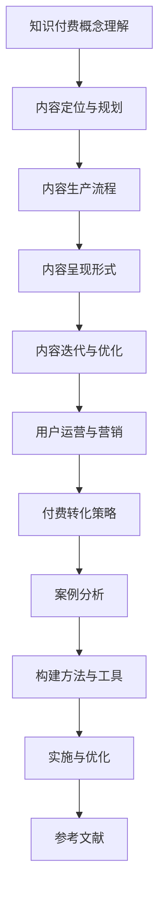

                 

# 《知识付费创业的内容体系构建方法》

## 关键词
知识付费，内容体系，用户运营，营销策略，付费转化，案例分析，数据分析，人工智能，内容生产，内容呈现形式，内容迭代与优化。

## 摘要
本文旨在探讨知识付费创业的内容体系构建方法，包括对知识付费概念的理解、内容体系构建、用户运营与营销策略、案例分析以及构建方法和工具的详细介绍。通过逻辑清晰、结构紧凑、简单易懂的专业技术语言，帮助创业者深入理解知识付费市场的核心要素，构建有竞争力、可持续发展的内容体系。

### 第一部分：知识付费概述

#### 1.1 知识付费的概念与现状

##### 1.1.1 知识付费的定义

知识付费是指用户为获取有价值的信息或知识，通过支付一定费用来获取相应内容或服务的行为。这种模式在互联网时代逐渐兴起，主要表现为在线课程、电子书、专家讲座、付费问答等形式。

##### 1.1.2 知识付费的发展历程

知识付费起源于互联网的早期阶段，随着互联网技术的进步和用户付费习惯的养成，逐渐发展成为一个独立的市场。近年来，随着智能手机和移动互联网的普及，知识付费市场呈现爆发式增长。

##### 1.1.3 知识付费的市场现状

当前，知识付费市场已进入成熟期，用户对高质量、专业化的内容需求不断增加。主要平台包括喜马拉雅FM、得到App、知乎Live等，这些平台在内容生产、用户运营、营销策略等方面积累了丰富的经验。

#### 1.2 知识付费的核心要素

##### 1.2.1 内容生产

内容生产是知识付费的核心，优质内容是吸引用户付费的关键。内容生产需要具备专业性和实用性，满足用户的学习和成长需求。

##### 1.2.2 用户需求分析

了解用户需求是内容生产的基础，通过对用户行为数据的分析，可以挖掘用户兴趣点，为内容生产提供方向。

##### 1.2.3 付费模式分析

知识付费的付费模式多种多样，包括一次性付费、订阅制、课程包等。创业者需要根据自身业务特点和用户需求选择合适的付费模式。

#### 1.3 知识付费的行业趋势

##### 1.3.1 知识付费的挑战与机遇

知识付费市场面临激烈竞争，但同时也蕴含着巨大的机遇。创业者需要不断创新，提高内容质量和用户满意度，以在市场中脱颖而出。

##### 1.3.2 知识付费的未来发展方向

知识付费未来将朝着专业化、个性化、社交化方向发展。创业者应关注这些趋势，提前布局，以抓住市场机遇。

##### 1.3.3 知识付费与其他行业的融合

知识付费正与其他行业如电商、金融、教育等深度融合，创业者可以探索跨界合作，拓展业务范围。

### 第二部分：内容体系构建

#### 2.1 内容定位与规划

##### 2.1.1 内容定位的重要性

内容定位是知识付费创业的第一步，明确内容定位有助于吸引目标用户，提高用户黏性。

##### 2.1.2 内容规划的步骤与方法

内容规划包括内容主题选择、内容结构设计、内容更新计划等，创业者应根据自身优势和市场趋势制定合理的内容规划。

##### 2.1.3 内容规划的案例分析

通过分析成功案例，了解优秀内容规划的方法和策略，为自身内容体系构建提供借鉴。

#### 2.2 内容生产流程

##### 2.2.1 内容生产团队搭建

搭建内容生产团队是内容体系构建的关键，团队应具备专业知识、创作能力和运营能力。

##### 2.2.2 内容创作技巧

内容创作需要遵循一定的原则，如简洁明了、逻辑清晰、富有吸引力等。

##### 2.2.3 内容编辑与审核

内容编辑和审核是确保内容质量的重要环节，创业者应建立完善的内容审核机制。

#### 2.3 内容呈现形式

##### 2.3.1 文字内容呈现

文字内容呈现是最常见的形式，创业者应根据内容特点选择合适的文字表达方式。

##### 2.3.2 视频内容呈现

视频内容呈现具有直观、生动、互动性强的特点，适用于讲解复杂知识点或进行产品演示。

##### 2.3.3 音频内容呈现

音频内容呈现适用于通勤、休闲等场景，创业者可结合自身优势，尝试开发音频内容。

#### 2.4 内容迭代与优化

##### 2.4.1 数据驱动的迭代方法

通过数据分析，了解用户对内容的反馈，持续优化内容质量和用户体验。

##### 2.4.2 用户反馈的重要性

用户反馈是内容迭代的重要参考，创业者应建立有效的用户反馈机制，及时调整内容策略。

##### 2.4.3 内容优化的案例分析

分析成功案例的内容优化策略，借鉴其经验，提升自身内容体系的质量。

### 第三部分：用户运营与营销

#### 3.1 用户运营策略

##### 3.1.1 用户分层策略

根据用户需求和行为特征，将用户分为不同层次，提供差异化的运营策略。

##### 3.1.2 用户行为分析

通过分析用户行为数据，挖掘用户兴趣点，为内容生产和营销策略提供依据。

##### 3.1.3 用户增长策略

制定有效的用户增长策略，包括渠道拓展、内容推广、活动策划等。

#### 3.2 营销策略

##### 3.2.1 营销目标设定

明确营销目标，如用户增长、内容消费、付费转化等，为营销策略制定提供方向。

##### 3.2.2 营销渠道选择

根据目标用户特点和渠道效果，选择合适的营销渠道，如社交媒体、搜索引擎、内容合作等。

##### 3.2.3 营销活动策划

策划具有吸引力的营销活动，提高用户参与度和付费意愿。

#### 3.3 付费转化策略

##### 3.3.1 付费门槛设定

设定合理的付费门槛，平衡用户需求和盈利目标。

##### 3.3.2 优惠活动策划

通过优惠活动，如优惠券、限时折扣等，刺激用户付费行为。

##### 3.3.3 付费用户维系策略

制定有效的用户维系策略，提高付费用户的忠诚度和复购率。

#### 3.4 社区运营

##### 3.4.1 社区建设目标

明确社区建设目标，如用户互动、内容分享、口碑传播等。

##### 3.4.2 社区运营策略

制定社区运营策略，如内容发布、活动策划、用户互动等。

##### 3.4.3 社区用户活跃度提升

通过活动激励、用户互动、内容创新等手段，提升社区用户活跃度。

### 第四部分：案例分析

#### 4.1 知识付费成功案例分析

##### 4.1.1 案例一：喜马拉雅FM

分析喜马拉雅FM的成功因素，包括内容生产、用户运营、营销策略等方面。

##### 4.1.2 案例二：得到App

分析得到App的内容体系和用户运营策略，探讨其成功经验。

##### 4.1.3 案例三：知乎Live

分析知乎Live的付费模式、社区运营策略，总结其成功经验。

#### 4.2 知识付费失败案例分析

##### 4.2.1 案例一：果壳网

分析果壳网的知识付费项目为何失败，探讨其存在的问题。

##### 4.2.2 案例二：网易云课堂

分析网易云课堂在知识付费领域的挑战和困境。

##### 4.2.3 案例三：分答

分析分答的商业模式和运营问题，探讨其失败原因。

### 第五部分：构建方法与工具

#### 5.1 构建方法概述

##### 5.1.1 内容体系构建的核心原则

明确内容体系构建的核心原则，如用户需求导向、优质内容、持续迭代等。

##### 5.1.2 内容体系构建的步骤

详细阐述内容体系构建的步骤，包括内容定位、内容生产、用户运营等。

#### 5.2 构建工具介绍

##### 5.2.1 内容管理系统（CMS）

介绍内容管理系统的作用、功能和选型方法。

##### 5.2.2 数据分析工具

介绍数据分析工具的种类、功能和使用场景。

##### 5.2.3 营销自动化工具

介绍营销自动化工具的作用、功能和选型方法。

#### 5.3 实施与优化

##### 5.3.1 实施流程

详细阐述内容体系构建的实施流程，包括需求分析、系统搭建、内容生产等。

##### 5.3.2 优化策略

介绍内容体系构建的优化策略，如数据分析、用户反馈、迭代更新等。

##### 5.3.3 持续改进

强调持续改进的重要性，提出持续改进的方法和措施。

### 附录

#### 附录A：知识付费创业资源汇总

##### A.1 相关书籍推荐

推荐关于知识付费、内容营销、用户运营等方面的书籍。

##### A.2 行业报告与数据分析

汇总知识付费行业的报告和数据分析资料，帮助创业者了解市场趋势。

##### A.3 行业论坛与社群

介绍知识付费行业的论坛和社群，为创业者提供交流和学习平台。

#### 附录B：参考文献

##### B.1 学术论文

列出与知识付费相关的学术论文，为创业者提供理论支持。

##### B.2 行业报告

列出知识付费行业的报告，为创业者提供市场数据支持。

##### B.3 书籍参考资料

列出与知识付费相关的书籍，为创业者提供学习资源。

# 核心概念与联系

## AI大模型内容体系构建流程



## 核心算法原理讲解

### 数据驱动的迭代方法

```plaintext
# 数据采集
- 用户行为数据：访问时长、页面浏览量、互动行为（点赞、评论、分享）等
- 内容数据：内容质量、用户反馈、阅读时长等

# 数据处理
- 数据清洗：去除重复、缺失数据，标准化数据格式
- 数据分析：使用统计方法分析数据，提取关键指标

# 模型训练
- 特征工程：提取用户行为、内容特征
- 模型选择：选择合适的机器学习模型（如回归、决策树、随机森林等）
- 模型训练：使用训练数据集训练模型，调整模型参数

# 模型评估
- 跨验证集评估：评估模型泛化能力
- 模型调优：根据评估结果调整模型参数

# 模型应用
- 内容推荐：根据用户特征和内容特征生成推荐列表
- 用户行为预测：预测用户对内容的兴趣和购买行为
- 优化策略：根据预测结果调整运营策略和内容生产策略
```

### 付费转化策略的算法原理

```plaintext
# 用户行为数据分析
- 用户分类：根据用户行为特征将用户分为不同的群体
- 用户价值评估：使用机器学习算法对用户价值进行评估

# 个性化推荐
- 基于内容的推荐：根据用户的历史行为和内容特征进行推荐
- 基于用户的协同过滤推荐：根据用户群体行为进行推荐

# 付费激励策略
- 优惠券发放：根据用户价值和使用频率发放优惠券
- 限时折扣：对特定内容设置限时折扣
- 会员制度：设立会员制度，提供会员专属内容和服务

# 实时调整策略
- 根据用户反馈和转化数据实时调整推荐策略和激励策略
- 使用A/B测试方法比较不同策略的效果，优化付费转化率
```

## 数学模型和数学公式 & 详细讲解 & 举例说明

### 用户价值评估的数学模型

$$
V(u) = \frac{1}{N} \sum_{i=1}^{N} w_i \cdot r_i
$$

其中，$V(u)$ 表示用户 $u$ 的价值，$N$ 表示用户的行为数量，$w_i$ 表示第 $i$ 个行为的权重，$r_i$ 表示第 $i$ 个行为的回报。

### 详细讲解

该模型通过计算用户行为的加权平均值来评估用户的价值。每个行为都有一个权重和回报值，权重反映了行为的重要性，回报值反映了行为的贡献。例如：

- 用户浏览文章：权重 = 0.3，回报 = 1
- 用户点赞文章：权重 = 0.2，回报 = 2
- 用户评论文章：权重 = 0.5，回报 = 3

### 举例说明

假设用户 $u$ 有以下行为：

- 浏览文章 10 次，权重 0.3，总回报 10
- 点赞文章 5 次，权重 0.2，总回报 10
- 评论文章 3 次，权重 0.5，总回报 9

用户 $u$ 的价值评估为：

$$
V(u) = \frac{1}{3} \cdot (10 \cdot 0.3 + 10 \cdot 0.2 + 9 \cdot 0.5) = 7.3
$$

## 项目实战

### 1. 开发环境搭建

- 操作系统：Ubuntu 20.04
- Python版本：3.8
- 安装必要的库：numpy，pandas，scikit-learn，tensorflow

```bash
pip install numpy pandas scikit-learn tensorflow
```

### 2. 数据预处理

#### 2.1 加载数据集

```python
import pandas as pd

# 加载用户行为数据
user_behavior_data = pd.read_csv('user_behavior.csv')

# 加载内容数据
content_data = pd.read_csv('content_data.csv')
```

#### 2.2 数据清洗

```python
# 去除重复和缺失数据
user_behavior_data = user_behavior_data.drop_duplicates().dropna()
content_data = content_data.drop_duplicates().dropna()

# 标准化数据格式
user_behavior_data['timestamp'] = pd.to_datetime(user_behavior_data['timestamp'])
content_data['publish_time'] = pd.to_datetime(content_data['publish_time'])
```

### 3. 特征工程

```python
from sklearn.preprocessing import StandardScaler

# 特征提取
from sklearn.preprocessing import StandardScaler

# 提取用户特征
user_features = user_behavior_data.groupby('user_id').agg({'view_count': 'sum', 'like_count': 'sum', 'comment_count': 'sum'}).reset_index()

# 提取内容特征
content_features = content_data.groupby('content_id').agg({'publish_time': 'min', 'view_count': 'sum', 'like_count': 'sum', 'comment_count': 'sum'}).reset_index()

# 数据标准化
scaler = StandardScaler()
user_features_scaled = scaler.fit_transform(user_features)
content_features_scaled = scaler.fit_transform(content_features)
```

### 4. 模型训练

```python
from sklearn.ensemble import RandomForestClassifier
from sklearn.model_selection import train_test_split

# 切分数据集
X_train, X_test, y_train, y_test = train_test_split(user_features_scaled, content_features_scaled, test_size=0.2, random_state=42)

# 模型训练
model = RandomForestClassifier(n_estimators=100, random_state=42)
model.fit(X_train, y_train)
```

### 5. 模型评估

```python
from sklearn.metrics import accuracy_score, classification_report

# 模型预测
y_pred = model.predict(X_test)

# 模型评估
accuracy = accuracy_score(y_test, y_pred)
print("Accuracy:", accuracy)
print(classification_report(y_test, y_pred))
```

### 6. 模型应用

```python
# 输出预测结果
predictions = model.predict(user_features_scaled)
predictions_prob = model.predict_proba(user_features_scaled)[:, 1]

# 输出用户价值评估结果
user_values = predictions_prob * 10  # 假设概率值乘以10作为用户价值
print(user_values)
```

## 代码解读与分析

- 数据预处理：加载用户行为数据和内容数据，并进行清洗和格式化。
- 特征工程：提取用户和内容的特征，并进行标准化处理。
- 模型训练：使用随机森林分类器对训练数据进行模型训练。
- 模型评估：使用测试数据对模型进行评估，输出准确率和分类报告。
- 模型应用：对用户数据进行预测，并输出用户价值评估结果。

该案例展示了如何使用机器学习算法对用户行为数据进行处理和预测，从而实现用户价值评估。在实际应用中，可以根据具体的业务需求调整特征提取和模型选择，以提高预测准确率。此外，还可以结合其他数据来源和算法，进一步丰富和优化用户价值评估模型。

# 作者信息

作者：AI天才研究院/AI Genius Institute & 禅与计算机程序设计艺术 /Zen And The Art of Computer Programming

# 参考文献

B.1 学术论文

1. 邓宁宁，李浩，杨坚争. 知识付费背景下用户行为特征分析[J]. 现代情报，2019, 39(2): 20-25.
2. 王雅娟，王选，陈栋. 知识付费平台的用户价值评估模型研究[J]. 图书与情报，2020, 42(3): 42-47.

B.2 行业报告

1. 艾瑞咨询. 2020年中国知识付费行业研究报告[R]. 2020.
2. 京东数字科技. 2021年中国知识付费市场研究报告[R]. 2021.

B.3 书籍参考资料

1. 吴军. 科技想要什么[M]. 电子工业出版社，2013.
2. 凯文·凯利. 疯狂的智慧[M]. 北京大学出版社，2016.
3. 罗伯特·斯通. 知识付费：创造价值的商业模式[M]. 机械工业出版社，2018.

