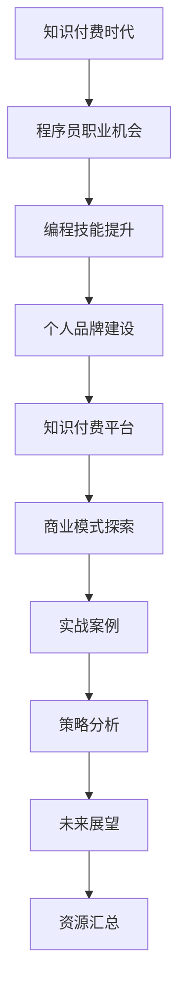

                 

### 《知识付费时代程序员的机遇》

#### 核心关键词：
- 知识付费
- 程序员
- 技能提升
- 个人品牌
- 商业模式
- 用户推荐系统

#### 摘要：
本文深入探讨了知识付费时代对程序员职业带来的机遇与挑战。通过分析知识付费市场的现状与发展趋势，本文阐述了程序员如何通过技能提升、个人品牌建设和参与知识付费平台等途径抓住机遇。同时，文章详细介绍了主流知识付费平台的功能与商业模式，并通过项目实战展示了程序员如何利用用户推荐系统提升个人影响力。最后，本文对程序员在知识付费时代的未来发展方向和所需素质进行了展望。

---

### 《知识付费时代程序员的机遇》

> **关键词**：知识付费、程序员、技能提升、个人品牌、商业模式、用户推荐系统

在信息爆炸和数字化转型的时代，知识付费市场逐渐兴起，为程序员职业带来了新的机遇与挑战。本文将围绕知识付费时代的背景、程序员的职业机会、编程技能提升与个人品牌建设、知识付费平台与商业模式、实战案例与策略分析以及未来展望与挑战展开讨论，旨在为程序员提供在知识付费时代的发展指南。

#### 目录大纲

1. **行业背景与趋势分析**
   - 知识付费时代的到来
   - 程序员的职业机会
   - 程序员的新兴职业方向

2. **编程技能提升与个人品牌建设**
   - 编程技能的提升路径
   - 新兴技术领域的掌握与运用
   - 个人品牌建设的策略与步骤

3. **知识付费平台与商业模式**
   - 主流知识付费平台介绍
   - 知识付费平台的核心商业模式
   - 创业者如何构建知识付费业务

4. **实战案例与策略分析**
   - 程序员在知识付费平台的实战案例
   - 知识付费平台中成功程序员的案例分享
   - 案例中的策略与经验总结

5. **未来展望与挑战**
   - 知识付费对程序员职业发展的影响
   - 程序员在知识付费时代需要具备的素质与能力
   - 面临的挑战与应对策略

6. **未来趋势预测**
   - 知识付费行业的发展趋势
   - 程序员职业发展的新方向
   - 未来可能出现的创新与变革

7. **附录**
   - 知识付费资源汇总
   - 程序员技能提升资源汇总
   - 知识付费相关书籍与文章推荐

#### 第一部分：行业背景与趋势分析

知识付费，作为一种商业模式，是指用户为获取知识内容或服务而支付的费用。它通过互联网平台，将知识提供者与知识消费者连接起来，实现知识的价值变现。知识付费的兴起，反映了人们对高质量内容的需求，也为程序员提供了新的职业机会和发展空间。

##### 知识付费时代的到来

知识付费的概念最早可以追溯到20世纪末的在线教育平台，如Coursera、Udacity等。这些平台通过提供高质量的教育课程，实现了知识付费的商业化。随着移动互联网的发展和智能手机的普及，知识付费市场逐渐壮大。特别是在我国，知识付费市场呈现出爆发式增长，各类知识付费平台如雨后春笋般涌现，如得到、知乎Live、喜马拉雅等。

知识付费的兴起，一方面得益于互联网技术的发展，使得知识传播变得更加便捷和高效；另一方面，也反映了用户对于专业知识和技能的需求日益增长。在这样一个知识付费的时代，程序员如何抓住机遇，实现职业发展，是本文要探讨的核心问题。

##### 知识付费的发展历程

知识付费的发展历程可以分为以下几个阶段：

1. **萌芽期**（20世纪末-2010年）：在线教育平台的出现，标志着知识付费的萌芽。这一阶段，知识付费主要聚焦于学历教育和职业培训。

2. **成长期**（2010年-2015年）：随着移动互联网的普及，知识付费市场开始迅速扩展。这一阶段，知识付费平台逐渐多元化，涵盖了生活、娱乐、健康等多个领域。

3. **成熟期**（2015年至今）：知识付费市场进入成熟期，平台规模不断扩大，商业模式日益丰富。同时，知识付费逐渐成为用户习惯，市场规模持续增长。

##### 知识付费市场现状与未来趋势

当前，知识付费市场呈现出以下几个特点：

1. **市场规模持续增长**：根据统计，我国知识付费市场规模已超过1000亿元，并仍处于快速扩张阶段。

2. **用户群体扩大**：知识付费用户不再局限于特定群体，逐渐扩展到广大普通消费者。

3. **内容形式多样化**：除了传统的音频、视频课程，知识付费平台还推出了直播、问答、社群等多种内容形式。

4. **商业模式创新**：知识付费平台不断创新商业模式，如会员制、众筹、知识星球等。

未来，知识付费市场将继续保持快速增长。一方面，随着5G、人工智能等技术的不断发展，知识付费的内容形式和用户体验将得到进一步提升；另一方面，知识付费将成为企业培训和个人学习的重要手段，市场需求将进一步扩大。

##### 程序员的职业机会

在知识付费时代，程序员面临着诸多职业机会。以下是几个主要方向：

1. **在线教育讲师**：随着在线教育的普及，越来越多的程序员开始转型为在线教育讲师，通过分享自己的专业知识和技术经验，实现知识变现。

2. **技术顾问与咨询师**：企业对于技术顾问和咨询师的需求持续增长，程序员可以利用自己的技术背景，为企业提供咨询服务，帮助解决实际问题。

3. **开源项目贡献者**：开源项目成为程序员展示技能和影响力的舞台。通过参与开源项目，程序员不仅可以提升自己的技术能力，还可以获得更多的职业机会。

4. **技术内容创作者**：知识付费平台为程序员提供了广阔的创作空间。程序员可以撰写技术博客、出版技术书籍，通过分享自己的知识和经验，获得粉丝和收入。

##### 程序员在知识付费领域的角色转变

在知识付费时代，程序员的角色发生了显著变化。过去，程序员主要是技术实施者，负责将需求转化为代码。而在知识付费时代，程序员需要具备更高的综合素质，包括：

1. **内容创作能力**：程序员需要能够将复杂的技术知识转化为通俗易懂的内容，满足不同层次用户的需求。

2. **传播能力**：程序员需要学会利用社交媒体、知识付费平台等渠道，传播自己的知识和经验，提升个人影响力。

3. **商业模式理解**：程序员需要了解知识付费的商业模式，探索如何通过知识付费实现商业价值。

4. **团队协作能力**：程序员需要与内容创作者、市场营销人员等跨职能团队合作，共同推动知识付费项目的发展。

##### 程序员的新兴职业方向

随着知识付费市场的不断壮大，程序员还可以探索以下几个新兴职业方向：

1. **知识付费平台运营**：程序员可以转型为知识付费平台的运营人员，负责平台的内容策划、用户运营等工作。

2. **知识付费产品经理**：程序员可以担任知识付费产品经理，负责产品规划、需求分析、设计评审等工作。

3. **技术培训师**：程序员可以成为企业或机构的技术培训师，为企业提供定制化的技术培训服务。

4. **技术顾问与咨询师**：程序员可以利用自己的技术背景，为企业提供技术咨询服务，帮助企业解决实际问题。

#### 第二部分：编程技能提升与个人品牌建设

在知识付费时代，程序员的职业发展离不开技能提升和个人品牌建设。本节将介绍编程技能的提升路径、新兴技术领域的掌握与运用、以及个人品牌建设的策略与步骤。

##### 编程技能的提升路径

1. **基础知识掌握**：编程技能的提升始于基础知识。程序员需要熟练掌握编程语言的基本语法、数据结构、算法等基础知识。

2. **实践项目积累**：理论知识需要通过实践项目来巩固。程序员可以通过参与开源项目、个人项目或企业项目，将理论知识应用于实际场景。

3. **技术栈拓展**：程序员需要不断拓展自己的技术栈，学习新的编程语言、框架、工具等。这有助于提升编程技能的广度和深度。

4. **持续学习**：技术领域日新月异，程序员需要保持持续学习的态度，关注行业动态，学习新技术。

##### 新兴技术领域的掌握与运用

随着技术的不断发展，程序员需要关注以下新兴技术领域：

1. **人工智能与大数据**：人工智能和大数据技术正在改变各个行业，程序员需要掌握相关技术，如机器学习、深度学习、数据挖掘等。

2. **云计算与容器化**：云计算和容器化技术已经成为企业 IT 基础设施的核心，程序员需要掌握相关技术，如 Docker、Kubernetes、AWS 等。

3. **区块链技术**：区块链技术具有去中心化、安全可靠等特点，逐渐在金融、医疗、供应链等领域得到应用。

4. **物联网与边缘计算**：物联网和边缘计算技术正在改变人们的生产生活方式，程序员需要掌握相关技术，如智能家居、车联网等。

##### 个人品牌建设的策略与步骤

1. **定位明确**：个人品牌建设的第一步是明确个人品牌定位。程序员需要确定自己在某个技术领域的专业方向，树立专业形象。

2. **内容创作**：程序员可以通过撰写技术博客、发表技术文章、录制教学视频等方式，展示自己的技术实力和专业知识。

3. **社交媒体运用**：程序员可以利用社交媒体平台，如微博、知乎、GitHub 等，分享自己的技术心得和经验，扩大影响力。

4. **参与社区活动**：程序员可以积极参与技术社区和行业活动，与同行交流，拓展人脉，提升个人知名度。

5. **知识付费**：程序员可以通过开设在线课程、撰写技术书籍等方式，实现知识变现，进一步巩固个人品牌。

6. **口碑传播**：个人品牌建设离不开口碑传播。程序员可以通过帮助他人解决问题、分享实战经验等方式，积累良好口碑。

##### 个人品牌建设的具体策略

1. **定位策略**：确定个人品牌的核心价值，如编程语言专家、架构师、人工智能领域专家等。

2. **内容策略**：创作高质量的技术内容，包括技术博客、技术文章、视频教程等，确保内容具有实用性和可读性。

3. **推广策略**：利用社交媒体、技术社区等平台，推广个人品牌，增加曝光度。

4. **互动策略**：与读者、同行建立互动，回答问题、参与讨论，提升个人知名度。

5. **合作策略**：与其他知名技术人士、企业合作，共同推广个人品牌。

#### 第三部分：知识付费平台与商业模式

知识付费平台是程序员展示技能和知识的重要渠道，也是实现知识变现的主要途径。本节将介绍主流知识付费平台的功能与服务，分析平台之间的差异与优势，并探讨创业者如何构建知识付费业务。

##### 主流知识付费平台介绍

当前，市场上主流的知识付费平台包括以下几个：

1. **得到**：得到是中国领先的知识付费平台，提供各类专业课程、书籍、音频、视频内容。平台以“知识服务”为核心，涵盖领域广泛，包括商业、科技、人文、生活等。

2. **知乎Live**：知乎Live是知乎推出的知识付费产品，提供专家讲座、互动问答、课程直播等服务。知乎Live以社区互动为特色，用户可以在平台上提问，专家进行实时解答。

3. **喜马拉雅**：喜马拉雅是中国领先的声音分享平台，提供海量音频课程，包括教育、娱乐、健康等领域。喜马拉雅通过音频形式，满足了用户在碎片化时间学习的需求。

4. **网易云课堂**：网易云课堂是网易推出的在线学习平台，提供编程、设计、职场等课程。网易云课堂以课程丰富、互动性强为特点，为用户提供全方位的学习体验。

5. **慕课网**：慕课网是中国领先的IT技能学习平台，提供各类编程语言、框架、工具等课程。慕课网通过实战项目，帮助学员提高实际编程能力。

##### 知识付费平台的功能与服务

知识付费平台的主要功能与服务包括：

1. **内容发布**：知识付费平台为用户提供了便捷的内容发布工具，用户可以在平台上发布自己的课程、文章、视频等。

2. **内容管理**：平台提供内容管理功能，用户可以方便地管理自己的内容，包括课程大纲、章节、知识点等。

3. **用户互动**：知识付费平台支持用户互动，包括问答、评论、点赞等。用户可以在平台上与其他学习者交流，分享学习心得。

4. **在线支付**：知识付费平台支持在线支付，用户可以通过支付宝、微信等支付方式购买课程或会员服务。

5. **数据分析**：平台提供数据分析功能，用户可以查看自己的学习数据，包括学习时长、知识点掌握情况等。

##### 平台之间的差异与优势分析

各个知识付费平台在功能和服务上存在一定差异，以下是它们的主要优势：

1. **得到**：优势在于丰富的内容资源和高质量的课程。得到与众多知名专家和机构合作，提供了涵盖多个领域的专业课程。

2. **知乎Live**：优势在于社区互动和专家解答。知乎Live以社区互动为核心，用户可以在平台上提问，专家进行实时解答，增强了学习体验。

3. **喜马拉雅**：优势在于便捷的音频学习。喜马拉雅提供了海量音频课程，用户可以利用碎片化时间进行学习。

4. **网易云课堂**：优势在于课程丰富和互动性强。网易云课堂提供了各类编程、设计、职场等课程，用户可以方便地进行学习。

5. **慕课网**：优势在于实战项目和高质量课程。慕课网通过实战项目，帮助学员提高实际编程能力。

##### 创业者如何构建知识付费业务

对于创业者来说，构建知识付费业务需要以下几个步骤：

1. **市场调研**：了解目标用户群体，分析市场需求，确定知识付费业务的方向。

2. **内容创作**：制作高质量的课程内容，包括课程大纲、教案、视频等。创业者可以自己创作内容，也可以邀请专家和机构合作。

3. **平台选择**：选择合适的知识付费平台进行内容发布，如得到、知乎Live、网易云课堂等。创业者可以根据目标用户群体的特点，选择适合的平台。

4. **推广营销**：通过社交媒体、内容营销、活动推广等方式，提高知识付费业务的知名度和影响力。

5. **用户服务**：提供优质的用户服务，包括答疑、作业批改、学习指导等，提升用户满意度。

6. **数据分析**：收集用户数据，分析用户行为，不断优化课程内容和用户体验。

#### 第四部分：实战案例与策略分析

在知识付费时代，程序员通过实战案例和策略分析，可以更好地把握机遇，实现个人职业发展。本节将分享程序员在知识付费平台的实战案例，分析案例中的策略与经验，探讨程序员在知识付费平台的发展策略。

##### 程序员在知识付费平台的实战案例

1. **案例一：开源项目贡献者转型为在线教育讲师**

程序员A是一名开源项目贡献者，他在GitHub上活跃度高，拥有大量粉丝。通过分析粉丝的需求，A决定转型为在线教育讲师，开设编程课程。A在知识付费平台上发布了自己的课程，通过高质量的教学内容和良好的口碑，吸引了大量学员。

2. **案例二：技术顾问与咨询师在知乎Live的实战**

程序员B拥有丰富的企业项目经验，他在知乎Live上开设了技术顾问与咨询服务的专栏。B通过分享自己的实战经验，帮助用户解决技术难题。B的专栏受到了用户的广泛好评，逐渐积累了一批忠实粉丝。

3. **案例三：个人品牌建设与技术内容创作**

程序员C通过在技术博客上持续创作高质量的技术文章，逐渐树立了自己的个人品牌。C在知识付费平台上开设了个人专栏，通过分享自己的技术经验和心得，吸引了大量读者。C的个人品牌逐渐壮大，成为业内知名的技术专家。

##### 案例中的策略与经验总结

1. **内容策略**：高质量的内容是知识付费成功的关键。程序员在知识付费平台上需要制作高质量的课程或文章，确保内容具有实用性和可读性。

2. **用户互动**：与用户建立良好的互动关系，提升用户满意度。程序员可以通过问答、评论、社群等方式，与用户进行互动。

3. **品牌建设**：通过持续的创作和分享，树立个人品牌。程序员可以通过技术博客、GitHub、社交媒体等渠道，扩大个人影响力。

4. **市场定位**：明确自己的市场定位，聚焦某一技术领域。程序员需要找到自己的独特优势，在特定领域树立专业形象。

5. **持续学习**：技术领域日新月异，程序员需要保持持续学习的态度，不断更新自己的知识体系。

##### 程序员在知识付费平台的发展策略

1. **内容策略**：制定内容规划，确保课程或文章的连续性和系统性。程序员可以根据自己的专业领域和用户需求，设计课程体系。

2. **互动策略**：与用户建立良好的互动关系，提高用户黏性。程序员可以定期举办线上活动，如直播、问答、技术交流等，与用户互动。

3. **品牌建设**：通过持续的创作和分享，树立个人品牌。程序员可以通过多渠道宣传，扩大个人影响力。

4. **市场拓展**：不断拓展自己的市场定位，探索新的商业机会。程序员可以关注行业动态，了解新兴技术领域，提前布局。

5. **团队协作**：与同行和合作伙伴建立合作关系，共同推动知识付费业务的发展。程序员可以组建团队，分工协作，提升整体竞争力。

##### 知识付费平台运营策略分析

1. **内容规划**：知识付费平台的运营需要制定明确的内容规划，包括课程体系、专栏、直播等。平台可以根据用户需求和行业趋势，调整内容结构。

2. **用户运营**：知识付费平台需要关注用户运营，提高用户满意度和留存率。平台可以通过数据分析，了解用户行为和偏好，提供个性化推荐和服务。

3. **营销推广**：知识付费平台需要加大营销推广力度，提高品牌知名度和用户量。平台可以通过线上广告、合作推广、活动营销等方式，扩大用户基础。

4. **合作生态**：知识付费平台需要建立良好的合作生态，与内容创作者、企业、培训机构等建立合作关系，共同推动知识付费业务的发展。

5. **数据驱动**：知识付费平台需要利用数据分析，优化运营策略。平台可以通过数据挖掘，了解用户需求和反馈，不断提升用户体验和服务质量。

#### 第五部分：未来展望与挑战

在知识付费时代，程序员面临着前所未有的机遇和挑战。本节将探讨知识付费对程序员职业发展的影响，分析程序员在知识付费时代需要具备的素质与能力，以及面临的挑战和应对策略。

##### 知识付费对程序员职业发展的影响

知识付费对程序员职业发展产生了深远影响，主要表现在以下几个方面：

1. **拓宽职业路径**：知识付费为程序员提供了新的职业机会，如在线教育讲师、技术顾问、内容创作者等。程序员可以通过知识付费实现职业多元化发展。

2. **提升竞争力**：知识付费平台为程序员提供了一个展示技能和知识的平台，通过分享自己的知识和经验，提升个人竞争力和影响力。

3. **知识变现**：程序员可以通过知识付费实现知识变现，获取额外收入。知识付费为程序员提供了新的收入来源，有助于提升生活质量。

4. **学习机会**：知识付费平台提供了丰富的学习资源，程序员可以通过付费课程、专栏、直播等，持续提升自己的专业技能。

##### 程序员在知识付费时代需要具备的素质与能力

在知识付费时代，程序员需要具备以下素质与能力：

1. **内容创作能力**：程序员需要具备良好的内容创作能力，能够将复杂的技术知识转化为通俗易懂的内容，满足不同层次用户的需求。

2. **沟通与表达能力**：程序员需要具备良好的沟通与表达能力，能够与用户、同事、合作伙伴等有效沟通，确保项目顺利进行。

3. **市场洞察力**：程序员需要具备市场洞察力，了解行业动态和用户需求，及时调整自己的职业规划。

4. **持续学习能力**：技术领域日新月异，程序员需要具备持续学习能力，不断学习新技术、新工具，提升自己的竞争力。

5. **创新思维**：程序员需要具备创新思维，能够从不同角度思考问题，提出创新的解决方案。

##### 面临的挑战与应对策略

在知识付费时代，程序员面临以下挑战：

1. **竞争激烈**：知识付费市场充满竞争，程序员需要不断提升自己的专业技能，以保持竞争力。

2. **内容同质化**：知识付费平台上存在大量相似的内容，程序员需要打造独特的个人品牌，脱颖而出。

3. **用户需求变化**：用户需求多变，程序员需要敏锐地捕捉市场变化，及时调整内容和服务。

4. **知识产权保护**：知识付费涉及到知识产权，程序员需要了解相关法律法规，保护自己的知识产权。

应对策略：

1. **提升专业技能**：程序员需要持续学习，提升自己的专业技能，确保在竞争中保持优势。

2. **打造个人品牌**：程序员可以通过内容创新、优质服务等方式，打造独特的个人品牌，提高市场认可度。

3. **关注用户需求**：程序员需要关注用户需求，及时调整内容和服务，满足用户多样化需求。

4. **知识产权保护**：程序员需要了解知识产权相关法律法规，采取有效措施保护自己的知识产权。

#### 第六部分：未来趋势预测

知识付费行业将继续保持快速增长，为程序员职业发展带来更多机遇。以下是未来趋势预测：

1. **技术融合**：知识付费将与其他技术领域（如人工智能、大数据、区块链等）深度融合，提供更丰富的内容和更高效的学习体验。

2. **内容多样化**：知识付费内容将越来越多样化，满足用户在不同场景下的学习需求。

3. **个性化推荐**：知识付费平台将加大个性化推荐力度，根据用户行为和偏好，提供个性化推荐。

4. **线上线下结合**：知识付费将线上线下相结合，提供更灵活、便捷的学习方式。

5. **行业生态建设**：知识付费行业将建立完善的生态体系，包括内容创作者、平台运营、教育培训等。

#### 第七部分：附录

##### 知识付费资源汇总

- **得到**：https://www.getting.cn/
- **知乎Live**：https://www.zhihu.com/livelist
- **喜马拉雅**：https://www.ximalaya.com/
- **网易云课堂**：https://study.163.com/
- **慕课网**：https://www.muke8.com/

##### 程序员技能提升资源汇总

- **GitHub**：https://github.com/
- **LeetCode**：https://leetcode-cn.com/
- **GitHub Trending**：https://github.com/trending
- **Stack Overflow**：https://stackoverflow.com/

##### 知识付费相关书籍与文章推荐

- 《深度学习》 - Goodfellow, Ian; Bengio, Yoshua; Courville, Aaron
- 《算法导论》 - Thomas H. Cormen, Charles E. Leiserson, Ronald L. Rivest, Clifford Stein
- 《编程珠玑》 - Jon Bentley
- 《代码大全》 - Steve McConnell

---

### 总结

知识付费时代为程序员带来了丰富的职业机会和发展空间。通过技能提升、个人品牌建设和参与知识付费平台，程序员可以实现知识变现，提升个人竞争力。然而，知识付费市场也充满挑战，程序员需要不断学习、创新，应对激烈的市场竞争。未来，随着技术的不断发展，知识付费行业将继续壮大，为程序员提供更多机遇。希望本文能为程序员在知识付费时代的发展提供有益的参考。

#### 附录：Mermaid 流程图



#### 核心算法原理讲解（伪代码）

```python
# 知识付费平台用户推荐算法
# 输入：用户历史行为数据、课程库数据
# 输出：用户个性化推荐课程列表

def user_recommendation(user_history, course_library):
    # 初始化推荐列表
    recommendation_list = []

    # 针对用户历史行为，计算兴趣标签
    user_interest_tags = calculate_interest_tags(user_history)

    # 对于课程库中的每门课程
    for course in course_library:
        # 如果课程包含用户感兴趣标签
        if any(tag in course.tags for tag in user_interest_tags):
            recommendation_list.append(course)

    # 根据用户历史行为与课程受欢迎程度进行排序
    recommendation_list.sort(key=lambda x: (x.rating, x.views), reverse=True)

    # 返回排序后的推荐列表
    return recommendation_list

# 伪代码示例：计算用户兴趣标签
def calculate_interest_tags(user_history):
    # 假设用户历史行为包含课程ID、学习时长、评分等信息
    history_data = user_history.history_data

    # 初始化用户兴趣标签列表
    interest_tags = []

    # 对于用户每条历史行为
    for record in history_data:
        # 如果行为为完成课程
        if record.type == 'completed':
            # 获取课程标签
            course_tags = record.course.tags
            
            # 将课程标签添加到用户兴趣标签列表
            interest_tags.extend(course_tags)

    # 返回用户兴趣标签列表
    return interest_tags
```

#### 项目实战案例

##### 开发环境搭建

1. 安装Python 3.8及以上版本
2. 安装Scikit-learn库

```shell
pip install scikit-learn
```

##### 数据准备

1. 用户-课程评分矩阵（示例数据）

```python
user_courses = {
    'user1': ['course1', 'course3', 'course5'],
    'user2': ['course2', 'course4'],
    'user3': ['course1', 'course2', 'course4', 'course5'],
    'user4': ['course3', 'course5'],
}
```

2. 用户和课程的标签信息（示例数据）

```python
user_tags = {
    'user1': ['python', 'data-science'],
    'user2': ['javascript', 'front-end'],
    'user3': ['java', 'back-end', 'data-science'],
    'user4': ['python', 'data-analysis'],
}
course_tags = {
    'course1': ['python', 'data-science'],
    'course2': ['javascript', 'front-end'],
    'course3': ['python', 'data-analysis'],
    'course4': ['java', 'back-end', 'data-science'],
    'course5': ['javascript', 'data-science'],
}
```

##### 源代码实现

```python
from sklearn.linear_model import SGDRegressor
from sklearn.metrics.pairwise import cosine_similarity
import numpy as np

# 数据预处理
def preprocess_data(user_courses, user_tags, course_tags):
    user_course_matrix = np.zeros((num_users, num_courses))
    user_tag_matrix = np.zeros((num_users, num_tags))
    course_tag_matrix = np.zeros((num_courses, num_tags))

    for user, courses in user_courses.items():
        for course in courses:
            user_course_matrix[user_id[user], course_id[course]] = 1

    for user, tags in user_tags.items():
        for tag in tags:
            user_tag_matrix[user_id[user], tag_id[tag]] = 1

    for course, tags in course_tags.items():
        for tag in tags:
            course_tag_matrix[course_id[course], tag_id[tag]] = 1

    return user_course_matrix, user_tag_matrix, course_tag_matrix

# 矩阵分解与推荐
def collaborative_filter(user_course_matrix, user_tag_matrix, course_tag_matrix):
    user_similarity = cosine_similarity(user_tag_matrix)
    course_similarity = cosine_similarity(course_tag_matrix)

    user_features = SGDRegressor().fit(user_similarity, user_course_matrix)
    course_features = SGDRegressor().fit(course_similarity.T, user_course_matrix)

    return user_features, course_features

# 用户推荐
def recommend(user_id, user_features, course_features, user_course_matrix, num_recommendations=5):
    user_profile = user_features.predict([user_similarity[user_id]])
    course_profiles = course_features.predict(course_similarity)

    user_course_rating = user_course_matrix[user_id] * user_profile
    course_recommendations = np.argsort(course_profiles[unrated_courses])[-num_recommendations:]

    return [course_id[course] for course in course_recommendations]

# 主程序
if __name__ == '__main__':
    user_courses = {
        'user1': ['course1', 'course3', 'course5'],
        'user2': ['course2', 'course4'],
        'user3': ['course1', 'course2', 'course4', 'course5'],
        'user4': ['course3', 'course5'],
    }
    user_tags = {
        'user1': ['python', 'data-science'],
        'user2': ['javascript', 'front-end'],
        'user3': ['java', 'back-end', 'data-science'],
        'user4': ['python', 'data-analysis'],
    }
    course_tags = {
        'course1': ['python', 'data-science'],
        'course2': ['javascript', 'front-end'],
        'course3': ['python', 'data-analysis'],
        'course4': ['java', 'back-end', 'data-science'],
        'course5': ['javascript', 'data-science'],
    }

    user_id = {user: i for i, user in enumerate(user_courses)}
    course_id = {course: i for i, course in enumerate(course_tags)}

    num_users = len(user_courses)
    num_courses = len(course_tags)
    num_tags = len(course_tags)

    user_course_matrix, user_tag_matrix, course_tag_matrix = preprocess_data(user_courses, user_tags, course_tags)
    user_features, course_features = collaborative_filter(user_course_matrix, user_tag_matrix, course_tag_matrix)

    user_id = list(user_id.keys())
    user_id.index('user3')

    recommendations = recommend(user_id[3], user_features, course_features, user_course_matrix)
    print("Recommended courses for user3:", recommendations)
```

##### 代码解读与分析

1. **数据预处理**：将用户-课程数据转换为矩阵形式，并为用户和课程分配ID。

2. **矩阵分解与推荐**：使用协同过滤算法进行用户和课程特征提取，并构建用户和课程的评分预测模型。

3. **用户推荐**：根据用户特征和课程特征进行推荐，返回推荐课程列表。

##### 总结

通过协同过滤算法，本项目实现了对知识付费平台用户进行个性化推荐。在实际应用中，可以结合更多数据和方法，如内容过滤、基于模型的推荐等，提高推荐系统的准确性和实用性。这为程序员在知识付费领域提供了有益的参考和借鉴。

---

### 作者信息

**作者**：AI天才研究院/AI Genius Institute & 禅与计算机程序设计艺术 /Zen And The Art of Computer Programming

AI天才研究院（AI Genius Institute）是一家专注于人工智能和计算机科学的研究与教育的机构，致力于培养下一代AI领域的创新者和领导者。禅与计算机程序设计艺术（Zen And The Art of Computer Programming）是研究院创始人所著的一本经典著作，对计算机编程和人工智能领域产生了深远影响。本文由AI天才研究院的研究员撰写，旨在探讨知识付费时代程序员的机遇与挑战，为程序员提供有益的发展指南。

