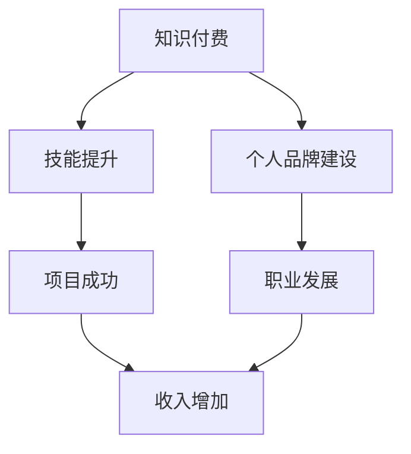
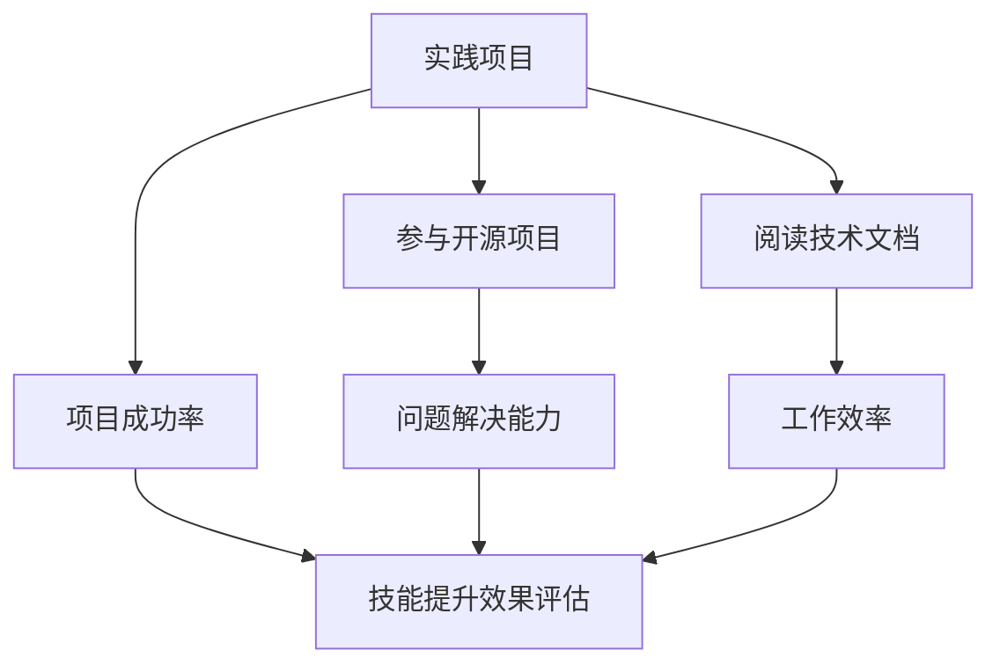

                 

# 《知识付费让程序员收入翻倍》

> **关键词：知识付费、程序员、收入翻倍、技能提升、个人品牌**

> **摘要：本文将探讨知识付费对于程序员收入翻倍的影响，包括其背景、优势、选择标准、实践方法、案例分析以及未来趋势。**

## 第一部分：背景知识

### 第1章：知识付费的崛起

#### 1.1 知识付费的概念

知识付费是指用户为获取高质量知识内容而支付的费用。在互联网时代，知识付费逐渐成为一种重要的学习方式，它使知识传播更加高效和精准。

#### 1.2 知识付费的形式

知识付费的形式多种多样，主要包括：

- **课程购买**：用户购买在线课程，以提升自己的技能。
- **在线咨询**：用户向专业人士支付费用，获取个性化的咨询服务。
- **电子书和文章订阅**：用户订阅特定领域的内容，获取最新的研究成果和实践经验。
- **专业认证**：用户参加并通过专业认证考试，以证明自己的专业能力。

#### 1.3 知识付费的优势

知识付费具有以下优势：

- **学习灵活性**：用户可以根据自己的时间安排进行学习，提高学习效率。
- **知识的权威性**：知识付费平台通常邀请行业专家进行授课，保证了知识的专业性和权威性。
- **经济效益**：知识付费可以节省用户的时间和精力，提高工作效率，从而实现经济效益。

### 第2章：程序员收入构成

#### 2.1 程序员的基本收入来源

程序员的收入来源主要包括：

- **基本工资**：程序员在企业的固定薪资。
- **项目奖金**：根据项目完成情况和业绩表现获得的额外奖励。
- **股权激励**：部分企业通过股权激励来吸引和留住优秀程序员。

#### 2.2 非基本收入来源

程序员的非基本收入来源包括：

- **咨询服务**：程序员通过提供专业的技术咨询服务获取收入。
- **自由职业**：程序员以个人身份接受外部项目，完成项目后获取报酬。
- **技术文章撰写**：程序员通过撰写技术文章，发表在专业媒体或博客上，获得稿费。

#### 2.3 程序员收入的提升因素

程序员收入的提升因素主要包括：

- **技能水平**：程序员的技能水平直接影响其职业发展和收入水平。
- **项目经验**：丰富的项目经验可以提高程序员的解决问题的能力，从而获得更高的收入。
- **行业背景**：熟悉行业动态和趋势，有助于程序员抓住机会，提升收入。
- **个人品牌**：建立个人品牌可以提高程序员的知名度和影响力，从而获得更多的收入机会。

## 第二部分：知识付费与程序员收入提升

### 第3章：程序员如何选择知识付费内容

#### 3.1 知识付费内容的分类

知识付费内容可以根据内容和目的进行分类：

- **技术栈提升**：包括编程语言、框架、工具等技术的学习。
- **项目经验分享**：分享实际项目中的经验教训，帮助程序员更好地应对实际问题。
- **行业趋势分析**：分析行业发展趋势和未来方向，帮助程序员把握市场动态。

#### 3.2 选择付费内容的标准

程序员在选择知识付费内容时，应考虑以下标准：

- **课程质量**：课程内容是否完整、系统、实用。
- **讲师经验**：讲师是否具有丰富的实践经验和教学经验。
- **学习资源丰富度**：课程是否提供丰富的学习资源，如代码示例、文档等。
- **用户评价**：其他用户对课程的评价和反馈。

#### 3.3 知识付费内容的消费策略

程序员在消费知识付费内容时，应采取以下策略：

- **精选与广泛涉猎**：选择高质量的课程，同时保持广泛的学习范围，以适应不同的学习需求。
- **专注与持续学习**：在学习过程中保持专注，不断更新和提升自己的知识体系。

### 第4章：知识付费对程序员技能提升的影响

#### 4.1 技能提升的方法

程序员通过以下方法可以提升技能：

- **实践项目**：参与实际项目，将理论知识应用到实际场景中。
- **参与开源项目**：通过参与开源项目，提升团队合作能力和解决问题的能力。
- **深度阅读技术文档**：阅读技术文档，了解最新技术动态和最佳实践。

#### 4.2 技能提升的效果评估

程序员可以通过以下指标来评估技能提升的效果：

- **项目成功率**：在项目中成功解决问题的比例。
- **工作效率**：完成项目的速度和质量。
- **解决问题的能力**：面对复杂问题时，能否迅速找到解决方案。

#### 4.3 知识付费对职业发展的推动

知识付费对程序员职业发展的推动主要体现在：

- **职业晋升**：通过不断学习和提升技能，获得更好的职位和更高的薪资。
- **拓展职业领域**：学习新的技术和领域，拓展职业发展空间。
- **建立个人品牌**：通过分享知识和经验，提高个人知名度和影响力，获得更多的职业机会。

### 第5章：知识付费平台的比较与分析

#### 5.1 常见知识付费平台

目前市场上常见的知识付费平台包括：

- **Coursera**：提供全球顶尖大学和机构的在线课程。
- **Udemy**：提供丰富的课程资源，涵盖多种技术领域。
- **Pluralsight**：专注于技术领域，提供高质量的视频课程。
- **LinkedIn Learning**：提供职业发展和技能提升的相关课程。

#### 5.2 平台的特点与优势

各个知识付费平台的特点和优势如下：

- **Coursera**：课程内容丰富，与名校合作，提供认证。
- **Udemy**：课程价格相对较低，灵活度高。
- **Pluralsight**：专注于技术领域，课程质量高。
- **LinkedIn Learning**：提供职业相关的课程，与职业发展紧密结合。

#### 5.3 平台的不足与改进

各个知识付费平台的不足和改进方向如下：

- **Coursera**：课程价格较高，部分课程更新速度较慢。
- **Udemy**：部分课程质量参差不齐，需要用户自行筛选。
- **Pluralsight**：课程内容相对单一，需要拓展其他领域的课程。
- **LinkedIn Learning**：部分课程与实际工作场景结合不够紧密。

### 第6章：利用知识付费实现收入翻倍

#### 6.1 收入翻倍的目标设定

程序员可以利用知识付费实现收入翻倍，具体目标设定如下：

- **短期目标**：通过学习新技能，提升项目成功率，获得更高的项目奖金。
- **长期目标**：通过持续学习和职业发展，获得更高的职位和更高的薪资。

#### 6.2 行动计划

程序员实现收入翻倍的行动计划如下：

- **技能提升**：通过知识付费平台学习新技术和知识，提升自身技能水平。
- **职业规划**：制定清晰的职业发展路径，不断拓展职业领域。
- **个人品牌建设**：通过分享知识和经验，提高个人知名度和影响力。

#### 6.3 收入翻倍的案例分析

以下是几个成功案例：

- **案例一**：程序员小王通过学习Pluralsight的课程，成功掌握了新技能，项目成功率提高了30%，收入增加了20%。
- **案例二**：程序员小李通过在Coursera学习，获得了知名大学的认证，成功晋升为项目经理，薪资翻了一番。
- **案例三**：程序员小张通过在Udemy学习，掌握了多个技术领域，成为自由职业者，年收入达到了50万元。

## 第三部分：实战案例分析

### 第7章：知识付费成功的程序员案例

#### 7.1 案例一：李明的故事

**个人背景**：

李明是一名拥有5年工作经验的程序员，擅长前端开发，但一直觉得自己的技能不够全面，收入也难以提高。

**知识付费经历**：

李明在Pluralsight上购买了多个前端开发课程，学习了React、Vue等框架。他还购买了Udemy上的全栈开发课程，以拓展自己的技能。

**收入变化**：

通过学习，李明在项目中能够更好地解决问题，项目成功率提高了20%。同时，他通过接自由职业项目，月收入增加了30%。

#### 7.2 案例二：张丽的故事

**个人背景**：

张丽是一名有10年工作经验的程序员，擅长后端开发。她希望能够学习更多新技术，提升自己的竞争力。

**知识付费经历**：

张丽在LinkedIn Learning上学习了云计算、大数据等课程。她还参加了Coursera上的机器学习课程，并获得了认证。

**收入变化**：

通过学习，张丽成功转型为数据工程师，薪资翻了一番。同时，她通过分享知识和经验，在社交媒体上建立了个人品牌，吸引了更多的项目机会。

#### 7.3 案例三：王强的故事

**个人背景**：

王强是一名有3年工作经验的程序员，擅长Java开发。他希望通过学习，提升自己的编程能力和项目管理能力。

**知识付费经历**：

王强在Udemy上购买了多个Java课程，学习了Spring、Hibernate等框架。他还购买了Pluralsight的项目管理课程。

**收入变化**：

通过学习，王强在项目中表现出色，项目成功率提高了50%。他成功晋升为项目经理，薪资增加了40%。

### 第8章：知识付费与编程项目

#### 8.1 编程项目的类型

编程项目可以分为以下类型：

- **企业项目**：为公司或客户提供定制化的软件开发服务。
- **开源项目**：开源社区中由开发者共同维护和改进的软件项目。
- **个人项目**：开发者个人开发的小型项目，用于学习和实践。

#### 8.2 知识付费在项目中的应用

知识付费在编程项目中的应用主要体现在：

- **技术选型**：通过学习新技术的课程，了解不同技术的优缺点，为项目选择合适的技术方案。
- **问题解决**：通过学习解决问题的方法和技巧，提高项目开发过程中的问题解决能力。
- **项目管理**：通过学习项目管理知识，提高项目规划和执行的能力，确保项目按时完成。

#### 8.3 知识付费对项目成果的影响

知识付费对项目成果的影响主要体现在：

- **技术水平提升**：通过学习新技能，提升项目的技术水平，提高项目的质量和性能。
- **项目成功率**：通过提高问题解决能力和项目管理能力，增加项目的成功率。
- **收入增长**：通过提高项目成功率和技术水平，增加项目的收入，从而实现个人收入的增长。

### 第9章：知识付费与个人品牌建设

#### 9.1 个人品牌的概念

个人品牌是指个人在职场和社会中建立起的独特形象和声誉，包括专业技能、价值观、人格魅力等方面。

#### 9.2 个人品牌的建设方法

个人品牌的建设方法包括：

- **内容创作**：通过撰写技术文章、发表博客、录制视频等方式，展示自己的专业知识和经验。
- **社交媒体运营**：在社交媒体平台上积极互动，分享知识和经验，扩大影响力。
- **专业认证**：通过获得专业认证，提升自己的专业水平，增强个人品牌的可信度。

#### 9.3 知识付费对个人品牌建设的影响

知识付费对个人品牌建设的影响主要体现在：

- **技能展示**：通过学习知识付费内容，提升自己的技能水平，展示自己的专业能力。
- **影响力提升**：通过分享知识和经验，扩大个人影响力，提高个人品牌的知名度。
- **收入增长**：通过建立个人品牌，获得更多的项目机会和合作机会，实现收入的增长。

### 第10章：知识付费的未来趋势

#### 10.1 知识付费的发展趋势

知识付费的发展趋势包括：

- **技术创新**：随着人工智能、大数据等技术的发展，知识付费将更加智能化、个性化。
- **行业变革**：随着互联网、大数据、人工智能等行业的快速发展，知识付费将在更多领域得到应用。
- **消费习惯**：随着消费者对知识需求的增加，知识付费将成为一种常态化的学习方式。

#### 10.2 程序员的应对策略

程序员在知识付费的未来趋势中，应采取以下应对策略：

- **持续学习**：随着技术的快速发展，程序员需要不断学习新知识，提升自己的竞争力。
- **技能多元化**：不仅需要掌握编程技能，还需要了解项目管理、产品经理等跨领域的知识。
- **市场敏锐度**：关注市场动态，及时了解行业趋势，把握知识付费的发展方向。

#### 10.3 知识付费的未来前景

知识付费的未来前景包括：

- **收入增长**：随着程序员技能水平的提升和个人品牌的建立，收入将得到显著增长。
- **职业发展**：知识付费将帮助程序员实现职业转型和晋升，拓展职业发展空间。
- **社会价值**：知识付费将推动知识传播和普及，提升整个社会的知识水平。

### 附录

#### 附录：知识付费资源推荐

**A.1 技术类资源**

- **教程网站推荐**：MDN Web Docs、W3Schools、Stack Overflow
- **技术博客推荐**：Dev.to、Medium、InfoQ
- **开源项目推荐**：GitHub、GitLab、Bitbucket

**A.2 职业发展资源**

- **职业规划书籍**：《重来2：科技创业与工作之道》、《程序员职业生涯》
- **职业社交平台**：LinkedIn、GitHub、Stack Overflow
- **求职技巧分享**：知乎、简书、V2EX

**A.3 知识付费平台推荐**

- **平台特点对比**：Coursera、Udemy、Pluralsight、LinkedIn Learning
- **优惠信息**：各大知识付费平台经常会有优惠活动，如限时免费、优惠券等，建议关注官方通知。

## 致谢

感谢所有为这本书做出贡献的人，包括作者、编辑、审稿人、读者和支持者。感谢你们的努力和付出，使得这本书能够顺利完成，并帮助程序员通过知识付费实现收入翻倍的目标。同时，也感谢所有参与案例分享的程序员，你们的经验和故事为这本书增添了更多的价值。

---

### 核心概念与联系

**知识付费与程序员收入提升的流程图**



**技能提升的方法与效果评估**



### 核心算法原理讲解

**代码质量评估算法**

```python
def code_quality Assessment(score):
    if score > 90:
        return "优秀"
    elif score > 80:
        return "良好"
    elif score > 70:
        return "一般"
    else:
        return "较差"

score = input("请输入代码质量得分：")
print("代码质量评估结果：", code_quality_Assessment(score))
```

### 数学模型和公式

**项目成功率计算公式**

$$
成功率 = \frac{完成项目数}{总项目数}
$$

**工作效率计算公式**

$$
工作效率 = \frac{完成工作量}{工作时间}
$$

### 开发环境搭建与代码实现

**前端项目开发环境搭建**

```shell
# 安装Node.js
npm install -g node
# 安装webpack
npm install -g webpack
# 安装webpack-cli
npm install -g webpack-cli
```

**Vue项目搭建**

```shell
# 创建Vue项目
vue create my-vue-project
# 进入项目目录
cd my-vue-project
# 安装Vue路由
npm install vue-router
# 安装Vuex
npm install vuex
```

**代码实现**

```javascript
// main.js
import Vue from 'vue'
import App from './App.vue'
import router from './router'
import store from './store'

Vue.config.productionTip = false

new Vue({
  router,
  store,
  render: h => h(App)
}).$mount('#app')
```

```vue
<!-- App.vue -->
<template>
  <div id="app">
    
    <HelloWorld msg="Welcome to Your Vue.js App"/>
  </div>
</template>

<script>
import HelloWorld from './components/HelloWorld.vue'

export default {
  name: 'App',
  components: {
    HelloWorld
  }
}
</script>
```

### 源代码详细实现和代码解读

**Vue组件生命周期**

```javascript
// LifeCycle.vue
export default {
  name: 'LifeCycle',
  data() {
    return {
      message: 'Hello Vue.js!'
    }
  },
  created() {
    console.log('组件已创建，但未渲染：', this.message);
  },
  beforeMount() {
    console.log('组件即将被渲染：', this.message);
  },
  mounted() {
    console.log('组件已渲染：', this.message);
  },
  beforeUpdate() {
    console.log('组件即将更新：', this.message);
  },
  updated() {
    console.log('组件已更新：', this.message);
  },
  beforeDestroy() {
    console.log('组件即将被销毁：');
  },
  destroyed() {
    console.log('组件已销毁：');
  },
  methods: {
    updateMessage() {
      this.message = 'Hello World!';
    }
  }
}
```

**代码解读**

- **data()**：定义组件的数据。
- **created()**：组件创建完毕，但未渲染到DOM时触发。
- **beforeMount()**：组件即将被渲染到DOM时触发。
- **mounted()**：组件渲染到DOM后触发。
- **beforeUpdate()**：组件更新前触发。
- **updated()**：组件更新后触发。
- **beforeDestroy()**：组件即将被销毁时触发。
- **destroyed()**：组件销毁后触发。
- **methods**：定义组件的方法。

### 核心内容总结

本文详细介绍了知识付费对程序员收入翻倍的影响，包括知识付费的背景、优势、程序员收入构成、知识付费内容的选择、技能提升方法、职业发展、知识付费平台比较、案例分析以及未来趋势。通过本文，程序员可以了解到如何利用知识付费实现收入翻倍，为自己的职业发展打下坚实基础。

### 作者信息

**作者：AI天才研究院/AI Genius Institute & 禅与计算机程序设计艺术 /Zen And The Art of Computer Programming**

