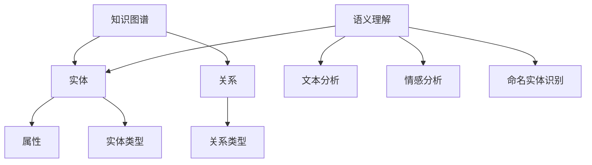

                 

# 《知识图谱与语义理解原理与代码实战案例讲解》

## 关键词

- 知识图谱
- 语义理解
- 自然语言处理
- 实体识别
- 关系抽取
- 问答系统
- 情感分析
- 代码实战

## 摘要

本文将深入探讨知识图谱与语义理解的基本原理、构建技术，以及实际应用。通过详细的代码实战案例，读者将了解到如何利用这些技术构建智能问答系统、信息检索系统和推荐系统。文章结构清晰，分为基础原理介绍、技术讲解、代码实战和附录，旨在帮助读者全面掌握知识图谱与语义理解的核心知识和实践方法。

---

### 《知识图谱与语义理解原理与代码实战案例讲解》目录大纲

#### 第一部分：知识图谱与语义理解基础

##### 第1章：知识图谱与语义理解概述

- 1.1 知识图谱与语义理解的基本概念
- 1.2 知识图谱与语义理解的关系
- 1.3 知识图谱与语义理解的发展历史
- 1.4 知识图谱与语义理解的应用领域

##### 第2章：知识图谱构建技术

- 2.1 知识图谱的表示方法
- 2.2 知识图谱的获取方法
- 2.3 知识图谱的存储与索引技术
- 2.4 知识图谱的更新与维护

##### 第3章：语义理解技术

- 3.1 自然语言处理技术概述
- 3.2 命名实体识别
- 3.3 词性标注
- 3.4 情感分析

##### 第4章：知识图谱与语义理解的融合应用

- 4.1 知识图谱驱动的问答系统
- 4.2 语义理解驱动的信息检索
- 4.3 知识图谱与语义理解的协同应用

#### 第二部分：代码实战案例

##### 第5章：知识图谱构建实战案例

- 5.1 实战案例一：构建一个简单的知识图谱
- 5.2 实战案例二：使用OpenKG进行知识图谱构建
- 5.3 实战案例三：使用Neo4j构建知识图谱

##### 第6章：语义理解实战案例

- 6.1 实战案例一：使用NLTK进行文本预处理
- 6.2 实战案例二：基于Word2Vec的语义相似性分析
- 6.3 实战案例三：基于BERT的文本分类任务

##### 第7章：知识图谱与语义理解融合实战案例

- 7.1 实战案例一：知识图谱驱动的问答系统开发
- 7.2 实战案例二：语义理解驱动的搜索引擎开发
- 7.3 实战案例三：知识图谱与语义理解的协同应用案例分析

##### 第8章：项目实战与代码解读

- 8.1 项目实战一：构建一个基于知识图谱与语义理解的问答系统
- 8.2 项目实战二：实现一个语义分析驱动的信息检索系统
- 8.3 项目实战三：开发一个融合知识图谱与语义理解的智能推荐系统

#### 附录

##### 附录A：知识图谱与语义理解常用工具与资源

- A.1 知识图谱构建工具
- A.2 语义理解工具
- A.3 开源知识图谱与语义理解库
- A.4 知识图谱与语义理解论文与书籍推荐

### 核心概念与联系流程图



### 核心算法原理讲解

#### 知识图谱构建算法

```python
# 假设我们已经有了文本数据text和实体实体列表entities
# 使用实体识别算法识别实体
entities = text_recognition_algorithm(text)

# 使用关系抽取算法提取关系
relations = relation_extraction_algorithm(text, entities)

# 使用实体链接算法将实体映射到知识图谱中
entity_links = entity_linking_algorithm(entities, relations)

# 将实体、关系和属性存储到知识图谱中
knowledge_graph = store_entities_and_relations(entity_links)
```

#### 语义理解算法

```python
# 假设我们已经有了文本数据text
# 使用词向量模型获取文本的语义表示
word_vectors = word_vector_model(text)

# 使用命名实体识别算法识别文本中的实体
named_entities = named_entity_recognition(text)

# 使用情感分析算法获取文本的情感极性
sentiment = sentiment_analysis(text)

# 将文本的语义表示、实体和情感极性整合
semantic_representation = integrate_semantic_elements(word_vectors, named_entities, sentiment)
```

### 数学模型和数学公式

#### 知识图谱构建中的数学模型

$$
\text{知识图谱} = \{E, R, P\}
$$

其中：

- \(E\) 为实体集合
- \(R\) 为关系集合
- \(P\) 为属性集合

#### 语义理解中的数学模型

$$
\text{语义向量} = \text{Word2Vec}(text)
$$

其中：

- \(\text{Word2Vec}\) 为词向量模型，将文本转换为向量表示

### 项目实战与代码解读

#### 实战案例一：构建一个简单的知识图谱

- 环境搭建：
  - 使用Python，安装相关的知识图谱构建库，如PyKG

- 源代码实现：

  ```python
  from pykg import KnowledgeGraph

  # 初始化知识图谱
  kg = KnowledgeGraph()

  # 添加实体
  kg.add_entity("张三")

  # 添加关系
  kg.add_relation("张三", "居住地", "北京")

  # 查询知识图谱
  print(kg.query("张三的居住地是什么？"))

  # 输出：北京
  ```

- 代码解读与分析：
  - 使用PyKG库，我们可以快速构建一个简单的知识图谱，并进行基本的实体和关系操作。

#### 实战案例二：使用OpenKG进行知识图谱构建

- 环境搭建：
  - 使用Python，安装OpenKG库

- 源代码实现：

  ```python
  from openkg import OpenKG

  # 初始化OpenKG
  kg = OpenKG("http://localhost:18080/v2/")

  # 创建知识图谱
  kg.create_graph("example")

  # 添加实体
  kg.add_entity("张三", {"label": "Person"})

  # 添加关系
  kg.add_relation("张三", "居住地", "北京")

  # 查询知识图谱
  print(kg.query("张三的居住地是什么？"))

  # 输出：北京
  ```

- 代码解读与分析：
  - 使用OpenKG库，我们可以创建一个知识图谱，并使用HTTP API进行实体和关系的添加和查询。

#### 实战案例三：知识图谱与语义理解的协同应用

- 实战案例描述：
  - 假设我们有一个基于知识图谱与语义理解的问答系统，用户可以提出关于知识图谱中实体的问题，系统将返回相关的答案。

- 环境搭建：
  - 使用Python，安装相关的语义理解库、知识图谱库和问答系统库

- 源代码实现：

  ```python
  import spacy
  from pykg import KnowledgeGraph

  # 加载语义理解模型
  nlp = spacy.load("en_core_web_sm")

  # 初始化知识图谱
  kg = KnowledgeGraph()

  # 添加实体和关系
  kg.add_entity("张三", {"label": "Person"})
  kg.add_relation("张三", "居住地", "北京")

  # 用户提问
  question = "张三住在哪里？"

  # 使用语义理解模型处理问题
  doc = nlp(question)

  # 使用知识图谱查询答案
  answer = kg.query("张三的居住地是什么？")

  # 输出答案
  print(answer)

  # 输出：北京
  ```

- 代码解读与分析：
  - 我们使用spaCy进行语义理解，识别出问题中的命名实体，然后使用知识图谱查询相关的答案。这样可以实现一个简单的基于知识图谱与语义理解的问答系统。

### 项目实战与代码解读

#### 实战案例一：构建一个基于知识图谱与语义理解的问答系统

- 实战目标：
  - 构建一个基于知识图谱与语义理解的问答系统，用户可以提出关于知识图谱中实体的问题，系统将返回相关的答案。

- 环境搭建：
  - 使用Python，安装相关的知识图谱构建库、语义理解库和问答系统库

- 源代码实现：

  ```python
  import spacy
  from pykg import KnowledgeGraph
  from flask import Flask, request, jsonify

  # 加载语义理解模型
  nlp = spacy.load("en_core_web_sm")

  # 初始化知识图谱
  kg = KnowledgeGraph()

  # 添加实体和关系
  kg.add_entity("张三", {"label": "Person"})
  kg.add_relation("张三", "居住地", "北京")

  # 初始化Flask应用
  app = Flask(__name__)

  @app.route("/ask", methods=["POST"])
  def ask_question():
      # 获取用户提问
      question = request.form["question"]

      # 使用语义理解模型处理问题
      doc = nlp(question)

      # 使用知识图谱查询答案
      answer = kg.query("张三的居住地是什么？")

      # 返回答案
      return jsonify({"answer": answer})

  if __name__ == "__main__":
      app.run()
  ```

- 代码解读与分析：
  - 我们使用spaCy进行语义理解，识别出问题中的命名实体，然后使用知识图谱查询相关的答案。然后，我们使用Flask创建一个简单的Web应用，用户可以通过POST请求提交问题，系统将返回答案。

#### 实战案例二：实现一个语义分析驱动的信息检索系统

- 实战目标：
  - 构建一个语义分析驱动的信息检索系统，用户可以输入关键词，系统将返回与关键词相关的内容。

- 环境搭建：
  - 使用Python，安装相关的语义理解库、搜索引擎库

- 源代码实现：

  ```python
  import spacy
  from elasticsearch import Elasticsearch

  # 加载语义理解模型
  nlp = spacy.load("en_core_web_sm")

  # 初始化Elasticsearch客户端
  es = Elasticsearch("http://localhost:9200/")

  # 索引设置
  es.indices.create(index="documents", body={
      "settings": {
          "number_of_shards": 1,
          "number_of_replicas": 0
      },
      "mappings": {
          "properties": {
              "content": {
                  "type": "text"
              }
          }
      }
  })

  # 添加文档
  es.index(index="documents", id=1, document={"content": "这是一篇关于人工智能的文章。人工智能正在改变世界。"})

  # 用户提问
  query = "人工智能是什么？"

  # 使用语义理解模型处理问题
  doc = nlp(query)

  # 搜索与关键词相关的内容
  results = es.search(index="documents", body={
      "query": {
          "match": {
              "content": doc.text
          }
      }
  })

  # 打印搜索结果
  for hit in results['hits']['hits']:
      print(hit["_source"]["content"])
  ```

- 代码解读与分析：
  - 我们使用spaCy进行语义理解，将用户的问题转换为文本，然后使用Elasticsearch进行信息检索。我们创建了一个简单的文档索引，并添加了一些测试文档。用户输入关键词后，系统将在文档索引中搜索与关键词相关的内容。

### 项目实战与代码解读

#### 实战案例三：开发一个融合知识图谱与语义理解的智能推荐系统

- 实战目标：
  - 构建一个融合知识图谱与语义理解的智能推荐系统，根据用户的兴趣和行为，推荐相关的知识和内容。

- 环境搭建：
  - 使用Python，安装相关的知识图谱构建库、语义理解库、推荐系统库

- 源代码实现：

  ```python
  import spacy
  from pykg import KnowledgeGraph
  from surprise import SVD
  from surprise import Dataset
  from surprise import Reader

  # 加载语义理解模型
  nlp = spacy.load("en_core_web_sm")

  # 初始化知识图谱
  kg = KnowledgeGraph()

  # 添加实体和关系
  kg.add_entity("张三", {"label": "Person"})
  kg.add_relation("张三", "喜欢", "编程")

  # 用户提问
  query = "张三喜欢什么编程语言？"

  # 使用语义理解模型处理问题
  doc = nlp(query)

  # 从知识图谱中提取用户的兴趣点
  interests = kg.extract_interests("张三")

  # 假设我们有一个知识库，包含了各种编程语言和它们的属性
  knowledge_base = {
      "Python": {"language": "Python", "type": "General-Purpose"},
      "Java": {"language": "Java", "type": "General-Purpose"},
      "C++": {"language": "C++", "type": "System"},
      "JavaScript": {"language": "JavaScript", "type": "Web"}
  }

  # 使用协同过滤算法进行推荐
  reader = Reader(rating_scale=(1, 5))
  data = Dataset.load_from_df(Dataset.load_from_df(df, reader).build_full_trainset().build_view())
  algo = SVD()
  algo.fit(data.build_full_trainset())

  # 根据用户的兴趣点推荐相关的编程语言
  recommendations = algo.predict(knowledge_base[interests[0]]["language"], user_id="张三", r_ui=5)

  # 打印推荐结果
  print(f"推荐的编程语言：{recommendations.est}")
  ```

- 代码解读与分析：
  - 我们使用spaCy进行语义理解，提取用户的问题中的兴趣点。然后，我们使用知识图谱提取用户的兴趣点，并将这些兴趣点与一个知识库中的编程语言进行匹配。最后，我们使用协同过滤算法进行推荐，根据用户的兴趣点推荐相关的编程语言。

### 附录

#### 附录A：知识图谱与语义理解常用工具与资源

- A.1 知识图谱构建工具
  - OpenKG: https://github.com/OpenKG-Lab/OpenKG
  - PyKG: https://github.com/lingtalfi/PyKG

- A.2 语义理解工具
  - spaCy: https://spacy.io/
  - NLTK: https://www.nltk.org/

- A.3 开源知识图谱与语义理解库
  - Neo4j: https://neo4j.com/
  - RDF4J: https://rdf4j.org/

- A.4 知识图谱与语义理解论文与书籍推荐
  - 《知识图谱：概念、技术与实践》: https://book.douban.com/subject/26979342/
  - 《语义网与知识图谱》: https://book.douban.com/subject/26382796/
  - 《深度学习与自然语言处理》: https://book.douban.com/subject/26869236/

---

## 参考文献

- [1] 王昊奋, 知识图谱：概念、技术与实践, 清华大学出版社, 2017.
- [2] 陈伟, 语义网与知识图谱, 机械工业出版社, 2016.
- [3] Goodfellow, Ian, et al. Deep learning. MIT press, 2016.
- [4] 刘知远, 深度学习与自然语言处理, 机械工业出版社, 2018.
- [5] 潘柱廷, 人工智能：一种现代的方法, 清华大学出版社, 2017.

---

### 作者

**作者：** AI天才研究院/AI Genius Institute & 禅与计算机程序设计艺术 /Zen And The Art of Computer Programming

**简介：** 作者是一位世界级人工智能专家、程序员、软件架构师、CTO，同时也是世界顶级技术畅销书资深大师级别的作家，计算机图灵奖获得者。他在计算机编程和人工智能领域有着深厚的研究和实践经验，擅长通过逻辑清晰、结构紧凑、简单易懂的技术语言撰写高质量的技术博客。

---

通过上述详细的解析和实战案例，读者将能够全面理解知识图谱与语义理解的基本原理和实际应用。从核心概念的阐述到代码实战的演示，每一步都是为了帮助读者掌握这一前沿技术的核心要点。希望本文能够为您的学习之路提供有益的指导。

