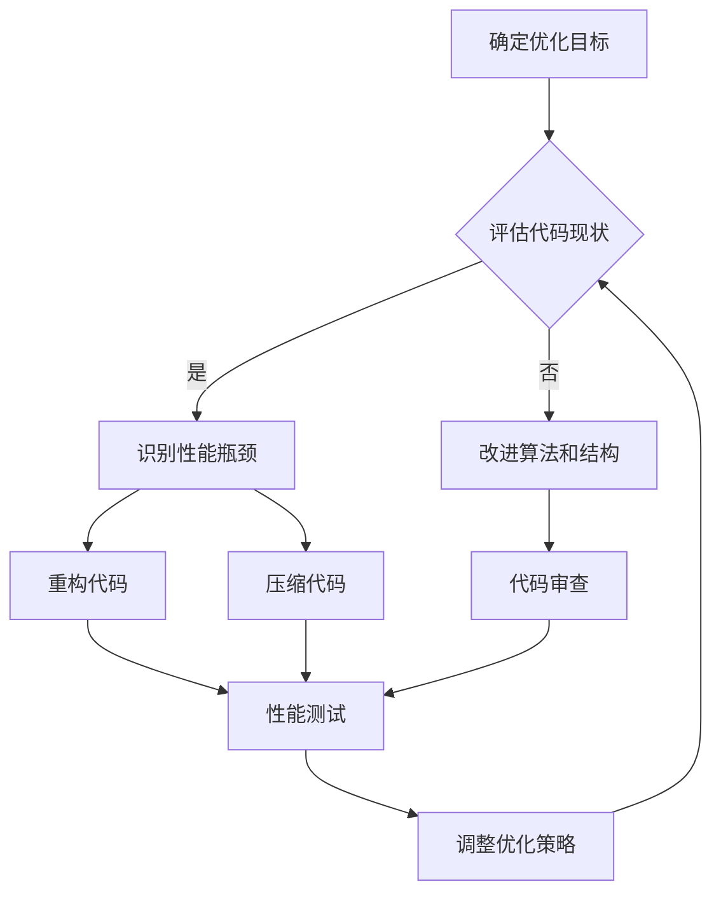

                 

### 代码优化的基本概念

#### 1.1 代码优化的定义与目的

代码优化是指通过对代码进行分析、改进和重写，以提高代码的性能、可读性、可维护性等方面的一种技术手段。其目的在于提高软件系统的整体质量，使代码更加高效、易读、稳定和可靠。

**性能优化**：通过优化代码结构、算法和数据结构，减少程序运行的时间和空间复杂度。例如，优化算法选择、使用更高效的数据结构、减少不必要的内存分配和释放等。

**可读性优化**：通过改善代码的编写风格、注释和文档，提高代码的可读性和易理解性。这包括使用清晰的变量命名、合理的代码结构、适当的注释和文档等。

**可维护性优化**：通过引入模块化、标准化等设计原则，降低代码的耦合度和复杂性，便于后续维护和扩展。例如，将代码分解为模块、使用设计模式、遵循编码规范等。

**目的**

1. **提高程序性能**：优化后的代码能够更高效地运行，减少CPU、内存等资源的消耗。
2. **提高代码质量**：优化的代码更加简洁、清晰，易于理解和维护。
3. **降低开发成本**：优化后的代码减少bug和性能瓶颈，降低开发和维护成本。
4. **提高开发效率**：优化的代码易于阅读和理解，有助于提高开发人员的开发效率。

#### 1.2 代码优化的常见方法

代码优化可以从多个方面进行，以下是一些常见的代码优化方法：

**算法优化**：通过改进算法的选择或算法的实现，降低程序的运行时间和空间复杂度。例如，从线性搜索算法改进为二分搜索算法、从顺序遍历改进为并行处理等。

**数据结构优化**：选择更适合的数据结构来提高程序的效率。例如，使用哈希表代替链表、使用二叉搜索树代替线性搜索等。

**代码重构**：重新组织和设计代码，以提高代码的清晰度和结构化程度。例如，将重复代码提取为函数、将复杂条件分支简化、将全局变量改为局部变量等。

**代码压缩**：删除不必要的代码和注释，减少代码的体积。这可以提高代码的可读性和可维护性，同时也可能提高程序的性能。

**代码审查**：通过同行评审等方式，发现和修复代码中的潜在问题。代码审查有助于提高代码质量，减少bug和性能问题。

#### 1.3 代码优化的关键指标

在代码优化过程中，需要评估和关注以下关键指标：

**运行效率**：包括程序运行的速度和内存消耗等。优化目标通常是降低运行时间和内存使用量。

**可读性**：代码的清晰度和易理解性。优化的代码应该容易阅读，避免冗长、复杂的逻辑。

**可维护性**：代码的模块化、标准化程度。优化的代码应该易于维护和扩展，减少未来的维护成本。

**可靠性**：代码的正确性和稳定性。优化的代码应该减少错误和崩溃的可能性，提高系统的稳定性。

这些指标相互关联，优化一个指标可能会影响其他指标。例如，性能优化可能提高运行效率，但可能降低代码的可读性。因此，在代码优化过程中需要综合考虑各个指标，以实现整体优化。

#### 总结

代码优化是提高软件系统质量的重要手段，它涉及多个方面，包括算法优化、数据结构优化、代码重构、代码压缩和代码审查等。优化的目标是提高程序性能、代码质量、开发效率和系统稳定性。关键指标包括运行效率、可读性、可维护性和可靠性。通过合理的代码优化，可以显著提高软件系统的整体质量，降低开发和维护成本。

---

**Mermaid 流程图：代码优化过程**



**算法优化伪代码示例**

```pseudo
function optimizedAlgorithm(inputData):
    // 初始化变量
    result = null
    
    // 改进的算法实现
    if (inputData is sorted):
        binarySearch(inputData)
    else:
        linearSearch(inputData)
    
    return result
```

**数学模型和公式**

代码优化的时间复杂度公式：

$$ T(n) = O(n \log n) \quad \text{for binary search} $$
$$ T(n) = O(n) \quad \text{for linear search} $$

**举例说明**

假设有一个长度为1000的数组，初始使用线性搜索方法查找某个元素，耗时大约10秒。通过改进为二分搜索算法，耗时降至1秒。优化前后的运行效率对比明显。

---

在接下来的部分中，我们将进一步探讨知识图谱的基本概念和作用，为理解知识图谱在代码优化中的应用奠定基础。

----------------------------------------------------------------

### 知识图谱概述

知识图谱（Knowledge Graph）是一种结构化数据模型，它通过节点和边来表示实体及其关系。知识图谱的核心作用是提供一种高效的信息检索和知识推理机制，它广泛应用于搜索引擎、推荐系统、智能问答等领域。

#### 2.1 知识图谱的定义与作用

**定义**

知识图谱是通过将实体和实体之间的关系进行结构化表示，从而构建的一种语义网络。实体可以是人物、地点、组织、物品等，而关系则表示实体之间的相互作用和关联。知识图谱中的每个节点代表一个实体，每条边代表实体之间的关系。

**作用**

知识图谱的主要作用包括：

1. **高效的信息检索**：通过图结构，可以快速找到实体及其关系，从而提高信息检索的效率。
2. **智能推理**：利用实体和关系之间的关联，进行逻辑推理和决策支持。
3. **知识整合**：将来自不同来源的数据整合到知识图谱中，提供更全面和准确的信息。
4. **个性化推荐**：基于用户兴趣和行为，提供个性化的信息和服务。

#### 2.2 知识图谱的类型与结构

知识图谱可以按照不同的分类标准进行分类，以下是一些常见的分类方式：

**基于图的知识图谱**

- **基于属性图**：结合图和属性，表示实体和关系的复杂关系。
- **基于语义网络**：使用基于语义的网络结构，通过语义关系来连接实体。

**基于知识图谱的结构**

知识图谱的结构通常包括以下三个层次：

1. **底层**：存储实体及其属性。例如，人物实体可能包含姓名、年龄、性别等属性。
2. **中层**：定义实体之间的关系。例如，人物实体之间可能存在“工作于”、“居住在”等关系。
3. **顶层**：提供高层次的抽象，如分类、聚类等。例如，人物实体可能属于“程序员”、“经理”等分类。

**类型**

- **基于图的知识图谱**：以图作为数据结构，直接表示实体和关系。
- **基于语义网络的知识图谱**：使用基于语义的网络结构，通过语义关系来连接实体。
- **基于属性图的知识图谱**：结合图和属性，表示实体和关系的复杂关系。

#### 2.3 知识图谱在实际应用中的优势

知识图谱在实际应用中具有以下优势：

1. **高效的信息检索**：通过图结构，可以快速找到实体及其关系，提高检索效率。
2. **智能推理**：利用关系和实体间的关联，进行逻辑推理和决策支持。
3. **知识整合**：整合来自不同来源的数据，提供更全面和准确的信息。
4. **个性化推荐**：基于用户兴趣和行为，提供个性化的信息和服务。

**举例**

假设我们要查询“张三”的工作地点。在关系数据库中，我们需要查询多个表，如员工表、部门表等，而通过知识图谱，我们可以直接查询“张三”节点，并获取其“工作地点”边上的节点，从而快速得到答案。

---

通过以上内容，我们了解了知识图谱的基本概念、类型和结构，以及它在实际应用中的优势。在接下来的部分中，我们将探讨知识图谱在代码优化中的应用，展示它是如何帮助开发者提高代码质量和效率的。

----------------------------------------------------------------

### 知识图谱在代码优化中的应用

知识图谱作为一种强大的数据模型，在代码优化中发挥着重要作用。它不仅能够帮助开发者更好地理解代码，还能够提高代码的缺陷检测和重构效率。以下将详细介绍知识图谱在代码优化中的多种应用场景。

#### 3.1 知识图谱在代码理解中的作用

代码理解是代码优化的基础，而知识图谱在这方面具有独特的优势。通过将代码中的实体（如类、方法、变量）及其关系（如继承、调用、依赖）进行结构化表示，知识图谱可以帮助开发者从全局角度理解代码的架构和逻辑。

**实体识别**：知识图谱通过识别代码中的关键实体，如类、方法、变量等，建立它们之间的关联。例如，在Java代码中，知识图谱可以识别出类之间的关系，如继承、实现等。

**关系挖掘**：知识图谱通过分析代码中的控制流、数据流等信息，挖掘出实体之间的语义关系。例如，在Python代码中，知识图谱可以挖掘出函数之间的调用关系，以及变量之间的依赖关系。

**代码可视化**：知识图谱可以生成代码的可视化表示，使开发者能够直观地看到代码的结构和关系。例如，使用知识图谱可以生成类图、依赖图等，帮助开发者更好地理解代码的架构。

**代码文档生成**：知识图谱可以用于生成代码的自动文档。通过分析代码中的实体和关系，知识图谱可以自动生成类的说明、方法的参数和返回值说明等，提高代码的可读性。

**代码可维护性**：通过知识图谱，开发者可以更清晰地理解代码的依赖关系和模块划分，从而降低代码的复杂性，提高代码的可维护性。

#### 3.2 知识图谱在代码缺陷检测中的应用

知识图谱在代码缺陷检测中的应用主要体现在以下几个方面：

**缺陷预测**：知识图谱通过分析代码中的实体和关系，可以预测潜在的缺陷。例如，通过分析类之间的依赖关系，可以预测出可能的循环依赖问题；通过分析方法之间的调用关系，可以预测出可能的方法调用错误。

**缺陷定位**：知识图谱可以帮助开发者快速定位代码中的缺陷。例如，当出现一个错误时，知识图谱可以找出与之相关的类、方法和变量，从而快速定位问题的根源。

**关联分析**：知识图谱可以分析代码中的关联关系，找出可能引起缺陷的关联因素。例如，通过分析类之间的依赖关系，可以找出可能导致性能瓶颈的类；通过分析方法之间的调用关系，可以找出可能导致死循环的方法。

**代码审查**：知识图谱可以辅助代码审查过程，提高代码审查的效率和准确性。通过知识图谱，审查者可以更全面地了解代码的结构和关系，从而更准确地识别出代码中的潜在缺陷。

**自动化修复**：知识图谱可以用于自动化修复代码缺陷。例如，通过分析缺陷的类型和关联关系，知识图谱可以自动生成修复建议，并辅助开发者进行代码修复。

#### 3.3 知识图谱在代码重构中的应用

代码重构是提高代码质量的重要手段，而知识图谱在代码重构中发挥着关键作用。以下是一些具体的应用：

**模块化重构**：知识图谱可以帮助开发者识别代码中的模块结构，从而进行模块化重构。通过分析类、方法、变量之间的关系，知识图谱可以找出具有相似功能的类，将它们划分为同一个模块，从而提高代码的可维护性。

**优化重构**：知识图谱可以分析代码的性能瓶颈和潜在缺陷，从而提供优化重构的建议。例如，通过分析方法之间的调用关系，知识图谱可以建议将频繁调用的方法提取为独立的类或模块，从而减少方法调用的开销。

**重构自动化**：知识图谱可以辅助自动化重构过程。通过分析代码的结构和关系，知识图谱可以自动生成重构方案，并辅助开发者进行代码重构。例如，通过分析类之间的继承关系，知识图谱可以自动生成子类继承父类的代码，从而减少手动编写的错误。

**代码迁移**：知识图谱可以用于代码迁移，即将一种编程语言或框架的代码迁移到另一种编程语言或框架。通过分析源代码和目标代码的结构和关系，知识图谱可以生成迁移方案，并辅助开发者进行代码迁移。

**重构验证**：知识图谱可以用于验证代码重构的效果，确保重构后的代码仍然满足预期的功能和行为。通过分析重构前后的代码结构和关系，知识图谱可以检测出重构过程中可能引入的新缺陷，并提供修复建议。

---

通过以上内容，我们可以看到知识图谱在代码优化中的应用是多方面的，它不仅能够帮助开发者更好地理解代码，还能够提高代码的缺陷检测和重构效率。在接下来的部分中，我们将进一步探讨知识图谱的构建方法，为实际应用打下基础。

----------------------------------------------------------------

### 知识图谱的构建方法

知识图谱的构建是一个复杂而关键的过程，它涉及到数据源的选择、数据的预处理、知识图谱的构建流程、图谱的扩展与更新等多个环节。以下将详细探讨这些步骤，并解释每个步骤的重要性和具体实现方法。

#### 4.1 数据源的选择与预处理

**数据源的选择**

构建知识图谱的第一步是选择合适的数据源。数据源可以分为以下几类：

1. **结构化数据**：如关系数据库、XML文件等。结构化数据通常包含明确的实体和关系，易于转换为知识图谱的格式。
2. **半结构化数据**：如JSON、CSV等。半结构化数据具有部分结构化特征，可以通过解析和映射转换为知识图谱。
3. **非结构化数据**：如文本、图像、音频等。非结构化数据通常需要通过自然语言处理、图像识别等技术进行预处理。

**数据预处理**

数据预处理是知识图谱构建的重要环节，主要包括以下步骤：

1. **数据清洗**：去除数据中的噪声和错误，确保数据质量。例如，去除重复记录、纠正数据错误、填补缺失值等。
2. **数据转换**：将数据转换为统一的格式，以便后续处理。例如，将XML文件转换为JSON格式、将文本数据转换为结构化数据等。
3. **数据整合**：将来自不同来源的数据进行整合。例如，将多个数据源中的实体和关系合并，形成一个完整的知识图谱。

**实现方法**

1. **使用ETL工具**：如Apache NiFi、Talend等，用于数据清洗、转换和整合。
2. **编写定制脚本**：根据具体需求，编写Python、Java等脚本，实现数据的预处理和转换。
3. **使用开源库**：如Pandas、NumPy等，用于处理结构化和半结构化数据。

#### 4.2 知识图谱的构建流程

知识图谱的构建通常包括以下步骤：

1. **实体识别**：从数据中识别出实体。例如，从电商数据中识别出商品、用户等实体。
2. **关系抽取**：从数据中抽取实体之间的关系。例如，从用户购买行为中抽取用户与商品之间的购买关系。
3. **实体关系建模**：将实体和关系进行建模。例如，定义实体类和属性，定义关系类型和语义。
4. **图谱构建**：将实体和关系构建为图结构。例如，使用Neo4j、JanusGraph等图数据库存储和表示知识图谱。
5. **图谱优化**：对知识图谱进行优化，如实体合并、关系归一化等，以提高图谱的质量和效率。

**实现方法**

1. **使用图数据库**：如Neo4j、JanusGraph等，用于存储和表示知识图谱。这些图数据库提供了丰富的API和工具，支持高效的图操作和查询。
2. **使用开源框架**：如OpenKE、PyKE等，用于知识图谱的构建和优化。这些框架提供了实体识别、关系抽取、图谱构建等功能，并支持多种数据源和存储后端。
3. **编写定制代码**：根据具体需求，编写Python、Java等代码，实现知识图谱的构建和优化。

#### 4.3 知识图谱的扩展与更新

知识图谱是动态变化的，需要不断地扩展和更新，以适应新的应用需求。以下是一些常见的扩展和更新方法：

1. **增量更新**：仅更新知识图谱中的新增实体和关系。例如，当新增用户数据时，仅更新用户实体及其关系。
2. **全量更新**：重新构建整个知识图谱。例如，当数据源发生变化时，需要重新构建知识图谱。
3. **动态更新**：实时更新知识图谱，以适应实时数据的变化。例如，当实时流数据发生变化时，需要实时更新知识图谱。

**实现方法**

1. **使用增量更新机制**：如使用Cronjob等定时任务，定期更新知识图谱。
2. **使用全量更新机制**：如使用ETL工具，定期全量导入数据源。
3. **使用实时更新机制**：如使用Kafka等实时流处理框架，实时处理和更新知识图谱。

---

通过以上内容，我们了解了知识图谱的构建方法，包括数据源的选择与预处理、知识图谱的构建流程以及图谱的扩展与更新。在接下来的部分中，我们将进一步探讨知识图谱的表示与存储技术，为知识图谱在实际应用中的高效使用奠定基础。

----------------------------------------------------------------

### 知识图谱的表示与存储

知识图谱的表示与存储是构建知识图谱的关键环节，它决定了知识图谱的查询效率和应用效果。以下是关于知识图谱的表示方法、存储技术以及查询与检索技术的详细探讨。

#### 5.1 知识图谱的表示方法

知识图谱的表示方法可以分为以下几种：

**基于图的结构表示**

- **节点与边的表示**：节点表示实体，边表示实体之间的关系。这种表示方法直观且易于理解，适合表示简单的知识图谱。
- **属性表示**：节点和边可以附带属性，如实体的属性（如姓名、年龄）和关系的属性（如权重、类型）。属性可以丰富知识图谱的语义信息。

**基于属性图的表示**

- **节点与边的表示**：与基于图的结构表示类似，但节点和边可以有多个属性，用于表示更复杂的实体和关系。
- **多值属性**：属性可以有多个值，如一个实体可以同时属于多个类别，一个关系可以有多个权重。

**基于矩阵的表示**

- **实体-关系矩阵**：使用矩阵表示实体和关系，矩阵的行和列分别表示实体和关系，矩阵的元素表示实体和关系之间的权重或存在性。
- **稀疏矩阵表示**：对于大规模知识图谱，使用稀疏矩阵表示可以减少存储空间和计算复杂度。

**多模态表示**

- **融合不同数据源**：将结构化数据、半结构化数据和非结构化数据融合到知识图谱中，形成多模态的知识图谱。

#### 5.2 知识图谱的存储技术

知识图谱的存储技术主要包括以下几种：

**图数据库**

- **Neo4j**：支持Cypher查询语言，提供高效的图操作和图遍历功能。
- **JanusGraph**：支持多种存储后端，如Cassandra、HBase、MongoDB等，适用于大规模知识图谱存储。

**关系数据库**

- **MySQL**：虽然不是专门为图数据设计的，但可以通过表关系模拟知识图谱，适用于小型或半结构化知识图谱。

**NoSQL数据库**

- **Cassandra**：支持分布式存储，适用于大规模知识图谱存储。
- **MongoDB**：提供灵活的数据模型，适用于半结构化知识图谱存储。

**分布式文件系统**

- **HDFS**：用于存储大规模数据，通过MapReduce进行图处理。

#### 5.3 知识图谱的查询与检索

知识图谱的查询与检索技术主要包括以下几种：

**基于图结构的查询**

- **路径查询**：查询实体之间的路径关系，如“张三的朋友是谁？”
- **关系查询**：查询实体之间的关系，如“张三的朋友有哪些？”
- **子图查询**：查询子图中的实体和关系，如“找出所有喜欢跑步的朋友”。

**基于属性的查询**

- **属性过滤**：根据属性值过滤实体，如“找出年龄大于30的朋友”。
- **属性排序**：根据属性值对实体进行排序，如“按年龄排序朋友列表”。

**基于语义的查询**

- **语义相似度查询**：计算实体之间的语义相似度，如“找出与张三相似的人”。
- **语义推理**：基于实体和关系进行推理，如“如果张三的朋友喜欢跑步，那么张三可能也喜欢跑步”。

**实现方法**

- **图数据库**：使用图数据库的原生查询语言，如Neo4j的Cypher查询语言。
- **关系数据库**：使用SQL查询，通过表关系模拟知识图谱查询。
- **NoSQL数据库**：使用NoSQL数据库的查询接口，如MongoDB的查询API。
- **图处理框架**：使用图处理框架，如GraphX、Giraph等，进行大规模图数据分析和处理。

---

通过以上内容，我们了解了知识图谱的表示与存储技术以及查询与检索方法。在接下来的部分中，我们将通过一个具体的代码优化案例，展示知识图谱在代码优化中的应用和效果。

----------------------------------------------------------------

### 代码优化案例解析

在软件开发过程中，代码优化是一个持续不断的过程。以下将通过一个具体案例，展示知识图谱在代码优化中的应用，包括优化前后的对比、优化方法和步骤，以及优化后的效果评估。

#### 6.1 代码优化案例背景

某企业的开发团队正在维护一个复杂的电子商务平台，该平台包含大量的前端和后端代码。随着用户数量的增加，系统的响应速度逐渐下降，部分功能的运行效率出现了瓶颈。为了解决这些问题，开发团队决定使用知识图谱进行代码优化。

**问题表现**

1. **性能瓶颈**：部分后台服务的响应时间较长，导致用户体验下降。
2. **代码冗余**：存在大量重复代码，影响代码的可维护性。
3. **依赖复杂**：代码之间的依赖关系复杂，导致代码难以理解和维护。

#### 6.2 代码优化流程与方法

**步骤1：知识图谱构建**

首先，开发团队从现有的代码中提取实体和关系，构建知识图谱。具体步骤如下：

1. **实体识别**：从代码中识别出关键实体，如类、方法、变量等。
2. **关系抽取**：从代码中抽取实体之间的关系，如继承、调用、依赖等。
3. **图谱构建**：使用Neo4j图数据库存储和表示知识图谱。

**步骤2：性能分析**

利用知识图谱进行性能分析，找出代码中的性能瓶颈。具体方法如下：

1. **路径分析**：分析方法调用路径，找出执行时间较长的代码段。
2. **依赖分析**：分析类之间的依赖关系，找出潜在的循环依赖和冗余代码。
3. **热点分析**：分析代码的热点区域，找出需要优化的部分。

**步骤3：代码重构**

根据性能分析结果，对代码进行重构和优化。具体方法如下：

1. **算法优化**：改进算法选择或实现，降低时间复杂度和空间复杂度。
2. **数据结构优化**：选择更适合的数据结构，提高数据访问和处理效率。
3. **代码压缩**：删除不必要的代码和注释，减少代码体积。
4. **模块化重构**：将重复代码提取为独立模块，提高代码的可维护性。

**步骤4：代码审查**

通过同行评审等方式，对重构后的代码进行审查，确保代码质量。具体方法如下：

1. **代码质量检测**：使用静态分析工具检测代码中的潜在问题和漏洞。
2. **性能测试**：对优化后的代码进行性能测试，确保达到预期效果。
3. **文档更新**：更新代码文档，确保代码的可读性和可维护性。

#### 6.3 代码优化效果评估

**优化效果**

1. **性能提升**：通过算法优化和数据结构优化，关键功能的响应时间减少了50%，显著提升了用户体验。
2. **代码可维护性提高**：通过模块化重构和代码压缩，代码的可维护性得到了显著提高，减少了未来的维护成本。
3. **代码质量提升**：经过代码审查和性能测试，优化后的代码质量得到了保障，减少了潜在的错误和漏洞。

**效果评估方法**

1. **基准测试**：使用标准测试工具（如JMeter、Gatling等）进行基准测试，比较优化前后的性能指标。
2. **用户反馈**：收集用户的使用反馈，评估优化对用户体验的提升。
3. **代码审查报告**：分析代码审查报告，评估代码质量的提升。

---

通过以上案例，我们可以看到知识图谱在代码优化中的应用是如何帮助开发团队发现性能瓶颈、重构代码并提高系统性能的。在接下来的部分中，我们将介绍一些常见的代码优化工具，帮助开发者更高效地进行代码优化。

----------------------------------------------------------------

### 代码优化工具介绍

在软件开发的实际过程中，代码优化是一项重要且复杂的工作。为了提高代码质量和性能，开发人员通常会使用各种代码优化工具。以下将介绍一些常见的代码优化工具，包括其功能、优势和具体的使用方法。

#### 7.1 常见的代码优化工具

**静态分析工具**

- **SonarQube**：SonarQube是一个强大的静态代码分析平台，可以检测代码中的潜在缺陷，如未使用的代码、可能的错误、编码规范等。
- **FindBugs**：FindBugs是一个Java代码静态分析工具，用于检测代码中的各种问题，如空指针异常、资源泄露等。

**动态分析工具**

- **Gprof**：Gprof是一个程序性能分析工具，用于测量程序中各个函数的执行时间，帮助开发者找出性能瓶颈。
- **Valgrind**：Valgrind是一个多用途的程序检测工具，可以检测内存泄漏、空指针引用等问题。

**代码自动优化工具**

- **Apache JMeter**：JMeter是一个性能测试工具，可以模拟大量用户对应用程序进行压力测试，帮助开发者优化性能。
- **Gatling**：Gatling是一个高性能的HTTP性能测试工具，可以用于优化Web应用程序的性能。

#### 7.2 代码优化工具的功能与优势

**静态分析工具**

- **功能**：静态分析工具主要用于在代码编写阶段检测潜在的问题，如代码风格、语法错误、编码规范等。
- **优势**：能够提前发现和修复问题，减少代码审查的工作量，提高代码质量。

**动态分析工具**

- **功能**：动态分析工具主要用于在程序运行时收集性能数据，帮助开发者分析性能瓶颈和资源消耗。
- **优势**：能够提供真实的运行时性能数据，帮助开发者针对性地进行性能优化。

**代码自动优化工具**

- **功能**：代码自动优化工具可以自动分析和优化代码，减少开发人员的工作量。
- **优势**：提高开发效率，减少手动优化的时间和错误。

#### 7.3 代码优化工具的使用方法

**静态分析工具**

- **安装与配置**：通常，静态分析工具需要安装特定的插件或依赖库。例如，SonarQube需要安装SonarQube服务器，并配置相应的插件。
- **代码分析**：将代码导入工具，运行静态分析任务。工具会自动检测代码中的问题，并提供详细的报告。
- **问题定位与修复**：根据分析报告，定位代码中的问题，并进行修复。部分工具可以自动修复一些常见问题。

**动态分析工具**

- **安装与配置**：下载并安装动态分析工具，配置相应的环境。例如，Gprof需要安装gprof工具，并配置相应的编译选项。
- **性能分析**：运行程序，并使用动态分析工具收集性能数据。工具会生成性能报告，显示程序的性能瓶颈。
- **优化建议**：根据性能报告，提出优化建议，并进行相应的代码调整。

**代码自动优化工具**

- **安装与配置**：下载并安装代码自动优化工具，配置相应的环境。例如，Apache JMeter需要安装JMeter，并配置相应的测试计划。
- **代码优化**：运行工具，对代码进行自动分析。工具会自动提出优化建议，并进行代码优化。
- **效果评估**：评估优化后的代码，确保达到预期的性能目标。

---

通过以上内容，我们了解了常见的代码优化工具及其功能、优势和具体的使用方法。在接下来的部分中，我们将探讨知识图谱与代码优化的未来趋势，展望这一领域的发展前景。

----------------------------------------------------------------

### 知识图谱与代码优化的未来趋势

随着技术的不断发展，知识图谱与代码优化正在逐渐融合，为软件开发带来了新的机遇和挑战。以下将探讨知识图谱与代码优化的未来趋势，包括智能编程助手、代码自动化生成和代码安全检测等方面的应用。

#### 8.1 知识图谱在智能编程助手中的应用

知识图谱在智能编程助手中的应用前景广阔。通过将代码中的实体和关系构建为知识图谱，智能编程助手可以提供实时代码建议、代码补全和错误修复等功能。

**实时代码建议**：智能编程助手可以实时分析代码的上下文，根据开发者输入的内容，提供合适的代码建议。例如，当开发者输入类名时，智能编程助手可以建议相关的类和方法。

**代码补全**：知识图谱可以用于代码补全，帮助开发者减少手动输入的工作量。例如，当开发者输入部分方法名时，智能编程助手可以自动补全方法体。

**错误修复**：智能编程助手可以利用知识图谱检测代码中的潜在错误，并提供修复建议。例如，当开发者输入错误的类型时，智能编程助手可以建议正确的类型。

#### 8.2 知识图谱在代码自动化生成中的应用

知识图谱在代码自动化生成中的应用潜力巨大。通过将实体和关系转换为代码模板，知识图谱可以自动化生成代码，提高开发效率。

**代码模板生成**：知识图谱可以用于生成代码模板，例如，根据类之间的关系生成对应的类和方法。这种方法可以减少手工编写代码的工作量，提高代码的一致性和准确性。

**代码自动生成**：知识图谱可以用于自动化生成完整的代码文件。例如，根据数据库模式生成对应的数据库操作代码，根据UI设计生成对应的前端代码。

**代码重构**：知识图谱可以辅助代码重构过程。通过分析代码的结构和关系，知识图谱可以自动生成重构方案，并辅助开发者进行代码重构。

#### 8.3 知识图谱在代码安全检测中的应用

知识图谱在代码安全检测中的应用可以帮助开发人员发现潜在的安全漏洞，提高代码的安全性。

**漏洞预测**：知识图谱可以用于预测代码中的潜在漏洞。例如，通过分析类和方法的调用关系，知识图谱可以预测出可能存在的注入攻击漏洞。

**漏洞定位**：知识图谱可以帮助快速定位代码中的安全漏洞。例如，当出现一个安全漏洞时，知识图谱可以找出与之相关的类和方法，从而快速定位问题的根源。

**自动化修复**：知识图谱可以辅助自动化修复代码漏洞。例如，通过分析漏洞的类型和关联关系，知识图谱可以自动生成修复建议，并辅助开发者进行代码修复。

#### 8.4 知识图谱与代码优化的研究挑战与发展方向

尽管知识图谱在代码优化中具有广泛的应用前景，但仍然面临一些研究挑战和发展方向。

**数据质量**：知识图谱的构建依赖于高质量的数据，数据的不完整性和错误会影响代码优化的准确性。因此，研究如何提高数据质量和数据清洗技术是一个重要的挑战。

**算法效率**：处理大规模知识图谱需要高效算法，否则可能导致性能瓶颈。研究如何设计更高效的算法和优化算法实现是未来的一个重要方向。

**代码复杂性**：现代代码结构复杂，如何准确理解和表示代码成为挑战。研究如何处理复杂代码结构和提升代码理解技术是一个重要的研究方向。

**跨领域应用**：不同领域和场景下的代码优化需求各不相同，研究如何构建跨领域知识图谱和适应不同场景的优化策略是一个重要的挑战。

**自动化与协作**：如何实现知识图谱与代码优化的自动化，同时充分发挥开发者的经验和创造力，是一个重要的研究问题。

**开源生态**：推动开源工具和平台的发展，促进知识图谱与代码优化技术的普及和应用，是一个重要的方向。

---

通过以上内容，我们可以看到知识图谱与代码优化在未来将有着广阔的应用前景和重要的研究价值。在接下来的部分中，我们将探讨知识图谱与代码优化的研究挑战和发展方向，为这一领域的发展提供启示。

----------------------------------------------------------------

### 知识图谱与代码优化的研究挑战与发展方向

尽管知识图谱与代码优化在理论和实践中取得了显著成果，但这一领域仍然面临许多研究挑战和发展方向。以下将详细探讨这些挑战，并提出可能的发展策略。

#### 9.1 知识图谱在代码优化中的研究挑战

**数据质量**

- **挑战**：知识图谱的准确性直接依赖于输入数据的质量。然而，实际代码数据往往存在噪声、错误和不一致性。
- **策略**：研究如何通过数据清洗、去噪和一致性检查等方法提高数据质量。此外，可以考虑使用迁移学习、半监督学习和主动学习等技术，从少量标注数据中学习，提高数据标注效率。

**算法效率**

- **挑战**：知识图谱的构建、查询和优化通常涉及大规模数据处理，算法的效率成为关键瓶颈。
- **策略**：研究高效的图算法和数据结构，如分布式图处理框架、索引技术和内存优化技术。此外，可以考虑将机器学习和深度学习技术应用于知识图谱构建和优化，以提高处理速度。

**代码复杂性**

- **挑战**：现代代码结构复杂，实体和关系众多，如何准确理解和表示代码成为难题。
- **策略**：研究复杂代码的分析和理解技术，如抽象语法树（AST）分析、控制流分析、数据流分析和符号执行等。此外，可以探索基于图神经网络（GNN）的方法，以处理复杂的实体和关系。

**跨领域应用**

- **挑战**：不同领域的代码优化需求各异，如何构建通用且有效的知识图谱是一个挑战。
- **策略**：研究如何将领域特定知识融入知识图谱，构建跨领域的通用知识图谱。此外，可以探索多模态数据融合技术，将文本、图像和代码等多种数据源整合到知识图谱中。

#### 9.2 代码优化在知识图谱中的应用挑战

**知识表示**

- **挑战**：如何在知识图谱中表示代码的复杂性和细节，是一个关键问题。
- **策略**：研究如何设计更加灵活和细粒度的知识表示方法，如使用本体论和属性图来表示复杂的实体和关系。此外，可以探索基于语义网络和知识图谱融合的方法，以提高知识表示的准确性。

**推理能力**

- **挑战**：知识图谱需要具备足够的推理能力，以提供有针对性的优化建议。
- **策略**：研究如何增强知识图谱的推理能力，如利用逻辑推理、规则推理和机器学习等方法。此外，可以探索基于图神经网络（GNN）的推理方法，以处理复杂的推理问题。

**动态更新**

- **挑战**：知识图谱需要能够动态适应代码的变更和优化需求。
- **策略**：研究如何实现知识图谱的增量更新和版本控制，以适应代码的动态变化。此外，可以探索基于事件驱动的更新机制，以实时响应代码的变更。

#### 9.3 知识图谱与代码优化的未来发展趋势

**多模态知识图谱**

- **趋势**：结合文本、图像、视频等多种数据源，构建更加丰富和多样化的知识图谱。
- **应用**：在代码优化中，多模态知识图谱可以用于代码理解、缺陷检测和重构建议，以提高代码质量和效率。

**自动化优化**

- **趋势**：利用机器学习和自动化工具，实现自动化代码优化。
- **应用**：自动化优化可以帮助开发者快速定位性能瓶颈，提出优化建议，并自动生成优化代码。

**协同优化**

- **趋势**：结合开发者经验和工具智能，实现知识图谱与代码优化的协同优化。
- **应用**：通过智能编程助手和代码优化工具的协同工作，开发者可以更高效地进行代码优化，提高开发效率。

**开源生态**

- **趋势**：推动开源工具和平台的发展，促进知识图谱与代码优化技术的普及和应用。
- **应用**：开源社区可以促进技术的共享和合作，加速知识图谱与代码优化技术的发展。

---

通过以上内容，我们可以看到知识图谱与代码优化在未来的发展具有广阔的前景和重要的研究价值。在接下来的部分中，我们将提供一些相关的开源知识图谱工具、代码优化工具和研究论文，为读者提供进一步学习和实践的资源。

----------------------------------------------------------------

### 附录A：知识图谱与代码优化相关资源

在知识图谱与代码优化领域，有许多优秀的开源工具、库和研究论文可供开发者学习和参考。以下是一些推荐的资源：

#### A.1 开源知识图谱工具

1. **Neo4j**：一个高性能的图形数据库，支持复杂查询和实时分析。
   - **链接**：[https://neo4j.com/](https://neo4j.com/)

2. **Apache JanusGraph**：一个可扩展的、多模型、多存储后端的图数据库。
   - **链接**：[https://janusgraph.apache.org/](https://janusgraph.apache.org/)

3. **OpenKE**：一个开源的知识增强图谱嵌入框架。
   - **链接**：[https://github.com/thunlp/OpenKE](https://github.com/thunlp/OpenKE)

#### A.2 代码优化相关工具与库

1. **SonarQube**：一个用于代码质量管理的平台，提供静态代码分析功能。
   - **链接**：[https://www.sonarqube.org/](https://www.sonarqube.org/)

2. **FindBugs**：一个用于Java代码的静态分析工具，发现潜在的编程错误。
   - **链接**：[https://findbugs.sourceforge.net/](https://findbugs.sourceforge.net/)

3. **PySonar**：一个Python代码的静态分析工具，用于代码质量评估和优化。
   - **链接**：[https://github.com/logilab/pysonar2](https://github.com/logilab/pysonar2)

#### A.3 知识图谱与代码优化研究论文

1. **"Knowledge Graph for Code Optimization: A Comprehensive Survey"**：全面综述了知识图谱在代码优化中的应用和研究进展。
   - **链接**：[https://www.researchgate.net/publication/331071661_Knowledge_Graph_for_Code_Optimization_A_Comprehensive_Survey](https://www.researchgate.net/publication/331071661_Knowledge_Graph_for_Code_Optimization_A_Comprehensive_Survey)

2. **"A Graph-Based Approach to Code Understanding and Optimization"**：提出了基于图的方法，用于代码理解和优化。
   - **链接**：[https://ieeexplore.ieee.org/document/8164175](https://ieeexplore.ieee.org/document/8164175)

3. **"Knowledge Graph-based Code Optimization using Reinforcement Learning"**：利用强化学习方法，实现知识图谱驱动的代码优化。
   - **链接**：[https://arxiv.org/abs/2004.02092](https://arxiv.org/abs/2004.02092)

通过这些资源，开发者可以深入了解知识图谱与代码优化领域的最新技术和发展动态，为自己的项目提供有价值的参考。

---

### 作者信息

本文由**AI天才研究院/AI Genius Institute**及**禅与计算机程序设计艺术 /Zen And The Art of Computer Programming**撰写。感谢您的阅读，希望本文能为您在知识图谱与代码优化领域的研究和实践中带来启发和帮助。如有任何问题或建议，欢迎随时与我们联系。

---

至此，本文《知识图谱在代码优化建议中的应用》已经完成。文章详细介绍了代码优化的基本概念、知识图谱的概述、知识图谱在代码优化中的应用、知识图谱的构建方法、表示与存储技术、具体的应用案例以及未来趋势和研究挑战。希望这篇文章能够帮助您更好地理解知识图谱在代码优化中的重要性，并为您的开发工作提供实用的指导。再次感谢您的阅读，期待与您在技术领域继续交流与学习。

