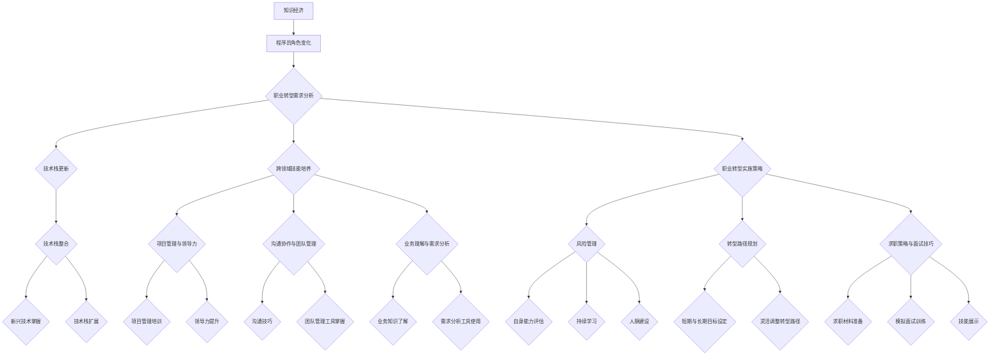

                 

### 《知识经济下程序员的职业转型策略》

> **关键词：知识经济、程序员、职业转型、技能提升、职业规划**

> **摘要：本文旨在探讨知识经济背景下程序员的职业转型策略，分析程序员职业转型的必要性和机遇，并提供具体的转型路径、策略和案例。**

---

### 第一部分：知识经济与职业转型概述

#### 第1章：知识经济背景与程序员角色

在当今世界，知识经济已经成为推动经济发展的核心力量。知识经济的崛起改变了传统的生产方式和经济结构，使得知识和信息成为重要的生产要素。在此背景下，程序员的职业角色也在发生着深刻的变化。

#### 1.1 知识经济的崛起与发展

##### 1.1.1 知识经济的定义

知识经济，又称信息经济，是指以知识和信息的生产、分配、传播和使用为基础的经济形态。其主要特点包括信息的高效利用、创新能力的提升和数字化技术的广泛应用。

##### 1.1.2 知识经济的特点

知识经济具有以下几个显著特点：

1. **知识密集**：知识经济依赖于知识的生产、传播和应用，知识密集型产业成为经济发展的主导力量。
2. **技术驱动**：知识经济的快速发展离不开技术的推动，技术创新成为经济增长的重要引擎。
3. **全球化**：知识经济促进了全球化的深入发展，信息、技术和人才的流动更加便捷。
4. **可持续性**：知识经济强调可持续发展，注重资源的合理利用和环境的保护。

##### 1.1.3 知识经济对程序员职业的影响

知识经济的崛起对程序员职业产生了深远的影响：

1. **技术要求提高**：随着技术的快速发展，程序员需要不断学习新知识、新技术，以适应不断变化的工作环境。
2. **创新能力提升**：知识经济鼓励创新，程序员需要具备更强的创新能力和解决问题的能力。
3. **职业多样化**：知识经济带来了更多的职业机会，程序员可以根据自己的兴趣和特长选择不同的职业路径。

#### 1.2 程序员职业现状与挑战

##### 1.2.1 传统程序员职业困境

在传统程序员职业中，面临以下困境：

1. **重复性劳动**：许多程序员的工作内容相对重复，缺乏挑战性和创新性。
2. **技术更新快速**：技术的快速发展要求程序员不断更新自己的知识和技能，但学习和实践的周期较短。
3. **职业发展受限**：传统程序员职业的发展路径较为单一，晋升空间有限。

##### 1.2.2 职业转型的重要性

面对传统程序员职业的困境，职业转型显得尤为重要：

1. **提升竞争力**：通过职业转型，程序员可以提升自己的职业竞争力，适应知识经济的发展需求。
2. **拓展职业路径**：职业转型为程序员提供了更多的职业选择，可以更好地实现个人价值。
3. **满足职业兴趣**：职业转型可以帮助程序员找到更符合自己兴趣和特长的职业方向。

##### 1.2.3 职业转型的机遇与挑战

职业转型既有机遇，也面临挑战：

1. **机遇**：知识经济带来了更多的职业机会，程序员可以根据自己的兴趣和特长选择不同的职业方向。
2. **挑战**：职业转型需要程序员投入更多的时间和精力进行学习和实践，同时要面对新的职业压力和挑战。

#### 1.3 程序员职业转型的路径选择

程序员可以根据自己的兴趣和特长选择不同的职业转型路径：

1. **从技术向管理转型**：管理层的职位对技术能力和领导力有较高的要求，程序员可以通过提升自己的管理能力和沟通能力实现转型。
2. **从开发向测试转型**：测试工作对程序员的技能要求较高，程序员可以通过学习测试方法和工具实现转型。
3. **从前端向全栈转型**：全栈开发者具备更全面的技术能力，程序员可以通过学习前端和后端技术实现转型。
4. **从普通程序员向高级专家转型**：高级专家在技术能力和专业知识上有较高的要求，程序员可以通过深入研究和实践实现转型。

---

在知识经济时代，程序员的职业转型既是挑战，也是机遇。通过深入分析知识经济的背景和程序员职业的现状，本文为程序员提供了多种职业转型路径和策略。在接下来的章节中，我们将进一步探讨职业转型前的自我评估、技术技能提升和职业转型后的可持续发展策略。希望本文能为程序员的职业发展提供有益的启示和指导。

### 第二部分：职业转型策略与规划

#### 第2章：职业转型前的自我评估

在进行职业转型之前，程序员需要进行全面的自我评估，以了解自己的兴趣、技能和职业目标。这一过程有助于明确转型的方向，提高转型的成功率。

#### 2.1 自我认知与定位

##### 2.1.1 兴趣爱好与职业倾向

在进行自我评估时，程序员首先要明确自己的兴趣爱好和职业倾向。兴趣爱好可以作为职业发展的指引，帮助程序员找到自己最感兴趣的领域。例如，如果程序员对项目管理感兴趣，可以选择从技术向管理转型。

##### 2.1.2 个人技能与知识储备

其次，程序员需要评估自己的个人技能和知识储备。这包括编程技能、数据库管理、前端技术、后端技术等。了解自己在这些领域的优势和不足，有助于制定针对性的学习计划，提升自己的技能水平。

##### 2.1.3 职业目标与成长路径

最后，程序员要明确自己的职业目标，并制定相应的成长路径。职业目标可以是成为高级程序员、项目经理、产品经理等。成长路径则包括学习计划、技能提升、职业认证等，以确保程序员能够实现职业目标。

#### 2.2 职业转型需求分析

在进行自我评估后，程序员需要分析职业转型的需求，包括市场需求、转型方向和成本收益分析。

##### 2.2.1 市场需求与趋势

程序员要了解当前市场的需求和发展趋势，以便选择具有市场前景的职业方向。例如，随着云计算、大数据和人工智能等技术的发展，相关领域的专业人才需求不断增长，程序员可以考虑在这些领域进行转型。

##### 2.2.2 转型方向选择

根据市场需求和个人兴趣，程序员可以选择合适的转型方向。例如，如果程序员对软件开发感兴趣，可以选择从开发向产品经理转型；如果程序员对技术管理感兴趣，可以选择从技术向管理转型。

##### 2.2.3 转型成本与收益分析

在进行转型前，程序员需要对转型的成本和收益进行分析。这包括时间成本、经济成本和机会成本等。同时，程序员要评估转型后的收益，包括职业晋升、薪资待遇和职业满意度等。

#### 2.3 职业转型准备

在确定职业转型方向和需求后，程序员需要做好充分的准备，包括学习计划、技能提升和软技能的培养。

##### 2.3.1 学习计划与资源整合

程序员要制定详细的学习计划，包括学习目标、学习内容和学习方法等。同时，要整合各种学习资源，如在线课程、技术书籍、博客文章等，以便高效地学习新知识。

##### 2.3.2 技能提升与知识扩展

在职业转型过程中，程序员需要不断提升自己的技能和知识水平。可以通过参加培训课程、参与开源项目、阅读技术书籍等方式，拓展自己的技术栈。

##### 2.3.3 软技能的培养与提升

除了技术技能外，软技能在职业转型中也起着重要作用。程序员需要培养良好的沟通能力、团队合作能力、时间管理能力和解决问题的能力等。这些软技能有助于提高职业竞争力，实现顺利转型。

---

通过自我评估、需求分析和职业转型准备，程序员可以更好地规划自己的职业转型路径。在接下来的章节中，我们将进一步探讨技术技能提升与转型策略，帮助程序员实现职业转型。

### 第3章：技术技能提升与转型策略

职业转型成功的关键在于程序员能否提升自己的技术技能，适应新职业的要求。本章将重点探讨程序员在技术技能提升和转型策略方面应采取的措施。

#### 3.1 技术栈更新与知识储备

随着技术的快速发展，程序员需要不断更新自己的技术栈，掌握新兴技术和工具。以下是一些关键点：

##### 3.1.1 熟悉新兴技术

程序员应关注新兴技术趋势，如云计算、大数据、人工智能、区块链等。通过学习相关技术和工具，可以提升自己的竞争力。例如，了解云计算服务提供商（如AWS、Azure、Google Cloud）的生态系统和工具，可以为自己的职业转型打下基础。

##### 3.1.2 技术栈整合与应用

程序员需要将不同领域的技术整合到自己的技术栈中，形成综合性的技术能力。例如，全栈开发者在掌握前端和后端技术的同时，还需要熟悉数据库管理、缓存技术、API设计等。这样可以在不同项目中灵活应用，提高工作效率。

##### 3.1.3 知识储备的扩展

除了技术知识外，程序员还需要扩展自己的知识储备，包括软件工程理论、算法和数据结构、系统架构设计等。这些知识有助于程序员更好地理解和解决复杂问题，提升技术深度。

#### 3.2 跨领域技能培养

在职业转型过程中，程序员不仅需要提升技术技能，还需要培养跨领域的技能，以适应新职业的要求。以下是一些关键点：

##### 3.2.1 项目管理与领导力

对于希望从技术向管理转型的程序员，项目管理能力和领导力是必不可少的。可以通过以下方式培养：

1. **参加项目管理培训课程**：了解项目管理的基本理论和方法，如PMBOK、Scrum等。
2. **参与项目管理实践**：在实际项目中担任项目经理角色，积累项目管理经验。
3. **学习领导力技巧**：通过阅读相关书籍、参加领导力培训，提升领导力和沟通能力。

##### 3.2.2 沟通协作与团队管理

有效的沟通协作和团队管理能力对于任何职业路径都是重要的。以下是一些建议：

1. **提高沟通技巧**：通过训练，学会清晰、简洁地表达自己的想法，同时倾听他人的意见。
2. **培养协作精神**：在团队项目中，主动承担责任，与团队成员密切合作，共同完成任务。
3. **掌握团队管理工具**：如Jira、Trello等，提升团队协作效率。

##### 3.2.3 业务理解与需求分析

在许多职业转型中，程序员需要更好地理解业务需求和用户需求。以下是一些建议：

1. **了解业务知识**：通过参加业务培训、与业务人员交流等方式，了解所在行业和业务领域的基本知识。
2. **进行需求分析**：学会使用需求分析工具和方法，如用户故事地图、用例图等，帮助团队更好地理解需求。

#### 3.3 职业转型实施与策略

在实际实施职业转型过程中，程序员需要制定详细的策略，以应对转型过程中的挑战。以下是一些关键点：

##### 3.3.1 转型中的风险管理

在进行职业转型时，程序员需要评估和应对潜在的风险。以下是一些风险管理策略：

1. **评估自身能力**：了解自己在新职业方向上的优势和不足，制定合理的转型计划。
2. **持续学习**：通过学习新知识和技能，不断提升自己的能力，减少转型风险。
3. **建立人脉**：与行业内的专业人士建立联系，获取行业信息和资源，降低转型的不确定性。

##### 3.3.2 转型路径的规划与调整

在职业转型过程中，程序员需要根据实际情况调整转型路径。以下是一些建议：

1. **设定短期和长期目标**：根据转型目标，设定短期和长期目标，并制定相应的行动计划。
2. **灵活调整**：在转型过程中，根据市场需求和个人情况，灵活调整转型路径。
3. **持续反馈**：通过反馈机制，评估转型效果，及时调整转型策略。

##### 3.3.3 求职策略与面试技巧

在进行职业转型时，程序员需要掌握求职策略和面试技巧，以增加成功转型的机会。以下是一些建议：

1. **准备求职材料**：撰写专业的简历和求职信，突出自己的优势和转型目标。
2. **进行模拟面试**：通过模拟面试，提前熟悉面试流程和问题，提高面试表现。
3. **展示技能和经验**：在面试中，展示自己在技术技能和跨领域技能方面的优势和成就。

---

通过技术技能提升、跨领域技能培养和职业转型实施策略，程序员可以更好地实现职业转型。在接下来的章节中，我们将通过实际案例展示程序员如何成功进行职业转型，为读者提供借鉴和启示。

### 第4章：职业转型案例分析

在知识经济时代，程序员的职业转型不再是遥不可及的梦想。通过具体的案例分析，我们可以看到程序员如何在不同的职业转型路径上取得成功。本章将介绍几个典型的职业转型案例，分析其背景、过程和成果。

#### 4.1 案例一：从开发到产品经理的转型

**背景介绍：** 小李是一名拥有五年开发经验的程序员，对产品设计和项目管理有着浓厚的兴趣。他希望通过转型成为产品经理，以便在职业生涯中实现更大的突破。

**转型过程：**

1. **自我评估与目标设定**：小李首先对自己的技能和兴趣进行了全面评估，明确了从开发向产品经理转型的目标。
2. **学习产品管理知识**：小李报名参加了产品管理相关的培训课程，学习了产品生命周期管理、需求分析、用户研究等知识。
3. **积累项目经验**：在工作之余，小李参与了多个开源项目，担任产品经理的角色，积累了实际经验。
4. **建立人脉**：通过参加行业活动、加入产品管理社群，小李结识了许多产品管理领域的专业人士，获得了宝贵的建议和资源。

**经验分享：**

1. **主动学习**：转型过程中，小李始终保持主动学习的态度，不断扩展自己的知识面。
2. **实践经验**：通过参与开源项目，小李积累了实际的产品管理经验，为转型打下了坚实的基础。
3. **人脉建设**：建立人脉网络对于职业转型至关重要，小李通过积极参加行业活动，建立了广泛的人脉资源。

**转型成果与收获：**

1. **职业晋升**：转型后，小李成功晋升为产品经理，负责项目管理和技术指导。
2. **薪资增长**：转型后的薪资水平有了显著提高，小李的职业生涯迈上了新的台阶。
3. **职业成就感**：通过转型，小李实现了个人兴趣和职业发展的结合，获得了更大的职业成就感。

#### 4.2 案例二：从测试到测试管理的转型

**背景介绍：** 小王是一名拥有三年测试经验的软件测试工程师，对测试管理有着浓厚的兴趣。她希望通过转型成为测试经理，提升自己的职业发展空间。

**转型过程：**

1. **自我评估与目标设定**：小王对自己的技能和职业目标进行了评估，决定从测试工程师向测试经理转型。
2. **提升管理能力**：小王报名参加了项目管理相关的培训课程，学习了项目计划、团队管理、风险管理等知识。
3. **积累管理经验**：在工作中，小王主动承担了更多的管理任务，如团队协作、进度跟踪等，积累了实际的管理经验。
4. **学习测试工具**：为了更好地管理测试团队，小王学习了多种测试工具，如Selenium、JMeter等，提高了测试效率。

**经验分享：**

1. **提升管理能力**：通过系统学习项目管理知识，小王显著提升了管理能力，为转型奠定了基础。
2. **实践经验**：在实际工作中积累的管理经验，使小王能够更好地应对转型过程中的挑战。
3. **学习工具**：掌握多种测试工具，有助于小王在转型后更有效地管理测试团队。

**转型成果与收获：**

1. **职业晋升**：转型后，小王成功晋升为测试经理，负责测试团队的管理和项目质量保障。
2. **薪资增长**：转型后的薪资水平有了明显提高，小王的职业生涯实现了跨越式发展。
3. **工作满意度**：通过转型，小王找到了更适合自己的职业方向，工作满意度显著提升。

#### 4.3 案例三：从前端到全栈开发的转型

**背景介绍：** 小张是一名拥有五年前端开发经验的技术人员，对后端开发和全栈开发有着浓厚的兴趣。他希望通过转型成为全栈开发者，提升自己的技术全面性。

**转型过程：**

1. **自我评估与目标设定**：小张对自己的技术栈进行了评估，明确了从前端开发向全栈开发转型的目标。
2. **学习后端技术**：小张报名参加了后端开发相关的培训课程，学习了Node.js、Python等后端技术。
3. **实践项目**：在工作之余，小张参与了多个全栈项目，通过实践不断提升自己的全栈开发能力。
4. **参与开源项目**：小张积极参与开源项目，贡献了自己的代码，同时学习其他开发者的全栈开发经验。

**经验分享：**

1. **系统学习**：通过系统学习后端技术，小张打下了扎实的全栈开发基础。
2. **实践经验**：通过参与项目和开源项目，小张积累了丰富的全栈开发经验。
3. **学习交流**：积极参与技术交流，与其他开发者分享经验和学习心得，不断提升自己的技术水平。

**转型成果与收获：**

1. **技术全面性提升**：转型后，小张具备了前端和后端开发的能力，实现了技术全面性的提升。
2. **职业机会增加**：全栈开发者的技能使得小张在求职市场上更具竞争力，获得了更多的职业机会。
3. **职业成就感**：通过转型，小张实现了个人兴趣和职业发展的结合，获得了更大的职业成就感。

---

这些案例展示了程序员在不同职业转型路径上的成功经验，为其他程序员提供了宝贵的借鉴。通过自我评估、技能提升和实践经验积累，程序员可以实现职业转型，提升自己的职业发展空间。在接下来的章节中，我们将探讨职业转型后的可持续发展策略，帮助程序员在新的职业道路上持续成长。

### 第5章：职业转型的持续发展策略

在成功实现职业转型后，程序员需要继续努力，确保自己的职业生涯能够持续发展。本章将探讨职业转型的持续发展策略，包括职业规划与持续成长、职业成长路径探索以及职业转型后的心理调适。

#### 5.1 职业规划与持续成长

**5.1.1 职业目标的调整与更新**

职业转型后，程序员需要根据新的职业角色和市场变化，调整自己的职业目标。这包括：

1. **短期目标**：设定具体的短期目标，如掌握新的技能、完成特定项目等。
2. **长期目标**：根据个人兴趣和发展方向，设定长期的职业目标，如成为行业专家、晋升为高级管理人员等。

**5.1.2 持续学习与知识更新**

持续学习是职业持续发展的关键。程序员应：

1. **保持好奇心**：对新技术、新趋势保持好奇心，积极学习新知识。
2. **参加培训课程**：定期参加相关的培训课程，提升自己的专业能力。
3. **阅读专业书籍**：阅读专业书籍，深入了解行业知识，扩展知识面。

**5.1.3 职业竞争力提升**

提升职业竞争力是持续发展的重要方面。程序员可以：

1. **积累实践经验**：通过参与实际项目，积累实践经验，提高解决问题的能力。
2. **获取职业认证**：通过获取专业认证，提升自己的职业资质。
3. **参与开源项目**：参与开源项目，提升自己的技术贡献和行业影响力。

#### 5.2 职业成长路径探索

在职业转型后，程序员应积极探索不同的职业成长路径，以实现更高的职业成就。

**5.2.1 从普通员工到团队领导**

1. **培养领导力**：通过学习领导力理论，培养团队管理能力。
2. **积累管理经验**：在团队中承担更多的管理责任，积累管理经验。
3. **建立良好的人际关系**：与团队成员建立良好的沟通和合作关系，提升团队绩效。

**5.2.2 从技术人员到技术专家**

1. **深入研究技术**：选择一个技术领域，进行深入研究，成为该领域的专家。
2. **发表技术论文**：撰写技术文章，分享自己的研究成果。
3. **参与技术社区**：积极参与技术社区，与同行交流，提升自己的技术影响力。

**5.2.3 跨部门与跨行业职业发展**

1. **扩大视野**：了解不同部门、不同行业的工作内容和需求。
2. **建立跨行业人脉**：通过参加行业交流活动，建立跨行业的人脉资源。
3. **尝试新领域**：根据个人兴趣和市场需求，尝试进入新的职业领域。

#### 5.3 职业转型后的心理调适

职业转型后，程序员可能会面临新的挑战和压力。有效的心理调适可以帮助程序员更好地适应新环境。

**5.3.1 职业转型中的心理挑战**

1. **适应新角色**：适应新的职业角色和职责，可能需要一段时间。
2. **应对新压力**：新的工作环境和任务可能会带来更大的压力。
3. **平衡工作与生活**：职业转型可能会影响工作与生活的平衡。

**5.3.2 心理调适与应对策略**

1. **积极心态**：保持积极的心态，相信自己能够适应新的职业角色。
2. **寻求支持**：与家人、朋友和同事交流，寻求他们的支持和建议。
3. **合理规划时间**：合理安排工作和生活时间，确保身心健康。

**5.3.3 职业幸福感的提升**

1. **设定目标**：为自己设定清晰的职业目标，保持职业动力。
2. **寻找成就感**：在工作中找到成就感，提升职业满足感。
3. **持续学习**：通过不断学习，提升自己的职业能力和竞争力。

---

通过职业规划与持续成长、职业成长路径探索和心理调适，程序员可以在职业转型后实现持续发展，不断提升自己的职业成就。在知识经济的背景下，程序员需要不断适应新的变化，以实现职业的长远发展。

### 附录

#### 附录A：职业转型资源推荐

为了帮助程序员顺利实现职业转型，以下是一些推荐的资源和工具：

##### A.1 职业转型相关书籍推荐

1. **《软件工程：实践者的研究方法》**：作者：Roger S. Pressman
2. **《产品经理实战手册》**：作者：曲凯
3. **《项目管理知识体系指南（PMBOK指南）》**：作者：项目管理协会（PMI）

##### A.2 职业转型在线课程推荐

1. **Coursera**：提供各种领域的在线课程，包括软件工程、数据科学、人工智能等。
2. **Udemy**：丰富的课程资源，涵盖编程、项目管理、领导力等多个领域。
3. **edX**：提供全球顶尖大学的在线课程，包括麻省理工学院、斯坦福大学等。

##### A.3 职业转型社群与论坛推荐

1. **GitHub**：全球最大的代码托管平台，程序员可以在这里找到各种开源项目，与其他开发者交流。
2. **LinkedIn**：专业的社交网络平台，可以帮助程序员建立职业人脉。
3. **Stack Overflow**：编程问答社区，程序员可以在这里解决技术问题，分享经验和学习心得。

##### A.4 职业转型工具与平台推荐

1. **Jira**：项目管理和协作工具，适用于团队协作和项目管理。
2. **Trello**：基于看板的项目管理工具，适用于任务管理和进度跟踪。
3. **Asana**：全面的任务管理和协作平台，帮助团队高效工作。

---

通过使用这些资源和工具，程序员可以更好地实现职业转型，提升自己的职业竞争力。

### 附录 B：知识经济与程序员职业转型架构图

以下是一个使用Mermaid语法绘制的知识经济与程序员职业转型的整体架构图：



这个架构图展示了知识经济背景下程序员职业转型的各个关键环节，以及如何通过技术和软技能的提升来实现成功转型。

### 附录 C：核心算法原理与数学模型讲解

#### C.1 算法原理伪代码

以下是一个简单的排序算法——冒泡排序的伪代码：

```
procedure bubbleSort( A : list of sortable items )
    n = length(A)
    repeat 
        swapped = false
        for i = 1 to n-1 inclusive do
            if A[i] > A[i+1] then
                swap( A[i], A[i+1] )
                swapped = true
            end if
        end for
        n = n - 1
    until not swapped
end procedure
```

这个算法通过多次遍历数组，比较相邻的元素，并在必要时交换它们，直到整个数组有序。每次遍历后，未排序部分的最大元素会“冒泡”到数组的末尾。

#### C.2 数学模型与公式解释

在算法分析中，时间复杂度和空间复杂度是重要的概念。以下是一个时间复杂度的数学模型：

$$ T(n) = \sum_{i=1}^{n} c_i \cdot n_i $$

其中，$T(n)$ 表示算法在输入规模为 $n$ 时的运行时间，$c_i$ 表示第 $i$ 个操作的成本，$n_i$ 表示第 $i$ 个操作在算法中执行的次数。

以冒泡排序为例，假设比较和交换的成本相同，均为 $c$，每次遍历需要比较 $n-i$ 次，因此：

$$ T(n) = c \cdot (n-1) + c \cdot (n-2) + \ldots + c \cdot 1 $$

这个序列是一个等差数列，求和后得到：

$$ T(n) = c \cdot \frac{(n-1)n}{2} = \frac{c \cdot n^2}{2} $$

因此，冒泡排序的时间复杂度为 $O(n^2)$。

---

通过以上算法原理和数学模型的讲解，读者可以更好地理解排序算法的工作原理以及时间复杂度的计算方法。

### 附录 D：职业转型实战案例

#### D.1 项目实战案例介绍

**项目名称**：智能办公系统开发

**项目背景**：随着企业数字化转型进程的加快，对智能办公系统的需求日益增长。该系统旨在通过自动化和智能化技术，提高办公效率，降低人力成本。

**项目目标**：开发一个智能办公系统，实现文档自动化处理、任务分配与监控、日程安排与提醒等功能。

**项目团队**：项目经理、前端开发者、后端开发者、数据库管理员、测试工程师等。

**技术栈**：前端使用Vue.js，后端使用Node.js和Express框架，数据库使用MongoDB，API使用RESTful风格。

#### D.2 案例代码解读与分析

**前端代码解读**：

以下是一个Vue.js组件的代码示例，用于展示文档列表：

```javascript
<template>
  <div>
    <h2>文档列表</h2>
    <ul>
      <li v-for="document in documents" :key="document.id">
        {{ document.title }} - {{ document.author }}
      </li>
    </ul>
  </div>
</template>

<script>
export default {
  data() {
    return {
      documents: []
    };
  },
  created() {
    this.fetchDocuments();
  },
  methods: {
    fetchDocuments() {
      // 调用后端API获取文档数据
      axios.get('/api/documents')
        .then(response => {
          this.documents = response.data;
        })
        .catch(error => {
          console.error('Error fetching documents:', error);
        });
    }
  }
};
</script>
```

**分析**：

1. **模板部分**：使用`v-for`指令遍历`documents`数组，为每个文档生成一个列表项。
2. **数据部分**：使用`data`函数返回一个包含`documents`数组的对象。
3. **生命周期钩子**：在`created`钩子中调用`fetchDocuments`方法，初始化文档数据。
4. **方法部分**：`fetchDocuments`方法使用axios库调用后端API，获取文档数据，并在成功时更新`documents`数组。

**后端代码解读**：

以下是一个Express.js路由处理器的代码示例，用于处理文档数据的增删改查操作：

```javascript
const express = require('express');
const router = express.Router();
const Document = require('../models/Document');

// 获取所有文档
router.get('/documents', async (req, res) => {
  try {
    const documents = await Document.find({});
    res.json(documents);
  } catch (error) {
    res.status(500).json({ message: 'Error fetching documents', error });
  }
});

// 添加新文档
router.post('/documents', async (req, res) => {
  try {
    const newDocument = new Document(req.body);
    const savedDocument = await newDocument.save();
    res.status(201).json(savedDocument);
  } catch (error) {
    res.status(500).json({ message: 'Error adding document', error });
  }
});

// 更新文档
router.put('/documents/:id', async (req, res) => {
  try {
    const updatedDocument = await Document.findByIdAndUpdate(req.params.id, req.body, { new: true });
    res.json(updatedDocument);
  } catch (error) {
    res.status(500).json({ message: 'Error updating document', error });
  }
});

// 删除文档
router.delete('/documents/:id', async (req, res) => {
  try {
    const deletedDocument = await Document.findByIdAndRemove(req.params.id);
    res.json(deletedDocument);
  } catch (error) {
    res.status(500).json({ message: 'Error deleting document', error });
  }
});

module.exports = router;
```

**分析**：

1. **获取所有文档**：`GET /documents`路由处理所有文档的查询操作，返回所有文档数据。
2. **添加新文档**：`POST /documents`路由处理新文档的创建操作，接收文档数据并存储到数据库。
3. **更新文档**：`PUT /documents/:id`路由处理文档的更新操作，根据文档ID更新指定的文档。
4. **删除文档**：`DELETE /documents/:id`路由处理文档的删除操作，根据文档ID从数据库中删除指定的文档。

**开发环境搭建**：

1. **前端**：安装Node.js和Vue CLI，创建Vue.js项目，并安装axios等依赖库。
2. **后端**：安装Node.js和npm，创建Express.js项目，并安装MongoDB等依赖库。
3. **数据库**：安装MongoDB数据库，配置连接信息，用于存储文档数据。

通过这个实战案例，程序员可以了解如何从需求分析到代码实现，搭建一个完整的智能办公系统。同时，通过代码解读，读者可以掌握Vue.js和Express.js的使用方法和技巧。

---

通过以上实战案例的代码解读与分析，程序员可以更好地理解项目开发的全过程，为实际工作提供参考和指导。

### 结语

本文从知识经济的背景出发，探讨了程序员的职业转型策略，包括自我评估、技术技能提升、跨领域技能培养、职业转型实施策略以及职业转型后的可持续发展。通过具体的案例分析和实战代码解读，本文为程序员提供了实用的转型路径和策略。

**作者：AI天才研究院/AI Genius Institute & 禅与计算机程序设计艺术 /Zen And The Art of Computer Programming**

在知识经济的浪潮中，程序员的职业转型既是挑战，也是机遇。希望本文能够为程序员提供有益的启示，帮助他们在新的职业道路上实现持续成长和突破。未来，随着技术的不断进步和市场的变化，程序员的职业转型策略也将不断演变。程序员需要保持学习和适应的能力，不断更新自己的知识和技能，以应对新的挑战。让我们共同探索知识经济的广阔前景，书写属于我们自己的精彩篇章。

