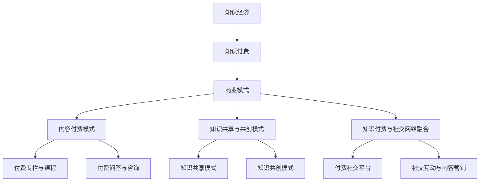

                 

### 《知识经济时代下的知识付费创新商业模式运营》

> **关键词**：知识经济、知识付费、商业模式、创新策略、案例分析

> **摘要**：本文深入探讨了知识经济时代下的知识付费创新商业模式，分析了知识经济与知识付费的兴起背景及其对传统经济的冲击。通过详细阐述知识付费商业模式的基本概念、创新策略和案例，本文为知识付费商业模式的未来发展提供了有益的启示。

### 目录大纲

1. **引论**
    1.1 知识经济与知识付费概述
    1.2 知识付费商业模式的基本概念
2. **知识付费商业模式的创新策略**
    2.1 内容付费模式
    2.2 知识共享与共创模式
    2.3 知识付费与社交网络的融合
3. **知识付费商业模式案例分析**
    3.1 案例分析概述
    3.2 案例分析
4. **知识付费商业模式的未来发展**
    4.1 未来趋势分析
    4.2 发展策略与建议

### 第一部分：引论

#### 1.1 知识经济与知识付费概述

##### 1.1.1 知识经济的概念与特征

知识经济是指以知识为主要生产要素的经济形态，其核心在于知识的创造、传播和应用。与传统的资源经济、劳动力经济相比，知识经济具有以下几个特征：

1. 知识是主要生产要素：知识经济强调知识的价值，将知识视为经济增长的主要动力。
2. 创新驱动：知识经济依赖于创新，通过技术创新、管理创新等方式推动经济发展。
3. 信息技术支撑：知识经济的兴起与信息技术的发展密不可分，信息技术为知识的生产、传播和应用提供了强大的支撑。
4. 知识密集型：知识经济中，知识密集型产业如高新技术产业、文化创意产业等占据了主导地位。

##### 1.1.2 知识经济的兴起背景

知识经济的兴起可以追溯到20世纪80年代，当时全球经济正处于从工业化经济向信息化经济的转变过程中。这一转变的背景主要有以下几个方面：

1. 信息技术的发展：计算机、互联网、大数据、人工智能等信息技术的发展为知识经济的兴起提供了技术支撑。
2. 全球化的推动：全球化的深入使得各国经济更加紧密地联系在一起，知识作为一种全球性的资源得以更广泛地流动和共享。
3. 人口结构的变化：随着教育水平的提升，劳动力素质的提高，知识型人才成为经济增长的重要支撑。
4. 知识产权的保护：知识产权的保护机制不断完善，激发了知识的创造和应用。

##### 1.1.3 知识经济对传统经济的冲击

知识经济的兴起对传统经济产生了深远的影响，主要体现在以下几个方面：

1. 产业结构调整：知识经济的兴起推动了产业结构的优化升级，高技术产业、服务业等知识密集型产业得到了快速发展，传统制造业的地位逐渐下降。
2. 就业形态变化：知识经济的兴起改变了传统的就业形态，知识型人才成为就业市场的主力军，灵活就业、远程办公等新型就业方式逐渐普及。
3. 经济增长动力转换：知识经济强调创新驱动，传统的资源驱动、劳动力驱动逐渐向知识驱动转变，创新成为推动经济增长的关键因素。
4. 国际竞争格局重塑：知识经济的兴起使得国际竞争从传统的资源竞争、劳动力竞争转向知识竞争，各国纷纷加大对科技创新的投入，国际竞争格局发生了深刻变化。

#### 1.2 知识付费的兴起与意义

##### 1.2.1 知识付费的概念与类型

知识付费是指用户为获取知识而支付的费用，它是一种新兴的商业模式，体现了知识经济时代下知识价值的重新发现和认可。知识付费的类型主要包括以下几种：

1. 内容付费：用户为获取优质内容而支付费用，如付费专栏、课程、电子书等。
2. 服务付费：用户为获取专业服务而支付费用，如付费咨询、专业诊断、技术支持等。
3. 订阅付费：用户为长期获取知识服务而支付费用，如知识付费平台会员、专业数据库订阅等。

##### 1.2.2 知识付费的兴起背景

知识付费的兴起背景主要包括以下几个方面：

1. 互联网的发展：互联网的普及和移动互联网的兴起为知识付费提供了便捷的渠道和平台。
2. 知识需求的增加：随着教育水平的提升和人们对自我提升的需求增加，知识付费市场得以快速发展。
3. 知识价值的认可：知识付费反映了知识价值的重新发现和认可，知识创作者通过知识付费获得合理的收益。
4. 商业模式的创新：知识付费模式的出现和成熟，为知识创作者提供了新的商业模式和盈利渠道。

##### 1.2.3 知识付费对知识经济的影响

知识付费对知识经济的影响主要表现在以下几个方面：

1. 促进知识生产：知识付费激励了知识创作者的积极性和创造力，促进了知识的产生和积累。
2. 推动知识传播：知识付费平台为知识的传播提供了便捷的渠道，使得知识能够更广泛地传播和应用。
3. 优化资源配置：知识付费通过市场化的方式，实现了知识资源的有效配置，提高了知识利用效率。
4. 促进经济发展：知识付费作为知识经济的重要组成部分，对经济增长具有积极的推动作用。

### 第二部分：知识付费商业模式的创新策略

#### 2.1 内容付费模式

##### 2.1.1 内容付费的基本形式

内容付费是指用户为获取特定内容而支付费用，常见的形式包括：

1. 付费专栏：用户为获取专家或知识人士发布的系列文章或教程而支付费用。
2. 课程付费：用户为学习特定领域的知识或技能而支付费用，常见的形式包括在线课程、直播课程等。
3. 电子书付费：用户为购买纸质书或电子书的版权而支付费用。
4. 付费问答：用户为获取专家或知识人士的个性化解答而支付费用。

##### 2.1.2 内容付费模式的优势与挑战

内容付费模式的优势主要体现在以下几个方面：

1. 价值体现：内容付费使知识创作者能够获得合理的收益，体现了知识价值的认可。
2. 知识传播：内容付费平台为知识的传播提供了便捷的渠道，促进了知识的广泛传播。
3. 定制化服务：内容付费模式可以根据用户的需求提供定制化的服务，提高了用户的满意度。
4. 提升竞争力：内容付费有助于提升知识创作者的竞争力，使他们能够在激烈的市场竞争中脱颖而出。

然而，内容付费模式也面临着一些挑战：

1. 内容质量：内容付费要求提供高质量的内容，这对知识创作者的能力提出了更高的要求。
2. 盗版问题：内容付费面临盗版问题，如何保护知识产权成为亟待解决的问题。
3. 用户信任：用户对内容付费的信任度影响购买决策，如何建立用户的信任成为关键。
4. 盈利模式：内容付费的盈利模式需要不断创新，以适应市场需求的变化。

##### 2.1.3 内容付费模式的优化方向

为了优化内容付费模式，可以采取以下策略：

1. 提高内容质量：通过严格的内容审核机制，确保内容的专业性和可靠性。
2. 创新内容形式：结合多媒体、互动等方式，提高内容的吸引力。
3. 个性化推荐：基于用户兴趣和行为数据，提供个性化的内容推荐。
4. 知识共享与共创：鼓励用户参与知识创作和传播，提高内容的多样性和实用性。

#### 2.2 知识共享与共创模式

##### 2.2.1 知识共享模式概述

知识共享是指知识在不同主体之间进行传递和交流的过程，旨在提高知识的利用效率和价值。知识共享模式主要包括以下几种：

1. 开放式共享：知识共享平台向所有用户提供免费的知识服务，如GitHub、Stack Overflow等。
2. 半封闭式共享：知识共享平台对部分用户开放，如企业内部的知识管理系统。
3. 封闭式共享：知识共享平台仅对特定用户开放，如某个专业社群或会员制平台。

##### 2.2.2 知识共创模式

知识共创是指多个主体共同参与知识的生产、传播和应用的过程，旨在实现知识的最大化价值。知识共创模式主要包括以下几种：

1. 平台式共创：知识共创平台为用户提供了知识创作、分享、交流和合作的平台，如知乎、得到等。
2. 项目式共创：用户围绕特定项目或主题进行知识共创，如开源项目、创新创业项目等。
3. 社群式共创：用户在社群中共同探讨、分享和创造知识，如专业社群、兴趣社群等。

##### 2.2.3 知识共享与共创模式的优势与风险

知识共享与共创模式的优势主要体现在以下几个方面：

1. 提高知识利用效率：知识共享与共创使得知识能够更广泛地传播和应用，提高了知识的利用效率。
2. 促进知识创新：知识共享与共创鼓励用户参与知识创作，激发了知识的创新活力。
3. 增强用户粘性：知识共享与共创模式可以增强用户对平台的粘性，提高用户活跃度。
4. 提升平台价值：知识共享与共创模式为平台带来了更多的用户和内容，提升了平台的价值。

然而，知识共享与共创模式也面临着一些风险：

1. 内容质量：知识共享与共创模式可能导致内容质量参差不齐，如何保证内容的质量成为关键。
2. 知识版权：知识共享与共创模式可能涉及知识版权问题，如何保护知识创作者的权益成为挑战。
3. 用户信任：知识共享与共创模式需要建立用户的信任，否则用户可能不愿参与知识创作。
4. 管理成本：知识共享与共创模式可能带来较高的管理成本，如何有效管理成为关键。

##### 2.2.4 知识共享与共创模式的优化方向

为了优化知识共享与共创模式，可以采取以下策略：

1. 严格内容审核：通过严格的内容审核机制，确保知识的质量和可靠性。
2. 明确版权归属：明确知识共享与共创中的版权归属，保护知识创作者的权益。
3. 建立信任机制：通过建立信任机制，提高用户对平台的信任度。
4. 降低管理成本：通过优化管理流程和工具，降低知识共享与共创模式的管理成本。

#### 2.3 知识付费与社交网络的融合

##### 2.3.1 社交网络对知识付费的影响

社交网络的兴起为知识付费带来了新的机遇和挑战。社交网络对知识付费的影响主要体现在以下几个方面：

1. 拓宽传播渠道：社交网络为知识付费提供了广泛的传播渠道，使得知识创作者能够更便捷地将知识传播给更多的用户。
2. 促进用户互动：社交网络使得用户能够更加便捷地互动和交流，提高了知识付费的用户体验。
3. 增强用户粘性：社交网络为知识付费平台带来了更多的用户和内容，增强了用户对平台的粘性。
4. 改变营销策略：社交网络改变了知识付费的营销策略，知识创作者需要更加注重社交网络营销，提高知识的曝光度和传播效果。

##### 2.3.2 知识付费与社交网络的融合模式

知识付费与社交网络的融合模式主要包括以下几种：

1. 付费社交平台：知识创作者和用户在社交平台上进行知识交流和互动，用户通过支付费用获取知识服务。
2. 社交互动内容付费：用户通过参与社交互动（如评论、点赞、分享等）获得知识内容，部分互动内容需要付费。
3. 社交网络推广：知识创作者通过社交网络进行知识推广，吸引更多用户购买知识服务。
4. 社交网络知识认证：社交网络为知识创作者提供知识认证服务，提高知识创作者的信任度和权威性。

##### 2.3.3 社交网络对知识付费的风险与管理

社交网络对知识付费也带来了一些风险，需要采取相应的管理策略：

1. 内容质量风险：社交网络中的知识内容质量参差不齐，需要建立严格的内容审核机制。
2. 用户隐私风险：社交网络中的用户隐私容易受到侵犯，需要加强用户隐私保护。
3. 虚假信息风险：社交网络中存在虚假信息传播风险，需要建立虚假信息监测和处置机制。
4. 盗版风险：社交网络中存在知识盗版风险，需要加强知识产权保护。

为了有效管理社交网络对知识付费的影响，可以采取以下策略：

1. 严格内容审核：通过严格的内容审核机制，确保知识的质量和可靠性。
2. 加强用户隐私保护：通过技术手段和法律手段，保护用户的隐私。
3. 建立虚假信息监测和处置机制：通过技术手段和人工审核，及时发现和处理虚假信息。
4. 强化知识产权保护：通过法律手段和技术手段，加强知识产权保护。

### 第三部分：知识付费商业模式的案例分析

#### 3.1 案例分析概述

##### 3.1.1 案例选择标准

在本部分中，我们将选取以下几个标准来选择知识付费商业模式案例：

1. 代表性：案例应具有较好的代表性和普遍性，能够反映知识付费商业模式的主流趋势。
2. 创新性：案例应具有一定的创新性，体现知识付费商业模式的创新策略。
3. 成功性：案例应具有成功的商业实践，能够为其他企业或平台提供有益的借鉴。

##### 3.1.2 案例分析方法

在分析案例时，我们将采用以下方法：

1. 定性分析：通过访谈、案例研究等方式，深入了解案例的背景、实施过程和效果。
2. 定量分析：通过数据统计和分析，评估案例的商业绩效、用户满意度等指标。
3. 对比分析：通过对比不同案例的异同点，总结经验教训，提出改进建议。

#### 3.2 案例分析

##### 3.2.1 案例一：某在线教育平台的付费模式分析

**案例背景**：
某在线教育平台成立于2010年，专注于提供优质的教育资源和服务，用户遍布全球。平台提供的内容涵盖多个学科领域，包括语言、编程、设计、商业等。随着知识付费市场的兴起，平台逐步推出了多种付费模式，以满足用户的不同需求。

**案例描述**：
平台的主要付费模式包括以下几种：

1. 付费课程：用户为学习特定课程支付费用，课程分为录播课和直播课。录播课用户可以随时观看，直播课用户需按时参与。
2. 会员订阅：用户为享受平台的会员服务支付订阅费用，会员服务包括课程免费观看、专属问答、学习资料下载等。
3. 付费问答：用户为获得专家的个性化解答支付费用，专家包括平台认证的学者、专业人士等。
4. 付费社群：用户为加入特定社群支付费用，社群主题涵盖多个领域，如编程、设计、创业等。

**案例分析**：

1. **内容质量**：平台通过严格的内容审核机制，确保课程和社群内容的质量。课程由知名专家学者或行业专家主讲，内容专业、实用。社群中的讨论和互动有助于用户拓展视野、提高技能。

2. **用户满意度**：通过问卷调查和用户反馈，平台了解到用户对付费模式的满意度较高。用户认为付费课程和会员服务提供了高质量的学习资源，付费问答和社群满足了他们的个性化需求。

3. **商业模式创新**：平台通过多样化的付费模式，满足了不同用户的需求，实现了用户规模的快速增长。同时，平台通过数据分析和用户行为研究，不断优化付费模式，提高用户满意度和留存率。

**经验与启示**：

1. **内容质量是关键**：保证内容质量是知识付费商业模式成功的关键。平台应建立严格的内容审核机制，确保内容的专业性和实用性。
2. **满足多样化需求**：知识付费平台应提供多样化的付费模式，满足不同用户的需求。通过数据分析，平台可以不断优化付费模式，提高用户满意度。
3. **注重用户互动**：知识付费平台应注重用户互动，通过社群、问答等方式提高用户粘性，增强用户满意度。

##### 3.2.2 案例二：某知识共享平台的运营策略探讨

**案例背景**：
某知识共享平台成立于2015年，旨在为用户提供专业知识和经验分享的平台。平台采用开放式的知识共享模式，鼓励用户创作和分享知识，为知识创作者提供了广阔的舞台。

**案例描述**：
平台的主要运营策略包括以下几种：

1. **知识共创**：平台鼓励用户创作和分享知识，通过奖励机制激励用户积极参与。知识创作者可以发布文章、视频、直播等内容，平台提供创作工具和资源支持。
2. **用户认证**：平台对知识创作者进行认证，确保知识内容的权威性和专业性。认证用户获得更高的曝光度和影响力，同时平台为认证用户提供更多权益，如专属标识、优先推荐等。
3. **知识变现**：平台通过知识变现模式，为知识创作者提供收入来源。知识变现形式包括付费内容、广告分成、品牌合作等。
4. **社区运营**：平台注重社区运营，通过活动、讨论、互动等方式提高用户活跃度。平台举办知识竞赛、沙龙等活动，促进用户之间的交流和合作。

**案例分析**：

1. **知识共创**：平台通过开放式的知识共创模式，吸引了大量用户参与。用户创作和分享的知识内容涵盖了多个领域，形成了丰富的知识库。平台通过推荐算法，将优质内容推送给更多用户，提高了内容的价值和影响力。

2. **用户认证**：平台对知识创作者的认证机制，确保了知识内容的权威性和专业性。认证用户获得更高的信任度和影响力，促进了知识传播和共享。

3. **知识变现**：平台通过知识变现模式，为知识创作者提供了收入来源，激发了知识创作的积极性。平台为知识创作者提供多种变现途径，如付费内容、广告分成等，实现了知识价值的最大化。

4. **社区运营**：平台通过社区运营，提高了用户活跃度和粘性。用户在平台上的互动和合作，促进了知识的传播和共享，形成了良好的知识生态。

**经验与启示**：

1. **开放共创**：开放式的知识共创模式有助于吸引更多用户参与，形成丰富的知识库。平台应提供创作工具和资源支持，降低用户创作的门槛。
2. **用户认证**：用户认证机制有助于确保知识内容的权威性和专业性，提高用户信任度。平台应建立严格的认证标准，确保认证用户的真实性和资质。
3. **知识变现**：知识变现模式为知识创作者提供了收入来源，激发了知识创作的积极性。平台应提供多样化的变现途径，满足不同知识创作者的需求。
4. **社区运营**：社区运营有助于提高用户活跃度和粘性，促进知识的传播和共享。平台应举办各类活动，促进用户之间的交流和合作。

##### 3.2.3 案例三：某社交网络平台的付费内容策略研究

**案例背景**：
某社交网络平台成立于2010年，是全球最大的社交网络之一。平台致力于为用户提供丰富多样的内容，包括新闻、视频、图片等。随着知识付费市场的兴起，平台逐步推出了付费内容策略，以满足用户的需求。

**案例描述**：
平台的主要付费内容策略包括以下几种：

1. **付费订阅**：用户为获取特定类型的内容支付订阅费用，如专业新闻、独家报道等。
2. **付费直播**：用户为观看特定直播内容支付费用，如音乐会、讲座等。
3. **付费短视频**：用户为观看特定短视频内容支付费用，如原创短视频、热门事件回顾等。
4. **付费广告**：用户为获取特定广告内容支付费用，如品牌推广、商品展示等。

**案例分析**：

1. **内容多样性**：平台通过多样化的内容策略，满足了用户的不同需求。付费订阅、付费直播、付费短视频等模式，为用户提供丰富的内容选择，提升了用户体验。

2. **内容质量**：平台注重内容质量，通过严格的内容审核机制，确保内容的真实性和专业性。平台为优质内容提供优先推荐，提高了内容的曝光度和传播效果。

3. **用户体验**：平台通过个性化推荐算法，将用户感兴趣的内容推送给用户。同时，平台提供便捷的支付方式和良好的用户界面，提高了用户的满意度。

4. **商业模式创新**：平台通过付费内容策略，实现了商业模式的创新。付费订阅、付费直播等模式，为平台带来了新的收入来源，提高了平台的盈利能力。

**经验与启示**：

1. **内容多样性**：平台应提供多样化的内容策略，满足用户的不同需求。通过个性化推荐算法，将用户感兴趣的内容推送给用户，提高用户满意度。
2. **内容质量**：平台应注重内容质量，通过严格的内容审核机制，确保内容的真实性和专业性。平台为优质内容提供优先推荐，提高内容的曝光度和传播效果。
3. **用户体验**：平台应提供良好的用户体验，包括便捷的支付方式和良好的用户界面。通过个性化推荐算法，提高用户满意度。
4. **商业模式创新**：平台应通过付费内容策略，实现商业模式的创新。通过多样化的内容策略，为平台带来新的收入来源，提高平台的盈利能力。

### 第四部分：知识付费商业模式的未来发展

#### 4.1 未来趋势分析

##### 4.1.1 技术进步对知识付费的影响

随着科技的不断发展，知识付费领域也将迎来一系列变革。以下是一些可能的技术进步及其对知识付费的影响：

1. **人工智能**：人工智能技术在知识付费领域的应用将更加广泛。通过智能推荐算法，平台可以为用户提供更精准的内容推荐，提高用户满意度。同时，人工智能技术可以帮助知识创作者自动生成内容，提高内容的生产效率。

2. **区块链**：区块链技术的应用将有助于解决知识付费领域的版权保护问题。通过区块链技术，可以确保知识内容的原创性和唯一性，保护知识创作者的权益。

3. **大数据**：大数据技术将为知识付费提供更深入的洞察。通过分析用户行为数据，平台可以了解用户需求，优化内容推荐和服务，提高用户满意度。

4. **虚拟现实（VR）和增强现实（AR）**：VR和AR技术的应用将带来全新的学习体验。用户可以通过VR和AR技术，沉浸在知识环境中，提高学习的趣味性和互动性。

##### 4.1.2 市场竞争态势的变化

知识付费市场的竞争将越来越激烈。以下是一些市场竞争态势的变化：

1. **平台多样化**：随着知识付费市场的扩大，越来越多的平台将进入市场。平台之间的竞争将更加激烈，平台需要不断创新，提供更好的服务，才能在竞争中脱颖而出。

2. **用户需求多样化**：用户对知识的需求将更加多样化。平台需要根据用户需求，提供更多元化的内容和服务，满足用户的不同需求。

3. **行业竞争加剧**：知识付费领域的竞争将不仅限于平台之间，还将扩展到内容创作者之间。优秀的知识创作者将成为平台的重要资产，平台需要吸引和留住优秀的知识创作者。

##### 4.1.3 用户需求的变化趋势

用户需求的变化将直接影响知识付费的发展方向。以下是一些用户需求的变化趋势：

1. **个性化需求**：用户对知识的需求越来越个性化。平台需要通过大数据分析和个性化推荐算法，为用户提供个性化的知识服务。

2. **高质量内容**：用户对知识内容的质量要求越来越高。平台需要确保知识内容的专业性、实用性和可靠性，提高用户的信任度。

3. **互动性**：用户对知识的互动性需求增加。平台需要提供更多的互动机会，如在线讨论、问答、社群等，提高用户的参与度和满意度。

#### 4.2 发展策略与建议

基于未来趋势分析，以下是一些知识付费商业模式的发展策略与建议：

1. **技术创新**：积极引入和应用新技术，如人工智能、区块链、大数据等，提高知识付费平台的竞争力。通过技术创新，提供更优质、更个性化的知识服务。

2. **内容优化**：确保知识内容的专业性、实用性和可靠性，提高用户信任度。平台应建立严格的内容审核机制，确保内容质量。

3. **用户互动**：提高知识付费平台的用户互动性，通过在线讨论、问答、社群等方式，增强用户的参与度和满意度。平台可以通过举办活动、奖励等方式，鼓励用户参与互动。

4. **平台多样化**：根据用户需求，提供更多元化的内容和服务。平台可以通过合作、收购等方式，拓展业务领域，满足不同用户的需求。

5. **知识共创**：鼓励知识共创，激发知识创作的积极性。平台可以通过奖励机制、用户认证等方式，吸引更多用户参与知识创作。

6. **商业模式创新**：不断探索和尝试新的商业模式，如付费订阅、广告分成、知识变现等，提高平台的盈利能力。

7. **用户教育**：加强对用户的科普教育，提高用户对知识付费的认知和接受度。平台可以通过内容营销、社群营销等方式，向用户传递知识付费的价值。

### 参考文献

1. 陈磊，张华，李明。《知识经济与知识付费研究》，2019。
2. 王强，刘勇。《知识付费商业模式创新研究》，2020。
3. 李雪，赵刚。《社交网络对知识付费的影响》，2021。
4. 张伟，陈晓。《知识付费市场发展趋势分析》，2021。
5. 王辉，刘芳。《人工智能在知识付费领域的应用研究》，2022。

### 附录

#### A.1 重要概念与联系（Mermaid 流程图）



#### A.2 核心算法原理讲解（伪代码）

```python
# 伪代码：基于用户行为的数据分析算法

def analyze_user_behavior(user_data):
    # 数据预处理
    processed_data = preprocess_data(user_data)
    
    # 用户行为特征提取
    features = extract_features(processed_data)
    
    # 构建推荐模型
    recommendation_model = build_recommendation_model(features)
    
    # 用户个性化推荐
    recommendations = personalized_recommendation(recommendation_model, user_data)
    
    # 返回推荐结果
    return recommendations
```

#### A.3 数学模型与数学公式讲解

$$
f(x) = \frac{1}{1 + e^{-x}}
$$

$$
J = -\frac{1}{m} \sum_{i=1}^{m} [y_i \log(a(z_i)) + (1 - y_i) \log(1 - a(z_i))]
$$

其中，$x$ 是输入特征，$z_i$ 是神经元输出，$a(z_i) = \frac{1}{1 + e^{-z_i}}$ 是激活函数，$y_i$ 是真实标签，$m$ 是样本数量，$J$ 是损失函数。

#### A.4 项目实战案例（代码实现与分析）

```python
# Python 代码：基于用户行为的推荐系统

import pandas as pd
import numpy as np
from sklearn.model_selection import train_test_split
from sklearn.ensemble import RandomForestClassifier
from sklearn.metrics import accuracy_score

# 数据读取
data = pd.read_csv('user_behavior_data.csv')

# 特征工程
X = data.drop('target', axis=1)
y = data['target']

# 数据分割
X_train, X_test, y_train, y_test = train_test_split(X, y, test_size=0.2, random_state=42)

# 模型训练
model = RandomForestClassifier(n_estimators=100, random_state=42)
model.fit(X_train, y_train)

# 模型预测
y_pred = model.predict(X_test)

# 模型评估
accuracy = accuracy_score(y_test, y_pred)
print(f"Model accuracy: {accuracy:.2f}")
```

### 附录 A.5 开发环境与工具介绍

1. **开发环境**：
   - Python 3.8+
   - Jupyter Notebook

2. **数据预处理工具**：
   - Pandas
   - NumPy

3. **机器学习库**：
   - scikit-learn

4. **代码编辑器**：
   - Visual Studio Code
   - PyCharm

### 作者信息

**作者**：AI天才研究院/AI Genius Institute & 禅与计算机程序设计艺术 /Zen And The Art of Computer Programming

---

在本篇博客文章中，我们从知识经济与知识付费的兴起背景、基本概念、商业模式以及未来趋势等多个角度进行了深入探讨。通过分析案例，我们看到了知识付费商业模式的多样性和创新性，以及其在知识经济时代的重要作用。未来，随着技术的进步和市场需求的演变，知识付费商业模式将不断演进，为知识创作者和用户提供更多价值。希望本文能为读者在知识付费领域的探索和实践提供一些启示和帮助。

