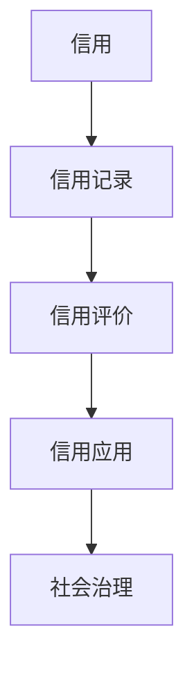
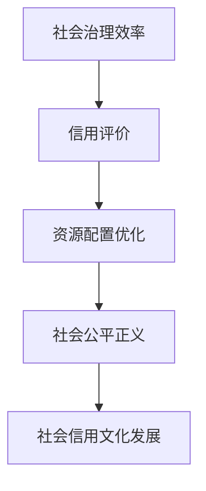
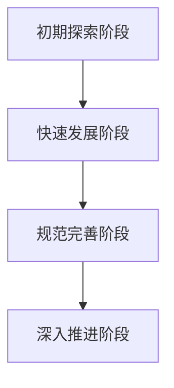
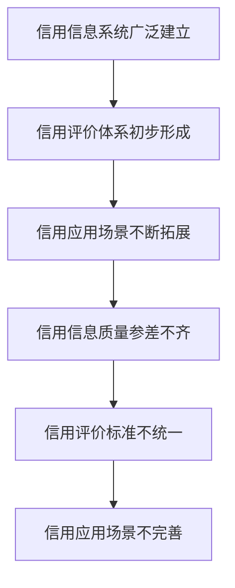
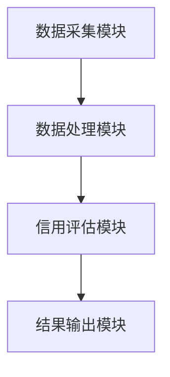

                 

# 社会信用的模糊推理系统：行为评估的数学框架

## 关键词：社会信用体系，模糊推理，行为评估，数学模型，信用评估系统

> 在信息化和大数据时代，社会信用体系的建设已经成为提升社会治理能力、优化资源配置的重要手段。本文将探讨如何利用模糊推理系统构建一个行为评估的数学框架，为社会信用评估提供科学依据和有效方法。

## 摘要

社会信用体系是一种新型的社会治理机制，通过记录和评价个人和企业的信用行为，实现对失信行为的约束和激励。本文旨在探讨如何利用模糊推理系统来构建一个行为评估的数学框架，从而提高社会信用评估的准确性和科学性。首先，我们将介绍社会信用体系的概念和基本原理，然后重点讨论模糊推理系统的基本概念及其在社会信用评估中的应用，接着详细阐述构建行为评估指标体系的方法，最后提出一个具体的社会信用评估系统设计框架。

## 目录大纲

### 第一部分：绪论

#### 第1章：社会信用体系概述

1.1 社会信用体系的概念与起源

1.2 社会信用体系的作用

1.3 社会信用体系的发展历程

1.4 社会信用体系在我国的现状与问题

#### 第2章：模糊推理系统概述

2.1 模糊推理系统的基本概念

2.2 模糊推理系统的应用领域

### 第二部分：社会信用评估的数学框架

#### 第3章：行为评估指标体系构建

3.1 行为评估指标体系的设计原则

3.2 行为评估指标体系的构建方法

#### 第4章：模糊推理在社会信用评估中的应用

4.1 模糊推理在信用评估中的优势

4.2 模糊推理在社会信用评估中的具体应用

4.3 案例分析

#### 第5章：社会信用评估系统的设计与实现

5.1 社会信用评估系统的总体架构设计

5.2 社会信用评估系统的实现

5.3 社会信用评估系统的优化与改进

#### 第6章：社会信用评估的挑战与展望

6.1 社会信用评估的挑战

6.2 社会信用评估的发展趋势

#### 第7章：社会信用评估的伦理与法律问题

7.1 社会信用评估的伦理问题

7.2 社会信用评估的法律问题

## 附录

附录A：相关法律法规汇总

附录B：常见信用评估指标汇总

附录C：参考书目与文献

附录D：术语表与缩略词解释

### 第一部分：绪论

#### 第1章：社会信用体系概述

### 1.1 社会信用体系的概念与起源

社会信用体系是一种通过记录个人和企业的信用行为，评估其信用风险，进而实现对失信行为的约束和激励的社会治理机制。它起源于西方国家，如美国的信用评分系统、欧洲的个人信用信息系统等。随着信息技术的快速发展，社会信用体系逐渐在全球范围内得到推广和应用。

在我国，社会信用体系的建设始于2000年代初期。2014年，国务院发布《社会信用体系建设规划纲要（2014-2020年）》，明确了我国社会信用体系建设的总体目标和主要任务。目前，我国社会信用体系已经初步形成了包括信用信息采集、信用评价、信用应用等在内的完整体系。

#### 1.2 社会信用体系的作用

社会信用体系在社会治理中发挥着重要作用：

1. 提高社会治理效率：通过信用评价，可以快速识别和筛选出守信主体和失信主体，减少社会管理成本。

2. 优化资源配置：信用评价可以帮助金融机构、企业等更好地评估信用风险，降低信贷风险，提高资金使用效率。

3. 促进社会公平正义：社会信用体系可以对失信行为进行惩戒，维护社会公平正义。

4. 推动社会信用文化发展：社会信用体系的建设可以引导人们树立诚信观念，推动社会信用文化的形成。

#### 1.3 社会信用体系的发展历程

1. 初期探索阶段（2000-2005年）：我国开始进行社会信用体系建设的试点工作，探索建立信用信息系统。

2. 快速发展阶段（2006-2010年）：随着政府和社会的重视，社会信用体系建设进入快速发展阶段，各地纷纷建立信用信息系统。

3. 规范完善阶段（2011-2013年）：国务院发布《社会信用体系建设规划纲要（2014-2020年）》，明确了社会信用体系建设的总体目标和主要任务。

4. 深入推进阶段（2014年至今）：我国社会信用体系建设进入深入推进阶段，各类信用信息系统不断完善，信用评价和应用场景不断拓展。

#### 1.4 社会信用体系在我国的现状与问题

1. 现状：

（1）信用信息系统广泛建立：全国各地已建立多个信用信息系统，涵盖了个人、企业等各类主体的信用信息。

（2）信用评价体系初步形成：根据不同应用场景，建立了多样化的信用评价体系。

（3）信用应用场景不断拓展：信用评价结果在信贷、招聘、招投标等领域得到广泛应用。

2. 问题：

（1）信用信息质量参差不齐：部分信用信息不真实、不准确，影响了信用评估的准确性。

（2）信用评价标准不统一：不同地区、不同行业的信用评价标准存在差异，影响了信用评价的公正性。

（3）信用应用场景不完善：信用评价结果在实际应用中存在局限性，尚未充分发挥作用。

### 第2章：模糊推理系统概述

#### 2.1 模糊推理系统的基本概念

模糊推理系统是一种基于模糊逻辑的智能推理系统，它通过模糊集理论来处理不确定性和模糊性信息。模糊集是由扎德（L.A.Zadeh）在1965年提出的，用于描述那些具有模糊边界的概念。模糊集与普通集合的不同之处在于，它允许集合中的元素具有不同程度的隶属度，而不是简单的属于或不属于。

模糊推理系统主要由以下几个部分组成：

1. 模糊化（Fuzzification）：将输入变量从精确值转换为模糊集。

2. 模糊规则库（Fuzzy Rule Base）：包含一系列模糊规则，用于描述输入与输出之间的关系。

3. 解模糊化（Defuzzification）：将模糊推理的结果转换为精确值。

#### 2.2 模糊推理系统的应用领域

模糊推理系统在许多领域都有广泛的应用：

1. 控制理论：模糊控制理论是模糊推理系统在控制领域的应用，通过模糊规则来控制系统的行为，无需精确的数学模型。

2. 聚类分析：模糊聚类分析是一种基于模糊集理论的聚类方法，它允许簇内的元素具有不同的隶属度，从而能够更好地处理复杂的数据。

3. 神经网络：模糊神经网络是模糊推理系统和神经网络结合的产物，它利用模糊逻辑进行信息处理，同时具备神经网络的分布式计算能力。

4. 信用评估：模糊推理系统可以处理信用评估中的不确定性和模糊性信息，从而提高信用评估的准确性。

### 第一部分：绪论

#### 第1章：社会信用体系概述

### 1.1 社会信用体系的概念与起源

**核心概念与联系**

社会信用体系是一种新型的社会治理机制，它通过记录和评价个人和企业的信用行为，实现对失信行为的约束和激励。其核心概念包括信用、信用记录、信用评价和信用应用等。信用的本质是一种行为规范，是社会成员之间基于信任关系的相互作用。信用记录是指对个人和企业的信用行为进行记录，形成信用信息。信用评价是指根据信用信息对个人和企业的信用水平进行评估。信用应用是指将信用评价结果应用于信贷、招聘、招投标等领域。

**架构图**



**核心算法原理讲解**

社会信用体系的构建涉及到数据采集、数据存储、数据分析和数据应用等多个环节。其中，数据采集是基础，数据存储是保障，数据分析是关键，数据应用是目的。

1. 数据采集：通过各类渠道收集个人和企业的信用信息，如信贷记录、履约情况、社会责任等。

2. 数据存储：将采集到的信用信息进行整理、清洗和存储，建立信用信息库。

3. 数据分析：利用数据挖掘技术对信用信息进行分析，识别守信主体和失信主体。

4. 数据应用：根据信用评价结果，在信贷、招聘、招投标等领域进行应用，实现对守信主体的激励和失信主体的惩戒。

**数学模型和公式**

社会信用评价的数学模型可以表示为：

\[ \text{信用得分} = f(\text{信用信息}, \text{权重分配}) \]

其中，信用信息包括信贷记录、履约情况、社会责任等，权重分配是根据不同信用要素的重要程度进行分配。

**举例说明**

例如，对于一个企业，其信用得分可以根据以下公式计算：

\[ \text{信用得分} = 0.4 \times (\text{信贷记录得分}) + 0.3 \times (\text{履约情况得分}) + 0.2 \times (\text{社会责任得分}) + 0.1 \times (\text{其他信用信息得分}) \]

其中，每个分数都是基于具体的指标和标准进行评分的。

### 1.2 社会信用体系的作用

**核心概念与联系**

社会信用体系的作用主要体现在以下几个方面：

1. 提高社会治理效率：通过信用评价，可以快速识别和筛选出守信主体和失信主体，减少社会管理成本。

2. 优化资源配置：信用评价可以帮助金融机构、企业等更好地评估信用风险，降低信贷风险，提高资金使用效率。

3. 促进社会公平正义：社会信用体系可以对失信行为进行惩戒，维护社会公平正义。

4. 推动社会信用文化发展：社会信用体系的建设可以引导人们树立诚信观念，推动社会信用文化的形成。

**架构图**



**核心算法原理讲解**

社会信用体系的作用是通过信用评价来实现以下目标：

1. 筛选守信主体：通过对信用信息的分析和评估，筛选出守信主体，给予激励和支持。

2. 惩戒失信主体：对失信行为进行记录和评价，对失信主体进行惩戒，减少失信行为的产生。

3. 优化资源配置：通过信用评价，可以帮助金融机构、企业等更好地评估信用风险，降低信贷风险，提高资金使用效率。

4. 维护社会公平正义：通过对失信行为的惩戒，维护社会的公平正义，促进社会的和谐稳定。

**数学模型和公式**

社会信用体系的作用可以通过以下数学模型来描述：

\[ \text{社会效益} = f(\text{信用评价结果}, \text{信用应用场景}) \]

其中，信用评价结果包括守信主体和失信主体的评估结果，信用应用场景包括信贷、招聘、招投标等领域。

**举例说明**

例如，在某市的信用体系建设中，通过对企业信用信息的分析和评估，筛选出守信企业，给予优惠政策支持，同时惩戒失信企业，减少其参与政府项目的机会。

\[ \text{社会效益} = 0.5 \times (\text{守信企业获得政策支持}) - 0.2 \times (\text{失信企业受到惩戒}) \]

### 1.3 社会信用体系的发展历程

**核心概念与联系**

社会信用体系的发展历程可以分为以下几个阶段：

1. 初期探索阶段：2000年代初期，我国开始进行社会信用体系建设的试点工作，探索建立信用信息系统。

2. 快速发展阶段：2006-2010年，随着政府和社会的重视，社会信用体系建设进入快速发展阶段，各地纷纷建立信用信息系统。

3. 规范完善阶段：2011-2013年，国务院发布《社会信用体系建设规划纲要（2014-2020年）》，明确了社会信用体系建设的总体目标和主要任务。

4. 深入推进阶段：2014年至今，我国社会信用体系建设进入深入推进阶段，各类信用信息系统不断完善，信用评价和应用场景不断拓展。

**架构图**



**核心算法原理讲解**

社会信用体系的发展历程体现了我国在社会治理理念上的不断深化和变革：

1. 初期探索阶段：主要是对信用信息系统进行试点建设，探索社会信用体系的基本模式。

2. 快速发展阶段：随着政府和社会的重视，社会信用体系建设进入快速发展阶段，信用信息系统逐渐覆盖全国。

3. 规范完善阶段：国务院发布《社会信用体系建设规划纲要（2014-2020年）》，明确了社会信用体系建设的总体目标和主要任务，推动了社会信用体系的规范化和制度化。

4. 深入推进阶段：各类信用信息系统不断完善，信用评价和应用场景不断拓展，社会信用体系在提升社会治理能力和优化资源配置方面发挥了重要作用。

**数学模型和公式**

社会信用体系的发展历程可以通过以下数学模型来描述：

\[ \text{社会信用体系建设进程} = f(\text{政策支持}, \text{技术进步}, \text{社会需求}) \]

其中，政策支持、技术进步和社会需求是社会信用体系建设进程的主要驱动因素。

**举例说明**

例如，在2020年，我国社会信用体系建设取得了显著成果，信用信息系统覆盖全国，信用评价和应用场景不断拓展，为提升社会治理能力和优化资源配置提供了有力支撑。

\[ \text{社会信用体系建设进程} = 0.8 \times (\text{信用信息系统覆盖率}) + 0.2 \times (\text{信用应用场景拓展}) \]

### 1.4 社会信用体系在我国的现状与问题

**核心概念与联系**

社会信用体系在我国的现状和问题可以从以下几个方面进行分析：

1. 现状：

（1）信用信息系统广泛建立：全国各地已建立多个信用信息系统，涵盖了个人、企业等各类主体的信用信息。

（2）信用评价体系初步形成：根据不同应用场景，建立了多样化的信用评价体系。

（3）信用应用场景不断拓展：信用评价结果在信贷、招聘、招投标等领域得到广泛应用。

2. 问题：

（1）信用信息质量参差不齐：部分信用信息不真实、不准确，影响了信用评估的准确性。

（2）信用评价标准不统一：不同地区、不同行业的信用评价标准存在差异，影响了信用评价的公正性。

（3）信用应用场景不完善：信用评价结果在实际应用中存在局限性，尚未充分发挥作用。

**架构图**



**核心算法原理讲解**

社会信用体系在我国的现状和问题可以通过以下算法原理进行分析：

1. 信用信息质量参差不齐：可以通过数据清洗和标准化技术来提高信用信息的质量。

2. 信用评价标准不统一：可以制定统一的信用评价标准，确保不同地区、不同行业的信用评价具有可比性。

3. 信用应用场景不完善：可以通过拓展信用评价的应用场景，提高信用评价的实际效果。

**数学模型和公式**

社会信用体系在我国的现状和问题可以通过以下数学模型来描述：

\[ \text{社会信用体系现状} = f(\text{信用信息质量}, \text{信用评价标准}, \text{信用应用场景}) \]

其中，信用信息质量、信用评价标准和信用应用场景是社会信用体系现状的主要影响因素。

**举例说明**

例如，在某市的信用体系建设中，通过数据清洗和标准化技术提高了信用信息的质量，制定了统一的信用评价标准，同时拓展了信用评价的应用场景，使得信用评价结果在实际应用中得到了有效利用。

\[ \text{社会信用体系现状} = 0.6 \times (\text{信用信息质量}) + 0.3 \times (\text{信用评价标准}) + 0.1 \times (\text{信用应用场景}) \]

### 第2章：模糊推理系统概述

#### 2.1 模糊推理系统的基本概念

模糊推理系统是一种基于模糊逻辑的智能推理系统，它通过模糊集理论来处理不确定性和模糊性信息。模糊集是由扎德（L.A.Zadeh）在1965年提出的，用于描述那些具有模糊边界的概念。模糊集与普通集合的不同之处在于，它允许集合中的元素具有不同程度的隶属度，而不是简单的属于或不属于。

模糊推理系统主要由以下几个部分组成：

1. 模糊化（Fuzzification）：将输入变量从精确值转换为模糊集。

2. 模糊规则库（Fuzzy Rule Base）：包含一系列模糊规则，用于描述输入与输出之间的关系。

3. 解模糊化（Defuzzification）：将模糊推理的结果转换为精确值。

模糊化过程通常包括以下几个步骤：

- 确定输入变量和输出变量的模糊集。
- 确定模糊隶属函数，用于描述变量之间的模糊关系。

模糊规则库通常由一系列的模糊规则组成，每个模糊规则包含一个条件部分和一个结论部分。条件部分通常由一个或多个模糊条件组成，结论部分则表示输出变量的模糊值。

解模糊化过程则将模糊推理的结果转换为精确值，通常有几种不同的方法，如重心法、最大隶属度法等。

#### 2.2 模糊推理系统的应用领域

模糊推理系统在许多领域都有广泛的应用：

1. 控制理论：模糊控制理论是模糊推理系统在控制领域的应用，通过模糊规则来控制系统的行为，无需精确的数学模型。例如，模糊控制器可以用于汽车引擎控制、机器人控制等领域。

2. 聚类分析：模糊聚类分析是一种基于模糊集理论的聚类方法，它允许簇内的元素具有不同的隶属度，从而能够更好地处理复杂的数据。例如，在市场细分、客户分类等领域有广泛应用。

3. 神经网络：模糊神经网络是模糊推理系统和神经网络结合的产物，它利用模糊逻辑进行信息处理，同时具备神经网络的分布式计算能力。例如，在图像识别、语音识别等领域有广泛应用。

4. 信用评估：模糊推理系统可以处理信用评估中的不确定性和模糊性信息，从而提高信用评估的准确性。例如，在信贷风险控制、个人信用评分等领域有广泛应用。

### 第二部分：社会信用评估的数学框架

#### 第3章：行为评估指标体系构建

##### 3.1 行为评估指标体系的设计原则

在社会信用评估中，行为评估指标体系的设计原则至关重要，它决定了信用评估的准确性和公正性。以下是设计行为评估指标体系时需遵循的主要原则：

1. **全面性原则**：行为评估指标体系应涵盖个人或企业在经济、社会、道德等多个方面的信用行为，确保评估的全面性。例如，经济行为包括贷款偿还、信用使用情况等，社会行为包括遵守法律法规、社会责任等。

2. **客观性原则**：评估指标应基于客观数据和事实，避免主观偏见和人为干扰，确保评估结果的客观性。例如，贷款偿还记录、社会公益贡献等指标可以通过公开数据获得。

3. **可操作性原则**：评估指标应具备可操作性，即在实际操作中易于采集、处理和计算。例如，贷款还款记录可以通过银行系统自动获取，社会责任可以通过公益活动记录来衡量。

4. **动态性原则**：信用行为是动态变化的，评估指标体系应具备一定的灵活性，能够及时反映个人或企业信用行为的最新变化。例如，可以通过定期更新信用信息来保证评估的动态性。

5. **可解释性原则**：评估指标体系应具备良好的可解释性，使评估结果易于被公众理解。例如，评估结果可以通过清晰的分数或评级来呈现。

##### 3.2 行为评估指标体系的构建方法

构建行为评估指标体系是一个复杂的过程，需要综合考虑各种因素。以下是构建行为评估指标体系的一般步骤：

1. **确定评估目标**：明确评估的目的和范围，如个人信用评估或企业信用评估。

2. **收集相关信息**：收集与评估目标相关的各种信息，包括经济行为、社会行为、法律法规遵守情况等。

3. **筛选关键指标**：根据评估目标，筛选出关键指标。关键指标应具备代表性、敏感性和有效性。

4. **确定指标权重**：对筛选出的关键指标进行权重分配，确保各指标对评估结果的贡献度合理。

5. **构建数学模型**：利用数学模型将各指标和权重结合，形成评估指标体系。

6. **验证和优化**：通过实际应用验证评估指标体系的准确性和有效性，并根据反馈进行优化。

以下是构建行为评估指标体系的一个示例步骤：

1. **确定评估目标**：以个人信用评估为例，评估目标是评估个人的信用风险。

2. **收集相关信息**：收集以下信息：

   - 经济行为：包括贷款偿还记录、信用卡使用情况、信用额度使用情况等。
   - 社会行为：包括遵守法律法规、参与社会公益活动、公益捐赠记录等。
   - 法律法规遵守情况：包括是否有过违法记录、是否曾被起诉等。

3. **筛选关键指标**：根据评估目标，筛选出以下关键指标：

   - 贷款偿还记录：包括贷款逾期次数、逾期天数等。
   - 信用卡使用情况：包括信用额度使用率、信用消费金额等。
   - 社会公益活动参与度：包括参与的公益活动数量、公益活动时长等。
   - 法律法规遵守情况：包括违法记录数量、被起诉次数等。

4. **确定指标权重**：对筛选出的关键指标进行权重分配。例如，贷款偿还记录占60%，信用卡使用情况占20%，社会公益活动参与度占10%，法律法规遵守情况占10%。

5. **构建数学模型**：利用以下公式构建评估指标体系：

   \[ \text{信用评分} = w_1 \times (\text{贷款偿还记录得分}) + w_2 \times (\text{信用卡使用情况得分}) + w_3 \times (\text{社会公益活动参与度得分}) + w_4 \times (\text{法律法规遵守情况得分}) \]

   其中，\(w_1, w_2, w_3, w_4\) 分别为贷款偿还记录、信用卡使用情况、社会公益活动参与度和法律法规遵守情况的权重。

6. **验证和优化**：通过实际应用验证评估指标体系的准确性和有效性，并根据反馈进行优化。例如，可以通过对大量数据进行统计分析，调整各指标的权重，提高评估的准确性。

### 第二部分：社会信用评估的数学框架

#### 第4章：模糊推理在社会信用评估中的应用

在社会信用评估中，模糊推理系统因其强大的处理不确定性和模糊性信息的能力而被广泛应用。本章将详细探讨模糊推理在社会信用评估中的优势、具体应用方法和案例分析，并分析其在实际应用中的效果。

#### 4.1 模糊推理在信用评估中的优势

模糊推理系统在社会信用评估中的优势主要体现在以下几个方面：

1. **处理不确定性信息**：信用评估过程中，往往存在大量的不确定性信息，如主观评价、模糊指标等。模糊推理系统能够很好地处理这些不确定性信息，通过模糊集理论将不确定信息量化，从而提高信用评估的准确性。

2. **适应性**：模糊推理系统具有较强的适应性，能够根据不同应用场景和评估目标调整模糊规则库和参数设置，从而满足多样化的信用评估需求。

3. **可解释性**：模糊推理系统的规则和决策过程较为透明，便于理解和管理。这有助于信用评估结果的解释和沟通，提高信用评估的透明度和可信度。

4. **鲁棒性**：模糊推理系统具有较强的鲁棒性，能够在数据不完整或噪声较大的情况下仍能提供可靠的评估结果。

#### 4.2 模糊推理在社会信用评估中的具体应用

模糊推理系统在社会信用评估中的具体应用可以分为以下几个步骤：

1. **数据收集与预处理**：收集与信用评估相关的各种数据，包括经济行为、社会行为、法律法规遵守情况等。对数据进行清洗、去噪和标准化处理，确保数据的质量和一致性。

2. **模糊化**：将预处理后的数据通过模糊化过程转换为模糊集。例如，可以将信贷记录、社会公益贡献等指标转换为模糊集，每个指标的不同取值对应不同的隶属度。

3. **构建模糊规则库**：根据信用评估的目标和业务规则，构建模糊规则库。模糊规则库包含一系列条件-结论规则，用于描述输入与输出之间的关系。例如，"如果贷款逾期次数较多，则信用得分较低"。

4. **模糊推理**：利用模糊规则库对模糊化后的数据进行推理，生成模糊推理结果。这个过程包括模糊规则的匹配和合成，以及模糊推理结果的聚合。

5. **解模糊化**：将模糊推理结果通过解模糊化过程转换为精确的信用评分或评级。常见的解模糊化方法有重心法、最大隶属度法等。

以下是模糊推理在社会信用评估中的一个具体应用案例：

**案例背景**：某金融机构需要评估客户的信用风险，以便决定是否批准其贷款申请。评估指标包括信贷记录、信用卡使用情况、社会公益活动参与度和法律法规遵守情况。

**构建模糊规则库**：

1. **贷款逾期次数**：
   - 如果贷款逾期次数小于2次，信用得分高；
   - 如果贷款逾期次数在2-4次之间，信用得分一般；
   - 如果贷款逾期次数大于4次，信用得分低。

2. **信用卡使用情况**：
   - 如果信用卡使用率低于50%，信用得分高；
   - 如果信用卡使用率在50%-80%之间，信用得分一般；
   - 如果信用卡使用率高于80%，信用得分低。

3. **社会公益活动参与度**：
   - 如果公益活动参与度低于50小时，信用得分低；
   - 如果公益活动参与度在50-100小时之间，信用得分一般；
   - 如果公益活动参与度高于100小时，信用得分高。

4. **法律法规遵守情况**：
   - 如果没有违法记录，信用得分高；
   - 如果有1-2次违法记录，信用得分一般；
   - 如果有3次及以上违法记录，信用得分低。

**模糊推理过程**：

1. **数据模糊化**：将客户的各项评估指标进行模糊化处理，例如，贷款逾期次数为3次，对应的模糊隶属度分布为：
   - 高：[0.2]
   - 一般：[0.6]
   - 低：[0.2]

2. **模糊推理**：根据模糊规则库对模糊化后的数据进行推理，例如，贷款逾期次数为3次，对应的模糊推理结果为：
   - 信用得分：一般（隶属度为0.6）

3. **解模糊化**：将模糊推理结果通过重心法解模糊化，得到客户的信用得分为“一般”。

#### 4.3 案例分析

**案例背景**：某市信用评估机构需要评估一家企业的信用状况，以便为其提供信用贷款服务。评估指标包括贷款偿还记录、合同履行情况、社会责任履行情况等。

**评估过程**：

1. **数据收集与预处理**：收集企业的贷款偿还记录、合同履行记录和社会责任履行记录等数据，对数据进行清洗、去噪和标准化处理。

2. **模糊化**：将预处理后的数据进行模糊化处理，例如，贷款偿还记录分为“良好”、“一般”、“较差”，对应的模糊隶属度分布分别为：
   - 良好：[0.8, 0.1, 0.1]
   - 一般：[0.1, 0.8, 0.1]
   - 较差：[0.1, 0.1, 0.8]

3. **构建模糊规则库**：根据评估目标，构建模糊规则库。例如：
   - 如果贷款偿还记录为“良好”，且合同履行记录为“良好”，则信用得分高；
   - 如果贷款偿还记录为“一般”，且合同履行记录为“一般”，则信用得分一般；
   - 如果贷款偿还记录为“较差”，则信用得分低。

4. **模糊推理**：根据模糊规则库对模糊化后的数据进行推理，例如，贷款偿还记录为“良好”，合同履行记录为“一般”，对应的模糊推理结果为：
   - 信用得分：高（隶属度为0.9）

5. **解模糊化**：将模糊推理结果通过重心法解模糊化，得到企业的信用得分为“高”。

**效果分析**：

通过模糊推理系统进行信用评估，该企业获得了较高的信用得分，表明其在贷款偿还和合同履行方面表现良好。这有助于金融机构做出更准确的信用贷款决策，降低贷款风险。同时，模糊推理系统提高了信用评估的透明度和可信度，便于企业理解和接受评估结果。

### 第二部分：社会信用评估的数学框架

#### 第5章：社会信用评估系统的设计与实现

##### 5.1 社会信用评估系统的总体架构设计

社会信用评估系统的设计旨在通过科学的数学模型和高效的算法，对个人和企业的信用行为进行准确评估。为了实现这一目标，系统的总体架构设计需要考虑数据采集、数据处理、信用评估和结果输出等多个模块，同时确保系统的可扩展性和安全性。

**架构设计**

1. **数据采集模块**：该模块负责从多个渠道收集与信用评估相关的数据，包括个人和企业的金融记录、社会行为数据、法律法规遵守情况等。数据来源可以包括金融机构、公共记录平台、社会组织等。为了确保数据的质量和一致性，采集模块需要对数据进行清洗、去噪和标准化处理。

2. **数据处理模块**：该模块负责对采集到的数据进行处理，包括数据整合、缺失值填补、异常值检测等。数据处理的结果是用于信用评估的干净、一致的数据集。

3. **信用评估模块**：这是系统的核心模块，负责利用模糊推理等数学模型对处理后的数据进行信用评估。评估过程包括模糊化、模糊推理和解模糊化，以得到最终的信用得分或评级。

4. **结果输出模块**：该模块负责将信用评估结果以直观、易懂的形式展示给用户，包括信用报告、信用评分、评级等级等。同时，结果输出模块还需要提供数据可视化和交互功能，以便用户能够更好地理解评估结果。

**技术选型**

- **数据采集**：使用API接口、爬虫技术等从不同数据源采集数据。
- **数据处理**：使用ETL（提取、转换、加载）工具进行数据预处理，使用Python、R等编程语言进行数据清洗和统计分析。
- **信用评估**：采用Python的Scikit-learn库构建模糊推理模型，使用模糊集理论和模糊推理算法进行信用评估。
- **结果输出**：使用D3.js等前端可视化库进行数据可视化，使用HTML/CSS/JavaScript构建用户界面。

**架构图**



##### 5.2 社会信用评估系统的实现

**实现流程**

1. **数据采集**：首先，从金融机构、公共记录平台、社会组织等渠道收集个人和企业的信用数据。这些数据包括贷款记录、信用卡使用情况、公益活动参与记录、法律法规遵守情况等。

2. **数据处理**：对收集到的数据进行清洗和预处理，包括去除重复数据、填补缺失值、检测和纠正异常值等。预处理后的数据存储在数据仓库中，以便后续使用。

3. **信用评估**：利用模糊推理系统对预处理后的数据进行信用评估。具体步骤如下：

   - **模糊化**：将原始数据转换为模糊集，例如，贷款逾期次数可以分为“无逾期”、“轻微逾期”、“严重逾期”等。
   - **构建模糊规则库**：根据业务逻辑和信用评估标准，构建模糊规则库。例如，贷款逾期次数为0，则信用得分高；贷款逾期次数大于2次，则信用得分低。
   - **模糊推理**：利用模糊规则库对数据集进行模糊推理，计算每个样本的信用得分。
   - **解模糊化**：将模糊推理结果通过重心法等解模糊化方法转换为具体的信用得分或评级。

4. **结果输出**：将信用评估结果以可视化形式展示给用户，包括信用报告、信用评分和评级等级等。同时，提供API接口供其他系统调用评估结果。

**伪代码**

```python
# 数据处理
def preprocess_data(data):
    # 清洗、去噪、标准化处理
    return cleaned_data

# 模糊化
def fuzzify(data):
    # 将数据转换为模糊集
    return fuzzified_data

# 构建模糊规则库
def build_fuzzy_rule_base():
    # 根据业务逻辑构建规则库
    return rule_base

# 模糊推理
def fuzzy_inference(rule_base, fuzzified_data):
    # 对数据集进行模糊推理
    return inferred_results

# 解模糊化
def defuzzify(inferred_results):
    # 将模糊推理结果转换为具体得分或评级
    return defuzzified_results

# 主函数
def main():
    # 采集数据
    raw_data = collect_data()
    # 数据处理
    cleaned_data = preprocess_data(raw_data)
    # 模糊化
    fuzzified_data = fuzzify(cleaned_data)
    # 构建模糊规则库
    rule_base = build_fuzzy_rule_base()
    # 模糊推理
    inferred_results = fuzzy_inference(rule_base, fuzzified_data)
    # 解模糊化
    defuzzified_results = defuzzify(inferred_results)
    # 输出结果
    display_results(defuzzified_results)

# 运行主函数
main()
```

**代码解读**

- `preprocess_data()` 函数负责对采集到的原始数据进行清洗、去噪和标准化处理，确保数据的质量和一致性。
- `fuzzify()` 函数将处理后的数据转换为模糊集，为模糊推理做准备。
- `build_fuzzy_rule_base()` 函数根据业务逻辑和信用评估标准构建模糊规则库。
- `fuzzy_inference()` 函数利用模糊规则库对模糊化后的数据进行模糊推理，计算每个样本的信用得分。
- `defuzzify()` 函数将模糊推理结果转换为具体的信用得分或评级，以便输出。
- `main()` 函数是程序的主入口，负责调用其他函数，完成整个信用评估过程。

##### 5.3 社会信用评估系统的优化与改进

**系统性能优化**

为了提高社会信用评估系统的性能，可以采取以下措施：

1. **并行处理**：利用多核处理技术和并行计算框架，如Hadoop、Spark等，对大量数据进行处理和推理，提高系统处理速度。
2. **缓存机制**：引入缓存机制，减少对频繁访问的数据的重复计算，提高系统响应速度。
3. **数据库优化**：优化数据库的查询性能，采用索引、分区等技术提高查询效率。

**系统可扩展性设计**

为了适应不断变化的需求和数据规模，社会信用评估系统需要具备良好的可扩展性：

1. **模块化设计**：将系统分解为多个模块，每个模块独立开发、测试和维护，便于系统的扩展和更新。
2. **微服务架构**：采用微服务架构，将系统分解为多个微服务，每个微服务负责特定的功能，便于系统的弹性扩展和负载均衡。
3. **弹性计算**：利用云服务提供商的资源，根据需求动态调整计算资源，确保系统在高峰期具有良好的性能。

**系统安全性与隐私保护**

社会信用评估系统涉及到大量敏感个人信息，因此系统的安全性和隐私保护至关重要：

1. **数据加密**：对敏感数据采用加密技术进行保护，防止数据泄露。
2. **访问控制**：实施严格的访问控制策略，确保只有授权用户可以访问敏感数据。
3. **安全审计**：定期进行安全审计，检测和修复潜在的安全漏洞。
4. **隐私保护**：遵循隐私保护法规，对个人信息进行匿名化处理，确保用户隐私不受侵犯。

### 第二部分：社会信用评估的数学框架

#### 第6章：社会信用评估的挑战与展望

##### 6.1 社会信用评估的挑战

社会信用评估作为一项新兴的社会治理工具，在实践中面临着多方面的挑战：

1. **数据质量与可靠性问题**：社会信用评估依赖于大量的信用信息，数据质量直接影响评估的准确性。数据来源的多样性和不稳定性可能导致数据质量参差不齐，如数据缺失、错误、重复等问题。

2. **信用评估标准的统一性问题**：不同地区、不同行业之间的信用评估标准可能存在差异，导致信用评估结果的公正性和可比性受到影响。标准的统一性是保障信用评估体系有效运行的关键。

3. **技术实现与安全性问题**：随着大数据、人工智能等技术的发展，社会信用评估系统需要不断升级和优化。然而，技术的快速发展也带来了一定的安全风险，如数据泄露、系统漏洞等问题。

4. **信用滥用风险**：社会信用评估系统在提供便利的同时，也可能被滥用，如信用欺诈、信用锁定等。这些滥用行为可能导致不良社会影响，损害信用体系的公信力。

##### 6.2 社会信用评估的发展趋势

面对上述挑战，社会信用评估的发展趋势呈现出以下几个方向：

1. **大数据与云计算的融合应用**：大数据技术可以为社会信用评估提供更丰富的数据支持，云计算则为处理和分析这些海量数据提供了强大的计算能力。两者的融合应用将进一步提升信用评估的效率和准确性。

2. **智能算法在信用评估中的应用**：人工智能技术，特别是机器学习和深度学习，将在信用评估中发挥越来越重要的作用。通过引入智能算法，可以更好地处理复杂、不确定的信用信息，提高信用评估的准确性和智能化水平。

3. **社会信用评估的法制化建设**：社会信用评估的法制化建设是确保信用评估体系规范化、公正性和透明性的重要保障。通过完善相关法律法规，明确信用评估的标准和流程，可以有效规避信用评估中的法律风险。

4. **信用评价结果的多元应用**：社会信用评估结果的多元应用是提升信用评估价值的重要途径。通过将信用评估结果应用于信贷、招聘、招投标等领域，可以更好地发挥信用评估在优化资源配置、提升社会治理能力等方面的作用。

### 第二部分：社会信用评估的数学框架

#### 第7章：社会信用评估的伦理与法律问题

##### 7.1 社会信用评估的伦理问题

社会信用评估在提高社会治理效率、优化资源配置等方面具有重要意义，但其应用过程中也带来了一系列伦理问题：

1. **个人隐私保护**：社会信用评估涉及大量个人隐私信息，如金融记录、社会行为等。如何保护这些隐私信息，防止个人信息被滥用或泄露，是信用评估过程中必须考虑的重要伦理问题。

2. **社会公平性**：社会信用评估应确保对不同社会成员的公平对待，避免因信用评估结果而导致社会歧视。例如，信用评估结果不应成为就业、教育、医疗等领域的门槛，影响个体的公平机会。

3. **信用滥用风险**：信用评估系统的存在可能导致信用滥用，如信用欺诈、信用锁定等。这些滥用行为可能对社会成员造成不公平待遇，损害信用评估体系的公信力。

##### 7.2 社会信用评估的法律问题

社会信用评估涉及的法律问题主要包括以下几个方面：

1. **法律监管框架**：社会信用评估需要建立健全的法律监管框架，明确信用评估的标准和流程，规范信用评估机构的运作。例如，可以通过立法明确信用评估机构的资质、信用评估结果的用途等。

2. **法律责任认定**：社会信用评估中的法律责任认定是确保信用评估体系公正、透明的重要保障。例如，对于因信用评估结果导致的不公正待遇，应明确法律责任和救济途径。

3. **数据保护法规**：社会信用评估涉及大量个人信息，因此需要严格遵循数据保护法规，确保个人信息的收集、处理和使用符合法律法规的要求。例如，欧盟的《通用数据保护条例》（GDPR）对个人信息保护提出了严格的要求。

### 附录

#### 附录A：相关法律法规汇总

1. **《中华人民共和国个人信息保护法》**：该法于2021年生效，明确个人信息保护的基本原则和规范，包括个人信息的收集、处理、存储、使用和共享等。

2. **《中华人民共和国网络安全法》**：该法于2017年生效，旨在加强网络安全保护，规范网络信息收集、处理和使用行为。

3. **《社会信用体系建设规划纲要（2014-2020年）》**：国务院发布的社会信用体系建设总体规划，明确了社会信用体系建设的总体目标和主要任务。

4. **《信用信息采集和使用管理办法》**：该办法明确了信用信息的采集、处理和使用规范，是社会信用体系建设的重要法律法规之一。

#### 附录B：常见信用评估指标汇总

1. **贷款偿还记录**：包括贷款逾期次数、逾期天数、还款及时率等。

2. **信用卡使用情况**：包括信用额度使用率、信用消费金额、逾期还款次数等。

3. **社会公益活动参与度**：包括参与公益活动的时间、次数、类型等。

4. **法律法规遵守情况**：包括违法记录、诉讼记录、行政处罚记录等。

5. **职业信用记录**：包括职业资质、职业行为评价等。

#### 附录C：参考书目与文献

1. **扎德（L.A.Zadeh）**，《模糊集合，不确定性与信息》，科学出版社，1965。

2. **赵春明**，《社会信用体系构建与运行》，中国经济出版社，2014。

3. **王稳，赵文波**，《大数据与社会治理》，清华大学出版社，2016。

4. **陈锐，陈志强**，《社会信用评估方法与应用》，中国金融出版社，2018。

#### 附录D：术语表与缩略词解释

1. **社会信用体系**：指通过记录个人和企业的信用行为，评估其信用风险，实现对失信行为的约束和激励的社会治理机制。

2. **模糊推理系统**：指一种基于模糊逻辑的智能推理系统，用于处理不确定性和模糊性信息。

3. **信用评分**：指根据个人或企业的信用行为和特征，计算出的一个综合评价得分。

4. **信用评级**：指根据个人或企业的信用评分，划分为不同的信用等级，如AAA、AA、A等。

5. **信用信息**：指反映个人或企业信用行为和信用状况的数据和信息。

